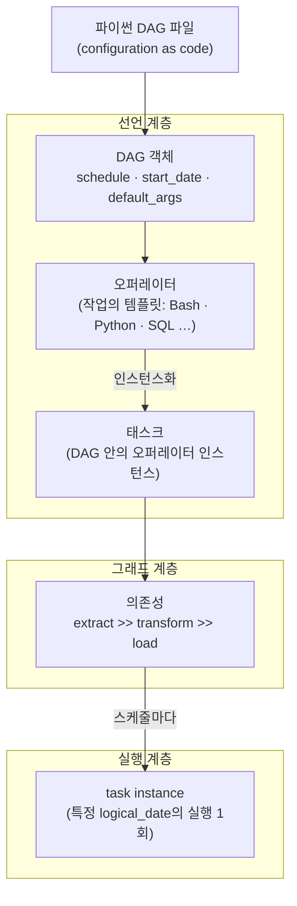

<figure class="post-figure post-figure--header">
<svg role="img" aria-label="DAG·오퍼레이터·태스크를 한 장으로 정리한 그림. 위쪽은 왼쪽의 파이썬 DAG 파일이 파싱되어 오른쪽의 방향성 비순환 그래프로 펼쳐지는 모습으로, extract가 두 개의 transform으로 팬아웃되고 다시 load로 팬인되며 의존성 화살표에는 >> 기호가 붙어 있다. 아래쪽은 BashOperator라는 템플릿에서 extract_orders·transform_sales·load_mart 세 태스크가 인스턴스화되어 찍혀 나오고, 각 태스크가 스케줄마다 논리 시각(7/10·7/11·7/12)별 task instance로 실행되는 구조다." viewBox="0 0 680 340" xmlns="http://www.w3.org/2000/svg">
  <title>파이프라인은 파이썬 코드다 — 코드가 그래프로 펼쳐지고, 템플릿에서 태스크가 찍혀 나온다</title>
  <defs>
    <marker id="dg-arrow" viewBox="0 0 10 10" refX="8" refY="5" markerWidth="6" markerHeight="6" orient="auto-start-reverse">
      <path d="M0,0 L10,5 L0,10 z" fill="var(--secondary-color)"/>
    </marker>
  </defs>

  <!-- ===== title ===== -->
  <text x="340" y="24" text-anchor="middle" font-size="15" font-weight="800" fill="currentColor">파이프라인은 파이썬 코드다 — DAG · 오퍼레이터 · 태스크</text>

  <!-- ===== SECTION A: code -> graph ===== -->
  <text x="30" y="50" text-anchor="start" font-size="10.5" font-weight="700" fill="currentColor" opacity="0.72">코드 한 장이 방향성 비순환 그래프로 펼쳐진다</text>

  <!-- python DAG file -->
  <rect x="24" y="62" width="184" height="132" rx="4" fill="var(--bg-light)" stroke="currentColor" stroke-width="2.5"/>
  <g font-size="8.5" fill="currentColor">
    <text x="36" y="80" font-weight="700" fill="var(--secondary-color)">with DAG(</text>
    <text x="44" y="94" opacity="0.85">schedule="@daily",</text>
    <text x="44" y="108" opacity="0.85">start_date=...):</text>
    <text x="40" y="126" opacity="0.85">extract = Bash(...)</text>
    <text x="40" y="140" opacity="0.85">transform = Bash(...)</text>
    <text x="40" y="154" opacity="0.85">load = Bash(...)</text>
  </g>
  <rect x="32" y="164" width="168" height="20" rx="3" fill="var(--bg-panel)" stroke="var(--gold)" stroke-width="1.5"/>
  <text x="116" y="178" text-anchor="middle" font-size="8.5" font-weight="800" fill="currentColor">extract &gt;&gt; transform &gt;&gt; load</text>
  <text x="116" y="210" text-anchor="middle" font-size="9" fill="currentColor" opacity="0.75">파이썬 DAG 파일</text>

  <!-- parse arrow -->
  <line x1="214" y1="128" x2="258" y2="128" stroke="var(--secondary-color)" stroke-width="2.5" marker-end="url(#dg-arrow)"/>
  <text x="236" y="119" text-anchor="middle" font-size="8.5" fill="currentColor" opacity="0.7">파싱</text>

  <!-- DAG graph: fan-out / fan-in -->
  <g stroke="var(--secondary-color)" stroke-width="1.8" fill="none">
    <line x1="297" y1="121" x2="349" y2="98" marker-end="url(#dg-arrow)"/>
    <line x1="297" y1="135" x2="349" y2="158" marker-end="url(#dg-arrow)"/>
    <line x1="380" y1="98" x2="432" y2="121" marker-end="url(#dg-arrow)"/>
    <line x1="380" y1="158" x2="432" y2="135" marker-end="url(#dg-arrow)"/>
  </g>
  <g font-size="10" font-weight="800" fill="var(--secondary-color)" text-anchor="middle">
    <text x="320" y="100">&gt;&gt;</text>
    <text x="320" y="162">&gt;&gt;</text>
    <text x="410" y="100">&gt;&gt;</text>
    <text x="410" y="162">&gt;&gt;</text>
  </g>
  <g fill="var(--bg-panel)" stroke="currentColor" stroke-width="2">
    <circle cx="285" cy="128" r="14"/>
    <circle cx="365" cy="91" r="14"/>
    <circle cx="365" cy="165" r="14"/>
    <circle cx="445" cy="128" r="14"/>
  </g>
  <g font-size="8.5" font-weight="700" fill="currentColor" text-anchor="middle">
    <text x="285" y="108">extract</text>
    <text x="365" y="71">transform_a</text>
    <text x="365" y="192">transform_b</text>
    <text x="445" y="108">load</text>
  </g>
  <text x="365" y="212" text-anchor="middle" font-size="9" fill="currentColor" opacity="0.75">DAG — 태스크 노드와 &gt;&gt; 의존성</text>

  <!-- ===== divider ===== -->
  <line x1="30" y1="224" x2="650" y2="224" stroke="currentColor" stroke-width="1.4" opacity="0.25"/>

  <!-- ===== SECTION B: operator -> task -> task instance ===== -->
  <text x="30" y="246" text-anchor="start" font-size="10.5" font-weight="700" fill="currentColor" opacity="0.72">오퍼레이터는 템플릿, 태스크는 DAG 안에 찍힌 인스턴스</text>

  <!-- operator template -->
  <rect x="24" y="262" width="148" height="52" rx="4" fill="var(--bg-light)" stroke="var(--gold)" stroke-width="2.5" stroke-dasharray="6 3"/>
  <text x="98" y="283" text-anchor="middle" font-size="11" font-weight="800" fill="currentColor">BashOperator</text>
  <text x="98" y="300" text-anchor="middle" font-size="8.5" fill="currentColor" opacity="0.7">작업의 템플릿 (클래스)</text>

  <!-- instantiation arrows -->
  <g stroke="var(--secondary-color)" stroke-width="2" fill="none">
    <line x1="176" y1="284" x2="230" y2="266" marker-end="url(#dg-arrow)"/>
    <line x1="176" y1="288" x2="230" y2="292" marker-end="url(#dg-arrow)"/>
    <line x1="176" y1="292" x2="230" y2="318" marker-end="url(#dg-arrow)"/>
  </g>
  <text x="203" y="258" text-anchor="middle" font-size="8.5" fill="currentColor" opacity="0.7">인스턴스화</text>

  <!-- task chips -->
  <g>
    <rect x="236" y="254" width="138" height="22" rx="3" fill="var(--bg-panel)" stroke="var(--secondary-color)" stroke-width="2"/>
    <rect x="236" y="281" width="138" height="22" rx="3" fill="var(--bg-panel)" stroke="var(--secondary-color)" stroke-width="2"/>
    <rect x="236" y="308" width="138" height="22" rx="3" fill="var(--bg-panel)" stroke="var(--secondary-color)" stroke-width="2"/>
  </g>
  <g font-size="9.5" font-weight="700" fill="currentColor" text-anchor="middle">
    <text x="305" y="269">extract_orders</text>
    <text x="305" y="296">transform_sales</text>
    <text x="305" y="323">load_mart</text>
  </g>
  <text x="305" y="248" text-anchor="middle" font-size="8.5" fill="currentColor" opacity="0.7">태스크 (task_id를 가진 인스턴스)</text>

  <!-- schedule arrow -->
  <line x1="380" y1="292" x2="424" y2="292" stroke="var(--secondary-color)" stroke-width="2" marker-end="url(#dg-arrow)"/>
  <text x="402" y="284" text-anchor="middle" font-size="8.5" fill="currentColor" opacity="0.7">스케줄마다</text>

  <!-- task instances per logical date -->
  <text x="524" y="264" text-anchor="middle" font-size="8.5" fill="currentColor" opacity="0.7">task instance — logical_date마다 실행 1회</text>
  <g fill="var(--bg-light)" stroke="currentColor" stroke-width="2">
    <rect x="432" y="272" width="56" height="36" rx="3"/>
    <rect x="496" y="272" width="56" height="36" rx="3"/>
    <rect x="560" y="272" width="56" height="36" rx="3"/>
  </g>
  <g font-size="9" font-weight="700" fill="currentColor" text-anchor="middle">
    <text x="460" y="287">7/10</text>
    <text x="524" y="287">7/11</text>
    <text x="588" y="287">7/12</text>
  </g>
  <g fill="none" stroke="var(--secondary-color)" stroke-width="2.2" stroke-linecap="round" stroke-linejoin="round">
    <polyline points="453,296 458,301 468,292"/>
    <polyline points="517,296 522,301 532,292"/>
    <polyline points="581,296 586,301 596,292"/>
  </g>
  <text x="524" y="326" text-anchor="middle" font-size="8.5" fill="currentColor" opacity="0.75">상태·로그·재시도는 이 칸 단위로 추적된다</text>
</svg>
<figcaption>파이썬 DAG 파일이 파싱되어 &gt;&gt; 의존성으로 이어진 그래프가 되고, 오퍼레이터(템플릿)에서 태스크(인스턴스)가 찍혀 나와 논리 시각마다 task instance로 실행된다</figcaption>
</figure>

## 들어가며

Airflow의 모든 것은 한 줄로 요약됩니다 — **파이프라인은 파이썬 코드다.** GUI에서 박스를 끌어다 놓는 대신, 개발자는 "무엇을, 어떤 순서로, 언제 실행할지"를 파이썬 파일 하나에 선언합니다. 그 선언의 문법이 바로 **DAG**(파이프라인의 뼈대), **오퍼레이터**(작업의 템플릿), **태스크**(DAG 안에 자리 잡은 작업 인스턴스)입니다.

이 세 개념은 단순한 API 어휘가 아닙니다. 이후 시리즈에서 만날 스케줄러가 큐에 넣는 단위도, Executor가 실행하는 단위도, 백필이 다시 채우는 단위도 전부 이 위에서 정의됩니다. 여기서 DAG의 그림을 정확히 쥐면, "왜 내 태스크가 안 도는가"를 진단할 때 볼 곳이 어디인지가 보입니다.

이 글은 [Airflow Essential Curriculum](/2026/07/12/airflow-essential-curriculum.html)의 1단계이자 시리즈 첫 막 "선언(1~3단계)"의 출발점입니다. 오버뷰 시리즈의 [오케스트레이션(Orchestration)](/2026/06/25/orchestration.html)에서 "왜 DAG인가"의 큰 틀을 잡았다면, 이번에는 Airflow라는 구체적 도구에서 그것이 **어떤 코드로 표현되는지**를 손에 잡히게 다룹니다.

<div class="post-summary-box" markdown="1">

### 📌 이 글에서 다루는 내용

- **DAG의 구조**: 방향성 비순환 그래프로 파이프라인을 모델링하는 이유, `schedule`·`start_date`·`default_args`, DAG 파일이 파싱되는 방식과 top-level code 주의점
- **오퍼레이터와 태스크**: 오퍼레이터=템플릿, 태스크=인스턴스, task instance=특정 논리 시각의 실행이라는 3단 구분, 의존성 정의(`>>`·`<<`·`chain()`)와 trigger_rule
- **configuration as code**: 파이프라인을 파이썬으로 선언하는 철학(버전 관리·리뷰·테스트), loop 기반 동적 태스크 생성과 dynamic task mapping(`expand()`) 맛보기

</div>

## 한눈에 보기 — 코드에서 실행까지

이 글의 스파인을 한 장으로 그리면 이렇습니다. 파이썬 파일에 선언된 DAG가 오퍼레이터를 찍어내 태스크로 배치하고, 태스크들이 의존성으로 이어진 그래프가 되며, 스케줄에 따라 각 논리 시각마다 task instance로 실행됩니다.





선언 계층(코드) → 그래프 계층(구조) → 실행 계층(런타임)의 3층 구조를 기억해 두세요. 이 글은 앞의 두 층을 다루고, 실행 계층의 내부(스케줄러·Executor)는 [다음 단계](/2026/07/13/airflow-scheduler-executor-internals.html)에서 파고듭니다.

## DAG의 구조 — 파이프라인을 그래프로 선언한다

### 왜 하필 방향성 비순환 그래프인가

DAG(Directed Acyclic Graph)의 두 제약은 장식이 아니라 실행 가능성의 조건입니다.

- **방향성(Directed)**: 의존은 한 방향입니다. "추출이 끝나야 변환"이지 그 반대가 아닙니다. 방향이 있어야 "무엇이 먼저인가"라는 질문에 답이 존재합니다.
- **비순환(Acyclic)**: 사이클이 없어야 합니다. A→B→A처럼 서로가 서로를 기다리면 어느 쪽도 영원히 시작할 수 없습니다. 사이클이 없는 방향 그래프에서만 **위상 정렬(topological sort)**이 가능하고, 그래야 스케줄러가 "지금 실행 가능한 태스크"를 항상 계산해 낼 수 있습니다.

이 두 제약의 대가로 얻는 것이 큽니다. 실행 순서가 **결정 가능**해지고, 서로 의존하지 않는 태스크는 **병렬성**이 그래프 구조에서 저절로 도출되며, 한 태스크가 실패하면 그 하류만 멈추는 **실패 국소화**가 따라옵니다. Airflow는 실제로 DAG 정의에서 사이클을 발견하면 import 단계에서 에러를 냅니다 — 그래프가 실행 가능함을 코드 로드 시점에 보장하는 것입니다.

### 최소한의 DAG 선언

Airflow 2.x/3.x 시대의 관용적 DAG 선언은 컨텍스트 매니저(`with DAG(...)`) 스타일입니다.

```python
from datetime import datetime, timedelta

from airflow import DAG
from airflow.operators.bash import BashOperator

# 여러 태스크가 공유할 기본 인자 — 각 태스크 생성 시 개별 지정으로 오버라이드 가능
default_args = {
    "owner": "data-team",
    "retries": 2,                              # 실패 시 2회 재시도
    "retry_delay": timedelta(minutes=5),       # 재시도 간격
}

with DAG(
    dag_id="daily_sales_pipeline",             # 전체 배포에서 유일해야 하는 식별자
    schedule="0 2 * * *",                      # 매일 02:00 (cron 표현식)
    start_date=datetime(2026, 7, 1),           # 첫 논리적 구간의 시작점
    catchup=False,                             # 과거 구간 자동 따라잡기 비활성화
    default_args=default_args,
    tags=["sales", "daily"],
) as dag:
    extract = BashOperator(
        task_id="extract_orders",
        bash_command="python /opt/pipelines/extract_orders.py",
    )

    transform = BashOperator(
        task_id="transform_sales",
        bash_command="python /opt/pipelines/transform_sales.py",
    )

    load = BashOperator(
        task_id="load_mart",
        bash_command="python /opt/pipelines/load_mart.py",
    )

    # 의존성: 추출 → 변환 → 적재
    extract >> transform >> load
```

세 개의 핵심 파라미터를 정확히 이해해야 합니다.

- **`schedule`**: DAG를 얼마나 자주 돌릴지입니다. cron 표현식(`"0 2 * * *"`), `timedelta`, `"@daily"` 같은 프리셋, 그리고 3.x에서 중심이 되는 asset(데이터셋) 기반 트리거까지 받습니다. `schedule=None`이면 수동/외부 트리거로만 돕니다. (과거 이름인 `schedule_interval`은 deprecated — 지금은 `schedule` 하나로 씁니다.)
- **`start_date`**: "첫 논리적 구간이 언제부터 시작하는가"입니다. 주의할 점은, 이것이 "DAG가 처음 도는 벽시계 시각"이 아니라는 것입니다. Airflow의 각 실행은 **논리적 시각(`logical_date`)**에 묶여 있고, `start_date`는 그 논리적 시간축의 원점입니다. (이 어휘도 옛 이름 `execution_date`에서 `logical_date`로 바뀌었습니다.) 논리적 구간의 정확한 의미는 5단계 백필·catchup에서 본격적으로 다룹니다.
- **`default_args`**: `retries`, `retry_delay`, `owner`처럼 **태스크 레벨** 인자의 기본값 묶음입니다. DAG 파라미터가 아니라 "이 DAG의 모든 태스크에 깔리는 기본값"이라는 점이 자주 혼동됩니다.

`catchup=False`도 눈여겨보세요. 기본값(True)이면 `start_date`부터 현재까지 놓친 모든 논리 구간을 자동으로 따라잡으려 합니다. 멱등 설계가 갖춰지기 전에는 의도치 않은 대량 실행을 부르기 쉬워, 실무에서는 명시적으로 끄고 시작하는 경우가 많습니다.

### DAG 파일은 어떻게 읽히는가 — 파싱과 top-level code

여기가 초심자가 가장 자주 데이는 지점입니다. **DAG 파일은 설정 파일이 아니라 파이썬 모듈입니다.** Airflow의 DAG 프로세서는 DAG 디렉토리의 파일들을 **주기적으로(기본 수십 초 간격) import**해서 그 안의 `DAG` 객체를 수집합니다. 즉 여러분이 쓴 파일의 **top-level 코드는 태스크가 실행될 때가 아니라, 파싱될 때마다 반복 실행**됩니다.

<figure class="post-figure">
<svg role="img" aria-label="DAG 파일 코드가 실행되는 두 시점을 대비한 개념도. 왼쪽 패널은 파싱 시점으로, DAG 프로세서가 수십 초마다 파일을 반복 import하기 때문에 top-level의 requests.get 같은 무거운 호출이 그때마다 실행되어 경고 표시가 붙어 있다. 오른쪽 패널은 태스크 실행 시점으로, 함수(callable) 내부의 코드는 스케줄된 실행에서만 워커 위에서 돌아 체크 표시가 붙어 있다. 아래에는 '선언은 가볍게, 일은 태스크 안에서'라는 원칙이 적혀 있다." viewBox="0 0 680 300" xmlns="http://www.w3.org/2000/svg">
  <title>DAG 파일의 두 실행 시점 — 파싱(반복)과 태스크 실행(스케줄마다 1회)</title>
  <defs>
    <marker id="tl-arrow" viewBox="0 0 10 10" refX="8" refY="5" markerWidth="6" markerHeight="6" orient="auto-start-reverse">
      <path d="M0,0 L10,5 L0,10 z" fill="currentColor"/>
    </marker>
  </defs>

  <text x="340" y="24" text-anchor="middle" font-size="15" font-weight="800" fill="currentColor">DAG 파일 코드가 실행되는 두 시점</text>

  <!-- ===== LEFT: parse time ===== -->
  <rect x="16" y="40" width="316" height="212" rx="6" fill="var(--bg-light)" stroke="var(--accent-color)" stroke-width="2.5"/>
  <text x="174" y="62" text-anchor="middle" font-size="12" font-weight="800" fill="var(--accent-color)">파싱 시점 — DAG 프로세서</text>
  <text x="174" y="78" text-anchor="middle" font-size="9" fill="currentColor" opacity="0.72">수십 초 간격으로 파일 전체를 import</text>

  <!-- clock + repeat loop -->
  <path d="M66,102 A20,20 0 1 1 36,105" fill="none" stroke="var(--accent-color)" stroke-width="2" marker-end="url(#tl-arrow)"/>
  <circle cx="52" cy="116" r="13" fill="var(--bg-panel)" stroke="currentColor" stroke-width="2"/>
  <line x1="52" y1="116" x2="52" y2="108" stroke="currentColor" stroke-width="2" stroke-linecap="round"/>
  <line x1="52" y1="116" x2="58" y2="118" stroke="currentColor" stroke-width="2" stroke-linecap="round"/>
  <text x="52" y="150" text-anchor="middle" font-size="8" fill="currentColor" opacity="0.75">수십 초마다</text>
  <text x="52" y="160" text-anchor="middle" font-size="8" fill="currentColor" opacity="0.75">import 반복</text>

  <line x1="76" y1="116" x2="90" y2="116" stroke="currentColor" stroke-width="2" opacity="0.6" marker-end="url(#tl-arrow)"/>

  <!-- file sheet -->
  <rect x="96" y="90" width="220" height="122" rx="3" fill="var(--bg-panel)" stroke="currentColor" stroke-width="2"/>
  <g font-size="9" fill="currentColor">
    <text x="108" y="110">config = requests.get(...)</text>
    <text x="108" y="126" font-size="8" font-weight="700" fill="var(--accent-color)"># top-level — 파싱 때마다 실행!</text>
  </g>
  <polygon points="292,98 301,113 283,113" fill="var(--bg-panel)" stroke="var(--accent-color)" stroke-width="2" stroke-linejoin="round"/>
  <text x="292" y="111" text-anchor="middle" font-size="8.5" font-weight="800" fill="var(--accent-color)">!</text>
  <line x1="104" y1="138" x2="308" y2="138" stroke="currentColor" stroke-width="1.2" opacity="0.3"/>
  <g font-size="9" fill="currentColor">
    <text x="108" y="156">with DAG(...):</text>
    <text x="108" y="172" opacity="0.85">&#160;&#160;extract = Bash(...)</text>
    <text x="108" y="188" opacity="0.85">&#160;&#160;extract &gt;&gt; load</text>
    <text x="108" y="205" font-size="8" font-weight="700" fill="var(--secondary-color)"># 구조 선언만 — 가볍게</text>
  </g>
  <text x="174" y="238" text-anchor="middle" font-size="9" font-weight="700" fill="var(--accent-color)">top-level의 무거운 일은 파싱마다 반복 실행된다</text>

  <!-- ===== RIGHT: task execution time ===== -->
  <rect x="348" y="40" width="316" height="212" rx="6" fill="var(--bg-light)" stroke="var(--secondary-color)" stroke-width="2.5"/>
  <text x="506" y="62" text-anchor="middle" font-size="12" font-weight="800" fill="var(--secondary-color)">태스크 실행 시점 — 워커</text>
  <text x="506" y="78" text-anchor="middle" font-size="9" fill="currentColor" opacity="0.72">스케줄된 실행에서만, 워커 위에서 1회</text>

  <!-- worker box -->
  <rect x="380" y="90" width="252" height="122" rx="3" fill="var(--bg-panel)" stroke="currentColor" stroke-width="2"/>
  <text x="392" y="106" font-size="8.5" font-weight="700" fill="currentColor" opacity="0.7">워커 — execute() / callable</text>
  <g font-size="9" fill="currentColor">
    <text x="392" y="128">def fetch_and_process():</text>
    <text x="392" y="144">&#160;&#160;config = requests.get(...)</text>
    <text x="392" y="160">&#160;&#160;...</text>
    <text x="392" y="188" font-size="8" font-weight="700" fill="var(--secondary-color)"># 실제 일은 함수 본문 안에서</text>
    <text x="392" y="203" font-size="8" fill="currentColor" opacity="0.75"># 태스크가 실제로 돌 때만 실행된다</text>
  </g>
  <circle cx="600" cy="140" r="14" fill="var(--bg-light)" stroke="var(--secondary-color)" stroke-width="2.5"/>
  <polyline points="593,140 598,146 608,133" fill="none" stroke="var(--secondary-color)" stroke-width="2.5" stroke-linecap="round" stroke-linejoin="round"/>
  <text x="506" y="238" text-anchor="middle" font-size="9" font-weight="700" fill="var(--secondary-color)">무거운 import·호출은 함수 안으로 미룬다</text>

  <!-- ===== principle ===== -->
  <rect x="200" y="264" width="280" height="28" rx="4" fill="var(--bg-panel)" stroke="var(--gold)" stroke-width="2"/>
  <text x="340" y="283" text-anchor="middle" font-size="11.5" font-weight="800" fill="currentColor">선언은 가볍게, 일은 태스크 안에서</text>
</svg>
<figcaption>같은 파일이라도 top-level 코드는 파싱 때마다 반복 실행되고, 오퍼레이터의 실행 로직은 태스크가 돌 때만 워커에서 실행된다</figcaption>
</figure>

```python
import requests
from airflow import DAG

# ❌ 나쁜 예: top-level에서 무거운 일을 한다.
# 이 API 호출은 태스크 실행 때가 아니라, DAG 프로세서가
# 파일을 파싱할 때마다(수십 초 간격으로 계속!) 실행된다.
config = requests.get("https://config-server/api/pipelines").json()

with DAG(dag_id="bad_example", ...) as dag:
    ...
```

```python
from airflow import DAG
from airflow.operators.python import PythonOperator

# ✅ 좋은 예: 무거운 일은 함수 안으로 미룬다.
# 이 함수의 본문은 태스크가 실제 실행될 때만 워커에서 돈다.
def fetch_and_process():
    import requests  # 무거운 import도 함수 안으로 미루면 파싱이 가벼워진다
    config = requests.get("https://config-server/api/pipelines").json()
    ...

with DAG(dag_id="good_example", ...) as dag:
    process = PythonOperator(
        task_id="fetch_and_process",
        python_callable=fetch_and_process,
    )
```

원칙은 하나입니다 — **top-level에는 "구조 선언"만, 실제 일은 태스크(오퍼레이터의 실행 로직) 안에**. top-level에서 DB를 조회하거나 API를 부르면 파싱이 느려지고, 파싱이 느려지면 스케줄러의 반응 전체가 느려집니다. DAG 파일은 "빠르게 import되어 그래프 모양만 알려주는 가벼운 모듈"이어야 합니다.

## 오퍼레이터와 태스크 — 템플릿, 인스턴스, 그리고 실행

### 세 단어의 정확한 구분

Airflow 문서와 커뮤니티에서 operator/task/task instance가 뒤섞여 쓰이곤 하지만, 개념은 명확히 3단으로 갈립니다.

| 개념 | 정체 | 비유 |
| --- | --- | --- |
| **오퍼레이터(Operator)** | "어떤 종류의 일을 하는가"의 템플릿 (파이썬 클래스) | 클래스 |
| **태스크(Task)** | DAG 안에 `task_id`를 갖고 자리 잡은 오퍼레이터 인스턴스 | 객체 |
| **태스크 인스턴스(Task Instance)** | 특정 DAG run — 즉 특정 `logical_date` — 에서의 그 태스크의 실행 1회 | 객체의 메서드 호출 1회 |

`BashOperator`는 "셸 명령을 실행한다"는 템플릿이고, `extract = BashOperator(task_id="extract_orders", ...)`는 이 DAG의 태스크이며, "7월 12일 구간에 대한 `extract_orders`의 실행"이 task instance입니다. 같은 태스크라도 논리 시각마다 별개의 task instance가 만들어지고, 상태(queued → running → success/failed)와 로그와 재시도 횟수는 **task instance 단위**로 추적됩니다. 이 구분이 서면 UI의 그리드 뷰가 곧장 읽힙니다 — 행이 태스크, 칸 하나하나가 task instance입니다.

### 대표 오퍼레이터와 프로바이더 생태계

```python
from datetime import datetime

from airflow import DAG
from airflow.operators.bash import BashOperator
from airflow.operators.python import PythonOperator
# SQL 계열·클라우드 연동은 프로바이더 패키지에서 온다
from airflow.providers.common.sql.operators.sql import SQLExecuteQueryOperator

def summarize(**context):
    # context에는 logical_date 등 이 실행의 메타데이터가 담겨 온다
    print(f"이 실행이 책임지는 논리 시각: {context['logical_date']}")

with DAG(dag_id="operator_zoo", schedule="@daily",
         start_date=datetime(2026, 7, 1), catchup=False) as dag:

    # 1) BashOperator — 셸 명령 실행. 가장 범용적
    dump = BashOperator(
        task_id="dump_source",
        bash_command="pg_dump ... > /data/dump.sql",
    )

    # 2) PythonOperator — 파이썬 callable 실행
    report = PythonOperator(
        task_id="summarize",
        python_callable=summarize,
    )

    # 3) SQL 계열 — Connection에 등록된 DB에 쿼리 실행
    agg = SQLExecuteQueryOperator(
        task_id="aggregate_sales",
        conn_id="warehouse",
        sql="sql/aggregate_sales.sql",   # 파일 경로도 받는다 (Jinja 템플릿 지원)
    )

    dump >> agg >> report
```

핵심 오퍼레이터군은 세 갈래로 기억하면 됩니다.

- **BashOperator**: 셸 명령 실행. 기존 스크립트를 가장 빨리 Airflow에 얹는 길.
- **PythonOperator**: 파이썬 함수 실행. 3단계에서 다룰 TaskFlow API(`@task`)의 원형이기도 합니다.
- **SQL 계열**: 웨어하우스·DB에 쿼리를 던지는 오퍼레이터들. `sql` 인자는 Jinja 템플릿이 적용되어 `{{ ds }}` 같은 논리 시각 변수를 주입할 수 있습니다.

그리고 그 바깥에 **프로바이더(provider) 생태계**가 있습니다. Amazon·Google·Snowflake·Databricks·dbt·Kubernetes 등 90개가 넘는 프로바이더 패키지가 각 시스템 전용 오퍼레이터·훅·센서를 제공합니다(`pip install apache-airflow-providers-amazon` 식으로 설치). "X와 연동해야 하는데"라는 상황의 답은 대부분 "이미 프로바이더에 오퍼레이터가 있다"입니다 — 직접 짜기 전에 프로바이더 문서부터 찾는 습관이 이득입니다.

### 의존성 정의 — `>>`, `<<`, `chain()`

태스크를 그래프로 잇는 문법은 비트 시프트 연산자를 오버로딩한 `>>`(오른쪽이 하류)와 `<<`(왼쪽이 하류)입니다.

```python
from airflow.models.baseoperator import chain

# 직렬: extract가 성공해야 transform이, transform이 성공해야 load가 돈다
extract >> transform >> load

# 팬아웃: extract가 끝나면 두 변환이 병렬로 돈다 (리스트로 잇는다)
extract >> [transform_a, transform_b]

# 팬인: 두 변환이 모두 끝나야 load가 돈다
[transform_a, transform_b] >> load

# << 는 방향만 반대 — load << transform 은 transform >> load 와 같다

# chain(): 긴 직렬이나 리스트 간 병렬 연결을 한 번에
chain(extract, [transform_a, transform_b], load, notify)
# extract >> [a, b] >> load >> notify 와 동일
```

리스트를 쓰면 병렬 가지(팬아웃/팬인)가 자연스럽게 표현되고, 서로 의존하지 않는 태스크들은 스케줄러가 알아서 동시에 돌립니다 — 병렬성은 별도 설정이 아니라 **그래프 모양에서 도출**됩니다. `chain()`은 태스크 목록을 loop로 만들어 이을 때 특히 유용합니다(뒤의 동적 DAG 생성에서 다시 만납니다).

### trigger_rule — "상류가 어떤 상태여야 시작하는가"

기본 규칙은 `all_success` — 모든 직속 상류 태스크가 성공해야 시작합니다. 하지만 항상 그걸 원하는 것은 아닙니다.

```python
from airflow.operators.bash import BashOperator

# 상류가 실패했어도(성공이든 실패든 "완료"만 되면) 반드시 도는 정리 태스크
cleanup = BashOperator(
    task_id="cleanup_temp",
    bash_command="rm -rf /tmp/pipeline_work/",
    trigger_rule="all_done",     # 기본값은 "all_success"
)

[transform_a, transform_b] >> cleanup
```

자주 쓰는 규칙만 짚으면 — `all_success`(기본), `all_done`(성공/실패 무관 완료), `one_success`(하나라도 성공하면), `one_failed`(하나라도 실패하면 — 알림 태스크에 유용), `none_failed`(실패만 없으면; 스킵은 허용) 정도입니다. 임시 파일 정리, 실패 알림, 분기 후 합류 지점 처리 같은 패턴이 전부 trigger_rule로 표현됩니다. 지금은 "의존성 화살표에는 조건을 달 수 있다"는 것만 기억해 두면 충분합니다.

## Configuration as Code — 파이프라인이 코드라는 것의 의미

### 철학: 왜 GUI가 아니라 파이썬인가

Airflow가 파이프라인 정의를 파이썬 코드로 요구하는 것은 취향이 아니라 설계 철학입니다. 파이프라인이 코드가 되는 순간, 소프트웨어 엔지니어링의 도구 상자 전체가 따라옵니다.

- **버전 관리**: DAG 파일은 git에 들어갑니다. "지난주 파이프라인은 어떻게 생겼었나"가 `git log`로 답해지고, 잘못된 변경은 revert로 되돌립니다.
- **코드 리뷰**: 파이프라인 변경이 PR이 됩니다. "이 태스크 순서 바꾸면 하류가 깨지지 않나?"를 머지 전에 사람이 검토합니다.
- **테스트**: DAG 파일이 파이썬 모듈이므로 import해서 검증할 수 있습니다 — "사이클이 없는가", "필수 인자가 다 있는가", "태스크 수가 기대와 맞는가"를 CI에서 돌립니다.
- **추상화와 재사용**: 반복되는 패턴을 함수·클래스로 뽑아내고, 팀 공통 오퍼레이터를 만들어 공유합니다. GUI 도구에서는 불가능한 수준의 DRY가 가능해집니다.

```python
# tests/test_dag_integrity.py — CI에서 도는 DAG 무결성 테스트의 전형
import pytest
from airflow.models import DagBag

@pytest.fixture(scope="session")
def dagbag():
    # DAG 디렉토리 전체를 import해 본다 — 파싱 에러·사이클이 여기서 잡힌다
    return DagBag(include_examples=False)

def test_no_import_errors(dagbag):
    assert dagbag.import_errors == {}, f"DAG import 실패: {dagbag.import_errors}"

def test_daily_sales_pipeline_shape(dagbag):
    dag = dagbag.get_dag("daily_sales_pipeline")
    assert dag is not None
    assert len(dag.tasks) == 3
    # 모든 태스크에 재시도가 설정되어 있는지 — 팀 규칙을 테스트로 강제
    for task in dag.tasks:
        assert task.retries >= 1, f"{task.task_id}에 retries가 없다"
```

파이프라인 변경이 "관리 화면에서 클릭 몇 번"이 아니라 "리뷰와 테스트를 통과한 커밋"이 된다는 것 — 이것이 configuration as code의 실질입니다.

### 동적 DAG 생성 — 선언을 loop로 찍어내기

파이프라인이 코드이므로, 비슷한 구조의 태스크 수십 개를 loop로 생성할 수 있습니다. 파싱 시점에 그래프 모양이 코드로 결정되는 것입니다.

```python
from airflow import DAG
from airflow.operators.bash import BashOperator
from airflow.models.baseoperator import chain
from datetime import datetime

# 테이블 목록만 바꾸면 그래프가 따라 바뀐다
SOURCE_TABLES = ["orders", "payments", "customers", "products"]

with DAG(
    dag_id="ingest_all_tables",
    schedule="@daily",
    start_date=datetime(2026, 7, 1),
    catchup=False,
) as dag:
    start = BashOperator(task_id="start", bash_command="echo start")
    done = BashOperator(task_id="done", bash_command="echo done")

    for table in SOURCE_TABLES:
        # 테이블마다 추출 → 적재 2단 태스크를 찍어낸다 (task_id는 유일해야 한다)
        extract = BashOperator(
            task_id=f"extract_{table}",
            bash_command=f"python extract.py --table {table}",
        )
        load = BashOperator(
            task_id=f"load_{table}",
            bash_command=f"python load.py --table {table}",
        )
        chain(start, extract, load, done)   # start → extract → load → done
```

테이블 4개면 태스크 10개짜리 DAG, 목록에 하나 추가하면 12개짜리 DAG — 선언이 코드이기에 가능한 확장입니다. 단, 앞서 본 파싱 규칙이 여기서도 적용됩니다. **목록의 출처는 파싱이 감당할 만큼 가벼워야** 합니다(모듈 상수, 작은 YAML/JSON 파일 정도). 목록을 얻으려고 top-level에서 DB를 조회하면 그 쿼리가 수십 초마다 실행됩니다.

### Dynamic task mapping — 런타임에 펼쳐지는 태스크, `expand()`

loop 방식에는 한계가 있습니다 — 그래프 모양이 **파싱 시점**에 고정됩니다. "오늘 도착한 파일들 각각에 대해 태스크 하나씩"처럼 **런타임에야 개수를 아는** 경우에는 dynamic task mapping이 답입니다.

```python
from airflow.decorators import task

@task
def list_files() -> list[str]:
    # 실행 시점에 오늘 도착한 파일 목록을 구한다 — 개수는 그날그날 다르다
    return ["s3://bucket/a.csv", "s3://bucket/b.csv", "s3://bucket/c.csv"]

@task
def process(path: str) -> None:
    print(f"processing {path}")

# expand(): 상류의 반환 리스트 원소 하나당 task instance 하나가
# 런타임에 동적으로 생성된다 — 오늘 3개면 3개, 내일 50개면 50개
process.expand(path=list_files())
```

`expand()`는 상류가 반환한 리스트의 원소마다 task instance를 하나씩 **실행 시점에** 만들어 병렬로 돌립니다. 파싱 시점 loop가 "정적 팬아웃"이라면, mapping은 "동적 팬아웃"입니다. 여기서 쓰인 `@task` 데코레이터와 함수 반환값이 하류로 흘러가는 메커니즘(XCom)은 3단계 [XCom·TaskFlow API]에서 본격적으로 다룹니다 — 지금은 "그래프 모양을 런타임 데이터가 결정할 수도 있다"는 가능성만 챙겨 두세요.

## 정리

Airflow의 1층을 다졌습니다. 요점을 정리하면 다음과 같습니다.

- **DAG는 실행 가능성의 계약이다**: 방향성과 비순환이라는 두 제약 덕분에 실행 순서가 결정 가능해지고, 병렬성과 실패 국소화가 그래프 구조에서 저절로 도출됩니다. `schedule`은 얼마나 자주, `start_date`는 논리적 시간축의 원점, `default_args`는 태스크 레벨 기본값입니다.
- **DAG 파일은 파이썬 모듈이고, 계속 다시 import된다**: top-level 코드는 파싱 때마다 반복 실행됩니다. 선언은 가볍게, 실제 일은 태스크 안에 — 이 원칙 하나가 스케줄러 성능 문제의 절반을 예방합니다.
- **오퍼레이터 → 태스크 → task instance의 3단을 구분하라**: 템플릿(클래스), DAG 안의 인스턴스, 특정 `logical_date`의 실행 1회. 상태·로그·재시도는 task instance 단위로 추적됩니다. Bash·Python·SQL 계열이 기본기이고, 그 너머는 프로바이더 생태계에서 찾습니다.
- **의존성은 `>>`·`<<`·`chain()`으로, 조건은 trigger_rule로**: 리스트로 팬아웃/팬인을 표현하고, `all_done`·`one_failed` 같은 규칙으로 정리·알림 태스크를 답니다.
- **파이프라인은 코드다**: 버전 관리·리뷰·테스트가 따라오고, loop로 그래프를 찍어내며(정적), `expand()`로 런타임 데이터가 그래프를 펼치게(동적) 할 수 있습니다.

이제 "무엇을 어떤 순서로"의 선언은 손에 들어왔습니다. 다음 질문은 자연스럽게 이것입니다 — **그 선언을 누가 읽고, 언제 큐에 넣고, 어디서 실행하는가?** 스케줄러의 스케줄링 루프와 Local·Celery·Kubernetes Executor의 내부가 다음 단계의 주제입니다.

### 다음 학습 (Next Learning)

- [Airflow 스케줄러 · Executor 내부](/2026/07/13/airflow-scheduler-executor-internals.html) — 2단계: 선언된 DAG를 무엇이 언제 어떻게 실행하는가
- [Airflow Essential Curriculum](/2026/07/12/airflow-essential-curriculum.html) — 시리즈 로드맵으로 돌아가 진행 상황 확인하기
- [오케스트레이션(Orchestration): DAG·스케줄링과 견고한 파이프라인](/2026/06/25/orchestration.html) — 이 시리즈가 갈라져 나온 오버뷰 단계
