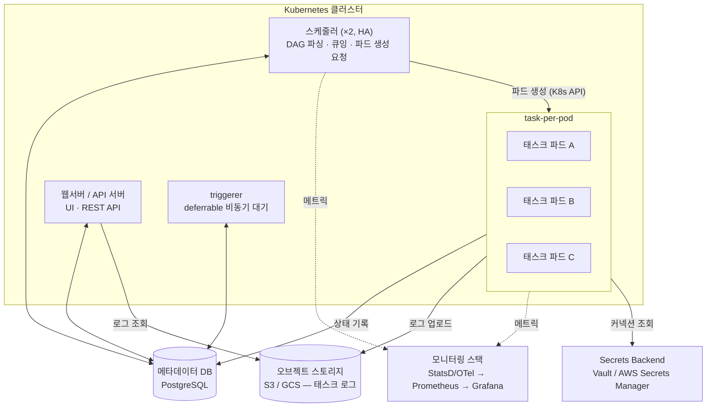

<figure class="post-figure post-figure--header">
<svg role="img" aria-label="프로덕션 Airflow 배포 아키텍처를 한 장으로 그린 그림. 점선으로 표시된 Kubernetes 클러스터 안에 스케줄러 두 개(HA), 웹서버/API, triggerer가 서 있고, 스케줄러가 태스크마다 전용 파드를 생성해 파드 A·B가 실행 중이며 파드 C는 완료 후 소멸한다. 클러스터 아래에는 모든 상태가 모이는 금색 메타데이터 DB(PostgreSQL)가 심장처럼 놓여 있고, 오른쪽으로는 태스크 로그가 S3/GCS 오브젝트 스토리지로 업로드되고 메트릭이 모니터링 대시보드(StatsD/OTel → Prometheus → Grafana)로 흘러간다." viewBox="0 0 680 360" xmlns="http://www.w3.org/2000/svg">
  <title>프로덕션 Airflow — Kubernetes 위의 배포·모니터링·로깅 아키텍처</title>
  <defs>
    <marker id="afd-a" viewBox="0 0 10 10" refX="8" refY="5" markerWidth="6" markerHeight="6" orient="auto-start-reverse">
      <path d="M0,0 L10,5 L0,10 z" fill="var(--secondary-color)"/>
    </marker>
    <marker id="afd-g" viewBox="0 0 10 10" refX="8" refY="5" markerWidth="6" markerHeight="6" orient="auto-start-reverse">
      <path d="M0,0 L10,5 L0,10 z" fill="var(--gold)"/>
    </marker>
  </defs>

  <!-- ===== title ===== -->
  <text x="340" y="24" text-anchor="middle" font-size="17" font-weight="800" fill="currentColor" letter-spacing="1.5">AIRFLOW IN PRODUCTION</text>

  <!-- ===== Kubernetes cluster ===== -->
  <rect x="24" y="42" width="402" height="210" rx="6" fill="var(--bg-light)" stroke="currentColor" stroke-width="2" stroke-dasharray="7 5"/>
  <text x="38" y="62" font-size="11" font-weight="700" fill="currentColor" opacity="0.8">Kubernetes 클러스터</text>

  <!-- scheduler x2 (HA) -->
  <rect x="48" y="84" width="118" height="44" rx="3" fill="var(--bg-panel)" stroke="currentColor" stroke-width="1.5" opacity="0.55"/>
  <rect x="40" y="76" width="118" height="44" rx="3" fill="var(--bg-panel)" stroke="currentColor" stroke-width="2.5"/>
  <text x="99" y="95" text-anchor="middle" font-size="11.5" font-weight="700" fill="currentColor">스케줄러 ×2</text>
  <text x="99" y="110" text-anchor="middle" font-size="8.5" fill="currentColor" opacity="0.7">파싱 · 큐잉 · HA</text>

  <!-- webserver -->
  <rect x="40" y="142" width="126" height="38" rx="3" fill="var(--bg-panel)" stroke="currentColor" stroke-width="2"/>
  <text x="103" y="158" text-anchor="middle" font-size="11" font-weight="700" fill="currentColor">웹서버 / API</text>
  <text x="103" y="172" text-anchor="middle" font-size="8.5" fill="currentColor" opacity="0.7">UI · REST</text>

  <!-- triggerer -->
  <rect x="40" y="196" width="126" height="38" rx="3" fill="var(--bg-panel)" stroke="currentColor" stroke-width="2"/>
  <text x="103" y="212" text-anchor="middle" font-size="11" font-weight="700" fill="currentColor">triggerer</text>
  <text x="103" y="226" text-anchor="middle" font-size="8.5" fill="currentColor" opacity="0.7">deferrable 대기</text>

  <!-- task-per-pod -->
  <text x="318" y="80" text-anchor="middle" font-size="10.5" font-weight="700" fill="currentColor" opacity="0.82">task-per-pod</text>
  <rect x="232" y="92" width="76" height="46" rx="4" fill="var(--bg-panel)" stroke="var(--secondary-color)" stroke-width="2"/>
  <text x="270" y="112" text-anchor="middle" font-size="10.5" font-weight="700" fill="currentColor">파드 A</text>
  <text x="270" y="126" text-anchor="middle" font-size="8" fill="currentColor" opacity="0.7">실행 중</text>
  <rect x="328" y="92" width="76" height="46" rx="4" fill="var(--bg-panel)" stroke="var(--secondary-color)" stroke-width="2"/>
  <text x="366" y="112" text-anchor="middle" font-size="10.5" font-weight="700" fill="currentColor">파드 B</text>
  <text x="366" y="126" text-anchor="middle" font-size="8" fill="currentColor" opacity="0.7">실행 중</text>
  <rect x="280" y="156" width="76" height="46" rx="4" fill="var(--bg-panel)" stroke="currentColor" stroke-width="2" stroke-dasharray="5 4" opacity="0.55"/>
  <text x="318" y="176" text-anchor="middle" font-size="10.5" font-weight="700" fill="currentColor" opacity="0.7">파드 C</text>
  <text x="318" y="190" text-anchor="middle" font-size="8" fill="currentColor" opacity="0.6">완료 → 소멸</text>

  <!-- scheduler -> pods -->
  <g stroke="var(--secondary-color)" stroke-width="2" fill="none">
    <line x1="170" y1="98" x2="226" y2="108" marker-end="url(#afd-a)"/>
    <line x1="170" y1="112" x2="274" y2="164" marker-end="url(#afd-a)"/>
  </g>
  <text x="198" y="92" text-anchor="middle" font-size="8.5" fill="currentColor" opacity="0.75">파드 생성</text>

  <!-- ===== metadata DB (the heart) ===== -->
  <line x1="200" y1="256" x2="200" y2="274" stroke="var(--gold)" stroke-width="2.5" marker-start="url(#afd-g)" marker-end="url(#afd-g)"/>
  <text x="212" y="269" text-anchor="start" font-size="8.5" font-weight="700" fill="currentColor" opacity="0.8">모든 상태</text>
  <path d="M138,292 L138,328 A62,12 0 0 0 262,328 L262,292" fill="var(--bg-panel)" stroke="var(--gold)" stroke-width="2.5"/>
  <ellipse cx="200" cy="292" rx="62" ry="12" fill="var(--bg-panel)" stroke="var(--gold)" stroke-width="2.5"/>
  <text x="200" y="318" text-anchor="middle" font-size="10.5" font-weight="700" fill="currentColor">메타데이터 DB</text>
  <text x="274" y="314" text-anchor="start" font-size="8.5" fill="currentColor" opacity="0.75">PostgreSQL · 상태의 단일 진실 원천</text>

  <!-- ===== object storage (logs) ===== -->
  <rect x="470" y="76" width="186" height="56" rx="4" fill="var(--bg-panel)" stroke="currentColor" stroke-width="2"/>
  <text x="563" y="98" text-anchor="middle" font-size="11" font-weight="700" fill="currentColor">오브젝트 스토리지</text>
  <text x="563" y="114" text-anchor="middle" font-size="8.5" fill="currentColor" opacity="0.75">S3 / GCS — 태스크 로그</text>
  <line x1="408" y1="112" x2="466" y2="104" stroke="var(--secondary-color)" stroke-width="2" marker-end="url(#afd-a)"/>
  <text x="436" y="98" text-anchor="middle" font-size="8" fill="currentColor" opacity="0.75">로그 업로드</text>

  <!-- ===== monitoring ===== -->
  <rect x="470" y="170" width="186" height="66" rx="4" fill="var(--bg-panel)" stroke="var(--accent-color)" stroke-width="2"/>
  <text x="563" y="190" text-anchor="middle" font-size="11" font-weight="700" fill="currentColor">모니터링 대시보드</text>
  <polyline points="486,222 506,214 522,224 542,202 558,212 580,198 600,206 624,194" fill="none" stroke="var(--accent-color)" stroke-width="2" stroke-linecap="round" stroke-linejoin="round"/>
  <text x="563" y="252" text-anchor="middle" font-size="8.5" fill="currentColor" opacity="0.7">StatsD / OTel → Prometheus → Grafana</text>
  <line x1="430" y1="202" x2="466" y2="202" stroke="var(--secondary-color)" stroke-width="2" stroke-dasharray="4 3" marker-end="url(#afd-a)"/>
  <text x="448" y="194" text-anchor="middle" font-size="8" fill="currentColor" opacity="0.75">메트릭</text>
</svg>
<figcaption>프로덕션 Airflow 한 장 — K8s 클러스터 안의 스케줄러(HA)·웹서버·triggerer와 task-per-pod, 심장인 메타데이터 DB, 그리고 로그는 오브젝트 스토리지로 · 메트릭은 모니터링 스택으로</figcaption>
</figure>

## 들어가며

지금까지 다섯 단계에 걸쳐 우리는 파이프라인을 **선언**하는 법(DAG·오퍼레이터, 스케줄러·Executor 내부, XCom·TaskFlow)과 **견고하게** 만드는 법(센서·deferrable, 백필·catchup·멱등)을 익혔습니다. 5단계 [백필 · Catchup · 멱등](/2026/07/13/airflow-backfill-catchup-idempotency.html)에서 "재실행해도 안전한 파이프라인"의 설계 원칙까지 손에 쥐었으니, 이제 남은 질문은 하나입니다 — **이 Airflow를 어디에, 어떻게 올려서, 무엇을 보며 운영할 것인가.**

로컬에서 `airflow standalone`으로 돌아가는 Airflow와 프로덕션의 Airflow는 전혀 다른 물건입니다. 프로덕션에서는 스케줄러가 죽어도 파이프라인이 멈추지 않아야 하고, 워커 파드가 사라져도 태스크 로그를 찾을 수 있어야 하며, "어젯밤 DAG가 왜 3시간 늦게 끝났는가"를 메트릭과 UI로 짚어낼 수 있어야 합니다. 이 글은 `Airflow-Essential` 시리즈의 **마지막 6단계**로([Airflow Essential Curriculum](/2026/07/12/airflow-essential-curriculum.html)), Kubernetes 위의 배포 아키텍처와 KubernetesExecutor, 모니터링·로깅, 그리고 운영 견고성을 다뤄 시리즈를 완주합니다.

<div class="post-summary-box" markdown="1">

### 📌 이 글에서 다루는 내용

- **배포와 KubernetesExecutor**: 프로덕션 구성 요소(스케줄러·웹서버·워커·triggerer·메타데이터 DB), 이미지·DAG 배포 전략(이미지 포함 vs git-sync vs 볼륨), 공식 Helm chart, task-per-pod 실행과 pod_template·자원 격리, KEDA 하이브리드
- **모니터링과 로깅**: 원격 로깅(S3/GCS/ES), StatsD·OpenTelemetry 메트릭과 핵심 지표, SLA·deadline과 경보 콜백, Gantt·landing time으로 병목 읽기
- **운영 견고성**: Connection·Variable과 Secrets Backend, 메타데이터 DB cleanup, 스케줄러 HA, 업그레이드·DAG 버전 관리, 장애 시나리오별 대응

</div>

## 한눈에 보기 — Kubernetes 위의 Airflow

프로덕션 Airflow는 하나의 프로세스가 아니라 **역할이 분리된 여러 컴포넌트의 협주**입니다. 스케줄러가 DAG를 파싱해 실행을 결정하고, KubernetesExecutor가 태스크마다 파드를 띄우며, triggerer가 deferrable 대기를 전담하고, 모든 상태는 메타데이터 DB에 모입니다. 태스크 파드는 수명이 짧으므로 로그는 오브젝트 스토리지로, 메트릭은 모니터링 스택으로 흘려보냅니다.



이 그림 한 장이 이 글의 뼈대입니다. 앞 절반은 **이 구조를 어떻게 세우는가**(배포·KubernetesExecutor), 뒤 절반은 **이 구조를 어떻게 지키는가**(모니터링·로깅·운영 견고성)입니다.

## 배포 — 구성 요소, 이미지 전략, KubernetesExecutor

### 프로덕션 배포의 구성 요소

로컬의 `standalone` 모드는 모든 것을 한 프로세스에 욱여넣지만, 프로덕션에서는 각 컴포넌트가 독립적으로 배포·확장·재시작됩니다.

| 컴포넌트 | 역할 | 배포 형태 (K8s) |
| --- | --- | --- |
| **스케줄러** | DAG 파싱, 태스크 인스턴스 큐잉, Executor 구동 | Deployment (다중 replica로 HA) |
| **웹서버 / API 서버** | UI, REST API. Airflow 3에서는 `api-server`로 통합 | Deployment + Service/Ingress |
| **워커** | 태스크 실제 실행. KubernetesExecutor에서는 상주 워커 없이 태스크마다 파드 | (Celery) StatefulSet / (K8s) 동적 파드 |
| **triggerer** | deferrable 오퍼레이터의 비동기 대기 이벤트 루프 (4단계 참고) | Deployment |
| **메타데이터 DB** | 모든 상태의 단일 진실 원천. 프로덕션은 PostgreSQL 권장 | 관리형 DB (RDS·Cloud SQL) 강력 권장 |

여기서 가장 중요한 감각은 **메타데이터 DB가 Airflow의 심장**이라는 점입니다. 스케줄러·웹서버·워커·triggerer는 서로 직접 통신하지 않고 전부 DB를 통해 상태를 주고받습니다. 컴포넌트는 죽어도 다시 띄우면 그만이지만, DB가 무너지면 Airflow 전체가 멈춥니다. 그래서 DB만큼은 클러스터 안 파드가 아니라 관리형 서비스에 두는 것이 정석입니다.

Airflow 3는 여기에 방향을 하나 더했습니다 — 워커가 DB에 직접 붙는 대신 **Task Execution API(api-server)**를 경유하게 해 DB 접근을 중앙화했고, 원격지 워커를 위한 **Edge Executor**가 추가되었습니다. 이 글의 아키텍처 감각은 2.x/3.x에 공통으로 유효하지만, 3.x에서는 "워커 → DB 직접 연결"이 "워커 → API 서버"로 바뀐다는 점만 기억해 두면 됩니다.

### 컨테이너 이미지 전략 — 의존성은 이미지에 굽는다

프로덕션 Airflow의 제1규칙은 **파이썬 의존성을 컨테이너 이미지에 굽는 것**입니다. 태스크가 시작될 때 `pip install`을 하는 방식은 느리고, 재현 불가능하고, PyPI 장애에 파이프라인이 인질로 잡힙니다. 공식 이미지를 베이스로 필요한 프로바이더와 라이브러리를 얹은 커스텀 이미지를 만들어 태그로 버전 관리합니다.

```dockerfile
FROM apache/airflow:3.0.2-python3.12

# 프로바이더·라이브러리는 이미지에 굽는다 — 태스크 기동 시 설치 금지
COPY requirements.txt /
RUN pip install --no-cache-dir -r /requirements.txt

# (전략 A라면) DAG도 이미지에 포함
COPY dags/ ${AIRFLOW_HOME}/dags/
```

이미지가 곧 배포 단위가 되므로, **이미지 태그 = 환경의 버전**이라는 등식이 성립합니다. 문제가 생기면 이전 태그로 롤백하면 됩니다.

### DAG 배포 전략 — 이미지 포함 vs git-sync vs 볼륨

의존성과 달리 **DAG 파일을 어떻게 각 컴포넌트에 전달할 것인가**는 선택지가 갈립니다. 스케줄러·웹서버·태스크 파드가 모두 같은 DAG 코드를 봐야 한다는 것이 제약 조건입니다.

| 전략 | 방식 | 장점 | 단점 |
| --- | --- | --- | --- |
| **이미지 포함 (baked-in)** | DAG를 이미지에 `COPY`, 배포 = 이미지 롤아웃 | 완전한 재현성·버전 일치, 롤백 명확 | DAG 수정마다 이미지 빌드·재배포 필요 |
| **git-sync** | 사이드카가 Git 저장소를 주기적으로 pull | 배포 없이 merge만으로 반영, 가장 널리 쓰임 | 컴포넌트 간 짧은 버전 불일치 창, Git 가용성 의존 |
| **공유 볼륨** | NFS·EFS 등 ReadWriteMany 볼륨 마운트 | 반영 즉시, 구조 단순 | 볼륨이 SPOF·성능 병목, 버전 추적 부재 |

실무의 무게중심은 **git-sync**입니다. Git이 곧 배포 파이프라인이 되어 리뷰·이력·롤백이 자연스럽고, 공식 Helm chart가 사이드카 구성을 기본 지원합니다. 다만 규제가 강하거나 "실행된 코드의 완전한 재현"이 필요한 환경이라면 이미지 포함 방식이 답입니다 — 이미지 다이제스트 하나로 "그날 돈 코드"가 확정되기 때문입니다.

### 공식 Helm chart

이 모든 구성 요소를 손으로 매니페스트를 써서 올릴 필요는 없습니다. **공식 Airflow Helm chart**(`apache-airflow/airflow`)가 스케줄러·웹서버·triggerer·워커·git-sync·마이그레이션 잡까지 표준 구성을 제공합니다. 핵심 결정들이 `values.yaml` 몇 줄로 내려갑니다.

```yaml
# values.yaml — 핵심 결정만 발췌
executor: KubernetesExecutor

images:
  airflow:
    repository: registry.example.com/data/airflow
    tag: "2026.07.13-a1b2c3"        # 이미지 태그 = 배포 버전

dags:
  gitSync:
    enabled: true
    repo: git@github.com:example/airflow-dags.git
    branch: main
    subPath: dags
    period: 60s                      # 60초마다 pull

scheduler:
  replicas: 2                        # 스케줄러 HA (뒤에서 설명)

triggerer:
  enabled: true

# 메타데이터 DB는 차트 내장 PostgreSQL 대신 외부 관리형 DB
postgresql:
  enabled: false
data:
  metadataConnection:
    host: airflow-db.abc123.ap-northeast-2.rds.amazonaws.com
    db: airflow
```

`helm upgrade --install airflow apache-airflow/airflow -f values.yaml` 한 줄로 업그레이드까지 관리됩니다. 차트가 DB 마이그레이션 잡(`airflow db migrate`)을 함께 돌려 주므로 버전 업그레이드의 절차적 실수도 줄어듭니다.

### KubernetesExecutor — 태스크 하나에 파드 하나

2단계에서 Executor의 종류를 비교했다면, 프로덕션의 유력한 선택지인 **KubernetesExecutor**를 이제 운영자의 눈으로 봅니다. 핵심 아이디어는 단순합니다 — **상주 워커가 없습니다.** 스케줄러가 태스크를 실행하기로 결정하면 Kubernetes API를 호출해 **그 태스크만을 위한 파드를 하나 생성**하고, 태스크가 끝나면 파드는 사라집니다.

이 task-per-pod 모델이 주는 것들:

- **완전한 격리**: 태스크끼리 파이썬 환경·메모리·CPU를 공유하지 않습니다. 한 태스크의 메모리 폭주가 이웃 태스크를 죽이는 Celery식 사고가 원천적으로 없습니다.
- **태스크별 자원·이미지 지정**: 무거운 태스크에는 큰 파드를, 특수 의존성이 필요한 태스크에는 다른 이미지를 — 태스크 단위로 스펙을 달리할 수 있습니다.
- **제로 유휴 비용**: 돌릴 태스크가 없으면 워커 자원도 없습니다. 클러스터 오토스케일러와 맞물리면 야간 배치 피크에만 노드가 늘었다 줄어듭니다.

태스크별 커스터마이징은 `executor_config`와 pod template으로 합니다.

```python
from airflow.decorators import task
from kubernetes.client import models as k8s

@task(
    executor_config={
        "pod_override": k8s.V1Pod(
            spec=k8s.V1PodSpec(
                containers=[
                    k8s.V1Container(
                        name="base",
                        # 이 태스크만 무거운 스펙으로
                        resources=k8s.V1ResourceRequirements(
                            requests={"cpu": "2", "memory": "8Gi"},
                            limits={"cpu": "4", "memory": "16Gi"},
                        ),
                    )
                ],
                node_selector={"workload": "batch-heavy"},
            )
        )
    }
)
def build_large_aggregate():
    ...
```

기본값은 클러스터 전역의 **pod_template_file**로 깔아 두고(`requests`/`limits`, 서비스어카운트, 로그 사이드카 등), 예외적인 태스크만 `pod_override`로 덮어쓰는 구조가 관리하기 좋습니다. 태스크마다 자원 요청을 명시하는 습관은 K8s 스케줄링 품질과 비용 예측 가능성을 함께 올려 줍니다.

<figure class="post-figure">
<svg role="img" aria-label="CeleryExecutor와 KubernetesExecutor를 좌우로 비교한 개념도. 왼쪽 CeleryExecutor는 상주 워커 두 대가 항상 떠 있고 태스크 T1·T2·T3가 워커의 슬롯을 나눠 쓴다 — 기동 지연은 없지만 같은 프로세스 풀과 환경을 공유한다. 오른쪽 KubernetesExecutor는 태스크마다 전용 파드가 '파드 생성(이미지 pull·기동) → 태스크 실행(전용 자원·격리) → 소멸(유휴 비용 0)'의 수명주기를 거친다. 아래에는 양방향 트레이드오프 축이 있어 왼쪽 끝은 빠른 기동·낮은 지연, 오른쪽 끝은 격리·탄력성·유휴 비용 0을 가리키며, 절충안으로 CeleryKubernetesExecutor와 KEDA 하이브리드가 표기되어 있다." viewBox="0 0 680 300" xmlns="http://www.w3.org/2000/svg">
  <title>CeleryExecutor(상주 워커 풀) vs KubernetesExecutor(task-per-pod) — 기동 지연 ↔ 격리·탄력성 트레이드오프</title>
  <defs>
    <marker id="afx-a" viewBox="0 0 10 10" refX="8" refY="5" markerWidth="6" markerHeight="6" orient="auto-start-reverse">
      <path d="M0,0 L10,5 L0,10 z" fill="var(--secondary-color)"/>
    </marker>
    <marker id="afx-x" viewBox="0 0 10 10" refX="8" refY="5" markerWidth="6" markerHeight="6" orient="auto-start-reverse">
      <path d="M0,0 L10,5 L0,10 z" fill="var(--accent-color)"/>
    </marker>
  </defs>

  <!-- ===== left: CeleryExecutor ===== -->
  <text x="173" y="26" text-anchor="middle" font-size="12" font-weight="800" fill="var(--secondary-color)">CeleryExecutor — 상주 워커 풀</text>
  <rect x="20" y="36" width="306" height="168" rx="6" fill="var(--bg-light)" stroke="var(--secondary-color)" stroke-width="2.5"/>

  <!-- worker 1 -->
  <rect x="40" y="52" width="124" height="94" rx="4" fill="var(--bg-panel)" stroke="currentColor" stroke-width="2"/>
  <text x="102" y="70" text-anchor="middle" font-size="9.5" font-weight="700" fill="currentColor">워커 1 (상주)</text>
  <g stroke="currentColor" stroke-width="1.5">
    <rect x="48" y="82" width="32" height="28" fill="var(--secondary-color)" opacity="0.35"/>
    <rect x="86" y="82" width="32" height="28" fill="var(--secondary-color)" opacity="0.35"/>
    <rect x="124" y="82" width="32" height="28" fill="none" stroke-dasharray="3 3" opacity="0.6"/>
  </g>
  <g font-size="9" font-weight="700" fill="currentColor" text-anchor="middle">
    <text x="64" y="100">T1</text>
    <text x="102" y="100">T2</text>
  </g>
  <text x="102" y="132" text-anchor="middle" font-size="8" fill="currentColor" opacity="0.7">슬롯 공유</text>

  <!-- worker 2 -->
  <rect x="182" y="52" width="124" height="94" rx="4" fill="var(--bg-panel)" stroke="currentColor" stroke-width="2"/>
  <text x="244" y="70" text-anchor="middle" font-size="9.5" font-weight="700" fill="currentColor">워커 2 (상주)</text>
  <g stroke="currentColor" stroke-width="1.5">
    <rect x="190" y="82" width="32" height="28" fill="var(--secondary-color)" opacity="0.35"/>
    <rect x="228" y="82" width="32" height="28" fill="none" stroke-dasharray="3 3" opacity="0.6"/>
    <rect x="266" y="82" width="32" height="28" fill="none" stroke-dasharray="3 3" opacity="0.6"/>
  </g>
  <text x="206" y="100" text-anchor="middle" font-size="9" font-weight="700" fill="currentColor">T3</text>
  <text x="244" y="132" text-anchor="middle" font-size="8" fill="currentColor" opacity="0.7">유휴에도 자원 점유</text>

  <text x="173" y="170" text-anchor="middle" font-size="9" fill="currentColor" opacity="0.8">워커는 항상 떠 있다 — 기동 지연 없음</text>
  <text x="173" y="188" text-anchor="middle" font-size="9" fill="currentColor" opacity="0.8">태스크가 같은 프로세스 풀·환경을 공유</text>

  <!-- ===== right: KubernetesExecutor ===== -->
  <text x="507" y="26" text-anchor="middle" font-size="12" font-weight="800" fill="var(--gold)">KubernetesExecutor — task-per-pod</text>
  <rect x="354" y="36" width="306" height="168" rx="6" fill="var(--bg-light)" stroke="var(--gold)" stroke-width="2.5"/>

  <rect x="372" y="70" width="80" height="56" rx="4" fill="var(--bg-panel)" stroke="currentColor" stroke-width="2" stroke-dasharray="5 4" opacity="0.8"/>
  <text x="412" y="94" text-anchor="middle" font-size="9.5" font-weight="700" fill="currentColor">파드 생성</text>
  <text x="412" y="108" text-anchor="middle" font-size="7.5" fill="currentColor" opacity="0.7">이미지 pull · 기동</text>

  <line x1="456" y1="98" x2="466" y2="98" stroke="var(--secondary-color)" stroke-width="2" marker-end="url(#afx-a)"/>

  <rect x="470" y="70" width="80" height="56" rx="4" fill="var(--bg-panel)" stroke="var(--gold)" stroke-width="2.5"/>
  <text x="510" y="94" text-anchor="middle" font-size="9.5" font-weight="700" fill="currentColor">태스크 실행</text>
  <text x="510" y="108" text-anchor="middle" font-size="7.5" fill="currentColor" opacity="0.7">전용 자원 · 격리</text>

  <line x1="554" y1="98" x2="564" y2="98" stroke="var(--secondary-color)" stroke-width="2" marker-end="url(#afx-a)"/>

  <rect x="568" y="70" width="80" height="56" rx="4" fill="var(--bg-panel)" stroke="currentColor" stroke-width="2" stroke-dasharray="5 4" opacity="0.5"/>
  <text x="608" y="94" text-anchor="middle" font-size="9.5" font-weight="700" fill="currentColor" opacity="0.7">소멸</text>
  <text x="608" y="108" text-anchor="middle" font-size="7.5" fill="currentColor" opacity="0.6">유휴 비용 0</text>

  <text x="507" y="152" text-anchor="middle" font-size="9" fill="currentColor" opacity="0.8">태스크마다 전용 파드 — 완전한 격리</text>
  <text x="507" y="170" text-anchor="middle" font-size="9" fill="currentColor" opacity="0.8">기동에 수 초~수십 초 오버헤드</text>
  <text x="507" y="188" text-anchor="middle" font-size="9" fill="currentColor" opacity="0.8">끝나면 사라져 유휴 자원 없음</text>

  <!-- ===== tradeoff axis ===== -->
  <line x1="90" y1="240" x2="590" y2="240" stroke="var(--accent-color)" stroke-width="2.5" marker-start="url(#afx-x)" marker-end="url(#afx-x)"/>
  <text x="92" y="262" text-anchor="start" font-size="9" font-weight="700" fill="currentColor">빠른 기동 · 낮은 지연</text>
  <text x="588" y="262" text-anchor="end" font-size="9" font-weight="700" fill="currentColor">격리 · 탄력성 · 유휴 비용 0</text>
  <text x="340" y="286" text-anchor="middle" font-size="9" font-weight="700" fill="currentColor" opacity="0.85">절충: CeleryKubernetesExecutor + KEDA — 가벼운 태스크는 Celery 풀, 무거운 태스크는 K8s 파드</text>
</svg>
<figcaption>상주 워커 풀(Celery)과 task-per-pod(K8s)의 트레이드오프 — 기동 지연 ↔ 격리·탄력성, 그 사이의 하이브리드 절충</figcaption>
</figure>

**트레이드오프도 분명합니다.** 파드 하나를 띄우는 데는 스케줄링·이미지 pull·컨테이너 기동으로 수 초에서 수십 초가 듭니다. 몇 초짜리 가벼운 태스크가 수천 개 도는 워크로드라면 이 기동 오버헤드가 실행 시간을 압도합니다. 그래서 실무에는 하이브리드가 있습니다 — **CeleryKubernetesExecutor**(또는 Airflow 2.10+/3.x의 멀티 Executor 구성)로 가벼운 태스크는 Celery 상주 워커 풀에, 무겁고 격리가 필요한 태스크는 K8s 파드에 보내고, Celery 워커 풀 자체는 **KEDA**가 큐 길이(대기 중 태스크 수)를 보고 0~N으로 오토스케일링하는 구성입니다. "상주 워커의 빠른 기동"과 "필요할 때만 존재하는 탄력성"을 동시에 얻는 절충안입니다.

## 모니터링과 로깅 — 보이지 않으면 운영할 수 없다

### 원격 로깅 — 파드는 사라져도 로그는 남아야 한다

KubernetesExecutor에서 태스크 파드는 끝나면 사라집니다. 로그를 파드 로컬에 두면 **실패 원인을 조사하려는 순간 로그도 함께 사라져 있는** 최악의 상황이 됩니다. 그래서 프로덕션에서는 **remote logging**이 사실상 필수입니다 — 태스크가 끝날 때 로그를 S3·GCS 같은 오브젝트 스토리지(또는 Elasticsearch/OpenSearch)로 올리고, 웹서버 UI는 그곳에서 읽어 옵니다.

```ini
# airflow.cfg — 또는 AIRFLOW__LOGGING__* 환경변수로
[logging]
remote_logging = True
remote_base_log_folder = s3://my-airflow-logs/prod
remote_log_conn_id = aws_log_writer
# Elasticsearch를 쓰면 실행 중 로그 스트리밍도 가능
```

오브젝트 스토리지 방식은 값싸고 단순하지만 로그가 **태스크 종료 후에** 업로드되므로, 실행 중 로그를 실시간으로 봐야 하는 요구가 크면 Elasticsearch 연동(사이드카/에이전트가 stdout을 수집)을 고려합니다. 어느 쪽이든 원칙은 하나입니다 — **로그의 수명과 파드의 수명을 분리하라.**

### 메트릭 — StatsD에서 OpenTelemetry로

Airflow는 내부 동작을 **StatsD** 메트릭으로 방출해 왔고(보통 statsd-exporter를 거쳐 Prometheus로), 2.10+/3.x에서는 **OpenTelemetry** 방출을 지원해 메트릭·트레이스를 표준 파이프라인으로 보낼 수 있습니다.

```ini
[metrics]
# 전통적 경로: StatsD → statsd-exporter → Prometheus
statsd_on = True
statsd_host = statsd-exporter.monitoring.svc
statsd_port = 9125
statsd_prefix = airflow

# 신형 경로: OpenTelemetry
otel_on = True
otel_host = otel-collector.monitoring.svc
otel_port = 4318
```

무엇을 볼 것인가가 더 중요합니다. 경험적으로 대시보드의 첫 줄에 놓아야 할 지표는 다음과 같습니다.

| 지표 | 의미 | 이상 신호 |
| --- | --- | --- |
| `scheduler_heartbeat` | 스케줄러 생존 신호 | 끊기면 새 태스크가 전혀 스케줄되지 않음 — 최우선 경보 |
| `dag_processing.total_parse_time` | 전체 DAG 파싱 소요 시간 | 수십 초 이상으로 증가하면 스케줄링 지연의 전조 (top-level 코드 무거움) |
| `pool.open_slots.<pool>` / `pool.queued_slots.<pool>` | 풀 점유·대기 | open이 0에 붙어 있으면 동시성 병목 |
| `executor.queued_tasks` / `executor.running_tasks` | Executor 큐 상태 | queued만 쌓이고 running이 늘지 않으면 워커/파드 기동 장애 |
| `dagrun.duration.success.<dag_id>` | DAG 실행 소요 시간 추이 | 점진적 우상향은 데이터 증가·병목 누적의 신호 |
| `ti.finish.<dag>.<task>.failed` | 태스크 실패 카운트 | 특정 태스크의 반복 실패 감지 |

특히 **"queued에 쌓이는데 running이 안 늘어난다"** 패턴은 K8s 환경의 단골 장애(자원 부족, 이미지 pull 실패, 파드 어드미션 거부)를 가장 먼저 드러내는 신호이므로 반드시 경보를 걸어 둡니다.

### SLA·deadline과 경보 — 실패는 스스로 알려야 한다

모니터링 대시보드는 사람이 봐야 의미가 있지만, 경보는 사건이 사람을 찾아오게 만듭니다. Airflow에서 경보의 기본 축은 두 가지입니다.

**첫째, 실패 콜백.** 태스크·DAG 수준의 `on_failure_callback`으로 실패 순간 Slack·PagerDuty 등으로 알립니다.


```python
from airflow.providers.slack.notifications.slack import send_slack_notification

default_args = {
    "retries": 2,
    "on_failure_callback": send_slack_notification(
        slack_conn_id="slack_alerts",
        text=(
            ":red_circle: 태스크 실패 — "
            "{{ dag.dag_id }}.{{ ti.task_id }} "
            "({{ logical_date | ds }}) — {{ ti.log_url }}"
        ),
        channel="#data-alerts",
    ),
}
```


**둘째, 시한 기반 경보.** "실패하지는 않았지만 너무 늦는" 상황 — 사실 운영에서 더 흔하고 더 위험한 상황 — 을 잡습니다. Airflow 2.x의 `sla` 파라미터는 한계가 많아(스케줄 실행에만 적용, 태스크를 멈추지도 않음) Airflow 3에서 **Deadline Alerts**로 재설계되었습니다. "이 DAG 실행은 논리 날짜 기준 몇 시까지 끝나야 한다"를 선언하고, 어기면 콜백이 발화합니다. 어느 버전을 쓰든 설계 원칙은 같습니다 — **하류 소비자와 약속한 시각(예: 대시보드 갱신 07:00)에서 역산해 시한을 걸고, 시한 경보를 실패 경보와 동급으로 다루는 것**입니다.

### UI로 병목 읽기 — Gantt와 landing time

메트릭이 "지금 시스템이 아픈가"를 알려 준다면, Airflow UI는 "**왜** 이 DAG가 늦는가"를 보여 줍니다. 두 화면을 습관적으로 보세요.

- **Gantt 차트**: 한 DAG 실행 안에서 각 태스크의 대기·실행 구간을 시간축에 그려 줍니다. 막대 앞의 긴 공백은 큐 대기(동시성·풀 부족 또는 파드 기동 지연)이고, 유독 긴 막대는 태스크 자체의 병목입니다. "파이프라인이 느린 이유"의 팔할이 이 한 화면에서 판별됩니다.
- **Landing times**: 논리 날짜 기준으로 태스크가 실제로 언제 "착지"(완료)했는지의 추이입니다. 하루하루는 정상이어도 착지 시각이 몇 주에 걸쳐 슬금슬금 늦어지는 추세 — 데이터 증가, 상류 지연의 누적 — 를 조기에 드러냅니다. 시한 경보가 울리기 **전에** 손쓸 기회를 주는 화면입니다.

## 운영 견고성 — 돌아가는 Airflow에서 장애에 견디는 Airflow로

### Connection·Variable과 Secrets Backend

DB 접속 정보나 API 키를 DAG 코드에 하드코딩하지 않기 위해 Airflow는 **Connection**(외부 시스템 접속 정보)과 **Variable**(파이프라인 설정값)을 제공합니다. 기본 저장소는 메타데이터 DB지만, 프로덕션에서는 시크릿의 진실 원천을 조직의 시크릿 인프라로 옮기는 **Secrets Backend**를 씁니다 — HashiCorp Vault, AWS Secrets Manager, GCP Secret Manager 등.

```ini
[secrets]
backend = airflow.providers.amazon.aws.secrets.secrets_manager.SecretsManagerBackend
backend_kwargs = {
    "connections_prefix": "airflow/connections",
    "variables_prefix": "airflow/variables"
  }
```

조회 우선순위를 알아 두면 디버깅이 쉬워집니다. Connection/Variable을 찾을 때 Airflow는 **① Secrets Backend → ② 환경변수(`AIRFLOW_CONN_<ID>`, `AIRFLOW_VAR_<KEY>`) → ③ 메타데이터 DB** 순서로 뒤집니다. "분명 UI에서 바꿨는데 반영이 안 된다"는 흔한 미스터리는 대개 상위 순위(백엔드나 환경변수)에 같은 키가 살아 있어서입니다. 운영 관례로는 **시크릿은 백엔드에, 비밀 아닌 설정은 Variable에, DAG 파싱 시점의 Variable 남용은 금지**(top-level에서 `Variable.get`을 호출하면 파싱마다 백엔드/DB를 때립니다) 세 가지를 지키면 대부분의 사고를 예방합니다.

### 메타데이터 DB 관리 — 심장을 비대하게 두지 않는다

메타데이터 DB에는 모든 DAG run·task instance·XCom·로그 메타가 영원히 쌓입니다. 수개월 방치하면 수천만 행의 이력이 UI 조회와 스케줄러 쿼리를 함께 늦춥니다. 처방은 정기 cleanup입니다.

```bash
# 90일 이전의 실행 이력을 아카이브 후 삭제 — 주기 실행(cron 또는 유지보수 DAG)
airflow db clean \
  --clean-before-timestamp "$(date -u -v-90d '+%Y-%m-%d')" \
  --skip-archive=false \
  --yes
```

`airflow db clean`을 유지보수 DAG로 감싸 매주 돌리는 것이 표준 패턴입니다. 함께 챙길 것 — XCom에 큰 값을 넣는 습관은 3단계에서 경고했듯 DB를 가장 빨리 비대하게 만드는 지름길이므로, custom XCom backend나 외부 스토리지 참조 패턴으로 우회합니다.

### 스케줄러 HA — 다중 스케줄러

Airflow 2.0부터 스케줄러는 **active-active 다중 실행**을 지원합니다. 별도의 리더 선출 없이, 각 스케줄러가 DB의 행 수준 잠금(`SELECT ... FOR UPDATE SKIP LOCKED`)으로 서로 다른 DAG run을 집어 처리합니다. 스케줄러를 2개 이상 띄우면(위 Helm 값의 `scheduler.replicas: 2`) 하나가 죽어도 스케줄링이 계속되고, 부수 효과로 스케줄링 처리량도 늘어납니다. 단, 이 HA는 전적으로 DB의 잠금 동작에 기대므로 **PostgreSQL 같은 검증된 DB + 충분한 커넥션 여유**가 전제 조건입니다 — 스케줄러 HA를 켜 놓고 DB를 빈약하게 두면 가용성을 옮겨 놓은 것에 불과합니다.

### 업그레이드와 DAG 버전 관리

Airflow 업그레이드의 실체는 **메타데이터 DB 스키마 마이그레이션**입니다. 순서는 언제나 같습니다 — ① DB 백업, ② 스테이징에서 `airflow db migrate` 리허설, ③ 프로덕션 마이그레이션 후 컴포넌트 롤아웃. Helm chart를 쓰면 마이그레이션 잡이 롤아웃에 선행하도록 chart가 순서를 잡아 줍니다. 프로바이더 패키지는 코어와 별도로 버전이 돌므로, **이미지의 requirements를 커밋해 "코어+프로바이더" 조합 전체를 하나의 버전으로** 관리하는 것이 안전합니다.

DAG 코드의 버전 관리는 git-sync/이미지 전략이 절반을 해결하지만, 남는 문제가 하나 있습니다 — **실행 중에 DAG 코드가 바뀌면?** Airflow 2.x에서는 이미 실행 중인 DAG run의 태스크도 최신 코드로 실행되어 "한 실행 안에서 태스크마다 다른 버전"이 섞일 수 있었습니다. Airflow 3의 **DAG Versioning**은 DAG의 각 버전을 추적해 UI에서 "이 실행은 어떤 버전의 코드로 돌았나"를 보여 주는 방향으로 이 간극을 좁힙니다. 어떤 버전을 쓰든 실무 수칙은 동일합니다 — **구조를 바꾸는 변경(태스크 추가/삭제/이름 변경)은 실행 중인 run이 없을 때 반영하고, 반영 전후의 커밋 해시를 기록해 둘 것.**

### 장애 시나리오별 대응

마지막으로, 프로덕션에서 실제로 만나는 장애를 유형별로 정리합니다. 핵심은 각 컴포넌트가 죽었을 때 **무엇이 멈추고 무엇이 계속되는지**를 정확히 아는 것입니다.

| 시나리오 | 증상 | 즉각 영향 | 대응 |
| --- | --- | --- | --- |
| **스케줄러 다운** | `scheduler_heartbeat` 끊김 | 새 태스크 스케줄링 중단. **실행 중 태스크는 계속 돈다** | HA면 자동 흡수. 단일이면 재기동 — 상태는 DB에 있으므로 재기동만으로 이어서 진행 |
| **워커/태스크 파드 유실** | 태스크가 running인 채 하트비트 없음 | 해당 태스크만 영향 | 스케줄러가 좀비 태스크로 감지 → 실패 처리 → `retries`에 따라 재시도. **5단계의 멱등 설계가 있어야 이 자동 복구가 안전** |
| **triggerer 다운** | deferred 태스크가 깨어나지 못함 | deferrable 대기 전체 정지 | triggerer 재기동 — trigger 상태도 DB에 있어 재개됨. triggerer도 다중 replica 가능 |
| **메타데이터 DB 부하/장애** | 전 컴포넌트 타임아웃, UI 마비 | **전면 장애** | 커넥션 풀·슬로우 쿼리 점검, `db clean` 이력 정리, top-level 코드의 Variable/DB 호출 제거. 평시의 백업·복제 구성이 유일한 보험 |
| **파드가 queued에서 안 뜸** | queued 증가, running 정체 | 신규 실행 정체 | `kubectl describe pod`로 원인 확정 — 자원 부족(오토스케일러·quota), 이미지 pull 실패(레지스트리·태그), 어드미션 거부(policy) |

표를 관통하는 원리가 보일 겁니다. **상태는 전부 메타데이터 DB에 있으므로, DB만 건강하면 어떤 컴포넌트든 "재기동하면 이어서"가 됩니다.** 그리고 그 재기동·재시도가 데이터를 망치지 않는 것은 5단계에서 다진 멱등 설계 덕분입니다. 운영 견고성은 6단계에서 갑자기 생기는 것이 아니라, 시리즈 전체에서 쌓아 온 설계의 총합입니다.

## 정리

Airflow를 프로덕션에 올린다는 것은 결국 다음 문장들을 자신 있게 말할 수 있게 만드는 일입니다.

- **배포**: 스케줄러·웹서버(API 서버)·워커·triggerer·메타데이터 DB는 역할이 분리된 컴포넌트이며, DB가 심장입니다. 의존성은 이미지에 굽고, DAG는 git-sync(또는 이미지 포함)로 전달하며, 공식 Helm chart가 이 표준 구성을 코드로 내립니다.
- **KubernetesExecutor**: 태스크마다 파드를 띄워 완전한 격리·태스크별 자원 지정·제로 유휴 비용을 얻습니다. 파드 기동 지연이 아픈 짧은 태스크가 많다면 Celery 풀 + KEDA 오토스케일링과의 하이브리드가 절충안입니다.
- **모니터링·로깅**: 로그의 수명을 파드에서 분리(remote logging)하고, scheduler heartbeat·parse time·pool 점유·queued 정체를 첫 줄 지표로 경보를 겁니다. 실패 콜백과 시한(SLA/deadline) 경보를 동급으로 두고, Gantt와 landing time으로 "왜 늦는가"를 읽습니다.
- **운영 견고성**: 시크릿은 Secrets Backend로(조회 우선순위: 백엔드 → 환경변수 → DB), 메타데이터 DB는 정기 `db clean`으로, 스케줄러는 다중 replica로. 장애 대응의 제1원리는 "상태는 DB에 있다 — DB가 건강하면 재기동으로 잇는다"입니다.

그리고 이것으로 `Airflow-Essential` 시리즈 **6단계 완주**입니다. 우리는 파이프라인을 **선언**하는 데서 출발했습니다 — DAG·오퍼레이터로 파이프라인을 코드로 쓰고(1단계), 스케줄러와 Executor가 그 선언을 어떻게 실행하는지 들여다보고(2단계), XCom·TaskFlow로 태스크 사이에 데이터를 흘렸습니다(3단계). 그 위에 **견고함**을 쌓았습니다 — 센서와 deferrable로 외부 상태를 자원 낭비 없이 기다리고(4단계), 논리 구간·백필·catchup·멱등으로 재실행해도 안전한 파이프라인을 설계했습니다(5단계). 그리고 오늘 그 전부를 Kubernetes 위에 올려 로그와 메트릭으로 지키는 **운영**(6단계)까지 — "돌아가는 Airflow"를 "장애에 견디는 Airflow"로 끌어올렸습니다. 이제 여러분은 DAG가 왜 안 도는지 구조로 진단하고, 병목을 화면에서 읽어내고, 장애 앞에서 무엇이 멈추고 무엇이 계속되는지 아는 사람입니다. 완주를 축하합니다 — 커리큘럼의 체크박스를 모두 채우러 갑시다.

### 다음 학습 (Next Learning)

- [Airflow Essential Curriculum](/2026/07/12/airflow-essential-curriculum.html) — 시리즈 로드맵으로 돌아가 6단계 도장을 모두 채우기
- [오케스트레이션(Orchestration): DAG·스케줄링과 견고한 파이프라인](/2026/06/25/orchestration.html) — 이 시리즈가 갈라져 나온 오버뷰 단계, 오케스트레이터의 큰 그림 복습
- [Spark Essential Curriculum](/2026/07/12/spark-essential-curriculum.html) — 자매 심화 시리즈, Airflow가 지휘하는 처리 엔진 Apache Spark 정복
