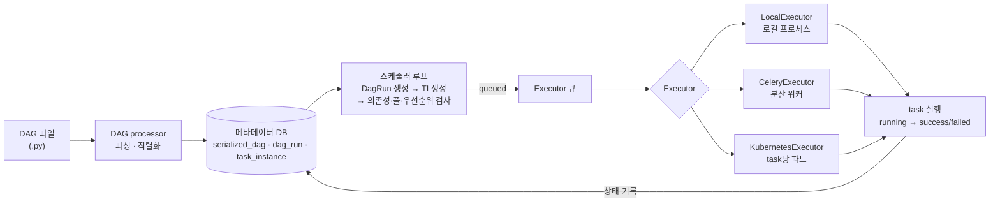
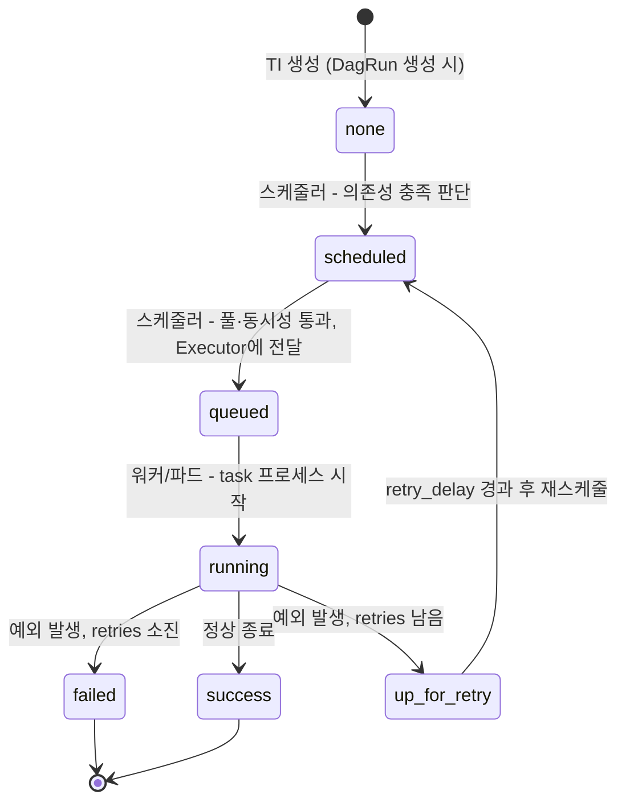

<figure class="post-figure post-figure--header">
<svg role="img" aria-label="Airflow 실행 내부 구조를 한 장으로 그린 그림. 왼쪽 메타데이터 DB에는 직렬화된 DAG와 DagRun·task instance가 저장되어 있고, 스케줄러가 스케줄링 루프를 돌며 이를 읽어 task를 Executor 큐에 넣는다. 큐에 쌓인 task는 LocalExecutor(로컬 프로세스 풀), CeleryExecutor(브로커와 분산 워커), KubernetesExecutor(task당 파드) 중 설정된 Executor에 배정되어 실행되고, 실행 결과 상태는 점선 화살표를 따라 다시 메타데이터 DB에 기록된다." viewBox="0 0 680 268" xmlns="http://www.w3.org/2000/svg">
  <title>스케줄러 · Executor 내부 — 메타데이터 DB에서 큐, 세 Executor를 거쳐 다시 DB로</title>
  <defs>
    <marker id="se-arrow" viewBox="0 0 10 10" refX="8" refY="5" markerWidth="6" markerHeight="6" orient="auto-start-reverse">
      <path d="M0,0 L10,5 L0,10 z" fill="var(--secondary-color)"/>
    </marker>
    <marker id="se-back" viewBox="0 0 10 10" refX="8" refY="5" markerWidth="6" markerHeight="6" orient="auto-start-reverse">
      <path d="M0,0 L10,5 L0,10 z" fill="var(--accent-color)"/>
    </marker>
  </defs>

  <!-- title -->
  <text x="340" y="24" text-anchor="middle" font-size="17" font-weight="800" fill="currentColor" letter-spacing="1.5">스케줄러 · EXECUTOR 내부</text>
  <text x="340" y="44" text-anchor="middle" font-size="10.5" fill="currentColor" opacity="0.72">무엇이 언제 task를 실행하는가 — 직렬화 DAG 읽기 → 큐잉 → 배정 → 상태 기록</text>

  <!-- metadata DB (cylinder) -->
  <path d="M28,92 L28,170 A52,13 0 0 0 132,170 L132,92" fill="var(--bg-light)" stroke="currentColor" stroke-width="2.5"/>
  <ellipse cx="80" cy="92" rx="52" ry="13" fill="var(--bg-light)" stroke="currentColor" stroke-width="2.5"/>
  <text x="80" y="124" text-anchor="middle" font-size="11.5" font-weight="700" fill="currentColor">메타데이터 DB</text>
  <text x="80" y="142" text-anchor="middle" font-size="8.5" fill="currentColor" opacity="0.75">serialized_dag</text>
  <text x="80" y="156" text-anchor="middle" font-size="8.5" fill="currentColor" opacity="0.75">dag_run · task_instance</text>

  <!-- scheduler -->
  <rect x="188" y="92" width="118" height="82" rx="4" fill="var(--bg-light)" stroke="currentColor" stroke-width="2.5"/>
  <text x="247" y="114" text-anchor="middle" font-size="12.5" font-weight="700" fill="currentColor">스케줄러</text>
  <path d="M247,128 A16,16 0 1 1 233,136" fill="none" stroke="var(--secondary-color)" stroke-width="2.5" marker-end="url(#se-arrow)"/>
  <text x="247" y="190" text-anchor="middle" font-size="9" fill="currentColor" opacity="0.75">스케줄링 루프</text>

  <!-- DB -> scheduler -->
  <line x1="138" y1="128" x2="182" y2="128" stroke="var(--secondary-color)" stroke-width="2.5" marker-end="url(#se-arrow)"/>
  <text x="160" y="120" text-anchor="middle" font-size="8.5" fill="currentColor" opacity="0.7">직렬화 DAG</text>

  <!-- executor queue -->
  <text x="372" y="80" text-anchor="middle" font-size="10.5" font-weight="700" fill="currentColor" opacity="0.82">Executor 큐</text>
  <rect x="346" y="88" width="52" height="92" rx="3" fill="var(--bg-panel)" stroke="currentColor" stroke-width="2"/>
  <rect x="364" y="98" width="16" height="16" rx="2" fill="var(--secondary-color)" opacity="0.9"/>
  <rect x="364" y="124" width="16" height="16" rx="2" fill="var(--secondary-color)" opacity="0.7"/>
  <rect x="364" y="150" width="16" height="16" rx="2" fill="var(--secondary-color)" opacity="0.5"/>

  <!-- scheduler -> queue -->
  <line x1="310" y1="132" x2="341" y2="132" stroke="var(--secondary-color)" stroke-width="2.5" marker-end="url(#se-arrow)"/>
  <text x="326" y="122" text-anchor="middle" font-size="8.5" fill="currentColor" opacity="0.7">queued</text>

  <!-- executors -->
  <text x="544" y="68" text-anchor="middle" font-size="10.5" font-weight="700" fill="currentColor" opacity="0.82">Executor</text>
  <g fill="var(--bg-light)" stroke="currentColor" stroke-width="2">
    <rect x="456" y="78" width="176" height="40" rx="3"/>
    <rect x="456" y="128" width="176" height="40" rx="3"/>
    <rect x="456" y="178" width="176" height="40" rx="3"/>
  </g>
  <g font-size="10.5" font-weight="700" fill="currentColor" text-anchor="middle">
    <text x="544" y="95">LocalExecutor</text>
    <text x="544" y="145">CeleryExecutor</text>
    <text x="544" y="195">KubernetesExecutor</text>
  </g>
  <g font-size="7.5" fill="currentColor" opacity="0.7" text-anchor="middle">
    <text x="544" y="109">로컬 프로세스 풀 · 수직 확장</text>
    <text x="544" y="159">브로커 + 상시 분산 워커</text>
    <text x="544" y="209">task당 파드 · 최고 격리</text>
  </g>

  <!-- queue -> executors -->
  <g stroke="var(--secondary-color)" stroke-width="2" fill="none">
    <line x1="402" y1="110" x2="452" y2="98" marker-end="url(#se-arrow)"/>
    <line x1="402" y1="134" x2="452" y2="148" marker-end="url(#se-arrow)"/>
    <line x1="402" y1="158" x2="452" y2="198" marker-end="url(#se-arrow)"/>
  </g>
  <text x="424" y="124" text-anchor="middle" font-size="8.5" fill="currentColor" opacity="0.7">task 배정</text>

  <!-- result back to DB -->
  <path d="M544,222 L544,250 L80,250 L80,190" fill="none" stroke="var(--accent-color)" stroke-width="2" stroke-dasharray="6 5" marker-end="url(#se-back)"/>
  <text x="312" y="242" text-anchor="middle" font-size="8.5" font-weight="700" fill="var(--accent-color)">상태 기록 · running → success / failed</text>
</svg>
<figcaption>이 글의 무대 — 스케줄러는 메타데이터 DB의 직렬화 DAG를 읽어 task를 큐에 넣고, 세 Executor 중 하나가 꺼내 실행하며, 결과는 다시 DB로 돌아온다</figcaption>
</figure>

## 들어가며

[1단계](/2026/07/13/airflow-dag-operators-tasks.html)에서 우리는 파이프라인을 DAG·오퍼레이터·태스크로 **선언**하는 법을 익혔습니다. 그런데 파이썬 파일에 DAG를 써 두었다고 해서 무언가가 저절로 돌아가는 것은 아닙니다. 그 선언을 읽고, "지금 이 시점에 실행해야 할 task"를 골라내고, 실제 프로세스나 파드 위에서 돌리는 것은 전혀 다른 컴포넌트들의 일입니다. 바로 **스케줄러(scheduler)**와 **Executor**입니다.

이 둘의 내부를 모르면 Airflow 운영은 증상 쫓기가 됩니다. "DAG가 UI에 안 보인다", "task가 queued에서 몇 시간째 안 넘어간다", "스케줄러를 재시작했더니 running이던 task가 failed가 됐다" — 전부 스케줄링 루프와 Executor의 구조를 알면 몇 분 만에 원인을 좁힐 수 있는 문제들입니다. 이 글은 [Airflow Essential Curriculum](/2026/07/12/airflow-essential-curriculum.html)의 2단계로, DAG 파일이 파싱되어 메타데이터 DB에 들어가는 순간부터 task가 성공/실패 상태에 도달하기까지의 전 과정을 따라갑니다.

<div class="post-summary-box" markdown="1">

### 📌 이 글에서 다루는 내용

- **스케줄러 루프**: DAG processor의 파싱·직렬화, DagRun·task instance 생성, 의존성·풀·우선순위 검사와 큐잉, critical section과 스케줄러 HA
- **Executor 종류**: LocalExecutor(프로세스 풀) · CeleryExecutor(분산 워커) · KubernetesExecutor(task당 파드)의 아키텍처, 트레이드오프, 선택 기준
- **task 생명주기**: `none → scheduled → queued → running → success/failed/up_for_retry` 상태 전이, 재시도와 backoff, zombie/orphan, 그리고 "왜 queued에서 안 넘어가는가" 진단법

</div>

## 한눈에 보기 — 파싱에서 실행까지

DAG 파일이 실제 실행에 이르는 길은 크게 네 구간입니다. **DAG processor**가 파일을 파싱해 직렬화된 DAG를 메타데이터 DB에 넣고, **스케줄러**가 그 직렬화본을 근거로 DagRun과 task instance를 만들어 실행 조건을 검사한 뒤 큐에 넣으며, **Executor**가 큐에서 task를 꺼내 워커/프로세스/파드에 배정하고, 마지막으로 task 프로세스 자신이 실행 결과를 다시 메타데이터 DB에 기록합니다. 모든 구간이 **메타데이터 DB를 가운데 두고** 대화한다는 점이 핵심입니다.





이 그림을 머리에 넣고 나면, 장애 진단은 "네 구간 중 어디서 막혔는가"를 좁히는 문제가 됩니다. DAG가 UI에 없으면 파싱 구간, scheduled에서 멈추면 스케줄러 구간, queued에서 멈추면 큐잉·Executor 용량 구간, running에서 죽으면 워커 구간입니다.

## 스케줄러 루프 — 무엇이 task를 큐에 넣는가

### DAG processor: 파싱과 직렬화

첫 번째 오해부터 걷어내겠습니다. **스케줄러는 여러분의 DAG 파일을 매번 직접 읽지 않습니다.** 파일을 읽는 것은 **DAG processor**라는 별도 컴포넌트입니다. DAG processor는 `dags/` 폴더를 주기적으로 훑으며 각 파이썬 파일을 서브프로세스에서 임포트·실행하고, 그 결과로 얻은 DAG 객체를 **직렬화(serialize)**해서 메타데이터 DB의 `serialized_dag` 테이블에 저장합니다.

이 분리가 주는 이점은 명확합니다.

- **스케줄러가 파이썬 임포트 비용에서 해방됩니다.** 스케줄링 루프는 DB에 저장된 직렬화본만 읽으면 되므로, DAG 파일에 무거운 임포트나 느린 top-level 코드가 있어도 루프 자체는 느려지지 않습니다.
- **웹서버(UI)도 같은 직렬화본을 읽습니다.** UI가 DAG 파일에 접근할 필요가 없어, 웹서버와 스케줄러를 서로 다른 머신에 둘 수 있습니다.
- **파싱 실패가 격리됩니다.** 한 DAG 파일이 임포트 에러를 내도 다른 DAG의 스케줄링에는 영향이 없습니다(해당 DAG만 import error로 표시).

Airflow 2.x에서는 DAG processor가 기본적으로 스케줄러 프로세스 안의 서브컴포넌트로 돌지만, `standalone dag processor` 모드로 완전히 분리할 수 있습니다. **Airflow 3**는 이 분리를 아예 기본 방향으로 삼아, DAG 파싱과 스케줄링을 독립 컴포넌트로 나누고 task 실행도 API 경유(Task Execution Interface)로 격리하는 아키텍처로 나아갔습니다. "파싱과 스케줄링은 다른 일"이라는 이 글의 관점은 버전이 올라갈수록 더 뚜렷해지는 셈입니다.

파싱 주기와 관련해 자주 만지게 되는 노브는 다음 정도입니다.

```ini
# airflow.cfg
[dag_processor]  # Airflow 2.x에서는 [scheduler] 섹션에 있는 항목도 있음
# dags 폴더를 다시 훑는 최소 간격 (기본 300초)
refresh_interval = 300

[scheduler]
# 같은 파일을 다시 파싱하기까지의 최소 간격
min_file_process_interval = 30
# 파싱에 쓸 병렬 프로세스 수
parsing_processes = 2
```

새 DAG 파일을 넣었는데 UI에 바로 안 보인다면, 대부분 이 파싱 주기를 기다리고 있는 것뿐입니다.

### 스케줄링 루프: DagRun → task instance → 검사 → 큐잉

스케줄러의 본체는 짧은 주기로 도는 **스케줄링 루프**입니다. 한 바퀴마다 대략 다음 일을 합니다.

1. **DagRun 생성** — 직렬화된 DAG의 `schedule`과 마지막 실행 기록을 비교해, 새 논리적 실행 구간이 도래한 DAG에 대해 **DagRun**(DAG의 1회 실행 인스턴스) 레코드를 만듭니다.
2. **task instance 생성** — 각 DagRun에 대해 DAG의 모든 task마다 **task instance(TI)** 레코드를 만듭니다. TI는 "이 DAG의 이 실행 구간에서의 이 task 한 번"이라는, 상태를 가진 최소 단위입니다.
3. **실행 가능성 검사** — 상태가 `scheduled`가 될 수 있는 TI를 고릅니다. 업스트림 task가 성공했는가(의존성), DagRun이 running인가 같은 조건을 봅니다.
4. **동시성·풀 검사 후 큐잉** — `scheduled`인 TI들을 **우선순위(`priority_weight`) 순으로 정렬**한 뒤, 풀(pool) 슬롯 여유, 전역 `parallelism`, DAG별 `max_active_tasks` 같은 동시성 한도를 통과한 것만 `queued`로 바꿔 Executor에 넘깁니다.

<figure class="post-figure">
<svg role="img" aria-label="스케줄링 루프 한 바퀴를 원형 사이클로 그린 개념도. 여섯 단계가 시계 방향으로 이어진다 — 1 직렬화 DAG 조회, 2 DagRun 생성, 3 TI 생성, 4 의존성 검사로 scheduled 전이, 5 풀·parallelism·우선순위 검사, 6 queued로 Executor에 전달, 그리고 다시 1로. 5번 단계만 자물쇠 아이콘과 함께 금색으로 강조되어 있고, critical section이라 한 번에 한 스케줄러만 진입한다는 주석이 붙어 있다." viewBox="0 0 640 322" xmlns="http://www.w3.org/2000/svg">
  <title>스케줄링 루프 한 바퀴 — ⑤ critical section만 잠금으로 직렬화</title>
  <defs>
    <marker id="sl-arrow" viewBox="0 0 10 10" refX="8" refY="5" markerWidth="6" markerHeight="6" orient="auto-start-reverse">
      <path d="M0,0 L10,5 L0,10 z" fill="var(--secondary-color)"/>
    </marker>
  </defs>

  <text x="320" y="24" text-anchor="middle" font-size="14" font-weight="800" fill="currentColor">스케줄링 루프 한 바퀴</text>

  <!-- cycle arcs (clockwise) -->
  <g fill="none" stroke="var(--secondary-color)" stroke-width="2.2">
    <path d="M336,97 A92,92 0 0 1 390,129" marker-end="url(#sl-arrow)"/>
    <path d="M406,157 A92,92 0 0 1 406,219" marker-end="url(#sl-arrow)"/>
    <path d="M390,247 A92,92 0 0 1 336,279" marker-end="url(#sl-arrow)"/>
    <path d="M304,279 A92,92 0 0 1 250,247" marker-end="url(#sl-arrow)"/>
    <path d="M234,219 A92,92 0 0 1 234,157" marker-end="url(#sl-arrow)"/>
    <path d="M250,129 A92,92 0 0 1 304,97" marker-end="url(#sl-arrow)"/>
  </g>

  <!-- center -->
  <text x="320" y="184" text-anchor="middle" font-size="11" font-weight="700" fill="currentColor">스케줄러</text>
  <text x="320" y="200" text-anchor="middle" font-size="8.5" fill="currentColor" opacity="0.72">heartbeat마다 반복</text>

  <!-- step nodes -->
  <g font-weight="800" text-anchor="middle">
    <circle cx="320" cy="96" r="15" fill="var(--bg-light)" stroke="var(--secondary-color)" stroke-width="2.5"/>
    <text x="320" y="100" font-size="11" fill="currentColor">1</text>
    <circle cx="400" cy="142" r="15" fill="var(--bg-light)" stroke="var(--secondary-color)" stroke-width="2.5"/>
    <text x="400" y="146" font-size="11" fill="currentColor">2</text>
    <circle cx="400" cy="234" r="15" fill="var(--bg-light)" stroke="var(--secondary-color)" stroke-width="2.5"/>
    <text x="400" y="238" font-size="11" fill="currentColor">3</text>
    <circle cx="320" cy="280" r="15" fill="var(--bg-light)" stroke="var(--secondary-color)" stroke-width="2.5"/>
    <text x="320" y="284" font-size="11" fill="currentColor">4</text>
    <circle cx="240" cy="234" r="15" fill="var(--bg-panel)" stroke="var(--gold)" stroke-width="3"/>
    <text x="240" y="238" font-size="11" fill="currentColor">5</text>
    <circle cx="240" cy="142" r="15" fill="var(--bg-light)" stroke="var(--secondary-color)" stroke-width="2.5"/>
    <text x="240" y="146" font-size="11" fill="currentColor">6</text>
  </g>

  <!-- lock icon on step 5 -->
  <path d="M253,208 v-3.5 a3.5,3.5 0 0 1 7,0 v3.5" fill="none" stroke="var(--gold)" stroke-width="2"/>
  <rect x="250" y="208" width="13" height="10" rx="1.5" fill="var(--gold)"/>

  <!-- step labels -->
  <text x="320" y="64" text-anchor="middle" font-size="9.5" font-weight="700" fill="currentColor">직렬화 DAG 조회</text>
  <text x="422" y="139" text-anchor="start" font-size="9.5" font-weight="700" fill="currentColor">DagRun 생성</text>
  <text x="422" y="152" text-anchor="start" font-size="8" fill="currentColor" opacity="0.7">실행 구간이 도래한 DAG</text>
  <text x="422" y="231" text-anchor="start" font-size="9.5" font-weight="700" fill="currentColor">TI 생성</text>
  <text x="422" y="244" text-anchor="start" font-size="8" fill="currentColor" opacity="0.7">task마다 인스턴스 레코드</text>
  <text x="320" y="311" text-anchor="middle" font-size="9.5" font-weight="700" fill="currentColor">의존성 검사 → scheduled</text>
  <text x="218" y="224" text-anchor="end" font-size="9.5" font-weight="700" fill="currentColor">풀 · parallelism · 우선순위</text>
  <text x="218" y="237" text-anchor="end" font-size="9" font-weight="800" fill="var(--gold)">critical section</text>
  <text x="218" y="250" text-anchor="end" font-size="8" fill="currentColor" opacity="0.75">한 번에 한 스케줄러만 (DB lock)</text>
  <text x="218" y="138" text-anchor="end" font-size="9.5" font-weight="700" fill="currentColor">queued → Executor 전달</text>
</svg>
<figcaption>스케줄링 루프 한 바퀴 — 슬롯을 배분하는 ⑤ 구간(critical section)만 DB 잠금으로 직렬화되어 한 번에 한 스케줄러만 진입한다</figcaption>
</figure>

마지막 4번 단계 — "실행 자원을 어느 TI에게 줄 것인가"를 결정하고 `queued`로 바꾸는 구간 — 를 Airflow는 **critical section**이라고 부릅니다. 여러 스케줄러가 동시에 이 결정을 내리면 같은 슬롯을 두 TI에게 주는 초과 할당이 생기므로, 이 구간은 DB row-level lock으로 **한 번에 하나의 스케줄러만** 진입합니다. 튜닝 문서에서 만나는 어휘 몇 가지를 이 그림 위에 얹으면 이렇게 읽힙니다.

- **`max_tis_per_query`** — critical section 한 바퀴에서 검사·큐잉할 TI의 최대 개수. 크면 한 바퀴에 많이 처리하지만 쿼리와 잠금 유지 시간이 길어지고, 작으면 루프가 잘게 자주 돕니다.
- **`scheduler_heartbeat_sec`** — 루프 사이의 간격. 스케줄링 지연(task가 실행 가능해진 시점부터 queued까지의 시간)의 하한을 만듭니다.
- **`pool` / `priority_weight`** — 풀은 "이 자원(예: 특정 DB 커넥션)을 쓰는 task는 동시에 N개까지"라는 명명된 슬롯 집합이고, 우선순위는 슬롯이 모자랄 때 누가 먼저 받는지를 정합니다.

### 스케줄러 HA — 다중 스케줄러와 row-level lock

Airflow 1.x 시절 스케줄러는 단일 프로세스였고, 죽으면 모든 스케줄링이 멈추는 단일 장애점이었습니다. **Airflow 2.0부터는 스케줄러를 여러 개 띄우는 active-active HA**가 지원됩니다. 별도의 리더 선출이나 조정 서비스 없이, 조정을 전부 **메타데이터 DB의 row-level lock**에 맡기는 설계입니다.

각 스케줄러는 검토할 DagRun들을 `SELECT ... FOR UPDATE SKIP LOCKED`로 집어 듭니다 — 다른 스케줄러가 이미 잠근 행은 기다리지 않고 **건너뛰고**, 잠기지 않은 행만 가져가 처리합니다. 그래서 스케줄러 N대가 서로 다른 DagRun을 자연스럽게 나눠 맡고, 한 대가 죽어도 나머지가 그대로 일을 이어받습니다. critical section만 앞서 말한 잠금으로 직렬화됩니다. 이 설계의 대가는 **메타데이터 DB가 진짜 심장이 된다**는 것입니다. `SKIP LOCKED`를 제대로 지원하는 PostgreSQL(권장) 같은 DB가 필요하고, 스케줄러를 늘릴수록 DB 부하가 늘어나므로 DB 모니터링이 스케줄러 모니터링만큼 중요해집니다.

## Executor — 큐에 든 task를 누가 어디서 돌리는가

스케줄러가 TI를 `queued`로 만들면, 그때부터는 **Executor**의 일입니다. Executor는 "task를 실제로 어떤 실행 자원 위에서 돌릴 것인가"에 대한 전략이며, 스케줄러 설정 한 줄로 갈아 끼울 수 있습니다.

```ini
[core]
executor = LocalExecutor   # 또는 CeleryExecutor, KubernetesExecutor, ...
```

### LocalExecutor — 단일 노드 프로세스 풀

**LocalExecutor**는 스케줄러가 도는 머신 안에서 서브프로세스 풀을 만들어 task를 돌립니다. 큐잉된 TI마다 프로세스를 포크하고, `parallelism` 한도까지 동시에 실행합니다.

- **강점**: 구조가 가장 단순합니다. 브로커도, 워커 클러스터도, K8s도 필요 없습니다. task 시작 지연도 프로세스 포크 수준으로 짧습니다.
- **약점**: 수직 확장뿐입니다. 그 머신의 CPU·메모리가 곧 전체 용량이고, 스케줄러와 task가 자원을 나눠 씁니다. 머신이 죽으면 스케줄링과 실행이 함께 멈춥니다.
- **적합한 곳**: 개발 환경, 소규모 팀의 수십 개 DAG 수준. 참고로 `SequentialExecutor`(한 번에 1개, SQLite용)는 사실상 데모 전용입니다.

### CeleryExecutor — 브로커와 분산 워커

**CeleryExecutor**는 실행을 여러 머신으로 수평 확장합니다. 스케줄러가 task를 **메시지 브로커**(Redis 또는 RabbitMQ)에 발행하면, 미리 떠 있는 **Celery 워커** 무리가 메시지를 집어 실행합니다.

- **강점**: 워커를 늘리는 만큼 용량이 늘어납니다. 워커가 **상시 대기(warm)** 상태라 task 시작 지연이 짧고, 처리량이 큰 배치 부하에 강합니다. `queue` 인자로 task를 특정 워커 그룹(예: GPU 워커)에 라우팅할 수도 있습니다.
- **약점**: 운영해야 할 것이 늘어납니다 — 브로커, 워커 플릿, 그리고 워커들의 **환경 동기화**. 모든 워커가 같은 파이썬 의존성과 DAG 코드를 갖고 있어야 하며, "워커마다 라이브러리 버전이 달라서 생기는" 종류의 장애가 이 구조의 고전적인 아픔입니다. task 간 격리도 프로세스 수준에 그칩니다.
- **적합한 곳**: task 수가 많고 시작 지연에 민감하며, 의존성 세트가 비교적 균질한 조직.

### KubernetesExecutor — task당 파드

**KubernetesExecutor**는 큐잉된 TI **하나마다 K8s 파드를 하나** 띄웁니다. 상시 워커가 없습니다. task가 시작될 때 파드가 생기고, 끝나면 사라집니다.

- **강점**: **격리가 최상급**입니다. task마다 다른 컨테이너 이미지·다른 의존성·다른 CPU/메모리 리소스를 줄 수 있어, "이 task만 pandas 2.x가 필요하다" 같은 문제가 사라집니다. 놀고 있는 워커가 없으니 유휴 비용도 없고, 클러스터 오토스케일링과 자연스럽게 맞물립니다.
- **약점**: task마다 **파드 기동 시간**(이미지 풀, 스케줄링)이 붙습니다. 수 초짜리 task 수천 개를 돌리는 워크로드에는 이 오버헤드가 지배적입니다. 그리고 운영 난이도가 K8s 운영 난이도와 같아집니다.
- **적합한 곳**: 의존성이 이질적이거나 자원 요구가 들쭉날쭉한 task들, 이미 K8s가 표준 인프라인 조직.

파드 사양은 `pod_template_file`이나 task별 `executor_config`로 조정합니다.

```python
task = PythonOperator(
    task_id="train_model",
    python_callable=train,
    executor_config={
        "pod_override": k8s.V1Pod(
            spec=k8s.V1PodSpec(
                containers=[
                    k8s.V1Container(
                        name="base",
                        image="my-registry/ml-train:2.3",
                        resources=k8s.V1ResourceRequirements(
                            requests={"cpu": "4", "memory": "16Gi"},
                        ),
                    )
                ]
            )
        )
    },
)
```

### 하이브리드와 선택 기준

**CeleryKubernetesExecutor**는 둘을 함께 씁니다 — 기본은 Celery 워커로 돌리고, `kubernetes` 큐로 지정한 task만 파드로 띄우는 방식입니다. "짧고 많은 task는 warm 워커로, 무겁고 특수한 task는 격리 파드로"라는 절충이 가능합니다. Airflow 2.10+에서는 아예 **여러 Executor를 동시에 설정**하고 task 단위로 고르는 방향으로 일반화되었습니다.

| 기준 | LocalExecutor | CeleryExecutor | KubernetesExecutor |
| --- | --- | --- | --- |
| 실행 단위 | 로컬 프로세스 | 상시 워커의 프로세스 | task당 파드 |
| 수평 확장 | 불가(단일 노드) | 워커 추가 | 클러스터 오토스케일 |
| task 시작 지연 | 최소 | 짧음(warm) | 파드 기동만큼 김 |
| 격리 수준 | 프로세스 | 프로세스 | 컨테이너(이미지·리소스별) |
| 추가 운영 대상 | 없음 | 브로커 + 워커 플릿 | K8s 클러스터 |
| 유휴 비용 | 머신 1대 | 대기 워커 | 거의 없음 |

선택의 축은 결국 세 가지입니다 — **운영 복잡도 vs 격리 vs 시작 지연**. 규모가 작으면 Local, 처리량과 지연이 우선이면 Celery, 격리와 탄력이 우선이면 Kubernetes, 둘 다 필요하면 하이브리드가 기본 답입니다.

## task 생명주기 — 상태 전이와 진단

### none에서 success까지

TI 하나의 일생을 상태 기계로 그리면 다음과 같습니다. 각 화살표를 **누가** 옮기는지가 중요합니다 — `scheduled`와 `queued`로 옮기는 것은 스케줄러, `running`으로 옮기는 것은 task를 받아 든 워커, 종료 상태를 기록하는 것은 task 프로세스 자신입니다.





이 밖에도 센서의 `reschedule` 모드가 쓰는 `up_for_reschedule`, deferrable 오퍼레이터가 트리거러에 대기를 넘길 때의 `deferred`, 업스트림 실패로 실행 없이 건너뛰는 `upstream_failed`, 브랜치에서 제외된 `skipped` 같은 상태가 있지만, 뼈대는 위의 전이입니다.

### 재시도 — up_for_retry와 backoff

`running` 중 예외가 나면 Airflow는 곧바로 `failed`로 보내지 않고, 남은 재시도 횟수가 있으면 `up_for_retry`로 보냅니다. 그리고 `retry_delay`만큼 기다린 뒤 다시 `scheduled`부터 태웁니다. 일시적 장애(네트워크 순단, 원천 과부하)가 잦은 데이터 파이프라인에서는 **지수 backoff**를 함께 켜는 것이 정석입니다.

```python
from datetime import timedelta

default_args = {
    "retries": 3,
    "retry_delay": timedelta(minutes=2),
    # 재시도마다 대기를 2배씩 늘림: 2분 → 4분 → 8분
    "retry_exponential_backoff": True,
    "max_retry_delay": timedelta(minutes=30),
}
```

단, 재시도는 task가 **멱등**할 때만 안전합니다 — 절반쯤 쓰다 죽은 task를 다시 돌려도 데이터가 이중으로 쌓이지 않아야 합니다. 이 주제는 5단계(백필·catchup·멱등)에서 정면으로 다룹니다.

### zombie와 orphan — 상태와 현실이 어긋날 때

메타데이터 DB의 상태와 실제 프로세스의 현실이 어긋나는 두 가지 병리 현상이 있습니다.

- **zombie task** — DB에는 `running`인데 **실제 프로세스는 죽어 있는** TI. 워커 노드가 통째로 죽거나 프로세스가 강제 종료되면, task는 자기 종료 상태를 기록할 기회조차 없습니다. task 프로세스는 살아 있는 동안 주기적으로 heartbeat를 DB에 남기는데, 스케줄러는 이 heartbeat가 `scheduler_zombie_task_threshold`(기본 5분)를 넘도록 끊긴 running TI를 zombie로 판정해 실패 처리하고, 재시도가 남았으면 다시 태웁니다.
- **orphan(고아) task** — 반대로 **Executor가 자기가 맡았다는 사실을 잊어버린** TI. 예컨대 스케줄러/Executor가 재시작되면 재시작 전 큐잉·실행 의뢰된 task의 in-memory 추적 정보가 사라집니다. 스케줄러는 기동 시와 주기적으로 "queued/running인데 어느 Executor도 자기 것이라 주장하지 않는" TI를 찾아(adoption) 다시 거두거나 리셋합니다.

즉 "스케줄러를 재시작했더니 running이던 task가 실패로 바뀌었다"는 미스터리는 대부분 이 zombie/orphan 정리 메커니즘이 정상 동작한 결과입니다.

### 왜 내 task가 queued에서 안 넘어가는가

실무에서 가장 자주 만나는 증상을 진단 순서로 정리합니다. `queued`는 "스케줄러는 허락했지만 실행 자원이 아직 안 잡혔다"는 뜻이므로, 병목은 **동시성 노브 아니면 Executor 용량**입니다.

<figure class="post-figure">
<svg role="img" aria-label="queued 상태의 task가 running에 도달하기까지 지나야 하는 다섯 관문을 순서대로 그린 개념도. 왼쪽에는 줄 선 task들이 있고, 점선 화살표가 다섯 개의 관문 — 1 pool 슬롯(명명된 슬롯 묶음), 2 parallelism(전역 동시 실행 상한), 3 max_active_tasks(DAG별 상한), 4 max_active_runs(동시 DagRun 상한), 5 Executor 용량(워커 슬롯·파드) — 을 통과해 오른쪽 running 상태의 task에 닿는다. 관문이 하나라도 닫혀 있으면 task는 그 앞에서 대기한다." viewBox="0 0 680 212" xmlns="http://www.w3.org/2000/svg">
  <title>queued → running 사이의 다섯 관문 — 동시성 노브 넷과 Executor 용량</title>
  <defs>
    <marker id="gate-arrow" viewBox="0 0 10 10" refX="8" refY="5" markerWidth="6" markerHeight="6" orient="auto-start-reverse">
      <path d="M0,0 L10,5 L0,10 z" fill="var(--secondary-color)"/>
    </marker>
  </defs>

  <text x="340" y="24" text-anchor="middle" font-size="13" font-weight="800" fill="currentColor">queued → running 사이의 다섯 관문</text>
  <text x="340" y="42" text-anchor="middle" font-size="9" fill="currentColor" opacity="0.72">관문이 하나라도 닫혀 있으면 task는 그 앞에서 줄을 선다</text>

  <!-- baseline -->
  <line x1="24" y1="156" x2="656" y2="156" stroke="currentColor" stroke-width="2" opacity="0.35"/>

  <!-- waiting tasks (queued) -->
  <rect x="42" y="138" width="16" height="16" rx="2" fill="var(--secondary-color)" opacity="0.5"/>
  <rect x="66" y="138" width="16" height="16" rx="2" fill="var(--secondary-color)" opacity="0.65"/>
  <rect x="90" y="138" width="16" height="16" rx="2" fill="var(--secondary-color)" opacity="0.85"/>
  <text x="74" y="176" text-anchor="middle" font-size="9" font-weight="700" fill="currentColor">줄 선 task들</text>
  <text x="74" y="189" text-anchor="middle" font-size="8" fill="currentColor" opacity="0.7">queued</text>

  <!-- path through the gates -->
  <line x1="112" y1="132" x2="600" y2="132" stroke="var(--secondary-color)" stroke-width="2" stroke-dasharray="6 5" marker-end="url(#gate-arrow)"/>

  <!-- gates -->
  <g fill="none" stroke="currentColor" stroke-width="3" stroke-linejoin="round">
    <path d="M158,156 V106 H198 V156"/>
    <path d="M254,156 V106 H294 V156"/>
    <path d="M350,156 V106 H390 V156"/>
    <path d="M446,156 V106 H486 V156"/>
    <path d="M542,156 V106 H582 V156"/>
  </g>

  <!-- gate number chips -->
  <g font-weight="800" text-anchor="middle">
    <circle cx="178" cy="92" r="9" fill="var(--bg-light)" stroke="var(--secondary-color)" stroke-width="2"/>
    <text x="178" y="95" font-size="9" fill="currentColor">1</text>
    <circle cx="274" cy="92" r="9" fill="var(--bg-light)" stroke="var(--secondary-color)" stroke-width="2"/>
    <text x="274" y="95" font-size="9" fill="currentColor">2</text>
    <circle cx="370" cy="92" r="9" fill="var(--bg-light)" stroke="var(--secondary-color)" stroke-width="2"/>
    <text x="370" y="95" font-size="9" fill="currentColor">3</text>
    <circle cx="466" cy="92" r="9" fill="var(--bg-light)" stroke="var(--secondary-color)" stroke-width="2"/>
    <text x="466" y="95" font-size="9" fill="currentColor">4</text>
    <circle cx="562" cy="92" r="9" fill="var(--bg-panel)" stroke="var(--gold)" stroke-width="2.5"/>
    <text x="562" y="95" font-size="9" fill="currentColor">5</text>
  </g>

  <!-- gate labels -->
  <g font-size="9" font-weight="700" fill="currentColor" text-anchor="middle">
    <text x="178" y="176">pool 슬롯</text>
    <text x="274" y="176">parallelism</text>
    <text x="370" y="176">max_active_tasks</text>
    <text x="466" y="176">max_active_runs</text>
    <text x="562" y="176">Executor 용량</text>
  </g>
  <g font-size="8" fill="currentColor" opacity="0.7" text-anchor="middle">
    <text x="178" y="189">명명된 슬롯 묶음</text>
    <text x="274" y="189">전역 동시 실행 상한</text>
    <text x="370" y="189">DAG별 상한</text>
    <text x="466" y="189">동시 DagRun 상한</text>
    <text x="562" y="189">워커 슬롯 · 파드</text>
  </g>

  <!-- running task -->
  <rect x="612" y="123" width="18" height="18" rx="2" fill="var(--accent-color)"/>
  <text x="621" y="176" text-anchor="middle" font-size="9.5" font-weight="800" fill="var(--accent-color)">running</text>
</svg>
<figcaption>queued에서 running까지의 다섯 관문 — 앞의 넷은 스케줄러의 동시성 노브, 마지막은 Executor 용량이며, 진단도 이 순서로 짚는다</figcaption>
</figure>

1. **풀 슬롯** — 그 task가 속한 pool의 슬롯이 다 찼는지 확인합니다(UI의 Admin → Pools). 기본적으로 모든 task는 `default_pool`(기본 128슬롯)에 속하므로, 장시간 실행 task가 슬롯을 점유하고 있으면 뒤가 전부 밀립니다.
2. **`parallelism`** — Airflow 인스턴스 전체에서 동시에 running일 수 있는 TI의 전역 상한(`[core] parallelism`, 기본 32). 클러스터 전체가 이 값에 걸려 있으면 어떤 DAG든 더 못 돕니다.
3. **`max_active_tasks`** — DAG 하나당 동시 실행 TI 상한(DAG 인자, 옛 이름 `dag_concurrency`). 한 DAG가 유난히 안 나가면 이 값을 봅니다.
4. **`max_active_runs`** — 그 DAG의 동시 DagRun 수 상한. catchup으로 과거 구간이 밀려 있을 때 앞 run이 끝나지 않아 뒤 run의 task가 대기하는 패턴이 흔합니다.
5. **Executor 용량** — 위를 다 통과했다면 Executor 쪽입니다. Celery라면 워커가 살아 있고 해당 `queue`를 구독 중인지, K8s라면 파드가 Pending인 이유(리소스 부족, 이미지 풀 실패, 노드 셀렉터)를 `kubectl describe pod`로 확인합니다.

```ini
[core]
parallelism = 32          # 인스턴스 전역 동시 실행 TI 상한
max_active_tasks_per_dag = 16
max_active_runs_per_dag = 16
```

경험적으로 1·2번이 절반 이상, catchup이 켜진 DAG에서는 4번이 그다음으로 흔한 원인입니다. 어느 경우든 "스케줄러가 고장났다"가 아니라 **설계된 한도가 작동하고 있는 것**이므로, 무작정 값을 올리기 전에 그 한도가 지키려던 자원(DB 커넥션, API rate limit)이 무엇이었는지 먼저 확인하는 편이 안전합니다.

## 정리

- Airflow의 실행은 **파싱(DAG processor) → 스케줄링(스케줄러 루프) → 배정(Executor) → 실행(워커/파드)**의 네 구간이며, 모두 메타데이터 DB를 가운데 두고 대화합니다. 장애 진단은 "어느 구간에서 막혔는가"를 좁히는 일입니다.
- 스케줄러는 DAG 파일이 아니라 **직렬화된 DAG**를 읽습니다. 루프는 DagRun·TI를 만들고 의존성·풀·우선순위를 검사해 큐잉하며, 슬롯 배분 구간(critical section)은 잠금으로 직렬화됩니다. Airflow 2.x+는 `SELECT ... FOR UPDATE SKIP LOCKED` 기반 active-active **다중 스케줄러 HA**를 지원하고, Airflow 3는 파싱·스케줄링·실행의 분리를 한층 밀어붙입니다.
- Executor 선택은 **운영 복잡도 vs 격리 vs 시작 지연**의 삼각 트레이드오프입니다 — 단순함의 Local, warm 워커 처리량의 Celery, task당 파드 격리의 Kubernetes, 그리고 둘을 섞는 하이브리드.
- TI는 `none → scheduled → queued → running → success/failed/up_for_retry`로 흐르고, 각 전이의 주체(스케줄러/워커/task 자신)가 다릅니다. zombie/orphan 정리는 상태와 현실의 어긋남을 복구하는 정상 메커니즘이며, "queued에서 안 넘어감"은 풀 → parallelism → max_active_tasks → max_active_runs → Executor 용량 순으로 짚으면 대부분 잡힙니다.

이제 "무엇이 언제 task를 실행하는가"에 답할 수 있습니다. 다음 단계에서는 그렇게 실행된 태스크들 **사이로 데이터를 어떻게 흘리는지** — XCom의 동작 원리와 한계, 그리고 그것을 파이썬 네이티브하게 감싼 TaskFlow API를 다룹니다.

### 다음 학습 (Next Learning)

- [Airflow XCom · TaskFlow API](/2026/07/13/airflow-xcom-taskflow-api.html) — 3단계: 태스크 간 데이터 전달과 파이썬 네이티브 DAG 작성
- [Airflow DAG · 오퍼레이터 · 태스크](/2026/07/13/airflow-dag-operators-tasks.html) — 1단계: 파이프라인을 코드로 선언하는 법 복습
- [Airflow Essential Curriculum](/2026/07/12/airflow-essential-curriculum.html) — 시리즈 로드맵으로 돌아가 진행 상황 확인하기
