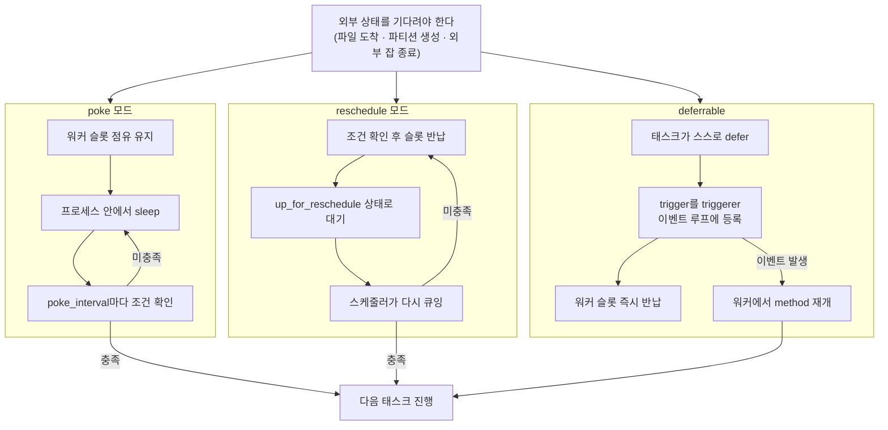

<figure class="post-figure post-figure--header">
<svg role="img" aria-label="기다림의 두 갈래를 대비한 그림. 왼쪽은 전통 poke 센서로, 워커의 세 슬롯이 모두 '대기 중' 센서에 점유된 채 아래의 외부 상태(S3 파일·잡 종료)를 poke_interval마다 폴링한다 — 대기 1건이 슬롯 1개를 점유한다. 오른쪽은 deferrable 오퍼레이터로, 태스크가 defer하며 대기를 아래 triggerer의 asyncio 이벤트 루프로 넘겨 워커 슬롯 세 개가 모두 비어 있고, 조건 충족 시 TriggerEvent로 워커에서 재개된다 — 대기에 드는 슬롯은 0개다." viewBox="0 0 680 360" xmlns="http://www.w3.org/2000/svg">
  <title>전통 poke 센서 vs deferrable — 기다리는 동안 워커 슬롯은 어떻게 되는가</title>
  <defs>
    <marker id="sd-arrow" viewBox="0 0 10 10" refX="8" refY="5" markerWidth="6" markerHeight="6" orient="auto-start-reverse">
      <path d="M0,0 L10,5 L0,10 z" fill="var(--secondary-color)"/>
    </marker>
    <marker id="sd-arrow-warn" viewBox="0 0 10 10" refX="8" refY="5" markerWidth="6" markerHeight="6" orient="auto-start-reverse">
      <path d="M0,0 L10,5 L0,10 z" fill="var(--accent-color)"/>
    </marker>
  </defs>

  <!-- ===== title ===== -->
  <text x="340" y="24" text-anchor="middle" font-size="17" font-weight="800" fill="currentColor" letter-spacing="1.5">SENSORS · DEFERRABLE</text>

  <!-- ===== divider ===== -->
  <line x1="340" y1="42" x2="340" y2="336" stroke="currentColor" stroke-width="1.5" stroke-dasharray="4 6" opacity="0.35"/>
  <text x="340" y="196" text-anchor="middle" font-size="11" font-weight="800" fill="currentColor" opacity="0.6">VS</text>

  <!-- ===== LEFT: traditional poke sensor ===== -->
  <text x="170" y="52" text-anchor="middle" font-size="11.5" font-weight="700" fill="currentColor" opacity="0.8">전통 센서 — poke 모드</text>

  <!-- worker frame -->
  <rect x="34" y="64" width="272" height="118" rx="4" fill="var(--bg-light)" stroke="currentColor" stroke-width="2.5"/>
  <text x="170" y="82" text-anchor="middle" font-size="11" font-weight="700" fill="currentColor">워커</text>

  <!-- occupied slots -->
  <g>
    <rect x="48" y="94" width="76" height="72" rx="3" fill="var(--bg-panel)" stroke="var(--accent-color)" stroke-width="2"/>
    <rect x="132" y="94" width="76" height="72" rx="3" fill="var(--bg-panel)" stroke="var(--accent-color)" stroke-width="2"/>
    <rect x="216" y="94" width="76" height="72" rx="3" fill="var(--bg-panel)" stroke="var(--accent-color)" stroke-width="2"/>
  </g>
  <g font-size="10" font-weight="700" fill="var(--accent-color)" text-anchor="middle">
    <text x="86" y="122">센서</text>
    <text x="170" y="122">센서</text>
    <text x="254" y="122">센서</text>
  </g>
  <g font-size="9" fill="currentColor" opacity="0.7" text-anchor="middle">
    <text x="86" y="140">대기 중…</text>
    <text x="170" y="140">대기 중…</text>
    <text x="254" y="140">대기 중…</text>
  </g>
  <g font-size="8.5" fill="currentColor" opacity="0.55" text-anchor="middle">
    <text x="86" y="156">슬롯 점유</text>
    <text x="170" y="156">슬롯 점유</text>
    <text x="254" y="156">슬롯 점유</text>
  </g>

  <!-- polling arrows to external state -->
  <line x1="150" y1="184" x2="150" y2="242" stroke="var(--accent-color)" stroke-width="2" stroke-dasharray="5 4" marker-end="url(#sd-arrow-warn)" marker-start="url(#sd-arrow-warn)"/>
  <text x="162" y="216" text-anchor="start" font-size="9" fill="currentColor" opacity="0.75">poke… 아직? poke…</text>

  <!-- external state -->
  <rect x="60" y="246" width="220" height="46" rx="4" fill="var(--bg-panel)" stroke="currentColor" stroke-width="2"/>
  <text x="170" y="265" text-anchor="middle" font-size="10.5" font-weight="700" fill="currentColor">외부 상태</text>
  <text x="170" y="282" text-anchor="middle" font-size="9" fill="currentColor" opacity="0.7">S3 파일 · 파티션 · 외부 잡 종료</text>

  <text x="170" y="326" text-anchor="middle" font-size="11" font-weight="800" fill="var(--accent-color)">대기 1건 = 슬롯 1개 점유</text>

  <!-- ===== RIGHT: deferrable ===== -->
  <text x="510" y="52" text-anchor="middle" font-size="11.5" font-weight="700" fill="currentColor" opacity="0.8">deferrable — 대기를 이관</text>

  <!-- worker frame -->
  <rect x="374" y="64" width="272" height="118" rx="4" fill="var(--bg-light)" stroke="currentColor" stroke-width="2.5"/>
  <text x="510" y="82" text-anchor="middle" font-size="11" font-weight="700" fill="currentColor">워커</text>

  <!-- empty slots -->
  <g fill="none" stroke="currentColor" stroke-width="1.8" stroke-dasharray="5 4" opacity="0.55">
    <rect x="388" y="94" width="76" height="72" rx="3"/>
    <rect x="472" y="94" width="76" height="72" rx="3"/>
    <rect x="556" y="94" width="76" height="72" rx="3"/>
  </g>
  <g font-size="9" fill="currentColor" opacity="0.6" text-anchor="middle">
    <text x="426" y="128">비어 있음</text>
    <text x="510" y="128">비어 있음</text>
    <text x="594" y="128">비어 있음</text>
  </g>
  <g font-size="9" font-weight="700" fill="var(--secondary-color)" text-anchor="middle">
    <text x="426" y="146">다른 작업 가능</text>
    <text x="510" y="146">다른 작업 가능</text>
    <text x="594" y="146">다른 작업 가능</text>
  </g>

  <!-- defer / resume arrows -->
  <line x1="440" y1="184" x2="440" y2="242" stroke="var(--secondary-color)" stroke-width="2.5" marker-end="url(#sd-arrow)"/>
  <text x="432" y="216" text-anchor="end" font-size="9" font-weight="700" fill="currentColor" opacity="0.8">defer · 슬롯 반납</text>
  <line x1="580" y1="242" x2="580" y2="184" stroke="var(--secondary-color)" stroke-width="2.5" marker-end="url(#sd-arrow)"/>
  <text x="588" y="216" text-anchor="start" font-size="9" font-weight="700" fill="currentColor" opacity="0.8">TriggerEvent · 재개</text>

  <!-- triggerer -->
  <rect x="400" y="246" width="220" height="60" rx="4" fill="var(--bg-light)" stroke="var(--gold)" stroke-width="2.5"/>
  <text x="530" y="266" text-anchor="middle" font-size="10.5" font-weight="700" fill="currentColor">triggerer</text>
  <text x="530" y="282" text-anchor="middle" font-size="9" fill="currentColor" opacity="0.7">asyncio 이벤트 루프 · 대기 수천 건</text>
  <!-- event loop with coroutine dots -->
  <circle cx="432" cy="276" r="16" fill="none" stroke="var(--secondary-color)" stroke-width="2" stroke-dasharray="3 3"/>
  <g fill="var(--secondary-color)">
    <circle cx="432" cy="260" r="2.4"/>
    <circle cx="446" cy="270" r="2.4"/>
    <circle cx="442" cy="288" r="2.4"/>
    <circle cx="422" cy="288" r="2.4"/>
    <circle cx="418" cy="270" r="2.4"/>
  </g>

  <text x="510" y="326" text-anchor="middle" font-size="11" font-weight="800" fill="var(--secondary-color)">대기 = 슬롯 0개</text>
</svg>
<figcaption>poke 센서는 기다리는 내내 워커 슬롯을 붙들지만, deferrable은 대기를 triggerer의 asyncio 이벤트 루프로 넘겨 슬롯을 비운다.</figcaption>
</figure>

## 들어가며

지금까지 이 시리즈에서 다룬 것은 모두 **"우리가 통제하는 세계"** 안의 이야기였습니다. DAG를 코드로 선언하고, 스케줄러가 큐에 넣고, Executor가 실행하고, XCom으로 데이터를 넘기고 — 모든 등장인물이 Airflow 안에 있었죠. 하지만 실제 파이프라인은 Airflow 바깥의 세계에 끊임없이 의존합니다. 업스트림 팀이 S3에 파일을 떨어뜨려야 변환을 시작할 수 있고, 웨어하우스에 오늘치 파티션이 생겨야 집계를 돌릴 수 있으며, 다른 DAG의 태스크가 끝나야 내 DAG가 이어받을 수 있습니다.

문제는 이 "기다림"이 공짜가 아니라는 점입니다. 가장 순진한 구현 — 태스크가 워커 슬롯을 붙든 채 30초마다 조건을 확인하는 — 은 센서 몇 개일 때는 아무 문제가 없지만, 파이프라인이 수백 개로 늘어나면 **아무 일도 하지 않는 태스크들이 클러스터의 슬롯을 모조리 잠식하는** 사태로 번집니다. Airflow는 이 문제를 세 단계로 풀어 왔습니다. `poke` 모드(점유한 채 폴링) → `reschedule` 모드(폴 사이 슬롯 반납) → **deferrable 오퍼레이터**(대기 자체를 triggerer의 비동기 이벤트 루프로 이관). 이 진화의 각 단계가 무엇을 해결하고 무엇을 남겼는지 이해하면, "기다리는 태스크"를 상황에 맞게 설계할 수 있게 됩니다.

이 글은 [Airflow Essential Curriculum](/2026/07/12/airflow-essential-curriculum.html)의 4단계이자 두 번째 막 "견고함"의 시작입니다. 3단계 [XCom · TaskFlow API](/2026/07/13/airflow-xcom-taskflow-api.html)에서 태스크 사이로 데이터를 흘리는 법을 익혔다면, 이번에는 태스크가 **외부 상태를 효율적으로 기다리는 법**을 익힙니다.

<div class="post-summary-box" markdown="1">

### 📌 이 글에서 다루는 내용

- **센서 기초**: FileSensor·S3KeySensor·ExternalTaskSensor·SqlSensor 등 대표 센서와 `poke_interval`·`timeout`·`soft_fail`
- **poke vs reschedule**: 슬롯을 점유한 채 폴링하느냐, 폴 사이에 슬롯을 반납하느냐 — 동작 차이·비용·적합 상황
- **deferrable 오퍼레이터**: 태스크가 스스로를 defer하고 trigger(asyncio 코루틴)를 triggerer 이벤트 루프에 등록하는 구조, custom trigger 작성
- **대기 패턴 설계**: 타임아웃·간격 설계, ExternalTaskSensor의 함정, "센서 지옥" 안티패턴과 Datasets 기반 이벤트 트리거링

</div>

## 한눈에 보기 — 세 가지 대기 방식

같은 "S3 파일이 도착할 때까지 기다린다"는 요구를 세 가지 방식이 어떻게 다르게 처리하는지 먼저 큰 그림으로 잡겠습니다. 핵심 질문은 하나입니다 — **기다리는 동안 워커 슬롯은 어떻게 되는가?**



- **poke**: 태스크 프로세스가 살아 있는 채로 폴링합니다. 슬롯 1개 = 대기 1개. 가장 단순하고 지연이 가장 짧지만, 가장 비쌉니다.
- **reschedule**: 확인 시점에만 잠깐 슬롯을 쓰고 반납합니다. 대기 자체는 공짜에 가깝지만, 매 확인마다 태스크를 새로 스케줄링하는 오버헤드가 붙습니다.
- **deferrable**: 대기를 아예 워커 밖으로 — 소수의 **triggerer** 프로세스가 도는 asyncio 이벤트 루프로 — 이관합니다. 수천 개의 대기를 슬롯 0개로 처리합니다.

## 센서 기초 — 조건이 참이 될 때까지 기다리는 태스크

### 센서는 특별한 오퍼레이터다

센서(Sensor)는 `BaseSensorOperator`를 상속한 오퍼레이터로, 일반 오퍼레이터와 계약이 하나 다릅니다. `execute()`가 "일을 하고 끝나는" 대신, **`poke(context)` 메서드가 `True`를 반환할 때까지 반복 호출**됩니다. `poke()`가 `True`면 센서는 성공으로 끝나고 하류 태스크가 풀립니다. `False`면 `poke_interval`만큼 기다렸다가 다시 확인합니다.

자주 쓰는 대표 센서들입니다.


```python
from __future__ import annotations

import pendulum

from airflow.sdk import DAG  # Airflow 2.x에서는 from airflow import DAG
from airflow.providers.standard.sensors.filesystem import FileSensor
from airflow.providers.amazon.aws.sensors.s3 import S3KeySensor
from airflow.providers.standard.sensors.external_task import ExternalTaskSensor
from airflow.providers.common.sql.sensors.sql import SqlSensor

with DAG(
    dag_id="sensor_showcase",
    schedule="0 2 * * *",
    start_date=pendulum.datetime(2026, 7, 1, tz="Asia/Seoul"),
    catchup=False,
) as dag:

    # 1) 로컬/마운트 파일시스템에 파일이 나타날 때까지
    wait_local_file = FileSensor(
        task_id="wait_local_file",
        fs_conn_id="fs_default",
        filepath="landing/orders_{{ ds_nodash }}.csv",  # 템플릿 사용 가능
        poke_interval=60,          # 60초마다 확인
        timeout=60 * 60 * 2,       # 2시간 안에 안 오면 실패
    )

    # 2) S3에 오늘치 키가 생길 때까지
    wait_s3_key = S3KeySensor(
        task_id="wait_s3_key",
        bucket_name="raw-zone",
        bucket_key="orders/dt={{ ds }}/_SUCCESS",  # 마커 파일 패턴
        aws_conn_id="aws_default",
        poke_interval=120,
        timeout=60 * 60 * 3,
    )

    # 3) 다른 DAG의 특정 태스크가 성공할 때까지
    wait_upstream_dag = ExternalTaskSensor(
        task_id="wait_upstream_dag",
        external_dag_id="ingest_orders",
        external_task_id="load_to_raw",
        poke_interval=300,
        timeout=60 * 60 * 4,
        mode="reschedule",         # 긴 대기는 reschedule로 (아래에서 설명)
    )

    # 4) SQL 쿼리가 1행 이상을 반환할 때까지 (예: 파티션 등록 확인)
    wait_partition = SqlSensor(
        task_id="wait_partition",
        conn_id="warehouse",
        sql="""
            SELECT 1
            FROM information_schema.tables
            WHERE table_name = 'orders_{{ ds_nodash }}'
        """,
        poke_interval=180,
        timeout=60 * 60,
    )
```


네 센서 모두 계약은 같습니다 — "조건을 확인하고, 아직이면 기다린다." 다른 것은 조건의 종류(파일·객체 스토리지 키·다른 DAG의 상태·쿼리 결과)뿐입니다.

### 센서를 다스리는 세 파라미터

- **`poke_interval`**: 확인 사이의 간격(초). 짧을수록 조건 충족을 빨리 알아채지만, 외부 시스템(S3 API, 메타데이터 DB)을 그만큼 자주 두드립니다.
- **`timeout`**: 이 시간(초) 안에 조건이 충족되지 않으면 센서가 실패합니다. **반드시 명시하세요.** 기본값은 7일(604,800초)로, 잊힌 센서가 일주일 내내 자원을 붙들고 있게 만드는 주범입니다. "이 파일이 4시간 안에 안 오면 그날 파이프라인은 어차피 틀렸다"처럼, 업무적으로 의미 있는 상한을 걸어야 합니다.
- **`soft_fail`**: `True`면 타임아웃 시 태스크가 `failed`가 아니라 **`skipped`** 상태가 됩니다. "이 원천은 오는 날도 있고 안 오는 날도 있다 — 안 오면 그 가지는 조용히 건너뛴다"는 선택적 의존성에 씁니다. 단, skipped는 기본 trigger rule(`all_success`)에서 하류를 연쇄적으로 skip시키므로, 하류의 trigger rule(`none_failed` 등)과 함께 설계해야 합니다.

한 가지 더 — `timeout`은 **센서의 조건 대기 상한**이고, `execution_timeout`은 **태스크 실행 자체의 상한**입니다. 그리고 `retries`와 결합하면 "타임아웃 후 재시도"로 대기가 의도보다 몇 배 길어질 수 있으니, 센서에는 보통 `retries=0` 또는 낮은 값을 씁니다.

### poke 모드 vs reschedule 모드

센서의 `mode` 파라미터가 대기의 비용 구조를 결정합니다.

**`mode="poke"`(기본값)**: 태스크 프로세스가 워커 슬롯을 점유한 채 살아 있습니다. `poke()` → `False` → 프로세스 안에서 `time.sleep(poke_interval)` → 다시 `poke()`. 상태가 프로세스 안에 유지되므로 구현이 단순하고, 조건 충족을 `poke_interval` 해상도로 즉시 알아챕니다. 대신 **대기 1건 = 슬롯 1개**가 대기 내내 잠깁니다.

**`mode="reschedule"`**: `poke()`가 `False`를 반환하면 태스크가 `AirflowRescheduleException`을 던지며 **종료**합니다. 태스크 인스턴스는 `up_for_reschedule` 상태가 되어 슬롯을 반납하고, 스케줄러가 `poke_interval` 후에 다시 큐잉합니다. 대기 중에는 슬롯을 전혀 쓰지 않지만, 매 확인마다 태스크를 새로 큐잉·기동하는 스케줄러/Executor 오버헤드가 붙습니다. 그래서 reschedule은 **poke_interval이 긴(대략 1분 이상) 장시간 대기**에 적합하고, 몇 초 간격의 촘촘한 폴링에는 오히려 poke가 낫습니다.


```python
# 짧고 촘촘한 대기 — poke: 슬롯을 잠깐 점유하지만 반응이 빠르다
quick_check = FileSensor(
    task_id="quick_check",
    filepath="flags/ready.flag",
    mode="poke",
    poke_interval=10,      # 10초 간격의 촘촘한 확인
    timeout=60 * 5,        # 어차피 5분 안에 끝날 대기
)

# 길고 느슨한 대기 — reschedule: 확인 사이에 슬롯을 완전히 반납
long_wait = S3KeySensor(
    task_id="long_wait",
    bucket_name="partner-drop",
    bucket_key="daily/{{ ds }}/data.parquet",
    mode="reschedule",
    poke_interval=60 * 10,  # 10분에 한 번만 확인
    timeout=60 * 60 * 6,    # 최대 6시간 대기
)
```


경험칙으로 정리하면 — **분 단위 이내에 끝날 대기는 poke, 그 이상은 reschedule**, 그리고 대기가 수십 분~시간 단위로 길고 건수도 많다면 다음 절의 deferrable입니다.

## Deferrable 오퍼레이터 — 대기를 워커에서 떼어내다

### 전통 센서의 근본 한계

reschedule 모드가 슬롯 점유 문제를 크게 완화하지만, 구조적 한계는 남습니다. 폴링 기반이므로 확인 사이의 지연이 있고, 매 확인마다 태스크 기동 비용을 치르며, 무엇보다 **"대기"라는 본질적으로 비동기적인 일을 프로세스 단위 동기 실행 모델 위에서 흉내 내고** 있습니다. 그리고 센서만의 문제도 아닙니다 — 예컨대 외부 잡을 제출하고 완료를 기다리는 오퍼레이터(EMR 잡, BigQuery 쿼리, Databricks 런)는 센서가 아니어도 실행 시간의 대부분을 "기다림"에 씁니다.

Airflow 2.2가 도입한 **deferrable 오퍼레이터**는 이 문제를 정면으로 풉니다. 발상은 이렇습니다 — *기다림은 CPU를 쓰지 않는다. 그렇다면 프로세스 하나가 이벤트 루프 위에서 수천 개의 기다림을 동시에 관리할 수 있다.*

### defer → trigger → triggerer → 재개

deferrable 태스크의 생애는 4막입니다.

1. **defer**: 워커에서 실행되던 태스크가 `self.defer(trigger=..., method_name=...)`를 호출해 `TaskDeferred` 예외를 던집니다. 태스크 인스턴스는 `deferred` 상태가 되고 **워커 슬롯이 즉시 반납**됩니다.
2. **trigger 등록**: 함께 넘긴 **trigger**(직렬화 가능한 작은 객체로, 핵심은 `run()`이라는 **asyncio 코루틴**)가 메타데이터 DB에 기록되고, **triggerer** 프로세스 중 하나가 집어 갑니다.
3. **비동기 대기**: triggerer는 단일 asyncio 이벤트 루프 위에서 수백~수천 개의 trigger 코루틴을 동시에 돌립니다. 각 코루틴은 `await asyncio.sleep(...)`과 비동기 API 호출로 조건을 확인하다가, 충족되면 `TriggerEvent`를 yield합니다.
4. **재개**: 이벤트가 발생하면 태스크가 다시 스케줄링되고, **워커에서** `method_name`으로 지정한 메서드가 이벤트 페이로드를 받아 마무리 로직을 실행합니다.

<figure class="post-figure">
<svg role="img" aria-label="deferrable 태스크의 4막 생애를 워커와 triggerer 두 레인으로 나눠 시간 축 위에 그린 개념도. 워커 레인에서 1막 execute와 self.defer 호출이 짧게 슬롯을 쓰고, 2막 trigger 등록으로 대기가 아래 triggerer 레인으로 내려간다. 3막 trigger 코루틴이 asyncio 이벤트 루프에서 비동기 대기하는 동안 워커 레인은 점선으로 비어 있고 태스크 상태는 deferred다. 조건이 충족되면 TriggerEvent가 올라와 4막 execute_complete가 워커에서 재개된다." viewBox="0 0 680 280" xmlns="http://www.w3.org/2000/svg">
  <title>deferrable 태스크의 4막 생애 — 대기 구간 동안 워커 슬롯은 비어 있다</title>
  <defs>
    <marker id="dl-arrow" viewBox="0 0 10 10" refX="8" refY="5" markerWidth="6" markerHeight="6" orient="auto-start-reverse">
      <path d="M0,0 L10,5 L0,10 z" fill="var(--secondary-color)"/>
    </marker>
  </defs>

  <!-- lane labels -->
  <text x="82" y="106" text-anchor="end" font-size="11" font-weight="700" fill="currentColor">워커</text>
  <text x="82" y="206" text-anchor="end" font-size="11" font-weight="700" fill="currentColor">triggerer</text>

  <!-- ===== worker lane ===== -->
  <!-- act 1: execute + defer -->
  <rect x="100" y="78" width="116" height="48" rx="3" fill="var(--bg-light)" stroke="currentColor" stroke-width="2"/>
  <text x="158" y="98" text-anchor="middle" font-size="10" font-weight="700" fill="currentColor">① execute</text>
  <text x="158" y="114" text-anchor="middle" font-size="9" fill="currentColor" opacity="0.75">self.defer(…)</text>

  <!-- empty slot stretch -->
  <line x1="216" y1="102" x2="516" y2="102" stroke="currentColor" stroke-width="1.5" stroke-dasharray="4 6" opacity="0.45"/>
  <text x="366" y="70" text-anchor="middle" font-size="9.5" font-weight="700" fill="var(--secondary-color)">슬롯 비어 있음 — 워커는 다른 작업을 처리</text>
  <text x="366" y="94" text-anchor="middle" font-size="8.5" fill="currentColor" opacity="0.6">태스크 상태: deferred</text>

  <!-- act 4: resume -->
  <rect x="516" y="78" width="130" height="48" rx="3" fill="var(--bg-light)" stroke="currentColor" stroke-width="2"/>
  <text x="581" y="98" text-anchor="middle" font-size="10" font-weight="700" fill="currentColor">④ 재개</text>
  <text x="581" y="114" text-anchor="middle" font-size="9" fill="currentColor" opacity="0.75">execute_complete</text>

  <!-- ===== triggerer lane ===== -->
  <rect x="236" y="178" width="260" height="52" rx="3" fill="var(--bg-light)" stroke="var(--gold)" stroke-width="2.5"/>
  <text x="366" y="199" text-anchor="middle" font-size="10" font-weight="700" fill="currentColor">③ trigger 코루틴 비동기 대기</text>
  <text x="366" y="216" text-anchor="middle" font-size="9" fill="currentColor" opacity="0.75">asyncio 이벤트 루프 · await로 조건 확인</text>

  <!-- act 2: register (down) -->
  <line x1="216" y1="126" x2="241" y2="176" stroke="var(--secondary-color)" stroke-width="2.5" marker-end="url(#dl-arrow)"/>
  <text x="212" y="156" text-anchor="end" font-size="9" font-weight="700" fill="currentColor" opacity="0.8">② trigger 등록</text>

  <!-- event (up) -->
  <line x1="496" y1="176" x2="521" y2="126" stroke="var(--secondary-color)" stroke-width="2.5" marker-end="url(#dl-arrow)"/>
  <text x="526" y="156" text-anchor="start" font-size="9" font-weight="700" fill="currentColor" opacity="0.8">TriggerEvent</text>

  <!-- time axis -->
  <line x1="100" y1="254" x2="640" y2="254" stroke="var(--secondary-color)" stroke-width="2" marker-end="url(#dl-arrow)"/>
  <text x="100" y="272" text-anchor="start" font-size="9" fill="currentColor" opacity="0.7">시간 →</text>
</svg>
<figcaption>워커 슬롯은 앞뒤의 짧은 실행 구간(①·④)에만 쓰이고, 길이가 몇 시간이든 대기(③)는 triggerer의 이벤트 루프가 흡수한다.</figcaption>
</figure>

이 구조의 함의는 큽니다. 워커 슬롯은 "실제로 일하는" 짧은 앞뒤 구간에만 쓰이고, 길이가 몇 시간이든 상관없이 **대기 자체는 triggerer 한두 대가 흡수**합니다. triggerer 프로세스 하나가 기본 설정으로 수백 개의 trigger를 동시에 굴릴 수 있으므로(`triggerer.capacity`, 기본 1000), 수천 개의 외부 의존성 대기가 워커 풀에 아무 압력을 주지 않게 됩니다. 다만 배포에 **triggerer 컴포넌트가 떠 있어야** 한다는 전제가 붙습니다 — 공식 Helm 차트와 관리형 서비스들은 기본 포함하고 있고, Airflow 3에서는 표준 구성 요소입니다.

### 쓰는 법 — 대부분은 deferrable=True 한 줄

좋은 소식은, 주요 프로바이더의 센서·오퍼레이터 상당수가 이미 deferrable 구현을 내장하고 있어서 **파라미터 하나로 전환**된다는 점입니다.


```python
from airflow.providers.amazon.aws.sensors.s3 import S3KeySensor
from airflow.providers.standard.sensors.time_delta import TimeDeltaSensorAsync
from airflow.providers.standard.operators.trigger_dagrun import TriggerDagRunOperator

# 같은 S3KeySensor — deferrable=True를 주는 순간
# 대기가 triggerer의 이벤트 루프로 넘어가고 워커 슬롯이 풀린다
wait_s3_deferrable = S3KeySensor(
    task_id="wait_s3_deferrable",
    bucket_name="partner-drop",
    bucket_key="daily/{{ ds }}/data.parquet",
    deferrable=True,
    poke_interval=60,       # trigger 코루틴이 확인하는 간격
    timeout=60 * 60 * 6,
)

# 일부는 아예 Async 클래스로 제공된다 (예: 지정 시간까지 defer하며 대기)
wait_until = TimeDeltaSensorAsync(
    task_id="wait_until",
    delta=pendulum.duration(hours=1),
)

# 다른 DAG를 트리거하고 완료를 기다리는 오퍼레이터도 deferrable 지원
run_downstream = TriggerDagRunOperator(
    task_id="run_downstream",
    trigger_dag_id="publish_marts",
    wait_for_completion=True,
    deferrable=True,        # 완료 대기를 triggerer에 이관
)
```


`airflow.cfg`의 `operators.default_deferrable = true`로 지원 오퍼레이터의 기본값을 한꺼번에 뒤집을 수도 있습니다. 코드 변경 없이 클러스터 전체의 대기 비용 구조를 바꾸는, 비용 대비 효과가 매우 큰 스위치입니다.

### custom trigger — 감 잡기

우리 회사 내부 시스템처럼 기성 trigger가 없는 대상은 직접 작성합니다. 핵심은 두 조각 — **직렬화 가능한 trigger 클래스**(asyncio 코루틴 `run()` 포함)와, 그것을 defer하는 오퍼레이터입니다.

```python
import asyncio
from typing import Any, AsyncIterator

from airflow.sdk import BaseOperator            # 2.x: airflow.models.BaseOperator
from airflow.triggers.base import BaseTrigger, TriggerEvent


class JobDoneTrigger(BaseTrigger):
    """내부 잡 API를 비동기 폴링하다가, 종료 상태가 되면 이벤트를 발행한다."""

    def __init__(self, job_id: str, poll_interval: float = 30.0):
        super().__init__()
        self.job_id = job_id
        self.poll_interval = poll_interval

    def serialize(self) -> tuple[str, dict[str, Any]]:
        # triggerer가 trigger를 복원할 수 있도록 (경로, kwargs)로 직렬화
        return (
            "plugins.triggers.JobDoneTrigger",
            {"job_id": self.job_id, "poll_interval": self.poll_interval},
        )

    async def run(self) -> AsyncIterator[TriggerEvent]:
        # 이 코루틴이 triggerer의 이벤트 루프 위에서 돈다.
        # 반드시 async 라이브러리(aiohttp 등)를 써야 루프를 막지 않는다.
        while True:
            status = await self._fetch_status()      # 비동기 API 호출
            if status in ("SUCCEEDED", "FAILED"):
                yield TriggerEvent({"job_id": self.job_id, "status": status})
                return
            await asyncio.sleep(self.poll_interval)  # time.sleep 금지!

    async def _fetch_status(self) -> str:
        ...  # aiohttp 등으로 내부 잡 API 조회


class SubmitAndWaitOperator(BaseOperator):
    """잡을 제출하고, 완료 대기는 triggerer에 넘긴다."""

    def __init__(self, *, job_conf: dict, **kwargs):
        super().__init__(**kwargs)
        self.job_conf = job_conf

    def execute(self, context):
        job_id = submit_job(self.job_conf)          # ① 워커에서 제출 (짧다)
        self.defer(                                  # ② 대기는 이관하고 슬롯 반납
            trigger=JobDoneTrigger(job_id=job_id),
            method_name="execute_complete",
        )

    def execute_complete(self, context, event: dict):
        # ③ 이벤트가 오면 워커에서 재개 — event는 TriggerEvent의 페이로드
        if event["status"] != "SUCCEEDED":
            raise RuntimeError(f"job {event['job_id']} failed")
        return event["job_id"]                       # XCom으로 하류에 전달
```

작성 시의 규율 두 가지만 기억하면 됩니다. 첫째, `run()` 안에서 **블로킹 호출(`time.sleep`, 동기 HTTP)을 절대 쓰지 않습니다** — 이벤트 루프 하나를 수백 개의 trigger가 공유하므로, 한 코루틴이 루프를 막으면 전부가 멈춥니다. 둘째, trigger는 **직렬화 가능하고 상태 없이 재개 가능**해야 합니다 — triggerer가 재시작되면 DB의 직렬화 정보로 trigger를 복원해 이어 돌리기 때문입니다(이 덕분에 triggerer 장애에도 대기가 유실되지 않습니다).

## 대기 패턴 설계 — 함정과 처방

### 타임아웃과 간격은 업무 SLA에서 역산한다

`poke_interval`과 `timeout`을 습관적으로 복사해 붙이지 말고, 두 질문에서 역산하세요. **"조건 충족을 얼마나 빨리 알아채야 하는가"**가 interval을 정하고(하류 SLA가 분 단위로 급하면 짧게, 새벽 배치면 5~10분도 충분), **"언제까지 안 오면 사람이 개입해야 하는가"**가 timeout을 정합니다(기본 7일은 사실상 "영원히"입니다). 그리고 timeout으로 실패한 센서는 온콜에게 의미 있는 신호이므로, 5단계에서 다룰 재시도·경보 설계와 연결됩니다.

### ExternalTaskSensor의 함정 — 양쪽 스케줄 정렬

ExternalTaskSensor는 대표적인 "돌긴 도는데 영원히 기다리는" 함정을 갖고 있습니다. 이 센서는 기본적으로 **자신의 논리 시각(logical_date)과 정확히 같은 논리 시각을 가진** 상대 DAG 실행을 찾습니다. 두 DAG의 스케줄이 다르면 — 예컨대 내 DAG는 매일 04:00, 상대는 매일 02:00 — 같은 논리 시각의 실행이 존재하지 않아 **조건이 영원히 충족되지 않습니다.**

처방은 시차를 명시하는 것입니다.

```python
from datetime import timedelta

# 내 DAG: 매일 04:00 / 업스트림 DAG: 매일 02:00
# → 업스트림의 논리 시각은 내 것보다 2시간 이르다
wait_upstream = ExternalTaskSensor(
    task_id="wait_upstream",
    external_dag_id="ingest_orders",
    external_task_id="load_to_raw",
    execution_delta=timedelta(hours=2),   # 내 logical_date - 2h 실행을 찾아라
    mode="reschedule",
    poke_interval=300,
    timeout=60 * 60 * 3,
)
```

스케줄 관계가 더 복잡하면(시간별 DAG가 일별 DAG를 기다리는 등) `execution_date_fn`으로 대상 논리 시각(들)을 함수로 계산해 넘깁니다. 어느 쪽이든 규칙은 하나입니다 — **ExternalTaskSensor를 쓸 때는 양쪽 DAG의 스케줄과 논리 시각 관계를 반드시 종이에 그려 보고 정렬**할 것. 한쪽 스케줄이 바뀌면 delta도 함께 바뀌어야 한다는 유지보수 결합도 이 센서의 숨은 비용입니다.

### 안티패턴 — 센서 지옥

파이프라인이 성장하며 흔히 도달하는 나쁜 평형이 있습니다. DAG마다 poke 모드 센서 서너 개, DAG 수백 개 — 어느 아침 워커 풀을 열어 보면 **슬롯의 태반을 "기다리는 중"인 태스크가 차지**하고, 정작 일할 태스크는 큐에서 줄 서 있는 상태. 이것이 **센서 지옥(sensor deadlock/starvation)**입니다. 심하면 센서가 슬롯을 다 먹어 센서가 기다리는 업스트림 태스크조차 실행되지 못하는 자기 교착까지 갑니다.

처방은 앞에서 쌓아 온 도구를 순서대로 적용하는 것입니다.

1. **장시간 poke 센서를 reschedule로**: 코드 한 줄(`mode="reschedule"`)로 대기 중 슬롯 점유가 사라집니다.
2. **대량·장시간 대기는 deferrable로**: 수백 건 이상의 대기를 triggerer 몇 개로 흡수합니다. `default_deferrable = true`가 지렛대입니다.
3. **센서 전용 pool로 격리**: 그래도 남는 poke 센서는 별도 [pool](https://airflow.apache.org/docs/apache-airflow/stable/administration-and-deployment/pools.html)에 묶어, 최악의 경우에도 본 작업 슬롯을 침범하지 못하게 상한을 겁니다.
4. **폴링을 아예 없앤다 — Datasets 기반 트리거링**: 가장 근본적인 처방입니다. 아래에서 이어집니다.

<figure class="post-figure">
<svg role="img" aria-label="센서 지옥의 비포와 애프터를 나란히 비교한 그림. 왼쪽 비포에서는 12칸 워커 슬롯 격자의 10칸이 '대기' 중인 센서로 채워져 있고 실작업 2칸뿐이며, 격자 아래 큐에는 실작업 태스크들이 줄 서 있다. 오른쪽 애프터에서는 reschedule·deferrable·Datasets 적용 후 12칸 슬롯이 모두 실작업으로 채워졌고, 대기는 아래의 triggerer가 흡수하며 Datasets 이벤트 화살표가 폴링을 대체한다." viewBox="0 0 680 320" xmlns="http://www.w3.org/2000/svg">
  <title>센서 지옥 비포/애프터 — 대기를 워커 밖으로 옮기면 슬롯이 실작업으로 돌아온다</title>
  <defs>
    <marker id="sh-arrow" viewBox="0 0 10 10" refX="8" refY="5" markerWidth="6" markerHeight="6" orient="auto-start-reverse">
      <path d="M0,0 L10,5 L0,10 z" fill="var(--secondary-color)"/>
    </marker>
  </defs>

  <!-- divider -->
  <line x1="340" y1="24" x2="340" y2="300" stroke="currentColor" stroke-width="1.5" stroke-dasharray="4 6" opacity="0.35"/>

  <!-- ===== LEFT: before ===== -->
  <text x="170" y="34" text-anchor="middle" font-size="11.5" font-weight="700" fill="currentColor" opacity="0.85">비포 — 센서 지옥</text>

  <!-- slot grid: 4 x 3, mostly waiting -->
  <g font-size="9.5" font-weight="700" text-anchor="middle">
    <!-- row 1 -->
    <rect x="52" y="48" width="56" height="38" rx="3" fill="var(--bg-panel)" stroke="var(--accent-color)" stroke-width="2"/>
    <text x="80" y="71" fill="var(--accent-color)">대기</text>
    <rect x="116" y="48" width="56" height="38" rx="3" fill="var(--bg-panel)" stroke="var(--accent-color)" stroke-width="2"/>
    <text x="144" y="71" fill="var(--accent-color)">대기</text>
    <rect x="180" y="48" width="56" height="38" rx="3" fill="var(--bg-panel)" stroke="var(--accent-color)" stroke-width="2"/>
    <text x="208" y="71" fill="var(--accent-color)">대기</text>
    <rect x="244" y="48" width="56" height="38" rx="3" fill="var(--bg-panel)" stroke="var(--secondary-color)" stroke-width="2"/>
    <text x="272" y="71" fill="var(--secondary-color)">작업</text>
    <!-- row 2 -->
    <rect x="52" y="94" width="56" height="38" rx="3" fill="var(--bg-panel)" stroke="var(--accent-color)" stroke-width="2"/>
    <text x="80" y="117" fill="var(--accent-color)">대기</text>
    <rect x="116" y="94" width="56" height="38" rx="3" fill="var(--bg-panel)" stroke="var(--accent-color)" stroke-width="2"/>
    <text x="144" y="117" fill="var(--accent-color)">대기</text>
    <rect x="180" y="94" width="56" height="38" rx="3" fill="var(--bg-panel)" stroke="var(--secondary-color)" stroke-width="2"/>
    <text x="208" y="117" fill="var(--secondary-color)">작업</text>
    <rect x="244" y="94" width="56" height="38" rx="3" fill="var(--bg-panel)" stroke="var(--accent-color)" stroke-width="2"/>
    <text x="272" y="117" fill="var(--accent-color)">대기</text>
    <!-- row 3 -->
    <rect x="52" y="140" width="56" height="38" rx="3" fill="var(--bg-panel)" stroke="var(--accent-color)" stroke-width="2"/>
    <text x="80" y="163" fill="var(--accent-color)">대기</text>
    <rect x="116" y="140" width="56" height="38" rx="3" fill="var(--bg-panel)" stroke="var(--accent-color)" stroke-width="2"/>
    <text x="144" y="163" fill="var(--accent-color)">대기</text>
    <rect x="180" y="140" width="56" height="38" rx="3" fill="var(--bg-panel)" stroke="var(--accent-color)" stroke-width="2"/>
    <text x="208" y="163" fill="var(--accent-color)">대기</text>
    <rect x="244" y="140" width="56" height="38" rx="3" fill="var(--bg-panel)" stroke="var(--accent-color)" stroke-width="2"/>
    <text x="272" y="163" fill="var(--accent-color)">대기</text>
  </g>

  <!-- queue of real work -->
  <g font-size="9.5" font-weight="700" text-anchor="middle">
    <rect x="52" y="212" width="56" height="32" rx="3" fill="var(--bg-light)" stroke="currentColor" stroke-width="1.8" opacity="0.85"/>
    <text x="80" y="232" fill="currentColor">작업</text>
    <rect x="116" y="212" width="56" height="32" rx="3" fill="var(--bg-light)" stroke="currentColor" stroke-width="1.8" opacity="0.7"/>
    <text x="144" y="232" fill="currentColor" opacity="0.85">작업</text>
    <rect x="180" y="212" width="56" height="32" rx="3" fill="var(--bg-light)" stroke="currentColor" stroke-width="1.8" opacity="0.55"/>
    <text x="208" y="232" fill="currentColor" opacity="0.7">작업</text>
  </g>
  <text x="170" y="264" text-anchor="middle" font-size="9" fill="currentColor" opacity="0.7">정작 일할 태스크는 큐에서 줄 서 있다</text>

  <text x="170" y="296" text-anchor="middle" font-size="10.5" font-weight="800" fill="var(--accent-color)">슬롯 태반이 "기다리는 중"</text>

  <!-- ===== RIGHT: after ===== -->
  <text x="510" y="34" text-anchor="middle" font-size="11.5" font-weight="700" fill="currentColor" opacity="0.85">애프터 — reschedule · deferrable · Datasets</text>

  <!-- slot grid: 4 x 3, all working -->
  <g font-size="9.5" font-weight="700" text-anchor="middle" fill="var(--secondary-color)">
    <g fill="var(--bg-panel)" stroke="var(--secondary-color)" stroke-width="2">
      <rect x="392" y="48" width="56" height="38" rx="3"/>
      <rect x="456" y="48" width="56" height="38" rx="3"/>
      <rect x="520" y="48" width="56" height="38" rx="3"/>
      <rect x="584" y="48" width="56" height="38" rx="3"/>
      <rect x="392" y="94" width="56" height="38" rx="3"/>
      <rect x="456" y="94" width="56" height="38" rx="3"/>
      <rect x="520" y="94" width="56" height="38" rx="3"/>
      <rect x="584" y="94" width="56" height="38" rx="3"/>
      <rect x="392" y="140" width="56" height="38" rx="3"/>
      <rect x="456" y="140" width="56" height="38" rx="3"/>
      <rect x="520" y="140" width="56" height="38" rx="3"/>
      <rect x="584" y="140" width="56" height="38" rx="3"/>
    </g>
    <text x="420" y="71">작업</text><text x="484" y="71">작업</text><text x="548" y="71">작업</text><text x="612" y="71">작업</text>
    <text x="420" y="117">작업</text><text x="484" y="117">작업</text><text x="548" y="117">작업</text><text x="612" y="117">작업</text>
    <text x="420" y="163">작업</text><text x="484" y="163">작업</text><text x="548" y="163">작업</text><text x="612" y="163">작업</text>
  </g>

  <!-- triggerer absorbing waits -->
  <rect x="392" y="208" width="156" height="42" rx="4" fill="var(--bg-light)" stroke="var(--gold)" stroke-width="2.5"/>
  <text x="470" y="226" text-anchor="middle" font-size="10" font-weight="700" fill="currentColor">triggerer</text>
  <text x="470" y="242" text-anchor="middle" font-size="8.5" fill="currentColor" opacity="0.7">대기 수천 건을 흡수</text>

  <!-- event arrow replacing polling -->
  <line x1="560" y1="229" x2="636" y2="229" stroke="var(--secondary-color)" stroke-width="2.5" marker-end="url(#sh-arrow)"/>
  <text x="598" y="220" text-anchor="middle" font-size="8.5" font-weight="700" fill="currentColor" opacity="0.8">Datasets 이벤트</text>
  <text x="598" y="246" text-anchor="middle" font-size="8" fill="currentColor" opacity="0.6">폴링 대신 push</text>

  <text x="510" y="296" text-anchor="middle" font-size="10.5" font-weight="800" fill="var(--secondary-color)">슬롯은 실작업, 대기는 워커 밖으로</text>
</svg>
<figcaption>같은 워커 풀 — 대기를 reschedule·deferrable·Datasets로 워커 밖에 옮기면 슬롯이 실작업으로 돌아온다.</figcaption>
</figure>

### 폴링에서 이벤트로 — Airflow Datasets/Assets

지금까지의 모든 기법은 결국 "얼마나 싸게 폴링하느냐"의 최적화였습니다. 그런데 기다리는 대상이 **같은 Airflow 안의 다른 DAG**라면, 폴링 자체가 불필요합니다. Airflow 2.4의 **Datasets**(Airflow 3에서 **Assets**로 확장)는 관계를 뒤집습니다 — 소비자가 생산자를 지켜보는(pull) 대신, **생산자가 "데이터가 갱신됐다"고 선언하는 순간 소비자 DAG가 트리거**됩니다(push).

```python
from airflow.sdk import DAG, Asset   # 2.x: from airflow.datasets import Dataset

raw_orders = Asset("s3://raw-zone/orders/")

# 생산자 DAG — outlets 선언: 이 태스크가 성공하면 asset 갱신 이벤트 발행
with DAG(dag_id="ingest_orders", schedule="0 2 * * *", ...) as producer:
    load = PythonOperator(
        task_id="load_to_raw",
        python_callable=load_orders,
        outlets=[raw_orders],
    )

# 소비자 DAG — 시간 스케줄 대신 asset을 스케줄로 사용
with DAG(dag_id="transform_orders", schedule=[raw_orders], ...) as consumer:
    # ExternalTaskSensor도, poke_interval도, execution_delta도 없다.
    # raw_orders가 갱신되는 순간 이 DAG가 실행된다.
    transform = PythonOperator(task_id="build_marts", python_callable=build_marts)
```

ExternalTaskSensor의 스케줄 정렬 함정, 센서의 슬롯 비용, 폴링 지연이 한꺼번에 사라집니다. 정리하면 대기 설계의 우선순위는 이렇습니다 — **Airflow 내부 의존성은 Datasets/Assets로 이벤트화**하고, **외부 세계에 대한 대기만 센서/deferrable로** 남기되, 그 대기는 짧으면 poke, 길면 reschedule, 많고 길면 deferrable로 처리합니다.

## 정리

- 센서는 `poke()`가 참이 될 때까지 기다리는 오퍼레이터입니다. `poke_interval`(확인 간격)·`timeout`(반드시 명시 — 기본 7일은 함정)·`soft_fail`(타임아웃 시 skip)로 다스립니다.
- **poke 모드**는 슬롯을 점유한 채 폴링(짧고 촘촘한 대기용), **reschedule 모드**는 확인 사이에 슬롯을 반납(길고 느슨한 대기용)합니다. 대기 1건 = 슬롯 1개라는 등식을 깨는 것이 핵심입니다.
- **deferrable 오퍼레이터**는 대기를 아예 워커 밖으로 이관합니다 — 태스크가 스스로를 defer하고, trigger(asyncio 코루틴)가 **triggerer**의 이벤트 루프에서 대기하다, 이벤트가 오면 워커에서 재개합니다. 수천 개의 대기를 소수 triggerer로 흡수하며, 상당수 오퍼레이터는 `deferrable=True` 한 줄로 전환됩니다. custom trigger는 "블로킹 금지·직렬화 가능" 두 규율만 지키면 됩니다.
- ExternalTaskSensor는 양쪽 DAG의 **논리 시각 정렬**(`execution_delta`/`execution_date_fn`)을 놓치면 영원히 기다립니다. 그리고 센서가 슬롯을 잠식하는 **센서 지옥**은 reschedule → deferrable → 전용 pool → **Datasets/Assets 이벤트 트리거링**의 순서로 풀어냅니다 — 최선의 폴링은 폴링을 없애는 것입니다.

기다림을 값싸게 만들었으니, 다음 관문은 **재실행을 안전하게** 만드는 일입니다. Airflow가 시간을 논리적 구간으로 다루는 방식과 백필·catchup·멱등 설계로 이어집니다.

### 다음 학습 (Next Learning)

- [Airflow 백필 · Catchup · 멱등](/2026/07/13/airflow-backfill-catchup-idempotency.html) — 5단계: 논리적 실행 구간과 재실행해도 안전한 파이프라인 설계
- [Airflow XCom · TaskFlow API](/2026/07/13/airflow-xcom-taskflow-api.html) — 3단계: 태스크 간 데이터 전달과 파이썬 네이티브 DAG 복습
- [Airflow Essential Curriculum](/2026/07/12/airflow-essential-curriculum.html) — 시리즈 로드맵으로 돌아가 진행 상황 확인하기
