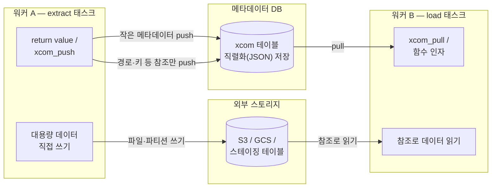

<figure class="post-figure post-figure--header">
<svg role="img" aria-label="XCom과 TaskFlow API를 한 장으로 정리한 그림. 왼쪽 워커 A의 extract 태스크와 오른쪽 워커 B의 load 태스크는 격리된 상자로 그려져 있고, 그 사이에 두 갈래 길이 있다. 위쪽 컨트롤 경로에서는 작은 소포(XCom)가 가운데 메타데이터 DB의 xcom 테이블을 경유해 push되고 pull되어 경로·키·행 수 같은 작은 메타데이터만 오간다. 아래쪽 데이터 경로에서는 큰 데이터가 외부 스토리지(S3·GCS·스테이징 테이블)로 직접 쓰이고, 워커 B는 XCom으로 받은 참조로 스토리지에서 직접 읽는다. TaskFlow의 load(extract()) 함수 호출 문법 뒤에서도 같은 push/pull 왕복이 일어난다." viewBox="0 0 680 324" xmlns="http://www.w3.org/2000/svg">
  <title>XCom · TaskFlow API — 작은 메타데이터는 XCom으로, 큰 데이터는 스토리지로</title>
  <defs>
    <marker id="xh-arrow" viewBox="0 0 10 10" refX="8" refY="5" markerWidth="6" markerHeight="6" orient="auto-start-reverse">
      <path d="M0,0 L10,5 L0,10 z" fill="var(--secondary-color)"/>
    </marker>
    <marker id="xh-arrow-gold" viewBox="0 0 10 10" refX="8" refY="5" markerWidth="5" markerHeight="5" orient="auto-start-reverse">
      <path d="M0,0 L10,5 L0,10 z" fill="var(--gold)"/>
    </marker>
  </defs>

  <!-- ===== title ===== -->
  <text x="340" y="26" text-anchor="middle" font-size="17" font-weight="800" fill="currentColor" letter-spacing="1.5">XCOM · TASKFLOW API</text>
  <text x="340" y="48" text-anchor="middle" font-size="10.5" font-weight="700" fill="currentColor" opacity="0.72">격리된 태스크 사이의 두 갈래 길 — 작은 메타데이터는 XCom, 큰 데이터는 스토리지</text>

  <!-- ===== worker A (extract) ===== -->
  <rect x="28" y="96" width="136" height="150" rx="6" fill="var(--bg-light)" stroke="currentColor" stroke-width="2.5"/>
  <text x="96" y="118" text-anchor="middle" font-size="12.5" font-weight="700" fill="currentColor">워커 A</text>
  <text x="96" y="134" text-anchor="middle" font-size="9" fill="currentColor" opacity="0.72">extract 태스크</text>
  <rect x="44" y="146" width="104" height="22" rx="4" fill="var(--bg-panel)" stroke="currentColor" stroke-width="1"/>
  <text x="96" y="161" text-anchor="middle" font-size="9" font-weight="700" fill="currentColor">@task extract()</text>
  <text x="96" y="192" text-anchor="middle" font-size="8.5" fill="currentColor" opacity="0.75">return "s3://…" (경로)</text>
  <text x="96" y="212" text-anchor="middle" font-size="8.5" font-weight="700" fill="var(--gold)">df → Parquet 직접 쓰기</text>

  <!-- ===== worker B (load) ===== -->
  <rect x="516" y="96" width="136" height="150" rx="6" fill="var(--bg-light)" stroke="currentColor" stroke-width="2.5"/>
  <text x="584" y="118" text-anchor="middle" font-size="12.5" font-weight="700" fill="currentColor">워커 B</text>
  <text x="584" y="134" text-anchor="middle" font-size="9" fill="currentColor" opacity="0.72">load 태스크</text>
  <rect x="532" y="146" width="104" height="22" rx="4" fill="var(--bg-panel)" stroke="currentColor" stroke-width="1"/>
  <text x="584" y="161" text-anchor="middle" font-size="9" font-weight="700" fill="currentColor">@task load(path)</text>
  <text x="584" y="192" text-anchor="middle" font-size="8.5" fill="currentColor" opacity="0.75">경로를 인자로 수신</text>
  <text x="584" y="212" text-anchor="middle" font-size="8.5" font-weight="700" fill="var(--gold)">경로로 직접 읽기</text>

  <!-- ===== metadata DB (control path) ===== -->
  <path d="M288,96 v46 a52,10 0 0 0 104,0 v-46" fill="var(--bg-light)" stroke="var(--secondary-color)" stroke-width="2.5"/>
  <ellipse cx="340" cy="96" rx="52" ry="10" fill="var(--bg-light)" stroke="var(--secondary-color)" stroke-width="2.5"/>
  <text x="340" y="122" text-anchor="middle" font-size="10.5" font-weight="700" fill="currentColor">메타데이터 DB</text>
  <text x="340" y="137" text-anchor="middle" font-size="8.5" fill="currentColor" opacity="0.75">xcom 테이블</text>
  <text x="340" y="172" text-anchor="middle" font-size="9" font-weight="700" fill="var(--secondary-color)">컨트롤 경로 — 작은 메타데이터만</text>

  <!-- push / pull arrows -->
  <line x1="168" y1="118" x2="282" y2="118" stroke="var(--secondary-color)" stroke-width="2.5" marker-end="url(#xh-arrow)"/>
  <text x="224" y="108" text-anchor="middle" font-size="8.5" fill="currentColor" opacity="0.8">push — 경로·키·행 수</text>
  <line x1="398" y1="118" x2="510" y2="118" stroke="var(--secondary-color)" stroke-width="2.5" marker-end="url(#xh-arrow)"/>
  <text x="454" y="108" text-anchor="middle" font-size="8.5" fill="currentColor" opacity="0.8">pull — 함수 인자로 주입</text>

  <!-- XCom parcel (envelope) -->
  <rect x="211" y="126" width="26" height="17" rx="2" fill="var(--bg-panel)" stroke="var(--secondary-color)" stroke-width="1.5"/>
  <polyline points="212,128 224,138 236,128" fill="none" stroke="var(--secondary-color)" stroke-width="1.5"/>

  <!-- TaskFlow note -->
  <text x="340" y="196" text-anchor="middle" font-size="9" fill="currentColor" opacity="0.7">TaskFlow: load(extract()) — 함수 호출 뒤에서 같은 push/pull 왕복</text>

  <!-- ===== external storage (data path) ===== -->
  <path d="M276,228 v52 a64,10 0 0 0 128,0 v-52" fill="var(--bg-light)" stroke="var(--gold)" stroke-width="2.5"/>
  <ellipse cx="340" cy="228" rx="64" ry="10" fill="var(--bg-light)" stroke="var(--gold)" stroke-width="2.5"/>
  <text x="340" y="256" text-anchor="middle" font-size="10.5" font-weight="700" fill="currentColor">외부 스토리지</text>
  <text x="340" y="272" text-anchor="middle" font-size="8.5" fill="currentColor" opacity="0.75">S3 · GCS · 스테이징 테이블</text>

  <!-- data-path arrows (thick) -->
  <line x1="140" y1="246" x2="270" y2="260" stroke="var(--gold)" stroke-width="4" marker-end="url(#xh-arrow-gold)"/>
  <text x="196" y="284" text-anchor="middle" font-size="8.5" font-weight="700" fill="var(--gold)">대용량 데이터 쓰기</text>
  <line x1="410" y1="260" x2="524" y2="248" stroke="var(--gold)" stroke-width="4" marker-end="url(#xh-arrow-gold)"/>
  <text x="482" y="284" text-anchor="middle" font-size="8.5" font-weight="700" fill="var(--gold)">참조로 직접 읽기</text>

  <text x="340" y="312" text-anchor="middle" font-size="9" font-weight="700" fill="var(--gold)">데이터 경로 — 큰 데이터는 스토리지로</text>
</svg>
<figcaption>격리된 두 워커 사이의 두 갈래 흐름 — 작은 메타데이터는 메타데이터 DB의 XCom 우편함으로, 큰 데이터는 외부 스토리지에 쓰고 참조만 넘긴다</figcaption>
</figure>

## 들어가며

1단계에서 파이프라인을 DAG로 선언했고, [2단계 — 스케줄러 · Executor 내부](/2026/07/13/airflow-scheduler-executor-internals.html)에서 그 선언이 무엇에 의해 어떻게 실행되는지를 봤습니다. 거기서 확인한 사실 하나가 이번 글의 출발점입니다. **각 task instance는 서로 격리된 프로세스에서 실행됩니다.** LocalExecutor라면 별도 자식 프로세스, CeleryExecutor라면 아예 다른 머신의 워커, KubernetesExecutor라면 독립된 파드입니다. 앞 태스크가 메모리에 만들어 둔 변수를 뒤 태스크가 그냥 읽을 방법은 없습니다.

그렇다면 "추출 태스크가 찾은 파일 경로"나 "집계 태스크가 계산한 행 수"를 다음 태스크로 어떻게 넘길까요. 그 답이 **XCom**(cross-communication)이고, 그 XCom을 파이썬답게 감싸 "함수 호출·반환값"의 모양으로 만들어 준 것이 **TaskFlow API**입니다. 그리고 XCom에는 반드시 알아야 할 한계가 하나 있습니다 — **XCom은 작은 메타데이터용 우편함이지, 데이터를 실어 나르는 버스가 아닙니다.** 이 세 가지가 이번 3단계의 주제입니다. 이 글은 [Airflow Essential Curriculum](/2026/07/12/airflow-essential-curriculum.html)의 3단계로, 여기까지 마치면 "선언(1~3단계)" 막이 완성됩니다.

<div class="post-summary-box" markdown="1">

### 📌 이 글에서 다루는 내용

#### 🔍 핵심 주제

- **XCom 기초**: 격리 실행이라는 전제, `xcom_push`/`xcom_pull` 메커니즘, return value의 자동 push, 메타데이터 DB 직렬화 저장과 크기 한계, Jinja 템플릿에서의 사용
- **TaskFlow API**: `@task`·`@dag` 데코레이터, 함수 호출·반환값이 곧 의존성·XCom이 되는 방식, 전통 오퍼레이터와의 혼용, `multiple_outputs`, dynamic task mapping(`expand`/`partial`)
- **대용량 데이터 전달**: DataFrame을 XCom에 넣는 안티패턴 → 외부 스토리지에 쓰고 참조만 넘기는 패턴 → custom XCom backend로 이를 투명하게 만들기

#### 🎯 왜 중요한가

태스크 간 데이터 전달을 잘못 설계하면 메타데이터 DB가 파이프라인의 병목이자 폭탄이 됩니다. XCom의 원리와 한계를 정확히 알아야 "작은 것은 XCom으로, 큰 것은 스토리지로"라는 견고한 설계가 손에 잡힙니다.

</div>

## 한눈에 보기 — 두 갈래 흐름

이 글의 뼈대를 한 장으로 그리면 이렇습니다. 태스크 사이에는 두 갈래 길이 있습니다. **작은 메타데이터**(경로, 파티션 키, 행 수)는 메타데이터 DB의 XCom 테이블을 경유해 오가고, **큰 데이터**(DataFrame, 파일 본문)는 외부 스토리지에 직접 쓴 뒤 그 **참조만** XCom으로 넘깁니다. TaskFlow API는 이 XCom 경유를 함수 호출 문법 뒤로 숨겨 줄 뿐, 아래 구조 자체는 동일합니다.





위쪽 경로(XCom)는 편리하지만 좁고, 아래쪽 경로(외부 스토리지)는 손이 가지만 넓습니다. 이 구분을 몸에 붙이는 것이 이번 글의 목표입니다.

## XCom — 격리된 태스크 사이의 작은 우편함

### 왜 필요한가 — 태스크는 서로 다른 프로세스다

Airflow의 태스크는 파이썬 함수처럼 보이지만, 실행 시점에는 **각각 독립된 프로세스**(어쩌면 다른 머신, 다른 파드)입니다. 같은 DAG 파일에 정의되어 있다는 사실은 "같은 메모리 공간을 공유한다"를 전혀 의미하지 않습니다. 전역 변수에 결과를 담아 두는 코드는 로컬의 `airflow tasks test`에서는 우연히 동작할 수 있어도, CeleryExecutor·KubernetesExecutor 위에서는 반드시 깨집니다.

그래서 Airflow는 태스크 간 통신 채널을 하나 제공합니다. **XCom**은 `(dag_id, task_id, run_id, key)`로 식별되는 작은 값을 **메타데이터 DB의 `xcom` 테이블**에 저장하고 꺼내 오는 메커니즘입니다. 앞 태스크가 push한 값을 뒤 태스크가 pull하는, DB를 경유하는 우편함이라고 생각하면 정확합니다.

<figure class="post-figure">
<svg role="img" aria-label="격리 실행을 보여 주는 개념도. 왼쪽 프로세스 A(extract)의 메모리에는 order_ids 리스트가 들어 있고, 오른쪽 프로세스 B(load)의 메모리는 비어 있다. 두 프로세스를 직접 잇는 점선은 가운데 X표로 끊겨 있어 메모리 공유와 직접 참조가 불가능함을 나타낸다. 유일한 통로는 아래쪽 메타데이터 DB의 xcom 테이블로, A가 값을 JSON으로 직렬화해 push하면(1) dag_id·task_id·run_id·key로 run별 격리 저장되고(2) B가 pull해 역직렬화하여 인자로 주입받는다(3)." viewBox="0 0 640 266" xmlns="http://www.w3.org/2000/svg">
  <title>같은 DAG 파일 ≠ 같은 메모리 — 유일한 통로는 메타데이터 DB 경유 XCom</title>
  <defs>
    <marker id="xi1-arrow" viewBox="0 0 10 10" refX="8" refY="5" markerWidth="6" markerHeight="6" orient="auto-start-reverse">
      <path d="M0,0 L10,5 L0,10 z" fill="var(--secondary-color)"/>
    </marker>
  </defs>

  <text x="320" y="24" text-anchor="middle" font-size="14" font-weight="800" fill="currentColor">같은 DAG 파일 ≠ 같은 메모리</text>

  <!-- ===== process A ===== -->
  <rect x="36" y="44" width="180" height="112" rx="6" fill="var(--bg-light)" stroke="currentColor" stroke-width="2.5"/>
  <text x="126" y="66" text-anchor="middle" font-size="11" font-weight="700" fill="currentColor">프로세스 A — extract</text>
  <rect x="52" y="80" width="148" height="26" rx="3" fill="var(--bg-panel)" stroke="currentColor" stroke-width="1.2"/>
  <text x="126" y="97" text-anchor="middle" font-size="9" fill="currentColor">메모리: order_ids = […]</text>
  <text x="126" y="126" text-anchor="middle" font-size="8" fill="currentColor" opacity="0.7">별도 프로세스 · 다른 머신의</text>
  <text x="126" y="140" text-anchor="middle" font-size="8" fill="currentColor" opacity="0.7">워커 · 독립 파드일 수 있다</text>

  <!-- ===== process B ===== -->
  <rect x="424" y="44" width="180" height="112" rx="6" fill="var(--bg-light)" stroke="currentColor" stroke-width="2.5"/>
  <text x="514" y="66" text-anchor="middle" font-size="11" font-weight="700" fill="currentColor">프로세스 B — load</text>
  <rect x="440" y="80" width="148" height="26" rx="3" fill="var(--bg-panel)" stroke="currentColor" stroke-width="1.2"/>
  <text x="514" y="97" text-anchor="middle" font-size="9" fill="currentColor">메모리: (비어 있다)</text>
  <text x="514" y="126" text-anchor="middle" font-size="8" fill="currentColor" opacity="0.7">앞 태스크의 변수를</text>
  <text x="514" y="140" text-anchor="middle" font-size="8" fill="currentColor" opacity="0.7">그냥 읽을 방법이 없다</text>

  <!-- ===== broken direct link ===== -->
  <line x1="216" y1="92" x2="424" y2="92" stroke="currentColor" stroke-width="2" stroke-dasharray="6 5" opacity="0.5"/>
  <line x1="306" y1="78" x2="334" y2="106" stroke="var(--accent-color)" stroke-width="3.5" stroke-linecap="round"/>
  <line x1="334" y1="78" x2="306" y2="106" stroke="var(--accent-color)" stroke-width="3.5" stroke-linecap="round"/>
  <text x="320" y="66" text-anchor="middle" font-size="9" font-weight="700" fill="var(--accent-color)">메모리 공유·직접 참조 불가</text>

  <!-- ===== metadata DB ===== -->
  <path d="M228,200 v44 a92,11 0 0 0 184,0 v-44" fill="var(--bg-light)" stroke="var(--secondary-color)" stroke-width="2.5"/>
  <ellipse cx="320" cy="200" rx="92" ry="11" fill="var(--bg-light)" stroke="var(--secondary-color)" stroke-width="2.5"/>
  <text x="320" y="226" text-anchor="middle" font-size="11" font-weight="700" fill="currentColor">메타데이터 DB — xcom 테이블</text>
  <text x="320" y="242" text-anchor="middle" font-size="8" fill="currentColor" opacity="0.75">(dag_id, task_id, run_id, key) → JSON 한 칸</text>

  <!-- push / pull round trip -->
  <path d="M126,156 C126,190 170,202 220,204" fill="none" stroke="var(--secondary-color)" stroke-width="2.5" marker-end="url(#xi1-arrow)"/>
  <text x="44" y="186" text-anchor="start" font-size="8.5" font-weight="700" fill="currentColor">① push</text>
  <text x="44" y="200" text-anchor="start" font-size="8" fill="currentColor" opacity="0.75">JSON 직렬화</text>

  <text x="320" y="172" text-anchor="middle" font-size="8.5" fill="currentColor" opacity="0.8">② run별로 격리 저장</text>

  <path d="M420,204 C470,202 514,190 514,156" fill="none" stroke="var(--secondary-color)" stroke-width="2.5" marker-end="url(#xi1-arrow)"/>
  <text x="596" y="186" text-anchor="end" font-size="8.5" font-weight="700" fill="currentColor">③ pull</text>
  <text x="596" y="200" text-anchor="end" font-size="8" fill="currentColor" opacity="0.75">역직렬화 → 인자 주입</text>
</svg>
<figcaption>격리된 두 프로세스는 메모리를 공유할 수 없다 — 유일한 통로는 메타데이터 DB를 경유하는 push → 저장 → pull 왕복이다</figcaption>
</figure>

### push와 pull — 그리고 return value의 자동 push

전통적인(오퍼레이터 중심) 스타일에서 XCom은 task instance(`ti`) 객체의 `xcom_push`/`xcom_pull` 메서드로 다룹니다. 그리고 중요한 편의 규칙이 하나 있습니다 — **`python_callable`의 반환값은 `return_value`라는 key로 자동 push**됩니다.

```python
import pendulum

from airflow import DAG
from airflow.operators.python import PythonOperator


def extract(**context):
    """주문 ID 목록을 추출하고 XCom으로 push한다."""
    order_ids = [1001, 1002, 1003]

    # 방법 1: 명시적 push — key를 직접 지정
    context["ti"].xcom_push(key="order_ids", value=order_ids)

    # 방법 2: return — key="return_value"로 자동 push
    return len(order_ids)


def load(**context):
    """앞 태스크가 push한 값을 pull해서 사용한다."""
    ti = context["ti"]

    # key를 지정해 pull
    order_ids = ti.xcom_pull(task_ids="extract", key="order_ids")

    # key 생략 시 기본값은 "return_value" — extract의 반환값
    count = ti.xcom_pull(task_ids="extract")

    print(f"{count}건 적재 시작: {order_ids}")


with DAG(
    dag_id="xcom_classic",
    start_date=pendulum.datetime(2026, 7, 1, tz="Asia/Seoul"),
    schedule="@daily",
    catchup=False,
) as dag:
    t_extract = PythonOperator(task_id="extract", python_callable=extract)
    t_load = PythonOperator(task_id="load", python_callable=load)

    t_extract >> t_load  # 의존성은 여전히 손으로 선언해야 한다
```

여기서 눈여겨볼 점이 두 가지입니다. 첫째, `xcom_pull`은 **같은 DAG run 안**의 값을 찾습니다 — 2단계에서 본 논리적 실행 단위(run)별로 XCom이 격리되므로, 어제 run의 값이 오늘 run에 섞여 들어오지 않습니다. 둘째, XCom은 데이터만 나를 뿐 **의존성을 만들어 주지는 않습니다**. `t_extract >> t_load`를 빼먹으면 두 태스크가 병렬로 실행되어 pull이 `None`을 돌려받는, 고전적인 버그가 됩니다. 이 "데이터 흐름과 의존성 선언이 따로 논다"는 어색함이 뒤에서 볼 TaskFlow API의 존재 이유입니다.

### Jinja 템플릿에서 꺼내 쓰기

XCom은 파이썬 코드에서만이 아니라 **Jinja 템플릿 필드**에서도 pull할 수 있습니다. BashOperator의 커맨드나 SQL 오퍼레이터의 쿼리처럼 템플릿이 적용되는 필드라면, 렌더링 시점에 `ti.xcom_pull(...)`이 실행됩니다.


```python
from airflow.operators.bash import BashOperator

report = BashOperator(
    task_id="report",
    # 템플릿 렌더링 시점에 extract의 return_value를 pull한다
    bash_command=(
        "echo '오늘 추출된 주문 수: "
        "{{ ti.xcom_pull(task_ids=\"extract\") }}'"
    ),
)
```


파이썬 함수를 거치지 않는 오퍼레이터(Bash, SQL, 각종 프로바이더 오퍼레이터)에 앞 태스크의 결과를 주입하는 표준 통로가 바로 이 템플릿 pull입니다.

### 메타데이터 DB에 저장된다 — 그래서 작아야 한다

XCom의 모든 특성과 한계는 한 문장에서 나옵니다. **XCom 값은 직렬화되어 메타데이터 DB의 테이블 한 칸에 저장됩니다.** 기본 직렬화는 JSON입니다(과거의 pickle 직렬화는 보안 문제로 비권장이었고, Airflow 3에서는 제거 수순입니다). 여기서 세 가지가 따라 나옵니다.

- **직렬화 가능해야 한다**: JSON으로 표현되는 값 — 문자열, 숫자, 리스트, dict — 이 안전합니다. DB 커넥션 객체나 파일 핸들 같은 것은 넣을 수 없습니다.
- **크기 한계가 있다**: 한계는 메타데이터 DB 종류에 따라 다릅니다. 대표적으로 MySQL의 BLOB 컬럼은 64KB 수준이고, PostgreSQL은 이론상 1GB까지 받아 주지만 그것은 "가능"이지 "권장"이 아닙니다. 실무 감각으로는 **수 KB, 커도 1MB 미만**의 메타데이터만 XCom에 두는 것이 안전선입니다.
- **DB가 공유 자원이다**: 메타데이터 DB는 스케줄러의 스케줄링 루프, task 상태 전이, UI 조회가 모두 두드리는 심장입니다. 여기에 매 run마다 수십 MB짜리 XCom을 밀어 넣으면, 파이프라인 하나가 Airflow 전체의 성능을 끌어내립니다.

정리하면 XCom의 용도는 명확합니다 — **파일 경로, 파티션 키, 행 수, 상태 플래그 같은 작은 메타데이터.** 데이터 그 자체는 다른 길로 보내야 하며, 그 이야기는 마지막 섹션에서 다룹니다.

## TaskFlow API — 함수 호출이 곧 의존성이고 XCom이다

### 같은 파이프라인, 두 가지 문법

위의 classic 스타일 예제를 다시 보면 군더더기가 눈에 띕니다. `**context`에서 `ti`를 꺼내고, task_id 문자열로 pull하고, 데이터가 흐르는 방향과 별개로 `>>`를 또 선언합니다. Airflow 2.0에서 도입된 **TaskFlow API**는 이 전 과정을 데코레이터로 감쌉니다. `@task`를 붙인 파이썬 함수는 태스크가 되고, **함수 호출과 반환값이 그대로 XCom push/pull과 의존성 선언**이 됩니다.

```python
import pendulum

from airflow.decorators import dag, task
# Airflow 3에서는 태스크 SDK로 이동: from airflow.sdk import dag, task


@dag(
    dag_id="xcom_taskflow",
    start_date=pendulum.datetime(2026, 7, 1, tz="Asia/Seoul"),
    schedule="@daily",
    catchup=False,
)
def xcom_taskflow():

    @task
    def extract() -> list[int]:
        """반환값이 자동으로 XCom push된다."""
        return [1001, 1002, 1003]

    @task
    def load(order_ids: list[int]) -> None:
        """인자로 받는 순간 자동으로 XCom pull된다."""
        print(f"{len(order_ids)}건 적재 시작: {order_ids}")

    # 함수 호출 = XCom 전달 + 의존성 선언(extract >> load)을 한 번에
    load(extract())


xcom_taskflow()  # 모듈 로드 시 DAG 객체 생성
```

classic 버전과 기능은 동일하지만, `ti`도 `xcom_pull`도 `>>`도 보이지 않습니다. `extract()`가 돌려주는 것은 실제 리스트가 아니라 **XComArg**라는 지연 참조 객체이고, 그것을 `load()`의 인자로 넘기는 순간 Airflow가 "load는 extract에 의존하며, 실행 시 extract의 return_value를 pull해 인자로 주입하라"는 선언으로 해석합니다. **데이터가 흐르는 모양이 곧 DAG의 모양**이 되므로, XCom을 쓰면서 의존성 선언을 빼먹는 버그가 문법적으로 불가능해집니다.

착각하면 안 되는 지점 — TaskFlow는 XCom을 **대체**하는 것이 아니라 **숨기는** 것입니다. `load(extract())`의 이면에서는 여전히 반환값이 직렬화되어 메타데이터 DB를 왕복합니다. 따라서 앞서 본 크기 한계도 그대로 적용됩니다. 함수 호출처럼 보인다고 DataFrame을 반환하기 시작하면, classic 스타일에서 저지르던 실수를 더 우아한 문법으로 저지르는 셈입니다.

### multiple_outputs — dict를 key별 XCom으로 쪼개기

태스크 하나가 여러 값을 돌려줄 때, dict를 통째로 하나의 XCom에 넣는 대신 **key별로 쪼개 push**할 수 있습니다.

```python
@task(multiple_outputs=True)
def profile_data() -> dict[str, int]:
    return {"rows": 42_000, "errors": 3}


@task
def alert_if_dirty(error_count: int) -> None:
    if error_count > 0:
        print(f"품질 경보: 오류 {error_count}건")


stats = profile_data()
alert_if_dirty(stats["errors"])   # "errors" key의 XCom만 pull
```

`multiple_outputs=True`면 `rows`·`errors`가 각각 별도 XCom으로 저장되고, `stats["errors"]`처럼 첨자로 개별 값을 참조할 수 있습니다. 함수 시그니처의 반환 타입 힌트가 `dict[str, ...]`이면 Airflow가 이 옵션을 자동으로 켜 주기도 하지만, 의도를 드러내려면 명시하는 편이 좋습니다.

### 전통 오퍼레이터와의 혼용

실무 DAG가 순수 TaskFlow만으로 완성되는 경우는 드뭅니다. S3 전송, SQL 실행, Spark 잡 제출은 프로바이더가 제공하는 classic 오퍼레이터가 이미 잘하고 있기 때문입니다. 다행히 두 스타일은 자연스럽게 섞입니다 — `@task` 함수가 돌려주는 XComArg를 **classic 오퍼레이터의 템플릿 필드에 그대로 넘기면** 됩니다.

```python
from airflow.providers.common.sql.operators.sql import SQLExecuteQueryOperator


@task
def build_merge_sql(partition: str) -> str:
    """실행할 SQL 문자열을 동적으로 조립해 반환(→ XCom push)."""
    return f"""
        DELETE FROM mart.daily_sales WHERE dt = '{partition}';
        INSERT INTO mart.daily_sales
        SELECT dt, SUM(amount) FROM staging.orders
        WHERE dt = '{partition}' GROUP BY dt;
    """


sql = build_merge_sql(partition="2026-07-13")

run_merge = SQLExecuteQueryOperator(
    task_id="run_merge",
    conn_id="warehouse",
    sql=sql,  # XComArg → 실행 시점에 pull되어 SQL 문자열로 렌더링
)

sql >> run_merge  # XComArg에도 >> 연산이 동작한다
```

반대 방향 — classic 오퍼레이터의 결과를 `@task` 함수에서 받기 — 도 가능합니다. 오퍼레이터 인스턴스의 `.output` 속성이 그 태스크의 `return_value` XComArg이므로, `my_task(some_operator.output)`처럼 넘기면 됩니다. 두 세계를 잇는 어댑터가 XComArg 하나로 통일되어 있는 셈입니다.

### dynamic task mapping — expand와 partial

TaskFlow가 진가를 발휘하는 곳이 **dynamic task mapping**(Airflow 2.3+)입니다. "처리할 파티션 목록을 런타임에 알게 되고, 파티션마다 태스크를 하나씩 만들고 싶다"는 요구를 생각해 보죠. 예전에는 DAG 파싱 시점에 개수가 고정되어야 해서 우회로가 필요했지만, 이제는 **앞 태스크의 XCom 결과를 받아 태스크를 팬아웃**할 수 있습니다.

```python
@task
def list_regions() -> list[str]:
    """런타임에 처리 대상 리전을 결정한다(→ XCom push)."""
    return ["kr", "jp", "us"]


@task
def process_region(region: str, run_date: str) -> str:
    print(f"{run_date} / {region} 파티션 처리")
    return f"s3://bucket/sales/dt={run_date}/region={region}/"


# partial: 모든 매핑 인스턴스에 공통인 인자를 고정
# expand: XCom(리전 목록)의 원소 수만큼 태스크 인스턴스를 생성
paths = process_region.partial(run_date="2026-07-13").expand(
    region=list_regions()
)
```

`list_regions`가 3개 리전을 반환하면 `process_region`은 **매핑된 태스크 인스턴스 3개**로 펼쳐져 병렬 실행되고, 결과가 5개면 5개로 펼쳐집니다. `partial()`은 모든 인스턴스에 공통인 인자를, `expand()`는 인스턴스마다 달라지는 인자를 받습니다. 여기서 XCom이 두 번 일합니다 — 팬아웃의 **입력**(리전 목록)도 XCom이고, 매핑된 각 인스턴스의 **출력**(경로 목록)도 XCom으로 모여 다음 태스크가 리스트로 받을 수 있습니다. "런타임 데이터가 그래프 모양을 결정한다"는 이 패턴은 XCom·TaskFlow·스케줄러가 맞물려야 성립하는, 3단계 내용의 총합 같은 기능입니다.

## 대용량 데이터 — XCom은 버스가 아니다

### 안티패턴 — DataFrame을 XCom으로 넘기기

TaskFlow의 편리함이 만드는 가장 흔한 함정이 이것입니다.

```python
# 안티패턴 — 이렇게 하지 말 것
@task
def extract_orders() -> "pd.DataFrame":
    import pandas as pd
    df = pd.read_sql("SELECT * FROM orders WHERE ...", conn)  # 수백만 행
    return df  # DataFrame 전체가 직렬화되어 메타데이터 DB로!


@task
def transform(df: "pd.DataFrame") -> "pd.DataFrame":
    return df.groupby("region").sum()
```

로컬에서 작은 샘플로 테스트할 때는 아무 문제가 없어 보입니다. 그러나 프로덕션에서는 매 run마다 수백 MB가 직렬화되어(애초에 JSON 직렬화가 실패할 수도 있습니다) 메타데이터 DB에 쌓입니다. DB 용량이 부풀고, 스케줄러를 포함한 모든 컴포넌트의 DB 접근이 느려지며, MySQL이라면 64KB 한계에서 즉시 터집니다. **일이 데이터 경로로, 조율이 컨트롤 경로로** 가야 하는데, 컨트롤 경로(메타데이터 DB)에 데이터를 실어 버린 것입니다.

### 올바른 패턴 — 데이터는 스토리지로, 참조만 XCom으로

교정은 단순하고 기계적입니다. **큰 데이터는 태스크가 외부 스토리지(S3·GCS·스테이징 테이블)에 직접 쓰고, XCom으로는 그 위치를 가리키는 참조 — 경로, URI, 파티션 키 — 만 넘깁니다.**

```python
@task
def extract_orders(ds: str | None = None) -> str:
    """데이터는 S3에 쓰고, XCom에는 경로 문자열만 넘긴다."""
    import pandas as pd

    df = pd.read_sql("SELECT * FROM orders WHERE ...", conn)  # 수백만 행

    path = f"s3://my-bucket/staging/orders/dt={ds}/orders.parquet"
    df.to_parquet(path)  # 데이터 경로: 오브젝트 스토리지
    return path           # 컨트롤 경로: 몇십 바이트짜리 문자열


@task
def transform(path: str) -> str:
    """참조를 받아 스토리지에서 직접 읽는다."""
    import pandas as pd

    df = pd.read_parquet(path)
    out = f"{path.rsplit('/', 1)[0]}/agg.parquet"
    df.groupby("region").sum().to_parquet(out)
    return out


transform(extract_orders())
```

XCom을 통과하는 것은 수십 바이트의 경로 문자열뿐이므로 메타데이터 DB는 가볍게 유지되고, 데이터는 그 용도로 설계된 스토리지가 나릅니다. 경로에 논리 날짜(`ds`) 기반 파티션을 넣어 두면, 5단계에서 다룰 백필·재실행 시에도 각 run이 자기 구간의 파일만 덮어쓰는 멱등한 구조와 자연스럽게 맞물립니다. 데이터 웨어하우스 중심 파이프라인이라면 파일 대신 **스테이징 테이블 + 파티션 키**를 참조로 넘기는 변형도 같은 원리입니다.

<figure class="post-figure">
<svg role="img" aria-label="안티패턴과 올바른 패턴을 위아래로 대비한 그림. 위 패널(안티패턴)에서는 extract와 transform 태스크 사이의 메타데이터 DB 파이프에 수백 MB짜리 DataFrame 덩어리가 억지로 끼어 파이프 가운데가 부풀어 금이 가 터질 듯한 모습이다. 아래 패널(올바른 패턴)에서는 굵은 데이터 흐름이 extract에서 외부 스토리지(S3·GCS·스테이징 테이블)로 곧장 흘러가고, 메타데이터 DB 파이프에는 몇십 바이트짜리 경로 문자열 쪽지만 얇게 지나가며, transform은 그 참조로 스토리지에서 직접 읽는다." viewBox="0 0 660 368" xmlns="http://www.w3.org/2000/svg">
  <title>안티패턴 vs 올바른 패턴 — 데이터는 스토리지로, 참조만 XCom으로</title>
  <defs>
    <marker id="xi2-gold" viewBox="0 0 10 10" refX="8" refY="5" markerWidth="5" markerHeight="5" orient="auto-start-reverse">
      <path d="M0,0 L10,5 L0,10 z" fill="var(--gold)"/>
    </marker>
  </defs>

  <!-- ===== TOP: anti-pattern ===== -->
  <rect x="16" y="20" width="628" height="150" rx="6" fill="var(--bg-light)" stroke="var(--accent-color)" stroke-width="2"/>
  <text x="32" y="42" text-anchor="start" font-size="11" font-weight="700" fill="var(--accent-color)">안티패턴 — DataFrame을 XCom으로 넘긴다</text>

  <rect x="40" y="64" width="96" height="60" rx="4" fill="var(--bg-panel)" stroke="currentColor" stroke-width="2"/>
  <text x="88" y="90" text-anchor="middle" font-size="10.5" font-weight="700" fill="currentColor">extract</text>
  <text x="88" y="106" text-anchor="middle" font-size="8" fill="currentColor" opacity="0.75">수백만 행 df</text>

  <rect x="524" y="64" width="96" height="60" rx="4" fill="var(--bg-panel)" stroke="currentColor" stroke-width="2"/>
  <text x="572" y="90" text-anchor="middle" font-size="10.5" font-weight="700" fill="currentColor">transform</text>
  <text x="572" y="106" text-anchor="middle" font-size="8" fill="currentColor" opacity="0.75">df를 기다림</text>

  <!-- bulging DB pipe -->
  <path d="M136,84 C250,84 258,54 330,54 C402,54 410,84 524,84" fill="none" stroke="var(--accent-color)" stroke-width="2.5"/>
  <path d="M136,110 C250,110 258,140 330,140 C402,140 410,110 524,110" fill="none" stroke="var(--accent-color)" stroke-width="2.5"/>
  <ellipse cx="330" cy="97" rx="56" ry="36" fill="var(--bg-panel)" stroke="var(--accent-color)" stroke-width="2"/>
  <text x="330" y="94" text-anchor="middle" font-size="10.5" font-weight="700" fill="currentColor">DataFrame</text>
  <text x="330" y="110" text-anchor="middle" font-size="8" fill="currentColor" opacity="0.8">수백 MB 직렬화</text>
  <!-- cracks -->
  <polyline points="312,50 318,38 326,48 332,36" fill="none" stroke="var(--accent-color)" stroke-width="2" stroke-linecap="round"/>
  <polyline points="346,52 354,42 360,50" fill="none" stroke="var(--accent-color)" stroke-width="2" stroke-linecap="round"/>
  <text x="330" y="160" text-anchor="middle" font-size="8.5" fill="currentColor" opacity="0.75">메타데이터 DB — 작은 우편함에 데이터 버스를 밀어 넣은 꼴</text>

  <!-- ===== BOTTOM: correct pattern ===== -->
  <rect x="16" y="186" width="628" height="170" rx="6" fill="var(--bg-light)" stroke="var(--secondary-color)" stroke-width="2"/>
  <text x="32" y="208" text-anchor="start" font-size="11" font-weight="700" fill="var(--secondary-color)">올바른 패턴 — 데이터는 스토리지로, 참조만 XCom으로</text>

  <rect x="40" y="224" width="96" height="56" rx="4" fill="var(--bg-panel)" stroke="currentColor" stroke-width="2"/>
  <text x="88" y="248" text-anchor="middle" font-size="10.5" font-weight="700" fill="currentColor">extract</text>
  <text x="88" y="264" text-anchor="middle" font-size="8" fill="currentColor" opacity="0.75">df 생성</text>

  <rect x="524" y="224" width="96" height="56" rx="4" fill="var(--bg-panel)" stroke="currentColor" stroke-width="2"/>
  <text x="572" y="248" text-anchor="middle" font-size="10.5" font-weight="700" fill="currentColor">transform</text>
  <text x="572" y="264" text-anchor="middle" font-size="8" fill="currentColor" opacity="0.75">경로로 읽기</text>

  <!-- thin DB pipe with path note -->
  <text x="330" y="232" text-anchor="middle" font-size="8.5" fill="currentColor" opacity="0.75">XCom: 경로 문자열 몇십 바이트</text>
  <line x1="136" y1="240" x2="524" y2="240" stroke="var(--secondary-color)" stroke-width="1.8" opacity="0.9"/>
  <line x1="136" y1="258" x2="524" y2="258" stroke="var(--secondary-color)" stroke-width="1.8" opacity="0.9"/>
  <polygon points="506,243 518,249 506,255" fill="var(--secondary-color)"/>
  <rect x="282" y="241" width="96" height="16" rx="3" fill="var(--bg-panel)" stroke="var(--secondary-color)" stroke-width="1.5"/>
  <text x="330" y="253" text-anchor="middle" font-size="8" fill="currentColor">s3://…/dt=…/x.parquet</text>

  <!-- external storage -->
  <path d="M256,306 v36 a74,9 0 0 0 148,0 v-36" fill="var(--bg-light)" stroke="var(--gold)" stroke-width="2.5"/>
  <ellipse cx="330" cy="306" rx="74" ry="9" fill="var(--bg-light)" stroke="var(--gold)" stroke-width="2.5"/>
  <text x="330" y="324" text-anchor="middle" font-size="9.5" font-weight="700" fill="currentColor">외부 스토리지</text>
  <text x="330" y="338" text-anchor="middle" font-size="8" fill="currentColor" opacity="0.75">S3 · GCS · 스테이징 테이블</text>

  <!-- thick data-path arrows -->
  <line x1="90" y1="280" x2="250" y2="310" stroke="var(--gold)" stroke-width="4" marker-end="url(#xi2-gold)"/>
  <text x="150" y="308" text-anchor="middle" font-size="8.5" font-weight="700" fill="var(--gold)">Parquet 쓰기</text>
  <line x1="410" y1="310" x2="570" y2="282" stroke="var(--gold)" stroke-width="4" marker-end="url(#xi2-gold)"/>
  <text x="510" y="308" text-anchor="middle" font-size="8.5" font-weight="700" fill="var(--gold)">참조로 읽기</text>
</svg>
<figcaption>위 — 컨트롤 경로(메타데이터 DB)에 데이터를 실어 파이프가 부푸는 안티패턴. 아래 — 데이터는 스토리지로 직접 흘리고 XCom에는 경로 참조만 넘기는 패턴</figcaption>
</figure>

### custom XCom backend — 참조 패턴을 투명하게

위 패턴의 유일한 아쉬움은 "쓰고-경로 반환-경로 받아-읽고"를 태스크마다 반복해야 한다는 점입니다. Airflow는 이 보일러플레이트를 시스템 차원에서 없애는 확장점을 제공합니다 — **custom XCom backend**입니다. XCom의 직렬화/역직렬화 단계를 가로채는 클래스를 지정하면, "일정 크기 이상의 값은 오브젝트 스토리지에 쓰고 XCom 테이블에는 참조만 남기는" 동작을 **모든 태스크에 투명하게** 적용할 수 있습니다.

직접 구현한다면 `BaseXCom`의 두 훅을 재정의하는 구조입니다.

```python
from airflow.models.xcom import BaseXCom


class S3XComBackend(BaseXCom):
    """큰 값은 S3에 저장하고 XCom 테이블에는 참조만 남기는 백엔드(개요)."""

    @staticmethod
    def serialize_value(value, *, key=None, task_id=None,
                        dag_id=None, run_id=None, map_index=None):
        if _is_large(value):                       # 예: 직렬화 크기 > 1MiB
            uri = _upload_to_s3(value, dag_id, task_id, run_id, key)
            value = {"__xcom_ref__": uri}          # DB에는 참조만
        return BaseXCom.serialize_value(value)

    @staticmethod
    def deserialize_value(result):
        value = BaseXCom.deserialize_value(result)
        if isinstance(value, dict) and "__xcom_ref__" in value:
            return _download_from_s3(value["__xcom_ref__"])  # 참조를 실체로
        return value
```

다만 요즘은 직접 구현할 필요조차 없습니다. **`common.io` 프로바이더의 ObjectStorage XCom backend**가 정확히 이 동작을 기성품으로 제공합니다. 설정만으로 켤 수 있습니다.

```ini
[core]
# XCom 직렬화를 가로채는 백엔드 지정
xcom_backend = airflow.providers.common.io.xcom.backend.XComObjectStorageBackend

[common.io]
# 임계값을 넘는 XCom 값이 저장될 위치
xcom_objectstorage_path = s3://my-bucket/xcom
# 이 크기(바이트)를 넘으면 DB 대신 오브젝트 스토리지로 (1MiB)
xcom_objectstorage_threshold = 1048576
xcom_objectstorage_compression = gzip
```

이렇게 하면 작은 값은 지금처럼 메타데이터 DB에, 임계값을 넘는 값은 자동으로 S3에 저장되고, pull하는 쪽 코드는 아무것도 몰라도 됩니다. 단, 백엔드가 있다고 해서 "DataFrame을 마음껏 return해도 된다"로 읽으면 곤란합니다. 값이 여전히 태스크 프로세스에서 통째로 직렬화·업로드·다운로드되므로, 진짜 대용량 데이터는 처음부터 스토리지 네이티브 포맷(Parquet 파티션, 스테이징 테이블)으로 흘리는 명시적 참조 패턴이 낫습니다. 백엔드는 "애매하게 큰 중간 크기 값"의 안전망으로 이해하는 것이 균형 잡힌 시각입니다.

## 정리

태스크 사이로 데이터를 흘리는 법을 세 층으로 쌓았습니다.

- **태스크는 격리된 프로세스다**: 다른 워커·파드에서 돌기에 메모리 공유가 불가능하고, 그래서 메타데이터 DB를 경유하는 XCom이 존재합니다. `xcom_push`/`xcom_pull`, return value의 `return_value` 자동 push, Jinja 템플릿의 `ti.xcom_pull(...)`이 기본기입니다.
- **XCom은 작은 메타데이터용이다**: 값이 직렬화되어 DB 한 칸에 저장되므로 크기 한계(DB에 따라 다르지만 실무 안전선은 KB 단위)가 있고, 메타데이터 DB는 Airflow 전체의 공유 자원이므로 데이터 버스로 쓰면 안 됩니다.
- **TaskFlow API는 XCom을 숨긴다, 없애지 않는다**: `@task` 함수의 호출·반환이 곧 의존성 선언과 XCom 전달이 되어 classic 스타일의 보일러플레이트와 "의존성 선언 누락" 버그를 없애 줍니다. XComArg로 classic 오퍼레이터와 자유롭게 섞이고, `multiple_outputs`와 `expand`/`partial`(dynamic task mapping)로 확장됩니다.
- **큰 데이터는 참조 패턴으로**: 데이터는 S3·GCS·스테이징 테이블에 쓰고 XCom에는 경로·파티션 키만 넘깁니다. custom XCom backend(ObjectStorage backend)는 이 패턴을 임계값 기반으로 투명하게 적용해 주는 안전망입니다.

이로써 "선언" 막(1~3단계)이 완성되었습니다 — 파이프라인을 코드로 선언하고, 무엇이 어떻게 실행되는지 알고, 태스크 사이로 데이터를 흘릴 수 있습니다. 다음 막은 "견고함"입니다. 파이프라인이 외부 세계 — 도착하지 않은 파일, 끝나지 않은 외부 잡 — 를 **효율적으로 기다리는 법**부터 시작합니다.

### 다음 학습 (Next Learning)

- [Airflow 센서 · Deferrable 오퍼레이터](/2026/07/13/airflow-sensors-deferrable-operators.html) — 4단계: 외부 상태를 워커 슬롯 낭비 없이 기다리는 법
- [Airflow 스케줄러 · Executor 내부](/2026/07/13/airflow-scheduler-executor-internals.html) — 2단계: 이 글의 전제인 "격리 실행"이 어떻게 이루어지는지 복습
- [Airflow Essential Curriculum](/2026/07/12/airflow-essential-curriculum.html) — 시리즈 로드맵으로 돌아가 진행 상황 확인하기
