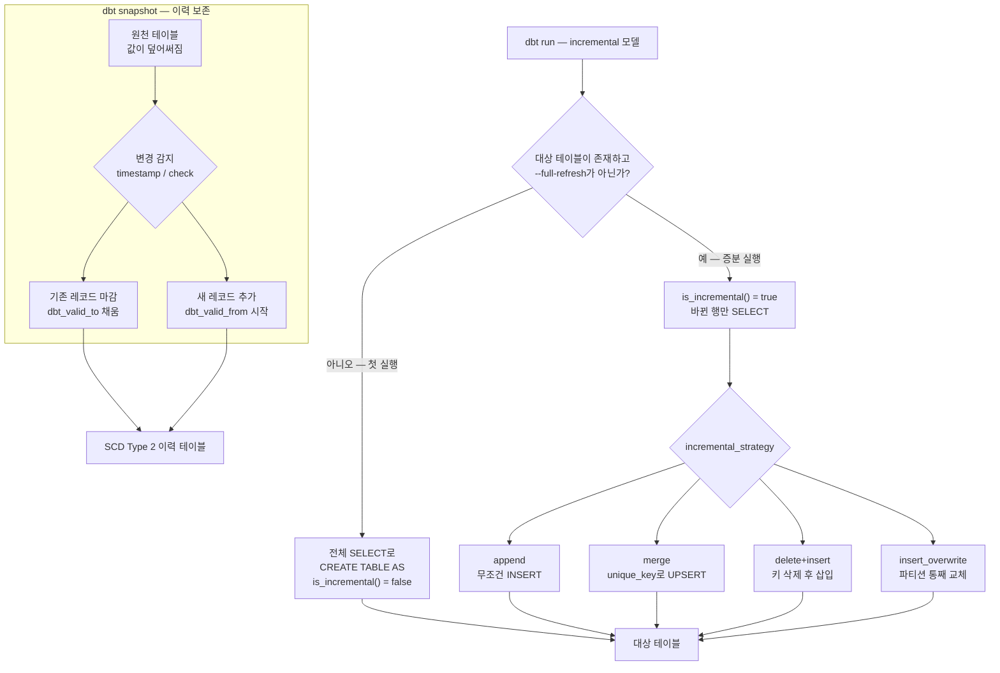

<figure class="post-figure post-figure--header">
<svg role="img" aria-label="incremental과 snapshot을 한 장으로 정리한 그림. 왼쪽은 incremental 모델로, 어제와 달라진 0.1%의 바뀐 행만 담긴 작은 상자가 MERGE 화살표를 따라 거대한 기존 대상 테이블의 위쪽 몇 행으로 병합되고, 매일 전체 재빌드라는 문구에는 취소선이 그어져 있다. 오른쪽은 snapshot으로, 원천 테이블에서 주문 1234의 status가 pending과 paid를 지나 shipped로 덮어써져 현재 값만 남은 한 행이 dbt snapshot 화살표를 따라 이력 테이블로 내려가, pending·paid·shipped 세 개의 유효 구간 막대가 타임라인 위에 이어 붙는 SCD Type 2 레코드로 보존된다. 마지막 shipped 구간은 dbt_valid_to가 NULL인 열린 구간이다." viewBox="0 0 680 340" xmlns="http://www.w3.org/2000/svg">
  <title>incremental — 바뀐 행만 병합 · snapshot — 덮어써진 값의 이력을 SCD Type 2로 보존</title>
  <defs>
    <marker id="incsnap-arrow" viewBox="0 0 10 10" refX="8" refY="5" markerWidth="6" markerHeight="6" orient="auto-start-reverse">
      <path d="M0,0 L10,5 L0,10 z" fill="var(--secondary-color)"/>
    </marker>
  </defs>

  <text x="340" y="26" text-anchor="middle" font-size="17" font-weight="800" fill="currentColor" letter-spacing="1.5">INCREMENTAL · SNAPSHOT</text>

  <!-- divider -->
  <line x1="348" y1="44" x2="348" y2="316" stroke="currentColor" stroke-width="1" stroke-dasharray="4,5" opacity="0.22"/>

  <!-- ===== LEFT: incremental ===== -->
  <text x="30" y="54" text-anchor="start" font-size="10.5" font-weight="700" fill="currentColor" opacity="0.72">incremental — 전체 재빌드 대신 바뀐 행만 병합</text>

  <!-- changed rows (delta) box -->
  <rect x="36" y="80" width="112" height="66" rx="4" fill="var(--bg-light)" stroke="var(--secondary-color)" stroke-width="2.5"/>
  <text x="92" y="98" text-anchor="middle" font-size="10" font-weight="700" fill="currentColor">바뀐 행</text>
  <g stroke="var(--gold)" stroke-width="5" opacity="0.8">
    <line x1="50" y1="110" x2="134" y2="110"/>
    <line x1="50" y1="122" x2="134" y2="122"/>
    <line x1="50" y1="134" x2="134" y2="134"/>
  </g>
  <text x="92" y="162" text-anchor="middle" font-size="9" fill="currentColor" opacity="0.75">어제와 달라진 0.1%</text>

  <!-- crossed-out full rebuild -->
  <text x="92" y="206" text-anchor="middle" font-size="10" fill="currentColor" opacity="0.55">매일 전체 재빌드</text>
  <line x1="48" y1="202" x2="136" y2="202" stroke="var(--accent-color)" stroke-width="2"/>

  <!-- merge arrow -->
  <line x1="148" y1="113" x2="192" y2="113" stroke="var(--secondary-color)" stroke-width="2.5" marker-end="url(#incsnap-arrow)"/>
  <text x="170" y="103" text-anchor="middle" font-size="9" font-weight="700" fill="currentColor" opacity="0.8">MERGE</text>

  <!-- big target table -->
  <rect x="198" y="72" width="124" height="228" rx="4" fill="var(--bg-light)" stroke="currentColor" stroke-width="2.5"/>
  <g fill="var(--gold)" opacity="0.55">
    <rect x="206" y="86" width="108" height="8"/>
    <rect x="206" y="100" width="108" height="8"/>
    <rect x="206" y="114" width="108" height="8"/>
  </g>
  <g stroke="currentColor" stroke-width="1.1" opacity="0.3">
    <line x1="208" y1="136" x2="312" y2="136"/>
    <line x1="208" y1="150" x2="312" y2="150"/>
    <line x1="208" y1="164" x2="312" y2="164"/>
    <line x1="208" y1="178" x2="312" y2="178"/>
    <line x1="208" y1="192" x2="312" y2="192"/>
    <line x1="208" y1="206" x2="312" y2="206"/>
    <line x1="208" y1="220" x2="312" y2="220"/>
    <line x1="208" y1="234" x2="312" y2="234"/>
    <line x1="208" y1="248" x2="312" y2="248"/>
    <line x1="208" y1="262" x2="312" y2="262"/>
    <line x1="208" y1="276" x2="312" y2="276"/>
    <line x1="208" y1="290" x2="312" y2="290"/>
  </g>
  <text x="260" y="318" text-anchor="middle" font-size="9" fill="currentColor" opacity="0.75">기존 대상 테이블 — 나머지는 그대로</text>

  <!-- ===== RIGHT: snapshot ===== -->
  <text x="372" y="54" text-anchor="start" font-size="10.5" font-weight="700" fill="currentColor" opacity="0.72">snapshot — 덮어써진 값의 이력을 SCD Type 2로</text>

  <!-- source single row -->
  <rect x="380" y="72" width="240" height="46" rx="4" fill="var(--bg-light)" stroke="currentColor" stroke-width="2"/>
  <text x="396" y="90" text-anchor="start" font-size="9.5" fill="currentColor" opacity="0.75">order 1234 · status</text>
  <text x="430" y="108" text-anchor="middle" font-size="10" fill="currentColor" opacity="0.45">pending</text>
  <line x1="410" y1="105" x2="450" y2="105" stroke="var(--accent-color)" stroke-width="1.5"/>
  <text x="490" y="108" text-anchor="middle" font-size="10" fill="currentColor" opacity="0.45">paid</text>
  <line x1="476" y1="105" x2="504" y2="105" stroke="var(--accent-color)" stroke-width="1.5"/>
  <text x="560" y="108" text-anchor="middle" font-size="10.5" font-weight="700" fill="var(--secondary-color)">shipped</text>
  <text x="500" y="134" text-anchor="middle" font-size="9" fill="currentColor" opacity="0.75">원천 — 현재 값만 남는다</text>

  <!-- snapshot arrow -->
  <line x1="500" y1="142" x2="500" y2="170" stroke="var(--secondary-color)" stroke-width="2.5" marker-end="url(#incsnap-arrow)"/>
  <text x="510" y="160" text-anchor="start" font-size="9" font-weight="700" fill="currentColor" opacity="0.8">dbt snapshot</text>

  <!-- history panel -->
  <rect x="368" y="176" width="284" height="124" rx="4" fill="var(--bg-panel)" stroke="var(--gold)" stroke-width="2.5"/>
  <g stroke="currentColor" stroke-width="1" stroke-dasharray="3,3" opacity="0.25">
    <line x1="436" y1="190" x2="436" y2="272"/>
    <line x1="502" y1="190" x2="502" y2="272"/>
    <line x1="568" y1="190" x2="568" y2="272"/>
  </g>
  <text x="430" y="208" text-anchor="end" font-size="9" fill="currentColor">pending</text>
  <rect x="436" y="198" width="66" height="13" fill="var(--gold)" opacity="0.5" stroke="currentColor" stroke-width="1.2"/>
  <text x="430" y="234" text-anchor="end" font-size="9" fill="currentColor">paid</text>
  <rect x="502" y="224" width="66" height="13" fill="var(--gold)" opacity="0.5" stroke="currentColor" stroke-width="1.2"/>
  <text x="430" y="260" text-anchor="end" font-size="9" fill="currentColor">shipped</text>
  <rect x="568" y="250" width="48" height="13" fill="var(--secondary-color)" opacity="0.5" stroke="currentColor" stroke-width="1.2"/>
  <line x1="616" y1="256" x2="640" y2="256" stroke="var(--secondary-color)" stroke-width="2" stroke-dasharray="4,3" marker-end="url(#incsnap-arrow)"/>
  <text x="616" y="246" text-anchor="middle" font-size="8" fill="currentColor" opacity="0.8">NULL</text>
  <g font-size="8.5" fill="currentColor" opacity="0.75" text-anchor="middle">
    <text x="436" y="288">6/29</text>
    <text x="502" y="288">6/30</text>
    <text x="568" y="288">7/02</text>
  </g>
  <text x="510" y="318" text-anchor="middle" font-size="9" fill="currentColor" opacity="0.75">이력 테이블 — dbt_valid_from → dbt_valid_to 구간이 쌓인다</text>
</svg>
<figcaption>왼쪽: incremental은 바뀐 행만 기존 테이블에 병합한다. 오른쪽: snapshot은 덮어써지는 원천 값을 유효 구간(SCD Type 2) 레코드로 보존한다.</figcaption>
</figure>

## 들어가며

[3단계](/2026/07/14/dbt-macros-jinja.html)에서 매크로와 Jinja로 **SQL을 프로그래밍하는 법**을 익혔습니다. dbt가 SQL을 컴파일 시점에 생성한다는 사실, 그리고 `` 분기로 상황에 따라 다른 SQL을 만들어낼 수 있다는 사실을 손에 쥐었죠. 이번 단계는 그 능력이 가장 극적으로 쓰이는 곳 — **규모와 시간**을 다룹니다.

작은 프로젝트에서 dbt의 기본 동작은 완벽합니다. `dbt run`을 칠 때마다 모든 모델을 처음부터 다시 만들어도(view든 table이든), 몇 분이면 끝나니까요. 그런데 원천 테이블이 수십억 행으로 자라면 이야기가 달라집니다. 어제와 달라진 행은 0.1%뿐인데 매일 100%를 다시 스캔·재계산하는 것은 시간으로도 비용으로도 감당이 안 됩니다. 첫 번째 답이 **incremental 모델** — 바뀐 행만 골라 기존 테이블에 병합하는 구체화 전략입니다.

한편 규모와는 결이 다른 두 번째 문제가 있습니다. 원천 시스템의 `orders.status`는 `pending`에서 `shipped`로 **덮어써집니다**. 원천에는 언제나 "현재 값"만 남고, "6월 30일에는 무슨 값이었나"는 사라집니다. 지난 분기의 지표를 재현하려면 그 시점의 값이 필요한데 말이죠. 이 변화 이력을 보존하는 dbt의 답이 **snapshot** — SCD Type 2(Slowly Changing Dimension)의 구현입니다.

이 글은 [dbt Essential Curriculum](/2026/07/12/dbt-essential-curriculum.html)의 **4단계**로, "재사용과 규모" 막(3~4단계)을 마무리하는 편입니다. 그리고 뒤에서 보겠지만, 증분 모델의 전략 선택은 결국 [Airflow 백필에서 만난 멱등](/2026/07/13/airflow-backfill-catchup-idempotency.html)과 같은 질문 — "다시 돌려도 안전한가?" — 으로 수렴합니다.

<div class="post-summary-box" markdown="1">

### 📌 이 글에서 다루는 내용

- **incremental 모델**: 전체 재빌드의 비용 문제, `is_incremental()` 분기가 첫 실행과 증분 실행에서 만들어내는 서로 다른 컴파일 SQL, `unique_key` 병합, `on_schema_change`, `--full-refresh`, late-arriving data를 위한 lookback 패턴
- **incremental 전략**: append · merge · delete+insert · insert_overwrite의 동작 차이, 웨어하우스별 지원(BigQuery/Snowflake/Databricks/Postgres)과 선택 기준, 멱등성 관점의 비교
- **snapshot과 SCD Type 2**: 덮어쓰는 원천의 이력 문제, `dbt_valid_from`/`dbt_valid_to` 레코드의 생성 규칙, timestamp 전략 vs check 전략, "그 시점의 값"을 downstream에서 조회하는 패턴, 그리고 스냅샷 운영의 주의점 — 스냅샷은 코드가 아니라 **되돌릴 수 없는 데이터**

</div>

## 한눈에 보기 — 증분과 이력, 두 개의 시간 문제

이 글이 다루는 두 기능은 모두 "시간"에 대한 답이지만 방향이 다릅니다. incremental은 **앞으로 쌓일 데이터의 규모**를 감당하는 기술이고(같은 결과를 더 싸게), snapshot은 **뒤로 사라질 데이터의 이력**을 붙잡는 기술입니다(원천에 없는 것을 새로 만들어냄). 전자는 언제든 전체 재빌드로 복원할 수 있지만, 후자는 놓친 순간을 영영 복원할 수 없습니다 — 이 비대칭이 운영 방식의 차이를 만듭니다.



## incremental 모델 — 바뀐 행만 처리한다

### 왜 필요한가: 전체 재빌드의 비용

`materialized='table'` 모델은 `dbt run`마다 `CREATE TABLE AS SELECT`로 **테이블을 통째로 다시 만듭니다**. 이 단순함은 강력한 장점입니다 — 결과는 언제나 소스와 로직만의 함수이고, 상태가 없으니 꼬일 일도 없습니다. 문제는 규모입니다. 이벤트 로그가 50억 행이고 하루에 500만 행씩 늘어난다면, 매일 0.1%를 추가하기 위해 100%를 스캔·정렬·재작성하는 셈입니다. BigQuery처럼 스캔량에 과금하는 웨어하우스에서는 비용이, Snowflake처럼 시간에 과금하는 곳에서는 웨어하우스 가동 시간이 그대로 낭비됩니다.

incremental 모델의 계약은 이렇습니다. **"첫 실행에만 전체를 만들고, 이후 실행에서는 새로 생기거나 바뀐 행만 골라 기존 테이블에 반영한다."** 대가는 상태가 생긴다는 것 — 대상 테이블의 현재 내용이 다음 실행의 동작에 영향을 주게 되고, 그래서 이 글의 나머지 절반은 그 상태를 안전하게 다루는 이야기입니다.

### is_incremental() 분기 — 하나의 모델, 두 벌의 SQL

전형적인 incremental 모델은 이렇게 생겼습니다.


```sql
-- models/marts/fct_orders.sql
{{ config(
    materialized='incremental',
    unique_key='order_id',
    incremental_strategy='merge',
    on_schema_change='append_new_columns'
) }}

select
    order_id,
    customer_id,
    status,
    amount,
    updated_at
from {{ source('shop', 'orders') }}


  -- 증분 실행에서만 붙는 필터: 대상 테이블의 최고 수위(high-water mark)보다
  -- 새로운 행만 읽는다. {{ this }}는 "지금 만들고 있는 바로 이 테이블".
  where updated_at > (select max(updated_at) from {{ this }})

```


핵심은 `` 분기입니다. 3단계에서 배운 대로 이 분기는 **컴파일 시점**에 평가되므로, 같은 모델 파일이 상황에 따라 완전히 다른 SQL로 컴파일됩니다. `is_incremental()`이 `true`가 되는 조건은 세 가지가 모두 성립할 때입니다: ① 대상 테이블이 웨어하우스에 이미 존재하고, ② 모델이 `materialized='incremental'`이며, ③ `--full-refresh` 플래그가 없을 것.

**첫 실행** (또는 `--full-refresh`) — 분기가 `false`이므로 `where` 필터가 사라지고, dbt는 평범한 table 모델처럼 전체를 만듭니다.

```sql
-- dbt compile 결과 (첫 실행): 필터 없는 전체 빌드
create table analytics.fct_orders as (
    select
        order_id,
        customer_id,
        status,
        amount,
        updated_at
    from raw.shop.orders
);
```

**증분 실행** — 분기가 `true`이므로 필터가 살아나고, dbt는 그 결과를 임시 테이블에 담은 뒤 전략(여기서는 `merge`)에 따라 기존 테이블에 반영합니다.

```sql
-- dbt compile 결과 (증분 실행): 바뀐 행만 골라 병합
create temporary table fct_orders__dbt_tmp as (
    select
        order_id, customer_id, status, amount, updated_at
    from raw.shop.orders
    where updated_at > (select max(updated_at) from analytics.fct_orders)
);

merge into analytics.fct_orders as dbt_internal_dest
using fct_orders__dbt_tmp as dbt_internal_source
on dbt_internal_dest.order_id = dbt_internal_source.order_id
when matched then update set
    customer_id = dbt_internal_source.customer_id,
    status      = dbt_internal_source.status,
    amount      = dbt_internal_source.amount,
    updated_at  = dbt_internal_source.updated_at
when not matched then insert
    (order_id, customer_id, status, amount, updated_at)
    values (dbt_internal_source.order_id, dbt_internal_source.customer_id,
            dbt_internal_source.status, dbt_internal_source.amount,
            dbt_internal_source.updated_at);
```

두 컴파일 결과를 나란히 놓고 보면 incremental의 본질이 보입니다. **모델 파일은 "무엇이 최신 데이터인가"만 선언하고, 첫 실행/증분 실행의 차이와 병합의 기계적인 부분은 dbt가 생성합니다.** `dbt compile` 또는 `target/run/` 디렉터리에서 실제 생성 SQL을 확인하는 습관은 incremental 디버깅의 기본기입니다.

<figure class="post-figure">
<svg role="img" aria-label="하나의 모델 파일이 is_incremental() 분기에 따라 두 벌의 SQL로 갈라지는 과정. 맨 위에 fct_orders.sql 모델 파일이 있고, 그 아래 is_incremental() 게이트 마름모가 세 가지 조건 — 대상 테이블 존재, materialized가 incremental, full-refresh 아님 — 을 판정한다. 왼쪽 가지는 false인 첫 실행으로 필터 없는 전체 SELECT의 CREATE TABLE AS 전체 빌드, 오른쪽 가지는 true인 증분 실행으로 where 필터로 바뀐 행만 temp 테이블에 담은 뒤 unique_key로 MERGE 병합한다. 두 가지 모두 아래의 대상 테이블로 모인다." viewBox="0 0 640 344" xmlns="http://www.w3.org/2000/svg">
  <title>is_incremental() 분기 — 하나의 모델 파일, 두 벌의 컴파일 SQL</title>
  <defs>
    <marker id="incbranch-arrow" viewBox="0 0 10 10" refX="8" refY="5" markerWidth="6" markerHeight="6" orient="auto-start-reverse">
      <path d="M0,0 L10,5 L0,10 z" fill="var(--secondary-color)"/>
    </marker>
  </defs>

  <!-- model file -->
  <rect x="228" y="18" width="184" height="60" rx="4" fill="var(--bg-light)" stroke="currentColor" stroke-width="2.5"/>
  <text x="320" y="38" text-anchor="middle" font-size="11" font-weight="700" fill="currentColor">fct_orders.sql — 파일은 하나</text>
  <text x="320" y="54" text-anchor="middle" font-size="8.5" fill="currentColor" opacity="0.8">materialized='incremental'</text>
  <text x="320" y="68" text-anchor="middle" font-size="8.5" fill="currentColor" opacity="0.8">if is_incremental() → where 필터</text>

  <line x1="320" y1="78" x2="320" y2="100" stroke="var(--secondary-color)" stroke-width="2.5" marker-end="url(#incbranch-arrow)"/>

  <!-- gate diamond -->
  <polygon points="320,102 402,134 320,166 238,134" fill="var(--bg-panel)" stroke="var(--gold)" stroke-width="2.5"/>
  <text x="320" y="131" text-anchor="middle" font-size="10" font-weight="700" fill="currentColor">is_incremental()</text>
  <text x="320" y="146" text-anchor="middle" font-size="8" fill="currentColor" opacity="0.75">세 조건 모두?</text>

  <!-- gate conditions -->
  <g font-size="8.5" fill="currentColor" opacity="0.75" text-anchor="start">
    <text x="416" y="116">① 대상 테이블이 이미 존재</text>
    <text x="416" y="130">② materialized='incremental'</text>
    <text x="416" y="144">③ --full-refresh 아님</text>
  </g>

  <!-- left branch: first run -->
  <line x1="238" y1="134" x2="152" y2="184" stroke="var(--secondary-color)" stroke-width="2.5" marker-end="url(#incbranch-arrow)"/>
  <text x="176" y="162" text-anchor="middle" font-size="9" font-weight="700" fill="currentColor">false — 첫 실행</text>
  <rect x="40" y="190" width="220" height="64" rx="4" fill="var(--bg-light)" stroke="currentColor" stroke-width="2"/>
  <text x="150" y="212" text-anchor="middle" font-size="10" font-weight="700" fill="currentColor">필터 없는 전체 SELECT</text>
  <text x="150" y="228" text-anchor="middle" font-size="8.5" fill="currentColor" opacity="0.8">create table ... as select ...</text>
  <text x="150" y="242" text-anchor="middle" font-size="8.5" fill="currentColor" opacity="0.7">평범한 table 모델처럼 전체 빌드</text>

  <!-- right branch: incremental run -->
  <line x1="402" y1="134" x2="488" y2="184" stroke="var(--secondary-color)" stroke-width="2.5" marker-end="url(#incbranch-arrow)"/>
  <text x="466" y="162" text-anchor="middle" font-size="9" font-weight="700" fill="currentColor">true — 증분 실행</text>
  <rect x="380" y="190" width="220" height="44" rx="4" fill="var(--bg-light)" stroke="currentColor" stroke-width="2"/>
  <text x="490" y="208" text-anchor="middle" font-size="10" font-weight="700" fill="currentColor">where 필터 — 바뀐 행만</text>
  <text x="490" y="224" text-anchor="middle" font-size="8.5" fill="currentColor" opacity="0.8">updated_at &gt; max(...) → temp 테이블</text>
  <line x1="490" y1="234" x2="490" y2="252" stroke="var(--secondary-color)" stroke-width="2.5" marker-end="url(#incbranch-arrow)"/>
  <rect x="380" y="256" width="220" height="38" rx="4" fill="var(--bg-light)" stroke="currentColor" stroke-width="2"/>
  <text x="490" y="272" text-anchor="middle" font-size="10" font-weight="700" fill="currentColor">MERGE — unique_key 병합</text>
  <text x="490" y="287" text-anchor="middle" font-size="8.5" fill="currentColor" opacity="0.8">일치하면 UPDATE, 없으면 INSERT</text>

  <!-- both into target table -->
  <line x1="150" y1="254" x2="252" y2="304" stroke="var(--secondary-color)" stroke-width="2.5" marker-end="url(#incbranch-arrow)"/>
  <line x1="490" y1="294" x2="392" y2="310" stroke="var(--secondary-color)" stroke-width="2.5" marker-end="url(#incbranch-arrow)"/>
  <rect x="250" y="300" width="140" height="36" rx="4" fill="var(--bg-panel)" stroke="var(--gold)" stroke-width="2.5"/>
  <text x="320" y="322" text-anchor="middle" font-size="10.5" font-weight="700" fill="currentColor">대상 테이블</text>
</svg>
<figcaption>같은 모델 파일이 컴파일 시점의 is_incremental() 분기에 따라 전체 빌드 SQL과 필터+병합 SQL, 두 벌로 갈라진다.</figcaption>
</figure>

### unique_key — 중복이 아니라 갱신으로

`unique_key`는 "이 키가 같은 행은 **같은 논리적 행**"이라는 선언입니다. 위 예시처럼 `updated_at` 기준으로 행을 가져오면, 6월 30일에 `pending`으로 들어왔던 주문이 7월 1일에 `shipped`로 갱신되어 **다시** 걸려 들어옵니다. `unique_key`가 없으면 이 행은 중복 삽입되어 주문 하나가 두 행이 되고, `unique_key='order_id'`가 있으면 merge가 기존 행을 갱신합니다. 즉 `unique_key`는 "새 행 추가"만이 아니라 "**기존 행의 변경 반영**"까지 증분으로 처리하게 해 주는 장치입니다. 복합 키는 `unique_key=['ds', 'customer_id']`처럼 리스트로 지정합니다.

### on_schema_change — 모델 컬럼이 바뀌면

incremental 모델은 상태(기존 테이블)를 유지하므로, 모델 SELECT에 컬럼을 추가·삭제하면 기존 테이블과 어긋납니다. `on_schema_change`가 그 처리 방침입니다.

| 옵션 | 동작 |
| --- | --- |
| `ignore` (기본값) | 스키마 변경을 무시. 새 컬럼은 대상 테이블에 반영되지 않고 조용히 버려짐 |
| `fail` | 스키마가 어긋나면 실행 실패. "모르고 지나가는" 사고 방지 |
| `append_new_columns` | 새 컬럼을 대상 테이블에 추가. 삭제된 컬럼은 그대로 둠 |
| `sync_all_columns` | 추가·삭제 모두 동기화 (데이터 타입 변경은 제외) |

주의할 점: 어느 옵션이든 **새 컬럼의 과거 행은 채워 주지 않습니다**. `append_new_columns`로 컬럼이 추가되어도 기존 행에서는 `NULL`입니다. 과거까지 채우려면 결국 `--full-refresh`가 필요합니다. 기본값 `ignore`는 조용히 데이터를 잃는 쪽이므로, 실무에서는 최소한 `fail`이나 `append_new_columns`를 명시하는 편이 안전합니다.

### --full-refresh — 증분의 탈출구

incremental 모델의 로직 자체를 고쳤다면(집계 방식 변경, 버그 수정), 이미 쌓인 테이블은 옛 로직의 산물이므로 증분만으로는 바로잡히지 않습니다. 그럴 때 전체 재빌드를 강제하는 것이 `--full-refresh`입니다.

```bash
# 이 모델(과 하류)을 처음부터 다시 빌드
dbt run --select fct_orders --full-refresh
```

`--full-refresh`는 `is_incremental()`을 `false`로 만들어 첫 실행과 동일하게 동작합니다. "incremental 모델은 언제든 full-refresh로 재현 가능해야 한다"가 건강한 설계의 리트머스 시험지입니다 — 뒤에서 볼 snapshot과의 결정적 차이이기도 합니다.

### lookback — late-arriving data를 위한 되감기

`max(updated_at)`보다 새 행만 읽는 high-water mark 방식에는 구멍이 하나 있습니다. **늦게 도착하는 데이터(late-arriving data)**입니다. 모바일 앱이 오프라인이었다가 이틀 뒤 이벤트를 몰아 보내면, 그 이벤트의 타임스탬프는 이미 지나간 수위 아래라서 필터에 걸러져 영영 적재되지 않습니다.

실무 관례는 수위에서 며칠을 **되감아(lookback)** 읽는 것입니다. 며칠치가 다시 걸려 들어오지만, `unique_key` 병합이 중복을 갱신으로 흡수해 주므로 결과는 안전합니다.


```sql

  -- 3일 lookback: 수위 아래로 늦게 도착한 행까지 다시 쓸어 담는다.
  -- 겹치는 3일치는 unique_key 병합이 갱신으로 흡수한다.
  where event_time >= (
      select dateadd('day', -3, max(event_time)) from {{ this }}
  )

```


lookback 폭은 "데이터가 최대 얼마나 늦게 오는가"의 함수입니다. 넓힐수록 안전하지만 증분의 비용 이점이 줄어드는 트레이드오프이므로, 원천의 지연 분포를 보고 정합니다. 지연의 꼬리가 아주 길다면 "평소엔 3일 lookback + 주 1회 full-refresh"처럼 조합하기도 합니다.

## incremental 전략 — 병합의 네 가지 방식과 멱등성

바뀐 행을 **골라내는** 것이 앞 절이었다면, 골라낸 행을 기존 테이블에 **반영하는** 방식이 `incremental_strategy`입니다. 같은 SELECT라도 전략에 따라 생성되는 DML이 다르고, 재실행했을 때의 안전성도 갈립니다.

### 네 전략의 동작

**append** — 골라낸 행을 조건 없이 `INSERT`합니다. 가장 싸고(스캔도 조인도 없음) 가장 위험합니다. `unique_key`를 지정해도 중복 제거를 하지 않으므로, 같은 행이 두 번 걸리면 두 행이 됩니다. 불변 이벤트 로그처럼 "행이 갱신될 일이 절대 없고, 같은 구간을 두 번 읽을 일도 없는" 경우에만 씁니다.

**merge** — 임시 결과를 `MERGE` 문으로 병합합니다. `unique_key`가 일치하면 `UPDATE`, 없으면 `INSERT`. 갱신·중복을 모두 흡수하는 가장 범용적인 전략이고, Snowflake·BigQuery·Databricks에서 사실상의 기본값입니다. 비용은 병합 시 대상 테이블과의 조인 — 대상이 아주 크면 이 조인 자체가 비싸질 수 있어, BigQuery·Databricks에서는 파티션 힌트(`incremental_predicates` 등)로 병합 범위를 좁히는 튜닝을 합니다.

**delete+insert** — `unique_key`가 일치하는 기존 행을 `DELETE`한 뒤 새 행을 `INSERT`합니다. 결과는 merge와 유사하지만 두 문장으로 나뉘며, `MERGE` 문이 없거나 느린 웨어하우스(Redshift, Postgres 구버전)에서 merge의 대역으로 쓰입니다. 트랜잭션 지원이 약한 환경에서는 DELETE와 INSERT 사이의 중간 상태가 노출될 수 있다는 점을 의식해야 합니다.

**insert_overwrite** — 행 단위가 아니라 **파티션 단위**로 일합니다. 이번 실행 결과에 등장하는 파티션(예: 최근 3일치 날짜)을 계산하고, 대상 테이블에서 그 파티션들을 통째로 삭제한 뒤 새 결과로 다시 씁니다. `unique_key` 조인이 없어 대용량에서 merge보다 빠른 경우가 많고, "파티션 안은 전부 다시 계산"이므로 파티션 내부의 어떤 변경·삭제도 반영됩니다. 파티션 설계가 전제 조건이며, BigQuery·Databricks(Spark 계열)의 주력 전략입니다.

### 웨어하우스별 지원과 선택 기준

| 전략 | 동작 요약 | 대표 지원 | 어울리는 경우 |
| --- | --- | --- | --- |
| `append` | 무조건 INSERT | 사실상 전 어댑터 | 불변 이벤트 로그, 갱신 없음 |
| `merge` | unique_key로 UPSERT | Snowflake · BigQuery · Databricks · Postgres(15+) | 행 갱신이 있는 일반적인 팩트/차원 |
| `delete+insert` | 키 삭제 후 삽입 | Snowflake · Redshift · Postgres | MERGE가 없거나 느린 환경 |
| `insert_overwrite` | 파티션 통째 교체 | BigQuery · Databricks/Spark | 날짜 파티션된 대용량 테이블 |

선택의 사고 순서는 대략 이렇습니다. ① 행이 갱신되는가? 아니라면 append도 후보. ② 갱신된다면 행 단위(merge/delete+insert)와 파티션 단위(insert_overwrite) 중 무엇이 자연스러운가 — 시간 파티션이 뚜렷하고 "최근 N일을 다시 계산"하는 패턴이면 insert_overwrite가, 키 단위 갱신이 산발적이면 merge가 맞습니다. ③ 웨어하우스가 그 전략을 지원하고 잘 수행하는가. 참고로 dbt 1.9부터는 시간 구간별로 배치를 잘라 처리하는 `microbatch` 전략도 추가되었는데, "구간 단위로 잘라 통째로 대체한다"는 발상 자체는 아래 멱등성 논의의 연장선입니다.

### 멱등성 관점의 비교 — Airflow 백필과 만나는 지점

[Airflow 백필 편](/2026/07/13/airflow-backfill-catchup-idempotency.html)에서 세운 원칙을 기억할 겁니다 — **"같은 구간을 몇 번 돌려도 결과는 같은 한 벌"**. 오케스트레이터가 dbt를 스케줄 실행하는 순간, 그 재실행의 안전성은 정확히 incremental 전략이 결정합니다. 태스크 재시도, 실패 구간 clear, 한 달치 백필 — 이 모든 재실행에서:

- **append는 멱등이 아닙니다.** 같은 구간을 두 번 돌리면 그 구간의 행이 두 벌 쌓입니다. Airflow 편의 "append-only INSERT" 안티패턴이 dbt 세계에서 그대로 재현되는 자리입니다. append를 쓰는 모델을 재실행해야 한다면 full-refresh 말고는 정리 수단이 없습니다.
- **merge와 delete+insert는 키 수준에서 멱등입니다.** 같은 입력을 다시 병합해도 같은 키를 같은 값으로 덮으므로 상태가 수렴합니다. 단 조건이 있습니다 — SELECT가 결정적이어야 하고(같은 구간 입력이면 같은 출력), `unique_key`가 실제로 유일해야 합니다. 키가 중복되면 merge가 실패하거나(웨어하우스에 따라) 비결정적 결과가 됩니다.
- **insert_overwrite는 파티션 수준에서 멱등입니다.** "주소(파티션)를 구간으로 결정하고 통째로 대체한다" — Airflow 편의 멱등 패턴 1(파티션 덮어쓰기)과 글자까지 같은 이야기입니다. 재실행이 파티션 교체의 반복일 뿐이므로, 백필과 가장 궁합이 좋은 전략입니다.

정리하면, **오케스트레이터의 재실행 메커니즘(백필·재시도)과 dbt의 병합 전략은 한 계약의 양면입니다.** Airflow가 "이 구간을 다시 돌려라"라고 말할 수 있으려면, dbt 쪽에서 그 재실행을 흡수하는 전략(merge/insert_overwrite)이 받치고 있어야 합니다.

## snapshot — 덮어쓰는 원천에서 이력을 구해내기

### 문제: 원천은 현재만 기억한다

운영 DB의 테이블은 대부분 **현재 상태**만 유지합니다. `orders.status`는 `pending → paid → shipped`로 갱신되고, `customers.grade`는 승급 때마다 덮어써집니다. ETL이 매일 이 테이블을 복제해 와도 얻는 것은 "오늘의 현재 값"뿐입니다. 그런데 분석은 자주 과거를 묻습니다 — "6월 말 기준 VIP 고객은 몇 명이었나?", "이 주문이 각 상태에 며칠씩 머물렀나?", "지난 분기 리포트의 숫자를 그때 기준으로 재현해 달라". 원천에 이력이 없으니, **이력은 웨어하우스 쪽에서 만들어 쌓는 수밖에 없습니다.**

이때의 고전적 설계가 **SCD Type 2**입니다. 값이 바뀔 때 기존 행을 덮지 않고, "이 값은 언제부터 언제까지 유효했다"는 유효 구간을 붙여 **행을 추가**합니다. dbt에서 이것을 구현해 주는 것이 snapshot입니다.

### snapshot 정의와 dbt_valid_from / dbt_valid_to


```sql
-- snapshots/orders_snapshot.sql


{{ config(
    target_schema='snapshots',
    unique_key='order_id',
    strategy='timestamp',
    updated_at='updated_at'
) }}

select * from {{ source('shop', 'orders') }}


```


dbt 1.9부터는 같은 정의를 YAML로도 쓸 수 있습니다(신규 프로젝트의 권장 형태).

```yaml
# snapshots/orders_snapshot.yml
snapshots:
  - name: orders_snapshot
    relation: source('shop', 'orders')
    config:
      schema: snapshots
      unique_key: order_id
      strategy: timestamp
      updated_at: updated_at
```

`dbt run`이 아니라 **`dbt snapshot`** 명령이 이를 실행합니다. 실행할 때마다 dbt는 원천의 현재 상태를 스냅샷 테이블과 비교해, 바뀐 행에 대해 두 가지 일을 합니다: ① 기존 레코드의 `dbt_valid_to`를 채워 **마감**하고, ② 새 값으로 새 레코드를 열어 `dbt_valid_from`을 시작합니다. 예를 들어 주문 1234의 상태가 사흘에 걸쳐 바뀌었다면:

| order_id | status | dbt_valid_from | dbt_valid_to |
| --- | --- | --- | --- |
| 1234 | pending | 2026-06-29 06:00 | 2026-06-30 06:00 |
| 1234 | paid | 2026-06-30 06:00 | 2026-07-02 06:00 |
| 1234 | shipped | 2026-07-02 06:00 | `NULL` |

`dbt_valid_to IS NULL`인 행이 현재 값입니다. 원천에는 `shipped` 한 행만 남아 있지만, 스냅샷에는 세 단계의 역사가 유효 구간과 함께 보존됩니다. (이 밖에 dbt는 행 버전 식별자인 `dbt_scd_id`, 갱신 기준 시각인 `dbt_updated_at` 메타 컬럼도 함께 관리합니다.)

한 가지 해상도의 한계는 분명히 해 둘 필요가 있습니다. **스냅샷은 "실행 시점 사이"의 변화는 보지 못합니다.** 하루 한 번 스냅샷을 도는데 상태가 하루에 두 번 바뀌면 중간 상태 하나는 영영 기록되지 않습니다. 스냅샷의 이력 해상도는 실행 주기가 결정합니다.

<figure class="post-figure">
<svg role="img" aria-label="SCD Type 2 레코드가 쌓이는 과정. 위쪽은 원천 테이블로, 주문 1234의 status가 6월 29일 pending, 6월 30일 paid, 7월 2일 shipped로 덮어써지며 세 시점 모두 한 행만 존재하고 이전 값에는 취소선이 그어져 사라진다. 가운데의 dbt snapshot 화살표를 지나 아래쪽 snapshot 테이블에서는 같은 주문이 세 행이 되어, pending은 6월 29일부터 6월 30일까지, paid는 6월 30일부터 7월 2일까지의 닫힌 유효 구간 막대로, shipped는 7월 2일에 시작해 dbt_valid_to가 NULL인 열린 구간 막대로 타임라인 위에 이어 붙는다." viewBox="0 0 640 306" xmlns="http://www.w3.org/2000/svg">
  <title>원천은 덮어쓰고, snapshot은 dbt_valid_from/dbt_valid_to 유효 구간으로 이력을 쌓는다</title>
  <defs>
    <marker id="scd2-arrow" viewBox="0 0 10 10" refX="8" refY="5" markerWidth="6" markerHeight="6" orient="auto-start-reverse">
      <path d="M0,0 L10,5 L0,10 z" fill="var(--secondary-color)"/>
    </marker>
    <marker id="scd2-arrow-red" viewBox="0 0 10 10" refX="8" refY="5" markerWidth="6" markerHeight="6" orient="auto-start-reverse">
      <path d="M0,0 L10,5 L0,10 z" fill="var(--accent-color)"/>
    </marker>
  </defs>

  <!-- ===== source: always one row ===== -->
  <text x="28" y="22" text-anchor="start" font-size="10.5" font-weight="700" fill="currentColor" opacity="0.72">원천 테이블 — 값이 덮어써져 항상 현재 한 행</text>

  <g font-size="8.5" fill="currentColor" opacity="0.75" text-anchor="middle">
    <text x="115" y="40">6/29</text>
    <text x="320" y="40">6/30</text>
    <text x="525" y="40">7/02</text>
  </g>

  <rect x="40" y="46" width="150" height="44" rx="4" fill="var(--bg-light)" stroke="currentColor" stroke-width="2"/>
  <text x="115" y="62" text-anchor="middle" font-size="8.5" fill="currentColor" opacity="0.7">order 1234</text>
  <text x="115" y="79" text-anchor="middle" font-size="10.5" font-weight="700" fill="var(--secondary-color)">pending</text>

  <line x1="190" y1="68" x2="243" y2="68" stroke="var(--accent-color)" stroke-width="2" marker-end="url(#scd2-arrow-red)"/>
  <text x="217" y="60" text-anchor="middle" font-size="8" fill="currentColor" opacity="0.7">덮어씀</text>

  <rect x="245" y="46" width="150" height="44" rx="4" fill="var(--bg-light)" stroke="currentColor" stroke-width="2"/>
  <text x="320" y="62" text-anchor="middle" font-size="8.5" fill="currentColor" opacity="0.7">order 1234</text>
  <text x="292" y="79" text-anchor="middle" font-size="9" fill="currentColor" opacity="0.45">pending</text>
  <line x1="274" y1="76" x2="310" y2="76" stroke="var(--accent-color)" stroke-width="1.5"/>
  <text x="345" y="79" text-anchor="middle" font-size="10.5" font-weight="700" fill="var(--secondary-color)">paid</text>

  <line x1="395" y1="68" x2="448" y2="68" stroke="var(--accent-color)" stroke-width="2" marker-end="url(#scd2-arrow-red)"/>
  <text x="422" y="60" text-anchor="middle" font-size="8" fill="currentColor" opacity="0.7">덮어씀</text>

  <rect x="450" y="46" width="150" height="44" rx="4" fill="var(--bg-light)" stroke="currentColor" stroke-width="2"/>
  <text x="525" y="62" text-anchor="middle" font-size="8.5" fill="currentColor" opacity="0.7">order 1234</text>
  <text x="492" y="79" text-anchor="middle" font-size="9" fill="currentColor" opacity="0.45">paid</text>
  <line x1="478" y1="76" x2="506" y2="76" stroke="var(--accent-color)" stroke-width="1.5"/>
  <text x="548" y="79" text-anchor="middle" font-size="10.5" font-weight="700" fill="var(--secondary-color)">shipped</text>

  <!-- snapshot arrow -->
  <line x1="320" y1="98" x2="320" y2="126" stroke="var(--secondary-color)" stroke-width="2.5" marker-end="url(#scd2-arrow)"/>
  <text x="330" y="116" text-anchor="start" font-size="9" font-weight="700" fill="currentColor" opacity="0.8">dbt snapshot — 실행마다 비교해 마감·추가</text>

  <!-- ===== snapshot table: three interval rows ===== -->
  <text x="28" y="148" text-anchor="start" font-size="10.5" font-weight="700" fill="currentColor" opacity="0.72">snapshot 테이블 — 같은 주문이 세 행, 유효 구간이 이어 붙는다 (SCD Type 2)</text>

  <g stroke="currentColor" stroke-width="1" stroke-dasharray="3,3" opacity="0.25">
    <line x1="200" y1="158" x2="200" y2="266"/>
    <line x1="340" y1="158" x2="340" y2="266"/>
    <line x1="480" y1="158" x2="480" y2="266"/>
  </g>

  <text x="200" y="170" text-anchor="middle" font-size="7.5" fill="currentColor" opacity="0.7">dbt_valid_from</text>
  <text x="340" y="170" text-anchor="middle" font-size="7.5" fill="currentColor" opacity="0.7">dbt_valid_to</text>

  <text x="190" y="187" text-anchor="end" font-size="9.5" fill="currentColor">pending</text>
  <rect x="200" y="176" width="140" height="14" fill="var(--gold)" opacity="0.5" stroke="currentColor" stroke-width="1.2"/>

  <text x="190" y="215" text-anchor="end" font-size="9.5" fill="currentColor">paid</text>
  <rect x="340" y="204" width="140" height="14" fill="var(--gold)" opacity="0.5" stroke="currentColor" stroke-width="1.2"/>

  <text x="190" y="243" text-anchor="end" font-size="9.5" fill="currentColor">shipped</text>
  <rect x="480" y="232" width="88" height="14" fill="var(--secondary-color)" opacity="0.5" stroke="currentColor" stroke-width="1.2"/>
  <line x1="568" y1="239" x2="604" y2="239" stroke="var(--secondary-color)" stroke-width="2" stroke-dasharray="4,3" marker-end="url(#scd2-arrow)"/>
  <text x="588" y="229" text-anchor="middle" font-size="8" fill="currentColor" opacity="0.8">NULL — 현재 값</text>

  <line x1="180" y1="266" x2="612" y2="266" stroke="currentColor" stroke-width="1.5" opacity="0.4" marker-end="url(#scd2-arrow)"/>
  <g font-size="8.5" fill="currentColor" opacity="0.75" text-anchor="middle">
    <text x="200" y="282">6/29 06:00</text>
    <text x="340" y="282">6/30 06:00</text>
    <text x="480" y="282">7/02 06:00</text>
  </g>
</svg>
<figcaption>원천에는 shipped 한 행만 남지만, snapshot에는 세 단계의 역사가 dbt_valid_from/dbt_valid_to 유효 구간으로 보존된다 — 마지막 행의 valid_to는 NULL(열린 구간).</figcaption>
</figure>

### timestamp 전략 vs check 전략

dbt가 "이 행이 바뀌었다"를 판정하는 방법이 `strategy`입니다.

**timestamp 전략** — 원천에 신뢰할 수 있는 `updated_at` 컬럼이 있을 때. 스냅샷에 기록된 시각보다 `updated_at`이 새로우면 변경으로 판정합니다. 비교가 컬럼 하나라 싸고, 유효 구간의 경계도 원천의 갱신 시각을 따르므로 정확합니다. **가능하면 언제나 이쪽**이 우선입니다. 약점은 전제 그 자체 — 원천이 `updated_at`을 갱신하지 않고 값을 고치면(수동 backfill, 마이그레이션 스크립트) 변경을 놓칩니다.

**check 전략** — 믿을 만한 갱신 시각이 없을 때. 지정한 컬럼들(`check_cols`)의 값을 직접 비교해 달라진 행을 찾습니다.


```sql


{{ config(
    target_schema='snapshots',
    unique_key='customer_id',
    strategy='check',
    check_cols=['grade', 'region', 'is_active']
) }}

select * from {{ source('crm', 'customers') }}


```


`check_cols='all'`로 전 컬럼 비교도 가능하지만 비용이 커집니다. check 전략의 유효 구간 경계는 "값이 실제로 바뀐 시각"이 아니라 "**스냅샷이 그 변화를 목격한 시각**"이라는 점도 기억해 두세요 — 이력의 시간축이 스냅샷 스케줄에 종속됩니다. 그 밖에 원천에서 행이 아예 삭제되는 경우를 이력에 반영하려면 hard delete 처리 옵션(`invalidate_hard_deletes` / dbt 1.9의 `hard_deletes`)을 켜서, 사라진 행의 레코드를 마감 처리하게 할 수 있습니다.

### downstream에서 스냅샷 읽기 — "그 시점의 값"

스냅샷 테이블은 다른 모델에서 `ref()`로 참조하는 평범한 relation입니다. 조회 패턴은 두 가지로 수렴합니다.


```sql
-- 패턴 1: 현재 값만 — 원천 테이블의 대체재로
-- (staging 모델에서 이 필터를 걸어 두면 하류는 이력의 존재를 몰라도 된다)
select *
from {{ ref('orders_snapshot') }}
where dbt_valid_to is null
```



```sql
-- 패턴 2: 특정 시점의 값 — point-in-time 조회
-- "6월 30일 자정 기준으로 각 주문은 무슨 상태였나?"
select *
from {{ ref('orders_snapshot') }}
where dbt_valid_from <= '2026-06-30'
  and (dbt_valid_to > '2026-06-30' or dbt_valid_to is null)
```


패턴 2를 팩트 테이블과 조인하면 "거래 당시의 고객 등급으로 집계"처럼, 시점 정합성이 필요한 분석이 가능해집니다.


```sql
-- 거래가 일어난 그 시점의 고객 등급을 붙인다
select
    o.order_id,
    o.amount,
    c.grade as grade_at_order_time
from {{ ref('fct_orders') }} o
join {{ ref('customers_snapshot') }} c
  on o.customer_id = c.customer_id
 and o.ordered_at >= c.dbt_valid_from
 and (o.ordered_at < c.dbt_valid_to or c.dbt_valid_to is null)
```


### 운영 주의점 — 스냅샷은 코드가 아니라 데이터다

여기가 이 글에서 가장 힘주어 말하고 싶은 지점입니다. **incremental 모델과 snapshot은 실패의 결이 다릅니다.** incremental 모델이 꼬이면 `--full-refresh` 한 번으로 원천에서 다시 만들면 됩니다 — 모델은 어디까지나 원천의 **파생물**이니까요. 그러나 스냅샷 테이블은 파생물이 아닙니다. **원천에 더 이상 존재하지 않는 과거 값**을 담은, 그 자체가 유일한 원본인 데이터입니다. 지우면 다시 만들 수 없습니다.

여기서 따라 나오는 운영 수칙들:

- **스냅샷 테이블을 함부로 drop하거나 full-refresh하지 않습니다.** 스냅샷에는 애초에 full-refresh 개념이 적용되지 않도록 보호되어 있지만, 사람이 `DROP TABLE`을 치는 것까지 막아 주지는 않습니다. 프로덕션 스냅샷 스키마는 접근 권한과 백업으로 지키세요.
- **스냅샷은 prod에서, 한 곳에서만 돕니다.** dev 환경에서 개발자마다 스냅샷을 돌리면 서로 다른 시간축의 이력이 뒤섞입니다. 통상 `target_schema`를 환경과 무관하게 고정하고, 프로덕션 스케줄(오케스트레이터)에서만 `dbt snapshot`을 실행합니다.
- **스냅샷 정의의 변경은 이력의 의미를 바꿉니다.** `check_cols`에 컬럼을 추가하면 그때부터의 변경만 추적되고, 스냅샷 SELECT에 로직(조인·가공)을 넣으면 "원천의 이력"이 아니라 "가공 결과의 이력"이 됩니다. 그래서 관례는 **스냅샷은 원천을 가능한 한 날것으로 찍고, 가공은 하류 모델에서** 하는 것입니다.
- **실행 주기가 이력 해상도임을 받아들이고 스케줄을 정합니다.** 그리고 그 스케줄이 하루라도 빠지면 그날의 변화는 소급해서 채울 수 없습니다 — 일반 모델의 백필과 달리, 스냅샷에는 "과거 구간 다시 돌리기"가 존재하지 않습니다.

한 문장으로 줄이면: **모델은 소스 코드처럼 다루고(언제든 재생성), 스냅샷은 데이터베이스 백업처럼 다루세요(잃으면 끝).**

## 정리

- **incremental 모델은 "바뀐 행만"의 계약이다.** `is_incremental()` 분기 덕에 하나의 모델 파일이 첫 실행에서는 전체 빌드로, 증분 실행에서는 필터 + 병합 SQL로 컴파일됩니다. `unique_key`가 갱신·중복을 흡수하고, `on_schema_change`가 스키마 드리프트의 방침을 정하며, 로직이 바뀌면 `--full-refresh`로 재현합니다. late-arriving data는 lookback + `unique_key` 병합 조합으로 받아냅니다.
- **전략 선택은 곧 멱등성 선택이다.** append는 싸지만 재실행에 취약하고, merge/delete+insert는 키 수준에서, insert_overwrite는 파티션 수준에서 멱등입니다. Airflow 백필이 "이 구간을 다시 돌려라"라고 말할 수 있으려면 dbt 쪽 전략이 그 재실행을 흡수해야 합니다 — 오케스트레이터의 재실행과 dbt의 병합 전략은 한 계약의 양면입니다.
- **snapshot은 원천에 없는 이력을 만들어 보존한다.** 변경 감지(timestamp가 우선, 없으면 check)로 기존 레코드를 마감하고 새 레코드를 열어 `dbt_valid_from`/`dbt_valid_to` 유효 구간을 쌓는 SCD Type 2 구현입니다. 현재 값은 `dbt_valid_to IS NULL`로, 그 시점의 값은 유효 구간 조건으로 조회합니다.
- **모델은 코드, 스냅샷은 데이터.** incremental 모델은 언제든 full-refresh로 재생성할 수 있는 파생물이지만, 스냅샷은 되돌릴 수도 소급해 채울 수도 없는 상태의 축적입니다. prod에서 한 곳에서만 돌리고, 날것을 찍고, 백업처럼 지키세요.

여기까지로 "재사용과 규모" 막이 끝났습니다. 매크로로 반복을 다스리고 증분·스냅샷으로 규모와 이력을 감당했으니, 다음은 이 프로젝트를 **팀의 것**으로 만드는 단계 — 패키지로 로직을 공유하고 CI로 변경을 검증하는 이야기입니다.

### 다음 학습 (Next Learning)

- [dbt 패키지 · CI](/2026/07/14/dbt-packages-ci.html) — 5단계: dbt packages · Slim CI · state 비교로 팀 규모의 안전한 배포
- [dbt 매크로 · Jinja](/2026/07/14/dbt-macros-jinja.html) — 3단계: 이 글의 분기·컴파일을 떠받치는 Jinja 템플릿팅 복습
- [dbt Essential Curriculum](/2026/07/12/dbt-essential-curriculum.html) — 시리즈 로드맵으로 돌아가 진행 상황 확인하기
- [Airflow 백필 · Catchup · 멱등](/2026/07/13/airflow-backfill-catchup-idempotency.html) — 재실행 안전성의 오케스트레이터 쪽 이야기
