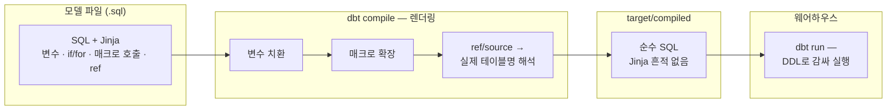



<figure class="post-figure post-figure--header">
<svg role="img" aria-label="매크로와 Jinja를 한 장으로 정리한 그림. 위쪽은 컴파일 흐름으로, 왼쪽 모델 파일 안의 Jinja 구문(for 루프, ref 표현식)이 가운데 dbt compile 기어를 거치며 변수 치환·매크로 확장·ref 해석을 지나 오른쪽의 Jinja 흔적 없는 순수 SQL로 펼쳐진다. 아래쪽은 매크로의 재사용 구조로, macros 디렉토리에 단 한 곳 정의된 cents_to_won 매크로 하나가 stg_payments·fct_revenue·mart_finance 세 모델의 중복 식을 대체한다." viewBox="0 0 680 350" xmlns="http://www.w3.org/2000/svg">
  <title>매크로 · Jinja — Jinja 템플릿이 컴파일 기어를 거쳐 순수 SQL로 펼쳐지고, 매크로 하나가 여러 모델의 중복 식을 대체한다</title>
  <defs>
    <marker id="mj-arrow" viewBox="0 0 10 10" refX="8" refY="5" markerWidth="6" markerHeight="6" orient="auto-start-reverse">
      <path d="M0,0 L10,5 L0,10 z" fill="var(--secondary-color)"/>
    </marker>
    <marker id="mj-arrow-gold" viewBox="0 0 10 10" refX="8" refY="5" markerWidth="6" markerHeight="6" orient="auto-start-reverse">
      <path d="M0,0 L10,5 L0,10 z" fill="var(--gold)"/>
    </marker>
  </defs>

  <!-- ===== title ===== -->
  <text x="340" y="24" text-anchor="middle" font-size="17" font-weight="800" fill="currentColor" letter-spacing="1.5">MACROS · JINJA</text>

  <!-- ===== SECTION A: compile flow ===== -->
  <text x="30" y="50" text-anchor="start" font-size="11" font-weight="700" fill="currentColor" opacity="0.72">컴파일 — Jinja 템플릿이 순수 SQL로 펼쳐진다</text>

  <!-- model file (SQL + Jinja) -->
  <rect x="28" y="64" width="184" height="112" rx="4" fill="var(--bg-light)" stroke="currentColor" stroke-width="2.5"/>
  <text x="120" y="82" text-anchor="middle" font-size="10.5" font-weight="700" fill="currentColor">모델 파일 (.sql)</text>
  <g font-size="8.5" text-anchor="start" font-family="monospace">
    <text x="38" y="100" fill="currentColor">select order_id,</text>
    <text x="38" y="114" fill="var(--accent-color)" font-weight="700"></text>
    <text x="46" y="128" fill="currentColor">sum(case … '<tspan fill="var(--accent-color)" font-weight="700">{{ m }}</tspan>' …)</text>
    <text x="38" y="142" fill="var(--accent-color)" font-weight="700"></text>
    <text x="38" y="156" fill="currentColor">from <tspan fill="var(--accent-color)" font-weight="700">{{ ref('stg_payments') }}</tspan></text>
  </g>
  <text x="120" y="192" text-anchor="middle" font-size="9" fill="currentColor" opacity="0.75">SQL + Jinja</text>

  <!-- compile gear -->
  <g stroke="currentColor" stroke-width="4" opacity="0.85">
    <line x1="300" y1="86" x2="300" y2="150"/>
    <line x1="268" y1="118" x2="332" y2="118"/>
    <line x1="277" y1="95" x2="323" y2="141"/>
    <line x1="277" y1="141" x2="323" y2="95"/>
  </g>
  <circle cx="300" cy="118" r="24" fill="var(--bg-panel)" stroke="currentColor" stroke-width="2.5"/>
  <circle cx="300" cy="118" r="8" fill="none" stroke="currentColor" stroke-width="2"/>
  <text x="300" y="164" text-anchor="middle" font-size="10" font-weight="700" fill="currentColor">dbt compile</text>
  <text x="300" y="178" text-anchor="middle" font-size="8.5" fill="currentColor" opacity="0.7">변수 치환 · 매크로 확장 · ref 해석</text>

  <!-- pure SQL -->
  <rect x="396" y="64" width="256" height="112" rx="4" fill="var(--bg-light)" stroke="currentColor" stroke-width="2.5"/>
  <text x="524" y="82" text-anchor="middle" font-size="10.5" font-weight="700" fill="currentColor">순수 SQL — Jinja 흔적 없음</text>
  <g font-size="8.5" text-anchor="start" font-family="monospace" fill="currentColor">
    <text x="408" y="102">select order_id,</text>
    <text x="416" y="118">sum(case … 'card' …),</text>
    <text x="416" y="134">sum(case … 'coupon' …)</text>
    <text x="408" y="150">from analytics.stg_payments</text>
  </g>
  <text x="524" y="192" text-anchor="middle" font-size="9" fill="currentColor" opacity="0.75">웨어하우스가 받는 전부</text>

  <!-- flow arrows -->
  <g stroke="var(--secondary-color)" stroke-width="2.5" fill="none">
    <line x1="216" y1="118" x2="262" y2="118" marker-end="url(#mj-arrow)"/>
    <line x1="338" y1="118" x2="390" y2="118" marker-end="url(#mj-arrow)"/>
  </g>

  <!-- ===== divider ===== -->
  <line x1="30" y1="206" x2="650" y2="206" stroke="currentColor" stroke-width="1.4" opacity="0.25"/>

  <!-- ===== SECTION B: one macro, many models ===== -->
  <text x="30" y="228" text-anchor="start" font-size="11" font-weight="700" fill="currentColor" opacity="0.72">매크로 — 여러 모델의 중복 식을 한 곳으로</text>

  <!-- macro definition -->
  <rect x="40" y="248" width="196" height="56" rx="4" fill="var(--bg-panel)" stroke="var(--gold)" stroke-width="2.5"/>
  <text x="138" y="270" text-anchor="middle" font-size="9.5" font-weight="700" fill="var(--accent-color)" font-family="monospace"></text>
  <text x="138" y="288" text-anchor="middle" font-size="9" fill="currentColor" font-family="monospace">round(col / 100.0, p)</text>
  <text x="138" y="322" text-anchor="middle" font-size="9" fill="currentColor" opacity="0.75">정의는 프로젝트에 단 한 곳</text>

  <!-- calling models -->
  <g>
    <rect x="430" y="236" width="220" height="26" rx="4" fill="var(--bg-light)" stroke="currentColor" stroke-width="2"/>
    <rect x="430" y="272" width="220" height="26" rx="4" fill="var(--bg-light)" stroke="currentColor" stroke-width="2"/>
    <rect x="430" y="308" width="220" height="26" rx="4" fill="var(--bg-light)" stroke="currentColor" stroke-width="2"/>
  </g>
  <g font-size="8.5" font-family="monospace" text-anchor="start">
    <text x="440" y="253" fill="currentColor">stg_payments · <tspan fill="var(--accent-color)" font-weight="700">{{ cents_to_won(…) }}</tspan></text>
    <text x="440" y="289" fill="currentColor">fct_revenue · <tspan fill="var(--accent-color)" font-weight="700">{{ cents_to_won(…) }}</tspan></text>
    <text x="440" y="325" fill="currentColor">mart_finance · <tspan fill="var(--accent-color)" font-weight="700">{{ cents_to_won(…) }}</tspan></text>
  </g>

  <!-- macro -> model edges -->
  <g stroke="var(--gold)" stroke-width="2" fill="none">
    <line x1="240" y1="262" x2="424" y2="250" marker-end="url(#mj-arrow-gold)"/>
    <line x1="240" y1="278" x2="424" y2="285" marker-end="url(#mj-arrow-gold)"/>
    <line x1="240" y1="294" x2="424" y2="320" marker-end="url(#mj-arrow-gold)"/>
  </g>
</svg>
<figcaption>매크로 · Jinja — 템플릿은 컴파일 기어를 지나 순수 SQL로 펼쳐지고, 한 곳에 정의된 매크로가 여러 모델의 중복 식을 대체한다</figcaption>
</figure>



## 들어가며

[1단계](/2026/07/14/dbt-models-ref-sources.html)에서 모델과 `ref()`가 세우는 의존성 그래프를, [2단계 — dbt 테스트 · 문서화](/2026/07/14/dbt-tests-documentation.html)에서 그 그래프 위에 신뢰를 얹는 법을 봤습니다. 이번 3단계는 dbt SQL이 일반 SQL보다 강력한 **근본 이유**를 파고듭니다. 지금까지 아무렇지 않게 써 온 `{{ ref('stg_orders') }}`라는 표기 — 저것은 SQL 문법이 아닙니다. **Jinja 템플릿 표현식**입니다. 즉 우리가 여태 작성한 모든 dbt 모델은 사실 SQL이 아니라 "SQL을 생성하는 템플릿"이었고, dbt는 이를 컴파일해 순수 SQL을 만들어 웨어하우스에 보냅니다.

이 사실을 정면으로 받아들이면 새로운 문이 열립니다. 변수·조건문·반복문으로 SQL을 **프로그래밍**할 수 있고, 수십 개 모델에 흩어진 중복 식을 **매크로** 하나로 모을 수 있으며, 심지어 웨어하우스에 질의한 결과로 SQL을 동적으로 조립하는 "SQL을 생성하는 SQL"까지 가능해집니다. 이 글은 [dbt Essential Curriculum](/2026/07/12/dbt-essential-curriculum.html)의 3단계로, 여기서 "재사용·규모" 막이 시작됩니다.

<div class="post-summary-box" markdown="1">

### 📌 이 글에서 다루는 내용

#### 🔍 핵심 주제

- **Jinja 기초**: dbt SQL = Jinja 템플릿이라는 실행 모델(컴파일 시점 렌더링, 런타임 아님), 표현식·구문·주석 세 가지 구분자, 변수(`set`·`var()`·`env_var()`), `if`/`for` 블록, whitespace control, `dbt compile`로 생성된 SQL을 읽는 습관
- **매크로**: ``로 재사용 로직을 함수처럼 — 인자·기본값·`return()`, 반복 식 묶기, `run_query()`로 웨어하우스에 질의해 SQL을 조립하는 패턴, `adapter.dispatch`로 웨어하우스별 분기
- **매크로 패키지**: `dbt_utils`(star·union_relations·generate_surrogate_key·date_spine), `codegen`, 커뮤니티 패키지와 직접 만든 매크로의 조합 전략, 그리고 과도한 매크로화의 함정

#### 🎯 왜 중요한가

매크로와 Jinja는 취향이 아니라 규모의 문제입니다. 모델이 수십 개를 넘어가면 같은 변환 식이 곳곳에 복사되기 시작하고, 그 중복이 곧 버그와 불일치의 온상이 됩니다. 다만 힘에는 대가가 있어서, Jinja를 남용하면 "컴파일해 보기 전에는 무슨 SQL인지 알 수 없는" 코드가 됩니다. 힘과 절제를 함께 익히는 것이 이 단계의 목표입니다.

</div>

## 한눈에 보기 — 컴파일 파이프라인

이 글의 뼈대를 한 장으로 그리면 이렇습니다. 모델 파일(SQL + Jinja)은 **컴파일 단계**에서 변수가 치환되고 매크로가 펼쳐지고 `ref()`가 실제 테이블명으로 해석되어 **순수 SQL**이 됩니다. 웨어하우스에 도착하는 것은 이 순수 SQL뿐이며, 웨어하우스는 Jinja의 존재 자체를 모릅니다.



핵심은 방향입니다. Jinja는 왼쪽(작성 시점)에만 존재하고 오른쪽(실행 시점)에는 없습니다. 이 구분이 흔들리면 매크로를 이해할 수 없으므로, 첫 섹션에서 단단히 다집니다.

## Jinja 기초 — SQL을 컴파일하는 템플릿

### 실행 모델 — 컴파일 타임이지, 런타임이 아니다

가장 먼저 몸에 붙여야 할 사실은 이것입니다. **Jinja는 쿼리가 실행될 때 동작하는 것이 아니라, 쿼리가 만들어질 때 동작합니다.** `dbt run`은 크게 두 단계로 나뉩니다 — ① 프로젝트의 모든 모델을 Jinja로 **렌더링**해 순수 SQL을 만드는 컴파일 단계, ② 그 SQL을 materialization DDL(`create table as ...` 등)로 감싸 웨어하우스에 보내는 실행 단계. Jinja의 `for` 루프는 웨어하우스에서 행을 반복 처리하는 것이 아니라, **SQL 텍스트를 반복 생성**합니다. 조건문은 데이터를 필터링하는 것이 아니라, **어떤 SQL 조각을 포함할지**를 결정합니다.



<figure class="post-figure">
<svg role="img" aria-label="컴파일 타임과 런타임을 가르는 개념도. 가운데 세로 점선이 두 세계의 경계이며 'Jinja는 이 선을 넘지 못한다'라고 적혀 있다. 왼쪽 컴파일 타임 영역에서는 Jinja for 루프가 도장처럼 같은 SQL 텍스트 패턴을 세 번 찍어낸다. 오른쪽 런타임 영역에서는 완성된 순수 SQL만이 웨어하우스로 들어가 데이터 행을 처리하며, 웨어하우스는 Jinja의 존재를 모른다." viewBox="0 0 640 300" xmlns="http://www.w3.org/2000/svg">
  <title>컴파일 타임 vs 런타임 — Jinja는 SQL 텍스트를 생성할 뿐, 경계 너머의 데이터에는 닿지 못한다</title>
  <defs>
    <marker id="mj-ct-arrow" viewBox="0 0 10 10" refX="8" refY="5" markerWidth="6" markerHeight="6" orient="auto-start-reverse">
      <path d="M0,0 L10,5 L0,10 z" fill="var(--secondary-color)"/>
    </marker>
  </defs>

  <!-- boundary -->
  <line x1="330" y1="48" x2="330" y2="272" stroke="var(--accent-color)" stroke-width="2" stroke-dasharray="6 5" opacity="0.8"/>
  <text x="330" y="34" text-anchor="middle" font-size="10.5" font-weight="800" fill="var(--accent-color)">Jinja는 이 선을 넘지 못한다</text>

  <!-- zone labels -->
  <text x="170" y="60" text-anchor="middle" font-size="11" font-weight="700" fill="currentColor" opacity="0.72">컴파일 타임 — SQL 텍스트를 생성</text>
  <text x="490" y="60" text-anchor="middle" font-size="11" font-weight="700" fill="currentColor" opacity="0.72">런타임 — 데이터를 처리</text>

  <!-- ===== left: the for-loop stamp ===== -->
  <!-- stamp handle -->
  <rect x="156" y="74" width="28" height="14" rx="3" fill="var(--bg-light)" stroke="currentColor" stroke-width="2"/>
  <line x1="170" y1="88" x2="170" y2="98" stroke="currentColor" stroke-width="3"/>
  <!-- stamp base -->
  <rect x="106" y="98" width="128" height="24" rx="3" fill="var(--bg-panel)" stroke="var(--accent-color)" stroke-width="2.5"/>
  <text x="170" y="114" text-anchor="middle" font-size="9.5" font-weight="700" fill="var(--accent-color)" font-family="monospace"></text>
  <!-- stamping arrow -->
  <line x1="170" y1="126" x2="170" y2="146" stroke="var(--secondary-color)" stroke-width="2.5" marker-end="url(#mj-ct-arrow)"/>
  <!-- generated SQL paper -->
  <rect x="52" y="152" width="236" height="88" rx="4" fill="var(--bg-light)" stroke="currentColor" stroke-width="2"/>
  <g font-size="8.5" font-family="monospace" fill="currentColor" text-anchor="start">
    <text x="64" y="176">sum(… 'card' …),</text>
    <text x="64" y="198">sum(… 'bank_transfer' …),</text>
    <text x="64" y="220">sum(… 'coupon' …)</text>
  </g>
  <text x="170" y="262" text-anchor="middle" font-size="9" fill="currentColor" opacity="0.75">같은 패턴을 세 번 "찍어낸다"</text>

  <!-- ===== right: pure SQL into warehouse ===== -->
  <!-- pure SQL doc -->
  <rect x="362" y="88" width="92" height="66" rx="4" fill="var(--bg-light)" stroke="currentColor" stroke-width="2"/>
  <text x="408" y="106" text-anchor="middle" font-size="9.5" font-weight="700" fill="currentColor">순수 SQL</text>
  <g stroke="currentColor" stroke-width="1.2" opacity="0.45">
    <line x1="374" y1="118" x2="442" y2="118"/>
    <line x1="374" y1="130" x2="442" y2="130"/>
    <line x1="374" y1="142" x2="430" y2="142"/>
  </g>
  <!-- arrow to warehouse -->
  <line x1="458" y1="121" x2="500" y2="121" stroke="var(--secondary-color)" stroke-width="2.5" marker-end="url(#mj-ct-arrow)"/>
  <!-- warehouse cylinder -->
  <path d="M508,102 a46,12 0 0,0 92,0 v44 a46,12 0 0,1 -92,0 z" fill="var(--bg-panel)" stroke="currentColor" stroke-width="2.5"/>
  <ellipse cx="554" cy="102" rx="46" ry="12" fill="var(--bg-light)" stroke="currentColor" stroke-width="2.5"/>
  <text x="554" y="136" text-anchor="middle" font-size="9.5" font-weight="700" fill="currentColor">웨어하우스</text>
  <!-- data rows being processed -->
  <line x1="554" y1="162" x2="554" y2="182" stroke="var(--secondary-color)" stroke-width="2.5" marker-end="url(#mj-ct-arrow)"/>
  <g fill="none" stroke="currentColor" stroke-width="1.5" opacity="0.7">
    <rect x="500" y="188" width="108" height="14"/>
    <rect x="500" y="202" width="108" height="14"/>
    <rect x="500" y="216" width="108" height="14"/>
    <line x1="536" y1="188" x2="536" y2="230"/>
    <line x1="572" y1="188" x2="572" y2="230"/>
  </g>
  <text x="554" y="248" text-anchor="middle" font-size="9" fill="currentColor" opacity="0.75">행(row) 단위 처리</text>
  <text x="490" y="270" text-anchor="middle" font-size="9" fill="currentColor" opacity="0.75">웨어하우스는 Jinja의 존재를 모른다</text>
</svg>
<figcaption>컴파일 타임의 for 루프는 SQL 텍스트를 찍어내는 도장일 뿐 — 경계 너머 런타임의 데이터 행에는 결코 닿지 못한다</figcaption>
</figure>



그래서 Jinja 안에서는 컬럼 값을 읽을 수 없습니다. 컴파일 시점에는 아직 쿼리가 실행되지 않았으므로 데이터가 존재하지 않기 때문입니다(예외적으로 웨어하우스에 직접 질의하는 `run_query()`가 있는데, 뒤에서 다룹니다). 이 실행 모델은 파이썬의 f-string으로 SQL 문자열을 조립하는 것과 본질적으로 같되, 템플릿 언어의 체계를 갖춘 것이라 이해하면 정확합니다.

### 세 가지 구분자 — 표현식 · 구문 · 주석

Jinja 문법은 구분자 세 가지로 요약됩니다.


```sql
-- ① 표현식 {{ ... }} — 값을 평가해 그 자리에 "출력"한다
select * from {{ ref('stg_orders') }}

-- ② 구문  — 제어 흐름·정의. 그 자체는 아무것도 출력하지 않는다


-- ③ 주석 {# ... #} — 컴파일 시점에 삭제된다. 컴파일된 SQL에 남지 않는다
{# 이 줄은 target/compiled에서 사라진다. SQL 주석(--)은 남는다 #}
```


셋의 구분은 "출력 여부"입니다. 표현식은 결과 텍스트에 무언가를 남기고, 구문은 흐름만 제어하며, Jinja 주석은 흔적 없이 사라집니다. 참고로 SQL 주석(`--`)은 Jinja 입장에서 그냥 텍스트이므로 컴파일된 SQL에 그대로 남습니다 — 웨어하우스 쿼리 로그에 남기고 싶은 메모는 `--`로, 템플릿 작성자용 메모는 Jinja 주석으로 나눠 쓰는 것이 관례입니다.

### 변수 — set · var() · env_var()

변수를 두는 곳은 스코프에 따라 세 층입니다.


```sql
-- ① set — 파일(모델·매크로) 안에서만 유효한 로컬 변수



-- ② var() — 프로젝트 변수. dbt_project.yml 또는 CLI로 주입
--    두 번째 인자는 기본값: 없으면 미정의 시 컴파일 에러
select * from {{ ref('stg_orders') }}
where order_date >= '{{ var("start_date", "2026-01-01") }}'

-- ③ env_var() — 환경 변수. 시크릿·환경별 값에 사용
--    (컴파일 산출물에 값이 새길 수 있으니 진짜 비밀은 프로파일/시크릿 매니저로)
where region = '{{ env_var("DBT_REGION", "kr") }}'
```


프로젝트 변수는 `dbt_project.yml`의 `vars:` 블록에 선언하고, 실행 시 `dbt run --vars '{start_date: 2026-07-01}'`처럼 덮어쓸 수 있습니다. "코드에 박을 값은 `set`, 배포·환경마다 달라질 값은 `var()`, 인프라가 주입할 값은 `env_var()`"로 역할을 나누면 됩니다.

### if / for — SQL을 생성하는 제어 흐름

제어 흐름의 대표 활용 두 가지를 봅니다. 먼저 `if` — 환경에 따라 SQL 조각을 넣고 빼는 패턴입니다. `target`은 현재 실행 환경(프로파일) 정보를 담은 내장 변수입니다.


```sql
select * from {{ ref('stg_events') }}

-- dev 환경에서는 최근 3일만 — 개발 중 빌드 시간·비용 절약
where event_at >= dateadd('day', -3, current_date)

```


다음은 `for` — 이 글에서 가장 중요한 대비 예제입니다. 결제 수단별 금액 컬럼을 만드는 피벗을 생각해 보죠. 결제 수단이 늘 때마다 `case when`을 손으로 복사하는 대신, 리스트를 돌며 SQL을 **생성**합니다.

**Jinja 원본** (`models/order_payments.sql`):


```sql


select
    order_id,
    
    sum(case when payment_method = '{{ method }}' then amount else 0 end)
        as {{ method }}_amount,
    
from {{ ref('stg_payments') }}
group by order_id
```


**`dbt compile` 결과** (`target/compiled/my_project/models/order_payments.sql`):

```sql
select
    order_id,
    sum(case when payment_method = 'card' then amount else 0 end)
        as card_amount,
    sum(case when payment_method = 'bank_transfer' then amount else 0 end)
        as bank_transfer_amount,
    sum(case when payment_method = 'coupon' then amount else 0 end)
        as coupon_amount
from analytics.stg_payments
group by order_id
```

두 파일을 나란히 놓고 보면 Jinja의 정체가 명확해집니다. 루프는 사라지고 세 개의 `sum(case when ...)`이 남았으며, `ref()`는 실제 스키마·테이블명으로 해석되었습니다. `loop.last`는 마지막 반복에서 참이 되는 Jinja 내장 변수로, 마지막 컬럼 뒤에 쉼표가 붙는 것을 막아 줍니다. 이제 결제 수단이 추가되면 리스트에 원소 하나만 더하면 됩니다.

### whitespace control — 컴파일 결과를 깔끔하게

위 컴파일 결과를 실제로 열어 보면 구문 블록이 있던 자리마다 빈 줄이 남아 다소 지저분할 수 있습니다. 구문은 아무것도 출력하지 않지만 **구문을 둘러싼 개행·공백은 텍스트로 남기** 때문입니다. 구분자에 `-`를 붙이면 그 방향의 공백을 지웁니다.


```sql
select
    
    {{ col }},
    
from {{ ref('stg_orders') }}
```


`{%-`는 구문 앞쪽의 공백·개행을, `-%}`는 뒤쪽을 제거합니다. 생성된 SQL도 사람이 읽을 코드입니다 — 디버깅할 때 결국 읽는 것은 컴파일 결과이므로, 공백 제어로 깔끔하게 유지할 가치가 있습니다.

### dbt compile — 생성된 SQL을 읽는 습관

Jinja를 쓰기 시작하면 반드시 함께 들여야 할 습관이 있습니다. **`dbt compile`을 돌리고 `target/compiled/` 아래의 순수 SQL을 읽는 것**입니다.

```bash
# 특정 모델만 컴파일
dbt compile --select order_payments

# 생성된 순수 SQL 확인
cat target/compiled/my_project/models/order_payments.sql
```

템플릿이 복잡해질수록 "내가 쓴 것"과 "웨어하우스가 받는 것"의 거리가 벌어집니다. 쿼리가 이상하게 동작하면 Jinja 원본을 노려보지 말고 컴파일 결과를 열어 보세요 — 십중팔구 거기에 답이 있습니다. 루프가 만든 쉼표 하나, if가 삼켜 버린 where 절 하나가 눈에 바로 보입니다.

## 매크로 — 재사용 로직을 함수처럼

### 정의와 호출 — 인자, 기본값

`set` 변수와 `for` 루프가 **한 파일 안**의 반복을 없앤다면, **매크로(macro)**는 **여러 모델에 걸친** 반복을 없앱니다. `macros/` 디렉토리의 `.sql` 파일에 정의하면 프로젝트 어디서나 호출할 수 있는, 사실상 함수입니다.

대표적인 예 — 결제 금액이 센트 단위 정수로 들어오는 원천이 있어, 여러 모델에서 `round(amount_cents / 100.0, 0)` 같은 식이 반복된다고 해 보죠.


```sql
-- macros/cents_to_won.sql

    round({{ column_name }} / 100.0, {{ precision }})

```



```sql
-- models/stg_payments.sql — 프로젝트 어느 모델에서든 호출
select
    payment_id,
    {{ cents_to_won('amount_cents') }} as amount_won,
    {{ cents_to_won('fee_cents', precision=2) }} as fee_won
from {{ source('app', 'payments') }}
```


`precision=0`처럼 기본값을 줄 수 있고, 호출 시 키워드 인자도 지원됩니다 — 파이썬 함수와 감각이 같습니다. 컴파일하면 매크로 본문이 호출 자리마다 펼쳐져 순수 SQL만 남습니다. 이제 "센트 → 원 변환"의 정의는 프로젝트에 **단 한 곳**뿐이므로, 환율이 아니라 반올림 정책이 바뀌어도 한 줄만 고치면 모든 모델에 반영됩니다.

주의할 점 하나 — 매크로 인자로 넘긴 `'amount_cents'`는 **컬럼 값이 아니라 컬럼 이름 문자열**입니다. 매크로는 그 문자열을 SQL 텍스트에 끼워 넣을 뿐입니다. "매크로는 텍스트를 조립한다"는 감각을 유지해야 인자에 무엇을 넘겨야 할지 헷갈리지 않습니다.

### return() — 텍스트가 아니라 값을 돌려주기

기본적으로 매크로는 본문이 렌더링된 **텍스트**를 내놓습니다. 그런데 리스트나 dict 같은 **값**을 돌려받아 다른 Jinja 로직에서 쓰고 싶을 때가 있습니다. 그때 쓰는 것이 `return()`입니다.


```sql
-- macros/default_payment_methods.sql

    {{ return(["card", "bank_transfer", "coupon"]) }}

```


이렇게 하면 호출부에서 ``처럼 리스트를 받아 `for` 루프에 넣을 수 있습니다. "SQL 조각을 찍어내는 매크로"와 "값을 계산해 돌려주는 매크로", 두 부류가 있다고 정리하면 됩니다.

### run_query() — SQL을 생성하는 SQL

앞의 피벗 예제에는 아직 약점이 있습니다. 결제 수단 리스트를 코드에 하드코딩했다는 것 — 새 결제 수단이 데이터에 등장하면 누군가 리스트를 고쳐야 합니다. **`run_query()`**는 이 마지막 수동 단계를 없앱니다. 컴파일 도중에 **웨어하우스에 실제 쿼리를 날려** 그 결과로 SQL을 조립하는, dbt Jinja의 가장 강력한 패턴입니다.


```sql
-- macros/get_payment_methods.sql

    
        select distinct payment_method
        from {{ ref('stg_payments') }}
        order by 1
    

    
        
        {{ return(results.columns[0].values()) }}
    
        {{ return([]) }}
    

```



```sql
-- models/order_payments.sql — 하드코딩 리스트가 사라졌다


select
    order_id,
    
    sum(case when payment_method = '{{ method }}' then amount else 0 end)
        as {{ method }}_amount,
    
from {{ ref('stg_payments') }}
group by order_id
```


여기서 낯선 것이 `execute` 분기입니다. dbt는 프로젝트를 **두 번** 렌더링합니다 — ① **파싱 단계**: DAG를 그리기 위해 `ref`/`source` 관계만 수집하며, 이때 웨어하우스에 질의하지 않고 `run_query()`는 실행되지 않습니다. ② **실행 단계**: 실제 컴파일·실행이 일어나며 `run_query()`가 진짜 결과를 돌려줍니다. `execute`는 지금이 어느 단계인지 알려 주는 내장 플래그로, 파싱 단계에서 `results`가 `None`이라 터지는 것을 막으려면 위처럼 가드가 필요합니다. `run_query()`를 쓰는 매크로에서 알 수 없는 `NoneType` 에러를 만나면 십중팔구 이 가드가 빠진 것입니다.



<figure class="post-figure">
<svg role="img" aria-label="dbt의 2패스 렌더링 개념도. 왼쪽 1패스(파싱)에서는 execute가 false여서 run_query가 자물쇠로 잠겨 있고, ref와 source 관계만 수집되어 점선으로 된 DAG 스케치가 만들어진다. 오른쪽 2패스(실행)에서는 execute가 true가 되어 run_query가 웨어하우스에 질의해 card, bank_transfer, coupon 결제수단 리스트를 받아 오고, 그 리스트가 for 루프를 거쳐 순수 SQL 컬럼들로 펼쳐진다." viewBox="0 0 660 330" xmlns="http://www.w3.org/2000/svg">
  <title>2패스 렌더링 — 파싱 패스에서 run_query()는 잠겨 있고, 실행 패스에서만 웨어하우스에 질의한다</title>
  <defs>
    <marker id="mj-2p-arrow" viewBox="0 0 10 10" refX="8" refY="5" markerWidth="6" markerHeight="6" orient="auto-start-reverse">
      <path d="M0,0 L10,5 L0,10 z" fill="var(--secondary-color)"/>
    </marker>
  </defs>

  <!-- center divider -->
  <line x1="330" y1="24" x2="330" y2="310" stroke="currentColor" stroke-width="1.4" opacity="0.25"/>

  <!-- ===== PASS 1: parsing ===== -->
  <text x="165" y="36" text-anchor="middle" font-size="11" font-weight="700" fill="currentColor" opacity="0.72">1패스 — 파싱</text>
  <text x="165" y="52" text-anchor="middle" font-size="9.5" font-weight="700" fill="var(--accent-color)" font-family="monospace">execute = false</text>

  <!-- locked run_query -->
  <rect x="52" y="66" width="152" height="32" rx="4" fill="var(--bg-light)" stroke="currentColor" stroke-width="2" stroke-dasharray="5 4" opacity="0.7"/>
  <text x="128" y="87" text-anchor="middle" font-size="10" font-weight="700" fill="currentColor" opacity="0.7" font-family="monospace">run_query()</text>
  <!-- padlock -->
  <path d="M222,80 a10,10 0 0,1 20,0" fill="none" stroke="currentColor" stroke-width="2.5"/>
  <rect x="216" y="80" width="32" height="24" rx="3" fill="var(--bg-panel)" stroke="var(--accent-color)" stroke-width="2.5"/>
  <circle cx="232" cy="90" r="3" fill="var(--accent-color)"/>
  <line x1="232" y1="92" x2="232" y2="98" stroke="var(--accent-color)" stroke-width="2"/>
  <text x="150" y="122" text-anchor="middle" font-size="9" fill="currentColor" opacity="0.75">웨어하우스 질의 없음 — 빈 리스트 반환</text>

  <!-- DAG sketch -->
  <text x="165" y="158" text-anchor="middle" font-size="9.5" font-weight="700" fill="currentColor" opacity="0.72">ref / source 관계만 수집 → DAG 스케치</text>
  <g fill="var(--bg-light)" stroke="currentColor" stroke-width="1.8" stroke-dasharray="4 3" opacity="0.8">
    <rect x="46" y="200" width="72" height="26" rx="4"/>
    <rect x="146" y="176" width="72" height="26" rx="4"/>
    <rect x="146" y="224" width="72" height="26" rx="4"/>
    <rect x="246" y="200" width="72" height="26" rx="4"/>
  </g>
  <g font-size="8.5" font-weight="700" fill="currentColor" text-anchor="middle" opacity="0.8">
    <text x="82" y="217">source</text>
    <text x="182" y="193">stg_orders</text>
    <text x="182" y="241">stg_payments</text>
    <text x="282" y="217">mart</text>
  </g>
  <g stroke="var(--secondary-color)" stroke-width="1.8" stroke-dasharray="4 3" fill="none" opacity="0.85">
    <line x1="118" y1="207" x2="140" y2="194" marker-end="url(#mj-2p-arrow)"/>
    <line x1="118" y1="219" x2="140" y2="232" marker-end="url(#mj-2p-arrow)"/>
    <line x1="218" y1="194" x2="240" y2="207" marker-end="url(#mj-2p-arrow)"/>
    <line x1="218" y1="232" x2="240" y2="219" marker-end="url(#mj-2p-arrow)"/>
  </g>
  <text x="165" y="286" text-anchor="middle" font-size="9" fill="currentColor" opacity="0.75">가드 없이 결과를 쓰면 여기서 NoneType 에러</text>

  <!-- ===== PASS 2: execution ===== -->
  <text x="495" y="36" text-anchor="middle" font-size="11" font-weight="700" fill="currentColor" opacity="0.72">2패스 — 실행</text>
  <text x="495" y="52" text-anchor="middle" font-size="9.5" font-weight="700" fill="var(--secondary-color)" font-family="monospace">execute = true</text>

  <!-- live run_query -->
  <rect x="366" y="66" width="130" height="32" rx="4" fill="var(--bg-light)" stroke="currentColor" stroke-width="2.5"/>
  <text x="431" y="87" text-anchor="middle" font-size="10" font-weight="700" fill="currentColor" font-family="monospace">run_query()</text>

  <!-- warehouse cylinder -->
  <path d="M540,72 a36,9 0 0,0 72,0 v30 a36,9 0 0,1 -72,0 z" fill="var(--bg-panel)" stroke="currentColor" stroke-width="2.5"/>
  <ellipse cx="576" cy="72" rx="36" ry="9" fill="var(--bg-light)" stroke="currentColor" stroke-width="2.5"/>
  <text x="576" y="96" text-anchor="middle" font-size="8.5" font-weight="700" fill="currentColor">웨어하우스</text>

  <!-- query / result arrows -->
  <g stroke="var(--secondary-color)" stroke-width="2" fill="none">
    <line x1="500" y1="76" x2="534" y2="76" marker-end="url(#mj-2p-arrow)"/>
    <line x1="534" y1="90" x2="500" y2="90" marker-end="url(#mj-2p-arrow)"/>
  </g>

  <!-- returned list chip -->
  <line x1="431" y1="98" x2="431" y2="118" stroke="var(--secondary-color)" stroke-width="2" marker-end="url(#mj-2p-arrow)"/>
  <rect x="356" y="124" width="248" height="24" rx="4" fill="var(--bg-panel)" stroke="var(--gold)" stroke-width="2"/>
  <text x="480" y="140" text-anchor="middle" font-size="8.5" font-weight="700" fill="currentColor" font-family="monospace">["card", "bank_transfer", "coupon"]</text>

  <!-- for loop -->
  <line x1="480" y1="148" x2="480" y2="168" stroke="var(--secondary-color)" stroke-width="2" marker-end="url(#mj-2p-arrow)"/>
  <rect x="392" y="174" width="176" height="26" rx="4" fill="var(--bg-light)" stroke="var(--accent-color)" stroke-width="2.5"/>
  <text x="480" y="191" text-anchor="middle" font-size="9.5" font-weight="700" fill="var(--accent-color)" font-family="monospace"></text>

  <!-- expanded SQL -->
  <line x1="480" y1="200" x2="480" y2="220" stroke="var(--secondary-color)" stroke-width="2" marker-end="url(#mj-2p-arrow)"/>
  <rect x="360" y="226" width="240" height="70" rx="4" fill="var(--bg-light)" stroke="currentColor" stroke-width="2"/>
  <g font-size="8.5" font-family="monospace" fill="currentColor" text-anchor="start">
    <text x="372" y="246">sum(…) as card_amount,</text>
    <text x="372" y="263">sum(…) as bank_transfer_amount,</text>
    <text x="372" y="280">sum(…) as coupon_amount</text>
  </g>
  <text x="480" y="314" text-anchor="middle" font-size="9" fill="currentColor" opacity="0.75">질의 결과가 순수 SQL 컬럼으로 펼쳐진다</text>
</svg>
<figcaption>dbt는 프로젝트를 두 번 렌더링한다 — 파싱 패스에서 run_query()는 잠겨 있으므로, execute 가드가 없으면 NoneType 에러를 만난다</figcaption>
</figure>



강력한 만큼 대가도 분명합니다. 컴파일할 때마다 웨어하우스에 쿼리가 나가므로 컴파일이 느려지고 비용이 발생하며, 컴파일 결과가 데이터 상태에 따라 달라지므로 재현성이 약해집니다. "스키마·메타데이터 수준의 가벼운 질의(distinct 값 목록, 컬럼 목록)"에 한정해 쓰고, 행 수준의 무거운 질의는 넣지 않는 것이 실무 감각입니다.

### adapter.dispatch — 웨어하우스별 분기

같은 논리를 표현하는 SQL 함수가 웨어하우스마다 다른 경우가 있습니다 — 날짜 차이만 해도 Snowflake는 `datediff`, PostgreSQL은 날짜 뺄셈이 자연스럽습니다. **`adapter.dispatch`**는 매크로 이름 앞에 어댑터 접두사를 붙인 구현을 찾아 호출해 주는 dbt의 다형성 장치입니다.


```sql
-- macros/datediff_days.sql

    {{ return(adapter.dispatch('datediff_days')(start_col, end_col)) }}


-- 기본 구현 — 어댑터별 구현이 없을 때 사용

    datediff('day', {{ start_col }}, {{ end_col }})


-- PostgreSQL 전용 구현

    ({{ end_col }}::date - {{ start_col }}::date)

```


호출부는 `{{ datediff_days('ordered_at', 'shipped_at') }}` 하나로 통일되고, 실행 대상 웨어하우스에 맞는 구현(`postgres__...` 또는 `default__...`)이 선택됩니다. 이것이 바로 뒤에서 볼 `dbt_utils` 같은 패키지가 "어느 웨어하우스에서나 동작"하는 비결입니다 — 패키지의 크로스 플랫폼 매크로는 전부 이 dispatch 구조로 짜여 있습니다.

## 매크로 패키지 — 바퀴를 다시 만들지 않기

### dbt_utils — 사실상 표준 유틸리티

직접 매크로를 짜기 전에 물어야 할 질문 — "이거 이미 있지 않을까?" 대부분 있습니다. **`dbt_utils`**는 거의 모든 dbt 프로젝트가 까는 사실상 표준 패키지입니다. `packages.yml`에 선언하고 `dbt deps`로 설치합니다.

```yaml
# packages.yml
packages:
  - package: dbt-labs/dbt_utils
    version: [">=1.3.0", "<2.0.0"]
  - package: dbt-labs/codegen
    version: [">=0.13.0", "<0.14.0"]
```

대표 매크로 네 가지만 봅니다.


```sql
-- ① star — 특정 컬럼만 빼고 전부 select ("select * except" 대용)
select
    {{ dbt_utils.star(from=ref('stg_orders'), except=["_loaded_at", "_source"]) }}
from {{ ref('stg_orders') }}

-- ② generate_surrogate_key — 여러 컬럼을 해시해 대리 키 생성
select
    {{ dbt_utils.generate_surrogate_key(["order_id", "product_id"]) }} as order_item_key,
    ...

-- ③ union_relations — 스키마가 비슷한 여러 테이블을 안전하게 union
--    (컬럼 순서·누락 컬럼을 알아서 정렬·null 채움)
{{ dbt_utils.union_relations(relations=[
    source('shop_kr', 'orders'),
    source('shop_jp', 'orders'),
]) }}

-- ④ date_spine — 빠진 날짜 없이 연속된 날짜 행 생성 (달력 테이블)
{{ dbt_utils.date_spine(
    datepart="day",
    start_date="cast('2026-01-01' as date)",
    end_date="cast('2027-01-01' as date)",
) }}
```


`star`는 감사(audit) 컬럼을 뺀 전체 컬럼 나열을, `generate_surrogate_key`는 복합 키 해시 로직을, `union_relations`는 멀티 리전·멀티 테넌트 테이블 통합을, `date_spine`은 "주문이 없는 날도 0으로 보여야 하는" 일별 집계의 달력 조인을 각각 한 줄로 만듭니다. 모두 `adapter.dispatch` 기반이라 웨어하우스를 갈아타도 그대로 동작합니다.

### codegen — 보일러플레이트를 생성하는 매크로

`codegen`은 조금 결이 다릅니다 — 모델이 아니라 **코드 자체를 생성**하는 개발 도구용 패키지입니다. `dbt run-operation`으로 호출해 결과를 복사해 쓰는 식입니다.

```bash
# 원천 스키마를 읽어 sources.yml 초안 생성
dbt run-operation generate_source \
  --args '{"schema_name": "app", "database_name": "raw"}'

# 소스 테이블의 staging 모델(컬럼 나열 + rename) 초안 생성
dbt run-operation generate_base_model \
  --args '{"source_name": "app", "table_name": "payments"}'

# 기존 모델의 컬럼 목록으로 schema.yml 문서화 초안 생성
dbt run-operation generate_model_yaml \
  --args '{"model_names": ["stg_payments"]}'
```

2단계에서 본 것처럼 dbt의 신뢰는 YAML(테스트·문서)에서 나오는데, 그 YAML을 손으로 처음부터 치는 것은 고역입니다. codegen으로 초안을 뽑고 설명만 다듬는 흐름이 훨씬 지속가능합니다.

### 조합 전략 — 그리고 과도한 매크로화의 함정

패키지와 직접 만든 매크로의 역할 분담은 이렇게 잡는 것이 좋습니다.

- **범용 SQL 패턴** (피벗, 대리 키, union, 달력) → `dbt_utils` 등 커뮤니티 패키지를 먼저 찾는다
- **우리 도메인의 비즈니스 규칙** (센트→원 정책, 자사 이벤트 분류 로직) → 직접 매크로로 만들어 한 곳에 못 박는다
- **여러 프로젝트가 공유할 사내 규칙** → 사내 패키지로 뽑는다(5단계에서 다룹니다)

마지막으로, 이 글 전체에 대한 균형추를 달아야 합니다. **매크로는 공짜가 아닙니다.** 매크로화된 코드는 읽는 사람에게 간접 계층을 하나 강요합니다 — 모델을 열었는데 SQL 대신 매크로 호출만 보이면, 독자는 매크로 정의를 찾아가고, 그 매크로가 또 다른 매크로를 부르면 다시 따라가야 합니다. 어느 순간 "SQL을 읽는 일"이 "메타프로그래밍을 디버깅하는 일"로 변해 있습니다. 경계선으로 삼을 만한 규칙 몇 가지입니다.

- **세 번 반복되기 전에는 매크로화하지 않는다** — 두 번의 중복은 아직 우연일 수 있습니다. 성급한 추상화가 중복보다 비쌉니다.
- **매크로가 매크로를 부르는 깊이를 최소화한다** — dispatch 같은 구조적 이유가 아니라면, 한 단계 안에서 끝나는 것이 좋습니다.
- **비즈니스 로직의 "정의"를 숨기지 않는다** — 매출 인식 기준 같은 핵심 규칙을 매크로 뒤에 숨기면, 정작 그 정의를 검토해야 할 분석가가 찾지 못합니다. 매크로 이름과 위치로 발견 가능성을 지켜야 합니다.
- **의심되면 컴파일 결과를 읽는다** — `target/compiled`의 SQL이 사람이 읽고 승인할 수 있는 수준인지가 최종 기준입니다. 컴파일 결과조차 난해하다면 추상화가 잘못된 것입니다.

dbt 커뮤니티의 오래된 격언이 이를 요약합니다 — "Jinja로 **할 수 있다**는 것과 **해야 한다**는 것은 다르다." SQL은 선언적이고 읽기 쉬운 언어라는 것이 dbt의 출발점이었음을 잊지 않아야, 매크로가 유지보수의 무기로 남습니다.

## 정리

dbt SQL의 정체와 그것을 다루는 도구를 세 층으로 쌓았습니다.

- **dbt SQL은 Jinja 템플릿이다**: 변수·if·for는 컴파일 시점에 동작해 **순수 SQL 텍스트를 생성**하며, 웨어하우스는 Jinja의 존재를 모릅니다. 표현식은 출력하고, 구문은 흐름만 제어하고, Jinja 주석은 사라집니다. `set`(파일 로컬) · `var()`(프로젝트) · `env_var()`(환경)로 변수 스코프를 나누고, whitespace control로 컴파일 결과를 깔끔하게 유지하며, **`dbt compile` 후 `target/compiled`를 읽는 습관**이 디버깅의 왕도입니다.
- **매크로는 모델을 가로지르는 함수다**: 인자·기본값·`return()`을 갖춘 재사용 단위로, 반복 식(컬럼 목록, 단위 변환)을 프로젝트의 한 곳으로 모읍니다. `run_query()`는 웨어하우스에 질의한 결과로 SQL을 조립하는 "SQL을 생성하는 SQL" 패턴이며(2패스 렌더링 때문에 `execute` 가드 필수), `adapter.dispatch`는 웨어하우스별 구현을 갈아 끼우는 다형성 장치입니다.
- **바퀴는 이미 있고, 절제가 무기다**: 범용 패턴은 `dbt_utils`(star·generate_surrogate_key·union_relations·date_spine), 보일러플레이트 생성은 `codegen`, 도메인 규칙만 직접 매크로로. 그리고 세 번 반복 전 매크로화 금지, 정의를 숨기지 않기, 컴파일 결과의 가독성을 최종 기준으로 — 과도한 메타프로그래밍의 경계를 지켜야 합니다.

이로써 반복을 다스리는 도구를 손에 넣었습니다. 다음 4단계는 규모와 시간을 다스립니다 — 매번 전체를 다시 만드는 대신 바뀐 행만 처리하는 **incremental 모델**과, 변화 이력을 보존하는 **snapshot(SCD Type 2)**입니다. 거기서 이번에 배운 Jinja가 다시 등장합니다 — `is_incremental()` 분기가 바로 Jinja `if` 블록입니다.

### 다음 학습 (Next Learning)

- [dbt Incremental · Snapshot](/2026/07/14/dbt-incremental-snapshots.html) — 4단계: 증분 모델과 이력 관리(SCD Type 2)로 규모와 시간을 감당하기
- [dbt 테스트 · 문서화](/2026/07/14/dbt-tests-documentation.html) — 2단계: 이 글의 앞 단계, 테스트와 문서로 신뢰 세우기 복습
- [dbt Essential Curriculum](/2026/07/12/dbt-essential-curriculum.html) — 시리즈 로드맵으로 돌아가 진행 상황 확인하기
