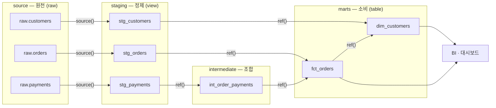

<figure class="post-figure post-figure--header">
<svg role="img" aria-label="모델·ref·소스를 한 장으로 정리한 그림. 왼쪽의 원천 테이블 raw.orders·raw.customers·raw.payments가 source() 화살표로 staging 모델 stg_orders·stg_customers·stg_payments에 연결되고, staging은 ref() 화살표로 intermediate 모델 int_order_payments(점선, ephemeral)를 지나 오른쪽 marts의 fct_orders·dim_customers 테이블로 수렴한다. staging 계층은 view로, marts 계층은 table로 구체화된다." viewBox="0 0 680 280" xmlns="http://www.w3.org/2000/svg">
  <title>모델 · ref · 소스 — 원천이 staging을 거쳐 marts로 수렴하는 의존성 그래프</title>
  <defs>
    <marker id="dbt-s1h-arrow" viewBox="0 0 10 10" refX="8" refY="5" markerWidth="6" markerHeight="6" orient="auto-start-reverse">
      <path d="M0,0 L10,5 L0,10 z" fill="var(--secondary-color)"/>
    </marker>
  </defs>

  <!-- title -->
  <text x="340" y="24" text-anchor="middle" font-size="17" font-weight="800" fill="currentColor" letter-spacing="1.5">MODELS · REF · SOURCES</text>
  <text x="340" y="44" text-anchor="middle" font-size="10.5" font-weight="700" fill="currentColor" opacity="0.72">SELECT 하나가 모델이 되고, ref()·source()가 의존성 그래프를 세운다</text>

  <!-- layer labels -->
  <g font-size="10" font-weight="700" fill="currentColor" opacity="0.72" text-anchor="middle">
    <text x="78" y="68">source</text>
    <text x="232" y="68">staging · view</text>
    <text x="399" y="68">intermediate · ephemeral</text>
    <text x="576" y="68">marts · table</text>
  </g>

  <!-- source tables -->
  <g>
    <rect x="28" y="80" width="100" height="30" rx="4" fill="var(--bg-light)" stroke="currentColor" stroke-width="2"/>
    <rect x="28" y="130" width="100" height="30" rx="4" fill="var(--bg-light)" stroke="currentColor" stroke-width="2"/>
    <rect x="28" y="180" width="100" height="30" rx="4" fill="var(--bg-light)" stroke="currentColor" stroke-width="2"/>
  </g>
  <g font-size="8.5" font-weight="700" fill="currentColor" text-anchor="middle">
    <text x="78" y="99">raw.orders</text>
    <text x="78" y="149">raw.customers</text>
    <text x="78" y="199">raw.payments</text>
  </g>

  <!-- staging models -->
  <g>
    <rect x="180" y="80" width="104" height="30" rx="4" fill="var(--bg-light)" stroke="currentColor" stroke-width="2"/>
    <rect x="180" y="130" width="104" height="30" rx="4" fill="var(--bg-light)" stroke="currentColor" stroke-width="2"/>
    <rect x="180" y="180" width="104" height="30" rx="4" fill="var(--bg-light)" stroke="currentColor" stroke-width="2"/>
  </g>
  <g font-size="8.5" font-weight="700" fill="currentColor" text-anchor="middle">
    <text x="232" y="99">stg_orders</text>
    <text x="232" y="149">stg_customers</text>
    <text x="232" y="199">stg_payments</text>
  </g>

  <!-- intermediate model (ephemeral: dashed) -->
  <rect x="340" y="155" width="118" height="30" rx="4" fill="none" stroke="currentColor" stroke-width="2" stroke-dasharray="5 4" opacity="0.85"/>
  <text x="399" y="174" text-anchor="middle" font-size="8.5" font-weight="700" fill="currentColor">int_order_payments</text>

  <!-- marts -->
  <rect x="520" y="88" width="112" height="32" rx="4" fill="var(--bg-panel)" stroke="var(--gold)" stroke-width="2.5"/>
  <text x="576" y="108" text-anchor="middle" font-size="9" font-weight="700" fill="currentColor">fct_orders</text>
  <rect x="520" y="170" width="112" height="32" rx="4" fill="var(--bg-panel)" stroke="var(--gold)" stroke-width="2.5"/>
  <text x="576" y="190" text-anchor="middle" font-size="9" font-weight="700" fill="currentColor">dim_customers</text>

  <!-- source() edges -->
  <g stroke="var(--secondary-color)" stroke-width="2" fill="none">
    <line x1="128" y1="95" x2="176" y2="95" marker-end="url(#dbt-s1h-arrow)"/>
    <line x1="128" y1="145" x2="176" y2="145" marker-end="url(#dbt-s1h-arrow)"/>
    <line x1="128" y1="195" x2="176" y2="195" marker-end="url(#dbt-s1h-arrow)"/>
  </g>
  <!-- ref() edges -->
  <g stroke="var(--secondary-color)" stroke-width="2" fill="none">
    <line x1="284" y1="195" x2="336" y2="173" marker-end="url(#dbt-s1h-arrow)"/>
    <line x1="284" y1="95" x2="516" y2="100" marker-end="url(#dbt-s1h-arrow)"/>
    <line x1="458" y1="168" x2="516" y2="112" marker-end="url(#dbt-s1h-arrow)"/>
    <line x1="284" y1="145" x2="516" y2="182" marker-end="url(#dbt-s1h-arrow)"/>
    <line x1="576" y1="120" x2="576" y2="166" marker-end="url(#dbt-s1h-arrow)"/>
  </g>

  <!-- edge-type labels -->
  <g font-size="8.5" font-weight="700" fill="currentColor" text-anchor="middle" opacity="0.7">
    <text x="152" y="232">source()</text>
    <text x="322" y="232">ref()</text>
    <text x="490" y="232">ref()</text>
  </g>

  <!-- bottom caption -->
  <text x="340" y="262" text-anchor="middle" font-size="10" fill="currentColor" opacity="0.72">화살표 하나하나가 source()/ref() 호출 — dbt는 이 그래프에서 빌드 순서를 스스로 계산한다</text>
</svg>
<figcaption>원천(source)이 staging을 거쳐 marts로 수렴하는 jaffle-shop 의존성 그래프 — 간선 하나하나가 ref()/source() 호출이다</figcaption>
</figure>

## 들어가며

dbt를 한 문장으로 줄이면 이렇습니다 — **모델은 `SELECT` 하나를 담은 `.sql` 파일이고, dbt가 그것을 웨어하우스의 뷰나 테이블로 구체화한다.** 개발자는 `CREATE TABLE`도, `DROP VIEW`도, 빌드 순서도 쓰지 않습니다. `SELECT`만 쓰면 나머지 보일러플레이트는 dbt가 감당합니다.

그런데 이 단순한 발상이 힘을 갖는 것은 두 번째 문장 덕분입니다 — **모델이 다른 모델을 `ref()`로 참조하는 순간, dbt는 프로젝트 전체의 의존성 그래프(DAG)를 얻는다.** 빌드 순서 결정, 환경별 스키마 치환, 계보(lineage) 추적, "바뀐 모델과 그 하류만 다시 빌드" 같은 이후 시리즈의 모든 능력이 이 그래프 위에 얹힙니다. 모델·ref·source는 dbt의 어휘 세 개가 아니라, dbt라는 도구의 존재 이유 그 자체입니다.

이 글은 [dbt Essential Curriculum](/2026/07/12/dbt-essential-curriculum.html)의 1단계이자 시리즈 첫 막 "모델링 기초(1~2단계)"의 출발점입니다. 오버뷰 시리즈의 [데이터 변환·처리(Processing)](/2026/06/25/data-processing.html)에서 "웨어하우스 안에서 SQL로 다듬는 ELT"의 큰 그림을 잡았다면, 이번에는 그 표준 도구 dbt가 **어떤 코드로 변환을 표현하는지**를 손에 잡히게 다룹니다. 예제는 dbt 공식 튜토리얼로 유명한 jaffle-shop 스타일 — 원천 orders/customers/payments를 staging을 거쳐 fct/dim 테이블로 다듬는 작은 프로젝트 — 을 글 전체에 관통시킵니다.

<div class="post-summary-box" markdown="1">

### 📌 이 글에서 다루는 내용

- **모델과 materialization**: 모델 = `SELECT` 하나를 담은 `.sql` 파일, view/table/ephemeral/incremental 네 구체화 전략의 동작·트레이드오프·선택 기준, `dbt_project.yml`·config 블록으로 지정하는 법, `dbt run`이 실제로 실행하는 DDL
- **ref와 source**: `ref()`가 하드코딩된 테이블명 대신 의존성 그래프를 세우는 원리(환경별 스키마 치환·빌드 순서 결정), `source()`로 원천 테이블 선언, source freshness 검사, `--select` 그래프 선택 문법(`+model`·`model+`) 맛보기
- **DAG와 계층형 모델링**: staging → intermediate → marts 계층 규약(stg_/int_/fct_/dim_ 네이밍과 각 계층의 책임), dbt가 그래프에서 빌드 순서를 정하는 원리, 프로젝트 디렉토리 구조 모범 사례

</div>

## 한눈에 보기 — 원천에서 마트까지

이 글의 스파인을 한 장으로 그리면 이렇습니다. 원천(raw) 테이블이 `source()`로 선언되어 그래프에 들어오고, staging 모델이 그것을 1:1로 정제하며, intermediate가 조합하고, marts가 소비용 fct/dim 테이블로 수렴합니다. 화살표 하나하나가 `ref()`/`source()` 호출이고, dbt는 이 그래프에서 빌드 순서를 스스로 계산합니다.



왼쪽에서 오른쪽으로 갈수록 "원천에 가까운 것"에서 "비즈니스에 가까운 것"이 됩니다. 이 방향성이 이 글 전체의 좌표축입니다.

## 모델과 materialization — SELECT 하나가 자산이 된다

### 모델 = SELECT 하나를 담은 .sql 파일

dbt 프로젝트의 `models/` 디렉토리에 놓인 `.sql` 파일 하나가 모델 하나입니다. 파일명이 곧 모델명이자 웨어하우스에 만들어질 객체 이름이 됩니다. jaffle-shop의 첫 staging 모델을 보겠습니다.


```sql
-- models/staging/jaffle_shop/stg_orders.sql
-- staging의 책임: 원천을 1:1로 받아 이름 정리·타입 캐스팅·가벼운 정제만.
-- 조인과 집계는 여기서 하지 않는다.

with source as (

    -- 원천 테이블 참조 — 하드코딩 대신 source() (다음 섹션에서 상세히)
    select * from {{ source('jaffle_shop', 'orders') }}

),

renamed as (

    select
        id          as order_id,       -- 원천의 모호한 이름을 표준 이름으로
        user_id     as customer_id,
        order_date,
        status
    from source

)

select * from renamed
```


눈에 띄는 것 세 가지 — DDL이 한 줄도 없고(오직 `SELECT`), 참조가 함수 호출이며(`{{ source(...) }}`), 파일 자체가 CTE 체인으로 읽히는 하나의 이야기라는 점입니다. `INSERT`/`UPDATE`/`MERGE`를 어떻게 쓸지는 개발자의 관심사가 아닙니다. "결과가 어떤 모양이어야 하는가"만 선언하면, "그것을 웨어하우스에 어떻게 만들 것인가"는 materialization이 결정합니다.

### dbt run이 실제로 실행하는 것

`dbt run`을 치면 dbt는 각 모델의 `SELECT`를 materialization 전략에 맞는 DDL로 감싸 웨어하우스에 던집니다. 감을 잡기 위해 요지만 보면 이렇습니다.

```sql
-- materialized='view'일 때 dbt가 실행하는 것 (요지)
create or replace view analytics.dbt_orc.stg_orders as (
    -- 여러분이 쓴 SELECT가 그대로 들어간다
    with source as (...) select * from renamed
);

-- materialized='table'일 때: 임시 테이블에 만들고 원자적으로 교체
create table analytics.dbt_orc.fct_orders__dbt_tmp as (
    select ...
);
-- 기존 테이블과 swap — 조회 중인 사용자가 깨진 중간 상태를 보지 않는다
alter table analytics.dbt_orc.fct_orders rename to fct_orders__dbt_backup;
alter table analytics.dbt_orc.fct_orders__dbt_tmp rename to fct_orders;
drop table analytics.dbt_orc.fct_orders__dbt_backup;
```

`dbt run` 로그나 `target/run/` 디렉토리를 열어 보면 실제 실행된 SQL을 그대로 확인할 수 있습니다. dbt가 마법이 아니라 "SELECT를 DDL로 감싸는 성실한 비서"임을 확인하는 좋은 습관입니다.

### 네 가지 materialization 전략

<figure class="post-figure">
<svg role="img" aria-label="네 가지 materialization 전략의 대비 개념도. view는 쿼리 정의가 적힌 종이만 남고 조회 때마다 재계산을 뜻하는 순환 화살표가 붙어 있다. table은 데이터가 통째로 구워진 벽돌이다. ephemeral은 점선 상자가 참조하는 모델 안의 CTE로 흡수되는 모습이다. incremental은 기존 벽돌 위에 새 행 조각만 얹는 모습이다. 아래에는 빌드 비용을 가로축, 조회 비용을 세로축으로 한 평면에 네 전략의 위치가 점으로 표시되어 있다." viewBox="0 0 680 322" xmlns="http://www.w3.org/2000/svg">
  <title>네 가지 materialization — 웨어하우스에 남는 것과 빌드 비용·조회 비용의 자리</title>
  <defs>
    <marker id="dbt-s1m-acc" viewBox="0 0 10 10" refX="8" refY="5" markerWidth="6" markerHeight="6" orient="auto-start-reverse">
      <path d="M0,0 L10,5 L0,10 z" fill="var(--accent-color)"/>
    </marker>
    <marker id="dbt-s1m-sec" viewBox="0 0 10 10" refX="8" refY="5" markerWidth="6" markerHeight="6" orient="auto-start-reverse">
      <path d="M0,0 L10,5 L0,10 z" fill="var(--secondary-color)"/>
    </marker>
    <marker id="dbt-s1m-axis" viewBox="0 0 10 10" refX="8" refY="5" markerWidth="5" markerHeight="5" orient="auto-start-reverse">
      <path d="M0,0 L10,5 L0,10 z" fill="currentColor"/>
    </marker>
  </defs>

  <text x="340" y="22" text-anchor="middle" font-size="11" font-weight="700" fill="currentColor" opacity="0.72">네 가지 materialization — 웨어하우스에 남는 것</text>

  <!-- strategy names -->
  <g font-size="12" font-weight="800" fill="currentColor" text-anchor="middle">
    <text x="95" y="52">view</text>
    <text x="260" y="52">table</text>
    <text x="425" y="52">ephemeral</text>
    <text x="590" y="52">incremental</text>
  </g>

  <!-- view: paper with query definition + recompute loop -->
  <rect x="60" y="64" width="54" height="60" rx="3" fill="var(--bg-light)" stroke="currentColor" stroke-width="2"/>
  <text x="87" y="79" text-anchor="middle" font-size="7.5" font-weight="700" fill="currentColor" opacity="0.8">SELECT</text>
  <g stroke="currentColor" stroke-width="1.2" opacity="0.45">
    <line x1="69" y1="88" x2="105" y2="88"/>
    <line x1="69" y1="99" x2="105" y2="99"/>
    <line x1="69" y1="110" x2="97" y2="110"/>
  </g>
  <path d="M136,101 a10,10 0 1 1 -3,-8" fill="none" stroke="var(--accent-color)" stroke-width="2" marker-end="url(#dbt-s1m-acc)"/>

  <!-- table: baked brick -->
  <rect x="222" y="70" width="76" height="54" rx="3" fill="var(--bg-light)" stroke="currentColor" stroke-width="2.5"/>
  <g stroke="currentColor" stroke-width="1.1" opacity="0.4">
    <line x1="222" y1="88" x2="298" y2="88"/>
    <line x1="222" y1="106" x2="298" y2="106"/>
    <line x1="248" y1="70" x2="248" y2="88"/>
    <line x1="274" y1="70" x2="274" y2="88"/>
    <line x1="235" y1="88" x2="235" y2="106"/>
    <line x1="261" y1="88" x2="261" y2="106"/>
    <line x1="287" y1="88" x2="287" y2="106"/>
    <line x1="248" y1="106" x2="248" y2="124"/>
    <line x1="274" y1="106" x2="274" y2="124"/>
  </g>

  <!-- ephemeral: ghost box absorbed into referencing model's CTE -->
  <rect x="356" y="76" width="56" height="28" rx="3" fill="none" stroke="currentColor" stroke-width="1.6" stroke-dasharray="5 4" opacity="0.65"/>
  <text x="384" y="94" text-anchor="middle" font-size="8" font-weight="700" fill="currentColor" opacity="0.65">int_…</text>
  <line x1="416" y1="90" x2="438" y2="96" stroke="var(--secondary-color)" stroke-width="2" marker-end="url(#dbt-s1m-sec)"/>
  <rect x="442" y="66" width="54" height="60" rx="3" fill="var(--bg-light)" stroke="currentColor" stroke-width="2"/>
  <text x="469" y="82" text-anchor="middle" font-size="7.5" font-weight="700" fill="currentColor">참조 모델</text>
  <rect x="448" y="92" width="42" height="22" rx="2" fill="none" stroke="var(--accent-color)" stroke-width="1.5" stroke-dasharray="4 3"/>
  <text x="469" y="106" text-anchor="middle" font-size="7.5" font-weight="700" fill="var(--accent-color)">CTE</text>

  <!-- incremental: existing brick + new slice on top -->
  <rect x="552" y="88" width="76" height="40" rx="3" fill="var(--bg-light)" stroke="currentColor" stroke-width="2.5"/>
  <g stroke="currentColor" stroke-width="1.1" opacity="0.4">
    <line x1="552" y1="108" x2="628" y2="108"/>
    <line x1="578" y1="88" x2="578" y2="108"/>
    <line x1="604" y1="88" x2="604" y2="108"/>
    <line x1="565" y1="108" x2="565" y2="128"/>
    <line x1="591" y1="108" x2="591" y2="128"/>
    <line x1="617" y1="108" x2="617" y2="128"/>
  </g>
  <rect x="552" y="68" width="76" height="16" rx="2" fill="none" stroke="var(--accent-color)" stroke-width="2" stroke-dasharray="4 3"/>
  <line x1="590" y1="48" x2="590" y2="64" stroke="var(--accent-color)" stroke-width="2" marker-end="url(#dbt-s1m-acc)"/>
  <text x="600" y="58" text-anchor="start" font-size="8" font-weight="700" fill="var(--accent-color)">+ 새 행</text>

  <!-- per-strategy captions -->
  <g font-size="9" fill="currentColor" opacity="0.8" text-anchor="middle">
    <text x="95" y="146">쿼리 정의만 저장</text>
    <text x="95" y="159">조회 때마다 재계산</text>
    <text x="260" y="146">데이터 통째로 저장</text>
    <text x="260" y="159">조회는 이미 계산된 결과</text>
    <text x="425" y="146">객체를 남기지 않음</text>
    <text x="425" y="159">참조 모델의 CTE로 인라인</text>
    <text x="590" y="146">첫 실행만 전체 빌드</text>
    <text x="590" y="159">이후엔 바뀐 행만 병합</text>
  </g>

  <!-- divider -->
  <line x1="30" y1="176" x2="650" y2="176" stroke="currentColor" stroke-width="1.4" opacity="0.25"/>

  <!-- build cost vs query cost plane -->
  <text x="340" y="198" text-anchor="middle" font-size="10.5" font-weight="700" fill="currentColor" opacity="0.72">빌드 비용 vs 조회 비용 — 네 전략의 자리</text>
  <g stroke="currentColor" stroke-width="1.6" opacity="0.5">
    <line x1="110" y1="296" x2="556" y2="296" marker-end="url(#dbt-s1m-axis)"/>
    <line x1="110" y1="296" x2="110" y2="216" marker-end="url(#dbt-s1m-axis)"/>
  </g>
  <text x="568" y="300" text-anchor="start" font-size="9" fill="currentColor" opacity="0.72">빌드 비용</text>
  <text x="104" y="212" text-anchor="end" font-size="9" fill="currentColor" opacity="0.72">조회 비용</text>

  <circle cx="170" cy="232" r="5" fill="var(--secondary-color)"/>
  <text x="170" y="221" text-anchor="middle" font-size="9" font-weight="700" fill="currentColor">view</text>
  <circle cx="204" cy="248" r="5" fill="var(--secondary-color)" opacity="0.7"/>
  <text x="214" y="252" text-anchor="start" font-size="9" font-weight="700" fill="currentColor">ephemeral*</text>
  <circle cx="360" cy="272" r="5" fill="var(--accent-color)"/>
  <text x="360" y="261" text-anchor="middle" font-size="9" font-weight="700" fill="currentColor">incremental</text>
  <circle cx="490" cy="280" r="5" fill="var(--gold)"/>
  <text x="490" y="269" text-anchor="middle" font-size="9" font-weight="700" fill="currentColor">table</text>

  <text x="340" y="316" text-anchor="middle" font-size="8.5" fill="currentColor" opacity="0.65">* ephemeral의 조회 비용은 그것을 인라인한 참조 모델이 흡수한다</text>
</svg>
<figcaption>네 materialization이 웨어하우스에 남기는 것, 그리고 빌드 비용·조회 비용 평면에서 각 전략의 자리</figcaption>
</figure>

| 전략 | 웨어하우스에 남는 것 | 빌드 비용 | 조회 비용 | 적합한 곳 |
| --- | --- | --- | --- | --- |
| **view** | 쿼리 정의만 (`CREATE VIEW`) | 거의 없음 | 조회 때마다 재계산 | staging 같은 가벼운 정제 |
| **table** | 데이터 전체 (`CREATE TABLE AS`) | 매 실행 전체 재생성 | 빠름 | marts, 무거운 조인·집계 |
| **ephemeral** | 아무것도 없음 — 참조하는 모델에 CTE로 인라인 | 없음 | 참조하는 모델이 흡수 | 재사용 낮은 얇은 중간 로직 |
| **incremental** | 테이블 + 바뀐 행만 추가/병합 | 첫 실행만 전체, 이후 증분 | 빠름 | 대용량 이벤트·팩트 테이블 |

각 전략의 동작을 정확히 하면 이렇습니다.

- **view**: 웨어하우스에는 쿼리 정의만 저장됩니다. 빌드는 순간이지만, 이 뷰를 읽을 때마다 그 밑의 로직이 재계산됩니다. 뷰가 뷰를 참조하는 사슬이 길어지면 최종 조회가 그 사슬 전체를 실행하게 되므로, "가볍게 다듬는 계층"에 어울립니다.
- **table**: `dbt run`마다 테이블을 통째로 다시 만듭니다. 빌드는 비싸지만 조회는 이미 계산된 결과를 읽으므로 빠릅니다. BI 도구가 하루에 수백 번 읽는 마트 테이블의 기본값입니다.
- **ephemeral**: 웨어하우스에 아무 객체도 만들지 않습니다. 이 모델을 `ref()`한 모델이 컴파일될 때 CTE로 **인라인**됩니다. 객체가 늘어나는 것을 막아 주지만, 웨어하우스에서 직접 조회해 볼 수 없어 디버깅이 불편해집니다 — 남발하지 않는 것이 정설입니다.
- **incremental**: 첫 실행에는 table처럼 전체를 만들고, 이후 실행에는 **바뀐/새로 도착한 행만** 처리해 기존 테이블에 병합합니다. 대용량 파이프라인의 비용과 시간을 좌우하는 전략이지만, `is_incremental()` 분기와 병합 전략 등 다룰 것이 많아 이 시리즈 4단계에서 별도로 파고듭니다. 지금은 "전체 재빌드가 감당 안 될 때의 탈출구"로만 기억해 두세요.

**선택 기준은 단순하게 시작하는 것입니다.** dbt의 기본값인 view로 시작하고 → 조회가 느리거나 자주 읽히면 table로 → table의 전체 재빌드 비용이 감당 안 되는 규모가 되면 incremental로 올립니다. 이 사다리를 거꾸로 타는(처음부터 incremental로 시작하는) 것은 조기 최적화입니다.

### materialization 지정 — dbt_project.yml과 config 블록

지정 방법은 두 층위입니다. 프로젝트 설정 파일에서 **디렉토리 단위 기본값**을 깔고, 개별 모델 파일의 **config 블록**으로 오버라이드합니다.

```yaml
# dbt_project.yml — 디렉토리 단위 materialization 기본값
name: jaffle_shop
profile: jaffle_shop

models:
  jaffle_shop:
    staging:
      +materialized: view        # staging 전체는 view
    intermediate:
      +materialized: ephemeral   # 중간 로직은 객체를 남기지 않는다
    marts:
      +materialized: table       # 소비용 마트는 table
```


```sql
-- models/marts/fct_orders.sql
-- 파일 상단의 config 블록이 dbt_project.yml의 기본값을 오버라이드한다
{{ config(materialized='table') }}

select ...
```


계층 규약(staging=view, marts=table)을 `dbt_project.yml`에 한 번 선언해 두면 개별 파일에는 예외만 적으면 됩니다 — "규약은 프로젝트 설정에, 예외는 파일에"가 관리하기 좋은 배치입니다.

## ref와 source — 그래프를 세우는 두 함수

### 하드코딩이 무너뜨리는 것

`ref()` 없이 SQL을 쓰면 이렇게 됩니다.

```sql
-- 안티패턴: 테이블명 하드코딩
select * from analytics.prod.stg_orders
```

이 한 줄이 세 가지를 무너뜨립니다. 첫째, **환경 분리가 불가능**합니다 — 개발자가 자기 스키마에서 실험하려면 파일을 고쳐야 하고, 프로덕션 배포 때 되돌려야 합니다. 둘째, **빌드 순서를 아무도 모릅니다** — 이 쿼리가 `stg_orders`에 의존한다는 사실이 문자열 속에 묻혀 있어, dbt는 무엇을 먼저 만들어야 할지 알 수 없습니다. 셋째, **계보가 끊깁니다** — "이 원천이 바뀌면 어떤 마트가 영향받는가"를 추적할 방법이 없습니다.

### ref()의 원리 — 치환과 등록, 두 가지 일

`{{ ref('stg_orders') }}`는 컴파일 시점에 두 가지 일을 합니다.



<figure class="post-figure">
<svg role="img" aria-label="ref()의 두 가지 일을 한 장으로 그린 개념도. 가운데 위에 ref('stg_orders')가 적힌 모델 파일 fct_orders.sql이 있고, 왼쪽 갈래 '치환'에서는 같은 코드가 dev 타깃에서는 analytics.dbt_orc.stg_orders로, prod 타깃에서는 analytics.prod.stg_orders로 서로 다른 완전한 테이블명으로 컴파일된다. 오른쪽 갈래 '등록'에서는 stg_orders에서 fct_orders로 향하는 의존성 간선이 프로젝트 그래프인 manifest에 추가된다." viewBox="0 0 680 250" xmlns="http://www.w3.org/2000/svg">
  <title>ref()의 두 가지 일 — 타깃별 테이블명 치환과 의존성 간선 등록</title>
  <defs>
    <marker id="dbt-s1r-arrow" viewBox="0 0 10 10" refX="8" refY="5" markerWidth="6" markerHeight="6" orient="auto-start-reverse">
      <path d="M0,0 L10,5 L0,10 z" fill="var(--secondary-color)"/>
    </marker>
    <marker id="dbt-s1r-edge" viewBox="0 0 10 10" refX="8" refY="5" markerWidth="6" markerHeight="6" orient="auto-start-reverse">
      <path d="M0,0 L10,5 L0,10 z" fill="var(--accent-color)"/>
    </marker>
  </defs>

  <!-- model file card -->
  <rect x="210" y="22" width="260" height="62" rx="4" fill="var(--bg-light)" stroke="currentColor" stroke-width="2"/>
  <text x="340" y="42" text-anchor="middle" font-size="9.5" font-weight="700" fill="currentColor" opacity="0.72">models/marts/fct_orders.sql</text>
  <text x="340" y="66" text-anchor="middle" font-size="10" font-weight="700" fill="currentColor" font-family="monospace">select * from {{ ref('stg_orders') }}</text>

  <!-- branch arrows -->
  <line x1="266" y1="86" x2="184" y2="118" stroke="var(--secondary-color)" stroke-width="2" marker-end="url(#dbt-s1r-arrow)"/>
  <line x1="414" y1="86" x2="496" y2="118" stroke="var(--secondary-color)" stroke-width="2" marker-end="url(#dbt-s1r-arrow)"/>

  <!-- left: substitution -->
  <text x="172" y="136" text-anchor="middle" font-size="10.5" font-weight="700" fill="currentColor">① 치환 — 타깃에 맞는 테이블명</text>
  <rect x="35" y="146" width="278" height="30" rx="3" fill="var(--bg-panel)" stroke="currentColor" stroke-width="1.5"/>
  <rect x="43" y="152" width="40" height="18" rx="2" fill="none" stroke="var(--accent-color)" stroke-width="1.5"/>
  <text x="63" y="165" text-anchor="middle" font-size="8.5" font-weight="700" fill="var(--accent-color)">dev</text>
  <text x="93" y="166" text-anchor="start" font-size="9.5" fill="currentColor" font-family="monospace">analytics.dbt_orc.stg_orders</text>
  <rect x="35" y="186" width="278" height="30" rx="3" fill="var(--bg-panel)" stroke="currentColor" stroke-width="1.5"/>
  <rect x="43" y="192" width="40" height="18" rx="2" fill="none" stroke="var(--gold)" stroke-width="1.5"/>
  <text x="63" y="205" text-anchor="middle" font-size="8.5" font-weight="700" fill="var(--gold)">prod</text>
  <text x="93" y="206" text-anchor="start" font-size="9.5" fill="currentColor" font-family="monospace">analytics.prod.stg_orders</text>
  <text x="172" y="236" text-anchor="middle" font-size="8.5" fill="currentColor" opacity="0.7">같은 코드가 타깃에 따라 다르게 컴파일된다</text>

  <!-- right: registration -->
  <text x="510" y="136" text-anchor="middle" font-size="10.5" font-weight="700" fill="currentColor">② 등록 — 의존성 간선을 그래프에</text>
  <rect x="370" y="146" width="280" height="70" rx="4" fill="var(--bg-panel)" stroke="currentColor" stroke-width="1.5"/>
  <text x="510" y="162" text-anchor="middle" font-size="8.5" font-weight="700" fill="currentColor" opacity="0.7">manifest (프로젝트 DAG)</text>
  <rect x="388" y="172" width="100" height="28" rx="4" fill="var(--bg-light)" stroke="currentColor" stroke-width="2"/>
  <text x="438" y="190" text-anchor="middle" font-size="9" font-weight="700" fill="currentColor">stg_orders</text>
  <rect x="532" y="172" width="100" height="28" rx="4" fill="var(--bg-light)" stroke="currentColor" stroke-width="2"/>
  <text x="582" y="190" text-anchor="middle" font-size="9" font-weight="700" fill="currentColor">fct_orders</text>
  <line x1="488" y1="186" x2="528" y2="186" stroke="var(--accent-color)" stroke-width="2.5" marker-end="url(#dbt-s1r-edge)"/>
  <text x="510" y="211" text-anchor="middle" font-size="8.5" font-weight="700" fill="var(--accent-color)">ref() 호출 = 간선 추가</text>
  <text x="510" y="236" text-anchor="middle" font-size="8.5" fill="currentColor" opacity="0.7">빌드 순서 · 계보 · --select 선택이 여기서 나온다</text>
</svg>
<figcaption>ref() 한 번의 호출이 하는 두 가지 일 — 타깃별 테이블명 치환과 의존성 간선 등록</figcaption>
</figure>



**첫째, 실제 테이블명으로 치환합니다 — 실행 환경(target)에 맞게.** 같은 소스 코드가 개발자의 dev 타깃에서는 개인 스키마를, 프로덕션 타깃에서는 운영 스키마를 가리키는 SQL로 컴파일됩니다.

```sql
-- target/compiled/... : 같은 ref('stg_orders')가 타깃에 따라 다르게 컴파일된다

-- dev 타깃 (개발자 개인 스키마) 에서 dbt compile 하면:
select * from "analytics"."dbt_orc"."stg_orders"

-- prod 타깃에서 컴파일하면:
select * from "analytics"."prod"."stg_orders"
```

개발자는 코드 한 줄 바꾸지 않고 자기 스키마에 전체 프로젝트를 빌드해 실험하고, 같은 코드가 그대로 프로덕션에 배포됩니다. 환경 분리가 "규율"이 아니라 "구조"로 보장되는 것입니다.

**둘째, 의존성을 그래프에 등록합니다.** `fct_orders`가 `stg_orders`를 `ref()`하는 순간, dbt의 프로젝트 메타데이터(manifest)에 `stg_orders → fct_orders`라는 간선(edge)이 추가됩니다. 프로젝트의 모든 `ref()` 호출을 모으면 방향성 비순환 그래프(DAG)가 완성되고, dbt는 여기서 **빌드 순서를 스스로 계산**합니다. 개발자가 "A 먼저, B 나중"을 어디에도 적지 않았는데도, `dbt run`은 항상 상류부터 하류 순서로 실행됩니다.

`ref()`는 순환을 허용하지 않습니다 — A가 B를 참조하고 B가 다시 A를 참조하면 컴파일 단계에서 에러가 납니다. 사이클이 없어야 위상 정렬(topological sort)이 가능하고, 그래야 "지금 빌드 가능한 모델"이 항상 계산되기 때문입니다.

### source()로 원천 선언하기 — sources.yml

그래프의 시작점, 즉 dbt가 만들지 않고 **외부(수집 도구·CDC·이벤트 파이프라인)가 적재해 주는 원천 테이블**은 `ref()`로 참조할 수 없습니다. 대신 YAML로 선언하고 `source()`로 참조합니다.

```yaml
# models/staging/jaffle_shop/_jaffle_shop__sources.yml
version: 2

sources:
  - name: jaffle_shop          # source() 첫 번째 인자로 쓰는 논리 이름
    database: raw
    schema: jaffle_shop        # 실제 웨어하우스 위치는 여기 한 곳에만 적는다
    loaded_at_field: _etl_loaded_at   # freshness 판정에 쓸 적재 시각 컬럼
    freshness:                 # 이 source 전체의 신선도 기준 (테이블별 오버라이드 가능)
      warn_after: {count: 12, period: hour}
      error_after: {count: 24, period: hour}
    tables:
      - name: orders
      - name: customers
      - name: payments
```

이제 모델에서는 `{{ source('jaffle_shop', 'orders') }}`로 참조합니다. 얻는 것이 `ref()`와 정확히 대칭입니다 — 원천의 물리적 위치(`raw.jaffle_shop`)가 YAML 한 곳에만 존재하므로 원천 스키마가 이사 가도 수정은 한 줄이고, 원천 → staging 간선이 그래프에 등록되어 **계보가 원천까지 이어지며**, "이 원천을 쓰는 모델 전부"를 그래프에서 선택할 수 있게 됩니다.

### source freshness — 원천이 신선한지 코드로 묻기

파이프라인 장애의 흔한 형태는 "dbt는 성공했는데 숫자가 이상하다"입니다. 원인은 종종 dbt 바깥 — 수집 파이프라인이 멈춰 원천이 어제 자정 이후 갱신되지 않은 것입니다. 위 YAML의 `freshness` 선언이 이것을 검사 가능하게 만듭니다.

```bash
# 각 source 테이블의 loaded_at_field 최댓값을 현재 시각과 비교한다
dbt source freshness

# 12시간 이상 밀리면 WARN, 24시간 이상이면 ERROR
# → 스케줄러에서 dbt run 앞 단계에 두면 "낡은 원천 위에 빌드"를 차단할 수 있다
```

`dbt run` 전에 freshness 검사를 두는 것은 "변환을 시작하기 전에 재료부터 검수한다"는 뜻입니다. 원천 신뢰까지 코드로 검사한다는 점에서, 2단계에서 다룰 테스트·문서화의 예고편이기도 합니다.

### 그래프 선택 문법 맛보기 — dbt run --select

그래프가 서면 "무엇을 실행할지"를 그래프 언어로 말할 수 있습니다.

```bash
dbt run --select stg_orders        # 이 모델 하나만
dbt run --select +fct_orders       # fct_orders와 그 모든 상류(조상) — "이걸 만들 재료까지"
dbt run --select stg_orders+       # stg_orders와 그 모든 하류(자손) — "이게 바뀌면 영향받는 곳까지"
dbt run --select staging           # models/staging/ 디렉토리 전체
dbt build --select +fct_orders     # run + test를 그래프 순서대로 (2단계에서 다시)
```

`+model`(상류 포함)과 `model+`(하류 포함)만 알아도 일상 작업의 대부분이 커버됩니다 — "이 마트만 빨리 다시 만들고 싶다"는 `+fct_orders`, "이 staging을 고쳤는데 영향 범위를 다 재빌드하고 싶다"는 `stg_orders+`입니다. 이 선택 문법은 5단계 Slim CI(`state:modified+` — 바뀐 것과 그 하류만)에서 진가를 발휘합니다.

## DAG와 계층형 모델링 — staging → intermediate → marts

### 계층 규약: 각 층의 책임과 네이밍

`ref()`가 그래프를 세울 수 있게 해 준다면, **계층 규약은 그 그래프가 읽을 수 있는 모양이 되게** 해 줍니다. dbt 커뮤니티의 표준 규약은 세 계층입니다.

| 계층 | 접두사 | 책임 | 하지 않는 것 |
| --- | --- | --- | --- |
| **staging** | `stg_` | 원천 1:1 정제 — 이름 표준화, 타입 캐스팅, 가벼운 필터 | 조인, 집계, 비즈니스 로직 |
| **intermediate** | `int_` | staging 블록의 조합 — 조인·집계 등 재사용되는 중간 로직 | BI가 직접 읽는 것 |
| **marts** | `fct_` / `dim_` | 비즈니스가 소비하는 최종 테이블 — 팩트(사건)와 디멘전(개체) | 원천 직접 참조 |

규약의 요체는 **의존성 방향의 강제**입니다. staging만 `source()`를 부를 수 있고, marts는 staging/intermediate만 `ref()`합니다. 역방향(마트가 원천을 직접 읽거나, staging이 마트를 참조)은 금지입니다. 이 규칙 하나로 그래프가 왼쪽(원천)에서 오른쪽(비즈니스)으로만 흐르는 읽기 쉬운 모양이 되고, "원천 스키마 변경의 충격은 staging에서 흡수한다"는 방어선이 생깁니다.

`fct_`(fact)와 `dim_`(dimension)은 마트 계층의 고전적 구분입니다 — **팩트는 사건의 기록**(주문 한 건, 결제 한 건: 행이 계속 늘어난다), **디멘전은 개체의 현재 상태**(고객, 상품: 행은 개체 수만큼, 속성이 갱신된다)입니다. 이 구분은 4단계 snapshot(디멘전의 변화 이력 보존)에서 다시 만납니다.

### 예제 프로젝트를 끝까지 — jaffle-shop 마트 만들기

디렉토리 구조부터 봅니다. 계층이 곧 디렉토리이고, source 선언 YAML은 그것을 쓰는 staging 옆에 둡니다.

```text
jaffle_shop/
├── dbt_project.yml
└── models/
    ├── staging/
    │   └── jaffle_shop/
    │       ├── _jaffle_shop__sources.yml   # 원천 선언 (위에서 작성)
    │       ├── stg_orders.sql              # (위에서 작성)
    │       ├── stg_customers.sql
    │       └── stg_payments.sql
    ├── intermediate/
    │   └── int_order_payments.sql
    └── marts/
        ├── fct_orders.sql
        └── dim_customers.sql
```

intermediate 계층 — 결제를 주문 단위로 집계하는 중간 로직입니다. 마트 여러 곳에서 재사용될 수 있지만 BI가 직접 읽을 물건은 아니므로 ephemeral로 둡니다.


```sql
-- models/intermediate/int_order_payments.sql
-- intermediate의 책임: staging 블록의 조합. BI가 직접 읽지 않는다.
{{ config(materialized='ephemeral') }}

with payments as (

    select * from {{ ref('stg_payments') }}

)

select
    order_id,
    sum(amount) as total_amount,     -- 주문당 결제 합계
    count(*)    as payment_count
from payments
where status = 'success'             -- 성공한 결제만 집계
group by order_id
```


팩트 테이블 — 주문이라는 **사건**의 기록에 결제 금액을 붙입니다.


```sql
-- models/marts/fct_orders.sql
-- 마트의 책임: 비즈니스가 소비하는 최종 테이블. 원천을 직접 참조하지 않는다.
{{ config(materialized='table') }}

with orders as (

    select * from {{ ref('stg_orders') }}

),

order_payments as (

    -- ephemeral 모델 — 컴파일 시 이 자리에 CTE로 인라인된다
    select * from {{ ref('int_order_payments') }}

)

select
    orders.order_id,
    orders.customer_id,
    orders.order_date,
    orders.status,
    coalesce(order_payments.total_amount, 0) as amount
from orders
left join order_payments using (order_id)
```


디멘전 테이블 — 고객이라는 **개체**의 현재 상태에, 팩트에서 파생한 지표(첫 주문일·생애 매출)를 요약해 붙입니다.


```sql
-- models/marts/dim_customers.sql
{{ config(materialized='table') }}

with customers as (

    select * from {{ ref('stg_customers') }}

),

orders as (

    -- 마트가 마트를 참조하는 것은 허용된다 — 방향(상류→하류)만 지키면 된다
    select * from {{ ref('fct_orders') }}

),

customer_orders as (

    select
        customer_id,
        min(order_date) as first_order_date,
        count(*)        as order_count,
        sum(amount)     as lifetime_value
    from orders
    group by customer_id

)

select
    customers.customer_id,
    customers.first_name,
    customers.last_name,
    customer_orders.first_order_date,
    coalesce(customer_orders.order_count, 0)    as order_count,
    coalesce(customer_orders.lifetime_value, 0) as lifetime_value
from customers
left join customer_orders using (customer_id)
```


이로써 한눈에 보기의 그래프가 코드로 완성되었습니다. 어떤 파일에도 빌드 순서는 적혀 있지 않지만, `ref()`/`source()` 호출만으로 그래프의 모든 간선이 선언되어 있습니다.

### dbt가 빌드 순서를 정하는 원리

`dbt run`이 하는 일을 순서대로 풀면 이렇습니다.

1. **파싱**: `models/` 아래 모든 `.sql`·`.yml`을 읽어 각 모델의 `ref()`/`source()` 호출을 수집하고, 노드(모델·소스)와 간선(참조)으로 이루어진 그래프(manifest)를 만듭니다.
2. **위상 정렬**: 사이클이 없음을 확인하고, "모든 상류가 자기보다 먼저 오는" 실행 순서를 계산합니다. 위 예제라면 stg_* 3개 → `int_order_payments`(ephemeral이므로 인라인) → `fct_orders` → `dim_customers` 순입니다.
3. **병렬 실행**: 서로 의존하지 않는 모델은 동시에 돌립니다. `threads: 4`로 설정하면 stg_orders·stg_customers·stg_payments가 한꺼번에 빌드됩니다 — 병렬성은 별도 설정이 아니라 **그래프 모양에서 저절로 도출**됩니다.
4. **실패 국소화**: `stg_payments`가 실패하면 그 하류(`int_order_payments`를 인라인한 `fct_orders`, 그리고 `dim_customers`)는 건너뛰고(skip), 무관한 가지는 계속 빌드됩니다.

어디서 들어본 이야기라면 정확히 맞습니다 — [Airflow의 DAG](/2026/07/13/airflow-dag-operators-tasks.html)와 같은 수학(방향성 비순환 그래프와 위상 정렬)입니다. 차이는 선언 방식입니다. Airflow는 `extract >> transform`처럼 **의존성을 명시적으로** 적지만, dbt는 `ref()`라는 **참조에서 의존성을 추론**합니다. "이 데이터를 쓴다"는 사실 자체가 곧 의존성 선언이므로, 그래프가 코드와 어긋날 수가 없습니다.

### 디렉토리 구조 모범 사례

마지막으로 규약을 디렉토리 관점에서 정리하면 이렇습니다.

- **계층이 곧 최상위 디렉토리**: `staging/` · `intermediate/` · `marts/`. `dbt_project.yml`의 디렉토리 단위 설정(+materialized)이 이 구조 위에서 작동합니다.
- **staging은 원천 시스템별 하위 디렉토리**: `staging/jaffle_shop/`, `staging/stripe/`처럼 원천 하나당 폴더 하나. source 선언 YAML(`_<source>__sources.yml`)을 같은 폴더에 둡니다.
- **marts는 커지면 도메인별로**: `marts/finance/`, `marts/marketing/`처럼 소비 조직·도메인 기준으로 나눕니다.
- **모델명은 프로젝트 전체에서 유일**: dbt는 디렉토리가 아니라 파일명으로 모델을 식별하므로, `stg_`/`int_`/`fct_`/`dim_` 접두사와 원천/도메인 이름을 조합해 충돌을 피합니다.

## 정리

dbt의 1층을 다졌습니다. 요점을 정리하면 다음과 같습니다.

- **모델은 SELECT 하나를 담은 .sql 파일이다**: DDL·빌드 순서는 개발자의 관심사가 아니다. "결과의 모양"만 선언하면 dbt가 materialization 전략에 맞는 DDL로 감싸 실행하며, `target/run/`에서 실제 SQL을 확인할 수 있다.
- **materialization은 빌드 비용과 조회 비용의 트레이드오프다**: view(정의만)·table(전체 재생성)·ephemeral(CTE 인라인)·incremental(증분 병합, 4단계). 기본 view로 시작해 필요할 때 table → incremental로 올리는 사다리를 타고, 규약은 `dbt_project.yml`에·예외는 config 블록에 적는다.
- **ref()는 치환과 등록, 두 가지 일을 한다**: 타깃 환경에 맞는 실제 테이블명으로 치환해 환경 분리를 구조로 보장하고, 의존성 간선을 그래프에 등록해 빌드 순서·계보·`--select`(`+model`·`model+`) 선택을 가능하게 한다.
- **source()는 그래프의 시작점을 선언한다**: 원천의 물리 위치를 YAML 한 곳에 모으고, 계보를 원천까지 잇고, `dbt source freshness`로 "낡은 원천 위에 빌드"를 차단한다.
- **계층 규약이 그래프를 읽을 수 있게 만든다**: staging(원천 1:1 정제, `stg_`) → intermediate(조합, `int_`) → marts(소비, `fct_`/`dim_`)로 의존성 방향을 강제하고, dbt는 이 그래프를 위상 정렬해 병렬 빌드·실패 국소화를 공짜로 얻는다.

이제 그래프는 섰습니다. 다음 질문은 자연스럽게 이것입니다 — **이 그래프가 만들어 내는 숫자를 믿어도 되는가?** 컬럼에 거는 schema test, 임의 SQL로 표현하는 data test, 그리고 문서와 lineage로 신뢰를 쌓는 방법이 다음 단계의 주제입니다.

### 다음 학습 (Next Learning)

- [dbt 테스트 · 문서화](/2026/07/14/dbt-tests-documentation.html) — 2단계: 세운 그래프 위에 테스트와 문서로 신뢰를 얹기
- [dbt Essential Curriculum](/2026/07/12/dbt-essential-curriculum.html) — 시리즈 로드맵으로 돌아가 진행 상황 확인하기
- [데이터 변환·처리(Processing): 배치·스트림 엔진과 SQL 변환](/2026/06/25/data-processing.html) — 이 시리즈가 갈라져 나온 오버뷰 단계
