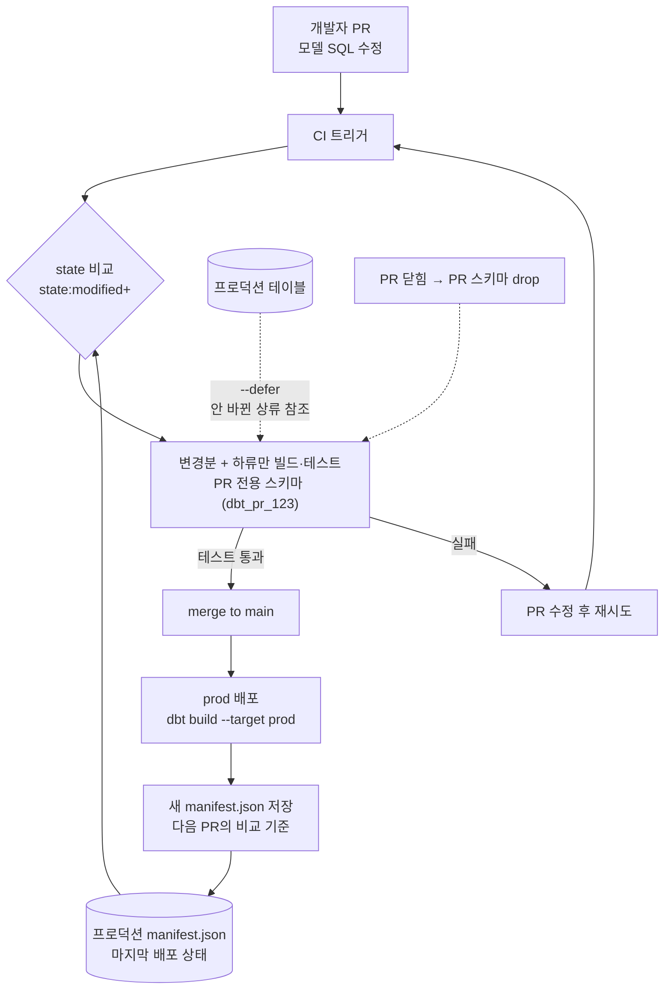

<figure class="post-figure post-figure--header">
<svg role="img" aria-label="Slim CI의 전체 흐름을 한 장으로 그린 그림. 위쪽에서 PR이 들어오면 마지막 배포의 prod manifest.json을 기준으로 state 비교(state:modified+)가 일어나고, 가운데 그래프에서는 수정된 int_revenue와 그 하류 mart_sales만 PR 스키마(dbt_pr_123)에 빌드·테스트되며 안 바뀐 상류 stg_users·stg_orders는 --defer로 프로덕션 스키마의 실제 테이블을 참조한다. 아래쪽에서는 테스트를 통과한 변경만 merge되어 prod로 배포되고, 새 manifest가 저장되어 다음 PR의 비교 기준으로 되돌아간다." viewBox="0 0 680 380" xmlns="http://www.w3.org/2000/svg">
  <title>Slim CI — PR의 변경과 하류만 PR 스키마에 빌드하고, 상류는 --defer로 프로덕션을 빌려 쓰며, 통과한 변경만 prod로 배포되어 새 manifest가 다음 비교 기준이 된다</title>
  <defs>
    <marker id="pci-h-arrow" viewBox="0 0 10 10" refX="8" refY="5" markerWidth="6" markerHeight="6" orient="auto-start-reverse">
      <path d="M0,0 L10,5 L0,10 z" fill="var(--secondary-color)"/>
    </marker>
    <marker id="pci-h-arrow-accent" viewBox="0 0 10 10" refX="8" refY="5" markerWidth="6" markerHeight="6" orient="auto-start-reverse">
      <path d="M0,0 L10,5 L0,10 z" fill="var(--accent-color)"/>
    </marker>
    <marker id="pci-h-arrow-gold" viewBox="0 0 10 10" refX="8" refY="5" markerWidth="6" markerHeight="6" orient="auto-start-reverse">
      <path d="M0,0 L10,5 L0,10 z" fill="var(--gold)"/>
    </marker>
  </defs>

  <!-- ===== title ===== -->
  <text x="340" y="22" text-anchor="middle" font-size="16" font-weight="800" fill="currentColor" letter-spacing="1.5">DBT SLIM CI</text>
  <text x="340" y="40" text-anchor="middle" font-size="10" fill="currentColor" opacity="0.72">바뀐 것과 그 하류만 검증하고, 통과한 변경만 배포한다</text>

  <!-- ===== ROW A: PR -> state compare <- prod manifest ===== -->
  <rect x="28" y="62" width="112" height="44" rx="4" fill="var(--bg-light)" stroke="currentColor" stroke-width="2.5"/>
  <text x="84" y="80" text-anchor="middle" font-size="11" font-weight="800" fill="currentColor">PR #123</text>
  <text x="84" y="96" text-anchor="middle" font-size="8.5" fill="currentColor" opacity="0.75">모델 SQL 수정</text>

  <line x1="140" y1="84" x2="206" y2="84" stroke="var(--secondary-color)" stroke-width="2" marker-end="url(#pci-h-arrow)"/>

  <rect x="210" y="62" width="168" height="44" rx="4" fill="var(--bg-panel)" stroke="currentColor" stroke-width="2.5"/>
  <text x="294" y="80" text-anchor="middle" font-size="11" font-weight="800" fill="currentColor">state 비교</text>
  <text x="294" y="96" text-anchor="middle" font-size="8.5" fill="currentColor" opacity="0.75">state:modified+</text>

  <!-- prod manifest document -->
  <path d="M470,58 h38 l12,12 v40 h-50 z" fill="var(--bg-light)" stroke="var(--gold)" stroke-width="2"/>
  <path d="M508,58 v12 h12" fill="none" stroke="var(--gold)" stroke-width="2"/>
  <g stroke="currentColor" stroke-width="1.1" opacity="0.4">
    <line x1="478" y1="80" x2="512" y2="80"/>
    <line x1="478" y1="90" x2="512" y2="90"/>
    <line x1="478" y1="100" x2="504" y2="100"/>
  </g>
  <text x="495" y="122" text-anchor="middle" font-size="8.5" font-weight="700" fill="currentColor">prod manifest.json</text>
  <text x="495" y="133" text-anchor="middle" font-size="8" fill="currentColor" opacity="0.7">마지막 배포의 사진</text>

  <line x1="466" y1="84" x2="382" y2="84" stroke="var(--gold)" stroke-width="2" stroke-dasharray="5,4" marker-end="url(#pci-h-arrow-gold)"/>
  <text x="424" y="78" text-anchor="middle" font-size="8" fill="currentColor" opacity="0.7">비교 기준</text>

  <!-- compare -> graph -->
  <line x1="294" y1="106" x2="294" y2="146" stroke="var(--secondary-color)" stroke-width="2" marker-end="url(#pci-h-arrow)"/>
  <text x="302" y="130" text-anchor="start" font-size="8.5" fill="currentColor" opacity="0.75">바뀐 것 + 하류만 선택</text>

  <!-- ===== ROW B: prod zone / PR schema zone ===== -->
  <!-- prod zone -->
  <rect x="28" y="150" width="230" height="120" rx="6" fill="var(--bg-light)" stroke="currentColor" stroke-width="2"/>
  <text x="143" y="168" text-anchor="middle" font-size="10" font-weight="800" fill="currentColor">프로덕션 · analytics.prod</text>
  <rect x="58" y="180" width="100" height="26" rx="4" fill="var(--bg-panel)" stroke="currentColor" stroke-width="1.8"/>
  <text x="108" y="197" text-anchor="middle" font-size="9" font-weight="700" fill="currentColor">stg_users</text>
  <text x="166" y="197" text-anchor="start" font-size="8" fill="currentColor" opacity="0.7">안 바뀜</text>
  <rect x="58" y="222" width="100" height="26" rx="4" fill="var(--bg-panel)" stroke="currentColor" stroke-width="1.8"/>
  <text x="108" y="239" text-anchor="middle" font-size="9" font-weight="700" fill="currentColor">stg_orders</text>
  <text x="166" y="239" text-anchor="start" font-size="8" fill="currentColor" opacity="0.7">안 바뀜</text>

  <!-- PR schema zone -->
  <rect x="350" y="150" width="302" height="120" rx="6" fill="var(--bg-light)" stroke="var(--accent-color)" stroke-width="2.5"/>
  <text x="501" y="168" text-anchor="middle" font-size="10" font-weight="800" fill="var(--accent-color)">PR 스키마 · dbt_pr_123</text>
  <text x="428" y="186" text-anchor="middle" font-size="8" font-weight="700" fill="var(--accent-color)">수정됨</text>
  <rect x="372" y="192" width="112" height="28" rx="4" fill="var(--bg-panel)" stroke="var(--accent-color)" stroke-width="2.2"/>
  <text x="428" y="210" text-anchor="middle" font-size="9" font-weight="700" fill="currentColor">int_revenue</text>
  <text x="572" y="186" text-anchor="middle" font-size="8" fill="currentColor" opacity="0.7">하류</text>
  <rect x="520" y="192" width="104" height="28" rx="4" fill="var(--bg-panel)" stroke="var(--secondary-color)" stroke-width="2"/>
  <text x="572" y="210" text-anchor="middle" font-size="9" font-weight="700" fill="currentColor">mart_sales</text>
  <line x1="484" y1="206" x2="516" y2="206" stroke="var(--secondary-color)" stroke-width="2" marker-end="url(#pci-h-arrow)"/>
  <text x="501" y="252" text-anchor="middle" font-size="8.5" fill="currentColor" opacity="0.75">변경 + 하류만 빌드 · 테스트</text>

  <!-- defer arrows: ref() from PR build to prod tables -->
  <g stroke="var(--accent-color)" stroke-width="2" stroke-dasharray="5,4" fill="none">
    <line x1="368" y1="200" x2="162" y2="193" marker-end="url(#pci-h-arrow-accent)"/>
    <line x1="368" y1="212" x2="162" y2="235" marker-end="url(#pci-h-arrow-accent)"/>
  </g>
  <text x="304" y="184" text-anchor="middle" font-size="9" font-weight="800" fill="var(--accent-color)">--defer</text>
  <text x="304" y="248" text-anchor="middle" font-size="8" fill="currentColor" opacity="0.7">상류는 빌려 쓴다</text>

  <!-- ===== ROW C: pass -> merge -> deploy -> new manifest ===== -->
  <path d="M501,270 L501,284 L215,284 L215,296" fill="none" stroke="var(--secondary-color)" stroke-width="2" marker-end="url(#pci-h-arrow)"/>

  <rect x="120" y="300" width="190" height="34" rx="4" fill="var(--bg-panel)" stroke="currentColor" stroke-width="2"/>
  <text x="215" y="321" text-anchor="middle" font-size="10" font-weight="800" fill="currentColor">✓ 테스트 통과 → merge</text>

  <line x1="310" y1="317" x2="356" y2="317" stroke="var(--secondary-color)" stroke-width="2" marker-end="url(#pci-h-arrow)"/>

  <rect x="360" y="300" width="170" height="34" rx="4" fill="var(--bg-panel)" stroke="var(--gold)" stroke-width="2.5"/>
  <text x="445" y="314" text-anchor="middle" font-size="10" font-weight="800" fill="currentColor">prod 배포</text>
  <text x="445" y="328" text-anchor="middle" font-size="7.5" fill="currentColor" opacity="0.75">dbt build --target prod</text>

  <line x1="530" y1="317" x2="570" y2="317" stroke="var(--gold)" stroke-width="2" marker-end="url(#pci-h-arrow-gold)"/>

  <!-- new manifest document -->
  <path d="M576,300 h28 l10,10 v28 h-38 z" fill="var(--bg-light)" stroke="var(--gold)" stroke-width="2"/>
  <path d="M604,300 v10 h10" fill="none" stroke="var(--gold)" stroke-width="2"/>
  <g stroke="currentColor" stroke-width="1" opacity="0.4">
    <line x1="583" y1="318" x2="607" y2="318"/>
    <line x1="583" y1="326" x2="607" y2="326"/>
  </g>
  <text x="595" y="352" text-anchor="middle" font-size="8" font-weight="700" fill="var(--gold)">새 manifest</text>

  <!-- loop back: new manifest -> prod manifest -->
  <path d="M606,296 C 660,240 660,140 528,88" fill="none" stroke="var(--gold)" stroke-width="2" stroke-dasharray="5,4" marker-end="url(#pci-h-arrow-gold)"/>
  <text x="644" y="190" text-anchor="end" font-size="8" fill="var(--gold)">다음 PR의</text>
  <text x="644" y="201" text-anchor="end" font-size="8" fill="var(--gold)">비교 기준</text>
</svg>
<figcaption>Slim CI 한 장 요약 — PR의 변경을 prod manifest와 비교해 "바뀐 것 + 하류"만 PR 스키마에 빌드하고(안 바뀐 상류는 --defer로 프로덕션 참조), 통과한 변경만 배포되어 새 manifest가 다음 비교 기준이 된다</figcaption>
</figure>

## 들어가며

지금까지 네 단계에 걸쳐 우리는 dbt를 **혼자서 잘 쓰는 법**을 익혔습니다. 모델과 `ref()`로 의존성 그래프를 세우고, 테스트·문서로 신뢰를 얹고, 매크로·Jinja로 반복을 없애고, 4단계 [dbt Incremental · Snapshot](/2026/07/14/dbt-incremental-snapshots.html)에서는 증분 모델과 SCD Type 2로 규모와 이력까지 감당했습니다. 이제 남은 질문은 이것입니다 — **이 프로젝트를 여러 명이 동시에 고치기 시작하면 무엇이 필요한가.**

답은 소프트웨어 공학이 이미 낸 답과 같습니다. 공통 로직은 **패키지**로 뽑아 재사용하고, 모든 변경은 **CI**가 검증한 뒤에만 프로덕션에 들어가게 하는 것. 다만 dbt에는 한 가지 고유한 난제가 있습니다 — 모델이 수백 개인 프로젝트에서 PR마다 전체를 다시 빌드하면 CI 한 번에 수십 분과 상당한 웨어하우스 비용이 듭니다. dbt는 이 문제를 **state 비교**와 **`--defer`**로 풉니다. "바뀐 것과 그 하류만 빌드하고, 안 바뀐 상류는 프로덕션 산출물을 빌려 쓴다" — 이것이 **Slim CI**이며, 이 글의 심장입니다. 이 글은 [dbt Essential Curriculum](/2026/07/12/dbt-essential-curriculum.html)의 **5단계**로, 패키지 → Slim CI → 배포 파이프라인 순서로 dbt를 팀 규모로 넓힙니다.

<div class="post-summary-box" markdown="1">

### 📌 이 글에서 다루는 내용

- **dbt packages**: `packages.yml`·`dbt deps`, dbt hub의 대표 패키지(dbt_utils·codegen·dbt_expectations), 버전 핀과 범위 지정, git/로컬 패키지로 사내 공통 모듈을 뽑는 전략, 패키지 변수 오버라이드
- **Slim CI와 state**: manifest.json이 담는 프로젝트 상태, `state:modified`(+`state:modified+`) 셀렉터, `--defer`가 안 바뀐 상류를 프로덕션 산출물로 대체하는 원리, PR별 스키마 격리와 정리
- **배포 파이프라인**: GitHub Actions 워크플로(PR: slim build → merge: prod 배포), dev/prod target·profiles 환경 분리, Airflow 연동(BashOperator·Cosmos), `dbt build` 단일 진입점과 롤백 관점

</div>

## 한눈에 보기 — 변경이 프로덕션에 도달하는 길

이 글 전체를 하나의 흐름으로 요약하면 이렇습니다. 개발자가 PR을 올리면 CI가 프로덕션의 manifest와 비교해 **바뀐 모델과 그 하류만** 골라내고, 안 바뀐 상류는 `--defer`로 프로덕션 테이블을 참조한 채 PR 전용 스키마에 빌드·테스트합니다. 통과한 변경만 merge되고, merge가 곧 프로덕션 배포를 트리거하며, 배포가 끝나면 새 manifest가 저장되어 다음 PR의 비교 기준이 됩니다.



앞 절반은 이 흐름의 재료(패키지·state·defer)를, 뒤 절반은 이 흐름을 실제 파이프라인으로 세우는 법을 다룹니다.

## dbt packages — 재사용의 단위

### packages.yml과 dbt deps

dbt 패키지는 **그 자체로 완전한 dbt 프로젝트**입니다. 모델·매크로·테스트를 담을 수 있고, 내 프로젝트에 설치하면 그 자원들이 내 것처럼 그래프에 합류합니다. 선언은 프로젝트 루트의 `packages.yml`에, 설치는 `dbt deps` 한 줄입니다.

```yaml
# packages.yml
packages:
  # dbt hub 패키지 — 이름 + 버전
  - package: dbt-labs/dbt_utils
    version: 1.3.0

  # 버전 범위 지정 — 1.x 안에서 최신을 따라감
  - package: calogica/dbt_expectations
    version: [">=0.10.0", "<0.11.0"]

  # git 패키지 — 사내 공통 모듈 (태그로 핀)
  - git: "git@github.com:example/dbt-common.git"
    revision: v2.4.1

  # 로컬 패키지 — 모노레포 안 상대 경로
  - local: ../dbt-shared
```

```bash
dbt deps          # packages.yml 해석 → dbt_packages/ 아래 설치
```

버전 지정에는 규율이 필요합니다. dbt hub 패키지는 시맨틱 버전을 따르므로 **범위 지정**(`[">=1.3.0", "<2.0.0"]`)으로 패치·마이너를 자동 수용하는 것이 일반적이지만, git 패키지는 `revision`을 브랜치로 두면 "어제는 됐는데 오늘 깨지는" 재현 불가능한 빌드가 됩니다 — **반드시 태그나 커밋 해시로 핀**하세요. dbt 1.7+의 `dbt deps --lock`이 생성하는 `package-lock.yml`을 커밋해 두면 CI와 로컬이 항상 같은 버전을 설치합니다.

### dbt hub의 대표 패키지

바퀴를 다시 발명하기 전에 [hub.getdbt.com](https://hub.getdbt.com)을 먼저 뒤지는 습관이 팀의 시간을 아낍니다. 사실상 표준으로 쓰이는 세 가지만 짚습니다.

| 패키지 | 무엇을 주나 | 대표 사용처 |
| --- | --- | --- |
| **dbt_utils** | 범용 매크로 모음 — 3단계에서 이미 만남 | `generate_surrogate_key`, `union_relations`, `date_spine`, 제네릭 테스트(`equal_rowcount` 등) |
| **codegen** | 보일러플레이트 **생성** 매크로 | 원천 스키마에서 `source` YAML 생성, 모델의 컬럼 목록에서 `schema.yml` 초안 생성 |
| **dbt_expectations** | Great Expectations 스타일의 풍부한 데이터 테스트 | 분포·범위·정규식·행수 기대치 등 내장 테스트로는 부족한 데이터 품질 검증 |

codegen은 특히 온보딩에서 빛납니다. 새 원천을 붙일 때 컬럼을 손으로 옮겨 적는 대신:


```bash
# raw_shop 스키마의 테이블들로 source YAML 초안 생성
dbt run-operation generate_source \
  --args '{"schema_name": "raw_shop", "database_name": "analytics", "generate_columns": true}'
```


### 사내 공통 모듈을 패키지로 뽑기

팀이 여러 dbt 프로젝트를 운영하기 시작하면(도메인별 분리, 자회사별 프로젝트 등) 같은 매크로 — 금액 반올림 규칙, 타임존 변환, 표준 스테이징 패턴 — 가 프로젝트마다 복사되기 시작합니다. 이때가 **사내 패키지를 만들 시점**입니다.

전략은 단순합니다. 별도 git 저장소에 최소 구조의 dbt 프로젝트를 만들고, 공통 매크로(때로는 공통 dimension 모델까지)를 옮긴 뒤, 각 프로젝트가 git 패키지로 당겨 씁니다.

```text
dbt-common/                  # 사내 공통 패키지 저장소
├── dbt_project.yml          # name: company_common
├── macros/
│   ├── money_round.sql      # 전사 금액 반올림 규칙
│   ├── to_kst.sql           # 타임존 변환 표준
│   └── std_staging.sql      # 스테이징 보일러플레이트 생성
└── models/
    └── dim_calendar.sql     # 전사 공통 달력 dimension
```

호출은 패키지 이름을 네임스페이스로 씁니다.


```sql
-- 각 프로젝트의 모델에서
select
    order_id,
    {{ company_common.money_round('amount_krw') }} as amount_krw,
    {{ company_common.to_kst('ordered_at_utc') }} as ordered_at
from {{ ref('stg_orders') }}
```


운영 수칙 세 가지 — ① 공통 패키지도 **버전 태그로 릴리스**하고 소비 프로젝트는 태그로 핀할 것, ② 매크로는 공통화가 쉽지만 **모델 공통화는 신중히**(소비 프로젝트마다 materialization·스키마 요구가 다르면 발목을 잡음), ③ 공통 패키지 자체에도 CI(최소한 `dbt parse` + 매크로 단위 테스트)를 걸 것.

### 패키지 변수 오버라이드

잘 만든 패키지는 동작을 **변수(var)**로 열어 둡니다. 소비하는 쪽은 `dbt_project.yml`의 `vars`에서 패키지 이름을 스코프로 잡아 오버라이드합니다.

```yaml
# dbt_project.yml (소비 프로젝트)
vars:
  # 패키지 스코프 오버라이드
  company_common:
    fiscal_year_start_month: 4     # 회계연도 시작월을 우리 조직 기준으로
  dbt_utils:
    surrogate_key_treat_nulls_as_empty_strings: true
```

패키지의 모델을 우리 웨어하우스의 다른 스키마에 앉히고 싶다면 `models` 블록에서 패키지 이름으로 설정을 덮습니다.

```yaml
models:
  company_common:
    +schema: common          # 패키지 모델은 <target_schema>_common에
    +materialized: table
```

## Slim CI — 바뀐 것만 검증한다

### manifest.json — 프로젝트의 상태 사진

Slim CI를 이해하려면 먼저 **manifest.json**을 이해해야 합니다. dbt는 `parse`·`compile`·`run`·`build` 등 거의 모든 명령에서 `target/manifest.json`을 생성하는데, 여기에는 그 시점 프로젝트의 **전체 상태**가 담깁니다 — 모든 모델·테스트·소스·매크로의 정의, 컴파일된 SQL, 설정값, 그리고 그래프의 모든 의존성 간선.

즉 manifest는 "그때 프로젝트가 어떻게 생겼었는가"의 사진입니다. **프로덕션 배포 때 찍은 사진**과 **지금 PR 브랜치의 사진**을 비교하면, dbt는 무엇이 바뀌었는지 노드 단위로 알 수 있습니다. 이 비교를 켜는 스위치가 `--state` 플래그입니다.

```bash
# 프로덕션 배포 시점의 manifest를 ./prod-artifacts/에 받아 뒀다고 하자
dbt ls --select state:modified --state ./prod-artifacts/
# → 프로덕션 대비 정의가 달라진 노드만 나열
```

`state:modified`가 잡아내는 "변경"은 SQL 본문만이 아닙니다 — 설정 변경(materialization·schema 등), 참조하는 매크로의 변경, YAML의 컬럼·테스트 변경까지 포함합니다. 그래서 매크로 하나를 고치면 그 매크로를 쓰는 모든 모델이 modified로 잡힙니다. 정확히 우리가 원하는 동작입니다.

### state:modified+ — 변경과 그 하류

바뀐 모델만 빌드하면 될까요? 부족합니다. `stg_orders`의 컬럼 로직을 바꿨다면 그것을 `ref()`하는 `int_revenue`, 다시 그것을 참조하는 `mart_sales`까지 — **하류(downstream)가 깨지지 않는지**가 진짜 검증 대상입니다. 그래프 연산자 `+`를 뒤에 붙이면 하류가 포함됩니다.

```bash
# 바뀐 노드 + 그 모든 하류를 빌드하고 테스트
dbt build --select state:modified+ --state ./prod-artifacts/
```

1단계에서 익힌 셀렉터 문법이 그대로 조합됩니다 — `state:modified+`는 "modified 집합에 각 노드의 하류를 합친 것"일 뿐입니다. 반대로 `+state:modified`는 상류를 포함하는데, CI에서는 거의 쓰지 않습니다. 상류는 빌드하지 않고 **빌려 쓸** 것이기 때문입니다. 그것이 `--defer`입니다.

### --defer — 안 바꾼 상류는 프로덕션 것을 빌려 쓴다

`state:modified+`로 선택 범위를 좁혀도 문제가 하나 남습니다. 선택된 모델 `int_revenue`가 선택되지 **않은** `stg_users`를 `ref()`한다면? CI 환경(PR 전용 스키마)에는 `stg_users`가 존재하지 않으므로 빌드가 실패합니다. 그렇다고 상류를 전부 다시 빌드하면 Slim CI의 의미가 없습니다.

`--defer`가 이 간극을 메웁니다. **선택되지 않은 노드에 대한 `ref()`를, state로 넘긴 manifest의 환경 — 즉 프로덕션 — 의 실제 테이블로 해석**합니다.

<figure class="post-figure">
<svg role="img" aria-label="--defer의 ref() 해석 원리를 그린 그림. 오른쪽 PR 스키마(analytics_ci.dbt_pr_123)에는 수정된 int_revenue와 그 하류 mart_sales만 빌드되고, PR 스키마에 존재하지 않는 stg_users는 점선 유령 상자로 표시된다. int_revenue의 ref() 화살표는 수정되지 않은 상류 stg_users·stg_orders를 향해 PR 스키마 경계를 넘어 왼쪽 프로덕션 스키마(analytics.prod)의 실제 테이블로 꺾여 들어간다. 실선은 CI가 빌드하는 것, 점선은 defer로 빌려 쓰는 것." viewBox="0 0 640 320" xmlns="http://www.w3.org/2000/svg">
  <title>--defer — 선택되지 않은 상류의 ref()는 프로덕션 테이블로 해석된다: 빌드하는 것과 빌려 쓰는 것의 경계</title>
  <defs>
    <marker id="pci-d-arrow" viewBox="0 0 10 10" refX="8" refY="5" markerWidth="6" markerHeight="6" orient="auto-start-reverse">
      <path d="M0,0 L10,5 L0,10 z" fill="var(--secondary-color)"/>
    </marker>
    <marker id="pci-d-arrow-accent" viewBox="0 0 10 10" refX="8" refY="5" markerWidth="6" markerHeight="6" orient="auto-start-reverse">
      <path d="M0,0 L10,5 L0,10 z" fill="var(--accent-color)"/>
    </marker>
  </defs>

  <text x="320" y="24" text-anchor="middle" font-size="14" font-weight="800" fill="currentColor">ref()의 두 갈래 해석 — 빌드하는 것과 빌려 쓰는 것</text>

  <!-- ===== prod schema panel ===== -->
  <rect x="20" y="44" width="240" height="210" rx="6" fill="var(--bg-light)" stroke="currentColor" stroke-width="2"/>
  <text x="140" y="64" text-anchor="middle" font-size="11" font-weight="800" fill="currentColor">analytics.prod</text>
  <text x="140" y="79" text-anchor="middle" font-size="8.5" fill="currentColor" opacity="0.72">프로덕션 — 마지막 배포의 실제 테이블</text>

  <text x="140" y="98" text-anchor="middle" font-size="8" fill="currentColor" opacity="0.7">수정 안 됨</text>
  <rect x="70" y="104" width="140" height="34" rx="4" fill="var(--bg-panel)" stroke="currentColor" stroke-width="2"/>
  <text x="140" y="125" text-anchor="middle" font-size="10" font-weight="700" fill="currentColor">stg_users</text>

  <text x="140" y="176" text-anchor="middle" font-size="8" fill="currentColor" opacity="0.7">수정 안 됨</text>
  <rect x="70" y="182" width="140" height="34" rx="4" fill="var(--bg-panel)" stroke="currentColor" stroke-width="2"/>
  <text x="140" y="203" text-anchor="middle" font-size="10" font-weight="700" fill="currentColor">stg_orders</text>

  <!-- ===== PR schema panel ===== -->
  <rect x="320" y="44" width="300" height="210" rx="6" fill="var(--bg-light)" stroke="var(--accent-color)" stroke-width="2.5"/>
  <text x="470" y="64" text-anchor="middle" font-size="11" font-weight="800" fill="var(--accent-color)">analytics_ci.dbt_pr_123</text>
  <text x="470" y="79" text-anchor="middle" font-size="8.5" fill="currentColor" opacity="0.72">PR 스키마 — CI가 빌드하는 것: 변경 + 하류</text>

  <text x="415" y="98" text-anchor="middle" font-size="8" font-weight="700" fill="var(--accent-color)">수정됨</text>
  <rect x="350" y="104" width="130" height="34" rx="4" fill="var(--bg-panel)" stroke="var(--accent-color)" stroke-width="2.2"/>
  <text x="415" y="125" text-anchor="middle" font-size="10" font-weight="700" fill="currentColor">int_revenue</text>

  <text x="415" y="176" text-anchor="middle" font-size="8" fill="currentColor" opacity="0.7">하류 — 함께 검증</text>
  <rect x="350" y="182" width="130" height="34" rx="4" fill="var(--bg-panel)" stroke="var(--secondary-color)" stroke-width="2"/>
  <text x="415" y="203" text-anchor="middle" font-size="10" font-weight="700" fill="currentColor">mart_sales</text>

  <!-- build edge: int_revenue -> mart_sales -->
  <line x1="415" y1="138" x2="415" y2="178" stroke="var(--secondary-color)" stroke-width="2" marker-end="url(#pci-d-arrow)"/>

  <!-- ghost: stg_users missing in PR schema -->
  <rect x="506" y="104" width="96" height="34" rx="4" fill="none" stroke="currentColor" stroke-width="1.5" stroke-dasharray="4,4" opacity="0.5"/>
  <text x="554" y="119" text-anchor="middle" font-size="9" fill="currentColor" opacity="0.55">stg_users</text>
  <text x="554" y="132" text-anchor="middle" font-size="7.5" fill="currentColor" opacity="0.55">여기엔 없다</text>
  <line x1="482" y1="121" x2="504" y2="121" stroke="currentColor" stroke-width="1.2" stroke-dasharray="2,3" opacity="0.5"/>
  <text x="493" y="116" text-anchor="middle" font-size="9" font-weight="800" fill="var(--accent-color)">✗</text>

  <!-- defer edges: ref() resolved to prod tables -->
  <g stroke="var(--accent-color)" stroke-width="2" stroke-dasharray="5,4" fill="none">
    <line x1="346" y1="114" x2="214" y2="118" marker-end="url(#pci-d-arrow-accent)"/>
    <line x1="346" y1="128" x2="214" y2="196" marker-end="url(#pci-d-arrow-accent)"/>
  </g>
  <text x="285" y="214" text-anchor="middle" font-size="10" font-weight="800" fill="var(--accent-color)">--defer</text>
  <text x="285" y="228" text-anchor="middle" font-size="8" fill="currentColor" opacity="0.75">프로덕션을 빌려 쓴다</text>

  <!-- legend -->
  <line x1="60" y1="286" x2="100" y2="286" stroke="var(--secondary-color)" stroke-width="2"/>
  <text x="108" y="290" text-anchor="start" font-size="8.5" fill="currentColor">CI가 PR 스키마에 빌드 (state:modified+)</text>
  <line x1="350" y1="286" x2="390" y2="286" stroke="var(--accent-color)" stroke-width="2" stroke-dasharray="5,4"/>
  <text x="398" y="290" text-anchor="start" font-size="8.5" fill="currentColor">--defer — 프로덕션 테이블을 참조</text>
</svg>
<figcaption>--defer의 경계 — 수정된 int_revenue와 하류 mart_sales만 PR 스키마에 빌드되고, 선택되지 않은 상류를 향한 ref()는 프로덕션 스키마의 실제 테이블로 꺾여 해석된다</figcaption>
</figure>

```bash
dbt build \
  --select state:modified+ \
  --defer \
  --state ./prod-artifacts/ \
  --target ci
```

이때 컴파일 결과가 어떻게 달라지는지 보면 원리가 선명해집니다.


```sql
-- models/int_revenue.sql (수정된 모델, CI에서 빌드됨)
select o.order_id, o.amount, u.country
from {{ ref('stg_orders') }} o      -- stg_orders도 수정됨 → PR 스키마
join {{ ref('stg_users') }} u       -- 수정 안 됨 → defer!
  on o.user_id = u.user_id
```


```sql
-- 컴파일 결과 (target/compiled/...)
select o.order_id, o.amount, u.country
from analytics_ci.dbt_pr_123.stg_orders o   -- 방금 CI가 빌드한 것
join analytics.prod.stg_users u             -- 프로덕션 테이블을 그대로 참조
  on o.user_id = u.user_id
```

결과적으로 CI는 **바뀐 노드와 하류만 빌드하면서도, 프로덕션의 실제 데이터 위에서 검증**하게 됩니다. 수백 모델 프로젝트에서 PR CI가 모델 서너 개만 돌게 되니, 시간과 웨어하우스 비용이 문자 그대로 수십 분의 일로 줄어듭니다.

한 가지 주의 — defer는 "프로덕션 상류가 최신"임을 전제합니다. 프로덕션 배포가 오래 밀려 있으면 CI가 낡은 데이터 위에서 검증하게 되므로, manifest 아티팩트는 **항상 마지막 성공한 프로덕션 배포의 것**을 쓰고, 프로덕션 배포 주기를 건강하게 유지하는 것이 Slim CI의 숨은 전제 조건입니다.

### 스키마 격리 — PR마다 방 하나씩

Slim CI의 빌드 산출물은 프로덕션은 물론 다른 PR과도 섞이면 안 됩니다. 표준 패턴은 **PR 번호로 스키마를 격리**하는 것입니다. profiles의 CI target에서 스키마 이름에 환경변수를 끼워 넣습니다.


```yaml
# profiles.yml
shop_analytics:
  target: dev
  outputs:
    dev:
      type: snowflake
      schema: "dbt_{{ env_var('USER', 'dev') }}"   # 개발자별 스키마
      threads: 4
      # ... 접속 정보 ...
    ci:
      type: snowflake
      schema: "dbt_pr_{{ env_var('PR_NUMBER', 'local') }}"  # PR별 스키마
      threads: 8
    prod:
      type: snowflake
      schema: prod
      threads: 8
```


이렇게 하면 PR #123의 CI는 `dbt_pr_123` 스키마에만 쓰고, 동시에 열린 PR #124와 충돌하지 않습니다. 남는 숙제는 **정리(cleanup)**입니다 — PR 스키마를 방치하면 웨어하우스에 유령 스키마가 수백 개 쌓입니다. PR이 닫힐 때 스키마를 drop하는 잡을 하나 두는 것이 정석입니다.

```sql
-- PR 닫힘 이벤트에서 실행할 정리 쿼리 (Snowflake 예)
drop schema if exists analytics_ci.dbt_pr_123 cascade;
```

## 배포 파이프라인 — PR에서 프로덕션까지

### GitHub Actions — PR 검증 워크플로

이제 재료를 파이프라인으로 조립합니다. 먼저 PR 쪽 — Slim CI 워크플로입니다. 핵심 동작은 세 가지입니다: ① 마지막 프로덕션 배포의 manifest를 내려받고, ② `state:modified+` + `--defer`로 빌드·테스트하고, ③ PR 닫힘 시 스키마를 정리합니다.


```yaml
# .github/workflows/dbt-ci.yml
name: dbt Slim CI

on:
  pull_request:
    branches: [main]

jobs:
  slim-ci:
    runs-on: ubuntu-latest
    env:
      DBT_PROFILES_DIR: .
      PR_NUMBER: ${{ github.event.number }}
      SNOWFLAKE_ACCOUNT: ${{ secrets.SNOWFLAKE_ACCOUNT }}
      SNOWFLAKE_USER: ${{ secrets.SNOWFLAKE_CI_USER }}
      SNOWFLAKE_PASSWORD: ${{ secrets.SNOWFLAKE_CI_PASSWORD }}
    steps:
      - uses: actions/checkout@v4

      - uses: actions/setup-python@v5
        with:
          python-version: "3.12"

      - name: Install dbt
        run: pip install dbt-core dbt-snowflake

      - name: Install dbt packages
        run: dbt deps

      # 마지막 성공한 prod 배포가 올려 둔 manifest를 내려받는다
      - name: Download prod manifest
        run: |
          mkdir -p prod-artifacts
          aws s3 cp s3://my-dbt-artifacts/prod/manifest.json prod-artifacts/
        env:
          AWS_ACCESS_KEY_ID: ${{ secrets.AWS_ACCESS_KEY_ID }}
          AWS_SECRET_ACCESS_KEY: ${{ secrets.AWS_SECRET_ACCESS_KEY }}

      # 바뀐 것 + 하류만, 상류는 prod를 defer 참조
      - name: Slim build & test
        run: |
          dbt build \
            --select state:modified+ \
            --defer \
            --state prod-artifacts \
            --target ci

  cleanup:
    if: github.event.action == 'closed'
    runs-on: ubuntu-latest
    steps:
      - name: Drop PR schema
        run: |
          snowsql -q "drop schema if exists analytics_ci.dbt_pr_${{ github.event.number }} cascade;"
```


`dbt build`를 쓴 점에 주목하세요. `run`(빌드)과 `test`(검증)를 따로 돌리는 대신, `build`는 그래프 순서대로 **모델 빌드 → 그 모델의 테스트 → 통과하면 다음 모델**을 반복합니다. 상류 테스트가 실패하면 하류는 아예 빌드하지 않으므로, 깨진 데이터 위에 뭔가를 더 쌓는 일이 없습니다. CI든 프로덕션이든 **`dbt build` 하나를 단일 진입점**으로 삼는 것이 현대 dbt 운영의 표준입니다.

### merge → 프로덕션 배포

merge가 되면 프로덕션 배포 워크플로가 이어받습니다. 여기서는 전체(또는 프로젝트 정책에 따른 범위)를 prod target으로 빌드하고, **성공하면 manifest를 아티팩트 저장소에 올려** 다음 PR의 비교 기준을 갱신합니다.


```yaml
# .github/workflows/dbt-deploy.yml
name: dbt Deploy to Prod

on:
  push:
    branches: [main]

jobs:
  deploy:
    runs-on: ubuntu-latest
    env:
      DBT_PROFILES_DIR: .
      SNOWFLAKE_ACCOUNT: ${{ secrets.SNOWFLAKE_ACCOUNT }}
      SNOWFLAKE_USER: ${{ secrets.SNOWFLAKE_PROD_USER }}
      SNOWFLAKE_PASSWORD: ${{ secrets.SNOWFLAKE_PROD_PASSWORD }}
    steps:
      - uses: actions/checkout@v4
      - uses: actions/setup-python@v5
        with:
          python-version: "3.12"
      - run: pip install dbt-core dbt-snowflake
      - run: dbt deps

      - name: Build production
        run: dbt build --target prod

      # 성공한 배포의 상태 사진을 다음 PR의 비교 기준으로 올린다
      - name: Upload manifest
        if: success()
        run: aws s3 cp target/manifest.json s3://my-dbt-artifacts/prod/manifest.json
        env:
          AWS_ACCESS_KEY_ID: ${{ secrets.AWS_ACCESS_KEY_ID }}
          AWS_SECRET_ACCESS_KEY: ${{ secrets.AWS_SECRET_ACCESS_KEY }}
```


manifest 업로드에 `if: success()`를 건 것이 중요합니다 — **실패한 배포의 manifest가 비교 기준이 되면 안 됩니다.** 다음 PR은 항상 "마지막으로 성공한 프로덕션 상태"와 비교해야 합니다.

### 환경 분리 — target과 profiles

위 워크플로들이 자연스럽게 보여 주듯, dbt의 환경 분리는 **profiles.yml의 target**이 담당합니다. 같은 코드가 `--target dev`면 개발자 스키마에, `--target ci`면 PR 스키마에, `--target prod`면 프로덕션 스키마에 앉습니다. 코드에서 환경을 분기해야 할 때는 `target.name`을 읽습니다.


```sql
-- dev에서는 최근 3일만 처리해 개발 루프를 빠르게
select * from {{ source('shop', 'events') }}

where event_at >= dateadd('day', -3, current_date)

```


권한도 환경 축으로 나눕니다 — CI용 웨어하우스 사용자는 `analytics_ci` 스키마 생성 권한과 prod **읽기** 권한(defer 때문에 필요)만 갖고, prod 쓰기 권한은 배포 워크플로의 사용자만 갖게 하는 식입니다.

### 스케줄 실행 — 오케스트레이터에 얹기

CI/CD가 "코드 변경의 배포"라면, **스케줄 실행**은 "데이터의 갱신"입니다. 프로덕션 dbt는 보통 오케스트레이터가 주기적으로 돌립니다. [Airflow 배포와 운영](/2026/07/13/airflow-deployment-operations.html)에서 다룬 Airflow 기준으로 두 가지 패턴이 있습니다.

**패턴 1 — BashOperator(또는 KubernetesPodOperator)로 통짜 실행.** 가장 단순합니다. dbt 프로젝트 전체가 태스크 하나입니다.

```python
from airflow.decorators import dag
from airflow.providers.standard.operators.bash import BashOperator
import pendulum

@dag(
    schedule="0 5 * * *",
    start_date=pendulum.datetime(2026, 7, 1, tz="Asia/Seoul"),
    catchup=False,
)
def dbt_daily():
    BashOperator(
        task_id="dbt_build",
        bash_command="dbt build --target prod --project-dir /opt/dbt/shop_analytics",
    )

dbt_daily()
```

단순한 대신 관측 단위가 거칠어집니다 — 모델 200개 중 하나가 실패해도 Airflow에는 "태스크 하나 실패"로만 보이고, 재시도도 전체 재실행입니다(모델이 멱등이라 데이터는 안전하지만 시간 낭비).

**패턴 2 — Cosmos류 통합: dbt 그래프를 Airflow DAG로 전개.** Astronomer Cosmos 같은 라이브러리는 manifest를 읽어 **dbt 모델 하나하나를 Airflow 태스크로** 펼칩니다. 모델 단위의 성공/실패/재시도, Gantt 차트에서의 병목 식별, 실패 지점부터의 재개가 Airflow 표준 기능으로 내려옵니다. 그래프가 크면 Airflow 메타데이터 부담도 커지므로, 수십 모델 이하거나 관측 요구가 강할 때 특히 좋은 선택입니다.

어느 패턴이든 원칙은 같습니다 — **오케스트레이터는 "언제, 무엇의 다음에" 돌릴지를 맡고, "무엇을 어떤 순서로 빌드할지"는 dbt 그래프가 맡습니다.** Airflow에서 dbt 모델 간 의존성을 손으로 다시 그리는 것은 이중 관리의 지름길입니다.

### 실패와 롤백 — 재빌드의 원자성

배포가 실패하면 어떻게 되돌리는가. dbt의 답은 전통적 애플리케이션과 조금 다릅니다 — **롤백할 "배포 산출물"이 따로 없고, 이전 코드로 다시 빌드하면 이전 상태가 됩니다.** 모델이 선언적(SELECT의 결과)이기 때문입니다. 다만 그 안전성의 결이 materialization마다 다릅니다.

- **view**: `create or replace view`는 원자적입니다. 실패하면 기존 뷰가 그대로 남고, 성공하면 순간 교체됩니다. 사실상 롤백 걱정이 없습니다.
- **table**: dbt는 새 테이블을 다 만든 뒤 교체(또는 `create or replace table`)하므로, 빌드가 중간에 실패해도 **기존 테이블은 살아 있습니다**. "반쯤 만들어진 테이블"이 소비자에게 노출되지 않습니다.
- **incremental**: 여기가 주의 지점입니다. `merge`/`delete+insert`는 기존 테이블을 **제자리에서 변경**하므로, 잘못된 로직이 이미 merge된 뒤라면 되돌릴 방법은 코드 revert 후 `--full-refresh`(4단계에서 다룬 전체 재빌드)뿐입니다. 큰 테이블이라면 비용이 커서, incremental 모델의 변경일수록 Slim CI 검증이 중요해집니다.

그래서 dbt의 실전 롤백 절차는 이렇게 요약됩니다 — ① git revert로 코드를 되돌리고, ② 배포 파이프라인이 revert 커밋을 다시 빌드하게 하고(view/table은 이것으로 끝), ③ incremental 모델이 오염됐다면 해당 모델만 `dbt build --select bad_model+ --full-refresh`로 재구축. "코드가 곧 상태"라는 dbt의 성격이 롤백을 단순하게 만들어 주지만, 그 전제는 **모든 변경이 CI를 거쳐 main에만 존재한다**는 규율입니다. 콘솔에서 손으로 프로덕션 테이블을 고치는 순간 이 모델은 무너집니다.

## 정리

- **패키지는 재사용의 단위입니다.** `packages.yml` + `dbt deps`로 설치하고, hub 패키지는 버전 범위로, git 패키지는 태그로 핀합니다. dbt_utils·codegen·dbt_expectations는 사실상 표준이고, 여러 프로젝트에 복사되기 시작한 공통 매크로는 사내 git 패키지로 뽑아 태그 릴리스로 관리합니다. 패키지 동작은 `vars`의 패키지 스코프로 오버라이드합니다.
- **Slim CI의 재료는 manifest·state·defer 세 가지입니다.** manifest.json은 프로젝트 상태의 사진이고, `state:modified+`는 프로덕션 사진과 비교해 "바뀐 것 + 하류"를 골라내며, `--defer`는 선택되지 않은 상류의 `ref()`를 프로덕션 테이블로 해석합니다. PR별 스키마(`dbt_pr_<n>`)로 격리하고 PR이 닫히면 drop합니다.
- **파이프라인의 뼈대는 "PR은 slim, merge는 full, 성공 시 manifest 갱신"입니다.** `dbt build`를 단일 진입점으로 삼아 빌드와 테스트를 그래프 순서로 엮고, 실패한 배포의 manifest는 절대 비교 기준으로 올리지 않습니다. 환경 분리는 profiles의 target이, 스케줄 실행은 오케스트레이터(통짜 BashOperator 또는 Cosmos식 그래프 전개)가 맡습니다.
- **롤백은 "이전 코드로 재빌드"입니다.** view/table 재빌드는 원자적이라 안전하고, 제자리 변경하는 incremental만 `--full-refresh`가 필요합니다. 이 단순함의 전제는 모든 변경이 CI를 거친다는 규율입니다.

이것으로 dbt는 "내 노트북의 프로젝트"에서 **"팀이 함께 고치고 CI가 지키는 소프트웨어"**가 되었습니다. 시리즈의 마지막 6단계에서는 시선을 한 층 더 올립니다 — 잘 빌드된 mart 위에서 "매출"과 "활성 사용자"의 정의가 대시보드마다 갈라지는 문제를, dbt 세만틱 레이어와 MetricFlow가 어떻게 푸는지 봅니다.

### 다음 학습 (Next Learning)

- [dbt 세만틱 레이어 · 메트릭](/2026/07/14/dbt-semantic-layer-metrics.html) — 다음 6단계(심화), MetricFlow로 지표를 코드로 표준화하기
- [dbt Incremental · Snapshot](/2026/07/14/dbt-incremental-snapshots.html) — 이전 4단계, 증분 모델과 SCD Type 2 복습
- [dbt Essential Curriculum](/2026/07/12/dbt-essential-curriculum.html) — 시리즈 로드맵으로 돌아가 진행 상황 확인
- [Airflow 배포와 운영](/2026/07/13/airflow-deployment-operations.html) — 오케스트레이터 쪽의 배포·운영 이야기, dbt 스케줄 실행이 얹히는 토대
