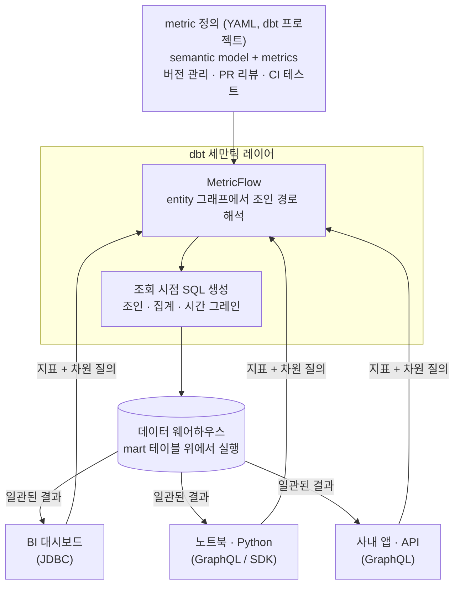

<figure class="post-figure post-figure--header">
<svg role="img" aria-label="세만틱 레이어를 한 장으로 정리한 그림. 왼쪽에는 대시보드 A·B·노트북 C가 저마다 다른 SQL로 '매출'을 계산해 128, 96, 103이라는 서로 다른 숫자를 내는 흩어진 정의들이 있고, 이들이 가운데의 단일 metric 정의(metric: revenue — YAML, PR 리뷰, CI)로 수렴한다. 그 정의에서 MetricFlow가 조회 시점에 SQL을 생성해, 오른쪽의 BI 대시보드(JDBC)·노트북·Python(GraphQL)·사내 앱·API(GraphQL) 세 소비자가 모두 같은 숫자 103을 받는다." viewBox="0 0 680 316" xmlns="http://www.w3.org/2000/svg">
  <title>세만틱 레이어 — 흩어진 매출 정의가 하나의 metric 정의로 수렴하고, 일관된 SQL이 여러 소비자로 뻗어나간다</title>
  <defs>
    <marker id="dsl-arrow" viewBox="0 0 10 10" refX="8" refY="5" markerWidth="6" markerHeight="6" orient="auto-start-reverse">
      <path d="M0,0 L10,5 L0,10 z" fill="var(--secondary-color)"/>
    </marker>
    <marker id="dsl-arrow-gold" viewBox="0 0 10 10" refX="8" refY="5" markerWidth="6" markerHeight="6" orient="auto-start-reverse">
      <path d="M0,0 L10,5 L0,10 z" fill="var(--gold)"/>
    </marker>
  </defs>

  <!-- ===== title ===== -->
  <text x="340" y="24" text-anchor="middle" font-size="17" font-weight="800" fill="currentColor" letter-spacing="1.5">SEMANTIC LAYER</text>

  <!-- ===== section labels ===== -->
  <g font-size="10" font-weight="700" fill="currentColor" opacity="0.72" text-anchor="middle">
    <text x="99" y="52">흩어진 정의 — 같은 이름, 다른 숫자</text>
    <text x="341" y="52">단일 진실 공급원</text>
    <text x="586" y="52">여러 소비자 — 같은 숫자</text>
  </g>

  <!-- ===== left: fragmented definitions ===== -->
  <g>
    <rect x="24" y="66" width="150" height="56" rx="4" fill="var(--bg-light)" stroke="currentColor" stroke-width="2"/>
    <rect x="24" y="142" width="150" height="56" rx="4" fill="var(--bg-light)" stroke="currentColor" stroke-width="2"/>
    <rect x="24" y="218" width="150" height="56" rx="4" fill="var(--bg-light)" stroke="currentColor" stroke-width="2"/>
  </g>
  <g text-anchor="middle">
    <text x="99" y="82" font-size="10" font-weight="700" fill="currentColor">대시보드 A (마케팅)</text>
    <text x="99" y="97" font-size="8.5" fill="currentColor" opacity="0.75">SUM(total)</text>
    <text x="99" y="113" font-size="9.5" font-weight="800" fill="var(--accent-color)">revenue = 128</text>

    <text x="99" y="158" font-size="10" font-weight="700" fill="currentColor">대시보드 B (재무)</text>
    <text x="99" y="173" font-size="8.5" fill="currentColor" opacity="0.75">SUM(total − refund − tax)</text>
    <text x="99" y="189" font-size="9.5" font-weight="800" fill="var(--accent-color)">revenue = 96</text>

    <text x="99" y="234" font-size="10" font-weight="700" fill="currentColor">노트북 C (분석가)</text>
    <text x="99" y="249" font-size="8.5" fill="currentColor" opacity="0.75">SUM(total − refund)</text>
    <text x="99" y="265" font-size="9.5" font-weight="800" fill="var(--accent-color)">revenue = 103</text>
  </g>
  <!-- mismatch marks -->
  <g font-size="13" font-weight="800" fill="var(--accent-color)" text-anchor="middle">
    <text x="99" y="137">≠</text>
    <text x="99" y="213">≠</text>
  </g>

  <!-- convergence arrows -->
  <g stroke="var(--secondary-color)" stroke-width="2" fill="none">
    <line x1="178" y1="94" x2="252" y2="150" marker-end="url(#dsl-arrow)"/>
    <line x1="178" y1="170" x2="252" y2="170" marker-end="url(#dsl-arrow)"/>
    <line x1="178" y1="246" x2="252" y2="190" marker-end="url(#dsl-arrow)"/>
  </g>

  <!-- ===== center: single metric definition ===== -->
  <rect x="256" y="104" width="170" height="132" rx="6" fill="var(--bg-panel)" stroke="var(--gold)" stroke-width="2.5"/>
  <text x="341" y="128" text-anchor="middle" font-size="12" font-weight="800" fill="currentColor">metric: revenue</text>
  <line x1="272" y1="137" x2="410" y2="137" stroke="var(--gold)" stroke-width="1.2" opacity="0.55"/>
  <g font-size="9" fill="currentColor" text-anchor="start">
    <text x="276" y="154">type: simple</text>
    <text x="276" y="169">measure: order_total</text>
    <text x="276" y="184">label: "매출"</text>
  </g>
  <line x1="272" y1="196" x2="410" y2="196" stroke="currentColor" stroke-width="1" opacity="0.25"/>
  <text x="341" y="215" text-anchor="middle" font-size="8.5" font-weight="700" fill="var(--gold)">YAML · PR 리뷰 · CI</text>

  <!-- MetricFlow label -->
  <text x="341" y="262" text-anchor="middle" font-size="10.5" font-weight="800" fill="currentColor">MetricFlow</text>
  <text x="341" y="277" text-anchor="middle" font-size="8.5" fill="currentColor" opacity="0.72">조회 시점 SQL 생성 — 조인 · 집계 · 시간 그레인</text>

  <!-- fan-out arrows -->
  <g stroke="var(--gold)" stroke-width="2" fill="none">
    <line x1="430" y1="150" x2="504" y2="98" marker-end="url(#dsl-arrow-gold)"/>
    <line x1="430" y1="170" x2="504" y2="178" marker-end="url(#dsl-arrow-gold)"/>
    <line x1="430" y1="190" x2="504" y2="258" marker-end="url(#dsl-arrow-gold)"/>
  </g>

  <!-- ===== right: consumers ===== -->
  <g>
    <rect x="508" y="72" width="148" height="52" rx="4" fill="var(--bg-light)" stroke="var(--gold)" stroke-width="2"/>
    <rect x="508" y="152" width="148" height="52" rx="4" fill="var(--bg-light)" stroke="var(--gold)" stroke-width="2"/>
    <rect x="508" y="232" width="148" height="52" rx="4" fill="var(--bg-light)" stroke="var(--gold)" stroke-width="2"/>
  </g>
  <g text-anchor="middle">
    <text x="582" y="89" font-size="10" font-weight="700" fill="currentColor">BI 대시보드 <tspan font-size="8" opacity="0.7">(JDBC)</tspan></text>
    <text x="582" y="107" font-size="9.5" font-weight="800" fill="currentColor">매출 = 103</text>

    <text x="582" y="169" font-size="10" font-weight="700" fill="currentColor">노트북 · Python <tspan font-size="8" opacity="0.7">(GraphQL)</tspan></text>
    <text x="582" y="187" font-size="9.5" font-weight="800" fill="currentColor">매출 = 103</text>

    <text x="582" y="249" font-size="10" font-weight="700" fill="currentColor">사내 앱 · API <tspan font-size="8" opacity="0.7">(GraphQL)</tspan></text>
    <text x="582" y="267" font-size="9.5" font-weight="800" fill="currentColor">매출 = 103</text>
  </g>
  <!-- consistency marks -->
  <g font-size="13" font-weight="800" fill="var(--gold)" text-anchor="middle">
    <text x="582" y="143">=</text>
    <text x="582" y="223">=</text>
  </g>
</svg>
<figcaption>대시보드마다 제각각이던 "매출" 정의가 하나의 metric 정의(단일 진실 공급원)로 수렴하고, MetricFlow가 조회 시점에 생성한 일관된 SQL이 BI·노트북·API 모든 소비자에게 같은 숫자를 돌려준다</figcaption>
</figure>

## 들어가며

지금까지 다섯 단계에 걸쳐 우리는 dbt로 **신뢰할 수 있는 변환 그래프를 세우는 법**을 익혔습니다. 모델·ref·소스로 DAG를 그리고, 테스트·문서화로 신뢰를 얹고, 매크로·Jinja로 반복을 없애고, incremental·snapshot으로 규모와 이력을 감당했으며, 5단계 [dbt 패키지 · CI](/2026/07/14/dbt-packages-ci.html)에서는 패키지와 Slim CI로 팀 규모의 안전한 배포까지 세웠습니다. 이제 웨어하우스에는 테스트를 통과하고 리뷰를 거친 mart 테이블들이 놓여 있습니다.

그런데 여기서 끝이 아닙니다. mart가 아무리 깨끗해도, 그 위에서 **"매출"을 계산하는 SQL은 여전히 대시보드마다 제각각**일 수 있습니다. 경영 회의에서 두 팀이 서로 다른 "이번 달 매출"을 들고 오는 사고는 mart의 품질 문제가 아니라 **지표 정의가 소비자마다 흩어져 있다는 구조의 문제**입니다. 이 글은 `dbt-Essential` 시리즈의 **마지막 6단계(심화)**로([dbt Essential Curriculum](/2026/07/12/dbt-essential-curriculum.html)), dbt **세만틱 레이어(Semantic Layer)**와 **MetricFlow**로 지표 정의를 코드로 한 번만 내리고 모든 소비자가 그 정의를 공유하게 만드는 — dbt를 변환 도구에서 **조직의 지표 단일 진실 공급원**으로 끌어올리는 — 여정으로 시리즈를 완주합니다.

<div class="post-summary-box" markdown="1">

### 📌 이 글에서 다루는 내용

- **세만틱 레이어의 문제의식**: 같은 이름·다른 SQL의 지표 파편화, 차원 조합마다 늘어나는 mart 테이블 폭발, "단일 정의 → 다중 소비"의 가치와 조회 시점 SQL 생성이라는 해법
- **MetricFlow**: semantic model 위에 선언하는 entity·dimension·measure, metric 4유형(simple·ratio·derived·cumulative), 지표+차원 질의에서 조인·집계 SQL을 생성하는 원리, `mf query`로 검증하는 흐름
- **지표 표준화**: JDBC·GraphQL API로 BI·노트북이 같은 정의를 소비, saved query와 export, 지표 변경도 PR·리뷰·테스트를 거치는 거버넌스, "어디까지 mart로 굽고 어디부터 세만틱 레이어에 맡길까"의 실무 판단 기준

</div>

## 한눈에 보기 — 하나의 정의, 여러 소비자

세만틱 레이어의 핵심 아이디어는 한 문장입니다 — **지표 정의는 코드로 한 번만, SQL은 조회 시점에 생성한다.** 지표(무엇을 어떻게 집계하나)와 차원(무엇으로 쪼개나)의 정의를 dbt 프로젝트의 YAML로 내려 두면, MetricFlow가 "이 지표를 이 차원으로"라는 질의를 받을 때마다 조인과 집계가 올바른 SQL을 만들어 웨어하우스에 실행합니다. BI 대시보드도, 노트북도, 사내 앱도 각자 SQL을 다시 쓰는 대신 **같은 정의에 질의**합니다.



이 그림이 이 글의 뼈대입니다. 먼저 **왜** 이 구조가 필요한지(지표 파편화), 다음으로 **어떻게** 정의하고 SQL이 생성되는지(MetricFlow), 마지막으로 이 정의를 **누가 어떻게 소비하고 지키는지**(지표 표준화·거버넌스)를 다룹니다.

## 세만틱 레이어의 문제의식 — 같은 이름, 다른 SQL

### "매출"이 세 개인 회사

지표 파편화는 추상적인 위험이 아니라 어느 조직에나 있는 현실입니다. 같은 `fct_orders` mart를 보고도, 소비자마다 "매출"을 이렇게 씁니다.

```sql
-- 대시보드 A (마케팅): 환불을 빼지 않은 총주문액
SELECT date_trunc('month', ordered_at) AS month,
       SUM(order_total) AS revenue
FROM analytics.fct_orders
GROUP BY 1;

-- 대시보드 B (재무): 환불 제외, 부가세 제외
SELECT date_trunc('month', ordered_at) AS month,
       SUM(order_total - refund_amount - tax_amount) AS revenue
FROM analytics.fct_orders
WHERE status != 'cancelled'
GROUP BY 1;

-- 노트북 C (데이터 분석가): 테스트 주문까지 제외
SELECT date_trunc('month', ordered_at) AS month,
       SUM(order_total - refund_amount) AS revenue
FROM analytics.fct_orders
WHERE status != 'cancelled' AND is_test_order = false
GROUP BY 1;
```

세 쿼리는 모두 "매출(revenue)"이라는 이름을 달고 있지만 **서로 다른 숫자**를 냅니다. 어느 것도 틀렸다고 말하기 어렵고 — 각자의 맥락에서는 합리적인 선택입니다 — 바로 그래서 위험합니다. 회의실에서 숫자가 어긋난 뒤에야 발견되고, "어느 쿼리가 진짜인가"를 사람이 고고학처럼 파헤쳐야 합니다. 1~2단계에서 세운 테스트·문서화는 **테이블의 품질**을 보증하지만, 테이블 **위에서 벌어지는 집계의 일관성**까지는 보증하지 못합니다.

### mart 테이블 폭발 — 조합마다 테이블을 굽는 방식의 한계

파편화를 막는 고전적 처방은 "집계까지 mart로 구워서 내려 주자"였습니다. 그런데 이 방식은 **지표 × 차원의 조합 수**만큼 테이블을 요구합니다.

```text
revenue_by_day
revenue_by_region
revenue_by_region_month
revenue_by_region_channel_month
active_users_by_day
active_users_by_region_week
...
```

지표가 M개, 차원이 D개면 잠재 조합은 M × 2^D — 요청이 올 때마다 `_by_` 테이블이 하나씩 늘고, 각 테이블은 저마다의 WHERE 절과 미묘하게 다른 집계 로직을 품은 채 관리 밖으로 밀려납니다. 결국 "집계 로직의 중복"이라는 원래 문제가 **테이블의 형태로 물질화**되었을 뿐입니다. 3단계에서 매크로가 SQL 소스 코드의 중복을 걷어냈다면, 이번에 걷어내야 할 것은 **집계 정의의 중복**입니다.

### 해법 — 정의는 한 번, SQL은 조회 시점에

세만틱 레이어는 발상을 뒤집습니다. 집계 결과를 미리 구워 두는 대신, **"무엇을 어떻게 집계하는가"라는 정의만 코드로 내려 두고, 실제 SQL은 질의가 도착한 시점에 생성**합니다.

- **정의는 dbt 프로젝트 안의 YAML**입니다 — 모델·테스트와 같은 저장소에서 버전 관리되고, PR 리뷰와 CI를 거칩니다.
- **소비자는 SQL이 아니라 의도를 보냅니다** — "revenue를 region과 month로". 조인·집계·필터가 올바른 SQL을 쓰는 일은 MetricFlow의 몫입니다.
- **단일 정의 → 다중 소비** — BI, 노트북, 사내 앱이 같은 정의에 질의하므로, 어디서 보든 "매출"은 하나의 숫자입니다. 정의가 바뀌면 모든 소비자가 동시에 새 정의를 따릅니다.

중요한 것은 세만틱 레이어가 **미리 계산된 숫자의 저장소가 아니라 SQL 컴파일러**라는 감각입니다. 3단계에서 Jinja가 "SQL을 생성하는 SQL"이었다면, MetricFlow는 한 층 위에서 "지표 정의로부터 SQL을 생성하는 엔진"입니다.

## MetricFlow — 정의에서 SQL이 나오는 원리

### semantic model — 모델 위에 선언하는 의미 계층

**MetricFlow**는 dbt 세만틱 레이어의 쿼리 생성 엔진입니다. 그 출발점은 **semantic model** — 기존 dbt 모델(주로 mart) 위에 "이 테이블이 의미상 무엇인가"를 선언하는 계층입니다. semantic model은 세 가지 요소로 구성됩니다.

- **entity**: 이 테이블의 식별자이자 **조인 키**. `primary`(이 테이블의 그레인을 정의) / `foreign`(다른 semantic model로 건너가는 다리)
- **dimension**: 지표를 **쪼개는 축**. `time`(시간 — 그레인 지원) / `categorical`(범주)
- **measure**: **집계의 원료**. 어떤 컬럼을 어떤 함수(`sum`·`count_distinct`·`avg` …)로 집계하는가

```yaml
# models/marts/orders.yml
semantic_models:
  - name: orders
    description: "주문 1건 = 1행. 매출 계열 지표의 원천."
    model: ref('fct_orders')
    defaults:
      agg_time_dimension: ordered_at

    entities:
      - name: order                    # primary: 이 테이블의 그레인
        type: primary
        expr: order_id
      - name: customer                 # foreign: customers로 건너가는 조인 키
        type: foreign
        expr: customer_id

    dimensions:
      - name: ordered_at
        type: time
        type_params:
          time_granularity: day
      - name: is_food_order
        type: categorical

    measures:
      - name: order_total              # 집계의 원료
        agg: sum
      - name: order_count
        agg: count
        expr: 1
      - name: refund_amount
        agg: sum
```

고객 차원을 다른 semantic model로 분리해 두면, MetricFlow가 필요할 때 알아서 조인합니다.

```yaml
# models/marts/customers.yml
semantic_models:
  - name: customers
    model: ref('dim_customers')
    entities:
      - name: customer                 # orders의 foreign entity와 이름이 만난다
        type: primary
        expr: customer_id
    dimensions:
      - name: region
        type: categorical
      - name: signup_channel
        type: categorical
```

여기서 눈여겨볼 것은 **조인을 어디에도 쓰지 않았다는 점**입니다. `orders`의 foreign entity `customer`와 `customers`의 primary entity `customer`가 이름으로 만나는 순간, MetricFlow는 두 semantic model 사이의 조인 경로를 **entity 그래프**로 이해합니다. 1단계에서 `ref()`가 모델 간 의존성 그래프를 세웠듯, 여기서는 **entity가 semantic model 간 조인 그래프**를 세웁니다.

### metric — 4가지 유형

measure가 집계의 원료라면, **metric**은 소비자에게 노출되는 **지표의 공식 정의**입니다. 네 유형이 있습니다.

```yaml
# models/marts/metrics.yml
metrics:
  # 1) simple — measure 하나를 그대로 지표로
  - name: revenue
    label: "매출"
    description: "환불 차감 전 총주문액. 재무 매출은 net_revenue를 사용할 것."
    type: simple
    type_params:
      measure: order_total

  - name: order_count
    label: "주문 수"
    type: simple
    type_params:
      measure: order_count

  # 2) ratio — 분자/분모 지표의 비율 (조회 차원이 분자·분모에 일관 적용)
  - name: average_order_value
    label: "평균 주문 금액 (AOV)"
    type: ratio
    type_params:
      numerator: revenue
      denominator: order_count

  # 3) derived — 다른 지표들의 수식 조합
  - name: net_revenue
    label: "순매출"
    type: derived
    type_params:
      expr: revenue - refunds
      metrics:
        - name: revenue
        - name: refunds

  # 4) cumulative — 시간 창을 누적하는 지표
  - name: revenue_7d
    label: "최근 7일 매출"
    type: cumulative
    type_params:
      measure: order_total
      window: 7 days
```

지표에 **필터를 조건으로 못 박을 수도** 있습니다. "음식 주문 매출"처럼 정의 자체에 조건이 들어가는 지표는, 소비자가 WHERE 절을 기억하는 대신 정의가 조건을 품게 만듭니다.


```yaml
metrics:
  - name: food_revenue
    label: "음식 주문 매출"
    type: simple
    type_params:
      measure: order_total
    filter: |
      {{ Dimension('order__is_food_order') }} = true
```


`ratio`와 `derived`의 진가는 **차원이 자동으로 일관 적용**된다는 데 있습니다. AOV를 region별로 조회하면 분자(revenue)와 분모(order_count)가 **같은 region 분해**로 계산됩니다 — 분자와 분모를 서로 다른 쿼리에서 따로 구해 붙이다 생기는 고전적 실수가 구조적으로 사라집니다.

### SQL 생성의 원리 — 질의에서 조인·집계가 나오기까지

<figure class="post-figure">
<svg role="img" aria-label="MetricFlow의 SQL 생성 4단계 개념도. 1단계 '질의'에는 metrics: revenue와 group_by: metric_time__month, customer__region이 들어오고, 2단계 '조인 경로 해석'에서는 measure가 사는 orders semantic model과 region 차원이 사는 customers semantic model을 entity 그래프에서 customer 엔티티로 잇는 조인 경로를 찾아 LEFT JOIN을 결정한다. 3단계 '그레인·집계 배치'에서 date_trunc('month', ordered_at)와 SUM(order_total), GROUP BY를 배치하고, 4단계 '실행'에서 완성된 SQL이 데이터 웨어하우스로 나간다." viewBox="0 0 680 226" xmlns="http://www.w3.org/2000/svg">
  <title>MetricFlow의 SQL 생성 4단계 — 질의 → 조인 경로 해석 → 그레인·집계 배치 → 웨어하우스 실행</title>
  <defs>
    <marker id="mfq-arrow" viewBox="0 0 10 10" refX="8" refY="5" markerWidth="6" markerHeight="6" orient="auto-start-reverse">
      <path d="M0,0 L10,5 L0,10 z" fill="var(--secondary-color)"/>
    </marker>
  </defs>

  <text x="340" y="24" text-anchor="middle" font-size="14" font-weight="800" fill="currentColor">질의에서 SQL이 나오기까지</text>

  <!-- ===== step 1: query ===== -->
  <rect x="14" y="58" width="150" height="126" rx="6" fill="var(--bg-light)" stroke="var(--secondary-color)" stroke-width="2"/>
  <circle cx="30" cy="58" r="11" fill="var(--bg-panel)" stroke="var(--secondary-color)" stroke-width="2"/>
  <text x="30" y="62" text-anchor="middle" font-size="10" font-weight="800" fill="currentColor">1</text>
  <text x="96" y="80" text-anchor="middle" font-size="11" font-weight="800" fill="var(--secondary-color)">질의</text>
  <g font-size="8.5" fill="currentColor" text-anchor="start">
    <text x="28" y="102">metrics:</text>
    <text x="36" y="116">revenue</text>
    <text x="28" y="136">group_by:</text>
    <text x="36" y="150">metric_time__month</text>
    <text x="36" y="164">customer__region</text>
  </g>

  <!-- ===== step 2: join path ===== -->
  <rect x="192" y="58" width="170" height="126" rx="6" fill="var(--bg-light)" stroke="var(--secondary-color)" stroke-width="2"/>
  <circle cx="208" cy="58" r="11" fill="var(--bg-panel)" stroke="var(--secondary-color)" stroke-width="2"/>
  <text x="208" y="62" text-anchor="middle" font-size="10" font-weight="800" fill="currentColor">2</text>
  <text x="277" y="80" text-anchor="middle" font-size="11" font-weight="800" fill="var(--secondary-color)">조인 경로 해석</text>
  <!-- mini entity graph: orders — (customer) — customers -->
  <rect x="202" y="102" width="62" height="26" rx="4" fill="var(--bg-panel)" stroke="currentColor" stroke-width="1.6"/>
  <text x="233" y="119" text-anchor="middle" font-size="8.5" font-weight="700" fill="currentColor">orders</text>
  <rect x="290" y="102" width="62" height="26" rx="4" fill="var(--bg-panel)" stroke="currentColor" stroke-width="1.6"/>
  <text x="321" y="119" text-anchor="middle" font-size="8.5" font-weight="700" fill="currentColor">customers</text>
  <line x1="264" y1="115" x2="290" y2="115" stroke="var(--gold)" stroke-width="2"/>
  <polygon points="277,108 284,115 277,122 270,115" fill="var(--bg-light)" stroke="var(--gold)" stroke-width="1.6"/>
  <text x="277" y="142" text-anchor="middle" font-size="8" fill="currentColor" opacity="0.75">entity: customer</text>
  <text x="277" y="164" text-anchor="middle" font-size="8.5" font-weight="700" fill="currentColor">entity 그래프 → LEFT JOIN 결정</text>

  <!-- ===== step 3: grain + aggregation ===== -->
  <rect x="390" y="58" width="150" height="126" rx="6" fill="var(--bg-light)" stroke="var(--secondary-color)" stroke-width="2"/>
  <circle cx="406" cy="58" r="11" fill="var(--bg-panel)" stroke="var(--secondary-color)" stroke-width="2"/>
  <text x="406" y="62" text-anchor="middle" font-size="10" font-weight="800" fill="currentColor">3</text>
  <text x="465" y="80" text-anchor="middle" font-size="11" font-weight="800" fill="var(--secondary-color)">그레인 · 집계 배치</text>
  <g font-size="8.5" fill="currentColor" text-anchor="start">
    <text x="404" y="106">date_trunc('month',</text>
    <text x="412" y="120">ordered_at)</text>
    <text x="404" y="142">SUM(order_total)</text>
    <text x="404" y="164">GROUP BY 1, 2</text>
  </g>

  <!-- ===== step 4: warehouse ===== -->
  <rect x="568" y="58" width="98" height="126" rx="6" fill="var(--bg-light)" stroke="var(--gold)" stroke-width="2"/>
  <circle cx="584" cy="58" r="11" fill="var(--bg-panel)" stroke="var(--gold)" stroke-width="2"/>
  <text x="584" y="62" text-anchor="middle" font-size="10" font-weight="800" fill="currentColor">4</text>
  <text x="617" y="80" text-anchor="middle" font-size="11" font-weight="800" fill="var(--gold)">실행</text>
  <!-- warehouse cylinder -->
  <path d="M589,104 a28,8 0 0 0 56,0 v42 a28,8 0 0 1 -56,0 z" fill="var(--bg-panel)" stroke="currentColor" stroke-width="1.8"/>
  <ellipse cx="617" cy="104" rx="28" ry="8" fill="var(--bg-panel)" stroke="currentColor" stroke-width="1.8"/>
  <text x="617" y="172" text-anchor="middle" font-size="8.5" font-weight="700" fill="currentColor">웨어하우스</text>

  <!-- ===== flow arrows ===== -->
  <g stroke="var(--secondary-color)" stroke-width="2" fill="none">
    <line x1="166" y1="121" x2="188" y2="121" marker-end="url(#mfq-arrow)"/>
    <line x1="364" y1="121" x2="386" y2="121" marker-end="url(#mfq-arrow)"/>
    <line x1="542" y1="121" x2="564" y2="121" marker-end="url(#mfq-arrow)"/>
  </g>
  <text x="553" y="112" text-anchor="middle" font-size="8" font-weight="700" fill="currentColor" opacity="0.75">SQL</text>

  <!-- ===== footer captions ===== -->
  <g font-size="8.5" fill="currentColor" opacity="0.72" text-anchor="middle">
    <text x="96" y="206">소비자는 의도만 보낸다</text>
    <text x="277" y="206">measure와 dimension이 사는 모델을 잇는다</text>
    <text x="465" y="206">시간 차원 truncate + 집계 함수</text>
    <text x="617" y="206">완성된 SQL 실행</text>
  </g>
</svg>
<figcaption>MetricFlow의 SQL 생성 4단계 — 질의가 들어오면 entity 그래프에서 조인 경로를 해석하고, 시간 그레인과 집계를 배치해 완성된 SQL을 웨어하우스에 실행한다</figcaption>
</figure>

이제 소비자가 이렇게 질의한다고 합시다 — "**revenue를 월별 × 고객 region별로**". MetricFlow가 SQL을 만드는 과정은 대략 네 단계입니다.

1. **지표 해석**: `revenue` → simple metric → measure `order_total`(SUM) → measure가 사는 semantic model은 `orders`
2. **조인 경로 해석**: `customer__region` 차원은 `customers`에 산다 → entity 그래프에서 `orders.customer(foreign)` ↔ `customers.customer(primary)` 경로 발견 → LEFT JOIN 결정
3. **시간 그레인 처리**: `metric_time__month` → `orders`의 기본 시간 차원 `ordered_at`을 month로 truncate
4. **집계 배치**: 그룹 기준(month, region)으로 SUM을 배치해 최종 SQL 생성

`mf query` CLI로 이 흐름 전체를 로컬에서 검증할 수 있습니다.

```bash
# 정의 정합성 검사 (CI에도 건다)
mf validate-configs

# 정의된 지표 목록 확인
mf list metrics

# 지표 + 차원 질의 — 조인·집계는 MetricFlow의 몫
mf query \
  --metrics revenue \
  --group-by metric_time__month,customer__region \
  --order metric_time__month

# 생성될 SQL을 눈으로 확인
mf query --metrics revenue --group-by metric_time__month,customer__region --explain
```

`--explain`이 보여 주는 생성 SQL은 대략 이런 모양입니다(웨어하우스별로 문법은 다릅니다).

```sql
-- MetricFlow가 생성한 SQL (개념적 형태)
SELECT
  date_trunc('month', o.ordered_at) AS metric_time__month,
  c.region                          AS customer__region,
  SUM(o.order_total)                AS revenue
FROM analytics.fct_orders o
LEFT JOIN analytics.dim_customers c
  ON o.customer_id = c.customer_id        -- entity 그래프가 해석한 조인
GROUP BY 1, 2;
```

소비자는 이 SQL을 한 줄도 쓰지 않았습니다. 조인 키를 잘못 짚을 일도, 환불 차감을 빼먹을 일도 없습니다 — **정의가 옳으면 모든 질의가 옳습니다.** 그리고 정의가 틀렸다면, 고칠 곳도 한 곳뿐입니다.

## 지표 표준화 — 정의를 조직의 자산으로

### 소비 — BI·노트북·앱이 같은 정의를 쓴다

정의를 세웠으니 이제 소비자를 연결할 차례입니다. dbt 세만틱 레이어는 두 가지 API를 노출합니다.

- **JDBC API** (Arrow Flight SQL 기반): BI 도구가 표준 JDBC 드라이버로 접속해, 테이블 대신 **지표에** 질의합니다. Tableau·Hex·Mode 등이 이 경로로 통합됩니다.
- **GraphQL API**: 노트북·사내 앱·커스텀 서비스가 HTTP로 질의합니다. Python SDK도 이 위에 얹혀 있습니다.

JDBC로 들어온 질의는 SQL처럼 생겼지만, FROM 절이 테이블이 아니라 **세만틱 레이어 질의 함수**라는 점이 다릅니다.


```sql
-- BI 도구가 JDBC로 보내는 질의 — 테이블이 아니라 '정의'에 묻는다
select * from {{
  semantic_layer.query(
    metrics=['revenue', 'average_order_value'],
    group_by=[Dimension('metric_time').grain('month'),
              Dimension('customer__region')]
  )
}}
```


자주 쓰는 질의 조합은 **saved query**로 이름 붙여 저장하고, 필요하면 **export**로 웨어하우스에 테이블·뷰로 구체화할 수도 있습니다 — "정의는 세만틱 레이어에, 자주 쓰는 결과는 테이블로"를 한 선언에서 관리하는 장치입니다.

```yaml
saved_queries:
  - name: weekly_kpi
    description: "주간 경영 리뷰용 표준 KPI 묶음"
    query_params:
      metrics:
        - revenue
        - average_order_value
      group_by:
        - TimeDimension('metric_time', 'week')
        - Dimension('customer__region')
    exports:
      - name: weekly_kpi_table          # dbt build 시 테이블로 구체화
        config:
          export_as: table
```

### 거버넌스 — 지표도 PR·리뷰·테스트를 거치는 소프트웨어 자산

세만틱 레이어의 조용한 승리는 기술이 아니라 **프로세스**에 있습니다. 지표 정의가 dbt 프로젝트의 YAML이 된 순간, 지표는 5단계에서 세운 소프트웨어 규율의 궤도에 그대로 올라탑니다.

- **변경은 PR로**: "매출에서 부가세를 빼자"는 결정이 슬랙 스레드가 아니라 diff로 남습니다. 리뷰어가 승인하고, Git 이력이 "언제, 누가, 왜 바꿨는가"에 답합니다.
- **CI가 정합성을 지킵니다**: `mf validate-configs`를 CI에 걸어 깨진 참조·조인 불능 차원을 병합 전에 잡고, Slim CI의 state 비교는 지표가 딛고 선 모델의 변경까지 함께 검증합니다.
- **정의가 곧 문서입니다**: metric의 `label`·`description`이 데이터 카탈로그에 노출되어, "이 지표가 정확히 무엇인가"를 묻는 채널 질문이 정의 문서로 대체됩니다.

2단계에서 테스트·문서가 **테이블**을 신뢰할 수 있는 자산으로 만들었다면, 세만틱 레이어는 같은 규율로 **지표**를 신뢰할 수 있는 자산으로 만듭니다.

### 어디까지 mart로 굽고, 어디부터 세만틱 레이어에 맡길까

<figure class="post-figure">
<svg role="img" aria-label="mart와 세만틱 레이어의 책임 경계를 그린 개념도. 왼쪽 mart 영역에는 행이 쌓인 테이블 아이콘과 함께 '행 수준 비즈니스 로직 — 환불 차감·상태 정제·테스트 주문 제거, 무겁고 반복되는 변환은 incremental로'가 놓이고, 오른쪽 세만틱 레이어 영역에는 여러 행이 하나의 집계 행으로 접히는 아이콘과 함께 '집계·차원 조합·지표 공식 — SUM·COUNT·group by 축·ratio·derived, 시간 그레인·누적 창'이 놓인다. 두 영역 사이 점선 경계를 가로질러 mart가 원료 테이블을 세만틱 레이어에 공급하고, 아래에는 '행을 만드는 일은 mart, 행을 접는 일은 세만틱 레이어'라는 원칙이 적혀 있다." viewBox="0 0 680 262" xmlns="http://www.w3.org/2000/svg">
  <title>책임 경계 — 행을 만드는 일은 mart, 행을 접는 일은 세만틱 레이어</title>
  <defs>
    <marker id="bnd-arrow" viewBox="0 0 10 10" refX="8" refY="5" markerWidth="6" markerHeight="6" orient="auto-start-reverse">
      <path d="M0,0 L10,5 L0,10 z" fill="var(--secondary-color)"/>
    </marker>
    <marker id="bnd-arrow-gold" viewBox="0 0 10 10" refX="8" refY="5" markerWidth="6" markerHeight="6" orient="auto-start-reverse">
      <path d="M0,0 L10,5 L0,10 z" fill="var(--gold)"/>
    </marker>
  </defs>

  <text x="340" y="24" text-anchor="middle" font-size="14" font-weight="800" fill="currentColor">책임의 경계</text>

  <!-- ===== boundary ===== -->
  <line x1="340" y1="44" x2="340" y2="216" stroke="currentColor" stroke-width="1.6" stroke-dasharray="5 5" opacity="0.4"/>

  <!-- ===== left: mart ===== -->
  <rect x="20" y="48" width="296" height="168" rx="6" fill="var(--bg-light)" stroke="var(--secondary-color)" stroke-width="2.5"/>
  <text x="168" y="74" text-anchor="middle" font-size="12.5" font-weight="800" fill="var(--secondary-color)">mart — 행을 만든다</text>
  <!-- table icon: rows being built -->
  <g>
    <rect x="126" y="90" width="84" height="52" rx="3" fill="var(--bg-panel)" stroke="currentColor" stroke-width="1.8"/>
    <line x1="126" y1="104" x2="210" y2="104" stroke="currentColor" stroke-width="1.8"/>
    <g stroke="currentColor" stroke-width="1.1" opacity="0.5">
      <line x1="126" y1="117" x2="210" y2="117"/>
      <line x1="126" y1="130" x2="210" y2="130"/>
      <line x1="168" y1="104" x2="168" y2="142"/>
    </g>
    <!-- new row sliding in -->
    <rect x="126" y="150" width="84" height="11" rx="2" fill="none" stroke="var(--secondary-color)" stroke-width="1.4" stroke-dasharray="3 3"/>
    <text x="222" y="159" text-anchor="start" font-size="8" fill="currentColor" opacity="0.7">+ 행</text>
  </g>
  <g text-anchor="middle">
    <text x="168" y="180" font-size="10.5" font-weight="800" fill="currentColor">행 수준 비즈니스 로직</text>
    <text x="168" y="195" font-size="8.5" fill="currentColor" opacity="0.78">환불 차감 · 상태 정제 · 테스트 주문 제거</text>
    <text x="168" y="208" font-size="8.5" fill="currentColor" opacity="0.78">무겁고 반복되는 변환 — incremental로 증분 처리</text>
  </g>

  <!-- ===== right: semantic layer ===== -->
  <rect x="364" y="48" width="296" height="168" rx="6" fill="var(--bg-light)" stroke="var(--gold)" stroke-width="2.5"/>
  <text x="512" y="74" text-anchor="middle" font-size="12.5" font-weight="800" fill="var(--gold)">세만틱 레이어 — 행을 접는다</text>
  <!-- fold icon: many rows collapse into one aggregated row -->
  <g>
    <g fill="var(--bg-panel)" stroke="currentColor" stroke-width="1.4">
      <rect x="446" y="92" width="42" height="8" rx="2"/>
      <rect x="446" y="105" width="42" height="8" rx="2"/>
      <rect x="446" y="118" width="42" height="8" rx="2"/>
      <rect x="446" y="131" width="42" height="8" rx="2"/>
    </g>
    <line x1="494" y1="115" x2="518" y2="115" stroke="var(--gold)" stroke-width="2" marker-end="url(#bnd-arrow-gold)"/>
    <rect x="524" y="104" width="54" height="22" rx="3" fill="var(--bg-panel)" stroke="var(--gold)" stroke-width="2"/>
    <text x="551" y="119" text-anchor="middle" font-size="10" font-weight="800" fill="var(--gold)">Σ 1행</text>
  </g>
  <g text-anchor="middle">
    <text x="512" y="180" font-size="10.5" font-weight="800" fill="currentColor">집계 · 차원 조합 · 지표 공식</text>
    <text x="512" y="195" font-size="8.5" fill="currentColor" opacity="0.78">SUM · COUNT, group by 축, ratio · derived</text>
    <text x="512" y="208" font-size="8.5" fill="currentColor" opacity="0.78">시간 그레인 · 누적 창 (cumulative)</text>
  </g>

  <!-- mart feeds the semantic layer across the boundary -->
  <line x1="316" y1="126" x2="360" y2="126" stroke="var(--secondary-color)" stroke-width="2" marker-end="url(#bnd-arrow)"/>
  <text x="340" y="116" text-anchor="middle" font-size="8" font-weight="700" fill="currentColor" opacity="0.75">원료 테이블</text>

  <!-- ===== principle ===== -->
  <text x="340" y="246" text-anchor="middle" font-size="11.5" font-weight="800" fill="currentColor">"행을 만드는 일은 mart, 행을 접는 일은 세만틱 레이어"</text>
</svg>
<figcaption>책임의 경계 — 행 수준 로직과 무거운 변환은 mart가 굽고, 집계·차원 조합·지표 공식은 세만틱 레이어가 조회 시점에 접는다</figcaption>
</figure>

세만틱 레이어가 생겼다고 mart가 필요 없어지는 것은 아닙니다. 실무의 판단 기준은 **"행을 만드는 일은 mart, 행을 접는(집계하는) 일은 세만틱 레이어"**입니다.

| 판단 기준 | mart로 굽는다 | 세만틱 레이어에 맡긴다 |
| --- | --- | --- |
| **로직의 성격** | 행 수준 비즈니스 로직 — 환불 차감, 상태 정제, 테스트 주문 제거 | 집계와 차원 조합 — SUM/COUNT, group by의 축 |
| **변환 비용** | 무겁고 반복되는 변환 (incremental로 증분 처리) | 조회 시점 계산이 감당되는 가벼운 집계 |
| **소비 패턴** | 조회 빈도가 매우 높고 지연에 민감한 고정 화면 (또는 export로 구체화) | 차원 조합이 자주 바뀌는 탐색적 분석·셀프서비스 |
| **정의의 성격** | 한 테이블 안에서 완결되는 파생 컬럼 | 여러 지표를 엮는 공식 (ratio·derived), 시간 창(cumulative) |

바꿔 말해 4단계까지 배운 것들(incremental·snapshot·매크로)은 **좋은 원료 테이블을 만드는 기술**이고, 세만틱 레이어는 그 원료 위에서 **집계의 일관성을 보증하는 계층**입니다. `fct_orders`에 `net_order_total` 같은 행 수준 파생 컬럼을 굽는 것은 여전히 mart의 일이지만, 그것을 월별·지역별로 어떻게 접을지는 이제 `_by_` 테이블이 아니라 정의가 담당합니다. 조회 성능이 발목을 잡는 조합만 export(또는 소비층 캐시)로 구체화하면, "유연성은 정의로, 성능은 선택적 구체화로"라는 균형이 잡힙니다.

## 정리

- **파편화는 구조의 문제다**: "매출"이 대시보드마다 다른 것은 사람의 실수가 아니라, 지표 정의가 소비자마다 흩어져 있는 구조의 필연입니다. 조합마다 mart를 굽는 처방은 중복을 테이블의 형태로 물질화할 뿐입니다.
- **정의는 한 번, SQL은 조회 시점에**: 세만틱 레이어는 미리 계산된 숫자의 저장소가 아니라 **SQL 컴파일러**입니다. semantic model(entity·dimension·measure)과 metric(simple·ratio·derived·cumulative)을 YAML로 선언하면, MetricFlow가 entity 그래프에서 조인 경로를 해석해 질의마다 올바른 SQL을 생성합니다.
- **정의가 옳으면 모든 질의가 옳다**: ratio·derived 지표는 차원이 분자·분모에 일관 적용되고, 필터는 정의가 품습니다. `mf validate-configs`와 `mf query --explain`으로 정의와 생성 SQL을 검증합니다.
- **지표도 소프트웨어 자산이다**: JDBC·GraphQL API로 BI·노트북·앱이 같은 정의를 소비하고, 지표 변경은 PR·리뷰·CI를 거쳐 diff와 이력으로 남습니다. 경계 원칙은 하나 — **행을 만드는 일은 mart, 행을 접는 일은 세만틱 레이어.**

그리고 이것으로 `dbt-Essential` 시리즈 **6단계 완주**입니다. 우리는 **모델링 기초**에서 출발했습니다 — `SELECT` 하나가 모델이 되고 `ref()`가 의존성 그래프를 세우는 원리를 그리고(1단계), 테스트·문서화·lineage로 그 그래프에 "이 숫자를 믿어도 되는가"라고 물을 수 있는 신뢰를 얹었습니다(2단계). 그 위에 **재사용과 규모**를 쌓았습니다 — 매크로·Jinja로 수십 모델에 흩어진 반복을 한 곳으로 모으고(3단계), incremental·snapshot으로 대용량의 비용과 변화의 이력을 감당했습니다(4단계). 마지막으로 **협업과 표준화**로 넓혔습니다 — 패키지·Slim CI로 팀 규모의 안전한 배포를 세우고(5단계), 오늘 세만틱 레이어·MetricFlow로 조직의 지표까지 코드의 규율 아래 두었습니다(6단계). "웨어하우스 안의 SQL을 소프트웨어처럼 다룬다"는 dbt의 단순한 발상이, 모델에서 테스트로, 배포에서 지표로 확장되는 전 과정을 완주한 것입니다. 이제 여러분은 dbt 프로젝트의 그래프를 읽고, 신뢰할 수 있는 변환 파이프라인을 설계·운영하며, 팀의 배포와 조직의 지표 표준까지 책임질 수 있는 애널리틱스 엔지니어링의 손을 갖췄습니다. 완주를 축하합니다 — 커리큘럼의 체크박스를 모두 채우러 갑시다.

### 다음 학습 (Next Learning)

- [dbt Essential Curriculum](/2026/07/12/dbt-essential-curriculum.html) — 시리즈 로드맵으로 돌아가 6단계 도장을 모두 채우기
- [데이터 변환·처리(Processing): 배치·스트림 엔진과 SQL 변환](/2026/06/25/data-processing.html) — 이 시리즈가 갈라져 나온 오버뷰 단계, 처리 지도에서 dbt의 위치 복습
- [Airflow Essential Curriculum](/2026/07/12/airflow-essential-curriculum.html) — dbt 실행을 지휘하는 오케스트레이션 자매 시리즈
- [Spark Essential Curriculum](/2026/07/12/spark-essential-curriculum.html) — 처리 스케일을 담당하는 자매 시리즈, "나눠서 처리"와 "웨어하우스 안에서 변환"의 짝
