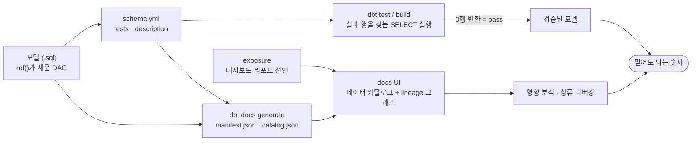

<figure class="post-figure post-figure--header">
<svg role="img" aria-label="테스트·문서화의 흐름을 한 장으로 정리한 그림. 왼쪽은 ref()로 엮인 모델 DAG 위에 테스트 통과를 뜻하는 체크 방패가 얹힌 모습, 가운데는 tests와 description을 선언한 schema.yml 계약서, 오른쪽은 그 메타데이터가 구워져 나온 데이터 카탈로그와 lineage 그래프. 세 갈래가 아래의 금테 배지 '믿어도 되는 숫자'로 수렴한다." viewBox="0 0 680 330" xmlns="http://www.w3.org/2000/svg">
  <title>테스트·문서화 — 검증된 모델과 카탈로그·lineage가 만나 '믿어도 되는 숫자'가 되는 흐름</title>
  <defs>
    <marker id="dbt2h-arrow" viewBox="0 0 10 10" refX="8" refY="5" markerWidth="6" markerHeight="6" orient="auto-start-reverse">
      <path d="M0,0 L10,5 L0,10 z" fill="var(--secondary-color)"/>
    </marker>
  </defs>

  <!-- ===== title ===== -->
  <text x="340" y="24" text-anchor="middle" font-size="17" font-weight="800" fill="currentColor" letter-spacing="1.5">TESTS · DOCS · LINEAGE</text>

  <!-- ===== left: tested DAG ===== -->
  <text x="30" y="50" text-anchor="start" font-size="11" font-weight="700" fill="currentColor" opacity="0.72">dbt test — 모델 위에 방패를 얹는다</text>

  <rect x="30" y="70" width="94" height="28" rx="4" fill="var(--bg-light)" stroke="currentColor" stroke-width="2"/>
  <text x="77" y="88" text-anchor="middle" font-size="9" font-weight="700" fill="currentColor">stg_orders</text>
  <rect x="30" y="128" width="94" height="28" rx="4" fill="var(--bg-light)" stroke="currentColor" stroke-width="2"/>
  <text x="77" y="146" text-anchor="middle" font-size="9" font-weight="700" fill="currentColor">stg_payments</text>
  <rect x="158" y="98" width="96" height="30" rx="4" fill="var(--bg-panel)" stroke="var(--gold)" stroke-width="2.5"/>
  <text x="206" y="117" text-anchor="middle" font-size="9" font-weight="700" fill="currentColor">fct_orders</text>

  <g stroke="var(--secondary-color)" stroke-width="2" fill="none">
    <line x1="124" y1="86" x2="154" y2="108" marker-end="url(#dbt2h-arrow)"/>
    <line x1="124" y1="140" x2="154" y2="120" marker-end="url(#dbt2h-arrow)"/>
  </g>

  <!-- check shields on each node -->
  <g>
    <g transform="translate(112,60)">
      <path d="M9,0 L18,4 V11 Q18,17 9,21 Q0,17 0,11 V4 Z" fill="var(--bg-light)" stroke="var(--secondary-color)" stroke-width="2"/>
      <path d="M4.5,10.5 L8,14 L13.5,7" fill="none" stroke="var(--secondary-color)" stroke-width="2.2" stroke-linecap="round" stroke-linejoin="round"/>
    </g>
    <g transform="translate(112,118)">
      <path d="M9,0 L18,4 V11 Q18,17 9,21 Q0,17 0,11 V4 Z" fill="var(--bg-light)" stroke="var(--secondary-color)" stroke-width="2"/>
      <path d="M4.5,10.5 L8,14 L13.5,7" fill="none" stroke="var(--secondary-color)" stroke-width="2.2" stroke-linecap="round" stroke-linejoin="round"/>
    </g>
    <g transform="translate(242,88)">
      <path d="M9,0 L18,4 V11 Q18,17 9,21 Q0,17 0,11 V4 Z" fill="var(--bg-light)" stroke="var(--secondary-color)" stroke-width="2"/>
      <path d="M4.5,10.5 L8,14 L13.5,7" fill="none" stroke="var(--secondary-color)" stroke-width="2.2" stroke-linecap="round" stroke-linejoin="round"/>
    </g>
  </g>
  <text x="142" y="182" text-anchor="middle" font-size="9" fill="currentColor" opacity="0.72">테스트 통과 = 검증된 모델</text>

  <!-- ===== middle: schema.yml contract ===== -->
  <rect x="298" y="64" width="132" height="122" rx="4" fill="var(--bg-light)" stroke="currentColor" stroke-width="2.5"/>
  <text x="364" y="82" text-anchor="middle" font-size="11" font-weight="700" fill="currentColor">schema.yml</text>
  <line x1="306" y1="90" x2="422" y2="90" stroke="currentColor" stroke-width="1.2" opacity="0.3"/>
  <g font-size="8.5" fill="currentColor" opacity="0.85" text-anchor="start">
    <text x="310" y="106">tests:</text>
    <text x="310" y="119">&#160;&#160;- unique</text>
    <text x="310" y="132">&#160;&#160;- not_null</text>
    <text x="310" y="150">description:</text>
    <text x="310" y="163">&#160;&#160;"주문 팩트"</text>
  </g>
  <text x="364" y="200" text-anchor="middle" font-size="9" fill="currentColor" opacity="0.72">모델 옆의 계약서</text>

  <!-- yaml -> tests (left) -->
  <line x1="294" y1="112" x2="262" y2="112" stroke="var(--secondary-color)" stroke-width="2" marker-end="url(#dbt2h-arrow)"/>
  <text x="278" y="104" text-anchor="middle" font-size="8" font-weight="700" fill="currentColor" opacity="0.75">dbt test</text>

  <!-- yaml -> docs (right) -->
  <g stroke="var(--secondary-color)" stroke-width="2" fill="none">
    <line x1="434" y1="100" x2="472" y2="84" marker-end="url(#dbt2h-arrow)"/>
    <line x1="434" y1="150" x2="472" y2="170" marker-end="url(#dbt2h-arrow)"/>
  </g>
  <text x="452" y="130" text-anchor="middle" font-size="8" font-weight="700" fill="currentColor" opacity="0.75">docs generate</text>

  <!-- ===== right: catalog + lineage ===== -->
  <rect x="480" y="56" width="168" height="74" rx="4" fill="var(--bg-light)" stroke="currentColor" stroke-width="2.5"/>
  <text x="564" y="74" text-anchor="middle" font-size="10.5" font-weight="700" fill="currentColor">데이터 카탈로그</text>
  <g>
    <rect x="492" y="83" width="8" height="8" fill="var(--secondary-color)" opacity="0.55"/>
    <rect x="492" y="95" width="8" height="8" fill="var(--secondary-color)" opacity="0.55"/>
    <rect x="492" y="107" width="8" height="8" fill="var(--secondary-color)" opacity="0.55"/>
  </g>
  <g stroke="currentColor" stroke-width="1.2" opacity="0.4">
    <line x1="506" y1="87" x2="634" y2="87"/>
    <line x1="506" y1="99" x2="634" y2="99"/>
    <line x1="506" y1="111" x2="634" y2="111"/>
  </g>

  <!-- lineage mini graph -->
  <g stroke="currentColor" stroke-width="1.5" opacity="0.5" fill="none">
    <line x1="499" y1="170" x2="527" y2="161"/>
    <line x1="499" y1="174" x2="527" y2="183"/>
    <line x1="537" y1="161" x2="565" y2="170"/>
    <line x1="537" y1="183" x2="565" y2="174"/>
  </g>
  <line x1="575" y1="172" x2="590" y2="172" stroke="var(--secondary-color)" stroke-width="2" marker-end="url(#dbt2h-arrow)"/>
  <g fill="var(--bg-light)" stroke="currentColor" stroke-width="2">
    <circle cx="494" cy="172" r="5"/>
    <circle cx="532" cy="160" r="5"/>
    <circle cx="532" cy="184" r="5"/>
    <circle cx="570" cy="172" r="5"/>
  </g>
  <rect x="596" y="158" width="46" height="28" rx="3" fill="var(--bg-light)" stroke="var(--accent-color)" stroke-width="2"/>
  <text x="619" y="176" text-anchor="middle" font-size="9" font-weight="700" fill="currentColor">BI</text>
  <text x="566" y="212" text-anchor="middle" font-size="9" fill="currentColor" opacity="0.72">lineage — 어디서 와서 어디로 가는가</text>

  <!-- ===== convergence -> trusted number ===== -->
  <g stroke="var(--secondary-color)" stroke-width="2" fill="none">
    <line x1="206" y1="192" x2="296" y2="262" marker-end="url(#dbt2h-arrow)"/>
    <line x1="566" y1="222" x2="428" y2="262" marker-end="url(#dbt2h-arrow)"/>
  </g>
  <text x="228" y="238" text-anchor="middle" font-size="8.5" font-weight="700" fill="currentColor" opacity="0.75">정확성</text>
  <text x="516" y="250" text-anchor="middle" font-size="8.5" font-weight="700" fill="currentColor" opacity="0.75">의미 · 계보</text>

  <rect x="258" y="266" width="164" height="42" rx="6" fill="var(--bg-panel)" stroke="var(--gold)" stroke-width="2.5"/>
  <text x="340" y="292" text-anchor="middle" font-size="13" font-weight="800" fill="currentColor">믿어도 되는 숫자</text>
</svg>
<figcaption>테스트가 모델 위에 방패를 얹고, 같은 YAML 메타데이터가 카탈로그와 lineage로 구워진다 — 세 갈래가 만나 "믿어도 되는 숫자"가 된다</figcaption>
</figure>

## 들어가며

[1단계](/2026/07/14/dbt-models-ref-sources.html)에서 우리는 `SELECT` 문 하나가 모델이 되고, `ref()`와 `source()`가 그 모델들을 의존성 그래프로 엮어내는 과정을 따라갔습니다. 이제 웨어하우스에는 staging에서 marts까지 계층을 이룬 테이블들이 생겼습니다. 그런데 여기서 아주 현실적인 질문이 날아옵니다. 대시보드를 보던 동료가 묻습니다 — **"이 매출 숫자, 믿어도 되나요?"**

"아마도요"는 답이 아닙니다. 파이프라인이 어제까지 잘 돌았다는 사실은 오늘의 데이터가 온전하다는 보장이 못 됩니다. 원천 시스템이 중복 주문을 흘려보냈을 수도, 새 배포가 `status` 컬럼에 처음 보는 값을 넣기 시작했을 수도 있습니다. dbt가 "SQL 스크립트 모음"과 갈라지는 지점이 바로 여기입니다. dbt는 데이터에 대한 가정을 **테스트**로 못 박아 매 빌드마다 검증하고, 그 자산이 무엇인지 **문서**로 설명하며, `ref()`가 이미 세워 둔 그래프를 **lineage**(계보)로 드러내 "이 숫자가 어디서 왔고 무엇에 영향을 주는가"를 추적 가능하게 만듭니다. 이 글은 [dbt Essential Curriculum](/2026/07/12/dbt-essential-curriculum.html)의 2단계로, 그 세 축을 차례로 해부합니다.

<div class="post-summary-box" markdown="1">

### 📌 이 글에서 다루는 내용

- **테스트**: 내장 제네릭 테스트 4종(`unique`·`not_null`·`accepted_values`·`relationships`)이 각각 컴파일되는 SQL, YAML로 컬럼에 거는 법, 커스텀 제네릭 테스트와 singular test, severity·where·limit 설정, `dbt test`/`dbt build`의 실행 흐름
- **문서화**: `description`, docs 블록과 `doc()` 재사용, `dbt docs generate`가 만드는 manifest.json·catalog.json과 데이터 카탈로그, 문서화가 팀에 주는 가치
- **lineage**: ref 그래프가 곧 계보 — docs UI의 lineage 그래프, 영향 분석과 상류 디버깅, exposure로 대시보드까지 잇기

</div>

## 한눈에 보기 — 신뢰가 만들어지는 흐름

이 글의 뼈대는 하나의 흐름입니다. 모델 옆에 놓인 **YAML 메타데이터**(테스트 선언 + 설명)가 두 갈래로 흘러갑니다. 한 갈래는 `dbt test`가 **실패 행을 찾는 SELECT**로 컴파일해 실행하는 검증이 되고, 다른 갈래는 `dbt docs generate`가 manifest·catalog로 구워내는 **데이터 카탈로그와 lineage 그래프**가 됩니다. 검증을 통과했고, 무엇인지 설명되어 있고, 어디서 와서 어디로 가는지 추적되는 숫자 — 그것이 "믿어도 되는 숫자"입니다.



## 테스트 — 데이터의 가정을 코드로 못 박기

### 테스트의 정체: 실패 행을 찾는 SELECT

dbt 테스트를 이해하는 열쇠는 단순합니다. **dbt 테스트는 "이 가정을 어기는 행"을 찾는 SELECT 문이고, 그 쿼리가 0행을 반환하면 통과**입니다. 단위 테스트 프레임워크의 assert처럼 특별한 실행기가 있는 게 아니라, 웨어하우스에 쿼리를 던지고 결과 행 수를 세는 것이 전부입니다. 이 단순함 덕분에 "SQL로 표현할 수 있는 모든 가정"이 테스트가 될 수 있습니다.

내장 **제네릭 테스트**(generic test) 4종은 가장 자주 쓰는 가정을 미리 매크로로 만들어 둔 것입니다. YAML 한 줄이 각각 어떤 SQL로 컴파일되는지 보면 동작 원리가 투명해집니다.

**`unique`** — "이 컬럼 값은 중복이 없다". 같은 값이 2번 이상 나타나는 행을 찾습니다.

```sql
-- unique이 컴파일되는 SQL (개념형)
select order_id, count(*) as n_records
from analytics.fct_orders
where order_id is not null
group by order_id
having count(*) > 1
```

**`not_null`** — "이 컬럼에 NULL이 없다". 가장 직관적입니다.

```sql
select order_id
from analytics.fct_orders
where order_id is null
```

**`accepted_values`** — "이 컬럼 값은 허용 목록 안에 있다". 목록 밖의 값을 찾습니다.

```sql
with all_values as (
    select status as value_field
    from analytics.fct_orders
    group by status
)
select value_field
from all_values
where value_field not in ('placed', 'shipped', 'completed', 'returned')
```

**`relationships`** — "이 컬럼의 모든 값은 부모 테이블에 존재한다"(참조 무결성). 부모에 없는 자식 행, 즉 고아 레코드를 찾습니다.

```sql
with child as (
    select customer_id as from_field
    from analytics.fct_orders
    where customer_id is not null
),
parent as (
    select customer_id as to_field
    from analytics.dim_customers
)
select from_field
from child
left join parent on child.from_field = parent.to_field
where parent.to_field is null
```

웨어하우스가 강제해 주지 않는 제약을 dbt가 대신 검사한다는 점이 중요합니다. 많은 클라우드 웨어하우스(BigQuery, Snowflake 등)는 PRIMARY KEY·FOREIGN KEY 제약을 선언만 받고 **강제하지 않습니다**. dbt 테스트는 그 빈자리를 "매 빌드마다 도는 검증 쿼리"로 메웁니다.

### YAML로 컬럼에 테스트 걸기

테스트는 모델 옆의 YAML 파일(관례상 `schema.yml` 또는 `_models.yml`)에서 컬럼에 선언합니다. 1단계에서 `source()`를 선언했던 그 파일 형식과 같은 체계입니다.

```yaml
# models/marts/_marts__models.yml
version: 2

models:
  - name: fct_orders
    description: "주문 1건당 1행인 팩트 테이블"
    columns:
      - name: order_id
        description: "주문 고유 키"
        tests:
          - unique
          - not_null
      - name: status
        tests:
          - accepted_values:
              values: ['placed', 'shipped', 'completed', 'returned']
      - name: customer_id
        tests:
          - not_null
          - relationships:
              to: ref('dim_customers')
              field: customer_id
```

이 YAML은 단순한 설정 파일이 아니라 **모델에 대한 계약서**입니다. "order_id는 유일하고 비지 않는다, status는 이 네 값 중 하나다, 모든 주문은 실존하는 고객을 가리킨다" — 우리가 머릿속에만 두던 가정이 버전 관리되는 코드가 되었고, 어기는 순간 빌드가 알려 줍니다.

한 가지 짚어 둘 관례가 있습니다. `unique`·`not_null`은 **모델뿐 아니라 source에도** 걸 수 있습니다. 원천 데이터의 품질 문제를 파이프라인 입구에서 잡을지(source 테스트), 변환 결과에서 잡을지(model 테스트)는 팀의 선택이지만, 최소한 **marts 계층의 기본 키에는 `unique` + `not_null` 조합을 반드시** 거는 것이 사실상 표준 규율입니다.

### severity · where · limit — 테스트의 강도 조절

모든 위반이 "빌드를 멈춰야 할 사고"는 아닙니다. dbt는 테스트마다 config로 강도를 조절할 수 있게 합니다.

```yaml
columns:
  - name: email
    tests:
      - unique:
          config:
            # 실패해도 빌드는 계속, 경고만 남김
            severity: warn
      - not_null:
          config:
            # 조건부 심각도: 10행 초과면 warn, 100행 초과면 error
            severity: error
            warn_if: ">10"
            error_if: ">100"
  - name: order_date
    tests:
      - not_null:
          config:
            # 최근 데이터만 검사 (과거 레거시 행은 면제)
            where: "order_date >= '2026-01-01'"
            # 실패 행 샘플은 50개까지만 조회
            limit: 50
```

- **`severity`** — `error`(기본값)는 테스트 실패 시 해당 리소스를 실패로 처리하고, `warn`은 경고만 남기고 계속 갑니다. "지켜보고는 싶지만 파이프라인을 멈출 정도는 아닌" 가정에 씁니다.
- **`warn_if` / `error_if`** — 실패 행 수에 임계값을 둡니다. "중복이 한두 건은 알려진 원천 버그지만, 폭증하면 사고"같은 현실적인 상황을 표현합니다.
- **`where`** — 테스트가 컴파일될 때 대상에 필터를 끼워 넣습니다. 정합성이 보장되지 않는 과거 데이터를 면제하거나, 대용량 테이블에서 최근 파티션만 검사해 비용을 줄일 때 씁니다.
- **`limit`** — 실패 행을 가져올 때 상한을 둡니다. 수백만 행이 실패하는 최악의 경우에도 테스트 쿼리 자체가 폭주하지 않게 하는 안전벨트입니다.

### 커스텀 제네릭 테스트와 singular test

내장 4종으로 부족하면 직접 만듭니다. 방법은 두 가지고, 재사용할 것이냐가 갈림길입니다.

**커스텀 제네릭 테스트**는 "여러 모델·컬럼에 반복해서 걸 가정"을 매크로로 정의합니다. `` 블록 안에 실패 행을 찾는 SELECT를 쓰되, 모델과 컬럼을 인자로 받습니다.


```sql
-- tests/generic/non_negative.sql


select {{ column_name }}
from {{ model }}
where {{ column_name }} < 0


```


정의해 두면 내장 테스트와 똑같이 YAML에서 이름으로 겁니다.

```yaml
columns:
  - name: amount
    tests:
      - non_negative
  - name: quantity
    tests:
      - non_negative
```

**singular test**는 반대로 "이 프로젝트의 이 데이터에만 해당하는 일회성 가정"입니다. `tests/` 디렉토리에 SQL 파일을 그냥 두면, 파일 하나가 테스트 하나가 됩니다. 이름 그대로 단수(singular) — 인자도 재사용도 없습니다.


```sql
-- tests/assert_fct_orders_matches_stg_total.sql
-- 가정: 집계 후 총 매출은 staging 원본 합계와 1원도 어긋나지 않는다
with fct as (
    select sum(amount) as total from {{ ref('fct_orders') }}
),
stg as (
    select sum(amount) as total from {{ ref('stg_orders') }}
    where status != 'cancelled'
)
select *
from fct
cross join stg
where fct.total != stg.total
```


이런 "두 모델 사이의 정합성"이나 "비즈니스 불변식"(예: 환불 총액이 매출 총액을 넘을 수 없다)은 컬럼 하나짜리 제네릭 테스트로는 표현하기 어려운, singular test의 주 무대입니다. 경험칙은 이렇습니다 — **같은 가정을 세 번째 쓰게 되면 제네릭으로 승격**시키고, 그 전까지는 singular로 둡니다.

<figure class="post-figure">
<svg role="img" aria-label="제네릭 테스트와 singular 테스트의 대비. 왼쪽은 non_negative 매크로 도장 하나가 fct_orders의 amount, stg_payments의 fee, dim_items의 price 세 컬럼에 반복해서 찍히는 그림. 오른쪽은 tests 디렉토리의 SQL 파일 하나가 fct_orders와 stg_orders 두 모델 사이의 합계 정합성 하나만 겨누는 그림. 아래 공통 문구: 둘 다 실패 행을 찾는 SELECT, 0행 반환이면 통과." viewBox="0 0 640 290" xmlns="http://www.w3.org/2000/svg">
  <title>제네릭 테스트는 도장처럼 재사용, singular test는 정합성 하나를 겨눈다</title>
  <defs>
    <marker id="dbt2g-arrow" viewBox="0 0 10 10" refX="8" refY="5" markerWidth="6" markerHeight="6" orient="auto-start-reverse">
      <path d="M0,0 L10,5 L0,10 z" fill="var(--accent-color)"/>
    </marker>
  </defs>

  <!-- ===== left: generic test as a stamp ===== -->
  <text x="160" y="28" text-anchor="middle" font-size="11" font-weight="700" fill="currentColor">제네릭 테스트 — 재사용하는 가정</text>

  <!-- stamp: knob + shoulder + base -->
  <rect x="150" y="46" width="20" height="14" rx="4" fill="var(--bg-light)" stroke="currentColor" stroke-width="2"/>
  <path d="M138,74 L182,74 L170,60 L150,60 Z" fill="var(--bg-light)" stroke="currentColor" stroke-width="2"/>
  <rect x="96" y="74" width="128" height="28" rx="4" fill="var(--bg-light)" stroke="var(--accent-color)" stroke-width="2.5"/>
  <text x="160" y="92" text-anchor="middle" font-size="8.5" font-weight="700" fill="currentColor"></text>

  <!-- stamp -> three yaml targets -->
  <g stroke="var(--accent-color)" stroke-width="1.8" fill="none">
    <line x1="140" y1="106" x2="76" y2="152" marker-end="url(#dbt2g-arrow)"/>
    <line x1="160" y1="106" x2="168" y2="152" marker-end="url(#dbt2g-arrow)"/>
    <line x1="180" y1="106" x2="260" y2="152" marker-end="url(#dbt2g-arrow)"/>
  </g>

  <!-- three stamped column boxes -->
  <g fill="var(--bg-light)" stroke="currentColor" stroke-width="2">
    <rect x="28" y="158" width="88" height="58" rx="4"/>
    <rect x="124" y="158" width="88" height="58" rx="4"/>
    <rect x="220" y="158" width="88" height="58" rx="4"/>
  </g>
  <g font-size="8" font-weight="700" fill="currentColor" text-anchor="middle">
    <text x="72" y="176">fct_orders</text>
    <text x="72" y="188" opacity="0.75">amount</text>
    <text x="168" y="176">stg_payments</text>
    <text x="168" y="188" opacity="0.75">fee</text>
    <text x="264" y="176">dim_items</text>
    <text x="264" y="188" opacity="0.75">price</text>
  </g>
  <!-- stamped check imprints -->
  <g stroke="var(--accent-color)" stroke-width="2" fill="none" stroke-linecap="round" stroke-linejoin="round">
    <circle cx="72" cy="202" r="9"/>
    <path d="M67,202 L71,206 L78,197"/>
    <circle cx="168" cy="202" r="9"/>
    <path d="M163,202 L167,206 L174,197"/>
    <circle cx="264" cy="202" r="9"/>
    <path d="M259,202 L263,206 L270,197"/>
  </g>
  <text x="160" y="236" text-anchor="middle" font-size="8.5" fill="currentColor" opacity="0.72">매크로 하나 → YAML로 여러 컬럼에 반복 적용</text>

  <!-- ===== divider ===== -->
  <line x1="320" y1="44" x2="320" y2="244" stroke="currentColor" stroke-width="1.2" opacity="0.25" stroke-dasharray="4 4"/>

  <!-- ===== right: singular test as one SQL file ===== -->
  <text x="480" y="28" text-anchor="middle" font-size="11" font-weight="700" fill="currentColor">singular test — 일회성 정합성</text>

  <!-- sql file with folded corner -->
  <path d="M410,48 h136 l14,14 v32 h-150 z" fill="var(--bg-light)" stroke="currentColor" stroke-width="2.5"/>
  <path d="M546,48 v14 h14" fill="none" stroke="currentColor" stroke-width="2"/>
  <text x="483" y="68" text-anchor="middle" font-size="8.5" font-weight="700" fill="currentColor">tests/assert_fct_orders</text>
  <text x="483" y="82" text-anchor="middle" font-size="8.5" font-weight="700" fill="currentColor">_matches_stg_total.sql</text>

  <!-- file -> the one assertion between two models -->
  <line x1="483" y1="98" x2="494" y2="158" stroke="var(--accent-color)" stroke-width="1.8" marker-end="url(#dbt2g-arrow)"/>
  <text x="548" y="132" text-anchor="middle" font-size="8.5" fill="currentColor" opacity="0.72">두 모델 사이 정합성 하나만 겨눈다</text>

  <g fill="var(--bg-light)" stroke="currentColor" stroke-width="2">
    <rect x="382" y="168" width="92" height="30" rx="4"/>
    <rect x="516" y="168" width="92" height="30" rx="4"/>
  </g>
  <text x="428" y="187" text-anchor="middle" font-size="8.5" font-weight="700" fill="currentColor">fct_orders</text>
  <text x="562" y="187" text-anchor="middle" font-size="8.5" font-weight="700" fill="currentColor">stg_orders</text>
  <text x="495" y="189" text-anchor="middle" font-size="12" font-weight="800" fill="var(--accent-color)">=?</text>
  <text x="480" y="236" text-anchor="middle" font-size="8.5" fill="currentColor" opacity="0.72">SQL 파일 하나 = 테스트 하나</text>

  <!-- ===== common principle ===== -->
  <line x1="60" y1="254" x2="580" y2="254" stroke="currentColor" stroke-width="1.2" opacity="0.25"/>
  <text x="320" y="276" text-anchor="middle" font-size="10" font-weight="700" fill="currentColor">공통 원리 — 실패 행을 찾는 SELECT, 0행 반환이면 통과</text>
</svg>
<figcaption>제네릭 테스트는 매크로 하나를 도장처럼 여러 컬럼에 찍고, singular test는 SQL 파일 하나로 정합성 하나를 겨눈다 — 동작 원리는 같다</figcaption>
</figure>

### dbt test와 dbt build — 검증은 언제 도는가

`dbt test`는 선택된 테스트 노드들을 컴파일해 웨어하우스에서 실행하고 결과를 집계합니다. 테스트도 모델처럼 그래프의 노드이므로, 1단계에서 익힌 선택 문법이 그대로 통합니다.

```bash
dbt test                          # 프로젝트의 모든 테스트
dbt test --select fct_orders      # fct_orders에 걸린 테스트만
dbt test --select source:*        # source 테스트만
dbt test --select fct_orders+     # fct_orders와 그 하류의 테스트
```

그런데 실무의 기본기는 `dbt run` 후 `dbt test`를 따로 도는 것이 아니라 **`dbt build`** 하나로 묶는 것입니다. `dbt build`는 DAG 순서를 따라 내려가며 각 모델을 **빌드하고, 그 모델의 테스트를 즉시 돌리고, 통과해야만 하류 모델로 진행**합니다.

```bash
dbt build --select stg_orders+
# 실행 순서 (개념):
#   1. run  stg_orders
#   2. test stg_orders        ← 여기서 실패하면
#   3. run  fct_orders        ← 하류는 skipped
#   4. test fct_orders
```

이 차이는 사고의 반경을 결정합니다. `run` 전부 → `test` 전부 순서라면, 깨진 staging 데이터가 이미 marts까지 흘러 대시보드를 오염시킨 **후에** 테스트가 울립니다. `build`는 깨진 데이터를 **그 자리에서 격리**하고 하류를 건너뜁니다. 어제의 (검증된) 데이터가 남아 있는 대시보드가, 오늘의 오염된 데이터로 갱신된 대시보드보다 낫다는 것 — 이것이 build가 기본기인 이유입니다.

## 문서화 — 그 자산이 무엇인지 설명하기

### description에서 docs 블록까지

테스트가 "이 데이터는 올바른가"에 답한다면, 문서는 "이 데이터는 무엇인가"에 답합니다. 출발점은 이미 위에서 본 `description`입니다 — 모델·컬럼·source 어디에나 붙습니다. 한 줄 설명으로 부족할 때를 위해 dbt는 **docs 블록**을 제공합니다. `.md` 파일에 `` 블록으로 마크다운 문서를 정의하고,


```markdown
<!-- models/docs/order_status.md -->


주문의 현재 처리 상태. 원천 시스템의 상태 코드를 표준화한 값이다.

| 값 | 의미 |
|------|------|
| placed | 주문 접수, 결제 완료 전 |
| shipped | 출고 완료, 배송 중 |
| completed | 배송 완료 확정 |
| returned | 반품 처리됨 |

`cancelled`는 staging에서 필터링되어 이 컬럼에 나타나지 않는다.


```


YAML에서 `doc()` 함수로 참조합니다.


```yaml
models:
  - name: fct_orders
    columns:
      - name: status
        description: '{{ doc("order_status") }}'
  - name: fct_daily_summary
    columns:
      - name: status
        description: '{{ doc("order_status") }}'   # 같은 문서를 재사용
```


핵심은 마지막 줄입니다. `status` 컬럼은 여러 모델에 등장하는데, docs 블록 덕분에 정의는 **한 곳**에 있고 참조만 퍼집니다. 정의가 바뀌면 한 파일만 고치면 됩니다 — 문서에도 DRY가 적용되는 셈입니다.

### dbt docs generate — manifest.json과 catalog.json

이렇게 쌓인 메타데이터를 열람 가능한 사이트로 구워내는 것이 `dbt docs`입니다.

```bash
dbt docs generate   # 아티팩트 생성
dbt docs serve      # 로컬 웹서버로 열람 (기본 8080 포트)
```

`generate`가 만드는 것은 본질적으로 두 개의 JSON 아티팩트입니다.

- **`manifest.json`** — **프로젝트가 선언한 모든 것**. 모델·source·테스트·매크로·exposure 등 전체 노드, 각각의 컴파일된 SQL, description, 그리고 무엇보다 `ref()`/`source()`에서 추출한 **노드 간 의존성 정보**가 들어 있습니다. dbt가 프로젝트를 파싱만 하면 만들어지는, "코드가 말하는 세계"입니다.
- **`catalog.json`** — **웨어하우스가 실제로 갖고 있는 것**. `generate` 시점에 웨어하우스의 information schema를 조회해 얻은 실제 테이블·컬럼 목록, 컬럼 타입, 행 수·크기 같은 통계입니다. "현실이 말하는 세계"입니다.

docs UI는 이 둘을 겹쳐 보여 줍니다. 모델 페이지 하나에 선언(설명·테스트·컴파일 SQL)과 현실(실제 컬럼과 타입·통계)이 나란히 놓이는 것입니다. 두 아티팩트는 docs UI만을 위한 것도 아닙니다 — manifest.json은 5단계에서 다룰 **Slim CI의 state 비교**("지난 배포와 비교해 무엇이 바뀌었나")의 기준점이고, 외부 데이터 카탈로그·거버넌스 도구들이 dbt 프로젝트를 읽어 들이는 표준 인터페이스이기도 합니다.

### 문서화가 팀에 주는 가치

이 체계의 진짜 가치는 **문서가 코드와 같은 수명주기를 산다**는 데 있습니다. 위키에 따로 쓰는 테이블 명세서는 쓰는 순간부터 낡기 시작하고, 아무도 갱신 책임을 지지 않습니다. 반면 dbt의 문서는 모델 코드와 같은 저장소, 같은 PR에서 움직입니다. 컬럼을 추가하는 PR에 description 추가를 요구하는 리뷰가 자연스럽고, 문서 커버리지를 CI에서 검사할 수도 있습니다.

효과는 구체적입니다. 새로 합류한 분석가가 "activated_at이 정확히 뭘 의미하나요?"를 사람에게 묻는 대신 카탈로그에서 찾습니다. 데이터에 대한 지식이 몇몇 고참의 머릿속(부족 지식)에서 검색 가능한 자산으로 옮겨 갑니다. 그리고 "이 숫자를 믿어도 되는가"라는 질문에 대해, 테스트가 **정확성**을 보증한다면 문서는 **의미**를 보증합니다 — 숫자가 올바르더라도 그 정의를 서로 다르게 이해하고 있다면 여전히 믿을 수 없는 숫자이기 때문입니다.

## lineage — ref가 만든 그래프가 곧 계보

### 공짜로 얻은 계보

데이터 lineage(계보)는 보통 비싼 문제입니다. 파이프라인이 스크립트와 스케줄러에 흩어져 있으면, "이 테이블이 어디서 왔는가"를 알아내기 위해 별도 lineage 수집 도구를 붙이고 쿼리 로그를 파싱해야 합니다. dbt에서는 이 문제가 **이미 풀려 있습니다**. 1단계에서 모든 모델 참조를 `ref()`와 `source()`로 쓰게 한 바로 그 규율 덕분에, dbt는 파싱만으로 전체 의존성 그래프를 알고 있고, 그것이 곧 계보입니다.

docs UI의 각 모델 페이지에서 lineage 그래프 버튼을 누르면, 해당 모델을 중심으로 상류(그 모델이 읽는 것)와 하류(그 모델을 읽는 것)가 펼쳐집니다. 초록색 source에서 시작해 staging → intermediate → marts로 흐르는 이 그림은, 커리큘럼 헤더에서 본 바로 그 DAG를 실제 프로젝트 위에서 보는 것입니다. CLI의 선택 문법과도 같은 언어를 씁니다 — UI 하단의 필터에 `+fct_orders+`를 넣으면 상·하류 전체가, `2+fct_orders`처럼 깊이를 제한하면 두 단계 상류까지만 표시됩니다.

### 영향 분석 — 이 모델을 바꾸면 무엇이 깨지는가

lineage의 첫 번째 실전 용도는 **변경 전에** 씁니다. `stg_orders`의 컬럼 이름을 바꾸려 한다고 합시다. 계보가 없다면 이 변경의 영향 범위는 "grep을 돌리고 기도하는" 수준의 추정입니다. 계보가 있다면 `stg_orders`의 **하류 전체**가 정확히 열거됩니다 — 어떤 intermediate가, 어떤 marts가, (exposure까지 선언했다면) 어떤 대시보드가 이 변경의 사정권에 있는지가 그래프에 그대로 보입니다.

이 영향 분석은 UI에서 눈으로도 하지만, CLI에서 기계적으로도 합니다.

```bash
# stg_orders의 모든 하류를 열거
dbt ls --select stg_orders+

# 변경 후: 하류 전체를 다시 빌드하고 테스트해 파급을 검증
dbt build --select stg_orders+
```

바꾸기 전에 사정권을 확인하고, 바꾼 뒤에 사정권 전체를 빌드·테스트한다 — lineage와 테스트가 맞물려 "변경해도 안전한 파이프라인"을 만드는 지점입니다.

### 디버깅 — 상류로 거슬러 올라가기

두 번째 용도는 방향이 반대입니다. 대시보드의 숫자가 이상할 때, 계보는 **용의자 목록**을 줍니다. `fct_orders`의 매출이 갑자기 두 배가 되었다면 상류를 따라 올라갑니다 — `fct_orders` ← `int_payments_joined` ← `stg_payments` ← source `raw.payments`. 각 단계에서 "여기까지는 정상인가"를 확인하며 내려가다 보면, 문제의 층위(원천이 중복을 보냈는가, 조인이 행을 불렸는가, 집계 로직이 틀렸는가)가 좁혀집니다.

테스트가 촘촘하다면 이 수색은 더 빨라집니다. `stg_payments`의 `unique` 테스트가 함께 울리고 있다면 원천 중복이 원인일 가능성이 높고, 상류 테스트가 전부 통과하는데 하류만 이상하다면 그 사이의 변환 로직이 용의선상에 오릅니다. **lineage가 수색 범위를 좁히고, 테스트가 각 지점의 알리바이를 확인해 주는** 구도입니다.

<figure class="post-figure">
<svg role="img" aria-label="하나의 lineage 그래프를 두 방향으로 쓰는 그림. 가운데에 source, stg_orders, int_payments, fct_orders, 대시보드로 이어지는 DAG가 놓여 있다. 위쪽의 왼쪽에서 오른쪽으로 가는 화살표는 영향 분석 — stg_orders에 변경 표시가 붙고 하류인 fct_orders와 대시보드에 경고 삼각형이 켜진다. 아래쪽의 오른쪽에서 왼쪽으로 가는 화살표는 디버깅 — 상류로 거슬러 수색하며 source와 stg_orders는 테스트 통과 체크로 알리바이가 확인되고 int_payments에 실패 표시가 남아 용의자로 지목된다." viewBox="0 0 660 270" xmlns="http://www.w3.org/2000/svg">
  <title>lineage의 양방향 활용 — 하류로 영향 분석, 상류로 원인 수색</title>
  <defs>
    <marker id="dbt2l-arrow-ink" viewBox="0 0 10 10" refX="8" refY="5" markerWidth="6" markerHeight="6" orient="auto-start-reverse">
      <path d="M0,0 L10,5 L0,10 z" fill="currentColor"/>
    </marker>
    <marker id="dbt2l-arrow-warn" viewBox="0 0 10 10" refX="8" refY="5" markerWidth="6" markerHeight="6" orient="auto-start-reverse">
      <path d="M0,0 L10,5 L0,10 z" fill="var(--accent-color)"/>
    </marker>
    <marker id="dbt2l-arrow-trace" viewBox="0 0 10 10" refX="8" refY="5" markerWidth="6" markerHeight="6" orient="auto-start-reverse">
      <path d="M0,0 L10,5 L0,10 z" fill="var(--secondary-color)"/>
    </marker>
  </defs>

  <!-- ===== top: impact analysis, left -> right ===== -->
  <text x="333" y="42" text-anchor="middle" font-size="10" font-weight="700" fill="var(--accent-color)">영향 분석 — 이 모델을 바꾸면 하류의 무엇이 깨지는가</text>
  <line x1="110" y1="58" x2="556" y2="58" stroke="var(--accent-color)" stroke-width="2" marker-end="url(#dbt2l-arrow-warn)"/>

  <!-- warning badges over downstream nodes -->
  <g stroke="var(--accent-color)" stroke-width="2" fill="var(--bg-light)">
    <path d="M415,84 L426,102 L404,102 Z"/>
    <path d="M542,80 L553,98 L531,98 Z"/>
  </g>
  <g font-size="9" font-weight="800" fill="var(--accent-color)" text-anchor="middle">
    <text x="415" y="99.5">!</text>
    <text x="542" y="95.5">!</text>
  </g>

  <!-- ===== center DAG ===== -->
  <g fill="var(--bg-light)" stroke="currentColor" stroke-width="2.5">
    <rect x="24" y="118" width="76" height="32" rx="4"/>
    <rect x="130" y="118" width="86" height="32" rx="4"/>
    <rect x="246" y="118" width="96" height="32" rx="4"/>
    <rect x="372" y="118" width="86" height="32" rx="4"/>
  </g>
  <rect x="488" y="112" width="108" height="44" rx="4" fill="var(--bg-panel)" stroke="var(--gold)" stroke-width="2.5"/>
  <g font-size="9.5" font-weight="700" fill="currentColor" text-anchor="middle">
    <text x="62" y="138">source</text>
    <text x="173" y="138">stg_orders</text>
    <text x="294" y="138">int_payments</text>
    <text x="415" y="138">fct_orders</text>
    <text x="542" y="128">대시보드</text>
  </g>
  <!-- tiny bar chart inside dashboard -->
  <g fill="var(--secondary-color)" opacity="0.7">
    <rect x="516" y="142" width="6" height="8"/>
    <rect x="528" y="136" width="6" height="14"/>
    <rect x="540" y="140" width="6" height="10"/>
    <rect x="552" y="144" width="6" height="6"/>
  </g>
  <!-- dag edges -->
  <g stroke="currentColor" stroke-width="2" fill="none">
    <line x1="100" y1="134" x2="126" y2="134" marker-end="url(#dbt2l-arrow-ink)"/>
    <line x1="216" y1="134" x2="242" y2="134" marker-end="url(#dbt2l-arrow-ink)"/>
    <line x1="342" y1="134" x2="368" y2="134" marker-end="url(#dbt2l-arrow-ink)"/>
    <line x1="458" y1="134" x2="484" y2="134" marker-end="url(#dbt2l-arrow-ink)"/>
  </g>
  <!-- change badge on stg_orders -->
  <circle cx="216" cy="112" r="9" fill="var(--bg-light)" stroke="var(--accent-color)" stroke-width="2"/>
  <text x="216" y="116" text-anchor="middle" font-size="10" font-weight="800" fill="var(--accent-color)">Δ</text>

  <!-- ===== alibi checks below nodes ===== -->
  <g stroke="var(--secondary-color)" stroke-width="2" fill="var(--bg-light)" stroke-linecap="round" stroke-linejoin="round">
    <circle cx="62" cy="178" r="9"/>
    <path d="M57,178 L61,182 L68,173" fill="none"/>
    <circle cx="173" cy="178" r="9"/>
    <path d="M168,178 L172,182 L179,173" fill="none"/>
  </g>
  <g stroke="var(--accent-color)" stroke-width="2" stroke-linecap="round">
    <circle cx="294" cy="178" r="9" fill="var(--bg-light)"/>
    <line x1="289" y1="173" x2="299" y2="183"/>
    <line x1="299" y1="173" x2="289" y2="183"/>
  </g>
  <text x="117" y="199" text-anchor="middle" font-size="8" fill="currentColor" opacity="0.72">테스트 통과 = 알리바이</text>
  <text x="294" y="199" text-anchor="middle" font-size="8" font-weight="700" fill="var(--accent-color)">용의자</text>

  <!-- ===== bottom: debugging, right -> left ===== -->
  <line x1="556" y1="216" x2="110" y2="216" stroke="var(--secondary-color)" stroke-width="2" marker-end="url(#dbt2l-arrow-trace)"/>
  <text x="333" y="240" text-anchor="middle" font-size="10" font-weight="700" fill="var(--secondary-color)">디버깅 — 이상한 숫자의 원인을 상류로 거슬러 수색</text>
</svg>
<figcaption>같은 lineage 그래프를 두 방향으로 쓴다 — 변경 전에는 하류로 영향 분석, 장애 시에는 상류로 원인 수색 (테스트가 각 지점의 알리바이를 확인해 준다)</figcaption>
</figure>

### exposure — 계보를 대시보드까지 잇기

기본 lineage에는 빈틈이 하나 있습니다. 그래프가 **marts에서 끝난다**는 것입니다. 실제 세계에서 데이터의 최종 소비자는 모델이 아니라 BI 대시보드, ML 피처 파이프라인, 사내 리포트입니다. dbt 코드 밖에 있는 이 소비자들은 `ref()`를 쓸 수 없으므로 그래프에 저절로 나타나지 않습니다. **exposure**는 그 마지막 구간을 수동으로 선언하는 장치입니다.

```yaml
# models/marts/_exposures.yml
version: 2

exposures:
  - name: weekly_revenue_dashboard
    label: "주간 매출 대시보드"
    type: dashboard            # dashboard · notebook · ml · application 등
    maturity: high
    url: https://bi.example.com/dashboards/42
    description: "경영 회의에서 매주 보는 매출 현황판"
    depends_on:
      - ref('fct_orders')
      - ref('dim_customers')
    owner:
      name: 황종택
      email: analytics@example.com
```

이제 lineage 그래프의 끝에 대시보드 노드가 붙습니다. 효과는 두 방향 모두에서 옵니다. 영향 분석은 "이 모델을 바꾸면 **경영 회의 대시보드**가 영향권"이라는, 기술 바깥의 이해관계자까지 닿는 답을 주게 되고, 운영 측면에서는 소비자 기준의 선제 검증이 가능해집니다.

```bash
# 이 대시보드가 의존하는 모든 상류를 빌드·테스트
dbt build --select +exposure:weekly_revenue_dashboard
```

월요일 회의 전에 이 한 줄을 돌려 두면, "대시보드가 의존하는 모든 것"이 검증된 상태임을 보장할 수 있습니다. 동료의 질문으로 돌아가 답해 봅시다 — "이 매출 숫자, 믿어도 되나요?" 이제 답은 이렇습니다. **이 대시보드의 상류 전체가 방금 테스트를 통과했고, 각 컬럼의 정의는 카탈로그에 있으며, 숫자가 이상하면 계보를 따라 원인 지점을 특정할 수 있습니다.** "아마도요"가 아니라 코드로 하는 답입니다.

## 정리

- **dbt 테스트는 실패 행을 찾는 SELECT이고, 0행이면 통과입니다.** 내장 제네릭 테스트 4종(`unique`·`not_null`·`accepted_values`·`relationships`)은 이 패턴의 표준형이며, 웨어하우스가 강제하지 않는 키·참조 무결성을 매 빌드마다 대신 검사합니다. marts 기본 키의 `unique` + `not_null`은 최소한의 규율입니다.
- **재사용할 가정은 제네릭 테스트로, 일회성 정합성은 singular test로** 표현합니다. severity·warn_if/error_if·where·limit로 "지켜볼 것"과 "멈출 것"을 구분하고, `dbt build`로 빌드와 검증을 맞물려 깨진 데이터가 하류로 번지기 전에 격리합니다.
- **문서는 코드와 같은 수명주기를 삽니다.** description과 docs 블록(`doc()` 재사용)이 PR과 함께 움직이고, `dbt docs generate`가 선언(manifest.json)과 현실(catalog.json)을 겹쳐 데이터 카탈로그로 구워냅니다. 테스트가 숫자의 정확성을, 문서가 숫자의 의미를 보증합니다.
- **`ref()` 규율의 보상이 lineage입니다.** 별도 수집 도구 없이 그래프가 곧 계보가 되어, 변경 전에는 하류 영향 분석(`dbt ls --select model+`)을, 장애 시에는 상류 수색을 지원합니다. exposure로 대시보드까지 이으면 `dbt build --select +exposure:...` 한 줄로 소비자 기준의 선제 검증이 가능합니다.

여기까지가 커리큘럼 1막 "모델링 기초"의 완성입니다 — 1단계에서 변환 그래프를 세웠고, 이번 단계에서 그 위에 신뢰를 얹었습니다. 다음 단계부터는 2막 "재사용과 규모"로 넘어갑니다. dbt SQL이 사실은 Jinja 템플릿이라는 점을 본격적으로 파고들어, 수십 개 모델에 흩어진 반복 로직을 매크로로 다스리는 법을 다룹니다.

### 다음 학습 (Next Learning)

- [dbt 매크로 · Jinja](/2026/07/14/dbt-macros-jinja.html) — 3단계: Jinja 템플릿팅과 매크로로 반복 로직 재사용하기
- [dbt 모델 · ref · 소스](/2026/07/14/dbt-models-ref-sources.html) — 1단계: 모델과 의존성 그래프 복습
- [dbt Essential Curriculum](/2026/07/12/dbt-essential-curriculum.html) — 시리즈 로드맵으로 돌아가 진행 상황 확인하기
