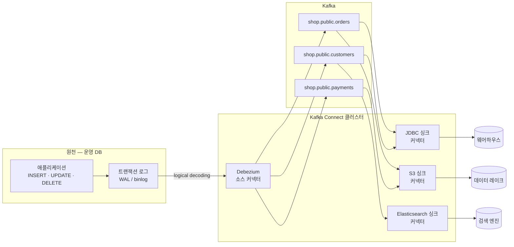
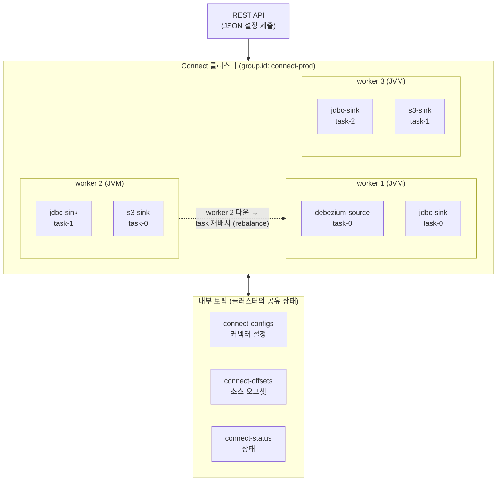
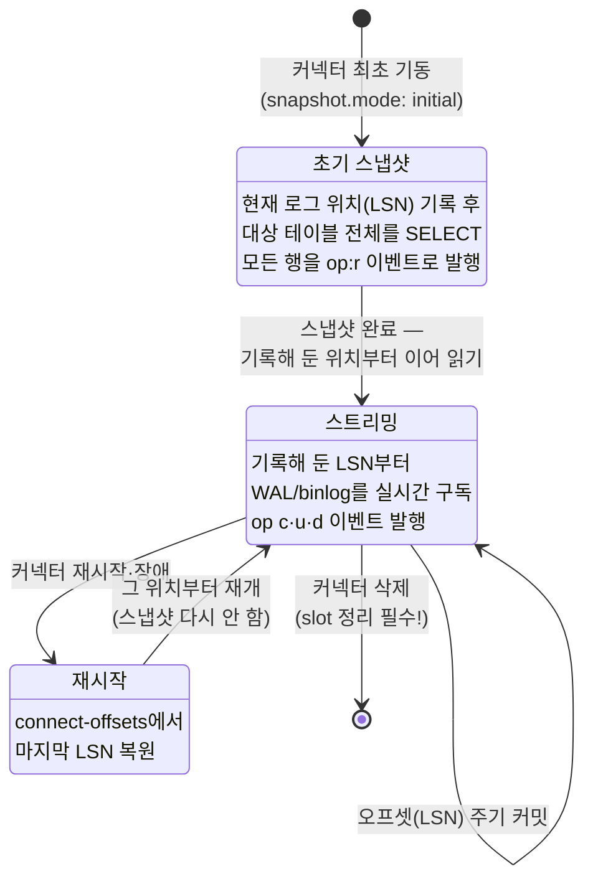

<figure class="post-figure post-figure--header">
<svg role="img" aria-label="Kafka Connect와 CDC를 한 장으로 정리한 그림. 왼쪽에 운영 데이터베이스가 있고 그 안의 트랜잭션 로그(WAL)에 INSERT·UPDATE·DELETE 항목이 순서대로 쌓여 있다. Debezium 소스 커넥터가 이 로그를 읽어 변경 이벤트로 바꾸고, 가운데 Kafka의 토픽들(shop.public.orders·customers·payments)에 흘려보낸다. 오른쪽에서는 싱크 커넥터들이 같은 토픽을 읽어 웨어하우스·검색 엔진·캐시 세 갈래로 부챗살처럼 퍼뜨린다. 아래 캡션은 애플리케이션 코드를 짜지 않고 선언적 설정만으로 이 전체 흐름이 운영됨을 설명한다." viewBox="0 0 680 300" xmlns="http://www.w3.org/2000/svg">
  <title>Kafka Connect · CDC — DB 트랜잭션 로그가 Debezium을 거쳐 Kafka 토픽이 되고, 싱크 커넥터가 여러 시스템으로 퍼뜨린다</title>
  <defs>
    <marker id="kfk-s4-arrow" viewBox="0 0 10 10" refX="8" refY="5" markerWidth="6" markerHeight="6" orient="auto-start-reverse">
      <path d="M0,0 L10,5 L0,10 z" fill="var(--secondary-color)"/>
    </marker>
    <marker id="kfk-s4-arrow-gold" viewBox="0 0 10 10" refX="8" refY="5" markerWidth="6" markerHeight="6" orient="auto-start-reverse">
      <path d="M0,0 L10,5 L0,10 z" fill="var(--gold)"/>
    </marker>
  </defs>

  <!-- title -->
  <text x="340" y="24" text-anchor="middle" font-size="17" font-weight="800" fill="currentColor" letter-spacing="1.5">KAFKA CONNECT · CDC</text>
  <text x="340" y="44" text-anchor="middle" font-size="10.5" font-weight="700" fill="currentColor" opacity="0.72">DB의 트랜잭션 로그를 읽어 이벤트로 — 코드 없이 선언적 설정으로 시스템을 잇는다</text>

  <!-- ===== source DB with WAL ===== -->
  <!-- DB cylinder -->
  <g>
    <path d="M28,84 a44,12 0 0 1 88,0 v96 a44,12 0 0 1 -88,0 Z" fill="var(--bg-light)" stroke="currentColor" stroke-width="2"/>
    <ellipse cx="72" cy="84" rx="44" ry="12" fill="var(--bg-light)" stroke="currentColor" stroke-width="2"/>
  </g>
  <text x="72" y="112" text-anchor="middle" font-size="9.5" font-weight="800" fill="currentColor">운영 DB</text>
  <!-- WAL entries inside -->
  <g font-size="7.5" font-weight="700" fill="currentColor" text-anchor="middle">
    <rect x="42" y="120" width="60" height="14" rx="2" fill="var(--bg-panel)" stroke="currentColor" stroke-width="1.2"/>
    <text x="72" y="130">INSERT</text>
    <rect x="42" y="138" width="60" height="14" rx="2" fill="var(--bg-panel)" stroke="currentColor" stroke-width="1.2"/>
    <text x="72" y="148">UPDATE</text>
    <rect x="42" y="156" width="60" height="14" rx="2" fill="var(--bg-panel)" stroke="currentColor" stroke-width="1.2"/>
    <text x="72" y="166">DELETE</text>
  </g>
  <text x="72" y="212" text-anchor="middle" font-size="8.5" fill="currentColor" opacity="0.75">트랜잭션 로그 (WAL / binlog)</text>

  <!-- arrow DB -> Debezium -->
  <line x1="120" y1="140" x2="158" y2="140" stroke="var(--secondary-color)" stroke-width="2" marker-end="url(#kfk-s4-arrow)"/>
  <text x="139" y="130" text-anchor="middle" font-size="7.5" font-weight="700" fill="currentColor" opacity="0.7">로그 읽기</text>

  <!-- ===== Debezium source connector ===== -->
  <rect x="162" y="106" width="112" height="68" rx="6" fill="var(--bg-light)" stroke="var(--accent-color)" stroke-width="2.5"/>
  <text x="218" y="128" text-anchor="middle" font-size="10" font-weight="800" fill="var(--accent-color)">Debezium</text>
  <text x="218" y="144" text-anchor="middle" font-size="8.5" font-weight="700" fill="currentColor">소스 커넥터</text>
  <text x="218" y="162" text-anchor="middle" font-size="8" fill="currentColor" opacity="0.72">변경 → 이벤트</text>
  <text x="218" y="192" text-anchor="middle" font-size="8.5" fill="currentColor" opacity="0.75">Connect 클러스터에서 실행</text>

  <!-- arrow Debezium -> Kafka -->
  <line x1="274" y1="140" x2="312" y2="140" stroke="var(--secondary-color)" stroke-width="2" marker-end="url(#kfk-s4-arrow)"/>

  <!-- ===== Kafka topics ===== -->
  <rect x="316" y="76" width="150" height="130" rx="6" fill="var(--bg-light)" stroke="currentColor" stroke-width="2"/>
  <text x="391" y="94" text-anchor="middle" font-size="10" font-weight="800" fill="currentColor">Kafka 토픽</text>
  <g font-size="7.5" font-weight="700" fill="currentColor" text-anchor="middle">
    <rect x="328" y="104" width="126" height="22" rx="3" fill="var(--bg-panel)" stroke="currentColor" stroke-width="1.4"/>
    <text x="391" y="118">shop.public.orders</text>
    <rect x="328" y="132" width="126" height="22" rx="3" fill="var(--bg-panel)" stroke="currentColor" stroke-width="1.4"/>
    <text x="391" y="146">shop.public.customers</text>
    <rect x="328" y="160" width="126" height="22" rx="3" fill="var(--bg-panel)" stroke="currentColor" stroke-width="1.4"/>
    <text x="391" y="174">shop.public.payments</text>
  </g>
  <text x="391" y="196" text-anchor="middle" font-size="7.5" fill="currentColor" opacity="0.7">테이블 하나 = 토픽 하나</text>

  <!-- arrows Kafka -> sinks (fan-out) -->
  <g stroke="var(--gold)" stroke-width="2" fill="none">
    <line x1="466" y1="110" x2="532" y2="96" marker-end="url(#kfk-s4-arrow-gold)"/>
    <line x1="466" y1="141" x2="532" y2="141" marker-end="url(#kfk-s4-arrow-gold)"/>
    <line x1="466" y1="172" x2="532" y2="186" marker-end="url(#kfk-s4-arrow-gold)"/>
  </g>
  <text x="499" y="128" text-anchor="middle" font-size="7.5" font-weight="700" fill="currentColor" opacity="0.7">싱크</text>

  <!-- ===== sink targets ===== -->
  <g font-size="8.5" font-weight="700" fill="currentColor" text-anchor="middle">
    <rect x="536" y="78" width="118" height="34" rx="4" fill="var(--bg-panel)" stroke="var(--gold)" stroke-width="2"/>
    <text x="595" y="99">웨어하우스 (JDBC/S3)</text>
    <rect x="536" y="124" width="118" height="34" rx="4" fill="var(--bg-panel)" stroke="var(--gold)" stroke-width="2"/>
    <text x="595" y="145">검색 엔진</text>
    <rect x="536" y="170" width="118" height="34" rx="4" fill="var(--bg-panel)" stroke="var(--gold)" stroke-width="2"/>
    <text x="595" y="191">캐시</text>
  </g>
  <text x="595" y="220" text-anchor="middle" font-size="8.5" fill="currentColor" opacity="0.75">싱크 커넥터 · 부챗살 전파</text>

  <!-- bottom caption -->
  <line x1="30" y1="242" x2="650" y2="242" stroke="currentColor" stroke-width="1.4" opacity="0.25"/>
  <text x="340" y="266" text-anchor="middle" font-size="10" fill="currentColor" opacity="0.72">이 그림의 어느 상자에도 애플리케이션 코드가 없다 — 전부 JSON 설정과 REST 호출로 운영된다</text>
  <text x="340" y="284" text-anchor="middle" font-size="9" font-weight="700" fill="var(--gold)">운영 DB의 변경이 거의 실시간으로 분석계 · 검색 · 캐시에 전파된다</text>
</svg>
<figcaption>Kafka Connect · CDC 한 장 요약 — 운영 DB의 트랜잭션 로그를 Debezium 소스 커넥터가 읽어 Kafka 토픽으로 바꾸고, 싱크 커넥터가 웨어하우스·검색·캐시로 부챗살처럼 퍼뜨린다</figcaption>
</figure>

## 들어가며

앞의 세 단계에서 우리는 Kafka **안쪽**을 다뤘습니다 — 커밋 로그가 무엇을 어떻게 저장하는지, 프로듀서와 컨슈머 그룹이 어떻게 쓰고 병렬로 읽는지, 그리고 전달 보장을 어떻게 확보하는지. 이번 단계의 질문은 방향이 다릅니다. **Kafka 바깥의 시스템들 — 운영 DB, 웨어하우스, 검색 엔진, 캐시 — 을 어떻게 이 로그에 잇는가?**

순진한 답은 "프로듀서/컨슈머 애플리케이션을 짜면 된다"입니다. 그런데 원천이 5개, 목적지가 10개라면 애플리케이션 15개를 각자 재시도·오프셋 관리·장애 복구·스케일링까지 갖춰 짜고 운영해야 합니다. 전부 "데이터를 옮긴다"는 같은 문제의 변주인데도 말입니다. **Kafka Connect**는 이 반복을 프레임워크로 흡수합니다 — 커넥터 플러그인을 고르고 JSON 설정을 REST로 던지면, 실행·병렬화·오프셋 관리·장애 복구를 Connect 클러스터가 대신합니다.

그리고 이 단계의 진짜 주인공은 소스 커넥터의 왕좌에 앉아 있는 **변경 데이터 캡처(CDC)**입니다. **Debezium**이 운영 DB의 트랜잭션 로그(PostgreSQL WAL, MySQL binlog)를 구독해 INSERT·UPDATE·DELETE를 이벤트 스트림으로 바꿔 놓으면, 운영 DB의 변경이 몇 초 안에 분석계·검색·캐시로 전파됩니다. 배치 폴링으로는 결코 얻을 수 없는 실시간성과 완전성입니다.

이 글은 [Kafka Essential Curriculum](/2026/07/12/kafka-essential-curriculum.html)의 4단계이자, 시리즈 세 번째 막 "생태계로 넓히기"의 출발점입니다. 수집 관점에서 CDC의 개념 지도를 먼저 그려 둔 오버뷰의 [데이터 수집(Ingestion)](/2026/06/25/data-ingestion.html) CDC 절이 좋은 사전 지식입니다 — 거기서 "왜 CDC인가"를 잡았다면, 이번에는 "CDC가 실제로 어떻게 도는가"를 커넥터 설정과 장애 시나리오 수준까지 파고듭니다.

<div class="post-summary-box" markdown="1">

### 📌 이 글에서 다루는 내용

- **Connect 아키텍처**: 프로듀서/컨슈머를 매번 직접 짜지 않는 이유, 소스/싱크 커넥터 모델, worker(standalone vs distributed)·connector·task의 관계와 분산 실행, 선언적 JSON/REST 설정, 내부 토픽(config/offset/status), converter와 SMT
- **CDC와 Debezium**: 폴링 방식 vs 로그 기반 CDC, Debezium이 PostgreSQL WAL(logical decoding·replication slot)·MySQL binlog를 읽는 원리, 변경 이벤트 envelope(before/after/op/ts_ms), 초기 스냅샷 → 스트리밍 전환, 토픽 네이밍, 스키마 변경 처리
- **운영 실무**: 커넥터 오프셋·상태 관리, task 실패·rebalance 같은 재시작·장애 시나리오, replication slot 방치로 인한 WAL 폭증, dead letter queue, 싱크 쪽 멱등성(3단계 전달 보장과의 연결), 모니터링 포인트

</div>

## 한눈에 보기 — 트랜잭션 로그에서 세 갈래 목적지까지

이 글의 스파인을 한 장으로 그리면 이렇습니다. 운영 DB에 커밋된 변경이 트랜잭션 로그에 남고, Connect 클러스터 위의 Debezium 소스 커넥터가 그것을 읽어 변경 이벤트로 바꿔 Kafka 토픽에 쌓으며, 싱크 커넥터들이 같은 토픽을 각자의 목적지로 흘려보냅니다. 가운데 Kafka가 있기에 원천과 목적지는 서로를 모릅니다 — 2단계에서 본 "여럿이 각자의 오프셋으로 읽는 로그"가 여기서 시스템 통합의 허브가 됩니다.



주목할 점 하나 — 이 그림에서 애플리케이션 코드가 있는 곳은 왼쪽 끝의 원래 서비스뿐입니다. 나머지는 전부 설정입니다. 이 "코드에서 설정으로"의 전환이 Connect의 존재 이유입니다.

## Connect 아키텍처 — 파이프를 코드가 아니라 설정으로

### 왜 프로듀서·컨슈머를 매번 직접 짜지 않는가

"DB에서 읽어 Kafka에 넣는 프로그램"을 직접 짜 본 경험이 있다면, 본질 로직은 하루면 끝나고 나머지 몇 주가 부대 작업이라는 것을 압니다 — 어디까지 읽었는지 기록(재시작해도 이어 읽기), 실패 시 재시도와 백오프, 데이터가 늘면 병렬화, 프로세스가 죽으면 다른 곳에서 재기동, 직렬화 포맷 통일, 배포와 모니터링. 원천·목적지가 늘 때마다 이 부대 작업이 통째로 복제됩니다.

Kafka Connect는 이 부대 작업 전체를 **프레임워크 계층**으로 끌어올린 것입니다. 역할 분담이 명확합니다.

- **커넥터 플러그인이 감당하는 것**: 특정 시스템과 대화하는 법 — PostgreSQL WAL을 읽는 법(Debezium), JDBC로 upsert하는 법, S3에 파일을 쓰는 법. 이미 수백 종의 커넥터가 공개되어 있어 대부분은 가져다 씁니다.
- **Connect 런타임이 감당하는 것**: 오프셋 저장과 복원, 재시도, task 병렬 실행과 분산 배치, 장애 시 재배치(rebalance), 설정 관리, REST 운영 API, 메트릭.
- **운영자가 감당하는 것**: JSON 설정을 작성하고 REST로 제출하는 것. 그리고 이 글의 후반부에서 다룰, 프레임워크가 대신해 주지 못하는 운영 판단들.

즉 Connect는 "Kafka로 넣고 빼는 파이프"라는 반복 문제를 **표준화된 실행 환경 + 재사용 가능한 플러그인**으로 푼 것입니다. 직접 짠 컨슈머 애플리케이션이 필요한 경우는 목적지에 비즈니스 로직이 개입할 때이고, 단순 이동·복제라면 Connect가 거의 항상 옳은 선택입니다.

### 소스와 싱크 — 두 방향의 커넥터 모델

커넥터는 데이터가 흐르는 방향에 따라 딱 두 종류입니다.

| 구분 | 방향 | 내부적으로 하는 일 | 대표 예 |
| --- | --- | --- | --- |
| **소스(source) 커넥터** | 외부 시스템 → Kafka | 외부에서 읽어 **프로듀서**로 토픽에 쓴다 | Debezium(PostgreSQL/MySQL CDC), JDBC Source |
| **싱크(sink) 커넥터** | Kafka → 외부 시스템 | **컨슈머 그룹**으로 토픽을 읽어 외부에 쓴다 | JDBC Sink, S3 Sink, Elasticsearch Sink |

내부적으로 소스 커넥터는 프로듀서를, 싱크 커넥터는 컨슈머를 품고 있습니다. 2단계에서 익힌 파티션·컨슈머 그룹·오프셋의 역학이 그대로 적용된다는 뜻입니다 — 싱크 커넥터의 병렬성 상한이 토픽 파티션 수인 것도, 싱크 task 사이에서 파티션이 재분배되는 것도 전부 컨슈머 그룹의 동작 그 자체입니다.

### worker · connector · task — 세 층의 실행 모델

Connect의 실행 모델은 세 개념의 관계로 요약됩니다.

- **worker**: Connect 런타임을 실행하는 JVM 프로세스. 물리적 실행 단위이며, 여러 worker가 같은 `group.id`로 묶이면 하나의 Connect 클러스터가 됩니다.
- **connector**: "어떤 파이프를 어떻게 운영할 것인가"의 논리적 정의. JSON 설정 하나가 connector 하나입니다. connector 자체는 조율자 역할만 하고, 실제 데이터 이동은 하지 않습니다.
- **task**: 데이터를 실제로 옮기는 작업 단위. connector가 자신의 일을 `tasks.max` 한도 안에서 여러 task로 쪼개고, 클러스터가 이 task들을 worker에 분산 배치합니다.



worker의 실행 형태는 두 가지입니다.

| | **standalone 모드** | **distributed 모드** |
| --- | --- | --- |
| worker 수 | 1개 (단일 프로세스) | 여러 개 (같은 `group.id`로 클러스터) |
| 설정 방법 | 로컬 properties 파일 | REST API로 제출 |
| 오프셋 저장 | 로컬 파일 (`offset.storage.file.filename`) | Kafka 내부 토픽 |
| 장애 복구 | 없음 — 프로세스가 죽으면 끝 | task를 살아있는 worker로 자동 재배치 |
| 용도 | 개발·테스트, 로컬 실험 | 프로덕션 표준 |

프로덕션의 답은 사실상 distributed 모드 하나입니다. worker를 늘리면 task가 재분배되어 수평 확장이 되고, worker가 죽으면 그 위의 task들이 남은 worker로 옮겨 갑니다 — 2단계의 컨슈머 그룹 리밸런싱과 같은 원리이며, 실제로 Connect도 Kafka의 그룹 프로토콜을 사용합니다.

한 가지 실무 감각 — `tasks.max`는 "요청"이지 "보장"이 아닙니다. 싱크 커넥터는 파티션 수만큼만 task가 의미 있고, Debezium 같은 로그 기반 소스 커넥터는 **DB 하나당 트랜잭션 로그가 하나뿐이므로 task 1개로 고정**입니다. "Debezium에 `tasks.max: 4`를 줬는데 왜 안 빨라지나"는 흔한 초심자 질문인데, 로그는 순서가 생명이라 애초에 쪼갤 수 없기 때문입니다.

### 선언적 설정 — JSON을 REST로 던지면 파이프가 생긴다

distributed 모드에서 커넥터의 생성·조회·수정·삭제는 전부 REST API입니다. 커넥터를 만드는 일은 JSON 문서 하나를 POST하는 일입니다.

```bash
# 커넥터 생성 — 설정 JSON을 제출하면 클러스터가 task를 띄운다
curl -X POST http://connect:8083/connectors \
  -H "Content-Type: application/json" \
  -d @debezium-postgres-source.json

# 등록된 커넥터 목록
curl http://connect:8083/connectors

# 커넥터와 task들의 상태 확인 — 운영에서 가장 자주 치는 명령
curl http://connect:8083/connectors/inventory-pg-source/status

# 설정만 교체 (PUT은 멱등 — 없으면 생성, 있으면 갱신)
curl -X PUT http://connect:8083/connectors/inventory-pg-source/config \
  -H "Content-Type: application/json" \
  -d @new-config.json

# 일시 정지 / 재개 / 삭제
curl -X PUT    http://connect:8083/connectors/inventory-pg-source/pause
curl -X PUT    http://connect:8083/connectors/inventory-pg-source/resume
curl -X DELETE http://connect:8083/connectors/inventory-pg-source
```

`status` 응답은 이런 모양입니다 — connector와 각 task의 상태가 분리되어 있다는 점이 중요합니다(뒤의 운영 절에서 다시 봅니다).

```json
{
  "name": "inventory-pg-source",
  "connector": { "state": "RUNNING", "worker_id": "10.0.1.12:8083" },
  "tasks": [
    { "id": 0, "state": "RUNNING", "worker_id": "10.0.1.13:8083" }
  ],
  "type": "source"
}
```

### 내부 토픽 — Connect가 자기 상태를 Kafka에 저장한다

distributed 클러스터의 공유 상태는 별도 DB가 아니라 **Kafka 자신**에 저장됩니다. 세 개의 내부 토픽이 그 저장소입니다.

| 내부 토픽 (설정 키) | 담는 것 | 성격 |
| --- | --- | --- |
| `config.storage.topic` (예: `connect-configs`) | 제출된 커넥터 설정 | compacted, 파티션 1 |
| `offset.storage.topic` (예: `connect-offsets`) | **소스 커넥터**의 진행 위치 (예: WAL LSN, binlog 파일·위치) | compacted |
| `status.storage.topic` (예: `connect-status`) | connector·task의 현재 상태 | compacted |

worker가 전멸해도 이 토픽들이 남아 있는 한, 새 worker들이 설정과 오프셋을 읽어 **중단 지점부터** 파이프를 재개합니다. Connect가 "상태를 로그에 기록하는" Kafka의 철학을 자기 자신에게 적용한 셈입니다.

한 가지 비대칭을 기억해 두면 운영에서 헷갈리지 않습니다 — **소스 커넥터의 오프셋**은 `connect-offsets`에 저장되지만(외부 시스템의 위치라 Kafka 오프셋이 아니므로), **싱크 커넥터의 오프셋**은 보통의 컨슈머와 똑같이 `__consumer_offsets`에 컨슈머 그룹(`connect-<커넥터명>`) 오프셋으로 저장됩니다. 싱크 커넥터의 진행 상황을 컨슈머 lag 모니터링 도구로 그대로 볼 수 있는 이유입니다.

### converter — 바이트와 데이터 사이의 번역기

Kafka에 실리는 것은 결국 바이트입니다. **converter**는 Connect 내부의 구조화된 레코드와 토픽의 바이트 사이를 번역합니다 — 소스 방향에서는 직렬화, 싱크 방향에서는 역직렬화입니다.

```properties
# worker 설정 — 클러스터 기본 converter (커넥터별 오버라이드 가능)
key.converter=org.apache.kafka.connect.json.JsonConverter
value.converter=org.apache.kafka.connect.json.JsonConverter
# true면 메시지마다 스키마를 함께 실어 보낸다 — 자기서술적이지만 매우 뚱뚱해진다
value.converter.schemas.enable=true
```

선택지는 크게 셋입니다. `JsonConverter`는 어디서나 읽을 수 있지만 `schemas.enable=true`일 때 **메시지마다 스키마 전체를 반복 수송**하는 낭비가 있고, `false`로 끄면 싱크 쪽이 타입 정보를 잃습니다. 그래서 프로덕션 CDC 파이프라인의 정석은 `AvroConverter`(또는 Protobuf/JSON Schema) + **Schema Registry** 조합입니다 — 메시지에는 스키마 ID만 싣고 스키마 본문은 중앙 레지스트리에 두는 방식인데, 이것이 어떻게 "데이터 계약"이 되는지는 정확히 다음 [5단계](/2026/07/15/kafka-schema-registry.html)의 주제이므로 여기서는 예고만 해 둡니다.

### SMT — 흐르는 레코드를 한 건씩 다듬기

**SMT(Single Message Transform)**는 커넥터와 Kafka 사이에서 레코드를 **한 건 단위로** 가볍게 변형하는 훅입니다. 필드 제거·이름 변경, 토픽 라우팅, 타임스탬프 추가 같은 것들을 설정만으로 체이닝합니다.

```json
{
  "transforms": "route,mask",
  "transforms.route.type": "org.apache.kafka.connect.transforms.RegexRouter",
  "transforms.route.regex": "shop\\.public\\.(.*)",
  "transforms.route.replacement": "cdc.$1",
  "transforms.mask.type": "org.apache.kafka.connect.transforms.MaskField$Value",
  "transforms.mask.fields": "email"
}
```

경계를 분명히 해 두는 것이 좋습니다 — SMT는 **한 건짜리 정형 변환**까지만입니다. 조인·집계·상태가 필요한 변환은 SMT의 일이 아니라 6단계 Kafka Streams(또는 웨어하우스 안의 dbt)의 일입니다. SMT에 로직을 욱여넣기 시작하면 파이프가 디버깅 불가능한 블랙박스가 됩니다.

## CDC와 Debezium — 트랜잭션 로그를 이벤트 스트림으로

### 폴링 방식 vs 로그 기반 — 왜 로그인가

DB의 변경을 밖으로 꺼내는 소박한 방법은 **폴링**입니다 — `updated_at` 컬럼을 기준으로 주기적으로 `SELECT`하는 것. JDBC Source 커넥터가 이 방식입니다. 간단하지만 구조적 한계가 셋 있습니다.

| | **폴링 (query-based)** | **로그 기반 (log-based CDC)** |
| --- | --- | --- |
| DELETE 감지 | **불가능** — 지워진 행은 조회되지 않는다 | 가능 — 로그에 삭제도 기록된다 |
| 중간 상태 | 폴링 간격 사이의 다중 변경은 마지막 것만 보임 | 모든 변경이 순서대로 캡처된다 |
| 지연 | 폴링 주기만큼 (수십 초~분) | 준실시간 (보통 1초 미만~수 초) |
| 원천 부하 | 주기적 풀스캔/인덱스 스캔 쿼리 | 이미 쓰여진 로그를 읽기만 — 쿼리 부하 없음 |
| 요구 사항 | `updated_at` 같은 증분 컬럼 필요 | DB의 로그 접근 권한·설정 필요 |

로그 기반 CDC의 통찰은 이렇습니다 — **DB는 이미 모든 변경을 순서대로 기록하고 있다.** 복구와 복제를 위해 존재하는 트랜잭션 로그(PostgreSQL의 WAL, MySQL의 binlog)가 바로 그것입니다. CDC는 그 로그의 "또 하나의 복제 대상"으로 Kafka를 꽂는 발상이고, 1단계에서 본 "Kafka = 커밋 로그"와 정확히 맞물립니다. **DB의 커밋 로그를 Kafka라는 커밋 로그로 이어 붙이는 것**, 이것이 Debezium의 본질입니다.

### Debezium이 로그를 읽는 원리 — WAL과 binlog

**PostgreSQL**에서 Debezium은 **logical decoding**을 사용합니다. PostgreSQL은 `wal_level=logical`로 설정하면 WAL의 물리적 레코드를 논리적 행 변경(어느 테이블의 어느 행이 어떻게 바뀌었나)으로 해석해 내보낼 수 있고, 그 출구가 **replication slot**입니다. Debezium은 slot 하나(`slot.name`)를 만들어 스트리밍 복제 프로토콜로 접속하고, `pgoutput` 플러그인(PostgreSQL 10+ 내장)이 디코딩한 변경을 받아 이벤트로 바꿉니다.

replication slot에는 반드시 기억해야 할 성질이 하나 있습니다 — **slot은 소비자가 확인(confirm)할 때까지 해당 WAL을 지우지 못하게 잡아 둡니다.** 커넥터가 재시작해도 유실이 없도록 하는 안전장치인데, 뒤집으면 커넥터가 오래 멈춰 있으면 WAL이 무한히 쌓인다는 뜻입니다. 이것이 CDC 운영 최대의 함정이며, 운영 절에서 따로 다룹니다.

**MySQL**에서는 **binlog**를 읽습니다. Debezium이 복제 클라이언트(replica)인 것처럼 binlog 스트림에 접속하는 방식입니다(`binlog_format=ROW` 필요). PostgreSQL과 한 가지 중요한 차이 — binlog의 ROW 이벤트에는 컬럼 이름·타입이 없어서, Debezium은 DDL 문장을 따로 추적해 테이블 구조의 역사를 **schema history 내부 토픽**(`schema.history.internal.kafka.topic`)에 기록해 둡니다. 재시작 시 이 토픽을 재생해 "그 binlog 위치 시점의 테이블 구조"를 복원합니다.

실전 설정으로 감을 잡겠습니다 — jaffle-shop풍 쇼핑몰 DB의 세 테이블을 캡처하는 Debezium PostgreSQL 소스 커넥터입니다.

```json
{
  "name": "inventory-pg-source",
  "config": {
    "connector.class": "io.debezium.connector.postgresql.PostgresConnector",
    "tasks.max": "1",

    "database.hostname": "pg-prod.internal",
    "database.port": "5432",
    "database.user": "debezium",
    "database.password": "${file:/opt/secrets/pg.properties:password}",
    "database.dbname": "shop",

    "topic.prefix": "shop",
    "table.include.list": "public.orders,public.customers,public.payments",

    "plugin.name": "pgoutput",
    "slot.name": "debezium_shop",
    "publication.autocreate.mode": "filtered",

    "snapshot.mode": "initial",
    "heartbeat.interval.ms": "10000",
    "tombstones.on.delete": "true"
  }
}
```

- `tasks.max: 1` — 앞서 말한 대로 트랜잭션 로그는 하나이므로 task도 하나입니다.
- `topic.prefix` — 이 커넥터가 만드는 모든 토픽 이름의 뿌리이자, 논리적 서버 이름입니다.
- `table.include.list` — 캡처 대상 테이블의 화이트리스트. 전체 캡처는 거의 항상 과합니다.
- `slot.name` — 이 커넥터 전용 replication slot. 커넥터를 지울 때 **slot도 함께 지워야** 합니다.
- `heartbeat.interval.ms` — 캡처 대상에 변경이 없어도 주기적으로 진행 위치를 전진시키는 심장박동. WAL 폭증 방지의 핵심 장치로, 운영 절에서 다시 봅니다.

### 변경 이벤트 envelope — before / after / op / ts_ms

Debezium이 만들어 내는 이벤트는 정해진 봉투(envelope) 구조를 갖습니다. `orders` 테이블의 상태를 갱신하는 UPDATE가 일어나면, `shop.public.orders` 토픽에 이런 이벤트가 실립니다.

```json
{
  "before": {
    "order_id": 1024,
    "customer_id": 77,
    "status": "placed",
    "amount": 45000
  },
  "after": {
    "order_id": 1024,
    "customer_id": 77,
    "status": "shipped",
    "amount": 45000
  },
  "source": {
    "connector": "postgresql",
    "db": "shop",
    "schema": "public",
    "table": "orders",
    "lsn": 24023128,
    "ts_ms": 1783468800123
  },
  "op": "u",
  "ts_ms": 1783468800345
}
```

- **`before` / `after`**: 변경 전·후의 행 전체. INSERT는 `before: null`, DELETE는 `after: null`입니다. UPDATE에서 `before`를 온전히 받으려면 PostgreSQL은 테이블에 `REPLICA IDENTITY FULL` 설정이 필요합니다(기본값에서는 키 컬럼만 옵니다).
- **`op`**: 연산 종류 — `c`(create/INSERT), `u`(update), `d`(delete), 그리고 스냅샷으로 읽은 행을 뜻하는 `r`(read).
- **`source`**: 출처 메타데이터 — 어느 DB·테이블에서, 로그의 어느 위치(`lsn`)에서 왔는지. `source.ts_ms`는 **DB에서 커밋된 시각**이고 최상위 `ts_ms`는 **Debezium이 처리한 시각**이므로, 둘의 차이가 곧 캡처 지연입니다.
- **키와 tombstone**: 이벤트의 Kafka 메시지 키는 테이블의 PK입니다 — 같은 행의 변경이 같은 파티션에 순서대로 쌓이는 이유입니다. DELETE 뒤에는 값이 `null`인 **tombstone** 메시지가 한 번 더 발행되어(`tombstones.on.delete`), log compaction 토픽에서 그 키가 최종적으로 지워질 수 있게 합니다.

이 envelope 그대로를 원하는 소비자는 드뭅니다. 싱크 쪽에서는 대개 `ExtractNewRecordState` SMT로 봉투를 벗겨 `after`만 평평하게 꺼내 씁니다 — 아래 싱크 설정에서 실제로 사용합니다.

### 초기 스냅샷 → 스트리밍 전환

커넥터를 처음 켜는 순간을 생각해 보면 문제가 하나 있습니다 — 로그에는 "지금부터의 변경"만 있고, **이미 존재하는 수백만 행**은 없습니다. 그래서 Debezium은 두 국면으로 동작합니다.



순서가 정교합니다 — 스냅샷을 시작하기 **전에 현재 로그 위치를 먼저 기록**해 두고, 스냅샷이 끝나면 그 위치부터 스트리밍을 시작합니다. 스냅샷 도중에 일어난 변경도 로그에 남아 있으므로 놓치지 않습니다(대신 스냅샷으로 읽은 행과 겹칠 수 있어 중복은 가능 — at-least-once입니다). `snapshot.mode`로 이 국면을 제어합니다.

| `snapshot.mode` | 동작 | 쓰임 |
| --- | --- | --- |
| `initial` (기본) | 최초 기동 시 스냅샷 후 스트리밍 | 일반적인 신규 파이프라인 |
| `no_data` | 스냅샷 없이 스키마만 읽고 바로 스트리밍 | 과거 데이터가 필요 없거나 따로 적재한 경우 |
| `when_needed` | 오프셋이 유실·무효일 때만 스냅샷 | 자동 복구 성향의 운영 |
| `always` | 기동 때마다 스냅샷 | 디버깅·특수 상황 |

대용량 테이블의 재스냅샷이 필요할 때(예: 새 테이블을 `table.include.list`에 추가) 파이프라인을 멈추고 처음부터 다시 찍는 것은 부담스럽습니다. 최신 Debezium은 시그널 테이블에 행을 넣어 **incremental snapshot**(스트리밍을 멈추지 않고 청크 단위로 기존 행을 끼워 넣는 방식)을 트리거할 수 있어, 운영 중 재스냅샷의 표준 답이 되었습니다.

### 토픽 네이밍과 스키마 변경

Debezium의 토픽 이름은 규칙적입니다 — **`<topic.prefix>.<스키마>.<테이블>`**, 즉 `shop.public.orders` 식으로 **테이블 하나당 토픽 하나**가 만들어집니다. 이 규칙성 덕분에 싱크 커넥터에서 `topics.regex: "shop\\.public\\..*"`처럼 패턴으로 구독하거나, RegexRouter SMT로 일괄 개명하는 운영이 가능합니다.

원천 테이블에 `ALTER TABLE ADD COLUMN`이 일어나면 어떻게 될까요? Debezium은 로그에서 새 구조를 감지하고, 이후 이벤트의 `after`에 새 필드를 포함시키며, 이벤트에 실리는 스키마 정보도 갱신합니다(MySQL은 앞서 본 schema history 토픽으로 DDL을 추적합니다). 즉 **캡처는 스키마 변경에서 대체로 살아남습니다.** 문제는 하류입니다 — 싱크의 목적지 테이블에는 그 컬럼이 없고, 컨슈머 코드는 새 필드를 모릅니다. JDBC 싱크의 `auto.evolve` 같은 임시방편이 있지만, "어떤 스키마 변경이 하류를 깨뜨리지 않는가"를 체계적으로 다스리는 것은 호환성 규칙의 영역이고, 그것이 다음 5단계 Schema Registry의 존재 이유입니다.

### 싱크 커넥터 — 토픽을 목적지로

파이프의 반대쪽 절반도 설정으로 완성합니다. 먼저 `orders` 변경을 웨어하우스 테이블로 upsert하는 JDBC 싱크입니다.

```json
{
  "name": "orders-warehouse-sink",
  "config": {
    "connector.class": "io.confluent.connect.jdbc.JdbcSinkConnector",
    "tasks.max": "4",
    "topics": "shop.public.orders",

    "connection.url": "jdbc:postgresql://dw.internal:5432/analytics",
    "connection.user": "connect_writer",
    "connection.password": "${file:/opt/secrets/dw.properties:password}",

    "insert.mode": "upsert",
    "pk.mode": "record_key",
    "pk.fields": "order_id",
    "auto.create": "true",
    "auto.evolve": "true",
    "delete.enabled": "true",

    "transforms": "unwrap",
    "transforms.unwrap.type": "io.debezium.transforms.ExtractNewRecordState",
    "transforms.unwrap.drop.tombstones": "false",
    "transforms.unwrap.delete.handling.mode": "rewrite",

    "errors.tolerance": "all",
    "errors.deadletterqueue.topic.name": "dlq.orders-warehouse-sink",
    "errors.deadletterqueue.topic.replication.factor": "3",
    "errors.deadletterqueue.context.headers.enable": "true"
  }
}
```

읽는 법 — `unwrap` SMT가 Debezium envelope에서 `after`를 꺼내 평평한 행으로 만들고, `insert.mode: upsert` + `pk.mode: record_key`가 메시지 키(= 원천 PK)를 기준으로 INSERT/UPDATE를 알아서 가르며, `delete.enabled`가 DELETE 이벤트를 목적지 DELETE로 반영합니다. `errors.*` 계열은 운영 절에서 다룰 dead letter queue 설정입니다.

데이터 레이크로 쌓는 S3 싱크도 뼈대는 같습니다 — 무엇을(topics), 어디로(bucket), 어떻게 나눠서(partitioner) 쓸지만 다릅니다.

```json
{
  "name": "cdc-s3-sink",
  "config": {
    "connector.class": "io.confluent.connect.s3.S3SinkConnector",
    "tasks.max": "2",
    "topics.regex": "shop\\.public\\..*",

    "s3.bucket.name": "lake-raw-cdc",
    "s3.region": "ap-northeast-2",
    "storage.class": "io.confluent.connect.s3.storage.S3Storage",
    "format.class": "io.confluent.connect.s3.format.parquet.ParquetFormat",

    "partitioner.class": "io.confluent.connect.storage.partitioner.TimeBasedPartitioner",
    "path.format": "'dt'=YYYY-MM-dd",
    "partition.duration.ms": "3600000",
    "timestamp.extractor": "RecordField",
    "timestamp.field": "ts_ms",

    "flush.size": "10000",
    "rotate.interval.ms": "600000"
  }
}
```

두 싱크 어디에도 "애플리케이션"이 없다는 점을 다시 강조해 둡니다. 운영 DB 변경 → 웨어하우스 upsert + 데이터 레이크 적재의 전체 파이프라인이 JSON 세 장(소스 1 + 싱크 2)으로 섰습니다.

## 운영 실무 — 파이프는 세우는 것보다 지키는 것이 어렵다

### 오프셋과 상태 — "어디까지 했는지"의 관리

Connect 운영의 절반은 오프셋 관리입니다. 앞서 본 비대칭을 운영 관점에서 다시 정리하면 이렇습니다.

- **소스 커넥터**: 진행 위치(PostgreSQL LSN, MySQL binlog 파일+포지션)가 `connect-offsets` 내부 토픽에 커밋됩니다. 재시작하면 여기서 복원해 이어 읽습니다. Kafka 3.6+부터는 `GET /connectors/<name>/offsets`로 조회하고, 커넥터를 `STOPPED` 상태로 만든 뒤 `PATCH`/`DELETE`로 오프셋을 수정·초기화할 수 있습니다 — 과거에는 내부 토픽에 직접 메시지를 쓰는 곡예가 필요했던 작업입니다.
- **싱크 커넥터**: 컨슈머 그룹 `connect-<커넥터명>`의 오프셋으로 관리됩니다. "특정 시점부터 다시 흘려보내기"는 일반 컨슈머와 동일하게 그룹 오프셋 리셋으로 해결합니다.

```bash
# 소스 커넥터의 현재 오프셋 조회 (Kafka 3.6+)
curl http://connect:8083/connectors/inventory-pg-source/offsets

# 싱크 커넥터 = 컨슈머 그룹 — lag을 일반 도구로 확인
kafka-consumer-groups --bootstrap-server kafka:9092 \
  --group connect-orders-warehouse-sink --describe
```

여기에 결이 다른 "오프셋"이 하나 더 있습니다 — **원천 DB의 replication slot이 기억하는 confirmed LSN**. Connect의 오프셋과 slot의 LSN은 각자 전진하며, 커넥터를 지우고 다시 만들 때 이 둘이 어긋나면(예: slot은 지웠는데 `connect-offsets`가 남아 옛 LSN을 가리키는 경우) 기동 실패나 유실이 생깁니다. **커넥터를 폐기할 때는 slot과 오프셋을 함께 정리한다**를 체크리스트로 만들어 두는 것이 안전합니다.

### 재시작과 장애 시나리오 — task 실패와 rebalance

장애 시 동작을 예측하려면 상태 모델을 알아야 합니다. connector와 task는 각각 `RUNNING` / `PAUSED` / `STOPPED` / `FAILED` 상태를 가지며, 중요한 사실은 **task가 `FAILED`로 넘어가도 자동 재시작되지 않는다**는 것입니다(재시도 한도를 소진한 뒤의 이야기입니다). 죽은 task는 사람이나 자동화가 REST로 살려야 합니다.

```bash
# 어떤 task가 왜 죽었는지 — trace에 스택트레이스가 담긴다
curl http://connect:8083/connectors/orders-warehouse-sink/status | jq

# 특정 task만 재시작
curl -X POST http://connect:8083/connectors/orders-warehouse-sink/tasks/1/restart

# 커넥터와 실패한 task를 한 번에 재시작 (권장 패턴)
curl -X POST "http://connect:8083/connectors/orders-warehouse-sink/restart?includeTasks=true&onlyFailed=true"
```

**worker 장애**는 다르게 동작합니다 — worker가 죽으면 그 위의 task들이 남은 worker로 자동 재배치(rebalance)됩니다. 과거 Connect는 아무 변경(커넥터 하나 추가)에도 **클러스터 전체 task를 멈추고 재배치하는 stop-the-world rebalance**를 했지만, 현재의 **incremental cooperative rebalancing**은 영향받는 task만 옮기고 나머지는 계속 돌게 합니다. 그래도 rebalance 중 소스는 잠시 멈추고 싱크는 컨슈머 리밸런싱을 겪으므로, worker 배포·재시작을 한꺼번에 하지 않고 순차(rolling)로 하는 것이 파이프라인 지연을 줄입니다.

재시작 후의 정합성은 3단계에서 배운 언어로 말할 수 있습니다 — task가 죽는 시점에 따라 "외부에 썼지만 오프셋 커밋 전"인 구간이 존재하므로, **Connect 파이프라인의 기본 보장은 at-least-once(중복 가능)**입니다. 이 중복을 어떻게 무해하게 만드는지가 아래 멱등성 절의 주제입니다.

### 흔한 장애 패턴 1위 — replication slot 방치와 WAL 폭증

CDC 운영 사고의 단골은 Kafka 쪽이 아니라 **원천 DB의 디스크**에서 터집니다. 시나리오는 이렇습니다.

1. Debezium 커넥터가 실패했거나, 누군가 `pause`해 두고 잊었다.
2. replication slot은 남아 있다 — 그리고 slot은 "소비자가 아직 안 읽은 WAL"을 지우지 못하게 잡아 둔다.
3. 운영 DB는 계속 바쁘고 WAL은 계속 쌓인다. 며칠 뒤 디스크가 가득 차고, **운영 DB 전체가 쓰기 불능**에 빠진다.

CDC를 붙였다가 원천 DB를 죽이는, 가장 아픈 형태의 장애입니다. 변형도 있습니다 — 커넥터는 멀쩡히 돌지만 **캡처 대상 테이블에만 변경이 없는 경우**입니다. 다른 테이블들의 트래픽으로 WAL은 전진하는데, Debezium은 확인(confirm)할 이벤트를 받지 못해 slot의 위치가 제자리에 머물고, WAL이 서서히 쌓입니다. 이때의 처방이 앞서 소스 설정에 넣어 둔 `heartbeat.interval.ms`입니다 — 주기적으로 심장박동 이벤트를 발행하며 slot 위치를 전진시킵니다(한산한 DB에서는 `heartbeat.action.query`로 더미 쓰기를 만들어 주기도 합니다).

감시는 DB 쪽에서 합니다. 이 쿼리를 알림으로 걸어 두는 것이 CDC 운영의 최소한입니다.

```sql
-- slot이 잡아 두고 있는 WAL의 양 — 이 값이 자라기만 하면 사고 전조
SELECT
    slot_name,
    active,
    pg_size_pretty(
        pg_wal_lsn_diff(pg_current_wal_lsn(), restart_lsn)
    ) AS retained_wal
FROM pg_replication_slots;
```

`retained_wal`이 임계치(예: 수 GB)를 넘으면 경보, `active = false`인 slot이 발견되면 즉시 조사 — 그리고 안전망으로 PostgreSQL 13+의 `max_slot_wal_keep_size`를 설정해 "slot이 잡아 둘 수 있는 WAL의 상한"을 DB 차원에서 강제해 두면, 최악의 경우에도 slot이 무효화될지언정 DB가 죽지는 않습니다(무효화되면 재스냅샷이 필요하므로 이것은 최후의 방어선입니다).

### dead letter queue — 독 메시지를 옆으로 치우기

싱크 task가 어떤 메시지 하나를 처리하지 못하면(역직렬화 실패, 스키마 불일치, 제약 위반) 기본 동작(`errors.tolerance: none`)은 **task 전체가 FAILED로 죽는 것**입니다. 메시지 한 건이 파이프라인 전체를 세우는 셈입니다. 앞의 JDBC 싱크 설정에 넣어 둔 DLQ 옵션이 그 대안입니다.

```json
{
  "errors.tolerance": "all",
  "errors.deadletterqueue.topic.name": "dlq.orders-warehouse-sink",
  "errors.deadletterqueue.context.headers.enable": "true",
  "errors.log.enable": "true",
  "errors.log.include.messages": "true"
}
```

실패한 메시지는 DLQ 토픽으로 빠지고 파이프는 계속 흐릅니다. `context.headers.enable`을 켜면 실패 원인·원본 토픽·파티션·오프셋이 헤더로 붙어 사후 분석이 가능해집니다. 단, DLQ는 **버리는 곳이 아니라 대기실**입니다 — DLQ 토픽의 적체(lag·건수)를 모니터링에 반드시 포함하고, 쌓인 메시지를 조사·수정·재주입하는 절차까지 갖춰야 "조용한 데이터 유실"이 되지 않습니다. 또 하나의 한계 — DLQ는 싱크 커넥터의 변환·쓰기 단계 오류를 위한 장치이고, 소스 커넥터에는 적용되지 않습니다(소스의 오류는 원천에서 고쳐야 합니다).

### 싱크 멱등성 — at-least-once를 exactly-once처럼 보이게

[3단계](/2026/07/15/kafka-delivery-guarantees.html)의 결론을 이 파이프라인에 적용해 봅니다. Debezium 소스는 재시작·스냅샷 중복으로 **같은 변경 이벤트를 두 번 발행할 수 있고**(at-least-once), 싱크 task도 "외부에 쓰고 오프셋 커밋 전에 죽으면" 같은 메시지를 두 번 씁니다. 그런데 앞의 JDBC 싱크는 이 중복에도 결과가 틀어지지 않습니다. 이유는 두 가지 설계 덕분입니다.

- **자연 키가 있다**: CDC 이벤트의 키는 원천 테이블의 PK입니다. "이 행의 최신 상태"라는 의미가 키에 실려 있습니다.
- **쓰기가 멱등이다**: `insert.mode: upsert`는 같은 키에 같은 값을 몇 번 써도 최종 상태가 같습니다. 두 번 도착한 UPDATE 이벤트는 같은 행을 같은 값으로 두 번 덮어쓸 뿐입니다.

즉 **at-least-once 전달 + 멱등한 쓰기 = 실질적(effectively) exactly-once**입니다. 3단계에서 "exactly-once는 consume-process-produce 루프(Kafka 안)에서 온전히 성립한다"고 했던 것의 바깥쪽 보완이 바로 이 패턴입니다 — Kafka 밖 목적지에서는 트랜잭션이 닿지 않으므로, 목적지의 멱등성으로 중복을 흡수합니다. 반대로 append-only 싱크(S3에 파일 추가, INSERT 전용 테이블)는 중복이 그대로 행 중복으로 남으므로, 하류에서 중복 제거(예: 웨어하우스 dedup 모델, 파일 단위 원자적 커밋을 지원하는 포맷)를 설계에 포함해야 합니다.

### 모니터링 포인트 — 무엇을 보고 있어야 하는가

지금까지의 장애 패턴을 뒤집으면 모니터링 목록이 됩니다. CDC 파이프라인에서 최소한 이 다섯 축은 상시 관측 대상입니다.

| 축 | 무엇을 | 어떻게 |
| --- | --- | --- |
| **커넥터·task 상태** | `FAILED` task, 재시작 루프 | REST `status` 폴링, JMX `connector-failed-task-count` |
| **싱크 lag** | 컨슈머 그룹 `connect-*`의 오프셋 지연 | `kafka-consumer-groups`, lag exporter |
| **소스 캡처 지연** | 커밋 시각과 처리 시각의 차 (`ts_ms` 차이), Debezium JMX `MilliSecondsBehindSource` | JMX/Prometheus |
| **원천 DB** | replication slot의 retained WAL, `active` 여부 | `pg_replication_slots` 쿼리 알림 |
| **DLQ** | DLQ 토픽 적체 건수·증가율 | 토픽 오프셋 모니터링 |

경험칙 하나로 묶으면 — **"흐르는 척하는 파이프"를 의심하라**입니다. 커넥터 상태가 `RUNNING`이어도 slot이 안 전진하거나, lag이 조용히 자라거나, DLQ에 메시지가 빠지고 있으면 파이프는 사실상 고장 난 것입니다. 상태(state)가 아니라 **흐름(progress)**을 감시해야 합니다.

## 정리

Kafka를 바깥 세계와 잇는 4단계를 정복했습니다. 요점을 정리하면 다음과 같습니다.

- **Connect는 "파이프의 부대 작업"을 프레임워크로 흡수한다**: 오프셋 관리·재시도·병렬화·장애 복구를 런타임이 감당하고, 개발자는 커넥터 플러그인 + JSON 설정 + REST 호출만 다룬다. 소스 커넥터는 프로듀서를, 싱크 커넥터는 컨슈머 그룹을 품고 있어 1~3단계의 역학이 그대로 적용된다.
- **실행 모델은 worker·connector·task 세 층이다**: 프로덕션은 distributed 모드 — 여러 worker가 클러스터를 이루고, task가 분산 배치되며, worker 장애 시 재배치(rebalance)된다. 클러스터의 상태는 내부 토픽(config/offset/status), 즉 Kafka 자신에 저장된다.
- **로그 기반 CDC는 폴링이 못 하는 것을 한다**: DELETE 감지, 모든 중간 변경, 준실시간, 쿼리 부하 제로. Debezium은 PostgreSQL WAL(logical decoding + replication slot)·MySQL binlog를 구독해 before/after/op/ts_ms envelope 이벤트로 바꾸고, 테이블당 토픽 하나(`prefix.schema.table`)에 쌓는다.
- **스냅샷 → 스트리밍 전환이 최초 기동의 핵심이다**: 로그 위치를 먼저 기록하고 기존 행을 `op: r`로 찍은 뒤 그 위치부터 스트리밍한다. 재시작은 저장된 오프셋(LSN)에서 재개하며, 운영 중 재스냅샷은 incremental snapshot으로 해결한다.
- **최악의 장애는 원천 DB에서 터진다**: replication slot을 방치하면 WAL이 폭증해 운영 DB 디스크를 삼킨다. `heartbeat.interval.ms`, `pg_replication_slots` 감시, `max_slot_wal_keep_size` 안전망이 필수다. 커넥터 폐기 시 slot·오프셋을 함께 정리한다.
- **전달 보장은 3단계의 응용이다**: Connect 파이프라인의 기본은 at-least-once — 독 메시지는 DLQ로 치우고, 싱크는 PK 기반 upsert 같은 **멱등 쓰기**로 중복을 흡수해 실질적 exactly-once를 만든다. 상태가 아니라 흐름(lag·slot 전진·DLQ 적체)을 모니터링한다.

파이프는 이제 흐릅니다. 그런데 이 글 곳곳에서 미뤄 둔 질문이 하나 남았습니다 — 커넥터가 흘려보내는 **데이터의 형태**는 누가 지키는가? 원천 테이블에 컬럼이 추가되고 타입이 바뀔 때 하류의 컨슈머와 싱크가 깨지지 않으려면, 스키마를 중앙에서 등록하고 호환성 규칙으로 변경을 심사하는 **계약**이 필요합니다. 그 계약의 메커니즘 — Schema Registry — 이 다음 단계의 주제입니다.

### 다음 학습 (Next Learning)

- [Schema Registry](/2026/07/15/kafka-schema-registry.html) — 5단계: 커넥터가 흘려보내는 데이터의 형태를 지키는 계약, Avro/Protobuf와 스키마 진화
- [Kafka 전달 보장](/2026/07/15/kafka-delivery-guarantees.html) — 3단계: 이 글의 싱크 멱등성 논의가 딛고 선 at-least-once·exactly-once의 원리
- [데이터 수집(Ingestion): 배치·스트리밍·CDC와 수집 도구](/2026/06/25/data-ingestion.html) — 오버뷰의 CDC 절, 수집 관점의 큰 그림
- [Kafka Essential Curriculum](/2026/07/12/kafka-essential-curriculum.html) — 시리즈 로드맵으로 돌아가 진행 상황 확인하기
