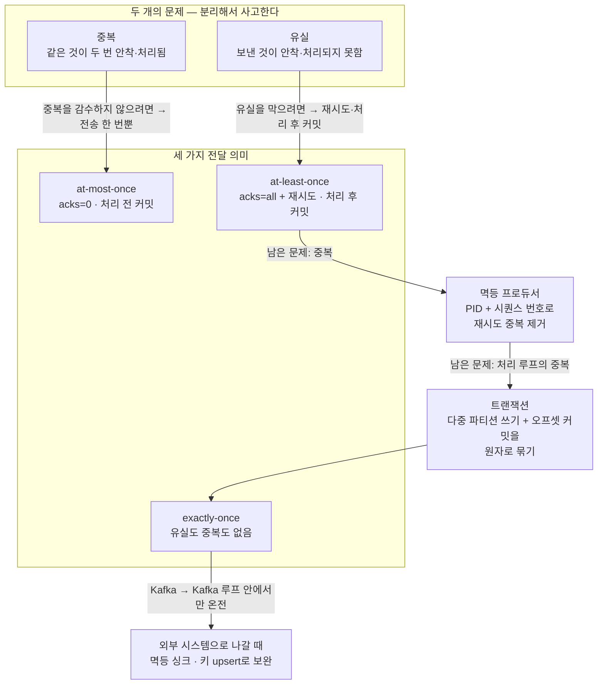
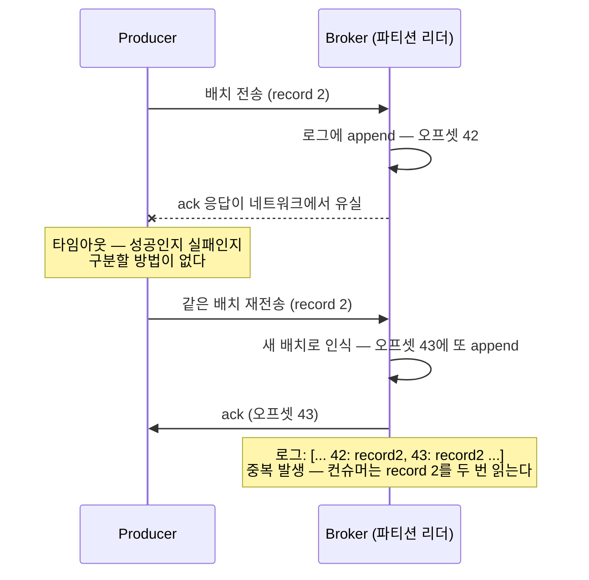
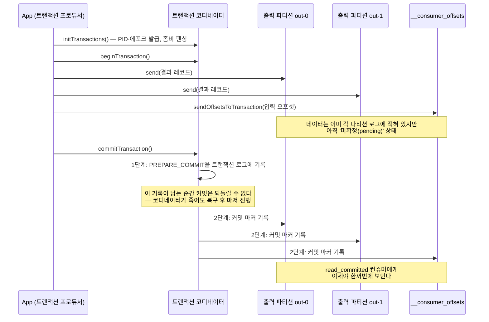

<figure class="post-figure post-figure--header">
<svg role="img" aria-label="세 가지 전달 의미를 세 레인으로 나란히 그린 그림. 각 레인은 왼쪽 Producer가 번호 1·2·3이 붙은 레코드를 가운데 브로커 로그로 보내고 오른쪽 Consumer가 읽는 구조다. 첫 번째 at-most-once 레인에서는 레코드 2가 전송 중 X 표시와 함께 사라져 컨슈머가 1과 3만 받는다 — 유실 가능, 중복 없음. 두 번째 at-least-once 레인에서는 재시도 때문에 레코드 2가 로그에 두 번 적혀 컨슈머가 1, 2, 2, 3을 받는다 — 유실 없음, 중복 가능. 세 번째 exactly-once 레인은 금색으로 강조되어 있고 멱등 프로듀서와 트랜잭션이라는 두 장치를 거쳐 컨슈머가 정확히 1, 2, 3을 한 번씩 받는다 — 유실 없음, 중복 없음." viewBox="0 0 680 330" xmlns="http://www.w3.org/2000/svg">
  <title>세 가지 전달 의미 — at-most-once는 유실, at-least-once는 중복, exactly-once는 둘 다 없음</title>
  <defs>
    <marker id="kfk-s3-arrow" viewBox="0 0 10 10" refX="8" refY="5" markerWidth="6" markerHeight="6" orient="auto-start-reverse">
      <path d="M0,0 L10,5 L0,10 z" fill="var(--secondary-color)"/>
    </marker>
    <marker id="kfk-s3-gold" viewBox="0 0 10 10" refX="8" refY="5" markerWidth="6" markerHeight="6" orient="auto-start-reverse">
      <path d="M0,0 L10,5 L0,10 z" fill="var(--gold)"/>
    </marker>
  </defs>

  <!-- title -->
  <text x="340" y="24" text-anchor="middle" font-size="17" font-weight="800" fill="currentColor" letter-spacing="1.5">DELIVERY GUARANTEES</text>
  <text x="340" y="44" text-anchor="middle" font-size="10.5" font-weight="700" fill="currentColor" opacity="0.72">"유실 없음"과 "중복 없음"은 서로 다른 문제다</text>

  <!-- ===== LANE 1: at-most-once ===== -->
  <text x="30" y="76" text-anchor="start" font-size="10.5" font-weight="800" fill="currentColor">at-most-once</text>
  <text x="650" y="76" text-anchor="end" font-size="9" font-weight="700" fill="var(--accent-color)">유실 가능 · 중복 없음</text>
  <rect x="30" y="84" width="76" height="26" rx="3" fill="var(--bg-light)" stroke="currentColor" stroke-width="2"/>
  <text x="68" y="101" text-anchor="middle" font-size="8.5" font-weight="700" fill="currentColor">Producer</text>
  <line x1="106" y1="97" x2="196" y2="97" stroke="var(--secondary-color)" stroke-width="2" marker-end="url(#kfk-s3-arrow)"/>
  <!-- record 2 dropped in flight -->
  <rect x="136" y="86" width="18" height="18" rx="2" fill="var(--bg-panel)" stroke="var(--accent-color)" stroke-width="1.8"/>
  <text x="145" y="99" text-anchor="middle" font-size="9" font-weight="800" fill="currentColor" opacity="0.6">2</text>
  <g stroke="var(--accent-color)" stroke-width="2.2" stroke-linecap="round">
    <line x1="132" y1="82" x2="158" y2="108"/>
    <line x1="158" y1="82" x2="132" y2="108"/>
  </g>
  <text x="145" y="122" text-anchor="middle" font-size="8" font-weight="700" fill="var(--accent-color)">유실</text>
  <!-- log -->
  <rect x="200" y="84" width="176" height="26" rx="2" fill="var(--bg-panel)" stroke="currentColor" stroke-width="2"/>
  <g stroke="currentColor" stroke-width="1" opacity="0.45">
    <line x1="244" y1="84" x2="244" y2="110"/>
    <line x1="288" y1="84" x2="288" y2="110"/>
    <line x1="332" y1="84" x2="332" y2="110"/>
  </g>
  <g font-size="10" font-weight="800" fill="currentColor" text-anchor="middle">
    <text x="222" y="101">1</text>
    <text x="266" y="101">3</text>
  </g>
  <line x1="376" y1="97" x2="466" y2="97" stroke="var(--secondary-color)" stroke-width="2" marker-end="url(#kfk-s3-arrow)"/>
  <rect x="470" y="84" width="80" height="26" rx="3" fill="var(--bg-light)" stroke="currentColor" stroke-width="2"/>
  <text x="510" y="101" text-anchor="middle" font-size="8.5" font-weight="700" fill="currentColor">Consumer</text>
  <text x="560" y="101" text-anchor="start" font-size="9.5" font-weight="700" fill="currentColor" opacity="0.75">1 · 3</text>

  <!-- ===== LANE 2: at-least-once ===== -->
  <text x="30" y="156" text-anchor="start" font-size="10.5" font-weight="800" fill="currentColor">at-least-once</text>
  <text x="650" y="156" text-anchor="end" font-size="9" font-weight="700" fill="var(--secondary-color)">유실 없음 · 중복 가능</text>
  <rect x="30" y="164" width="76" height="26" rx="3" fill="var(--bg-light)" stroke="currentColor" stroke-width="2"/>
  <text x="68" y="181" text-anchor="middle" font-size="8.5" font-weight="700" fill="currentColor">Producer</text>
  <line x1="106" y1="177" x2="196" y2="177" stroke="var(--secondary-color)" stroke-width="2" marker-end="url(#kfk-s3-arrow)"/>
  <text x="151" y="170" text-anchor="middle" font-size="8" font-weight="700" fill="currentColor" opacity="0.7">재시도</text>
  <!-- log with duplicate -->
  <rect x="200" y="164" width="176" height="26" rx="2" fill="var(--bg-panel)" stroke="currentColor" stroke-width="2"/>
  <g stroke="currentColor" stroke-width="1" opacity="0.45">
    <line x1="244" y1="164" x2="244" y2="190"/>
    <line x1="288" y1="164" x2="288" y2="190"/>
    <line x1="332" y1="164" x2="332" y2="190"/>
  </g>
  <g font-size="10" font-weight="800" fill="currentColor" text-anchor="middle">
    <text x="222" y="181">1</text>
    <text x="266" y="181">2</text>
    <text x="310" y="181">2</text>
    <text x="354" y="181">3</text>
  </g>
  <rect x="290" y="166" width="40" height="22" rx="2" fill="none" stroke="var(--accent-color)" stroke-width="1.8" stroke-dasharray="4 3"/>
  <text x="310" y="204" text-anchor="middle" font-size="8" font-weight="700" fill="var(--accent-color)">중복</text>
  <line x1="376" y1="177" x2="466" y2="177" stroke="var(--secondary-color)" stroke-width="2" marker-end="url(#kfk-s3-arrow)"/>
  <rect x="470" y="164" width="80" height="26" rx="3" fill="var(--bg-light)" stroke="currentColor" stroke-width="2"/>
  <text x="510" y="181" text-anchor="middle" font-size="8.5" font-weight="700" fill="currentColor">Consumer</text>
  <text x="560" y="181" text-anchor="start" font-size="9.5" font-weight="700" fill="currentColor" opacity="0.75">1 · 2 · 2 · 3</text>

  <!-- ===== LANE 3: exactly-once ===== -->
  <text x="30" y="240" text-anchor="start" font-size="10.5" font-weight="800" fill="var(--gold)">exactly-once</text>
  <text x="650" y="240" text-anchor="end" font-size="9" font-weight="700" fill="var(--gold)">유실 없음 · 중복 없음</text>
  <rect x="30" y="248" width="76" height="26" rx="3" fill="var(--bg-light)" stroke="var(--gold)" stroke-width="2.5"/>
  <text x="68" y="265" text-anchor="middle" font-size="8.5" font-weight="700" fill="currentColor">Producer</text>
  <line x1="106" y1="261" x2="196" y2="261" stroke="var(--gold)" stroke-width="2" marker-end="url(#kfk-s3-gold)"/>
  <!-- log exact -->
  <rect x="200" y="248" width="176" height="26" rx="2" fill="var(--bg-panel)" stroke="var(--gold)" stroke-width="2.5"/>
  <g stroke="currentColor" stroke-width="1" opacity="0.45">
    <line x1="244" y1="248" x2="244" y2="274"/>
    <line x1="288" y1="248" x2="288" y2="274"/>
    <line x1="332" y1="248" x2="332" y2="274"/>
  </g>
  <g font-size="10" font-weight="800" fill="currentColor" text-anchor="middle">
    <text x="222" y="265">1</text>
    <text x="266" y="265">2</text>
    <text x="310" y="265">3</text>
  </g>
  <line x1="376" y1="261" x2="466" y2="261" stroke="var(--gold)" stroke-width="2" marker-end="url(#kfk-s3-gold)"/>
  <rect x="470" y="248" width="80" height="26" rx="3" fill="var(--bg-light)" stroke="var(--gold)" stroke-width="2.5"/>
  <text x="510" y="265" text-anchor="middle" font-size="8.5" font-weight="700" fill="currentColor">Consumer</text>
  <text x="560" y="265" text-anchor="start" font-size="9.5" font-weight="700" fill="currentColor" opacity="0.75">1 · 2 · 3</text>
  <!-- two devices label -->
  <g font-size="8.5" font-weight="700" fill="var(--gold)" text-anchor="middle">
    <rect x="176" y="288" width="150" height="20" rx="4" fill="var(--bg-light)" stroke="var(--gold)" stroke-width="1.6"/>
    <text x="251" y="302">멱등 프로듀서 (중복 제거)</text>
    <rect x="356" y="288" width="150" height="20" rx="4" fill="var(--bg-light)" stroke="var(--gold)" stroke-width="1.6"/>
    <text x="431" y="302">트랜잭션 (원자적 쓰기)</text>
  </g>
  <text x="340" y="326" text-anchor="middle" font-size="9" fill="currentColor" opacity="0.72">exactly-once = at-least-once 위에 두 장치를 얹어 중복을 제거한 것</text>
</svg>
<figcaption>세 가지 전달 의미를 한 장으로 — at-most-once는 유실을, at-least-once는 중복을 허용하고, exactly-once는 멱등 프로듀서와 트랜잭션으로 둘 다 제거한다</figcaption>
</figure>

## 들어가며

Kafka로 파이프라인을 짜다 보면 반드시 이 질문에 부딪힙니다 — **"이 메시지, 유실되지는 않나요? 중복되지는 않고요?"** 그리고 이 질문에 "Kafka는 exactly-once를 지원합니다"라고 한 줄로 답하는 순간, 오해가 시작됩니다. [Kafka Essential Curriculum](/2026/07/12/kafka-essential-curriculum.html)이 이 3단계를 "가장 자주 오해되고, 가장 중요한 단계"라고 못 박은 이유가 여기 있습니다. exactly-once는 스위치 하나로 켜지는 기능이 아니라, **프로듀서의 재시도, 브로커의 중복 제거, 컨슈머의 오프셋 커밋 시점, 그리고 트랜잭션이 정확히 맞물릴 때만 성립하는 시스템 속성**이기 때문입니다.

출발점은 문제를 둘로 쪼개는 것입니다. **"유실 없음"과 "중복 없음"은 서로 다른 문제**입니다. 유실은 "보낸 것이 로그에 안착하지 못하거나, 안착했는데 처리되지 못하는" 문제이고, 중복은 "같은 것이 두 번 안착하거나 두 번 처리되는" 문제입니다. 하나를 고치려는 조치(재시도, 처리 후 커밋)가 정확히 다른 하나를 유발한다는 것 — 이 긴장 관계가 이 글 전체의 뼈대입니다.

이 글은 [2단계: 프로듀서 · 컨슈머 · 컨슈머 그룹](/2026/07/15/kafka-producers-consumers-groups.html)의 직접적인 후속편입니다. 2단계에서 `acks`가 처리량과 내구성을 조율한다는 것, 그리고 "오프셋 커밋 시점이 전달 보장과 직결된다"는 복선을 깔아 두었는데, 이번 글이 그 복선을 회수합니다. 프로듀서 쪽에서 `acks`와 재시도가, 컨슈머 쪽에서 커밋 시점이 각각 어떻게 전달 의미를 가르는지 구체적인 실패 시나리오로 해부하고, 그 위에 **멱등 프로듀서**와 **트랜잭션**이라는 두 장치를 얹어 exactly-once가 어디까지, 왜 성립하는지를 끝까지 따라갑니다.

<div class="post-summary-box" markdown="1">

### 📌 이 글에서 다루는 내용

- **세 가지 전달 의미**: at-most-once vs at-least-once vs exactly-once — "유실 없음"과 "중복 없음"을 분리해 사고하는 법, 프로듀서 쪽(`acks`·재시도)과 컨슈머 쪽(오프셋 커밋 시점 — 처리 전 커밋 = at-most-once, 처리 후 커밋 = at-least-once)이 각각 전달 의미를 가르는 구체적 실패 시나리오
- **멱등 프로듀서**: ack 유실이 재시도 중복을 만드는 메커니즘, `enable.idempotence`와 PID(producer id) + 시퀀스 번호로 브로커가 중복을 걸러내는 원리, 그리고 그 한계(단일 세션·단일 파티션 범위, 앱 재시작·앱-레벨 재전송은 못 막음)
- **트랜잭션과 EOS**: `transactional.id`와 좀비 펜싱, 트랜잭션 코디네이터와 2단계 커밋(개요), 여러 파티션 쓰기 + 오프셋 커밋(`sendOffsetsToTransaction`)을 하나의 원자로 묶기, `isolation.level=read_committed`, exactly-once가 왜 consume-process-produce 루프(Kafka→Kafka)에서만 온전히 성립하며 외부 시스템으로 나갈 때는 멱등 싱크·키 upsert로 보완해야 하는지

</div>

## 한눈에 보기 — 두 개의 문제, 세 개의 의미, 두 개의 장치

이 글의 스파인을 한 장으로 그리면 이렇습니다. 유실과 중복이라는 두 문제가 프로듀서·컨슈머 양쪽에서 세 가지 전달 의미를 만들고, 실무 기본값인 at-least-once의 "중복"을 멱등 프로듀서(전송 계층)와 트랜잭션(처리 루프 계층)이 단계적으로 제거해 exactly-once에 도달합니다. 단, 그 보장의 경계는 Kafka 안입니다 — 밖으로 나가는 순간 멱등 싱크가 이어받아야 합니다.



왼쪽 위의 "두 문제"에서 출발해 오른쪽 아래의 "보장의 경계"까지 — 이 경로가 이 글 전체의 좌표축입니다.

## 세 가지 전달 의미 — "유실 없음"과 "중복 없음"은 다른 문제다

### 왜 두 문제를 분리해야 하는가

분산 시스템에서 메시지 전달의 근본 난제는 이것입니다 — **보낸 쪽은 "응답이 안 왔다"는 사실만 알 수 있을 뿐, "전달이 안 됐다"와 "전달은 됐는데 응답이 유실됐다"를 구분할 수 없습니다.** 이 불확실성 앞에서 선택지는 둘뿐입니다. 다시 보내지 않으면(재시도 없음) 전달이 안 된 경우 유실이고, 다시 보내면(재시도) 이미 전달된 경우 중복입니다. 즉 **유실과 중복은 같은 불확실성의 양면**이며, 아무 장치 없이 둘 다 피할 방법은 없습니다.

세 가지 전달 의미는 이 트레이드오프에 이름을 붙인 것입니다.

| 전달 의미 | 유실 | 중복 | 만들어지는 조건 | 적합한 곳 |
| --- | --- | --- | --- | --- |
| **at-most-once** | 가능 | 없음 | 재시도 없이 보내고 잊기, 처리 전 커밋 | 유실보다 중복·지연이 치명적인 메트릭·로그 샘플링 |
| **at-least-once** | 없음 | 가능 | `acks=all` + 재시도, 처리 후 커밋 | **실무 기본값** — 중복은 하류에서 멱등 처리 |
| **exactly-once** | 없음 | 없음 | at-least-once + 멱등 프로듀서 + 트랜잭션 | 집계·과금 등 중복이 곧 오답인 Kafka 내 처리 |

중요한 것은 이 표가 "Kafka의 설정 세 개"가 아니라는 점입니다. 전달 의미는 **프로듀서 쪽과 컨슈머 쪽에서 각각 독립적으로 결정**되고, 파이프라인 전체의 보장은 그중 약한 쪽을 따릅니다. 프로듀서가 exactly-once로 로그에 적어도 컨슈머가 처리 전에 커밋하면 파이프라인은 at-most-once입니다. 양쪽을 따로 보겠습니다.

### 프로듀서 쪽 — acks와 재시도가 가르는 것

[2단계](/2026/07/15/kafka-producers-consumers-groups.html)에서 `acks`가 "브로커가 언제 성공이라 답하는가"를 정한다는 것을 봤습니다. 전달 의미 관점에서 다시 읽으면 이렇습니다.

- **`acks=0`** — 응답을 기다리지 않으므로 실패를 알 방법이 없고, 재시도도 없습니다. 전송 계층에서 **at-most-once**입니다.
- **`acks=1`** — 리더 안착까지는 확인하지만, 리더가 팔로워 복제 전에 죽으면 안착한 레코드도 유실될 수 있습니다. "대체로 안 잃지만 보장은 아닌" 중간 지대입니다.
- **`acks=all` + `retries`** — ISR 전체 복제까지 확인하고 실패하면 재시도합니다. 유실은 막지만, 이제 **재시도가 중복을 만들 수 있습니다**. 전송 계층에서 **at-least-once**입니다.

유실을 막는 쪽의 표준 설정을 먼저 적어 두면 이렇습니다.

```properties
# producer.properties — 유실을 막는 at-least-once 프로듀서의 골격
acks=all                      # ISR 전체 복제까지 확인하고 성공으로 친다
retries=2147483647            # 일시 장애는 재시도로 흡수 (기본값)
delivery.timeout.ms=120000    # 재시도를 포함한 전송 전체의 시간 상한
min.insync.replicas=2         # (토픽/브로커 설정) acks=all이 실제로 의미를 갖는 최소 복제 수
```

이제 유실은 막았습니다. 그런데 이 구성이 중복을 만드는 지점이 정확히 어디인지 — **ack 유실**입니다. 브로커는 레코드를 로그에 잘 적었는데, 성공 응답이 네트워크에서 사라지거나 타임아웃에 걸리면, 프로듀서는 "실패했나 보다"라고 판단해 같은 배치를 다시 보냅니다. 브로커 입장에서는 멀쩡한 새 배치이므로 로그에 또 적습니다.



핵심을 다시 짚으면 — **중복은 버그가 아니라, 유실을 막기 위해 재시도를 켠 대가**입니다. `retries=0`으로 중복을 피하면 유실로 되돌아갈 뿐입니다. 이 재시도 중복을 "재시도를 끄지 않고" 제거하는 장치가 다음 섹션의 멱등 프로듀서입니다.

### 컨슈머 쪽 — 오프셋 커밋 시점이 가르는 것

컨슈머 쪽의 결정 변수는 단 하나, **"처리(process)와 오프셋 커밋(commit) 중 무엇을 먼저 하는가"**입니다. 2단계에서 오프셋 커밋이 "여기까지 읽었다"는 기록이고 컨슈머가 죽으면 마지막 커밋 지점부터 다시 시작한다는 것을 봤습니다. 그 재시작 지점과 실제 처리 지점의 어긋남이 전달 의미를 만듭니다.

**시나리오 A — 처리 전 커밋 (= at-most-once).** 오프셋 100~104를 poll한 컨슈머가 먼저 105를 커밋하고 처리를 시작합니다. 102를 처리하던 중 프로세스가 죽으면, 리밸런싱 후 새 컨슈머는 커밋된 105부터 읽습니다. **102·103·104는 로그에는 있지만 영원히 처리되지 않습니다** — 처리 관점의 유실입니다. `enable.auto.commit=true`의 자동 커밋도 "poll 주기에 맞춰 백그라운드에서 커밋"이므로, 처리가 끝나기 전에 커밋이 먼저 나가는 이 패턴에 빠질 수 있습니다.

**시나리오 B — 처리 후 커밋 (= at-least-once).** 같은 상황에서 처리를 모두 마친 뒤 커밋하도록 바꾸면, 102 처리 중 죽었을 때 커밋은 아직 100에 머물러 있으므로 새 컨슈머는 100부터 다시 읽습니다. 유실은 없습니다. 대신 **100·101은 이미 처리됐는데 또 처리됩니다** — 중복입니다.

confluent-kafka(Python)로 두 패턴의 차이를 코드로 보면 이렇습니다.

```python
from confluent_kafka import Consumer

consumer = Consumer({
    "bootstrap.servers": "broker:9092",
    "group.id": "order-pipeline",
    "enable.auto.commit": False,   # 커밋 시점을 코드가 직접 통제한다
    "auto.offset.reset": "earliest",
})
consumer.subscribe(["orders"])

while True:
    msg = consumer.poll(1.0)
    if msg is None or msg.error():
        continue

    # (안티패턴) 여기서 consumer.commit(msg)을 먼저 부르면:
    #   커밋 후 process()가 죽었을 때 이 메시지는 다시 오지 않는다 → at-most-once

    process(msg)                    # 1. 먼저 처리하고
    consumer.commit(msg)            # 2. 처리가 끝난 뒤에 커밋한다 → at-least-once
```

**처리 후 커밋 + 재시작 시 재처리 감수** — 이것이 컨슈머 쪽 at-least-once이고, Kafka 파이프라인의 사실상 표준 출발점입니다.

### 실무의 기본값 — at-least-once, 그리고 남는 숙제

양쪽의 선택을 매트릭스로 놓으면 파이프라인 전체의 전달 의미가 한눈에 정리됩니다.

| 프로듀서 \ 컨슈머 | 처리 전 커밋 | 처리 후 커밋 |
| --- | --- | --- |
| **`acks=0` (재시도 없음)** | at-most-once — 양쪽 모두 유실 가능 | at-most-once — 전송 유실은 못 되살린다 |
| **`acks=all` + 재시도** | at-most-once — 처리 유실이 남는다 | **at-least-once — 실무 표준 출발점** |

파이프라인의 보장이 **약한 쪽을 따른다**는 것이 표의 요지입니다. 한쪽만 강화해서는 대각선 오른쪽 아래 칸에 도달할 수 없습니다. 그리고 그 칸 — 실무 표준 구성 — 에서도 유실만 사라졌을 뿐, 중복은 **양쪽에서** 생길 수 있습니다. 프로듀서 재시도가 로그에 만드는 중복, 그리고 컨슈머 재시작이 처리 계층에 만드는 중복입니다.

이 두 중복의 성격이 다르다는 것이 이후 전개의 핵심입니다. **전송 중복**(같은 레코드가 로그에 두 번)은 브로커가 걸러낼 수 있고 — 멱등 프로듀서 — **처리 중복**(같은 레코드가 두 번 처리되어 결과가 두 번 쓰임)은 처리와 커밋을 원자로 묶어야 사라집니다 — 트랜잭션. 순서대로 보겠습니다.

## 멱등 프로듀서 — 전송 계층의 중복을 브로커가 걸러낸다

### 원리 — PID와 시퀀스 번호

재시도 중복의 본질은 "브로커가 두 배치를 구분할 수 없다"는 것입니다. 그렇다면 해법은 자명합니다 — **배치에 식별자를 붙여, 브로커가 '이건 이미 받은 것'임을 알게 하면 됩니다.** 멱등 프로듀서(idempotent producer)가 정확히 이 일을 합니다.

- 프로듀서가 시작할 때 브로커로부터 고유한 **PID(producer id)** 를 발급받습니다.
- 이후 보내는 모든 배치에 **(PID, 파티션별 시퀀스 번호)** 를 실어 보냅니다. 시퀀스 번호는 파티션마다 0부터 단조 증가합니다.
- 브로커는 파티션별로 각 PID의 마지막 시퀀스 번호를 기억하고, **이미 받은 시퀀스 번호의 배치가 다시 오면 로그에 적지 않고 성공 ack만 돌려줍니다.** 순서가 건너뛴 배치(빠진 시퀀스)는 에러로 거부해 파티션 내 순서도 지켜 줍니다.

앞의 ack 유실 시나리오를 다시 돌려 보면 — 프로듀서가 seq=2 배치를 재전송해도, 브로커는 "이 PID의 이 파티션은 seq=2까지 이미 적었다"는 것을 알고 중복 append 없이 ack만 반환합니다. **재시도는 그대로 살아 있고(유실 방지), 중복만 사라집니다(exactly-once 전송).**

<figure class="post-figure">
<svg role="img" aria-label="멱등 프로듀서의 중복 제거 원리를 그린 개념도. 왼쪽에 PID 42를 발급받은 프로듀서가 있고, 파티션 P0으로 시퀀스 번호 0·1·2가 붙은 배치를 차례로 보낸다. 오른쪽 브로커의 파티션 로그에는 seq 0·1·2가 적혀 있고, 브로커는 'PID 42의 마지막 seq = 2'를 기억한다. 아래쪽에서 ack 유실로 프로듀서가 seq 2 배치를 재전송하지만, 브로커가 이미 받은 시퀀스임을 확인하고 로그에 적지 않은 채 ack만 돌려주는 모습이 X 표시된 점선 화살표와 '중복 아님 — ack만 반환'이라는 설명으로 표현되어 있다." viewBox="0 0 680 260" xmlns="http://www.w3.org/2000/svg">
  <title>멱등 프로듀서 — PID + 시퀀스 번호로 브로커가 재시도 중복을 걸러낸다</title>
  <defs>
    <marker id="kfk-s3-idem-arrow" viewBox="0 0 10 10" refX="8" refY="5" markerWidth="6" markerHeight="6" orient="auto-start-reverse">
      <path d="M0,0 L10,5 L0,10 z" fill="var(--secondary-color)"/>
    </marker>
    <marker id="kfk-s3-idem-acc" viewBox="0 0 10 10" refX="8" refY="5" markerWidth="6" markerHeight="6" orient="auto-start-reverse">
      <path d="M0,0 L10,5 L0,10 z" fill="var(--accent-color)"/>
    </marker>
  </defs>

  <text x="340" y="24" text-anchor="middle" font-size="11" font-weight="700" fill="currentColor" opacity="0.72">브로커는 (PID, 파티션)마다 마지막 시퀀스 번호를 기억한다</text>

  <!-- producer -->
  <rect x="30" y="52" width="130" height="70" rx="5" fill="var(--bg-light)" stroke="currentColor" stroke-width="2"/>
  <text x="95" y="76" text-anchor="middle" font-size="10" font-weight="800" fill="currentColor">Producer</text>
  <rect x="48" y="88" width="94" height="22" rx="3" fill="var(--bg-panel)" stroke="var(--gold)" stroke-width="1.8"/>
  <text x="95" y="103" text-anchor="middle" font-size="9" font-weight="800" fill="var(--gold)">PID = 42</text>

  <!-- normal sends -->
  <g stroke="var(--secondary-color)" stroke-width="2" fill="none">
    <line x1="160" y1="70" x2="352" y2="70" marker-end="url(#kfk-s3-idem-arrow)"/>
  </g>
  <g font-size="8.5" font-weight="700" fill="currentColor" text-anchor="middle" opacity="0.8">
    <text x="256" y="62">배치 전송 — (PID 42, seq 0) → (seq 1) → (seq 2)</text>
  </g>

  <!-- broker -->
  <rect x="356" y="44" width="294" height="118" rx="5" fill="var(--bg-light)" stroke="currentColor" stroke-width="2"/>
  <text x="503" y="64" text-anchor="middle" font-size="10" font-weight="800" fill="currentColor">Broker — 파티션 P0</text>
  <!-- log cells -->
  <rect x="380" y="76" width="180" height="26" rx="2" fill="var(--bg-panel)" stroke="currentColor" stroke-width="2"/>
  <g stroke="currentColor" stroke-width="1" opacity="0.45">
    <line x1="440" y1="76" x2="440" y2="102"/>
    <line x1="500" y1="76" x2="500" y2="102"/>
  </g>
  <g font-size="9" font-weight="800" fill="currentColor" text-anchor="middle">
    <text x="410" y="93">seq 0</text>
    <text x="470" y="93">seq 1</text>
    <text x="530" y="93">seq 2</text>
  </g>
  <rect x="380" y="116" width="246" height="26" rx="3" fill="var(--bg-panel)" stroke="var(--gold)" stroke-width="1.8"/>
  <text x="503" y="133" text-anchor="middle" font-size="9" font-weight="800" fill="var(--gold)">기억: PID 42의 마지막 seq = 2</text>

  <!-- retry (duplicate) -->
  <line x1="160" y1="196" x2="352" y2="196" stroke="var(--accent-color)" stroke-width="2" stroke-dasharray="6 4" marker-end="url(#kfk-s3-idem-acc)"/>
  <text x="256" y="188" text-anchor="middle" font-size="8.5" font-weight="700" fill="var(--accent-color)">ack 유실 → (PID 42, seq 2) 재전송</text>
  <rect x="30" y="182" width="130" height="30" rx="5" fill="var(--bg-light)" stroke="currentColor" stroke-width="2"/>
  <text x="95" y="201" text-anchor="middle" font-size="9" font-weight="700" fill="currentColor">재시도</text>

  <!-- broker verdict -->
  <rect x="356" y="180" width="294" height="34" rx="5" fill="var(--bg-panel)" stroke="var(--accent-color)" stroke-width="2"/>
  <text x="503" y="195" text-anchor="middle" font-size="9" font-weight="800" fill="var(--accent-color)">seq 2는 이미 받았다 → append 하지 않음</text>
  <text x="503" y="208" text-anchor="middle" font-size="8.5" font-weight="700" fill="currentColor" opacity="0.8">로그는 그대로, 프로듀서에게 성공 ack만 반환</text>

  <text x="340" y="244" text-anchor="middle" font-size="9" fill="currentColor" opacity="0.72">재시도(유실 방지)는 그대로 두고, 중복 append만 제거한다 — 전송 계층의 exactly-once</text>
</svg>
<figcaption>멱등 프로듀서의 원리 — PID + 파티션별 시퀀스 번호를 브로커가 대조해, 재시도로 다시 온 배치를 로그에 적지 않고 ack만 돌려준다</figcaption>
</figure>

### 설정 — enable.idempotence 하나, 그리고 전제 조건

설정 자체는 한 줄입니다.

```properties
# producer.properties — 멱등 프로듀서
enable.idempotence=true

# 멱등성이 요구하는 전제 (어기면 ConfigException)
acks=all                                  # 반드시 all
retries=2147483647                        # 0이면 안 됨 — 재시도가 있어야 멱등성이 의미 있다
max.in.flight.requests.per.connection=5   # 5 이하 — 브로커가 최근 5개 배치의 seq를 추적한다
```

세 가지 짚어 둘 점이 있습니다. 첫째, **Kafka 3.0부터는 `enable.idempotence=true`가 기본값**입니다. 최신 클라이언트를 쓴다면 이미 켜져 있을 가능성이 높습니다 — 다만 `acks`나 `max.in.flight`를 직접 만졌다면 조건이 깨져 꺼졌을 수 있으니 확인이 필요합니다. 둘째, 멱등성 이전에는 재시도 시 순서 보장을 위해 `max.in.flight=1`로 처리량을 희생해야 했지만, 멱등 프로듀서는 시퀀스 번호로 순서를 검증하므로 **in-flight 5개까지 파이프라이닝하면서도 파티션 내 순서가 보장**됩니다. 셋째, 오버헤드는 배치당 몇 바이트의 메타데이터뿐이라 **켜지 않을 이유가 사실상 없습니다.**

### 한계 — 멱등 프로듀서가 못 막는 중복

여기까지만 보면 exactly-once가 끝난 것 같지만, 멱등 프로듀서의 보장 범위는 정확히 **"한 프로듀서 세션이, 한 파티션에, 전송 계층에서"** 입니다. 경계 바깥의 중복 세 가지는 그대로 남습니다.

- **단일 세션 범위**: PID는 프로듀서 프로세스가 살아 있는 동안만 유효합니다. **앱이 재시작하면 새 PID를 받으므로**, 재시작 전에 보낸 것과 같은 레코드를 다시 보내도 브로커는 다른 프로듀서의 새 레코드로 취급합니다. "보내고 죽고, 재기동 후 또 보내는" 패턴의 중복은 못 막습니다.
- **단일 파티션 범위**: 시퀀스 번호는 파티션별로 관리됩니다. 여러 파티션에 걸친 쓰기를 "모두 성공 아니면 모두 취소"로 묶는 원자성은 제공하지 않습니다.
- **앱-레벨 재전송**: 걸러지는 것은 프로듀서 클라이언트 **내부의** 자동 재시도뿐입니다. 애플리케이션 코드가 `send()`를 두 번 부르면(예: 컨슈머가 재시작 후 같은 입력을 재처리해서 같은 결과를 또 produce하면) 그것은 시퀀스 번호가 다른 정상적인 새 레코드입니다.

세 번째 한계가 결정적입니다. 앞 섹션의 at-least-once 컨슈머는 **재시작 시 재처리를 전제**로 하는데, 그 재처리가 만들어 내는 produce가 바로 "앱-레벨 재전송"이기 때문입니다. 처리 파이프라인 전체의 중복을 없애려면, 출력 쓰기와 입력 오프셋 커밋을 **하나의 원자적 단위**로 묶어야 합니다. 그것이 트랜잭션입니다.

## 트랜잭션과 EOS — 처리 루프를 하나의 원자로

### 문제의 재정의 — consume-process-produce 루프

스트림 처리의 기본 골격은 **consume-process-produce 루프**입니다: 입력 토픽에서 읽고(consume), 변환·집계하고(process), 출력 토픽에 쓰고(produce), 입력 오프셋을 커밋한다. 이 루프에서 exactly-once가 성립하려면 다음 세 쓰기가 **전부 반영되거나 전부 취소**되어야 합니다.

1. 출력 토픽(들)에 대한 produce — 여러 파티션에 걸칠 수 있음
2. 입력 오프셋의 커밋
3. (이 둘 사이 어디서 죽어도) 부분 반영이 없을 것

여기서 Kafka의 우아한 통찰이 나옵니다 — **오프셋 커밋도 사실은 토픽 쓰기입니다.** 컨슈머 그룹의 오프셋은 `__consumer_offsets`라는 내부 토픽에 저장되므로, "출력 produce + 오프셋 커밋"은 결국 **"여러 토픽 파티션에 대한 쓰기 묶음"** 이라는 하나의 문제로 환원됩니다. 여러 파티션 쓰기를 원자로 묶는 장치만 있으면 되는 것입니다.

### transactional.id — 세션을 넘는 정체성과 좀비 펜싱

멱등 프로듀서의 첫 번째 한계(단일 세션)를 깨는 열쇠가 `transactional.id`입니다. 애플리케이션이 지정하는 이 논리적 이름은 **프로세스 재시작을 넘어 유지**되며, 브로커는 이 이름으로 PID를 이어서 발급하고 **에포크(epoch)** 를 하나 올립니다.

에포크가 해결하는 문제가 **좀비 펜싱(zombie fencing)** 입니다. 같은 `transactional.id`의 인스턴스가 GC 멈춤 등으로 죽은 줄 알았다가 되살아나(좀비), 이미 그 자리를 이어받은 새 인스턴스와 동시에 쓰는 상황 — 브로커는 낮은 에포크의 요청을 거부해, **어느 순간에도 하나의 transactional.id로는 하나의 프로듀서만 쓸 수 있게** 보장합니다. 트랜잭션의 원자성은 이 펜싱 위에서만 안전합니다.

```properties
# producer.properties — 트랜잭션 프로듀서
transactional.id=order-enricher-0    # 인스턴스마다 고유·재시작 후에도 동일하게
enable.idempotence=true              # transactional.id 지정 시 자동으로 요구됨
acks=all
```

### 트랜잭션 코디네이터와 2단계 커밋 — 개요

원자성을 실제로 집행하는 것은 브로커 쪽의 **트랜잭션 코디네이터(transaction coordinator)** 입니다. 각 `transactional.id`마다 담당 코디네이터가 정해지고, 트랜잭션의 상태는 `__transaction_state` 내부 토픽에 — 역시 로그로 — 기록됩니다. 커밋은 개요 수준에서 **2단계**로 진행됩니다.



눈여겨볼 지점은 두 가지입니다. 첫째, 트랜잭션 중의 레코드는 **각 파티션 로그에 즉시 적히되 "미확정" 상태**이고, 커밋/중단 여부는 나중에 같은 로그에 적히는 **컨트롤 레코드(커밋/중단 마커)** 가 결정합니다 — 어디까지나 로그다운 방식입니다. 둘째, 1단계에서 `PREPARE_COMMIT`이 트랜잭션 로그에 기록되는 순간 결정은 확정되며, 이후 코디네이터가 죽어도 복구 후 마커 전파를 마저 진행합니다. 중간에 앱이 죽으면 새 인스턴스의 `initTransactions()`가 미완의 트랜잭션을 **중단(abort)** 시키고, 미확정 레코드들은 중단 마커와 함께 "없던 일"이 됩니다.

### 코드로 보는 consume-process-produce — sendOffsetsToTransaction

Java 클라이언트로 루프 전체를 보면 이렇습니다. 핵심은 **오프셋 커밋을 `consumer.commitSync()`가 아니라 `producer.sendOffsetsToTransaction()`으로 — 즉 트랜잭션 안에서 — 한다**는 것입니다.

```java
// 트랜잭션 프로듀서 + read_committed 컨슈머로 구성하는 EOS 루프
Properties pp = new Properties();
pp.put("bootstrap.servers", "broker:9092");
pp.put("transactional.id", "order-enricher-0");
pp.put("key.serializer", StringSerializer.class.getName());
pp.put("value.serializer", StringSerializer.class.getName());
KafkaProducer<String, String> producer = new KafkaProducer<>(pp);

Properties cp = new Properties();
cp.put("bootstrap.servers", "broker:9092");
cp.put("group.id", "order-enricher");
cp.put("enable.auto.commit", "false");      // 커밋은 트랜잭션이 대신한다
cp.put("isolation.level", "read_committed"); // 상류의 미확정·중단 레코드를 읽지 않는다
cp.put("key.deserializer", StringDeserializer.class.getName());
cp.put("value.deserializer", StringDeserializer.class.getName());
KafkaConsumer<String, String> consumer = new KafkaConsumer<>(cp);
consumer.subscribe(List.of("orders"));

producer.initTransactions();  // PID·에포크 발급 + 이전 세대의 미완 트랜잭션 정리

while (true) {
    ConsumerRecords<String, String> records = consumer.poll(Duration.ofMillis(500));
    if (records.isEmpty()) continue;

    producer.beginTransaction();
    try {
        for (ConsumerRecord<String, String> rec : records) {
            producer.send(new ProducerRecord<>("orders-enriched",
                    rec.key(), enrich(rec.value())));   // 1. 출력 produce
        }
        // 2. 입력 오프셋 커밋 — 같은 트랜잭션 안에서
        producer.sendOffsetsToTransaction(
                offsetsToCommit(records),               // 파티션별 "다음 읽을 오프셋"
                consumer.groupMetadata());
        producer.commitTransaction();                   // 3. 둘을 한 번에 확정
    } catch (KafkaException e) {
        producer.abortTransaction();                    // 부분 반영 없이 전부 취소
        // seek을 마지막 커밋 지점으로 되돌리고 루프 계속 — 재처리해도 결과는 한 번만 반영된다
    }
}
```

실패 시나리오를 대입해 보면 원자성의 의미가 선명해집니다. **커밋 직전에 앱이 죽으면?** 출력 레코드도, 오프셋 커밋도 모두 미확정 상태로 남고, 재시작한 인스턴스의 `initTransactions()`가 그 트랜잭션을 중단시킵니다. 컨슈머는 이전 커밋 지점부터 재처리하고, 재처리로 만들어지는 출력은 새 트랜잭션으로 다시 쓰입니다 — 중단된 이전 출력은 `read_committed` 하류에 영영 보이지 않으므로, **재처리했지만 결과는 정확히 한 번만 반영**됩니다. at-least-once의 재처리는 그대로 두고, 그 **부작용의 가시성**을 원자로 묶어 exactly-once를 만드는 구조입니다.

### isolation.level=read_committed — 읽는 쪽의 협조

트랜잭션은 쓰는 쪽 혼자 완성하지 못합니다. 하류 컨슈머가 기본값 `read_uncommitted`로 읽으면 미확정·중단된 레코드까지 그대로 보이므로, EOS 파이프라인의 하류는 반드시 **`isolation.level=read_committed`** 로 설정해야 합니다.

```python
# confluent-kafka (Python) — EOS 파이프라인의 하류 컨슈머
consumer = Consumer({
    "bootstrap.servers": "broker:9092",
    "group.id": "downstream-aggregator",
    "isolation.level": "read_committed",  # 커밋 마커가 찍힌 레코드까지만 읽는다
    "enable.auto.commit": False,
})
```

`read_committed` 컨슈머는 파티션의 **LSO(last stable offset)** — 첫 미결(open) 트랜잭션 직전 — 까지만 읽습니다. 대가는 약간의 지연입니다: 어떤 트랜잭션이 오래 열려 있으면 그 뒤의 (커밋된) 레코드도 함께 대기합니다. 트랜잭션을 짧게 유지하는 것이 EOS 파이프라인의 지연을 좌우하는 이유입니다. 참고로 Kafka Streams에서는 이 전체 배선이 `processing.guarantee=exactly_once_v2` 설정 하나로 켜집니다 — 내부적으로 지금까지 본 것과 같은 트랜잭션 기계를 사용합니다(6단계에서 다시 만납니다).

### exactly-once의 경계 — Kafka 안에서만 온전하다

마지막으로 가장 중요한 실무 결론입니다. 지금까지의 exactly-once는 **입력도 출력도 오프셋도 전부 Kafka 토픽이기 때문에** 성립했습니다. 세 쓰기가 모두 "Kafka 파티션 로그에 대한 쓰기"였기에 하나의 트랜잭션 코디네이터가 원자성을 집행할 수 있었던 것입니다. 즉 **EOS는 consume-process-produce 루프(Kafka→Kafka)의 속성**이지, 파이프라인 끝까지 따라가는 마법이 아닙니다.

출력이 Kafka 밖 — PostgreSQL, Elasticsearch, S3, 외부 API — 으로 나가는 순간, 그 쓰기는 Kafka 트랜잭션에 묶을 수 없고, "외부 쓰기 성공 + 오프셋 커밋"의 원자성 문제가 그대로 되살아납니다. 이때의 실무 해법은 트랜잭션이 아니라 **멱등 싱크(idempotent sink)** 입니다.

- **키 기반 upsert**: 레코드의 자연 키(주문 ID 등)를 외부 저장소의 기본 키로 삼아 `INSERT ... ON CONFLICT DO UPDATE`(또는 문서 ID upsert)로 씁니다. 같은 레코드가 두 번 와도 결과는 한 번 쓴 것과 동일합니다 — **at-least-once 전달 + 멱등 쓰기 = 실질적 exactly-once 결과**.
- **처리 결과가 멱등이 되도록 설계**: "잔액 +100"(재처리 시 오답) 대신 "주문 X의 금액은 100"(재처리해도 같은 결과)처럼, 델타가 아닌 **상태 선언**으로 쓰는 습관입니다.
- 외부 DB로의 정합 전파가 목적이라면, 애초에 DB 트랜잭션 로그를 진실의 원천으로 삼는 **CDC**(4단계)가 더 곧은 길일 때도 많습니다.

정리하면 — **Kafka 안에서는 트랜잭션으로, Kafka 밖으로는 멱등성으로.** 이 경계를 아는 것이 "exactly-once를 지원하나요?"라는 질문에 정확히 답하는 방법입니다.

## 정리

Kafka 신뢰성의 한 막을 정복했습니다. 요점을 정리하면 다음과 같습니다.

- **유실과 중복은 같은 불확실성의 양면이다**: 응답이 없을 때 재시도하지 않으면 유실(at-most-once), 재시도하면 중복(at-least-once)이다. 전달 의미는 프로듀서 쪽(`acks`·재시도)과 컨슈머 쪽(오프셋 커밋 시점)에서 각각 결정되며, 파이프라인 전체는 약한 쪽을 따른다.
- **컨슈머의 전달 의미는 커밋 시점이 가른다**: 처리 전 커밋 = at-most-once(죽으면 미처리 구간 유실), 처리 후 커밋 = at-least-once(죽으면 재처리 중복). 실무 표준 출발점은 `acks=all` + 재시도 + 처리 후 커밋의 at-least-once다.
- **멱등 프로듀서는 전송 계층의 중복을 지운다**: PID + 파티션별 시퀀스 번호로 브로커가 재시도 배치를 식별해 append 없이 ack만 돌려준다. Kafka 3.0부터 기본값이고 켜지 않을 이유가 없지만, 보장 범위는 **단일 세션·단일 파티션·클라이언트 내부 재시도**뿐 — 앱 재시작과 앱-레벨 재전송은 못 막는다.
- **트랜잭션은 처리 루프를 원자로 묶는다**: 오프셋 커밋도 토픽(`__consumer_offsets`) 쓰기라는 통찰 위에서, `transactional.id`(좀비 펜싱) + 코디네이터의 2단계 커밋 + `sendOffsetsToTransaction()`으로 "출력 produce + 오프셋 커밋"을 전부-아니면-전무로 만든다. 하류는 `isolation.level=read_committed`로 협조해야 완성된다.
- **EOS는 Kafka→Kafka 루프의 속성이다**: consume-process-produce 안에서만 온전히 성립하고, 외부 시스템으로 나가는 쓰기는 트랜잭션에 묶이지 않는다. 경계 밖은 **멱등 싱크·키 upsert·상태 선언형 쓰기**로 실질적 exactly-once를 만든다.

이제 로그는 유실도 중복도 다스릴 수 있는, 신뢰할 수 있는 기반이 되었습니다. 다음 질문은 자연스럽게 이것입니다 — **이 신뢰할 수 있는 로그를 바깥 세계의 시스템들과 어떻게 이을 것인가?** 프로듀서·컨슈머를 매번 손으로 짜는 대신 선언적 설정으로 소스와 싱크를 운영하는 Kafka Connect, 그리고 운영 DB의 변경을 이벤트 스트림으로 바꾸는 CDC·Debezium이 다음 단계의 주제입니다.

### 다음 학습 (Next Learning)

- [Kafka Connect: CDC와 Debezium](/2026/07/15/kafka-connect-cdc.html) — 4단계: 신뢰할 수 있는 로그를 외부 시스템과 잇기
- [Kafka 프로듀서 · 컨슈머 · 컨슈머 그룹](/2026/07/15/kafka-producers-consumers-groups.html) — 2단계 복습: acks·오프셋 커밋의 토대 다시 보기
- [Kafka Essential Curriculum](/2026/07/12/kafka-essential-curriculum.html) — 시리즈 로드맵으로 돌아가 진행 상황 확인하기
