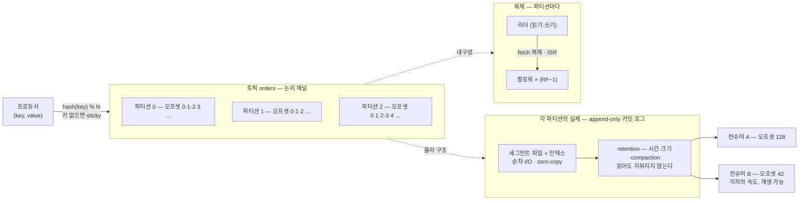
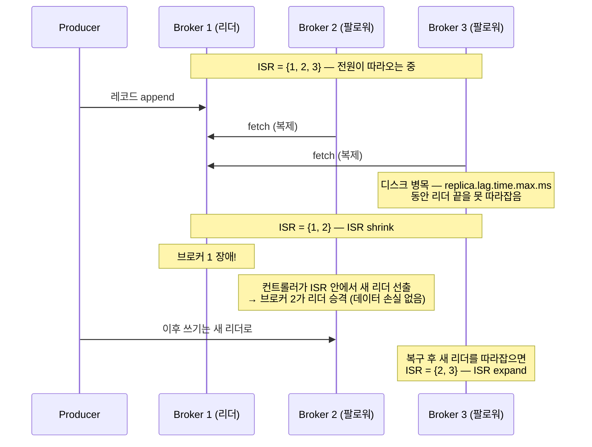

<figure class="post-figure post-figure--header">
<svg role="img" aria-label="분산 로그·토픽·파티션을 한 장으로 정리한 그림. 위쪽은 토픽 orders의 논리 구조로, 왼쪽 Producer가 파티션 P0·P1·P2로 나뉜 append-only 커밋 로그에 기록하고, 각 파티션 칸에는 오프셋 0부터 번호가 붙어 있으며, P0의 오른쪽 끝에는 append를 뜻하는 점선 칸과 화살표가 붙어 로그가 뒤로만 자란다는 것을 보여 준다. 아래쪽은 물리 배치로, 브로커 1·2·3 세 상자에 P0의 리더가 브로커 1에, 팔로워가 브로커 2·3에 놓여 있고, 리더에서 팔로워로 향하는 복제(fetch) 화살표와 세 복제본을 묶는 ISR 표시가 있다." viewBox="0 0 680 342" xmlns="http://www.w3.org/2000/svg">
  <title>분산 로그 · 토픽 · 파티션 — append-only 커밋 로그와 리더/팔로워 복제</title>
  <defs>
    <marker id="kfk-s1h-arrow" viewBox="0 0 10 10" refX="8" refY="5" markerWidth="6" markerHeight="6" orient="auto-start-reverse">
      <path d="M0,0 L10,5 L0,10 z" fill="var(--secondary-color)"/>
    </marker>
    <marker id="kfk-s1h-gold" viewBox="0 0 10 10" refX="8" refY="5" markerWidth="6" markerHeight="6" orient="auto-start-reverse">
      <path d="M0,0 L10,5 L0,10 z" fill="var(--gold)"/>
    </marker>
  </defs>

  <!-- title -->
  <text x="340" y="24" text-anchor="middle" font-size="17" font-weight="800" fill="currentColor" letter-spacing="1.5">DISTRIBUTED LOG · TOPICS · PARTITIONS</text>
  <text x="340" y="44" text-anchor="middle" font-size="10.5" font-weight="700" fill="currentColor" opacity="0.72">토픽은 파티션으로 쪼개지고, 각 파티션은 뒤로만 자라는 커밋 로그다</text>

  <!-- ===== SECTION A: logical structure ===== -->
  <text x="30" y="68" text-anchor="start" font-size="10" font-weight="700" fill="currentColor" opacity="0.72">논리 구조 — 토픽 orders, 파티션별 append-only 로그와 오프셋</text>

  <!-- producer -->
  <rect x="24" y="108" width="80" height="30" rx="4" fill="var(--bg-light)" stroke="currentColor" stroke-width="2"/>
  <text x="64" y="127" text-anchor="middle" font-size="9" font-weight="700" fill="currentColor">Producer</text>
  <g stroke="var(--secondary-color)" stroke-width="2" fill="none">
    <line x1="104" y1="115" x2="142" y2="93" marker-end="url(#kfk-s1h-arrow)"/>
    <line x1="104" y1="123" x2="142" y2="127" marker-end="url(#kfk-s1h-arrow)"/>
    <line x1="104" y1="131" x2="142" y2="161" marker-end="url(#kfk-s1h-arrow)"/>
  </g>
  <text x="64" y="152" text-anchor="middle" font-size="8" fill="currentColor" opacity="0.72">hash(key) % 3</text>

  <!-- partition labels -->
  <g font-size="9" font-weight="700" fill="currentColor" text-anchor="middle" opacity="0.85">
    <text x="160" y="97">P0</text>
    <text x="160" y="131">P1</text>
    <text x="160" y="165">P2</text>
  </g>

  <!-- partition rows -->
  <g>
    <rect x="176" y="82" width="280" height="22" rx="2" fill="var(--bg-panel)" stroke="currentColor" stroke-width="2"/>
    <rect x="176" y="116" width="280" height="22" rx="2" fill="var(--bg-panel)" stroke="currentColor" stroke-width="2"/>
    <rect x="176" y="150" width="280" height="22" rx="2" fill="var(--bg-panel)" stroke="currentColor" stroke-width="2"/>
  </g>
  <!-- cell dividers -->
  <g stroke="currentColor" stroke-width="1" opacity="0.45">
    <line x1="232" y1="82" x2="232" y2="172"/>
    <line x1="288" y1="82" x2="288" y2="172"/>
    <line x1="344" y1="82" x2="344" y2="172"/>
    <line x1="400" y1="82" x2="400" y2="172"/>
  </g>
  <!-- offsets on P0 -->
  <g font-size="9.5" font-weight="700" fill="currentColor" text-anchor="middle" opacity="0.7">
    <text x="204" y="97">0</text><text x="260" y="97">1</text><text x="316" y="97">2</text><text x="372" y="97">3</text><text x="428" y="97">4</text>
  </g>
  <text x="176" y="76" text-anchor="start" font-size="8.5" font-weight="700" fill="currentColor" opacity="0.7">오프셋 →</text>

  <!-- append cell at tail of P0 -->
  <rect x="460" y="82" width="52" height="22" rx="2" fill="none" stroke="var(--gold)" stroke-width="2" stroke-dasharray="4 3"/>
  <text x="486" y="97" text-anchor="middle" font-size="9" font-weight="700" fill="var(--gold)">5</text>
  <line x1="516" y1="93" x2="548" y2="93" stroke="var(--gold)" stroke-width="2" marker-end="url(#kfk-s1h-gold)"/>
  <text x="576" y="88" text-anchor="middle" font-size="8.5" font-weight="700" fill="var(--gold)">append</text>
  <text x="576" y="100" text-anchor="middle" font-size="8" fill="currentColor" opacity="0.7">뒤로만 자란다</text>
  <text x="500" y="134" text-anchor="start" font-size="8.5" fill="currentColor" opacity="0.72">읽어도 지워지지 않고</text>
  <text x="500" y="147" text-anchor="start" font-size="8.5" fill="currentColor" opacity="0.72">retention이 만료할 때까지</text>
  <text x="500" y="160" text-anchor="start" font-size="8.5" fill="currentColor" opacity="0.72">누구든 재생(replay) 가능</text>

  <!-- ===== divider ===== -->
  <line x1="30" y1="190" x2="650" y2="190" stroke="currentColor" stroke-width="1.4" opacity="0.25"/>

  <!-- ===== SECTION B: physical placement / replication ===== -->
  <text x="30" y="212" text-anchor="start" font-size="10" font-weight="700" fill="currentColor" opacity="0.72">물리 배치 — 파티션마다 리더 1 + 팔로워, ISR이 내구성을 지킨다 (P0의 예)</text>

  <!-- broker boxes -->
  <g font-size="9.5" font-weight="800" fill="currentColor" text-anchor="middle">
    <rect x="40" y="226" width="170" height="82" rx="6" fill="var(--bg-light)" stroke="currentColor" stroke-width="2"/>
    <text x="125" y="243">Broker 1</text>
    <rect x="255" y="226" width="170" height="82" rx="6" fill="var(--bg-light)" stroke="currentColor" stroke-width="2"/>
    <text x="340" y="243">Broker 2</text>
    <rect x="470" y="226" width="170" height="82" rx="6" fill="var(--bg-light)" stroke="currentColor" stroke-width="2"/>
    <text x="555" y="243">Broker 3</text>
  </g>

  <!-- replicas -->
  <rect x="56" y="254" width="138" height="26" rx="3" fill="var(--bg-panel)" stroke="var(--gold)" stroke-width="2.5"/>
  <text x="125" y="271" text-anchor="middle" font-size="9" font-weight="700" fill="var(--gold)">P0 리더 (읽기·쓰기)</text>
  <rect x="271" y="254" width="138" height="26" rx="3" fill="var(--bg-panel)" stroke="currentColor" stroke-width="2"/>
  <text x="340" y="271" text-anchor="middle" font-size="9" font-weight="700" fill="currentColor">P0 팔로워</text>
  <rect x="486" y="254" width="138" height="26" rx="3" fill="var(--bg-panel)" stroke="currentColor" stroke-width="2"/>
  <text x="555" y="271" text-anchor="middle" font-size="9" font-weight="700" fill="currentColor">P0 팔로워</text>

  <!-- replication arrows -->
  <g stroke="var(--secondary-color)" stroke-width="2" fill="none">
    <line x1="194" y1="264" x2="267" y2="264" marker-end="url(#kfk-s1h-arrow)"/>
    <path d="M125,254 C 200,206 460,206 552,250" marker-end="url(#kfk-s1h-arrow)"/>
  </g>
  <text x="230" y="256" text-anchor="middle" font-size="8" font-weight="700" fill="var(--secondary-color)">복제 (fetch)</text>

  <!-- ISR bracket -->
  <path d="M56,318 L56,326 L624,326 L624,318" fill="none" stroke="var(--gold)" stroke-width="2"/>
  <text x="340" y="340" text-anchor="middle" font-size="9" font-weight="800" fill="var(--gold)">ISR = {1, 2, 3} — 리더를 따라오는 복제본의 집합, replication.factor=3</text>

  <!-- per-broker captions -->
  <g font-size="8" fill="currentColor" opacity="0.7" text-anchor="middle">
    <text x="125" y="298">P1 팔로워 · P2 팔로워 …</text>
    <text x="340" y="298">P1 리더 · P2 팔로워 …</text>
    <text x="555" y="298">P2 리더 · P1 팔로워 …</text>
  </g>
</svg>
<figcaption>토픽 orders의 논리 구조(파티션별 append-only 로그와 오프셋)와 물리 배치(브로커마다 리더/팔로워가 흩어지고 ISR이 내구성을 지킨다)</figcaption>
</figure>

## 들어가며

Kafka를 처음 만나면 대개 "메시지 큐의 일종"으로 소개받습니다. 그런데 이 비유는 절반만 맞고, 나머지 절반이 훨씬 중요합니다 — **Kafka는 큐가 아니라 append-only 분산 커밋 로그입니다.** 큐에서는 메시지를 읽으면 사라지지만, Kafka의 로그에서는 읽어도 아무것도 지워지지 않습니다. 레코드는 파티션의 꼬리에 덧붙기만 하고, 여러 컨슈머가 각자의 위치(오프셋)를 기억하며 각자의 속도로 읽어 갑니다. 이 관점 전환 하나에서 파티셔닝·컨슈머 그룹·CDC·스트림 처리까지, Kafka의 모든 능력이 흘러나옵니다.

이 글은 [Kafka Essential Curriculum](/2026/07/12/kafka-essential-curriculum.html)의 1단계이자 시리즈 첫 막 "로그를 이해하기(1~2단계)"의 출발점입니다. 오버뷰 시리즈의 [데이터 수집(Ingestion)](/2026/06/25/data-ingestion.html)에서 "실시간 파이프라인의 관문"으로서 Kafka의 위치를 잡았다면, 이번에는 그 내부 — **무엇이 어떻게 저장되는가** — 로 들어갑니다. 커밋 로그의 물리 구조와 성능의 비밀, 토픽·파티션·오프셋이 병렬성과 순서를 가르는 원리, 그리고 복제와 ISR로 데이터를 지키는 메커니즘까지, 이후 모든 단계가 얹힐 토대를 이 글에서 다집니다.

<div class="post-summary-box" markdown="1">

### 📌 이 글에서 다루는 내용

- **커밋 로그 모델**: 큐가 아닌 append-only 로그라는 관점, 세그먼트 파일·인덱스로 이루어진 물리 구조, 순차 I/O·zero-copy가 주는 성능, retention(시간·크기·log compaction)과 재생(replay)이 주는 힘
- **토픽과 파티션**: 토픽 = 논리 채널, 파티션 = 병렬성·순서 보장의 단위, 오프셋의 정확한 의미(파티션 안에서만 유일·순서 보장), 파티셔닝 키 선택(키 해싱·sticky)과 핫 파티션, 파티션 수 결정의 트레이드오프
- **복제와 내구성**: 리더/팔로워 복제와 ISR(In-Sync Replicas), `replication.factor`와 `min.insync.replicas`의 조합, 리더 선출과 unclean leader election, 컨트롤러와 KRaft(ZooKeeper의 퇴장)

</div>

## 한눈에 보기 — 레코드가 로그가 되고, 로그가 복제된다

이 글의 스파인을 한 장으로 그리면 이렇습니다. 프로듀서가 보낸 레코드는 파티셔너가 키를 해싱해 파티션을 고르고, 각 파티션은 append-only 커밋 로그로서 세그먼트 파일에 쌓이며, 파티션마다 리더 1개 + 팔로워들이 복제로 내구성을 지키고, 컨슈머는 각자의 오프셋에서 각자의 속도로 읽어 갑니다.



왼쪽(쓰기)에서 오른쪽(읽기)으로 흐르되, 가운데의 "파티션 = append-only 로그"가 모든 것의 축입니다. 이 축을 세 절로 나눠 파고듭니다.

## 커밋 로그 모델 — 큐가 아니라 로그다

### 읽어도 지워지지 않는다 — 큐와의 결정적 차이

전통적인 메시지 큐(RabbitMQ의 클래식 큐, SQS 등)의 계약은 "메시지를 소비하면 큐에서 제거된다"입니다. 브로커가 컨슈머별 전달 상태를 추적하고, ack가 오면 메시지를 지웁니다. Kafka의 계약은 정반대입니다 — **브로커는 누가 읽었는지 신경 쓰지 않고, 레코드는 retention이 만료할 때까지 그대로 남습니다.** "어디까지 읽었는가"는 브로커가 아니라 **컨슈머가 오프셋으로 기억**합니다.

| | 메시지 큐 | Kafka (커밋 로그) |
| --- | --- | --- |
| 읽으면 | 삭제된다 | 그대로 남는다 |
| 읽은 위치 추적 | 브로커가 컨슈머별로 | 컨슈머가 오프셋으로 |
| 다수 컨슈머 | 경쟁 소비(하나만 받음) 또는 팬아웃 복사 | 각자 독립적으로, 각자의 속도로 |
| 과거 데이터 | 사라짐 | 재생(replay) 가능 |
| 삭제 시점 | 소비 시 | retention 정책(시간·크기·compaction) |

이 차이가 만드는 실무적 결과가 셋입니다. 첫째, **다수의 독립 컨슈머**가 가능합니다 — 같은 orders 토픽을 실시간 대시보드는 초 단위로, 웨어하우스 적재기는 분 단위로, 사기 탐지 모델은 자기 속도로 읽어도 서로를 전혀 방해하지 않습니다. 둘째, **재생이 가능**합니다 — 변환 로직에 버그가 있었다면 오프셋을 되감아 지난 7일을 다시 처리하면 됩니다. 셋째, **브로커가 단순해집니다** — 컨슈머별 전달 상태라는 무거운 장부가 없으니, 브로커는 "로그에 덧붙이고, 요청한 오프셋부터 읽어 준다"만 잘하면 됩니다. 이 단순함이 Kafka 처리량의 구조적 원천입니다.

### 로그의 물리 구조 — 세그먼트 파일과 인덱스

파티션 하나는 디스크에서 디렉토리 하나이고, 그 안에서 로그는 **세그먼트(segment)** 단위로 쪼개져 저장됩니다. 무한히 자라는 파일 하나가 아니라, 일정 크기(기본 `log.segment.bytes=1GiB`)나 시간이 차면 닫고 새 파일을 여는 구조입니다.

```text
/var/lib/kafka/data/orders-0/          # 토픽 orders, 파티션 0의 디렉토리
├── 00000000000000000000.log           # 첫 세그먼트 — 파일명 = 베이스 오프셋(0)
├── 00000000000000000000.index         # 오프셋 → 파일 내 바이트 위치 (희소 인덱스)
├── 00000000000000000000.timeindex     # 타임스탬프 → 오프셋
├── 00000000000000524288.log           # 다음 세그먼트 — 베이스 오프셋 524288
├── 00000000000000524288.index
├── 00000000000000524288.timeindex
└── leader-epoch-checkpoint            # 리더 교체 이력 (복제 정합성에 사용)
```

구조의 요점은 세 가지입니다.

- **파일명이 곧 베이스 오프셋**입니다. "오프셋 600000부터 읽어 달라"는 요청이 오면, 브로커는 파일명 이진 탐색으로 세그먼트(`...524288.log`)를 찾고, `.index`에서 가장 가까운 바이트 위치로 점프한 뒤 짧게 순차 스캔합니다. 인덱스는 모든 레코드가 아니라 `log.index.interval.bytes`(기본 4KB)마다 한 항목만 기록하는 **희소(sparse) 인덱스**라 작고 빠릅니다.
- **쓰기는 항상 마지막 세그먼트(active segment)의 꼬리에만** 일어납니다. 중간 수정·삭제가 없으니 자료구조가 단순하고, 뒤에서 볼 순차 I/O의 전제가 됩니다.
- **삭제는 세그먼트 단위**입니다. retention이 "레코드 하나하나를 지우는" 게 아니라 "다 낡은 세그먼트 파일을 통째로 버리는" 방식이라, 삭제 비용도 거의 없습니다(active segment는 삭제 대상이 아닙니다).

세그먼트가 실제로 어떻게 생겼는지는 동봉된 도구로 직접 열어 볼 수 있습니다.

```bash
# 세그먼트 파일의 레코드를 사람이 읽을 수 있게 덤프
kafka-dump-log.sh \
  --files /var/lib/kafka/data/orders-0/00000000000000000000.log \
  --print-data-log
```

### 왜 빠른가 — 순차 I/O와 zero-copy

"디스크에 다 쓰는데 어떻게 그렇게 빠른가"는 Kafka에 대한 고전적 질문이고, 답은 두 단어입니다 — **순차 I/O**와 **zero-copy**.

**쓰기는 순차 I/O입니다.** append-only 로그의 쓰기는 항상 파일 끝에 이어 쓰는 것이므로, 디스크 입장에서는 가장 빠른 접근 패턴입니다. HDD에서도 순차 쓰기는 랜덤 쓰기보다 수백 배 빠르고, OS의 **페이지 캐시**가 그 앞을 받쳐 줍니다 — Kafka는 자체 캐시를 두지 않고 커널의 페이지 캐시에 쓰기를 맡기며(플러시는 OS에 위임), 최근 데이터를 읽는 컨슈머는 대부분 디스크가 아니라 메모리(페이지 캐시)에서 응답을 받습니다.

**읽기는 zero-copy입니다.** 컨슈머에게 레코드를 보낼 때, 일반적인 서버라면 "디스크 → 커널 버퍼 → 애플리케이션 버퍼 → 소켓 버퍼 → NIC"로 데이터가 여러 번 복사됩니다. Kafka는 저장 포맷과 전송 포맷을 동일하게 유지하고 `sendfile()` 시스템 콜을 써서, 데이터를 **사용자 공간으로 올리지 않고** 페이지 캐시에서 네트워크 카드로 직행시킵니다. 브로커의 CPU는 데이터 크기에 거의 무관해지고, 같은 토픽을 읽는 컨슈머가 10개여도 페이지 캐시의 같은 바이트를 재사용합니다. (TLS를 켜면 암호화를 위해 사용자 공간을 거쳐야 하므로 이 최적화는 약해집니다 — 보안과 성능의 고전적 트레이드오프입니다.)

정리하면, Kafka의 성능은 정교한 트릭이 아니라 **자료구조 선택의 결과**입니다. "로그는 뒤로만 자란다"는 제약을 받아들인 대가로 순차 I/O·페이지 캐시·zero-copy라는 하드웨어 친화적 경로가 전부 열립니다.

### retention — 시간·크기, 그리고 log compaction

읽어도 지워지지 않는다면 언제 지워지는가 — **retention 정책**이 정합니다. 두 축이 있습니다.

**첫째, delete 정책(기본값)** — 시간이나 크기 기준으로 낡은 세그먼트를 통째로 버립니다.

```properties
# server.properties — 브로커 전역 기본값
log.retention.hours=168        # 7일 지난 세그먼트 삭제 (기본값)
log.retention.bytes=-1         # 크기 제한 없음 (파티션당 기준, 기본값)
log.segment.bytes=1073741824   # 세그먼트 1GiB마다 롤링
cleanup.policy=delete          # 기본 정책
```

토픽 단위로는 브로커 기본값을 오버라이드할 수 있습니다.

```bash
# orders 토픽만 3일 보존으로 변경 (토픽 레벨은 retention.ms 사용)
kafka-configs.sh --bootstrap-server localhost:9092 --alter \
  --entity-type topics --entity-name orders \
  --add-config retention.ms=259200000
```

**둘째, compact 정책(log compaction)** — 시간이 아니라 **키 기준**으로 정리합니다. `cleanup.policy=compact`인 토픽에서 Kafka는 백그라운드에서 오래된 세그먼트를 다시 쓰며, **각 키의 최신 값 하나는 반드시 남기고** 그 이전 값들을 제거합니다. 값이 `null`인 레코드(**tombstone**)는 "이 키를 삭제하라"는 표식으로, 컨슈머들이 볼 시간을 준 뒤(`delete.retention.ms`, 기본 24시간) 키째 사라집니다.

<figure class="post-figure">
<svg role="img" aria-label="retention의 두 정책을 위아래로 대비한 개념도. 위쪽 delete 정책에서는 파티션 로그가 세그먼트 0·1·2와 active 세그먼트로 나뉘어 있고, 7일이 지난 세그먼트 0이 점선 처리되어 통째로 삭제되며 active 세그먼트에는 append 화살표가 붙어 있다. 아래쪽 compact 정책에서는 compaction 전 로그에 k1:v1, k2:v1, k1:v2, k3:v1, k2:v2 다섯 레코드가 있고, 화살표를 지나 compaction 후에는 각 키의 최신 값인 k1:v2, k3:v1, k2:v2만 남는다." viewBox="0 0 680 300" xmlns="http://www.w3.org/2000/svg">
  <title>retention의 두 정책 — delete는 낡은 세그먼트를 통째로, compact는 키별 최신 값만 남기고</title>
  <defs>
    <marker id="kfk-s1r-arrow" viewBox="0 0 10 10" refX="8" refY="5" markerWidth="6" markerHeight="6" orient="auto-start-reverse">
      <path d="M0,0 L10,5 L0,10 z" fill="var(--secondary-color)"/>
    </marker>
    <marker id="kfk-s1r-gold" viewBox="0 0 10 10" refX="8" refY="5" markerWidth="6" markerHeight="6" orient="auto-start-reverse">
      <path d="M0,0 L10,5 L0,10 z" fill="var(--gold)"/>
    </marker>
  </defs>

  <!-- ===== delete policy ===== -->
  <text x="30" y="26" text-anchor="start" font-size="11" font-weight="800" fill="currentColor">cleanup.policy=delete — 낡은 세그먼트를 통째로 버린다</text>

  <!-- old segment (to be deleted) -->
  <rect x="40" y="44" width="130" height="34" rx="3" fill="none" stroke="currentColor" stroke-width="2" stroke-dasharray="5 4" opacity="0.5"/>
  <text x="105" y="60" text-anchor="middle" font-size="8.5" font-weight="700" fill="currentColor" opacity="0.55">세그먼트 0</text>
  <text x="105" y="72" text-anchor="middle" font-size="7.5" fill="currentColor" opacity="0.55">7일 경과 → 삭제</text>
  <line x1="105" y1="86" x2="105" y2="102" stroke="var(--accent-color)" stroke-width="2"/>
  <text x="105" y="116" text-anchor="middle" font-size="8.5" font-weight="700" fill="var(--accent-color)">파일째 drop — 비용 거의 0</text>

  <!-- live segments -->
  <rect x="186" y="44" width="130" height="34" rx="3" fill="var(--bg-panel)" stroke="currentColor" stroke-width="2"/>
  <text x="251" y="65" text-anchor="middle" font-size="8.5" font-weight="700" fill="currentColor">세그먼트 1</text>
  <rect x="332" y="44" width="130" height="34" rx="3" fill="var(--bg-panel)" stroke="currentColor" stroke-width="2"/>
  <text x="397" y="65" text-anchor="middle" font-size="8.5" font-weight="700" fill="currentColor">세그먼트 2</text>
  <rect x="478" y="44" width="130" height="34" rx="3" fill="var(--bg-light)" stroke="var(--gold)" stroke-width="2.5"/>
  <text x="543" y="60" text-anchor="middle" font-size="8.5" font-weight="700" fill="var(--gold)">active 세그먼트</text>
  <text x="543" y="72" text-anchor="middle" font-size="7.5" fill="currentColor" opacity="0.7">쓰기는 여기 꼬리에만</text>
  <line x1="612" y1="61" x2="644" y2="61" stroke="var(--gold)" stroke-width="2" marker-end="url(#kfk-s1r-gold)"/>
  <text x="628" y="50" text-anchor="middle" font-size="8" font-weight="700" fill="var(--gold)">append</text>

  <!-- divider -->
  <line x1="30" y1="140" x2="650" y2="140" stroke="currentColor" stroke-width="1.4" opacity="0.25"/>

  <!-- ===== compact policy ===== -->
  <text x="30" y="164" text-anchor="start" font-size="11" font-weight="800" fill="currentColor">cleanup.policy=compact — 키별 최신 값만 남긴다</text>

  <!-- before compaction -->
  <text x="40" y="188" text-anchor="start" font-size="9" font-weight="700" fill="currentColor" opacity="0.72">compaction 전</text>
  <g font-size="8.5" font-weight="700" text-anchor="middle">
    <rect x="40" y="196" width="58" height="26" rx="2" fill="var(--bg-panel)" stroke="currentColor" stroke-width="1.6" opacity="0.5"/>
    <text x="69" y="213" fill="currentColor" opacity="0.55">k1:v1</text>
    <rect x="102" y="196" width="58" height="26" rx="2" fill="var(--bg-panel)" stroke="currentColor" stroke-width="1.6" opacity="0.5"/>
    <text x="131" y="213" fill="currentColor" opacity="0.55">k2:v1</text>
    <rect x="164" y="196" width="58" height="26" rx="2" fill="var(--bg-panel)" stroke="currentColor" stroke-width="1.6"/>
    <text x="193" y="213" fill="currentColor">k1:v2</text>
    <rect x="226" y="196" width="58" height="26" rx="2" fill="var(--bg-panel)" stroke="currentColor" stroke-width="1.6"/>
    <text x="255" y="213" fill="currentColor">k3:v1</text>
    <rect x="288" y="196" width="58" height="26" rx="2" fill="var(--bg-panel)" stroke="currentColor" stroke-width="1.6"/>
    <text x="317" y="213" fill="currentColor">k2:v2</text>
  </g>
  <text x="193" y="238" text-anchor="middle" font-size="8" fill="currentColor" opacity="0.7">k1·k2의 옛 값은 최신 값에 덮였다</text>

  <!-- arrow -->
  <line x1="360" y1="209" x2="416" y2="209" stroke="var(--secondary-color)" stroke-width="2.5" marker-end="url(#kfk-s1r-arrow)"/>
  <text x="388" y="198" text-anchor="middle" font-size="8" font-weight="700" fill="var(--secondary-color)">compaction</text>

  <!-- after compaction -->
  <text x="430" y="188" text-anchor="start" font-size="9" font-weight="700" fill="currentColor" opacity="0.72">compaction 후</text>
  <g font-size="8.5" font-weight="700" text-anchor="middle">
    <rect x="430" y="196" width="58" height="26" rx="2" fill="var(--bg-light)" stroke="var(--gold)" stroke-width="2"/>
    <text x="459" y="213" fill="currentColor">k1:v2</text>
    <rect x="492" y="196" width="58" height="26" rx="2" fill="var(--bg-light)" stroke="var(--gold)" stroke-width="2"/>
    <text x="521" y="213" fill="currentColor">k3:v1</text>
    <rect x="554" y="196" width="58" height="26" rx="2" fill="var(--bg-light)" stroke="var(--gold)" stroke-width="2"/>
    <text x="583" y="213" fill="currentColor">k2:v2</text>
  </g>
  <text x="521" y="238" text-anchor="middle" font-size="8" fill="currentColor" opacity="0.7">키별 최신 스냅샷 = 테이블처럼 읽힌다</text>

  <text x="340" y="272" text-anchor="middle" font-size="9" fill="currentColor" opacity="0.72">value=null인 tombstone 레코드는 "이 키를 삭제하라"는 표식 — delete.retention.ms 후 키째 사라진다</text>
  <text x="340" y="290" text-anchor="middle" font-size="9" fill="currentColor" opacity="0.72">__consumer_offsets · Connect 설정 토픽 · KTable changelog가 모두 compacted 토픽이다</text>
</svg>
<figcaption>retention의 두 정책 — delete는 시간·크기 기준으로 낡은 세그먼트를 통째로 버리고, compact는 키별 최신 값만 남겨 로그를 "최신 상태 스냅샷"으로 만든다</figcaption>
</figure>

compaction의 의미는 생각보다 깊습니다. compacted 토픽은 "모든 키의 최신 값"을 항상 보존하므로, 처음부터 끝까지 읽으면 **테이블의 현재 상태**가 복원됩니다. 로그이면서 동시에 테이블인 것입니다. Kafka 내부의 `__consumer_offsets`(컨슈머 그룹의 오프셋 저장소), Kafka Connect의 설정·오프셋 토픽, 그리고 6단계에서 만날 KTable의 changelog가 전부 이 성질 위에 서 있습니다.

```bash
# 상태 스냅샷 용도의 compacted 토픽 만들기
kafka-topics.sh --bootstrap-server localhost:9092 --create \
  --topic customer-profile \
  --partitions 6 --replication-factor 3 \
  --config cleanup.policy=compact \
  --config min.cleanable.dirty.ratio=0.5   # 로그의 절반이 "덮인 값"이면 compaction 시작
```

### replay — 로그를 되감을 수 있다는 것

retention이 허락하는 기간 안에서, 컨슈머는 **아무 오프셋으로나 되돌아갈 수 있습니다.** 이것이 큐 대비 커밋 로그의 가장 실전적인 힘입니다.

```bash
# 처음부터 다시 읽기 — 새 컨슈머가 과거 전체를 부트스트랩
kafka-console-consumer.sh --bootstrap-server localhost:9092 \
  --topic orders --from-beginning

# 특정 파티션의 특정 오프셋부터 읽기 — 장애 구간만 정밀 재처리
kafka-console-consumer.sh --bootstrap-server localhost:9092 \
  --topic orders --partition 0 --offset 523000
```

replay가 열어 주는 시나리오는 실무 곳곳에 있습니다. **버그 수정 후 재처리** — 지난주 배포한 변환 로직에 버그가 있었다면, 코드를 고치고 오프셋을 일주일 전으로 되감아 다시 흘리면 됩니다. **새 소비자의 부트스트랩** — 검색 인덱스를 새로 만들거나 신규 서비스가 붙을 때, 과거 이벤트 전체를 처음부터 읽어 상태를 구축합니다. **A/B 재계산** — 같은 원천 로그를 두 버전의 파이프라인에 나란히 흘려 결과를 비교합니다. 오버뷰의 수집 단계에서 강조했던 "원천을 불변으로 보존하면 하류는 언제든 다시 만들 수 있다"는 원칙이, Kafka에서는 retention 기간만큼 로그 그 자체로 구현되는 셈입니다.

## 토픽과 파티션 — 병렬성과 순서의 단위

### 토픽 = 논리 채널, 파티션 = 물리 단위

**토픽(topic)**은 레코드가 흐르는 논리적 채널입니다 — `orders`, `payments`, `page-views`처럼 데이터의 종류마다 하나씩 둡니다. 그런데 토픽 하나를 브로커 하나가 통째로 감당하면 그 브로커의 디스크·네트워크가 곧 상한이 됩니다. 그래서 Kafka는 토픽을 **파티션(partition)**으로 쪼갭니다. 파티션이야말로 Kafka의 실제 단위입니다 — 앞 절에서 본 append-only 로그·세그먼트 파일은 전부 **파티션마다 하나씩** 존재하고, 파티션들이 여러 브로커에 흩어지면서 토픽의 처리량이 클러스터 전체로 수평 확장됩니다.

```bash
# 파티션 6개, 복제 계수 3의 토픽 생성
kafka-topics.sh --bootstrap-server localhost:9092 --create \
  --topic orders --partitions 6 --replication-factor 3

# 파티션별 리더·복제본 배치 확인
kafka-topics.sh --bootstrap-server localhost:9092 --describe --topic orders
```

```text
Topic: orders   PartitionCount: 6   ReplicationFactor: 3
    Topic: orders  Partition: 0  Leader: 1  Replicas: 1,2,3  Isr: 1,2,3
    Topic: orders  Partition: 1  Leader: 2  Replicas: 2,3,1  Isr: 2,3,1
    Topic: orders  Partition: 2  Leader: 3  Replicas: 3,1,2  Isr: 3,1,2
    Topic: orders  Partition: 3  Leader: 1  Replicas: 1,3,2  Isr: 1,3,2
    ...
```

`describe` 출력에서 이미 이 글의 세 절이 다 보입니다 — 파티션마다 리더(`Leader`)가 다른 브로커에 흩어져 있고(부하 분산), 복제본(`Replicas`)이 3개씩 있으며, `Isr`은 다음 절의 주인공입니다.

### 오프셋 — 파티션 안에서만 유일하고, 파티션 안에서만 순서가 보장된다

**오프셋(offset)**은 파티션 안에서 레코드에 붙는 단조 증가 정수입니다. 정확한 정의가 중요합니다.

- 오프셋은 **파티션 안에서만 유일**합니다. `orders` 토픽의 "오프셋 42"는 성립하지 않는 말이고, "파티션 3의 오프셋 42"라야 레코드 하나를 특정합니다.
- 순서는 **파티션 안에서만 보장**됩니다. 한 파티션에 먼저 쓰인 레코드는 반드시 먼저 읽힙니다. 그러나 **파티션을 가로지르는 순서는 없습니다** — P0의 오프셋 100이 P1의 오프셋 5보다 먼저 쓰였다는 보장은 어디에도 없습니다.
- 토픽 전체의 전역 순서가 꼭 필요하다면 파티션을 1개로 두는 수밖에 없고, 그 순간 병렬성을 포기하는 것입니다. 그래서 실전의 질문은 "전역 순서가 필요한가"가 아니라 "**어떤 단위 안에서** 순서가 필요한가"이며, 그 답이 곧 파티셔닝 키입니다.

### 파티셔닝 키 — 어떤 레코드가 어느 파티션으로 가는가

프로듀서가 레코드를 보낼 때 파티션은 이렇게 정해집니다.

- **키가 있으면**: `hash(key) % 파티션 수`. 같은 키는 언제나 같은 파티션으로 가므로, **같은 키의 레코드들끼리는 순서가 보장**됩니다. `customer_id`를 키로 쓰면 "고객 한 명의 이벤트는 순서대로"가 성립합니다.
- **키가 없으면**: 예전에는 라운드로빈, Kafka 2.4부터는 **sticky 파티셔너**입니다 — 배치 하나가 찰 때까지 한 파티션에 몰아 보내고, 배치가 닫히면 다음 파티션으로 옮깁니다. 고르게 분산되는 것은 같지만 배치 효율이 훨씬 좋아집니다(순서는 어차피 보장되지 않습니다).

```python
from confluent_kafka import Producer

producer = Producer({
    "bootstrap.servers": "localhost:9092",
    # librdkafka의 기본 파티셔너는 crc32 기반(consistent_random)으로
    # Java 클라이언트(murmur2)와 다르다 — 언어 혼용 시 배정을 맞추려면 명시한다
    "partitioner": "murmur2_random",
})

def on_delivery(err, msg):
    if err is None:
        print(f"topic={msg.topic()} partition={msg.partition()} offset={msg.offset()}")

# 같은 customer_id → 항상 같은 파티션 → 이 고객의 이벤트는 순서 보장
producer.produce("orders", key="customer-42",
                 value='{"order_id": 1001, "status": "created"}',
                 on_delivery=on_delivery)
producer.produce("orders", key="customer-42",
                 value='{"order_id": 1001, "status": "paid"}',
                 on_delivery=on_delivery)

producer.flush()
# 출력 예: 두 레코드 모두 같은 partition, 연속된 offset
```

CLI로도 키를 붙여 실험해 볼 수 있습니다.

```bash
# key:value 형식으로 키 있는 레코드 보내기
kafka-console-producer.sh --bootstrap-server localhost:9092 --topic orders \
  --property parse.key=true --property key.separator=:
> customer-42:{"order_id": 1001, "status": "created"}
> customer-7:{"order_id": 1002, "status": "created"}
```

주의할 실무 디테일 하나 — 위 주석처럼 **클라이언트 라이브러리마다 기본 해시가 다를 수 있습니다.** Java 클라이언트는 murmur2, librdkafka(Python/Go 등의 기반)는 기본이 crc32 계열입니다. 같은 키가 언어에 따라 다른 파티션에 떨어지면 "같은 키 = 같은 파티션" 가정이 조용히 깨지므로, 여러 언어가 한 토픽에 쓰는 환경이라면 파티셔너를 명시적으로 통일해야 합니다.

### 핫 파티션 — 키 선택이 만드는 병목

키 해싱의 그림자가 **핫 파티션(hot partition)**입니다. 키의 분포가 치우치면 특정 파티션에만 트래픽이 몰립니다. 전형적인 사례들입니다.

- **거대 테넌트**: `tenant_id`를 키로 썼는데 상위 1개 테넌트가 전체 트래픽의 40%를 차지하는 경우 — 그 테넌트의 파티션(과 그 파티션을 맡은 컨슈머)만 포화됩니다.
- **저기수(low-cardinality) 키**: `country_code`처럼 값의 종류가 몇 개 안 되는 키 — 파티션이 12개여도 실제로는 몇 개만 일합니다.
- **시간 기반 키**: `date`를 키로 쓰면 오늘의 모든 트래픽이 파티션 하나에 몰립니다.

대응은 키 설계에서 시작합니다. **순서가 정말 필요한 최소 단위**로 키를 좁히거나(`tenant_id` 대신 `tenant_id:user_id` 같은 복합 키 — 단, 테넌트 단위 순서는 포기됨), 순서가 필요 없다면 키를 빼서 sticky 분산에 맡기는 것입니다. "순서 보장 범위는 키가 정하고, 부하 분산은 키 분포가 정한다" — 이 두 문장이 파티셔닝 키 설계의 전부라 해도 과언이 아닙니다.

### 파티션 수 결정 — 늘리긴 쉽고 줄이긴 불가능하다

토픽을 만들 때 정하는 파티션 수는 이후를 오래 규정하는 결정입니다. 트레이드오프를 정리하면 이렇습니다.

**파티션이 많을수록 좋은 것** — 컨슈머 병렬성의 상한이 올라갑니다(2단계에서 보겠지만, 컨슈머 그룹 안에서 파티션 하나는 컨슈머 하나만 읽으므로 파티션 수 = 병렬 소비의 최대치). 브로커 간 부하도 더 잘게 분산됩니다.

**파티션이 많을수록 나쁜 것** — 파티션마다 세그먼트 파일·인덱스(열린 파일 핸들)와 복제 트래픽이 붙고, 브로커 장애 시 리더 선출을 치러야 할 파티션이 많아져 장애 복구 시간이 길어지며, 클라이언트의 메모리(파티션별 배치 버퍼)도 늘어납니다. "많을수록 좋다"가 아닙니다.

그리고 결정적인 비대칭이 있습니다.

```bash
# 파티션 수는 늘릴 수만 있다 (6 → 12)
kafka-topics.sh --bootstrap-server localhost:9092 --alter \
  --topic orders --partitions 12

# 줄이는 것은 불가능 — 기존 파티션의 데이터를 합칠 방법이 없다
```

늘리는 것도 공짜가 아닙니다. 파티션 수 N이 바뀌는 순간 `hash(key) % N`의 결과가 달라지므로, **같은 키의 레코드가 변경 전에는 옛 파티션에, 변경 후에는 새 파티션에** 쌓입니다. 기존 데이터가 이동하지는 않으니, 그 키의 순서를 파티션 순서에 의존하던 컨슈머는 경계 시점 전후로 순서 가정이 깨집니다. compacted 토픽이라면 같은 키의 옛 값과 새 값이 다른 파티션에 남는 더 고약한 문제가 됩니다.

그래서 실무 지침은 이렇습니다 — **목표 처리량으로 계산해서 정하되, 성장 여유를 담아 처음부터 넉넉히 잡습니다.** 대략 "목표 처리량 ÷ 파티션당 처리량(프로듀서·컨슈머 중 낮은 쪽)"으로 하한을 구하고, 키 재배치 없이 몇 년을 버틸 배수를 곱합니다. 순서에 민감한 토픽이라면 파티션 수 변경은 사실상 "새 토픽으로의 이주"라고 생각하는 편이 안전합니다.

## 복제와 내구성 — 리더, 팔로워, ISR

### 리더/팔로워 복제

파티션이 브로커 하나에만 있으면 그 브로커의 디스크가 죽는 순간 데이터가 사라집니다. 그래서 Kafka는 파티션마다 **복제본(replica)**을 여러 브로커에 둡니다. `replication.factor=3`이면 파티션 하나가 서로 다른 브로커 3대에 존재합니다.

복제본 중 하나가 **리더(leader)**이고 나머지가 **팔로워(follower)**입니다. 읽기·쓰기는 기본적으로 모두 리더가 처리하고, 팔로워는 컨슈머와 똑같은 방식 — **fetch 요청으로 리더에게서 당겨 가기** — 로 로그를 복제합니다. 리더가 파티션마다 다르게 배치되므로(`describe` 출력에서 봤듯), 브로커 3대짜리 클러스터에서도 쓰기 부하는 자연히 분산됩니다.

컨슈머가 읽을 수 있는 범위에도 복제가 관여합니다. 리더는 "ISR 전원에게 복제가 완료된 지점"을 **high watermark**로 관리하고, 컨슈머에게는 그 앞까지만 보여 줍니다 — 아직 복제되지 않은 레코드를 읽혔다가 리더가 죽으면 "읽었던 데이터가 사라지는" 일이 생기기 때문입니다.

### ISR — 살아서 따라오는 복제본의 집합

복제본이 3개라도, 그중 하나가 GC pause나 디스크 병목으로 한참 뒤처져 있다면 그 복제본은 내구성에 기여하지 못합니다. 그래서 Kafka는 **ISR(In-Sync Replicas)** — 리더를 충분히 따라오고 있는 복제본의 집합 — 을 파티션마다 유지합니다. 팔로워가 `replica.lag.time.max.ms`(기본 30초) 동안 리더의 끝을 따라잡지 못하면 ISR에서 빠지고(shrink), 다시 따라잡으면 복귀합니다(expand).



ISR이 중요한 이유는 **리더 선출의 후보 명단**이기 때문입니다. 리더가 죽으면 컨트롤러는 ISR 안에서 새 리더를 뽑습니다. ISR에 있던 복제본은 커밋된 데이터(high watermark까지)를 전부 가지고 있으므로, 이 승격은 **데이터 손실 없이** 이루어집니다.

### replication.factor와 min.insync.replicas

내구성을 규정하는 두 설정의 조합을 정확히 이해해야 합니다.

- **`replication.factor`** — 복제본을 몇 개 둘 것인가. 프로덕션 표준은 3입니다(2는 한 대 장애 시 여유가 없고, 4 이상은 비용 대비 이득이 작습니다).
- **`min.insync.replicas`** — 쓰기가 "성공"으로 인정되려면 ISR이 최소 몇 개여야 하는가. 프로듀서가 `acks=all`로 쓸 때(전달 보장의 본론은 2~3단계로 미루고, 여기서는 "ISR 전원의 확인을 기다리는 모드"라고만 알아 둡니다), ISR 크기가 이 값 미만이면 브로커는 쓰기를 거절합니다(`NotEnoughReplicas`).

```properties
# 프로덕션의 표준 조합
replication.factor=3       # 복제본 3개 (토픽 생성 시 지정)
min.insync.replicas=2      # 최소 2개 복제본에 쓰여야 성공 (브로커 전역 또는 토픽 단위)
```

이 조합(3, 2)의 의미를 풀면 — 브로커 1대가 죽어도 ISR이 2개 남아 **쓰기가 계속되고**, 커밋된 모든 레코드는 항상 **최소 2대의 디스크**에 존재합니다. 브로커 2대가 동시에 죽으면 쓰기는 멈추지만(가용성 희생) 데이터는 지켜집니다(내구성 우선). `min.insync.replicas=1`로 낮추면 그 반대 — 가용성은 올라가지만, 마지막 남은 복제본 하나가 죽는 순간 데이터가 사라질 수 있습니다. **내구성과 가용성의 다이얼**이 이 두 숫자에 있습니다.

```bash
# 토픽 단위로 min.insync.replicas 지정
kafka-configs.sh --bootstrap-server localhost:9092 --alter \
  --entity-type topics --entity-name orders \
  --add-config min.insync.replicas=2
```

### 리더 선출과 unclean leader election

최악의 시나리오를 하나 봅시다. ISR이 리더 하나까지 쪼그라든 상태({1})에서 그 리더마저 죽었습니다. ISR 밖의 팔로워들은 살아 있지만, 커밋된 데이터를 다 갖고 있지는 않습니다. 선택지는 둘입니다.

- **기다린다** (`unclean.leader.election.enable=false`, 기본값): 죽은 리더(또는 ISR이었던 복제본)가 복구될 때까지 파티션은 쓰기·읽기 불가. **일관성을 지키고 가용성을 희생**합니다.
- **뒤처진 복제본이라도 승격한다** (`true`): 파티션은 즉시 살아나지만, 옛 리더에만 있던 커밋된 레코드는 **영구히 사라집니다.** 가용성을 지키고 일관성을 희생하는 것입니다.

기본값이 `false`라는 사실 자체가 Kafka의 태도를 말해 줍니다 — 커밋 로그의 존재 이유는 "쓰였다고 확인된 것은 사라지지 않는다"이고, unclean election은 그 계약을 깨는 최후의 수단입니다. 지표 수집처럼 유실보다 중단이 더 아픈 토픽에서만 의식적으로 켜야 합니다.

### 컨트롤러와 KRaft — ZooKeeper의 퇴장

지금까지 "컨트롤러가 리더를 선출한다"고 했는데, **컨트롤러(controller)**는 클러스터 메타데이터 — 어떤 토픽·파티션이 있고, 각 파티션의 리더·ISR이 누구인지 — 를 관리하고 브로커 장애 시 리더 선출을 지휘하는 역할입니다.

오랫동안 이 메타데이터는 외부 시스템 **ZooKeeper**에 저장되었고, Kafka 운영은 곧 "ZooKeeper 앙상블까지 두 개의 분산 시스템을 운영하는 일"이었습니다. **KRaft**(KIP-500)는 이를 걷어냅니다 — 메타데이터를 Kafka 자신의 내부 토픽(`__cluster_metadata`)에 저장하고, 컨트롤러들이 **Raft 합의**로 그 로그를 복제합니다. "로그로 데이터를 지키는 시스템이, 자기 메타데이터도 로그로 지킨다"는 아름다운 자기 완결입니다. KRaft는 Kafka 3.3에서 프로덕션 준비가 완료되었고, **4.0부터는 ZooKeeper 모드가 완전히 제거**되어 이제 유일한 운영 방식입니다. 운영 요소가 줄고, 컨트롤러 장애 조치가 빨라지고, 클러스터가 감당하는 파티션 수의 상한이 크게 올라간 것이 실질적 이득입니다.

## 정리

Kafka의 1층을 다졌습니다. 요점을 정리하면 다음과 같습니다.

- **Kafka는 큐가 아니라 append-only 분산 커밋 로그다**: 읽어도 지워지지 않고, 브로커는 소비 상태를 추적하지 않으며, 다수 컨슈머가 각자의 오프셋에서 각자의 속도로 읽는다. retention 기간 안에서는 언제든 되감아 재생(replay)할 수 있다 — 버그 재처리·신규 소비자 부트스트랩이 여기서 나온다.
- **성능은 자료구조 선택의 결과다**: 파티션은 세그먼트 파일(+희소 인덱스)의 연속이고, 쓰기는 순차 I/O + 페이지 캐시, 읽기는 zero-copy(`sendfile`)로 하드웨어 친화적 경로를 탄다. retention은 delete(낡은 세그먼트를 통째로)와 compact(키별 최신 값만 — tombstone으로 삭제) 두 정책으로 로그를 관리한다.
- **파티션이 병렬성과 순서의 경계다**: 토픽은 논리 채널일 뿐, 저장·복제·소비의 실제 단위는 파티션이다. 오프셋은 파티션 안에서만 유일하고 순서도 파티션 안에서만 보장된다 — "어떤 단위 안에서 순서가 필요한가"의 답이 파티셔닝 키다.
- **키가 순서 범위를, 키 분포가 부하 분산을 정한다**: 같은 키는 같은 파티션으로(해시), 키가 없으면 sticky 분산. 치우친 키는 핫 파티션을 만들고, 클라이언트 라이브러리 간 해시 불일치는 조용히 가정을 깬다. 파티션 수는 늘릴 수만 있고, 늘리는 순간 키→파티션 매핑이 바뀌므로 처음부터 여유 있게 잡는다.
- **내구성은 ISR 위에 서 있다**: 파티션마다 리더 1 + 팔로워(fetch 복제), 리더를 따라오는 복제본의 집합이 ISR이다. `replication.factor=3` + `min.insync.replicas=2`가 프로덕션 표준이고, 리더 선출은 ISR 안에서만(unclean leader election은 기본 꺼짐 — 일관성 우선). 메타데이터 관리는 ZooKeeper에서 KRaft(Raft 기반 내부 메타데이터 로그)로 넘어와 4.0부터 유일한 방식이 되었다.

이제 로그가 무엇이고 어떻게 지켜지는지는 알았습니다. 다음 질문은 자연스럽게 이것입니다 — **이 로그에 어떻게 효율적으로 쓰고, 여럿이서 어떻게 병렬로 읽는가?** 프로듀서의 배치·압축과 `acks`, 컨슈머의 pull 소비와 오프셋 커밋, 그리고 파티션을 자동으로 나눠 갖는 컨슈머 그룹과 리밸런싱이 다음 단계의 주제입니다.

### 다음 학습 (Next Learning)

- [Kafka 프로듀서 · 컨슈머 · 컨슈머 그룹](/2026/07/15/kafka-producers-consumers-groups.html) — 2단계: 로그에 쓰고, 병렬로 읽고, 그룹으로 확장하기
- [Kafka Essential Curriculum](/2026/07/12/kafka-essential-curriculum.html) — 시리즈 로드맵으로 돌아가 진행 상황 확인하기
- [데이터 수집(Ingestion): 배치·스트리밍·CDC와 수집 도구](/2026/06/25/data-ingestion.html) — 이 시리즈가 갈라져 나온 오버뷰 단계
