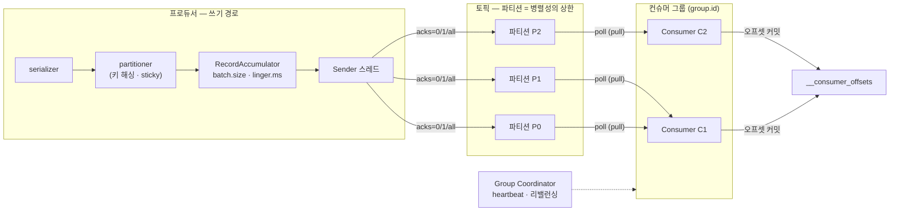
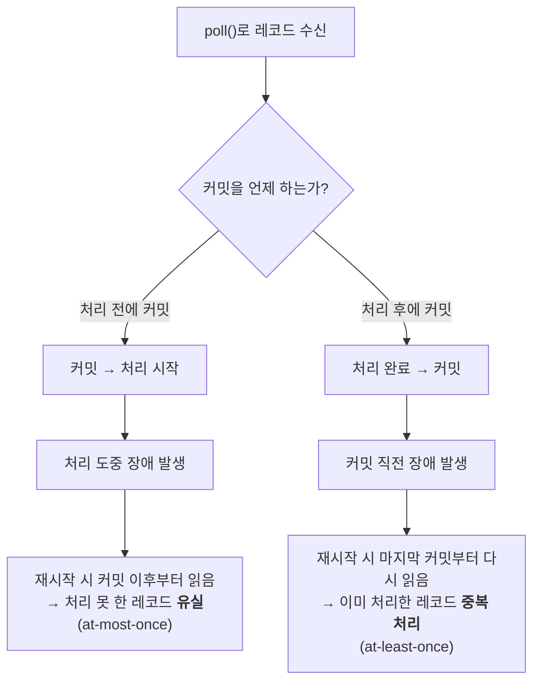
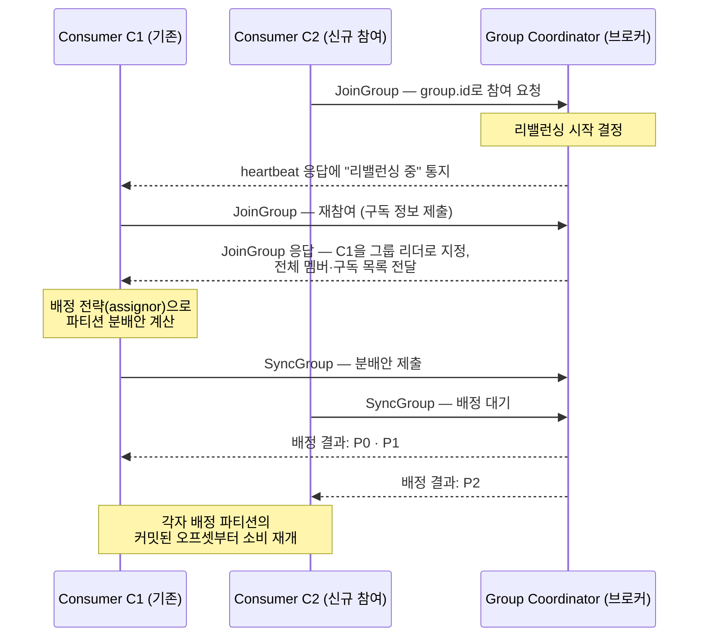

<figure class="post-figure post-figure--header">
<svg role="img" aria-label="프로듀서·컨슈머·컨슈머 그룹을 한 장으로 정리한 그림. 왼쪽 프로듀서 상자 안에서 레코드가 serializer, partitioner, RecordAccumulator 배치, Sender 스레드를 차례로 통과해 가운데 토픽의 세 파티션 P0·P1·P2에 기록된다. 각 파티션 아래에는 커밋된 오프셋 위치를 뜻하는 금색 화살촉이 표시되어 있다. 오른쪽 컨슈머 그룹 상자에는 두 컨슈머가 있고, P0·P1은 Consumer C1에, P2는 Consumer C2에 배정되어 각자 poll로 당겨 읽는다. 아래 캡션은 파티션 수가 병렬성의 상한이며 커밋된 오프셋은 그룹 단위로 기록된다는 사실을 요약한다." viewBox="0 0 680 300" xmlns="http://www.w3.org/2000/svg">
  <title>프로듀서 send 경로 → 파티션 커밋 로그 → 컨슈머 그룹의 파티션 배정과 오프셋 커밋</title>
  <defs>
    <marker id="kfk-s2h-arrow" viewBox="0 0 10 10" refX="8" refY="5" markerWidth="6" markerHeight="6" orient="auto-start-reverse">
      <path d="M0,0 L10,5 L0,10 z" fill="var(--secondary-color)"/>
    </marker>
  </defs>

  <!-- title -->
  <text x="340" y="24" text-anchor="middle" font-size="17" font-weight="800" fill="currentColor" letter-spacing="1.5">PRODUCER · CONSUMER · GROUP</text>
  <text x="340" y="44" text-anchor="middle" font-size="10.5" font-weight="700" fill="currentColor" opacity="0.72">프로듀서가 배치로 쓰고, 컨슈머 그룹이 파티션을 나눠 각자의 오프셋에서 읽는다</text>

  <!-- ===== producer internals ===== -->
  <rect x="16" y="60" width="152" height="196" rx="6" fill="var(--bg-light)" stroke="var(--secondary-color)" stroke-width="2.5"/>
  <text x="92" y="80" text-anchor="middle" font-size="11" font-weight="800" fill="var(--secondary-color)">Producer</text>
  <g font-size="8.5" font-weight="700" fill="currentColor" text-anchor="middle">
    <rect x="34" y="90" width="116" height="24" rx="3" fill="var(--bg-panel)" stroke="currentColor" stroke-width="1.8"/>
    <text x="92" y="106">serializer</text>
    <rect x="34" y="128" width="116" height="24" rx="3" fill="var(--bg-panel)" stroke="currentColor" stroke-width="1.8"/>
    <text x="92" y="144">partitioner</text>
    <rect x="34" y="166" width="116" height="24" rx="3" fill="var(--bg-panel)" stroke="var(--accent-color)" stroke-width="1.8"/>
    <text x="92" y="182">배치 (Accumulator)</text>
    <rect x="34" y="204" width="116" height="24" rx="3" fill="var(--bg-panel)" stroke="currentColor" stroke-width="1.8"/>
    <text x="92" y="220">Sender 스레드</text>
  </g>
  <g stroke="var(--secondary-color)" stroke-width="2" fill="none">
    <line x1="92" y1="114" x2="92" y2="124" marker-end="url(#kfk-s2h-arrow)"/>
    <line x1="92" y1="152" x2="92" y2="162" marker-end="url(#kfk-s2h-arrow)"/>
    <line x1="92" y1="190" x2="92" y2="200" marker-end="url(#kfk-s2h-arrow)"/>
  </g>
  <text x="92" y="246" text-anchor="middle" font-size="8" fill="currentColor" opacity="0.7">batch.size · linger.ms · acks</text>

  <!-- sender -> partitions -->
  <g stroke="var(--secondary-color)" stroke-width="2" fill="none">
    <line x1="168" y1="212" x2="204" y2="92" marker-end="url(#kfk-s2h-arrow)"/>
    <line x1="168" y1="216" x2="204" y2="140" marker-end="url(#kfk-s2h-arrow)"/>
    <line x1="168" y1="220" x2="204" y2="188" marker-end="url(#kfk-s2h-arrow)"/>
  </g>

  <!-- ===== topic partitions ===== -->
  <text x="210" y="70" text-anchor="start" font-size="9" font-weight="700" fill="currentColor" opacity="0.7">오프셋 →</text>
  <g>
    <rect x="210" y="80" width="220" height="24" rx="2" fill="var(--bg-panel)" stroke="currentColor" stroke-width="2"/>
    <rect x="210" y="128" width="220" height="24" rx="2" fill="var(--bg-panel)" stroke="currentColor" stroke-width="2"/>
    <rect x="210" y="176" width="220" height="24" rx="2" fill="var(--bg-panel)" stroke="currentColor" stroke-width="2"/>
  </g>
  <g font-size="9" font-weight="700" fill="currentColor" text-anchor="middle" opacity="0.85">
    <text x="196" y="96">P0</text>
    <text x="196" y="144">P1</text>
    <text x="196" y="192">P2</text>
  </g>
  <g stroke="currentColor" stroke-width="1" opacity="0.45">
    <line x1="254" y1="80" x2="254" y2="104"/><line x1="298" y1="80" x2="298" y2="104"/><line x1="342" y1="80" x2="342" y2="104"/><line x1="386" y1="80" x2="386" y2="104"/>
    <line x1="254" y1="128" x2="254" y2="152"/><line x1="298" y1="128" x2="298" y2="152"/><line x1="342" y1="128" x2="342" y2="152"/><line x1="386" y1="128" x2="386" y2="152"/>
    <line x1="254" y1="176" x2="254" y2="200"/><line x1="298" y1="176" x2="298" y2="200"/><line x1="342" y1="176" x2="342" y2="200"/><line x1="386" y1="176" x2="386" y2="200"/>
  </g>
  <g font-size="10" font-weight="700" fill="currentColor" text-anchor="middle" opacity="0.7">
    <text x="232" y="96">0</text><text x="276" y="96">1</text><text x="320" y="96">2</text><text x="364" y="96">3</text><text x="408" y="96">4</text>
  </g>
  <!-- committed offset carets -->
  <g fill="var(--gold)">
    <polygon points="342,106 337,114 347,114"/>
    <polygon points="298,154 293,162 303,162"/>
    <polygon points="386,202 381,210 391,210"/>
  </g>
  <text x="320" y="228" text-anchor="middle" font-size="8.5" fill="currentColor" opacity="0.72">▲ = 커밋된 오프셋 (그룹 단위, __consumer_offsets에 기록)</text>

  <!-- partitions -> consumers -->
  <g stroke="var(--secondary-color)" stroke-width="2" fill="none">
    <line x1="432" y1="92" x2="500" y2="110" marker-end="url(#kfk-s2h-arrow)"/>
    <line x1="432" y1="140" x2="500" y2="122" marker-end="url(#kfk-s2h-arrow)"/>
    <line x1="432" y1="188" x2="500" y2="176" marker-end="url(#kfk-s2h-arrow)"/>
  </g>

  <!-- ===== consumer group ===== -->
  <rect x="504" y="66" width="160" height="164" rx="6" fill="var(--bg-light)" stroke="var(--gold)" stroke-width="2.5"/>
  <text x="584" y="84" text-anchor="middle" font-size="10.5" font-weight="800" fill="var(--gold)">컨슈머 그룹 (group.id)</text>
  <rect x="516" y="94" width="136" height="42" rx="3" fill="var(--bg-panel)" stroke="currentColor" stroke-width="2"/>
  <text x="584" y="110" text-anchor="middle" font-size="9.5" font-weight="700" fill="currentColor">Consumer C1</text>
  <text x="584" y="126" text-anchor="middle" font-size="8" fill="currentColor" opacity="0.75">← P0 · P1 배정</text>
  <rect x="516" y="152" width="136" height="42" rx="3" fill="var(--bg-panel)" stroke="currentColor" stroke-width="2"/>
  <text x="584" y="168" text-anchor="middle" font-size="9.5" font-weight="700" fill="currentColor">Consumer C2</text>
  <text x="584" y="184" text-anchor="middle" font-size="8" fill="currentColor" opacity="0.75">← P2 배정</text>
  <text x="584" y="216" text-anchor="middle" font-size="8" fill="currentColor" opacity="0.7">poll로 당겨(pull) 읽는다</text>

  <!-- bottom caption -->
  <text x="340" y="262" text-anchor="middle" font-size="10" fill="currentColor" opacity="0.72">파티션 하나는 그룹 안에서 컨슈머 하나에게만 — 파티션 수가 병렬성의 상한이다</text>
  <text x="340" y="282" text-anchor="middle" font-size="10" fill="currentColor" opacity="0.72">컨슈머가 죽거나 늘어나면 파티션을 다시 나누는 리밸런싱이 일어난다</text>
</svg>
<figcaption>프로듀서의 send 경로(serializer → partitioner → 배치 → Sender)가 파티션에 기록하고, 컨슈머 그룹이 파티션을 나눠 배정받아 각자의 오프셋에서 읽는다</figcaption>
</figure>

## 들어가며

[1단계](/2026/07/15/kafka-distributed-log-topics-partitions.html)에서 우리는 Kafka의 뼈대를 세웠습니다 — **Kafka는 파티션 단위 append-only 커밋 로그이고, 오프셋이 각 레코드의 좌표이며, 복제와 ISR이 내구성을 지킨다**는 그림입니다. 그런데 그 그림에는 아직 등장인물이 없습니다. 로그에 실제로 **누가 어떻게 쓰고, 누가 어떻게 읽는가**가 이번 글의 주제입니다.

쓰는 쪽과 읽는 쪽 모두, 핵심은 "단순해 보이는 API 뒤에 숨은 경로"입니다. 프로듀서의 `send()` 한 줄 뒤에는 serializer → partitioner → 배치 → 전송 스레드로 이어지는 파이프라인이 있고, 그 각 단계의 설정(`batch.size`, `linger.ms`, `acks`)이 처리량과 내구성을 가릅니다. 컨슈머의 `poll()` 한 줄 뒤에는 "어디까지 읽었는가"를 기록하는 **오프셋 커밋**이 있고, 그 커밋의 **시점**이 재처리와 유실을 가릅니다. 그리고 여러 컨슈머를 하나의 **컨슈머 그룹**으로 묶는 순간, Kafka는 파티션을 자동으로 나눠 배정해 수평 확장을 공짜로 제공하는 대신 — 멤버가 바뀔 때마다 **리밸런싱**이라는 비용을 청구합니다.

이 글은 [Kafka Essential Curriculum](/2026/07/12/kafka-essential-curriculum.html)의 2단계이자 첫 막 "로그를 이해하기(1~2단계)"의 완결편입니다. 1단계가 "무엇이 어떻게 저장되는가"였다면, 이번에는 그 로그 위의 **데이터 흐름 전체** — 쓰기 경로, 읽기 경로, 그리고 병렬 소비의 조율 — 를 손에 잡히게 다룹니다. 예제는 Python `confluent-kafka` 클라이언트로 관통합니다.

<div class="post-summary-box" markdown="1">

### 📌 이 글에서 다루는 내용

- **프로듀서**: `send()`의 내부 경로(serializer → partitioner → RecordAccumulator 배치 → Sender 스레드), 키 해싱과 sticky partitioner의 파티션 배정, `batch.size`·`linger.ms`·`compression.type`으로 조율하는 배치와 압축, `acks`(0/1/all)의 처리량 vs 내구성 트레이드오프, 재시도와 `max.in.flight`
- **컨슈머와 오프셋**: pull 기반 소비의 이유, poll 루프의 구조, 오프셋 커밋(자동 vs 수동 `commitSync`/`commitAsync`), 커밋 시점이 가르는 재처리/유실, `__consumer_offsets` 토픽과 `auto.offset.reset`
- **컨슈머 그룹과 리밸런싱**: `group.id`와 파티션 분배(range/round-robin/sticky/cooperative-sticky), 파티션 수 = 병렬성 상한, group coordinator와 heartbeat/`session.timeout.ms`/`max.poll.interval.ms`, eager vs cooperative(incremental) 리밸런싱, static membership, 리밸런싱 비용과 완화 전략

</div>

## 한눈에 보기 — 쓰기 경로에서 병렬 소비까지

이 글의 스파인을 한 장으로 그리면 이렇습니다. 레코드는 프로듀서 내부 파이프라인을 통과해 파티션에 배치로 기록되고, 컨슈머 그룹의 각 컨슈머가 배정받은 파티션을 poll로 당겨 읽으며, 읽은 위치를 `__consumer_offsets`에 커밋합니다. 그룹 옆에는 멤버십을 관리하고 리밸런싱을 주재하는 group coordinator가 서 있습니다.



왼쪽(쓰기)에서 오른쪽(읽기)으로 흐르는 이 경로의 각 마디를 이제 하나씩 파고듭니다.

## 프로듀서 — 배치로 쓰고, acks로 조율한다

### send()가 브로커에 닿기까지 — 프로듀서 내부 경로

`producer.send(record)`는 브로커에 바로 요청을 날리지 않습니다. 레코드는 프로듀서 내부에서 네 단계를 거칩니다.

1. **Serializer** — 키와 값 객체를 바이트 배열로 직렬화합니다. 문자열·JSON부터 Avro/Protobuf(5단계 Schema Registry에서 다룹니다)까지, 브로커는 오직 바이트만 다루므로 직렬화는 전적으로 클라이언트의 책임입니다.
2. **Partitioner** — 이 레코드가 토픽의 **어느 파티션**으로 갈지 결정합니다. 1단계에서 본 대로 파티션이 순서 보장과 병렬성의 단위이므로, 이 결정이 곧 데이터의 물리적 배치를 결정합니다.
3. **RecordAccumulator** — 레코드를 바로 보내지 않고 **파티션별 배치(batch)** 버퍼에 쌓습니다. 네트워크 왕복 한 번에 여러 레코드를 실어 보내기 위한 대기실입니다.
4. **Sender 스레드** — `send()`를 호출한 애플리케이션 스레드와 **별개의 백그라운드 스레드**가 배치가 찼거나(`batch.size`) 기다림이 끝난(`linger.ms`) 순서대로 배치를 꺼내, 파티션 리더 브로커에 전송합니다.

`send()`가 비동기인 이유가 여기 있습니다 — 호출 즉시 반환되고, 전송 결과는 콜백(또는 Future)으로 돌아옵니다. 애플리케이션 스레드는 쌓기만 하고, 보내는 일은 Sender가 대신하는 구조입니다.

### 파티션 배정 — 키 해싱과 sticky partitioner

Partitioner의 규칙은 두 갈래입니다.

- **키가 있으면 — 해싱.** `hash(key) % 파티션수`로 결정됩니다(정확히는 murmur2 해시). 같은 키는 **항상 같은 파티션**으로 가므로, 파티션 내 순서 보장과 결합해 "같은 주문 ID의 이벤트는 순서대로"가 성립합니다. 1단계에서 본 파티셔닝 키 설계 — 순서가 필요한 단위를 키로 — 가 여기서 실제로 작동합니다.
- **키가 없으면 — sticky partitioner.** 과거에는 레코드를 라운드 로빈으로 파티션에 흩뿌렸지만, 이 방식은 배치를 모든 파티션에 얇게 나눠 담아 배치 효율을 떨어뜨렸습니다. Kafka 2.4부터의 **sticky partitioner**는 하나의 파티션에 "붙어서(sticky)" 배치 하나를 꽉 채운 뒤 다음 파티션으로 옮겨 갑니다. 개별 배치는 커지고 요청 수는 줄어, 같은 처리량에서 지연이 눈에 띄게 낮아집니다. 장기적으로는 파티션 간 분포가 고르게 유지됩니다.

한 가지 주의 — 키 해싱은 **파티션 수가 고정일 때만** 같은 키 → 같은 파티션을 보장합니다. 파티션을 늘리면 `% 파티션수`의 결과가 바뀌어 기존 키의 배치가 흐트러집니다. 키 기반 순서에 의존하는 토픽이라면 파티션 수는 처음부터 여유 있게 잡는 것이 정석입니다.

### 배치와 압축 — batch.size · linger.ms · compression.type

RecordAccumulator의 배치가 전송되는 조건은 둘 중 먼저 오는 쪽입니다.

- **`batch.size`** (기본 16KB) — 파티션별 배치 버퍼의 크기 상한. 배치가 가득 차면 즉시 전송 대상이 됩니다.
- **`linger.ms`** (기본 0) — 배치가 차지 않았어도 이만큼 기다렸다가 보냅니다. 기본값 0은 "보낼 수 있으면 바로 보낸다"이고, 5~20ms 정도만 줘도 그 사이 도착한 레코드가 같은 배치에 합류해 **처리량이 크게 오릅니다**. 지연 몇 ms를 내주고 왕복 횟수를 사는 거래입니다.

배치는 압축의 단위이기도 합니다. **`compression.type`**(`none`/`gzip`/`snappy`/`lz4`/`zstd`)을 켜면 배치 전체가 한 덩어리로 압축되어 전송되고, 브로커는 압축된 그대로 로그에 저장하며(재압축 없음), 컨슈머가 받아서 풉니다. 배치가 클수록 압축률이 좋아지므로 `linger.ms`와 압축은 시너지가 있습니다. 실무 기본기는 **`lz4` 또는 `zstd`** — CPU 비용 대비 네트워크·디스크 절감이 커서, 압축을 끄는 쪽이 오히려 예외입니다.

```properties
# 처리량 지향 프로듀서 설정 예 — 배치를 키우고 압축한다
batch.size=32768
linger.ms=10
compression.type=lz4
buffer.memory=67108864          # Accumulator 전체 버퍼 (기본 32MB)
```

### acks — 처리량 vs 내구성의 다이얼

Sender가 배치를 리더 브로커에 보낸 뒤, **언제 "성공"으로 칠 것인가**가 `acks`입니다. 1단계의 복제 모델(리더/팔로워, ISR)이 여기서 프로듀서 설정과 만납니다.

<figure class="post-figure">
<svg role="img" aria-label="acks 세 가지 설정의 대비 개념도. acks=0은 프로듀서가 리더 브로커로 레코드를 보내기만 하고 응답을 기다리지 않아 가장 빠르지만 유실을 감지할 수 없다. acks=1은 리더가 자기 로그에 쓰면 바로 응답을 보내므로, 리더가 복제 전에 죽으면 유실될 수 있다. acks=all은 ISR의 팔로워들까지 복제를 마친 뒤에야 응답하므로 가장 느리지만 브로커 하나가 죽어도 유실되지 않는다. 아래에는 왼쪽 끝이 처리량과 최소 지연, 오른쪽 끝이 최대 내구성인 축 위에 세 설정의 위치가 점으로 표시되어 있다." viewBox="0 0 680 320" xmlns="http://www.w3.org/2000/svg">
  <title>acks=0 · 1 · all — 응답을 기다리는 지점이 처리량과 내구성을 가른다</title>
  <defs>
    <marker id="kfk-s2a-sec" viewBox="0 0 10 10" refX="8" refY="5" markerWidth="6" markerHeight="6" orient="auto-start-reverse">
      <path d="M0,0 L10,5 L0,10 z" fill="var(--secondary-color)"/>
    </marker>
    <marker id="kfk-s2a-gold" viewBox="0 0 10 10" refX="8" refY="5" markerWidth="6" markerHeight="6" orient="auto-start-reverse">
      <path d="M0,0 L10,5 L0,10 z" fill="var(--gold)"/>
    </marker>
    <marker id="kfk-s2a-axis" viewBox="0 0 10 10" refX="8" refY="5" markerWidth="5" markerHeight="5" orient="auto-start-reverse">
      <path d="M0,0 L10,5 L0,10 z" fill="currentColor"/>
    </marker>
  </defs>

  <!-- column titles -->
  <g font-size="12" font-weight="800" fill="currentColor" text-anchor="middle">
    <text x="120" y="30">acks=0</text>
    <text x="340" y="30">acks=1</text>
    <text x="560" y="30">acks=all</text>
  </g>

  <!-- === column 1: acks=0 === -->
  <rect x="85" y="44" width="70" height="24" rx="3" fill="var(--bg-light)" stroke="currentColor" stroke-width="2"/>
  <text x="120" y="60" text-anchor="middle" font-size="8.5" font-weight="700" fill="currentColor">Producer</text>
  <line x1="120" y1="68" x2="120" y2="94" stroke="var(--secondary-color)" stroke-width="2" marker-end="url(#kfk-s2a-sec)"/>
  <rect x="85" y="98" width="70" height="24" rx="3" fill="var(--bg-panel)" stroke="currentColor" stroke-width="2"/>
  <text x="120" y="114" text-anchor="middle" font-size="8.5" font-weight="700" fill="currentColor">Leader</text>
  <g fill="var(--bg-panel)" stroke="currentColor" stroke-width="1.6" opacity="0.6">
    <rect x="68" y="142" width="50" height="20" rx="3"/>
    <rect x="124" y="142" width="50" height="20" rx="3"/>
  </g>
  <g font-size="7.5" font-weight="700" fill="currentColor" text-anchor="middle" opacity="0.6">
    <text x="93" y="155">Follower</text>
    <text x="149" y="155">Follower</text>
  </g>
  <text x="120" y="186" text-anchor="middle" font-size="8.5" fill="currentColor" opacity="0.8">응답을 기다리지 않음</text>
  <text x="120" y="200" text-anchor="middle" font-size="8.5" fill="currentColor" opacity="0.8">최고 처리량 · 유실 감지 불가</text>

  <!-- === column 2: acks=1 === -->
  <rect x="305" y="44" width="70" height="24" rx="3" fill="var(--bg-light)" stroke="currentColor" stroke-width="2"/>
  <text x="340" y="60" text-anchor="middle" font-size="8.5" font-weight="700" fill="currentColor">Producer</text>
  <line x1="332" y1="68" x2="332" y2="94" stroke="var(--secondary-color)" stroke-width="2" marker-end="url(#kfk-s2a-sec)"/>
  <line x1="348" y1="94" x2="348" y2="68" stroke="var(--gold)" stroke-width="2" stroke-dasharray="4 3" marker-end="url(#kfk-s2a-gold)"/>
  <rect x="305" y="98" width="70" height="24" rx="3" fill="var(--bg-panel)" stroke="var(--gold)" stroke-width="2"/>
  <text x="340" y="114" text-anchor="middle" font-size="8.5" font-weight="700" fill="currentColor">Leader ✓</text>
  <g fill="var(--bg-panel)" stroke="currentColor" stroke-width="1.6" opacity="0.6">
    <rect x="288" y="142" width="50" height="20" rx="3"/>
    <rect x="344" y="142" width="50" height="20" rx="3"/>
  </g>
  <g font-size="7.5" font-weight="700" fill="currentColor" text-anchor="middle" opacity="0.6">
    <text x="313" y="155">Follower</text>
    <text x="369" y="155">Follower</text>
  </g>
  <text x="340" y="186" text-anchor="middle" font-size="8.5" fill="currentColor" opacity="0.8">리더가 쓰면 바로 응답</text>
  <text x="340" y="200" text-anchor="middle" font-size="8.5" fill="currentColor" opacity="0.8">리더가 복제 전에 죽으면 유실</text>

  <!-- === column 3: acks=all === -->
  <rect x="525" y="44" width="70" height="24" rx="3" fill="var(--bg-light)" stroke="currentColor" stroke-width="2"/>
  <text x="560" y="60" text-anchor="middle" font-size="8.5" font-weight="700" fill="currentColor">Producer</text>
  <line x1="552" y1="68" x2="552" y2="94" stroke="var(--secondary-color)" stroke-width="2" marker-end="url(#kfk-s2a-sec)"/>
  <line x1="568" y1="94" x2="568" y2="68" stroke="var(--gold)" stroke-width="2" stroke-dasharray="4 3" marker-end="url(#kfk-s2a-gold)"/>
  <rect x="525" y="98" width="70" height="24" rx="3" fill="var(--bg-panel)" stroke="var(--gold)" stroke-width="2"/>
  <text x="560" y="114" text-anchor="middle" font-size="8.5" font-weight="700" fill="currentColor">Leader</text>
  <g stroke="var(--secondary-color)" stroke-width="2" fill="none">
    <line x1="546" y1="122" x2="518" y2="138" marker-end="url(#kfk-s2a-sec)"/>
    <line x1="574" y1="122" x2="602" y2="138" marker-end="url(#kfk-s2a-sec)"/>
  </g>
  <g fill="var(--bg-panel)" stroke="var(--gold)" stroke-width="1.8">
    <rect x="484" y="142" width="56" height="20" rx="3"/>
    <rect x="580" y="142" width="56" height="20" rx="3"/>
  </g>
  <g font-size="7.5" font-weight="700" fill="currentColor" text-anchor="middle">
    <text x="512" y="155">Follower ✓</text>
    <text x="608" y="155">Follower ✓</text>
  </g>
  <text x="560" y="186" text-anchor="middle" font-size="8.5" fill="currentColor" opacity="0.8">ISR 복제 완료 후 응답</text>
  <text x="560" y="200" text-anchor="middle" font-size="8.5" fill="currentColor" opacity="0.8">브로커 하나가 죽어도 유실 없음</text>

  <!-- divider -->
  <line x1="30" y1="218" x2="650" y2="218" stroke="currentColor" stroke-width="1.4" opacity="0.25"/>

  <!-- tradeoff axis -->
  <text x="340" y="240" text-anchor="middle" font-size="10.5" font-weight="700" fill="currentColor" opacity="0.72">처리량 · 지연 vs 내구성 — 세 설정의 자리</text>
  <line x1="110" y1="278" x2="570" y2="278" stroke="currentColor" stroke-width="1.6" opacity="0.5" marker-start="url(#kfk-s2a-axis)" marker-end="url(#kfk-s2a-axis)"/>
  <text x="110" y="302" text-anchor="middle" font-size="9" fill="currentColor" opacity="0.72">처리량·지연 최소</text>
  <text x="570" y="302" text-anchor="middle" font-size="9" fill="currentColor" opacity="0.72">내구성 최대</text>
  <circle cx="160" cy="278" r="5" fill="var(--secondary-color)"/>
  <text x="160" y="266" text-anchor="middle" font-size="9" font-weight="700" fill="currentColor">acks=0</text>
  <circle cx="340" cy="278" r="5" fill="var(--accent-color)"/>
  <text x="340" y="266" text-anchor="middle" font-size="9" font-weight="700" fill="currentColor">acks=1</text>
  <circle cx="520" cy="278" r="5" fill="var(--gold)"/>
  <text x="520" y="266" text-anchor="middle" font-size="9" font-weight="700" fill="currentColor">acks=all</text>
</svg>
<figcaption>acks는 "언제 성공으로 칠 것인가"의 다이얼 — 응답을 기다리는 지점이 뒤로 갈수록 느려지는 대신 유실에 강해진다</figcaption>
</figure>

| 설정 | 성공 판정 시점 | 유실 위험 | 적합한 곳 |
| --- | --- | --- | --- |
| **acks=0** | 보내는 즉시 (응답 없음) | 전송 실패도 모른 채 유실 | 손실 허용 메트릭·로그 샘플링 |
| **acks=1** | 리더가 자기 로그에 쓰면 | 리더가 복제 전에 죽으면 유실 | 일반적 기본 감각, 지연 민감 워크로드 |
| **acks=all** (`-1`) | ISR의 복제까지 완료되면 | `min.insync.replicas`와 결합 시 사실상 없음 | 유실 불가 파이프라인의 표준 |

`acks=all`은 혼자서는 완성되지 않습니다. ISR이 리더 하나로 쪼그라든 상태라면 "all"이 리더 하나를 의미하게 되기 때문입니다. 그래서 브로커/토픽 설정 **`min.insync.replicas=2`**(복제 계수 3 기준)와 짝을 이뤄야 "최소 2개 복제본에 쓰여야 성공"이 강제됩니다 — 1단계에서 본 ISR 개념이 프로듀서의 내구성 보장으로 완성되는 지점입니다.

### 재시도와 max.in.flight — 다음 단계의 복선

전송이 일시적 오류(리더 교체, 네트워크 단절)로 실패하면 프로듀서는 재시도합니다. 현대 Kafka의 기본값은 **`retries`가 사실상 무한대**이고, 대신 **`delivery.timeout.ms`**(기본 2분)가 "이 시간 안에 성공 못 하면 포기"라는 전체 예산을 정합니다. 여기에 **`max.in.flight.requests.per.connection`**(기본 5) — 응답을 기다리지 않고 동시에 날려 둘 수 있는 요청 수 — 가 얽히면서 두 가지 미묘한 문제가 생깁니다.

- **중복**: 브로커가 쓰기에 성공했는데 응답이 유실되면, 프로듀서는 실패로 알고 재시도합니다 → 같은 레코드가 두 번 기록됩니다.
- **순서 역전**: in-flight 요청이 여러 개일 때 앞 배치가 실패해 재시도되는 사이 뒤 배치가 먼저 성공하면, 파티션 안에서 순서가 뒤집힙니다.

이 두 문제를 한 번에 푸는 것이 **멱등 프로듀서(`enable.idempotence=true`)** — 프로듀서별 시퀀스 번호로 중복을 브로커가 걸러내고, `max.in.flight` ≤ 5 범위에서 순서까지 보장하는 메커니즘 — 입니다. 상세한 동작과 트랜잭션까지는 [3단계 전달 보장](/2026/07/15/kafka-delivery-guarantees.html)의 주제이므로, 지금은 "재시도는 공짜가 아니며, 그 청구서를 처리하는 장치가 준비되어 있다"까지만 기억해 두면 됩니다.

### 실전 프로듀서 — confluent-kafka 예제

지금까지의 설정을 모아 신뢰성 지향 프로듀서를 만들면 이렇습니다.

```python
from confluent_kafka import Producer

producer = Producer({
    "bootstrap.servers": "broker1:9092,broker2:9092",
    # --- 내구성 ---
    "acks": "all",                    # ISR 복제까지 확인 (min.insync.replicas와 짝)
    "enable.idempotence": True,       # 재시도 중복·순서 역전 방지 (3단계에서 상세히)
    # --- 처리량 ---
    "linger.ms": 10,                  # 10ms 모아서 배치로
    "batch.size": 32768,              # 배치 32KB
    "compression.type": "lz4",        # 배치 단위 압축
})

def on_delivery(err, msg):
    """Sender 스레드가 전송 결과를 알려 주는 비동기 콜백"""
    if err is not None:
        # delivery.timeout.ms 예산을 다 쓰고도 실패한 경우만 여기 도달한다
        print(f"전송 실패: {err}")
    else:
        print(f"기록 완료: {msg.topic()}[{msg.partition()}] offset={msg.offset()}")

# 키를 주면 같은 주문의 이벤트는 항상 같은 파티션 → 파티션 내 순서 보장
producer.produce(
    topic="orders",
    key="order-1042",
    value=b'{"order_id": "order-1042", "status": "paid"}',
    on_delivery=on_delivery,
)

producer.flush()   # Accumulator에 남은 배치를 모두 전송하고 결과를 기다린다
```

`produce()`는 Accumulator에 쌓고 즉시 반환된다는 점, 결과는 콜백으로 돌아온다는 점, 그리고 종료 전 `flush()`가 없으면 버퍼에 남은 레코드가 조용히 사라진다는 점 — 이 세 가지가 프로듀서 코드의 기본기입니다.

## 컨슈머와 오프셋 — 당겨 읽고, 위치를 기록한다

### 왜 push가 아니라 pull인가

많은 메시징 시스템이 브로커가 소비자에게 밀어 주는(push) 모델을 쓰지만, Kafka 컨슈머는 브로커에서 **당겨(pull)** 읽습니다. 이 선택에는 분명한 이유가 있습니다.

- **소비 속도를 컨슈머가 결정합니다.** push 모델에서는 브로커가 컨슈머의 처리 능력을 초과해 밀어붙이면 컨슈머가 압도됩니다(backpressure 문제). pull에서는 컨슈머가 감당할 수 있는 만큼만 가져오므로, 느린 컨슈머는 그냥 느리게 읽을 뿐 시스템이 무너지지 않습니다.
- **배치 소비가 자연스럽습니다.** 컨슈머가 "지금 쌓인 것을 한 번에 달라"고 요청하므로, 브로커는 여러 레코드를 한 응답에 실어 보낼 수 있습니다. `fetch.min.bytes`와 `fetch.max.wait.ms`로 "최소 이만큼 모이면/최대 이만큼 기다렸다 달라"를 조율해, 빈 poll이 브로커를 두들기는 낭비도 막습니다.
- **재소비(replay)가 공짜입니다.** 1단계에서 본 대로 로그는 소비해도 지워지지 않고, 읽기 위치는 컨슈머 쪽 좌표(오프셋)일 뿐입니다. pull 모델에서 컨슈머는 오프셋을 되감아 과거를 다시 읽을 수 있습니다 — push 모델에서는 성립하기 어려운 능력입니다.

### poll 루프 — 컨슈머의 심장 박동

컨슈머 애플리케이션의 뼈대는 무한 poll 루프입니다.

```python
from confluent_kafka import Consumer, KafkaException

consumer = Consumer({
    "bootstrap.servers": "broker1:9092,broker2:9092",
    "group.id": "order-pipeline",       # 컨슈머 그룹 식별자 (다음 섹션)
    "enable.auto.commit": False,        # 수동 커밋 — 커밋 시점을 우리가 통제한다
    "auto.offset.reset": "earliest",    # 커밋된 오프셋이 없으면 처음부터
})
consumer.subscribe(["orders"])

try:
    while True:
        msg = consumer.poll(timeout=1.0)   # 레코드를 당겨 온다 — 그룹 프로토콜도 이 안에서 진행
        if msg is None:
            continue                        # 이번 주기엔 새 레코드 없음
        if msg.error():
            raise KafkaException(msg.error())

        process(msg)                        # 1) 먼저 처리하고
        consumer.commit(asynchronous=False) # 2) 그다음 커밋한다 → at-least-once
finally:
    consumer.close()   # 그룹에서 정상 탈퇴 — 즉시 리밸런싱을 유도해 복구를 앞당긴다
```

주의할 점은 `poll()`이 단순히 "레코드 가져오기"가 아니라는 것입니다. **heartbeat 응답 처리, 리밸런싱 참여, (자동 커밋일 때) 오프셋 커밋**까지 그룹 멤버로서의 살림 전부가 poll 호출 안에서 굴러갑니다. 그래서 `process(msg)`가 너무 오래 걸려 poll 사이 간격이 벌어지면 — 뒤에서 볼 `max.poll.interval.ms` — 그룹은 이 컨슈머가 죽었다고 판정합니다. **poll 루프를 계속 돌리는 것 자체가 "나 살아 있음"의 증명**입니다.

### 오프셋 커밋 — 자동 vs 수동

컨슈머가 "어디까지 읽었는가"를 기록하는 행위가 **오프셋 커밋**입니다. 커밋 방식은 세 갈래입니다.

- **자동 커밋** (`enable.auto.commit=true`, 기본값) — poll 주기에 맞춰 `auto.commit.interval.ms`(기본 5초)마다, **직전 poll이 반환한 위치까지** 자동으로 커밋합니다. 코드는 가장 단순하지만 커밋 시점을 통제할 수 없습니다. 처리가 끝나지 않은 레코드의 오프셋이 커밋될 수 있고(장애 시 유실), 커밋 전에 죽으면 최대 5초치가 재처리됩니다. "대충 한 번쯤은 처리되면 되는" 워크로드에만 적합합니다.
- **수동 동기 커밋** (`commitSync` / `commit(asynchronous=False)`) — 커밋이 브로커에 기록될 때까지 **블로킹**하고, 실패하면 재시도합니다. 확실하지만 커밋마다 왕복 지연을 지불합니다.
- **수동 비동기 커밋** (`commitAsync` / `commit(asynchronous=True)`) — 커밋 요청만 던지고 바로 다음 poll로 넘어갑니다. 빠르지만 실패해도 재시도하지 않습니다 — 재시도하면 더 뒤의 커밋을 앞의 재시도가 덮어써 오프셋이 되감길 수 있기 때문입니다.

실무 정석은 **평상시엔 비동기, 마무리는 동기**의 조합입니다. 루프 중에는 `commitAsync`로 지연을 아끼고(어차피 다음 커밋이 곧 따라와 실패를 덮습니다), 컨슈머를 닫거나 파티션을 내놓기 직전에는 `commitSync`로 확실하게 마무리합니다.

```python
try:
    while True:
        msg = consumer.poll(timeout=1.0)
        if msg is None:
            continue
        if msg.error():
            raise KafkaException(msg.error())
        process(msg)
        consumer.commit(asynchronous=True)    # 평상시: 비동기 — 다음 커밋이 실패를 덮는다
finally:
    try:
        consumer.commit(asynchronous=False)   # 마지막: 동기 — 확실하게 기록하고
    finally:
        consumer.close()                      # 그룹에서 탈퇴한다
```

### 커밋 시점이 가르는 것 — 재처리와 유실

커밋의 방식보다 더 근본적인 질문은 **처리와 커밋의 순서**입니다. 장애는 언제든 일어날 수 있고, 재시작한 컨슈머는 "마지막으로 커밋된 오프셋"부터 다시 읽습니다. 그렇다면 커밋을 처리 전에 하느냐 후에 하느냐가 장애 시의 운명을 가릅니다.



- **커밋 먼저, 처리 나중** — 처리 도중 죽으면 그 레코드는 이미 커밋된 뒤라 다시 읽지 않습니다. **유실**이 가능한 대신 중복은 없습니다(at-most-once).
- **처리 먼저, 커밋 나중** — 커밋 전에 죽으면 재시작 후 같은 레코드를 다시 처리합니다. **중복**이 가능한 대신 유실은 없습니다(at-least-once). 대부분의 파이프라인이 선택하는 기본값이고, 위의 poll 루프 예제가 이 순서입니다.

그러면 "중복도 유실도 없이"는 불가능한가 — 가능합니다. 다만 오프셋 커밋과 처리 결과 기록을 **원자적으로 묶는** 장치(트랜잭션, 또는 처리의 멱등성)가 필요하고, 그것이 바로 [3단계 전달 보장](/2026/07/15/kafka-delivery-guarantees.html)의 본론입니다. 이 글에서는 좌표만 정확히 찍어 둡니다 — **전달 의미(delivery semantics)는 Kafka가 정해 주는 것이 아니라, 커밋 시점을 어디에 두느냐로 여러분이 정하는 것입니다.**

### __consumer_offsets와 auto.offset.reset

커밋된 오프셋은 어디에 저장될까요 — Kafka 자신입니다. **`__consumer_offsets`**라는 내부 토픽(기본 50개 파티션, compacted)에 `(group.id, 토픽, 파티션) → 오프셋` 형태의 레코드로 기록됩니다. 오프셋 저장마저 "로그에 쓴다"로 해결하는, Kafka다운 설계입니다. compaction 덕분에 각 키의 최신 커밋만 남고, 그룹별 오프셋 조회는 이 토픽을 관리하는 브로커(group coordinator — 다음 섹션)가 담당합니다.

중요한 따름정리 — **오프셋은 그룹 단위**입니다. 같은 토픽을 `analytics` 그룹과 `alerting` 그룹이 읽으면 두 그룹의 오프셋은 완전히 독립적으로 관리됩니다. 하나의 로그를 여러 소비자가 서로 방해 없이, 각자의 속도로 읽는 1단계의 그림이 이 메커니즘으로 구현됩니다.

마지막 조각은 **커밋된 오프셋이 없을 때**입니다. 새 그룹이 처음 붙었거나, 오프셋 보존 기간(`offsets.retention.minutes`, 기본 7일)이 지나 커밋이 만료된 경우 — 이때 어디서부터 읽을지가 **`auto.offset.reset`**입니다.

| 값 | 동작 | 쓰임 |
| --- | --- | --- |
| `latest` (기본) | 지금부터 도착하는 새 레코드만 | 실시간 반응이 목적일 때 |
| `earliest` | 로그에 남아 있는 처음부터 전부 | 파이프라인·재처리 — 놓치면 안 될 때 |
| `none` | 커밋 없으면 예외 발생 | 오프셋 관리를 전적으로 직접 할 때 |

배치·파이프라인 성격의 컨슈머가 기본값 `latest`인 채로 배포되어 "배포 전 데이터를 전부 건너뛰었다"는 사고는 흔한 신입 실수입니다. 파이프라인 컨슈머라면 `earliest`를 명시하는 습관을 들이는 것이 안전합니다.

## 컨슈머 그룹과 리밸런싱 — 파티션 분배로 확장한다

### group.id — 그룹 하나가 로그 하나를 나눠 읽는다

컨슈머 혼자서 토픽의 모든 파티션을 읽는 것은 규모가 커지면 불가능해집니다. Kafka의 답이 **컨슈머 그룹**입니다. 같은 `group.id`로 구독한 컨슈머들에게 Kafka는 토픽의 파티션을 **자동으로 나눠 배정**합니다. 규칙은 단 하나 — **한 파티션은 그룹 안에서 정확히 한 컨슈머에게만 배정된다** — 이고, 이 규칙에서 모든 성질이 따라 나옵니다.

- **수평 확장**: 파티션 6개 토픽에 컨슈머가 2개면 3개씩, 3개로 늘리면 2개씩 나눠 갖습니다. 컨슈머를 추가하는 것만으로 소비 처리량이 늘어납니다.
- **파티션 내 순서 유지**: 한 파티션을 한 컨슈머만 읽으므로, 파티션 안의 순서가 소비 시에도 유지됩니다.
- **병렬성의 상한 = 파티션 수**: 파티션 6개 토픽에 컨슈머를 7개 넣으면 하나는 **아무 파티션도 배정받지 못하고 논다**(대기 예비 역할은 합니다). 컨슈머를 더 넣어도 소비가 더 빨라지지 않는다면, 병목은 파티션 수입니다. 1단계에서 "파티션 수 설계가 곧 성능 설계"라고 한 이유가 정확히 이것입니다.

그리고 **다른 `group.id`는 완전히 독립**입니다. 같은 토픽에 그룹을 하나 더 붙이면 그 그룹은 모든 파티션을 처음부터(또는 `auto.offset.reset`이 정하는 위치부터) 따로 읽습니다 — 큐(그룹 내 분배)와 pub/sub(그룹 간 브로드캐스트)을 하나의 모델로 통합한 것이 컨슈머 그룹의 우아함입니다.

### 파티션 분배 전략 — range · round-robin · sticky · cooperative-sticky

파티션을 누구에게 줄지는 `partition.assignment.strategy`가 정합니다.

| 전략 | 분배 방식 | 특징 |
| --- | --- | --- |
| **range** (기본) | 토픽별로 파티션을 정렬해 앞에서부터 뭉텅이로 | 여러 토픽 구독 시 앞 컨슈머로 쏠림(skew) 가능 |
| **round-robin** | 모든 토픽의 파티션을 한 줄로 세워 돌아가며 | 고르게 분배되지만 리밸런싱 때 배정이 크게 뒤섞임 |
| **sticky** | 고른 분배 + 리밸런싱 시 **기존 배정 최대 보존** | 이동 최소화, 단 프로토콜은 여전히 eager |
| **cooperative-sticky** | sticky의 분배 + **cooperative 프로토콜** | 이동하는 파티션만 멈춤 — 현대의 권장값 |

range의 쏠림은 구체적으로 이렇습니다 — 파티션 3개짜리 토픽 2개를 컨슈머 2개가 구독하면, range는 토픽마다 P0·P1을 C1에게 주므로 C1이 4개, C2가 2개를 갖게 됩니다. 구독 토픽이 많아질수록 이 쏠림이 누적되므로, 특별한 이유가 없다면 **cooperative-sticky**로 시작하는 것이 현재의 모범 답안입니다.

```properties
# 컨슈머 그룹 핵심 설정
group.id=order-pipeline
partition.assignment.strategy=org.apache.kafka.clients.consumer.CooperativeStickyAssignor

# 살아있음 판정 (다음 절)
session.timeout.ms=45000          # heartbeat 미수신 허용 한도
heartbeat.interval.ms=3000        # heartbeat 전송 주기 (session.timeout의 1/3 이하)
max.poll.interval.ms=300000       # poll 사이 허용 최대 간격 = 처리 시간 예산

# 재시작 리밸런싱 억제 (마지막 절)
group.instance.id=order-pipeline-worker-1
```

### group coordinator와 살아있음의 판정

이 분배를 조율하는 주체가 **group coordinator**입니다 — 그룹별로 지정되는 브로커 하나(정확히는 그 그룹의 오프셋이 저장되는 `__consumer_offsets` 파티션의 리더 브로커)로, 그룹의 멤버십 관리와 리밸런싱 주재, 오프셋 커밋 수신까지 담당합니다.

coordinator가 "이 컨슈머가 살아 있는가"를 판정하는 신호는 **두 계층**이고, 이 구분이 실무에서 대단히 중요합니다.

- **heartbeat / `session.timeout.ms`** — 컨슈머의 **백그라운드 스레드**가 `heartbeat.interval.ms`(기본 3초)마다 coordinator에 심장 박동을 보냅니다. `session.timeout.ms`(기본 45초) 동안 heartbeat가 없으면 **프로세스가 죽었다**고 판정하고 리밸런싱을 시작합니다. 이 신호는 프로세스 생존만 봅니다.
- **`max.poll.interval.ms`** (기본 5분) — poll과 poll 사이 간격이 이 한도를 넘으면, heartbeat가 멀쩡히 오고 있어도 **"살아는 있는데 일을 못 하는 상태"**(처리 로직이 멈췄거나 지나치게 느림)로 판정해 그룹에서 퇴출합니다.

가장 흔한 운영 사고가 후자입니다 — poll 한 번에 받아 온 레코드 뭉치의 처리가 5분을 넘겨 그룹에서 쫓겨나고, 리밸런싱이 일어나고, 파티션을 새로 받은 컨슈머가 (커밋 안 된 구간을) 다시 처리하다 또 넘기고… 의 **리밸런싱 폭풍**입니다. 처방은 처리 시간 예산에 맞게 `max.poll.interval.ms`를 늘리거나, 한 번에 가져오는 양(`max.poll.records`)을 줄여 poll 주기를 짧게 유지하는 것입니다.

### eager vs cooperative — 리밸런싱 프로토콜

멤버가 바뀌면(컨슈머 추가/이탈/사망, 구독 변경, 파티션 증가) coordinator는 **리밸런싱**을 시작합니다. 프로토콜의 골격은 JoinGroup / SyncGroup 두 라운드입니다 — 모든 멤버가 다시 참여를 신청하고(JoinGroup), coordinator가 멤버 중 하나를 **그룹 리더**로 지정하면, 그 리더가 배정 전략을 돌려 분배안을 계산해 제출하고(SyncGroup), coordinator가 각자에게 배정 결과를 나눠 줍니다. 배정 계산을 브로커가 아닌 **클라이언트(그룹 리더)**가 한다는 점이 특징입니다 — 새 배정 전략을 브로커 업그레이드 없이 도입할 수 있는 구조입니다.



문제는 이 과정 동안 **소비가 얼마나 멈추는가**이고, 여기서 두 프로토콜이 갈립니다.

- **eager (전통 방식)** — 리밸런싱이 시작되면 모든 컨슈머가 **가진 파티션을 전부 내려놓고** 참여합니다. 재배정이 끝날 때까지 그룹 전체의 소비가 정지하는 **stop-the-world**입니다. 컨슈머 하나가 추가됐을 뿐인데, 이동할 필요 없는 파티션까지 전부 멈춥니다.
- **cooperative / incremental (Kafka 2.4+, cooperative-sticky)** — 컨슈머는 파티션을 쥔 채로 리밸런싱에 참여하고, 새 분배안에서 **주인이 바뀌는 파티션만** 내려놓습니다. 내려놓은 파티션을 새 주인에게 붙이기 위해 리밸런싱이 한 라운드 더 돌지만(그래서 incremental), **이동하지 않는 파티션의 소비는 내내 계속**됩니다. stop-the-world가 "이동분만 잠깐"으로 줄어드는 것입니다.

### static membership과 리밸런싱 비용 완화

리밸런싱의 비용은 소비 정지만이 아닙니다 — 파티션을 새로 받은 컨슈머는 캐시·커넥션·(스트림 처리라면) 로컬 상태를 다시 데워야 하고, 직전 주인이 커밋하지 못한 구간은 중복 처리됩니다. 잦은 리밸런싱은 파이프라인 지연의 주범이므로, 완화 장치들을 알아 둘 가치가 있습니다.

- **static membership (`group.instance.id`)** — 기본적으로 컨슈머는 재시작할 때마다 새 멤버로 취급되어, **롤링 재배포 = 인스턴스 수만큼의 리밸런싱**이 됩니다. 각 인스턴스에 고정 ID(`group.instance.id=worker-1` 등)를 주면, coordinator는 `session.timeout.ms` 안에 같은 ID로 돌아온 컨슈머에게 **기존 배정을 리밸런싱 없이 그대로** 돌려줍니다. Kubernetes의 StatefulSet처럼 안정적 identity가 있는 환경과 특히 궁합이 좋습니다. 이때 `session.timeout.ms`는 "재시작에 걸리는 시간보다 넉넉히"로 함께 늘려 잡습니다.
- **cooperative-sticky 채택** — 위에서 본 대로 리밸런싱이 일어나더라도 멈추는 범위를 이동분으로 국한합니다.
- **poll 예산 정합** — `max.poll.interval.ms`와 `max.poll.records`를 처리 로직의 실제 소요 시간에 맞춰, "느린 처리"가 "사망 판정 → 불필요한 리밸런싱"으로 번지지 않게 합니다.
- **정상 종료** — `consumer.close()`로 그룹에서 명시적으로 탈퇴하면 coordinator가 `session.timeout.ms`를 기다리지 않고 즉시 재배정해, 장애 감지 지연 없이 넘어갑니다.

마지막으로, 파티션을 내놓는 순간의 뒷정리는 **rebalance listener**로 걸어 둡니다. 파티션을 뺏기기 직전에 처리 완료분을 동기 커밋해 두면, 새 주인의 중복 처리 구간이 최소화됩니다.

```python
def on_assign(consumer, partitions):
    # 새로 배정받은 파티션 — 캐시 예열, 상태 복구 등을 여기서
    print(f"배정받음: {[f'{p.topic}[{p.partition}]' for p in partitions]}")

def on_revoke(consumer, partitions):
    # 파티션을 내놓기 직전 — 처리 완료분을 확실히 커밋해 중복 구간을 줄인다
    print(f"회수됨: {[f'{p.topic}[{p.partition}]' for p in partitions]}")
    consumer.commit(asynchronous=False)

consumer.subscribe(["orders"], on_assign=on_assign, on_revoke=on_revoke)
```

## 정리

Kafka 로그 위의 데이터 흐름 전체를 관통했습니다. 요점을 정리하면 다음과 같습니다.

- **send()는 파이프라인이다**: serializer → partitioner → RecordAccumulator 배치 → Sender 스레드. 키가 있으면 해싱으로 같은 파티션(순서 보장), 없으면 sticky partitioner가 배치를 채워 가며 분배한다. `batch.size`·`linger.ms`·`compression.type`이 처리량의 다이얼이다.
- **acks는 "언제 성공으로 칠 것인가"의 다이얼이다**: 0(안 기다림) → 1(리더만) → all(ISR까지)로 갈수록 느려지는 대신 유실에 강해지고, `acks=all`은 `min.insync.replicas`와 짝을 이뤄야 완성된다. 재시도가 만드는 중복·순서 역전은 멱등 프로듀서의 몫 — 3단계의 복선이다.
- **컨슈머는 pull이고, poll 루프가 심장 박동이다**: 소비 속도의 주도권과 재소비 능력이 pull에서 나온다. poll은 레코드 수신이자 그룹 멤버십 유지 활동이므로, poll 간격이 `max.poll.interval.ms`를 넘으면 살아 있어도 퇴출된다.
- **커밋 시점이 전달 의미를 정한다**: 처리 전 커밋 = 유실 가능(at-most-once), 처리 후 커밋 = 중복 가능(at-least-once). 오프셋은 `__consumer_offsets` 토픽에 그룹 단위로 저장되고, 커밋이 없을 때의 시작점은 `auto.offset.reset`이 정한다.
- **컨슈머 그룹은 "한 파티션 = 그룹 내 한 컨슈머" 규칙 하나로 확장을 산다**: 파티션 수가 병렬성의 상한이고, 분배는 range/round-robin/sticky/cooperative-sticky 전략이 정하며, group coordinator가 heartbeat·`session.timeout.ms`·`max.poll.interval.ms`로 생사를 판정한다.
- **리밸런싱은 비용이고, 줄이는 장치가 있다**: eager(전체 정지) 대신 cooperative(이동분만 정지)를 쓰고, static membership(`group.instance.id`)으로 재시작 리밸런싱을 억제하며, rebalance listener로 파티션을 내놓기 전에 커밋한다.

이제 쓰기와 읽기의 경로는 완성되었습니다. 그런데 이 글 곳곳에 같은 질문이 반복해서 나타났습니다 — 재시도가 만드는 중복, 커밋 시점이 가르는 유실과 재처리. **"정확히 한 번"은 가능한가, 가능하다면 무엇의 조합인가.** 멱등 프로듀서와 트랜잭션으로 이 질문에 답하는 것이 다음 단계의 주제입니다.

### 다음 학습 (Next Learning)

- [Kafka 전달 보장](/2026/07/15/kafka-delivery-guarantees.html) — 3단계: at-least-once에서 exactly-once까지, 멱등 프로듀서와 트랜잭션
- [Kafka 분산 로그 · 토픽 · 파티션](/2026/07/15/kafka-distributed-log-topics-partitions.html) — 1단계 복습: 이 글의 토대인 커밋 로그·파티셔닝·복제
- [Kafka Essential Curriculum](/2026/07/12/kafka-essential-curriculum.html) — 시리즈 로드맵으로 돌아가 진행 상황 확인하기
