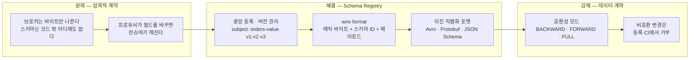
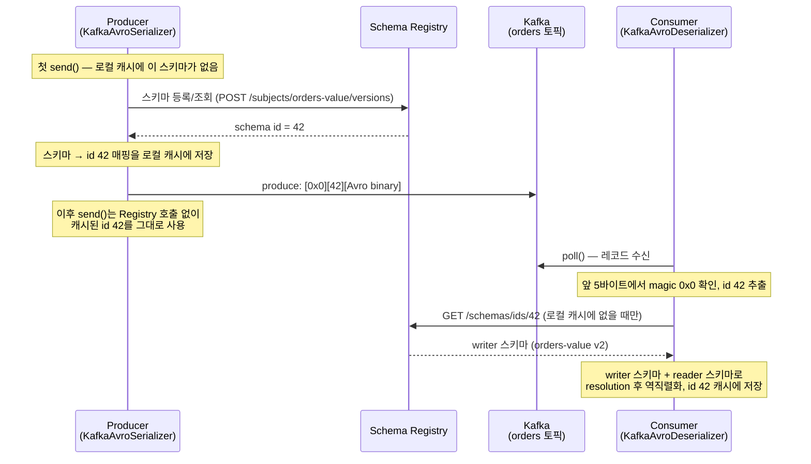
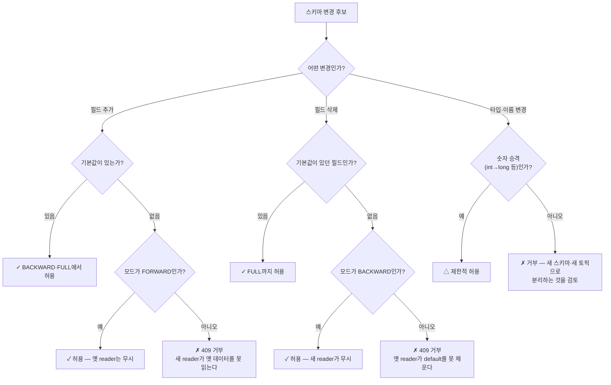

<figure class="post-figure post-figure--header">
<svg role="img" aria-label="Schema Registry를 한 장으로 정리한 그림. 위쪽은 wire format의 흐름으로, 왼쪽의 Producer가 가운데 위 Schema Registry에 스키마를 등록해 ID 42를 발급받고, 메시지에는 매직 바이트 0x0과 스키마 ID 42, 그리고 필드명 없는 Avro 이진 페이로드만 실어 Kafka로 보낸다. 오른쪽의 Consumer는 메시지 앞 5바이트에서 ID를 읽어 Registry에서 스키마를 조회(이후 캐시)한 뒤 역직렬화한다. 아래쪽은 스키마 진화의 흐름으로, subject orders-value의 버전 v1에서 v2로 이어진 계보 뒤에 호환성 게이트(BACKWARD)가 서 있고, 기본값 있는 필드를 추가한 후보는 게이트를 통과해 v3으로 등록되지만 필드 타입을 바꾼 후보는 게이트에서 거부된다." viewBox="0 0 680 360" xmlns="http://www.w3.org/2000/svg">
  <title>Schema Registry — 스키마는 중앙에, 메시지에는 ID만, 새 버전은 호환성 게이트를 통과해야</title>
  <defs>
    <marker id="kfk-s5-arrow" viewBox="0 0 10 10" refX="8" refY="5" markerWidth="6" markerHeight="6" orient="auto-start-reverse">
      <path d="M0,0 L10,5 L0,10 z" fill="var(--secondary-color)"/>
    </marker>
    <marker id="kfk-s5-gold" viewBox="0 0 10 10" refX="8" refY="5" markerWidth="6" markerHeight="6" orient="auto-start-reverse">
      <path d="M0,0 L10,5 L0,10 z" fill="var(--gold)"/>
    </marker>
  </defs>

  <!-- ===== title ===== -->
  <text x="340" y="24" text-anchor="middle" font-size="17" font-weight="800" fill="currentColor" letter-spacing="1.5">SCHEMA REGISTRY</text>

  <!-- ===== SECTION A: wire format flow ===== -->
  <text x="30" y="48" text-anchor="start" font-size="11" font-weight="700" fill="currentColor" opacity="0.72">wire format — 스키마는 중앙 저장소에, 메시지에는 매직 바이트 + 스키마 ID만</text>

  <!-- Registry box (top center) -->
  <rect x="248" y="58" width="184" height="52" rx="6" fill="var(--bg-light)" stroke="var(--gold)" stroke-width="2.5"/>
  <text x="340" y="76" text-anchor="middle" font-size="10.5" font-weight="800" fill="var(--gold)">Schema Registry</text>
  <text x="340" y="92" text-anchor="middle" font-size="8.5" font-weight="700" fill="currentColor" opacity="0.8">subject: orders-value</text>
  <text x="340" y="104" text-anchor="middle" font-size="8.5" fill="currentColor" opacity="0.7">v1 · v2 · v3 … (버전 계보)</text>

  <!-- Producer box (left) -->
  <rect x="24" y="132" width="100" height="34" rx="4" fill="var(--bg-light)" stroke="currentColor" stroke-width="2"/>
  <text x="74" y="153" text-anchor="middle" font-size="9.5" font-weight="700" fill="currentColor">Producer</text>

  <!-- Consumer box (right) -->
  <rect x="556" y="132" width="100" height="34" rx="4" fill="var(--bg-light)" stroke="currentColor" stroke-width="2"/>
  <text x="606" y="153" text-anchor="middle" font-size="9.5" font-weight="700" fill="currentColor">Consumer</text>

  <!-- message capsule (center) : magic | id | payload -->
  <g>
    <rect x="238" y="134" width="38" height="30" rx="2" fill="var(--bg-panel)" stroke="currentColor" stroke-width="2"/>
    <rect x="276" y="134" width="52" height="30" fill="var(--bg-panel)" stroke="var(--gold)" stroke-width="2"/>
    <rect x="328" y="134" width="114" height="30" rx="2" fill="var(--bg-panel)" stroke="currentColor" stroke-width="2"/>
  </g>
  <g font-size="8.5" font-weight="700" fill="currentColor" text-anchor="middle">
    <text x="257" y="152">0x0</text>
    <text x="302" y="152" fill="var(--gold)">ID 42</text>
    <text x="385" y="152">Avro binary</text>
  </g>
  <g font-size="7.5" fill="currentColor" opacity="0.65" text-anchor="middle">
    <text x="257" y="176">매직 1B</text>
    <text x="302" y="176">스키마 ID 4B</text>
    <text x="385" y="176">페이로드 — 필드명 없음</text>
  </g>

  <!-- producer -> registry (register), registry -> producer (id) -->
  <line x1="112" y1="130" x2="244" y2="84" stroke="var(--secondary-color)" stroke-width="2" marker-end="url(#kfk-s5-arrow)"/>
  <text x="152" y="98" text-anchor="middle" font-size="8.5" font-weight="700" fill="currentColor" opacity="0.8">① 스키마 등록</text>
  <line x1="252" y1="106" x2="120" y2="136" stroke="var(--gold)" stroke-width="1.8" stroke-dasharray="5 4" marker-end="url(#kfk-s5-gold)"/>
  <text x="176" y="132" text-anchor="middle" font-size="8.5" font-weight="700" fill="var(--gold)">② ID 42 발급</text>

  <!-- producer -> capsule -> consumer -->
  <line x1="124" y1="149" x2="234" y2="149" stroke="var(--secondary-color)" stroke-width="2" marker-end="url(#kfk-s5-arrow)"/>
  <text x="179" y="162" text-anchor="middle" font-size="8" font-weight="700" fill="currentColor" opacity="0.7">③ 전송</text>
  <line x1="442" y1="149" x2="552" y2="149" stroke="var(--secondary-color)" stroke-width="2" marker-end="url(#kfk-s5-arrow)"/>
  <text x="497" y="162" text-anchor="middle" font-size="8" font-weight="700" fill="currentColor" opacity="0.7">Kafka 토픽</text>

  <!-- consumer -> registry (lookup) -->
  <line x1="590" y1="130" x2="436" y2="90" stroke="var(--secondary-color)" stroke-width="2" marker-end="url(#kfk-s5-arrow)"/>
  <text x="540" y="100" text-anchor="middle" font-size="8.5" font-weight="700" fill="currentColor" opacity="0.8">④ ID 42로 스키마 조회 (캐시)</text>

  <text x="340" y="200" text-anchor="middle" font-size="9" fill="currentColor" opacity="0.72">스키마 본문은 한 번만 등록 — 이후 모든 메시지는 5바이트 헤더로 스키마를 가리킨다</text>

  <!-- ===== divider ===== -->
  <line x1="30" y1="214" x2="650" y2="214" stroke="currentColor" stroke-width="1.4" opacity="0.25"/>

  <!-- ===== SECTION B: evolution + compatibility gate ===== -->
  <text x="30" y="238" text-anchor="start" font-size="11" font-weight="700" fill="currentColor" opacity="0.72">스키마 진화 — 새 버전은 호환성 게이트를 통과해야 등록된다</text>

  <!-- version chips v1 -> v2 -->
  <rect x="40" y="272" width="72" height="30" rx="4" fill="var(--bg-light)" stroke="currentColor" stroke-width="2"/>
  <text x="76" y="291" text-anchor="middle" font-size="9.5" font-weight="700" fill="currentColor">v1</text>
  <line x1="112" y1="287" x2="148" y2="287" stroke="var(--secondary-color)" stroke-width="2" marker-end="url(#kfk-s5-arrow)"/>
  <rect x="152" y="272" width="72" height="30" rx="4" fill="var(--bg-light)" stroke="currentColor" stroke-width="2"/>
  <text x="188" y="291" text-anchor="middle" font-size="9.5" font-weight="700" fill="currentColor">v2</text>
  <line x1="224" y1="287" x2="272" y2="287" stroke="var(--secondary-color)" stroke-width="2" marker-end="url(#kfk-s5-arrow)"/>
  <text x="248" y="278" text-anchor="middle" font-size="8" font-weight="700" fill="currentColor" opacity="0.7">새 버전 후보</text>

  <!-- compatibility gate -->
  <rect x="276" y="250" width="104" height="76" rx="6" fill="var(--bg-panel)" stroke="var(--gold)" stroke-width="2.5"/>
  <path d="M328,258 L342,264 L342,276 Q342,285 328,290 Q314,285 314,276 L314,264 Z" fill="none" stroke="var(--gold)" stroke-width="2"/>
  <polyline points="321,274 326,280 336,266" fill="none" stroke="var(--gold)" stroke-width="2" stroke-linecap="round" stroke-linejoin="round"/>
  <text x="328" y="306" text-anchor="middle" font-size="9" font-weight="800" fill="var(--gold)">호환성 검사</text>
  <text x="328" y="319" text-anchor="middle" font-size="8" font-weight="700" fill="currentColor" opacity="0.75">BACKWARD</text>

  <!-- pass path -->
  <line x1="380" y1="272" x2="428" y2="264" stroke="var(--gold)" stroke-width="2" marker-end="url(#kfk-s5-gold)"/>
  <rect x="432" y="250" width="200" height="30" rx="4" fill="var(--bg-light)" stroke="var(--gold)" stroke-width="2.5"/>
  <text x="446" y="269" text-anchor="start" font-size="9" font-weight="800" fill="var(--gold)">✓ v3 등록</text>
  <text x="510" y="269" text-anchor="start" font-size="8.5" fill="currentColor" opacity="0.8">기본값 있는 필드 추가</text>

  <!-- reject path -->
  <line x1="380" y1="306" x2="428" y2="314" stroke="var(--accent-color)" stroke-width="2" marker-end="url(#kfk-s5-arrow)"/>
  <rect x="432" y="300" width="200" height="30" rx="4" fill="var(--bg-light)" stroke="var(--accent-color)" stroke-width="2" stroke-dasharray="6 4"/>
  <text x="446" y="319" text-anchor="start" font-size="9" font-weight="800" fill="var(--accent-color)">✗ 등록 거부</text>
  <text x="510" y="319" text-anchor="start" font-size="8.5" fill="currentColor" opacity="0.8">필드 타입 변경 (409)</text>

  <text x="340" y="350" text-anchor="middle" font-size="9" fill="currentColor" opacity="0.72">허용되는 변경만 계보에 쌓인다 — 스키마가 실제로 강제되는 데이터 계약이 되는 지점</text>
</svg>
<figcaption>이 글을 한 장으로 — 스키마는 Registry에 한 번만 등록되고 메시지에는 매직 바이트 + 스키마 ID(5바이트)만 실리며, 새 스키마 버전은 호환성 게이트를 통과해야 계보에 등록된다</figcaption>
</figure>

## 들어가며

[4단계 Kafka Connect](/2026/07/15/kafka-connect-cdc.html)에서 Debezium 커넥터를 설정할 때, 우리는 `value.converter=io.confluent.connect.avro.AvroConverter`와 `value.converter.schema.registry.url`이라는 설정을 이미 만났습니다. 그때는 "변경 이벤트의 스키마를 registry에 맡긴다" 정도로 넘어갔지만, 이번 글에서 그 뒤에 있는 시스템 — **Schema Registry** — 를 정면으로 다룹니다.

문제의식은 단순합니다. Kafka의 브로커는 바이트만 나릅니다. 토픽에 실리는 데이터가 어떤 필드를 가졌는지, 타입이 무엇인지 브로커는 전혀 모릅니다. 프로듀서와 컨슈머가 서로 다른 팀이고, 로그가 며칠에서 몇 년까지 보존되며(1단계에서 본 retention과 replay), 컨슈머가 계속 늘어나는 환경에서 — 데이터의 **형태(스키마)는 코드 어디에도 적히지 않은 암묵적 계약**이 됩니다. 그리고 암묵적 계약은 반드시 깨집니다. 프로듀서가 필드 이름 하나를 바꾸는 순간, 그 사실을 모르는 컨슈머들이 조용히, 혹은 요란하게 무너집니다.

Schema Registry는 이 계약을 **명시적으로 만들고, 기계적으로 강제**합니다. 스키마를 중앙에 등록해 버전을 관리하고, 메시지에는 스키마 본문 대신 **스키마 ID만** 실어 효율을 확보하며, 새 버전이 기존 버전과 **호환되는지 검사해 비호환 변경의 등록 자체를 거부**합니다. 이 글은 [Kafka Essential Curriculum](/2026/07/12/kafka-essential-curriculum.html)의 5단계이자 셋째 막 "생태계로 넓히기(4~6단계)"의 두 번째 관문입니다. Connect가 시스템을 **잇는** 도구였다면, Schema Registry는 그렇게 이어진 시스템들이 주고받는 데이터를 **지키는** 도구입니다.

<div class="post-summary-box" markdown="1">

### 📌 이 글에서 다루는 내용

- **Schema Registry의 역할**: 스키마 없는 로그 공유가 무너지는 실패 시나리오, 중앙 등록·버전 관리와 subject 개념, wire format(매직 바이트 `0x0` + 4바이트 스키마 ID + 페이로드), naming strategy(TopicNameStrategy 등), 등록/조회 REST API, 프로듀서/컨슈머 serializer가 registry와 상호작용하는 흐름과 캐싱
- **직렬화 포맷**: Avro vs Protobuf vs JSON Schema 비교(스키마 진화 지원·크기·생태계·코드 생성), 이진 포맷이 작고 빠른 이유, Avro 스키마 예제와 reader/writer 스키마 해석(schema resolution)의 규칙
- **스키마 진화와 호환성**: BACKWARD/FORWARD/FULL(± TRANSITIVE) 모드의 정확한 의미를 "누가 먼저 업그레이드되는가"의 관점으로, 허용/금지되는 변경 목록, CI·등록 시점의 호환성 검사, 그리고 데이터 계약(Data Contracts)이라는 조직적 관점

</div>

## 한눈에 보기 — 암묵적 계약에서 강제되는 계약으로

이 글의 스파인을 한 장으로 그리면 이렇습니다. 스키마가 어디에도 선언되지 않은 로그는 프로듀서의 변경 한 번에 컨슈머가 깨지는 암묵적 계약 위에 서 있습니다. Schema Registry는 스키마를 중앙에 등록하고(subject·버전), 메시지에는 ID만 실어(wire format) 효율을 확보하며, 이진 직렬화 포맷(Avro/Protobuf)의 진화 규칙 위에서 호환성 모드로 변경을 검사해 — 계약을 **실제로 강제되는 것**으로 바꿉니다.



왼쪽의 문제에서 출발해, 가운데의 메커니즘을 거쳐, 오른쪽의 조직적 계약으로 끝나는 것이 이 글의 여정입니다.

## Schema Registry의 역할 — 스키마는 중앙에, 메시지에는 ID만

### 스키마 없는 로그 공유가 무너지는 순간

구체적인 실패 시나리오부터 봅니다. 주문 팀이 `orders` 토픽에 JSON을 흘려보내고, 정산 팀과 분석 팀이 각자 컨슈머로 읽고 있습니다.

```json
// v1 — 주문 팀이 처음 흘려보내던 메시지
{"order_id": "A-1001", "customer_id": "C-77", "amount": 25000, "status": "PLACED"}
```

어느 날 주문 팀이 "amount가 모호하다"며 필드 이름을 바꿉니다. 자기 서비스의 코드와 테스트는 모두 고쳤습니다.

```json
// v2 — 필드 이름 변경. 주문 팀 입장에서는 '사소한 리팩토링'
{"order_id": "A-1002", "customer_id": "C-78", "total_amount": 18000, "status": "PLACED"}
```

이 배포가 나가는 순간 벌어지는 일은 컨슈머의 구현에 따라 셋 중 하나입니다.

1. **요란한 실패**: 정산 컨슈머가 `amount`를 필수로 파싱하다 예외 — 컨슈머 랙이 치솟고 알림이 울립니다. 그나마 나은 경우입니다.
2. **조용한 오염**: 분석 파이프라인이 없는 필드를 `null`/`0`으로 채우고 계속 진행 — 그날 매출 대시보드가 0원으로 나오고, 원인 추적에 하루가 갑니다.
3. **지연된 폭발**: 로그에는 v1과 v2 메시지가 **섞여서 보존**되므로, 몇 주 뒤 재처리(replay)를 돌리던 새 컨슈머가 두 형태를 모두 만나 깨집니다.

셋째가 특히 Kafka적인 문제입니다. 데이터베이스라면 마이그레이션으로 과거 데이터까지 새 형태로 바꾸지만, **append-only 로그는 과거를 고쳐 쓰지 않습니다**. 한 번 v1으로 쓰인 레코드는 retention이 끝날 때까지 v1인 채로 남고, 컨슈머는 언제든 그 과거를 다시 읽을 수 있습니다. 그래서 Kafka에서 스키마 문제는 "지금 프로듀서와 컨슈머가 맞는가"를 넘어 "**로그에 쌓인 모든 버전의 데이터를 읽을 수 있는가**"의 문제가 됩니다. 이 관점이 뒤에서 다룰 호환성 모드, 특히 `_TRANSITIVE` 변형을 이해하는 열쇠입니다.

### 중앙 등록과 버전 관리 — subject라는 단위

Schema Registry는 이 문제를 스키마의 **단일 저장소**가 되는 것으로 풉니다. 핵심 개념은 세 개입니다.

- **스키마(schema)**: Avro/Protobuf/JSON Schema로 적힌 데이터 형태의 정의. 등록되면 클러스터 전역에서 유일한 **스키마 ID**(4바이트 정수)를 받습니다.
- **subject**: 스키마 버전들이 쌓이는 **계보의 단위**입니다. 같은 subject 아래 등록되는 스키마들이 v1, v2, v3… 버전 번호를 받고, 호환성 검사도 subject 단위로 이루어집니다. 어떤 subject에 속할지는 아래에서 볼 naming strategy가 정합니다.
- **버전(version)**: subject 안에서의 순번. "orders-value의 v3"처럼 subject + 버전으로 특정 스키마를 가리킬 수 있습니다.

재미있는 구현 디테일 하나 — Schema Registry는 등록된 스키마를 별도 데이터베이스가 아니라 **Kafka 자신의 압축(compacted) 토픽 `_schemas`에 저장**합니다. Registry 인스턴스는 이 토픽을 읽어 메모리에 인덱스를 올리는 얇은 서버일 뿐이어서, Kafka가 살아 있는 한 스키마 저장소도 함께 복구됩니다. "Kafka 생태계는 상태를 Kafka에 저장한다"는 패턴을 Connect의 오프셋 토픽에 이어 여기서 다시 만나는 셈입니다.

### wire format — 매직 바이트 + 스키마 ID + 페이로드

스키마를 중앙에 두면 자연스러운 질문이 따라옵니다 — 그러면 메시지에는 무엇이 실리는가? 매 메시지에 스키마 본문을 실으면 낭비가 심하고(스키마가 페이로드보다 큰 경우도 흔합니다), 아예 안 실으면 컨슈머가 무슨 스키마로 읽을지 알 수 없습니다. Confluent wire format의 답은 **5바이트 헤더**입니다.

```text
┌────────────────┬─────────────────────┬───────────────────────────────────┐
│  매직 바이트     │  스키마 ID           │  페이로드                           │
│  1 byte = 0x0  │  4 bytes (int, BE)  │  Avro binary — 필드명이 실리지 않음   │
└────────────────┴─────────────────────┴───────────────────────────────────┘
```

- **매직 바이트 `0x0`**: 이 wire format 자체의 버전 표식입니다. 역직렬화기는 첫 바이트가 `0x0`이 아니면 "registry 포맷이 아닌 데이터"로 판단하고 즉시 실패합니다.
- **스키마 ID**: 빅엔디안 4바이트 정수. subject·버전이 아니라 **전역 스키마 ID**가 실린다는 점이 중요합니다 — 컨슈머는 이 ID 하나로 registry에서 정확한 writer 스키마를 얻습니다.
- **페이로드**: 스키마 ID가 가리키는 스키마로 직렬화된 이진 데이터. Avro의 경우 필드명·타입 정보가 전혀 실리지 않은 순수 값의 나열입니다(왜 그래도 되는지는 다음 섹션의 schema resolution에서). Protobuf의 경우 스키마 ID 뒤에 메시지 인덱스(message indexes)가 추가로 붙어, 한 `.proto` 파일 안의 어떤 메시지 타입인지를 가리킵니다.

메시지당 오버헤드가 단 5바이트라는 것이 이 설계의 요체입니다. 스키마 본문은 registry에 한 번만 저장되고, 초당 수십만 건의 메시지는 각자 5바이트로 그것을 가리키기만 합니다.

### subject naming strategy — 스키마 계보를 무엇에 묶을 것인가

"이 스키마는 어느 subject의 새 버전인가"를 정하는 규칙이 **subject naming strategy**입니다. serializer 설정으로 지정하며, 선택에 따라 "한 토픽에 몇 종류의 이벤트를 담을 수 있는가"가 달라집니다.

| 전략 | subject 이름 (orders 토픽의 value 기준) | 토픽당 스키마 종류 | 적합한 곳 |
| --- | --- | --- | --- |
| **TopicNameStrategy** (기본값) | `orders-value` (key는 `orders-key`) | 한 종류 | 토픽 하나 = 이벤트 타입 하나인 표준적 설계 |
| **RecordNameStrategy** | `com.shop.events.OrderCreated` (레코드의 전체 이름) | 여러 종류 | 같은 이벤트 타입을 여러 토픽에서 공유할 때 |
| **TopicRecordNameStrategy** | `orders-com.shop.events.OrderCreated` | 여러 종류 | 한 토픽에 여러 이벤트 타입을 담되, 계보는 토픽별로 관리할 때 |

기본값인 **TopicNameStrategy**는 "토픽과 스키마 계보를 1:1로 묶는" 가장 단순하고 안전한 선택입니다. 호환성 검사가 토픽 단위로 걸리므로 "이 토픽을 읽는 컨슈머는 하나의 진화 계보만 상대하면 된다"가 보장됩니다. 반면 이벤트 소싱처럼 **한 엔티티의 여러 이벤트 타입을 순서 보장을 위해 한 토픽에 담아야 하는** 경우(OrderCreated, OrderPaid, OrderCancelled를 모두 `orders`에), TopicNameStrategy로는 서로 다른 스키마가 한 subject에서 충돌하므로 RecordNameStrategy 계열로 바꿔야 합니다. 이 선택은 편의 문제가 아니라 **호환성 검사의 경계를 정하는 설계 결정**입니다.

### REST API — 등록·조회·검사를 직접 만져 보기

Schema Registry는 평범한 HTTP 서버입니다. serializer가 내부적으로 하는 일을 curl로 직접 해 보면 동작이 손에 잡힙니다.

```bash
# 1) 스키마 등록 — subject 'orders-value'의 새 버전으로 (이미 있으면 기존 ID 반환)
curl -X POST http://schema-registry:8081/subjects/orders-value/versions \
  -H "Content-Type: application/vnd.schemaregistry.v1+json" \
  -d '{"schemaType": "AVRO", "schema": "{\"type\":\"record\",\"name\":\"OrderCreated\", ...}"}'
# → {"id": 42}

# 2) subject와 버전 계보 조회
curl http://schema-registry:8081/subjects
# → ["orders-value", "orders-key", "payments-value", ...]
curl http://schema-registry:8081/subjects/orders-value/versions
# → [1, 2, 3]
curl http://schema-registry:8081/subjects/orders-value/versions/latest
# → {"subject": "orders-value", "version": 3, "id": 42, "schema": "..."}

# 3) 전역 ID로 스키마 조회 — 컨슈머의 역직렬화기가 내부적으로 하는 호출
curl http://schema-registry:8081/schemas/ids/42

# 4) 등록하지 않고 호환성만 검사 — CI 파이프라인에서 쓰는 호출
curl -X POST \
  http://schema-registry:8081/compatibility/subjects/orders-value/versions/latest \
  -H "Content-Type: application/vnd.schemaregistry.v1+json" \
  -d '{"schemaType": "AVRO", "schema": "..."}'
# → {"is_compatible": false}

# 5) 호환성 모드 확인·변경 — 전역 기본값과 subject별 오버라이드
curl http://schema-registry:8081/config
# → {"compatibilityLevel": "BACKWARD"}   (전역 기본값)
curl -X PUT http://schema-registry:8081/config/orders-value \
  -H "Content-Type: application/vnd.schemaregistry.v1+json" \
  -d '{"compatibility": "FULL_TRANSITIVE"}'
```

1번 등록 요청이 흥미로운 지점입니다 — **똑같은 스키마를 다시 등록하면 새 버전이 생기지 않고 기존 ID가 그대로 반환**됩니다(등록은 멱등). 그리고 호환성 검사를 통과하지 못하는 스키마를 등록하려 하면 HTTP `409 Conflict`로 거부됩니다. 이 409가 바로 "계약이 강제되는" 순간입니다.

### serializer의 흐름 — 등록·전송·조회, 그리고 캐싱

애플리케이션 코드는 보통 REST API를 직접 부르지 않습니다. `KafkaAvroSerializer`/`KafkaAvroDeserializer`가 registry와의 대화를 대신합니다. 프로듀서와 컨슈머의 설정부터 봅니다.

```properties
# producer.properties — value를 Avro + Schema Registry로 직렬화
key.serializer=org.apache.kafka.common.serialization.StringSerializer
value.serializer=io.confluent.kafka.serializers.KafkaAvroSerializer
schema.registry.url=http://schema-registry:8081

# 프로덕션 관행: 애플리케이션이 스키마를 임의로 등록하지 못하게 막고,
# 배포 파이프라인(CI)이 등록한 최신 버전만 쓰게 한다
auto.register.schemas=false
use.latest.version=true
```

```properties
# consumer.properties — 5바이트 헤더의 ID로 스키마를 찾아 역직렬화
key.deserializer=org.apache.kafka.common.serialization.StringDeserializer
value.deserializer=io.confluent.kafka.serializers.KafkaAvroDeserializer
schema.registry.url=http://schema-registry:8081

# GenericRecord(맵처럼 다루기) 대신 코드 생성된 클래스로 역직렬화
specific.avro.reader=true
```

이 설정 아래에서 한 레코드가 왕복하는 흐름을 시퀀스로 그리면 이렇습니다.



**캐싱**이 이 그림의 숨은 주인공입니다. serializer는 "스키마 → ID" 매핑을, deserializer는 "ID → 스키마" 매핑을 로컬에 캐시하므로, registry 호출은 **스키마당 한 번**뿐입니다. 초당 수십만 메시지를 처리해도 registry에는 부하가 거의 가지 않고, 캐시가 데워진 뒤에는 registry가 잠시 내려가도 기존 스키마의 송수신은 계속됩니다(새 스키마의 등록/조회만 실패). Registry가 "핫패스의 병목"이 아니라 "콜드패스의 조회처"라는 점이 이 아키텍처가 실전에서 버티는 이유입니다.

`auto.register.schemas=false`도 짚어 둘 가치가 있습니다. 기본값(true)에서는 프로듀서가 처음 보는 스키마를 만나면 **자동으로 등록을 시도**합니다. 개발 환경에서는 편하지만, 프로덕션에서는 "아무 애플리케이션이나 계약을 바꿀 수 있다"는 뜻이 됩니다. 그래서 실무 관행은 등록 권한을 CI/CD 파이프라인에만 주고, 애플리케이션은 `false`로 잠가 이미 등록된 스키마만 쓰게 하는 것입니다 — 계약 변경이 코드 리뷰와 호환성 검사를 반드시 거치게 만드는 장치입니다.

## 직렬화 포맷 — Avro · Protobuf · JSON Schema

### 왜 이진 포맷인가

JSON은 사람이 읽기 좋지만 로그에 싣기에는 두 가지 세금이 붙습니다. 첫째, **모든 메시지가 필드명을 반복해서 실어 나릅니다** — `"customer_id"`라는 13바이트가 매출 이벤트 10억 건에 모두 들어 있는 셈입니다. 둘째, 숫자·시각이 모두 문자열 표현이라 **파싱 비용과 타입 모호성**(`25000`은 int인가 long인가, `"2026-07-15"`는 날짜인가 문자열인가)이 따라옵니다.

스키마 기반 이진 포맷은 이 구조를 뒤집습니다 — **구조에 대한 지식(필드명·순서·타입)은 스키마에 한 번만 적고, 메시지에는 값만 싣습니다**. 위 실패 시나리오의 주문 메시지가 JSON으로 ~100바이트라면, Avro 이진으로는 (5바이트 헤더 포함) 30바이트 안팎까지 줄어드는 것이 보통이고, 압축까지 얹으면 격차는 더 벌어집니다. 크기는 디스크 비용만의 문제가 아닙니다 — 2단계에서 본 프로듀서 배치와 네트워크 처리량, 브로커의 페이지 캐시 적중률까지, Kafka 파이프라인의 모든 구간이 메시지 크기에 비례해 좋아집니다.

대신 이진 포맷은 **스키마 없이는 한 바이트도 해석할 수 없습니다**. "페이로드에 구조 정보가 없다"는 장점이 그대로 "스키마 유통이 필수"라는 요구가 되고, 그 유통을 담당하는 것이 바로 Schema Registry입니다. 이진 포맷과 registry는 선택적 조합이 아니라 한 몸의 설계입니다.

### Avro 스키마 예제

Avro 스키마는 JSON으로 적습니다. 위 시나리오의 주문 이벤트를 제대로 정의하면 이렇습니다.

```json
{
  "type": "record",
  "name": "OrderCreated",
  "namespace": "com.shop.events",
  "doc": "주문 생성 이벤트 — orders 토픽의 value 스키마",
  "fields": [
    {"name": "order_id",    "type": "string"},
    {"name": "customer_id", "type": "string"},
    {"name": "amount",
     "type": {"type": "bytes", "logicalType": "decimal", "precision": 12, "scale": 2},
     "doc": "주문 금액. float가 아닌 decimal — 돈은 이진 부동소수점에 싣지 않는다"},
    {"name": "status",
     "type": {"type": "enum", "name": "OrderStatus",
              "symbols": ["PLACED", "PAID", "CANCELLED"]}},
    {"name": "created_at",
     "type": {"type": "long", "logicalType": "timestamp-millis"}},
    {"name": "coupon_code",
     "type": ["null", "string"], "default": null,
     "doc": "v2에서 추가된 필드 — 기본값 null 덕분에 BACKWARD 호환"}
  ]
}
```

눈여겨볼 세 가지 — 첫째, `doc`으로 **스키마 자체가 문서**가 됩니다(필드의 의미가 위키가 아니라 계약 안에 삽니다). 둘째, `logicalType`으로 decimal·timestamp 같은 의미 타입을 표현합니다. 셋째, 마지막 필드처럼 **union `["null", "string"]` + `"default": null`** 조합이 "나중에 안전하게 추가된 optional 필드"의 표준 형태입니다 — 이 `default`의 존재 여부가 다음 섹션의 호환성 판정을 가르는 바로 그 지점입니다.

### reader/writer 스키마와 resolution — Avro 진화의 심장

Avro의 가장 중요한 설계는 **읽기에 스키마가 두 개 관여한다**는 것입니다.

- **writer 스키마**: 데이터를 **쓸 때** 사용된 스키마. wire format의 스키마 ID가 가리키는 것이 정확히 이것입니다.
- **reader 스키마**: 읽는 쪽 애플리케이션이 **기대하는** 스키마. 코드 생성에 사용한 스키마, 혹은 애플리케이션이 지정한 스키마입니다.

둘이 같을 필요가 없습니다. Avro는 역직렬화 시점에 두 스키마를 나란히 놓고 **schema resolution** 규칙으로 간극을 메웁니다.

1. 필드는 **이름으로** 매칭됩니다(순서가 아니라).
2. writer에는 있는데 reader에 없는 필드 → **무시**합니다. (프로듀서가 필드를 추가해도 옛 컨슈머는 태연합니다)
3. reader에는 있는데 writer에 없는 필드 → reader 스키마의 **default 값으로 채웁니다**. default가 없으면 **에러**입니다. (이것이 "기본값 없는 필드 추가"가 backward 비호환인 이유의 전부입니다)
4. 타입이 다르면 제한적 **승격(promotion)**만 허용됩니다 — `int → long → float → double`, `string ↔ bytes` 등. 그 외의 타입 변경은 에러입니다.

이 규칙이 있어서 "v3 스키마로 컴파일된 컨슈머가 로그에 남은 v1 데이터를 읽는" 일이 성립합니다. writer 스키마(v1)는 registry에서 ID로 정확히 복원되고, reader 스키마(v3)와의 차이는 resolution이 흡수합니다. **호환성 검사란 결국 "이 두 스키마 사이에서 resolution이 항상 성공하는가"를 등록 시점에 미리 판정하는 것**입니다 — 다음 섹션의 모든 규칙이 여기서 도출됩니다.

### Avro vs Protobuf vs JSON Schema

Schema Registry는 세 포맷을 모두 1급으로 지원합니다. 실무 선택 기준을 정리하면 이렇습니다.

| 기준 | Avro | Protobuf | JSON Schema |
| --- | --- | --- | --- |
| **스키마 정의** | JSON 문서 | `.proto` IDL | JSON 문서 |
| **페이로드** | 이진 (필드명·태그 없음, 가장 작음) | 이진 (필드 태그 번호 포함) | JSON 텍스트 (가장 큼) |
| **스키마 진화** | resolution 규칙이 정교 — default 기반, registry 검사와 궁합이 가장 좋음 | 필드 번호 기반 — 번호 재사용 금지 규율 필요, optional 중심 | 검증 스키마라 진화 의미가 상대적으로 느슨함 |
| **코드 생성** | 선택적 (GenericRecord로 동적 처리 가능) | 사실상 필수 (`protoc`) | 선택적 |
| **읽을 때 스키마** | writer 스키마 필수 (registry 필수적) | 태그 덕분에 스키마 없이도 부분 해석 가능 | 자기서술적 |
| **생태계** | Kafka·데이터 엔지니어링 (Connect, Flink, Spark, Iceberg) | gRPC·마이크로서비스, 다언어 RPC | 웹 API, 기존 JSON 파이프라인 |

거칠게 요약하면 — **데이터 파이프라인의 중심이 Kafka라면 Avro**가 기본 선택입니다(가장 작은 페이로드, 가장 정교한 진화 규칙, Connect/스트림 처리 생태계와의 궁합). 조직이 이미 **gRPC/Protobuf 중심**이라면 서비스와 이벤트의 타입 정의를 하나로 유지하는 가치가 커서 Protobuf가 자연스럽습니다. **JSON Schema**는 이진 포맷 도입이 어려운 레거시 컨슈머가 많을 때의 절충안입니다 — 크기 이점은 포기하지만, 최소한 registry의 버전 관리와 호환성 검사는 얻습니다. 어느 쪽이든 이 글의 나머지 — subject, wire format, 호환성 모드 — 는 세 포맷에 동일하게 적용됩니다.

## 스키마 진화와 호환성 — 누가 먼저 업그레이드되는가

### 호환성 모드의 정확한 의미

이제 이 글의 심장입니다. 스키마는 반드시 바뀝니다 — 문제는 "바뀌어도 되는 변경"과 "안 되는 변경"을 가르는 기준선입니다. Schema Registry의 호환성 모드는 그 기준선을 subject별로 선언하는 장치이고, 각 모드의 정의는 헷갈리기로 악명이 높습니다. 열쇠는 **"새 스키마와 옛 데이터/옛 컨슈머 중 무엇이 공존하는가", 곧 "누가 먼저 업그레이드되는가"의 관점**으로 읽는 것입니다.

| 모드 | 검사 대상 | 보장 (새 스키마 = N, 이전 = N−1) | 먼저 업그레이드 | 허용되는 변경 (Avro 기준) |
| --- | --- | --- | --- | --- |
| **BACKWARD** (기본값) | 직전 버전만 | N 스키마의 reader가 N−1로 쓰인 데이터를 읽을 수 있다 | **컨슈머** | 필드 삭제 · 기본값 있는 필드 추가 |
| **BACKWARD_TRANSITIVE** | 모든 과거 버전 | N의 reader가 v1까지 모든 과거 데이터를 읽을 수 있다 | **컨슈머** | 위와 같음 (모든 버전에 대해) |
| **FORWARD** | 직전 버전만 | N−1 스키마의 reader가 N으로 쓰인 데이터를 읽을 수 있다 | **프로듀서** | 필드 추가 · 기본값 있는 필드 삭제 |
| **FORWARD_TRANSITIVE** | 모든 과거 버전 | 모든 과거 reader가 N 데이터를 읽을 수 있다 | **프로듀서** | 위와 같음 (모든 버전에 대해) |
| **FULL** | 직전 버전만 | 양방향 모두 성립 | **순서 무관** | 기본값 있는 필드 추가/삭제만 |
| **FULL_TRANSITIVE** | 모든 과거 버전 | 모든 버전과 양방향 성립 | **순서 무관** | 위와 같음 (모든 버전에 대해) |
| **NONE** | 검사 없음 | 아무것도 보장하지 않음 | — | 모든 변경 (사실상 계약 포기) |

각 모드를 업그레이드 순서의 관점으로 풀면 이렇습니다.

- **BACKWARD** — "새 스키마로 옛 데이터를 읽을 수 있다"는 것은, **컨슈머를 먼저 새 스키마(reader)로 올려도** 아직 옛 스키마로 쓰고 있는 프로듀서의 데이터를 문제없이 읽는다는 뜻입니다. 그래서 배포 순서는 **컨슈머 먼저, 프로듀서 나중**입니다. 필드를 **삭제**해도 되는 이유: 새 reader에 그 필드가 없으니 옛 데이터의 해당 필드는 그냥 무시됩니다(resolution 규칙 2). 필드를 **추가**하려면 기본값이 필수인 이유: 옛 데이터에는 그 필드가 없으므로 새 reader가 default로 채워야 하기 때문입니다(규칙 3).
- **FORWARD** — "옛 스키마로 새 데이터를 읽을 수 있다"는 것은, **프로듀서를 먼저 새 스키마(writer)로 올려도** 아직 업그레이드하지 않은 옛 컨슈머들이 새 데이터를 읽는다는 뜻입니다. 배포 순서는 **프로듀서 먼저, 컨슈머 나중**입니다. 프로듀서 팀이 컨슈머가 몇이나 되는지 모두 파악할 수 없는 — 컨슈머가 계속 늘어나는 — 조직에서 자연스러운 모드입니다. 필드 **추가**가 자유로운 이유: 옛 reader는 모르는 필드를 무시하면 그만입니다. 필드 **삭제**에 기본값이 필요한 이유: 옛 reader는 여전히 그 필드를 기대하므로, 자기 스키마의 default로 채울 수 있어야 합니다.
- **FULL** — 양쪽 다. 허용 변경이 "기본값 있는 필드의 추가/삭제"로 좁아지는 대신, 프로듀서와 컨슈머를 **어느 쪽부터 배포해도 안전**합니다. 배포 순서를 조율할 수 없는 조직 경계를 넘는 토픽이라면 이쪽이 맞습니다.

### 왜 TRANSITIVE가 필요한가 — 로그는 직전 버전만 담고 있지 않다

비-transitive 모드는 **직전 버전과만** 호환성을 검사합니다. v3은 v2와, v2는 v1과 각각 검사를 통과했더라도, **v3이 v1과 호환된다는 보장은 없습니다** — 호환성은 이행적(transitive)이지 않기 때문입니다. 구체적인 함정 하나를 보겠습니다. BACKWARD 모드에서 v1이 `string` 타입 필드 `f`를 갖고 있었고, v2가 `f`를 **삭제**했다고 합시다(필드 삭제 — v2↔v1 통과). 이후 v3이 같은 이름 `f`를 이번에는 **`int` 타입 + 기본값**으로 다시 추가합니다(기본값 있는 필드 추가 — v3↔v2 통과). 각 단계는 모두 합법이지만, v3 reader가 로그에 남아 있는 **v1 데이터**를 읽는 순간 `string`으로 쓰인 `f`를 `int`로 해석해야 하는 상황이 되고, 이는 승격이 불가능한 타입 변경이라 resolution이 실패합니다. 직전 버전만 보는 검사는 이 단절을 놓칩니다. 요지는 이것입니다 — **retention이 길거나 replay가 있는 토픽에서 컨슈머가 실제로 만나는 데이터는 직전 버전이 아니라 로그에 남은 모든 버전**입니다. "새 컨슈머가 토픽을 처음부터 다시 읽는다"는 Kafka의 대표적 강점(1단계의 replay)을 쓰는 순간, 컨슈머는 v1 데이터와 마주칩니다.

그래서 실무 권고는 명확합니다 — **보존 기간이 길고 여러 팀이 읽는 토픽은 `BACKWARD_TRANSITIVE` 이상**, 조직 경계를 넘는 핵심 토픽은 `FULL_TRANSITIVE`로 두는 것입니다. 검사 비용은 등록 시점에 한 번뿐이고, 지키는 것은 로그 전체의 가독성입니다.

### 허용/금지되는 변경 목록

Avro + BACKWARD(기본값) 기준으로 실무에서 마주치는 변경들을 판정하면 이렇습니다.

**안전한 변경 (허용)**

- **기본값 있는 필드 추가** — `{"name": "coupon_code", "type": ["null","string"], "default": null}`. 진화의 왕도입니다.
- **필드 삭제** — BACKWARD에서는 허용(새 reader가 무시). 단 FORWARD·FULL에서는 그 필드에 기본값이 있었어야 합니다.
- **`doc`·`order` 속성 변경, alias 추가** — 데이터 표현에 영향이 없는 메타데이터 변경.
- **enum 심볼 추가** — reader 쪽에 default가 준비되어 있다면. (심볼 **제거**는 반대로 위험합니다)
- **숫자 타입 승격** — `int → long`, `int/long → float/double` 방향의 확장.

**위험한 변경 (거부되거나, 통과해도 사고)**

- **기본값 없는 필드 추가** — 새 reader가 옛 데이터에서 채울 값이 없으므로 BACKWARD 위반. 등록이 409로 거부됩니다.
- **필드 이름 변경** — 스키마 도구 입장에서는 "삭제 + 추가"라 통과할 수도 있지만, 의미적으로는 데이터 단절입니다(옛 데이터의 값이 새 필드로 이어지지 않음). Avro `aliases`로 잇거나, 아예 하지 않는 것이 정답입니다.
- **타입 변경 (승격 제외)** — `string → int`, `long → int`(축소) 등은 resolution 불가. 거부됩니다.
- **필드의 의미 변경** — 이름과 타입은 그대로 두고 "amount에 세금을 포함시키기로" 바꾸는 것. **registry는 이것을 잡을 수 없습니다.** 스키마 호환성은 구조의 계약이지 의미의 계약이 아니라는 것 — 이 한계는 마지막 절의 데이터 계약 논의로 이어집니다.

판정의 흐름을 하나의 그림으로 정리하면 이렇습니다.



정말 비호환인 변경이 필요해지면 — 우회하지 말고 **새 subject(새 토픽)로 분리**하는 것이 정석입니다. `orders-v2` 토픽을 만들어 신구를 병행 운영하고 컨슈머를 이주시키는 것이, `NONE`으로 낮춰 한 계보 안에서 단절을 일으키는 것보다 언제나 쌉니다.

### 검사를 어디에 두는가 — 등록 거부와 CI

호환성 검사가 발동하는 지점은 두 곳이고, 실무에서는 둘 다 씁니다.

**첫째, 등록 시점의 최후 방어선.** registry는 subject의 호환성 모드에 맞지 않는 스키마 등록을 409로 거부합니다. `auto.register.schemas=true`인 개발 환경이라면 프로듀서의 첫 `send()`가 그 자리에서 실패합니다 — 늦지만 확실합니다.

**둘째, CI의 조기 경보.** 배포 전에 알고 싶다면, 스키마 파일을 코드처럼 저장소에 두고 PR마다 registry의 호환성 검사 API를 부릅니다.

```bash
# .github/workflows/schema-check.yml 의 핵심 스텝 (요지)
# 저장소의 스키마 파일을 등록하지 않고 검사만 한다
SCHEMA=$(jq -Rs . < schemas/order_created.avsc)
RESULT=$(curl -s -X POST \
  "$REGISTRY_URL/compatibility/subjects/orders-value/versions/latest" \
  -H "Content-Type: application/vnd.schemaregistry.v1+json" \
  -d "{\"schemaType\": \"AVRO\", \"schema\": $SCHEMA}")

echo "$RESULT" | jq -e '.is_compatible == true' > /dev/null || {
  echo "::error::orders-value 스키마가 BACKWARD 호환성을 깨뜨립니다"
  exit 1
}
```

JVM 진영이라면 `kafka-schema-registry-maven-plugin`의 `test-compatibility` goal이 같은 일을 해 주고, 병합 후 배포 파이프라인이 `register` goal로 실제 등록까지 수행합니다. 이렇게 하면 흐름이 완성됩니다 — **스키마 변경은 PR로 제안되고, CI가 호환성을 검증하고, 병합되어야 등록되고, 애플리케이션은 `auto.register.schemas=false`로 등록된 것만 씁니다.** 스키마가 코드와 동일한 수명주기를 갖게 되는 것입니다.

### 데이터 계약 — 스키마는 팀 사이의 API다

마지막으로 관점을 기술에서 조직으로 올립니다. 이 시리즈의 커리큘럼이 "스키마가 곧 계약이다"라고 요약한 문장의 실체가 이번 글의 전부였습니다 — 그런데 **계약(contract)이라는 말은 은유가 아닙니다**.

서비스 간 REST API를 생각해 보면, 우리는 오래전부터 당연하게 해 온 것들이 있습니다. API 명세를 문서화하고, 하위 호환을 지키고, 깨지는 변경은 v2 엔드포인트로 분리하고, 변경을 리뷰합니다. **Kafka 토픽은 팀 사이의 비동기 API인데도**, 같은 규율 없이 운영되는 경우가 훨씬 많았습니다 — 그 결과가 이 글 서두의 실패 시나리오입니다. 데이터 계약(Data Contracts)은 그 규율을 데이터 파이프라인에 이식하는 움직임이고, Schema Registry는 그 계약이 선언되고(스키마 + subject), 버전 관리되고(계보), **기계적으로 강제되는**(호환성 검사 + 409) 집행 지점입니다.

조직 관점에서 계약이 서려면 기술 바깥의 세 가지가 함께 필요합니다.

- **소유권**: 토픽과 그 스키마에는 주인이 있어야 합니다 — 보통 프로듀서 팀. 스키마 파일이 그 팀의 저장소에 살고, 변경은 그 팀의 PR로만 이루어집니다.
- **변경 절차**: 호환 변경은 CI 통과로 자율 배포, 비호환 변경은 새 토픽 분리 + 컨슈머 이주 공지처럼 — 어떤 변경이 어떤 절차를 밟는지가 미리 합의되어 있어야 합니다.
- **의미의 계약**: registry가 강제하는 것은 구조까지입니다. "amount는 세전인가 세후인가", "created_at은 어느 시간대인가" 같은 **의미**는 스키마의 `doc`, 그리고 필드 값의 범위·규칙을 검사하는 파이프라인 테스트(dbt 시리즈에서 본 테스트 계층이 좋은 예입니다)로 지켜야 합니다.

이 셋이 갖춰지면 Kafka의 로그는 "누군가 흘려보낸 바이트의 강"이 아니라, **버전 관리되고 검증되는 데이터 제품의 인터페이스**가 됩니다. 4단계에서 Connect로 시스템을 잇고, 이번 단계에서 그 위에 계약을 얹었습니다 — 이제 이 신뢰할 수 있는 로그 위에서 무언가를 **계산**할 차례입니다.

## 정리

Schema Registry를 관통했습니다. 요점을 정리하면 다음과 같습니다.

- **스키마는 암묵적일 때 가장 위험하다**: 브로커는 바이트만 나르고, append-only 로그는 과거를 고쳐 쓰지 않는다. 프로듀서의 필드 변경 하나가 컨슈머를 깨뜨리고, 로그에는 신구 형태가 섞여 남는다 — 그래서 Kafka의 스키마 문제는 "지금 맞는가"가 아니라 "로그의 모든 버전을 읽을 수 있는가"의 문제다.
- **중앙 등록 + 5바이트 wire format이 효율과 안전을 함께 잡는다**: 스키마는 subject 계보로 registry에 한 번만 등록되고(저장소는 Kafka의 `_schemas` 토픽), 메시지에는 매직 바이트 `0x0` + 4바이트 스키마 ID만 실린다. serializer/deserializer의 로컬 캐싱 덕분에 registry 호출은 스키마당 한 번뿐이다.
- **이진 포맷과 registry는 한 몸이다**: Avro/Protobuf는 구조 정보를 스키마에 몰아넣고 페이로드에는 값만 실어 크기·처리량을 얻는 대신 스키마 유통이 필수가 된다. Avro의 reader/writer 스키마 resolution(이름 매칭·모르는 필드 무시·default 채움·숫자 승격)이 버전 간극을 흡수하며, 호환성 검사란 이 resolution의 성공을 등록 시점에 미리 판정하는 것이다.
- **호환성 모드는 업그레이드 순서의 선언이다**: BACKWARD(새 reader가 옛 데이터를 읽는다 = 컨슈머 먼저), FORWARD(옛 reader가 새 데이터를 읽는다 = 프로듀서 먼저), FULL(순서 무관). 직전 버전만 검사하는 기본형과 달리 `_TRANSITIVE`는 모든 과거 버전을 검사한다 — retention과 replay가 있는 토픽의 기본값은 `BACKWARD_TRANSITIVE` 이상이 안전하다.
- **허용 변경의 요체는 기본값이다**: 기본값 있는 필드의 추가/삭제는 안전 지대, 기본값 없는 필드 추가·타입 변경·이름 변경은 거부 지대다. 비호환 변경이 정말 필요하면 모드를 낮추지 말고 새 토픽으로 분리한다.
- **Schema Registry는 데이터 계약의 집행 지점이다**: 스키마를 저장소에 두고 PR로 바꾸고 CI가 호환성을 검사하고(`is_compatible`), 애플리케이션은 `auto.register.schemas=false`로 등록된 계약만 쓴다. 소유권·변경 절차·의미 검증까지 갖추면 토픽은 팀 사이의 버전 관리되는 비동기 API가 된다.

이로써 로그는 신뢰할 수 있는 전달(3단계)과 시스템 통합(4단계)에 이어 **강제되는 계약**까지 갖췄습니다. 다음은 이 시리즈의 마지막 관문 — 계약까지 갖춘 로그 위에서, 별도 클러스터 없이 애플리케이션 라이브러리만으로 변환·집계·조인을 수행하는 **Kafka Streams**로 스트림 처리를 얹습니다.

### 다음 학습 (Next Learning)

- [Kafka Streams: 스트림 처리 DSL · 상태 저장 · KTable](/2026/07/15/kafka-streams.html) — 6단계(마지막): 계약을 갖춘 로그 위에서 바로 스트림을 처리하기
- [Kafka Connect: CDC · Debezium](/2026/07/15/kafka-connect-cdc.html) — 4단계 복습: converter와 registry가 만나는 지점
- [Kafka Essential Curriculum](/2026/07/12/kafka-essential-curriculum.html) — 시리즈 로드맵으로 돌아가 진행 상황 확인하기
