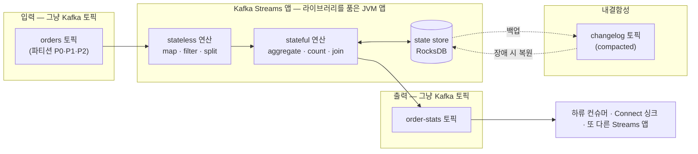
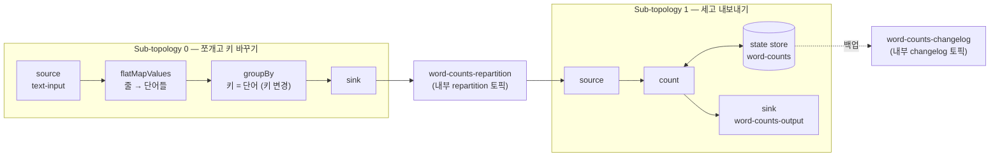
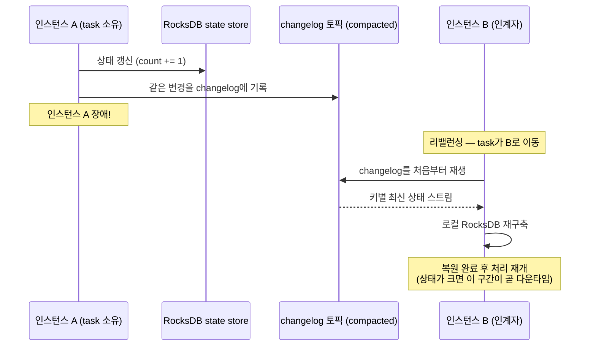

<figure class="post-figure post-figure--header">
<svg role="img" aria-label="Kafka Streams를 한 장으로 정리한 그림. 위쪽은 처리 파이프라인으로, 왼쪽의 입력 토픽(파티션 칸들)이 화살표로 가운데의 토폴로지 상자에 들어간다. 토폴로지 상자는 'JVM 앱 안의 라이브러리'라고 표시되어 있고, 내부에서 source가 map/filter 프로세서를 거쳐 aggregate 프로세서로 이어지며, aggregate 아래에는 RocksDB state store 실린더가 붙어 있다. state store에서 아래의 changelog 토픽으로 백업 화살표가 내려가고, 토폴로지의 출력은 오른쪽 출력 토픽으로 나간다. 아래쪽은 stream-table 이원성으로, 왼쪽의 KStream(오프셋 순서로 흐르는 레코드 칸들)과 오른쪽의 KTable(키별 최신값이 담긴 테이블 행들)이 양방향 화살표로 연결되어 '접으면 테이블, 펼치면 스트림'임을 보여 준다." viewBox="0 0 680 350" xmlns="http://www.w3.org/2000/svg">
  <title>Kafka Streams — 입력 토픽에서 토폴로지(상태 저장·changelog)를 거쳐 출력 토픽으로, 그리고 KStream/KTable 이원성</title>
  <defs>
    <marker id="kfk-s6-arrow" viewBox="0 0 10 10" refX="8" refY="5" markerWidth="6" markerHeight="6" orient="auto-start-reverse">
      <path d="M0,0 L10,5 L0,10 z" fill="var(--secondary-color)"/>
    </marker>
    <marker id="kfk-s6-gold" viewBox="0 0 10 10" refX="8" refY="5" markerWidth="6" markerHeight="6" orient="auto-start-reverse">
      <path d="M0,0 L10,5 L0,10 z" fill="var(--gold)"/>
    </marker>
    <marker id="kfk-s6-acc" viewBox="0 0 10 10" refX="8" refY="5" markerWidth="6" markerHeight="6" orient="auto-start-reverse">
      <path d="M0,0 L10,5 L0,10 z" fill="var(--accent-color)"/>
    </marker>
  </defs>

  <!-- title -->
  <text x="340" y="24" text-anchor="middle" font-size="17" font-weight="800" fill="currentColor" letter-spacing="1.5">KAFKA STREAMS</text>
  <text x="340" y="44" text-anchor="middle" font-size="10.5" font-weight="700" fill="currentColor" opacity="0.72">클러스터가 아니라 라이브러리 — 토픽에서 읽어 상태를 쌓고 다시 토픽으로</text>

  <!-- ===== SECTION A: pipeline ===== -->
  <!-- input topic -->
  <text x="75" y="72" text-anchor="middle" font-size="9.5" font-weight="700" fill="currentColor" opacity="0.72">입력 토픽</text>
  <rect x="20" y="82" width="110" height="24" rx="2" fill="var(--bg-panel)" stroke="currentColor" stroke-width="2"/>
  <g stroke="currentColor" stroke-width="1" opacity="0.45">
    <line x1="42" y1="82" x2="42" y2="106"/>
    <line x1="64" y1="82" x2="64" y2="106"/>
    <line x1="86" y1="82" x2="86" y2="106"/>
    <line x1="108" y1="82" x2="108" y2="106"/>
  </g>
  <text x="75" y="122" text-anchor="middle" font-size="8" fill="currentColor" opacity="0.7">파티션 = 병렬성의 단위</text>

  <!-- arrow input -> topology -->
  <line x1="130" y1="94" x2="166" y2="94" stroke="var(--secondary-color)" stroke-width="2" marker-end="url(#kfk-s6-arrow)"/>

  <!-- topology box -->
  <rect x="170" y="60" width="300" height="130" rx="6" fill="var(--bg-light)" stroke="var(--gold)" stroke-width="2.5"/>
  <text x="320" y="76" text-anchor="middle" font-size="10" font-weight="800" fill="var(--gold)">토폴로지 — JVM 앱 안의 라이브러리</text>

  <!-- source node -->
  <circle cx="200" cy="104" r="10" fill="var(--bg-panel)" stroke="currentColor" stroke-width="2"/>
  <text x="200" y="128" text-anchor="middle" font-size="8" font-weight="700" fill="currentColor" opacity="0.8">source</text>

  <!-- map/filter processor -->
  <line x1="210" y1="104" x2="238" y2="104" stroke="var(--secondary-color)" stroke-width="2" marker-end="url(#kfk-s6-arrow)"/>
  <rect x="242" y="90" width="78" height="28" rx="3" fill="var(--bg-panel)" stroke="currentColor" stroke-width="2"/>
  <text x="281" y="108" text-anchor="middle" font-size="8.5" font-weight="700" fill="currentColor">map · filter</text>

  <!-- aggregate processor -->
  <line x1="320" y1="104" x2="348" y2="104" stroke="var(--secondary-color)" stroke-width="2" marker-end="url(#kfk-s6-arrow)"/>
  <rect x="352" y="90" width="78" height="28" rx="3" fill="var(--bg-panel)" stroke="var(--accent-color)" stroke-width="2.2"/>
  <text x="391" y="108" text-anchor="middle" font-size="8.5" font-weight="700" fill="currentColor">aggregate</text>

  <!-- state store cylinder under aggregate -->
  <g>
    <ellipse cx="391" cy="140" rx="30" ry="7" fill="var(--bg-panel)" stroke="var(--accent-color)" stroke-width="2"/>
    <rect x="361" y="140" width="60" height="24" fill="var(--bg-panel)" stroke="none"/>
    <line x1="361" y1="140" x2="361" y2="164" stroke="var(--accent-color)" stroke-width="2"/>
    <line x1="421" y1="140" x2="421" y2="164" stroke="var(--accent-color)" stroke-width="2"/>
    <ellipse cx="391" cy="164" rx="30" ry="7" fill="var(--bg-panel)" stroke="var(--accent-color)" stroke-width="2"/>
    <text x="391" y="158" text-anchor="middle" font-size="7.5" font-weight="700" fill="currentColor">state store</text>
  </g>
  <line x1="391" y1="118" x2="391" y2="130" stroke="var(--accent-color)" stroke-width="2" marker-end="url(#kfk-s6-acc)"/>
  <text x="330" y="158" text-anchor="end" font-size="7.5" fill="currentColor" opacity="0.7">RocksDB (로컬)</text>

  <!-- arrow topology -> output topic -->
  <line x1="470" y1="104" x2="506" y2="104" stroke="var(--secondary-color)" stroke-width="2" marker-end="url(#kfk-s6-arrow)"/>

  <!-- output topic -->
  <text x="590" y="72" text-anchor="middle" font-size="9.5" font-weight="700" fill="currentColor" opacity="0.72">출력 토픽</text>
  <rect x="510" y="82" width="110" height="24" rx="2" fill="var(--bg-panel)" stroke="currentColor" stroke-width="2"/>
  <g stroke="currentColor" stroke-width="1" opacity="0.45">
    <line x1="532" y1="82" x2="532" y2="106"/>
    <line x1="554" y1="82" x2="554" y2="106"/>
    <line x1="576" y1="82" x2="576" y2="106"/>
    <line x1="598" y1="82" x2="598" y2="106"/>
  </g>
  <text x="590" y="122" text-anchor="middle" font-size="8" fill="currentColor" opacity="0.7">결과도 그냥 토픽</text>

  <!-- changelog topic (backup of state store) -->
  <line x1="421" y1="152" x2="500" y2="196" stroke="var(--gold)" stroke-width="2" stroke-dasharray="5 4" marker-end="url(#kfk-s6-gold)"/>
  <text x="478" y="168" text-anchor="start" font-size="8" font-weight="700" fill="var(--gold)">백업 (변경마다 기록)</text>
  <rect x="452" y="200" width="168" height="22" rx="2" fill="var(--bg-panel)" stroke="var(--gold)" stroke-width="2"/>
  <g stroke="var(--gold)" stroke-width="1" opacity="0.5">
    <line x1="486" y1="200" x2="486" y2="222"/>
    <line x1="520" y1="200" x2="520" y2="222"/>
    <line x1="554" y1="200" x2="554" y2="222"/>
    <line x1="588" y1="200" x2="588" y2="222"/>
  </g>
  <text x="536" y="236" text-anchor="middle" font-size="8.5" font-weight="700" fill="var(--gold)">changelog 토픽 — 장애 시 여기서 상태 복원</text>

  <!-- ===== divider ===== -->
  <line x1="30" y1="252" x2="650" y2="252" stroke="currentColor" stroke-width="1.4" opacity="0.25"/>

  <!-- ===== SECTION B: stream-table duality ===== -->
  <text x="340" y="272" text-anchor="middle" font-size="10.5" font-weight="700" fill="currentColor" opacity="0.72">stream-table 이원성 — 접으면 테이블, 펼치면 스트림</text>

  <!-- KStream: flowing records -->
  <text x="145" y="292" text-anchor="middle" font-size="9.5" font-weight="800" fill="var(--secondary-color)">KStream</text>
  <g fill="var(--bg-panel)" stroke="currentColor" stroke-width="1.6">
    <rect x="50" y="300" width="38" height="22" rx="2"/>
    <rect x="94" y="300" width="38" height="22" rx="2"/>
    <rect x="138" y="300" width="38" height="22" rx="2"/>
    <rect x="182" y="300" width="38" height="22" rx="2"/>
  </g>
  <g font-size="7.5" font-weight="700" fill="currentColor" text-anchor="middle">
    <text x="69" y="314">a:1</text>
    <text x="113" y="314">b:1</text>
    <text x="157" y="314">a:2</text>
    <text x="201" y="314">b:5</text>
  </g>
  <line x1="224" y1="311" x2="244" y2="311" stroke="var(--secondary-color)" stroke-width="2" marker-end="url(#kfk-s6-arrow)"/>
  <text x="145" y="340" text-anchor="middle" font-size="8" fill="currentColor" opacity="0.7">이벤트 하나하나가 사실(fact)</text>

  <!-- duality double arrow -->
  <g stroke="var(--gold)" stroke-width="2.2" fill="none">
    <line x1="300" y1="304" x2="378" y2="304" marker-end="url(#kfk-s6-gold)"/>
    <line x1="378" y1="318" x2="300" y2="318" marker-end="url(#kfk-s6-gold)"/>
  </g>
  <text x="339" y="297" text-anchor="middle" font-size="7.5" font-weight="700" fill="var(--gold)">키별 최신값으로 접기</text>
  <text x="339" y="333" text-anchor="middle" font-size="7.5" font-weight="700" fill="var(--gold)">변경 이력으로 펼치기</text>

  <!-- KTable: latest value per key -->
  <text x="535" y="292" text-anchor="middle" font-size="9.5" font-weight="800" fill="var(--accent-color)">KTable</text>
  <rect x="440" y="298" width="190" height="20" rx="2" fill="var(--bg-panel)" stroke="var(--accent-color)" stroke-width="2"/>
  <rect x="440" y="318" width="190" height="20" rx="2" fill="var(--bg-panel)" stroke="var(--accent-color)" stroke-width="2"/>
  <g font-size="8" font-weight="700" fill="currentColor" text-anchor="start">
    <text x="452" y="312">a → 2</text>
    <text x="452" y="332">b → 5</text>
  </g>
  <text x="535" y="348" text-anchor="middle" font-size="8" fill="currentColor" opacity="0.7">키별 최신 상태(state)</text>
</svg>
<figcaption>이 글을 한 장으로 — 입력 토픽이 토폴로지(map/filter → aggregate + state store)를 거쳐 출력 토픽으로 흐르고, 상태는 changelog 토픽에 백업된다. 아래는 KStream(사실의 흐름)과 KTable(키별 최신 상태)의 이원성</figcaption>
</figure>

## 들어가며

[Kafka Essential Curriculum](/2026/07/12/kafka-essential-curriculum.html)의 6단계이자 **마지막 단계**입니다. 지금까지 우리는 로그가 어떻게 저장되는지(1단계 — 분산 로그·토픽·파티션), 어떻게 쓰고 병렬로 읽는지(2단계 — 프로듀서/컨슈머·컨슈머 그룹), 어떻게 정확히 한 번 전달하는지([3단계 — 전달 보장](/2026/07/15/kafka-delivery-guarantees.html)), 어떻게 외부 시스템과 잇는지(4단계 — Connect·CDC), 그리고 데이터의 형태를 어떻게 계약으로 지키는지(5단계 — Schema Registry)를 다뤘습니다. 남은 질문은 하나입니다 — **로그 위에서 데이터를 바로 처리할 수는 없는가?**

Kafka Streams가 그 답입니다. 그리고 이 도구의 첫인상에서 가장 중요한 사실은 이것입니다 — **Kafka Streams는 클러스터가 아니라 라이브러리입니다.** Spark처럼 잡을 제출할 클러스터도, Flink처럼 JobManager/TaskManager를 운영할 별도 인프라도 없습니다. 여러분의 JVM 애플리케이션에 의존성 하나를 추가하고 `main()`에서 실행하면, 그 앱이 Kafka 토픽을 읽어 변환·집계·조인하고 결과를 다시 토픽으로 내보냅니다. 병렬 처리와 장애 복구는 앞 단계에서 익힌 파티션 모델과 컨슈머 그룹 프로토콜이 그대로 감당하고, exactly-once 처리는 3단계의 트랜잭션이 그대로 받쳐 줍니다. 즉 Kafka Streams는 새로운 분산 시스템이 아니라, **이 시리즈에서 쌓아 온 모든 것을 재료로 조립한 처리 계층**입니다. 그래서 이 글이 시리즈의 완결편이기도 합니다.

스트림 처리 자체의 큰 그림 — 이벤트 시간, 윈도잉, 상태 관리가 왜 필요한지 — 은 오버뷰 시리즈의 [데이터 변환·처리(Processing)](/2026/06/25/data-processing.html)에서 잡았습니다. 이번에는 그 개념들이 Kafka Streams라는 구체적인 도구에서 **어떤 API와 어떤 내부 구조로** 구현되는지를 손에 잡히게 다룹니다.

<div class="post-summary-box" markdown="1">

### 📌 이 글에서 다루는 내용

- **스트림 처리 DSL**: 라이브러리이지 클러스터가 아닌 배포 모델(파티션 기반 병렬성·컨슈머 그룹 위에 얹힘), KStream vs KTable vs GlobalKTable과 stream-table duality, stateless(map/filter/split)와 stateful(aggregate/count/join) 연산, 토폴로지(source→processor→sink)와 sub-topology·repartition 토픽
- **상태 저장과 내결함성**: RocksDB state store, changelog 토픽으로 백업·복원되는 로컬 상태, `num.standby.replicas`로 복구 시간 줄이기, interactive queries, 리밸런싱 시 상태 복원 비용
- **윈도잉과 정확성**: 이벤트 시간 vs 처리 시간, 텀블링/호핑/슬라이딩/세션 윈도, grace period와 지각 레코드, suppress, `processing.guarantee=exactly_once_v2`(3단계 트랜잭션 위에 얹힘), 그리고 경계 — 언제 Streams로 충분하고 언제 Flink 같은 전용 엔진이 필요한가

</div>

## 한눈에 보기 — 로그에서 처리까지

이 글의 스파인을 한 장으로 그리면 이렇습니다. 입력 토픽의 레코드가 토폴로지를 따라 흐르며 stateless 연산으로 다듬어지고, stateful 연산에서 로컬 state store에 상태를 쌓으며, 그 상태는 changelog 토픽으로 백업되어 장애를 견딥니다. 결과는 다시 토픽으로 나가고, 이 read-process-write 루프 전체가 3단계의 트랜잭션으로 exactly-once가 됩니다.



입력도 출력도 백업도 전부 "그냥 Kafka 토픽"이라는 점이 이 그림의 요체입니다. Streams는 Kafka 바깥에 아무것도 만들지 않습니다.

## 스트림 처리 DSL — 라이브러리이지 클러스터가 아니다

### 배포 모델: 그냥 JVM 앱이다

Kafka Streams 앱의 전체 뼈대는 이렇습니다. 프레임워크에 잡을 제출하는 코드가 아니라, 어디서나 볼 수 있는 평범한 `main()`입니다.

```java
public class OrderStatsApp {

    public static void main(String[] args) {
        Properties props = new Properties();
        // 같은 application.id를 가진 인스턴스들이 하나의 "논리적 앱"을 이룬다
        props.put(StreamsConfig.APPLICATION_ID_CONFIG, "order-stats-app");
        props.put(StreamsConfig.BOOTSTRAP_SERVERS_CONFIG, "broker1:9092");
        props.put(StreamsConfig.DEFAULT_KEY_SERDE_CLASS_CONFIG, Serdes.String().getClass());
        props.put(StreamsConfig.DEFAULT_VALUE_SERDE_CLASS_CONFIG, Serdes.String().getClass());

        StreamsBuilder builder = new StreamsBuilder();
        // ... 여기에 토폴로지를 선언한다 (아래에서 계속) ...

        KafkaStreams streams = new KafkaStreams(builder.build(), props);
        streams.start();                       // 백그라운드 스레드들이 처리를 시작

        Runtime.getRuntime().addShutdownHook(new Thread(streams::close));
    }
}
```

이 앱을 어떻게 확장하고 어떻게 장애를 견디는가 — 답은 전부 앞 단계에서 배운 것입니다.

- **병렬성은 파티션에서 나옵니다.** 입력 토픽의 파티션 하나당 **stream task** 하나가 만들어지고, task가 병렬 처리의 단위입니다. 입력 토픽이 12개 파티션이면 task도 12개 — 1단계에서 "파티션이 병렬성의 상한"이라 했던 그 규칙이 처리 계층까지 그대로 올라옵니다.
- **확장은 인스턴스를 더 띄우는 것입니다.** 같은 `application.id`로 앱을 3대 띄우면, 컨슈머 그룹 프로토콜(2단계)이 12개 task를 3대에 4개씩 나눠 배정합니다. 인스턴스가 죽으면 리밸런싱으로 남은 인스턴스가 그 task를 넘겨받습니다. 스케줄러도, 리소스 매니저도 필요 없습니다 — `kubectl scale`이나 인스턴스 추가만으로 끝입니다.
- **좌표 관리도 Kafka가 합니다.** 어디까지 처리했는지는 오프셋 커밋으로, 그룹 멤버십은 group coordinator가 — 전부 Kafka 브로커가 이미 하던 일입니다.

이 배포 모델의 함의는 큽니다. 스트림 처리가 "데이터 팀의 별도 클러스터에 제출하는 잡"이 아니라 **마이크로서비스와 똑같이 배포·모니터링·스케일하는 애플리케이션**이 됩니다. 반대로, 클러스터가 없다는 것은 자원 격리·중앙 스케줄링 같은 클러스터의 이점도 없다는 뜻입니다 — 이 트레이드오프는 글 마지막의 "경계" 절에서 다시 만납니다.

### KStream vs KTable — 같은 토픽, 두 가지 읽기

Kafka Streams DSL의 중심에는 추상화 두 개가 있습니다. 같은 토픽도 무엇으로 읽느냐에 따라 의미가 달라집니다.

- **KStream** — 레코드 하나하나가 **독립적인 사실(fact)**입니다. "주문 #100이 발생했다", "페이지뷰가 찍혔다"처럼, 각 레코드는 이전 레코드를 대체하지 않고 나란히 쌓입니다. 같은 키의 레코드가 두 번 오면 사건이 두 번 일어난 것입니다.
- **KTable** — 레코드가 키별 **상태의 갱신(update)**입니다. "고객 #7의 등급이 GOLD가 되었다"처럼, 같은 키의 새 레코드는 이전 값을 **대체**합니다. 어느 시점에 KTable을 들여다보면 "키별 최신값"이라는 테이블이 보입니다. 값이 `null`인 레코드(tombstone)는 그 키의 삭제를 뜻합니다.

이 둘이 서로의 다른 표현이라는 것이 **stream-table duality**입니다. 테이블의 변경 이력을 시간순으로 펼치면 스트림(changelog)이 되고, 스트림을 키별 최신값으로 접으면 테이블이 됩니다. 낯선 개념이 아닙니다 — 4단계에서 본 CDC가 정확히 "테이블 → 스트림" 방향이고, Streams의 KTable은 "스트림 → 테이블" 방향입니다. 5단계까지의 Kafka가 "DB의 바깥"에서 로그를 다뤘다면, Streams는 로그 위에서 테이블을 다시 세우는 셈입니다.

```java
StreamsBuilder builder = new StreamsBuilder();

// 같은 빌더에서 — 무엇으로 읽느냐가 곧 의미 선언이다
KStream<String, Order> orders =
    builder.stream("orders");              // 주문 사건의 흐름: 레코드마다 독립

KTable<String, Customer> customers =
    builder.table("customers");            // 고객별 최신 상태: 같은 키는 대체

GlobalKTable<String, Product> products =
    builder.globalTable("products");       // 전체 복제본: 모든 인스턴스가 전량 보유
```

세 번째 **GlobalKTable**은 KTable의 변형입니다. KTable은 파티션 단위로 나뉘어 각 task가 자기 파티션 몫만 들고 있지만, GlobalKTable은 **모든 인스턴스가 토픽 전체를 복제**해 들고 있습니다. 조인할 때 차이가 드러납니다 — KTable과의 조인은 양쪽이 같은 키·같은 파티션 수로 정렬된 **co-partitioning**을 요구하지만, GlobalKTable은 전량을 들고 있으므로 아무 키로나(심지어 값에서 뽑은 외래 키로도) 조인할 수 있습니다. 상품 목록·환율표·설정처럼 **작고 조회 위주인 참조 데이터**에 어울리고, 큰 토픽을 globalTable로 읽으면 모든 인스턴스가 전량을 저장하는 비용을 치릅니다.

### stateless와 stateful — 상태가 필요한 순간 비용이 달라진다

DSL 연산은 두 부류로 나뉘고, 이 구분이 곧 비용의 구분입니다.

**Stateless 연산**은 레코드 하나만 보고 결정합니다. 기억할 것이 없으므로 state store도, 디스크도, 복구할 것도 없습니다.

```java
KStream<String, Order> orders = builder.stream("orders");

// map/mapValues: 변환 — 키를 안 바꾸는 mapValues가 더 싸다 (repartition 불필요)
KStream<String, OrderSummary> summaries =
    orders.mapValues(order -> new OrderSummary(order.getId(), order.getAmount()));

// filter: 걸러내기
KStream<String, Order> bigOrders =
    orders.filter((customerId, order) -> order.getAmount() > 100_000);

// split/branch: 조건에 따라 스트림을 여러 갈래로 (구 branch()의 새 API)
Map<String, KStream<String, Order>> branches = orders
    .split(Named.as("orders-"))
    .branch((k, o) -> o.getStatus().equals("PAID"),      Branched.as("paid"))
    .branch((k, o) -> o.getStatus().equals("CANCELLED"), Branched.as("cancelled"))
    .defaultBranch(Branched.as("other"));

branches.get("orders-paid").to("paid-orders");
branches.get("orders-cancelled").to("cancelled-orders");
```

**Stateful 연산**은 레코드 하나만으로 답할 수 없는 질문 — "지금까지 몇 건인가"(count), "누적 합계는"(aggregate/reduce), "이 주문의 고객 정보는"(join) — 을 다룹니다. 과거를 기억해야 하므로 **state store**가 필요하고, 여기서부터 이 글의 두 번째 주제(상태 저장)가 시작됩니다.

```java
// aggregate: 고객별 누적 주문 금액 — 키별 상태를 state store에 쌓는다
KTable<String, Double> totalsByCustomer = orders
    .groupByKey()                                          // 키가 이미 customerId라면 repartition 없음
    .aggregate(
        () -> 0.0,                                         // initializer: 상태 초기값
        (customerId, order, total) -> total + order.getAmount(),  // adder
        Materialized.<String, Double, KeyValueStore<Bytes, byte[]>>as("order-totals")
            .withValueSerde(Serdes.Double())               // state store 이름·serde 지정
    );

totalsByCustomer.toStream().to("customer-order-totals",
    Produced.with(Serdes.String(), Serdes.Double()));
```

집계의 결과 타입이 `KTable`이라는 점을 눈여겨보세요. "고객별 누적 금액"은 키별 최신 상태이므로 자연스럽게 테이블입니다 — duality가 API 시그니처에 그대로 반영되어 있습니다.

stateful 연산의 대표 격인 **stream-table join**도 봅니다. 흐르는 주문(KStream)에 고객의 최신 상태(KTable)를 붙여 enrichment하는, 실무에서 가장 흔한 패턴입니다.

```java
KStream<String, Order> orders = builder.stream("orders");          // 키: customerId
KTable<String, Customer> customers = builder.table("customers");   // 키: customerId

// 주문이 도착한 "그 순간"의 고객 최신 상태를 붙인다
KStream<String, EnrichedOrder> enriched = orders.join(
    customers,
    (order, customer) -> new EnrichedOrder(order, customer.getTier(), customer.getRegion())
);

enriched.to("enriched-orders");
```

조인의 종류별 성격만 짚어 두면 — **KStream-KTable join**은 스트림 레코드가 도착한 시점의 테이블 값을 조회하는 lookup이고(위 예제), **KStream-KStream join**은 양쪽 다 흐르는 사건이므로 "얼마나 가까운 시간에 일어난 사건끼리 맺을 것인가"라는 **윈도**(`JoinWindows`)가 반드시 필요하며, **KTable-KTable join**은 두 테이블의 최신 상태끼리의 조인으로 결과도 KTable입니다. KStream-KTable·KStream-KStream 조인은 양쪽 토픽의 co-partitioning(같은 키, 같은 파티션 수)을 전제하고, 그것이 안 될 때의 탈출구가 GlobalKTable 조인입니다.

### 토폴로지 — source에서 sink까지, 그리고 repartition

DSL 코드는 실행되기 전에 **토폴로지(topology)**라는 처리 그래프로 컴파일됩니다. 노드는 세 종류입니다 — 토픽에서 읽는 **source processor**, 변환·집계하는 **processor**, 토픽으로 쓰는 **sink processor**. dbt가 `ref()`에서 DAG를 추론하듯, Streams는 DSL 호출 체인에서 이 그래프를 얻습니다.

여기서 실무적으로 중요한 개념이 **repartition**입니다. `groupBy()`나 `selectKey()`, 키를 바꾸는 `map()`처럼 **키가 달라지는 연산 뒤에 stateful 연산이 오면**, 같은 키가 같은 task에 모인다는 보장이 깨집니다. Streams는 이때 내부적으로 **repartition 토픽**을 만들어 데이터를 새 키 기준으로 다시 파티셔닝합니다 — 즉 한 번 Kafka에 썼다가 다시 읽습니다. 그리고 repartition 토픽을 경계로 토폴로지가 **sub-topology**로 쪼개집니다. sub-topology마다 task가 따로 만들어지므로, repartition은 병렬성의 재배치이자 **네트워크·저장 비용**입니다.

고전적인 word-count로 확인해 봅니다.

```java
StreamsBuilder builder = new StreamsBuilder();

KStream<String, String> lines = builder.stream("text-input");

KTable<String, Long> wordCounts = lines
    .flatMapValues(line -> Arrays.asList(line.toLowerCase().split("\\W+")))
    .groupBy((key, word) -> word)            // 키 변경! → repartition 발생
    .count(Materialized.as("word-counts"));  // stateful: state store 생성

wordCounts.toStream().to("word-counts-output",
    Produced.with(Serdes.String(), Serdes.Long()));

Topology topology = builder.build();
System.out.println(topology.describe());     // 토폴로지를 눈으로 확인하는 습관
```

`topology.describe()` 출력(요지)을 보면 sub-topology 분리가 그대로 드러납니다.

```text
Topologies:
   Sub-topology: 0
    Source: KSTREAM-SOURCE-0000000000 (topics: [text-input])
      --> KSTREAM-FLATMAPVALUES-0000000001
    Processor: KSTREAM-FLATMAPVALUES-0000000001 (stores: [])
      --> KSTREAM-KEY-SELECT-0000000002
    Processor: KSTREAM-KEY-SELECT-0000000002 (stores: [])
      --> word-counts-repartition-sink
    Sink: word-counts-repartition-sink (topic: word-counts-repartition)

  Sub-topology: 1
    Source: word-counts-repartition-source (topics: [word-counts-repartition])
      --> KSTREAM-AGGREGATE-0000000003
    Processor: KSTREAM-AGGREGATE-0000000003 (stores: [word-counts])
      --> KTABLE-TOSTREAM-0000000004
    Processor: KTABLE-TOSTREAM-0000000004 (stores: [])
      --> KSTREAM-SINK-0000000005
    Sink: KSTREAM-SINK-0000000005 (topic: word-counts-output)
```

Sub-topology 0은 줄을 단어로 쪼개 새 키(단어)로 `word-counts-repartition` 토픽에 쓰고, Sub-topology 1이 그것을 읽어 단어별로 세어 state store `word-counts`에 쌓습니다. `(stores: [word-counts])` 표기가 stateless/stateful의 경계를 정확히 보여 줍니다. `mapValues`가 `map`보다 권장되는 이유도 여기 있습니다 — 키를 건드리지 않는다고 선언하면 Streams가 불필요한 repartition을 만들지 않습니다.



내부 토픽 이름은 `<application.id>-<이름>-repartition`, `<application.id>-<store>-changelog` 규칙을 따릅니다. `kafka-topics --list`에서 이 토픽들을 처음 발견하고 놀라는 것이 Streams 운영의 통과의례입니다 — 지우면 안 되는, 앱의 일부입니다.

## 상태 저장과 내결함성 — 로컬처럼 빠르게, 로그처럼 안전하게

### state store: 상태는 RocksDB에, 로컬에 둔다

count·aggregate·join·윈도 집계가 쌓는 상태는 **state store**에 저장됩니다. 기본 구현은 각 task의 로컬 디스크에 붙는 임베디드 **RocksDB**입니다(`state.dir`, 기본 `/tmp/kafka-streams` 아래 task별 디렉토리). 왜 로컬일까요? 레코드 하나 처리할 때마다 원격 DB를 왕복하면 처리량이 네트워크 지연에 묶입니다. 상태를 task 옆에 두면 조회·갱신이 로컬 디스크(그리고 대부분 메모리 캐시) 속도가 되고, 파티션 모델 덕분에 **같은 키는 항상 같은 task로 오므로** 로컬만 봐도 정합이 맞습니다. 상태가 메모리보다 커도 RocksDB가 디스크로 흘려 감당합니다.

그런데 로컬 디스크는 인스턴스와 함께 죽습니다. 여기서 Kafka다운 해법이 나옵니다.

### changelog 토픽: 상태의 백업도 결국 로그다

state store에 쓰이는 모든 변경은 **changelog 토픽**이라는 내부 토픽에도 함께 기록됩니다. changelog는 **compacted 토픽**(1단계의 log compaction)이므로 키별 최신값만 유지되어 크기가 상태 크기에 수렴하고, 인스턴스가 죽어 task가 다른 인스턴스로 옮겨 가면 새 인스턴스는 **changelog를 처음부터 재생(replay)해 RocksDB를 다시 채운 뒤** 처리를 재개합니다. "상태의 백업이 곧 로그이고, 복원이 곧 재생"이라는, 이 시리즈 1단계의 커밋 로그 철학이 상태 관리에까지 관철되는 지점입니다.



이 그림에서 실무의 아픈 지점도 보입니다 — **복원에는 시간이 걸립니다.** 상태가 수십 GB면 changelog 재생에 수 분에서 수십 분이 걸릴 수 있고, 그동안 해당 task의 처리는 멈춥니다. 리밸런싱이 잦은 환경(배포·오토스케일링)에서는 이 복원 비용이 Streams 운영의 핵심 변수입니다. 완화 장치가 두 겹 있습니다.

- **standby replica** — `num.standby.replicas=1`로 설정하면, task의 상태 사본을 **다른 인스턴스가 changelog를 미리 따라 읽으며** 준비해 둡니다. 장애 시 task는 이미 상태가 (거의) 갖춰진 standby 보유 인스턴스로 우선 배정되어, 복원이 "전체 재생"에서 "따라잡기"로 줄어듭니다. 비용은 상태 저장 공간과 네트워크의 복제분입니다.
- **점진적 리밸런싱** — 최신 Streams의 cooperative rebalancing과 warmup replica(KIP-441)는 "상태가 준비된 곳으로만 task를 옮기는" 방향으로 리밸런싱 자체를 개선했습니다. 그래도 원칙은 같습니다 — **stateful 앱에서 task 이동은 공짜가 아니다.**

```java
Properties props = new Properties();
props.put(StreamsConfig.APPLICATION_ID_CONFIG, "order-stats-app");
props.put(StreamsConfig.BOOTSTRAP_SERVERS_CONFIG, "broker1:9092");

// 상태 사본을 한 벌 더 — 장애 시 복원을 "재생"이 아니라 "따라잡기"로
props.put(StreamsConfig.NUM_STANDBY_REPLICAS_CONFIG, 1);

// state store 위치 (기본 /tmp는 재부팅에 날아간다 — 운영에선 영속 볼륨에)
props.put(StreamsConfig.STATE_DIR_CONFIG, "/var/lib/kafka-streams");
```

### interactive queries — 상태를 밖에서 조회하기

state store는 처리의 내부 구현이지만, **interactive queries**로 바깥에 노출할 수도 있습니다. `Materialized.as("order-totals")`처럼 이름을 준 store는 실행 중인 앱에서 직접 조회할 수 있습니다.

```java
// 실행 중인 앱에서 state store를 읽기 전용으로 열기
ReadOnlyKeyValueStore<String, Double> store = streams.store(
    StoreQueryParameters.fromNameAndType("order-totals", QueryableStoreTypes.keyValueStore())
);
Double total = store.get("customer-42");   // 이 인스턴스가 가진 파티션의 키만 보인다
```

주의할 점은 각 인스턴스가 **자기 파티션 몫의 상태만** 가진다는 것입니다. 여러 인스턴스로 확장된 앱에서 임의 키를 조회하려면 `streams.queryMetadataForKey()`로 그 키를 가진 인스턴스를 찾아 HTTP 등으로 넘겨주는 라우팅 계층을 직접 짜야 합니다. "집계 결과를 서빙하는 API를 별도 DB 없이 만든다"는 매력적인 패턴이지만, 라우팅·복원 중 가용성 등 챙길 것이 있어 여기서는 존재와 원리만 짚어 둡니다.

## 윈도잉과 정확성 — 시간을 다루고, 정확히 한 번 처리한다

### 이벤트 시간 vs 처리 시간

"분당 주문 수"를 셀 때의 **분**은 어느 시계의 분일까요? 두 후보가 있습니다 — 사건이 실제로 일어난 시각인 **이벤트 시간(event time)**과, 레코드가 Streams 앱에 도착해 처리되는 시각인 **처리 시간(processing time)**. 네트워크 지연·재시도·컨슈머 랙 때문에 둘은 얼마든지 벌어질 수 있고, 분석의 정답은 거의 항상 이벤트 시간입니다("장애로 10분 늦게 도착한 주문"도 원래 시각의 분에 세어져야 하므로).

Kafka Streams는 기본적으로 레코드의 **타임스탬프**(프로듀서가 찍은 CreateTime, 또는 `TimestampExtractor`로 페이로드에서 추출한 시각)를 이벤트 시간으로 사용합니다. 그리고 파티션별로 관측된 타임스탬프의 최댓값을 **stream time**으로 삼아 전진시킵니다 — "윈도가 닫혔는가"의 판정은 벽시계가 아니라 이 stream time으로 합니다. 이 개념 틀(이벤트 시간·워터마크·지각 데이터)은 오버뷰 [처리 포스트](/2026/06/25/data-processing.html)의 윈도잉 절에서 잡은 것과 같고, Streams에서는 grace period라는 형태로 구체화됩니다.

### 네 가지 윈도

| 윈도 | 모양 | API | 어울리는 질문 |
| --- | --- | --- | --- |
| **텀블링(tumbling)** | 고정 크기, 겹치지 않음 | `TimeWindows.ofSizeAndGrace(size, grace)` | "5분마다 5분치 집계" — 대시보드 지표 |
| **호핑(hopping)** | 고정 크기, 일정 간격으로 겹침 | `TimeWindows.ofSizeAndGrace(...).advanceBy(step)` | "1분마다 갱신되는 최근 5분 집계" — 이동 지표 |
| **슬라이딩(sliding)** | 레코드 시각 기준 상대 구간 | `SlidingWindows.ofTimeDifferenceAndGrace(diff, grace)` | "서로 5분 이내에 일어난 사건들" — 근접 조인·집계 |
| **세션(session)** | 활동 간격 기반, 크기 가변 | `SessionWindows.ofInactivityGapAndGrace(gap, grace)` | "30분 쉬면 세션 종료" — 사용자 세션 분석 |

텀블링은 호핑의 특수형(간격 = 크기)이고, 호핑 윈도에서는 레코드 하나가 여러 윈도에 속합니다. 세션 윈도만 크기가 데이터에 따라 달라집니다 — 활동이 이어지는 한 윈도가 늘어나고, `inactivityGap`만큼 조용하면 닫힙니다.

윈도 집계의 코드 모양은 이렇습니다. "고객별 · 5분 텀블링 윈도 · 주문 건수"를 세는 예입니다.

```java
KStream<String, Order> orders = builder.stream("orders");

KTable<Windowed<String>, Long> ordersPerWindow = orders
    .groupByKey()
    .windowedBy(TimeWindows.ofSizeAndGrace(
        Duration.ofMinutes(5),          // 윈도 크기: 5분 텀블링
        Duration.ofMinutes(1)))         // grace: 1분 늦은 레코드까지 받아 준다
    .count(Materialized.as("orders-per-5min"));

// 윈도가 닫힐 때 최종 결과 한 건만 내보낸다 (중간 갱신 억제)
ordersPerWindow
    .suppress(Suppressed.untilWindowCloses(Suppressed.BufferConfig.unbounded()))
    .toStream()
    .map((windowedKey, count) -> KeyValue.pair(
        windowedKey.key() + "@" + windowedKey.window().startTime(), count))
    .to("orders-per-5min-final", Produced.with(Serdes.String(), Serdes.Long()));
```

결과 키 타입이 `Windowed<String>`인 것에 주목하세요 — 윈도 집계의 결과는 "키"가 아니라 "키 × 윈도"별 상태입니다.

### grace period · 지각 레코드 · suppress

위 코드의 두 장치가 이벤트 시간 처리의 정확성을 좌우합니다.

**grace period**는 "윈도의 논리적 끝 이후에도 얼마나 늦게 온 레코드까지 받아 줄 것인가"입니다. `ofSizeAndGrace(5분, 1분)`이면 12:00~12:05 윈도는 stream time이 12:06을 넘을 때 최종적으로 닫히고, 그 사이에 도착한 12:03짜리 지각 레코드는 올바른 윈도에 반영됩니다. grace를 넘겨 도착한 레코드는 **버려집니다**(메트릭에 dropped로 집계). grace가 길수록 정확하지만 결과 확정이 늦고 상태를 오래 들고 있어야 하며, 짧을수록 빠르지만 지각 데이터를 잃습니다 — 지연의 실제 분포를 보고 정하는 트레이드오프입니다.

**suppress**는 출력 시점의 문제를 다룹니다. KTable은 기본적으로 갱신될 때마다 하류로 변경을 흘려보내므로, 5분 윈도 하나에서 중간 집계값이 수백 번 방출될 수 있습니다. 하류가 "확정된 최종값 한 건"을 원한다면(알림 발송, 일 마감 집계 등) `suppress(untilWindowCloses(...))`로 윈도가 grace까지 완전히 닫힌 뒤 **한 번만** 내보내게 합니다. 대가는 버퍼 메모리와 지연입니다 — 대시보드처럼 "계속 갱신되는 근사값"이 오히려 좋은 소비자라면 suppress 없이 그대로 흘리는 편이 맞습니다.

### exactly_once_v2 — 3단계 트랜잭션 위에 얹힌 한 줄

스트림 처리는 정확히 3단계에서 예고했던 **consume-process-produce 루프**입니다 — 입력 토픽에서 읽고(consume), 상태를 갱신하며 처리하고(process), 출력·changelog 토픽에 쓴다(produce). 그리고 3단계의 결론이 "exactly-once는 이 루프에서만 온전히 성립하며, 트랜잭션이 그것을 가능하게 한다"였습니다. Kafka Streams는 그 결론을 설정 한 줄로 켜는 포장입니다.

```java
props.put(StreamsConfig.PROCESSING_GUARANTEE_CONFIG,
          StreamsConfig.EXACTLY_ONCE_V2);   // processing.guarantee=exactly_once_v2
```

이 한 줄이 켜는 것은 전부 3단계에서 배운 부품입니다 — 프로듀서는 **멱등 + 트랜잭션** 모드가 되고, 각 task의 "출력 레코드 쓰기 + changelog 쓰기 + 입력 오프셋 커밋"이 **하나의 트랜잭션으로 원자적으로** 묶이며, 하류 컨슈머가 `read_committed`로 읽으면 중단된 트랜잭션의 결과는 보이지 않습니다. 처리 도중 앱이 죽으면 트랜잭션이 abort되고, 재시작한 task는 마지막 커밋 지점부터 다시 처리합니다 — 출력도 상태도 오프셋도 함께 되감기므로 중복도 유실도 없습니다. `_v2`는 초기 EOS가 task마다 프로듀서를 하나씩 두던 것을 인스턴스당 하나로 줄여(KIP-447) 확장성을 개선한 버전으로, 현재의 표준 선택지입니다. 유의점도 3단계 그대로입니다 — 보장 범위는 **Kafka 토픽 사이**입니다. 처리 중에 외부 API를 호출하거나 외부 DB에 쓰는 부수 효과는 트랜잭션이 되감아 주지 않습니다.

### 경계 — 언제 Streams로 충분하고, 언제 전용 엔진인가

마지막으로 정직한 경계 긋기입니다. Kafka Streams는 훌륭하지만 만능이 아니고, Flink·Spark Structured Streaming 같은 전용 엔진이 서는 자리가 분명히 있습니다.

**Streams로 충분한 경우** — 다음 조건이 겹칠 때 Streams는 가장 마찰이 적은 선택입니다.

- **입력도 출력도 Kafka**인 파이프라인 (Streams는 Kafka 전용입니다 — 다른 소스/싱크는 Connect를 앞뒤에 세워야 합니다)
- 팀이 **JVM 애플리케이션을 배포·운영하는 방식** 그대로 스트림 처리를 운영하고 싶을 때 — 별도 클러스터·별도 운영 지식이 필요 없다는 것이 최대 장점
- 상태 크기가 인스턴스 로컬 디스크로 감당되는 수준이고, 이벤트 시간·윈도 요구가 DSL 표현력 안에 있을 때
- 마이크로서비스 안에 처리 로직을 **내장**하고 싶을 때 (서비스가 곧 스트림 프로세서)

**전용 엔진이 필요한 경우** — 다음 신호가 보이면 Flink(또는 Spark Structured Streaming)를 검토할 때입니다.

- **Kafka 밖의 소스/싱크**를 일급으로 다뤄야 할 때 — Flink는 파일·DB·큐 등 커넥터 생태계가 자체에 내장되어 있고, Spark는 레이크하우스 배치와 한 코드베이스로 묶입니다
- **아주 큰 상태**(수백 GB~TB)와 그 운영 — Flink의 체크포인트(분산 스냅숏)는 changelog 재생 방식보다 대규모 상태의 복구·재배치에 유리하고, savepoint로 상태를 보존한 채 잡을 재배포·리스케일하는 운영이 성숙해 있습니다
- **복잡한 이벤트 시간 처리** — 세밀한 워터마크 제어, 복합 이벤트 패턴 매칭(CEP), 타이머 기반의 자유로운 저수준 로직
- **SQL로 스트림을 다루고 싶은 조직**, 배치·스트림을 한 엔진으로 통일하려는 아키텍처, 그리고 처리 자원을 중앙 클러스터에서 격리·스케줄링해야 하는 규모

요약하면 — **"Kafka에서 Kafka로, 앱으로 배포"면 Streams, "그 이상"이면 전용 엔진**입니다. 그 "그 이상"의 세계, 즉 Flink를 축으로 한 전용 스트림 처리 엔진은 별도의 심화 시리즈인 [Stream Processing Essential Curriculum](/2026/07/12/stream-processing-essential-curriculum.html)에서 다룹니다 — 이 글에서 그은 경계선의 저쪽 편을 그 시리즈가 이어받습니다.

## 정리

Kafka-Essential의 마지막 단계를 정리합니다.

- **Kafka Streams는 클러스터가 아니라 라이브러리다**: 의존성 하나를 품은 평범한 JVM 앱이며, 병렬성은 파티션당 하나씩 만들어지는 stream task에서, 확장과 장애 복구는 컨슈머 그룹 프로토콜에서 나온다. 새 인프라 없이, 1~2단계에서 배운 그 모델 위에 그대로 얹힌다.
- **KStream과 KTable은 같은 로그의 두 얼굴이다**: 사실의 흐름으로 읽으면 KStream, 키별 최신 상태로 접으면 KTable(전량 복제본은 GlobalKTable) — stream-table duality가 DSL 전체의 문법이고, 집계의 결과가 KTable인 이유다. 키를 바꾸는 연산 뒤의 stateful 연산은 repartition 토픽을 만들고 토폴로지를 sub-topology로 쪼갠다 — `topology.describe()`로 확인하는 습관을 들이자.
- **상태는 로컬 RocksDB에, 백업은 changelog 토픽에**: 조회·갱신은 로컬 속도로, 내결함성은 compacted 로그의 재생으로 얻는다. 다만 복원은 공짜가 아니므로 — 상태가 크면 리밸런싱이 곧 다운타임이므로 — `num.standby.replicas`로 사본을 준비해 둔다. 이름 붙인 store는 interactive queries로 밖에서 조회할 수도 있다.
- **윈도잉의 정확성은 이벤트 시간 + grace + suppress의 합이다**: 텀블링/호핑/슬라이딩/세션 윈도를 이벤트 시간(stream time) 기준으로 판정하고, grace period로 지각 레코드를 받아 주며, 최종값 한 건이 필요하면 suppress로 윈도가 닫힐 때만 방출한다.
- **exactly-once는 설정 한 줄이지만, 내용물은 3단계 전부다**: `processing.guarantee=exactly_once_v2`는 멱등 프로듀서 + 트랜잭션 + 오프셋의 원자적 커밋을 consume-process-produce 루프에 묶어 주는 포장이다. 보장 범위는 Kafka 토픽 사이이며, 외부 부수 효과는 되감지 못한다.
- **경계를 알고 쓰자**: Kafka에서 Kafka로, 앱으로 배포할 수 있는 처리라면 Streams가 가장 마찰이 적다. Kafka 밖 소스/싱크, 초대형 상태, 복잡한 이벤트 시간·CEP, SQL 중심 조직이라면 Flink 같은 전용 엔진의 자리다.

이로써 **Kafka-Essential 6단계를 완주했습니다.** 출발점은 "Kafka는 큐가 아니라 분산 커밋 로그"라는 관점 전환(1단계)이었습니다. 그 로그에 프로듀서로 쓰고 컨슈머 그룹으로 병렬로 읽는 법(2단계), 멱등과 트랜잭션으로 정확히 한 번 전달하는 법(3단계)을 익혀 로그를 신뢰할 수 있게 만들었고, Connect·CDC로 외부 시스템을 로그에 잇고(4단계) Schema Registry로 로그 위의 데이터에 계약을 세운 뒤(5단계), 마지막으로 그 로그 위에서 상태를 쌓아 바로 처리하는 Streams(6단계)까지 왔습니다. 되돌아보면 하나의 그림입니다 — **append-only 로그 하나가 수집(Connect)과 통합(Registry라는 계약)과 처리(Streams)를 모두 떠받치는 데이터 플랫폼의 중추가 되는 그림.** 이 그림을 갖고 있으면, 어떤 실시간 파이프라인 설계 논의에서도 "무엇이 로그에 쌓이고, 누가 어떤 보장으로 읽고, 상태는 어디서 복원되는가"를 물을 수 있습니다. 그것이 이 시리즈가 남기려던 안목입니다.

### 다음 학습 (Next Learning)

- [Kafka Essential Curriculum](/2026/07/12/kafka-essential-curriculum.html) — 시리즈 로드맵(완주!)으로 돌아가 전체 여정 복기하기
- [Stream Processing Essential Curriculum (Flink)](/2026/07/12/stream-processing-essential-curriculum.html) — 전용 스트림 엔진 심화, 이 글에서 그은 Streams의 경계 너머
- [데이터 변환·처리(Processing): 배치·스트림 엔진과 SQL 변환](/2026/06/25/data-processing.html) — 오버뷰의 이벤트 시간·윈도잉 절과 이어서 읽기
