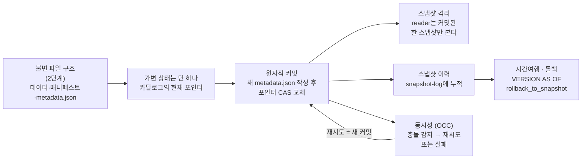
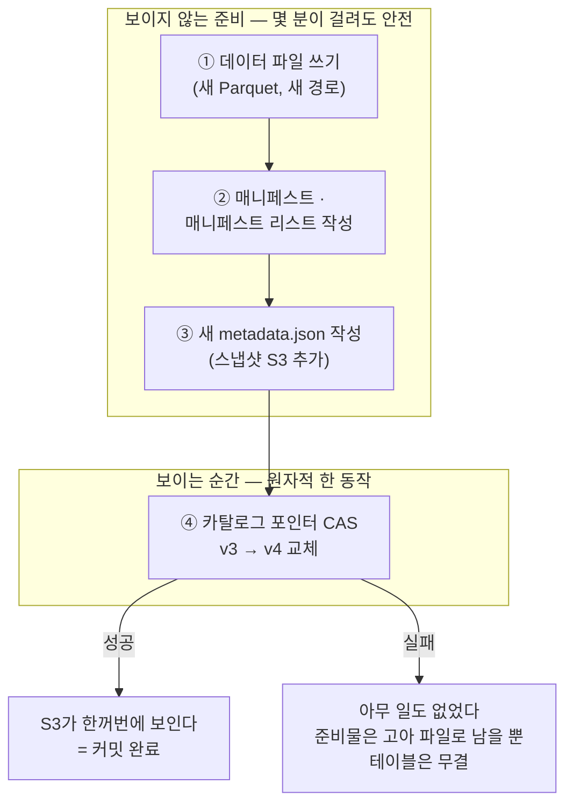
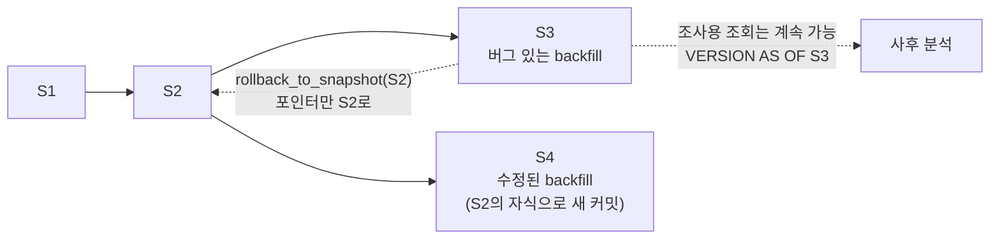
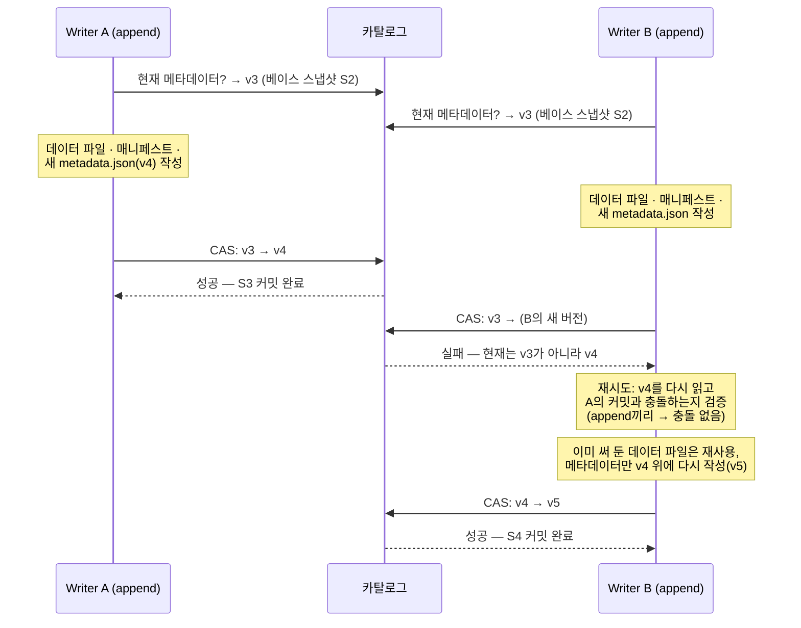
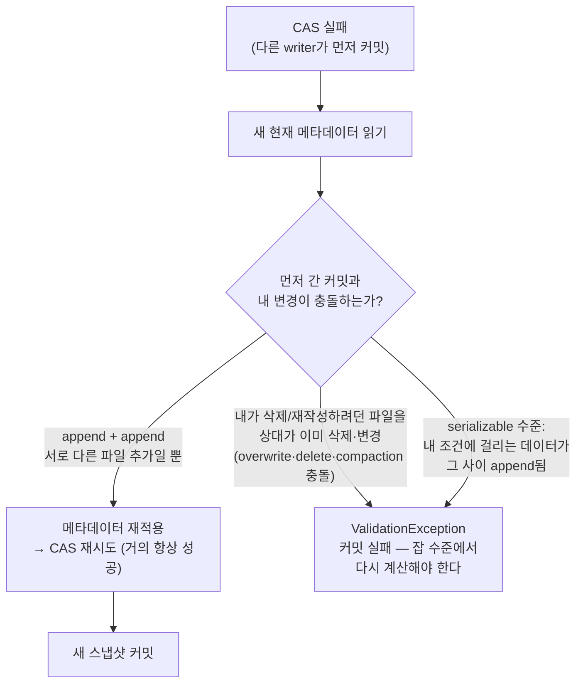

<figure class="post-figure post-figure--header">
<svg role="img" aria-label="ACID·스냅샷·시간여행을 한 장으로 정리한 그림. 가운데에 스냅샷 S1, S2, S3가 놓인 타임라인이 있고, 위의 카탈로그 상자에서 내려오는 현재 포인터가 S2를 가리키던 점선 화살표에서 S3를 가리키는 실선 화살표로 compare-and-swap 교체된다. 타임라인 아래 왼쪽의 reader는 S2에 고정된 채 일관된 조회를 계속하고, 오른쪽의 writer는 새 metadata.json을 써서 S3를 커밋한다. 타임라인 위로는 S3에서 S1까지 되돌아가는 점선 화살표가 시간여행과 롤백을 뜻한다." viewBox="0 0 680 300" xmlns="http://www.w3.org/2000/svg">
  <title>ACID · 스냅샷 · 시간여행 — 카탈로그 포인터의 원자적 교체 위에 세워지는 격리와 이력</title>
  <defs>
    <marker id="lh-s3-arrow" viewBox="0 0 10 10" refX="8" refY="5" markerWidth="6" markerHeight="6" orient="auto-start-reverse">
      <path d="M0,0 L10,5 L0,10 z" fill="var(--secondary-color)"/>
    </marker>
    <marker id="lh-s3-tt" viewBox="0 0 10 10" refX="8" refY="5" markerWidth="6" markerHeight="6" orient="auto-start-reverse">
      <path d="M0,0 L10,5 L0,10 z" fill="var(--accent-color)"/>
    </marker>
    <marker id="lh-s3-gold" viewBox="0 0 10 10" refX="8" refY="5" markerWidth="6" markerHeight="6" orient="auto-start-reverse">
      <path d="M0,0 L10,5 L0,10 z" fill="var(--gold)"/>
    </marker>
    <marker id="lh-s3-old" viewBox="0 0 10 10" refX="8" refY="5" markerWidth="6" markerHeight="6" orient="auto-start-reverse">
      <path d="M0,0 L10,5 L0,10 z" fill="currentColor" opacity="0.4"/>
    </marker>
  </defs>

  <!-- title -->
  <text x="340" y="24" text-anchor="middle" font-size="17" font-weight="800" fill="currentColor" letter-spacing="1.5">ACID · SNAPSHOTS · TIME TRAVEL</text>
  <text x="340" y="44" text-anchor="middle" font-size="10.5" font-weight="700" fill="currentColor" opacity="0.72">커밋 = 새 metadata.json + 포인터의 원자적 교체(CAS), 그 위의 격리·이력·시간여행</text>

  <!-- catalog box -->
  <rect x="280" y="58" width="120" height="30" rx="4" fill="var(--bg-light)" stroke="var(--gold)" stroke-width="2.5"/>
  <text x="340" y="78" text-anchor="middle" font-size="10.5" font-weight="700" fill="currentColor">카탈로그</text>

  <!-- old pointer (dashed, to S2) and new pointer (solid, to S3) -->
  <line x1="316" y1="88" x2="235" y2="158" stroke="currentColor" stroke-width="1.6" stroke-dasharray="4 3" opacity="0.4" marker-end="url(#lh-s3-old)"/>
  <text x="252" y="118" text-anchor="middle" font-size="8.5" fill="currentColor" opacity="0.55">이전 포인터</text>
  <line x1="364" y1="88" x2="443" y2="158" stroke="var(--gold)" stroke-width="2.5" marker-end="url(#lh-s3-gold)"/>
  <text x="432" y="118" text-anchor="middle" font-size="9" font-weight="700" fill="var(--gold)">CAS 교체</text>

  <!-- time-travel arc (above timeline, S3 back to S1) -->
  <path d="M488,156 Q340,108 122,158" fill="none" stroke="var(--accent-color)" stroke-width="1.8" stroke-dasharray="4 3" marker-end="url(#lh-s3-tt)"/>
  <text x="180" y="128" text-anchor="middle" font-size="9" font-weight="700" fill="var(--accent-color)">시간여행 · 롤백</text>

  <!-- timeline baseline + commit arrows -->
  <line x1="80" y1="176" x2="560" y2="176" stroke="currentColor" stroke-width="1.6" opacity="0.35"/>
  <g stroke="var(--secondary-color)" stroke-width="2" fill="none">
    <line x1="130" y1="176" x2="204" y2="176" marker-end="url(#lh-s3-arrow)"/>
    <line x1="250" y1="176" x2="424" y2="176" marker-end="url(#lh-s3-arrow)"/>
  </g>

  <!-- snapshot nodes -->
  <g text-anchor="middle" font-weight="700">
    <!-- S1 -->
    <circle cx="112" cy="176" r="17" fill="var(--bg-panel)" stroke="var(--secondary-color)" stroke-width="2.5"/>
    <g stroke="currentColor" stroke-width="1" opacity="0.5"><line x1="104" y1="172" x2="120" y2="172"/><line x1="104" y1="178" x2="120" y2="178"/><line x1="112" y1="168" x2="112" y2="182"/></g>
    <text x="112" y="208" font-size="10.5" fill="currentColor">S1</text>
    <!-- S2 -->
    <circle cx="228" cy="176" r="17" fill="var(--bg-panel)" stroke="var(--accent-color)" stroke-width="2.5"/>
    <g stroke="currentColor" stroke-width="1" opacity="0.5"><line x1="220" y1="172" x2="236" y2="172"/><line x1="220" y1="178" x2="236" y2="178"/><line x1="228" y1="168" x2="228" y2="182"/></g>
    <text x="228" y="208" font-size="10.5" fill="currentColor">S2</text>
    <!-- S3 (new, gold) -->
    <circle cx="448" cy="176" r="17" fill="var(--bg-panel)" stroke="var(--gold)" stroke-width="3"/>
    <g stroke="currentColor" stroke-width="1" opacity="0.5"><line x1="440" y1="172" x2="456" y2="172"/><line x1="440" y1="178" x2="456" y2="178"/><line x1="448" y1="168" x2="448" y2="182"/></g>
    <text x="448" y="208" font-size="10.5" fill="currentColor">S3 · 새 커밋</text>
  </g>

  <!-- reader pinned to S2 -->
  <rect x="164" y="236" width="128" height="30" rx="4" fill="var(--bg-light)" stroke="var(--accent-color)" stroke-width="2"/>
  <circle cx="184" cy="251" r="6" fill="none" stroke="var(--accent-color)" stroke-width="1.8"/>
  <circle cx="184" cy="251" r="2" fill="var(--accent-color)"/>
  <text x="242" y="255" text-anchor="middle" font-size="9.5" font-weight="700" fill="currentColor">reader — S2에 고정</text>
  <line x1="228" y1="232" x2="228" y2="197" stroke="var(--accent-color)" stroke-width="1.8" stroke-dasharray="3 3" marker-end="url(#lh-s3-tt)"/>

  <!-- writer committing S3 -->
  <rect x="384" y="236" width="150" height="30" rx="4" fill="var(--bg-light)" stroke="var(--secondary-color)" stroke-width="2"/>
  <path d="M400,258 l10,-10 l4,4 l-10,10 l-5,1 z" fill="none" stroke="var(--secondary-color)" stroke-width="1.8"/>
  <text x="470" y="255" text-anchor="middle" font-size="9.5" font-weight="700" fill="currentColor">writer — S3 커밋</text>
  <line x1="448" y1="232" x2="448" y2="197" stroke="var(--secondary-color)" stroke-width="1.8" marker-end="url(#lh-s3-arrow)"/>

  <!-- bottom caption -->
  <text x="340" y="290" text-anchor="middle" font-size="9.5" fill="currentColor" opacity="0.72">reader는 커밋 도중에도 깨진 상태를 보지 않는다 — 포인터가 바뀌기 전까지 S3는 세상에 없는 파일들이다</text>
</svg>
<figcaption>커밋은 카탈로그 포인터의 원자적 교체(CAS) 한 순간 — reader는 자기 스냅샷(S2)에 고정된 채 일관된 조회를 계속하고, 과거 스냅샷으로는 시간여행·롤백이 가능하다</figcaption>
</figure>

## 들어가며

[2단계](/2026/07/15/lakehouse-iceberg-metadata-manifests.html)에서 우리는 Iceberg 테이블의 뼈대를 손에 넣었습니다 — **테이블의 상태는 metadata.json 파일 하나이고, 그 아래로 매니페스트 리스트·매니페스트·데이터 파일이 매달린다.** 그리고 그 모든 파일은 한 번 쓰이면 절대 수정되지 않는 **불변(immutable)** 파일이라는 사실도요. 이번 글은 그 구조가 지불하는 배당금 중 첫 번째이자 가장 큰 것을 다룹니다: **트랜잭션**.

핵심 문장은 하나입니다 — **파일은 전부 불변이므로, 테이블의 가변 상태는 "현재 metadata.json이 무엇인가"라는 카탈로그의 포인터 하나뿐이고, 커밋은 그 포인터를 원자적으로 교체(compare-and-swap)하는 한 동작이다.** 원자성을 위해 웨어하우스처럼 WAL도, 락 매니저도, 트랜잭션 코디네이터도 필요 없습니다. 포인터 교체가 성공하면 커밋 전체가 성공한 것이고, 실패하면 아무 일도 일어나지 않은 것입니다. 이 한 동작 위에서 스냅샷 격리, 시간여행, 롤백, 그리고 여러 writer의 동시 커밋까지 — 이 글의 모든 주제가 성립합니다.

이 글은 [Lakehouse Essential Curriculum](/2026/07/12/lakehouse-essential-curriculum.html)의 3단계이자, 시리즈 두 번째 막 "무엇을 할 수 있나(3~4단계)"의 출발점입니다. 1단계에서 "파일 목록 기반 Hive 테이블은 원자적 커밋이 불가능하다"는 문제의식을 세웠고, 2단계에서 그 해법인 메타데이터 계층을 익혔다면, 이번에는 그 계층이 실제로 **어떻게 웨어하우스급 트랜잭션을 오브젝트 스토리지 위에 세우는지**를 커밋의 해부부터 두 writer의 충돌 시나리오까지 손에 잡히게 따라갑니다.

<div class="post-summary-box" markdown="1">

### 📌 이 글에서 다루는 내용

- **원자적 커밋과 스냅샷 격리**: 커밋 = 새 metadata.json 작성 + 카탈로그 포인터의 compare-and-swap 교체, 불변 파일 구조에서 왜 포인터 하나가 원자성의 전부인지, 쓰기 중인 파일이 reader에게 절대 노출되지 않는 이유, serializable vs snapshot isolation 수준의 차이
- **시간여행과 롤백**: 스냅샷 이력(`snapshots`·`history` 메타데이터 테이블), `VERSION AS OF` / `TIMESTAMP AS OF` 조회, `rollback_to_snapshot`·`cherrypick_snapshot` 프로시저, 재현 가능한 실험·감사·디버깅 활용, 시간여행 보존 기간과 스냅샷 만료(5단계)의 긴장
- **동시성**: optimistic concurrency control — 두 writer가 동시에 커밋할 때의 충돌 감지(베이스 스냅샷 비교)와 재시도(메타데이터 재적용 vs 데이터 충돌 시 실패), append끼리는 병합되고 overwrite/delete는 충돌하는 이유, `commit.retry.*` 설정, 스트리밍 writer + 배치 compaction 동시 운용 시나리오

</div>

## 한눈에 보기 — 포인터 교체에서 시간여행까지

이 글의 스파인을 한 장으로 그리면 이렇습니다. 모든 것은 "파일은 불변, 포인터만 상태"라는 설계에서 출발합니다. 그 포인터를 원자적으로 교체하는 것이 커밋이고, 교체가 남기는 발자국이 스냅샷 이력이며, 이력이 있으므로 시간여행과 롤백이 되고, 포인터를 놓고 경쟁하는 여러 writer는 낙관적 동시성 제어로 조율됩니다.



왼쪽의 전제(불변 파일 + 포인터 하나)를 받아들이면 오른쪽의 능력들(격리·시간여행·동시성)이 차례로 따라 나옵니다. 이 인과의 사슬이 이 글 전체의 좌표축입니다.

## 원자적 커밋 — 포인터 교체가 원자성의 전부다

### 커밋의 해부 — 준비는 길고, 커밋은 한 순간이다

Iceberg writer가 `INSERT`나 `MERGE`를 수행할 때 실제로 일어나는 일을 순서대로 풀면 이렇습니다.

1. **데이터 파일 쓰기**: 새 Parquet 파일들을 오브젝트 스토리지의 새 경로에 씁니다. 몇 분이 걸려도 상관없습니다 — 아직 아무 메타데이터도 이 파일들을 가리키지 않으므로, 어떤 reader에게도 보이지 않습니다.
2. **매니페스트 작성**: 새 데이터 파일들의 목록과 통계를 담은 매니페스트 파일, 그리고 그것을 묶는 매니페스트 리스트를 씁니다. 여전히 보이지 않습니다.
3. **새 metadata.json 작성**: 새 스냅샷(S3)을 스냅샷 목록에 추가한 새 메타데이터 파일(`v4.metadata.json` 같은)을 씁니다. 파일은 존재하지만, 카탈로그가 가리키지 않으므로 여전히 세상에 없는 것과 같습니다.
4. **포인터 교체 (커밋)**: 카탈로그에 "현재 메타데이터가 `v3`이면 `v4`로 바꿔 달라"고 요청합니다 — **compare-and-swap(CAS)**. 이 한 번의 원자적 연산이 성공하는 순간, 위의 모든 준비물이 한꺼번에 테이블의 일부가 됩니다.



이 그림에서 눈여겨볼 것은 **①~③과 ④ 사이의 비대칭**입니다. 준비 단계는 아무리 길고 아무리 많은 파일을 써도 테이블의 상태에 영향을 주지 않습니다. 반면 ④는 카탈로그가 제공하는 단일 원자 연산 하나입니다. "부분적으로 커밋된 상태"라는 것이 구조적으로 존재할 수 없습니다 — 포인터는 `v3`이거나 `v4`이지, 그 중간이 없기 때문입니다.

이것이 1단계에서 본 Hive 테이블과의 결정적 차이입니다. Hive는 "디렉터리에 파일이 있는가"가 곧 상태였으므로, 파일을 쓰는 도중의 reader는 절반만 쓰인 결과를 보았습니다. Iceberg는 "파일이 존재하는가"와 "테이블의 일부인가"를 분리했고, 후자를 포인터 하나로 환원했습니다.

### 왜 포인터 하나로 충분한가 — 불변성이 산 원자성

여기서 2단계의 설계가 배당금을 지불합니다. Iceberg의 모든 파일 — 데이터 파일, 매니페스트, 매니페스트 리스트, metadata.json — 은 **한 번 쓰이면 절대 수정되지 않습니다.** 변경은 언제나 "새 파일을 쓰고, 새 메타데이터가 새 파일 집합을 가리키게" 하는 방식으로 표현됩니다.

<figure class="post-figure">
<svg role="img" aria-label="포인터 하나가 상태의 전부임을 보여주는 개념도. 아래쪽에 불변 파일의 바다가 있고, 그 안에 기존 데이터 파일 f1과 f2, 새 데이터 파일 f3, 그리고 각각의 매니페스트가 놓여 있다. 왼쪽 위의 v3.metadata.json은 f1과 f2를 참조하는 매니페스트를 가리키고, 오른쪽 위의 v4.metadata.json은 같은 f1·f2에 더해 새 파일 f3까지 참조한다. 두 메타데이터 버전은 파일을 공유하며 아무것도 수정하지 않는다. 맨 위 카탈로그의 현재 포인터가 v3에서 v4로 옮겨 가는 것만이 유일한 상태 변경이며, CAS 한 번이라는 라벨이 붙어 있다." viewBox="0 0 680 300" xmlns="http://www.w3.org/2000/svg">
  <title>불변 파일의 바다 위에서 유일하게 변하는 것 — 카탈로그의 현재 포인터</title>
  <defs>
    <marker id="lh-s3-imm-sec" viewBox="0 0 10 10" refX="8" refY="5" markerWidth="6" markerHeight="6" orient="auto-start-reverse">
      <path d="M0,0 L10,5 L0,10 z" fill="var(--secondary-color)"/>
    </marker>
    <marker id="lh-s3-imm-gold" viewBox="0 0 10 10" refX="8" refY="5" markerWidth="6" markerHeight="6" orient="auto-start-reverse">
      <path d="M0,0 L10,5 L0,10 z" fill="var(--gold)"/>
    </marker>
  </defs>

  <!-- catalog on top -->
  <rect x="280" y="18" width="120" height="30" rx="4" fill="var(--bg-light)" stroke="var(--gold)" stroke-width="2.5"/>
  <text x="340" y="38" text-anchor="middle" font-size="10.5" font-weight="700" fill="currentColor">카탈로그</text>

  <!-- old pointer (dashed to v3), new pointer (solid to v4) -->
  <line x1="308" y1="48" x2="200" y2="86" stroke="currentColor" stroke-width="1.6" stroke-dasharray="4 3" opacity="0.4" marker-end="url(#lh-s3-imm-sec)"/>
  <line x1="372" y1="48" x2="478" y2="86" stroke="var(--gold)" stroke-width="2.5" marker-end="url(#lh-s3-imm-gold)"/>
  <text x="340" y="72" text-anchor="middle" font-size="9" font-weight="700" fill="var(--gold)">유일한 상태 변경 = CAS 한 번</text>

  <!-- v3 / v4 metadata cards -->
  <rect x="110" y="90" width="150" height="34" rx="4" fill="var(--bg-light)" stroke="var(--accent-color)" stroke-width="2"/>
  <text x="185" y="111" text-anchor="middle" font-size="9.5" font-weight="700" fill="currentColor" font-family="monospace">v3.metadata.json</text>
  <rect x="420" y="90" width="150" height="34" rx="4" fill="var(--bg-light)" stroke="var(--gold)" stroke-width="2.5"/>
  <text x="495" y="111" text-anchor="middle" font-size="9.5" font-weight="700" fill="currentColor" font-family="monospace">v4.metadata.json</text>

  <!-- immutable sea panel -->
  <rect x="40" y="150" width="600" height="120" rx="6" fill="var(--bg-panel)" stroke="currentColor" stroke-width="1.5" opacity="0.95"/>
  <text x="340" y="170" text-anchor="middle" font-size="9.5" font-weight="700" fill="currentColor" opacity="0.7">불변 파일의 바다 — 한 번 쓰이면 아무도 수정하지 않는다</text>

  <!-- manifests -->
  <rect x="140" y="184" width="120" height="26" rx="3" fill="var(--bg-light)" stroke="var(--secondary-color)" stroke-width="2"/>
  <text x="200" y="201" text-anchor="middle" font-size="8.5" font-weight="700" fill="currentColor">매니페스트 (f1·f2)</text>
  <rect x="420" y="184" width="140" height="26" rx="3" fill="var(--bg-light)" stroke="var(--secondary-color)" stroke-width="2"/>
  <text x="490" y="201" text-anchor="middle" font-size="8.5" font-weight="700" fill="currentColor">매니페스트 (f1·f2·f3)</text>

  <!-- data files -->
  <g font-size="9" font-weight="700" text-anchor="middle">
    <rect x="150" y="228" width="76" height="26" rx="3" fill="var(--bg-light)" stroke="currentColor" stroke-width="2"/>
    <text x="188" y="245" fill="currentColor" font-family="monospace">f1.parquet</text>
    <rect x="302" y="228" width="76" height="26" rx="3" fill="var(--bg-light)" stroke="currentColor" stroke-width="2"/>
    <text x="340" y="245" fill="currentColor" font-family="monospace">f2.parquet</text>
    <rect x="454" y="228" width="76" height="26" rx="3" fill="var(--bg-light)" stroke="var(--gold)" stroke-width="2.5"/>
    <text x="492" y="245" fill="currentColor" font-family="monospace">f3.parquet</text>
  </g>
  <text x="492" y="266" text-anchor="middle" font-size="8" font-weight="700" fill="var(--gold)">새로 추가</text>

  <!-- metadata -> manifest edges -->
  <line x1="185" y1="124" x2="196" y2="180" stroke="var(--secondary-color)" stroke-width="1.8" marker-end="url(#lh-s3-imm-sec)"/>
  <line x1="495" y1="124" x2="492" y2="180" stroke="var(--secondary-color)" stroke-width="1.8" marker-end="url(#lh-s3-imm-sec)"/>

  <!-- manifest -> data-file edges (v3 manifest shares f1,f2; v4 manifest refs f1,f2,f3) -->
  <g stroke="var(--secondary-color)" stroke-width="1.5" fill="none" opacity="0.85">
    <line x1="190" y1="210" x2="188" y2="224" marker-end="url(#lh-s3-imm-sec)"/>
    <line x1="228" y1="210" x2="320" y2="224" marker-end="url(#lh-s3-imm-sec)"/>
    <line x1="452" y1="210" x2="216" y2="228" marker-end="url(#lh-s3-imm-sec)"/>
    <line x1="472" y1="210" x2="366" y2="226" marker-end="url(#lh-s3-imm-sec)"/>
    <line x1="492" y1="210" x2="492" y2="224" marker-end="url(#lh-s3-imm-sec)"/>
  </g>

  <!-- shared-files note -->
  <text x="264" y="288" text-anchor="middle" font-size="9" fill="currentColor" opacity="0.72">f1·f2는 두 버전이 공유 — 복사도 수정도 없다</text>
  <text x="500" y="288" text-anchor="middle" font-size="9" fill="currentColor" opacity="0.72">변한 것은 위의 포인터 하나뿐</text>
</svg>
<figcaption>v3과 v4는 불변 파일을 공유하며 나란히 존재한다 — 테이블에서 유일하게 변하는 것은 카탈로그의 현재 포인터이고, 그래서 원자성 문제가 CAS 한 번으로 줄어든다</figcaption>
</figure>

파일이 전부 불변이면, 테이블에서 **변하는 것은 단 하나 — "지금 어느 metadata.json이 현재인가"** 뿐입니다. 상태가 한 곳에 모이면 원자성 문제는 "그 한 곳을 원자적으로 바꿀 수 있는가"로 줄어들고, 그것은 카탈로그(데이터베이스의 조건부 UPDATE, DynamoDB의 conditional write, REST Catalog의 커밋 API 등)가 이미 잘 푸는 문제입니다. 웨어하우스가 WAL과 락으로 지키는 원자성을, Iceberg는 **상태를 포인터 하나로 좁히는 설계**로 삽니다.

같은 이유로 **쓰기 중인 파일이 노출될 수 없다**는 성질도 공짜로 얻습니다. reader가 파일을 찾는 유일한 경로는 metadata.json → 매니페스트 리스트 → 매니페스트 → 데이터 파일이라는 참조 사슬인데, 커밋 전의 새 파일들은 이 사슬 어디에도 등장하지 않기 때문입니다. "쓰다 만 파일을 읽을 위험"은 방어 코드가 아니라 구조가 제거합니다.

### 스냅샷 격리 — reader는 커밋된 한 시점만 본다

reader 쪽에서 보면 이 구조는 자연스럽게 **스냅샷 격리(snapshot isolation)**가 됩니다. 쿼리가 시작될 때 reader는 카탈로그에서 현재 metadata.json을 읽고, 그 안의 **현재 스냅샷 하나**를 골라 그 참조 사슬만 따라갑니다. 이후 쿼리가 몇 분을 돌든:

- 그 사이 writer가 새 스냅샷 S3를 커밋해도, reader는 이미 S2의 매니페스트를 따라가고 있으므로 **자기 시점의 일관된 데이터**를 끝까지 읽습니다. S2가 참조하는 파일들은 불변이고, (스냅샷이 만료되지 않는 한) 삭제되지도 않기 때문입니다.
- 다른 트랜잭션의 커밋 안 된 변경을 볼 일도 없습니다 — 커밋 안 된 변경이란 "어떤 스냅샷도 가리키지 않는 파일"이고, 그런 파일은 reader의 참조 사슬에 없습니다. **dirty read가 원천적으로 불가능**합니다.
- 읽기가 쓰기를 막지도, 쓰기가 읽기를 막지도 않습니다. 락이 없으므로 reader 수천 개와 writer가 공존해도 서로를 기다리지 않습니다.

정리하면: **하나의 쿼리는 하나의 커밋된 스냅샷만 본다.** 헤더 그림의 reader가 S2에 고정된 채로 조회를 계속하는 동안 writer가 S3를 커밋하는 그림이 바로 이것입니다.

### serializable vs snapshot isolation — 격리 수준의 선택

Iceberg는 행을 지우거나 갱신하는 쓰기(DELETE·UPDATE·MERGE)에 대해 두 가지 격리 수준을 제공합니다. 테이블 속성으로 연산별로 지정합니다.

```sql
ALTER TABLE lake.db.orders SET TBLPROPERTIES (
    'write.delete.isolation-level' = 'serializable',  -- 기본값
    'write.update.isolation-level' = 'serializable',
    'write.merge.isolation-level'  = 'snapshot'       -- 완화 가능
);
```

두 수준의 차이는 **"내가 조건을 평가한 뒤에 도착한 데이터"를 어떻게 취급하느냐**입니다.

| | serializable (기본) | snapshot |
| --- | --- | --- |
| 검증 범위 | 내 베이스 스냅샷 이후 **조건에 걸리는 새 데이터가 append**만 되어도 충돌 | 내가 **삭제/수정하려는 파일이 동시에 변경·삭제**된 경우만 충돌 |
| 보장 | 모든 커밋이 어떤 직렬 순서로 실행된 것과 동일 | 각 커밋은 일관된 스냅샷 위에서 수행 — 단, write skew 유형 이상 가능 |
| 비용 | 충돌·재시도가 잦음 (동시 append에도 실패) | 동시 append와 공존 가능, 처리량 유리 |

예를 들어 "status = 'cancelled'인 주문을 모두 삭제"하는 DELETE가 진행되는 동안 다른 writer가 cancelled 주문을 새로 append했다면 — serializable에서는 이 DELETE가 충돌로 실패합니다("직렬로 실행됐다면 그 행도 지워졌어야 한다"는 판단). snapshot 수준에서는 성공합니다(내가 건드린 파일과는 충돌하지 않았으므로). 감사·정합성이 중요한 테이블은 기본값(serializable)을 유지하고, 동시 쓰기 처리량이 중요한 테이블은 의미를 이해한 위에서 snapshot으로 완화하는 것이 실무의 감각입니다.

## 시간여행과 롤백 — 이력이 있으면 과거는 조회 대상이다

### 커밋의 발자국 — 스냅샷 이력 읽기

커밋이 포인터 교체라는 사실에는 부수 효과가 하나 있습니다. **이전 metadata.json과 이전 스냅샷이 사라지지 않는다**는 것입니다. 새 metadata.json은 이전 스냅샷 목록을 그대로 물려받은 채 새 스냅샷을 추가하고, 어느 시점에 어느 스냅샷이 현재였는지를 `snapshot-log`(history)에 기록합니다. 과거가 삭제가 아니라 **누적**되는 구조 — 시간여행의 재료가 여기서 나옵니다.

이력은 메타데이터 테이블로 SQL에서 바로 조회할 수 있습니다.

```sql
-- 이 테이블의 모든 스냅샷: 언제, 어떤 연산으로, 어떤 커밋이 있었나
SELECT snapshot_id, parent_id, committed_at, operation, summary
FROM lake.db.orders.snapshots
ORDER BY committed_at;

-- committed_at          snapshot_id          operation  summary
-- 2026-07-14 09:12:11   3821550127947089009  append     {added-data-files=42, added-records=1204931, ...}
-- 2026-07-14 21:40:03   5179486021997061102  overwrite  {deleted-data-files=3, added-data-files=2, ...}
-- 2026-07-15 06:02:57   8924563710294817203  append     {added-data-files=17, ...}

-- "언제 어느 스냅샷이 현재였나" — 롤백까지 포함한 포인터 이동의 연대기
SELECT made_current_at, snapshot_id, is_current_ancestor
FROM lake.db.orders.history;
```

`snapshots`가 "존재했던 모든 스냅샷"이라면 `history`는 "포인터가 지나간 자취"입니다. `operation` 컬럼(append / overwrite / delete / replace)과 `summary`의 파일 수·레코드 수는 "어젯밤 무슨 커밋이 테이블을 이렇게 만들었나"를 추적하는 일차 자료가 됩니다.

### VERSION AS OF · TIMESTAMP AS OF — 과거를 쿼리하기

이력이 있으므로 과거 시점 조회는 문법 하나 차이입니다. Spark SQL 기준으로:

```sql
-- 현재 스냅샷 조회 (평소의 쿼리)
SELECT count(*) FROM lake.db.orders;

-- 스냅샷 ID로 시간여행 — snapshots 테이블에서 찾은 ID를 그대로
SELECT count(*) FROM lake.db.orders VERSION AS OF 5179486021997061102;

-- 타임스탬프로 시간여행 — 그 시각에 현재였던 스냅샷을 찾아 읽는다
SELECT count(*) FROM lake.db.orders TIMESTAMP AS OF '2026-07-14 12:00:00';

-- 어제의 나와 오늘의 나를 비교 — 두 시점을 한 쿼리에서 조인
SELECT today.status, count(*)
FROM lake.db.orders AS today
LEFT ANTI JOIN (
    SELECT order_id FROM lake.db.orders TIMESTAMP AS OF '2026-07-14 00:00:00'
) AS yesterday
ON today.order_id = yesterday.order_id
GROUP BY today.status;   -- 어제 이후 새로 생긴 주문의 상태 분포
```

DataFrame API에서는 옵션으로 지정합니다.

```python
# 스냅샷 ID 고정 읽기 — 재현 가능한 실험의 핵심 한 줄
df = (spark.read
      .option("snapshot-id", 5179486021997061102)
      .format("iceberg")
      .load("lake.db.orders"))

# 특정 시각 기준 (epoch millis)
df = (spark.read
      .option("as-of-timestamp", "1752537600000")
      .format("iceberg")
      .load("lake.db.orders"))
```

메커니즘은 싱겁게 단순합니다 — `VERSION AS OF`는 현재 스냅샷 대신 **지정된 스냅샷의 매니페스트 리스트에서 참조 사슬을 시작**할 뿐입니다. 과거의 파일들은 불변인 채로 그 자리에 있으므로, 별도의 언두 로그도 버전 저장소도 필요 없습니다. 시간여행은 특수 기능이 아니라 "스냅샷 하나를 읽는다"는 평소 동작에서 스냅샷 선택만 바꾼 것입니다.

### 롤백과 cherry-pick — 포인터를 과거로 옮기기

잘못된 커밋을 발견했다면 — 이중 적재, 버그 있는 backfill, 실수로 지운 파티션 — 데이터를 복원할 필요가 없습니다. **포인터를 옮기면 됩니다.** Spark에서는 stored procedure를 `CALL`로 실행합니다.

```sql
-- 특정 스냅샷으로 롤백: 현재 포인터를 그 스냅샷으로 되돌린다
CALL lake.system.rollback_to_snapshot('db.orders', 3821550127947089009);

-- 특정 시각의 스냅샷으로 롤백
CALL lake.system.rollback_to_timestamp('db.orders', TIMESTAMP '2026-07-14 12:00:00');

-- 롤백이 아니라 "임의 스냅샷을 현재로" (조상이 아니어도 됨)
CALL lake.system.set_current_snapshot('db.orders', 3821550127947089009);

-- cherry-pick: 특정 스냅샷의 변경(예: staged된 overwrite)을
-- 현재 상태 위에 새 커밋으로 적용한다 — 이력을 되감지 않고 선택 적용
CALL lake.system.cherrypick_snapshot('db.orders', 8924563710294817203);
```

`rollback_to_snapshot`은 **현재 스냅샷의 조상**으로만 되돌릴 수 있습니다 — 이력을 되감는 연산이기 때문입니다. 중요한 것은 롤백조차 **파괴적이지 않다**는 점입니다. 롤백은 포인터 이동일 뿐 잘못된 스냅샷과 그 파일들은 여전히 존재하므로, 사고 조사를 위해 `VERSION AS OF`로 "잘못됐던 상태"를 계속 조회할 수 있습니다. 지우는 것은 나중에 스냅샷 만료(5단계)가 할 일입니다.



롤백 후 새 커밋(S4)은 S2의 자식으로 이어지고, S3는 현재 이력의 조상이 아닌 가지로 남습니다(`history` 테이블의 `is_current_ancestor = false`). Git에서 브랜치를 되돌리고 새 커밋을 쌓는 그림과 정확히 같은 위상입니다.

### 무엇에 쓰나 — 재현 · 감사 · 디버깅

시간여행이 실무에서 값을 하는 지점은 세 가지로 정리됩니다.

- **재현 가능한 실험**: ML 학습이나 리포트 검증에서 "그때 그 데이터"를 다시 읽어야 할 때, 스냅샷 ID 하나를 실험 메타데이터에 기록해 두면 끝입니다. `option("snapshot-id", ...)`로 읽는 학습 잡은 테이블이 계속 갱신되어도 언제나 같은 입력을 봅니다. 데이터 복사본을 뜨는 것보다 저장 비용이 0이고, "학습 데이터가 뭐였는지 모르겠다"는 사고가 사라집니다.
- **감사(audit)**: "6월 말 결산 시점의 잔액 테이블"을 감사인이 요구하면 `TIMESTAMP AS OF '2026-06-30 23:59:59'` 한 줄입니다. `snapshots.summary`와 결합하면 "누가(어느 잡이) 언제 무엇을 얼마나 바꿨나"의 연대기가 됩니다.
- **디버깅**: "대시보드 숫자가 오늘 아침부터 이상하다"는 신고가 오면, 어젯밤 스냅샷과 현재 스냅샷을 나란히 조회해 diff를 뜨고, `snapshots`에서 그 사이의 커밋(어느 연산, 몇 파일)을 특정합니다. 원인 커밋을 찾으면 롤백으로 즉시 복구하고, 잘못된 스냅샷은 남겨 사후 분석합니다.

### 시간여행의 유통기한 — 스냅샷 만료와의 긴장

여기까지 들으면 "과거를 영원히 보관하면 되겠네"라고 생각하기 쉽지만, 공짜가 아닙니다. 스냅샷이 살아 있는 한 **그 스냅샷이 참조하는 데이터 파일도 지울 수 없습니다.** overwrite로 대체된 옛 파일, compaction 전의 작은 파일들이 전부 스토리지에 쌓이고, 스냅샷 목록이 길어질수록 metadata.json도 비대해집니다.

그래서 운영에서는 **보존 기간을 정하고 오래된 스냅샷을 만료(expire)**시킵니다 — 기본값은 5일(`history.expire.max-snapshot-age-ms`)입니다. 만료된 스냅샷으로는 더 이상 시간여행할 수 없고, 그 스냅샷만 참조하던 파일은 물리적으로 삭제됩니다. 즉 **시간여행 가능 범위와 스토리지 비용은 정면으로 맞서는 트레이드오프**이고, "감사 요건은 90일을 요구하는데 스토리지는 7일을 원한다" 같은 긴장을 팀이 정책으로 풀어야 합니다. 이 만료 작업의 실제 운용(`expire_snapshots` 프로시저, 고아 파일 정리, 유지보수 잡 설계)은 5단계 compaction·유지보수가 다룹니다 — 여기서는 "시간여행은 무한하지 않고, 그 한계는 운영 정책이 정한다"는 감각만 챙겨 두면 됩니다.

## 동시성 — 두 writer가 같은 테이블에 커밋할 때

### optimistic concurrency control — 잠그지 않고, 검증한다

이제 마지막 질문입니다. writer가 하나라면 지금까지의 그림으로 충분하지만, **스트리밍 잡과 배치 잡이 같은 테이블에 동시에 커밋하면** 어떻게 될까요?

Iceberg의 답은 **낙관적 동시성 제어(optimistic concurrency control, OCC)**입니다. writer는 락을 잡지 않습니다. 각자 자신이 시작할 때 본 스냅샷(**베이스 스냅샷**)을 기억한 채 자유롭게 파일을 쓰고, 커밋 시점의 CAS가 심판을 봅니다 — "포인터가 아직 내 베이스 그대로인가?" 그대로면 커밋 성공, 다른 writer가 먼저 커밋해 포인터가 바뀌었으면 CAS가 실패하고, **충돌 해소는 그때 가서** 합니다.

두 writer가 부딪히는 전형적 흐름을 시퀀스로 그리면 이렇습니다.



핵심은 재시도의 **비용 구조**입니다. Writer B는 CAS에 졌지만, 몇 분에 걸쳐 써 둔 데이터 파일을 버리지 않습니다. 데이터 파일은 어차피 불변이고 아직 아무도 참조하지 않으므로 그대로 유효합니다. B가 다시 하는 일은 **새 현재 메타데이터(v4)를 읽고, 자기 변경을 그 위에 다시 표현하는 것** — 즉 매니페스트·metadata.json 수준의 값싼 재작성뿐입니다. 무거운 작업(데이터 쓰기)은 한 번, 가벼운 작업(메타데이터 재적용)만 재시도 — 이것이 OCC가 레이크하우스 워크로드에서 잘 작동하는 이유입니다.

### 충돌 검증 — 병합할 수 있는 충돌과 없는 충돌

재시도가 항상 성공하는 것은 아닙니다. CAS 실패 후 재시도 전에 Iceberg는 **먼저 커밋된 변경과 내 변경이 논리적으로 충돌하는지 검증(validation)**합니다. 판정 기준은 "두 커밋이 어떤 순서로 직렬화되어도 결과가 유효한가"입니다.



- **append끼리는 거의 항상 병합됩니다.** 서로 다른 새 파일을 추가할 뿐 기존 파일을 건드리지 않으므로, 어느 순서로 커밋되어도 결과는 "둘 다 추가된 테이블"로 동일합니다. 스트리밍 ingestion 여러 개가 한 테이블에 동시에 붙어도 안전한 이유입니다.
- **overwrite/delete가 겹치면 실패할 수 있습니다.** 내가 "지우겠다"고 계획한 파일을 상대 커밋이 이미 지웠거나 다른 파일로 재작성했다면, 내 변경은 더 이상 존재하지 않는 상태를 전제로 계산된 것입니다. 메타데이터 재적용으로 풀 수 없으므로 `ValidationException` 등으로 커밋이 실패하고, **잡이 새 스냅샷 위에서 변경 자체를 다시 계산**해야 합니다.
- **serializable 수준의 DELETE/UPDATE/MERGE**는 앞서 본 대로 한 단계 더 엄격합니다 — 내 조건에 걸리는 데이터가 그 사이 append만 되어도 충돌로 판정합니다.

### 커밋 재시도 설정 — 얼마나 끈질기게 다시 시도할 것인가

CAS 패배 후의 자동 재시도 횟수와 백오프는 테이블 속성으로 조절합니다.

```sql
ALTER TABLE lake.db.events SET TBLPROPERTIES (
    'commit.retry.num-retries'      = '10',      -- 재시도 횟수 (기본 4)
    'commit.retry.min-wait-ms'      = '100',     -- 첫 대기 (기본 100ms, 지수 백오프)
    'commit.retry.max-wait-ms'      = '60000',   -- 대기 상한 (기본 1분)
    'commit.retry.total-timeout-ms' = '1800000'  -- 커밋 전체 제한 (기본 30분)
);
```

동시 writer가 많은 테이블 — 예컨대 스트리밍 잡 여러 개가 마이크로배치마다 커밋하는 이벤트 테이블 — 은 CAS 경쟁이 잦으므로 `num-retries`를 올려 주는 것이 정석입니다. 반대로 재시도를 아무리 늘려도 해결되지 않는 것은 **논리적 충돌**(위의 ABORT 경로)이라는 점을 구분해야 합니다. 재시도 설정은 "포인터 경쟁"의 처방이지 "데이터 충돌"의 처방이 아닙니다.

### 실전 시나리오 — 스트리밍 writer와 배치 compaction의 동거

이 모든 조각이 한 번에 맞물리는 대표 시나리오가 **스트리밍 ingestion + 주기적 compaction**입니다. 스트리밍 잡은 1분마다 작은 파일을 append하고, 유지보수 잡은 한 시간에 한 번 그 작은 파일들을 큰 파일로 재작성(compaction — 본질적으로 replace/overwrite 커밋)합니다.

1. **평상시**: 스트리밍의 append 커밋들은 서로도, compaction과도 파일이 겹치지 않는 한 CAS 재시도만으로 술술 병합됩니다.
2. **compaction 커밋 순간**: compaction이 파일 1~100번을 큰 파일로 재작성하는 동안 스트리밍이 101, 102번을 append했다면 — compaction의 CAS는 실패하지만, 검증 결과 충돌이 없으므로(compaction이 건드린 1~100번은 그대로 있음) 메타데이터 재적용으로 성공합니다. 결과 스냅샷에는 "큰 파일 + 새로 도착한 101, 102번"이 공존합니다.
3. **진짜 충돌**: 반대로 compaction이 재작성 중이던 파일을 다른 잡(예: GDPR 삭제 잡)이 먼저 지웠다면, compaction 커밋은 검증에서 실패합니다. 옳은 동작입니다 — 지워진 행을 compaction이 되살리면 안 되기 때문입니다. compaction 잡은 새 스냅샷을 읽고 대상 파일을 다시 골라 재실행합니다.
4. **운영 감각**: 그래서 실무에서는 compaction을 파티션 단위로 잘게 나눠 커밋 창을 줄이고, 행 삭제류 잡과 compaction의 스케줄이 같은 파티션에서 겹치지 않게 배치합니다. 충돌은 버그가 아니라 **설계된 안전장치**이고, 운영의 목표는 충돌을 없애는 것이 아니라 값싸게(append vs append) 만드는 것입니다.

읽기 쪽은 이 소동을 전혀 모릅니다 — reader는 언제나 어느 한 커밋된 스냅샷을 볼 뿐이고, compaction 전의 작은 파일들로 읽든 후의 큰 파일로 읽든 **행의 내용은 동일**합니다. 스냅샷 격리가 운영 작업(compaction)까지 사용자에게 투명하게 만들어 주는 것입니다.

## 정리

레이크 위의 트랜잭션이 어떻게 성립하는지를 커밋 한 동작에서 동시 운용 시나리오까지 따라왔습니다. 요점을 정리하면 다음과 같습니다.

- **원자성의 전부는 포인터 교체다**: 커밋 = 새 metadata.json을 쓰고 카탈로그의 현재 포인터를 compare-and-swap으로 교체하는 한 동작. 파일이 전부 불변이므로 가변 상태가 포인터 하나로 좁혀지고, "부분 커밋"이 구조적으로 존재할 수 없다.
- **스냅샷 격리는 참조 사슬의 부산물이다**: reader는 커밋된 스냅샷 하나의 참조 사슬(metadata → 매니페스트 → 데이터)만 따라가므로, 쓰는 중인 파일은 보이지 않고 긴 쿼리도 일관된 한 시점을 본다. DELETE/UPDATE/MERGE는 serializable(기본, 동시 append도 충돌)과 snapshot(내 파일이 변경된 경우만 충돌) 수준을 고를 수 있다.
- **시간여행은 스냅샷 선택일 뿐이다**: 이력이 누적되므로 `VERSION AS OF`/`TIMESTAMP AS OF`는 참조 사슬의 시작점을 과거 스냅샷으로 바꾸는 것에 불과하다. `snapshots`·`history` 메타데이터 테이블이 커밋의 연대기이고, 재현 실험·감사·디버깅이 여기서 나온다.
- **롤백은 복원이 아니라 포인터 이동이다**: `rollback_to_snapshot`은 포인터를 조상 스냅샷으로 되돌릴 뿐 잘못된 스냅샷도 남으므로 사후 분석이 가능하다. 단, 시간여행 범위는 스냅샷 만료 정책과 정면으로 맞서는 트레이드오프다(5단계).
- **동시성은 낙관하고, 충돌은 검증한다**: writer는 락 없이 쓰고 CAS로 심판받는다. 패배하면 값싼 메타데이터 재적용으로 재시도하며(`commit.retry.*`), append끼리는 거의 항상 병합되고 같은 파일을 다투는 overwrite/delete는 실패한다 — 충돌은 버그가 아니라 설계된 안전장치다.

이번 단계로 "테이블 포맷이 무엇을 할 수 있나"의 첫 절반 — 트랜잭션 — 이 채워졌습니다. 다음 질문은 이렇습니다. **스냅샷으로 데이터의 시간을 다스릴 수 있다면, 테이블의 모양(스키마·파티션)도 재작성 없이 바꿀 수 있을까?** 컬럼을 이름이 아닌 ID로 추적해 add/drop/rename을 안전하게 만들고, 파티션을 물리 경로가 아닌 메타데이터 변환으로 표현해 파티션 전략 자체를 진화시키는 이야기 — 4단계의 주제입니다.

### 다음 학습 (Next Learning)

- [Iceberg 파티션 진화 · 스키마 진화](/2026/07/15/lakehouse-iceberg-partition-schema-evolution.html) — 4단계: 스냅샷 위에서 재작성 없이 스키마·파티션을 진화시키기
- [Iceberg 메타데이터 · 매니페스트 구조](/2026/07/15/lakehouse-iceberg-metadata-manifests.html) — 2단계 복습: 이 글의 모든 능력이 얹힌 3계층 구조
- [Lakehouse Essential Curriculum](/2026/07/12/lakehouse-essential-curriculum.html) — 시리즈 로드맵으로 돌아가 진행 상황 확인하기
