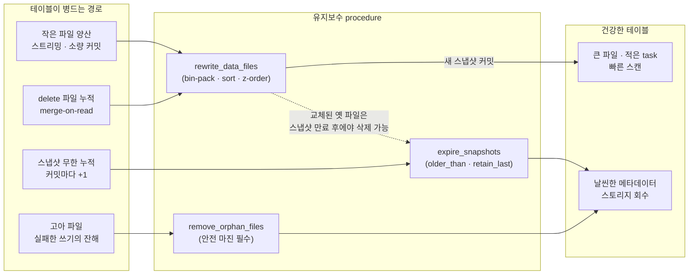
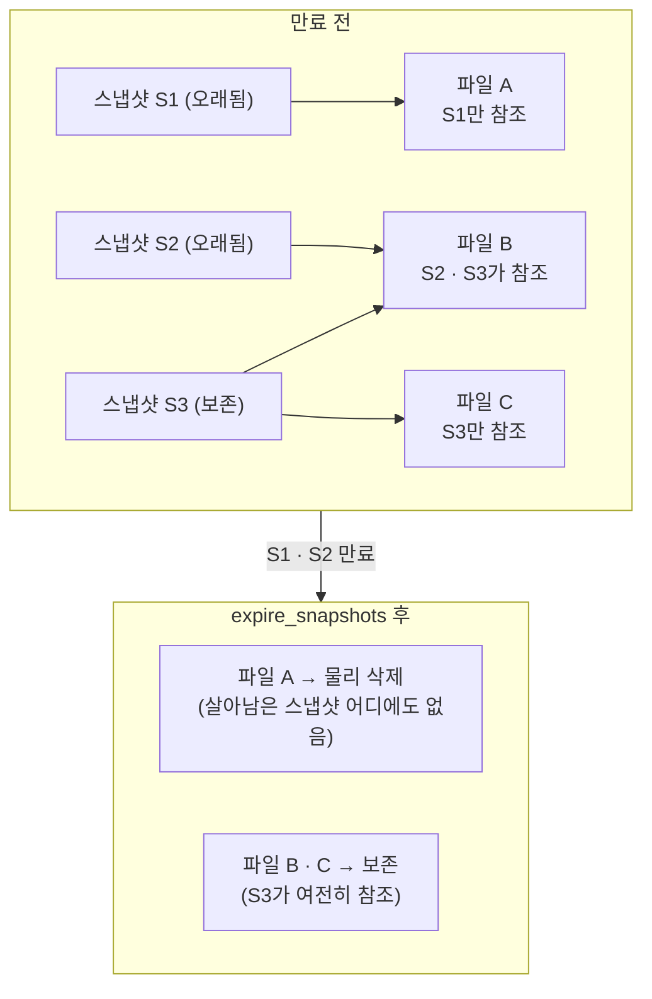
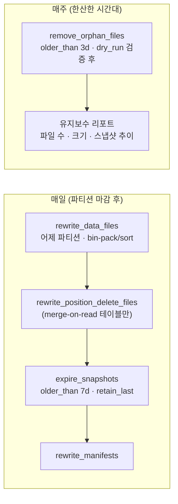

<figure class="post-figure post-figure--header">
<svg role="img" aria-label="Iceberg 유지보수 세 축을 한 장으로 정리한 그림. 왼쪽 위에는 스트리밍 쓰기가 흩뿌린 작은 파일 조각들이 굵은 화살표를 지나 compaction으로 정렬된 큰 파일 두 개로 합쳐진다. 오른쪽 위에는 스냅샷 체인 S0부터 S4가 놓여 있는데, 보존 기간 경계선 왼쪽의 오래된 S0·S1은 흐릿하게 그려져 expire_snapshots로 만료됨을 나타내고, 만료된 스냅샷만 참조하던 데이터 파일이 아래로 떨어져 삭제된다. 아래쪽에는 빗자루가 어떤 스냅샷에도 속하지 않는 고아 파일들을 쓸어 내는 모습과 함께, compaction·expire·orphan 정리로 이어지는 정기 유지보수 사이클이 원형 화살표로 그려져 있다." viewBox="0 0 680 340" xmlns="http://www.w3.org/2000/svg">
  <title>Iceberg compaction · 유지보수 — 작은 파일 합치기, 스냅샷 만료, 고아 파일 청소</title>
  <defs>
    <marker id="lh-s5-arrow" viewBox="0 0 10 10" refX="8" refY="5" markerWidth="6" markerHeight="6" orient="auto-start-reverse">
      <path d="M0,0 L10,5 L0,10 z" fill="var(--secondary-color)"/>
    </marker>
    <marker id="lh-s5-drop" viewBox="0 0 10 10" refX="8" refY="5" markerWidth="6" markerHeight="6" orient="auto-start-reverse">
      <path d="M0,0 L10,5 L0,10 z" fill="var(--accent-color)"/>
    </marker>
  </defs>

  <!-- ===== title ===== -->
  <text x="340" y="24" text-anchor="middle" font-size="17" font-weight="800" fill="currentColor" letter-spacing="1.5">COMPACTION · MAINTENANCE</text>
  <text x="340" y="43" text-anchor="middle" font-size="10.5" font-weight="700" fill="currentColor" opacity="0.72">작은 파일은 합치고, 스냅샷은 만료시키고, 고아 파일은 쓸어 낸다</text>

  <!-- ===== LEFT: small files -> compaction -> big sorted files ===== -->
  <text x="160" y="70" text-anchor="middle" font-size="10.5" font-weight="700" fill="currentColor" opacity="0.72">작은 파일 → compaction → 큰 파일</text>

  <!-- scattered small files -->
  <g fill="var(--bg-light)" stroke="currentColor" stroke-width="1.6">
    <rect x="34" y="86" width="20" height="14" rx="2"/>
    <rect x="62" y="94" width="16" height="12" rx="2"/>
    <rect x="40" y="110" width="18" height="13" rx="2"/>
    <rect x="70" y="118" width="22" height="14" rx="2"/>
    <rect x="30" y="134" width="16" height="12" rx="2"/>
    <rect x="58" y="140" width="20" height="13" rx="2"/>
    <rect x="88" y="100" width="14" height="11" rx="2"/>
    <rect x="90" y="132" width="18" height="12" rx="2"/>
  </g>
  <text x="68" y="172" text-anchor="middle" font-size="8.5" fill="currentColor" opacity="0.7">스트리밍 · 소량 커밋의 파편</text>

  <!-- arrow -->
  <line x1="116" y1="118" x2="158" y2="118" stroke="var(--secondary-color)" stroke-width="2.5" marker-end="url(#lh-s5-arrow)"/>
  <text x="137" y="108" text-anchor="middle" font-size="8" font-weight="700" fill="var(--secondary-color)">rewrite</text>

  <!-- compacted big files (sorted stripes) -->
  <g>
    <rect x="168" y="88" width="120" height="30" rx="3" fill="var(--bg-light)" stroke="var(--gold)" stroke-width="2.5"/>
    <g stroke="var(--gold)" stroke-width="1.2" opacity="0.55">
      <line x1="198" y1="88" x2="198" y2="118"/>
      <line x1="228" y1="88" x2="228" y2="118"/>
      <line x1="258" y1="88" x2="258" y2="118"/>
    </g>
    <rect x="168" y="126" width="120" height="30" rx="3" fill="var(--bg-light)" stroke="var(--gold)" stroke-width="2.5"/>
    <g stroke="var(--gold)" stroke-width="1.2" opacity="0.55">
      <line x1="198" y1="126" x2="198" y2="156"/>
      <line x1="228" y1="126" x2="228" y2="156"/>
      <line x1="258" y1="126" x2="258" y2="156"/>
    </g>
  </g>
  <text x="228" y="172" text-anchor="middle" font-size="8.5" fill="currentColor" opacity="0.7">target-file-size로 정렬·병합</text>

  <!-- ===== RIGHT: snapshot chain with expiry boundary ===== -->
  <text x="500" y="70" text-anchor="middle" font-size="10.5" font-weight="700" fill="currentColor" opacity="0.72">스냅샷 체인 — 오래된 것은 만료</text>

  <!-- retention boundary -->
  <line x1="448" y1="80" x2="448" y2="160" stroke="var(--accent-color)" stroke-width="1.8" stroke-dasharray="5 4"/>
  <text x="448" y="174" text-anchor="middle" font-size="8" font-weight="700" fill="var(--accent-color)">보존 경계 (older_than)</text>

  <!-- chain baseline -->
  <line x1="352" y1="108" x2="648" y2="108" stroke="currentColor" stroke-width="1.6" opacity="0.35"/>

  <!-- snapshots: S0, S1 expired (faded); S2..S4 kept -->
  <g text-anchor="middle" font-weight="700">
    <g opacity="0.35">
      <circle cx="368" cy="108" r="13" fill="var(--bg-panel)" stroke="currentColor" stroke-width="2"/>
      <text x="368" y="134" font-size="9" fill="currentColor">S0</text>
      <circle cx="416" cy="108" r="13" fill="var(--bg-panel)" stroke="currentColor" stroke-width="2"/>
      <text x="416" y="134" font-size="9" fill="currentColor">S1</text>
    </g>
    <circle cx="486" cy="108" r="13" fill="var(--bg-panel)" stroke="var(--secondary-color)" stroke-width="2.5"/>
    <text x="486" y="134" font-size="9" fill="currentColor">S2</text>
    <circle cx="546" cy="108" r="13" fill="var(--bg-panel)" stroke="var(--accent-color)" stroke-width="2.5"/>
    <text x="546" y="134" font-size="9" fill="currentColor">S3</text>
    <circle cx="606" cy="108" r="13" fill="var(--bg-panel)" stroke="var(--gold)" stroke-width="3"/>
    <text x="606" y="134" font-size="9" fill="currentColor">S4</text>
  </g>
  <text x="606" y="88" text-anchor="middle" font-size="8" fill="currentColor" opacity="0.7">현재</text>

  <!-- expired-only file dropping to deletion -->
  <line x1="392" y1="122" x2="392" y2="150" stroke="var(--accent-color)" stroke-width="2" marker-end="url(#lh-s5-drop)"/>
  <rect x="376" y="152" width="32" height="14" rx="2" fill="none" stroke="var(--accent-color)" stroke-width="1.6" stroke-dasharray="3 3"/>
  <text x="392" y="180" text-anchor="middle" font-size="8" fill="var(--accent-color)" font-weight="700">참조 잃은 파일 삭제</text>

  <!-- ===== divider ===== -->
  <line x1="30" y1="196" x2="650" y2="196" stroke="currentColor" stroke-width="1.4" opacity="0.25"/>

  <!-- ===== BOTTOM: broom sweeping orphan files + maintenance cycle ===== -->
  <text x="180" y="220" text-anchor="middle" font-size="10.5" font-weight="700" fill="currentColor" opacity="0.72">고아 파일 청소 — 어떤 스냅샷에도 없는 파일</text>

  <!-- broom -->
  <g>
    <line x1="70" y1="238" x2="106" y2="286" stroke="var(--gold)" stroke-width="3" stroke-linecap="round"/>
    <path d="M106,286 L96,308 L124,300 Z" fill="var(--gold)" stroke="var(--gold)" stroke-width="1"/>
    <g stroke="var(--gold)" stroke-width="1.4" opacity="0.8">
      <line x1="100" y1="304" x2="96" y2="314"/>
      <line x1="108" y1="302" x2="106" y2="313"/>
      <line x1="116" y1="300" x2="117" y2="311"/>
    </g>
  </g>
  <!-- orphan files being swept -->
  <g fill="none" stroke="currentColor" stroke-width="1.6" stroke-dasharray="4 3" opacity="0.6">
    <rect x="140" y="286" width="22" height="14" rx="2"/>
    <rect x="172" y="292" width="18" height="12" rx="2"/>
    <rect x="202" y="284" width="20" height="13" rx="2"/>
  </g>
  <g stroke="currentColor" stroke-width="1.2" opacity="0.4" fill="none">
    <path d="M234,290 q10,-4 18,2"/>
    <path d="M236,300 q10,-4 18,2"/>
  </g>
  <text x="180" y="322" text-anchor="middle" font-size="8.5" fill="currentColor" opacity="0.7">실패한 쓰기가 남긴 파편 — remove_orphan_files</text>

  <!-- maintenance cycle -->
  <text x="500" y="220" text-anchor="middle" font-size="10.5" font-weight="700" fill="currentColor" opacity="0.72">정기 유지보수 사이클</text>
  <circle cx="500" cy="278" r="42" fill="none" stroke="var(--secondary-color)" stroke-width="2" stroke-dasharray="6 5"/>
  <path d="M500,236 a42,42 0 0 1 36,21" fill="none" stroke="var(--secondary-color)" stroke-width="2.5" marker-end="url(#lh-s5-arrow)"/>
  <g font-size="8.5" font-weight="700" fill="currentColor" text-anchor="middle">
    <rect x="462" y="230" width="76" height="16" rx="3" fill="var(--bg-panel)" stroke="var(--gold)" stroke-width="1.6"/>
    <text x="500" y="241">compaction</text>
    <rect x="548" y="270" width="60" height="16" rx="3" fill="var(--bg-panel)" stroke="var(--accent-color)" stroke-width="1.6"/>
    <text x="578" y="281">expire</text>
    <rect x="462" y="310" width="76" height="16" rx="3" fill="var(--bg-panel)" stroke="var(--secondary-color)" stroke-width="1.6"/>
    <text x="500" y="321">orphan 정리</text>
    <rect x="392" y="270" width="60" height="16" rx="3" fill="var(--bg-panel)" stroke="currentColor" stroke-width="1.4"/>
    <text x="422" y="281">모니터링</text>
  </g>
</svg>
<figcaption>이 글을 한 장으로 — 흩뿌려진 작은 파일을 compaction으로 큰 파일에 합치고, 보존 경계를 넘은 스냅샷을 만료시켜 참조 잃은 파일 삭제로 잇고, 어떤 스냅샷에도 없는 고아 파일을 빗자루로 쓸어 내는 정기 유지보수 사이클</figcaption>
</figure>

## 들어가며

[Lakehouse Essential Curriculum](/2026/07/12/lakehouse-essential-curriculum.html)의 5단계이자, 시리즈 제3막 "어떻게 운영·선택하나"의 첫 관문입니다. 앞선 네 단계에서 우리는 Iceberg 테이블이 **무엇을 할 수 있는지**를 배웠습니다 — 메타데이터 계층이 ACID와 시간여행을 만들고, 컬럼 ID와 숨은 파티셔닝이 재작성 없는 진화를 가능하게 한다는 것을. 이번 단계의 질문은 다릅니다. **그 테이블이 6개월 뒤에도 빠르고 저렴하게 돌아가는가?**

방치된 Iceberg 테이블은 두 방향에서 병듭니다. 첫째, 스트리밍과 잦은 소량 커밋이 **작은 파일**을 양산해 스캔이 파일 수에 잡아먹히고, 둘째, 커밋마다 새로 태어나는 **스냅샷**이 무한히 쌓여 메타데이터가 비대해지고 "지울 수 없는" 데이터 파일이 스토리지 비용을 갉아먹습니다. 쿼리는 여전히 정답을 내지만 점점 느려지고 비싸집니다. **"돌아가는 테이블"과 "건강한 테이블"이 갈라지는 지점**이 바로 여기이고, 그 사이를 메우는 것이 이 글의 주제인 compaction · 스냅샷 만료 · 파일 정리라는 세 가지 유지보수 작업입니다.

이 유지보수는 앞 단계들과 무관한 별개 작업이 아니라 그 위에 얹힙니다. [4단계 파티션 진화 · 스키마 진화](/2026/07/15/lakehouse-iceberg-partition-schema-evolution.html)에서 본 것처럼 진화는 데이터를 재작성하지 않으므로, **진화가 남긴 신구 파티션 스펙의 파일들을 새 스펙으로 통일하는 일도 결국 compaction의 몫**입니다. 그리고 compaction 자체가 하나의 커밋(새 스냅샷)이라는 점에서, 3단계에서 배운 optimistic concurrency가 이 글의 곳곳에서 다시 등장합니다.

<div class="post-summary-box" markdown="1">

### 📌 이 글에서 다루는 내용

- **작은 파일과 compaction**: 작은 파일이 태어나는 세 경로(스트리밍·마이크로배치 커밋, 파티션 과세분화, merge-on-read delete 파일 누적)와 그 비용(task 폭발·open/close 오버헤드·메타데이터 팽창), `rewrite_data_files`의 세 전략(bin-pack·sort·z-order)과 target-file-size, delete 파일을 데이터에 합치는 rewrite, 그리고 compaction이 새 스냅샷 커밋이라는 사실과 스트리밍 writer와의 충돌 최소화(partial progress)
- **스냅샷 만료**: 스냅샷 누적의 비용, `expire_snapshots`(older_than · retain_last)와 시간여행 보존 기간의 균형, 만료가 실제 파일 삭제로 이어지는 메커니즘(참조를 잃은 파일 제거), retention 정책을 가진 참조인 브랜치·태그
- **파일 정리와 운영 설계**: 실패한 쓰기가 남긴 고아 파일과 `remove_orphan_files`(안전 마진 주의), `rewrite_manifests`, Airflow 위의 정기 유지보수 잡 설계(주기와 순서), metadata 테이블로 만드는 모니터링 지표(파일 수·평균 크기·스냅샷 수)

</div>

## 한눈에 보기 — 병드는 경로와 고치는 절차

이 글의 스파인을 한 장으로 그리면 이렇습니다. 왼쪽은 테이블이 병드는 세 경로이고, 가운데가 각각을 고치는 유지보수 procedure, 오른쪽이 그 결과입니다. 세 procedure는 성격이 달라서 — compaction은 **새 스냅샷을 만드는 커밋**이고, expire는 **오래된 스냅샷과 참조 잃은 파일을 지우는 정리**이며, orphan 정리는 **메타데이터 바깥의 파편을 쓸어 내는 청소**입니다 — 이 구분이 실행 순서와 주기를 결정합니다.



주목할 것은 가운데의 점선입니다 — **compaction은 파일을 지우지 않습니다.** 작은 파일들을 큰 파일로 다시 쓰고 새 스냅샷을 커밋할 뿐, 교체된 옛 파일들은 이전 스냅샷이 여전히 참조하므로 그대로 남습니다. 그 파일들이 실제로 사라지는 것은 이전 스냅샷이 **만료**되어 참조가 끊긴 뒤입니다. compaction과 expire가 한 쌍으로 움직여야 하는 이유가 여기에 있습니다.

## 작은 파일과 compaction — 파일 수가 성능을 잡아먹는다

### 작은 파일은 어디서 태어나는가

Iceberg 테이블의 파일들은 이상적으로는 수백 MB(기본 target 512MB)짜리 Parquet이어야 합니다. 현실의 테이블이 수 KB~수 MB짜리 파일 수만 개로 뒤덮이는 경로는 크게 셋입니다.

- **스트리밍 · 마이크로배치 쓰기**: Flink나 Spark Structured Streaming이 1분마다 커밋하면, 커밋 하나가 파티션마다 파일을 최소 하나씩 만듭니다. 100개 파티션에 1분 간격이면 **하루에 파일 144,000개**입니다. 각 파일에 담긴 행이 몇 천 건에 불과해도 파일 수는 그대로 늘어납니다.
- **파티션 과세분화**: 카디널리티 높은 컬럼으로 파티셔닝하면(예: `hours(ts)`에 `region`까지 중첩) 파티션당 데이터가 얇게 퍼져, 어떤 쓰기든 작은 파일만 만들게 됩니다. 4단계에서 본 파티션 진화로 스펙을 완화해도, **이미 쌓인 옛 스펙의 작은 파일들은 남습니다.**
- **merge-on-read의 delete 파일 누적**: `MERGE`/`UPDATE`/`DELETE`를 merge-on-read 모드로 수행하면 데이터 파일을 다시 쓰는 대신 "이 행은 삭제됨"을 기록한 **delete 파일**이 옆에 쌓입니다. 쓰기는 빨라지지만, 읽기는 데이터 파일마다 딸린 delete 파일들을 함께 열어 병합해야 하므로, delete 파일이 누적될수록 스캔이 무거워집니다.

### 작은 파일의 비용 — 세 겹의 세금

작은 파일이 부과하는 세금은 세 겹입니다.

1. **task 폭발**: Spark·Trino 같은 엔진은 대체로 파일(또는 파일 조각) 단위로 스캔 task를 만듭니다. 같은 10GB라도 512MB짜리 20개면 task 20개, 1MB짜리 10,240개면 task 10,240개 — 스케줄링 오버헤드가 실제 읽기 시간을 압도합니다.
2. **open/close 오버헤드**: 파일 하나를 여는 데는 S3 요청, Parquet footer 읽기, 커넥션 비용이 듭니다. 이 고정비는 파일 크기와 무관하므로, 파일이 작을수록 바이트당 비용이 치솟습니다. S3 GET 요청 요금도 파일 수에 비례합니다.
3. **메타데이터 팽창**: 2단계에서 본 것처럼 매니페스트는 **파일 단위로** 통계(min/max·null count)를 기록합니다. 파일이 10,000개면 매니페스트 엔트리도 10,000개 — 쿼리 플래닝이 스캔을 시작하기도 전에 메타데이터 읽기에서 느려지고, 커밋 때 다시 써야 하는 매니페스트도 커집니다.

### rewrite_data_files — 세 가지 전략

처방은 Spark procedure `rewrite_data_files`입니다. 작은 파일들을 읽어 target 크기의 큰 파일로 다시 쓰고, 그 교체를 **하나의 새 스냅샷으로 커밋**합니다.

```sql
-- ① bin-pack (기본): 작은 파일들을 target 크기로 채워 넣기만 한다.
--    정렬 없음 = 가장 싸고 빠른 compaction.
CALL catalog.system.rewrite_data_files(
  table => 'db.events',
  strategy => 'binpack',
  options => map(
    'target-file-size-bytes', '536870912',   -- 512MB (write.target-file-size-bytes 기본값)
    'min-input-files', '5'                   -- 파일 5개는 모여야 rewrite 착수
  )
);

-- ② sort: 병합하면서 지정한 순서로 정렬까지 한다.
--    해당 컬럼 필터 쿼리의 min/max 프루닝 효율이 극적으로 좋아진다.
CALL catalog.system.rewrite_data_files(
  table => 'db.events',
  strategy => 'sort',
  sort_order => 'event_time DESC NULLS LAST, user_id ASC'
);

-- ③ z-order: 여러 컬럼의 지역성을 동시에 보존하는 다차원 클러스터링.
--    "어떤 날 + 어떤 사용자" 같은 다중 컬럼 필터가 흔할 때.
CALL catalog.system.rewrite_data_files(
  table => 'db.events',
  strategy => 'sort',
  sort_order => 'zorder(event_time, user_id)'
);

-- 특정 파티션만 좁혀서 (전체 테이블 rewrite는 비싸다)
CALL catalog.system.rewrite_data_files(
  table => 'db.events',
  where => 'event_date >= "2026-07-01"'
);
```

세 전략의 선택 기준은 명확합니다.

| 전략 | 하는 일 | 비용 | 어울리는 곳 |
| --- | --- | --- | --- |
| **bin-pack** | 크기만 맞춰 병합 | 가장 저렴 | 기본값 — 파일 수 줄이기가 목적일 때 |
| **sort** | 병합 + 단일 정렬 순서 | 셔플 비용 추가 | 특정 컬럼 필터가 지배적인 쿼리 패턴 |
| **z-order** | 병합 + 다차원 클러스터링 | 가장 비쌈 | 여러 컬럼 조합 필터가 흔할 때 |

sort와 z-order가 값어치를 하는 이유는 2단계의 프루닝과 이어집니다 — 파일 안 데이터가 정렬되어 있으면 파일별 min/max 범위가 좁아지고, 좁은 범위는 곧 "이 파일은 안 읽어도 된다"는 판정을 늘립니다. **compaction은 파일 수만 줄이는 게 아니라, 데이터 배치를 바꿔 프루닝을 되살리는 작업**이기도 합니다.

또 하나, 4단계와의 연결 — `rewrite_data_files`는 다시 쓰는 파일을 **현재 파티션 스펙과 현재 정렬 순서로** 씁니다. 파티션 진화 후 신구 스펙 파일이 공존하는 테이블에서 compaction을 돌리면 옛 스펙 파일들이 점진적으로 새 스펙으로 이주합니다. `rewrite-all => true` 옵션으로 크기와 무관하게 전부 다시 쓰게 하면 이 이주를 강제할 수도 있습니다.

### merge-on-read의 빚 갚기 — delete 파일을 데이터에 합치기

merge-on-read가 쌓아 둔 delete 파일은 두 procedure로 정리합니다.

```sql
-- delete 파일이 많이 딸린 데이터 파일을 골라 함께 rewrite —
-- delete가 실제로 "적용된" 깨끗한 데이터 파일로 다시 태어난다.
CALL catalog.system.rewrite_data_files(
  table => 'db.orders',
  options => map(
    'delete-file-threshold', '2'   -- delete 파일 2개 이상 딸린 데이터 파일은 rewrite 대상
  )
);

-- position delete 파일 자체를 병합·정리 (작은 delete 파일이 파편화됐을 때)
CALL catalog.system.rewrite_position_delete_files(
  table => 'db.orders'
);
```

merge-on-read는 "쓰기 시점의 비용을 읽기 시점으로 미루는" 선택이고, 이 rewrite는 **미뤄 둔 빚을 배치로 갚는** 작업입니다. delete 파일이 데이터에 병합되면 읽기 경로에서 병합 오버헤드가 사라지고, 이후의 스냅샷 만료 때 옛 delete 파일들도 함께 정리될 수 있게 됩니다.

### compaction은 커밋이다 — 스트리밍 writer와의 동거

잊기 쉬운 사실 하나 — **compaction도 3단계에서 배운 것과 똑같은 커밋입니다.** 새 데이터 파일 집합을 만들고, 메타데이터 포인터 스왑으로 새 스냅샷을 원자적으로 커밋합니다. 따라서 optimistic concurrency의 규칙이 그대로 적용됩니다: compaction이 파일을 다시 쓰는 동안 스트리밍 writer가 커밋을 계속하면, compaction의 커밋 시점에 충돌 검증과 재시도가 일어납니다.

다행히 Iceberg의 충돌 판정은 파일 수준으로 정교합니다. 스트리밍 writer는 **새 파일을 추가**할 뿐이고 compaction은 **기존 파일을 교체**할 뿐이므로 대부분 무사히 공존합니다. 위험한 조합은 compaction이 다시 쓰고 있는 바로 그 파일들을 다른 작업(예: merge-on-read delete)이 건드리는 경우입니다. 대규모 테이블에서 충돌 비용을 줄이는 대표 전략이 **partial progress**입니다.

```sql
-- 전체 rewrite를 하나의 거대 커밋 대신 여러 개의 작은 커밋으로 쪼갠다.
-- 일부 파일 그룹이 충돌해 실패해도 나머지 그룹의 진전은 커밋된다.
CALL catalog.system.rewrite_data_files(
  table => 'db.events',
  options => map(
    'partial-progress.enabled', 'true',
    'partial-progress.max-commits', '10',
    'max-concurrent-file-group-rewrites', '5'
  )
);
```

운영 요령을 요약하면 — **파티션을 좁혀 자주**(활성 파티션은 건드리지 않고 어제 파티션만), **partial progress로 커밋을 쪼개고**, 충돌 재시도가 잦으면 compaction 시간대를 스트리밍이 한산한 때로 옮기는 것입니다.

## 스냅샷 만료 — 시간여행의 값을 치르는 법

### 스냅샷은 공짜가 아니다

3단계에서 시간여행을 배울 때 스냅샷은 순수한 축복처럼 보였습니다. 하지만 커밋마다 스냅샷이 하나씩 태어나는 테이블에서 — 1분 간격 스트리밍이면 하루 1,440개 — 스냅샷을 영원히 보관하면 두 가지 비용이 쌓입니다.

- **메타데이터 크기**: 스냅샷 목록은 테이블 메타데이터 파일에 기록되고, 각 스냅샷은 자기 매니페스트 리스트를 가집니다. 스냅샷 수만 개가 쌓이면 메타데이터 파일 자체가 수십 MB로 비대해져 모든 플래닝·커밋이 느려집니다.
- **지울 수 없는 데이터 파일**: 더 결정적인 비용입니다. compaction으로 교체됐든 `DELETE`로 지워졌든, **어떤 스냅샷이든 참조하는 한 데이터 파일은 물리적으로 삭제할 수 없습니다.** 그 스냅샷으로의 시간여행이 가능해야 하기 때문입니다. 스냅샷을 만료시키지 않는 테이블은 논리적 크기의 몇 배를 스토리지에 쥐고 있게 됩니다.

### expire_snapshots — 보존 경계를 긋고, 참조 잃은 파일을 지운다

```sql
-- 7일 이전 스냅샷을 만료시키되, 최근 100개는 무조건 남긴다
CALL catalog.system.expire_snapshots(
  table => 'db.events',
  older_than => TIMESTAMP '2026-07-08 00:00:00',
  retain_last => 100,
  max_concurrent_deletes => 8      -- 파일 삭제 병렬도
);
```

`older_than`과 `retain_last`는 안전벨트 두 개를 겹쳐 매는 관계입니다 — "7일이 지났어도 최근 100개 안에 들면 남긴다". 커밋이 뜸한 테이블에서 `older_than`만 걸면 스냅샷이 통째로 사라져 시간여행이 불가능해질 수 있는데, `retain_last`가 그 바닥을 받쳐 줍니다. procedure 인자 대신 테이블 속성으로 기본 정책을 박아 둘 수도 있습니다(`history.expire.max-snapshot-age-ms`, `history.expire.min-snapshots-to-keep`).

만료가 실제 파일 삭제로 이어지는 메커니즘은 정확히 이해해 둘 가치가 있습니다.



`expire_snapshots`는 두 단계로 움직입니다. ① 만료 대상 스냅샷을 메타데이터의 스냅샷 목록에서 제거하고, ② **살아남은 스냅샷 중 어느 것도 참조하지 않게 된** 데이터 파일·delete 파일·매니페스트를 스토리지에서 삭제합니다. 그래서 "만료된 스냅샷의 파일이 지워진다"는 표현은 부정확합니다 — 지워지는 것은 **만료로 인해 마지막 참조를 잃은 파일**뿐이고, 살아남은 스냅샷이 함께 쓰는 파일은 건드리지 않습니다. 한눈에 보기에서 예고한 대로, compaction이 교체해 둔 옛 작은 파일들이 실제로 스토리지에서 사라지는 순간이 바로 이 때입니다.

### 시간여행 보존 기간과의 균형

그렇다면 얼마나 남길 것인가 — 이것은 기술 문제이기 전에 **정책 문제**입니다. 스냅샷 보존 기간이 곧 시간여행 가능 범위이고, 시간여행 가능 범위가 곧 "잘못된 배포를 롤백할 수 있는 기간"이자 "감사·재현 요구에 응할 수 있는 기간"이기 때문입니다. 실무 감각으로는 —

- **분석용 배치 테이블**: 3~7일 보존이면 대부분의 "어제 배포가 데이터를 망쳤다" 시나리오를 커버합니다.
- **스트리밍 ingestion 테이블**: 스냅샷이 분 단위로 태어나므로 1~2일 + `retain_last`로 짧게 가져가되, expire를 자주(매일) 돌립니다.
- **규제·감사 대상 테이블**: 시간여행에 기대지 말고 다음에 볼 **태그**로 명시적 보존 지점을 만듭니다.

### 브랜치와 태그 — retention을 가진 참조

만료 정책을 "전부 며칠"이라는 단일 잣대로만 정하면 곤란한 경우 — 월말 정산 시점만은 3년 보존해야 한다든가 — 를 위해 Iceberg는 스냅샷에 이름을 붙이는 **참조(ref)** 를 제공합니다. **태그**는 특정 스냅샷을 가리키는 불변 이름표, **브랜치**는 독립적으로 커밋을 받을 수 있는 이동하는 포인터이고, 각자 자기 retention을 가집니다.

```sql
-- 월말 스냅샷에 태그 — 1080일(약 3년) 보존
ALTER TABLE db.orders CREATE TAG `eom-2026-06`
  AS OF VERSION 8231021483 RETAIN 1080 DAYS;

-- 검증용 브랜치 — 메인에 영향 없이 쓰기 실험
ALTER TABLE db.orders CREATE BRANCH `audit-fix` RETAIN 30 DAYS;

-- 태그로 시간여행
SELECT * FROM db.orders VERSION AS OF 'eom-2026-06';
```

`expire_snapshots`는 **참조가 걸린 스냅샷(과 그 파일들)을 retention 기간 동안 건드리지 않습니다.** 즉 태그·브랜치는 "일괄 만료의 예외를 선언하는 장치"입니다. 전체 정책은 짧게(7일), 보존할 가치가 있는 시점만 태그로 길게 — 이것이 메타데이터를 날씬하게 유지하면서 감사 요구에도 응하는 조합입니다.

## 파일 정리와 유지보수 잡 설계 — 청소를 시스템으로

### 고아 파일 — 메타데이터 바깥의 유령

지금까지의 파일 삭제는 모두 "스냅샷이 참조하다가 참조를 잃은" 파일 이야기였습니다. 그런데 스토리지에는 **애초에 어떤 스냅샷에도 등록된 적 없는** 파일도 쌓입니다 — Spark 잡이 데이터 파일을 다 써 놓고 커밋 직전에 죽었거나, 커밋 충돌로 재시도하면서 버린 파일들입니다. 커밋이 원자적이라는 3단계의 보장은 "테이블이 깨진 상태로 보이지 않는다"는 뜻이지, "실패한 시도의 파일이 스토리지에서 자동으로 치워진다"는 뜻이 아닙니다. 이 **고아 파일(orphan file)** 은 `expire_snapshots`로는 절대 지워지지 않습니다 — 만료는 메타데이터가 아는 파일만 다루기 때문입니다.

```sql
-- 테이블 위치 아래를 훑어, 어떤 스냅샷의 메타데이터에도 없는 파일을 찾아 지운다
CALL catalog.system.remove_orphan_files(
  table => 'db.events',
  older_than => TIMESTAMP '2026-07-12 00:00:00',   -- 3일 이상 된 파일만
  dry_run => true                                   -- 먼저 목록만 확인!
);
```

여기서 **안전 마진이 생명**입니다. `older_than`의 기본값이 3일로 보수적인 이유 — 지금 이 순간 진행 중인 쓰기 잡이 만들어 둔(아직 커밋 전인) 파일은 메타데이터에 없으므로 고아 파일과 **구분이 불가능**합니다. 마진을 짧게 잡으면 진행 중인 커밋의 파일을 지워 그 잡을 실패시키거나, 최악의 경우 방금 커밋된 스냅샷을 corrupt시킬 수 있습니다. 가장 오래 걸리는 쓰기 잡의 소요 시간보다 넉넉히 길게 — 실무에서는 3일 기본값을 줄이지 않는 것이 정석이고, 처음 돌릴 때는 반드시 `dry_run => true`로 삭제 목록부터 검수합니다.

### rewrite_manifests — 메타데이터 계층의 compaction

데이터 파일에 작은 파일 문제가 있듯, 매니페스트에도 같은 문제가 생깁니다. 잦은 커밋은 작은 매니페스트를 양산하고, 커밋 순서대로 쌓인 매니페스트는 파티션 기준으로 정렬되어 있지 않아 "이 파티션의 파일 목록"을 얻는 데 매니페스트 전부를 열어야 할 수 있습니다.

```sql
-- 작은 매니페스트들을 병합하고 파티션 기준으로 재조직 —
-- 플래닝 때 파티션 필터로 매니페스트 자체를 건너뛸 수 있게 된다
CALL catalog.system.rewrite_manifests(
  table => 'db.events'
);
```

`rewrite_data_files`가 데이터 계층의 compaction이라면 `rewrite_manifests`는 **메타데이터 계층의 compaction**입니다. 데이터는 건드리지 않고 매니페스트만 다시 쓰므로 훨씬 저렴합니다. 쿼리 플래닝이 느려졌는데 파일 크기는 정상이라면 이쪽을 의심할 차례입니다.

### 정기 유지보수 잡 — 주기와 순서

네 가지 procedure를 알았으니, 남은 것은 이것을 **사람 손을 타지 않는 시스템**으로 만드는 일입니다. [Airflow의 DAG](/2026/07/13/airflow-dag-operators-tasks.html)에 얹는다면 주기와 순서는 이렇게 잡습니다.



순서에는 이유가 있습니다. **compaction을 먼저, expire를 나중에** — compaction이 만든 "참조 잃을 예정인" 옛 파일들을 곧이어 도는 expire가 (보존 기간이 지난 것부터) 회수하는 흐름이 자연스럽습니다. `rewrite_manifests`는 하루치 커밋과 compaction이 어질러 놓은 매니페스트를 마지막에 정돈합니다. orphan 정리는 스토리지 전체 listing이 필요해 비싸고 위험 부담도 있으므로 **주 1회, 별도 DAG**로 분리하는 것이 보통입니다.

Airflow task로는 각 procedure를 SQL 한 줄짜리 `SparkSqlOperator`(또는 SparkSubmitOperator로 감싼 잡)로 두고, 테이블 목록을 파라미터로 돌리는 형태가 단순하고 튼튼합니다.


```python
# maintenance_dag.py (요지) — 테이블별 일일 유지보수 체인
compact = SparkSqlOperator(
    task_id="compact_yesterday",
    sql="""
      CALL catalog.system.rewrite_data_files(
        table => 'db.events',
        strategy => 'binpack',
        where => 'event_date = "{{ ds }}"',
        options => map('partial-progress.enabled', 'true')
      )
    """,
)

expire = SparkSqlOperator(
    task_id="expire_snapshots",
    sql="""
      CALL catalog.system.expire_snapshots(
        table => 'db.events',
        older_than => TIMESTAMP '{{ macros.ds_add(ds, -7) }} 00:00:00',
        retain_last => 100
      )
    """,
)

rewrite_manifests = SparkSqlOperator(
    task_id="rewrite_manifests",
    sql="CALL catalog.system.rewrite_manifests(table => 'db.events')",
)

compact >> expire >> rewrite_manifests
```


### 모니터링 — metadata 테이블로 건강 지표 만들기

유지보수가 잘 되고 있는지는 감이 아니라 숫자로 확인합니다. Iceberg는 테이블마다 `files`·`snapshots`·`manifests`·`partitions` 같은 **metadata 테이블**을 노출하므로, 건강 지표가 곧 SQL 쿼리입니다.

```sql
-- ① 파일 수와 평균 크기 — 작은 파일 문제의 조기 경보
SELECT
  count(*)                                   AS data_file_count,
  round(avg(file_size_in_bytes) / 1048576)   AS avg_file_mb,
  round(sum(file_size_in_bytes) / 1073741824) AS total_gb
FROM db.events.files;

-- ② 파티션별 파편화 — 어느 파티션부터 compaction할지
SELECT
  partition,
  file_count,
  round(total_data_file_size_in_bytes / file_count / 1048576) AS avg_file_mb
FROM db.events.partitions
ORDER BY file_count DESC
LIMIT 20;

-- ③ 스냅샷 수와 나이 — expire가 제때 돌고 있는지
SELECT
  count(*)                       AS snapshot_count,
  min(committed_at)              AS oldest_snapshot,
  max(committed_at)              AS latest_snapshot
FROM db.events.snapshots;
```

경보 기준의 감각치는 — **평균 파일 크기가 target의 절반(예: 256MB) 아래로 내려가거나**, **파티션당 파일 수가 수백을 넘거나**, **스냅샷 수가 보존 정책으로 예상되는 수(예: 7일 × 일일 커밋 수)를 크게 웃돌면** 유지보수 잡이 밀리고 있다는 신호입니다. 이 세 쿼리를 유지보수 DAG의 마지막 리포트 task로 넣어 추이를 남기면, "테이블이 병들기 시작한 날"을 그래프에서 짚을 수 있게 됩니다.

## 정리

Iceberg 테이블을 오래 건강하게 굴리는 운영의 축을 세웠습니다. 요점은 다음과 같습니다.

- **작은 파일은 세 겹의 세금이다**: 스트리밍·마이크로배치 커밋, 파티션 과세분화, merge-on-read delete 파일 누적이 파일을 파편화하고, 그 비용은 task 폭발·open/close 오버헤드·메타데이터 팽창으로 돌아온다. `rewrite_data_files`가 처방이고, bin-pack(싸게 병합)·sort·z-order(프루닝 복원)를 쿼리 패턴에 맞춰 고른다.
- **compaction도 커밋이다**: 새 스냅샷을 만드는 optimistic concurrency의 참여자이므로, 스트리밍 writer와 공존하려면 파티션을 좁혀 자주 돌리고 partial progress로 커밋을 쪼갠다. 파티션 진화가 남긴 옛 스펙 파일을 새 스펙으로 통일하는 것도 compaction의 몫이다.
- **compaction은 지우지 않고, expire가 지운다**: 교체된 옛 파일은 이전 스냅샷이 참조하는 한 남는다. `expire_snapshots`(older_than + retain_last)가 스냅샷을 만료시키고 **마지막 참조를 잃은 파일만** 물리 삭제한다 — 보존 기간은 곧 시간여행·롤백 가능 범위이므로 정책으로 정하고, 길게 남길 시점은 태그·브랜치(retention 있는 참조)로 예외 선언한다.
- **고아 파일은 만료로 못 지운다**: 실패한 쓰기가 남긴, 어떤 스냅샷에도 없는 파일은 `remove_orphan_files`로만 정리된다. 진행 중인 쓰기의 파일과 구분이 불가능하므로 안전 마진(기본 3일)을 줄이지 말고 `dry_run`으로 먼저 검수한다.
- **유지보수는 잡이고, 건강은 지표다**: 매일 compaction → expire → `rewrite_manifests`, 매주 orphan 정리를 스케줄러에 얹고, metadata 테이블(files·partitions·snapshots) 집계로 파일 수·평균 크기·스냅샷 수를 추적해 병들기 시작하는 순간을 숫자로 잡는다.

이제 테이블은 빠르고, 날씬하고, 청소까지 자동화되었습니다. 다음 질문은 테이블 바깥에 있습니다 — **이 건강한 테이블을 Spark·Trino·Flink·Snowflake가 안전하게 공유하려면 무엇이 필요한가?** 테이블을 이름으로 찾고 커밋을 조율하는 카탈로그, 그 엔진 중립 표준인 REST Catalog, 그리고 접근 제어와 credential vending이라는 거버넌스가 다음 단계의 주제입니다.

### 다음 학습 (Next Learning)

- [Iceberg REST Catalog · 거버넌스](/2026/07/15/lakehouse-iceberg-rest-catalog-governance.html) — 6단계: 건강한 테이블을 여러 엔진이 안전하게 공유하는 카탈로그와 거버넌스
- [Iceberg 파티션 진화 · 스키마 진화](/2026/07/15/lakehouse-iceberg-partition-schema-evolution.html) — 4단계 복습: compaction이 통일해 주는 신구 스펙 공존의 출발점
- [Lakehouse Essential Curriculum](/2026/07/12/lakehouse-essential-curriculum.html) — 시리즈 로드맵으로 돌아가 진행 상황 확인하기
