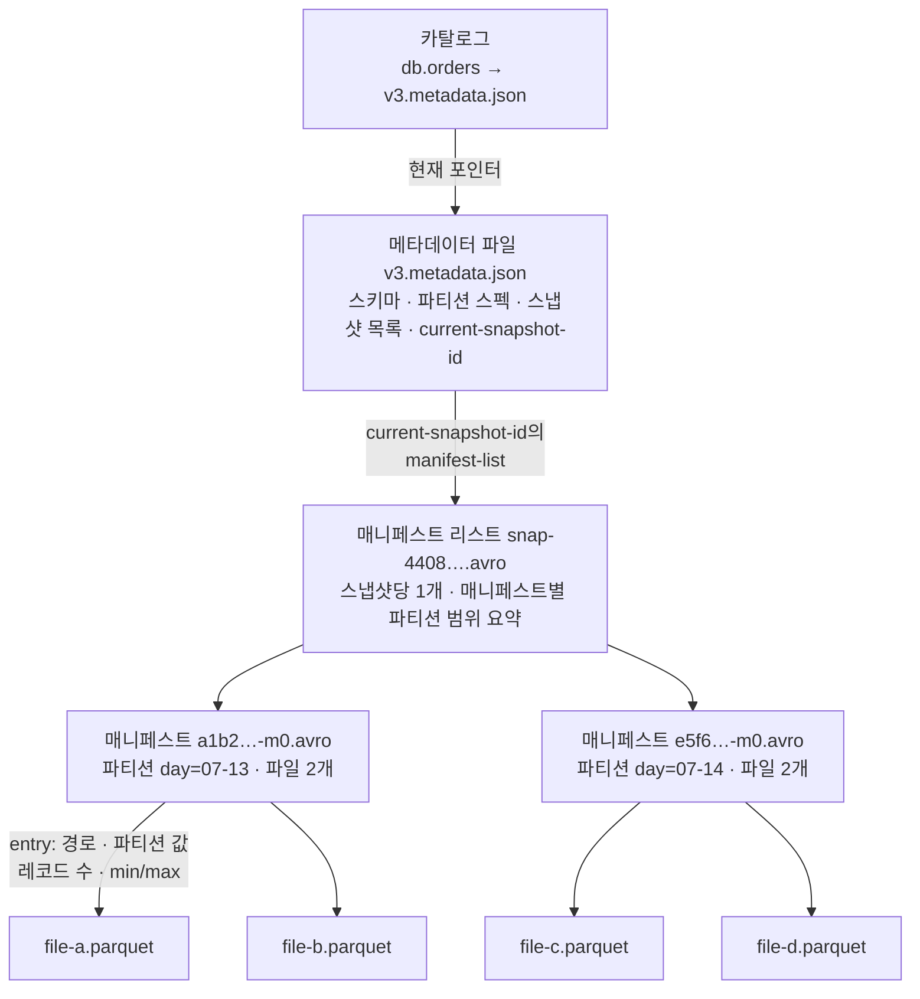
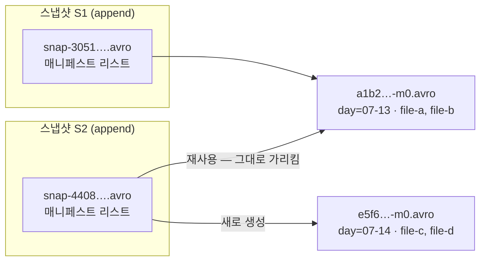
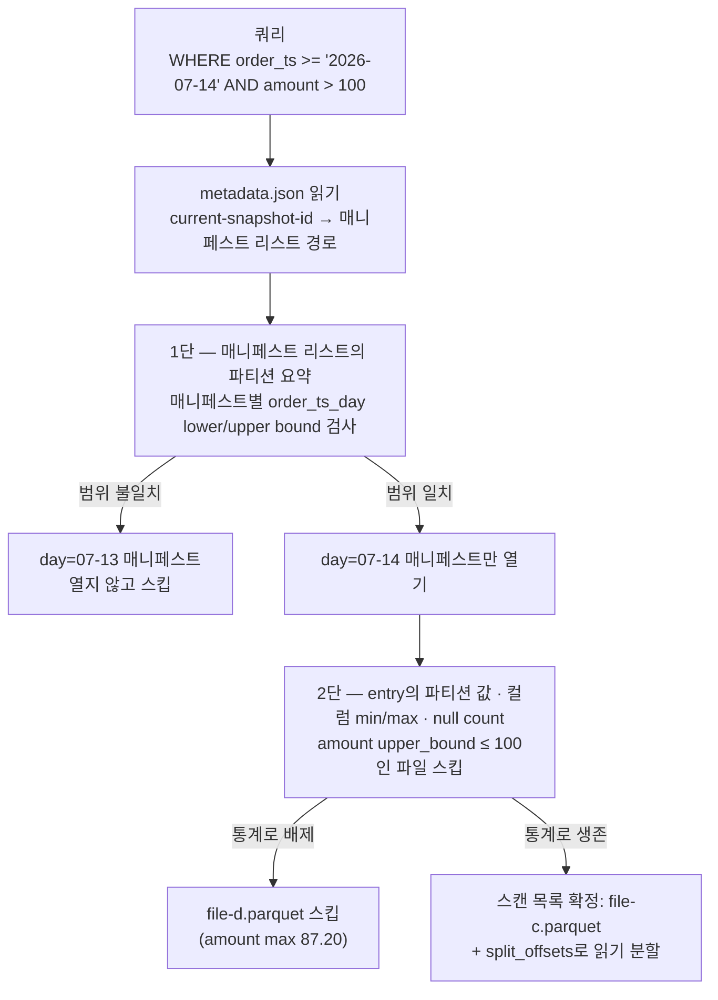

<figure class="post-figure post-figure--header">
<svg role="img" aria-label="Iceberg 메타데이터 계층을 한 장으로 정리한 그림. 맨 왼쪽 위의 카탈로그가 현재 포인터 화살표로 메타데이터 파일 v3.metadata.json을 가리키고, 메타데이터 파일은 스키마·파티션 스펙·스냅샷 목록을 담은 채 매니페스트 리스트 snap-….avro를 가리킨다. 매니페스트 리스트는 아래의 매니페스트 파일 두 개로 갈라지는데, 각 매니페스트에는 데이터 파일 항목과 함께 파티션 범위의 min/max 통계 배지가 붙어 있다. 각 매니페스트는 맨 아래 줄의 Parquet 데이터 파일들을 가리킨다. 위에서 아래로 갈수록 논리적 포인터에서 물리적 데이터로 내려간다." viewBox="0 0 680 340" xmlns="http://www.w3.org/2000/svg">
  <title>Iceberg 메타데이터 계층 — 카탈로그 → metadata.json → 매니페스트 리스트 → 매니페스트(통계 배지) → 데이터 파일</title>
  <defs>
    <marker id="lh-s2-arrow" viewBox="0 0 10 10" refX="8" refY="5" markerWidth="6" markerHeight="6" orient="auto-start-reverse">
      <path d="M0,0 L10,5 L0,10 z" fill="var(--secondary-color)"/>
    </marker>
    <marker id="lh-s2-gold" viewBox="0 0 10 10" refX="8" refY="5" markerWidth="6" markerHeight="6" orient="auto-start-reverse">
      <path d="M0,0 L10,5 L0,10 z" fill="var(--gold)"/>
    </marker>
  </defs>

  <!-- title -->
  <text x="340" y="24" text-anchor="middle" font-size="16" font-weight="800" fill="currentColor" letter-spacing="1.5">ICEBERG METADATA LAYERS</text>
  <text x="340" y="43" text-anchor="middle" font-size="10" font-weight="700" fill="currentColor" opacity="0.72">카탈로그 포인터에서 데이터 파일까지 — 포인터의 사슬이 테이블을 만든다</text>

  <!-- ===== Row A: catalog -> metadata.json -> manifest list ===== -->
  <!-- catalog -->
  <rect x="24" y="72" width="104" height="52" rx="4" fill="var(--bg-panel)" stroke="var(--gold)" stroke-width="2.5"/>
  <text x="76" y="93" text-anchor="middle" font-size="10.5" font-weight="800" fill="currentColor">카탈로그</text>
  <text x="76" y="110" text-anchor="middle" font-size="8.5" font-weight="700" fill="currentColor" opacity="0.72" font-family="monospace">db.orders</text>

  <!-- pointer arrow -->
  <line x1="128" y1="98" x2="170" y2="98" stroke="var(--gold)" stroke-width="2.2" marker-end="url(#lh-s2-gold)"/>
  <text x="149" y="88" text-anchor="middle" font-size="7.5" font-weight="700" fill="var(--gold)">현재 포인터</text>

  <!-- metadata file -->
  <rect x="174" y="66" width="176" height="64" rx="4" fill="var(--bg-light)" stroke="var(--accent-color)" stroke-width="2.5"/>
  <text x="262" y="84" text-anchor="middle" font-size="10" font-weight="800" fill="currentColor" font-family="monospace">v3.metadata.json</text>
  <text x="262" y="100" text-anchor="middle" font-size="8.5" fill="currentColor" opacity="0.78">스키마 · 파티션 스펙</text>
  <text x="262" y="114" text-anchor="middle" font-size="8.5" fill="currentColor" opacity="0.78">snapshots · current-snapshot-id</text>

  <!-- arrow to manifest list -->
  <line x1="350" y1="98" x2="392" y2="98" stroke="var(--secondary-color)" stroke-width="2.2" marker-end="url(#lh-s2-arrow)"/>
  <text x="371" y="88" text-anchor="middle" font-size="7.5" font-weight="700" fill="currentColor" opacity="0.7">manifest-list</text>

  <!-- manifest list -->
  <rect x="396" y="66" width="188" height="64" rx="4" fill="var(--bg-light)" stroke="var(--secondary-color)" stroke-width="2.5"/>
  <text x="490" y="84" text-anchor="middle" font-size="10" font-weight="800" fill="currentColor" font-family="monospace">snap-4408….avro</text>
  <text x="490" y="100" text-anchor="middle" font-size="8.5" fill="currentColor" opacity="0.78">매니페스트 리스트 — 스냅샷당 1개</text>
  <text x="490" y="114" text-anchor="middle" font-size="8.5" fill="currentColor" opacity="0.78">매니페스트별 파티션 범위 요약</text>

  <!-- ===== Row B: manifests ===== -->
  <!-- fan-out arrows -->
  <line x1="450" y1="130" x2="356" y2="168" stroke="var(--secondary-color)" stroke-width="2" marker-end="url(#lh-s2-arrow)"/>
  <line x1="530" y1="130" x2="546" y2="168" stroke="var(--secondary-color)" stroke-width="2" marker-end="url(#lh-s2-arrow)"/>

  <!-- manifest A -->
  <rect x="240" y="172" width="196" height="72" rx="4" fill="var(--bg-light)" stroke="currentColor" stroke-width="2"/>
  <text x="338" y="190" text-anchor="middle" font-size="9.5" font-weight="800" fill="currentColor" font-family="monospace">a1b2…-m0.avro</text>
  <text x="338" y="205" text-anchor="middle" font-size="8" fill="currentColor" opacity="0.78" font-family="monospace">file-a.parquet · ADDED · 48,210 rows</text>
  <!-- stats badge A -->
  <rect x="262" y="215" width="152" height="20" rx="10" fill="var(--bg-panel)" stroke="var(--gold)" stroke-width="1.8"/>
  <text x="338" y="229" text-anchor="middle" font-size="8" font-weight="700" fill="currentColor">min 07-13 · max 07-13 · null 0</text>

  <!-- manifest B -->
  <rect x="470" y="172" width="196" height="72" rx="4" fill="var(--bg-light)" stroke="currentColor" stroke-width="2"/>
  <text x="568" y="190" text-anchor="middle" font-size="9.5" font-weight="800" fill="currentColor" font-family="monospace">e5f6…-m0.avro</text>
  <text x="568" y="205" text-anchor="middle" font-size="8" fill="currentColor" opacity="0.78" font-family="monospace">file-c.parquet · ADDED · 51,904 rows</text>
  <!-- stats badge B -->
  <rect x="492" y="215" width="152" height="20" rx="10" fill="var(--bg-panel)" stroke="var(--gold)" stroke-width="1.8"/>
  <text x="568" y="229" text-anchor="middle" font-size="8" font-weight="700" fill="currentColor">min 07-14 · max 07-14 · null 0</text>

  <!-- layer captions (left) -->
  <g font-size="8.5" font-weight="700" fill="currentColor" opacity="0.6">
    <text x="24" y="200">매니페스트</text>
    <text x="24" y="213">— 데이터 파일의 장부</text>
    <text x="24" y="300">데이터 파일</text>
    <text x="24" y="313">— Parquet / ORC / Avro</text>
  </g>

  <!-- ===== Row C: data files ===== -->
  <!-- arrows from manifests to data files -->
  <line x1="300" y1="244" x2="272" y2="274" stroke="currentColor" stroke-width="1.6" opacity="0.55" marker-end="url(#lh-s2-arrow)"/>
  <line x1="376" y1="244" x2="404" y2="274" stroke="currentColor" stroke-width="1.6" opacity="0.55" marker-end="url(#lh-s2-arrow)"/>
  <line x1="530" y1="244" x2="502" y2="274" stroke="currentColor" stroke-width="1.6" opacity="0.55" marker-end="url(#lh-s2-arrow)"/>
  <line x1="606" y1="244" x2="634" y2="274" stroke="currentColor" stroke-width="1.6" opacity="0.55" marker-end="url(#lh-s2-arrow)"/>

  <!-- parquet file cards -->
  <g>
    <rect x="222" y="278" width="96" height="34" rx="3" fill="var(--bg-panel)" stroke="currentColor" stroke-width="1.8"/>
    <rect x="358" y="278" width="96" height="34" rx="3" fill="var(--bg-panel)" stroke="currentColor" stroke-width="1.8"/>
    <rect x="456" y="278" width="96" height="34" rx="3" fill="var(--bg-panel)" stroke="currentColor" stroke-width="1.8"/>
    <rect x="586" y="278" width="88" height="34" rx="3" fill="var(--bg-panel)" stroke="currentColor" stroke-width="1.8"/>
  </g>
  <g font-size="7.5" font-weight="700" fill="currentColor" text-anchor="middle" font-family="monospace">
    <text x="270" y="292">day=07-13/</text>
    <text x="270" y="304">file-a.parquet</text>
    <text x="406" y="292">day=07-13/</text>
    <text x="406" y="304">file-b.parquet</text>
    <text x="504" y="292">day=07-14/</text>
    <text x="504" y="304">file-c.parquet</text>
    <text x="630" y="292">day=07-14/</text>
    <text x="630" y="304">file-d.parquet</text>
  </g>

  <!-- bottom caption -->
  <text x="340" y="334" text-anchor="middle" font-size="9" fill="currentColor" opacity="0.72">위는 포인터(논리), 아래는 데이터(물리) — 쿼리 플래닝은 위 세 층만 읽고 스캔 목록을 만든다</text>
</svg>
<figcaption>Iceberg 테이블의 계층 — 카탈로그의 현재 포인터가 metadata.json을, metadata.json이 매니페스트 리스트를, 매니페스트 리스트가 통계 배지를 단 매니페스트들을, 매니페스트가 데이터 파일을 가리킨다</figcaption>
</figure>

## 들어가며

[1단계](/2026/07/15/lakehouse-open-table-format-motivation.html)에서 우리는 문제를 정리했습니다 — 오브젝트 스토리지에 Parquet를 쌓는 것만으로는 테이블이 되지 않고, 디렉터리 listing에 의존하는 Hive 방식은 원자성도 일관성도 성능도 보장하지 못한다는 것. 그리고 해법의 방향도 보았습니다 — **파일 집합 위에 메타데이터 계층을 얹어, "테이블의 상태"를 파일 목록이 아니라 메타데이터가 정의하게 만든다**는 것.

이 글은 그 해법이 Apache Iceberg에서 **정확히 어떤 파일들로 구현되는지**를 해부합니다. 결론부터 말하면 Iceberg 테이블은 포인터의 사슬입니다 — 카탈로그가 **메타데이터 파일**(`vN.metadata.json`)을 가리키고, 메타데이터 파일이 스냅샷마다 하나씩 있는 **매니페스트 리스트**(`snap-*.avro`)를 가리키고, 매니페스트 리스트가 **매니페스트 파일**(`*-m0.avro`)들을 가리키고, 매니페스트가 마침내 **데이터 파일**(Parquet/ORC/Avro)을 가리킵니다. 이 사슬의 어느 한 층도 장식이 아닙니다. 원자적 커밋은 맨 위 포인터의 교체에서, 시간여행은 스냅샷 목록에서, 파일 프루닝은 매니페스트의 통계에서 나옵니다.

이 글은 [Lakehouse Essential Curriculum](/2026/07/12/lakehouse-essential-curriculum.html)의 **2단계**입니다. 커리큘럼이 예고했듯 "이 그림을 손에 쥐면 이후 스냅샷·진화·compaction이 모두 이 구조 위에 얹힙니다" — 3단계의 ACID·시간여행을 이해하는 데 필요한 모든 부품이 이 글에서 등장합니다. 예제는 주문 테이블 `db.orders`(일 단위 파티션) 하나를 글 전체에 관통시키며, 각 층의 실제 파일 발췌와 Spark 메타데이터 테이블 조회로 확인합니다.

<div class="post-summary-box" markdown="1">

### 📌 이 글에서 다루는 내용

- **3계층 구조**: 카탈로그가 가리키는 메타데이터 파일(`vN.metadata.json` — 스키마·파티션 스펙·스냅샷 목록·current-snapshot-id), 스냅샷당 하나인 매니페스트 리스트(`snap-*.avro`), 데이터 파일 항목(경로·파티션 값·레코드 수·컬럼 통계·상태)을 담은 매니페스트 파일, 그리고 데이터 파일 — 실제 디렉터리 레이아웃(`metadata/`, `data/`)과 파일별 필드 발췌
- **스냅샷과 매니페스트**: append/overwrite/delete 커밋이 새 스냅샷을 만드는 방식, 변하지 않은 매니페스트의 재사용(공유), 파일 추가/삭제의 표현(ADDED/EXISTING/DELETED entry), v2 포맷의 delete file(positional/equality — merge-on-read) 개요
- **통계와 프루닝**: 매니페스트 리스트의 파티션 요약 → 매니페스트의 파티션 값·컬럼 min/max·null count → 파일 스킵으로 이어지는 2단 프루닝, 쿼리 플래닝이 파일 listing 없이 메타데이터만으로 스캔 목록을 만드는 과정, Parquet footer 통계와의 역할 분담

</div>

## 한눈에 보기 — 포인터의 사슬

이 글의 스파인을 한 장으로 그리면 이렇습니다. 카탈로그는 "현재 메타데이터 파일이 무엇인가" 딱 하나만 알고, 나머지는 전부 파일이 파일을 가리키는 사슬입니다. 쿼리 엔진은 이 사슬을 위에서 아래로 따라 내려가며 — 디렉터리 listing 한 번 없이 — 읽어야 할 데이터 파일 목록을 얻습니다.



위 세 층(메타데이터 파일·매니페스트 리스트·매니페스트)이 **메타데이터 계층**, 맨 아래가 **데이터 계층**입니다. 이 분리가 이 글 전체의 좌표축입니다 — 테이블의 상태를 바꾸는 일은 메타데이터 계층의 파일을 새로 쓰는 일이고, 데이터 파일 자체는 한 번 쓰이면 불변(immutable)입니다.

## 3계층 구조 — 파일 네 종류가 테이블을 만든다

### 디렉터리 레이아웃부터

추상적인 그림 대신 실제 스토리지에 놓이는 파일부터 봅니다. Iceberg 테이블 하나는 스토리지에서 이렇게 생겼습니다.

```text
s3://warehouse/db/orders/
├── metadata/                                        # 메타데이터 계층
│   ├── v1.metadata.json                             # CREATE TABLE 시점의 메타데이터
│   ├── v2.metadata.json                             # 첫 커밋 후
│   ├── v3.metadata.json                             # ← 카탈로그가 가리키는 "현재"
│   ├── snap-3051729675574597004-1-77bfad1c….avro    # 스냅샷 S1의 매니페스트 리스트
│   ├── snap-4408912337193636025-1-9a1d3b6f….avro    # 스냅샷 S2의 매니페스트 리스트
│   ├── a1b2c3d4-5e6f-…-m0.avro                      # 매니페스트 (S1 커밋이 생성)
│   └── e5f6a7b8-9c0d-…-m0.avro                      # 매니페스트 (S2 커밋이 생성)
└── data/                                            # 데이터 계층
    ├── order_ts_day=2026-07-13/
    │   ├── 00000-0-1f2e3d4c….parquet                # file-a
    │   └── 00001-1-5a6b7c8d….parquet                # file-b
    └── order_ts_day=2026-07-14/
        ├── 00000-0-9e0f1a2b….parquet                # file-c
        └── 00002-2-3c4d5e6f….parquet                # file-d
```

세 가지를 눈여겨봐 둡니다. 첫째, `metadata.json`은 커밋마다 **버전 번호를 올리며 새로 쓰이고**(`v1` → `v2` → `v3`), 이전 버전은 지워지지 않고 남습니다. 둘째, `snap-*.avro`는 파일명에 스냅샷 ID가 박혀 있고 **스냅샷당 정확히 하나**입니다. 셋째, `data/` 아래에 파티션 디렉터리가 보이지만 이것은 **관례적 배치일 뿐**입니다 — Hive와 달리 Iceberg는 경로에서 파티션을 추론하지 않고, 매니페스트에 기록된 파티션 값만 신뢰합니다. 파일이 어느 디렉터리에 있든 매니페스트가 진실입니다.

### 메타데이터 파일 — vN.metadata.json

계층의 꼭대기, 테이블의 "현재 상태" 전부를 담는 파일입니다. 카탈로그(Hive Metastore·Glue·REST Catalog 등 — 6단계의 주제)는 테이블 이름에 대해 딱 하나의 정보, **현재 metadata.json의 경로**를 유지합니다. 실제 내용을 요지만 발췌하면 이렇습니다.

```json
{
  "format-version": 2,
  "table-uuid": "9c12f4a0-8b3e-4d17-a2c5-6f01de9b7e42",
  "location": "s3://warehouse/db/orders",
  "last-sequence-number": 2,
  "last-updated-ms": 1783123200000,
  "last-column-id": 4,

  "current-schema-id": 0,
  "schemas": [
    {
      "schema-id": 0,
      "fields": [
        {"id": 1, "name": "order_id",    "required": true,  "type": "long"},
        {"id": 2, "name": "customer_id", "required": false, "type": "long"},
        {"id": 3, "name": "order_ts",    "required": true,  "type": "timestamptz"},
        {"id": 4, "name": "amount",      "required": false, "type": "decimal(10,2)"}
      ]
    }
  ],

  "default-spec-id": 0,
  "partition-specs": [
    {
      "spec-id": 0,
      "fields": [
        {"source-id": 3, "field-id": 1000, "name": "order_ts_day", "transform": "day"}
      ]
    }
  ],

  "current-snapshot-id": 4408912337193636025,
  "snapshots": [
    {
      "snapshot-id": 3051729675574597004,
      "sequence-number": 1,
      "timestamp-ms": 1783036800000,
      "summary": {
        "operation": "append",
        "added-data-files": "2",
        "added-records": "48210"
      },
      "manifest-list": "s3://warehouse/db/orders/metadata/snap-3051729675574597004-1-77bfad1c….avro",
      "schema-id": 0
    },
    {
      "snapshot-id": 4408912337193636025,
      "parent-snapshot-id": 3051729675574597004,
      "sequence-number": 2,
      "timestamp-ms": 1783123200000,
      "summary": {
        "operation": "append",
        "added-data-files": "2",
        "added-records": "51904"
      },
      "manifest-list": "s3://warehouse/db/orders/metadata/snap-4408912337193636025-1-9a1d3b6f….avro",
      "schema-id": 0
    }
  ],

  "snapshot-log": [
    {"timestamp-ms": 1783036800000, "snapshot-id": 3051729675574597004},
    {"timestamp-ms": 1783123200000, "snapshot-id": 4408912337193636025}
  ],
  "metadata-log": [
    {"timestamp-ms": 1782950400000, "metadata-file": "s3://warehouse/db/orders/metadata/v1.metadata.json"},
    {"timestamp-ms": 1783036800000, "metadata-file": "s3://warehouse/db/orders/metadata/v2.metadata.json"}
  ]
}
```

필드를 묶어서 읽으면 이 파일의 정체가 보입니다.

- **정체성과 포맷**: `table-uuid`(테이블 고유 ID — 같은 이름으로 재생성해도 다른 테이블임을 구분), `format-version`(1 또는 2 — v2가 delete file 기반 row-level 변경을 지원하며, 2026년 현재 사실상의 기본값입니다. v3는 deletion vector 등이 추가된 최신 스펙).
- **스키마와 파티션 스펙의 "역사"**: `schemas`와 `partition-specs`가 **복수형 배열**이라는 점이 결정적입니다. 스키마를 바꾸면 새 schema-id의 항목이 추가되고 `current-schema-id`가 옮겨갈 뿐, 옛 스키마도 남습니다. 컬럼이 이름이 아닌 **고유 `id`** 로, 파티션이 경로가 아닌 **`transform`**(`day`, `bucket[16]`, `truncate` 등)으로 기록되는 이 설계가 4단계에서 볼 재작성 없는 진화의 뿌리입니다.
- **스냅샷 목록**: 각 스냅샷은 `snapshot-id`, 부모(`parent-snapshot-id`), `timestamp-ms`, 커밋의 성격을 요약한 `summary`(operation: `append`/`overwrite`/`delete`/`replace`), 그리고 **자기 매니페스트 리스트의 경로**(`manifest-list`)를 갖습니다. `current-snapshot-id`가 그중 "지금"을 지목합니다.
- **이력 로그**: `snapshot-log`는 current 스냅샷이 바뀌어 온 시간순 기록(3단계 시간여행의 조회 인덱스), `metadata-log`는 metadata.json 자체의 교체 이력입니다.

한 문장으로 요약하면 — **이 JSON 하나를 읽으면 테이블의 스키마·파티션·전체 스냅샷 이력·현재 시점을 모두 알 수 있고, 여기서 한 번의 포인터 교체로 테이블 상태 전체가 바뀝니다.**

### 매니페스트 리스트 — snap-*.avro

`current-snapshot-id`의 `manifest-list`를 따라가면 나오는 파일입니다. 이름 그대로 **매니페스트들의 목록**이고, **스냅샷당 정확히 하나** 존재합니다. Avro 포맷이라 직접 열어 읽기는 불편하지만, 논리적 내용은 행 단위 레코드입니다 — 매니페스트 하나당 한 행.

| 필드 | 의미 |
| --- | --- |
| `manifest_path` | 매니페스트 파일 경로 |
| `manifest_length` | 파일 크기 (읽기 계획용) |
| `partition_spec_id` | 이 매니페스트가 쓰인 파티션 스펙 |
| `content` | 0 = data 매니페스트, 1 = delete 매니페스트 (v2) |
| `sequence_number` / `min_sequence_number` | 커밋 순서 번호 — delete 적용 범위 판정에 사용 (v2) |
| `added_snapshot_id` | 이 매니페스트를 만든 스냅샷 |
| `added_files_count` / `existing_files_count` / `deleted_files_count` | 항목 상태별 파일 수 |
| `added_rows_count` / `existing_rows_count` / `deleted_rows_count` | 상태별 행 수 |
| `partitions` | **파티션 필드별 요약** — `contains_null`, `contains_nan`, `lower_bound`, `upper_bound` |

핵심은 마지막 `partitions` 필드입니다. 매니페스트 리스트는 "매니페스트 A는 `order_ts_day`가 2026-07-13 ~ 2026-07-13인 파일들을 담고 있다"는 **범위 요약**을 매니페스트별로 들고 있습니다. 쿼리 플래너는 이 요약만 보고 조건에 안 맞는 매니페스트를 **열어 보지도 않고** 버릴 수 있습니다 — 뒤에서 다룰 2단 프루닝의 1단이 여기입니다.

### 매니페스트 파일 — 데이터 파일의 장부

매니페스트 리스트가 가리키는 개별 `*-m0.avro` 파일입니다. 이번에는 **데이터 파일 하나당 한 행**(manifest entry)이며, 각 entry는 크게 "이 파일이 스냅샷에서 갖는 상태"와 "파일 자체의 명세(`data_file` struct)" 두 부분으로 구성됩니다.

| 필드 | 의미 |
| --- | --- |
| `status` | **0 = EXISTING**(이전 스냅샷부터 있던 파일), **1 = ADDED**(이 스냅샷에서 추가), **2 = DELETED**(이 스냅샷에서 제거) |
| `snapshot_id` | 이 entry 상태를 기록한 스냅샷 |
| `sequence_number` / `file_sequence_number` | 커밋 순서 — delete file이 어느 데이터에 적용되는지 판정 (v2) |
| `data_file.content` | 0 = 데이터, 1 = positional delete, 2 = equality delete (v2) |
| `data_file.file_path` | 데이터 파일의 전체 경로 |
| `data_file.file_format` | `PARQUET` / `ORC` / `AVRO` |
| `data_file.partition` | **파티션 값 그 자체** — 예: `{"order_ts_day": "2026-07-13"}` |
| `data_file.record_count` | 레코드 수 |
| `data_file.file_size_in_bytes` | 파일 크기 |
| `data_file.value_counts` / `null_value_counts` / `nan_value_counts` | 컬럼 ID별 값/NULL/NaN 개수 |
| `data_file.lower_bounds` / `upper_bounds` | **컬럼 ID별 min/max** (직렬화된 바운드 값) |
| `data_file.split_offsets` | 분할 읽기 지점 (Parquet row group 경계) |

주목할 점이 둘입니다. 첫째, 파티션 값이 **경로 문자열 파싱이 아니라 명시적 필드**로 기록됩니다 — Hive처럼 `dt=2026-07-13`이라는 디렉터리 이름을 믿는 게 아니라, 장부에 적힌 값을 믿습니다. 둘째, `lower_bounds`/`upper_bounds`가 **컬럼 ID를 키로** 합니다. 컬럼 이름이 바뀌어도(4단계의 rename) 통계는 그대로 유효합니다. 이 min/max·null count가 2단 프루닝의 2단, 즉 **파일 단위 스킵**의 재료입니다.

### 데이터 파일 — 그리고 왜 세 층이나 필요한가

맨 아래는 평범한 Parquet(또는 ORC/Avro) 파일입니다. Iceberg가 발명한 것이 아니고, Iceberg 없이도 존재하던 그 파일입니다. 그렇다면 왜 그 위에 굳이 세 층을 얹을까요? 각 층이 흡수하는 문제가 다르기 때문입니다.

- **매니페스트**가 없으면 — "어떤 파일이 테이블에 속하는가"를 매번 스토리지 listing으로 알아내야 합니다. 1단계에서 본 그 비용과 비일관성이 그대로 돌아옵니다.
- **매니페스트 리스트**가 없으면 — 스냅샷 하나를 정의하는 데 "매니페스트 수천 개의 목록"을 매번 어딘가에 다시 써야 합니다. 스냅샷당 파일 하나로 묶으면 커밋이 가볍고, 매니페스트별 파티션 요약이라는 프루닝 층이 공짜로 생깁니다.
- **메타데이터 파일**이 없으면 — 스키마·파티션 스펙·스냅샷 이력이 흩어지고, 무엇보다 "테이블의 현재 상태"를 **원자적으로 교체할 단일 지점**이 사라집니다.

즉 이 계층 구조는 장식적 간접 참조가 아니라, listing 제거(매니페스트) · 커밋 경량화와 1단 프루닝(매니페스트 리스트) · 원자성과 이력(메타데이터 파일)이라는 세 가지 문제를 각각 한 층씩 맡긴 설계입니다.

## 스냅샷과 매니페스트 — 커밋이 계층을 바꾸는 방식

### 커밋 = 새 스냅샷, 그리고 매니페스트 재사용

구조를 정적으로 봤으니 이제 움직여 봅니다. Iceberg에서 테이블을 바꾸는 모든 쓰기(append/overwrite/delete)는 같은 패턴을 따릅니다 — **기존 파일은 절대 수정하지 않고, 새 파일을 쓴 뒤, 새 스냅샷을 담은 새 metadata.json으로 카탈로그 포인터를 교체합니다.**

여기서 낭비처럼 보이는 지점이 하나 있습니다. 스냅샷마다 매니페스트 리스트가 새로 생긴다면, 매니페스트도 매번 전부 다시 쓰는 걸까요? 아닙니다 — **변하지 않은 매니페스트는 새 매니페스트 리스트가 그대로 다시 가리킵니다(재사용/공유).** 어제 1억 행을 가리키던 매니페스트들은 오늘의 append에 아무 영향이 없으므로, 오늘의 매니페스트 리스트는 "어제 것 전부 + 오늘 추가분 하나"를 나열할 뿐입니다.



S2를 커밋할 때 실제로 새로 쓰인 파일은 데이터 파일 2개(file-c, file-d), 매니페스트 1개(`e5f6…-m0.avro`), 매니페스트 리스트 1개, metadata.json 1개 — 이게 전부입니다. 기존 매니페스트 `a1b2…-m0.avro`는 S1과 S2가 **공유**합니다. 스냅샷이 수백 개 쌓여도 메타데이터가 스냅샷 수에 비례해 폭발하지 않는 이유이자, 3단계에서 볼 "시간여행이 공짜에 가까운" 이유입니다 — 과거 스냅샷은 복사본이 아니라 같은 매니페스트들을 가리키는 다른 목록일 뿐이니까요.

### 커밋 후 파일 트리의 변화

S2 커밋(2026-07-14 데이터 append) 전후를 나란히 놓으면 이렇습니다.

```text
# ── 커밋 전 (current = S1, 카탈로그 → v2.metadata.json) ──
metadata/
├── v1.metadata.json
├── v2.metadata.json                     ← 현재
├── snap-3051729675574597004-….avro      # S1 매니페스트 리스트
└── a1b2c3d4-…-m0.avro                   # day=07-13 매니페스트
data/
└── order_ts_day=2026-07-13/
    ├── 00000-0-….parquet
    └── 00001-1-….parquet

# ── 커밋 후 (current = S2, 카탈로그 → v3.metadata.json) ──
metadata/
├── v1.metadata.json
├── v2.metadata.json                     # 남아 있음 — 지워지지 않는다
├── v3.metadata.json                     ← 현재 (스냅샷 목록에 S1 + S2)
├── snap-3051729675574597004-….avro      # S1 리스트 — 남아 있음
├── snap-4408912337193636025-….avro      # S2 리스트 (신규)
├── a1b2c3d4-…-m0.avro                   # 기존 매니페스트 — S1·S2가 공유
└── e5f6a7b8-…-m0.avro                   # 신규 매니페스트 (day=07-14)
data/
├── order_ts_day=2026-07-13/             # 기존 파일 — 손대지 않음
│   ├── 00000-0-….parquet
│   └── 00001-1-….parquet
└── order_ts_day=2026-07-14/             # 신규
    ├── 00000-0-….parquet
    └── 00002-2-….parquet
```

**아무것도 삭제되거나 덮어써지지 않았습니다.** 추가된 파일들과 새 포인터 하나 — 이것이 커밋의 전부입니다. 그래서 커밋 도중 어떤 시점에 읽기가 끼어들어도, 그 읽기는 v2가 정의하는 완결된 S1을 보거나 v3가 정의하는 완결된 S2를 볼 뿐, 절반만 쓰인 상태를 볼 수 없습니다. 이 성질을 원자적 포인터 교체·충돌 재시도와 함께 격리 수준으로 완성하는 것이 3단계의 주제입니다.

### 추가와 삭제의 표현 — ADDED · EXISTING · DELETED

매니페스트 entry의 `status` 필드가 커밋의 의미론을 실어 나릅니다.

- **append**: 새 매니페스트의 entry들이 `ADDED`(1)로 기록됩니다. 기존 매니페스트는 재사용.
- **overwrite/delete**(파일 단위): 지워질 파일이 담긴 기존 매니페스트를 **다시 써서**, 살아남는 파일은 `EXISTING`(0)으로, 지워지는 파일은 `DELETED`(2)로 표시한 새 매니페스트를 만듭니다. `DELETED` entry는 "이 스냅샷부터 이 파일은 테이블에 없다"는 **선언**일 뿐, 물리적 파일 삭제가 아닙니다 — 이전 스냅샷은 여전히 그 파일을 참조하므로 지울 수 없고, 실제 삭제는 5단계의 스냅샷 만료가 담당합니다.

즉 Iceberg에서 "파일을 지운다"는 것조차 **메타데이터에 새 기록을 추가하는 일**입니다. 데이터 계층은 언제나 append-only입니다.

### delete file — v2 포맷의 merge-on-read

위 방식(copy-on-write)은 파일 단위라서, 수억 행짜리 파일에서 **한 행**만 지우려 해도 파일 전체를 다시 써야 합니다. `format-version: 2`가 도입한 **delete file**은 이 비용을 읽기 시점으로 미루는(merge-on-read) 장치입니다. 데이터 파일은 그대로 두고, "무엇이 지워졌는가"만 담은 별도 파일을 커밋합니다.

- **positional delete**: `(file_path, pos)` 쌍의 목록 — "저 파일의 137번째 행은 삭제됨". 지울 행의 위치를 아는 경우(예: 방금 스캔한 결과에 대한 DELETE)에 씁니다.
- **equality delete**: 컬럼 값 조건의 목록 — "`order_id = 42`인 행은 삭제됨"(`equality_ids`가 기준 컬럼 지정). 위치를 모른 채 키로 지워야 하는 스트리밍 CDC 업서트에서 주로 씁니다.

delete file도 매니페스트에 기록되는 어엿한 파일입니다(그래서 매니페스트 리스트의 `content` 필드가 data/deletes를 구분하고, entry의 `data_file.content`가 0/1/2를 갖습니다). 읽기 엔진은 스캔할 때 데이터 파일에 적용되는 delete file들을 `sequence_number` 비교로 골라 — 자기보다 나중 커밋의 delete만 적용 — 행을 걸러내며 병합합니다. 쓰기는 싸지고 읽기는 비싸지는 트레이드오프이므로, 쌓인 delete file을 데이터에 합쳐 없애는 compaction(5단계)과 한 쌍으로 운영됩니다. 여기서는 "v2 = row-level 변경을 delete file로 표현하는 포맷"이라는 좌표만 쥐고 넘어갑니다.

## 통계와 프루닝 — 메타데이터만으로 스캔 목록 만들기

### 2단 프루닝: 매니페스트를 버리고, 파일을 버린다

이제 이 구조가 **읽기 성능**으로 어떻게 환산되는지 봅니다. 1단계에서 본 Hive의 문제 중 하나는 플래닝이었습니다 — 쿼리를 계획하려면 스토리지 listing부터 해야 하고, 파티션 밖의 조건으로는 파일을 거를 수 없다는 것. Iceberg의 플래닝은 정반대로, **스토리지를 한 번도 listing하지 않고** 메타데이터 계층의 통계를 두 단계로 내려가며 스캔 목록을 좁힙니다.



- **1단 — 매니페스트 프루닝**: 매니페스트 리스트의 `partitions` 요약(파티션 필드별 lower/upper bound·contains_null)과 쿼리 조건을 대조해, 겹치지 않는 매니페스트를 통째로 버립니다. 매니페스트 하나가 파일 수천 개를 대표하므로, 여기서 버려지는 것은 "파일 수천 개를 열어 볼 필요" 자체입니다.
- **2단 — 파일 프루닝**: 살아남은 매니페스트만 열어, entry별 파티션 값과 컬럼 통계(`lower_bounds`/`upper_bounds`/`null_value_counts`)로 개별 데이터 파일을 거릅니다. 주목할 것은 이 단계가 **파티션 컬럼이 아닌 컬럼에도** 작동한다는 점입니다 — 위 예에서 `amount`는 파티션과 무관하지만, 파일별 max가 100 이하인 파일은 열지 않고 버려집니다.

이 전 과정에서 엔진이 읽은 것은 metadata.json 하나 + 매니페스트 리스트 하나 + 살아남은 매니페스트 몇 개뿐입니다. 파일이 백만 개인 테이블에서도 플래닝 비용은 "조건과 겹치는 메타데이터의 양"에만 비례합니다. 그리고 부수 효과가 하나 더 있습니다 — 스캔 목록이 특정 스냅샷의 매니페스트에서 나오므로, 플래닝 결과는 자동으로 **그 스냅샷에 대해 일관적**입니다. 성능 장치와 일관성 장치가 같은 구조에서 나옵니다.

### Parquet footer 통계와의 역할 분담

"min/max 통계라면 Parquet footer에도 있지 않나?"라는 질문이 자연스럽습니다. 맞습니다 — 그리고 둘은 경쟁이 아니라 **다른 층위의 분업**입니다.

| | Iceberg 매니페스트 통계 | Parquet footer 통계 |
| --- | --- | --- |
| 어디에 있나 | 메타데이터 계층 (파일 밖) | 각 데이터 파일의 꼬리 (파일 안) |
| 단위 | **파일** 단위 min/max·null count | **row group / page** 단위 min/max |
| 언제 쓰이나 | 플래닝 — 스캔 목록을 만들 때 | 실행 — 열기로 한 파일을 읽을 때 |
| 무엇을 아끼나 | 파일 **열기** 자체 (open·footer 읽기 생략) | 파일 안에서 row group·page **읽기** |

순서대로 이어 보면 — 매니페스트 통계가 "이 파일은 열 필요도 없다"를 결정하고(2단 프루닝), 열기로 한 파일에 대해서만 Parquet footer가 "이 파일 안에서 이 row group은 건너뛰자"를 결정합니다. footer 통계만으로는 파일이 십만 개면 footer를 십만 번 읽어야 하지만, Iceberg는 그 십만 번의 open 자체를 매니페스트 몇 개 읽기로 대체합니다. 반대로 매니페스트는 파일 내부 구조를 모르므로, 파일 안의 세밀한 스킵은 footer의 몫입니다.

### 메타데이터 테이블로 직접 들여다보기

지금까지의 모든 층은 Spark SQL의 **메타데이터 테이블**로 직접 조회할 수 있습니다. 테이블 이름 뒤에 층 이름을 붙이면 됩니다 — Iceberg 구조를 학습할 때도, 운영 중 "왜 이 쿼리가 파일을 이만큼 읽지?"를 디버깅할 때도 가장 좋은 도구입니다.

```sql
-- 스냅샷 목록: metadata.json의 snapshots 배열을 테이블로
SELECT snapshot_id, parent_id, committed_at, operation, summary
FROM db.orders.snapshots;
-- snapshot_id            parent_id              committed_at         operation  summary
-- 3051729675574597004    NULL                   2026-07-13 09:00:00  append     {added-data-files -> 2, added-records -> 48210, …}
-- 4408912337193636025    3051729675574597004    2026-07-14 09:00:00  append     {added-data-files -> 2, added-records -> 51904, …}

-- 현재 스냅샷의 매니페스트 리스트: 매니페스트별 요약과 파티션 범위
SELECT path, length, added_snapshot_id,
       added_data_files_count, existing_data_files_count, deleted_data_files_count,
       partition_summaries
FROM db.orders.manifests;
-- path                 added_snapshot_id      added existing deleted  partition_summaries
-- …/a1b2…-m0.avro      3051729675574597004    2     0        0        [{lower_bound: 2026-07-13, upper_bound: 2026-07-13, …}]
-- …/e5f6…-m0.avro      4408912337193636025    2     0        0        [{lower_bound: 2026-07-14, upper_bound: 2026-07-14, …}]

-- 현재 스냅샷의 데이터 파일: entry의 data_file struct를 펼친 것
SELECT file_path, partition, record_count, file_size_in_bytes,
       lower_bounds, upper_bounds, null_value_counts
FROM db.orders.files;
-- file_path                                     partition            record_count  lower_bounds            upper_bounds
-- …/order_ts_day=2026-07-13/00000-0-….parquet   {2026-07-13}         26840         {1 -> 10001, 4 -> 0.99} {1 -> 36840, 4 -> 912.00}
-- …/order_ts_day=2026-07-14/00000-0-….parquet   {2026-07-14}         27512         {1 -> 48211, 4 -> 1.50} {1 -> 75722, 4 -> 1204.50}
-- …

-- current 스냅샷의 변천 이력 (snapshot-log): 시간여행 조회의 인덱스
SELECT * FROM db.orders.history;

-- status(ADDED/EXISTING/DELETED)까지 보려면 entries, 파티션별 집계는 partitions
SELECT status, snapshot_id, data_file.file_path FROM db.orders.entries;
SELECT partition, record_count, file_count FROM db.orders.partitions;
```

`snapshots`가 metadata.json의 스냅샷 배열, `manifests`가 매니페스트 리스트, `files`/`entries`가 매니페스트 — 즉 **메타데이터 테이블 세 개가 이 글의 3계층과 1:1로 대응**합니다. 새 테이블을 만나면 이 세 쿼리부터 던져 보는 습관을 들이면, 어떤 Iceberg 테이블이든 내부 상태를 몇 초 만에 읽어낼 수 있습니다.

## 정리

Iceberg의 뼈대를 해부했습니다. 요점을 정리하면 다음과 같습니다.

- **Iceberg 테이블은 포인터의 사슬이다**: 카탈로그 → 메타데이터 파일(`vN.metadata.json`) → 매니페스트 리스트(`snap-*.avro`, 스냅샷당 1개) → 매니페스트(`*-m0.avro`, 데이터 파일 장부) → 데이터 파일(Parquet/ORC/Avro). 테이블의 상태는 디렉터리가 아니라 이 사슬이 정의하며, `data/`의 파티션 경로는 관례일 뿐 진실은 매니페스트에 있다.
- **metadata.json이 테이블의 현재와 역사 전부다**: 스키마와 파티션 스펙을 **이력 배열**(컬럼은 고유 ID, 파티션은 transform)로, 스냅샷 목록과 `current-snapshot-id`를, `snapshot-log`/`metadata-log`를 담는다. `format-version` 2는 delete file 기반 row-level 변경을 더한다.
- **커밋은 추가와 포인터 교체일 뿐이다**: append/overwrite/delete 모두 기존 파일은 건드리지 않고 새 파일 + 새 스냅샷 + 새 metadata.json을 만든다. 변하지 않은 매니페스트는 새 매니페스트 리스트가 **재사용**하므로 스냅샷이 쌓여도 메타데이터가 폭발하지 않고, 삭제조차 `DELETED` entry라는 새 기록이다.
- **row-level 변경은 delete file이 진다**: v2의 positional delete(`file_path`+`pos`)와 equality delete(키 조건)는 데이터 파일을 다시 쓰지 않고 삭제를 표현하는 merge-on-read 장치 — 쓰기를 아끼고 읽기에 청구하며, compaction(5단계)과 한 쌍이다.
- **프루닝은 2단으로 내려간다**: 매니페스트 리스트의 파티션 요약으로 매니페스트를 통째로 버리고(1단), 살아남은 매니페스트의 파티션 값·컬럼 min/max·null count로 파일을 버린다(2단) — 파티션 아닌 컬럼 조건까지. 스토리지 listing은 0번이고, 파일 내부의 세밀한 스킵은 Parquet footer 통계가 분담한다.
- **메타데이터 테이블이 계층의 창이다**: `tbl.snapshots` / `tbl.manifests` / `tbl.files`(그리고 `history`·`entries`·`partitions`)가 3계층과 1:1로 대응한다 — 학습과 디버깅 모두 여기서 시작하면 된다.

구조는 손에 쥐었습니다. 다음 질문은 이것입니다 — 여러 writer가 동시에 이 사슬의 꼭대기를 교체하려 들면 어떻게 되는가? **카탈로그 포인터의 원자적 교체(optimistic concurrency)** 가 커밋의 원자성을 만들고, 스냅샷이 읽기에 **스냅샷 격리**를 주며, 남아 있는 스냅샷 이력이 **시간여행과 롤백**을 여는 과정 — 이 구조 위에 트랜잭션이 성립하는 이야기가 3단계의 주제입니다.

### 다음 학습 (Next Learning)

- [Iceberg ACID · 스냅샷 · 시간여행](/2026/07/15/lakehouse-iceberg-acid-snapshots-time-travel.html) — 3단계: 이 계층 구조 위에서 원자적 커밋·격리·시간여행이 성립하는 방식
- [오픈 테이블 포맷의 문제의식](/2026/07/15/lakehouse-open-table-format-motivation.html) — 1단계 복습: 이 구조가 풀려는 문제
- [Lakehouse Essential Curriculum](/2026/07/12/lakehouse-essential-curriculum.html) — 시리즈 로드맵으로 돌아가 진행 상황 확인하기
