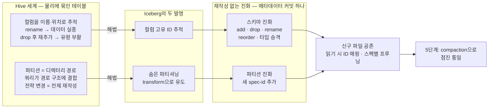
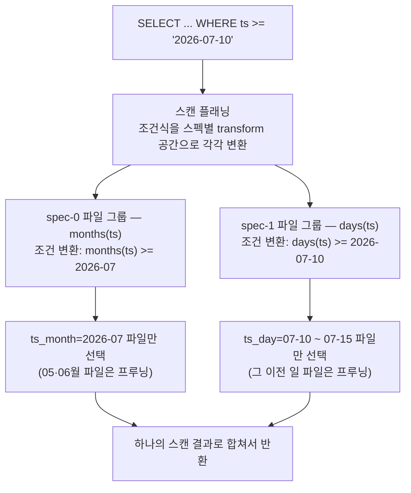

<figure class="post-figure post-figure--header">
<svg role="img" aria-label="재작성 없는 진화를 한 장으로 정리한 그림. 위쪽에는 스키마 v1 카드와 v2 카드가 나란히 있다. v1은 ID 1 order_id, ID 2 ts, ID 3 region 세 컬럼을 담고, ALTER TABLE 화살표를 지나면 v2에서 ID 3이 area로 이름이 바뀌고 ID 4 amount가 새로 추가된다 — ID는 그대로다. 가운데 띠에는 파티션 spec-0 months(ts)가 왼쪽 구간을, 파티션 진화 이후의 spec-1 days(ts)가 오른쪽 구간을 덮는다. 아래쪽에는 데이터 파일들이 타임라인 위에 놓여 있는데, 왼쪽의 월 단위 큰 파일들과 오른쪽의 일 단위 작은 파일들이 재작성 없이 그대로 공존하며, '데이터 파일은 그대로 — 메타데이터만 진화한다'는 문구가 아래에 적혀 있다." viewBox="0 0 680 330" xmlns="http://www.w3.org/2000/svg">
  <title>파티션 진화 · 스키마 진화 — 데이터 파일은 그대로, 메타데이터만 진화한다</title>
  <defs>
    <marker id="lh-s4-arrow" viewBox="0 0 10 10" refX="8" refY="5" markerWidth="6" markerHeight="6" orient="auto-start-reverse">
      <path d="M0,0 L10,5 L0,10 z" fill="var(--secondary-color)"/>
    </marker>
    <marker id="lh-s4-acc" viewBox="0 0 10 10" refX="8" refY="5" markerWidth="6" markerHeight="6" orient="auto-start-reverse">
      <path d="M0,0 L10,5 L0,10 z" fill="var(--accent-color)"/>
    </marker>
  </defs>

  <!-- title -->
  <text x="340" y="24" text-anchor="middle" font-size="17" font-weight="800" fill="currentColor" letter-spacing="1.5">SCHEMA &amp; PARTITION EVOLUTION</text>
  <text x="340" y="44" text-anchor="middle" font-size="10.5" font-weight="700" fill="currentColor" opacity="0.72">컬럼은 ID로, 파티션은 transform으로 — 재작성 없는 진화</text>

  <!-- ===== schema v1 card ===== -->
  <rect x="46" y="62" width="200" height="92" rx="5" fill="var(--bg-light)" stroke="var(--secondary-color)" stroke-width="2.5"/>
  <text x="146" y="79" text-anchor="middle" font-size="10" font-weight="800" fill="var(--secondary-color)">schema v1</text>
  <g font-size="9" font-weight="700" fill="currentColor">
    <rect x="58" y="88" width="20" height="15" rx="2" fill="var(--bg-panel)" stroke="currentColor" stroke-width="1.2"/>
    <text x="68" y="99" text-anchor="middle" font-size="8">1</text>
    <text x="84" y="99" text-anchor="start" font-family="monospace">order_id · long</text>
    <rect x="58" y="108" width="20" height="15" rx="2" fill="var(--bg-panel)" stroke="currentColor" stroke-width="1.2"/>
    <text x="68" y="119" text-anchor="middle" font-size="8">2</text>
    <text x="84" y="119" text-anchor="start" font-family="monospace">ts · timestamp</text>
    <rect x="58" y="128" width="20" height="15" rx="2" fill="var(--bg-panel)" stroke="currentColor" stroke-width="1.2"/>
    <text x="68" y="139" text-anchor="middle" font-size="8">3</text>
    <text x="84" y="139" text-anchor="start" font-family="monospace">region · string</text>
  </g>

  <!-- ALTER TABLE arrow -->
  <line x1="252" y1="108" x2="420" y2="108" stroke="var(--secondary-color)" stroke-width="2.2" marker-end="url(#lh-s4-arrow)"/>
  <text x="336" y="99" text-anchor="middle" font-size="9" font-weight="800" fill="var(--secondary-color)" font-family="monospace">ALTER TABLE</text>
  <text x="336" y="122" text-anchor="middle" font-size="8.5" font-weight="700" fill="currentColor" opacity="0.7">재작성 없음 · ID는 그대로</text>

  <!-- ===== schema v2 card ===== -->
  <rect x="428" y="52" width="212" height="112" rx="5" fill="var(--bg-light)" stroke="var(--accent-color)" stroke-width="2.5"/>
  <text x="534" y="69" text-anchor="middle" font-size="10" font-weight="800" fill="var(--accent-color)">schema v2</text>
  <g font-size="9" font-weight="700" fill="currentColor">
    <rect x="440" y="78" width="20" height="15" rx="2" fill="var(--bg-panel)" stroke="currentColor" stroke-width="1.2"/>
    <text x="450" y="89" text-anchor="middle" font-size="8">1</text>
    <text x="466" y="89" text-anchor="start" font-family="monospace">order_id · long</text>
    <rect x="440" y="98" width="20" height="15" rx="2" fill="var(--bg-panel)" stroke="currentColor" stroke-width="1.2"/>
    <text x="450" y="109" text-anchor="middle" font-size="8">2</text>
    <text x="466" y="109" text-anchor="start" font-family="monospace">ts · timestamp</text>
    <rect x="440" y="118" width="20" height="15" rx="2" fill="var(--bg-panel)" stroke="var(--accent-color)" stroke-width="1.6"/>
    <text x="450" y="129" text-anchor="middle" font-size="8">3</text>
    <text x="466" y="129" text-anchor="start" font-family="monospace" fill="var(--accent-color)">area · string</text>
    <text x="614" y="129" text-anchor="end" font-size="7.5" fill="var(--accent-color)">rename</text>
    <rect x="440" y="138" width="20" height="15" rx="2" fill="var(--bg-panel)" stroke="var(--gold)" stroke-width="1.6" stroke-dasharray="3 2"/>
    <text x="450" y="149" text-anchor="middle" font-size="8">4</text>
    <text x="466" y="149" text-anchor="start" font-family="monospace" fill="var(--gold)">amount · decimal</text>
    <text x="614" y="149" text-anchor="end" font-size="7.5" fill="var(--gold)">add</text>
  </g>

  <!-- ===== partition spec band ===== -->
  <text x="46" y="188" text-anchor="start" font-size="10" font-weight="700" fill="currentColor" opacity="0.72">파티션 스펙 — 진화 지점 이후로 새 spec-id가 적용된다</text>
  <rect x="46" y="196" width="280" height="24" rx="4" fill="var(--bg-panel)" stroke="var(--secondary-color)" stroke-width="2"/>
  <text x="186" y="212" text-anchor="middle" font-size="9.5" font-weight="800" fill="currentColor" font-family="monospace">spec-0 · months(ts)</text>
  <rect x="354" y="196" width="286" height="24" rx="4" fill="var(--bg-panel)" stroke="var(--gold)" stroke-width="2.5"/>
  <text x="497" y="212" text-anchor="middle" font-size="9.5" font-weight="800" fill="currentColor" font-family="monospace">spec-1 · days(ts)</text>

  <!-- evolution commit marker -->
  <line x1="340" y1="176" x2="340" y2="300" stroke="var(--accent-color)" stroke-width="1.8" stroke-dasharray="5 4"/>
  <text x="340" y="238" text-anchor="middle" font-size="8.5" font-weight="800" fill="var(--accent-color)">파티션 진화 커밋</text>

  <!-- ===== data files timeline ===== -->
  <text x="46" y="260" text-anchor="start" font-size="10" font-weight="700" fill="currentColor" opacity="0.72">데이터 파일 — 옛 스펙 파일과 새 스펙 파일이 공존</text>
  <g>
    <rect x="46" y="268" width="82" height="30" rx="3" fill="var(--bg-light)" stroke="var(--secondary-color)" stroke-width="2"/>
    <rect x="140" y="268" width="82" height="30" rx="3" fill="var(--bg-light)" stroke="var(--secondary-color)" stroke-width="2"/>
    <rect x="234" y="268" width="82" height="30" rx="3" fill="var(--bg-light)" stroke="var(--secondary-color)" stroke-width="2"/>
  </g>
  <g font-size="8" font-weight="700" fill="currentColor" text-anchor="middle" font-family="monospace">
    <text x="87" y="287">ts_month=05</text>
    <text x="181" y="287">ts_month=06</text>
    <text x="275" y="287">ts_month=07</text>
  </g>
  <g>
    <rect x="354" y="268" width="62" height="30" rx="3" fill="var(--bg-light)" stroke="var(--gold)" stroke-width="2"/>
    <rect x="428" y="268" width="62" height="30" rx="3" fill="var(--bg-light)" stroke="var(--gold)" stroke-width="2"/>
    <rect x="502" y="268" width="62" height="30" rx="3" fill="var(--bg-light)" stroke="var(--gold)" stroke-width="2"/>
    <rect x="576" y="268" width="62" height="30" rx="3" fill="var(--bg-light)" stroke="var(--gold)" stroke-width="2"/>
  </g>
  <g font-size="8" font-weight="700" fill="currentColor" text-anchor="middle" font-family="monospace">
    <text x="385" y="287">07-12</text>
    <text x="459" y="287">07-13</text>
    <text x="533" y="287">07-14</text>
    <text x="607" y="287">07-15</text>
  </g>

  <!-- bottom caption -->
  <text x="340" y="322" text-anchor="middle" font-size="10" fill="currentColor" opacity="0.72">데이터 파일은 그대로 — 스키마도 파티션도 메타데이터만 바뀐다</text>
</svg>
<figcaption>스키마 v1→v2와 파티션 spec-0(월)→spec-1(일)의 진화 — 컬럼 ID는 유지되고, 기존 데이터 파일은 재작성 없이 새 파일과 공존한다</figcaption>
</figure>

## 들어가며

[3단계](/2026/07/15/lakehouse-iceberg-acid-snapshots-time-travel.html)에서 우리는 Iceberg가 메타데이터 포인터 스왑으로 **원자적 커밋**을, 스냅샷 이력으로 **시간여행**을 얻는 것을 봤습니다. 그런데 이 능력들은 사실 Delta Lake나 Hudi도 각자의 방식으로 제공합니다. [Lakehouse Essential Curriculum](/2026/07/12/lakehouse-essential-curriculum.html)이 이번 4단계를 두고 **"Iceberg가 Hive 테이블과 결정적으로 갈라지는 지점"**이라고 부른 것은 다른 이유에서입니다 — 바로 **재작성 없는 진화**입니다.

운영 중인 테이블은 반드시 변합니다. 컬럼이 추가되고, 이름이 바뀌고, 타입이 커지고, 데이터가 불어나면 파티션 전략 자체를 바꿔야 합니다. Hive 세계에서 이런 변경은 재앙이었습니다 — 컬럼을 이름이나 위치로 추적하니 rename 한 번에 데이터가 사라진 것처럼 보이고, 파티션이 물리 디렉터리 경로에 박혀 있으니 파티션 전략을 바꾸려면 **테이블 전체를 다시 쓰는** 수밖에 없었습니다. 페타바이트 테이블이라면 이 재작성 자체가 며칠짜리 프로젝트입니다.

Iceberg는 이 문제를 두 가지 발명으로 풉니다. 컬럼을 이름이 아니라 **고유 ID**로 추적하는 것, 그리고 파티션을 물리 경로가 아니라 **컬럼에서 유도되는 메타데이터**(숨은 파티셔닝)로 표현하는 것. 이 둘 덕분에 스키마 변경도 파티션 스펙 변경도 `ALTER TABLE` 한 줄 — 즉 **메타데이터 커밋 하나** — 로 끝나고, 기존 데이터 파일은 단 하나도 다시 쓰이지 않습니다. 이 글은 그 원리를 Hive의 함정 시나리오와 대비해 가며 파고듭니다.

<div class="post-summary-box" markdown="1">

### 📌 이 글에서 다루는 내용

- **스키마 진화**: Hive/Parquet의 이름·위치 기반 컬럼 추적이 rename·drop 후 재추가에서 데이터를 잃거나 유령을 부활시키는 함정 vs Iceberg의 컬럼 고유 ID 추적 — add/drop/rename/reorder/타입 승격(promotion 허용 목록)이 backfill 없이 안전한 이유, 읽기 시 ID 매핑으로 신구 파일이 공존하는 원리, `ALTER TABLE` 예제
- **숨은 파티셔닝(hidden partitioning)**: 연·월·일 컬럼을 따로 만들어 물리 경로에 박는 Hive 파티션의 문제(파티션 컬럼 실수, 쿼리 누수) vs Iceberg의 파티션 변환(transform: identity/bucket/truncate/year/month/day/hour) — 파티션은 컬럼에서 유도되는 메타데이터일 뿐, 쿼리는 원본 컬럼으로 쓰면 자동 프루닝
- **파티션 진화**: 월→일 같은 파티션 스펙 변경이 새 spec-id로 기록되고 기존 데이터는 옛 스펙대로 남는 방식, 스캔 플래닝이 스펙별로 나눠 프루닝하는 법, 진화 전후 파일 공존의 실무 함의와 compaction(5단계) 예고, `ALTER TABLE ... ADD/DROP/REPLACE PARTITION FIELD` 예제

</div>

## 한눈에 보기 — 두 발명이 재작성 없는 진화를 만든다

이 글의 스파인을 한 장으로 그리면 이렇습니다. Hive의 두 함정(이름·위치 기반 컬럼 추적, 물리 경로 파티션)에서 출발해, Iceberg의 두 발명(컬럼 고유 ID, 숨은 파티셔닝)이 각각 스키마 진화와 파티션 진화를 가능하게 하고, 그 결과로 신구 파일이 공존하는 테이블을 5단계의 compaction이 점진적으로 통일하는 흐름입니다.



왼쪽의 함정을 정확히 이해해야 오른쪽 발명의 가치가 보입니다. 그래서 Hive의 함정부터 시작합니다.

## Hive가 남긴 함정 — 이름과 경로에 묶인 테이블

### 함정 1: 컬럼을 이름·위치로 추적하면 생기는 일

Hive 테이블(그리고 그 위의 Spark·Presto)은 스키마의 컬럼과 데이터 파일의 컬럼을 **이름** 또는 **위치(순서)**로 맞춥니다. Parquet처럼 자기 스키마를 가진 포맷은 보통 이름으로, 위치 기반 포맷은 순서로 해석합니다. 둘 다 치명적인 함정이 있습니다.

**시나리오 A — rename이 데이터를 잃는다.** `region` 컬럼을 `area`로 바꾸고 싶다고 합시다.

```sql
-- Hive 테이블에서의 rename — 메타스토어의 스키마만 바뀐다
ALTER TABLE orders CHANGE region area string;

-- 이후 조회하면?
SELECT area FROM orders;
-- → 전부 NULL. 기존 Parquet 파일에는 'region'이라는 이름의 컬럼만 있고
--   'area'라는 이름의 컬럼은 없으므로, 이름 기반 매칭이 실패한다.
--   데이터는 파일 안에 멀쩡히 있는데 보이지 않는다.
```

데이터가 지워진 것이 아닙니다. 파일 속 컬럼 이름(`region`)과 스키마의 새 이름(`area`)이 더 이상 매칭되지 않을 뿐입니다. 하지만 사용자 입장에서는 **rename 한 번에 과거 데이터 전체가 사라진** 것과 같습니다. 되살리려면 모든 파일을 새 이름으로 재작성해야 합니다.

**시나리오 B — drop 후 재추가가 유령을 부활시킨다.** 반대 방향은 더 음험합니다. 쓸모없어진 `score` 컬럼을 지웠다가, 몇 달 뒤 같은 이름으로 (의미가 전혀 다른) 컬럼을 다시 추가했다고 합시다. 이름 기반 매칭은 옛 파일 속의 **옛 `score` 값을 새 컬럼의 값인 것처럼** 읽어 올립니다. 삭제했다고 믿었던 데이터가 새 컬럼의 탈을 쓰고 부활하는 것입니다 — 조용히, 에러 한 줄 없이 잘못된 숫자가 대시보드에 오릅니다.

**시나리오 C — 위치 기반이면 전부 밀린다.** 순서로 해석하는 포맷에서 가운데 컬럼을 지우면, 그 뒤의 모든 컬럼이 한 칸씩 밀려 엉뚱한 컬럼의 값을 읽습니다. `email` 자리에 `phone`이 들어오는 식의 대참사입니다.

세 시나리오의 공통 뿌리는 하나입니다 — **"이 컬럼이 그 컬럼이다"라는 정체성을 이름이나 위치라는 가변적인 것에 의존**한다는 점입니다.

### 함정 2: 파티션이 물리 경로에 박혀 있으면 생기는 일

Hive의 파티션은 디렉터리 경로 그 자체입니다. 시간 파티셔닝을 하려면 이벤트 시각 `ts`에서 연·월·일을 **쓰는 쪽이 직접 계산해** 별도 컬럼으로 만들어야 합니다.

```sql
-- Hive: 파티션 컬럼(year, month, day)을 따로 만들어 물리 경로에 박는다
CREATE TABLE orders (
    order_id BIGINT,
    amount   DECIMAL(10,2),
    ts       TIMESTAMP
)
PARTITIONED BY (year STRING, month STRING, day STRING);

-- 적재하는 쪽이 ts에서 파티션 값을 직접 파생시킨다
INSERT INTO orders PARTITION (year, month, day)
SELECT order_id, amount, ts,
       date_format(ts, 'yyyy'), date_format(ts, 'MM'), date_format(ts, 'dd')
FROM staging_orders;
-- → s3://bucket/orders/year=2026/month=07/day=15/... 디렉터리가 곧 파티션
```

이 설계는 두 종류의 사고를 상시 유발합니다.

**쓰기 쪽 사고 — 파티션 컬럼 실수.** 파생 계산은 사람이 하는 일이므로 틀릴 수 있습니다. 타임존을 잘못 잡거나, `MM`을 `mm`(분)으로 오타 내면 데이터가 엉뚱한 파티션에 적재되고, 이후 프루닝이 그 데이터를 영영 건너뜁니다. 테이블은 정상으로 보이는데 숫자가 슬금슬금 빕니다.

**읽기 쪽 사고 — 쿼리 누수.** 프루닝은 쿼리가 **파티션 컬럼을 정확히 그 형태로** 조건에 써야만 작동합니다.

```sql
-- 프루닝 성공: 파티션 컬럼을 정확히 안다
SELECT * FROM orders WHERE year = '2026' AND month = '07' AND day = '10';

-- 프루닝 실패: 자연스러운 조건이지만 파티션 컬럼이 아니다 → 풀 스캔
SELECT * FROM orders WHERE ts >= '2026-07-10';
```

두 번째 쿼리는 의미상 완전히 타당하지만, 엔진은 `ts`와 디렉터리 경로 `year=/month=/day=` 사이의 관계를 모르므로 **테이블 전체를 스캔**합니다. 테이블의 물리 레이아웃이라는 내부 구현이 모든 쿼리 작성자의 어깨 위에 얹혀 있는 것입니다. 그리고 마지막으로 — 이 경로 구조를 월에서 일로 바꾸고 싶다면? 디렉터리 구조가 곧 파티션이므로, **테이블 전체를 새 경로 구조로 재작성**하고 모든 쿼리의 WHERE 절을 고치는 것 외에 방법이 없습니다.

## 스키마 진화 — 컬럼은 이름이 아니라 ID다

### 컬럼 고유 ID: 정체성을 불변의 것에 묶기

Iceberg의 해법은 단순하고 근본적입니다. 스키마의 모든 컬럼(중첩 필드 포함)에 **테이블 수명 전체에서 유일한 정수 ID**를 부여하고, 데이터 파일에도 값을 컬럼 이름이 아니라 **field ID로 태깅해** 기록합니다. 스키마는 메타데이터 파일 안에 버전 목록(`schemas` + `current-schema-id`)으로 쌓이고, 모든 변경은 ID를 기준으로 해석됩니다.

- **rename**은 ID 3의 표시 이름을 `region`에서 `area`로 바꾸는 것일 뿐입니다. 파일 속 데이터는 ID 3으로 태깅되어 있으므로 계속 정확히 읽힙니다. 데이터 실종이 원리적으로 불가능합니다.
- **drop 후 재추가**는 옛 컬럼(ID 3)과 새 컬럼(ID 7)이 이름만 같은 **서로 다른 컬럼**이 됩니다. 옛 파일의 ID 3 데이터는 새 컬럼(ID 7)으로 절대 흘러들지 않습니다. 유령 부활도 원리적으로 불가능합니다.
- **reorder**는 스키마 정의 안의 표시 순서만 바꿉니다. 읽기가 ID로 매칭되므로 위치 밀림이 일어날 수 없습니다.

Hive의 세 함정이 전부 "정체성을 가변적인 것에 묶어서" 생겼다면, Iceberg는 정체성을 **불변의 ID에 묶어서** 세 함정을 한꺼번에 제거한 것입니다.

### ALTER TABLE로 하는 스키마 진화 — 전부 메타데이터 커밋 하나

Spark SQL 기준으로, 스키마 진화의 전 메뉴는 이렇습니다. 아래 어떤 문장도 데이터 파일을 건드리지 않습니다 — 새 스키마 버전을 담은 **메타데이터 커밋 하나**가 전부입니다.

```sql
-- 컬럼 추가 — 위치 지정 가능, 기존 파일 backfill 없음 (읽을 때 null로 채워짐)
ALTER TABLE lake.sales.orders ADD COLUMN discount decimal(10,2) AFTER amount;
ALTER TABLE lake.sales.orders ADD COLUMNS (coupon_code string, channel string);

-- 중첩 struct 안에도 추가할 수 있다
ALTER TABLE lake.sales.orders ADD COLUMN shipping.postal_code string;

-- 이름 변경 — ID는 그대로, 표시 이름만 바뀐다. 데이터 실종 없음
ALTER TABLE lake.sales.orders RENAME COLUMN region TO area;

-- 타입 승격 — 허용 목록 안에서만 (아래 표 참고)
ALTER TABLE lake.sales.orders ALTER COLUMN order_id TYPE bigint;

-- 순서 변경 — 표시 순서만 바뀐다
ALTER TABLE lake.sales.orders ALTER COLUMN channel FIRST;
ALTER TABLE lake.sales.orders ALTER COLUMN coupon_code AFTER channel;

-- 삭제 — ID 3이 스키마에서 빠질 뿐, 파일 속 데이터는 그대로 남는다
ALTER TABLE lake.sales.orders DROP COLUMN legacy_flag;
```

`ADD COLUMN`의 동작을 정확히 하면 이렇습니다 — 새 컬럼은 새 ID(예: ID 5)를 받고, **기존 파일에는 ID 5가 없으므로 읽을 때 `null`로 채워집니다**. 수십억 행에 기본값을 채워 넣는 backfill 작업이 없다는 뜻입니다. 진화 이후 쓰인 파일부터 ID 5 값이 실제로 담기고, 옛 파일과 새 파일은 같은 테이블 안에서 자연스럽게 공존합니다.

### 타입 승격 — 허용 목록이 있는 이유

타입 변경은 아무거나 되는 것이 아니라 **읽기 호환이 보장되는 방향**만 허용됩니다. 옛 파일은 옛 타입 그대로 남아 있으므로, "옛 타입의 값을 새 타입으로 읽어도 정보 손실이 없는" 승격(promotion)만 안전하기 때문입니다.

| 원래 타입 | 승격 가능한 타입 | 안전한 이유 |
| --- | --- | --- |
| `int` | `long` | 모든 int 값은 long으로 손실 없이 읽힌다 |
| `float` | `double` | 모든 float 값은 double로 손실 없이 읽힌다 |
| `decimal(P, S)` | `decimal(P', S)` (P' > P) | scale 고정, precision 확장 — 기존 값은 전부 표현 가능 |

역방향(`long`→`int` 축소)이나 계열이 다른 변환(`string`→`int`)은 거부됩니다 — 옛 파일의 값이 새 타입에 안 들어갈 수 있고, 그 순간 "재작성 없는"이라는 약속이 깨지기 때문입니다. 허용 목록은 제약이 아니라, **어떤 파일도 다시 쓰지 않고도 전체 이력이 항상 읽힌다**는 불변식을 지키는 울타리입니다.

### 읽기 시 ID 매핑 — 신구 파일이 한 테이블에 공존하는 법

진화를 여러 번 겪은 테이블에는 서로 다른 시점의 스키마로 쓰인 파일들이 섞여 있습니다. 읽기는 언제나 **현재 스키마의 ID 목록**을 기준으로, 파일마다 ID 매핑을 수행합니다.

<figure class="post-figure">
<svg role="img" aria-label="읽기 시 ID 매핑을 그린 개념도. 가운데에 현재 스키마 v2가 있고 ID 1 order_id, ID 3 area, ID 4 amount를 요구한다. 왼쪽의 옛 파일(진화 전, 스키마 v1로 기록)은 ID 1과 ID 3(당시 이름 region)만 담고 있어, ID 1과 ID 3은 그대로 매핑되고 파일에 없는 ID 4는 null로 채워진다. 오른쪽의 새 파일(진화 후)은 ID 1·3·4를 모두 담고 있어 전부 그대로 매핑된다. 이름이 아니라 ID로 매칭하므로 옛 파일의 region 데이터가 현재 이름 area로 정확히 읽힌다." viewBox="0 0 680 270" xmlns="http://www.w3.org/2000/svg">
  <title>읽기 시 ID 매핑 — 현재 스키마의 ID를 기준으로 파일마다 값을 찾고, 없으면 null</title>
  <defs>
    <marker id="lh-s4-map" viewBox="0 0 10 10" refX="8" refY="5" markerWidth="6" markerHeight="6" orient="auto-start-reverse">
      <path d="M0,0 L10,5 L0,10 z" fill="var(--secondary-color)"/>
    </marker>
    <marker id="lh-s4-null" viewBox="0 0 10 10" refX="8" refY="5" markerWidth="6" markerHeight="6" orient="auto-start-reverse">
      <path d="M0,0 L10,5 L0,10 z" fill="var(--accent-color)"/>
    </marker>
  </defs>

  <text x="340" y="24" text-anchor="middle" font-size="11" font-weight="700" fill="currentColor" opacity="0.72">읽기 시 ID 매핑 — 이름이 아니라 ID로 값을 찾는다</text>

  <!-- old file (left) -->
  <rect x="36" y="52" width="180" height="120" rx="5" fill="var(--bg-light)" stroke="currentColor" stroke-width="2"/>
  <text x="126" y="70" text-anchor="middle" font-size="9.5" font-weight="800" fill="currentColor">옛 파일 · 진화 전 기록</text>
  <text x="126" y="83" text-anchor="middle" font-size="8" fill="currentColor" opacity="0.65">(schema v1으로 쓰임)</text>
  <g font-size="8.5" font-weight="700" fill="currentColor" font-family="monospace">
    <rect x="50" y="92" width="152" height="18" rx="2" fill="var(--bg-panel)" stroke="currentColor" stroke-width="1.2"/>
    <text x="60" y="105" text-anchor="start">id 1 → order_id</text>
    <rect x="50" y="116" width="152" height="18" rx="2" fill="var(--bg-panel)" stroke="currentColor" stroke-width="1.2"/>
    <text x="60" y="129" text-anchor="start">id 3 → "region" 값</text>
  </g>
  <text x="126" y="158" text-anchor="middle" font-size="8" fill="currentColor" opacity="0.65">id 4는 이 파일에 없다</text>

  <!-- current schema (center) -->
  <rect x="256" y="42" width="168" height="150" rx="5" fill="var(--bg-panel)" stroke="var(--gold)" stroke-width="2.5"/>
  <text x="340" y="62" text-anchor="middle" font-size="10" font-weight="800" fill="var(--gold)">현재 스키마 v2</text>
  <g font-size="8.5" font-weight="700" fill="currentColor" font-family="monospace">
    <rect x="270" y="74" width="140" height="18" rx="2" fill="var(--bg-light)" stroke="currentColor" stroke-width="1.2"/>
    <text x="280" y="87" text-anchor="start">id 1 · order_id</text>
    <rect x="270" y="98" width="140" height="18" rx="2" fill="var(--bg-light)" stroke="var(--accent-color)" stroke-width="1.4"/>
    <text x="280" y="111" text-anchor="start">id 3 · area</text>
    <rect x="270" y="122" width="140" height="18" rx="2" fill="var(--bg-light)" stroke="var(--gold)" stroke-width="1.4"/>
    <text x="280" y="135" text-anchor="start">id 4 · amount</text>
  </g>
  <text x="340" y="162" text-anchor="middle" font-size="8" fill="currentColor" opacity="0.7">읽기는 항상 이 ID 목록 기준</text>
  <text x="340" y="176" text-anchor="middle" font-size="8" fill="currentColor" opacity="0.7">파일에 없는 ID는 null로 채운다</text>

  <!-- new file (right) -->
  <rect x="464" y="52" width="180" height="120" rx="5" fill="var(--bg-light)" stroke="currentColor" stroke-width="2"/>
  <text x="554" y="70" text-anchor="middle" font-size="9.5" font-weight="800" fill="currentColor">새 파일 · 진화 후 기록</text>
  <text x="554" y="83" text-anchor="middle" font-size="8" fill="currentColor" opacity="0.65">(schema v2로 쓰임)</text>
  <g font-size="8.5" font-weight="700" fill="currentColor" font-family="monospace">
    <rect x="478" y="92" width="152" height="18" rx="2" fill="var(--bg-panel)" stroke="currentColor" stroke-width="1.2"/>
    <text x="488" y="105" text-anchor="start">id 1 → order_id</text>
    <rect x="478" y="116" width="152" height="18" rx="2" fill="var(--bg-panel)" stroke="currentColor" stroke-width="1.2"/>
    <text x="488" y="129" text-anchor="start">id 3 → "area" 값</text>
    <rect x="478" y="140" width="152" height="18" rx="2" fill="var(--bg-panel)" stroke="currentColor" stroke-width="1.2"/>
    <text x="488" y="153" text-anchor="start">id 4 → amount 값</text>
  </g>

  <!-- mapping arrows -->
  <g stroke="var(--secondary-color)" stroke-width="1.8" fill="none">
    <line x1="220" y1="101" x2="266" y2="84" marker-end="url(#lh-s4-map)"/>
    <line x1="220" y1="125" x2="266" y2="108" marker-end="url(#lh-s4-map)"/>
    <line x1="460" y1="101" x2="414" y2="84" marker-end="url(#lh-s4-map)"/>
    <line x1="460" y1="125" x2="414" y2="108" marker-end="url(#lh-s4-map)"/>
    <line x1="460" y1="149" x2="414" y2="132" marker-end="url(#lh-s4-map)"/>
  </g>
  <!-- null fill for missing id 4 in old file -->
  <path d="M126,172 Q180,214 268,138" fill="none" stroke="var(--accent-color)" stroke-width="1.8" stroke-dasharray="4 3" marker-end="url(#lh-s4-null)"/>
  <text x="176" y="212" text-anchor="middle" font-size="8.5" font-weight="700" fill="var(--accent-color)">id 4 없음 → null</text>

  <!-- bottom note -->
  <text x="340" y="248" text-anchor="middle" font-size="9.5" fill="currentColor" opacity="0.72">옛 파일의 "region" 값이 현재 이름 area(id 3)로 정확히 읽힌다 — 이름이 아니라 ID로 매칭하므로</text>
</svg>
<figcaption>읽기 시 ID 매핑 — 현재 스키마의 각 ID를 파일에서 찾아 매칭하고, 파일에 없는 ID(새로 추가된 컬럼)는 null로 채운다</figcaption>
</figure>

정리하면 읽기 규칙은 두 줄입니다 — **파일에 있는 ID는 그 값으로, 없는 ID는 `null`로.** rename 이전에 쓰인 파일의 `region` 값이 현재 이름 `area`로 정확히 나오는 것도, 컬럼 추가 이전 파일이 새 컬럼 자리에 `null`을 내놓는 것도 전부 이 규칙 하나의 결과입니다. 그리고 이 규칙이 성립하니 **파일을 스키마 버전별로 다시 쓸 이유가 사라집니다** — 이것이 "재작성 없는 스키마 진화"의 전부입니다.

## 숨은 파티셔닝 — 파티션은 컬럼에서 유도되는 메타데이터

### transform: 파생 계산을 사람에게서 테이블로 옮기다

파티션 쪽의 발명도 같은 정신입니다. Hive에서 사람이 손으로 하던 파생 계산(`ts` → 연·월·일)을, Iceberg는 **테이블 정의 안의 변환 함수(transform)**로 선언합니다.

```sql
CREATE TABLE lake.sales.orders (
    order_id    bigint,
    customer_id bigint,
    amount      decimal(10,2),
    ts          timestamp
)
USING iceberg
PARTITIONED BY (months(ts));   -- "ts에서 월을 유도해 파티셔닝하라"는 선언
```

`months(ts)`는 별도 컬럼이 아닙니다. 쓰기 시점에 Iceberg가 `ts` 값에 transform을 적용해 파티션 값을 **스스로 계산**하고, 그 값을 데이터 파일이 아니라 **매니페스트의 메타데이터에** 기록합니다. 사용 가능한 transform의 전 목록은 이렇습니다.

| transform | 의미 | 예시 (입력 → 파티션 값) |
| --- | --- | --- |
| `identity` | 값 그대로 | `'KR'` → `'KR'` |
| `bucket[N]` | 해시 후 N개 버킷으로 분산 | `customer_id=8237` → `bucket=5` (of 16) |
| `truncate[W]` | 너비 W로 절단 | `'PROMO2026'`, W=5 → `'PROMO'` |
| `year` | 타임스탬프/날짜에서 연 유도 | `2026-07-15 09:30` → `2026` |
| `month` | 월 유도 | `2026-07-15 09:30` → `2026-07` |
| `day` | 일 유도 | `2026-07-15 09:30` → `2026-07-15` |
| `hour` | 시 유도 | `2026-07-15 09:30` → `2026-07-15-09` |
| `void` | 항상 null (스펙에서 필드를 무효화할 때) | 아무 값 → `null` |

시간 계열(`year`/`month`/`day`/`hour`)이 Hive의 연·월·일 컬럼을 대체하고, `bucket`은 고카디널리티 키(고객 ID 등)의 균등 분산을, `truncate`는 접두사 기반 그루핑을 담당합니다.

### 쿼리는 원본 컬럼으로 — 프루닝은 자동으로

"숨은(hidden)"이라는 이름의 의미가 여기서 드러납니다. 파티션이 스키마에 노출된 컬럼이 아니라 메타데이터이므로, **쿼리 작성자는 파티셔닝의 존재 자체를 몰라도 됩니다.**

```sql
-- 원본 컬럼 ts로 자연스럽게 쓴다 — 파티션 컬럼이라는 개념이 쿼리에 없다
SELECT * FROM lake.sales.orders
WHERE ts >= TIMESTAMP '2026-07-10 00:00:00';

-- 플래너가 조건을 transform 공간으로 변환한다:
--   ts >= '2026-07-10'  →  days(ts) >= '2026-07-10' (일 파티션이면)
--   ts >= '2026-07-10'  →  months(ts) >= '2026-07' (월 파티션이면)
-- → 매니페스트의 파티션 값과 비교해 해당 없는 파일을 스캔 계획에서 제거
```

Hive에서 풀 스캔을 유발하던 바로 그 "자연스러운 쿼리"가, Iceberg에서는 자동으로 프루닝됩니다. 플래너가 원본 컬럼의 조건식을 각 transform의 값 공간으로 변환할 줄 알기 때문입니다. 이로써 Hive의 두 사고가 모두 사라집니다 — 파생 계산을 테이블이 하므로 **파티션 컬럼 실수가 원리적으로 불가능**하고, 변환을 플래너가 하므로 **쿼리 누수도 원리적으로 불가능**합니다. 물리 레이아웃이라는 내부 구현이 쿼리 작성자의 어깨에서 테이블 포맷의 책임으로 내려온 것입니다.

그리고 이 캡슐화가 다음 절의 문을 엽니다 — 쿼리가 파티션 구조에 결합되어 있지 않으니, **파티션 구조를 바꿔도 쿼리는 한 줄도 고칠 필요가 없습니다.**

## 파티션 진화 — 스펙을 바꿔도 데이터는 그대로

### 스펙 변경은 새 spec-id를 추가하는 것

테이블이 커지면 파티션 전략도 자라야 합니다. 월 100GB일 때 적절했던 `months(ts)`가, 하루 50GB가 쌓이는 시점에는 파티션 하나가 너무 커집니다. Iceberg에서 이 전환은 `ALTER TABLE` 두 줄입니다.

```sql
-- 월 → 일 전환: 새 파티션 필드 추가 + 옛 필드 제거
ALTER TABLE lake.sales.orders ADD PARTITION FIELD days(ts);
ALTER TABLE lake.sales.orders DROP PARTITION FIELD months(ts);

-- 같은 소스 컬럼의 시간 세분화 전환은 REPLACE로 한 번에 할 수도 있다
ALTER TABLE lake.sales.orders REPLACE PARTITION FIELD ts_month WITH days(ts);

-- 다른 transform들도 같은 문법으로 진화시킨다
ALTER TABLE lake.sales.orders ADD PARTITION FIELD bucket(16, customer_id) AS customer_shard;
ALTER TABLE lake.sales.orders ADD PARTITION FIELD truncate(4, coupon_code);
ALTER TABLE lake.sales.orders DROP PARTITION FIELD truncate(4, coupon_code);
```

이 문장들이 하는 일은 스키마 진화와 정확히 같은 종류입니다 — **메타데이터 커밋 하나.** 테이블 메타데이터에는 파티션 스펙이 버전 목록(`partition-specs` + `default-spec-id`)으로 쌓이고, `days(ts)` 전환은 새 스펙(spec-1)을 목록에 추가하며 기본 스펙 포인터를 옮기는 것뿐입니다. 그 결과는 다음과 같습니다.

- **기존 데이터 파일은 단 하나도 재작성되지 않습니다.** spec-0(월) 시절에 쓰인 파일은 매니페스트에 spec-0의 파티션 값(`ts_month=2026-05` 등)을 단 채 그대로 남습니다.
- **진화 이후의 쓰기부터** 새 스펙이 적용되어, 새 파일은 spec-1의 파티션 값(`ts_day=2026-07-15` 등)으로 기록됩니다.
- 각 매니페스트가 **자기 파일들이 어느 스펙으로 쓰였는지**(partition-spec-id)를 알고 있으므로, 한 테이블 안에 서로 다른 스펙의 파일이 섞여 있어도 혼란이 없습니다.

Hive였다면 "테이블 전체를 새 디렉터리 구조로 재작성 + 모든 쿼리 수정"이었던 작업이, 커밋 하나와 쿼리 수정 0건으로 끝납니다.

### 메타데이터 파일에서 확인하기 — 진화는 버전 목록으로 쌓인다

2단계에서 본 메타데이터 파일을 다시 열어 보면, 이 글의 두 진화가 실제로 어디에 기록되는지 눈으로 확인할 수 있습니다. 스키마도 파티션 스펙도 **덮어쓰이지 않고 버전 목록으로 쌓이며**, 현재 버전은 포인터가 가리킵니다.

```json
// 테이블 메타데이터 파일 (vN.metadata.json) 요지
{
  "current-schema-id": 1,
  "schemas": [
    { "schema-id": 0,                      // 진화 전 스키마 — 지워지지 않는다
      "fields": [
        {"id": 1, "name": "order_id", "type": "long"},
        {"id": 2, "name": "ts",       "type": "timestamptz"},
        {"id": 3, "name": "region",   "type": "string"} ] },
    { "schema-id": 1,                      // rename + add 이후의 현재 스키마
      "fields": [
        {"id": 1, "name": "order_id", "type": "long"},
        {"id": 2, "name": "ts",       "type": "timestamptz"},
        {"id": 3, "name": "area",     "type": "string"},      // 같은 id 3 — 이름만 변경
        {"id": 4, "name": "amount",   "type": "decimal(10,2)"} ] }  // 새 id 발급
  ],

  "default-spec-id": 1,
  "partition-specs": [
    { "spec-id": 0,                        // 월 파티셔닝 시절의 스펙 — 역시 남는다
      "fields": [ {"source-id": 2, "transform": "month", "name": "ts_month"} ] },
    { "spec-id": 1,                        // 파티션 진화 이후의 현재 스펙
      "fields": [ {"source-id": 2, "transform": "day",   "name": "ts_day"} ] }
  ]
}
```

읽어 낼 것이 셋 있습니다. 첫째, **rename의 실체** — schema-id 0과 1에서 `id: 3`이 동일하고 이름만 `region`→`area`로 다릅니다. ID가 정체성이고 이름은 표시일 뿐이라는 것이 데이터 구조에 그대로 드러납니다. 둘째, **파티션 필드도 소스 컬럼을 ID로 가리킵니다**(`source-id: 2` = `ts`). 파티셔닝이 "컬럼에서 유도된다"는 말의 구현이 이것이고, 덕분에 `ts`를 rename해도 파티션 스펙은 깨지지 않습니다. 셋째, **옛 버전이 지워지지 않습니다** — 3단계의 시간여행으로 과거 스냅샷을 읽을 때 그 시점의 스키마·스펙으로 해석해야 하고, 옛 스펙으로 쓰인 파일의 매니페스트를 해석할 때도 필요하기 때문입니다. 진화의 이력 전체가 곧 테이블의 일부입니다.

### 스캔 플래닝은 스펙별로 나눠 프루닝한다

그럼 읽기는 어떻게 될까요? 스펙이 섞인 테이블에 쿼리가 들어오면, 플래너는 파일들을 **스펙별 그룹으로 나눠 각 그룹에 그 스펙의 프루닝을 적용**합니다.



같은 조건 `ts >= '2026-07-10'`이 spec-0 그룹에서는 `months(ts) >= '2026-07'`로, spec-1 그룹에서는 `days(ts) >= '2026-07-10'`로 변환되어 각각 프루닝됩니다. 옛 파일은 월 단위의 (상대적으로 거친) 프루닝을, 새 파일은 일 단위의 정밀한 프루닝을 받는 것입니다. 쿼리 작성자는 이 모든 것을 모릅니다 — 원본 컬럼 `ts`로 조건을 썼을 뿐이고, 결과는 스펙 구성과 무관하게 항상 정확합니다.

여기서 숨은 파티셔닝이 파티션 진화의 **전제 조건**이었다는 것이 분명해집니다. Hive처럼 쿼리가 파티션 컬럼(`year=`, `month=`)에 직접 결합되어 있었다면, 스펙이 두 개가 되는 순간 어떤 WHERE 절을 써야 할지가 모순에 빠집니다. 쿼리가 원본 컬럼만 알고 변환은 플래너가 스펙별로 수행하기에, 스펙의 공존이 가능한 것입니다.

### 진화 전후 파일 공존의 실무 함의

"재작성 없음"은 공짜가 아니라 **트레이드오프의 선택**입니다. 실무에서 알아 둘 함의를 정리합니다.

- **옛 데이터의 프루닝 정밀도는 옛 스펙 수준에 머뭅니다.** 월→일 전환 이후에도, 전환 이전 데이터를 조회하는 쿼리는 월 단위 프루닝을 받습니다. "과거 특정 하루"를 조회하면 그 달 전체 파일을 읽게 됩니다. 진화는 **앞으로의 데이터**를 위한 결정이지, 과거를 소급해 최적화하지 않습니다.
- **경계 구간 쿼리는 두 스펙에 걸칩니다.** 전환 시점을 가로지르는 범위 조건은 spec-0 그룹과 spec-1 그룹을 모두 스캔 계획에 올립니다. 정확성에는 문제가 없지만, 플래닝이 두 갈래로 나뉜다는 사실은 알고 있어야 합니다.
- **과거까지 새 스펙으로 통일하고 싶다면 — 그것이 compaction입니다.** 옛 스펙 구간의 파일을 다시 쓰는 rewrite(compaction) 작업은 새 파일을 현재 스펙으로 기록하므로, 유지보수 잡이 돌 때마다 테이블이 **점진적으로 새 스펙으로 수렴**합니다. 강제 일괄 재작성이 아니라, 어차피 해야 할 유지보수에 얹혀 가는 점진 통일 — 이 이야기가 바로 다음 5단계(compaction · 유지보수)의 주제입니다.
- **스키마 진화 쪽 공존에도 같은 원리가 적용됩니다.** 컬럼 추가 후 옛 파일이 내놓는 `null`이 마음에 걸린다면, 역시 compaction이 새 스키마로 파일을 다시 쓰는 시점에 (필요하면 backfill 로직과 함께) 정리할 수 있습니다.

결국 4단계와 5단계는 한 쌍입니다 — **진화는 메타데이터만 바꿔 신구 파일의 공존을 허용하고, 유지보수는 그 공존을 점진적으로 정리합니다.** 재작성을 "안 하는" 것이 아니라, 재작성을 **긴급한 마이그레이션에서 한가한 백그라운드 잡으로 강등**시키는 것이 Iceberg 설계의 요체입니다.

마지막으로, 진화를 안전하게 쓰기 위한 실무 수칙을 짧게 정리합니다.

- **파티션 진화는 "지금부터"의 결정임을 팀에 공유하세요.** 전환 직후 과거 데이터 조회가 갑자기 빨라지지 않는 것은 정상입니다. 기대치를 맞춰 두지 않으면 "진화했는데 왜 안 빨라지냐"는 혼란이 생깁니다.
- **스키마 진화는 자유롭게, 단 하류 소비자와 함께.** Iceberg 관점에서 rename·drop은 안전하지만, 그 컬럼 이름을 하드코딩한 하류 쿼리·BI·dbt 모델은 여전히 깨집니다. 테이블 포맷이 지켜 주는 것은 "데이터"이지 "소비자 코드"가 아닙니다.
- **시간 파티션의 세분화는 파일 크기를 보고 결정하세요.** 파티션당 데이터가 수백 MB~수 GB 수준을 유지하는 것이 좋은 기준입니다. 너무 이르게 `hour` 단위로 쪼개면 파티션당 파일이 작아져 — 정확히 5단계에서 다룰 — 작은 파일 문제를 스스로 만들게 됩니다.

## 정리

Iceberg가 Hive와 결정적으로 갈라지는 지점을 확인했습니다. 요점을 정리하면 다음과 같습니다.

- **Hive의 함정은 정체성을 가변적인 것에 묶은 데서 나온다**: 컬럼을 이름·위치로 추적하면 rename이 데이터를 잃고(전부 null) drop 후 재추가가 유령을 부활시키며, 파티션이 물리 경로에 박히면 파생 컬럼 실수와 쿼리 누수(`WHERE ts >= ...` 풀 스캔)가 상시 발생하고 전략 변경 = 전체 재작성이 된다.
- **스키마 진화의 뿌리는 컬럼 고유 ID다**: 모든 컬럼이 불변의 ID로 추적되므로 add/drop/rename/reorder가 메타데이터 커밋 하나로 끝나고, 타입 변경은 읽기 호환이 보장되는 승격 목록(int→long, float→double, decimal precision 확장) 안에서만 허용된다. backfill은 없다 — 새 컬럼은 옛 파일에서 null로 읽힌다.
- **신구 파일 공존은 읽기 시 ID 매핑이 지탱한다**: 읽기는 항상 현재 스키마의 ID 기준으로 파일마다 매핑한다 — 파일에 있는 ID는 그 값으로, 없는 ID는 null로. 이 규칙 하나가 "파일을 스키마 버전별로 다시 쓸 이유"를 없앤다.
- **숨은 파티셔닝은 파생 계산을 사람에게서 테이블로 옮긴다**: 파티션은 원본 컬럼에 transform(identity/bucket/truncate/year/month/day/hour)을 적용해 유도되는 메타데이터일 뿐이다. 쿼리는 원본 컬럼으로 자연스럽게 쓰고, 플래너가 조건식을 transform 공간으로 변환해 자동 프루닝한다.
- **파티션 진화는 새 spec-id를 추가하는 메타데이터 커밋이다**: 월→일 전환(`ADD PARTITION FIELD days(ts)` + `DROP PARTITION FIELD months(ts)`)은 기존 파일을 하나도 재작성하지 않고, 스캔 플래닝이 파일을 스펙별 그룹으로 나눠 각 스펙의 정밀도로 프루닝한다. 숨은 파티셔닝(쿼리와 파티션 구조의 분리)이 이 공존의 전제 조건이다.
- **진화는 재작성을 없애는 게 아니라 강등시킨다**: 옛 스펙 데이터의 프루닝은 옛 정밀도에 머물고, 컬럼 추가 전 파일은 null을 내놓는다. 이 신구 공존을 점진적으로 정리하는 것이 compaction — 긴급 마이그레이션이 아니라 한가한 백그라운드 유지보수로.

진화가 남긴 숙제가 분명해졌습니다 — 옛 스펙대로 남은 파일들, 그리고 스트리밍·잦은 커밋이 양산하는 작은 파일들. 다음 5단계에서는 이것들을 다스리는 운영의 기술, **compaction과 스냅샷 만료·고아 파일 정리**를 다룹니다.

### 다음 학습 (Next Learning)

- [Iceberg compaction · 유지보수](/2026/07/15/lakehouse-iceberg-compaction-maintenance.html) — 5단계: 진화가 남긴 신구 파일과 작은 파일 문제를 유지보수로 다스리기
- [Iceberg ACID · 스냅샷 · 시간여행](/2026/07/15/lakehouse-iceberg-acid-snapshots-time-travel.html) — 3단계 복습: 이 글의 모든 진화가 "커밋"으로 기록되는 원리
- [Lakehouse Essential Curriculum](/2026/07/12/lakehouse-essential-curriculum.html) — 시리즈 로드맵으로 돌아가 진행 상황 확인하기
