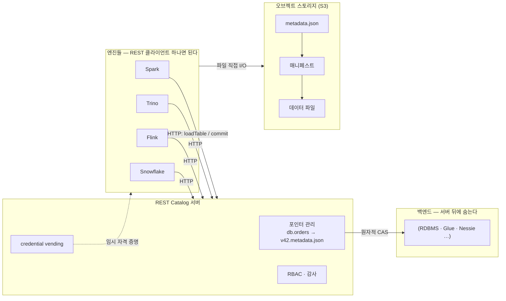
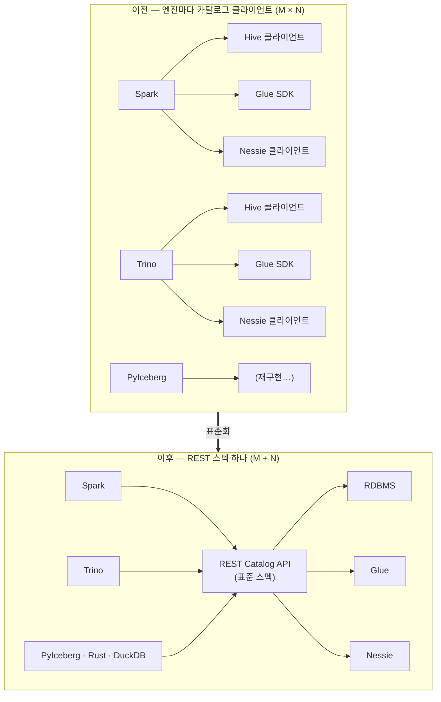
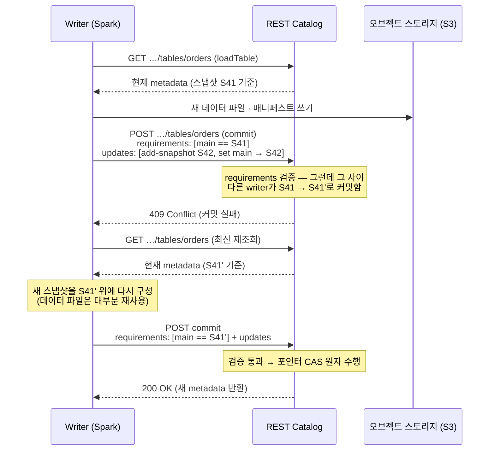
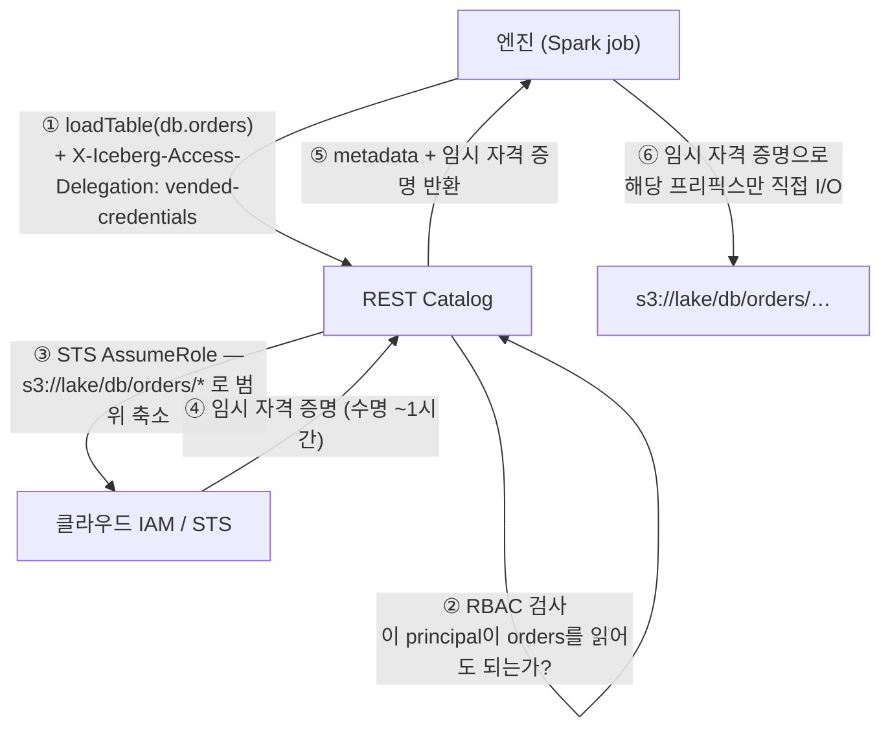

<figure class="post-figure post-figure--header">
<svg role="img" aria-label="REST Catalog와 거버넌스를 한 장으로 정리한 그림. 왼쪽에 Spark·Trino·Flink·Snowflake 네 엔진이 세로로 놓여 있고, 모두 가운데의 REST Catalog 하나로 HTTP 화살표를 보낸다. REST Catalog 상자 안에는 테이블 이름 db.orders를 v42.metadata.json으로 매핑하는 포인터 행과 RBAC·감사를 뜻하는 자물쇠 행이 있다. 카탈로그에서 각 엔진으로 되돌아가는 점선 화살표는 짧게 발급되는 임시 자격 증명(credential vending)을 뜻하고, 엔진들은 그 자격 증명으로 오른쪽 아래 오브젝트 스토리지(S3)의 데이터·메타데이터 파일을 직접 읽고 쓴다. 카탈로그에서 스토리지의 metadata.json으로 이어지는 화살표에는 원자적 CAS라고 적혀 있다." viewBox="0 0 680 330" xmlns="http://www.w3.org/2000/svg">
  <title>REST Catalog · 거버넌스 — 여러 엔진, 하나의 카탈로그, 포인터의 수호자</title>
  <defs>
    <marker id="lh-s6-arrow" viewBox="0 0 10 10" refX="8" refY="5" markerWidth="6" markerHeight="6" orient="auto-start-reverse">
      <path d="M0,0 L10,5 L0,10 z" fill="var(--secondary-color)"/>
    </marker>
    <marker id="lh-s6-cred" viewBox="0 0 10 10" refX="8" refY="5" markerWidth="6" markerHeight="6" orient="auto-start-reverse">
      <path d="M0,0 L10,5 L0,10 z" fill="var(--accent-color)"/>
    </marker>
    <marker id="lh-s6-cas" viewBox="0 0 10 10" refX="8" refY="5" markerWidth="6" markerHeight="6" orient="auto-start-reverse">
      <path d="M0,0 L10,5 L0,10 z" fill="var(--gold)"/>
    </marker>
  </defs>

  <!-- title -->
  <text x="340" y="24" text-anchor="middle" font-size="17" font-weight="800" fill="currentColor" letter-spacing="1.5">REST CATALOG · GOVERNANCE</text>
  <text x="340" y="44" text-anchor="middle" font-size="10.5" font-weight="700" fill="currentColor" opacity="0.72">엔진은 REST 클라이언트 하나 — 카탈로그가 포인터를 지키고, 자격 증명을 빌려준다</text>

  <!-- column labels -->
  <g font-size="10" font-weight="700" fill="currentColor" opacity="0.72" text-anchor="middle">
    <text x="88" y="70">엔진들</text>
    <text x="340" y="70">REST Catalog</text>
    <text x="576" y="70">오브젝트 스토리지</text>
  </g>

  <!-- engines (left) -->
  <g>
    <rect x="30" y="80" width="116" height="28" rx="4" fill="var(--bg-light)" stroke="currentColor" stroke-width="2"/>
    <rect x="30" y="122" width="116" height="28" rx="4" fill="var(--bg-light)" stroke="currentColor" stroke-width="2"/>
    <rect x="30" y="164" width="116" height="28" rx="4" fill="var(--bg-light)" stroke="currentColor" stroke-width="2"/>
    <rect x="30" y="206" width="116" height="28" rx="4" fill="var(--bg-light)" stroke="currentColor" stroke-width="2"/>
  </g>
  <g font-size="9.5" font-weight="700" fill="currentColor" text-anchor="middle">
    <text x="88" y="98">Spark</text>
    <text x="88" y="140">Trino</text>
    <text x="88" y="182">Flink</text>
    <text x="88" y="224">Snowflake</text>
  </g>

  <!-- engines -> catalog (HTTP) -->
  <g stroke="var(--secondary-color)" stroke-width="2" fill="none">
    <line x1="146" y1="94" x2="242" y2="130" marker-end="url(#lh-s6-arrow)"/>
    <line x1="146" y1="136" x2="242" y2="148" marker-end="url(#lh-s6-arrow)"/>
    <line x1="146" y1="178" x2="242" y2="166" marker-end="url(#lh-s6-arrow)"/>
    <line x1="146" y1="220" x2="242" y2="184" marker-end="url(#lh-s6-arrow)"/>
  </g>
  <text x="194" y="112" text-anchor="middle" font-size="8.5" font-weight="700" fill="var(--secondary-color)">HTTP · loadTable / commit</text>

  <!-- catalog -> engines (vended credentials, dashed) -->
  <g stroke="var(--accent-color)" stroke-width="1.8" fill="none" stroke-dasharray="4 3">
    <line x1="242" y1="200" x2="150" y2="240" marker-end="url(#lh-s6-cred)"/>
  </g>
  <text x="196" y="252" text-anchor="middle" font-size="8.5" font-weight="700" fill="var(--accent-color)">임시 자격 증명 (vending)</text>

  <!-- REST Catalog (center) -->
  <rect x="246" y="86" width="188" height="130" rx="6" fill="var(--bg-light)" stroke="var(--gold)" stroke-width="2.5"/>
  <text x="340" y="106" text-anchor="middle" font-size="11" font-weight="800" fill="currentColor">REST Catalog</text>
  <!-- pointer row -->
  <rect x="258" y="116" width="164" height="26" rx="3" fill="var(--bg-panel)" stroke="currentColor" stroke-width="1.4"/>
  <text x="340" y="133" text-anchor="middle" font-size="8.5" font-weight="700" fill="currentColor" font-family="monospace">db.orders → v42.metadata.json</text>
  <!-- namespace row -->
  <rect x="258" y="148" width="164" height="24" rx="3" fill="var(--bg-panel)" stroke="currentColor" stroke-width="1.4"/>
  <text x="340" y="164" text-anchor="middle" font-size="8.5" font-weight="700" fill="currentColor">네임스페이스 · 테이블 목록</text>
  <!-- RBAC row with lock icon -->
  <rect x="258" y="178" width="164" height="26" rx="3" fill="var(--bg-panel)" stroke="var(--accent-color)" stroke-width="1.6"/>
  <g stroke="var(--accent-color)" stroke-width="1.6" fill="none">
    <rect x="270" y="188" width="10" height="8" rx="1.5"/>
    <path d="M272,188 v-3 a3,3 0 0 1 6,0 v3"/>
  </g>
  <text x="348" y="195" text-anchor="middle" font-size="8.5" font-weight="700" fill="currentColor">RBAC · 감사 로그</text>

  <!-- catalog -> storage metadata (atomic CAS) -->
  <line x1="434" y1="130" x2="506" y2="130" stroke="var(--gold)" stroke-width="2.2" marker-end="url(#lh-s6-cas)"/>
  <text x="470" y="120" text-anchor="middle" font-size="8.5" font-weight="800" fill="var(--gold)">원자적 CAS</text>

  <!-- object storage (right) -->
  <rect x="510" y="86" width="140" height="150" rx="6" fill="var(--bg-panel)" stroke="currentColor" stroke-width="2"/>
  <text x="580" y="106" text-anchor="middle" font-size="10" font-weight="800" fill="currentColor">S3 · 오브젝트 스토리지</text>
  <rect x="524" y="116" width="112" height="24" rx="3" fill="var(--bg-light)" stroke="var(--gold)" stroke-width="1.8"/>
  <text x="580" y="132" text-anchor="middle" font-size="8" font-weight="700" fill="currentColor" font-family="monospace">v42.metadata.json</text>
  <rect x="524" y="148" width="112" height="22" rx="3" fill="var(--bg-light)" stroke="var(--secondary-color)" stroke-width="1.6"/>
  <text x="580" y="163" text-anchor="middle" font-size="8" font-weight="700" fill="currentColor">매니페스트</text>
  <rect x="524" y="176" width="112" height="22" rx="3" fill="var(--bg-light)" stroke="currentColor" stroke-width="1.6"/>
  <text x="580" y="191" text-anchor="middle" font-size="8" font-weight="700" fill="currentColor">데이터 파일 · Parquet</text>
  <rect x="524" y="204" width="112" height="22" rx="3" fill="var(--bg-light)" stroke="currentColor" stroke-width="1.6" opacity="0.7"/>
  <text x="580" y="219" text-anchor="middle" font-size="8" font-weight="700" fill="currentColor" opacity="0.8">…</text>

  <!-- engines -> storage direct I/O (bottom curve) -->
  <path d="M88,244 Q320,300 560,244" fill="none" stroke="var(--secondary-color)" stroke-width="2" stroke-dasharray="6 4" marker-end="url(#lh-s6-arrow)"/>
  <text x="340" y="292" text-anchor="middle" font-size="9" font-weight="700" fill="var(--secondary-color)">임시 자격 증명으로 데이터 파일 직접 읽기/쓰기 — 장기 키는 어디에도 없다</text>

  <!-- bottom caption -->
  <text x="340" y="318" text-anchor="middle" font-size="10" fill="currentColor" opacity="0.72">이름 해석·커밋 조율·접근 제어는 카탈로그에서, 무거운 데이터 I/O는 스토리지에서 직접</text>
</svg>
<figcaption>여러 엔진(Spark·Trino·Flink·Snowflake)이 REST Catalog 하나에 붙는 그림 — 카탈로그는 metadata.json 포인터를 원자적 CAS로 지키고, 짧은 임시 자격 증명을 빌려주며, 엔진은 그것으로 스토리지를 직접 읽고 쓴다</figcaption>
</figure>

## 들어가며

지금까지 이 시리즈는 줄곧 "파일 위의 메타데이터"를 이야기했습니다. 그런데 한 가지 질문을 계속 미뤄 왔습니다 — **`db.orders`라는 이름을 치면, 엔진은 어느 `metadata.json`이 이 테이블의 '현재'인지 어떻게 아는가?** 스냅샷도, 매니페스트도, 파티션 스펙도 모두 metadata 파일 안에 있지만, 그 파일들 중 **어느 것이 최신인지**를 가리키는 포인터는 파일 시스템 바깥 어딘가에 있어야 합니다. 그 어딘가가 바로 **카탈로그(catalog)**입니다.

카탈로그는 단순한 전화번호부가 아닙니다. [3단계](/2026/07/15/lakehouse-iceberg-acid-snapshots-time-travel.html)에서 Iceberg의 ACID는 "메타데이터 포인터의 원자적 교체(compare-and-swap)"에서 나온다고 했는데, **그 원자적 교체를 실제로 수행하는 곳이 카탈로그**입니다. 즉 Iceberg 트랜잭션의 마지막 한 뼘 — 커밋의 원자성 — 은 카탈로그 구현의 품질에 달려 있습니다. 그리고 여러 엔진(Spark·Trino·Flink·Snowflake)이 하나의 테이블을 공유하는 2026년의 레이크하우스에서, "누가 이 테이블을 읽고 쓸 수 있는가"라는 **거버넌스** 질문의 답도 자연스럽게 카탈로그에 놓이게 되었습니다.

이 글은 [Lakehouse Essential Curriculum](/2026/07/12/lakehouse-essential-curriculum.html)의 6단계입니다. 먼저 카탈로그가 정확히 무엇을 하는지(포인터 매핑·커밋 조율·네임스페이스)와 Hive Metastore부터 Nessie까지의 구현 스펙트럼, 그리고 그것이 낳은 파편화 문제를 정리합니다. 다음으로 그 파편화를 HTTP API 스펙 하나로 끝낸 **REST Catalog** — 커밋 프로토콜, 스펙이 여는 가능성, 2026년의 구현 지형, 실제 설정 — 를 다루고, 마지막으로 그 위에 세워지는 **거버넌스**(RBAC·credential vending·감사)로 멀티 엔진 공유의 그림을 완성합니다.

<div class="post-summary-box" markdown="1">

### 📌 이 글에서 다루는 내용

- **카탈로그의 역할**: 테이블 이름 → 현재 `metadata.json` 포인터 매핑, 커밋의 원자적 CAS를 실제로 수행하는 자리(3단계 연결), 네임스페이스 관리 — 그리고 Hive Metastore·Hadoop·JDBC·Glue·Nessie 구현 스펙트럼의 커밋 방식·제약과 "엔진 × 카탈로그" 클라이언트 파편화 문제
- **REST Catalog**: 카탈로그를 HTTP API 스펙으로 표준화 — 엔진은 REST 클라이언트 하나, 서버가 백엔드를 추상화. `requirements + updates` 조건부 커밋 프로토콜, 스펙이 여는 것들(서버 측 플래닝·멀티테이블 트랜잭션), Polaris·Unity Catalog·Glue·Lakekeeper·Nessie로 그리는 2026년 지형, Spark/Trino 설정 예
- **거버넌스**: 네임스페이스/테이블 수준 RBAC, 카탈로그가 스토리지 임시 자격 증명을 짧게 발급하는 credential vending(엔진에 장기 키를 주지 않는 모델), 감사 로그 — 여러 엔진이 한 테이블을 공유하는 그림의 완성과 카탈로그 중심 거버넌스의 조직적 의미

</div>

## 한눈에 보기 — 이름에서 파일까지, 카탈로그를 지나는 길

이 글의 스파인을 한 장으로 그리면 이렇습니다. 엔진이 테이블 이름으로 카탈로그에 묻고, 카탈로그가 현재 metadata 포인터(그리고 필요하면 임시 자격 증명)를 돌려주며, 엔진은 스토리지의 파일을 직접 읽고 씁니다. 커밋은 반대 방향 — 엔진이 새 metadata를 스토리지에 쓴 뒤 카탈로그에 "포인터를 바꿔 달라"고 요청하고, 카탈로그가 조건을 검사해 원자적으로 교체합니다.



핵심 구도는 두 가지입니다. 첫째, **제어 평면과 데이터 평면의 분리** — 이름 해석·커밋 조율·접근 제어라는 가벼운 제어는 카탈로그를 지나지만, 무거운 데이터 I/O는 엔진이 스토리지와 직접 합니다. 둘째, **표준화의 위치** — 엔진과 카탈로그 사이가 HTTP 스펙으로 고정되어 있어서, 그 뒤의 백엔드가 무엇이든 엔진은 알 필요가 없습니다. 이 두 구도가 이 글 전체의 좌표축입니다.

## 카탈로그의 역할 — 포인터의 수호자

### 테이블 이름 → 현재 metadata.json

2단계에서 본 대로 Iceberg 테이블의 "현재 상태"는 하나의 metadata 파일(`v42.metadata.json` 같은)이 완결적으로 정의합니다 — 스키마, 파티션 스펙, 스냅샷 목록, 현재 스냅샷 포인터까지 전부요. 그래서 카탈로그가 할 일은 놀랄 만큼 작습니다. **테이블 식별자(`namespace.table`)를 현재 metadata 파일의 위치(metadata location) 하나로 매핑하는 것**, 본질적으로는 그게 전부입니다.

```text
카탈로그가 쥐고 있는 것 (개념적으로는 한 줄짜리 매핑)

  db.orders    →  s3://lake/db/orders/metadata/v42.metadata.json
  db.customers →  s3://lake/db/customers/metadata/v17.metadata.json

엔진이 테이블을 여는 순서
  1. 카탈로그에 물어 현재 metadata location을 얻는다
  2. 그 metadata.json을 읽는다 → 스키마·스냅샷·매니페스트 리스트가 전부 나온다
  3. 이후의 플래닝·스캔은 스토리지의 파일만으로 진행된다
```

여기에 **네임스페이스 관리**가 얹힙니다. 카탈로그는 `db`, `analytics.finance` 같은 네임스페이스(스키마/데이터베이스에 해당)의 계층을 관리하고, 그 안의 테이블을 나열·생성·삭제·이름 변경하는 창구가 됩니다. 뒤에서 보겠지만 이 네임스페이스 트리가 거버넌스에서 권한 부여의 단위가 됩니다.

### 원자적 커밋은 카탈로그에서 일어난다 — 3단계와의 연결

포인터 하나짜리 매핑이 시시해 보인다면, [3단계](/2026/07/15/lakehouse-iceberg-acid-snapshots-time-travel.html)의 커밋 흐름을 다시 떠올려 보세요. writer는 새 데이터 파일과 매니페스트, 그리고 새 metadata 파일(`v43.metadata.json`)까지 전부 스토리지에 써 놓고도, 마지막 한 걸음 전까지는 아무것도 커밋한 것이 아닙니다. 커밋은 오직 **"현재 포인터가 아직 v42라면 v43으로 바꿔라"라는 compare-and-swap(CAS)이 성공하는 순간**에 일어납니다.

그 CAS를 수행하는 곳이 카탈로그입니다. 즉 카탈로그는 다음을 책임집니다.

- **원자성**: 포인터 교체는 전부 아니면 전무 — 읽는 쪽은 v42 아니면 v43을 보지, 중간 상태를 보지 않습니다.
- **충돌 감지**: 두 writer가 동시에 v42 기반으로 커밋을 시도하면 한쪽의 CAS만 성공하고, 다른 쪽은 실패를 통보받아 최신 상태 위에서 재시도합니다(optimistic concurrency).
- **단일 진실 지점**: 어떤 엔진에서 보든 "현재"는 카탈로그의 포인터 하나로 정의됩니다.

뒤집어 말하면, **카탈로그가 CAS를 제대로 못 하면 Iceberg의 ACID는 무너집니다**. 실제로 초기 카탈로그 구현들의 차이는 대부분 "CAS를 무엇으로 구현했는가"의 차이입니다.

### 구현 스펙트럼 — Hive Metastore에서 Nessie까지

REST Catalog 이전에도 카탈로그는 있었습니다. 각각이 CAS를 어떻게 구현했고 어떤 제약을 남겼는지 나란히 놓으면 이렇습니다.

| 카탈로그 | 포인터 저장 위치 | 커밋(CAS) 방식 | 제약 |
| --- | --- | --- | --- |
| **Hive Metastore** | 테이블 속성 `metadata_location` | Metastore **락**을 잡고 확인·교체 | Metastore 운영 부담(RDBMS+Thrift 서비스), 락 기반이라 경합에 취약, Hive 세계의 유산 |
| **Hadoop (파일 기반)** | 테이블 디렉토리의 `version-hint.text` + 버전 파일 | 파일 **원자적 rename** | 원자적 rename이 없는 오브젝트 스토리지(S3)에서 안전하지 않음 — 프로덕션 비권장 |
| **JDBC** | RDBMS 테이블의 한 행 | `UPDATE … WHERE metadata_location = <기대값>` **조건부 갱신** | DB 하나 더 운영, 접근 제어·거버넌스 기능 없음 |
| **AWS Glue** | Glue Data Catalog 테이블 파라미터 | 버전 ID 기반 **조건부 업데이트** | AWS 종속, IAM 모델과의 정합은 좋지만 멀티클라우드 불가 |
| **Nessie** | Nessie 커밋 그래프(Git 유사) | 커밋 그래프에 대한 CAS — **브랜치·태그** 지원 | 별도 서비스 운영, 자체 API(엔진별 클라이언트 필요) |

Hadoop 카탈로그의 제약은 특히 시사적입니다. "포인터를 파일로 들고 rename으로 CAS한다"는 발상은 HDFS에서는 성립하지만, rename이 원자적이지 않은 S3에서는 두 writer가 동시에 커밋에 성공했다고 믿는 사고가 가능합니다. **포인터의 수호자는 원자적 조건부 갱신을 제공하는 시스템이어야 한다**는 교훈이 여기서 나옵니다. Nessie는 반대편 끝에서 흥미로운 확장을 보여줍니다 — 포인터 저장소를 Git처럼 만들면 테이블 상태에 브랜치·태그를 걸 수 있고, "여러 테이블의 변경을 브랜치에서 실험하고 한 번에 머지"하는 카탈로그 수준 버전 관리가 열립니다.

### 파편화 문제 — 엔진 × 카탈로그 조합 폭발

기능적으로는 모두 "포인터 CAS"인데, 문제는 **인터페이스가 전부 달랐다**는 점입니다. Hive Metastore는 Thrift, Glue는 AWS SDK, JDBC는 DB 드라이버, Nessie는 자체 REST API. 그래서 엔진마다 각 카탈로그의 **클라이언트를 따로 구현**해야 했습니다.

```text
REST Catalog 이전의 세계 — 통합은 곱셈이었다

           Hive   Hadoop   JDBC   Glue   Nessie
  Spark     ✓       ✓       ✓      ✓       ✓      ← 엔진마다
  Trino     ✓       ✓       ✓      ✓       △      ← 카탈로그마다
  Flink     ✓       ✓       ✓      △       △      ← 클라이언트를
  PyIceberg △       ✗       △      ✓       △      ← 따로 구현·유지보수
```

이 곱셈에는 더 깊은 문제가 숨어 있습니다. 카탈로그 클라이언트 로직(커밋 재시도, 메타데이터 갱신 규칙)의 상당 부분이 **JVM 라이브러리(iceberg-core)에 갇혀** 있어서, Python(PyIceberg)·Rust·Go·DuckDB 같은 비JVM 세계는 같은 로직을 처음부터 다시 짜야 했습니다. 카탈로그가 새 기능(예: 새로운 커밋 검증)을 추가하면 모든 엔진의 클라이언트가 따라 움직여야 하는 것도 문제였습니다. 통합 비용이 `엔진 수 × 카탈로그 수`로 늘어나는 구조 — 이것이 REST Catalog가 풀려던 문제입니다.

## REST Catalog — 카탈로그를 HTTP 스펙으로 표준화하다

### 발상: 클라이언트 하나, 서버가 백엔드를 추상화

REST Catalog는 새로운 카탈로그 "제품"이 아니라 **Iceberg 프로젝트가 OpenAPI로 정의한 카탈로그 HTTP API 스펙**입니다. 네임스페이스 CRUD, 테이블 로드, 커밋, 설정 조회 같은 카탈로그의 모든 동작을 표준 엔드포인트로 고정합니다.

```text
REST Catalog 스펙의 주요 엔드포인트 (요지)

  GET  /v1/config                                        # 카탈로그 설정·기능 협상
  GET  /v1/{prefix}/namespaces                           # 네임스페이스 목록
  POST /v1/{prefix}/namespaces                           # 네임스페이스 생성
  GET  /v1/{prefix}/namespaces/{ns}/tables               # 테이블 목록
  GET  /v1/{prefix}/namespaces/{ns}/tables/{table}       # loadTable — 현재 metadata 반환
  POST /v1/{prefix}/namespaces/{ns}/tables/{table}       # commit — 조건부 커밋
  POST /v1/{prefix}/transactions/commit                  # 멀티테이블 트랜잭션 커밋
```

이 표준화가 앞의 곱셈을 덧셈으로 바꿉니다. **엔진 쪽은 REST 클라이언트 하나만 구현**하면 되고(HTTP+JSON이므로 JVM 밖의 Python·Rust·DuckDB도 동등한 시민이 됩니다), **카탈로그 쪽은 스펙을 구현한 서버 하나만 세우면** 모든 엔진이 붙습니다. 포인터를 실제로 어디에 저장하는가 — RDBMS든 Glue든 Nessie든 — 는 서버 뒤로 숨는 구현 세부 사항이 됩니다. 카탈로그의 인터페이스와 구현이 분리된 것입니다.

구조의 변화를 그림으로 대비하면 이렇습니다.



부수 효과도 중요합니다. 커밋 검증·재시도 규칙 같은 로직이 클라이언트 라이브러리에서 **서버로 이동**하므로, 카탈로그가 똑똑해져도 엔진들이 재배포될 필요가 없습니다. 제어 로직의 무게중심이 서버로 옮겨 가는 이 방향성이, 뒤에서 볼 서버 측 플래닝과 거버넌스의 토대가 됩니다.

### 커밋 프로토콜 — requirements + updates의 조건부 커밋

REST Catalog의 커밋은 3단계에서 본 optimistic concurrency를 HTTP 위에 정직하게 옮긴 것입니다. 클라이언트는 커밋 요청에 두 가지를 담습니다.

- **requirements** — "내가 기반으로 삼은 상태가 아직 유효한가"의 조건 목록. 예: `assert-ref-snapshot-id`(main 브랜치의 현재 스냅샷이 내가 읽은 그 스냅샷일 것), `assert-table-uuid`(테이블이 도중에 재생성되지 않았을 것).
- **updates** — 적용할 변경 목록. 예: `add-snapshot`(새 스냅샷 추가), `set-snapshot-ref`(main을 새 스냅샷으로 이동), `add-schema`/`set-current-schema`(스키마 진화).

서버는 requirements를 **검증하고, 통과하면 updates를 적용하며, 그 전체를 원자적으로** 수행합니다. requirements가 깨져 있으면 — 즉 그 사이 다른 writer가 커밋했으면 — `409 Conflict`를 돌려주고, 클라이언트는 최신 metadata를 다시 읽어 재시도합니다.



주목할 점은 재시도의 비용입니다. 스토리지에 이미 써 둔 데이터 파일은 그대로 재사용하고, **메타데이터 수준의 변경만 최신 상태 위에서 다시 구성**하면 되므로 재시도는 보통 저렴합니다. 또 requirements가 "포인터 전체가 같을 것"이 아니라 **변경이 실제로 의존하는 조건만** 명시하므로, 서로 겹치지 않는 변경(예: 서로 다른 파티션에 append)은 순차적으로 모두 성공할 수 있습니다 — 3단계에서 본 충돌 판정의 정신이 프로토콜 수준에 새겨져 있는 것입니다.

### 스펙이 여는 것들 — 서버 측 플래닝, 멀티테이블 트랜잭션

카탈로그가 "포인터 저장소"에서 "표준 API를 가진 서버"가 되자, 스펙에 능력을 더하는 길이 열렸습니다. 두 가지가 대표적입니다.

- **서버 측 스캔 플래닝(server-side planning)**: 원래는 각 엔진이 metadata·매니페스트를 직접 읽어 "어떤 파일을 스캔할지"를 계산합니다. 스펙의 플래닝 엔드포인트는 이 일을 서버에 위임할 수 있게 합니다 — 클라이언트가 필터를 보내면 서버가 스캔할 파일 목록을 돌려주는 방식입니다. 매니페스트 캐싱·인덱싱 같은 최적화를 서버에 한 번만 구현하면 모든 엔진이 누리고, 가벼운 클라이언트(예: 브라우저·경량 서비스)도 대형 테이블을 다룰 수 있게 됩니다.
- **멀티테이블 트랜잭션**: `POST /v1/{prefix}/transactions/commit`은 여러 테이블의 requirements+updates를 한 요청에 담아 **전부 아니면 전무**로 커밋합니다. 파일 기반 카탈로그에서는 원리적으로 불가능했던 것 — 포인터가 테이블마다 흩어져 있으니까요 — 이 포인터들을 한 서버가 관장하게 되면서 가능해졌습니다. 팩트 테이블과 집계 테이블을 항상 일관된 쌍으로 갱신하는 파이프라인이 대표적인 수혜자입니다.

여기에 페이지네이션, 기능 협상(`GET /v1/config`), 그리고 다음 절의 credential vending까지 — 스펙이 판을 깔아 두면 구현들이 채워 나가는 구조입니다.

### 2026년 구현 지형

REST Catalog 스펙이 사실상 표준이 되면서, 카탈로그 경쟁은 "누가 스펙을 잘 구현하고 그 위에 거버넌스를 얹는가"의 경쟁이 되었습니다. 2026년 현재의 주요 구현을 정리하면 이렇습니다.

| 구현 | 성격 | 특징 |
| --- | --- | --- |
| **Apache Polaris** | 오픈소스 (Snowflake가 공개, Apache 프로젝트) | REST 스펙 충실 구현 + RBAC·credential vending. Snowflake Open Catalog가 관리형 버전 |
| **Unity Catalog** | Databricks (오픈소스 판 + 관리형) | Databricks 생태계의 거버넌스 허브, Iceberg REST 엔드포인트 제공으로 외부 엔진 접근 |
| **AWS Glue (REST endpoint)** | 관리형 (AWS) | 기존 Glue Data Catalog를 Iceberg REST 스펙으로 노출, S3 Tables와 연동 |
| **Lakekeeper** | 오픈소스 (Rust) | 경량 셀프호스팅 REST 카탈로그, 멀티테넌시·OpenFGA 기반 권한 |
| **Nessie** | 오픈소스 | Git 유사 브랜치·태그 카탈로그, REST 스펙 인터페이스 제공 |

이 지형에서 읽어야 할 것은 개별 제품보다 **구도**입니다. 클라우드 벤더(AWS)·웨어하우스 벤더(Snowflake·Databricks)·오픈소스 진영이 모두 같은 스펙을 구현하고 있다는 것 — 즉 카탈로그를 갈아타도 엔진 쪽 코드는 URI와 자격 증명만 바뀐다는 것입니다. 테이블 포맷(Iceberg)에 이어 카탈로그 인터페이스까지 표준화되면서, "특정 벤더의 컴퓨트에 데이터가 인질로 잡히는" 구도가 한 겹 더 풀렸습니다.

### 설정 예 — Spark와 Trino에서 REST Catalog 붙이기

말로만 하면 추상적이니, 실제 설정을 봅니다. Spark에서 REST Catalog를 `lake`라는 이름으로 등록하는 설정입니다.

```properties
# spark-defaults.conf — REST Catalog를 'lake'라는 카탈로그 이름으로 등록
spark.sql.catalog.lake                              = org.apache.iceberg.spark.SparkCatalog
spark.sql.catalog.lake.type                         = rest
spark.sql.catalog.lake.uri                          = https://catalog.example.com/api/catalog
spark.sql.catalog.lake.warehouse                    = analytics          # 서버가 정의한 웨어하우스/프리픽스

# 인증 — OAuth2 클라이언트 자격 증명 (또는 token = <bearer token>)
spark.sql.catalog.lake.credential                   = <client_id>:<client_secret>

# 거버넌스의 핵심 스위치 — 스토리지 임시 자격 증명을 카탈로그가 발급 (다음 섹션)
spark.sql.catalog.lake.header.X-Iceberg-Access-Delegation = vended-credentials
```

```sql
-- 이제 어느 엔진에서 보든 같은 테이블이다
USE lake.db;
SELECT status, count(*) FROM orders GROUP BY status;

INSERT INTO orders VALUES (...);   -- 커밋은 REST 커밋 프로토콜을 탄다
```

같은 카탈로그를 Trino에서 붙이는 설정입니다. 문법만 다를 뿐 가리키는 것이 같다는 점에 주목하세요.

```properties
# etc/catalog/lake.properties — Trino 커넥터 설정
connector.name                                  = iceberg
iceberg.catalog.type                            = rest
iceberg.rest-catalog.uri                        = https://catalog.example.com/api/catalog
iceberg.rest-catalog.warehouse                  = analytics
iceberg.rest-catalog.security                   = OAUTH2
iceberg.rest-catalog.oauth2.credential          = <client_id>:<client_secret>
iceberg.rest-catalog.vended-credentials-enabled = true
```

두 설정 어디에도 S3 액세스 키가 없다는 점이 핵심입니다. Spark도 Trino도 카탈로그의 URI와 자기 신원(credential)만 알고, 스토리지에 대한 권한은 다음 섹션의 credential vending으로 카탈로그가 그때그때 빌려줍니다. Flink(`catalog-impl` 또는 `type=rest`), PyIceberg(`catalog.yaml`의 `uri`), Snowflake(catalog integration)도 같은 패턴입니다 — **엔진이 몇 개든, 카탈로그 접점은 스펙 하나**입니다.

## 거버넌스 — 여러 엔진이 한 테이블을 안전하게 공유하기

### 네임스페이스·테이블 수준 접근 제어 (RBAC)

카탈로그가 모든 엔진의 단일 관문이 되는 순간, 접근 제어를 놓을 자리도 자명해집니다. 스토리지(S3 버킷 정책)나 엔진(각 엔진의 권한 체계)이 아니라 **카탈로그에서, 테이블이라는 논리 단위로** 권한을 관리하는 것입니다.

REST Catalog 구현들(Polaris·Unity Catalog·Lakekeeper 등)은 대체로 역할 기반 접근 제어(RBAC)를 제공합니다. Polaris를 예로 들면 구조는 이렇습니다.

- **주체(principal)**: 엔진·서비스·사용자가 각자의 자격 증명으로 카탈로그에 인증합니다 — 위 설정의 `credential`이 이것입니다.
- **역할(role)**: 주체는 principal role에, 권한은 catalog role에 묶고 둘을 연결합니다. `analyst`는 읽기만, `etl-pipeline`은 특정 네임스페이스에 쓰기까지, 식으로요.
- **권한(privilege)의 단위**: 카탈로그 전체 → 네임스페이스 → 테이블로 내려가는 계층에 `TABLE_READ_DATA`, `TABLE_WRITE_DATA`, `TABLE_CREATE`, `NAMESPACE_LIST` 같은 권한을 부여합니다. 네임스페이스에 준 권한은 하위로 상속됩니다.

중요한 것은 이 권한 검사가 **모든 엔진에 대해 한 곳에서** 일어난다는 점입니다. Spark로 접근하든 Trino로 접근하든 같은 규칙이 적용되고, 엔진별 권한 체계를 따로 맞출 필요가 없습니다. 그런데 여기엔 구멍이 하나 남습니다 — 카탈로그가 "안 된다"고 해도, 엔진이 S3 키를 직접 들고 있으면 파일을 그냥 읽을 수 있지 않은가? 이 구멍을 막는 것이 credential vending입니다.

### credential vending — 엔진에 장기 키를 주지 않는다

전통적 구성에서는 각 엔진 클러스터에 스토리지 장기 자격 증명(S3 액세스 키, IAM 역할)을 배포합니다. 이 모델의 문제는 명확합니다 — 키가 테이블 단위가 아니라 **버킷 단위**라 권한이 너무 넓고, 엔진이 늘 때마다 키 배포·로테이션 지점이 늘며, 카탈로그의 RBAC와 스토리지의 실제 권한이 **따로 놀아** 앞서 본 구멍이 생깁니다.

credential vending은 이 방향을 뒤집습니다. **스토리지에 대한 장기 권한은 카탈로그(서버)만 갖고, 엔진에게는 요청한 테이블의 경로로 범위가 좁혀진(downscoped) 짧은 수명의 임시 자격 증명을 응답에 실어 발급**합니다. 위 설정의 `X-Iceberg-Access-Delegation: vended-credentials` 헤더가 바로 "loadTable 응답에 임시 자격 증명을 실어 달라"는 요청입니다.



이 모델이 바꾸는 것을 정리하면 이렇습니다.

- **논리 권한과 물리 권한의 일치**: "이 테이블을 읽을 수 있다"(RBAC)와 "이 파일들을 읽을 수 있다"(스토리지 자격 증명)가 같은 곳에서 같은 판단으로 나옵니다. 카탈로그를 우회한 접근이 원천적으로 막힙니다.
- **키 관리의 소멸**: 엔진 클러스터에 배포·로테이션할 장기 키가 없습니다. 유출돼도 특정 테이블 경로, 짧은 시간짜리 자격 증명일 뿐입니다.
- **최소 권한의 자동화**: 자격 증명의 범위가 요청된 테이블의 위치로 자동으로 좁혀지므로, 테이블마다 IAM 정책을 손으로 깎을 필요가 없습니다.

구현 세부는 클라우드마다 다르지만(S3는 STS 임시 토큰, 일부 구성은 요청 서명을 카탈로그가 대행하는 remote signing) 모델은 같습니다 — **스토리지 권한의 발급처를 카탈로그로 일원화**하는 것입니다.

### 감사 로그 — 누가, 무엇을, 언제

모든 접근이 카탈로그를 지나므로, 감사(audit)도 자연스럽게 카탈로그의 몫이 됩니다. 어떤 principal이 언제 어떤 테이블을 loadTable 했는지(읽기 의도), 어떤 커밋을 밀어 넣었는지(쓰기), 어떤 권한 변경이 있었는지가 한 곳에 남습니다. 여기에 Iceberg 자체의 성질이 결합하면 감사의 해상도가 올라갑니다 — 커밋마다 스냅샷이 남고 스냅샷에는 summary(operation, 추가/삭제 파일 수 등)가 붙으므로, "그 시각의 그 커밋이 정확히 무엇을 바꿨나"를 3단계에서 본 시간여행으로 재현해 볼 수 있습니다. 규제 산업에서 요구하는 "누가 무엇을 언제 보고 바꿨는가"에 대한 답이, 엔진별 로그를 긁어모으는 대신 카탈로그 한 곳에서 나오는 것입니다.

### 그림의 완성 — 그리고 조직적 의미

이제 시리즈 첫 단계부터 그려 온 그림이 완성됩니다. 스토리지에는 파일이 있고(1~2단계), 메타데이터 계층이 그것을 스냅샷으로 관리하며(2~3단계), 재작성 없이 진화하고(4단계), 유지보수로 건강을 지키고(5단계), 이제 **카탈로그가 그 전부를 이름·권한·감사와 함께 여러 엔진에게 안전하게 내어 줍니다**. Spark가 밤새 적재한 테이블을 아침에 Trino가 조회하고, Flink가 실시간으로 이어 쓰고, Snowflake가 BI에 서빙하는 — 복사본 없이, 한 테이블 위에서요.

이 구도의 조직적 의미는 기술을 넘어섭니다. 데이터의 소유가 "엔진(웨어하우스) 안"에서 "카탈로그가 관장하는 오픈 포맷 테이블"로 이동하면, 컴퓨트는 갈아 끼울 수 있는 소모품이 되고 **데이터와 그 거버넌스가 조직의 자산**이 됩니다. 팀 간 데이터 계약도 놓을 자리가 생깁니다 — 스키마(2단계의 메타데이터)와 접근 권한(RBAC)과 신선도(스냅샷 타임스탬프)가 모두 카탈로그에서 조회 가능하므로, "이 테이블은 이런 스키마로, 이 팀에게, 이 조건으로 제공된다"는 약속을 카탈로그를 계약 장부 삼아 관리할 수 있습니다. 웨어하우스 벤더들이 일제히 카탈로그 전쟁에 뛰어든 이유가 여기 있습니다 — **레이크하우스의 관제탑은 이제 카탈로그**이기 때문입니다.

## 정리

카탈로그와 거버넌스로 레이크하우스 운영의 마지막 조각을 맞췄습니다. 요점을 정리하면 다음과 같습니다.

- **카탈로그는 포인터의 수호자다**: 테이블 이름 → 현재 `metadata.json` 매핑이 카탈로그의 본질이고, 커밋의 원자적 CAS(3단계의 "포인터 교체")를 실제로 수행하는 곳이 바로 여기다. 카탈로그의 CAS가 무너지면 Iceberg의 ACID도 무너진다 — 원자적 rename이 없는 S3 위의 파일 기반(Hadoop) 카탈로그가 위험한 이유다.
- **REST Catalog는 인터페이스와 구현의 분리다**: Hive·Glue·JDBC·Nessie로 파편화됐던 카탈로그 접점을 HTTP API 스펙 하나로 표준화했다. 엔진은 REST 클라이언트 하나면 되고(비JVM 세계도 동등해진다), 백엔드는 서버 뒤로 숨으며, 커밋·검증 로직의 무게중심이 서버로 이동한다.
- **커밋은 requirements + updates의 조건부 요청이다**: "내 기반 상태가 유효한가"(requirements)를 검증하고 통과 시 변경(updates)을 원자적으로 적용, 실패하면 409와 재시도. optimistic concurrency가 프로토콜 수준에 새겨져 있고, 멀티테이블 트랜잭션·서버 측 플래닝 같은 확장이 스펙 위에서 열린다.
- **RBAC + credential vending이 논리·물리 권한을 일치시킨다**: 네임스페이스/테이블 단위 권한을 카탈로그 한 곳에서 검사하고, 스토리지 접근은 테이블 경로로 좁혀진 단명 임시 자격 증명으로만 허용한다. 엔진에 장기 키를 주지 않으므로 카탈로그를 우회한 접근이 원천 차단된다.
- **멀티 엔진 공유의 관제탑은 카탈로그다**: Spark·Trino·Flink·Snowflake가 복사본 없이 한 테이블을 공유하는 그림은 카탈로그에서 완성되고, 감사·데이터 계약·소유권 같은 조직 수준 거버넌스도 카탈로그를 중심으로 재편된다.

여기까지로 Iceberg라는 축은 완주했습니다 — 왜 필요한가(1단계)부터 구조(2)·트랜잭션(3)·진화(4)·운영(5)·거버넌스(6)까지. 남은 것은 시야를 넓히는 일입니다. **이제 Iceberg를 다른 포맷과 나란히 놓고 조망합니다** — Delta Lake의 트랜잭션 로그, Hudi의 업서트 중심 설계, Paimon의 스트리밍 LSM은 같은 문제를 어떻게 다르게 풀었고, 어떤 워크로드에 어떤 포맷이 맞는가. 시리즈의 마지막 단계입니다.

### 다음 학습 (Next Learning)

- [Iceberg vs Delta vs Hudi vs Paimon](/2026/07/15/lakehouse-table-format-comparison.html) — 7단계(마지막): 여섯 단계에서 익힌 축으로 오픈 테이블 포맷들을 나란히 비교하기
- [Iceberg ACID · 스냅샷 · 시간여행](/2026/07/15/lakehouse-iceberg-acid-snapshots-time-travel.html) — 3단계: 카탈로그가 수행하는 포인터 CAS, 그 커밋 원자성의 뿌리
- [Lakehouse Essential Curriculum](/2026/07/12/lakehouse-essential-curriculum.html) — 시리즈 로드맵으로 돌아가 진행 상황 확인하기
