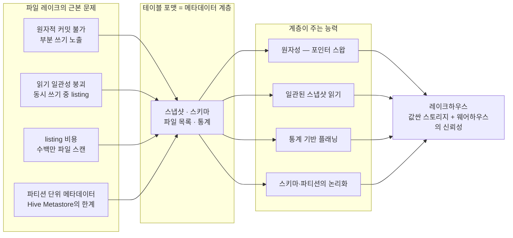
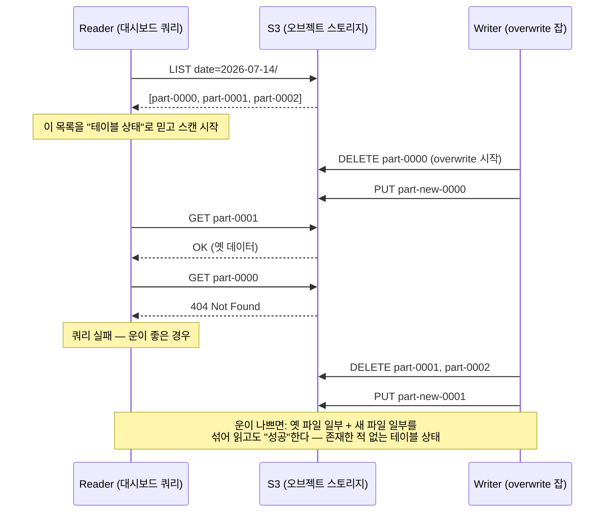
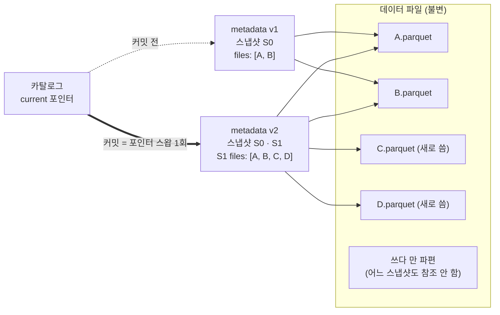

<figure class="post-figure post-figure--header">
<svg role="img" aria-label="파일 더미와 테이블 계층을 대비한 그림. 왼쪽 패널 '그냥 파일 더미'에는 오브젝트 스토리지의 디렉터리 목록과 Parquet 파일들이 나열되어 있는데, 실패한 잡이 남긴 부분 쓰기 파일이 점선으로 표시되어 있고 그 옆에 물음표가 붙어 '지금 이 목록이 테이블의 전부인가?'를 아무도 답할 수 없음을 나타낸다. 가운데 화살표는 '메타데이터 계층을 얹는다'는 전환을 뜻한다. 오른쪽 패널 '테이블'에는 같은 파일들이 아래에 그대로 놓여 있지만, 그 위에 스냅샷·스키마·파일 목록·통계를 담은 메타데이터 계층이 얹혀 있고 카탈로그 포인터가 현재 스냅샷을 가리킨다. 메타데이터가 유효한 파일만 골라 가리키므로 부분 쓰기 파편은 테이블 밖에 남는다." viewBox="0 0 680 300" xmlns="http://www.w3.org/2000/svg">
  <title>파일 더미 vs 테이블 계층 — 같은 파일 위에 메타데이터를 얹으면 테이블이 된다</title>
  <defs>
    <marker id="lh-s1h-arrow" viewBox="0 0 10 10" refX="8" refY="5" markerWidth="6" markerHeight="6" orient="auto-start-reverse">
      <path d="M0,0 L10,5 L0,10 z" fill="var(--secondary-color)"/>
    </marker>
    <marker id="lh-s1h-gold" viewBox="0 0 10 10" refX="8" refY="5" markerWidth="6" markerHeight="6" orient="auto-start-reverse">
      <path d="M0,0 L10,5 L0,10 z" fill="var(--gold)"/>
    </marker>
  </defs>

  <!-- title -->
  <text x="340" y="24" text-anchor="middle" font-size="17" font-weight="800" fill="currentColor" letter-spacing="1.5">FILES ≠ TABLE</text>
  <text x="340" y="44" text-anchor="middle" font-size="10.5" font-weight="700" fill="currentColor" opacity="0.72">같은 파일 위에 메타데이터 계층을 얹으면 비로소 테이블이 된다</text>

  <!-- ===== LEFT: pile of files ===== -->
  <rect x="24" y="58" width="284" height="216" rx="6" fill="var(--bg-light)" stroke="currentColor" stroke-width="2"/>
  <text x="166" y="80" text-anchor="middle" font-size="12" font-weight="800" fill="currentColor">그냥 파일 더미</text>
  <text x="166" y="96" text-anchor="middle" font-size="8.5" fill="currentColor" opacity="0.72">파일 목록(listing)이 곧 테이블 상태</text>

  <!-- directory line -->
  <text x="44" y="116" text-anchor="start" font-size="8.5" font-weight="700" fill="currentColor" opacity="0.8" font-family="monospace">s3://lake/events/date=2026-07-14/</text>

  <!-- file rows -->
  <g>
    <rect x="52" y="126" width="150" height="18" rx="3" fill="var(--bg-panel)" stroke="currentColor" stroke-width="1.5"/>
    <rect x="52" y="150" width="150" height="18" rx="3" fill="var(--bg-panel)" stroke="currentColor" stroke-width="1.5"/>
    <rect x="52" y="174" width="150" height="18" rx="3" fill="var(--bg-panel)" stroke="currentColor" stroke-width="1.5"/>
    <!-- partial write fragment: dashed -->
    <rect x="52" y="198" width="150" height="18" rx="3" fill="none" stroke="var(--accent-color)" stroke-width="1.8" stroke-dasharray="5 4"/>
  </g>
  <g font-size="8" font-weight="700" fill="currentColor" font-family="monospace">
    <text x="60" y="138">part-0000.parquet</text>
    <text x="60" y="162">part-0001.parquet</text>
    <text x="60" y="186">part-0002.parquet</text>
    <text x="60" y="210" fill="var(--accent-color)">part-0003.parquet…?</text>
  </g>
  <text x="127" y="232" text-anchor="middle" font-size="8" fill="var(--accent-color)" font-weight="700">실패한 잡이 남긴 부분 쓰기</text>

  <!-- question marks -->
  <text x="248" y="160" text-anchor="middle" font-size="30" font-weight="800" fill="var(--accent-color)" opacity="0.9">?</text>
  <g font-size="8.5" fill="currentColor" opacity="0.78" text-anchor="middle">
    <text x="248" y="182">이 목록이</text>
    <text x="248" y="194">테이블의 전부인가?</text>
    <text x="248" y="206">아무도 모른다</text>
  </g>

  <text x="166" y="260" text-anchor="middle" font-size="8.5" fill="currentColor" opacity="0.7">원자성 없음 · 일관성 없음 · 매번 listing</text>

  <!-- ===== middle transition arrow ===== -->
  <line x1="314" y1="164" x2="360" y2="164" stroke="var(--gold)" stroke-width="2.5" marker-end="url(#lh-s1h-gold)"/>
  <text x="338" y="152" text-anchor="middle" font-size="8.5" font-weight="700" fill="var(--gold)">메타데이터</text>
  <text x="338" y="182" text-anchor="middle" font-size="8.5" font-weight="700" fill="var(--gold)">계층을 얹는다</text>

  <!-- ===== RIGHT: table layer ===== -->
  <rect x="368" y="58" width="288" height="216" rx="6" fill="var(--bg-light)" stroke="var(--gold)" stroke-width="2.5"/>
  <text x="512" y="80" text-anchor="middle" font-size="12" font-weight="800" fill="currentColor">테이블</text>
  <text x="512" y="96" text-anchor="middle" font-size="8.5" fill="currentColor" opacity="0.72">메타데이터가 곧 테이블 상태</text>

  <!-- catalog pointer -->
  <rect x="388" y="106" width="108" height="22" rx="3" fill="var(--bg-panel)" stroke="var(--gold)" stroke-width="2"/>
  <text x="442" y="121" text-anchor="middle" font-size="8.5" font-weight="700" fill="currentColor">카탈로그 포인터</text>
  <line x1="496" y1="117" x2="528" y2="117" stroke="var(--gold)" stroke-width="2" marker-end="url(#lh-s1h-gold)"/>

  <!-- metadata layer -->
  <rect x="532" y="102" width="108" height="76" rx="4" fill="var(--bg-panel)" stroke="var(--accent-color)" stroke-width="2.5"/>
  <text x="586" y="117" text-anchor="middle" font-size="8.5" font-weight="800" fill="var(--accent-color)">메타데이터 계층</text>
  <g font-size="8" font-weight="700" fill="currentColor" text-anchor="middle">
    <rect x="540" y="124" width="92" height="14" rx="2" fill="var(--bg-light)" stroke="currentColor" stroke-width="1.2"/>
    <text x="586" y="134">스냅샷</text>
    <rect x="540" y="141" width="92" height="14" rx="2" fill="var(--bg-light)" stroke="currentColor" stroke-width="1.2"/>
    <text x="586" y="151">스키마</text>
    <rect x="540" y="158" width="92" height="14" rx="2" fill="var(--bg-light)" stroke="currentColor" stroke-width="1.2"/>
    <text x="586" y="168">파일 목록 · 통계</text>
  </g>

  <!-- files under metadata -->
  <g>
    <rect x="396" y="200" width="72" height="18" rx="3" fill="var(--bg-panel)" stroke="currentColor" stroke-width="1.5"/>
    <rect x="476" y="200" width="72" height="18" rx="3" fill="var(--bg-panel)" stroke="currentColor" stroke-width="1.5"/>
    <rect x="556" y="200" width="72" height="18" rx="3" fill="var(--bg-panel)" stroke="currentColor" stroke-width="1.5"/>
    <!-- orphan fragment outside the table -->
    <rect x="396" y="234" width="72" height="18" rx="3" fill="none" stroke="currentColor" stroke-width="1.4" stroke-dasharray="5 4" opacity="0.5"/>
  </g>
  <g font-size="7.5" font-weight="700" fill="currentColor" text-anchor="middle" font-family="monospace">
    <text x="432" y="212">part-0000</text>
    <text x="512" y="212">part-0001</text>
    <text x="592" y="212">part-0002</text>
    <text x="432" y="246" opacity="0.55">part-0003…</text>
  </g>
  <text x="548" y="246" text-anchor="middle" font-size="8" fill="currentColor" opacity="0.65">참조되지 않은 파편은 테이블 밖</text>

  <!-- metadata -> files edges -->
  <g stroke="var(--secondary-color)" stroke-width="1.8" fill="none">
    <line x1="552" y1="182" x2="440" y2="196" marker-end="url(#lh-s1h-arrow)"/>
    <line x1="576" y1="182" x2="516" y2="196" marker-end="url(#lh-s1h-arrow)"/>
    <line x1="596" y1="182" x2="592" y2="196" marker-end="url(#lh-s1h-arrow)"/>
  </g>

  <text x="512" y="266" text-anchor="middle" font-size="8.5" fill="currentColor" opacity="0.7">원자적 커밋 · 스냅샷 읽기 · 통계 기반 플래닝</text>
</svg>
<figcaption>같은 Parquet 파일들 — 왼쪽은 listing이 곧 상태라 부분 쓰기와 물음표가 남고, 오른쪽은 메타데이터 계층이 유효한 파일만 가리켜 비로소 "테이블"이 된다</figcaption>
</figure>

## 들어가며

오브젝트 스토리지는 데이터 엔지니어링의 승리한 저장소입니다. 사실상 무한한 용량, GB당 몇 센트의 비용, 99.999999999%(9가 11개)의 내구성 — S3에 Parquet 파일을 쌓는 것보다 싸고 튼튼하게 데이터를 보관하는 방법은 없습니다. 그런데 그렇게 쌓인 파일 더미를 향해 `SELECT`를 던지는 순간, 불편한 질문이 하나 따라옵니다. **"지금 이 디렉터리에 있는 파일들이, 정확히, 테이블의 전부인가?"**

파일 기반 레이크에서 이 질문에 답할 수 있는 사람은 없습니다. 어젯밤 실패한 잡이 남긴 부분 파일이 섞여 있을 수 있고, 지금 이 순간 다른 잡이 같은 파티션을 덮어쓰는 중일 수 있으며, 목록을 얻는 것 자체가 수백만 번의 API 호출일 수 있습니다. **파일을 쌓는 것과 테이블을 갖는 것은 다른 일**이고, 그 간극이 이 시리즈 전체의 출발점입니다.

이 글은 [Lakehouse Essential Curriculum](/2026/07/12/lakehouse-essential-curriculum.html)의 1단계이자 시리즈 첫 막 "왜·무엇으로(1~2단계)"의 출발점입니다. 오버뷰 시리즈의 [데이터 저장(Storage)](/2026/06/25/data-storage.html)에서 웨어하우스·레이크·레이크하우스의 구도와 오픈 테이블 포맷의 개념을 소개 선에서 다뤘다면, 이번에는 그 지도의 한 칸으로 들어가 **왜 파일 위에 테이블 계층이 필요한가**를 실패 시나리오 단위로 손에 잡히게 파고듭니다. 동기가 서야 2단계부터 보게 될 Iceberg의 메타데이터 구조가 "설계 취향"이 아니라 "문제에 대한 답"으로 읽힙니다.

<div class="post-summary-box" markdown="1">

### 📌 이 글에서 다루는 내용

- **파일 레이크의 한계**: 디렉터리 = 파티션, 파일 목록 = 테이블 상태라는 Hive 테이블 모델의 근본 문제 — 원자적 커밋 불가(부분 쓰기 노출), 동시 쓰기 중 listing이 깨뜨리는 읽기 일관성, S3에 원자적 rename이 없어 무너지는 rename 기반 커밋, 수백만 파일 listing 비용, Hive Metastore의 파티션 단위 메타데이터 한계 — 를 구체 실패 시나리오 3개로 확인
- **테이블 포맷이 여는 것**: 파일 집합 위에 스냅샷·스키마·파일 목록·통계라는 **메타데이터 계층**을 얹어 "테이블"로 만든다는 발상 — 포인터 스왑 한 번으로 얻는 원자성, 일관된 스냅샷 읽기, 파일 수준 통계 기반 플래닝, 스키마·파티션의 논리화, 그리고 ACID·시간여행·진화가 이 계층의 파생 능력이라는 예고
- **레이크하우스와의 관계**: 웨어하우스(관리형·비싼 폐쇄 스토리지) vs 레이크(값싼 개방 스토리지·신뢰성 부재) 구도에서 테이블 포맷이 차지하는 자리, Netflix·Databricks·Uber가 각자의 문제에서 Iceberg·Delta·Hudi를 만들어 낸 배경, 2026년 Iceberg가 사실상 표준이 된 흐름과 REST Catalog 예고

</div>

## 한눈에 보기 — 문제에서 레이크하우스까지

이 글의 스파인을 한 장으로 그리면 이렇습니다. 파일 레이크의 네 가지 근본 문제가 있고, 그 모두를 겨냥한 하나의 처방 — 파일 집합 위의 **메타데이터 계층** — 이 있으며, 그 계층이 주는 능력들이 값싼 레이크에 웨어하우스의 신뢰성을 얹어 **레이크하우스**를 성립시킵니다.



왼쪽의 문제를 정확히 이해할수록, 가운데 계층의 설계(2단계)와 오른쪽 능력들(3~4단계)이 필연으로 읽힙니다. 이 인과 사슬이 이 글 전체의 좌표축입니다.

## 파일 더미는 테이블이 아니다 — Hive 테이블 모델의 유산

### 디렉터리 = 파티션, 파일 목록 = 테이블 상태

빅데이터 초기의 Hive가 남긴 테이블 모델은 단순하고, 그래서 오래 살아남았습니다. 테이블은 스토리지의 한 경로(`LOCATION`)이고, 파티션은 그 아래의 하위 디렉터리이며, **어느 순간의 테이블 내용은 "그 디렉터리들에 지금 들어 있는 파일 전부"**입니다.

```text
s3://lake/events/                        ← 테이블 = 이 경로
├── date=2026-07-13/                     ← 파티션 = 하위 디렉터리 (경로에 값이 박힌다)
│   ├── part-0000.parquet
│   ├── part-0001.parquet
│   └── part-0002.parquet
├── date=2026-07-14/
│   ├── part-0000.parquet
│   └── part-0001.parquet
└── date=2026-07-15/
    └── part-0000.parquet

테이블 상태 = "디렉터리를 listing해서 지금 보이는 파일 전부"
             (어떤 파일이 유효한지에 대한 별도의 기록은 어디에도 없다)
```

이 모델에서 쿼리 엔진의 읽기는 두 단계입니다. ① Hive Metastore(HMS)에 물어 파티션 디렉터리 목록을 얻고, ② 각 디렉터리를 **listing**해 파일 목록을 얻은 뒤 그것을 스캔합니다. 쓰기는 반대로, 디렉터리에 파일을 추가하거나 디렉터리째 갈아 끼우는 일입니다.

문제의 뿌리가 바로 여기 있습니다. **테이블의 상태가 어떤 명시적 기록이 아니라, 스토리지 listing이라는 관측 행위의 결과**라는 점입니다. 상태를 기록하는 원장(ledger)이 없으므로 "커밋"이라는 개념 자체가 성립하지 않고, 파일이 하나 늘거나 줄 때마다 테이블의 의미가 소리 없이 바뀝니다.

### Hive Metastore가 아는 것과 모르는 것

HMS가 있으니 메타데이터 계층이 이미 있는 것 아니냐고 물을 수 있습니다. 그러나 HMS의 해상도는 **파티션 단위에서 멈춥니다**. HMS가 아는 것은 "테이블 `events`에 파티션 `date=2026-07-14`가 있고 그 위치는 이 경로다"까지입니다. 그 디렉터리 안에 **어떤 파일이 몇 개** 있는지, 각 파일에 어떤 값 범위의 데이터가 들었는지는 모릅니다. 파일 수준의 진실은 여전히 listing만이 알고 있습니다.

이 해상도 부족이 두 가지 비용을 만듭니다.

- **플래닝의 한계**: 파티션 프루닝(디렉터리 단위로 건너뛰기)까지는 HMS로 가능하지만, 파티션 안에서 "이 파일은 min/max 통계상 이 쿼리와 무관하다"는 **파일 단위 프루닝은 불가능**합니다. 파티션에 걸리면 그 안의 파일은 전부 스캔 대상입니다.
- **확장성의 한계**: HMS는 전통적으로 RDBMS(MySQL/PostgreSQL) 위에 세워진 서비스라, 파티션이 수십만~수백만 개로 늘어나면 `get_partitions` 호출 자체가 병목이 됩니다. 파티션을 잘게 쪼갤수록 프루닝은 좋아지지만 HMS가 무너지는, 풀리지 않는 긴장이 생깁니다.

### rename 커밋 — HDFS의 가정이 S3에서 무너진다

그렇다면 Hive 모델은 쓰기의 원자성을 어떻게 흉내 냈을까요. 답은 **rename**입니다. 잡이 임시 디렉터리에 결과를 모두 쓴 뒤, 마지막에 최종 경로로 rename하는 것입니다.

```text
# 고전적 커밋 프로토콜 (Hadoop FileOutputCommitter 계열)
1. 잡이 s3://lake/events/_temporary/attempt_.../ 아래에 결과 파일을 쓴다
2. 모든 태스크가 성공하면, _temporary/ 아래 파일들을 최종 경로로 rename한다
3. rename이 "한순간에" 일어나므로 읽는 쪽은 전부 보거나 전혀 보지 않는다…

   …는 가정은 HDFS에서만 참이다.
   - HDFS: rename = NameNode 메타데이터 연산 1회. 원자적이고 O(1).
   - S3:   rename이라는 연산 자체가 없다. copy + delete로 흉내 낸다.
           파일 1000개의 "rename" = 1000번의 COPY + 1000번의 DELETE.
           그 수천 번의 호출 도중 어느 시점이든 실패할 수 있고,
           읽는 쪽은 절반만 이사한 중간 상태를 그대로 본다.
```

<figure class="post-figure">
<svg role="img" aria-label="HDFS와 S3의 rename 대비 개념도. 왼쪽 HDFS 패널에서는 NameNode가 디렉터리 트리의 메타데이터를 들고 있어서, rename이 _temporary 노드를 최종 경로로 옮기는 메타데이터 연산 한 번으로 끝난다 — 원자적이고 파일 수와 무관하게 O(1)이다. 오른쪽 S3 패널에서는 이름 공간이 평평한 키 목록이라 디렉터리가 접두사의 착시일 뿐이고, rename이 파일마다 COPY와 DELETE를 반복하는 수천 번의 호출이 된다. 중간에 번개 표시가 있어 그 도중 실패하면 절반은 새 경로에, 절반은 옛 경로에 남는 중간 상태가 읽는 쪽에 그대로 노출됨을 나타낸다." viewBox="0 0 680 300" xmlns="http://www.w3.org/2000/svg">
  <title>rename의 두 얼굴 — HDFS의 메타데이터 연산 1회 vs S3의 copy + delete 수천 번</title>
  <defs>
    <marker id="lh-s1r-arrow" viewBox="0 0 10 10" refX="8" refY="5" markerWidth="6" markerHeight="6" orient="auto-start-reverse">
      <path d="M0,0 L10,5 L0,10 z" fill="var(--secondary-color)"/>
    </marker>
    <marker id="lh-s1r-acc" viewBox="0 0 10 10" refX="8" refY="5" markerWidth="6" markerHeight="6" orient="auto-start-reverse">
      <path d="M0,0 L10,5 L0,10 z" fill="var(--accent-color)"/>
    </marker>
  </defs>

  <text x="340" y="22" text-anchor="middle" font-size="11" font-weight="700" fill="currentColor" opacity="0.72">같은 rename, 다른 세계 — 커밋의 원자성이 갈라지는 지점</text>

  <!-- ===== LEFT: HDFS ===== -->
  <rect x="24" y="38" width="300" height="240" rx="6" fill="var(--bg-light)" stroke="var(--secondary-color)" stroke-width="2.5"/>
  <text x="174" y="60" text-anchor="middle" font-size="12" font-weight="800" fill="var(--secondary-color)">HDFS — 계층형 이름 공간</text>

  <!-- NameNode -->
  <rect x="104" y="72" width="140" height="24" rx="4" fill="var(--bg-panel)" stroke="currentColor" stroke-width="2"/>
  <text x="174" y="88" text-anchor="middle" font-size="9.5" font-weight="700" fill="currentColor">NameNode (메타데이터)</text>

  <!-- directory tree -->
  <g stroke="currentColor" stroke-width="1.4" opacity="0.5" fill="none">
    <line x1="174" y1="96" x2="174" y2="112"/>
    <line x1="98" y1="130" x2="250" y2="130"/>
    <line x1="98" y1="130" x2="98" y2="140"/>
    <line x1="250" y1="130" x2="250" y2="140"/>
    <line x1="174" y1="112" x2="174" y2="130"/>
  </g>
  <rect x="46" y="140" width="104" height="22" rx="3" fill="none" stroke="currentColor" stroke-width="1.6" stroke-dasharray="5 4"/>
  <text x="98" y="155" text-anchor="middle" font-size="8.5" font-weight="700" fill="currentColor" opacity="0.8" font-family="monospace">_temporary/</text>
  <rect x="198" y="140" width="104" height="22" rx="3" fill="var(--bg-panel)" stroke="var(--gold)" stroke-width="2"/>
  <text x="250" y="155" text-anchor="middle" font-size="8.5" font-weight="700" fill="currentColor" font-family="monospace">events/</text>

  <!-- atomic rename arrow -->
  <path d="M150,172 Q174,192 226,166" fill="none" stroke="var(--secondary-color)" stroke-width="2.5" marker-end="url(#lh-s1r-arrow)"/>
  <text x="174" y="204" text-anchor="middle" font-size="9" font-weight="700" fill="var(--secondary-color)">rename = 메타데이터 연산 1회</text>

  <g font-size="8.5" fill="currentColor" opacity="0.78" text-anchor="middle">
    <text x="174" y="228">파일이 1개든 1만 개든 O(1)</text>
    <text x="174" y="242">전부 옮겨졌거나, 전혀 안 옮겨졌거나</text>
  </g>
  <text x="174" y="264" text-anchor="middle" font-size="9.5" font-weight="800" fill="var(--secondary-color)">원자적 ✓</text>

  <!-- ===== RIGHT: S3 ===== -->
  <rect x="356" y="38" width="300" height="240" rx="6" fill="var(--bg-light)" stroke="var(--accent-color)" stroke-width="2.5"/>
  <text x="506" y="60" text-anchor="middle" font-size="12" font-weight="800" fill="var(--accent-color)">S3 — 평평한 키 목록</text>
  <text x="506" y="76" text-anchor="middle" font-size="8.5" fill="currentColor" opacity="0.72">"디렉터리"는 접두사의 착시 — rename이라는 연산이 없다</text>

  <!-- key rows with per-file copy+delete -->
  <g font-family="monospace" font-size="8" font-weight="700">
    <rect x="376" y="88" width="118" height="18" rx="3" fill="var(--bg-panel)" stroke="currentColor" stroke-width="1.4"/>
    <text x="384" y="100" fill="currentColor">…/_temp/part-0000</text>
    <rect x="376" y="112" width="118" height="18" rx="3" fill="var(--bg-panel)" stroke="currentColor" stroke-width="1.4"/>
    <text x="384" y="124" fill="currentColor">…/_temp/part-0001</text>
    <rect x="376" y="136" width="118" height="18" rx="3" fill="var(--bg-panel)" stroke="currentColor" stroke-width="1.4"/>
    <text x="384" y="148" fill="currentColor">…/_temp/part-0002</text>
    <text x="435" y="166" text-anchor="middle" fill="currentColor" opacity="0.6">⋮ ×1000</text>

    <rect x="538" y="88" width="100" height="18" rx="3" fill="var(--bg-panel)" stroke="var(--gold)" stroke-width="1.6"/>
    <text x="546" y="100" fill="currentColor">events/part-0000</text>
    <rect x="538" y="112" width="100" height="18" rx="3" fill="var(--bg-panel)" stroke="var(--gold)" stroke-width="1.6"/>
    <text x="546" y="124" fill="currentColor">events/part-0001</text>
    <rect x="538" y="136" width="100" height="18" rx="3" fill="none" stroke="currentColor" stroke-width="1.4" stroke-dasharray="5 4" opacity="0.6"/>
    <text x="546" y="148" fill="currentColor" opacity="0.6">아직 안 옴…</text>
  </g>

  <!-- per-file copy arrows -->
  <g stroke="var(--accent-color)" stroke-width="1.8" fill="none">
    <line x1="496" y1="97" x2="534" y2="97" marker-end="url(#lh-s1r-acc)"/>
    <line x1="496" y1="121" x2="534" y2="121" marker-end="url(#lh-s1r-acc)"/>
  </g>
  <!-- failure bolt on the third -->
  <polygon points="512,138 505,152 511,152 503,166 517,150 511,150 518,138" fill="var(--accent-color)"/>

  <g font-size="8.5" fill="currentColor" opacity="0.78" text-anchor="middle">
    <text x="506" y="200">rename = 파일마다 COPY + DELETE</text>
    <text x="506" y="214">1000개 파일 = 수천 번의 호출, 어디서든 실패 가능</text>
    <text x="506" y="228">실패 시점의 "절반만 이사한 상태"가 그대로 노출</text>
  </g>
  <text x="506" y="252" text-anchor="middle" font-size="9.5" font-weight="800" fill="var(--accent-color)">원자적 ✗</text>
</svg>
<figcaption>같은 rename 커밋 — HDFS에서는 NameNode의 메타데이터 연산 1회(원자적, O(1))이지만, S3에서는 파일마다 COPY + DELETE를 반복하다 어디서든 실패할 수 있는 수천 번의 호출이다</figcaption>
</figure>

이것이 이 절의 핵심 문장입니다. **Hive 테이블 모델의 원자성은 "디렉터리 rename은 원자적"이라는 HDFS의 성질에 기대고 있었는데, 오브젝트 스토리지에는 그 성질이 없습니다.** S3의 키(key)는 계층 구조가 아니라 평평한 이름 공간이고, "디렉터리"는 접두사(prefix)를 공유하는 키들의 착시일 뿐입니다. 착시에는 rename이 없습니다. 스토리지가 HDFS에서 S3로 옮겨 가는 순간, Hive 모델은 자신이 딛고 서 있던 마지막 원자성마저 잃었습니다.

여기에 역사의 상처가 하나 더 있습니다. 2020년 12월 이전의 S3는 **eventual consistency** — 방금 쓴 객체가 listing에 아직 안 보이거나, 방금 지운 객체가 여전히 보이는 — 를 가진 스토리지였습니다. "잡은 성공했는데 방금 쓴 파일이 하류 잡의 listing에 잡히지 않아 조용히 누락되는" 장애가 실제로 일상이었고, Netflix의 s3mper, Hadoop의 S3Guard, EMRFS consistent view처럼 **DynamoDB에 '진짜 파일 목록'을 따로 기록하는 보조 시스템**들이 그 상처 위에서 만들어졌습니다. 지금 S3는 강한 일관성을 제공하지만, 이 시대의 경험은 커뮤니티에 한 가지 교훈을 남겼습니다 — **파일 목록의 진실은 listing이 아니라 별도의 메타데이터가 소유해야 한다.** 뒤에서 보겠지만, 테이블 포맷은 정확히 이 교훈의 일반화입니다.

## 무엇이 깨지는가 — 세 가지 실패 시나리오

추상적인 성질 이야기를 구체적인 사고로 바꿔 보겠습니다. 셋 모두 파일 기반 레이크를 운영해 본 팀이라면 겪었거나, 겪을 예정인 시나리오입니다.

### 시나리오 1 — 잡 도중 실패: 부분 쓰기가 그대로 테이블이 된다

```text
# 야간 배치가 date=2026-07-14 파티션에 파일 12개를 쓰는 중이라고 하자

T0  batch job 시작 — 최종 경로에 직접 쓰기 (S3에선 rename 커밋이 안전하지 않으므로)
T1  part-0000.parquet … part-0007.parquet 업로드 완료          (8/12)
T2  executor OOM → 잡 실패. 나머지 4개 파일은 영원히 오지 않는다
T3  아침 대시보드 쿼리: SELECT sum(amount) FROM events WHERE date = '2026-07-14'
    → listing에 잡힌 8개 파일로 "성공적으로" 계산된, 조용히 틀린 숫자
T4  잡을 재시도하면? 새 파일 12개가 기존 부분 파일 8개 옆에 또 쌓인다
    → 이번엔 누락이 아니라 중복. 어느 쪽이든 수동 정리 없이는 복구 불가
```

주목할 점은 **어디에서도 에러가 나지 않는다**는 것입니다. 스토리지 관점에서 8개 파일은 멀쩡한 객체이고, 쿼리 엔진 관점에서 listing에 잡힌 파일을 읽는 것은 정당한 동작입니다. "쓰다 만 상태"와 "완성된 상태"를 구분하는 정보가 시스템 어디에도 없기 때문에, 부분 쓰기는 실패가 아니라 **그냥 새로운 테이블 상태**가 됩니다. 트랜잭션이 있는 시스템이라면 롤백되었을 사고가, 여기서는 조용히 틀린 숫자로 승격됩니다.

### 시나리오 2 — 동시 쓰기 중 읽기: listing 기반 읽기의 붕괴

읽기가 "listing → 파일 읽기"의 두 단계라는 사실은, 그 사이에 쓰기가 끼어들 수 있다는 뜻입니다. 파티션을 덮어쓰는(overwrite) 잡과 그 파티션을 읽는 잡이 겹치면 이렇게 됩니다.



결과는 둘 중 하나입니다. 읽는 쪽이 `FileNotFoundException`으로 죽거나(운이 좋은 경우 — 최소한 틀린 답은 아니므로), 옛 파일 일부와 새 파일 일부가 섞인 — **역사상 어느 시점에도 존재한 적 없는** — 상태를 읽고도 성공하거나. 격리(isolation)라는 개념이 없으니, 안전하게 운영하는 유일한 방법은 "쓰는 동안 아무도 읽지 않기"라는 조직적 약속뿐입니다. 그리고 스케줄이 밀리고 잡이 재시도되는 현실에서 그 약속은 반드시 깨집니다.

### 시나리오 3 — listing 비용과 파티션 스캔 폭발

세 번째는 정합성이 아니라 성능의 문제입니다. 스트리밍 수집이나 잦은 소량 쓰기는 파일을 잘게 양산합니다. 이벤트 테이블이 시간별 파티션으로 2년 치 쌓였다고 해 봅시다.

```text
파티션 수:   24시간 × 730일                    ≈ 17,500 파티션
파일 수:     파티션당 200개 (마이크로배치의 유산) ≈ 3,500,000 파일

쿼리: SELECT … WHERE event_time BETWEEN '2026-01-01' AND '2026-06-30'

플래닝 단계에서 일어나는 일:
  1. HMS에서 해당 범위 파티션 4,300여 개 조회      (파티션 메타데이터 병목)
  2. 파티션마다 S3 LIST 호출 — LIST 1회당 최대 1,000키, 페이지네이션 포함
     수천~수만 번의 API 왕복                       (쿼리는 아직 시작도 안 했다)
  3. 얻은 86만 개 파일 목록으로 스캔 계획 수립
     — 파일 안의 값 분포(min/max)는 모르므로, 전부 스캔 대상
```

**쿼리가 데이터를 한 바이트도 읽기 전에**, 파일 목록을 얻는 것만으로 수만 번의 API 호출과 수십 초의 플래닝이 소요됩니다. 이 비용은 데이터 크기가 아니라 **파일 개수**에 비례하므로, 작은 파일이 쌓일수록 같은 데이터를 더 비싸게 읽게 됩니다. 그리고 앞서 본 대로 HMS의 해상도는 파티션까지라, 일단 파티션에 걸린 파일들은 통계 기반으로 걸러낼 방법이 없습니다.

세 시나리오를 겹쳐 보면 공통 원인이 하나로 수렴합니다. **테이블의 상태를 스토리지 listing이 소유하고 있다**는 것. 원자성이 없는 것도, 격리가 없는 것도, 플래닝이 비싼 것도 모두 "상태의 원장이 없다"는 한 문장의 세 가지 표정입니다.

## 테이블 포맷이 여는 것 — 파일 집합 위의 메타데이터 계층

### 발상: 파일 목록을 스토리지가 아니라 메타데이터가 소유한다

오픈 테이블 포맷(open table format)의 발상은 진단만큼 단순합니다. **파일 집합 위에 메타데이터 계층을 얹고, "테이블이란 무엇인가"에 대한 답을 listing에서 그 계층으로 옮기는 것**입니다. 메타데이터 계층이 기록하는 것은 크게 넷입니다.

- **스냅샷(snapshot)**: 특정 시점의 테이블 상태 — "이 커밋 시점의 테이블은 정확히 이 파일들의 집합이다"라는 명시적 기록. 커밋마다 새 스냅샷이 생기고, 이전 스냅샷은 불변으로 남습니다.
- **스키마(schema)**: 테이블의 논리 구조. 파일 안에 흩어진 사실이 아니라 메타데이터에 기록된 선언이 되어, 버전과 함께 관리됩니다.
- **파일 목록(file list)**: 각 스냅샷이 참조하는 데이터 파일의 명시적 목록. 읽기는 더 이상 listing하지 않고 이 목록을 따라갑니다. 디렉터리에 어떤 파편이 굴러다니든, 목록에 없으면 테이블이 아닙니다.
- **통계(statistics)**: 파일 단위의 min/max·null count·레코드 수. 파티션보다 훨씬 세밀한 해상도로 "이 쿼리에 이 파일이 필요한가"를 플래닝 단계에서 판정하게 합니다.

이 계층이 서는 순간, 앞의 세 시나리오가 각각 어떻게 풀리는지 하나씩 보겠습니다.

### 원자성 — 포인터 스왑 한 번이 커밋의 전부다

쓰기 잡은 데이터 파일을 얼마든지 천천히, 여러 번 나눠, 실패와 재시도를 섞어 가며 써도 됩니다. **그 파일들은 아직 테이블이 아니기 때문입니다.** 잡이 끝나면 새 파일 목록을 담은 새 메타데이터를 쓰고, 마지막에 카탈로그가 들고 있는 "현재 메타데이터 포인터"를 옛것에서 새것으로 **원자적으로 한 번** 바꿉니다. 오브젝트 스토리지에 없는 원자적 rename을 요구하는 대신, 원자성이 필요한 지점을 **단 하나의 포인터 교체**로 좁힌 것입니다.



이 구조에서 시나리오 1은 사고 자체가 성립하지 않습니다. 잡이 도중에 죽으면 포인터는 여전히 옛 메타데이터를 가리키고, 쓰다 만 파일들은 **어느 스냅샷에도 참조되지 않는 파편**으로 테이블 밖에 남을 뿐입니다(이 파편의 청소가 5단계에서 다룰 orphan file 정리입니다). 커밋은 전부 반영되거나 전혀 반영되지 않습니다 — 원자성의 정의 그대로입니다.

### 일관된 스냅샷 읽기 — 읽는 동안 테이블이 변하지 않는다

읽기 쪽도 대칭적으로 풀립니다. 쿼리는 시작 시점에 현재 포인터를 따라가 **스냅샷 하나를 잡고**, 끝까지 그 스냅샷의 파일 목록만 읽습니다. 그사이 다른 잡이 커밋해서 포인터가 앞으로 가도, 스냅샷과 그 데이터 파일은 불변이므로 진행 중인 읽기는 영향을 받지 않습니다. 시나리오 2의 "존재한 적 없는 상태를 읽는" 사고는 구조적으로 불가능해집니다 — 모든 읽기는 역사상 실제로 존재했던 정확히 한 시점을 봅니다. 데이터베이스 용어로 **스냅샷 격리(snapshot isolation)**이고, 이것이 3단계의 주제입니다.

### 파일 수준 통계와 플래닝 — listing 없는 읽기

시나리오 3의 처방도 같은 계층에서 나옵니다. 읽기가 파일 목록을 메타데이터에서 얻으므로, 수만 번의 `LIST` 호출이 **메타데이터 파일 몇 개를 읽는 일**로 바뀝니다. 플래닝 비용이 파일 개수가 아니라 메타데이터 크기에 비례하게 되는 것입니다. 나아가 목록의 각 항목에는 파일 단위 min/max 통계가 붙어 있으므로, 엔진은 파티션 해상도가 아니라 **파일 해상도로 프루닝**합니다. `WHERE event_time BETWEEN …` 쿼리는 파티션에 걸린 파일 전부가 아니라, 통계상 그 범위와 겹치는 파일만 스캔 대상으로 남깁니다. 이 통계와 매니페스트 구조의 실제 생김새가 2단계의 본론입니다.

### 스키마·파티션의 논리화 — Spark SQL로 보는 대비

마지막 능력은 눈에 덜 띄지만 운영에서는 가장 오래 체감됩니다. Hive 모델에서 파티션은 **물리 경로에 값이 박힌 것**(`date=2026-07-14/`)이라, 파티션 전략은 곧 디렉터리 구조이고 바꾸려면 데이터를 다시 써야 합니다. 테이블 포맷에서 스키마와 파티셔닝은 **메타데이터에 기록된 논리 선언**이 됩니다. 같은 테이블을 Spark SQL로 만들어 보면 차이가 문장에서부터 드러납니다.

```sql
-- Hive 테이블: 파티션 컬럼이 스키마에 따로 존재하고, 물리 경로가 곧 파티션이다
CREATE TABLE events_hive (
    event_id   BIGINT,
    user_id    BIGINT,
    event_time TIMESTAMP
)
PARTITIONED BY (event_date DATE)      -- 쓰는 쪽이 event_time에서 직접 파생해 넣어야 하는 컬럼
STORED AS PARQUET
LOCATION 's3://lake/events/';

-- 읽는 쪽도 파티션 컬럼의 존재를 알아야 프루닝된다
SELECT count(*) FROM events_hive
WHERE event_date = DATE '2026-07-14';     -- event_time으로 걸면 풀 스캔!

-- Iceberg 테이블: 파티셔닝이 원본 컬럼에 대한 변환(transform) 선언이다
CREATE TABLE lake.db.events (
    event_id   BIGINT,
    user_id    BIGINT,
    event_time TIMESTAMP
)
USING iceberg
PARTITIONED BY (days(event_time));    -- 파생 컬럼도, 경로 규약도 없다

-- 읽는 쪽은 원본 컬럼으로만 필터해도 파일 프루닝이 일어난다
SELECT count(*) FROM lake.db.events
WHERE event_time >= TIMESTAMP '2026-07-14 00:00:00';
```

Hive 쪽에서는 쓰는 사람도 읽는 사람도 파티션이라는 물리 사정을 알아야 하고, 그 규약을 어기는 순간(위 주석의 풀 스캔처럼) 성능이 조용히 무너집니다. Iceberg 쪽에서는 파티셔닝이 메타데이터의 선언이므로 사용자에게서 숨겨지고(hidden partitioning), 선언이니만큼 **데이터 재작성 없이 바꿀 수도** 있습니다. 스키마 변경(컬럼 추가·이름 변경)도 마찬가지로 메타데이터 연산이 됩니다.

여기까지가 이 계층의 1차 능력이라면, 시리즈 뒤에서 다룰 것들은 전부 그 **파생 능력**입니다. 커밋이 스냅샷을 남기니 과거 스냅샷으로 조회하는 **시간여행**과 되돌리는 **롤백**이 따라오고(3단계), 스키마·파티션이 논리 선언이니 재작성 없는 **진화**가 따라오며(4단계), 여러 writer의 포인터 스왑이 충돌하면 감지하고 재시도하는 **동시성 제어**가 성립합니다(3단계). 기능 목록으로 외울 것이 아니라, "상태의 원장을 메타데이터로 옮겼다"는 한 수의 결과들로 이해하는 것이 이 시리즈의 관점입니다.

## 레이크하우스와의 관계 — 테이블 포맷의 자리

### 웨어하우스 vs 레이크 — 무엇을 맞바꿔 왔나

오버뷰 [데이터 저장(Storage)](/2026/06/25/data-storage.html)에서 본 구도를 이 글의 언어로 다시 놓으면 이렇습니다.

| | 데이터 웨어하우스 | 데이터 레이크 (파일 기반) |
| --- | --- | --- |
| **스토리지** | 시스템이 소유한 폐쇄 포맷 — 비싸다 | 오브젝트 스토리지의 개방 포맷(Parquet) — 값싸다 |
| **트랜잭션** | ACID 커밋, 격리 | 없음 — 부분 쓰기·깨진 읽기가 일상 |
| **스키마** | 시스템이 강제·관리 | 파일 안에 흩어진 사실, 강제 불가 |
| **접근성** | 그 시스템의 SQL 엔진으로만 | 아무 엔진이나(Spark·Trino·Flink…) 직접 읽기 |
| **확장·비용** | 저장·계산이 묶여 비싸게 확장 | 저장은 무한·저렴, 계산은 따로 |

웨어하우스는 신뢰성을 주는 대신 데이터를 폐쇄 스토리지에 가두고 비용을 받았습니다. 레이크는 스토리지를 열고 비용을 낮춘 대신 신뢰성을 통째로 포기했습니다. 이 표의 왼쪽 열에서 신뢰성 행만 떼어 오른쪽 열에 이식할 수 있다면 — 값싸고 개방된 스토리지 위에서 ACID와 스키마 관리가 성립한다면 — 두 시스템을 유지할 이유가 사라집니다. **그 이식을 수행하는 장치가 정확히 테이블 포맷이고, 그 결과로 성립하는 아키텍처의 이름이 레이크하우스(lakehouse)**입니다. 테이블 포맷은 레이크하우스의 여러 구성 요소 중 하나가 아니라, 레이크하우스라는 개념을 성립시키는 바로 그 계층입니다.

### Iceberg · Delta · Hudi — 세 회사, 같은 문제

이 발상이 한 곳에서 나온 것이 아니라 **2016~2018년경 세 회사에서 거의 동시에** 나왔다는 사실이, 문제가 얼마나 보편적이었는지를 증언합니다.

- **Apache Iceberg — Netflix**: 페타바이트급 Hive 테이블을 S3 위에서 운영하며 이 글의 문제들 — rename 커밋 불가, eventual consistency, 수백만 파일 listing, HMS 병목 — 을 정면으로 맞은 Netflix가, "테이블 스펙을 처음부터 다시 설계하자"는 답으로 만들었습니다(2018년 오픈소스화, ASF 이관). 특정 엔진에 속하지 않는 **중립 스펙**이라는 정체성이 처음부터 뚜렷했습니다.
- **Delta Lake — Databricks**: Spark 파이프라인의 신뢰성 문제를 트랜잭션 로그(`_delta_log/`의 JSON 커밋 기록)로 푼 답입니다(2019년 오픈소스화). Spark·Databricks 생태계와의 결합이 강점이자 특색입니다.
- **Apache Hudi — Uber**: 스토리지보다 **수집 쪽 문제** — 대규모 테이블에 늦게 도착하는 레코드의 업서트(upsert)와 증분 처리 — 에서 출발한 답입니다(2017년 오픈소스화). copy-on-write vs merge-on-read 같은 쓰기 경로 선택지가 그 출신을 보여 줍니다.

출발한 문제는 조금씩 달라도, 세 답의 뼈대는 같습니다 — **불변 파일 집합 위에 메타데이터 계층을 얹고, 커밋을 메타데이터의 원자적 갱신으로 정의한다.** 세 포맷의 설계 차이와 워크로드별 선택 기준은 시리즈 마지막 7단계에서 정면으로 비교합니다.

### 2026년의 풍경 — Iceberg, 사실상 표준이 되다

이 시리즈가 Iceberg를 축으로 삼는 것은 취향이 아니라 시장의 결론을 따른 것입니다. 지난 몇 년간의 흐름은 한 방향을 가리켰습니다. AWS·Google·Snowflake가 Iceberg를 자사 서비스의 1급 테이블 포맷으로 채택했고, Delta의 본진인 Databricks조차 Iceberg를 만든 팀의 회사(Tabular)를 인수하며 양 포맷 지원으로 움직였으며, S3가 Iceberg 테이블을 스토리지 차원에서 관리하는 기능(S3 Tables)을 내놓기에 이르렀습니다. 2026년 현재 **트랜잭셔널 레이크하우스 워크로드에서 Iceberg는 사실상의 표준(de facto standard)**입니다.

이 수렴의 기술적 축이 하나 더 있습니다 — **REST Catalog**입니다. 포인터 스왑의 원자성을 보장하고 테이블을 이름으로 찾게 해 주는 카탈로그가 엔진마다 제각각이면, 포맷이 표준이어도 상호운용은 성립하지 않습니다. Iceberg의 REST Catalog 스펙은 그 카탈로그 인터페이스 자체를 엔진 중립 표준으로 만들었고, 그 위에서 Spark가 쓴 테이블을 Trino가 읽고 Snowflake가 조회하는 그림이 실제로 돌아가게 되었습니다. 카탈로그가 왜 커밋의 급소이며 거버넌스의 자리인지는 6단계에서 파고듭니다.

## 정리

파일 레이크의 문제의식에서 레이크하우스까지, 이 글의 요점을 정리하면 다음과 같습니다.

- **파일을 쌓는 것과 테이블을 갖는 것은 다르다**: Hive 테이블 모델(디렉터리 = 파티션, 파일 목록 = 테이블 상태)에는 상태의 원장이 없다. 테이블의 의미가 스토리지 listing이라는 관측 행위에 달려 있어, 커밋도 격리도 성립하지 않는다.
- **오브젝트 스토리지는 Hive 모델의 마지막 가정마저 깬다**: rename 기반 커밋은 HDFS의 원자적 rename에 기댄 것이었고, S3에는 rename이 없다(copy + delete). 부분 쓰기 노출, 동시 쓰기 중 읽기 붕괴, 수백만 파일 listing 비용이 모두 여기서 나오며, eventual consistency 시대의 상처는 "파일 목록의 진실은 별도 메타데이터가 소유해야 한다"는 교훈을 남겼다.
- **테이블 포맷 = 파일 집합 위의 메타데이터 계층**: 스냅샷·스키마·파일 목록·통계를 명시적으로 기록해, "테이블이란 무엇인가"의 답을 listing에서 메타데이터로 옮긴다. 데이터 파일은 불변이고, 커밋은 메타데이터 포인터의 원자적 스왑 한 번이다.
- **네 가지 1차 능력**: 포인터 스왑이 주는 원자성(부분 쓰기는 테이블 밖의 파편일 뿐), 스냅샷을 잡고 읽는 일관성, 파일 수준 통계 기반 플래닝(listing 없는 읽기·파일 해상도 프루닝), 스키마·파티션의 논리화(물리 경로가 아닌 메타데이터 선언). ACID·시간여행·진화(3~4단계)는 전부 이 계층의 파생 능력이다.
- **테이블 포맷이 레이크하우스를 성립시킨다**: 웨어하우스(신뢰성, 비싼 폐쇄 스토리지) vs 레이크(값싼 개방 스토리지, 신뢰성 부재)의 구도에서, 테이블 포맷은 레이크에 웨어하우스의 신뢰성을 이식하는 바로 그 계층이다. Netflix·Databricks·Uber가 각자의 문제에서 Iceberg·Delta·Hudi라는 같은 뼈대의 답에 도달했고, 2026년 현재 Iceberg가 REST Catalog를 축으로 사실상 표준이 되었다.

동기는 세워졌습니다. 다음 질문은 자연스럽게 이것입니다 — **그 메타데이터 계층을 Iceberg는 정확히 어떤 파일 구조로 구현하는가?** 메타데이터 파일 → 매니페스트 리스트 → 매니페스트 → 데이터 파일로 이어지는 3계층 구조와, 파일마다 붙는 통계가 프루닝을 만들어 내는 원리가 다음 단계의 주제입니다.

### 다음 학습 (Next Learning)

- [Iceberg 메타데이터 · 매니페스트 구조](/2026/07/15/lakehouse-iceberg-metadata-manifests.html) — 2단계: 이 글의 메타데이터 계층을 Iceberg가 구현하는 실제 파일 구조
- [Lakehouse Essential Curriculum](/2026/07/12/lakehouse-essential-curriculum.html) — 시리즈 로드맵으로 돌아가 진행 상황 확인하기
- [데이터 저장(Storage): 웨어하우스·레이크·레이크하우스와 파일·테이블 포맷](/2026/06/25/data-storage.html) — 이 시리즈가 갈라져 나온 오버뷰 4단계
