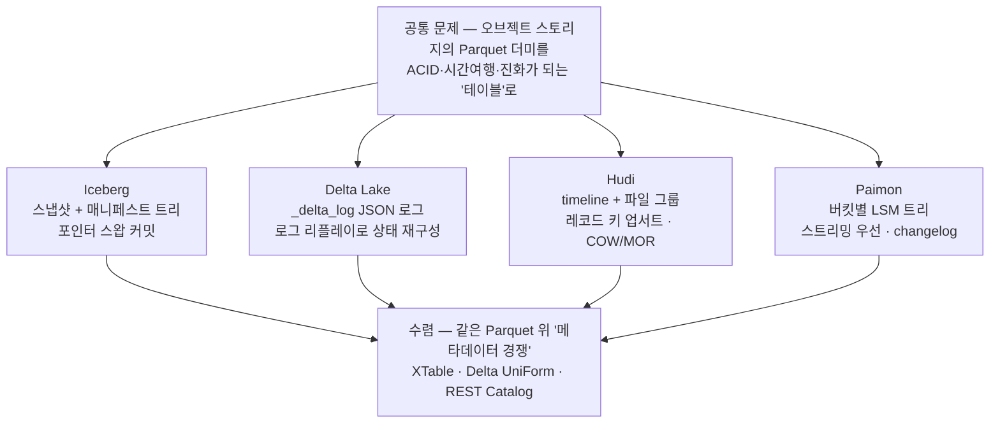
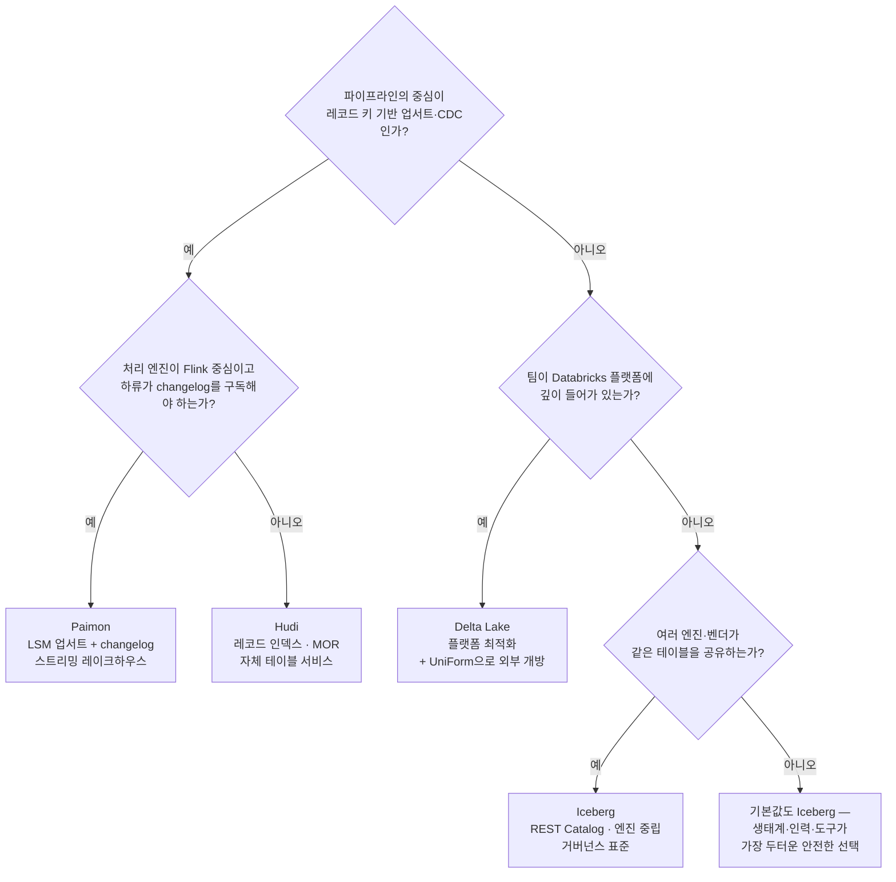
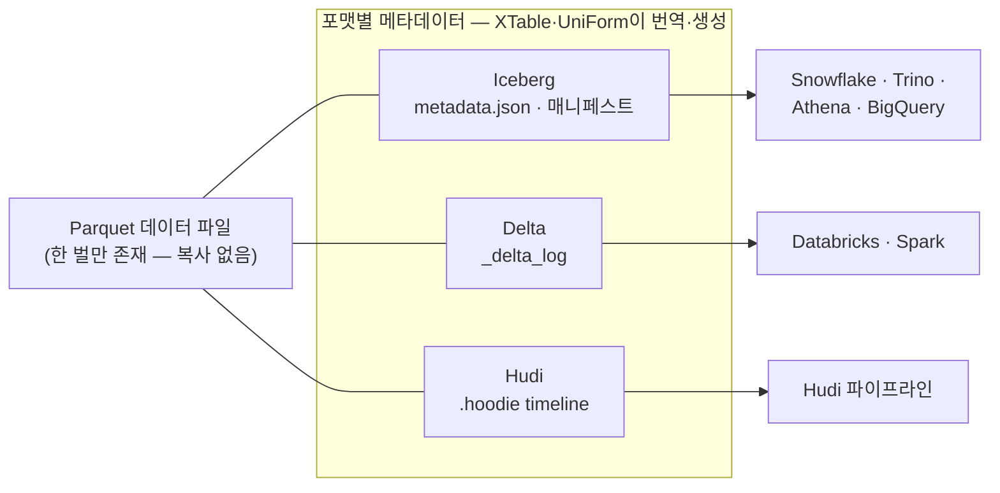

<figure class="post-figure post-figure--header">
<svg role="img" aria-label="네 오픈 테이블 포맷을 한 장으로 대비한 그림. 위쪽에 네 개의 포맷 카드가 나란히 놓여 있다. Iceberg 카드에는 메타데이터에서 매니페스트, 데이터 파일로 갈라지는 스냅샷 트리가, Delta Lake 카드에는 번호가 매겨진 JSON 커밋 로그와 checkpoint가, Hudi 카드에는 instant 점들이 찍힌 타임라인과 파일 그룹이, Paimon 카드에는 위에서 아래로 커지는 LSM 레벨이 그려져 있다. 네 카드에서 내려온 화살표는 모두 하나의 공유 데이터 계층인 Parquet 파일 밴드에 닿는다. 밴드 아래에서는 점선 화살표들이 XTable·UniForm이라고 적힌 상호운용 배지로 수렴한다." viewBox="0 0 680 340" xmlns="http://www.w3.org/2000/svg">
  <title>네 포맷, 하나의 데이터 — 서로 다른 메타데이터가 같은 Parquet 위에서 경쟁하고 수렴한다</title>
  <defs>
    <marker id="lh-s7-arrow" viewBox="0 0 10 10" refX="8" refY="5" markerWidth="6" markerHeight="6" orient="auto-start-reverse">
      <path d="M0,0 L10,5 L0,10 z" fill="var(--secondary-color)"/>
    </marker>
    <marker id="lh-s7-conv" viewBox="0 0 10 10" refX="8" refY="5" markerWidth="6" markerHeight="6" orient="auto-start-reverse">
      <path d="M0,0 L10,5 L0,10 z" fill="var(--gold)"/>
    </marker>
  </defs>

  <!-- title -->
  <text x="340" y="24" text-anchor="middle" font-size="17" font-weight="800" fill="currentColor" letter-spacing="1.5">ICEBERG · DELTA · HUDI · PAIMON</text>
  <text x="340" y="44" text-anchor="middle" font-size="10.5" font-weight="700" fill="currentColor" opacity="0.72">메타데이터 설계는 넷, 그 아래 데이터 파일은 하나 — Parquet</text>

  <!-- ===== format cards ===== -->
  <!-- Iceberg: snapshot/manifest tree -->
  <rect x="24" y="60" width="148" height="104" rx="5" fill="var(--bg-light)" stroke="var(--secondary-color)" stroke-width="2.5"/>
  <text x="98" y="78" text-anchor="middle" font-size="11" font-weight="800" fill="var(--secondary-color)">Iceberg</text>
  <circle cx="98" cy="96" r="7" fill="var(--bg-panel)" stroke="var(--secondary-color)" stroke-width="2"/>
  <g stroke="var(--secondary-color)" stroke-width="1.6" fill="none" opacity="0.9">
    <line x1="93" y1="101" x2="70" y2="116"/>
    <line x1="103" y1="101" x2="126" y2="116"/>
  </g>
  <circle cx="66" cy="121" r="6" fill="var(--bg-panel)" stroke="var(--secondary-color)" stroke-width="1.8"/>
  <circle cx="130" cy="121" r="6" fill="var(--bg-panel)" stroke="var(--secondary-color)" stroke-width="1.8"/>
  <g stroke="var(--secondary-color)" stroke-width="1.3" fill="none" opacity="0.7">
    <line x1="62" y1="126" x2="54" y2="138"/>
    <line x1="70" y1="126" x2="78" y2="138"/>
    <line x1="126" y1="126" x2="118" y2="138"/>
    <line x1="134" y1="126" x2="142" y2="138"/>
  </g>
  <g fill="var(--bg-panel)" stroke="currentColor" stroke-width="1.2">
    <rect x="48" y="138" width="12" height="9" rx="1.5"/>
    <rect x="72" y="138" width="12" height="9" rx="1.5"/>
    <rect x="112" y="138" width="12" height="9" rx="1.5"/>
    <rect x="136" y="138" width="12" height="9" rx="1.5"/>
  </g>
  <text x="98" y="159" text-anchor="middle" font-size="8" fill="currentColor" opacity="0.72">스냅샷 · 매니페스트 트리</text>

  <!-- Delta: numbered JSON log + checkpoint -->
  <rect x="190" y="60" width="148" height="104" rx="5" fill="var(--bg-light)" stroke="var(--accent-color)" stroke-width="2.5"/>
  <text x="264" y="78" text-anchor="middle" font-size="11" font-weight="800" fill="var(--accent-color)">Delta Lake</text>
  <g font-size="7.5" font-weight="700" fill="currentColor" font-family="monospace">
    <rect x="212" y="86" width="82" height="13" rx="2" fill="var(--bg-panel)" stroke="var(--accent-color)" stroke-width="1.4"/>
    <text x="218" y="96">…0000.json</text>
    <rect x="212" y="103" width="82" height="13" rx="2" fill="var(--bg-panel)" stroke="var(--accent-color)" stroke-width="1.4"/>
    <text x="218" y="113">…0001.json</text>
    <rect x="212" y="120" width="82" height="13" rx="2" fill="var(--bg-panel)" stroke="var(--accent-color)" stroke-width="1.4"/>
    <text x="218" y="130">…0002.json</text>
  </g>
  <rect x="300" y="103" width="26" height="30" rx="2" fill="var(--bg-panel)" stroke="var(--gold)" stroke-width="1.8"/>
  <text x="313" y="121" text-anchor="middle" font-size="7" font-weight="700" fill="var(--gold)">ckpt</text>
  <line x1="296" y1="126" x2="299" y2="120" stroke="var(--gold)" stroke-width="1.4"/>
  <text x="264" y="159" text-anchor="middle" font-size="8" fill="currentColor" opacity="0.72">_delta_log 리플레이 + checkpoint</text>

  <!-- Hudi: timeline with instants + file group -->
  <rect x="356" y="60" width="148" height="104" rx="5" fill="var(--bg-light)" stroke="var(--gold)" stroke-width="2.5"/>
  <text x="430" y="78" text-anchor="middle" font-size="11" font-weight="800" fill="var(--gold)">Hudi</text>
  <line x1="374" y1="100" x2="486" y2="100" stroke="currentColor" stroke-width="1.6" opacity="0.4"/>
  <g fill="var(--gold)">
    <circle cx="388" cy="100" r="5"/>
    <circle cx="418" cy="100" r="5"/>
    <circle cx="448" cy="100" r="5"/>
  </g>
  <circle cx="478" cy="100" r="5" fill="var(--bg-panel)" stroke="var(--gold)" stroke-width="1.8"/>
  <text x="430" y="118" text-anchor="middle" font-size="7.5" fill="currentColor" opacity="0.72">timeline — instant의 열</text>
  <rect x="382" y="126" width="52" height="20" rx="2" fill="var(--bg-panel)" stroke="currentColor" stroke-width="1.4"/>
  <text x="408" y="139" text-anchor="middle" font-size="7" font-weight="700" fill="currentColor">base file</text>
  <g fill="none" stroke="var(--accent-color)" stroke-width="1.4">
    <rect x="440" y="126" width="18" height="20" rx="2" stroke-dasharray="3 2"/>
    <rect x="462" y="126" width="18" height="20" rx="2" stroke-dasharray="3 2"/>
  </g>
  <text x="459" y="139" text-anchor="middle" font-size="6.5" font-weight="700" fill="var(--accent-color)">log</text>
  <text x="430" y="159" text-anchor="middle" font-size="8" fill="currentColor" opacity="0.72">파일 그룹 · COW/MOR 업서트</text>

  <!-- Paimon: LSM levels -->
  <rect x="522" y="60" width="134" height="104" rx="5" fill="var(--bg-light)" stroke="var(--secondary-color)" stroke-width="2.5"/>
  <text x="589" y="78" text-anchor="middle" font-size="11" font-weight="800" fill="var(--secondary-color)">Paimon</text>
  <rect x="571" y="88" width="36" height="11" rx="2" fill="var(--bg-panel)" stroke="var(--secondary-color)" stroke-width="1.6"/>
  <rect x="559" y="103" width="60" height="11" rx="2" fill="var(--bg-panel)" stroke="var(--secondary-color)" stroke-width="1.6"/>
  <rect x="547" y="118" width="84" height="11" rx="2" fill="var(--bg-panel)" stroke="var(--secondary-color)" stroke-width="1.6"/>
  <rect x="537" y="133" width="104" height="11" rx="2" fill="var(--bg-panel)" stroke="var(--secondary-color)" stroke-width="1.6"/>
  <g font-size="6.5" font-weight="700" fill="currentColor" opacity="0.65" text-anchor="end">
    <text x="568" y="97">L0</text>
    <text x="556" y="112">L1</text>
    <text x="544" y="127">L2</text>
  </g>
  <text x="589" y="159" text-anchor="middle" font-size="8" fill="currentColor" opacity="0.72">LSM 트리 · changelog 스트림</text>

  <!-- ===== arrows down to shared parquet layer ===== -->
  <g stroke="var(--secondary-color)" stroke-width="2" fill="none">
    <line x1="98" y1="168" x2="98" y2="196" marker-end="url(#lh-s7-arrow)"/>
    <line x1="264" y1="168" x2="264" y2="196" marker-end="url(#lh-s7-arrow)"/>
    <line x1="430" y1="168" x2="430" y2="196" marker-end="url(#lh-s7-arrow)"/>
    <line x1="589" y1="168" x2="589" y2="196" marker-end="url(#lh-s7-arrow)"/>
  </g>

  <!-- shared data layer -->
  <rect x="44" y="202" width="592" height="34" rx="4" fill="var(--bg-panel)" stroke="currentColor" stroke-width="2"/>
  <text x="340" y="224" text-anchor="middle" font-size="11" font-weight="800" fill="currentColor">공유 데이터 계층 — Parquet 파일 · 오브젝트 스토리지 (S3)</text>

  <!-- convergence arrows to interop badge -->
  <g stroke="var(--gold)" stroke-width="1.8" fill="none" stroke-dasharray="4 3">
    <line x1="150" y1="240" x2="278" y2="278" marker-end="url(#lh-s7-conv)"/>
    <line x1="340" y1="240" x2="340" y2="272" marker-end="url(#lh-s7-conv)"/>
    <line x1="530" y1="240" x2="402" y2="278" marker-end="url(#lh-s7-conv)"/>
  </g>

  <!-- interop badge -->
  <rect x="212" y="280" width="256" height="34" rx="6" fill="var(--bg-light)" stroke="var(--gold)" stroke-width="2.5"/>
  <text x="340" y="294" text-anchor="middle" font-size="10" font-weight="800" fill="var(--gold)">상호운용 — XTable · Delta UniForm</text>
  <text x="340" y="308" text-anchor="middle" font-size="8" fill="currentColor" opacity="0.72">데이터는 그대로, 메타데이터만 번역한다</text>

  <!-- bottom caption -->
  <text x="340" y="334" text-anchor="middle" font-size="9.5" fill="currentColor" opacity="0.72">포맷 전쟁의 실체는 "같은 Parquet 위에 어떤 메타데이터를 얹는가"의 경쟁이다</text>
</svg>
<figcaption>네 포맷, 하나의 데이터 — Iceberg의 스냅샷 트리, Delta의 트랜잭션 로그, Hudi의 timeline, Paimon의 LSM이 같은 Parquet 계층 위에서 경쟁하고, XTable·UniForm으로 수렴한다</figcaption>
</figure>

## 들어가며

[Lakehouse Essential Curriculum](/2026/07/12/lakehouse-essential-curriculum.html)의 **7단계이자 마지막 단계**입니다. 여기까지 오면서 우리는 Iceberg 하나를 축으로 여섯 개의 렌즈를 손에 넣었습니다 — 왜 파일 위에 테이블 계층이 필요한가(문제의식), 그 계층을 어떻게 구현하는가(메타데이터·매니페스트 구조), 그 위에서 무엇이 성립하는가(ACID·스냅샷·시간여행), 재작성 없이 어떻게 바꾸는가(스키마·파티션 진화), 어떻게 건강하게 유지하는가(compaction·유지보수), 누가 테이블을 찾고 지키는가(REST Catalog·거버넌스).

이 마지막 글의 요지는 단순합니다 — **그 여섯 렌즈를 그대로 들고, 이번에는 Iceberg가 아니라 경쟁 포맷들을 들여다본다**는 것입니다. Delta Lake·Apache Hudi·Apache Paimon은 모두 Iceberg와 **정확히 같은 문제**(오브젝트 스토리지의 파일 더미를 신뢰할 수 있는 테이블로)를 풀지만, 그 답이 서로 다릅니다. Delta는 **트랜잭션 로그를 리플레이**하고, Hudi는 **timeline과 레코드 키**로 업서트를 일급 시민으로 만들며, Paimon은 **LSM 트리**를 레이크에 얹어 스트리밍을 우선합니다. 같은 문제에 대한 네 개의 설계를 나란히 놓고 보면, 각 포맷의 강점이 "마케팅"이 아니라 "구조의 귀결"임이 보입니다 — 그리고 그것이 이 시리즈가 목표로 한 **선택의 안목**입니다.

<div class="post-summary-box" markdown="1">

### 📌 이 글에서 다루는 내용

- **설계 축으로 비교**: 앞선 6단계의 축(메타데이터 구조·트랜잭션 모델·진화·유지보수·카탈로그)으로 4개 포맷을 한 표에 놓고, 각 포맷의 내부 — Delta의 `_delta_log` JSON 로그와 checkpoint·로그 리플레이·protocol/table features, Hudi의 timeline·파일 그룹/슬라이스·COW vs MOR·레코드 키 인덱스, Paimon의 LSM 트리·changelog 생성 — 를 Iceberg의 스냅샷·매니페스트 모델과 대비합니다
- **워크로드 적합성**: 배치 분석 조회 / 스트리밍 ingest / 업서트·CDC / 멀티엔진 상호운용 각 시나리오에서 어떤 포맷이 왜 유리한지, 그리고 그 판단을 질문 트리(의사결정 흐름)로 정리합니다
- **생태계와 상호운용**: 2026년 채택 지형(Iceberg의 de facto 표준 지위), 하나의 데이터에 여러 포맷 메타데이터를 얹는 Delta UniForm·Apache XTable, 포맷 전환(in-place 변환 vs rewrite), 그리고 "포맷 전쟁의 수렴"이라는 큰 그림으로 시리즈를 마무리합니다

</div>

## 한눈에 보기 — 하나의 문제, 네 개의 답, 그리고 수렴

이 글의 스파인을 한 장으로 그리면 이렇습니다. 출발점은 같은 문제이고, 네 포맷은 각자의 핵심 메커니즘으로 갈라지며, 2026년의 현실에서는 상호운용 계층 위에서 다시 만납니다.



위쪽 갈래가 이 글의 전반부(각 포맷의 내부 구조), 아래 수렴 노드가 후반부(워크로드별 선택과 상호운용)입니다.

## 비교의 축 — 여섯 단계가 준 렌즈로 한 표에

먼저 전체 지형을 한 표로 깔아 둡니다. 각 행이 앞선 단계에서 익힌 축 하나씩입니다. 표의 세부는 이어지는 섹션들에서 하나씩 근거를 채웁니다.

| 축 | Iceberg | Delta Lake | Hudi | Paimon |
| --- | --- | --- | --- | --- |
| **메타데이터 구조** (2단계) | metadata.json → 매니페스트 리스트 → 매니페스트 → 데이터 파일의 **트리** | `_delta_log/`의 순번 JSON 커밋 + checkpoint Parquet — **로그** | `.hoodie/` timeline(instant의 열) + **파일 그룹/파일 슬라이스** | 스냅샷·매니페스트(Iceberg 유사) + 버킷별 **LSM 트리** |
| **트랜잭션 모델** (3단계) | 카탈로그의 메타데이터 포인터 원자 스왑, optimistic concurrency | 다음 순번 로그 파일의 원자적 생성이 곧 커밋, optimistic concurrency | timeline instant의 상태 전이(requested→inflight→completed)로 커밋 | 스냅샷 커밋, Flink 체크포인트와 정렬된 스트리밍 커밋 |
| **시간여행** (3단계) | 스냅샷 ID/타임스탬프 | 로그 버전/타임스탬프 (`VERSION AS OF`) | timeline instant 시각, 증분 조회(incremental query) | 스냅샷 ID/태그(tag) |
| **스키마·파티션 진화** (4단계) | 컬럼 ID 추적, **hidden partitioning + 파티션 진화** | 컬럼 매핑, generated columns, **liquid clustering**(파티션 대체) | 스키마 진화 지원, **파티션은 물리 경로에 고정** | 스키마 진화 지원, 파티션+버킷 고정(rescale 별도) |
| **유지보수** (5단계) | rewrite/expire/orphan — 외부 잡으로 운영 | `OPTIMIZE`·`VACUUM` | **자체 테이블 서비스**(compaction·clustering·cleaning) 내장 | compaction이 **쓰기 경로(LSM)에 통합** |
| **카탈로그·거버넌스** (6단계) | **REST Catalog 표준**, 엔진 중립 | Unity Catalog 중심(+Hive/Glue) | Hive/Glue + 자체 metadata table | Flink/Hive/JDBC 카탈로그(+REST 지향) |
| **홈그라운드** | 멀티엔진 분석·개방형 거버넌스 | Databricks·Spark 생태계 | 업서트·CDC ingest 파이프라인 | Flink 스트리밍 레이크하우스 |

한 줄로 압축하면 — **Iceberg는 트리, Delta는 로그, Hudi는 타임라인, Paimon은 LSM**입니다. 이제 그 한 줄의 근거를 포맷별로 들여다봅니다.

## Delta Lake — 트랜잭션 로그를 리플레이한다

### _delta_log — 커밋이 곧 JSON 파일 하나

Delta 테이블의 심장은 테이블 디렉토리 안의 `_delta_log/`입니다. **커밋 하나가 순번이 매겨진 JSON 파일 하나**이고, 파일 안에는 그 커밋이 수행한 액션(action)들이 한 줄에 하나씩 적힙니다.

```text
orders/
├── _delta_log/
│   ├── 00000000000000000000.json               # 커밋 0 — protocol · metaData · add
│   ├── 00000000000000000001.json               # 커밋 1 — add/remove
│   ├── ...
│   ├── 00000000000000000010.checkpoint.parquet # 10커밋마다 — 그 시점 상태 전체
│   └── _last_checkpoint                        # 최신 checkpoint 포인터
├── part-00000-3f1a...snappy.parquet            # 데이터 파일 — 여느 Parquet과 같다
└── part-00001-8c2e...snappy.parquet
```

커밋 파일 하나를 열어 보면 이렇게 생겼습니다(각 줄이 액션 하나인 JSON Lines 형식이며, 요지만 남기고 축약했습니다).

```json
{"commitInfo":{"timestamp":1784089620000,"operation":"MERGE","operationMetrics":{"numTargetRowsUpdated":"1200"}}}
{"add":{"path":"part-00002-a1b2.snappy.parquet","partitionValues":{"order_date":"2026-07-14"},"size":10485760,"dataChange":true,"stats":"{\"numRecords\":52000,\"minValues\":{\"order_id\":1},\"maxValues\":{\"order_id\":52000}}"}}
{"remove":{"path":"part-00000-3f1a.snappy.parquet","deletionTimestamp":1784089620000,"dataChange":true}}
```

`add`는 "이 파일이 테이블에 들어왔다", `remove`는 "이 파일은 더 이상 테이블의 일부가 아니다"입니다. 커밋의 원자성은 **"다음 순번의 로그 파일을 원자적으로 만들 수 있는가"**로 환원됩니다 — 두 writer가 동시에 `...0007.json`을 만들려 하면 한쪽만 성공하고, 진 쪽은 새 커밋을 읽어 충돌 검사 후 재시도합니다. Iceberg가 3단계에서 본 "카탈로그의 메타데이터 포인터 스왑"으로 풀었던 문제를, Delta는 "로그 파일 이름의 원자적 선점"으로 푸는 것입니다.

### 로그 리플레이와 checkpoint

여기서 Iceberg와의 구조적 차이가 선명해집니다. Iceberg의 metadata.json은 **테이블의 현재 상태 전체**(스키마·파티션 스펙·유효한 스냅샷 목록)를 담은 문서여서, 한 파일만 읽으면 상태가 나옵니다. 반면 Delta의 개별 JSON은 **변경분(delta)**만 담으므로, 테이블의 현재 상태는 **로그를 처음부터 끝까지 리플레이(replay)해서 재구성**해야 합니다 — `add`를 모으고 `remove`를 빼면 "지금 유효한 파일 집합"이 나오는 식입니다.

<figure class="post-figure">
<svg role="img" aria-label="Iceberg의 상태 스냅샷 모델과 Delta의 로그 리플레이 모델을 좌우로 대비한 개념도. 왼쪽 Iceberg 패널에는 스키마·파티션 스펙·스냅샷 목록이 모두 적힌 metadata.json 문서 하나가 있고, 한 파일만 읽으면 현재 상태가 나온다는 화살표가 아래의 현재 상태 상자로 이어진다. 오른쪽 Delta 패널에는 0번부터 4번까지 순번이 매겨진 커밋 JSON 상자들이 시간순으로 늘어서 있고, 각 상자의 add와 remove를 차례로 접어 합치는 화살표가 현재 상태 상자로 수렴한다. 3번 커밋 아래에 checkpoint Parquet이 있어, 리더는 checkpoint에서 시작해 이후 커밋만 리플레이하면 된다는 지름길 화살표가 굵게 표시된다." viewBox="0 0 680 300" xmlns="http://www.w3.org/2000/svg">
  <title>상태 스냅샷 vs 로그 리플레이 — 같은 "현재 상태"에 도달하는 두 경로</title>
  <defs>
    <marker id="lh-s7-rp-sec" viewBox="0 0 10 10" refX="8" refY="5" markerWidth="6" markerHeight="6" orient="auto-start-reverse">
      <path d="M0,0 L10,5 L0,10 z" fill="var(--secondary-color)"/>
    </marker>
    <marker id="lh-s7-rp-acc" viewBox="0 0 10 10" refX="8" refY="5" markerWidth="6" markerHeight="6" orient="auto-start-reverse">
      <path d="M0,0 L10,5 L0,10 z" fill="var(--accent-color)"/>
    </marker>
    <marker id="lh-s7-rp-gold" viewBox="0 0 10 10" refX="8" refY="5" markerWidth="6" markerHeight="6" orient="auto-start-reverse">
      <path d="M0,0 L10,5 L0,10 z" fill="var(--gold)"/>
    </marker>
  </defs>

  <text x="340" y="22" text-anchor="middle" font-size="11" font-weight="700" fill="currentColor" opacity="0.72">같은 "현재 상태"에 도달하는 두 경로</text>

  <!-- ===== left: Iceberg state snapshot ===== -->
  <rect x="20" y="36" width="290" height="248" rx="6" fill="var(--bg-light)" stroke="var(--secondary-color)" stroke-width="2.5"/>
  <text x="165" y="58" text-anchor="middle" font-size="12" font-weight="800" fill="var(--secondary-color)">Iceberg — 상태 스냅샷</text>

  <!-- metadata.json document -->
  <rect x="80" y="72" width="170" height="98" rx="4" fill="var(--bg-panel)" stroke="var(--secondary-color)" stroke-width="2"/>
  <text x="165" y="90" text-anchor="middle" font-size="9.5" font-weight="700" fill="currentColor" font-family="monospace">v3.metadata.json</text>
  <g font-size="8.5" fill="currentColor" opacity="0.8" text-anchor="start">
    <text x="94" y="108">· 스키마 (전체)</text>
    <text x="94" y="123">· 파티션 스펙 (전체)</text>
    <text x="94" y="138">· 유효한 스냅샷 목록</text>
    <text x="94" y="153">· 현재 스냅샷 포인터</text>
  </g>

  <line x1="165" y1="176" x2="165" y2="212" stroke="var(--secondary-color)" stroke-width="2.5" marker-end="url(#lh-s7-rp-sec)"/>
  <text x="230" y="198" text-anchor="middle" font-size="8.5" font-weight="700" fill="currentColor" opacity="0.75">한 파일 = 상태 전체</text>

  <rect x="80" y="218" width="170" height="34" rx="4" fill="var(--bg-panel)" stroke="var(--gold)" stroke-width="2.5"/>
  <text x="165" y="240" text-anchor="middle" font-size="10" font-weight="800" fill="currentColor">현재 상태</text>
  <text x="165" y="270" text-anchor="middle" font-size="8.5" fill="currentColor" opacity="0.7">커밋 = 새 metadata.json으로 포인터 스왑</text>

  <!-- ===== right: Delta log replay ===== -->
  <rect x="330" y="36" width="330" height="248" rx="6" fill="var(--bg-light)" stroke="var(--accent-color)" stroke-width="2.5"/>
  <text x="495" y="58" text-anchor="middle" font-size="12" font-weight="800" fill="var(--accent-color)">Delta — 로그 리플레이</text>

  <!-- commit boxes 0..4 -->
  <g font-family="monospace" font-size="8" font-weight="700" text-anchor="middle">
    <rect x="348" y="76" width="52" height="30" rx="3" fill="var(--bg-panel)" stroke="var(--accent-color)" stroke-width="1.6"/>
    <text x="374" y="89" fill="currentColor">0.json</text>
    <text x="374" y="100" fill="currentColor" opacity="0.7">+a +b</text>
    <rect x="408" y="76" width="52" height="30" rx="3" fill="var(--bg-panel)" stroke="var(--accent-color)" stroke-width="1.6"/>
    <text x="434" y="89" fill="currentColor">1.json</text>
    <text x="434" y="100" fill="currentColor" opacity="0.7">+c</text>
    <rect x="468" y="76" width="52" height="30" rx="3" fill="var(--bg-panel)" stroke="var(--accent-color)" stroke-width="1.6"/>
    <text x="494" y="89" fill="currentColor">2.json</text>
    <text x="494" y="100" fill="currentColor" opacity="0.7">-a +d</text>
    <rect x="528" y="76" width="52" height="30" rx="3" fill="var(--bg-panel)" stroke="var(--accent-color)" stroke-width="1.6"/>
    <text x="554" y="89" fill="currentColor">3.json</text>
    <text x="554" y="100" fill="currentColor" opacity="0.7">+e</text>
    <rect x="588" y="76" width="52" height="30" rx="3" fill="var(--bg-panel)" stroke="var(--accent-color)" stroke-width="1.6"/>
    <text x="614" y="89" fill="currentColor">4.json</text>
    <text x="614" y="100" fill="currentColor" opacity="0.7">-b +f</text>
  </g>

  <!-- replay fold arrows -->
  <g stroke="var(--accent-color)" stroke-width="1.6" fill="none" opacity="0.8">
    <line x1="374" y1="110" x2="470" y2="208" marker-end="url(#lh-s7-rp-acc)"/>
    <line x1="434" y1="110" x2="480" y2="208" marker-end="url(#lh-s7-rp-acc)"/>
    <line x1="494" y1="110" x2="492" y2="208" marker-end="url(#lh-s7-rp-acc)"/>
    <line x1="554" y1="110" x2="504" y2="208" marker-end="url(#lh-s7-rp-acc)"/>
    <line x1="614" y1="110" x2="516" y2="208" marker-end="url(#lh-s7-rp-acc)"/>
  </g>
  <text x="392" y="168" text-anchor="middle" font-size="8.5" font-weight="700" fill="currentColor" opacity="0.75">add를 모으고</text>
  <text x="392" y="180" text-anchor="middle" font-size="8.5" font-weight="700" fill="currentColor" opacity="0.75">remove를 뺀다</text>

  <!-- checkpoint shortcut -->
  <rect x="528" y="126" width="80" height="26" rx="3" fill="var(--bg-panel)" stroke="var(--gold)" stroke-width="2"/>
  <text x="568" y="138" text-anchor="middle" font-size="7.5" font-weight="700" fill="var(--gold)">3.checkpoint</text>
  <text x="568" y="148" text-anchor="middle" font-size="7.5" font-weight="700" fill="var(--gold)">.parquet</text>
  <line x1="554" y1="110" x2="562" y2="122" stroke="var(--gold)" stroke-width="1.4" opacity="0.7"/>
  <path d="M568,152 Q560,190 522,210" fill="none" stroke="var(--gold)" stroke-width="2.5" marker-end="url(#lh-s7-rp-gold)"/>
  <text x="600" y="186" text-anchor="middle" font-size="8" font-weight="700" fill="var(--gold)">지름길 — checkpoint</text>
  <text x="600" y="197" text-anchor="middle" font-size="8" font-weight="700" fill="var(--gold)">+ 이후 커밋만 리플레이</text>

  <rect x="440" y="214" width="110" height="34" rx="4" fill="var(--bg-panel)" stroke="var(--gold)" stroke-width="2.5"/>
  <text x="495" y="236" text-anchor="middle" font-size="10" font-weight="800" fill="currentColor">현재 상태</text>
  <text x="495" y="270" text-anchor="middle" font-size="8.5" fill="currentColor" opacity="0.7">커밋 = 다음 순번 로그 파일의 원자적 생성</text>
</svg>
<figcaption>Iceberg는 상태 전체를 담은 문서를 갈아 끼우고(상태 스냅샷), Delta는 변경분 로그를 접어 상태를 재구성한다(로그 리플레이) — checkpoint는 리플레이의 지름길이다</figcaption>
</figure>

커밋이 수만 개 쌓이면 리플레이가 감당이 안 되므로, Delta는 기본 10커밋마다 **그 시점의 상태 전체를 Parquet으로 구워 둡니다** — 이것이 `checkpoint.parquet`입니다. 리더는 `_last_checkpoint`가 가리키는 최신 checkpoint를 읽고, 그 이후의 JSON 몇 개만 리플레이하면 됩니다. 요컨대 **Delta = 이벤트 소싱(로그 + 주기적 스냅샷), Iceberg = 상태 스냅샷(불변 트리)**라는 대비입니다. 시간여행도 같은 구조에서 나옵니다 — `SELECT * FROM orders VERSION AS OF 7`은 "커밋 7까지만 리플레이한 상태"를 읽는 것입니다.

### protocol version과 table features

Delta 로그의 첫 커밋에는 `protocol` 액션이 들어 있습니다.

```json
{"protocol":{"minReaderVersion":3,"minWriterVersion":7,"readerFeatures":["deletionVectors"],"writerFeatures":["deletionVectors","appendOnly"]}}
```

"이 테이블을 읽으려면 reader protocol 3 이상, 쓰려면 writer protocol 7 이상을 구현해야 한다"는 선언입니다. 최신 protocol에서는 버전 숫자 대신 **table features**(deletion vectors, column mapping, liquid clustering 등)를 기능 단위로 나열해, 엔진이 "내가 이 기능을 아는가"를 개별 판단합니다. 이는 Iceberg의 포맷 버전(v1/v2/v3)과 같은 역할이지만 더 세분화된 접근으로, **새 기능이 늘 때마다 구형 리더가 안전하게 거부**할 수 있게 하는 장치입니다. 뒤집어 말하면 — 생태계의 모든 엔진이 모든 feature를 따라잡지는 못하므로, 최신 기능을 켠 Delta 테이블은 Databricks 밖에서 읽히지 않을 수 있다는 상호운용 긴장이 여기서 나옵니다.

## Hudi — 타임라인과 레코드 키

### timeline — 모든 액션이 instant로 기록된다

Hudi 테이블의 메타데이터 홈은 `.hoodie/` 디렉토리이고, 그 핵심은 **timeline**입니다. 테이블에 일어나는 모든 액션(커밋·compaction·클리닝·롤백)은 **instant** — `타임스탬프.액션[.상태]` 형태의 파일 — 로 기록됩니다.

```text
orders/
├── .hoodie/
│   ├── hoodie.properties                       # 테이블 타입(COW/MOR)·레코드 키 필드 등
│   ├── 20260715090010123.commit                # COW 쓰기 — 완료된 instant
│   ├── 20260715091500456.deltacommit           # MOR 로그 쓰기 — 완료
│   ├── 20260715093000789.compaction.requested  # compaction 계획됨
│   ├── 20260715093000789.compaction.inflight   # 실행 중
│   └── metadata/                               # metadata table — 파일 목록·인덱스
└── order_date=2026-07-14/                      # 파티션 = 물리 디렉토리 경로
    ├── f1a2-...-0_20260715090010123.parquet    # base file (파일 그룹 f1a2의 슬라이스)
    └── .f1a2-...-0_20260715091500456.log.1     # log file — base 위에 쌓인 변경분
```

instant가 `requested → inflight → completed`의 상태 전이를 거치는 것이 Hudi의 커밋 프로토콜입니다 — 리더는 completed instant까지만 봅니다. 그리고 데이터 파일은 **파일 그룹(file group)** 단위로 조직됩니다. 파일 그룹은 "레코드 키의 특정 구간을 책임지는 파일들의 가계(家系)"이고, 커밋마다 그 그룹의 새 **파일 슬라이스(file slice)** — base file 하나 + 그 위의 log file들 — 가 생깁니다. Iceberg가 "스냅샷이 파일 집합을 참조"하는 수평적 모델이라면, Hudi는 "각 키 구간의 파일 가계를 시간축으로 추적"하는 수직적 모델입니다. 이 구조가 다음 두 가지를 가능하게 합니다.

### copy-on-write vs merge-on-read

Hudi는 테이블을 만들 때 두 타입 중 하나를 고릅니다.

- **Copy-on-Write (COW)**: 업데이트가 오면 해당 파일 그룹의 base file을 **통째로 다시 씁니다**. 쓰기가 비싸고 느린 대신, 읽기는 순수 Parquet 읽기 — 빠르고 단순합니다. 배치 위주, 읽기 많은 테이블에 적합합니다.
- **Merge-on-Read (MOR)**: 업데이트를 base file 옆의 **log file에 append**만 해 두고(빠른 쓰기), 읽을 때 base + log를 병합합니다(느린 읽기). 주기적 **compaction**이 log를 base로 합쳐 읽기 비용을 회수합니다. 스트리밍 ingest·잦은 업서트에 적합합니다.

<figure class="post-figure">
<svg role="img" aria-label="Hudi의 copy-on-write와 merge-on-read를 좌우로 대비한 개념도. 왼쪽 COW 패널에서는 업데이트가 도착하면 파일 그룹의 base file 전체가 새 base file로 다시 쓰이고, 읽기는 그 Parquet 하나만 읽으면 되어 빠르다. 오른쪽 MOR 패널에서는 업데이트가 base file 옆의 log file에 append만 되어 쓰기가 빠르고, 읽기는 base와 log를 병합해야 해서 느리며, 아래의 compaction 화살표가 base와 log를 합쳐 새 base file을 만든다. 각 패널 아래에 쓰기 비용과 읽기 비용의 대비가 적혀 있다." viewBox="0 0 680 292" xmlns="http://www.w3.org/2000/svg">
  <title>COW vs MOR — 병합을 쓰기 때 하느냐, 읽기 때 하느냐</title>
  <defs>
    <marker id="lh-s7-cm-sec" viewBox="0 0 10 10" refX="8" refY="5" markerWidth="6" markerHeight="6" orient="auto-start-reverse">
      <path d="M0,0 L10,5 L0,10 z" fill="var(--secondary-color)"/>
    </marker>
    <marker id="lh-s7-cm-acc" viewBox="0 0 10 10" refX="8" refY="5" markerWidth="6" markerHeight="6" orient="auto-start-reverse">
      <path d="M0,0 L10,5 L0,10 z" fill="var(--accent-color)"/>
    </marker>
    <marker id="lh-s7-cm-gold" viewBox="0 0 10 10" refX="8" refY="5" markerWidth="6" markerHeight="6" orient="auto-start-reverse">
      <path d="M0,0 L10,5 L0,10 z" fill="var(--gold)"/>
    </marker>
  </defs>

  <text x="340" y="22" text-anchor="middle" font-size="11" font-weight="700" fill="currentColor" opacity="0.72">병합을 언제 하는가 — 쓰기 때(COW) vs 읽기 때(MOR)</text>

  <!-- ===== left: COW ===== -->
  <rect x="20" y="36" width="305" height="240" rx="6" fill="var(--bg-light)" stroke="var(--secondary-color)" stroke-width="2.5"/>
  <text x="172" y="58" text-anchor="middle" font-size="12" font-weight="800" fill="var(--secondary-color)">Copy-on-Write</text>

  <!-- update arrives -->
  <rect x="42" y="76" width="86" height="24" rx="4" fill="var(--bg-panel)" stroke="var(--accent-color)" stroke-width="1.8"/>
  <text x="85" y="92" text-anchor="middle" font-size="9" font-weight="700" fill="var(--accent-color)">업데이트 도착</text>
  <line x1="128" y1="88" x2="160" y2="112" stroke="var(--accent-color)" stroke-width="2" marker-end="url(#lh-s7-cm-acc)"/>

  <!-- old base (struck) -->
  <rect x="42" y="120" width="110" height="42" rx="4" fill="var(--bg-panel)" stroke="currentColor" stroke-width="2" opacity="0.55"/>
  <text x="97" y="138" text-anchor="middle" font-size="8.5" font-weight="700" fill="currentColor" opacity="0.7">base file (구)</text>
  <text x="97" y="152" text-anchor="middle" font-size="7.5" fill="currentColor" opacity="0.6" font-family="monospace">…_t1.parquet</text>
  <line x1="46" y1="158" x2="148" y2="124" stroke="currentColor" stroke-width="1.6" opacity="0.5"/>

  <!-- rewrite arrow -->
  <line x1="156" y1="141" x2="188" y2="141" stroke="var(--secondary-color)" stroke-width="2.5" marker-end="url(#lh-s7-cm-sec)"/>
  <text x="172" y="132" text-anchor="middle" font-size="7.5" font-weight="700" fill="currentColor" opacity="0.75">전체 재작성</text>

  <!-- new base -->
  <rect x="192" y="120" width="110" height="42" rx="4" fill="var(--bg-panel)" stroke="var(--secondary-color)" stroke-width="2.5"/>
  <text x="247" y="138" text-anchor="middle" font-size="8.5" font-weight="700" fill="currentColor">base file (신)</text>
  <text x="247" y="152" text-anchor="middle" font-size="7.5" fill="currentColor" opacity="0.7" font-family="monospace">…_t2.parquet</text>

  <!-- read path -->
  <line x1="247" y1="168" x2="247" y2="196" stroke="var(--gold)" stroke-width="2.5" marker-end="url(#lh-s7-cm-gold)"/>
  <rect x="192" y="200" width="110" height="26" rx="4" fill="var(--bg-panel)" stroke="var(--gold)" stroke-width="2"/>
  <text x="247" y="217" text-anchor="middle" font-size="9" font-weight="700" fill="currentColor">읽기 — Parquet만</text>

  <g font-size="8.5" fill="currentColor" opacity="0.75" text-anchor="start">
    <text x="42" y="246">쓰기: 비싸다 (파일 통째 재작성)</text>
    <text x="42" y="262">읽기: 빠르다 · 배치·조회 중심에 적합</text>
  </g>

  <!-- ===== right: MOR ===== -->
  <rect x="352" y="36" width="308" height="240" rx="6" fill="var(--bg-light)" stroke="var(--accent-color)" stroke-width="2.5"/>
  <text x="506" y="58" text-anchor="middle" font-size="12" font-weight="800" fill="var(--accent-color)">Merge-on-Read</text>

  <!-- update arrives -->
  <rect x="374" y="76" width="86" height="24" rx="4" fill="var(--bg-panel)" stroke="var(--accent-color)" stroke-width="1.8"/>
  <text x="417" y="92" text-anchor="middle" font-size="9" font-weight="700" fill="var(--accent-color)">업데이트 도착</text>
  <line x1="460" y1="88" x2="548" y2="112" stroke="var(--accent-color)" stroke-width="2" marker-end="url(#lh-s7-cm-acc)"/>
  <text x="530" y="98" text-anchor="middle" font-size="7.5" font-weight="700" fill="currentColor" opacity="0.75">append만</text>

  <!-- base + logs -->
  <rect x="374" y="120" width="110" height="42" rx="4" fill="var(--bg-panel)" stroke="currentColor" stroke-width="2"/>
  <text x="429" y="138" text-anchor="middle" font-size="8.5" font-weight="700" fill="currentColor">base file</text>
  <text x="429" y="152" text-anchor="middle" font-size="7.5" fill="currentColor" opacity="0.7" font-family="monospace">…_t1.parquet</text>
  <g fill="none" stroke="var(--accent-color)" stroke-width="1.8">
    <rect x="494" y="120" width="34" height="42" rx="3" stroke-dasharray="4 3"/>
    <rect x="534" y="120" width="34" height="42" rx="3" stroke-dasharray="4 3"/>
  </g>
  <g font-size="7" font-weight="700" fill="var(--accent-color)" text-anchor="middle">
    <text x="511" y="144">log.1</text>
    <text x="551" y="144">log.2</text>
  </g>

  <!-- read merges -->
  <g stroke="var(--gold)" stroke-width="2" fill="none">
    <line x1="429" y1="168" x2="470" y2="196" marker-end="url(#lh-s7-cm-gold)"/>
    <line x1="511" y1="168" x2="486" y2="196" marker-end="url(#lh-s7-cm-gold)"/>
    <line x1="551" y1="168" x2="498" y2="196" marker-end="url(#lh-s7-cm-gold)"/>
  </g>
  <rect x="404" y="200" width="152" height="26" rx="4" fill="var(--bg-panel)" stroke="var(--gold)" stroke-width="2"/>
  <text x="480" y="217" text-anchor="middle" font-size="9" font-weight="700" fill="currentColor">읽기 — base + log 병합</text>

  <!-- compaction note -->
  <path d="M596,162 Q616,190 580,206" fill="none" stroke="var(--secondary-color)" stroke-width="2" stroke-dasharray="4 3" marker-end="url(#lh-s7-cm-sec)"/>
  <text x="622" y="186" text-anchor="middle" font-size="7.5" font-weight="700" fill="var(--secondary-color)">compaction이</text>
  <text x="622" y="197" text-anchor="middle" font-size="7.5" font-weight="700" fill="var(--secondary-color)">새 base로 병합</text>

  <g font-size="8.5" fill="currentColor" opacity="0.75" text-anchor="start">
    <text x="374" y="246">쓰기: 빠르다 (log에 append)</text>
    <text x="374" y="262">읽기: 병합 비용 · 스트리밍·업서트에 적합</text>
  </g>
</svg>
<figcaption>COW는 쓰기 때 병합하고(비싼 쓰기·순수 Parquet 읽기), MOR은 읽기 때 병합한다(빠른 append 쓰기·병합 읽기) — compaction이 MOR의 읽기 비용을 주기적으로 회수한다</figcaption>
</figure>

"쓰기 때 병합하느냐, 읽기 때 병합하느냐"의 고전적 트레이드오프를 **테이블 타입으로 노출**한 것이 Hudi의 개성입니다. Iceberg v2의 delete file/deletion vector도 같은 문제(제자리 수정의 비용)를 다루지만, Hudi는 이를 설계의 중심에 둡니다.

### 레코드 키·인덱스 업서트, 그리고 자체 테이블 서비스

Hudi 테이블의 모든 레코드에는 **레코드 키(record key)**가 있습니다. 업서트가 들어오면 Hudi는 **인덱스**(bloom filter 인덱스, 0.14+의 record-level index, bucket 인덱스 등)로 "이 키가 어느 파일 그룹에 있는가"를 찾아 그 그룹만 갱신합니다. "레코드가 어느 파일에 있는지"를 포맷 수준에서 추적하는 이 능력이, 뒤에서 볼 **CDC·업서트 워크로드에서의 Hudi 강점**의 뿌리입니다 — Iceberg·Delta의 MERGE가 조인으로 대상 파일을 찾아내는 것과 달리, Hudi는 인덱스 조회로 바로 갑니다.

또 하나의 개성은 **테이블 서비스의 내장**입니다. 5단계에서 Iceberg의 compaction·스냅샷 만료를 "별도 잡으로 설계해서 돌리는 운영"으로 배웠다면, Hudi는 compaction·clustering·cleaning을 **쓰기 파이프라인에 인라인하거나 비동기 서비스로 스케줄**하는 장치를 자체 제공합니다. 관리형 서비스 없이도 테이블이 스스로를 돌보게 하려는 설계 — "레이크 위의 데이터베이스"에 가장 가까이 가려 한 포맷이 Hudi입니다.

## Paimon — LSM 트리를 레이크에 얹다

### 스트리밍 우선 설계와 LSM 구조

Apache Paimon은 출발부터 다릅니다 — Flink 커뮤니티에서 **Flink Table Store**로 태어나, "스트리밍 쓰기와 스트리밍 읽기가 일급인 레이크 포맷"을 목표로 독립한 프로젝트입니다. 스냅샷·매니페스트라는 겉모양은 Iceberg와 유사하지만, **데이터 파일의 조직 원리가 LSM(Log-Structured Merge) 트리**라는 점이 결정적으로 다릅니다.

```text
warehouse/db.db/orders/
├── snapshot/
│   ├── snapshot-42                  # 커밋 단위 — Iceberg 스냅샷과 유사
│   └── LATEST
├── manifest/                        # 어떤 파일이 어느 스냅샷에 속하는가
└── order_date=2026-07-14/
    └── bucket-0/                    # 버킷 하나 = LSM 트리 하나
        ├── data-...-L0.orc          # L0 — 방금 flush된 sorted run (작고 새것)
        ├── data-...-L3.orc          # 중간 레벨 — compaction으로 병합된 run
        └── data-...-L5.orc          # 최고 레벨 — 크고 오래된 데이터
```

primary key 테이블의 쓰기는 RocksDB 같은 LSM 스토리지와 동일한 리듬으로 움직입니다 — 새 레코드는 정렬되어 L0에 flush되고, 백그라운드 compaction이 겹치는 sorted run들을 아래 레벨로 병합하며, 같은 키의 레코드는 **merge engine**(deduplicate·partial-update·aggregation)의 규칙으로 합쳐집니다. 업서트가 "MERGE 문의 실행"이 아니라 **"LSM에 키를 쓰는 것" 그 자체**가 되는 것입니다. 5단계에서 배운 "스트리밍 쓰기가 작은 파일을 양산하고, compaction 잡이 뒤치다꺼리하는" 구도가, Paimon에서는 **compaction이 쓰기 경로에 통합된 구조**로 바뀝니다.

### changelog 생성 — 테이블이 스트림이 된다

Paimon의 두 번째 개성은 **changelog producer**입니다. 테이블에 일어난 변경을 `+I`(insert)·`-U`/`+U`(update 전/후)·`-D`(delete)의 **완결된 changelog 스트림**으로 만들어 저장해 두는 기능으로, 설정(`none`·`input`·`lookup`·`full-compaction`)에 따라 생성 비용과 정확도를 조절합니다. 이것이 왜 중요한가 — 하류의 Flink 스트리밍 잡이 이 테이블을 **CDC 소스처럼 구독**할 수 있게 되기 때문입니다. "테이블이면서 동시에 스트림"인 저장소, 즉 [Stream Processing Essential 시리즈](/2026/07/12/stream-processing-essential-curriculum.html)에서 본 스트림·테이블 이중성(duality)을 레이크 포맷 수준에서 구현한 것이 Paimon이고, Flink 체크포인트와 정렬된 커밋 덕분에 "Flink → Paimon → Flink"로 이어지는 **스트리밍 레이크하우스 파이프라인**이 자연스럽게 성립합니다.

Iceberg·Delta도 증분 읽기(incremental read / Change Data Feed)를 제공하지만, "배치 테이블에 스트림 읽기를 보탠 것"과 "스트림을 위해 설계된 테이블"의 결이 다릅니다 — Paimon은 후자입니다.

## 진화(evolution) — 네 포맷이 가장 크게 갈라지는 축

4단계에서 익힌 렌즈로 보면 포맷 간 격차가 가장 큰 축이 진화입니다.

- **Iceberg**: 컬럼을 고유 ID로 추적하는 스키마 진화에 더해, 파티션을 메타데이터의 변환(transform)으로 표현하는 **hidden partitioning** 덕분에 **파티션 진화** — 파티션 전략 자체를 재작성 없이 바꾸고, 신·구 파티션 스펙의 파일이 한 테이블에 공존 — 가 가능합니다. 네 포맷 중 유일합니다.
- **Delta**: column mapping으로 rename/drop을 지원하고, 파티션 컬럼을 식에서 자동 파생하는 **generated columns**로 hidden partitioning의 일부 효과(사용자가 파생 컬럼 필터를 몰라도 되게)를 냅니다. 그리고 최근의 방향은 파티셔닝 자체를 버리는 쪽입니다 — **liquid clustering**은 물리 디렉토리 파티션 대신 클러스터링 키 기반으로 데이터를 배치하고, 키 변경도 점진 재배치로 흡수합니다. "파티션 진화" 문제를 "파티션 제거"로 우회하는 답입니다.
- **Hudi**: 스키마 진화는 지원하지만, 파티션이 **물리 디렉토리 경로에 고정**됩니다(Hive 전통). 파티션 전략을 바꾸려면 사실상 테이블 재작성이 필요합니다 — 대신 파일 그룹·클러스터링으로 파티션 내부의 레이아웃을 다듬습니다.
- **Paimon**: 스키마 진화를 지원하고 버킷 수 변경(rescale)이 가능하지만, 파티션+버킷 구조가 LSM의 단위이므로 Iceberg식 파티션 진화와는 거리가 있습니다.

**"테이블을 10년 운영한다"는 관점**에서 이 축을 보면 — 요구사항이 바뀌어도 재작성 없이 따라가는 능력은 Iceberg가 가장 앞서 있고, 이것이 Iceberg가 "장수하는 공용 테이블"의 표준이 된 구조적 이유 중 하나입니다.

## 워크로드 적합성 — 무엇을 기준으로 고르는가

이제 축을 시나리오로 돌려 봅니다. 네 포맷 모두 ACID·시간여행·스키마 진화라는 기본기를 갖췄으므로, 선택을 가르는 것은 **워크로드의 중심이 무엇이냐**입니다.

- **배치 분석 조회 중심** — 하루 수십 번의 배치 적재, BI·ad-hoc 조회가 지배적인 고전적 분석 테이블이라면 넷 다 감당하지만, **여러 엔진(Spark·Trino·Snowflake·Flink)이 같은 테이블을 읽는 순간 Iceberg의 엔진 중립성과 REST Catalog 생태계**가 결정적 이점이 됩니다. Databricks 단일 플랫폼 안이라면 Delta가 가장 매끄럽습니다(플랫폼 최적화·Photon·자동 유지보수).
- **업서트·CDC 중심** — 원천 DB의 CDC를 받아 레이크에 최신 상태를 유지하는 파이프라인이라면 **Hudi의 레코드 키·인덱스 업서트와 MOR**이 구조적 강점입니다. "이 키가 어느 파일에 있는가"를 인덱스로 즉답하는 포맷은 Hudi뿐이고, 자체 테이블 서비스가 업서트가 양산하는 파일 파편화를 상시 수습합니다. Iceberg/Delta의 MERGE + deletion vector도 실무 수준에 올라와 있어, "업서트가 있긴 한데 중심은 아닌" 정도라면 표준 생태계(Iceberg)에 머무는 선택이 합리적입니다.
- **스트리밍 ingest·스트리밍 레이크하우스** — Flink 중심으로 "분 단위 신선도의 테이블 + 하류가 구독하는 changelog"를 원한다면 **Paimon**이 그 목적으로 설계된 포맷입니다. LSM 쓰기 경로와 changelog producer, Flink 체크포인트와 정렬된 커밋의 조합은 다른 포맷이 후속 기능으로 따라가는 영역입니다.
- **멀티엔진 상호운용·개방형 거버넌스** — 조직의 여러 팀·여러 벤더 도구가 하나의 테이블 자산을 공유해야 한다면, 2026년의 답은 **Iceberg + REST Catalog**입니다. 6단계에서 본 credential vending·카탈로그 표준 위에 AWS·Google·Snowflake·Databricks가 모두 올라타 있습니다.

이 판단을 질문 트리로 정리하면 이렇습니다.



트리의 모양 자체가 시사적입니다 — **특수한 요구(업서트 중심, Flink 스트리밍, Databricks 몰입)가 없다면 기본값이 Iceberg로 수렴**합니다. 이는 Iceberg가 모든 축에서 최강이라는 뜻이 아니라(업서트 인덱스는 Hudi가, 스트리밍은 Paimon이, 플랫폼 통합은 Delta가 앞섭니다), "표준이 주는 안전"이 기술 우위만큼 무거운 선택 기준이 되었다는 뜻입니다.

## 생태계와 상호운용 — 포맷 전쟁의 수렴

### 2026년의 채택 지형

포맷 전쟁의 승부는 기능표가 아니라 생태계에서 갈렸습니다. 2026년 현재의 지형은 이렇습니다.

- **Iceberg — de facto 표준**: AWS(S3 Tables·Athena·Glue), Google(BigQuery·BigLake), Snowflake(managed Iceberg tables), Databricks(Unity Catalog의 Iceberg 지원)까지 **주요 클라우드·웨어하우스 벤더 전부가 1급 지원**을 선언했고, REST Catalog가 상호운용의 공용 언어가 되었습니다. "우리 데이터를 어느 벤더에도 인질 잡히지 않게"라는 구매자의 요구가 표준을 만든 셈입니다.
- **Delta — 거대한 설치 기반 + 개방 선회**: Databricks 플랫폼의 기본 포맷으로 가장 큰 운영 설치 기반을 가졌고, 2024년 Databricks가 Iceberg의 산실인 Tabular를 인수한 뒤로는 "Delta vs Iceberg"가 아니라 **"둘 다 지원하고 메타데이터를 호환시킨다"**로 방향을 틀었습니다. Unity Catalog가 Iceberg REST Catalog 인터페이스를 말하고, managed table이 두 포맷으로 읽히는 흐름이 그 결과입니다.
- **Hudi — 업서트 니치의 강자**: 표준 경쟁에서는 밀렸지만, 대규모 CDC ingest 파이프라인(원조인 Uber를 비롯한 운영 사례)에서 여전히 뚜렷한 선택지입니다.
- **Paimon — 스트리밍 진영의 신흥 표준**: Flink 생태계(특히 실시간 요구가 강한 시장)에서 빠르게 자랐고, "스트리밍 레이크하우스"라는 카테고리를 사실상 정의했습니다.

### 하나의 데이터, 여러 포맷 — UniForm과 XTable

수렴을 기술적으로 밀어붙이는 것이 **메타데이터 번역 계층**입니다. 통찰은 간단합니다 — 네 포맷 모두 데이터는 결국 Parquet이고, 다른 것은 그 위의 메타데이터뿐이므로, **데이터는 한 벌만 두고 메타데이터를 여러 포맷으로 만들어 주면** 각 진영의 엔진이 같은 데이터를 자기 포맷으로 읽을 수 있습니다.

- **Delta UniForm**: Delta 테이블이 커밋할 때 **Iceberg(·Hudi) 메타데이터를 함께 생성**합니다. Databricks가 쓰는 테이블을 Snowflake가 Iceberg 테이블로 읽는 시나리오가 이것으로 성립합니다.
- **Apache XTable (incubating)**: 특정 포맷에 속하지 않는 **양방향 메타데이터 변환기**입니다(舊 OneTable). 소스 포맷의 커밋을 읽어 타깃 포맷(들)의 메타데이터를 증분 생성하며, 데이터 파일은 복사하지 않습니다.



물론 공짜는 아닙니다 — 번역은 **공통분모 기능**에 대해서만 성립하므로, 한 포맷의 고유 기능(예: 특정 table feature, MOR log file)은 번역 대상에서 빠지거나 지연될 수 있고, 쓰기는 여전히 한 포맷(주 포맷)으로 일원화하는 것이 안전합니다. "여러 포맷으로 읽고, 한 포맷으로 쓴다"가 현재의 실용 공식입니다.

### 포맷 전환 — in-place 변환 vs rewrite

이미 운영 중인 테이블을 다른 포맷으로 옮기는 접근은 두 갈래입니다.

```sql
-- 접근 1: in-place metadata conversion — 데이터 파일은 그대로, 메타데이터만 새로 만든다
-- (예: Spark에서 Hive/Parquet 테이블을 Iceberg로)
CALL catalog.system.snapshot('db.orders', 'db.orders_iceberg');  -- 원본 보존, 별칭 테이블 생성
CALL catalog.system.migrate('db.orders');                        -- 원본을 제자리에서 전환
CALL catalog.system.add_files('db.orders_iceberg', '`parquet`.`s3://bucket/orders/`');

-- 접근 2: rewrite — 새 포맷으로 전체를 다시 쓴다
CREATE TABLE db.orders_new USING iceberg AS SELECT * FROM db.orders;
```

**in-place 변환**은 데이터 복사가 없어 빠르고 싸지만, 원본 포맷의 파일 배치·통계를 그대로 물려받고 이력(시간여행)은 전환 시점부터 시작됩니다. **rewrite**는 비용이 크지만 새 포맷의 최적 배치(정렬·파티셔닝·압축)로 다시 태어나는 기회이기도 합니다. 실무에서는 "큰 테이블은 in-place로 빠르게 전환 후 점진 compaction, 작은 테이블은 CTAS"의 절충이 흔하고, 무중단이 필요하면 XTable로 **이중 포맷 기간**을 두어 리더를 먼저 옮기고 writer를 나중에 옮기는 전략을 씁니다.

### 수렴의 끝 — 포맷은 인프라가 된다

이 시리즈의 1단계에서 "파일 더미를 테이블로 만드는 계층"이라는 문제의식으로 출발했습니다. 7단계까지 오고 나면 포맷 전쟁의 결말이 보입니다 — **테이블 포맷은 차별화 포인트에서 공용 인프라로 내려가는 중**입니다. 데이터는 Parquet으로, 카탈로그 인터페이스는 REST Catalog로, 메타데이터는 번역 가능한 것으로 수렴하고 있고, 경쟁의 무대는 그 위 — 카탈로그·거버넌스·쿼리 엔진·관리형 유지보수 — 로 올라갔습니다. 그래서 이 비교의 결론은 "승자를 외워라"가 아닙니다. **축(메타데이터 구조·트랜잭션·진화·유지보수·카탈로그)으로 읽는 법을 알면, 다음 포맷이 나와도 같은 렌즈로 평가할 수 있다** — 그것이 이 시리즈가 남기려는 안목입니다.

## 정리

- **네 포맷은 같은 문제의 네 가지 답이다**: 오브젝트 스토리지의 Parquet 더미를 테이블로 만든다는 문제에 대해 Iceberg는 **스냅샷·매니페스트 트리**, Delta는 **`_delta_log` 로그 리플레이 + checkpoint**, Hudi는 **timeline + 파일 그룹·레코드 키 인덱스**, Paimon은 **버킷별 LSM 트리**로 답합니다. 강점은 마케팅이 아니라 이 구조의 귀결입니다.
- **트랜잭션의 원자성은 어디서 오는가로 포맷을 구분할 수 있다**: Iceberg는 카탈로그의 포인터 스왑, Delta는 다음 순번 로그 파일의 원자적 선점, Hudi는 instant의 상태 전이, Paimon은 (Flink 체크포인트와 정렬된) 스냅샷 커밋 — 겉은 다 "ACID"지만 메커니즘이 다르고, 그 차이가 카탈로그 의존성·동시성 특성으로 이어집니다.
- **진화 축에서 격차가 가장 크다**: 재작성 없는 파티션 진화(hidden partitioning)는 Iceberg 고유의 능력이고, Delta는 liquid clustering으로 파티션 자체를 우회하며, Hudi·Paimon은 파티션이 물리 구조에 고정됩니다. 테이블을 오래 운영할수록 이 축의 무게가 커집니다.
- **워크로드가 특수하면 특화 포맷, 아니면 기본값은 Iceberg다**: 레코드 키 업서트·CDC 중심이면 Hudi, Flink 스트리밍 레이크하우스면 Paimon, Databricks 몰입 환경이면 Delta — 그 외의 넓은 중원에서는 엔진 중립성과 REST Catalog 생태계를 가진 Iceberg가 안전한 기본값입니다.
- **포맷 전쟁은 수렴으로 끝나 간다**: 데이터는 어차피 Parquet 한 벌이므로, Delta UniForm과 Apache XTable이 메타데이터만 번역해 "여러 포맷으로 읽고 한 포맷으로 쓰는" 세계를 열었습니다. 전환도 in-place 변환(빠름, 이력 없음)과 rewrite(비쌈, 최적 배치) 사이에서 설계할 수 있습니다.

이로써 **Lakehouse-Essential 7단계를 완주했습니다.** "파일은 테이블이 아니다"라는 문제의식(1단계)에서 출발해, Iceberg의 메타데이터·매니페스트 구조(2단계)가 어떻게 ACID·스냅샷·시간여행(3단계)과 재작성 없는 진화(4단계)를 가능하게 하는지 보았고, compaction·유지보수(5단계)로 테이블을 건강하게 유지하는 법과 REST Catalog·거버넌스(6단계)로 여러 엔진이 안전하게 공유하는 그림을 익힌 뒤, 이번 글에서 네 포맷을 나란히 놓고 **워크로드에 맞는 포맷을 고르는 안목**까지 갖췄습니다. 이 여정은 자매 시리즈 [Spark-Essential](/2026/07/12/spark-essential-curriculum.html)의 마지막 Iceberg/Delta 연동 단계와 맞물립니다 — 레이크하우스 "위에서" 처리하는 Spark의 이야기와 이 시리즈의 "테이블 그 자체" 이야기를 합치면, 저장과 처리를 관통하는 레이크하우스의 전체 그림이 완성됩니다.

### 다음 학습 (Next Learning)

- [Lakehouse Essential Curriculum](/2026/07/12/lakehouse-essential-curriculum.html) — 시리즈 로드맵(완주!) — 체크박스와 진행률을 확인하세요
- [Spark Essential Curriculum](/2026/07/12/spark-essential-curriculum.html) — 자매 시리즈, Iceberg/Delta를 Spark에서 다루는 지점
- [Stream Processing Essential Curriculum (Flink)](/2026/07/12/stream-processing-essential-curriculum.html) — Paimon·스트리밍 레이크하우스와 이어지는 심화
- [데이터 저장(Storage)](/2026/06/25/data-storage.html) — 이 시리즈가 갈라져 나온 오버뷰 4단계로 돌아가 큰 지도에서 자리 확인하기
