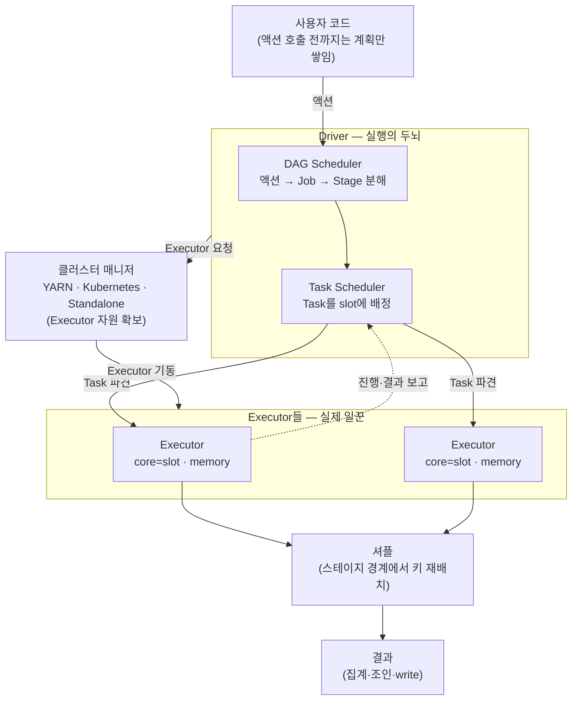
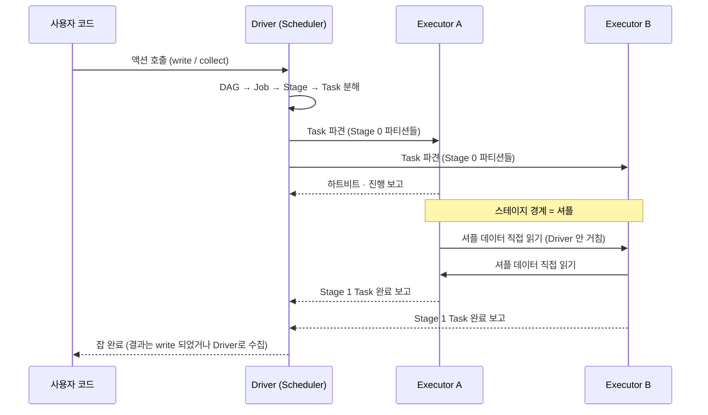
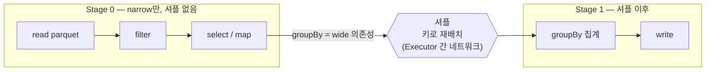
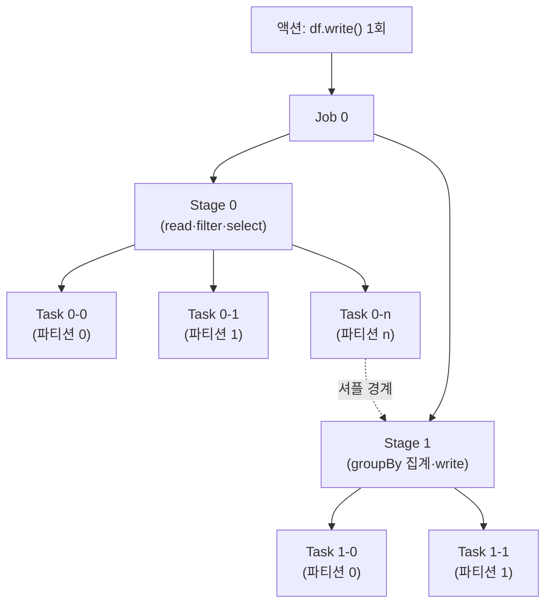

<figure class="post-figure post-figure--header">
<svg role="img" aria-label="Spark 실행 구조를 한 장으로 정리한 그림. 위쪽은 실행 파이프라인으로, 왼쪽의 사용자 코드가 화살표로 가운데 Driver 상자에 들어간다. Driver 상자 안에는 작은 DAG 그래프와 '실행 계획 수립·스케줄링'이라는 표시가 있다. Driver에서 세 개의 Executor 상자로 task 파견 화살표가 뻗고, 각 Executor 안에는 여러 개의 task 슬롯 사각형이 들어 있다. Executor들 사이에는 점선 경계로 표시된 셔플 구간이 있어 키가 재배치되고, 그 오른쪽의 결과 테이블로 화살표가 모인다. 아래쪽은 실행 분해 계층으로, 하나의 액션이 Job으로, Job이 두 개의 Stage로, 각 Stage가 여러 Task로 갈라지는 트리이며, Stage와 Stage 사이 경계에 '셔플'이라는 라벨이 붙어 있다." viewBox="0 0 680 350" xmlns="http://www.w3.org/2000/svg">
  <title>Spark 아키텍처 — 사용자 코드가 Driver(DAG)를 거쳐 Executor들의 task로 나뉘고, 스테이지 경계의 셔플을 지나 결과로 모인다</title>
  <defs>
    <marker id="spk-a1-arrow" viewBox="0 0 10 10" refX="8" refY="5" markerWidth="6" markerHeight="6" orient="auto-start-reverse">
      <path d="M0,0 L10,5 L0,10 z" fill="var(--secondary-color)"/>
    </marker>
    <marker id="spk-a1-gold" viewBox="0 0 10 10" refX="8" refY="5" markerWidth="6" markerHeight="6" orient="auto-start-reverse">
      <path d="M0,0 L10,5 L0,10 z" fill="var(--gold)"/>
    </marker>
  </defs>

  <!-- title -->
  <text x="340" y="24" text-anchor="middle" font-size="17" font-weight="800" fill="currentColor" letter-spacing="1.5">SPARK 실행 구조</text>
  <text x="340" y="44" text-anchor="middle" font-size="10.5" font-weight="700" fill="currentColor" opacity="0.72">Driver가 세우고 · Executor가 나눠 수행하고 · 셔플로 다시 모은다</text>

  <!-- ===== SECTION A: pipeline ===== -->
  <!-- user code -->
  <rect x="20" y="70" width="88" height="40" rx="4" fill="var(--bg-panel)" stroke="currentColor" stroke-width="2"/>
  <text x="64" y="88" text-anchor="middle" font-size="9.5" font-weight="700" fill="currentColor">사용자 코드</text>
  <text x="64" y="102" text-anchor="middle" font-size="8" fill="currentColor" opacity="0.7">df.groupBy()...</text>

  <!-- arrow code -> driver -->
  <line x1="108" y1="90" x2="140" y2="90" stroke="var(--secondary-color)" stroke-width="2" marker-end="url(#spk-a1-arrow)"/>

  <!-- Driver -->
  <rect x="144" y="60" width="118" height="90" rx="5" fill="var(--bg-light)" stroke="currentColor" stroke-width="2.5"/>
  <text x="203" y="78" text-anchor="middle" font-size="12.5" font-weight="800" fill="currentColor">Driver</text>
  <!-- mini DAG inside driver -->
  <g opacity="0.65">
    <line x1="172" y1="104" x2="203" y2="120" stroke="currentColor" stroke-width="1.5"/>
    <line x1="203" y1="120" x2="234" y2="104" stroke="currentColor" stroke-width="1.5"/>
    <line x1="172" y1="104" x2="234" y2="104" stroke="currentColor" stroke-width="1.5"/>
    <circle cx="172" cy="104" r="4.5" fill="var(--bg-panel)" stroke="currentColor" stroke-width="1.5"/>
    <circle cx="203" cy="120" r="4.5" fill="var(--bg-panel)" stroke="currentColor" stroke-width="1.5"/>
    <circle cx="234" cy="104" r="4.5" fill="var(--bg-panel)" stroke="currentColor" stroke-width="1.5"/>
  </g>
  <text x="203" y="142" text-anchor="middle" font-size="8.5" fill="currentColor" opacity="0.75">실행 계획 수립 · 스케줄링</text>

  <!-- Driver -> Executors -->
  <g stroke="var(--secondary-color)" stroke-width="2" fill="none">
    <line x1="262" y1="86" x2="316" y2="70" marker-end="url(#spk-a1-arrow)"/>
    <line x1="262" y1="105" x2="316" y2="118" marker-end="url(#spk-a1-arrow)"/>
    <line x1="262" y1="124" x2="316" y2="166" marker-end="url(#spk-a1-arrow)"/>
  </g>
  <text x="290" y="60" text-anchor="middle" font-size="7.5" fill="currentColor" opacity="0.7">task 파견</text>

  <!-- Executors -->
  <g>
    <rect x="320" y="56" width="104" height="34" rx="3" fill="var(--bg-light)" stroke="currentColor" stroke-width="2"/>
    <rect x="320" y="104" width="104" height="34" rx="3" fill="var(--bg-light)" stroke="currentColor" stroke-width="2"/>
    <rect x="320" y="152" width="104" height="34" rx="3" fill="var(--bg-light)" stroke="currentColor" stroke-width="2"/>
  </g>
  <g font-size="9.5" font-weight="700" fill="currentColor" text-anchor="start">
    <text x="328" y="70">Executor</text>
    <text x="328" y="118">Executor</text>
    <text x="328" y="166">Executor</text>
  </g>
  <!-- task slots -->
  <g fill="var(--bg-panel)" stroke="currentColor" stroke-width="1.1" opacity="0.85">
    <rect x="382" y="62" width="9" height="9" rx="1"/><rect x="396" y="62" width="9" height="9" rx="1"/><rect x="410" y="62" width="9" height="9" rx="1"/>
    <rect x="382" y="110" width="9" height="9" rx="1"/><rect x="396" y="110" width="9" height="9" rx="1"/><rect x="410" y="110" width="9" height="9" rx="1"/>
    <rect x="382" y="158" width="9" height="9" rx="1"/><rect x="396" y="158" width="9" height="9" rx="1"/><rect x="410" y="158" width="9" height="9" rx="1"/>
  </g>
  <text x="372" y="200" text-anchor="middle" font-size="8" fill="currentColor" opacity="0.72">slot = core 1개 = task 1개</text>

  <!-- shuffle zone -->
  <text x="484" y="52" text-anchor="middle" font-size="9.5" font-weight="700" fill="currentColor" opacity="0.82">셔플 · 키 재배치</text>
  <g stroke="currentColor" stroke-width="0.9" opacity="0.28" stroke-dasharray="2 3">
    <line x1="440" y1="60" x2="440" y2="186"/>
    <line x1="536" y1="60" x2="536" y2="186"/>
  </g>
  <g stroke="var(--gold)" stroke-width="1.5" opacity="0.6" fill="none">
    <line x1="428" y1="73" x2="536" y2="169"/>
    <line x1="428" y1="73" x2="536" y2="121"/>
    <line x1="428" y1="121" x2="536" y2="121"/>
    <line x1="428" y1="169" x2="536" y2="73"/>
    <line x1="428" y1="169" x2="536" y2="121"/>
  </g>

  <!-- shuffle -> result -->
  <g stroke="var(--secondary-color)" stroke-width="2" fill="none">
    <line x1="536" y1="73" x2="554" y2="105" marker-end="url(#spk-a1-arrow)"/>
    <line x1="536" y1="121" x2="554" y2="121" marker-end="url(#spk-a1-arrow)"/>
    <line x1="536" y1="169" x2="554" y2="137" marker-end="url(#spk-a1-arrow)"/>
  </g>

  <!-- result -->
  <rect x="558" y="82" width="104" height="78" rx="4" fill="var(--bg-panel)" stroke="var(--gold)" stroke-width="2.5"/>
  <text x="610" y="102" text-anchor="middle" font-size="12" font-weight="700" fill="currentColor">결과</text>
  <g stroke="currentColor" stroke-width="1.1" opacity="0.4">
    <line x1="574" y1="116" x2="646" y2="116"/>
    <line x1="574" y1="130" x2="646" y2="130"/>
    <line x1="574" y1="144" x2="646" y2="144"/>
    <line x1="610" y1="110" x2="610" y2="150"/>
  </g>
  <text x="610" y="176" text-anchor="middle" font-size="8" fill="currentColor" opacity="0.75">집계·조인 완료</text>

  <!-- ===== divider ===== -->
  <line x1="30" y1="216" x2="650" y2="216" stroke="currentColor" stroke-width="1.4" opacity="0.25"/>

  <!-- ===== SECTION B: action -> job -> stage -> task ===== -->
  <text x="340" y="238" text-anchor="middle" font-size="10.5" font-weight="700" fill="currentColor" opacity="0.72">하나의 액션이 Job → Stage → Task로 쪼개진다</text>

  <!-- action -->
  <rect x="286" y="252" width="108" height="26" rx="4" fill="var(--bg-panel)" stroke="var(--gold)" stroke-width="2"/>
  <text x="340" y="269" text-anchor="middle" font-size="10" font-weight="800" fill="currentColor">액션 (write)</text>

  <!-- action -> job -->
  <line x1="340" y1="278" x2="340" y2="292" stroke="var(--secondary-color)" stroke-width="2" marker-end="url(#spk-a1-arrow)"/>

  <!-- job -->
  <rect x="296" y="294" width="88" height="24" rx="4" fill="var(--bg-light)" stroke="var(--secondary-color)" stroke-width="2"/>
  <text x="340" y="310" text-anchor="middle" font-size="9.5" font-weight="700" fill="currentColor">Job</text>

  <!-- job -> stages -->
  <g stroke="var(--secondary-color)" stroke-width="2" fill="none">
    <line x1="320" y1="318" x2="190" y2="330" marker-end="url(#spk-a1-arrow)"/>
    <line x1="360" y1="318" x2="490" y2="330" marker-end="url(#spk-a1-arrow)"/>
  </g>

  <!-- stage 1 -->
  <rect x="120" y="330" width="132" height="16" rx="3" fill="var(--bg-panel)" stroke="currentColor" stroke-width="1.6"/>
  <text x="186" y="342" text-anchor="middle" font-size="8.5" font-weight="700" fill="currentColor">Stage 0 (narrow)</text>
  <!-- stage 2 -->
  <rect x="428" y="330" width="132" height="16" rx="3" fill="var(--bg-panel)" stroke="currentColor" stroke-width="1.6"/>
  <text x="494" y="342" text-anchor="middle" font-size="8.5" font-weight="700" fill="currentColor">Stage 1 (셔플 후)</text>

  <!-- shuffle boundary between stages -->
  <line x1="256" y1="338" x2="424" y2="338" stroke="var(--gold)" stroke-width="2" stroke-dasharray="5 4" marker-end="url(#spk-a1-gold)" marker-start="url(#spk-a1-gold)"/>
  <text x="340" y="332" text-anchor="middle" font-size="8.5" font-weight="800" fill="var(--gold)">셔플 경계</text>

  <!-- task dots under each stage -->
  <g fill="var(--bg-light)" stroke="var(--secondary-color)" stroke-width="1.4">
    <circle cx="150" cy="330" r="3"/><circle cx="186" cy="330" r="3"/><circle cx="222" cy="330" r="3"/>
    <circle cx="458" cy="330" r="3"/><circle cx="494" cy="330" r="3"/><circle cx="530" cy="330" r="3"/>
  </g>
  <text x="186" y="322" text-anchor="middle" font-size="7.5" fill="currentColor" opacity="0.7">Task = 파티션 1개</text>
  <text x="494" y="322" text-anchor="middle" font-size="7.5" fill="currentColor" opacity="0.7">Task = 파티션 1개</text>
</svg>
<figcaption>이 글을 한 장으로 — 사용자 코드가 Driver에서 DAG로 세워져 Executor들의 task로 파견되고, 스테이지 경계의 셔플에서 키가 재배치된 뒤 결과로 모인다. 아래는 액션 하나가 Job → Stage → Task로 분해되는 모습</figcaption>
</figure>

## 들어가며

Spark를 "돌아가게" 만드는 것과 "빠르고 안정적으로" 만드는 것은 다른 문제입니다. 그리고 후자는 예외 없이 이 질문에서 출발합니다 — **내가 쓴 이 한 줄이 클러스터 어디에서, 어떻게 쪼개져 실행되는가?** Spark 잡이 느리다고 느껴질 때, OOM으로 죽을 때, Spark UI를 열었는데 무슨 그림인지 읽히지 않을 때, 결국 돌아오는 곳은 실행 구조입니다. 이 글은 그 구조를 손에 잡히게 그리는 데 전부를 씁니다.

이 글은 [Spark Essential Curriculum](/2026/07/12/spark-essential-curriculum.html)의 **1단계**이자 시리즈 전체의 토대입니다. 이 `Spark-Essential` 시리즈는 `Data-Engineering-Essential` 오버뷰의 [데이터 변환·처리(Processing)](/2026/06/25/data-processing.html)에서 "왜 MapReduce에서 Spark로 넘어왔는가"의 큰 틀을 잡은 뒤 갈라져 나온 심화 스핀오프입니다. 오버뷰에서 Driver/Executor를 스케치했다면, 여기서는 그 구조가 **자원 배분·통신·실행 분해**의 수준에서 어떻게 작동하는지를 파고듭니다.

여기서 세우는 그림 — Driver/Executor, 클러스터 매니저, 그리고 Job/Stage/Task 분해 — 은 이후 모든 단계가 얹히는 좌표계입니다. 다음 단계인 [2단계 — RDD/DataFrame/Dataset](/2026/07/16/spark-rdd-dataframe-dataset.html)의 lazy evaluation도, [3단계 — Catalyst·Tungsten](/2026/07/16/spark-catalyst-tungsten-aqe.html)의 최적화도, [4단계 — 셔플·튜닝](/2026/07/16/spark-shuffle-partitioning-tuning.html)의 성능 문제도 전부 "이 코드가 어떤 stage로 쪼개져 어느 executor에서 도는가"를 읽을 수 있어야 손에 잡힙니다.

<div class="post-summary-box" markdown="1">

### 📌 이 글에서 다루는 내용

- **Driver와 Executor**: 실행 계획(DAG)을 세우는 두뇌 Driver와 실제 task를 수행하는 Executor, 둘의 통신(스케줄링·task 파견·결과 수집·셔플 데이터 교환), SparkSession/SparkContext, executor의 core·memory 슬롯 모델
- **클러스터 매니저**: YARN·Kubernetes·Standalone의 자원 배분 역할, deploy mode client vs cluster(Driver가 어디서 도는가)의 차이와 선택 기준, `spark-submit`이 실제로 무엇을 요청하는가
- **실행 흐름**: 액션 → Job → Stage → Task 분해, narrow/wide 의존성과 **스테이지 경계 = 셔플 지점**의 관계, lazy evaluation이 왜 이 분해를 가능케 하는지, Spark UI에서 이 구조가 어떻게 보이는지

</div>

## 한눈에 보기 — 코드 한 줄에서 클러스터 실행까지

이 글의 스파인을 한 장으로 그리면 이렇습니다. 사용자 코드는 Driver에서 논리 계획을 거쳐 물리적 실행 계획(DAG)이 되고, 클러스터 매니저가 확보해 준 Executor들 위로 task가 파견됩니다. 스테이지 경계에서 셔플이 일어나 키가 재배치되고, 각 task의 결과가 다시 모여 최종 결과가 됩니다.



세 덩어리를 기억해 두세요 — **Driver(계획·스케줄링), 클러스터 매니저(자원 확보), Executor(실행)**. 이 글은 이 세 덩어리를 차례로 파고든 뒤, 마지막으로 "액션 하나가 어떻게 Job·Stage·Task로 쪼개지는가"라는 실행 분해로 이 그림을 완성합니다.

## Driver와 Executor — 두뇌와 일꾼

### 왜 역할을 둘로 나누는가

대용량 데이터를 한 대의 기계로 처리할 수 없기에, Spark의 발상은 단순합니다 — **데이터를 조각내 여러 기계에 나눠 처리한다.** 그런데 "누가 무엇을 언제 처리할지 정하는 역할"과 "실제로 데이터를 붙들고 계산하는 역할"을 한 곳에 두면, 조율과 계산이 서로를 방해합니다. 그래서 Spark는 이 둘을 명확히 가릅니다.

- **Driver**는 프로그램의 `main()`이 도는 곳이자 실행의 **두뇌**입니다. 사용자 코드를 실행 계획(DAG)으로 번역하고, 그것을 Stage와 Task로 쪼개며, 어느 Executor에 어떤 Task를 보낼지 스케줄링하고, Task들의 진행·결과를 수집합니다. 클러스터 전체에 Driver는 **단 하나**입니다.
- **Executor**는 클러스터의 각 워커 노드에서 도는 JVM 프로세스이자 **일꾼**입니다. Driver가 보낸 Task를 실제로 실행하고, 자기가 처리하는 데이터 파티션을 메모리·디스크에 들고 있으며(캐시·셔플 데이터 포함), 결과를 Driver에 보고합니다. Executor는 잡 하나에 **여럿**입니다.

이 분업의 함의는 큽니다. 무거운 계산은 전부 Executor에서 병렬로 벌어지고, Driver는 조율에 집중합니다. 반대로 이 경계를 어기면 — 예컨대 거대한 결과를 `collect()`로 전부 Driver에 끌어오면 — 두뇌 한 대에 클러스터 전체의 데이터가 쏟아져 Driver가 OOM으로 죽습니다. "무엇이 Driver에서 돌고 무엇이 Executor에서 도는가"를 아는 것은 그래서 안정성의 문제이기도 합니다.

### SparkSession과 SparkContext — Driver의 입구

사용자 코드에서 Spark로 들어가는 문은 **SparkSession**입니다(내부적으로 **SparkContext**를 품습니다). 이 객체가 곧 Driver의 표상입니다 — 이것을 만드는 순간 Driver가 클러스터 매니저에 자원을 요청하고 Executor들을 확보하기 시작합니다.

```python
from pyspark.sql import SparkSession

# SparkSession 생성 = Driver의 시작. 여기서 클러스터 매니저에 Executor를 요청한다.
spark = (
    SparkSession.builder
    .appName("daily-order-stats")
    .config("spark.executor.instances", "3")      # Executor 3대
    .config("spark.executor.cores", "4")          # Executor당 core(=slot) 4개
    .config("spark.executor.memory", "8g")        # Executor당 힙 메모리 8GB
    .getOrCreate()
)

# 이 시점부터 df에 쌓는 변환들은 "계획"일 뿐, 아직 클러스터에서 아무 일도 일어나지 않는다.
df = spark.read.parquet("s3://warehouse/orders/")
daily = df.groupBy("order_date").sum("amount")

# 액션(write)이 호출되어야 비로소 Driver가 Job을 만들고 Executor에 task를 파견한다.
daily.write.parquet("s3://warehouse/daily_order_stats/")
```

핵심은 `read`·`groupBy`는 아무것도 실행하지 않는다는 것입니다. 이것들은 Driver 안에서 실행 계획을 쌓을 뿐이고, `write` 같은 **액션**이 호출되어야 Driver가 그 계획을 Job으로 만들어 Executor에 내려보냅니다. 이 lazy evaluation이 왜 실행 분해를 가능케 하는지는 이 글 마지막에서 다룹니다(자세한 변환/액션 구분은 [2단계](/2026/07/16/spark-rdd-dataframe-dataset.html)에서).

### Executor의 내부 — core는 slot, memory는 작업 공간

Executor 한 대의 처리 능력은 두 자원으로 정해집니다.

- **core (slot)**: Executor에 배정된 core 하나가 곧 **task 하나를 동시에 실행하는 슬롯**입니다. `spark.executor.cores=4`면 그 Executor는 최대 4개의 task를 병렬로 돌립니다. 클러스터 전체의 동시 task 수 = (Executor 수) × (Executor당 core 수)이고, 이것이 곧 그 잡의 **병렬성 상한**입니다.
- **memory**: Executor 힙은 크게 두 몫으로 갈립니다 — 셔플·집계·정렬·조인 중간 데이터가 쓰는 **실행(execution) 메모리**와, `cache()`/`persist()`한 데이터가 머무는 **저장(storage) 메모리**. 이 둘은 통합 메모리 관리(unified memory) 아래서 서로 밀고 당기며, 부족하면 디스크로 흘러넘칩니다(spill — [4단계](/2026/07/16/spark-shuffle-partitioning-tuning.html)의 주제).

<figure class="post-figure">
<svg role="img" aria-label="Executor 한 대의 내부 구조를 그린 개념도. 큰 Executor 상자 안에 왼쪽에는 core 슬롯 네 개가 세로로 놓여 있고, 각 슬롯 안에 현재 실행 중인 task가 한 개씩 들어가 최대 네 개의 task가 동시에 도는 것을 보여 준다. 오른쪽에는 힙 메모리가 두 칸으로 나뉘어, 위쪽은 셔플·정렬·집계 중간 데이터가 쓰는 실행 메모리, 아래쪽은 cache가 머무는 저장 메모리로 표시되고 둘 사이에 서로 밀고 당기는 양방향 화살표가 있다. 상자 아래에는 '동시 task 수 = core 수'라는 원칙이 적혀 있다." viewBox="0 0 680 280" xmlns="http://www.w3.org/2000/svg">
  <title>Executor 한 대의 내부 — core 슬롯(동시 task 수)과 힙 메모리(실행/저장)</title>

  <text x="340" y="26" text-anchor="middle" font-size="15" font-weight="800" fill="currentColor">Executor 한 대의 내부</text>

  <!-- executor box -->
  <rect x="40" y="48" width="600" height="182" rx="8" fill="var(--bg-light)" stroke="currentColor" stroke-width="2.5"/>
  <text x="60" y="72" font-size="11" font-weight="800" fill="currentColor">Executor (워커 노드의 JVM 프로세스)</text>

  <!-- LEFT: core slots -->
  <text x="170" y="96" text-anchor="middle" font-size="10" font-weight="700" fill="var(--secondary-color)">core = slot — 동시에 도는 task 수</text>
  <g>
    <rect x="72" y="106" width="196" height="26" rx="3" fill="var(--bg-panel)" stroke="var(--secondary-color)" stroke-width="2"/>
    <rect x="72" y="138" width="196" height="26" rx="3" fill="var(--bg-panel)" stroke="var(--secondary-color)" stroke-width="2"/>
    <rect x="72" y="170" width="196" height="26" rx="3" fill="var(--bg-panel)" stroke="var(--secondary-color)" stroke-width="2"/>
    <rect x="72" y="202" width="196" height="26" rx="3" fill="var(--bg-panel)" stroke="var(--secondary-color)" stroke-width="2"/>
  </g>
  <g font-size="9" font-weight="700" fill="currentColor" text-anchor="start">
    <text x="84" y="123">core 0 · task: filter(part-3)</text>
    <text x="84" y="155">core 1 · task: filter(part-7)</text>
    <text x="84" y="187">core 2 · task: filter(part-9)</text>
    <text x="84" y="219">core 3 · task: filter(part-12)</text>
  </g>

  <!-- RIGHT: memory -->
  <text x="470" y="96" text-anchor="middle" font-size="10" font-weight="700" fill="var(--accent-color)">힙 메모리 (통합 관리)</text>
  <rect x="332" y="106" width="276" height="52" rx="4" fill="var(--bg-panel)" stroke="var(--accent-color)" stroke-width="2"/>
  <text x="470" y="128" text-anchor="middle" font-size="10" font-weight="700" fill="currentColor">실행(execution) 메모리</text>
  <text x="470" y="146" text-anchor="middle" font-size="8" fill="currentColor" opacity="0.72">셔플 · 정렬 · 집계 · 조인 중간 데이터</text>

  <rect x="332" y="176" width="276" height="52" rx="4" fill="var(--bg-panel)" stroke="var(--gold)" stroke-width="2"/>
  <text x="470" y="198" text-anchor="middle" font-size="10" font-weight="700" fill="currentColor">저장(storage) 메모리</text>
  <text x="470" y="216" text-anchor="middle" font-size="8" fill="currentColor" opacity="0.72">cache() · persist() 한 파티션</text>

  <!-- push-pull arrow between the two memory regions -->
  <g stroke="currentColor" stroke-width="2" opacity="0.65" fill="none">
    <line x1="312" y1="150" x2="312" y2="184"/>
  </g>
  <text x="470" y="250" text-anchor="middle" font-size="9" font-weight="700" fill="currentColor" opacity="0.8">부족하면 서로 밀고 당기고, 그래도 모자라면 디스크로 spill</text>
</svg>
<figcaption>Executor의 능력은 core 수(동시 task 수 = 병렬성)와 힙 메모리(실행/저장이 통합 관리되며 부족 시 디스크로 spill)로 정해진다</figcaption>
</figure>

이 슬롯 모델이 실무 감각의 출발점입니다. 입력이 200개 파티션인데 클러스터 전체 slot이 24개(Executor 3대 × core 8개)라면, 200개 task가 24개씩 물결처럼 실행됩니다. slot이 남아도는데 파티션이 적으면 놀고, 파티션이 slot보다 훨씬 많으면 스케줄링 오버헤드가 늡니다 — "파티션 수를 slot에 맞춘다"가 [4단계](/2026/07/16/spark-shuffle-partitioning-tuning.html) 튜닝의 기본기인 이유입니다.

### 둘의 통신 — 무엇이 오가는가

Driver와 Executor 사이에는 잡이 도는 내내 네 종류의 통신이 흐릅니다.

1. **Task 파견**: Driver의 Task Scheduler가 직렬화한 task(코드 + 처리할 파티션 정보)를 Executor의 빈 slot으로 보냅니다.
2. **하트비트·진행 보고**: Executor는 주기적으로 살아 있음과 task 진행 상황을 Driver에 보고합니다. 하트비트가 끊기면 Driver는 그 Executor를 잃은 것으로 보고 task를 다른 곳에 재배정합니다.
3. **결과 수집**: task 결과는 (작으면) Driver로 직접 보내지거나, (크면) Executor에 남겨 두고 위치만 Driver에 알립니다. `collect()`가 위험한 이유가 여기 있습니다 — 모든 결과를 Driver 메모리로 끌어오기 때문입니다.
4. **셔플 데이터 교환**: 이것만은 **Driver를 거치지 않습니다.** 셔플이 일어나면 Executor들이 서로에게서 직접 데이터를 읽어 갑니다(Driver는 "누가 어디에 무엇을 썼는가"라는 맵만 관리). 셔플이 비싼 이유 — Executor 간 네트워크 전송과 디스크 I/O — 가 바로 이 지점입니다.



## 클러스터 매니저 — 자원을 누가 배분하는가

### 클러스터 매니저의 자리

Driver는 "task를 어느 Executor에 보낼지"는 스스로 정하지만, "애초에 Executor를 몇 대, 어느 노드에 띄울지"는 스스로 하지 못합니다. 클러스터의 CPU·메모리라는 물리 자원을 쥐고 배분하는 것은 **클러스터 매니저**의 몫입니다. Driver가 "Executor 3대, 각 4 core·8GB가 필요하다"고 요청하면, 클러스터 매니저가 클러스터의 여유 자원에서 그만큼을 떼어 컨테이너로 Executor 프로세스를 기동해 줍니다.

Spark는 특정 매니저에 묶여 있지 않고, 같은 애플리케이션 코드를 여러 매니저 위에서 돌릴 수 있게 설계되어 있습니다. 대표적인 세 가지입니다.

| 클러스터 매니저 | 성격 | 어울리는 자리 |
| --- | --- | --- |
| **Standalone** | Spark에 내장된 단순 매니저. 마스터/워커만 띄우면 됨 | 전용 Spark 클러스터, 학습·소규모 |
| **YARN** | Hadoop 생태계의 자원 관리자 | 기존 Hadoop/HDFS 위, 온프레미스 데이터 플랫폼 |
| **Kubernetes** | 컨테이너 오케스트레이터. Executor가 곧 파드(Pod) | 클라우드 네이티브, 컨테이너로 통일된 인프라 |

셋의 인터페이스는 Spark 입장에서 거의 같습니다 — "자원을 요청하면 Executor를 띄워 준다." 그래서 매니저 선택은 대개 성능보다 **조직의 인프라가 이미 무엇을 쓰는가**로 결정됩니다. 최근 신규 구축은 Kubernetes로 기우는 추세이고(Executor를 파드로 관리해 다른 워크로드와 인프라를 통일), 기존 Hadoop 자산이 있으면 YARN이, 순수 Spark 전용 클러스터면 Standalone이 자연스럽습니다. (Mesos는 지원이 사실상 저물었습니다.)

### deploy mode — Driver는 어디서 도는가

매니저 선택만큼 실무에서 자주 헷갈리는 것이 **deploy mode**입니다. 이건 "Executor가 어디서 도는가"가 아니라 **"Driver가 어디서 도는가"**의 문제입니다. Executor는 어느 모드든 클러스터 안에서 돕니다.

- **client 모드**: Driver가 **잡을 제출한 그 기계**(예: 여러분의 노트북, 엣지 노드, 노트북 서버)에서 돕니다. 클러스터 매니저는 Executor만 클러스터에 띄우고, 그 Executor들이 클러스터 밖에 있는 Driver와 통신합니다. 제출한 콘솔에 로그와 결과가 바로 뜨므로 **대화형·디버깅·개발**에 좋습니다. 단, 제출한 기계가 꺼지거나 네트워크가 끊기면 잡 전체가 죽고, 그 기계와 클러스터가 네트워크로 가까워야(지연이 낮아야) 합니다.
- **cluster 모드**: Driver도 **클러스터 안의 한 노드**(컨테이너/파드)에서 돕니다. 제출한 기계는 잡을 던진 뒤 빠져도 됩니다. 제출 클라이언트로부터 독립적이고 안정적이라 **프로덕션·스케줄된 배치·장기 실행 잡**의 기본값입니다. 대신 로그를 보려면 클러스터의 로그 수집(YARN 로그, `kubectl logs` 등)을 거쳐야 합니다.

<figure class="post-figure">
<svg role="img" aria-label="deploy mode의 client와 cluster를 좌우로 대비한 개념도. 왼쪽 패널은 client 모드로, 제출한 기계(클러스터 바깥) 안에 Driver가 놓여 있고 점선으로 클러스터 경계를 넘어 클러스터 안의 Executor 두 대와 통신 화살표로 연결된다. 오른쪽 패널은 cluster 모드로, 제출한 기계는 잡을 던지고 빠지며 클러스터 안에 Driver와 Executor 두 대가 모두 들어 있어 Driver-Executor 통신이 클러스터 내부에서 완결된다. 아래에는 client는 개발·대화형, cluster는 프로덕션·배치라는 요약이 적혀 있다." viewBox="0 0 680 300" xmlns="http://www.w3.org/2000/svg">
  <title>deploy mode — client(Driver는 제출 기계에)와 cluster(Driver도 클러스터 안에)</title>
  <defs>
    <marker id="spk-dm-arrow" viewBox="0 0 10 10" refX="8" refY="5" markerWidth="6" markerHeight="6" orient="auto-start-reverse">
      <path d="M0,0 L10,5 L0,10 z" fill="var(--secondary-color)"/>
    </marker>
  </defs>

  <text x="340" y="24" text-anchor="middle" font-size="15" font-weight="800" fill="currentColor">deploy mode — Driver는 어디서 도는가</text>

  <!-- ===== LEFT: client mode ===== -->
  <text x="174" y="50" text-anchor="middle" font-size="12" font-weight="800" fill="var(--secondary-color)">client 모드</text>

  <!-- submit machine (outside cluster) -->
  <rect x="24" y="62" width="120" height="66" rx="5" fill="var(--bg-panel)" stroke="currentColor" stroke-width="2"/>
  <text x="84" y="80" text-anchor="middle" font-size="8.5" fill="currentColor" opacity="0.72">제출한 기계 (클러스터 밖)</text>
  <rect x="40" y="88" width="88" height="30" rx="3" fill="var(--bg-light)" stroke="var(--secondary-color)" stroke-width="2.5"/>
  <text x="84" y="107" text-anchor="middle" font-size="11" font-weight="800" fill="currentColor">Driver</text>

  <!-- cluster boundary -->
  <rect x="164" y="58" width="152" height="180" rx="6" fill="none" stroke="currentColor" stroke-width="1.6" stroke-dasharray="5 4" opacity="0.6"/>
  <text x="240" y="74" text-anchor="middle" font-size="8.5" fill="currentColor" opacity="0.7">클러스터</text>
  <rect x="182" y="88" width="116" height="30" rx="3" fill="var(--bg-light)" stroke="currentColor" stroke-width="2"/>
  <text x="240" y="107" text-anchor="middle" font-size="9.5" font-weight="700" fill="currentColor">Executor</text>
  <rect x="182" y="128" width="116" height="30" rx="3" fill="var(--bg-light)" stroke="currentColor" stroke-width="2"/>
  <text x="240" y="147" text-anchor="middle" font-size="9.5" font-weight="700" fill="currentColor">Executor</text>

  <!-- driver <-> executors across boundary -->
  <g stroke="var(--secondary-color)" stroke-width="2" fill="none">
    <line x1="128" y1="100" x2="180" y2="103" marker-end="url(#spk-dm-arrow)"/>
    <line x1="128" y1="110" x2="180" y2="140" marker-end="url(#spk-dm-arrow)"/>
  </g>
  <text x="174" y="188" text-anchor="middle" font-size="8" fill="currentColor" opacity="0.72">Driver가 경계 밖에서 통신</text>
  <text x="174" y="212" text-anchor="middle" font-size="9" font-weight="700" fill="var(--secondary-color)">개발 · 대화형 · 디버깅</text>
  <text x="174" y="228" text-anchor="middle" font-size="8" fill="currentColor" opacity="0.7">제출 기계 죽으면 잡도 죽음</text>

  <!-- divider -->
  <line x1="340" y1="44" x2="340" y2="252" stroke="currentColor" stroke-width="1.2" opacity="0.25"/>

  <!-- ===== RIGHT: cluster mode ===== -->
  <text x="506" y="50" text-anchor="middle" font-size="12" font-weight="800" fill="var(--gold)">cluster 모드</text>

  <!-- submit machine (leaves) -->
  <rect x="364" y="62" width="120" height="52" rx="5" fill="var(--bg-panel)" stroke="currentColor" stroke-width="2" opacity="0.6"/>
  <text x="424" y="82" text-anchor="middle" font-size="8.5" fill="currentColor" opacity="0.7">제출한 기계</text>
  <text x="424" y="98" text-anchor="middle" font-size="8" fill="currentColor" opacity="0.6">잡 던지고 빠져도 됨</text>

  <!-- cluster boundary (holds driver + executors) -->
  <rect x="500" y="58" width="156" height="180" rx="6" fill="none" stroke="var(--gold)" stroke-width="1.6" stroke-dasharray="5 4" opacity="0.7"/>
  <text x="578" y="74" text-anchor="middle" font-size="8.5" fill="currentColor" opacity="0.7">클러스터</text>
  <rect x="516" y="84" width="124" height="30" rx="3" fill="var(--bg-light)" stroke="var(--gold)" stroke-width="2.5"/>
  <text x="578" y="103" text-anchor="middle" font-size="11" font-weight="800" fill="currentColor">Driver</text>
  <rect x="516" y="122" width="124" height="26" rx="3" fill="var(--bg-light)" stroke="currentColor" stroke-width="2"/>
  <text x="578" y="139" text-anchor="middle" font-size="9.5" font-weight="700" fill="currentColor">Executor</text>
  <rect x="516" y="154" width="124" height="26" rx="3" fill="var(--bg-light)" stroke="currentColor" stroke-width="2"/>
  <text x="578" y="171" text-anchor="middle" font-size="9.5" font-weight="700" fill="currentColor">Executor</text>

  <!-- submit -> cluster once -->
  <line x1="484" y1="88" x2="514" y2="96" stroke="currentColor" stroke-width="1.6" opacity="0.6" stroke-dasharray="4 3" marker-end="url(#spk-dm-arrow)"/>
  <!-- driver <-> execs inside -->
  <g stroke="var(--secondary-color)" stroke-width="2" fill="none">
    <line x1="578" y1="114" x2="578" y2="120" marker-end="url(#spk-dm-arrow)"/>
    <line x1="560" y1="114" x2="545" y2="152" marker-end="url(#spk-dm-arrow)"/>
  </g>
  <text x="578" y="200" text-anchor="middle" font-size="8" fill="currentColor" opacity="0.72">통신이 클러스터 안에서 완결</text>
  <text x="578" y="220" text-anchor="middle" font-size="9" font-weight="700" fill="var(--gold)">프로덕션 · 스케줄 배치</text>
</svg>
<figcaption>client 모드는 Driver가 제출한 기계(클러스터 밖)에서 돌아 대화형·디버깅에, cluster 모드는 Driver도 클러스터 안에서 돌아 제출 클라이언트로부터 독립적이라 프로덕션에 어울린다</figcaption>
</figure>

### spark-submit — 이 모든 것이 만나는 명령

지금까지의 개념 — 클러스터 매니저, deploy mode, Executor 자원 — 은 전부 `spark-submit` 한 줄의 인자로 모입니다.

```bash
spark-submit \
  --master k8s://https://k8s-api:6443 \   # 클러스터 매니저: yarn / k8s://... / spark://host:7077(standalone)
  --deploy-mode cluster \                  # Driver를 어디서 돌릴지: client | cluster
  --num-executors 3 \                      # Executor 몇 대 요청할지
  --executor-cores 4 \                     # Executor당 core(slot) 수 → 병렬성
  --executor-memory 8g \                   # Executor당 힙 메모리
  --driver-memory 4g \                     # Driver 메모리 (collect 결과가 여기 쌓인다)
  daily_order_stats.py                     # 실행할 애플리케이션
```

이 명령을 읽는 순서가 곧 지금까지의 이야기입니다 — `--master`로 **누가 자원을 배분할지**(클러스터 매니저)를 정하고, `--deploy-mode`로 **Driver가 어디서 돌지**를 정하며, `--num-executors`·`--executor-cores`·`--executor-memory`로 **일꾼을 얼마나 확보하고 병렬성을 얼마로 할지**를 정합니다. `--num-executors`를 고정하는 대신 **동적 할당**(`spark.dynamicAllocation.enabled=true`)으로 부하에 따라 Executor 수를 자동으로 늘렸다 줄이게 할 수도 있는데, 이는 [4단계](/2026/07/16/spark-shuffle-partitioning-tuning.html)에서 셔플·자원과 함께 다룹니다.

## 실행 흐름 — 액션 하나가 Job·Stage·Task로 쪼개진다

이제 이 글의 정점입니다. Driver·Executor·클러스터 매니저라는 배우가 다 모였으니, "코드 한 줄이 실제로 어떻게 쪼개져 실행되는가"라는 각본을 볼 차례입니다.

### lazy evaluation — 왜 나중에 실행하는 것이 이득인가

Spark의 변환(`select`·`filter`·`groupBy`·`join` …)은 호출 즉시 실행되지 않습니다. 대신 Driver 안에 **"무엇을 할지"의 계획(논리 계획)**으로 쌓이기만 하고, `write`·`collect`·`count` 같은 **액션**이 호출되는 순간 그 쌓인 계획 전체가 한꺼번에 실행됩니다. 이것이 **lazy evaluation**입니다.

늦게 실행하는 것이 왜 이득일까요? Spark가 액션 시점에 **계획 전체를 손에 쥐고** 있기 때문입니다. 전체를 보면 최적화할 수 있습니다 — 필요 없는 컬럼을 읽기 단계에서 쳐내고(컬럼 프루닝), 필터를 데이터 소스 쪽으로 밀어내고(predicate pushdown), 연속된 narrow 변환을 하나의 실행 단위로 합칩니다. 한 줄씩 즉시 실행했다면 이런 전역 최적화는 불가능합니다. 이 최적화를 담당하는 Catalyst 옵티마이저가 [3단계](/2026/07/16/spark-catalyst-tungsten-aqe.html)의 주제이고, 지금 중요한 것은 하나입니다 — **lazy 덕분에 Driver는 액션 시점에 전체 그림을 보고 실행 계획(DAG)을 짤 수 있다.**

### narrow와 wide — 스테이지 경계를 가르는 기준

DAG를 Stage로 쪼개는 유일한 기준은 변환의 **의존성 종류**입니다.

- **narrow 의존성**: 부모 파티션 하나가 자식 파티션 하나로만 흘러갑니다(`map`·`filter`·`select` 등). 데이터가 파티션 안에 머무므로 **노드 간 이동이 없고**, 여러 narrow 변환을 한 파티션 위에서 연속 실행할 수 있습니다.
- **wide 의존성**: 자식 파티션 하나를 만들려면 여러 부모 파티션의 데이터가 필요합니다(`groupBy`·`join`·`repartition`·`distinct` 등). 같은 키를 한곳에 모아야 하므로 **노드 간에 데이터를 재배치**해야 합니다 — 이것이 **셔플**입니다.

그리고 여기서 이 글의 한 문장짜리 결론이 나옵니다 — **wide 의존성이 있는 곳이 곧 스테이지 경계이고, 스테이지 경계가 곧 셔플 지점이다.** Spark는 셔플이 필요한 지점마다 DAG를 끊어 Stage를 나눕니다. 한 Stage 안은 전부 narrow 변환이라 셔플 없이 파이프라인처럼 흐르고, Stage와 Stage 사이에서만 셔플이 일어납니다.





`read → filter → select`까지는 각 파티션이 독립적으로 흐르므로 Stage 0 하나에 담기고, `groupBy`가 같은 키를 한곳에 모으려 셔플을 부르며 Stage 1이 시작됩니다. 셔플이 늘 가장 비싼 연산인 이유 — Executor 간 네트워크 전송 + 디스크 쓰기/읽기 — 는 앞서 통신 절에서 본 그대로입니다. 그래서 성능 튜닝의 대부분이 "셔플(=스테이지 경계)을 줄이거나 다스리는 일"로 귀결됩니다([4단계](/2026/07/16/spark-shuffle-partitioning-tuning.html)).

### 네 계층의 위계 — 액션 · Job · Stage · Task

전체 분해를 위계로 정리하면 이렇습니다.

- **액션(Action)**: 실행의 방아쇠. 액션 하나가 최소 **Job 하나**를 만듭니다("액션의 개수 ≈ Job의 개수"). `count()` 두 번 부르면 Job도 두 번 돕니다 — 그래서 재사용할 중간 결과는 `cache()`합니다.
- **Job**: 하나의 액션을 완수하기 위한 전체 작업. 여러 Stage로 이루어집니다.
- **Stage**: 셔플 경계로 잘린 작업 덩어리. 한 Stage 안은 전부 narrow 변환입니다. Stage 수 ≈ (셔플 횟수 + 1).
- **Task**: Stage를 이루는 실행의 최소 단위. **Stage의 Task 개수 = 그 Stage가 다루는 파티션 개수**이고, Task 하나가 파티션 하나를 처리해 slot에서 실행됩니다.



이 위계가 서면 앞서 Executor의 slot 모델과 곧장 맞물립니다 — Stage 0이 200개 파티션이면 Task 200개가 만들어지고, 클러스터 전체 slot이 24개면 이 200개가 24개씩 실행됩니다. "왜 이 Stage가 오래 걸리나"라는 질문은 곧 "이 Stage의 Task가 몇 개이고, 그중 오래 걸리는 Task가 있는가(스큐)"라는 질문이 됩니다.

### Spark UI에서 이 구조가 보인다

지금까지의 그림은 추상이 아니라 **Spark UI로 눈에 보이는 실체**입니다(기본 `http://<driver>:4040`). 잡을 하나 돌리고 UI를 열면 이 글의 개념들이 그대로 화면에 대응됩니다.

- **Jobs 탭**: 액션마다 하나씩 뜨는 Job의 목록. 각 Job이 몇 개의 Stage로 이뤄졌는지 보입니다.
- **Stages 탭**: Stage 목록과 각 Stage의 Task 수·소요 시간·읽고 쓴 데이터량. 특정 Stage에서 **Shuffle Read/Write** 수치가 크다면 거기가 이 글에서 말한 셔플 지점입니다.
- **DAG Visualization**: Job을 Stage들의 그래프로 그려 줍니다 — 정확히 앞의 flowchart 그림이 여기 나옵니다. Stage가 끊긴 자리가 셔플 경계입니다.
- **한 Stage의 Task들**: Task별 실행 시간 분포. 대부분 Task는 1초인데 하나가 100초라면 **데이터 스큐**입니다(한 키에 데이터가 쏠린 것 — [4단계](/2026/07/16/spark-shuffle-partitioning-tuning.html)).

```python
# UI를 잠깐 붙잡아 두고 실행 계획을 눈으로 확인하는 습관
df = spark.read.parquet("s3://warehouse/orders/")
daily = (
    df.filter("amount > 0")          # narrow
      .select("order_date", "amount") # narrow  → 여기까지 Stage 0
      .groupBy("order_date")          # wide (셔플!) → Stage 1 시작
      .sum("amount")
)

# explain()으로 물리 계획을 미리 본다: Exchange 노드가 곧 셔플 경계다
daily.explain(mode="formatted")

daily.write.parquet("s3://warehouse/daily/")   # 액션 → Job 실행, UI에 나타남
```

`explain()` 출력에서 **`Exchange`**라는 노드가 보이면 그 자리가 셔플이고, 곧 스테이지 경계입니다. "코드를 실행하기 전에 `explain()`으로 셔플이 몇 번 일어날지 세어 본다"는 습관이 Spark 성능 감각의 기본기입니다 — 이 습관의 근거가 바로 이 글에서 세운 실행 구조입니다.

## 정리

Spark 시리즈의 1층, 실행 구조를 다졌습니다. 요점을 정리하면 이렇습니다.

- **Driver는 두뇌, Executor는 일꾼이다**: Driver 하나가 사용자 코드를 DAG로 세우고 task를 스케줄링하며, 여러 Executor가 각 노드에서 task를 실제로 수행합니다. Executor의 능력은 core(=동시 task 수 = 병렬성)와 memory(실행/저장 통합 관리)로 정해집니다. `collect()`로 거대한 결과를 두뇌 한 대에 끌어오면 Driver가 죽는다는 것도 이 분업에서 따라옵니다.
- **둘의 통신은 네 가지 — 그중 셔플만 Driver를 안 거친다**: task 파견·하트비트·결과 수집은 Driver를 거치지만, 셔플 데이터는 Executor끼리 직접 주고받습니다. 셔플이 비싼 근본 이유가 여기 있습니다.
- **클러스터 매니저가 자원을 배분하고, deploy mode가 Driver의 위치를 정한다**: YARN·Kubernetes·Standalone은 Executor를 몇 대 어디에 띄울지를 담당하고(선택은 대개 조직의 기존 인프라를 따름), client 모드는 Driver를 제출 기계에(개발·대화형), cluster 모드는 클러스터 안에(프로덕션·배치) 둡니다. 이 모든 선택이 `spark-submit`의 인자로 모입니다.
- **액션 하나가 Job → Stage → Task로 쪼개진다**: lazy evaluation 덕에 Driver가 액션 시점에 전체 계획을 보고 DAG를 짜고, **wide 의존성(셔플)이 있는 곳마다 Stage가 갈립니다.** 스테이지 경계 = 셔플 지점 = 가장 비싼 곳이라는 등식이 이후 모든 튜닝의 출발점입니다. Task 개수는 곧 파티션 개수이고, 이것이 slot 모델과 맞물려 병렬성을 결정합니다.
- **이 구조는 Spark UI로 눈에 보인다**: Jobs·Stages 탭과 DAG Visualization, `explain()`의 `Exchange` 노드가 이 글의 개념들을 그대로 화면에 대응시킵니다. "느리다"를 "여기 셔플이 과하다 / 이 Stage에 스큐가 있다"로 읽는 안목이 여기서 시작됩니다.

이제 "무엇이 어디서 어떻게 실행되는가"의 골격이 손에 들어왔습니다. 다음 질문은 자연스럽게 이것입니다 — **Spark가 다루는 데이터 자체는 어떤 모습이고, 왜 어떤 API는 더 빠른가?** RDD·DataFrame·Dataset이라는 세 추상화와, 방금 본 lazy·narrow/wide를 코드 수준에서 다시 만나는 것이 다음 단계입니다.

### 다음 학습 (Next Learning)

- [RDD / DataFrame / Dataset: 핵심 추상화와 차이](/2026/07/16/spark-rdd-dataframe-dataset.html) — 2단계: Spark가 다루는 데이터의 세 얼굴과 lazy·narrow/wide를 코드로
- [Spark Essential Curriculum](/2026/07/12/spark-essential-curriculum.html) — 시리즈 로드맵으로 돌아가 진행 상황 확인하기
- [데이터 변환·처리(Processing): 배치·스트림 엔진과 SQL 변환](/2026/06/25/data-processing.html) — 이 시리즈가 갈라져 나온 오버뷰 5단계, Spark의 위치를 복습
