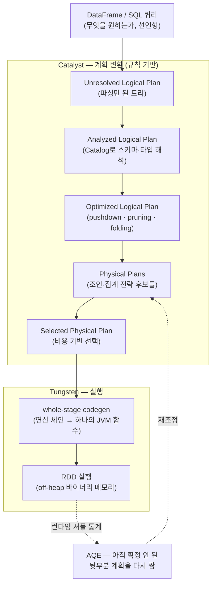

<figure class="post-figure post-figure--header">
<svg role="img" aria-label="Spark Catalyst와 Tungsten의 계획 변환 파이프라인을 한 장으로 정리한 그림. 위쪽 줄은 왼쪽에서 오른쪽으로, SQL/DataFrame 쿼리가 파싱되어 Unresolved 논리 계획이 되고, Catalog를 참조하는 분석 단계를 거쳐 Analyzed 논리 계획이 되며, 규칙 기반 최적화로 Optimized 논리 계획이 된다. 그 아래 줄은 오른쪽에서 왼쪽으로, Optimized 논리 계획에서 여러 물리 계획 후보가 생성되고 비용 기반으로 하나가 선택된 뒤, Tungsten의 whole-stage code generation이 그 물리 계획을 하나의 JVM 함수로 만들어 실행 코드(RDD)가 된다. 맨 아래에는 AQE가 런타임 셔플 통계를 보고 계획을 다시 짜는 되먹임 화살표가 금색 점선으로 그려져 있다." viewBox="0 0 680 340" xmlns="http://www.w3.org/2000/svg">
  <title>Catalyst · Tungsten — 쿼리가 네 겹의 계획을 거쳐 실행 코드가 되고, AQE가 런타임에 다시 짠다</title>
  <defs>
    <marker id="cat-arrow" viewBox="0 0 10 10" refX="8" refY="5" markerWidth="6" markerHeight="6" orient="auto-start-reverse">
      <path d="M0,0 L10,5 L0,10 z" fill="var(--secondary-color)"/>
    </marker>
    <marker id="cat-gold" viewBox="0 0 10 10" refX="8" refY="5" markerWidth="6" markerHeight="6" orient="auto-start-reverse">
      <path d="M0,0 L10,5 L0,10 z" fill="var(--gold)"/>
    </marker>
    <marker id="cat-acc" viewBox="0 0 10 10" refX="8" refY="5" markerWidth="6" markerHeight="6" orient="auto-start-reverse">
      <path d="M0,0 L10,5 L0,10 z" fill="var(--accent-color)"/>
    </marker>
  </defs>

  <!-- title -->
  <text x="340" y="22" text-anchor="middle" font-size="16" font-weight="800" fill="currentColor" letter-spacing="1">CATALYST · TUNGSTEN</text>
  <text x="340" y="40" text-anchor="middle" font-size="10" font-weight="700" fill="currentColor" opacity="0.72">쿼리 한 줄이 계획을 겹겹이 거쳐 실행 코드가 된다</text>

  <!-- ===== ROW A: logical planning (left to right) ===== -->
  <text x="30" y="60" text-anchor="start" font-size="10" font-weight="700" fill="var(--secondary-color)" opacity="0.85">Catalyst — 논리 계획 (규칙 기반)</text>

  <!-- box 1: query -->
  <rect x="24" y="68" width="96" height="46" rx="4" fill="var(--bg-light)" stroke="currentColor" stroke-width="2.5"/>
  <text x="72" y="88" text-anchor="middle" font-size="10" font-weight="800" fill="currentColor">SQL /</text>
  <text x="72" y="102" text-anchor="middle" font-size="10" font-weight="800" fill="currentColor">DataFrame</text>

  <!-- box 2: unresolved -->
  <rect x="160" y="68" width="96" height="46" rx="4" fill="var(--bg-light)" stroke="currentColor" stroke-width="2"/>
  <text x="208" y="88" text-anchor="middle" font-size="9" font-weight="700" fill="currentColor">Unresolved</text>
  <text x="208" y="102" text-anchor="middle" font-size="9" font-weight="700" fill="currentColor">Logical Plan</text>

  <!-- box 3: analyzed -->
  <rect x="296" y="68" width="96" height="46" rx="4" fill="var(--bg-light)" stroke="currentColor" stroke-width="2"/>
  <text x="344" y="88" text-anchor="middle" font-size="9" font-weight="700" fill="currentColor">Analyzed</text>
  <text x="344" y="102" text-anchor="middle" font-size="9" font-weight="700" fill="currentColor">Logical Plan</text>

  <!-- box 4: optimized -->
  <rect x="432" y="68" width="96" height="46" rx="4" fill="var(--bg-panel)" stroke="var(--secondary-color)" stroke-width="2.5"/>
  <text x="480" y="88" text-anchor="middle" font-size="9" font-weight="800" fill="currentColor">Optimized</text>
  <text x="480" y="102" text-anchor="middle" font-size="9" font-weight="800" fill="currentColor">Logical Plan</text>

  <!-- row A arrows -->
  <line x1="120" y1="91" x2="158" y2="91" stroke="var(--secondary-color)" stroke-width="2" marker-end="url(#cat-arrow)"/>
  <text x="139" y="84" text-anchor="middle" font-size="7.5" fill="currentColor" opacity="0.75">파싱</text>
  <line x1="256" y1="91" x2="294" y2="91" stroke="var(--secondary-color)" stroke-width="2" marker-end="url(#cat-arrow)"/>
  <text x="275" y="84" text-anchor="middle" font-size="7.5" fill="currentColor" opacity="0.75">분석</text>
  <line x1="392" y1="91" x2="430" y2="91" stroke="var(--secondary-color)" stroke-width="2" marker-end="url(#cat-arrow)"/>
  <text x="411" y="84" text-anchor="middle" font-size="7.5" fill="currentColor" opacity="0.75">규칙 최적화</text>

  <!-- catalog cylinder feeding analysis -->
  <g>
    <ellipse cx="344" cy="140" rx="26" ry="6" fill="var(--bg-panel)" stroke="currentColor" stroke-width="1.6"/>
    <rect x="318" y="140" width="52" height="18" fill="var(--bg-panel)" stroke="none"/>
    <line x1="318" y1="140" x2="318" y2="158" stroke="currentColor" stroke-width="1.6"/>
    <line x1="370" y1="140" x2="370" y2="158" stroke="currentColor" stroke-width="1.6"/>
    <ellipse cx="344" cy="158" rx="26" ry="6" fill="var(--bg-panel)" stroke="currentColor" stroke-width="1.6"/>
    <text x="344" y="153" text-anchor="middle" font-size="7" font-weight="700" fill="currentColor">Catalog</text>
  </g>
  <line x1="344" y1="134" x2="344" y2="116" stroke="currentColor" stroke-width="1.6" opacity="0.7" marker-end="url(#cat-arrow)"/>
  <text x="378" y="150" text-anchor="start" font-size="7" fill="currentColor" opacity="0.7">스키마·함수 해석</text>

  <!-- connector down from optimized to physical plans -->
  <line x1="490" y1="114" x2="520" y2="166" stroke="var(--secondary-color)" stroke-width="2" marker-end="url(#cat-arrow)"/>

  <!-- ===== ROW B: physical planning (right to left) ===== -->
  <text x="650" y="60" text-anchor="end" font-size="10" font-weight="700" fill="var(--accent-color)" opacity="0.9">Tungsten — 물리 계획 · 코드 생성</text>

  <!-- physical plan candidates (right) -->
  <rect x="470" y="170" width="104" height="80" rx="5" fill="var(--bg-light)" stroke="var(--accent-color)" stroke-width="2"/>
  <text x="522" y="185" text-anchor="middle" font-size="8" font-weight="700" fill="var(--accent-color)">물리 계획 후보</text>
  <g fill="var(--bg-panel)" stroke="currentColor" stroke-width="1.4">
    <rect x="482" y="192" width="80" height="15" rx="2"/>
    <rect x="482" y="212" width="80" height="15" rx="2"/>
    <rect x="482" y="232" width="80" height="15" rx="2"/>
  </g>
  <g font-size="7.5" font-weight="700" fill="currentColor" text-anchor="middle">
    <text x="522" y="203">broadcast join</text>
    <text x="522" y="223">sort-merge join</text>
    <text x="522" y="243">shuffle-hash …</text>
  </g>

  <!-- selected physical plan (center) -->
  <rect x="308" y="188" width="118" height="46" rx="4" fill="var(--bg-panel)" stroke="var(--accent-color)" stroke-width="2.5"/>
  <text x="367" y="207" text-anchor="middle" font-size="9" font-weight="800" fill="currentColor">Selected</text>
  <text x="367" y="221" text-anchor="middle" font-size="9" font-weight="800" fill="currentColor">Physical Plan</text>

  <!-- tungsten codegen (left-center) -->
  <rect x="150" y="188" width="128" height="46" rx="4" fill="var(--bg-light)" stroke="var(--gold)" stroke-width="2.5"/>
  <text x="214" y="207" text-anchor="middle" font-size="9" font-weight="800" fill="currentColor">whole-stage</text>
  <text x="214" y="221" text-anchor="middle" font-size="9" font-weight="800" fill="currentColor">code generation</text>

  <!-- RDD / execution (left) -->
  <rect x="24" y="188" width="96" height="46" rx="4" fill="var(--bg-panel)" stroke="var(--gold)" stroke-width="2.5"/>
  <text x="72" y="208" text-anchor="middle" font-size="10" font-weight="800" fill="currentColor">실행 코드</text>
  <text x="72" y="222" text-anchor="middle" font-size="8" fill="currentColor" opacity="0.75">(RDD · JVM 함수)</text>

  <!-- row B leftward arrows -->
  <line x1="470" y1="211" x2="428" y2="211" stroke="var(--accent-color)" stroke-width="2" marker-end="url(#cat-acc)"/>
  <text x="449" y="204" text-anchor="middle" font-size="7" fill="currentColor" opacity="0.75">비용 선택</text>
  <line x1="308" y1="211" x2="280" y2="211" stroke="var(--accent-color)" stroke-width="2" marker-end="url(#cat-acc)"/>
  <line x1="150" y1="211" x2="122" y2="211" stroke="var(--gold)" stroke-width="2" marker-end="url(#cat-gold)"/>

  <!-- ===== AQE feedback loop ===== -->
  <path d="M72,236 Q72,290 340,290 Q560,290 522,254" fill="none" stroke="var(--gold)" stroke-width="2" stroke-dasharray="6 4" marker-end="url(#cat-gold)"/>
  <rect x="250" y="278" width="180" height="24" rx="4" fill="var(--bg-panel)" stroke="var(--gold)" stroke-width="1.6"/>
  <text x="340" y="294" text-anchor="middle" font-size="9" font-weight="800" fill="currentColor">AQE — 런타임 통계로 계획을 다시 짠다</text>

  <text x="340" y="326" text-anchor="middle" font-size="8.5" fill="currentColor" opacity="0.7">Catalyst가 계획을 세우고, Tungsten이 코드를 만들고, AQE가 실행 중에 고쳐 짠다</text>
</svg>
<figcaption>쿼리는 Catalyst의 네 겹 계획(파싱 → 분석 → 규칙 최적화 → 물리 계획 비용 선택)을 거쳐 Tungsten의 whole-stage codegen으로 실행 코드가 되고, AQE가 런타임 셔플 통계를 보고 그 계획을 다시 짠다</figcaption>
</figure>

## 들어가며

이 글은 [Spark Essential Curriculum](/2026/07/12/spark-essential-curriculum.html)의 **3단계**입니다. 앞 [2단계 — RDD/DataFrame/Dataset](/2026/07/16/spark-rdd-dataframe-dataset.html)에서 우리는 저수준 RDD와 고수준 DataFrame/Dataset을 갈랐고, "**고수준 추상화가 옵티마이저를 부른다**"고 했습니다. RDD는 "이 데이터로 무엇을 하라"를 함수로 넘기기 때문에 Spark가 그 안을 들여다볼 수 없지만, DataFrame은 "무엇을 원하는가"를 스키마 위의 관계 연산으로 **선언**하므로, Spark가 그 의도를 읽고 더 나은 실행 방법을 찾아낼 자리가 생긴다고 했습니다. 그 "옵티마이저"가 바로 이 글의 주인공입니다.

질문을 한 문장으로 좁히면 이렇습니다 — **왜 같은 결과를 내는데 DataFrame이 RDD보다 빠른가?** 답은 세 겹입니다. (1) **Catalyst**가 쿼리를 여러 겹의 계획으로 변환하며 더 적게 읽고 더 적게 옮기도록 다시 쓰고, (2) **Tungsten**이 그 계획을 JVM 오버헤드를 걷어낸 바이너리 메모리 위에서, 연산 체인을 통째로 하나의 함수로 컴파일해 실행하며, (3) **AQE**가 실행 도중 실제 통계를 보고 계획을 한 번 더 고쳐 짭니다. 이 세 부품이 "선언형 API"라는 재료를 실제 속도로 바꾸는 엔진입니다.

이 글에서 "왜 빠른가"를 손에 쥐면, 다음 [4단계 — 셔플·파티셔닝·튜닝](/2026/07/16/spark-shuffle-partitioning-tuning.html)이 자연스럽게 이어집니다. Catalyst가 고른 조인 전략, AQE가 다시 짜는 셔플 파티션 — 4단계에서 "왜 느려지고 어떻게 고치는가"를 다룰 때 그 대상이 전부 여기서 만든 물리 계획이기 때문입니다. 옵티마이저를 읽을 줄 알아야 튜닝이 증상 쫓기가 아니라 계획 고치기가 됩니다.

<div class="post-summary-box" markdown="1">

### 📌 이 글에서 다루는 내용

- **Catalyst 옵티마이저**: 파싱된 논리 계획 → 분석(Catalog로 스키마·함수 해석) → 최적화된 논리 계획 → 물리 계획 후보 → 비용 기반 선택으로 이어지는 파이프라인. predicate/projection pushdown(조건 푸시다운·컬럼 프루닝), constant folding, join reordering 같은 대표 최적화와 `df.explain(True)`로 네 겹의 계획을 읽는 법
- **Tungsten 실행 엔진**: JVM 객체 오버헤드를 줄이는 off-heap 바이너리 메모리 관리와 cache-aware 연산, 그리고 연산 체인을 하나의 JVM 함수로 생성하는 **whole-stage code generation**이 왜 빠른가
- **Adaptive Query Execution(AQE)**: 정적 최적화의 한계와, 런타임 셔플 통계로 계획을 재조정하는 세 장치 — 셔플 파티션 병합(coalesce), skew join 처리, sort-merge → broadcast 전환. 4단계 셔플·튜닝으로 이어지는 다리

</div>

## 한눈에 보기 — 쿼리에서 실행 코드까지

이 글의 스파인을 한 장으로 그리면 이렇습니다. 여러분이 쓴 DataFrame/SQL 한 줄이 Catalyst의 논리 계획 파이프라인을 거쳐 다시 쓰이고, 그중 하나의 물리 계획이 비용 기준으로 뽑히며, Tungsten이 그것을 실제 실행 코드로 컴파일합니다. 그리고 실행이 시작된 뒤 AQE가 셔플 통계를 보고 아직 확정되지 않은 뒷부분 계획을 다시 짭니다.





세 구획을 기억해 두세요 — **Catalyst(계획을 세운다) → Tungsten(코드로 실행한다) → AQE(실행 중에 고쳐 짠다)**. 이 글은 이 순서로 내려갑니다.

## Catalyst 옵티마이저 — 쿼리를 계획으로, 계획을 더 나은 계획으로

### 왜 옵티마이저가 개입할 수 있는가

RDD의 `rdd.map(f).filter(g)`에서 `f`와 `g`는 임의의 JVM 함수입니다. Spark가 볼 수 있는 것은 "함수를 순서대로 적용하라"는 것뿐이고, 그 안에서 무엇을 읽는지, 어떤 컬럼이 필요한지, 조건을 앞당길 수 있는지는 알 수 없습니다. 최적화의 여지가 원천적으로 닫혀 있는 것입니다.

DataFrame/SQL은 다릅니다. `df.filter(col("amount") > 100000).select("customer_id")`는 "무엇을"을 **관계 대수(relational algebra)**로 선언합니다. Spark는 이 선언을 하나의 트리로 표현하고, 그 트리를 **의미가 같지만 더 싼 트리로 다시 쓸 수** 있습니다. Catalyst가 바로 그 트리 변환기입니다 — Scala로 작성된, 규칙(rule)들의 모음으로 트리를 반복해서 고쳐 쓰는 룰 엔진입니다.

### 네 겹의 계획: 파싱 → 분석 → 최적화 → 물리

Catalyst는 쿼리를 네 단계의 계획으로 끌고 내려갑니다. 이 네 겹은 `explain(True)` 출력의 네 블록과 정확히 일치하므로, 이름을 정확히 익혀 두면 실행 계획이 곧장 읽힙니다.

1. **Parsed Logical Plan (Unresolved)**: 쿼리를 파싱해 만든 트리입니다. 아직 `customer_id`가 실제로 존재하는 컬럼인지, 어떤 타입인지 모릅니다 — 이름만 붙어 있는 미해결 상태입니다.
2. **Analyzed Logical Plan**: **Catalog**(테이블·컬럼·함수 메타데이터의 저장소)를 참조해 이름과 타입을 해석합니다. 없는 컬럼을 참조하면 이 단계에서 `AnalysisException`이 납니다. 여기서 트리는 "의미가 확정된" 논리 계획이 됩니다.
3. **Optimized Logical Plan**: 규칙 기반 최적화(rule-based optimization)를 반복 적용해 의미는 같지만 더 싼 트리로 다시 씁니다. 조건 푸시다운·컬럼 프루닝·상수 접기 등이 여기서 일어납니다. 아직 "어떻게 실행할지"가 아니라 "무엇을 계산할지"의 논리 수준입니다.
4. **Physical Plan**: 논리 연산 하나를 실제 실행 전략으로 바꿉니다 — 예컨대 논리적 조인 하나가 broadcast hash join·sort-merge join·shuffle-hash join이라는 **여러 물리 후보**로 펼쳐지고, Catalyst가 **비용(cost)**을 따져 하나를 고릅니다. 이 선택된 물리 계획이 Tungsten으로 넘어갑니다.

여기서 "규칙 기반(rule-based)"과 "비용 기반(cost-based)"의 역할 분담을 정확히 잡아야 합니다. 논리 최적화의 대부분은 **항상 이득이므로 규칙으로** 적용합니다("조건을 스캔 쪽으로 내리는 것이 손해인 경우는 없다"). 반면 물리 계획 선택처럼 "데이터 크기에 따라 답이 갈리는" 결정은 **비용을 추정해** 고릅니다("작은 쪽 테이블이 충분히 작으면 broadcast, 아니면 sort-merge"). Spark의 CBO(cost-based optimization)는 여기에 통계(`ANALYZE TABLE ... COMPUTE STATISTICS`로 수집한 행 수·컬럼 히스토그램)를 더해 조인 순서·전략을 다듬습니다 — 다만 통계는 자주 낡거나 비어 있고, 그 빈틈을 뒤에서 볼 **AQE**가 런타임 실측으로 메웁니다.

<figure class="post-figure">
<svg role="img" aria-label="조건 푸시다운과 컬럼 프루닝을 논리 계획 트리로 대비한 그림. 왼쪽은 최적화 전 계획으로, 맨 아래 Scan이 모든 행과 모든 컬럼을 읽어 올린 뒤 위쪽에서 Filter(amount 조건)와 Project(컬럼 두 개 선택)가 차례로 걸러 낸다. 오른쪽은 최적화 후 계획으로, Filter의 조건과 Project의 컬럼 선택이 맨 아래 Scan 안으로 내려가서, 스캔이 처음부터 필요한 컬럼만, 조건을 만족하는 행만 읽어 올린다. 두 트리 사이에 '조건과 컬럼을 스캔으로 내린다'는 화살표가 있다." viewBox="0 0 680 300" xmlns="http://www.w3.org/2000/svg">
  <title>predicate pushdown · projection pruning — 걸러내기와 컬럼 선택을 스캔으로 내린다</title>
  <defs>
    <marker id="pd-arrow" viewBox="0 0 10 10" refX="8" refY="5" markerWidth="6" markerHeight="6" orient="auto-start-reverse">
      <path d="M0,0 L10,5 L0,10 z" fill="var(--gold)"/>
    </marker>
  </defs>

  <text x="340" y="24" text-anchor="middle" font-size="14" font-weight="800" fill="currentColor">최적화 전 · 후 — 조건과 컬럼을 스캔으로 내린다</text>

  <!-- ===== LEFT: before ===== -->
  <text x="160" y="52" text-anchor="middle" font-size="11" font-weight="800" fill="var(--secondary-color)">최적화 전</text>

  <rect x="96" y="64" width="128" height="34" rx="4" fill="var(--bg-panel)" stroke="currentColor" stroke-width="2"/>
  <text x="160" y="85" text-anchor="middle" font-size="9.5" font-weight="700" fill="currentColor">Project [cust, amount]</text>
  <line x1="160" y1="98" x2="160" y2="116" stroke="currentColor" stroke-width="1.8" marker-end="url(#pd-arrow)"/>

  <rect x="96" y="116" width="128" height="34" rx="4" fill="var(--bg-panel)" stroke="currentColor" stroke-width="2"/>
  <text x="160" y="137" text-anchor="middle" font-size="9.5" font-weight="700" fill="currentColor">Filter amount &gt; 10만</text>
  <line x1="160" y1="150" x2="160" y2="168" stroke="currentColor" stroke-width="1.8" marker-end="url(#pd-arrow)"/>

  <rect x="80" y="168" width="160" height="48" rx="4" fill="var(--bg-light)" stroke="var(--accent-color)" stroke-width="2.5"/>
  <text x="160" y="188" text-anchor="middle" font-size="9.5" font-weight="800" fill="currentColor">Scan orders</text>
  <text x="160" y="204" text-anchor="middle" font-size="8" fill="currentColor" opacity="0.8">모든 행 · 모든 컬럼 읽음</text>
  <text x="160" y="238" text-anchor="middle" font-size="8.5" font-weight="700" fill="var(--secondary-color)">읽고 나서 걸러낸다 — 낭비</text>

  <!-- ===== middle arrow ===== -->
  <line x1="256" y1="150" x2="424" y2="150" stroke="var(--gold)" stroke-width="2.5" marker-end="url(#pd-arrow)"/>
  <text x="340" y="142" text-anchor="middle" font-size="9" font-weight="800" fill="var(--gold)">pushdown</text>
  <text x="340" y="166" text-anchor="middle" font-size="8" fill="currentColor" opacity="0.75">조건·컬럼을 스캔으로</text>

  <!-- ===== RIGHT: after ===== -->
  <text x="536" y="52" text-anchor="middle" font-size="11" font-weight="800" fill="var(--gold)">최적화 후</text>

  <rect x="472" y="72" width="128" height="34" rx="4" fill="var(--bg-panel)" stroke="currentColor" stroke-width="1.6" opacity="0.5"/>
  <text x="536" y="93" text-anchor="middle" font-size="9" font-weight="700" fill="currentColor" opacity="0.7">Project (거의 no-op)</text>
  <line x1="536" y1="106" x2="536" y2="124" stroke="currentColor" stroke-width="1.8" marker-end="url(#pd-arrow)"/>

  <rect x="456" y="124" width="160" height="72" rx="4" fill="var(--bg-light)" stroke="var(--gold)" stroke-width="2.5"/>
  <text x="536" y="144" text-anchor="middle" font-size="9.5" font-weight="800" fill="currentColor">Scan orders</text>
  <text x="536" y="160" text-anchor="middle" font-size="8" fill="currentColor" opacity="0.85">PushedFilters: [amount &gt; 10만]</text>
  <text x="536" y="174" text-anchor="middle" font-size="8" fill="currentColor" opacity="0.85">ReadSchema: [cust, amount]</text>
  <text x="536" y="189" text-anchor="middle" font-size="8" font-weight="700" fill="var(--gold)">필요한 것만 읽는다</text>
  <text x="536" y="238" text-anchor="middle" font-size="8.5" font-weight="700" fill="var(--gold)">덜 읽고 덜 옮긴다 — 이득</text>

  <text x="340" y="284" text-anchor="middle" font-size="9" fill="currentColor" opacity="0.72">Parquet·ORC 같은 컬럼 포맷에서는 스캔 단계에서 조건·컬럼이 실제로 파일 I/O를 줄인다</text>
</svg>
<figcaption>같은 결과를 내지만, Filter의 조건과 Project의 컬럼 선택을 Scan 안으로 내리면(pushdown) 처음부터 필요한 행·컬럼만 읽어 I/O와 셔플이 줄어든다</figcaption>
</figure>

### explain으로 네 겹의 계획 읽기

말보다 출력이 빠릅니다. 간단한 필터+집계 쿼리에 `explain(True)`를 걸면 네 블록이 그대로 나옵니다.

```python
from pyspark.sql import SparkSession
from pyspark.sql.functions import col, sum as _sum

spark = SparkSession.builder.appName("catalyst-demo").getOrCreate()

# orders: 컬럼이 많은 넓은 테이블 (Parquet)
orders = spark.read.parquet("/data/warehouse/orders")

result = (
    orders
    .filter(col("amount") > 100000)          # predicate: 큰 주문만
    .select("customer_id", "amount")          # projection: 두 컬럼만
    .groupBy("customer_id")
    .agg(_sum("amount").alias("total"))
)

result.explain(True)   # 네 겹의 계획을 모두 출력 (True = extended)
```

`explain(True)`의 출력은 네 블록으로 나뉩니다(요지만 추린 형태입니다).

```text
== Parsed Logical Plan ==
'Aggregate ['customer_id], ['customer_id, sum('amount) AS total]
+- 'Project ['customer_id, 'amount]
   +- 'Filter ('amount > 100000)
      +- 'UnresolvedRelation [/data/warehouse/orders]   -- 아직 스키마 미해결('가 붙음)

== Analyzed Logical Plan ==
customer_id: string, total: bigint
Aggregate [customer_id#3], [customer_id#3, sum(amount#7) AS total#20L]
+- Project [customer_id#3, amount#7]
   +- Filter (amount#7 > 100000)
      +- Relation orders[order_id#1, customer_id#3, ..., amount#7, ...] parquet  -- 전체 컬럼 해석됨

== Optimized Logical Plan ==
Aggregate [customer_id#3], [customer_id#3, sum(amount#7) AS total#20L]
+- Project [customer_id#3, amount#7]
   +- Filter (isnotnull(amount#7) AND (amount#7 > 100000))   -- null 체크가 규칙으로 추가됨
      +- Relation orders[customer_id#3, amount#7] parquet     -- 컬럼 프루닝: 두 컬럼만 남음

== Physical Plan ==
*(2) HashAggregate(keys=[customer_id#3], functions=[sum(amount#7)])
+- Exchange hashpartitioning(customer_id#3, 200)              -- 셔플 지점
   +- *(1) HashAggregate(keys=[customer_id#3], functions=[partial_sum(amount#7)])  -- map-side 부분집계
      +- *(1) Filter (isnotnull(amount#7) AND (amount#7 > 100000))
         +- *(1) ColumnarToRow
            +- FileScan parquet orders[customer_id#3, amount#7]
                  PushedFilters: [IsNotNull(amount), GreaterThan(amount,100000)]  -- 조건 푸시다운
                  ReadSchema: struct<customer_id:string,amount:bigint>            -- 컬럼 프루닝
```

읽는 법의 핵심을 짚습니다.

- **Analyzed → Optimized 사이**에서 두 가지가 일어났습니다 — `Relation`이 전체 컬럼에서 `[customer_id, amount]` 둘로 줄었고(**projection pruning / 컬럼 프루닝**), Filter에 `isnotnull`이 규칙으로 덧붙었습니다.
- **Physical Plan의 `FileScan` 줄**에 `PushedFilters`와 `ReadSchema`가 보입니다 — 조건과 컬럼 선택이 **스캔까지 내려가** Parquet 파일을 읽을 때부터 적용된다는 뜻입니다(**predicate pushdown**). Parquet 같은 컬럼 포맷에서는 이것이 실제 디스크 I/O를 줄입니다.
- **`Exchange hashpartitioning`**가 셔플 지점입니다. 그 아래위로 `HashAggregate`가 두 번 있는데, 아래는 `partial_sum`(각 파티션에서 미리 부분 합계 — map-side aggregation), 위는 셔플 후 최종 합계입니다. 셔플 전에 미리 줄여 옮기는 이 최적화 덕에 네트워크로 오가는 데이터가 줄어듭니다.
- **물리 계획의 `*(n)` 표시**가 Tungsten의 whole-stage codegen 표식입니다 — 같은 번호끼리 하나의 JVM 함수로 컴파일됩니다(바로 다음 절의 주제).

### 대표 최적화 — 규칙이 하는 다시 쓰기

Catalyst의 규칙 카탈로그는 방대하지만, 이름값을 하는 몇 가지만 확실히 알면 계획이 읽힙니다.

- **Predicate pushdown (조건 푸시다운)**: `Filter`를 트리 아래(스캔·조인 전)로 내려, 뒤 단계가 다루는 데이터를 미리 줄입니다. 데이터 소스가 지원하면 파일 스캔까지 내려가 I/O 자체를 줄입니다.
- **Projection/column pruning (컬럼 프루닝)**: 끝내 쓰이지 않는 컬럼은 처음부터 읽지 않습니다. 넓은 테이블에서 몇 컬럼만 쓸 때 효과가 큽니다.
- **Constant folding (상수 접기)**: `amount * (1 + 0)` 같은 컴파일 시점에 계산 가능한 식을 미리 접습니다. `to_date('2026-07-16')`처럼 상수 표현식도 한 번만 평가합니다.
- **Join reordering / 전략 선택**: 통계가 있으면 조인 순서를 바꿔 중간 결과를 작게 만들고, 한쪽이 충분히 작으면 broadcast join으로 셔플을 통째로 없앱니다.
- 그 밖에 **null 전파·조건 단순화**(`isnotnull` 삽입, `true AND x → x`), **중복 프로젝트 병합** 등 "항상 이득"인 재작성이 반복 적용됩니다.

원칙 하나로 요약하면 — **덜 읽고, 덜 옮기고, 덜 계산하도록 트리를 다시 쓴다.** 그리고 여러분이 얻는 실무적 습관은 단순합니다. **최적화가 의심스러우면 `explain()`을 찍어라.** `PushedFilters`가 비어 있거나 `ReadSchema`에 안 쓰는 컬럼이 잔뜩이면, 옵티마이저가 기대만큼 못 자른 것이고 대개 원인(UDF·복잡한 표현식·소스 미지원)이 그 자리에 있습니다.

## Tungsten 실행 엔진 — JVM 너머로 내려가다

Catalyst가 "무엇을 계산할지"를 정했다면, **Tungsten**은 "그것을 어떻게 CPU와 메모리에서 실제로 돌릴지"를 맡습니다. 목표는 하나 — **Spark를 JVM의 한계 아래로 끌어내려 하드웨어에 가깝게 실행**하는 것입니다.

### 문제: JVM 객체와 인터프리터 오버헤드

일반적인 JVM 데이터 처리에는 두 종류의 세금이 붙습니다.

- **객체 오버헤드**: `Row`나 `String` 하나를 JVM 객체로 들면, 실제 데이터(예: 4바이트 정수) 위에 객체 헤더·정렬 패딩·포인터가 얹혀 수십 바이트가 됩니다. 수십억 행이면 이 오버헤드만으로 메모리가 폭발하고, 객체가 많아질수록 **GC(가비지 컬렉션)**가 CPU를 갉아먹습니다.
- **표현식 인터프리터 오버헤드**: `a + b * c` 같은 식을 행마다 트리를 순회하며 평가하면(virtual call·박싱·타입 분기), 실제 산술보다 그 부대비용이 더 큽니다.

Tungsten은 두 세금을 각각 **메모리 관리**와 **코드 생성**으로 걷어냅니다.

### off-heap 바이너리 메모리와 cache-aware 연산

Tungsten은 데이터를 JVM 객체 그래프가 아니라, 직접 관리하는 **바이너리 포맷(UnsafeRow)**으로 다룹니다. 행 하나가 연속된 바이트 덩어리로 인코딩되고, Spark는 이를 **off-heap**(JVM 힙 바깥, `sun.misc.Unsafe`로 직접 할당)에 두거나 힙 안의 바이트 배열로 관리합니다. 효과는 세 가지입니다.

- **메모리 절감**: 객체 헤더·포인터가 사라져 같은 데이터를 훨씬 촘촘히 담습니다.
- **GC 압력 감소**: off-heap 영역은 GC 대상이 아니므로, 대용량 상태를 들어도 GC 스톱이 줄어듭니다. 메모리 회수를 Spark가 명시적으로 관리합니다.
- **cache-aware 연산**: 정렬·집계 같은 연산의 자료구조를 **CPU 캐시 라인**에 맞게 설계합니다. 예컨대 정렬 시 전체 레코드가 아니라 (정렬 키 + 포인터) 배열만 옮기며 비교하면, 캐시 미스가 줄어 정렬이 빨라집니다. "메모리에서 CPU로 데이터를 나르는 병목"을 자료구조 배치로 공략하는 것입니다.

정리하면, off-heap 바이너리 표현은 **덜 쓰고(메모리), 덜 멈추고(GC), 캐시에 친화적으로 나른다**는 세 이득을 동시에 노립니다.

### whole-stage code generation — 연산 체인을 한 함수로

Tungsten의 가장 인상적인 무기는 **whole-stage code generation**입니다. 발상은 이렇습니다 — Filter → Project → partial aggregate처럼 셔플 없이 이어지는 연산 체인(하나의 스테이지)을, **연산자마다 따로 도는 인터프리터 파이프라인으로 실행하지 않고, 그 체인 전체를 처리하는 하나의 JVM 함수를 런타임에 소스 코드로 생성해 컴파일**하는 것입니다.

전통적인 연산자별 실행(볼케이노/이터레이터 모델)은 행 하나가 연산자를 거칠 때마다 `next()` 가상 호출을 타고, 중간 결과가 객체로 오갑니다. codegen은 이 체인을 손으로 쓴 듯한 하나의 `while` 루프로 융합합니다 — 개념적으로 이런 형태입니다.

```java
// Spark가 런타임에 생성하는 코드의 개념적 골격 (실제 출력은 훨씬 김)
while (input.hasNext()) {
    InternalRow row = input.next();
    long amount = row.getLong(1);                 // 컬럼 접근 (바이너리 오프셋)
    if (amount > 100000L) {                        // Filter — 분기, 함수 호출 없음
        long customerId = row.getUTF8String(0)...; // Project — 필요한 컬럼만
        partialSum.add(customerId, amount);        // partial aggregate — 그 자리에서 누적
    }
}   // Filter·Project·부분집계가 가상 호출·중간 객체 없이 한 루프에 융합된다
```

이득은 세 겹입니다 — **가상 호출 제거**(연산자 경계마다의 `next()`가 사라짐), **중간 객체 제거**(행이 레지스터·로컬 변수로 흐름), **JIT 친화적**(단순한 tight loop는 JVM JIT이 기계어로 잘 최적화). 실제로 physical plan에서 앞서 본 `*(1)`, `*(2)` 같은 `*(n)` 표식이 "이 노드들은 n번 codegen 스테이지로 융합됨"을 뜻하고, `Exchange`(셔플)가 그 경계를 끊습니다 — 셔플을 사이에 두고 codegen 스테이지가 갈리는 것입니다.

```python
# 물리 계획만 간단히 보고 codegen 경계를 확인하기
result.explain()   # 확장 없이 물리 계획만

# == Physical Plan ==
# AdaptiveSparkPlan isFinalPlan=false
# +- HashAggregate(...)                    <- *(2) 스테이지
#    +- Exchange hashpartitioning(...)     <- 셔플: codegen 경계
#       +- HashAggregate(...)              <- *(1) 스테이지 (Filter·Scan과 융합)
#          +- Filter (...)
#             +- FileScan parquet (...)
```

주의할 점 하나 — **codegen이 만능은 아닙니다.** 파이썬 UDF나 codegen이 지원하지 않는 표현식이 체인에 끼면 그 지점에서 융합이 끊기고(계획에 codegen 표식이 사라짐), 데이터가 다시 행 단위로 오갑니다. "UDF보다 내장 함수를 먼저"라는 실무 원칙(6단계 PySpark에서 다룹니다)의 근거가 여기 있습니다 — 내장 함수는 codegen에 융합되지만, 임의의 파이썬 UDF는 그 흐름을 끊고 JVM↔Python 경계까지 넘나듭니다.

## Adaptive Query Execution — 런타임에 계획을 다시 짜다

Catalyst와 Tungsten까지가 **실행 전에 확정되는** 최적화입니다. 그런데 실행 전 최적화에는 근본적 한계가 있습니다 — **통계가 틀리거나 없다.** 조인·집계의 중간 결과 크기, 셔플 후 각 파티션에 실제로 몇 건이 들어올지는 **실행해 보기 전에는 정확히 모릅니다.** 통계가 낡으면 옵티마이저는 잘못된 조인 전략을 고르고, 파티션 크기를 잘못 잡으며, 한 키에 데이터가 쏠려도(스큐) 미리 알지 못합니다.

**AQE(Adaptive Query Execution)**는 이 빈틈을 메웁니다. 발상은 단순합니다 — **셔플(Exchange) 경계에서 실제 통계가 확정되므로, 그 지점에서 아직 실행하지 않은 뒷부분 계획을 실측값으로 다시 짠다.** `explain()`에서 본 `AdaptiveSparkPlan isFinalPlan=false`가 "이 계획은 런타임에 바뀔 수 있다"는 표식이고, 실행이 끝나면 `isFinalPlan=true`인 확정 계획을 볼 수 있습니다. Spark 3.2+에서는 기본으로 켜져 있습니다(`spark.sql.adaptive.enabled=true`).

AQE가 하는 재조정은 크게 세 가지입니다.

- **셔플 파티션 병합 (coalesce shuffle partitions)**: 기본 셔플 파티션 수는 200(`spark.sql.shuffle.partitions`)인데, 실제 데이터가 작으면 200개 대부분이 거의 빈 채로 태스크만 200개 뜹니다. AQE는 셔플 후 실제 파티션 크기를 보고 **작은 파티션들을 목표 크기로 자동 병합**해, 태스크 수를 알맞게 줄입니다. "셔플 파티션 수를 손으로 튜닝하던 일"의 상당 부분을 AQE가 대신합니다.
- **skew join 처리**: 조인 키 한쪽에 데이터가 쏠리면(예: `customer_id`가 null이거나 특정 대형 고객) 그 파티션 하나가 유독 크고, 그 태스크 하나가 전체를 붙잡습니다. AQE는 실행 중 **비정상적으로 큰 파티션을 감지해 여러 개로 쪼개고**(상대 쪽을 복제해 맞춤), 쏠린 조인을 병렬화합니다.
- **sort-merge → broadcast 전환**: 실행 전에는 한쪽 테이블이 broadcast 임계값보다 커 보여 sort-merge join(양쪽 셔플)을 골랐지만, 필터·집계 뒤 **실제 중간 결과가 작아졌다면** AQE가 런타임에 이를 감지해 **broadcast join으로 바꿉니다** — 셔플 하나를 통째로 없애는 큰 이득입니다.

```python
# AQE 관련 핵심 설정 (Spark 3.2+ 기본 on)
spark.conf.set("spark.sql.adaptive.enabled", "true")
spark.conf.set("spark.sql.adaptive.coalescePartitions.enabled", "true")   # 파티션 병합
spark.conf.set("spark.sql.adaptive.skewJoin.enabled", "true")             # skew 자동 처리

joined = big.join(small_after_filter, "customer_id").groupBy("region").count()
joined.explain()
# == Physical Plan ==
# AdaptiveSparkPlan isFinalPlan=false     <- 아직 확정 전; 런타임에 바뀔 수 있음

joined.collect()          # 실제 실행 — 여기서 AQE가 통계를 보고 계획을 고침
joined.explain()
# AdaptiveSparkPlan isFinalPlan=true      <- 확정된 계획
# +- == Final Plan ==
#    ... BroadcastHashJoin ...            <- sort-merge → broadcast 로 바뀜
#    ... AQEShuffleRead coalesced ...     <- 셔플 파티션이 병합됨
```

`AQEShuffleRead coalesced`, `BroadcastHashJoin`(원래 sort-merge였다면), skew 관련 표식 — 확정 계획(`Final Plan`)에서 이런 흔적을 읽는 것이 AQE가 실제로 개입했는지 확인하는 법입니다.

### 세 엔진을 한 표로

세 부품이 각각 **언제·무엇을·어디서 확인하는가**를 한눈에 정리하면 이렇습니다. 이 표가 "왜 DataFrame이 빠른가"의 압축본입니다.

| 엔진 | 언제 | 무엇을 한다 | `explain`에서의 증거 |
| --- | --- | --- | --- |
| **Catalyst** | 실행 **전** (계획 수립) | 쿼리 → 4겹 계획, pushdown·pruning·folding, 물리 전략 비용 선택 | `PushedFilters`·`ReadSchema`·`Exchange`, 4개 계획 블록 |
| **Tungsten** | 실행 **직전~중** (코드 생성) | off-heap 바이너리 메모리 + whole-stage codegen | 물리 계획의 `*(n)` 융합 표식 |
| **AQE** | 실행 **중** (셔플 경계) | 파티션 병합·skew join·broadcast 전환 | `AdaptiveSparkPlan isFinalPlan`, `Final Plan`, `AQEShuffleRead` |

Catalyst가 "무엇을 계산할지"를, Tungsten이 "어떻게 실행할지"를, AQE가 "실측을 보고 어떻게 고칠지"를 맡는 — 계획 수립 → 코드 생성 → 런타임 재조정의 시간축입니다.

여기서 이 시리즈의 다음 단계로 이어지는 다리가 놓입니다. AQE가 다루는 세 문제 — **셔플 파티션 수, 데이터 스큐, 조인 전략** — 은 정확히 [4단계 셔플·파티셔닝·튜닝](/2026/07/16/spark-shuffle-partitioning-tuning.html)의 주제입니다. AQE는 그중 상당 부분을 자동화했지만, **AQE도 만능은 아닙니다** — 임계값 설정, AQE가 놓치는 사전 스큐, broadcast 임계값(`spark.sql.autoBroadcastJoinThreshold`) 조정, 애초에 셔플을 덜 부르는 파티셔닝 설계는 여전히 사람의 몫입니다. 4단계는 "AQE가 자동으로 해 주는 것"과 "그래도 손으로 다스려야 하는 것"의 경계를 긋는 단계이고, 이 글의 옵티마이저 이해가 그 전제입니다.

## 정리

DataFrame이 RDD보다 빠른 이유를 세 겹으로 풀었습니다.

- **Catalyst는 쿼리를 네 겹의 계획으로 다시 쓴다**: Parsed(파싱) → Analyzed(Catalog로 스키마·타입 해석) → Optimized(규칙 기반 재작성) → Physical(비용 기반 전략 선택). `explain(True)`의 네 블록이 정확히 이 네 겹이고, 규칙 기반 최적화(predicate pushdown·column pruning·constant folding)는 "항상 이득"이라 규칙으로, 물리 전략(조인 방식·순서)은 "데이터 크기에 좌우"되므로 비용으로 고른다.
- **최적화는 덜 읽고·덜 옮기고·덜 계산하도록 트리를 다시 쓴다**: `FileScan`의 `PushedFilters`·`ReadSchema`가 조건과 컬럼이 스캔까지 내려갔음을, `Exchange`가 셔플 지점을, 그 아래위의 `partial_*`/최종 집계가 셔플 전 부분집계를 보여 준다. 의심스러우면 `explain()`을 찍어 확인하는 것이 습관이다.
- **Tungsten은 Spark를 JVM 아래로 끌어내린다**: off-heap 바이너리(UnsafeRow) 메모리로 객체 오버헤드와 GC 압력을 걷어내고 cache-aware하게 나르며, whole-stage code generation으로 셔플 없는 연산 체인을 하나의 JVM 함수로 컴파일해 가상 호출·중간 객체를 없앤다. 물리 계획의 `*(n)`이 그 융합 스테이지 표식이고, UDF는 그 융합을 끊는다.
- **AQE는 런타임 통계로 계획을 다시 짠다**: 셔플 경계에서 확정된 실측값으로, 셔플 파티션을 병합하고(coalesce), skew join을 쪼개며, 작아진 중간 결과에 대해 sort-merge를 broadcast로 바꾼다. `AdaptiveSparkPlan isFinalPlan`과 `Final Plan`의 흔적으로 개입 여부를 읽는다.

한 문장으로 남기면 — **Catalyst가 계획을 세우고, Tungsten이 그 계획을 하드웨어에 가까운 코드로 만들며, AQE가 실행 중에 계획을 고쳐 짠다.** RDD에는 없던 이 세 겹이, "선언형 API"라는 재료를 실제 속도로 바꾸는 엔진입니다. 그리고 이 셋이 아무리 똑똑해도 결국 부딪히는 벽이 하나 있습니다 — **셔플**. Catalyst도 셔플을 줄이려 애쓰고, AQE도 셔플 통계로 움직이지만, 셔플 자체를 언제·어떻게 다스릴지는 다음 단계의 몫입니다.

### 다음 학습 (Next Learning)

- [Spark 셔플 · 파티셔닝 · 성능 튜닝](/2026/07/16/spark-shuffle-partitioning-tuning.html) — 4단계: 왜 느려지고 어떻게 고치는가. AQE가 자동화한 것과 손으로 다스릴 것의 경계
- [Spark RDD · DataFrame · Dataset](/2026/07/16/spark-rdd-dataframe-dataset.html) — 앞 2단계: "고수준 추상화가 옵티마이저를 부른다"는 이 글의 출발점 복습
- [Spark Essential Curriculum](/2026/07/12/spark-essential-curriculum.html) — 시리즈 로드맵으로 돌아가 진행 상황 확인하기
