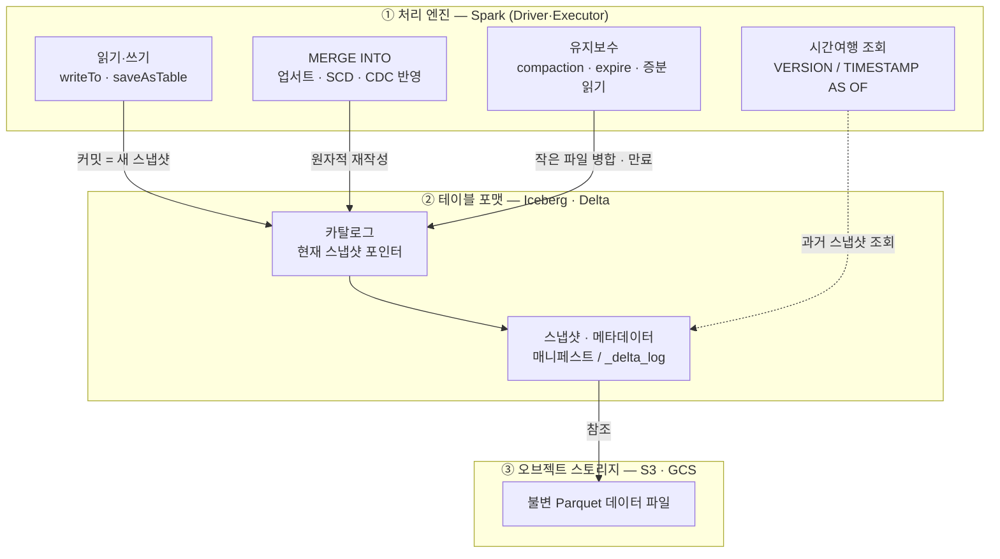

<figure class="post-figure post-figure--header">
<svg role="img" aria-label="Spark와 레이크하우스 테이블 포맷의 결합을 세 층으로 정리한 그림. 맨 위 첫째 층은 처리 엔진 Spark로, 왼쪽 Driver와 세 개의 Executor가 놓여 있고 오른쪽에는 MERGE·writeTo·시간여행·유지보수라는 레이크하우스 연산 칩이 나란히 있다. 첫째 층에서 아래로 내려가는 굵은 화살표에는 '커밋 = 새 스냅샷'이라고 적혀 있다. 가운데 둘째 층은 테이블 포맷 Iceberg·Delta로, 왼쪽 카탈로그 상자에서 현재 포인터가 스냅샷 체인 S1·S2·S3 중 S3를 가리키고, 위쪽으로는 과거 스냅샷 S1로 되돌아가는 시간여행 점선 화살표가 있으며 metadata.json과 _delta_log가 표시되어 있다. 둘째 층에서 아래로 '스냅샷이 데이터 파일을 참조'하는 화살표가 내려간다. 맨 아래 셋째 층은 오브젝트 스토리지로, 왼쪽에 흩어진 작은 Parquet 파일들이 compaction 화살표를 지나 정렬된 큰 파일 두 개로 합쳐지고, 이 파일들이 불변임을 나타낸다." viewBox="0 0 680 360" xmlns="http://www.w3.org/2000/svg">
  <title>Spark × 레이크하우스 — 처리 엔진 · 테이블 포맷 · 오브젝트 스토리지 3층과 커밋·시간여행·compaction</title>
  <defs>
    <marker id="spk7-arrow" viewBox="0 0 10 10" refX="8" refY="5" markerWidth="6" markerHeight="6" orient="auto-start-reverse">
      <path d="M0,0 L10,5 L0,10 z" fill="var(--secondary-color)"/>
    </marker>
    <marker id="spk7-gold" viewBox="0 0 10 10" refX="8" refY="5" markerWidth="6" markerHeight="6" orient="auto-start-reverse">
      <path d="M0,0 L10,5 L0,10 z" fill="var(--gold)"/>
    </marker>
    <marker id="spk7-acc" viewBox="0 0 10 10" refX="8" refY="5" markerWidth="6" markerHeight="6" orient="auto-start-reverse">
      <path d="M0,0 L10,5 L0,10 z" fill="var(--accent-color)"/>
    </marker>
  </defs>

  <!-- ===== title ===== -->
  <text x="340" y="24" text-anchor="middle" font-size="17" font-weight="800" fill="currentColor" letter-spacing="1.2">SPARK × 레이크하우스</text>
  <text x="340" y="44" text-anchor="middle" font-size="10.5" font-weight="700" fill="currentColor" opacity="0.72">처리 엔진을 오브젝트 스토리지 위 웨어하우스로 — 테이블 포맷을 사이에 얹어</text>

  <!-- ===== LAYER A: Spark engine ===== -->
  <rect x="30" y="56" width="620" height="70" rx="6" fill="var(--bg-light)" stroke="var(--gold)" stroke-width="2.5"/>
  <text x="44" y="73" text-anchor="start" font-size="10.5" font-weight="800" fill="var(--gold)">① 처리 엔진 — Spark (Driver · Executor)</text>

  <!-- Driver -->
  <rect x="46" y="82" width="58" height="34" rx="3" fill="var(--bg-panel)" stroke="currentColor" stroke-width="2"/>
  <text x="75" y="103" text-anchor="middle" font-size="10" font-weight="700" fill="currentColor">Driver</text>

  <!-- Executors -->
  <g>
    <rect x="116" y="84" width="44" height="30" rx="3" fill="var(--bg-panel)" stroke="currentColor" stroke-width="1.8"/>
    <rect x="164" y="84" width="44" height="30" rx="3" fill="var(--bg-panel)" stroke="currentColor" stroke-width="1.8"/>
    <rect x="212" y="84" width="44" height="30" rx="3" fill="var(--bg-panel)" stroke="currentColor" stroke-width="1.8"/>
  </g>
  <g fill="var(--secondary-color)" opacity="0.7">
    <rect x="124" y="90" width="6" height="6" rx="1"/><rect x="134" y="90" width="6" height="6" rx="1"/>
    <rect x="172" y="90" width="6" height="6" rx="1"/><rect x="182" y="90" width="6" height="6" rx="1"/>
    <rect x="220" y="90" width="6" height="6" rx="1"/><rect x="230" y="90" width="6" height="6" rx="1"/>
  </g>
  <g font-size="8" font-weight="700" fill="currentColor" text-anchor="middle" opacity="0.85">
    <text x="138" y="110">Exec</text><text x="186" y="110">Exec</text><text x="234" y="110">Exec</text>
  </g>
  <!-- driver -> exec arrows -->
  <g stroke="var(--secondary-color)" stroke-width="1.6" fill="none" opacity="0.7">
    <line x1="104" y1="99" x2="114" y2="99" marker-end="url(#spk7-arrow)"/>
  </g>

  <!-- op chips -->
  <text x="452" y="73" text-anchor="middle" font-size="9" font-weight="700" fill="currentColor" opacity="0.7">레이크하우스 연산 — 분산 실행</text>
  <g font-size="9" font-weight="700" fill="currentColor" text-anchor="middle">
    <rect x="286" y="84" width="82" height="26" rx="4" fill="var(--bg-panel)" stroke="var(--secondary-color)" stroke-width="1.8"/><text x="327" y="101">MERGE</text>
    <rect x="374" y="84" width="88" height="26" rx="4" fill="var(--bg-panel)" stroke="currentColor" stroke-width="1.4"/><text x="418" y="101">writeTo</text>
    <rect x="468" y="84" width="96" height="26" rx="4" fill="var(--bg-panel)" stroke="var(--accent-color)" stroke-width="1.8"/><text x="516" y="101">시간여행</text>
    <rect x="570" y="84" width="66" height="26" rx="4" fill="var(--bg-panel)" stroke="var(--gold)" stroke-width="1.8"/><text x="603" y="101">유지보수</text>
  </g>

  <!-- arrow A -> B (commit) -->
  <line x1="110" y1="126" x2="110" y2="140" stroke="var(--secondary-color)" stroke-width="2.5" marker-end="url(#spk7-arrow)"/>
  <text x="196" y="137" text-anchor="middle" font-size="8.5" font-weight="700" fill="var(--secondary-color)">커밋 = 새 스냅샷</text>

  <!-- ===== LAYER B: table format ===== -->
  <rect x="30" y="142" width="620" height="80" rx="6" fill="var(--bg-light)" stroke="var(--accent-color)" stroke-width="2.5"/>
  <text x="44" y="159" text-anchor="start" font-size="10.5" font-weight="800" fill="var(--accent-color)">② 테이블 포맷 — Iceberg · Delta (메타데이터 · 스냅샷)</text>

  <!-- catalog -->
  <rect x="46" y="170" width="92" height="34" rx="4" fill="var(--bg-panel)" stroke="var(--gold)" stroke-width="2.2"/>
  <text x="92" y="185" text-anchor="middle" font-size="9.5" font-weight="700" fill="currentColor">카탈로그</text>
  <text x="92" y="198" text-anchor="middle" font-size="7.5" fill="currentColor" opacity="0.7">현재 포인터</text>

  <!-- snapshot chain -->
  <line x1="176" y1="187" x2="420" y2="187" stroke="currentColor" stroke-width="1.4" opacity="0.35"/>
  <g stroke="var(--secondary-color)" stroke-width="1.8" fill="none">
    <line x1="216" y1="187" x2="266" y2="187" marker-end="url(#spk7-arrow)"/>
    <line x1="286" y1="187" x2="336" y2="187" marker-end="url(#spk7-arrow)"/>
  </g>
  <g text-anchor="middle" font-weight="700" font-size="9.5" fill="currentColor">
    <circle cx="198" cy="187" r="14" fill="var(--bg-panel)" stroke="var(--secondary-color)" stroke-width="2.2"/><text x="198" y="191">S1</text>
    <circle cx="278" cy="187" r="14" fill="var(--bg-panel)" stroke="var(--secondary-color)" stroke-width="2.2"/><text x="278" y="191">S2</text>
    <circle cx="358" cy="187" r="15" fill="var(--bg-panel)" stroke="var(--gold)" stroke-width="3"/><text x="358" y="191">S3</text>
  </g>
  <text x="358" y="216" text-anchor="middle" font-size="8" fill="currentColor" opacity="0.7">현재 스냅샷</text>
  <!-- current pointer catalog -> S3 -->
  <line x1="138" y1="184" x2="341" y2="184" stroke="var(--gold)" stroke-width="2.2" marker-end="url(#spk7-gold)"/>
  <!-- time-travel arc S3 -> S1 -->
  <path d="M356,172 Q278,150 200,172" fill="none" stroke="var(--accent-color)" stroke-width="1.8" stroke-dasharray="4 3" marker-end="url(#spk7-acc)"/>
  <text x="278" y="158" text-anchor="middle" font-size="8.5" font-weight="700" fill="var(--accent-color)">시간여행 · 롤백</text>

  <!-- metadata label -->
  <rect x="446" y="168" width="190" height="38" rx="4" fill="var(--bg-panel)" stroke="currentColor" stroke-width="1.4" opacity="0.9"/>
  <text x="541" y="184" text-anchor="middle" font-size="9" font-weight="700" fill="currentColor">metadata.json · 매니페스트</text>
  <text x="541" y="198" text-anchor="middle" font-size="9" font-weight="700" fill="currentColor" opacity="0.75">Delta: _delta_log</text>

  <!-- arrow B -> C (reference) -->
  <line x1="358" y1="222" x2="358" y2="236" stroke="var(--secondary-color)" stroke-width="2.5" marker-end="url(#spk7-arrow)"/>
  <text x="470" y="233" text-anchor="middle" font-size="8.5" font-weight="700" fill="var(--secondary-color)">스냅샷이 데이터 파일을 참조</text>

  <!-- ===== LAYER C: object storage ===== -->
  <rect x="30" y="238" width="620" height="96" rx="6" fill="var(--bg-light)" stroke="var(--gold)" stroke-width="2.5"/>
  <text x="44" y="255" text-anchor="start" font-size="10.5" font-weight="800" fill="var(--gold)">③ 오브젝트 스토리지 — S3 · GCS (불변 Parquet 파일)</text>

  <!-- scattered small files -->
  <g fill="var(--bg-panel)" stroke="currentColor" stroke-width="1.5">
    <rect x="52" y="268" width="20" height="14" rx="2"/>
    <rect x="80" y="276" width="16" height="12" rx="2"/>
    <rect x="58" y="292" width="18" height="13" rx="2"/>
    <rect x="88" y="298" width="22" height="14" rx="2"/>
    <rect x="48" y="312" width="16" height="12" rx="2"/>
    <rect x="76" y="308" width="20" height="13" rx="2"/>
  </g>
  <text x="82" y="332" text-anchor="middle" font-size="8" fill="currentColor" opacity="0.7">작은 파일 (스트리밍·소량 커밋)</text>

  <!-- compaction arrow -->
  <line x1="120" y1="294" x2="168" y2="294" stroke="var(--secondary-color)" stroke-width="2.5" marker-end="url(#spk7-arrow)"/>
  <text x="144" y="284" text-anchor="middle" font-size="8" font-weight="700" fill="var(--secondary-color)">compaction</text>

  <!-- compacted big files -->
  <g>
    <rect x="178" y="272" width="120" height="22" rx="3" fill="var(--bg-panel)" stroke="var(--gold)" stroke-width="2.2"/>
    <g stroke="var(--gold)" stroke-width="1.1" opacity="0.5"><line x1="208" y1="272" x2="208" y2="294"/><line x1="238" y1="272" x2="238" y2="294"/><line x1="268" y1="272" x2="268" y2="294"/></g>
    <rect x="178" y="300" width="120" height="22" rx="3" fill="var(--bg-panel)" stroke="var(--gold)" stroke-width="2.2"/>
    <g stroke="var(--gold)" stroke-width="1.1" opacity="0.5"><line x1="208" y1="300" x2="208" y2="322"/><line x1="238" y1="300" x2="238" y2="322"/><line x1="268" y1="300" x2="268" y2="322"/></g>
  </g>
  <text x="238" y="334" text-anchor="middle" font-size="8" fill="currentColor" opacity="0.7">정렬·병합된 큰 파일</text>

  <!-- data files reference note -->
  <rect x="360" y="270" width="276" height="54" rx="4" fill="var(--bg-panel)" stroke="currentColor" stroke-width="1.4" opacity="0.92"/>
  <text x="498" y="290" text-anchor="middle" font-size="9.5" font-weight="700" fill="currentColor">파일은 한 번 쓰이면 불변(immutable)</text>
  <text x="498" y="306" text-anchor="middle" font-size="8.5" fill="currentColor" opacity="0.78">쓰기·MERGE·compaction = 새 파일 + 새 스냅샷</text>
  <text x="498" y="319" text-anchor="middle" font-size="8.5" fill="currentColor" opacity="0.78">만료된 스냅샷만 참조하던 파일은 삭제 대상</text>
</svg>
<figcaption>이 글을 한 장으로 — ① Spark(처리 엔진)가 ② Iceberg·Delta(테이블 포맷: 카탈로그 포인터·스냅샷)를 통해 ③ 오브젝트 스토리지의 불변 Parquet 파일을 다룬다. 쓰기·MERGE는 새 스냅샷을 커밋하고, 시간여행은 과거 스냅샷을 조회하며, compaction은 작은 파일을 합친다</figcaption>
</figure>

## 들어가며

[Spark Essential Curriculum](/2026/07/12/spark-essential-curriculum.html)의 **7단계이자 시리즈의 마지막 단계(심화)**입니다. 지금까지 우리는 Spark가 무엇을 어떻게 실행하는지(1단계 — Driver·Executor·실행 흐름), 어떤 추상화 위에서 데이터를 다루는지(2단계 — RDD·DataFrame·Dataset), 왜 빠른지(3단계 — Catalyst·Tungsten), 왜 느려지고 어떻게 고치는지(4단계 — 셔플·튜닝), 배치를 넘어 실시간으로 어떻게 확장하는지(5단계 — Structured Streaming), 그리고 현실의 코드를 어떻게 짜는지([6단계 — PySpark](/2026/07/16/spark-pyspark-udf-pandas-api.html))를 익혔습니다. 남은 질문은 하나입니다 — **그렇게 갈고닦은 Spark를, 2026년의 데이터 스택은 어디에 얹는가?**

답은 **레이크하우스**입니다. 그리고 이 결합의 핵심 문장은 이것입니다 — **Spark는 그 자체로 저장 계층을 갖지 않는 처리 엔진이고, Iceberg·Delta 같은 오픈 테이블 포맷이 오브젝트 스토리지(S3·GCS) 위에 ACID·시간여행·스키마 진화라는 웨어하우스급 능력을 얹어 준다.** 이 둘이 만나면 Spark는 "파일을 읽어 처리하고 다시 파일로 뱉는 배치 도구"에서, **오브젝트 스토리지 위에서 `MERGE`·업서트·증분 처리·트랜잭션을 수행하는 웨어하우스급 처리 엔진**으로 완성됩니다. 이 시리즈가 여기서 끝나는 이유입니다 — 실행 구조부터 튜닝, 스트리밍, PySpark까지 쌓아 온 모든 것이, 이 마지막 단계에서 최신 저장 포맷과 결합해 실무의 완성형이 됩니다.

테이블 포맷 자체의 큰 그림 — 오브젝트 스토리지가 왜, 어떻게 웨어하우스를 대체하게 되었는지 — 은 오버뷰 시리즈의 [데이터 저장(Storage)](/2026/06/25/data-storage.html)에서 잡았고, 그 심화는 별도의 [Lakehouse Essential Curriculum](/2026/07/12/lakehouse-essential-curriculum.html) 시리즈가 다룹니다. 이 글은 그 두 시리즈를 **사전 지식으로 전제**하고, 겹치는 원리 설명은 최소화한 채 **오직 "Spark에서 어떻게 다루는가"**에 집중합니다.

<div class="post-summary-box" markdown="1">

### 📌 이 글에서 다루는 내용

- **테이블 포맷 기초 (Spark 관점)**: 왜 Spark만으로는 부족한가(Hive 스타일 파티션 디렉토리의 한계 — 원자적 커밋 불가·동시 쓰기 위험·스키마 표류), Iceberg·Delta가 메타데이터·스냅샷으로 그 위에 얹는 것, Spark에 카탈로그/데이터소스로 붙는 구조
- **Spark에서 읽고 쓰기**: 카탈로그 설정(Iceberg REST 카탈로그·Delta), `writeTo`/`saveAsTable`, `MERGE INTO`/업서트, 스키마 진화(`ADD COLUMN`·`mergeSchema`)와 Iceberg 고유의 파티션 진화, 시간여행 조회(`VERSION AS OF`·`TIMESTAMP AS OF`·`snapshot-id`)
- **유지보수**: compaction(작은 파일 병합 — Iceberg `rewrite_data_files` / Delta `OPTIMIZE`·Z-ORDER), 스냅샷 만료(`expire_snapshots` / `VACUUM`)와 고아 파일 정리, 증분 처리(Iceberg incremental read / Delta Change Data Feed)로 이어지는 정기 운영

</div>

## 한눈에 보기 — 엔진에서 스토리지까지 3층

이 글의 스파인을 한 장으로 그리면 세 개의 층입니다. 맨 위 **Spark(처리 엔진)**가 하는 모든 일 — 읽기·쓰기·`MERGE`·시간여행·유지보수 — 은 가운데 **테이블 포맷(Iceberg·Delta)**을 거쳐서만 스토리지에 닿습니다. 테이블 포맷은 "현재 스냅샷이 무엇인가"라는 카탈로그의 포인터와 스냅샷·메타데이터를 관리하고, 그 스냅샷이 맨 아래 **오브젝트 스토리지**의 불변 Parquet 데이터 파일을 참조합니다. 쓰기는 새 스냅샷을 커밋하고, 시간여행은 과거 스냅샷을 조회하며, compaction은 작은 파일을 큰 파일로 다시 씁니다.



핵심은 Spark가 스토리지를 **직접** 만지지 않는다는 점입니다. 모든 것이 테이블 포맷이라는 계약 계층을 통과하기 때문에, 원자성·격리·이력이 성립합니다. 아래부터 이 세 층을 Spark의 눈으로 따라갑니다.

## 테이블 포맷 기초 — 왜 Spark만으로는 부족한가

### Hive 스타일의 한계 — "디렉토리가 곧 테이블"의 대가

레이크하우스 이전의 Spark는 데이터를 이렇게 다뤘습니다 — 스토리지의 한 경로에 Parquet 파일을 쌓고, `order_date=2026-07-16/` 같은 디렉토리로 파티션을 나누고, "이 경로 아래의 모든 파일이 곧 테이블"이라고 약속하는 방식(Hive 스타일). 돌아가긴 합니다. 하지만 규모가 커지면 세 가지가 무너집니다.

- **원자적 커밋이 불가능하다**: `df.write.parquet(path)`가 파일 수백 개를 쓰는 도중에 잡이 죽으면, 스토리지에는 **절반만 쓰인 테이블**이 남습니다. 리더는 그 중간 상태를 그대로 읽습니다. "쓰기가 전부 성공하거나 전부 실패한다"는 트랜잭션의 기본이 없습니다.
- **동시 쓰기가 위험하다**: 두 잡이 같은 경로에 동시에 쓰면 서로의 파일을 덮어쓰거나 목록을 오염시킵니다. 조율할 주체가 없습니다.
- **메타데이터가 파일 나열에 묶인다**: "이 테이블에 파일이 몇 개인가"를 알려면 스토리지를 `LIST`해야 합니다. 파티션이 수만 개면 이 나열 자체가 쿼리 플래닝의 병목이 됩니다. 스키마가 언제 어떻게 바뀌었는지의 이력도 없습니다.

이 세 문제가 정확히 웨어하우스가 풀어 주던 것들입니다. 레이크하우스의 발상은 **웨어하우스로 돌아가지 않고, 오브젝트 스토리지 위에 그 능력을 얹는 얇은 계층을 두는 것**입니다. 그 계층이 오픈 테이블 포맷입니다.

### 테이블 포맷이 얹는 것 — 메타데이터와 스냅샷

Iceberg와 Delta의 핵심 아이디어는 같습니다 — **데이터 파일은 한 번 쓰이면 절대 수정하지 않고(immutable), 테이블의 가변 상태는 별도의 메타데이터로 관리한다.** 어떤 데이터 파일들이 지금 이 테이블을 이루는가를 **스냅샷(snapshot)**이라는 목록으로 기록하고, 쓰기는 기존 파일을 건드리는 대신 **새 파일을 추가하고 새 스냅샷을 만들어 포인터를 원자적으로 교체**합니다.

- **Iceberg**: `metadata.json`(테이블 메타데이터) → 매니페스트 리스트 → 매니페스트 → 데이터 파일의 계층으로 스냅샷을 표현하고, 커밋은 카탈로그가 가리키는 현재 `metadata.json` 포인터를 compare-and-swap으로 바꾸는 한 동작입니다.
- **Delta Lake**: 테이블 경로 아래 `_delta_log/` 디렉토리에 JSON 트랜잭션 로그를 순차적으로 쌓고(주기적으로 Parquet 체크포인트로 압축), 각 로그 항목이 "어떤 파일이 추가/삭제되었는가"를 기록합니다. 현재 상태는 로그를 재생(replay)해 얻습니다.

세부 구조와 원리 — 커밋의 원자성, 스냅샷 격리, 시간여행이 성립하는 이유 — 는 Lakehouse 시리즈의 [Iceberg ACID·스냅샷·시간여행](/2026/07/15/lakehouse-iceberg-acid-snapshots-time-travel.html) 편이 파고듭니다. 여기서 붙잡아야 할 것은 **"불변 파일 + 스냅샷 포인터"라는 한 문장**뿐입니다. 이 문장이 있으면 아래의 모든 Spark 연산이 왜 그렇게 동작하는지가 설명됩니다 — `MERGE`가 왜 원자적인지(새 스냅샷 하나로 커밋되므로), 시간여행이 왜 되는지(과거 스냅샷이 그대로 남아 있으므로), compaction이 왜 안전한지(기존 파일을 지우는 게 아니라 새 파일로 다시 쓰고 스냅샷만 바꾸므로).

### Spark에는 어떻게 붙는가

Spark 관점에서 중요한 사실은, 두 포맷 모두 **Spark의 확장 지점에 플러그인으로 붙는다**는 것입니다 — Spark 코어를 고치지 않습니다.

- **DataSource V2**: `format("iceberg")` / `format("delta")`로 읽고 쓰는 데이터소스 구현.
- **Catalog 플러그인**: `lake.sales.orders`처럼 `카탈로그.네임스페이스.테이블`로 테이블을 참조하게 해 주는 카탈로그 구현(Iceberg의 `SparkCatalog`, Delta의 `DeltaCatalog`).
- **SQL 확장(SessionExtensions)**: `MERGE INTO`, `CALL ...`(프로시저), `VERSION AS OF` 같은 문법과 규칙을 Spark SQL 파서·옵티마이저에 주입.

그래서 Spark는 이 결합의 **최적 파트너**입니다. `MERGE`로 수억 행을 업서트하거나, 테라바이트급 테이블을 compaction하는 일은 본질적으로 대량 분산 처리이고, 그건 1~4단계에서 본 Spark의 실행 엔진이 가장 잘하는 일입니다. 테이블 포맷은 "무엇이 트랜잭션의 단위인가"를 정의하고, Spark는 "그 트랜잭션을 수백 개 태스크로 나눠 실행"합니다.

## Spark에서 읽고 쓰기 — 카탈로그부터 시간여행까지

### 카탈로그 설정 — 테이블에 이름을 붙이는 첫 단추

가장 먼저 하는 일은 `SparkSession`에 테이블 포맷의 확장과 카탈로그를 등록하는 것입니다. Iceberg를 REST 카탈로그(Lakehouse 시리즈의 [REST 카탈로그·거버넌스](/2026/07/15/lakehouse-iceberg-rest-catalog-governance.html) 편 참고)에 붙이는 전형입니다.

```python
from pyspark.sql import SparkSession

spark = (
    SparkSession.builder
    .appName("lakehouse-app")
    # Iceberg SQL 확장 — MERGE, CALL 프로시저, VERSION AS OF 문법을 활성화
    .config("spark.sql.extensions",
            "org.apache.iceberg.spark.extensions.IcebergSparkSessionExtensions")
    # 'lake'라는 이름의 카탈로그를 REST 카탈로그로 등록
    .config("spark.sql.catalog.lake", "org.apache.iceberg.spark.SparkCatalog")
    .config("spark.sql.catalog.lake.type", "rest")
    .config("spark.sql.catalog.lake.uri", "https://catalog.internal:8181")
    .config("spark.sql.catalog.lake.warehouse", "s3://datalake/warehouse")
    .getOrCreate()
)

# 이제 lake.sales.orders 처럼 '카탈로그.네임스페이스.테이블'로 참조한다
```

Delta는 `DeltaSparkSessionExtension`과 `DeltaCatalog`를 등록합니다. `delta-spark` 패키지의 헬퍼가 필요한 설정과 의존성을 함께 붙여 줍니다.

```python
from pyspark.sql import SparkSession
from delta import configure_spark_with_delta_pip

builder = (
    SparkSession.builder.appName("lakehouse-app")
    .config("spark.sql.extensions", "io.delta.sql.DeltaSparkSessionExtension")
    .config("spark.sql.catalog.spark_catalog",
            "org.apache.spark.sql.delta.catalog.DeltaCatalog")
)
# delta 패키지(jar)와 위 설정을 함께 묶어 세션을 만든다
spark = configure_spark_with_delta_pip(builder).getOrCreate()
```

한 번 등록하면, 이후 코드는 포맷을 거의 의식하지 않습니다 — 테이블 이름으로 SQL을 쓰거나 DataFrame API를 씁니다.

### 기본 읽고 쓰기 — writeTo · saveAsTable

DataFrame을 테이블로 저장하는 관용은 Spark 3의 `writeTo`(DataFrameWriterV2)입니다. Iceberg에서는 이 API가 파티션 명세까지 자연스럽게 받습니다.

```python
# 새 테이블 생성(또는 대체) — Iceberg
(df.writeTo("lake.sales.orders")
   .partitionedBy("order_date")        # 파티션 컬럼
   .tableProperty("format-version", "2")
   .createOrReplace())

# 기존 테이블에 이어 붙이기(append)
df_new.writeTo("lake.sales.orders").append()

# 특정 파티션만 원자적으로 덮어쓰기(dynamic overwrite)
df_reload.writeTo("lake.sales.orders").overwritePartitions()
```

Delta는 익숙한 `format("delta")` 경로로도, 메타스토어 테이블로도 씁니다.

```python
# Delta — 메타스토어 테이블로
(df.write.format("delta")
   .partitionBy("order_date")
   .mode("overwrite")
   .saveAsTable("sales.orders"))

# Delta — 경로 기반(path-based)
df.write.format("delta").mode("append").save("s3://datalake/sales/orders")
```

읽기는 더 단순합니다 — 그냥 테이블입니다. 아래 SQL은 포맷을 전혀 드러내지 않습니다.

```sql
-- 평범한 분석 쿼리 — 뒤에서 Iceberg/Delta가 스냅샷·통계로 파일을 프루닝한다
SELECT region, count(*) AS cnt, sum(amount) AS revenue
FROM lake.sales.orders
WHERE order_date >= DATE '2026-07-01'
GROUP BY region
ORDER BY revenue DESC;
```

이것이 레이크하우스의 약속입니다 — 오브젝트 스토리지 위의 파일 더미가, Spark에게는 웨어하우스의 테이블과 똑같이 보입니다.

### MERGE INTO — 업서트를 한 번의 원자적 커밋으로

레이크하우스가 배치 처리와 가장 크게 갈라지는 지점이 `MERGE INTO`입니다. Hive 스타일에서는 "기존 행을 갱신"하려면 파티션을 통째로 다시 써야 했지만, 테이블 포맷 위에서는 조건에 맞는 행만 골라 갱신·삭제·삽입을 **한 트랜잭션**으로 처리합니다. CDC 반영, SCD(느리게 변하는 차원) 유지, 중복 제거 적재가 전부 이 한 문장으로 풀립니다.

```sql
-- staging_updates: 오늘 도착한 변경분 (op = insert/update/delete 플래그 포함)
MERGE INTO lake.sales.orders AS t
USING staging_updates AS s
  ON t.order_id = s.order_id
WHEN MATCHED AND s.op = 'delete' THEN DELETE
WHEN MATCHED THEN UPDATE SET *          -- 컬럼 전체를 소스로 갱신
WHEN NOT MATCHED THEN INSERT *;         -- 새 주문은 삽입
```

이 한 문장이 Spark에서는 조인 + 파일 재작성으로 실행됩니다 — 영향받는 데이터 파일을 찾아 새 파일로 다시 쓰고, 그 결과를 **새 스냅샷 하나로 커밋**합니다. 중간에 잡이 죽으면 스냅샷이 커밋되지 않으므로 테이블은 이전 상태 그대로입니다("전부 성공하거나 전부 실패"). 이때 셔플·조인 비용이 크므로, 4단계에서 익힌 조인 전략과 파티션 프루닝이 그대로 `MERGE` 성능 튜닝으로 이어집니다 — `ON` 조건이 파티션 컬럼을 포함하면 재작성 범위가 줄어듭니다.

DataFrame API를 선호하면 Delta는 프로그래밍 인터페이스도 제공합니다.

```python
from delta.tables import DeltaTable

target = DeltaTable.forName(spark, "sales.orders")
(target.alias("t")
   .merge(source=updates_df.alias("s"), condition="t.order_id = s.order_id")
   .whenMatchedDelete(condition="s.op = 'delete'")
   .whenMatchedUpdateAll()
   .whenNotMatchedInsertAll()
   .execute())
```

### 스키마 진화 — 재작성 없이 컬럼을 더한다

비즈니스는 컬럼을 계속 추가합니다. 테이블 포맷에서는 스키마 변경이 **메타데이터만의 변경**입니다 — 기존 데이터 파일을 다시 쓰지 않습니다. 각 데이터 파일은 자신이 쓰일 때의 스키마를 알고, 읽을 때 테이블의 현재 스키마에 맞춰 없는 컬럼은 `NULL`로 채워집니다.

```sql
-- 컬럼 추가 — 즉시 반영, 과거 데이터 재작성 없음
ALTER TABLE lake.sales.orders ADD COLUMN channel string COMMENT '유입 채널';

-- 컬럼 이름 변경 / 타입 확장(int -> bigint 같은 안전한 승격)
ALTER TABLE lake.sales.orders RENAME COLUMN amount TO amount_krw;
```

쓰기 시점에 소스 DataFrame이 새 컬럼을 갖고 있으면, `mergeSchema` 옵션으로 스키마를 자동 확장하며 이어 붙일 수도 있습니다.

```python
# Iceberg — 소스에 새 컬럼이 있으면 테이블 스키마를 병합하며 append
df_with_new_col.writeTo("lake.sales.orders").option("mergeSchema", "true").append()

# Delta — 동일한 mergeSchema 옵션
(df_with_new_col.write.format("delta")
   .option("mergeSchema", "true")
   .mode("append")
   .saveAsTable("sales.orders"))
```

Iceberg는 컬럼을 **이름이 아니라 고유 ID로 추적**하므로, 이름을 바꿔도 데이터가 어긋나지 않습니다(원리는 Lakehouse 시리즈의 [파티션·스키마 진화](/2026/07/15/lakehouse-iceberg-partition-schema-evolution.html) 편). Spark 입장에서는 `ALTER TABLE` 한 줄이 안전하다는 사실만 챙기면 됩니다.

### 파티션 진화 — Iceberg 고유의 무기

Hive 스타일의 가장 아픈 제약은 "파티션 스킴을 나중에 바꾸려면 테이블을 통째로 다시 만들어야 한다"는 것이었습니다. Iceberg는 **파티션도 진화**시킵니다 — 과거 데이터는 옛 파티션 스킴대로 두고, 새로 쓰는 데이터부터 새 스킴을 적용합니다. 데이터가 커져 "월별로는 파티션이 너무 크다, 일별로 쪼개자"가 되어도 재작성이 없습니다.

```sql
-- 월별 파티션으로 시작했다가, 데이터가 커져 일별로 세분화
ALTER TABLE lake.sales.orders ADD PARTITION FIELD days(order_ts);
ALTER TABLE lake.sales.orders DROP PARTITION FIELD months(order_ts);
```

여기에 Iceberg의 **hidden partitioning**이 더해집니다 — `order_ts`(타임스탬프)에서 `days(order_ts)`를 파티션으로 유도해 두면, 쿼리는 `WHERE order_ts >= ...`만 써도 Iceberg가 알아서 해당 일자 파티션만 스캔합니다. 사용자가 `order_date` 같은 파생 파티션 컬럼을 따로 만들고 관리할 필요가 없습니다. Delta는 파티션 진화 대신 Z-ORDER(뒤의 유지보수 절)와 liquid clustering으로 데이터 배치 문제를 다루는데, 접근이 다르므로 팀이 쓰는 포맷의 방식을 따르면 됩니다.

### 시간여행 — 과거 스냅샷을 그대로 조회

모든 커밋이 새 스냅샷을 남기므로, 과거의 어느 시점이든 그대로 조회할 수 있습니다. "어제 밤 배치가 돌기 전의 테이블"로 지표를 재현하거나, 잘못된 적재 직전으로 롤백하거나, 재현 가능한 ML 실험 데이터를 고정하는 데 쓰입니다.

```sql
-- 스냅샷 ID로 — 정확히 그 커밋 시점의 테이블
SELECT * FROM lake.sales.orders VERSION AS OF 3821550127947089009;

-- 시각으로 — 그 시각에 유효했던 스냅샷
SELECT * FROM lake.sales.orders TIMESTAMP AS OF '2026-07-15 00:00:00';

-- Iceberg: 스냅샷 이력은 메타데이터 테이블로 들여다본다
SELECT snapshot_id, committed_at, operation, summary
FROM lake.sales.orders.snapshots
ORDER BY committed_at DESC;
```

DataFrame API로도 같은 조회가 됩니다 — 배치 파이프라인에서 "특정 버전을 입력으로 고정"할 때 유용합니다.

```python
# Iceberg — 스냅샷 ID 또는 as-of 타임스탬프 옵션
(spark.read.format("iceberg")
   .option("snapshot-id", 3821550127947089009)
   .load("lake.sales.orders"))

# Delta — versionAsOf / timestampAsOf
spark.read.format("delta").option("versionAsOf", 42).table("sales.orders")
```

시간여행은 공짜가 아닙니다 — 과거 스냅샷이 참조하는 데이터 파일이 스토리지에 살아 있어야만 가능합니다. 즉 "얼마나 과거까지 여행할 수 있는가"는 다음 절의 **스냅샷 만료 정책**과 정면으로 부딪히는 트레이드오프입니다.

## 유지보수 — 돌아가는 테이블에서 건강한 테이블로

레이크하우스 테이블은 "쓰면 끝"이 아닙니다. 특히 스트리밍이나 잦은 소량 커밋은 시간이 지날수록 테이블을 병들게 하고, 이를 다스리는 정기 유지보수가 운영의 핵심입니다. Spark는 이 유지보수 작업의 실행 주체이기도 합니다 — 프로시저 호출(`CALL`)이나 SQL 명령이 곧 분산 잡으로 실행됩니다.

### compaction — 작은 파일 문제를 다시 쓰기로 푼다

스트리밍·마이크로배치·잦은 `MERGE`는 **작은 파일**을 양산합니다. 파일이 수만 개로 쪼개지면 쿼리마다 여는 파일 수와 메타데이터 부담이 폭증해 스캔이 느려집니다. 해법은 작은 파일들을 읽어 **목표 크기(예: 512MB)의 큰 파일로 다시 쓰는** compaction입니다. 기존 파일을 지우지 않고 새 파일 + 새 스냅샷으로 커밋하므로, 진행 중인 쿼리는 영향받지 않습니다.

```sql
-- Iceberg: rewrite_data_files 프로시저
-- bin-pack(기본)은 크기만 맞춰 병합, sort/z-order는 정렬까지 해 스캔 프루닝을 개선
CALL lake.system.rewrite_data_files(
  table => 'sales.orders',
  strategy => 'sort',
  sort_order => 'region, order_date',
  options => map('target-file-size-bytes', '536870912')   -- 512MB
);
```

```sql
-- Delta: OPTIMIZE (+ Z-ORDER로 다차원 지역성 개선)
OPTIMIZE sales.orders
WHERE order_date >= '2026-07-01'
ZORDER BY (region, customer_id);
```

원리와 bin-pack·sort·z-order의 선택 기준은 Lakehouse 시리즈의 [compaction·유지보수](/2026/07/15/lakehouse-iceberg-compaction-maintenance.html) 편이 자세히 다룹니다. Spark 관점의 요점은 — compaction은 대량 읽기·정렬·쓰기이므로 **셔플·메모리 튜닝(4단계)이 그대로 성능을 좌우**하고, 대개 야간 배치로 [Airflow](/2026/07/13/airflow-dag-operators-tasks.html) 같은 오케스트레이터가 주기 실행한다는 것입니다.

### 스냅샷 만료와 고아 파일 정리 — 이력의 비용을 청소한다

모든 커밋이 스냅샷을 남긴다는 것은, 방치하면 **오래된 스냅샷과 그것만 참조하는 데이터 파일이 무한정 쌓인다**는 뜻입니다. compaction조차 옛 파일을 "지우지 않고" 새로 쓰므로, 옛 파일은 옛 스냅샷에 매달린 채 스토리지 비용으로 남습니다. 그래서 보존 기간을 넘긴 스냅샷을 만료시키고, 만료 후 어떤 스냅샷도 참조하지 않게 된 파일을 실제로 삭제하는 작업이 필요합니다.

```sql
-- Iceberg: 보존 경계보다 오래된 스냅샷 만료 → 참조 잃은 데이터 파일 삭제
CALL lake.system.expire_snapshots(
  table => 'sales.orders',
  older_than => TIMESTAMP '2026-07-13 00:00:00',
  retain_last => 5                       -- 최소 최근 5개 스냅샷은 보존
);

-- 어떤 스냅샷에도 속하지 않는 고아 파일(중단된 잡의 잔해 등) 청소
CALL lake.system.remove_orphan_files(table => 'sales.orders');
```

```sql
-- Delta: VACUUM — 보존 기간(기본 7일) 넘긴, 로그에서 제거된 파일 삭제
VACUUM sales.orders RETAIN 168 HOURS;
```

여기서 앞서 예고한 긴장이 현실이 됩니다 — **스냅샷을 공격적으로 만료시킬수록 스토리지 비용은 줄지만, 시간여행 가능 범위가 짧아집니다.** "우리 팀은 며칠 전까지 시간여행이 필요한가"가 곧 보존 기간이 되고, 이 정책을 만료 잡의 `older_than`/`RETAIN`에 그대로 새깁니다. 만료·`VACUUM`은 되돌릴 수 없으므로(삭제된 파일은 그 스냅샷으로의 시간여행을 영구히 막습니다) 보존 기간을 넉넉히 잡고 시작하는 것이 안전합니다.

### 증분 처리 — 매번 전체를 읽지 않는다

마지막 완성 조각은 **증분 처리**입니다. 하류 파이프라인이 "새로 바뀐 것만" 처리하고 싶을 때, 매번 테이블 전체를 다시 읽는 것은 낭비입니다. 스냅샷이 이력을 갖고 있으므로, "두 스냅샷 사이의 변경분"만 골라 읽을 수 있습니다.

```python
# Iceberg 증분 읽기 — 두 스냅샷 사이에 '추가된' 레코드만 스캔
(spark.read.format("iceberg")
   .option("start-snapshot-id", 3821550127947089009)   # 배타적 시작
   .option("end-snapshot-id",   7122334455667788990)   # 포함 끝
   .load("lake.sales.orders"))
```

```python
# Delta Change Data Feed(CDF) — insert/update/delete를 행 단위 변경으로
# _change_type 컬럼으로 어떤 변경인지까지 알 수 있다
(spark.read.format("delta")
   .option("readChangeFeed", "true")
   .option("startingVersion", 42)
   .table("sales.orders"))
```

그리고 이 증분성은 5단계 **Structured Streaming**과 곧장 이어집니다 — 테이블 자체를 스트림 소스로 삼아, 새 커밋이 생길 때마다 그 증분을 흘려보낼 수 있습니다.

```python
# 테이블을 스트림 소스로 — 새 커밋(스냅샷)을 증분 마이크로배치로 읽어 집계 테이블에 적재
(spark.readStream.format("iceberg")
   .load("lake.sales.orders")
   .groupBy("region").sum("amount")
   .writeStream.format("iceberg")
   .outputMode("complete")
   .option("checkpointLocation", "s3://datalake/_chk/orders_agg")
   .toTable("lake.sales.orders_agg"))
```

여기서 이 시리즈의 조각들이 하나로 맞물립니다 — 5단계에서 배운 Structured Streaming이, 7단계의 테이블 포맷을 소스이자 싱크로 삼아, 배치와 스트림이 **같은 테이블 위에서** 만납니다. compaction과 스트리밍 쓰기가 같은 테이블에 동시에 일어나도, 낙관적 동시성 제어가 이를 조율합니다(원리는 Lakehouse ACID 편). 배치 도구였던 Spark가, 오브젝트 스토리지 위에서 실시간과 트랜잭션과 유지보수를 함께 수행하는 처리 엔진으로 완성되는 순간입니다.

## 정리

Spark-Essential의 마지막 단계를 정리합니다.

- **테이블 포맷은 Spark의 부족분을 메운다**: Hive 스타일 파티션 디렉토리는 원자적 커밋·동시 쓰기·메타데이터에서 무너진다. Iceberg·Delta는 "불변 데이터 파일 + 스냅샷 포인터"라는 한 문장으로 그 위에 ACID·시간여행·스키마 진화를 얹고, Spark에는 DataSource·Catalog·SQL 확장으로 붙는다. Spark는 대량 분산 실행이라는 강점으로 이 결합의 최적 파트너가 된다.
- **읽고 쓰기는 그냥 테이블이다**: 카탈로그를 한 번 등록하면 `lake.sales.orders`처럼 참조하고, `writeTo`/`saveAsTable`로 쓰고 SQL로 읽는다. `MERGE INTO`가 업서트·CDC·SCD를 한 번의 원자적 커밋으로 풀고, 스키마 진화(`ADD COLUMN`·`mergeSchema`)와 Iceberg의 파티션 진화·hidden partitioning은 과거 데이터 재작성 없이 변화를 받아 낸다. 시간여행(`VERSION`/`TIMESTAMP AS OF`·`snapshot-id`)으로 과거를 그대로 조회한다.
- **유지보수가 건강한 테이블을 만든다**: 작은 파일은 compaction(`rewrite_data_files` / `OPTIMIZE`·Z-ORDER)으로 합치고, 쌓이는 스냅샷은 만료(`expire_snapshots` / `VACUUM`)와 고아 파일 정리로 청소하되 시간여행 범위와의 트레이드오프를 정책에 새긴다. 증분 처리(Iceberg incremental read / Delta CDF, 그리고 스트림 소스)로 "바뀐 것만" 흘려보낸다.
- **Spark는 레이크하우스의 처리 엔진으로 완성된다**: 테이블 포맷과 결합하는 순간, Spark는 단순 배치 도구를 넘어 오브젝트 스토리지 위에서 트랜잭션·업서트·시간여행·실시간을 수행하는 웨어하우스급 엔진이 된다. 4단계의 튜닝은 `MERGE`·compaction 성능으로, 5단계의 스트리밍은 테이블을 소스·싱크로 삼는 증분 처리로 그대로 이어진다.

이로써 **Spark-Essential 7단계를 완주했습니다.** 출발점은 "무엇이 어떻게 실행되는가"라는 아키텍처(1단계)였습니다. 그 위에서 다루는 추상화(2단계)와 그것을 빠르게 만드는 옵티마이저(3단계)로 "왜 빠른가"를 이해했고, 셔플·튜닝(4단계)으로 "왜 느려지고 어떻게 고치는가"를 다스렸으며, Structured Streaming(5단계)과 PySpark(6단계)로 활용을 넓힌 뒤, 마지막으로 이 글에서 그 모든 것을 최신 레이크하우스 저장 포맷에 얹었습니다. 되돌아보면 하나의 그림입니다 — **Driver/Executor로 일을 나누고, DAG로 최적화하고, 셔플로 다시 모으는 처리 엔진이, 테이블 포맷이라는 계약 계층을 통해 오브젝트 스토리지 위의 웨어하우스가 되는 그림.** 이 그림을 손에 쥐면, 어떤 데이터 플랫폼 설계 논의에서도 "무엇이 스냅샷으로 커밋되고, 누가 어떤 격리로 읽고, 파일은 언제 합쳐지고 만료되는가"를 물을 수 있습니다. 그것이 이 시리즈가 남기려던 안목입니다.

### 다음 학습 (Next Learning)

- [Spark Essential Curriculum](/2026/07/12/spark-essential-curriculum.html) — 시리즈 로드맵(완주!)으로 돌아가 7단계 전체 여정 복기하기
- [Lakehouse Essential Curriculum](/2026/07/12/lakehouse-essential-curriculum.html) — 테이블 포맷의 원리(ACID·스냅샷·compaction·거버넌스)를 파고드는 심화 시리즈
- [데이터 저장(Storage): 웨어하우스·레이크·레이크하우스와 파일·테이블 포맷](/2026/06/25/data-storage.html) — 이 글의 사전 지식인 오버뷰 저장 단계
