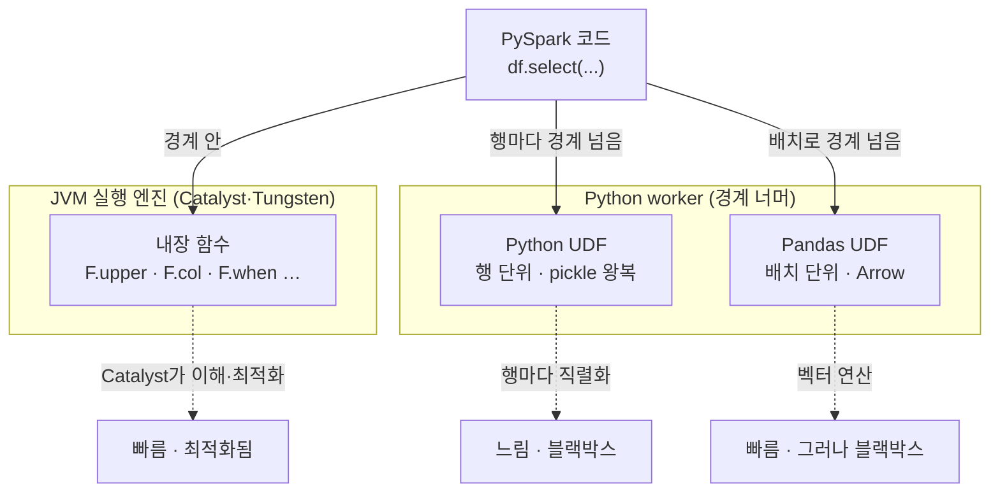

<figure class="post-figure post-figure--header">
<svg role="img" aria-label="PySpark의 Python↔JVM 경계와 UDF 직렬화 비용을 한 장으로 정리한 그림. 위쪽은 실행 경로로, 왼쪽의 파이썬 PySpark 코드(SparkSession)가 Py4J 다리를 건너 오른쪽의 JVM 실행 엔진(Catalyst·Tungsten)으로 연결되고, 내장 함수만 쓰면 데이터가 JVM에 머문 채 경계를 넘지 않는다는 표시가 붙어 있다. 아래쪽은 두 종류의 UDF를 나란히 비교하는데, 위 레인은 Python UDF로 JVM executor와 파이썬 워커 사이를 행 하나마다 pickle로 직렬화해 왕복하며 느리다는 경고가 붙어 있고, 아래 레인은 Pandas UDF로 여러 행을 Arrow 컬럼 배치로 한 번에 넘겨 빠르다는 표시가 붙어 있다." viewBox="0 0 680 372" xmlns="http://www.w3.org/2000/svg">
  <title>PySpark — Python으로 쓰고 JVM에서 실행된다, 그리고 UDF의 직렬화 비용(행 단위 pickle vs Arrow 배치)</title>
  <defs>
    <marker id="ps-arrow" viewBox="0 0 10 10" refX="8" refY="5" markerWidth="6" markerHeight="6" orient="auto-start-reverse">
      <path d="M0,0 L10,5 L0,10 z" fill="var(--secondary-color)"/>
    </marker>
    <marker id="ps-acc" viewBox="0 0 10 10" refX="8" refY="5" markerWidth="6" markerHeight="6" orient="auto-start-reverse">
      <path d="M0,0 L10,5 L0,10 z" fill="var(--accent-color)"/>
    </marker>
    <marker id="ps-gold" viewBox="0 0 10 10" refX="8" refY="5" markerWidth="6" markerHeight="6" orient="auto-start-reverse">
      <path d="M0,0 L10,5 L0,10 z" fill="var(--gold)"/>
    </marker>
  </defs>

  <!-- title -->
  <text x="340" y="22" text-anchor="middle" font-size="16" font-weight="800" fill="currentColor" letter-spacing="1">PYSPARK — Python으로 쓰고, JVM에서 실행된다</text>

  <!-- ===== SECTION A: Python <-> JVM ===== -->
  <text x="30" y="48" text-anchor="start" font-size="10.5" font-weight="700" fill="currentColor" opacity="0.72">실행 경로 — 코드는 Python, 실행은 JVM. 내장 함수만 쓰면 데이터는 경계를 넘지 않는다</text>

  <!-- Python side -->
  <rect x="28" y="60" width="200" height="84" rx="5" fill="var(--bg-light)" stroke="var(--secondary-color)" stroke-width="2.5"/>
  <text x="128" y="80" text-anchor="middle" font-size="11" font-weight="800" fill="var(--secondary-color)">Python 프로세스 (드라이버)</text>
  <g font-size="8.5" fill="currentColor">
    <text x="44" y="100">spark = SparkSession...</text>
    <text x="44" y="115" opacity="0.85">df.groupBy("k").agg(...)</text>
    <text x="44" y="130" font-size="8" font-weight="700" fill="var(--secondary-color)"># 얇은 API 껍데기 — 계획만 만든다</text>
  </g>

  <!-- Py4J bridge -->
  <line x1="228" y1="102" x2="288" y2="102" stroke="currentColor" stroke-width="2.5" marker-end="url(#ps-arrow)"/>
  <rect x="240" y="88" width="36" height="28" rx="3" fill="var(--bg-panel)" stroke="var(--gold)" stroke-width="2"/>
  <text x="258" y="106" text-anchor="middle" font-size="8.5" font-weight="800" fill="var(--gold)">Py4J</text>
  <text x="258" y="128" text-anchor="middle" font-size="7.5" fill="currentColor" opacity="0.7">경계(bridge)</text>

  <!-- JVM side -->
  <rect x="300" y="60" width="200" height="84" rx="5" fill="var(--bg-light)" stroke="currentColor" stroke-width="2.5"/>
  <text x="400" y="80" text-anchor="middle" font-size="11" font-weight="800" fill="currentColor">JVM 실행 엔진</text>
  <text x="400" y="97" text-anchor="middle" font-size="8.5" fill="currentColor" opacity="0.78">Catalyst · Tungsten · 셔플</text>
  <g fill="var(--bg-panel)" stroke="currentColor" stroke-width="1.2" opacity="0.85">
    <rect x="326" y="108" width="10" height="10" rx="1"/><rect x="344" y="108" width="10" height="10" rx="1"/>
    <rect x="362" y="108" width="10" height="10" rx="1"/><rect x="380" y="108" width="10" height="10" rx="1"/>
    <rect x="398" y="108" width="10" height="10" rx="1"/><rect x="416" y="108" width="10" height="10" rx="1"/>
  </g>
  <text x="400" y="134" text-anchor="middle" font-size="8" fill="currentColor" opacity="0.72">실제 데이터·연산은 여기에</text>

  <!-- data stays note -->
  <rect x="516" y="72" width="140" height="60" rx="5" fill="var(--bg-panel)" stroke="var(--gold)" stroke-width="2"/>
  <text x="586" y="92" text-anchor="middle" font-size="9" font-weight="800" fill="var(--gold)">내장 함수만 쓰면</text>
  <text x="586" y="108" text-anchor="middle" font-size="8.5" fill="currentColor">데이터는 JVM에</text>
  <text x="586" y="122" text-anchor="middle" font-size="8.5" fill="currentColor">머문다 (경계 X)</text>
  <line x1="500" y1="102" x2="514" y2="102" stroke="var(--gold)" stroke-width="2" marker-end="url(#ps-gold)"/>

  <!-- ===== divider ===== -->
  <line x1="30" y1="160" x2="650" y2="160" stroke="currentColor" stroke-width="1.4" opacity="0.25"/>

  <!-- ===== SECTION B: UDF cost ===== -->
  <text x="30" y="182" text-anchor="start" font-size="10.5" font-weight="700" fill="currentColor" opacity="0.72">UDF는 데이터를 Python으로 넘긴다 — 어떻게 넘기느냐가 비용을 가른다</text>

  <!-- Lane 1: Python UDF (row by row) -->
  <text x="30" y="206" text-anchor="start" font-size="9.5" font-weight="800" fill="var(--accent-color)">Python UDF — 행 단위 · pickle</text>
  <rect x="30" y="214" width="120" height="40" rx="4" fill="var(--bg-light)" stroke="currentColor" stroke-width="2"/>
  <text x="90" y="231" text-anchor="middle" font-size="8.5" font-weight="700" fill="currentColor">JVM executor</text>
  <text x="90" y="245" text-anchor="middle" font-size="7.5" fill="currentColor" opacity="0.7">행을 하나씩</text>

  <rect x="410" y="214" width="120" height="40" rx="4" fill="var(--bg-light)" stroke="var(--accent-color)" stroke-width="2"/>
  <text x="470" y="231" text-anchor="middle" font-size="8.5" font-weight="700" fill="currentColor">Python worker</text>
  <text x="470" y="245" text-anchor="middle" font-size="7.5" fill="currentColor" opacity="0.7">한 행씩 실행</text>

  <!-- per-row round trips -->
  <g stroke="var(--accent-color)" stroke-width="1.6" fill="none">
    <line x1="150" y1="222" x2="408" y2="222" marker-end="url(#ps-acc)"/>
    <line x1="410" y1="230" x2="152" y2="230" marker-end="url(#ps-acc)"/>
    <line x1="150" y1="238" x2="408" y2="238" marker-end="url(#ps-acc)"/>
    <line x1="410" y1="246" x2="152" y2="246" marker-end="url(#ps-acc)"/>
  </g>
  <text x="280" y="219" text-anchor="middle" font-size="7.5" font-weight="700" fill="var(--accent-color)">pickle 직렬화 왕복 · 행마다 반복</text>
  <text x="545" y="234" text-anchor="start" font-size="8.5" font-weight="800" fill="var(--accent-color)">느림</text>
  <polygon points="558,240 566,254 550,254" fill="var(--bg-panel)" stroke="var(--accent-color)" stroke-width="1.6" stroke-linejoin="round"/>
  <text x="558" y="252" text-anchor="middle" font-size="8" font-weight="800" fill="var(--accent-color)">!</text>

  <!-- Lane 2: Pandas UDF (Arrow batch) -->
  <text x="30" y="288" text-anchor="start" font-size="9.5" font-weight="800" fill="var(--gold)">Pandas UDF — 배치 단위 · Arrow</text>
  <rect x="30" y="296" width="120" height="52" rx="4" fill="var(--bg-light)" stroke="currentColor" stroke-width="2"/>
  <text x="90" y="315" text-anchor="middle" font-size="8.5" font-weight="700" fill="currentColor">JVM executor</text>
  <g fill="var(--bg-panel)" stroke="currentColor" stroke-width="1" opacity="0.8">
    <rect x="52" y="324" width="8" height="14" rx="1"/><rect x="64" y="324" width="8" height="14" rx="1"/>
    <rect x="76" y="324" width="8" height="14" rx="1"/><rect x="88" y="324" width="8" height="14" rx="1"/>
    <rect x="100" y="324" width="8" height="14" rx="1"/><rect x="112" y="324" width="8" height="14" rx="1"/>
  </g>
  <text x="90" y="346" text-anchor="middle" font-size="7" fill="currentColor" opacity="0.7">컬럼 배치</text>

  <rect x="410" y="296" width="120" height="52" rx="4" fill="var(--bg-light)" stroke="var(--gold)" stroke-width="2"/>
  <text x="470" y="315" text-anchor="middle" font-size="8.5" font-weight="700" fill="currentColor">Python worker</text>
  <text x="470" y="331" text-anchor="middle" font-size="7.5" fill="currentColor" opacity="0.75">pandas·NumPy</text>
  <text x="470" y="343" text-anchor="middle" font-size="7.5" fill="currentColor" opacity="0.75">벡터 연산 한 번</text>

  <!-- batch transfer -->
  <g stroke="var(--gold)" stroke-width="2.4" fill="none">
    <line x1="150" y1="316" x2="408" y2="316" marker-end="url(#ps-gold)"/>
    <line x1="410" y1="328" x2="152" y2="328" marker-end="url(#ps-gold)"/>
  </g>
  <text x="280" y="313" text-anchor="middle" font-size="7.5" font-weight="700" fill="var(--gold)">Arrow 컬럼 배치 — 수천 행을 한 번에</text>
  <text x="545" y="322" text-anchor="start" font-size="8.5" font-weight="800" fill="var(--gold)">빠름</text>
  <circle cx="558" cy="336" r="9" fill="var(--bg-light)" stroke="var(--gold)" stroke-width="2"/>
  <polyline points="552,336 557,341 565,331" fill="none" stroke="var(--gold)" stroke-width="2" stroke-linecap="round" stroke-linejoin="round"/>
</svg>
<figcaption>PySpark는 Python으로 쓰지만 실행은 JVM에서 일어난다 — 내장 함수만 쓰면 데이터는 JVM에 머문다. UDF는 데이터를 Python으로 넘기는데, 행 단위 pickle 왕복(Python UDF)은 느리고 Arrow 컬럼 배치(Pandas UDF)는 빠르다</figcaption>
</figure>

## 들어가며

[Spark Essential Curriculum](/2026/07/12/spark-essential-curriculum.html)의 **6단계**입니다. 지금까지의 다섯 단계는 Spark의 **속**을 보는 여정이었습니다 — 아키텍처(1단계)로 무엇이 어떻게 실행되는지, 추상화(2단계)로 데이터의 세 얼굴을, [옵티마이저(3단계)](/2026/07/16/spark-catalyst-tungsten-aqe.html)로 왜 빠른지, 셔플·튜닝(4단계)으로 왜 느려지고 어떻게 고치는지, Structured Streaming(5단계)으로 배치를 넘어 실시간까지 다뤘습니다. 이 6단계는 방향을 살짝 틀어 **"그래서 실제로 어떤 코드로 쓰는가"**를 다룹니다.

이유는 단순합니다 — 현실의 Spark 코드는 압도적으로 **PySpark**로 쓰입니다. 데이터 엔지니어·분석가 대부분이 Python으로 파이프라인을 짜고, Scala/Java로 내려가는 경우는 드뭅니다. 그런데 여기에 함정이 하나 있습니다. **PySpark로 쓴다고 코드가 Python으로 실행되는 것은 아닙니다.** 실행은 여전히 JVM에서 일어나고, Python과 JVM 사이에는 넘나드는 데 비용이 드는 경계가 있습니다. PySpark를 잘 쓴다는 것은 이 경계를 **언제 넘고 언제 넘지 않는지**를 아는 것과 거의 같습니다.

앞 단계들에서 익힌 실행·최적화 지식이 여기서 값을 합니다. 특히 [3단계 옵티마이저](/2026/07/16/spark-catalyst-tungsten-aqe.html)에서 본 Catalyst는 내장 함수의 표현식을 이해하고 최적화하지만, 여러분이 쓴 Python UDF는 옵티마이저에게 **블랙박스**입니다 — 이 한 문장이 이 글 전체를 관통합니다. 그리고 이 6단계는 다음 [7단계 — Iceberg/Delta 연동](/2026/07/16/spark-iceberg-delta-lakehouse.html)으로 이어지며, 거기서 Spark를 레이크하우스 스택에 얹는 것으로 시리즈를 마무리합니다.

<div class="post-summary-box" markdown="1">

### 📌 이 글에서 다루는 내용

- **PySpark API와 JVM 경계**: Python 진입점(SparkSession), Py4J로 이어진 Python↔JVM 구조, 왜 코드는 얇은 껍데기이고 실행은 JVM에서 일어나는지, 그리고 왜 대부분 내장 함수만으로 충분한지
- **UDF와 직렬화 비용**: 행 단위로 pickle 직렬화를 왕복하는 느린 Python UDF vs 배치 단위로 Arrow를 주고받는 벡터화 Pandas UDF, UDF가 옵티마이저의 블랙박스인 이유와 **내장 함수 우선 원칙**
- **pandas API on Spark**: 기존 pandas 코드를 최소 수정으로 분산 실행하는 `pyspark.pandas`, 언제 쓰고 언제 네이티브 DataFrame으로 내려가야 하는지, 연산별 셔플 비용이라는 주의점

</div>

## 한눈에 보기 — 경계를 넘느냐 마느냐

이 글의 스파인을 한 장으로 그리면 이렇습니다. 같은 변환을 표현하는 세 가지 길이 있고, 셋은 **Python↔JVM 경계를 얼마나 넘느냐**로 갈립니다. 내장 함수는 경계를 아예 넘지 않고(JVM에서 최적화되어 실행), Python UDF는 행마다 넘나들며(직렬화 왕복), Pandas UDF는 배치로 한 번에 넘깁니다(Arrow).





원칙 하나만 챙겨 두면 됩니다 — **경계를 넘지 않는 코드가 가장 빠르다.** 나머지는 이 원칙을 어쩔 수 없이 어겨야 할 때, 그 비용을 얼마나 줄이느냐의 문제입니다. 이제 세 갈래를 차례로 파고듭니다.

## PySpark API — Python으로 쓰지만 JVM에서 실행된다

### SparkSession — Python 쪽 진입점

PySpark의 모든 것은 `SparkSession`에서 시작합니다. DataFrame을 만들고, SQL을 실행하고, 설정을 읽는 통합 진입점입니다.

```python
from pyspark.sql import SparkSession
from pyspark.sql import functions as F

spark = (
    SparkSession.builder
    .appName("daily-sales")
    .config("spark.sql.shuffle.partitions", "200")   # 3~4단계에서 다룬 셔플 파티션 수
    .getOrCreate()
)

# 데이터 읽기 — 반환값은 파이썬 객체지만, 실제 데이터는 JVM 쪽에 있다
df = spark.read.parquet("s3://warehouse/orders/")

# 변환 — 이 체인은 "계획"을 쌓을 뿐, 아직 아무것도 실행되지 않는다 (lazy)
result = (
    df.filter(F.col("amount") > 100_000)
      .groupBy("region")
      .agg(F.sum("amount").alias("total"),
           F.countDistinct("customer_id").alias("customers"))
)

result.show()   # 액션 — 이 순간에야 JVM에서 실제 실행이 일어난다
```

여기서 결정적으로 이해해야 할 것은, 위 `df`나 `result`가 **데이터를 담고 있는 파이썬 객체가 아니라는** 점입니다. 그것들은 JVM 쪽에 실재하는 DataFrame을 가리키는 **얇은 파이썬 핸들(handle)**입니다. `df.filter(...)`를 호출하면 파이썬은 그 요청을 JVM으로 넘겨 JVM 쪽 논리 계획에 노드를 하나 더 붙일 뿐입니다.

### Py4J — Python과 JVM을 잇는 다리

그 "넘김"을 담당하는 것이 **Py4J**입니다. PySpark 드라이버는 사실 두 개의 프로세스입니다 — 여러분의 파이썬 프로세스, 그리고 그것이 띄운 JVM 프로세스. Py4J는 이 둘 사이를 잇는 다리로, 파이썬에서 `df.groupBy("region")`를 부르면 그 호출이 소켓을 통해 JVM 쪽 대응 객체의 메서드 호출로 전달됩니다.

<figure class="post-figure">
<svg role="img" aria-label="PySpark의 프로세스 구조를 나타낸 개념도. 왼쪽 큰 상자는 드라이버 노드로, 그 안에 파이썬 프로세스와 JVM 프로세스가 나란히 들어 있고 둘은 Py4J 다리로 연결되어 있다. 파이썬 프로세스는 사용자 코드와 얇은 DataFrame 핸들을 담고, JVM 프로세스는 SparkContext와 Catalyst 논리 계획을 담는다. JVM 프로세스에서 오른쪽의 여러 executor로 화살표가 뻗어 나가 실제 task가 executor의 JVM에서 실행됨을 보여 준다. 아래에는 사용자 코드는 파이썬이지만 계획 수립과 실행은 모두 JVM에서 일어난다는 설명이 적혀 있다." viewBox="0 0 680 300" xmlns="http://www.w3.org/2000/svg">
  <title>PySpark의 프로세스 구조 — 파이썬 드라이버와 JVM은 Py4J로 이어지고, 실행은 executor의 JVM에서</title>
  <defs>
    <marker id="ps2-arrow" viewBox="0 0 10 10" refX="8" refY="5" markerWidth="6" markerHeight="6" orient="auto-start-reverse">
      <path d="M0,0 L10,5 L0,10 z" fill="var(--secondary-color)"/>
    </marker>
  </defs>

  <text x="340" y="24" text-anchor="middle" font-size="14" font-weight="800" fill="currentColor">코드는 파이썬, 계획·실행은 JVM</text>

  <!-- driver node box -->
  <rect x="20" y="44" width="352" height="200" rx="6" fill="var(--bg-light)" stroke="currentColor" stroke-width="2.5"/>
  <text x="196" y="64" text-anchor="middle" font-size="10.5" font-weight="800" fill="currentColor" opacity="0.82">드라이버 노드 — 두 프로세스가 함께 산다</text>

  <!-- python process -->
  <rect x="36" y="78" width="150" height="150" rx="5" fill="var(--bg-panel)" stroke="var(--secondary-color)" stroke-width="2.2"/>
  <text x="111" y="98" text-anchor="middle" font-size="10" font-weight="800" fill="var(--secondary-color)">Python 프로세스</text>
  <g font-size="8" fill="currentColor">
    <text x="48" y="120">사용자 코드</text>
    <text x="48" y="136" opacity="0.82">df = spark.read...</text>
    <text x="48" y="152" opacity="0.82">df.groupBy(...)</text>
  </g>
  <rect x="48" y="164" width="126" height="46" rx="4" fill="var(--bg-light)" stroke="currentColor" stroke-width="1.6"/>
  <text x="111" y="182" text-anchor="middle" font-size="8" font-weight="700" fill="currentColor">얇은 DataFrame 핸들</text>
  <text x="111" y="197" text-anchor="middle" font-size="7.5" fill="currentColor" opacity="0.7">데이터가 아니라 참조</text>

  <!-- Py4J bridge -->
  <line x1="186" y1="150" x2="222" y2="150" stroke="var(--gold)" stroke-width="2.5" marker-end="url(#ps2-arrow)"/>
  <text x="204" y="142" text-anchor="middle" font-size="8" font-weight="800" fill="var(--gold)">Py4J</text>
  <text x="204" y="168" text-anchor="middle" font-size="7" fill="currentColor" opacity="0.65">소켓</text>

  <!-- JVM process -->
  <rect x="222" y="78" width="136" height="150" rx="5" fill="var(--bg-panel)" stroke="currentColor" stroke-width="2.2"/>
  <text x="290" y="98" text-anchor="middle" font-size="10" font-weight="800" fill="currentColor">JVM 프로세스</text>
  <g font-size="8" fill="currentColor">
    <text x="234" y="120">SparkContext</text>
    <text x="234" y="136" opacity="0.82">Catalyst 논리 계획</text>
  </g>
  <rect x="234" y="150" width="112" height="60" rx="4" fill="var(--bg-light)" stroke="currentColor" stroke-width="1.6"/>
  <g stroke="currentColor" stroke-width="1.3" opacity="0.6" fill="none">
    <line x1="252" y1="172" x2="272" y2="184"/>
    <line x1="272" y1="184" x2="292" y2="172"/>
    <line x1="252" y1="172" x2="292" y2="172"/>
  </g>
  <g fill="var(--bg-panel)" stroke="currentColor" stroke-width="1.3">
    <circle cx="252" cy="172" r="3.5"/><circle cx="272" cy="184" r="3.5"/><circle cx="292" cy="172" r="3.5"/>
  </g>
  <text x="290" y="203" text-anchor="middle" font-size="7.5" fill="currentColor" opacity="0.7">실행 계획(DAG)</text>

  <!-- executors -->
  <g>
    <rect x="416" y="70" width="118" height="40" rx="4" fill="var(--bg-light)" stroke="currentColor" stroke-width="2"/>
    <rect x="416" y="128" width="118" height="40" rx="4" fill="var(--bg-light)" stroke="currentColor" stroke-width="2"/>
    <rect x="416" y="186" width="118" height="40" rx="4" fill="var(--bg-light)" stroke="currentColor" stroke-width="2"/>
  </g>
  <g font-size="9.5" font-weight="700" fill="currentColor" text-anchor="middle">
    <text x="475" y="88">Executor (JVM)</text>
    <text x="475" y="146">Executor (JVM)</text>
    <text x="475" y="204">Executor (JVM)</text>
  </g>
  <g font-size="7.5" fill="currentColor" text-anchor="middle" opacity="0.7">
    <text x="475" y="100">task 수행</text>
    <text x="475" y="158">task 수행</text>
    <text x="475" y="216">task 수행</text>
  </g>

  <!-- JVM -> executors arrows -->
  <g stroke="var(--secondary-color)" stroke-width="2" fill="none">
    <line x1="358" y1="140" x2="412" y2="90" marker-end="url(#ps2-arrow)"/>
    <line x1="358" y1="150" x2="412" y2="148" marker-end="url(#ps2-arrow)"/>
    <line x1="358" y1="160" x2="412" y2="206" marker-end="url(#ps2-arrow)"/>
  </g>

  <text x="340" y="268" text-anchor="middle" font-size="9.5" font-weight="700" fill="currentColor">사용자 코드는 파이썬 — 계획 수립도, task 실행도 전부 JVM에서 일어난다</text>
  <text x="340" y="285" text-anchor="middle" font-size="8.5" fill="currentColor" opacity="0.72">그래서 "순수 DataFrame 코드"는 파이썬의 느림과 무관하게 빠르다</text>
</svg>
<figcaption>PySpark 드라이버는 파이썬 프로세스와 JVM 프로세스가 Py4J로 이어진 구조다. 사용자 코드는 파이썬이지만 계획 수립과 task 실행은 모두 JVM에서 일어나므로, 순수 DataFrame 코드는 파이썬 인터프리터의 느림과 무관하게 빠르다</figcaption>
</figure>

이 구조가 주는 통찰이 하나 있습니다. 순수 DataFrame/SQL 코드만 쓰면 **파이썬은 "무엇을 하라"는 지시만 JVM으로 넘기고, 실제 데이터 처리는 전부 JVM에서 일어납니다.** 즉 파이썬 인터프리터의 느림(GIL, 인터프리터 오버헤드)이 처리 성능에 개입하지 않습니다. "PySpark는 느리다"는 흔한 오해가 여기서 갈립니다 — 순수 DataFrame 코드는 Scala와 사실상 같은 엔진에서 같은 속도로 돕니다. 느려지는 것은 우리가 **경계를 넘어 데이터를 파이썬으로 끌고 올 때**뿐입니다.

### 왜 대부분 내장 함수로 충분한가

PySpark의 `pyspark.sql.functions`(관례적으로 `F`로 임포트)는 놀라울 만큼 방대합니다. 문자열 처리, 날짜/시간, 수학, 조건 분기, 집계, 윈도, 배열/맵, JSON 파싱까지 — "파이썬으로 한 줄 짜면 될 것 같은" 대부분의 연산에 이미 내장 함수가 있습니다.

```python
from pyspark.sql import functions as F

df = spark.read.parquet("s3://warehouse/events/")

enriched = df.select(
    F.col("user_id"),
    # 문자열 정규화 — upper/trim
    F.upper(F.trim(F.col("country"))).alias("country"),
    # 조건 분기 — Python if 대신 when/otherwise
    F.when(F.col("amount") > 100_000, "high")
     .when(F.col("amount") > 10_000, "mid")
     .otherwise("low").alias("tier"),
    # 날짜 처리 — 이벤트 시각에서 요일 추출
    F.date_format(F.col("event_ts"), "EEEE").alias("weekday"),
    # 중첩 JSON 필드 접근
    F.col("payload.device.os").alias("os"),
)
```

이 코드에는 파이썬 함수가 하나도 실행되지 않습니다. `F.upper`, `F.when`, `F.date_format`은 파이썬 **함수 호출처럼 보이지만**, 실제로는 JVM 쪽 Catalyst 표현식을 만드는 빌더일 뿐입니다. 그래서 이 전부가 [3단계](/2026/07/16/spark-catalyst-tungsten-aqe.html)에서 본 Catalyst의 최적화 대상이 되고, Tungsten의 whole-stage code generation으로 컴파일됩니다.

**내장 함수 우선 원칙**의 뿌리가 여기 있습니다 — 내장 함수는 (1) 경계를 넘지 않고, (2) 옵티마이저가 이해하며, (3) JVM 네이티브 코드로 실행됩니다. UDF를 짜기 전에 항상 먼저 물어야 합니다: **"이걸 내장 함수 조합으로 표현할 수 없나?"** 답이 "된다"인 경우가 생각보다 훨씬 많습니다.

## UDF — 편리함의 대가는 직렬화와 블랙박스

### UDF가 하는 일과, 그 비용의 정체

내장 함수로 도저히 표현할 수 없는 로직 — 사내 규칙이 복잡한 커스텀 파싱, 외부 파이썬 라이브러리(예: 특정 NLP·지오코딩 패키지)를 써야 하는 변환 — 이 있을 때, **UDF(User-Defined Function)**로 임의의 파이썬 함수를 컬럼 연산으로 등록할 수 있습니다.

문제는 UDF가 파이썬 코드라는 데 있습니다. 파이썬 코드는 JVM에서 실행될 수 없으므로, Spark는 각 executor 옆에 **별도의 파이썬 워커 프로세스**를 띄우고 데이터를 그쪽으로 넘겨야 합니다. 이 "넘김"이 정확히 앞에서 말한 **경계 넘기**이고, UDF의 비용은 거의 전부 여기서 나옵니다.

```python
from pyspark.sql import functions as F
from pyspark.sql.types import StringType

# ❌ 굳이 UDF로 짠 예 — 사실 내장 함수로 충분하다
@F.udf(returnType=StringType())
def classify_amount(amount):
    # 이 파이썬 함수는 "행 하나마다" 파이썬 워커에서 호출된다
    if amount is None:
        return "unknown"
    if amount > 100_000:
        return "high"
    return "low"

df_udf = df.withColumn("tier", classify_amount(F.col("amount")))

# ✅ 같은 로직을 내장 함수로 — 경계를 넘지 않는다
df_builtin = df.withColumn(
    "tier",
    F.when(F.col("amount").isNull(), "unknown")
     .when(F.col("amount") > 100_000, "high")
     .otherwise("low"),
)
```

두 코드는 같은 결과를 내지만 실행은 전혀 다릅니다. 아래(`df_builtin`)는 JVM에서 끝나고, 위(`df_udf`)는 모든 행을 파이썬 워커로 보냈다가 결과를 다시 받아 옵니다.

### Python UDF — 행 단위 pickle 직렬화

전통적인 Python UDF의 실행을 단계로 풀면 이렇습니다.

1. JVM executor가 처리할 행을 **하나씩** 꺼낸다.
2. 그 행을 **pickle로 직렬화**해 파이썬 워커로 보낸다.
3. 파이썬 워커가 UDF를 그 행에 대해 호출한다.
4. 결과를 다시 pickle로 직렬화해 JVM으로 돌려보낸다.
5. JVM이 역직렬화해 결과 컬럼에 채운다.

핵심은 이 왕복이 **행마다 반복**된다는 점입니다. 1억 행이면 1억 번의 직렬화/역직렬화가 일어납니다. 직렬화 자체의 CPU 비용에, 파이썬 인터프리터가 행을 하나씩 처리하는(벡터화 없는) 비용이 더해집니다. 그래서 무거운 Python UDF가 낀 잡은 종종 순수 DataFrame 버전보다 **수 배에서 수십 배** 느립니다.

```python
# Python UDF의 실행 모델을 의사코드로 — 행 단위 루프가 본질이다
# (Spark 내부가 대략 이런 일을 한다)
for row in partition:                    # 파티션의 모든 행을 하나씩
    py_value = pickle_deserialize(row)   #   JVM → 파이썬: 역직렬화
    result = classify_amount(py_value)   #   파이썬 함수 호출 (벡터화 없음)
    jvm_value = pickle_serialize(result) #   파이썬 → JVM: 직렬화
    emit(jvm_value)
```

### Pandas UDF — Arrow 배치로 비용을 줄인다

**Pandas UDF**(Arrow 기반 벡터화 UDF)는 같은 "파이썬으로 넘긴다"를 훨씬 싸게 해냅니다. 차이는 두 가지입니다.

- **전송 방식**: 행 단위 pickle 대신, 여러 행을 **Apache Arrow 컬럼 배치**로 한 번에 넘깁니다. Arrow는 언어 중립 컬럼 포맷이라 JVM↔Python 사이에서 직렬화/역직렬화 비용이 거의 없습니다(제로카피에 가깝습니다).
- **실행 방식**: 함수가 행 하나가 아니라 **`pandas.Series`(또는 `DataFrame`)를 통째로** 받습니다. 그래서 내부에서 pandas/NumPy의 **벡터 연산**을 쓸 수 있습니다 — 파이썬 루프가 아니라 C로 구현된 배열 연산 한 번으로 배치 전체를 처리합니다.

```python
import pandas as pd
from pyspark.sql.functions import pandas_udf
from pyspark.sql.types import StringType

# Pandas UDF — 입력도 출력도 pandas.Series (배치 단위)
@pandas_udf(StringType())
def classify_amount_vec(amount: pd.Series) -> pd.Series:
    # amount는 행 하나가 아니라 수천 행짜리 Series다.
    # 파이썬 루프 없이 벡터 연산으로 배치 전체를 한 번에 처리한다.
    result = pd.Series("low", index=amount.index)
    result[amount > 100_000] = "high"
    result[amount.isna()] = "unknown"
    return result

df_pandas = df.withColumn("tier", classify_amount_vec(F.col("amount")))
```

같은 UDF라도 이 벡터화 버전은 Python UDF보다 대체로 훨씬 빠릅니다 — 직렬화 비용은 Arrow로 무너지고, 행 단위 파이썬 호출은 배치 벡터 연산으로 사라지기 때문입니다. Pandas UDF에는 여러 변형이 있습니다.

- **Series → Series** (위 예): 컬럼을 받아 같은 길이의 컬럼을 반환. 대부분의 스칼라 변환에 씀.
- **Iterator of Series**: 배치들을 반복자로 받아, 무거운 초기화(모델 로딩 등)를 배치마다가 아니라 파티션당 한 번만 하도록.
- **Grouped Map** (`applyInPandas`): `groupBy` 후 각 그룹을 통째 pandas DataFrame으로 받아 처리. 그룹별 회귀·정규화처럼 "그룹 안을 pandas로 다루고 싶은" 경우.

```python
# Grouped Map — 고객별로 그룹을 pandas DataFrame으로 받아 처리
def normalize_amount(pdf: pd.DataFrame) -> pd.DataFrame:
    # pdf는 한 customer_id의 모든 행이 담긴 pandas DataFrame
    pdf = pdf.copy()
    pdf["amount_z"] = (pdf["amount"] - pdf["amount"].mean()) / pdf["amount"].std(ddof=0)
    return pdf

# 반환 스키마를 명시해야 한다 (JVM이 결과 구조를 알아야 하므로)
result = df.groupBy("customer_id").applyInPandas(
    normalize_amount,
    schema="customer_id string, amount double, amount_z double",
)
```

### 그래도 UDF는 여전히 옵티마이저의 블랙박스다

Pandas UDF가 직렬화 비용을 줄여 주지만, **UDF의 근본적 한계는 성능이 아니라 불투명성**입니다. 내장 함수는 Catalyst가 그 의미를 압니다 — `F.col("amount") > 100_000`을 보고 "이건 조건 푸시다운으로 데이터 소스까지 내려보낼 수 있다", "이 컬럼만 읽으면 된다(컬럼 프루닝)"고 판단합니다. 하지만 UDF는 Catalyst에게 **"뭘 하는지 알 수 없는 함수"**입니다.

<figure class="post-figure">
<svg role="img" aria-label="내장 함수와 UDF를 옵티마이저 관점에서 대비한 그림. 왼쪽은 내장 함수 경로로, 투명한 상자 안에 조건식이 보이고 옵티마이저가 조건 푸시다운과 컬럼 프루닝 화살표를 데이터 소스까지 내려보낸다. 오른쪽은 UDF 경로로, 검은 블랙박스 상자에 물음표가 그려져 있고 옵티마이저의 화살표가 그 앞에서 막혀 푸시다운이 불가능하다는 표시가 붙어 있다. 아래에는 UDF는 최적화의 벽이라는 설명이 적혀 있다." viewBox="0 0 680 268" xmlns="http://www.w3.org/2000/svg">
  <title>내장 함수는 투명해서 최적화되고, UDF는 블랙박스라 최적화의 벽이 된다</title>
  <defs>
    <marker id="ps3-arrow" viewBox="0 0 10 10" refX="8" refY="5" markerWidth="6" markerHeight="6" orient="auto-start-reverse">
      <path d="M0,0 L10,5 L0,10 z" fill="var(--secondary-color)"/>
    </marker>
    <marker id="ps3-x" viewBox="0 0 10 10" refX="5" refY="5" markerWidth="7" markerHeight="7">
      <path d="M1,1 L9,9 M9,1 L1,9" stroke="var(--accent-color)" stroke-width="2"/>
    </marker>
  </defs>

  <text x="340" y="24" text-anchor="middle" font-size="14" font-weight="800" fill="currentColor">Catalyst의 눈 — 투명한 내장 함수 vs 불투명한 UDF</text>

  <!-- LEFT: builtin (transparent) -->
  <rect x="20" y="44" width="320" height="176" rx="6" fill="var(--bg-light)" stroke="var(--secondary-color)" stroke-width="2.5"/>
  <text x="180" y="64" text-anchor="middle" font-size="11" font-weight="800" fill="var(--secondary-color)">내장 함수 — 투명</text>

  <rect x="44" y="78" width="130" height="48" rx="4" fill="var(--bg-panel)" stroke="var(--secondary-color)" stroke-width="2"/>
  <text x="109" y="98" text-anchor="middle" font-size="8.5" font-weight="700" fill="currentColor">amount &gt; 100000</text>
  <text x="109" y="114" text-anchor="middle" font-size="7.5" fill="currentColor" opacity="0.7">의미가 보인다</text>

  <!-- pushdown arrows to source -->
  <rect x="240" y="78" width="80" height="48" rx="4" fill="var(--bg-light)" stroke="currentColor" stroke-width="2"/>
  <text x="280" y="98" text-anchor="middle" font-size="8.5" font-weight="700" fill="currentColor">데이터</text>
  <text x="280" y="112" text-anchor="middle" font-size="8.5" font-weight="700" fill="currentColor">소스</text>
  <line x1="174" y1="96" x2="238" y2="96" stroke="var(--secondary-color)" stroke-width="2" marker-end="url(#ps3-arrow)"/>
  <text x="206" y="90" text-anchor="middle" font-size="7" fill="currentColor" opacity="0.7">푸시다운</text>
  <text x="180" y="152" text-anchor="middle" font-size="8.5" font-weight="700" fill="var(--secondary-color)">조건 푸시다운 · 컬럼 프루닝 가능</text>
  <text x="180" y="172" text-anchor="middle" font-size="8" fill="currentColor" opacity="0.72">필요한 행·컬럼만 읽는다</text>
  <text x="180" y="196" text-anchor="middle" font-size="8.5" font-weight="800" fill="var(--secondary-color)">= 최적화됨</text>

  <!-- RIGHT: UDF (black box) -->
  <rect x="360" y="44" width="300" height="176" rx="6" fill="var(--bg-light)" stroke="var(--accent-color)" stroke-width="2.5"/>
  <text x="510" y="64" text-anchor="middle" font-size="11" font-weight="800" fill="var(--accent-color)">UDF — 블랙박스</text>

  <rect x="452" y="82" width="116" height="56" rx="4" fill="currentColor" stroke="var(--accent-color)" stroke-width="2"/>
  <text x="510" y="108" text-anchor="middle" font-size="22" font-weight="800" fill="var(--bg-panel)">?</text>
  <text x="510" y="128" text-anchor="middle" font-size="7.5" fill="var(--bg-panel)" opacity="0.85">my_udf(...)</text>

  <!-- optimizer arrow blocked -->
  <line x1="384" y1="110" x2="446" y2="110" stroke="var(--secondary-color)" stroke-width="2" marker-end="url(#ps3-x)"/>
  <text x="414" y="102" text-anchor="middle" font-size="7.5" fill="var(--accent-color)" opacity="0.85">막힘</text>
  <text x="510" y="162" text-anchor="middle" font-size="8.5" font-weight="700" fill="var(--accent-color)">푸시다운 · 프루닝 불가</text>
  <text x="510" y="182" text-anchor="middle" font-size="8" fill="currentColor" opacity="0.72">뭘 하는지 알 수 없으니 통째로 실행</text>
  <text x="510" y="204" text-anchor="middle" font-size="8.5" font-weight="800" fill="var(--accent-color)">= 최적화의 벽</text>

  <text x="340" y="248" text-anchor="middle" font-size="9.5" font-weight="700" fill="currentColor">Pandas UDF는 직렬화 비용은 줄이지만, 이 불투명성은 그대로다</text>
</svg>
<figcaption>Catalyst는 내장 함수의 의미를 읽어 조건 푸시다운·컬럼 프루닝으로 필요한 데이터만 읽지만, UDF는 "무엇을 하는지 알 수 없는" 블랙박스라 그 앞에서 최적화가 멈춘다. Pandas UDF는 직렬화 비용을 낮출 뿐, 이 불투명성은 해결하지 못한다</figcaption>
</figure>

그래서 UDF 앞에서는 조건 푸시다운도, 컬럼 프루닝도, 표현식 재정렬도 멈춥니다. Pandas UDF로 전송 비용을 줄여도 이 **최적화 손실**은 그대로 남습니다. 결론은 명확합니다.

- **1순위**: 내장 함수(`F.*`)와 SQL로 표현할 수 있는지 먼저 찾는다. 대부분 가능하다.
- **2순위**: 정말 파이썬 로직이 필요하면, Python UDF가 아니라 **Pandas UDF**를 쓴다.
- **최후**: 벡터화도 불가능한 순수 파이썬 로직만 Python UDF로. 그리고 그것이 병목이 아닌지 Spark UI로 확인한다.

UDF는 "금지"가 아니라 **"최후의 수단"**입니다. 편리하다는 이유로 습관처럼 UDF를 쓰면, 옵티마이저를 스스로 껐다 켰다 하는 코드가 됩니다.

## pandas API on Spark — 기존 pandas 코드를 분산으로

### 왜 필요한가 — pandas의 벽

데이터 분석가·과학자는 대개 **pandas**로 사고합니다. `df.groupby(...).mean()`, `df["col"].fillna(0)` 같은 문법이 손에 익어 있습니다. 문제는 pandas가 **단일 머신 메모리**에 갇혀 있다는 것입니다 — 데이터가 메모리보다 커지면 그대로 무너집니다. 그렇다고 익숙한 pandas 코드를 PySpark DataFrame API로 전면 재작성하는 것은 비용이 큽니다.

**pandas API on Spark**(`pyspark.pandas`, 관례상 `ps`)가 이 간극을 메웁니다. pandas와 **거의 같은 API**를 제공하되, 뒤에서는 Spark DataFrame으로 분산 실행합니다. 기존 pandas 코드를 최소 수정으로 대용량에 태울 수 있습니다.

```python
import pyspark.pandas as ps

# pandas를 쓰던 사람에게 익숙한 그 문법 그대로 — 그러나 분산 실행된다
psdf = ps.read_parquet("s3://warehouse/orders/")

# import만 바꾸면 되는 수준의 친숙함
psdf["amount_krw"] = psdf["amount"] * 1300
summary = (
    psdf[psdf["amount"] > 100_000]
    .groupby("region")["amount"]
    .agg(["sum", "mean", "count"])
)
print(summary.head())   # 내부적으로는 Spark 잡이 돈다
```

### 언제 쓰고, 언제 네이티브로 내려가야 하는가

pandas API on Spark는 훌륭한 다리이지만, 만능 치환은 아닙니다. 성격을 알고 써야 합니다.

**pandas API on Spark가 어울리는 경우**

- 이미 pandas로 짜인 코드를 **큰 데이터에 최소 수정으로** 태워야 할 때
- 팀이 pandas 관용구에 익숙하고 러닝커브를 줄이고 싶을 때
- 탐색적 분석(EDA)처럼 익숙한 문법으로 빠르게 훑어야 할 때

**네이티브 PySpark DataFrame으로 내려가야 하는 경우**

- **성능이 중요한 프로덕션 파이프라인**: pandas API on Spark는 pandas 시맨틱을 맞추기 위해 내부적으로 추가 연산을 넣는 경우가 있어, 같은 로직이라도 네이티브 DataFrame이 더 빠를 수 있습니다.
- **세밀한 제어가 필요할 때**: 파티셔닝, 조인 전략(4단계), 캐시 등 성능 손잡이는 네이티브 API에서 훨씬 직접적입니다.
- **pandas 특유의 무거운 연산을 피해야 할 때**(아래).

### 주의점 — pandas 시맨틱이 부르는 숨은 셔플

가장 조심할 지점은, **pandas의 어떤 연산은 분산 환경에서 본질적으로 비쌉니다.** pandas는 "행이 순서를 갖고, 정수 인덱스로 접근 가능한" 단일 머신 자료구조를 전제합니다. 분산 데이터에는 그런 전역 순서가 없으므로, 그걸 흉내 내려면 셔플이나 전역 정렬이 필요합니다.

```python
import pyspark.pandas as ps

psdf = ps.read_parquet("s3://warehouse/orders/")

# ⚠️ 전역 순서를 전제하는 연산 — 분산에선 비싸다
psdf = psdf.sort_values("event_ts")   # 전역 정렬 → 셔플
row = psdf.iloc[1000]                  # 위치 기반 인덱싱 → 전역 순서 계산 필요

# ⚠️ 기본 인덱스 방식에 따라 순차 인덱스 부여가 셔플을 부를 수 있다
#    (compute.default_index_type 설정으로 distributed 계열을 쓰면 완화)

# ✅ 반대로, 집계·필터·groupby는 분산에 자연스럽다 — 값싸다
by_region = psdf.groupby("region")["amount"].sum()
```

기억할 원칙은 이렇습니다 — **집계·필터·`groupby`처럼 "값 기반"으로 병렬화되는 연산은 값싸지만, `sort_values`·`iloc`·순차 인덱스처럼 "전역 순서·위치"를 전제하는 연산은 셔플을 부릅니다.** pandas에서 무심코 쓰던 `iloc`·정렬·reset_index가 대용량에서 갑자기 느려진다면 이 이유입니다.

또 하나. pandas API on Spark 객체와 네이티브 Spark DataFrame은 서로 변환할 수 있어, **필요한 구간만 골라 내려갈 수 있습니다.**

```python
# pandas API로 편하게 전처리하다가, 성능이 중요한 구간만 네이티브로 내려간다
sdf = psdf.to_spark()                 # pyspark.pandas → Spark DataFrame
sdf = sdf.repartition(200, "region")  # 네이티브에서 파티셔닝을 직접 제어
# ... 네이티브 DataFrame으로 최적화된 조인/집계 ...
psdf2 = sdf.pandas_api()              # 다시 pandas API로 (필요하면)
```

이 상호 변환 덕분에 "전체를 pandas API로" 또는 "전체를 네이티브로"라는 양자택일이 아니라, **친숙함이 필요한 곳은 pandas API로, 성능이 필요한 곳은 네이티브로** 섞어 쓰는 실용적 전략이 가능합니다.

## 정리

PySpark 실무의 핵심을 정리하면 이렇습니다.

- **PySpark로 쓰지만 실행은 JVM에서 일어난다**: `SparkSession`은 Python 진입점이고, DataFrame 핸들은 JVM 쪽 실체를 가리키는 얇은 참조입니다. Py4J가 둘을 잇고, 순수 DataFrame/SQL 코드는 파이썬 인터프리터의 느림과 무관하게 JVM에서 최적화되어 돕니다 — "PySpark는 느리다"는 경계를 넘을 때만 사실입니다.
- **경계를 넘지 않는 코드가 가장 빠르다**: `pyspark.sql.functions`의 내장 함수는 경계를 넘지 않고, Catalyst가 이해하며, Tungsten이 네이티브로 컴파일합니다. UDF를 짜기 전에 항상 "내장 함수 조합으로 안 되나?"를 먼저 물어야 합니다.
- **UDF는 최후의 수단, 그중에서도 Pandas UDF**: Python UDF는 행 단위 pickle 왕복으로 느리고, Pandas UDF는 Arrow 컬럼 배치 + 벡터 연산으로 그 비용을 크게 줄입니다. 하지만 둘 다 [Catalyst](/2026/07/16/spark-catalyst-tungsten-aqe.html)에게는 블랙박스라 조건 푸시다운·컬럼 프루닝 같은 최적화가 그 앞에서 멈춥니다 — Pandas UDF도 이 불투명성은 해결하지 못합니다.
- **pandas API on Spark는 다리이지 치환이 아니다**: `pyspark.pandas`로 익숙한 pandas 코드를 최소 수정으로 분산 실행할 수 있지만, `sort_values`·`iloc`·순차 인덱스처럼 전역 순서를 전제하는 연산은 셔플을 부릅니다. 성능이 중요한 구간은 `to_spark()`로 네이티브 DataFrame에 내려가 파티셔닝·조인 전략을 직접 제어하는 것이 정답입니다.

이 여섯 단계를 관통하는 한 문장이 있습니다 — **PySpark를 잘 쓴다는 것은 Python↔JVM 경계를 언제 넘고 언제 넘지 않는지를 아는 것이다.** 그리고 그 판단의 근거는 결국 앞 단계들에서 쌓은 실행·최적화 이해입니다. 셔플이 왜 비싼지(4단계), Catalyst가 무엇을 최적화하는지(3단계)를 알기에, "이 UDF가 그 최적화를 막는다"가 손에 잡히는 것입니다.

이제 남은 것은 마지막 한 걸음입니다. 지금까지 다룬 Spark를 2026년의 **레이크하우스** 스택에 얹으면 — 오브젝트 스토리지 위에서 ACID·시간여행·업서트를 하는 처리 엔진이 됩니다. 그 결합이 다음 단계의 주제입니다.

### 다음 학습 (Next Learning)

- [Spark Iceberg/Delta 연동 — 레이크하우스 저장 포맷과의 결합](/2026/07/16/spark-iceberg-delta-lakehouse.html) — 7단계(심화): Spark를 레이크하우스 스택에 얹어 시리즈를 완주하기
- [Spark Catalyst · Tungsten · AQE](/2026/07/16/spark-catalyst-tungsten-aqe.html) — 3단계: UDF가 왜 최적화를 막는지, 내장 함수가 왜 빠른지의 근거
- [Spark Essential Curriculum](/2026/07/12/spark-essential-curriculum.html) — 시리즈 로드맵으로 돌아가 진행 상황 확인하기
