<figure class="post-figure post-figure--header">
<svg role="img" aria-label="Spark의 세 가지 데이터 추상화와 lazy evaluation을 한 장으로 정리한 그림. 위쪽은 왼쪽 RDD에서 가운데 DataFrame을 거쳐 오른쪽 Dataset으로 이어지는 세 개의 상자로, RDD는 '저수준·옵티마이저 개입 불가'로 표시되고 화살표를 따라 DataFrame은 '스키마·Catalyst 개입'을, Dataset은 '스키마 + 컴파일타임 타입 안전'을 얻으며, DataFrame과 Dataset 아래에는 Catalyst 옵티마이저 막대가 깔려 있다. 아래쪽은 lazy 실행 흐름으로, map·filter·groupBy 같은 트랜스포메이션이 계획으로 쌓이다가 count 같은 액션을 만나야 실행되고, map·filter는 노드 안에서 끝나는 narrow, groupBy·join은 파티션을 가로질러 셔플을 부르는 wide로 구분된다." viewBox="0 0 680 348" xmlns="http://www.w3.org/2000/svg">
  <title>세 가지 추상화(RDD → DataFrame → Dataset)와 lazy evaluation — 변환은 쌓이고 액션에서 실행된다</title>
  <defs>
    <marker id="rdf-arrow" viewBox="0 0 10 10" refX="8" refY="5" markerWidth="6" markerHeight="6" orient="auto-start-reverse">
      <path d="M0,0 L10,5 L0,10 z" fill="var(--secondary-color)"/>
    </marker>
    <marker id="rdf-acc" viewBox="0 0 10 10" refX="8" refY="5" markerWidth="6" markerHeight="6" orient="auto-start-reverse">
      <path d="M0,0 L10,5 L0,10 z" fill="var(--accent-color)"/>
    </marker>
  </defs>

  <!-- ===== title ===== -->
  <text x="340" y="24" text-anchor="middle" font-size="16" font-weight="800" fill="currentColor" letter-spacing="0.5">RDD · DataFrame · Dataset — 세 얼굴, 그리고 lazy evaluation</text>

  <!-- ===== SECTION A: three abstractions ===== -->
  <text x="30" y="50" text-anchor="start" font-size="10.5" font-weight="700" fill="currentColor" opacity="0.72">저수준에서 고수준으로 — 스키마가 생기면 옵티마이저가 개입한다</text>

  <!-- RDD -->
  <rect x="24" y="62" width="180" height="82" rx="5" fill="var(--bg-light)" stroke="currentColor" stroke-width="2.5"/>
  <text x="114" y="84" text-anchor="middle" font-size="13" font-weight="800" fill="currentColor">RDD</text>
  <text x="114" y="102" text-anchor="middle" font-size="8.5" fill="currentColor" opacity="0.78">분산 불변 컬렉션 · 저수준</text>
  <text x="114" y="118" text-anchor="middle" font-size="8.5" fill="currentColor" opacity="0.78">계보(lineage)로 내결함성</text>
  <text x="114" y="134" text-anchor="middle" font-size="8.5" font-weight="700" fill="var(--accent-color)">옵티마이저 개입 불가</text>

  <!-- arrow RDD -> DataFrame -->
  <line x1="206" y1="103" x2="248" y2="103" stroke="var(--secondary-color)" stroke-width="2.5" marker-end="url(#rdf-arrow)"/>
  <text x="227" y="94" text-anchor="middle" font-size="8" fill="currentColor" opacity="0.7">+스키마</text>

  <!-- DataFrame -->
  <rect x="250" y="62" width="180" height="82" rx="5" fill="var(--bg-light)" stroke="var(--secondary-color)" stroke-width="2.5"/>
  <text x="340" y="84" text-anchor="middle" font-size="13" font-weight="800" fill="currentColor">DataFrame</text>
  <text x="340" y="102" text-anchor="middle" font-size="8.5" fill="currentColor" opacity="0.78">스키마 있는 고수준 API</text>
  <text x="340" y="118" text-anchor="middle" font-size="8.5" fill="currentColor" opacity="0.78">= Dataset[Row]</text>
  <text x="340" y="134" text-anchor="middle" font-size="8.5" font-weight="700" fill="var(--secondary-color)">Catalyst 개입 가능</text>

  <!-- arrow DataFrame -> Dataset -->
  <line x1="432" y1="103" x2="474" y2="103" stroke="var(--secondary-color)" stroke-width="2.5" marker-end="url(#rdf-arrow)"/>
  <text x="453" y="94" text-anchor="middle" font-size="8" fill="currentColor" opacity="0.7">+타입</text>

  <!-- Dataset -->
  <rect x="476" y="62" width="180" height="82" rx="5" fill="var(--bg-light)" stroke="var(--gold)" stroke-width="2.5"/>
  <text x="566" y="84" text-anchor="middle" font-size="13" font-weight="800" fill="currentColor">Dataset[T]</text>
  <text x="566" y="102" text-anchor="middle" font-size="8.5" fill="currentColor" opacity="0.78">스키마 + 컴파일타임 타입</text>
  <text x="566" y="118" text-anchor="middle" font-size="8.5" fill="currentColor" opacity="0.78">JVM(Scala) 중심</text>
  <text x="566" y="134" text-anchor="middle" font-size="8.5" font-weight="700" fill="var(--gold)">타입 안전 + 옵티마이저</text>

  <!-- Catalyst bar under DataFrame + Dataset -->
  <rect x="250" y="152" width="406" height="22" rx="4" fill="var(--bg-panel)" stroke="var(--accent-color)" stroke-width="2"/>
  <text x="453" y="167" text-anchor="middle" font-size="9.5" font-weight="800" fill="var(--accent-color)">Catalyst 옵티마이저 · Tungsten (스키마가 있어야 개입한다)</text>
  <line x1="204" y1="163" x2="248" y2="163" stroke="currentColor" stroke-width="1.4" opacity="0.35" stroke-dasharray="4 3"/>
  <text x="114" y="167" text-anchor="middle" font-size="8.5" font-style="italic" fill="currentColor" opacity="0.6">RDD는 최적화 밖</text>

  <!-- ===== divider ===== -->
  <line x1="30" y1="196" x2="650" y2="196" stroke="currentColor" stroke-width="1.4" opacity="0.25"/>

  <!-- ===== SECTION B: lazy evaluation ===== -->
  <text x="30" y="218" text-anchor="start" font-size="10.5" font-weight="700" fill="currentColor" opacity="0.72">lazy evaluation — 변환은 계획만 쌓고, 액션에서 한꺼번에 실행된다</text>

  <!-- transformation chain -->
  <g>
    <rect x="24" y="234" width="96" height="30" rx="4" fill="var(--bg-panel)" stroke="var(--secondary-color)" stroke-width="2"/>
    <text x="72" y="253" text-anchor="middle" font-size="10" font-weight="700" fill="currentColor">map</text>
    <rect x="140" y="234" width="96" height="30" rx="4" fill="var(--bg-panel)" stroke="var(--secondary-color)" stroke-width="2"/>
    <text x="188" y="253" text-anchor="middle" font-size="10" font-weight="700" fill="currentColor">filter</text>
    <rect x="256" y="234" width="120" height="30" rx="4" fill="var(--bg-panel)" stroke="var(--accent-color)" stroke-width="2.2"/>
    <text x="316" y="253" text-anchor="middle" font-size="10" font-weight="700" fill="currentColor">groupBy</text>
    <rect x="396" y="234" width="120" height="30" rx="4" fill="var(--bg-light)" stroke="var(--gold)" stroke-width="2.5"/>
    <text x="456" y="253" text-anchor="middle" font-size="10" font-weight="800" fill="currentColor">count()</text>
  </g>
  <g stroke="var(--secondary-color)" stroke-width="2" fill="none">
    <line x1="120" y1="249" x2="138" y2="249" marker-end="url(#rdf-arrow)"/>
    <line x1="236" y1="249" x2="254" y2="249" marker-end="url(#rdf-arrow)"/>
    <line x1="376" y1="249" x2="394" y2="249" marker-end="url(#rdf-arrow)"/>
  </g>
  <text x="200" y="282" text-anchor="middle" font-size="8.5" fill="currentColor" opacity="0.72">트랜스포메이션 — 계획만 쌓임 (lazy)</text>
  <text x="456" y="282" text-anchor="middle" font-size="8.5" font-weight="700" fill="var(--gold)">액션 — 여기서 비로소 실행</text>

  <!-- narrow vs wide -->
  <rect x="24" y="296" width="290" height="42" rx="5" fill="var(--bg-light)" stroke="var(--secondary-color)" stroke-width="2"/>
  <text x="42" y="314" text-anchor="start" font-size="10" font-weight="800" fill="var(--secondary-color)">narrow</text>
  <text x="42" y="330" text-anchor="start" font-size="8.5" fill="currentColor" opacity="0.78">map · filter — 파티션 안에서 완결, 셔플 없음</text>
  <g stroke="var(--secondary-color)" stroke-width="1.8">
    <line x1="250" y1="308" x2="298" y2="308"/>
    <line x1="250" y1="326" x2="298" y2="326"/>
  </g>

  <rect x="330" y="296" width="326" height="42" rx="5" fill="var(--bg-light)" stroke="var(--accent-color)" stroke-width="2"/>
  <text x="348" y="314" text-anchor="start" font-size="10" font-weight="800" fill="var(--accent-color)">wide</text>
  <text x="348" y="330" text-anchor="start" font-size="8.5" fill="currentColor" opacity="0.78">groupBy · join — 파티션을 가로질러 셔플 유발</text>
  <g stroke="var(--accent-color)" stroke-width="1.8">
    <line x1="556" y1="306" x2="640" y2="328"/>
    <line x1="556" y1="328" x2="640" y2="306"/>
    <line x1="556" y1="317" x2="640" y2="317"/>
  </g>
</svg>
<figcaption>세 추상화는 저수준 RDD에서 스키마 있는 DataFrame·Dataset으로 가며 옵티마이저의 개입 여지를 얻는다. 아래는 lazy evaluation — 변환은 계획으로 쌓이다 액션에서 실행되고, 셔플 유무로 narrow와 wide가 갈린다</figcaption>
</figure>

## 들어가며

이 글은 [Spark Essential Curriculum](/2026/07/12/spark-essential-curriculum.html)의 **2단계**입니다. 바로 앞 [1단계 — 아키텍처](/2026/07/16/spark-architecture-driver-executor.html)에서 우리는 하나의 **Driver**가 실행 계획(DAG)을 세워 여러 **Executor**에 일을 나눠 주고, 하나의 액션이 **Job → Stage → Task**로 쪼개지며, **스테이지의 경계가 곧 셔플 지점**이라는 실행 구조를 잡았습니다. 그런데 그 실행 그림에는 아직 빈칸이 하나 있습니다 — **Driver와 Executor가 나르는 "데이터"는 정확히 무엇으로 표현되는가?**

Spark에서 데이터는 세 가지 얼굴로 나타납니다. 1세대 저수준 추상화인 **RDD**, 스키마를 얹은 고수준 API인 **DataFrame**, 그리고 거기에 타입 안전을 더한 **Dataset**입니다. 이 셋의 차이는 단순한 API 취향이 아닙니다. **스키마가 있느냐 없느냐**가 갈림길이고, 그 갈림길에서 다음 단계의 주인공인 **Catalyst 옵티마이저가 개입할 수 있느냐**가 결정됩니다. 그래서 이 단계는 [3단계 — Catalyst·Tungsten·AQE](/2026/07/16/spark-catalyst-tungsten-aqe.html)로 곧장 이어집니다 — "왜 DataFrame이 RDD보다 빠른가"라는 질문의 답은 여기서 심는 씨앗입니다.

또 하나의 축이 있습니다. Spark의 연산은 즉시 실행되지 않습니다. 변환(transformation)은 **계획만 쌓고**, 액션(action)에서야 **한꺼번에 실행**됩니다 — 이것이 **lazy evaluation**입니다. 그리고 그 변환들은 파티션 안에서 완결되는 **narrow**와 파티션을 가로질러 데이터를 다시 섞는 **wide**로 나뉩니다. wide 트랜스포메이션이 바로 1단계의 스테이지 경계이자, 4단계 셔플의 씨앗입니다. 이 글은 그 두 축 — **세 추상화**와 **lazy 실행** — 을 손에 잡히게 다룹니다.

<div class="post-summary-box" markdown="1">

### 📌 이 글에서 다루는 내용

- **RDD**: 분산 불변 컬렉션, 계보(lineage) 기반 내결함성(파티션이 유실되면 다시 계산), 저수준 제어가 필요한 쓰임새와 한계(옵티마이저가 손댈 수 없다)
- **DataFrame / Dataset**: 스키마 기반 고수준 API로 Catalyst가 개입할 수 있는 이유, Dataset의 컴파일타임 타입 안전성(JVM/Scala 중심)과 PySpark에서의 위치, 무엇을 언제 선택할지
- **lazy evaluation과 트랜스포메이션**: 변환은 계획만, 액션에서 실행 — 그 이점(파이프라이닝·최적화), 그리고 노드 안에서 끝나는 **narrow** vs 셔플을 부르는 **wide** 트랜스포메이션의 구분(→ 3·4단계로 이어짐)

</div>

## 한눈에 보기 — 세 얼굴과 lazy 실행

이 글의 스파인을 한 장으로 그리면 이렇습니다. 같은 분산 데이터를 세 추상화 중 무엇으로 표현하느냐가 옵티마이저의 개입 여부를 가르고, 어느 쪽이든 변환은 계획(DAG)으로만 쌓이다가 액션을 만나야 실행되며, 그 변환들은 셔플 유무로 narrow와 wide로 갈립니다.

```mermaid
flowchart TD
    DATA["분산 데이터 (파티션들)"]

    subgraph ABS["추상화 계층 — 무엇으로 표현하는가"]
        RDD["RDD<br/>저수준 · 스키마 없음"]
        DF["DataFrame<br/>스키마 있음 = Dataset&#91;Row&#93;"]
        DS["Dataset&#91;T&#93;<br/>스키마 + 타입 안전 (JVM)"]
    end

    CAT["Catalyst 옵티마이저<br/>(스키마가 있어야 개입)"]

    subgraph LAZY["실행 계층 — 언제 실행되는가"]
        TR["트랜스포메이션<br/>map · filter · groupBy · join<br/>(계획만 쌓임 — lazy)"]
        NW["narrow (셔플 없음)<br/>vs wide (셔플 유발)"]
        ACT["액션<br/>count · collect · save"]
    end

    DATA --> RDD
    DATA --> DF
    DATA --> DS
    RDD -. 개입 불가 .-> CAT
    DF --> CAT
    DS --> CAT
    CAT --> TR
    RDD --> TR
    TR --> NW
    NW -->|"액션이 트리거"| ACT
```



세 갈래(추상화) → 옵티마이저(스키마가 있을 때만) → 지연된 실행(액션이 트리거)의 흐름을 기억해 두세요. 이 글은 위쪽 두 계층을 다루고, Catalyst가 **어떻게** 계획을 바꾸는지의 내부는 [3단계](/2026/07/16/spark-catalyst-tungsten-aqe.html)가, 셔플이 **어떻게** 비싸고 어떻게 다스리는지는 [4단계](/2026/07/16/spark-shuffle-partitioning-tuning.html)가 이어받습니다.

## RDD — 분산 불변 컬렉션, 그리고 계보로 얻는 내결함성

### 왜 RDD인가 — 분산 처리의 원자

RDD(Resilient Distributed Dataset)는 Spark의 **1세대 핵심 추상화**이자, 지금도 DataFrame/Dataset이 그 위에서 돌아가는 **밑바닥 실행 단위**입니다. 이름 세 글자가 성격을 그대로 말해 줍니다.

- **Distributed** — 데이터가 클러스터 여러 노드에 **파티션(partition)** 단위로 나뉘어 있습니다. 파티션 하나가 task 하나의 처리 몫이고, 1단계에서 본 "파티션이 병렬성의 단위"라는 규칙이 여기서 출발합니다.
- **Resilient** — 노드가 죽어 일부 파티션이 유실돼도 **다시 만들어 낼 수 있습니다.** 어떻게? 뒤에서 볼 계보(lineage) 덕분입니다.
- **Dataset** — 그냥 원소들의 컬렉션입니다. 각 원소는 임의의 JVM 객체 — 문자열이든, 튜플이든, 여러분이 정의한 클래스든 됩니다. **스키마가 없다**는 점이 핵심입니다. Spark는 RDD 안에 무엇이 들었는지 모릅니다. 그저 "불투명한 객체들"일 뿐입니다.

여기에 **불변(immutable)**이라는 성질이 더해집니다. RDD는 한번 만들어지면 바뀌지 않습니다. 변환은 기존 RDD를 고치는 게 아니라 **새 RDD를 파생**시킵니다. 이 불변성이 뒤에 볼 내결함성의 전제입니다 — "이 RDD는 저 RDD에 map을 적용한 결과"라는 관계가 절대 변하지 않으므로, 언제든 그 관계를 되짚어 다시 계산할 수 있습니다.

```python
from pyspark.sql import SparkSession

spark = SparkSession.builder.appName("rdd-intro").getOrCreate()
sc = spark.sparkContext   # RDD API의 진입점은 SparkContext

# 텍스트 파일에서 RDD 생성 — 각 원소는 한 줄(문자열), 스키마는 없다
lines = sc.textFile("hdfs:///logs/access.log")

# 변환들: 새 RDD를 파생시킬 뿐, 원본은 그대로 (불변)
errors = (
    lines
    .filter(lambda line: "ERROR" in line)        # 새 RDD
    .map(lambda line: line.split("\t"))          # 또 새 RDD
    .map(lambda cols: (cols[1], 1))              # (서비스명, 1) 튜플의 RDD
)

# 여기까지는 아무것도 실행되지 않았다 (lazy — 뒤에서 자세히)
error_counts = errors.reduceByKey(lambda a, b: a + b)   # 서비스별 에러 수
```

### 계보(lineage) — 내결함성의 정체

분산 시스템에서 노드 장애는 예외가 아니라 일상입니다. 수백 대 중 한둘이 죽는 일은 늘 일어납니다. Spark가 그 위에서 신뢰할 수 있는 처리를 하는 비결이 **계보(lineage)** 입니다.

RDD는 "자신이 어떤 부모 RDD에 **어떤 변환**을 적용해 만들어졌는가"를 기록합니다. 이 파생 관계의 사슬이 계보이고, Spark 내부에서는 **RDD들의 DAG**로 표현됩니다(1단계의 그 DAG입니다). 어떤 파티션이 노드 장애로 유실되면, Spark는 데이터를 통째로 복제해 두었다가 꺼내는 게 아니라 — **계보를 거슬러 올라가 그 파티션만 다시 계산**합니다.

<figure class="post-figure">
<svg role="img" aria-label="RDD의 계보 기반 내결함성을 설명하는 개념도. 왼쪽 원본 파일 RDD에서 filter, map, reduceByKey 변환을 거쳐 오른쪽 결과 RDD로 이어지는 파생 사슬이 화살표로 그려져 있다. 가운데 map 단계의 세 파티션 중 하나가 노드 장애로 붉은 X 표시와 함께 유실되었고, 그 유실된 파티션만 부모 RDD의 해당 파티션에서 변환을 다시 적용해 재계산하는 경로가 굵은 화살표로 강조되어 있다. 아래에는 '복제가 아니라 재계산 — 유실된 파티션만 계보를 거슬러 다시 만든다'라는 원칙이 적혀 있다." viewBox="0 0 680 300" xmlns="http://www.w3.org/2000/svg">
  <title>계보 기반 내결함성 — 유실된 파티션만 부모에서 다시 계산한다</title>
  <defs>
    <marker id="lin-arrow" viewBox="0 0 10 10" refX="8" refY="5" markerWidth="6" markerHeight="6" orient="auto-start-reverse">
      <path d="M0,0 L10,5 L0,10 z" fill="var(--secondary-color)"/>
    </marker>
    <marker id="lin-gold" viewBox="0 0 10 10" refX="8" refY="5" markerWidth="6" markerHeight="6" orient="auto-start-reverse">
      <path d="M0,0 L10,5 L0,10 z" fill="var(--gold)"/>
    </marker>
  </defs>

  <text x="340" y="24" text-anchor="middle" font-size="15" font-weight="800" fill="currentColor">계보(lineage) — 데이터가 아니라 "만드는 법"을 기억한다</text>

  <!-- stage labels -->
  <g font-size="9.5" font-weight="700" fill="currentColor" text-anchor="middle">
    <text x="90" y="58">파일 RDD</text>
    <text x="270" y="58">filter → map</text>
    <text x="470" y="58">reduceByKey</text>
    <text x="620" y="58">결과</text>
  </g>

  <!-- source RDD partitions -->
  <g fill="var(--bg-panel)" stroke="currentColor" stroke-width="2">
    <rect x="56" y="72" width="68" height="24" rx="3"/>
    <rect x="56" y="104" width="68" height="24" rx="3"/>
    <rect x="56" y="136" width="68" height="24" rx="3"/>
  </g>
  <g font-size="8" fill="currentColor" text-anchor="middle" opacity="0.8">
    <text x="90" y="88">p0</text><text x="90" y="120">p1</text><text x="90" y="152">p2</text>
  </g>

  <!-- map RDD partitions (one lost) -->
  <g fill="var(--bg-panel)" stroke="currentColor" stroke-width="2">
    <rect x="236" y="72" width="68" height="24" rx="3"/>
    <rect x="236" y="136" width="68" height="24" rx="3"/>
  </g>
  <!-- lost partition -->
  <rect x="236" y="104" width="68" height="24" rx="3" fill="var(--bg-light)" stroke="var(--accent-color)" stroke-width="2.5" stroke-dasharray="5 3"/>
  <g stroke="var(--accent-color)" stroke-width="2.5">
    <line x1="246" y1="108" x2="294" y2="124"/>
    <line x1="294" y1="108" x2="246" y2="124"/>
  </g>
  <text x="270" y="176" text-anchor="middle" font-size="8" font-weight="700" fill="var(--accent-color)">p1 유실 (노드 장애)</text>

  <!-- reduceByKey RDD -->
  <g fill="var(--bg-panel)" stroke="currentColor" stroke-width="2">
    <rect x="436" y="88" width="68" height="24" rx="3"/>
    <rect x="436" y="120" width="68" height="24" rx="3"/>
  </g>

  <!-- result -->
  <rect x="586" y="96" width="68" height="40" rx="3" fill="var(--bg-panel)" stroke="var(--gold)" stroke-width="2.5"/>
  <text x="620" y="120" text-anchor="middle" font-size="8.5" font-weight="700" fill="currentColor">집계</text>

  <!-- lineage arrows (forward) -->
  <g stroke="var(--secondary-color)" stroke-width="1.8" fill="none" opacity="0.85">
    <line x1="124" y1="84" x2="234" y2="84" marker-end="url(#lin-arrow)"/>
    <line x1="124" y1="148" x2="234" y2="148" marker-end="url(#lin-arrow)"/>
    <line x1="304" y1="84" x2="434" y2="100" marker-end="url(#lin-arrow)"/>
    <line x1="304" y1="148" x2="434" y2="132" marker-end="url(#lin-arrow)"/>
    <line x1="504" y1="112" x2="584" y2="116" marker-end="url(#lin-arrow)"/>
  </g>

  <!-- recompute arrow (highlighted) -->
  <path d="M124,116 C170,116 190,116 234,116" fill="none" stroke="var(--gold)" stroke-width="2.6" marker-end="url(#lin-gold)"/>
  <text x="176" y="108" text-anchor="middle" font-size="8" font-weight="800" fill="var(--gold)">p1만 재계산</text>

  <!-- principle box -->
  <rect x="140" y="222" width="400" height="54" rx="6" fill="var(--bg-light)" stroke="var(--gold)" stroke-width="2"/>
  <text x="340" y="244" text-anchor="middle" font-size="11" font-weight="800" fill="currentColor">복제가 아니라 재계산</text>
  <text x="340" y="263" text-anchor="middle" font-size="9" fill="currentColor" opacity="0.8">유실된 파티션만 계보를 거슬러 부모에서 다시 만든다</text>
</svg>
<figcaption>RDD는 데이터 사본이 아니라 "만드는 법"(부모 + 변환)을 기억한다. 파티션이 유실되면 그 파티션만 부모에서 변환을 다시 적용해 복원하므로, 전체를 복제하지 않고도 내결함성을 얻는다</figcaption>
</figure>

이 설계의 우아함은, **데이터를 복제하지 않고도 장애를 견딘다**는 데 있습니다. 유실된 파티션의 부모 파티션에서 변환만 다시 적용하면 되니까요. 물론 계보가 아주 길거나(반복 알고리즘) 다시 계산이 비싼 경우에는 `persist()`/`cache()`로 중간 결과를 메모리·디스크에 저장해 재계산을 막을 수 있고, 계보가 지나치게 길어지는 것을 끊고 싶을 땐 `checkpoint()`로 안정 저장소에 못박을 수 있습니다. 하지만 기본 철학은 하나입니다 — **상태를 복제하지 말고, 만드는 법을 기억하라.**

### RDD의 쓰임새와 한계

RDD는 **가장 낮은 수준의 제어**를 줍니다. 파티션을 직접 다루고(`mapPartitions`), 커스텀 파티셔너를 붙이고, 스키마로 표현하기 어려운 비정형 데이터나 임의의 객체를 다룰 때 RDD가 답입니다. 그래서 RDD가 어울리는 자리는 대체로 이렇습니다.

- 스키마가 없는 **비정형 데이터**(원시 텍스트·바이너리)의 저수준 처리
- 파티션 수준의 세밀한 제어가 필요한 경우(연결 재사용을 위한 `mapPartitions` 등)
- DataFrame API로는 표현하기 까다로운 커스텀 로직

하지만 결정적 한계가 있습니다 — **Spark가 RDD 안을 들여다볼 수 없습니다.** `rdd.map(lambda x: some_python_function(x))`에서 `some_python_function`은 Spark에게 **블랙박스**입니다. 무엇을 하는지 모르니 최적화할 수 없습니다. 필터를 앞으로 당기지도(predicate pushdown), 불필요한 컬럼을 잘라내지도(column pruning), 연산 순서를 바꾸지도 못합니다. RDD는 **여러분이 시킨 그대로, 시킨 순서대로** 실행됩니다.

바로 이 한계가 DataFrame을 낳았습니다. "Spark가 데이터의 **구조**를 알면, 대신 최적화해 줄 수 있지 않을까?"

## DataFrame / Dataset — 스키마가 옵티마이저를 부른다

### DataFrame — 구조를 알려 주면 Spark가 최적화한다

**DataFrame**은 이름 붙은 컬럼과 타입을 가진 **스키마**를 얹은 분산 데이터입니다. 관계형 테이블이나 pandas DataFrame처럼, "이 컬럼은 `user_id`(정수), 저 컬럼은 `amount`(실수)"라는 **구조가 Spark에 노출**됩니다. 이 한 가지 차이가 모든 것을 바꿉니다.

```python
from pyspark.sql import SparkSession
from pyspark.sql import functions as F

spark = SparkSession.builder.appName("dataframe-intro").getOrCreate()

# 스키마가 있는 소스 — Spark가 컬럼과 타입을 안다
orders = spark.read.parquet("s3://warehouse/orders/")   # user_id, amount, status, region, ...

# 선언적 API — "무엇을" 원하는지 말할 뿐, "어떻게"는 Spark가 정한다
result = (
    orders
    .filter(F.col("status") == "PAID")          # 조건
    .groupBy("region")                          # 지역별
    .agg(F.sum("amount").alias("total"))        # 매출 합계
)

result.show()
```

겉보기엔 RDD의 `filter`/`map`과 비슷하지만, 속은 완전히 다릅니다. `F.col("status") == "PAID"`는 파이썬 람다가 아니라 **Spark가 이해하는 표현식(expression)**입니다. Spark는 이걸 보고 "아, `status` 컬럼으로 필터링하는구나 — 그럼 이 조건을 데이터를 읽는 단계까지 밀어 넣어(predicate pushdown) 아예 적게 읽자", "`region`·`status`·`amount`만 쓰니 나머지 컬럼은 읽지도 말자(column pruning)"라고 스스로 판단합니다. **이 판단을 하는 게 바로 Catalyst 옵티마이저**이고, 그것이 가능한 이유가 스키마와 선언적 표현식입니다.

핵심을 못박아 둡니다 — **DataFrame이 RDD보다 빠른 것은 마법이 아니라, Spark가 구조를 알아 최적화할 수 있기 때문입니다.** 같은 로직이라도 RDD의 람다로 짜면 옵티마이저가 손댈 곳이 없지만, DataFrame의 표현식으로 짜면 Catalyst가 실행 계획을 다시 짭니다. 그 "다시 짜는" 과정의 내부 — 논리 계획 → 최적화된 논리 계획 → 물리 계획, 그리고 Tungsten의 코드 생성 — 가 다음 [3단계](/2026/07/16/spark-catalyst-tungsten-aqe.html)의 주제입니다.

### Dataset — 스키마에 컴파일타임 타입 안전을 더하다

**Dataset[T]**는 DataFrame의 최적화 이점은 그대로 두면서, 여기에 **컴파일타임 타입 안전성**을 더한 추상화입니다. 여기서 반드시 짚어야 할 사실 하나 — **DataFrame은 사실 `Dataset[Row]`의 별칭입니다.** 즉 DataFrame은 "원소가 범용 `Row` 객체인 Dataset"이고, Dataset[T]는 "원소가 여러분이 정의한 타입 `T`인 Dataset"입니다.

차이는 **타입을 언제 검사하느냐**입니다.

```scala
// Scala — Dataset의 타입 안전이 온전히 살아나는 곳
case class Order(userId: Long, amount: Double, status: String, region: String)

val orders: Dataset[Order] = spark.read.parquet("s3://warehouse/orders/").as[Order]

// 컴파일타임에 타입이 검사된다 — 아래는 "컴파일이 안 된다"
val bad = orders.filter(o => o.amont > 100)   // ❌ 오타(amont): 컴파일 에러!

// 올바른 필드 접근 — IDE 자동완성·타입 추론이 그대로 동작
val big = orders.filter(o => o.amount > 100)  // ✅ Order 타입으로 안전하게
```

DataFrame이었다면 같은 오타가 어떻게 드러날까요?

```scala
// DataFrame(= Dataset[Row])에서는 컬럼 이름이 문자열이라 오타가 런타임까지 숨는다
val df = spark.read.parquet("s3://warehouse/orders/")
val bad = df.filter($"amont" > 100)   // 컴파일은 통과, 실행하면 AnalysisException
```

정리하면 이렇게 갈립니다.

- **DataFrame(`Dataset[Row]`)** — 컬럼을 이름(문자열)으로 참조합니다. 유연하지만, 컬럼 오타·타입 불일치는 **실행 시점(analysis 단계)**에야 `AnalysisException`으로 드러납니다.
- **Dataset[T]** — 컬럼을 타입 `T`의 필드로 참조합니다. 오타·타입 오류가 **컴파일 시점**에 잡히고, IDE 자동완성과 리팩터링이 살아납니다. 대가로 `case class` 같은 타입 정의가 필요합니다.

### 그런데 PySpark에는 Dataset이 없다

여기서 PySpark 사용자에게 결정적인 사실 — **파이썬에는 Dataset API가 없습니다.** Dataset[T]의 타입 안전은 JVM의 정적 타입 시스템(Scala의 `case class`, Java의 클래스)에 기대는데, 파이썬은 동적 타입 언어라 컴파일타임 타입 검사라는 개념 자체가 성립하지 않기 때문입니다. 그래서 **PySpark에서 쓰는 것은 사실상 전부 DataFrame**입니다(`spark.read...`가 돌려주는 것도 DataFrame).

이게 실무에서 뜻하는 바는 분명합니다.

- **Scala/Java** 사용자는 세 가지 선택지(RDD · DataFrame · Dataset)를 모두 가지며, 타입 안전이 중요하면 Dataset을, 최대 유연성·상호운용이 필요하면 DataFrame을 씁니다.
- **파이썬** 사용자는 사실상 **DataFrame(+필요할 때 RDD)** 만 씁니다. Dataset이 없다고 아쉬워할 필요는 크지 않습니다 — Catalyst 최적화의 이점은 DataFrame으로 **똑같이** 누리기 때문입니다. 잃는 것은 "컴파일타임 타입 검사"뿐이고, 그건 애초에 파이썬 세계엔 없던 것입니다.

### 무엇을 언제 선택할까

세 추상화의 성격을 한 표로 정리합니다.

| 기준 | RDD | DataFrame (`Dataset[Row]`) | Dataset[T] |
| --- | --- | --- | --- |
| 추상화 수준 | 저수준 | 고수준 | 고수준 |
| 스키마 | 없음 | 있음 | 있음 |
| Catalyst 최적화 | **불가** | **가능** | **가능** |
| 타입 안전 | 컴파일타임(객체지만 최적화 없음) | 런타임(컬럼명 문자열) | **컴파일타임** |
| 직렬화 | Java/Kryo(무거움) | Tungsten 이진 포맷(효율적) | Tungsten + 인코더 |
| 언어 | Scala·Java·Python | Scala·Java·Python·R | **Scala·Java만** |
| 표현력 | 최대(임의 로직) | 관계형 연산 중심 | 관계형 + 타입 안전 |

선택의 원칙은 단순합니다.

- **기본값은 DataFrame(PySpark) / DataFrame·Dataset(Scala)입니다.** 스키마 있는 정형 데이터의 대다수는 여기서 끝나고, Catalyst·Tungsten의 최적화를 공짜로 얻습니다. "특별한 이유가 없으면 DataFrame"이 실무의 기본기입니다.
- **Scala에서 타입 안전이 중요하면 Dataset을 얹습니다** — 도메인 모델이 뚜렷하고 리팩터링이 잦은 파이프라인에서, 컴파일타임 검사가 런타임 사고를 막아 줍니다.
- **RDD는 예외적으로만** — 스키마로 표현이 안 되는 비정형 처리, 파티션 수준의 세밀한 제어가 필요할 때로 한정합니다. "옛날 코드"가 아니라 "저수준 탈출구"로 이해하세요. 새 코드에서 RDD로 시작하면 옵티마이저를 스스로 꺼 버리는 셈입니다.

## lazy evaluation과 트랜스포메이션 — 계획을 쌓고, 액션에서 실행한다

### 변환은 즉시 실행되지 않는다

앞의 RDD 예제에서 흘려 둔 말을 이제 정면으로 다룹니다 — **Spark의 변환은 호출하는 순간 실행되지 않습니다.** `filter`, `map`, `select`, `groupBy` 같은 **트랜스포메이션(transformation)**은 "이런 변환을 하겠다"는 **계획을 DAG에 쌓을 뿐**, 실제 계산은 일으키지 않습니다. 계산이 실제로 일어나는 것은 **액션(action)** — `count`, `collect`, `show`, `write.save`처럼 **결과를 요구하는 연산** — 을 만날 때입니다.

```python
orders = spark.read.parquet("s3://warehouse/orders/")   # 아직 안 읽음

# --- 여기부터 트랜스포메이션: 계획만 쌓인다. 데이터는 움직이지 않는다 ---
paid = orders.filter(F.col("status") == "PAID")         # 실행 안 됨
by_region = paid.groupBy("region").agg(F.sum("amount").alias("total"))  # 실행 안 됨
big = by_region.filter(F.col("total") > 1_000_000)      # 실행 안 됨

# --- 액션: 이 줄에서 비로소 위 계획 전체가 한꺼번에 실행된다 ---
big.show()          # 액션! Spark가 계획을 최적화해 Job을 띄운다
big.count()         # 또 다른 액션 — 계획이 다시 실행된다(캐시 안 했다면)
```

트랜스포메이션인지 액션인지 구분하는 감은 이렇게 잡으면 됩니다 — **또 다른 DataFrame/RDD를 돌려주면 트랜스포메이션(lazy)**, **드라이버로 값을 가져오거나 밖으로 쓰면 액션(실행 트리거)**. `filter`·`select`·`join`·`groupBy`는 새 DataFrame을 주니 트랜스포메이션이고, `count`(숫자)·`collect`(리스트)·`show`(출력)·`write`(저장)는 결과를 실체화하니 액션입니다.

### 왜 굳이 미루는가 — lazy의 이점

즉시 실행하지 않고 계획을 모아 두는 게 무슨 이득일까요? 핵심은 **"전체 계획을 다 본 뒤에 실행하면, 더 똑똑하게 실행할 수 있다"**는 데 있습니다.

- **최적화의 기회** — 액션이 호출되는 순간 Spark는 그때까지 쌓인 변환 **전체**를 봅니다. 그래서 "이 필터를 데이터 읽는 단계로 밀어 넣자", "이 두 map은 하나로 합치자", "쓰지도 않는 컬럼은 읽지 말자" 같은 전역 최적화를 할 수 있습니다. 변환마다 즉시 실행했다면 이런 판단의 여지가 없습니다. (이게 DataFrame에서는 Catalyst가, 곧 3단계의 이야기입니다.)
- **파이프라이닝** — 셔플이 끼지 않는 연속된 변환(narrow)들은 중간 결과를 물질화하지 않고 **한 파티션에서 한 번에 흘려보낼(pipeline)** 수 있습니다. `map` 다음 `filter` 다음 `map`을 원소 하나가 통과하는 식으로 — 중간 컬렉션을 만들지 않습니다.
- **불필요한 계산 회피** — `df.take(5)`처럼 일부만 필요하면, 전체를 계산하지 않고 필요한 만큼만 실행할 수 있습니다.

주의할 함정도 하나 — **액션을 부를 때마다 계획이 다시 실행됩니다.** 위 예제에서 `big.show()`와 `big.count()`는 각각 소스부터 다시 읽습니다. 같은 결과를 여러 번 쓸 거라면 `big.cache()`(또는 `persist()`)로 물질화해 재계산을 막아야 합니다. lazy는 "필요할 때만 계산"이지 "한 번 계산하면 기억"이 아닙니다.

### narrow vs wide — 셔플이 있느냐 없느냐

트랜스포메이션은 **데이터가 파티션을 넘나드는가**를 기준으로 두 부류로 나뉩니다. 이 구분이 이 글에서 4단계로 넘겨줄 가장 중요한 씨앗입니다.

- **narrow 트랜스포메이션** — 출력 파티션이 **입력 파티션 하나(또는 소수 고정된 부모)** 에만 의존합니다. 각 파티션이 **자기 자리에서 독립적으로** 처리되며, 노드 사이 데이터 이동이 없습니다. `map`·`filter`·`flatMap`·`union`·`mapPartitions`가 여기 속합니다. 셔플이 없으니 싸고, 앞서 말한 대로 여러 개가 **파이프라인으로 한 스테이지에 묶입니다.**
- **wide 트랜스포메이션** — 출력 파티션이 **여러 입력 파티션에 걸쳐** 의존합니다. "같은 키를 한곳에 모아야" 하므로 노드 사이에 데이터를 다시 뿌리는 **셔플(shuffle)**이 일어납니다. `groupByKey`·`reduceByKey`·`groupBy().agg()`·`join`·`distinct`·`repartition`·`sortBy`가 여기 속합니다. 셔플은 디스크 쓰기 + 네트워크 전송 + 다시 읽기를 수반하므로 **가장 비싼 연산**입니다.

<figure class="post-figure">
<svg role="img" aria-label="narrow 트랜스포메이션과 wide 트랜스포메이션을 대비한 개념도. 왼쪽 패널은 narrow로, 위쪽 세 입력 파티션 각각이 바로 아래 대응하는 출력 파티션으로 세로 화살표 하나씩만 내려가 파티션 안에서 처리가 완결되고 노드 간 이동이 없음을 보여 준다. 오른쪽 패널은 wide로, 위쪽 세 입력 파티션에서 나온 화살표들이 서로 교차하며 아래 세 출력 파티션으로 흩어져, 같은 키를 모으기 위해 데이터가 파티션을 가로질러 재배치되는 셔플을 나타낸다. 아래에는 narrow는 map·filter로 셔플 없이 파이프라인되고, wide는 groupBy·join으로 셔플을 일으켜 스테이지 경계가 된다는 설명이 있다." viewBox="0 0 680 300" xmlns="http://www.w3.org/2000/svg">
  <title>narrow vs wide 트랜스포메이션 — 셔플이 스테이지 경계를 만든다</title>
  <defs>
    <marker id="nw-arrow" viewBox="0 0 10 10" refX="8" refY="5" markerWidth="6" markerHeight="6" orient="auto-start-reverse">
      <path d="M0,0 L10,5 L0,10 z" fill="var(--secondary-color)"/>
    </marker>
    <marker id="nw-acc" viewBox="0 0 10 10" refX="8" refY="5" markerWidth="6" markerHeight="6" orient="auto-start-reverse">
      <path d="M0,0 L10,5 L0,10 z" fill="var(--accent-color)"/>
    </marker>
  </defs>

  <text x="340" y="24" text-anchor="middle" font-size="15" font-weight="800" fill="currentColor">narrow vs wide — 데이터가 파티션을 넘나드는가</text>

  <!-- LEFT: narrow -->
  <rect x="16" y="40" width="316" height="212" rx="6" fill="var(--bg-light)" stroke="var(--secondary-color)" stroke-width="2.5"/>
  <text x="174" y="62" text-anchor="middle" font-size="12" font-weight="800" fill="var(--secondary-color)">narrow — 셔플 없음</text>
  <text x="174" y="78" text-anchor="middle" font-size="9" fill="currentColor" opacity="0.72">각 파티션이 제자리에서 독립 처리</text>

  <!-- input partitions -->
  <g fill="var(--bg-panel)" stroke="currentColor" stroke-width="2">
    <rect x="44" y="96" width="70" height="26" rx="3"/>
    <rect x="139" y="96" width="70" height="26" rx="3"/>
    <rect x="234" y="96" width="70" height="26" rx="3"/>
  </g>
  <!-- straight down arrows -->
  <g stroke="var(--secondary-color)" stroke-width="2.2" fill="none">
    <line x1="79" y1="122" x2="79" y2="180" marker-end="url(#nw-arrow)"/>
    <line x1="174" y1="122" x2="174" y2="180" marker-end="url(#nw-arrow)"/>
    <line x1="269" y1="122" x2="269" y2="180" marker-end="url(#nw-arrow)"/>
  </g>
  <!-- output partitions -->
  <g fill="var(--bg-panel)" stroke="var(--secondary-color)" stroke-width="2">
    <rect x="44" y="184" width="70" height="26" rx="3"/>
    <rect x="139" y="184" width="70" height="26" rx="3"/>
    <rect x="234" y="184" width="70" height="26" rx="3"/>
  </g>
  <text x="174" y="234" text-anchor="middle" font-size="9" font-weight="700" fill="var(--secondary-color)">map · filter · flatMap — 파이프라인으로 묶임</text>

  <!-- RIGHT: wide -->
  <rect x="348" y="40" width="316" height="212" rx="6" fill="var(--bg-light)" stroke="var(--accent-color)" stroke-width="2.5"/>
  <text x="506" y="62" text-anchor="middle" font-size="12" font-weight="800" fill="var(--accent-color)">wide — 셔플 발생</text>
  <text x="506" y="78" text-anchor="middle" font-size="9" fill="currentColor" opacity="0.72">같은 키를 모으려 파티션을 가로질러 재배치</text>

  <!-- input partitions -->
  <g fill="var(--bg-panel)" stroke="currentColor" stroke-width="2">
    <rect x="376" y="96" width="70" height="26" rx="3"/>
    <rect x="471" y="96" width="70" height="26" rx="3"/>
    <rect x="566" y="96" width="70" height="26" rx="3"/>
  </g>
  <!-- crossing arrows (shuffle) -->
  <g stroke="var(--accent-color)" stroke-width="1.8" fill="none" opacity="0.9">
    <line x1="411" y1="122" x2="411" y2="180" marker-end="url(#nw-acc)"/>
    <line x1="411" y1="122" x2="596" y2="180" marker-end="url(#nw-acc)"/>
    <line x1="506" y1="122" x2="411" y2="180" marker-end="url(#nw-acc)"/>
    <line x1="506" y1="122" x2="506" y2="180" marker-end="url(#nw-acc)"/>
    <line x1="601" y1="122" x2="506" y2="180" marker-end="url(#nw-acc)"/>
    <line x1="601" y1="122" x2="596" y2="180" marker-end="url(#nw-acc)"/>
  </g>
  <!-- output partitions -->
  <g fill="var(--bg-panel)" stroke="var(--accent-color)" stroke-width="2">
    <rect x="376" y="184" width="70" height="26" rx="3"/>
    <rect x="471" y="184" width="70" height="26" rx="3"/>
    <rect x="566" y="184" width="70" height="26" rx="3"/>
  </g>
  <text x="506" y="234" text-anchor="middle" font-size="9" font-weight="700" fill="var(--accent-color)">groupBy · join · distinct — 스테이지 경계</text>
</svg>
<figcaption>narrow는 파티션 하나가 제자리에서 처리되어 여러 개가 한 스테이지로 파이프라인된다. wide는 같은 키를 모으려 데이터를 파티션 사이로 다시 뿌리는 셔플을 일으키고, 그 지점이 곧 스테이지 경계다</figcaption>
</figure>

이 구분이 왜 이토록 중요할까요? **바로 wide 트랜스포메이션(셔플)이 스테이지 경계이기 때문**입니다. 1단계에서 "액션 하나가 Job → Stage → Task로 쪼개지고, 스테이지 경계가 셔플 지점"이라 했던 그 말의 정체가 여기 있습니다. Spark는 액션을 만나면 계획을 훑어 **연속된 narrow 변환들을 하나의 스테이지로 묶고, wide 변환(셔플)이 나오는 지점에서 스테이지를 끊습니다.** 그래서 "이 잡이 왜 느린가"의 답은 대개 "스테이지 경계가 어디에, 몇 개나 있는가" — 즉 **셔플이 어디서 몇 번 일어나는가**로 귀결됩니다.

```python
# narrow만 있는 잡 — 셔플 0회, 스테이지 1개, 파이프라인으로 흐른다
(orders
    .filter(F.col("status") == "PAID")     # narrow
    .withColumn("amount_krw", F.col("amount") * 1300)  # narrow
    .select("user_id", "amount_krw")       # narrow
    .write.parquet("s3://out/paid/"))      # 액션

# wide가 낀 잡 — groupBy에서 셔플 1회, 스테이지가 둘로 갈린다
(orders
    .filter(F.col("status") == "PAID")     # narrow  ─┐ 스테이지 0
    .groupBy("region")                     # wide! ───┤ 셔플 경계
    .agg(F.sum("amount"))                  #          ─┘ 스테이지 1
    .write.parquet("s3://out/by_region/")) # 액션
```

실무 감각도 여기서 자랍니다 — **가능하면 셔플을 줄이고**(불필요한 `groupBy`/`join`/`distinct`/`repartition`을 피하고), 어쩔 수 없이 셔플할 땐 **그 앞에서 최대한 데이터를 줄여** 두는 것(필터·집계를 먼저)이 성능 튜닝의 기본입니다. 셔플을 **줄이고 다스리는** 구체적 기법 — 파티션 수 조정, 스큐 완화, 조인 전략(broadcast vs sort-merge) — 이 [4단계](/2026/07/16/spark-shuffle-partitioning-tuning.html)의 전부입니다. 지금은 "narrow는 싸고, wide는 셔플이라 비싸며, 그 경계가 스테이지를 가른다"는 지도만 확실히 쥐면 충분합니다.

## 정리

Spark의 데이터 추상화와 실행 모델을 정리합니다.

- **RDD는 계보로 내결함성을 얻는 저수준 원자다**: 분산 불변 컬렉션이며, 데이터를 복제하는 대신 "부모 + 변환"이라는 계보를 기억해 유실된 파티션만 다시 계산한다. 저수준 제어·비정형 처리의 탈출구지만, 스키마가 없어 Spark가 안을 못 보고 **옵티마이저가 개입할 수 없다**는 결정적 한계가 있다.
- **DataFrame은 스키마로 Catalyst를 부른다**: 컬럼·타입이 노출되고 연산이 선언적 표현식이라, Spark가 predicate pushdown·column pruning 같은 최적화를 스스로 한다. DataFrame이 RDD보다 빠른 것은 마법이 아니라 **구조를 알기 때문**이다.
- **Dataset은 최적화 위에 컴파일타임 타입 안전을 더한다**: DataFrame은 사실 `Dataset[Row]`이고, `Dataset[T]`는 오타·타입 오류를 컴파일 시점에 잡아 준다 — 단, **JVM(Scala/Java) 전용**이라 파이썬에는 없다. 그래서 PySpark는 사실상 DataFrame으로 통일되며, 잃는 것은 타입 검사뿐 최적화 이점은 그대로다. **기본은 DataFrame, 타입 안전이 중요한 Scala는 Dataset, RDD는 예외적으로.**
- **연산은 lazy다**: 트랜스포메이션(새 DataFrame을 돌려줌)은 계획만 쌓고, 액션(값을 실체화)에서 계획 전체를 최적화해 실행한다. 그 덕에 전역 최적화와 파이프라이닝이 가능하다 — 대신 액션마다 재실행되므로 재사용할 결과는 `cache()`한다.
- **narrow와 wide가 스테이지를 가른다**: 파티션 안에서 완결되는 narrow(map·filter)는 셔플 없이 파이프라인되고, 파티션을 가로지르는 wide(groupBy·join)는 셔플을 일으켜 **스테이지 경계**가 된다. "왜 느린가"의 답은 대개 "셔플이 어디서 몇 번 일어나는가"다.

이제 데이터의 세 얼굴과 lazy 실행의 지도가 손에 들어왔습니다. 그런데 아직 답하지 않은 질문이 있습니다 — **DataFrame을 쓰면 Catalyst가 "개입할 수 있다"고 했는데, 구체적으로 무엇을 어떻게 바꾸는가?** 사용자 쿼리가 논리 계획에서 물리 계획으로 변신하고, Tungsten이 그것을 JVM 오버헤드 없이 실행하며, AQE가 런타임 통계로 계획을 다시 짜는 — 그 최적화 엔진의 내부가 다음 단계의 주제입니다.

### 다음 학습 (Next Learning)

- [Spark Catalyst · Tungsten · AQE](/2026/07/16/spark-catalyst-tungsten-aqe.html) — 3단계: DataFrame이 빠른 이유, 쿼리 최적화와 코드 생성의 내부
- [Spark 아키텍처 — Driver·Executor·실행 흐름](/2026/07/16/spark-architecture-driver-executor.html) — 1단계: 이 글의 파티션·스테이지·셔플이 얹히는 실행 구조 복습
- [Spark Essential Curriculum](/2026/07/12/spark-essential-curriculum.html) — 시리즈 로드맵으로 돌아가 진행 상황 확인하기
