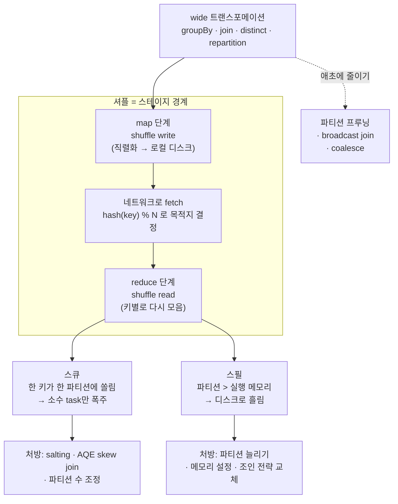

<figure class="post-figure post-figure--header">
<svg role="img" aria-label="셔플에 의한 키 재배치와 데이터 스큐를 한 장으로 정리한 그림. 위쪽은 map 단계로, 세 개의 map task가 각자 자기 파티션의 레코드를 처리한다. 가운데는 셔플로, map task들이 키의 해시값에 따라 레코드를 네트워크 너머로 재배치하는 여러 화살표가 교차하며 흐른다. 오른쪽은 reduce 단계의 파티션들로, 대부분의 파티션은 레코드가 적당히 담겨 있지만 한 파티션(스큐 파티션)만 레코드가 넘치도록 쌓여 빨간 경고가 붙어 있고, 그 아래로 메모리를 넘겨 디스크로 흘러내리는 스필 화살표가 그려져 있다. 아래에는 '셔플 = 네트워크로 키를 다시 모으는 일, 스큐와 스필이 여기서 태어난다'라는 설명이 있다." viewBox="0 0 680 360" xmlns="http://www.w3.org/2000/svg">
  <title>셔플 — map 단계에서 키를 해시로 재배치해 reduce 단계로 모으는 일, 그리고 스큐 파티션과 디스크 스필</title>
  <defs>
    <marker id="shf-arrow" viewBox="0 0 10 10" refX="8" refY="5" markerWidth="6" markerHeight="6" orient="auto-start-reverse">
      <path d="M0,0 L10,5 L0,10 z" fill="var(--secondary-color)"/>
    </marker>
    <marker id="shf-acc" viewBox="0 0 10 10" refX="8" refY="5" markerWidth="6" markerHeight="6" orient="auto-start-reverse">
      <path d="M0,0 L10,5 L0,10 z" fill="var(--accent-color)"/>
    </marker>
    <marker id="shf-gold" viewBox="0 0 10 10" refX="8" refY="5" markerWidth="6" markerHeight="6" orient="auto-start-reverse">
      <path d="M0,0 L10,5 L0,10 z" fill="var(--gold)"/>
    </marker>
  </defs>

  <!-- title -->
  <text x="340" y="24" text-anchor="middle" font-size="17" font-weight="800" fill="currentColor" letter-spacing="1.2">SHUFFLE · SKEW · SPILL</text>
  <text x="340" y="44" text-anchor="middle" font-size="10.5" font-weight="700" fill="currentColor" opacity="0.72">셔플 = 네트워크로 키를 다시 모으는 일 — 스큐와 스필이 바로 여기서 태어난다</text>

  <!-- ===== column labels ===== -->
  <text x="90" y="72" text-anchor="middle" font-size="10.5" font-weight="800" fill="var(--secondary-color)">map 단계</text>
  <text x="340" y="72" text-anchor="middle" font-size="10.5" font-weight="800" fill="currentColor" opacity="0.8">셔플 — 키 재배치</text>
  <text x="590" y="72" text-anchor="middle" font-size="10.5" font-weight="800" fill="var(--gold)">reduce 단계</text>

  <!-- shuffle boundary guides -->
  <g stroke="currentColor" stroke-width="0.9" opacity="0.25" stroke-dasharray="2 3">
    <line x1="205" y1="84" x2="205" y2="300"/>
    <line x1="475" y1="84" x2="475" y2="300"/>
  </g>

  <!-- ===== map tasks (left) ===== -->
  <g>
    <rect x="30" y="96" width="120" height="40" rx="4" fill="var(--bg-light)" stroke="var(--secondary-color)" stroke-width="2"/>
    <rect x="30" y="164" width="120" height="40" rx="4" fill="var(--bg-light)" stroke="var(--secondary-color)" stroke-width="2"/>
    <rect x="30" y="232" width="120" height="40" rx="4" fill="var(--bg-light)" stroke="var(--secondary-color)" stroke-width="2"/>
  </g>
  <g font-size="9" font-weight="700" fill="currentColor" text-anchor="middle">
    <text x="90" y="112">map task 1</text>
    <text x="90" y="180">map task 2</text>
    <text x="90" y="248">map task 3</text>
  </g>
  <!-- key chips inside map tasks -->
  <g font-size="7.5" font-weight="700" text-anchor="middle">
    <rect x="46" y="118" width="20" height="12" rx="2" fill="var(--bg-panel)" stroke="currentColor" stroke-width="1"/><text x="56" y="127" fill="currentColor">a</text>
    <rect x="70" y="118" width="20" height="12" rx="2" fill="var(--bg-panel)" stroke="currentColor" stroke-width="1"/><text x="80" y="127" fill="currentColor">a</text>
    <rect x="94" y="118" width="20" height="12" rx="2" fill="var(--bg-panel)" stroke="currentColor" stroke-width="1"/><text x="104" y="127" fill="currentColor">b</text>
    <rect x="46" y="186" width="20" height="12" rx="2" fill="var(--bg-panel)" stroke="currentColor" stroke-width="1"/><text x="56" y="195" fill="currentColor">a</text>
    <rect x="70" y="186" width="20" height="12" rx="2" fill="var(--bg-panel)" stroke="currentColor" stroke-width="1"/><text x="80" y="195" fill="currentColor">c</text>
    <rect x="94" y="186" width="20" height="12" rx="2" fill="var(--bg-panel)" stroke="currentColor" stroke-width="1"/><text x="104" y="195" fill="currentColor">a</text>
    <rect x="46" y="254" width="20" height="12" rx="2" fill="var(--bg-panel)" stroke="currentColor" stroke-width="1"/><text x="56" y="263" fill="currentColor">a</text>
    <rect x="70" y="254" width="20" height="12" rx="2" fill="var(--bg-panel)" stroke="currentColor" stroke-width="1"/><text x="80" y="263" fill="currentColor">b</text>
    <rect x="94" y="254" width="20" height="12" rx="2" fill="var(--bg-panel)" stroke="currentColor" stroke-width="1"/><text x="104" y="263" fill="currentColor">a</text>
  </g>

  <!-- ===== shuffle crossing arrows (middle) ===== -->
  <g stroke="var(--secondary-color)" stroke-width="1.5" opacity="0.7" fill="none">
    <line x1="152" y1="116" x2="498" y2="120" marker-end="url(#shf-arrow)"/>
    <line x1="152" y1="126" x2="498" y2="196" marker-end="url(#shf-arrow)"/>
    <line x1="152" y1="184" x2="498" y2="118" marker-end="url(#shf-arrow)"/>
    <line x1="152" y1="196" x2="498" y2="256" marker-end="url(#shf-arrow)"/>
    <line x1="152" y1="252" x2="498" y2="122" marker-end="url(#shf-arrow)"/>
    <line x1="152" y1="262" x2="498" y2="198" marker-end="url(#shf-arrow)"/>
  </g>
  <text x="340" y="292" text-anchor="middle" font-size="8" fill="currentColor" opacity="0.7">hash(key) % N 으로 목적지 파티션 결정 · 네트워크 · 직렬화 · 디스크 write/read</text>

  <!-- ===== reduce partitions (right) ===== -->
  <!-- partition A: SKEW (all 'a' keys pile up) -->
  <rect x="500" y="96" width="150" height="46" rx="4" fill="var(--bg-panel)" stroke="var(--accent-color)" stroke-width="2.5"/>
  <text x="512" y="112" font-size="9" font-weight="800" fill="var(--accent-color)">파티션 a</text>
  <g font-size="7.5" font-weight="700" fill="currentColor" text-anchor="middle">
    <rect x="560" y="102" width="16" height="12" rx="2" fill="var(--bg-light)" stroke="var(--accent-color)" stroke-width="1"/><text x="568" y="111">a</text>
    <rect x="579" y="102" width="16" height="12" rx="2" fill="var(--bg-light)" stroke="var(--accent-color)" stroke-width="1"/><text x="587" y="111">a</text>
    <rect x="598" y="102" width="16" height="12" rx="2" fill="var(--bg-light)" stroke="var(--accent-color)" stroke-width="1"/><text x="606" y="111">a</text>
    <rect x="617" y="102" width="16" height="12" rx="2" fill="var(--bg-light)" stroke="var(--accent-color)" stroke-width="1"/><text x="625" y="111">a</text>
    <rect x="560" y="118" width="16" height="12" rx="2" fill="var(--bg-light)" stroke="var(--accent-color)" stroke-width="1"/><text x="568" y="127">a</text>
    <rect x="579" y="118" width="16" height="12" rx="2" fill="var(--bg-light)" stroke="var(--accent-color)" stroke-width="1"/><text x="587" y="127">a</text>
    <rect x="598" y="118" width="16" height="12" rx="2" fill="var(--bg-light)" stroke="var(--accent-color)" stroke-width="1"/><text x="606" y="127">a</text>
  </g>
  <polygon points="646,92 655,107 637,107" fill="var(--bg-panel)" stroke="var(--accent-color)" stroke-width="2" stroke-linejoin="round"/>
  <text x="646" y="105" text-anchor="middle" font-size="9" font-weight="800" fill="var(--accent-color)">!</text>
  <text x="512" y="136" font-size="7.5" font-weight="700" fill="var(--accent-color)">스큐 — 한 키가 몰려 홀로 거대</text>

  <!-- partition B: normal -->
  <rect x="500" y="176" width="150" height="34" rx="4" fill="var(--bg-panel)" stroke="var(--gold)" stroke-width="2"/>
  <text x="512" y="196" font-size="9" font-weight="800" fill="var(--gold)">파티션 b</text>
  <g font-size="7.5" font-weight="700" fill="currentColor" text-anchor="middle">
    <rect x="588" y="184" width="16" height="12" rx="2" fill="var(--bg-light)" stroke="var(--gold)" stroke-width="1"/><text x="596" y="193">b</text>
    <rect x="607" y="184" width="16" height="12" rx="2" fill="var(--bg-light)" stroke="var(--gold)" stroke-width="1"/><text x="615" y="193">b</text>
  </g>

  <!-- partition C: normal -->
  <rect x="500" y="238" width="150" height="34" rx="4" fill="var(--bg-panel)" stroke="var(--gold)" stroke-width="2"/>
  <text x="512" y="258" font-size="9" font-weight="800" fill="var(--gold)">파티션 c</text>
  <g font-size="7.5" font-weight="700" fill="currentColor" text-anchor="middle">
    <rect x="607" y="246" width="16" height="12" rx="2" fill="var(--bg-light)" stroke="var(--gold)" stroke-width="1"/><text x="615" y="255">c</text>
  </g>

  <!-- ===== spill from skew partition ===== -->
  <line x1="575" y1="142" x2="575" y2="316" stroke="var(--accent-color)" stroke-width="2" stroke-dasharray="5 4" marker-end="url(#shf-acc)"/>
  <text x="583" y="164" text-anchor="start" font-size="8" font-weight="700" fill="var(--accent-color)">메모리 초과분</text>
  <rect x="500" y="320" width="150" height="26" rx="3" fill="var(--bg-light)" stroke="var(--accent-color)" stroke-width="2"/>
  <text x="575" y="337" text-anchor="middle" font-size="8.5" font-weight="800" fill="var(--accent-color)">디스크로 스필(spill)</text>

  <!-- map-side note -->
  <text x="90" y="316" text-anchor="middle" font-size="8" fill="currentColor" opacity="0.7">각자 자기 입력 파티션만</text>
  <text x="90" y="328" text-anchor="middle" font-size="8" fill="currentColor" opacity="0.7">읽어 shuffle write</text>
</svg>
<figcaption>이 글을 한 장으로 — map task들이 키의 해시로 레코드를 재배치(셔플)해 reduce 파티션으로 모은다. 한 키가 몰리면 그 파티션만 거대해지는 스큐가 생기고, 파티션이 메모리를 넘기면 디스크로 흘러내리는 스필이 일어난다</figcaption>
</figure>

## 들어가며

[Spark Essential Curriculum](/2026/07/12/spark-essential-curriculum.html)의 **4단계**, 그리고 이 시리즈에서 **실무 가치가 가장 큰** 단계에 도착했습니다. 앞선 세 단계가 "Spark를 돌아가게 만들고 왜 빠른지 이해하는" 여정이었다면, 이번 단계는 정반대 방향입니다 — **왜 느려지는가, 그리고 어떻게 고치는가.**

이 질문의 답은 거의 항상 한 단어로 수렴합니다. **셔플(shuffle)**입니다. [2단계 — RDD/DataFrame/Dataset](/2026/07/16/spark-rdd-dataframe-dataset.html)에서 우리는 트랜스포메이션을 둘로 나눴습니다. 노드 안에서 끝나는 **narrow**와, 노드 사이에서 데이터를 다시 섞어야 하는 **wide**. 바로 이 wide 트랜스포메이션(`groupBy`, `join`, `distinct`, `repartition` …)이 셔플을 일으킵니다. 그리고 [3단계 — Catalyst·Tungsten·AQE](/2026/07/16/spark-catalyst-tungsten-aqe.html)의 마지막에서 본 **AQE**는 "런타임에 셔플의 파티션 수를 다시 정하고, 스큐를 발견하면 쪼갠다"고 했습니다 — 즉 AQE가 자동으로 하는 일의 대상이 바로 이 글의 주제입니다. 이번 단계는 그 자동화가 무엇을 다스리고 있는지, 그리고 자동화만으로 부족할 때 사람이 무엇을 해야 하는지를 손에 잡히게 다룹니다.

Spark 잡이 "느리다"는 신고의 대부분은 셋 중 하나입니다 — 셔플이 과하거나, 데이터가 한쪽으로 쏠렸거나(스큐), 조인 전략을 잘못 골랐거나. 이 글은 그 셋을 **증상 → 원인 → Spark UI로 진단 → 처방**의 순서로 파고듭니다. 이 단계를 넘으면 뒤의 [5단계 — Structured Streaming](/2026/07/16/spark-structured-streaming.html)에서 배치를 넘어 실시간으로 활용을 넓히게 되는데, 스트리밍의 상태 저장 집계 역시 결국 셔플 위에서 돌아가므로 여기서 다지는 감각이 그대로 이어집니다.

<div class="post-summary-box" markdown="1">

### 📌 이 글에서 다루는 내용

- **셔플과 파티셔닝**: 셔플이 왜 가장 비싼가(네트워크·직렬화·디스크 왕복), `spark.sql.shuffle.partitions`의 의미, 셔플을 동반해 파티션을 늘리고 고르게 펴는 `repartition` vs 셔플 없이 줄이는 `coalesce`, 그리고 읽는 데이터 자체를 줄이는 파티션 프루닝
- **스큐와 스필**: 한 키 쏠림이 왜 소수 task를 지옥으로 만드는가, 완화법(salting·AQE skew join), 그리고 파티션이 메모리를 넘겨 디스크로 흘러내리는 **스필(spill)**의 진단과 대응
- **조인 전략**: broadcast hash join(작은 쪽 방송) · sort-merge join(대·대) · shuffle-hash join의 선택 기준과 `broadcast()` 힌트, 그리고 Spark UI로 스테이지·셔플 read/write·task 시간 분포를 읽어 병목을 짚는 법

</div>

## 한눈에 보기 — 셔플이라는 병목의 지형도

이 글의 스파인을 한 장으로 그리면 이렇습니다. wide 트랜스포메이션이 셔플을 부르고, 셔플은 스테이지의 경계가 되며, 그 경계에서 map task들이 키를 해시로 재배치해 reduce task로 모읍니다. 스큐는 이 재배치가 한 파티션으로 쏠릴 때, 스필은 한 파티션이 메모리를 넘길 때 태어납니다. 튜닝의 대부분은 이 그림의 어느 지점을 손보는 일입니다.



세 가지 처방 — 파티션 조정, 스큐/스필 대응, 조인 전략 — 이 이 글의 세 본문에 그대로 대응합니다. 그리고 관통하는 원칙은 하나입니다 — **가장 좋은 셔플은 일어나지 않는 셔플이고, 피할 수 없다면 고르게, 메모리 안에서, 되도록 작게.**

## 셔플과 파티셔닝 — 가장 비싼 연산을 줄이고 고르게 편다

### 셔플은 왜 가장 비싼가

셔플은 "같은 키를 같은 곳에 모으기 위해 데이터를 노드 사이에서 다시 섞는" 연산입니다. `groupByKey`로 키별 집계를 하려면 흩어져 있던 같은 키의 레코드가 한 task에 모여야 하고, `join`으로 두 테이블을 맺으려면 같은 조인 키가 같은 task에 있어야 합니다. 이 "다시 모으기"가 왜 그렇게 비쌀까요? 한 번의 셔플에는 세 가지 무거운 비용이 겹칩니다.

- **디스크 I/O** — map 단계의 각 task는 자기 결과를 목적지 파티션별로 나눠 **로컬 디스크에 shuffle write**합니다(메모리에만 두지 않습니다 — 내결함성과 메모리 압박 때문에). reduce 단계는 그것을 다시 읽습니다. 즉 셔플 한 번에 디스크 write + read가 왕복으로 붙습니다.
- **네트워크 전송** — reduce task는 자기 몫의 데이터를 여러 map 결과에서 네트워크로 **fetch**합니다. 노드가 많을수록 전송이 격자처럼 교차합니다(헤더 그림의 가운데 교차 화살표가 그 모습입니다).
- **직렬화/역직렬화** — 네트워크로 보내려면 객체를 바이트로 직렬화하고, 받아서 역직렬화해야 합니다. 이 CPU 비용이 대용량에서는 무시할 수 없습니다.

narrow 트랜스포메이션(`map`, `filter`, `select`)은 이 셋 중 어느 것도 없습니다 — 각 파티션이 자기 자리에서 처리되고 끝납니다. 그래서 성능 튜닝의 첫 질문은 언제나 **"이 잡에 셔플이 몇 번 있고, 그것들이 정말 다 필요한가"**입니다.

### spark.sql.shuffle.partitions — 셔플 후 파티션 수

셔플이 일어나면 결과는 몇 개의 파티션으로 나뉠까요? 이 값을 정하는 것이 `spark.sql.shuffle.partitions`이고, 기본값은 오래도록 **200**이었습니다. 이 숫자가 성능을 크게 좌우합니다.

- **너무 작으면** — 파티션 하나가 커져 메모리를 넘기고 **스필**이 나거나, 병렬성이 코어 수보다 낮아져 executor가 논다.
- **너무 크면** — 파티션 하나하나가 잘아져 task 스케줄링 오버헤드가 커지고, 작은 파일이 양산된다.

경험칙은 "파티션 하나가 대략 수십~수백 MB, 파티션 수는 전체 코어 수의 몇 배"입니다. 데이터 규모가 잡마다 다르므로 고정값 200은 대부분 맞지 않습니다.

```python
from pyspark.sql import SparkSession

spark = SparkSession.builder.getOrCreate()

# 셔플 후 파티션 수 — 기본 200. 데이터 규모에 맞춰 조정
spark.conf.set("spark.sql.shuffle.partitions", "400")

# ⭐ 3단계에서 본 AQE — 켜 두면 이 값을 "상한"으로 두고
#   런타임 통계로 파티션 수를 알아서 합쳐(coalesce) 준다.
#   Spark 3.2+부터 기본 활성. 고정값 튜닝의 부담을 크게 덜어 준다.
spark.conf.set("spark.sql.adaptive.enabled", "true")
spark.conf.set("spark.sql.adaptive.coalescePartitions.enabled", "true")
```

여기서 3단계의 AQE가 다시 등장합니다. AQE의 **coalesce partitions**는 셔플이 끝난 뒤 실제 파티션 크기 통계를 보고, 너무 잘게 쪼개진 파티션들을 자동으로 합쳐 적정 개수로 줄여 줍니다. 즉 AQE가 켜져 있으면 `shuffle.partitions`는 "정확히 맞춰야 하는 값"에서 "넉넉한 상한"으로 성격이 바뀝니다. 그럼에도 이 파라미터를 이해해야 하는 이유는, AQE가 손대기 전의 출발점이자 스필·병렬성 문제를 진단할 때 첫 번째로 의심할 값이기 때문입니다.

### repartition vs coalesce — 늘릴 때와 줄일 때

파티션 수를 명시적으로 바꾸는 두 연산은 이름이 비슷하지만 성격이 정반대입니다. 이 차이를 헷갈리면 불필요한 셔플을 부르거나, 반대로 데이터가 몰리게 됩니다.

| | `repartition(n)` | `coalesce(n)` |
| --- | --- | --- |
| 셔플 | **일어남** (full shuffle) | **일어나지 않음** (파티션 병합만) |
| 파티션 수 | 늘리기·줄이기 모두 | **줄이기만** 가능 |
| 결과 분포 | 키/랜덤으로 **고르게 재분배** | 기존 파티션을 이어 붙임 → 치우칠 수 있음 |
| 비용 | 비쌈(네트워크·디스크) | 쌈 |
| 쓰는 때 | 파티션 수를 늘리거나 **스큐를 펴야** 할 때 | 필터 후 **파티션이 너무 많아졌을** 때 줄이기 |

```python
# repartition: 셔플을 동반해 파티션 수를 늘리고 고르게 편다.
#   특정 컬럼 기준으로 재분배하면 이후 그 키의 groupBy/join에서 셔플을 아낄 수도 있다.
df_even = df.repartition(400, "user_id")   # user_id 해시로 400개에 고르게

# coalesce: 셔플 없이 파티션을 "합쳐서" 줄인다.
#   강한 필터로 대부분이 걸러진 뒤 파티션 수만 줄이고 싶을 때 이상적.
filtered = df.filter("event_date = '2026-07-15'")   # 1%만 통과했다면
compact = filtered.coalesce(10)                     # 200 → 10, 셔플 없이

# ⚠️ coalesce로 "지나치게" 줄이면 상류 병렬성까지 줄어든다.
#   filter 이전 무거운 연산까지 10개 task로만 돌 수 있으니,
#   병렬성을 유지한 채 고르게 줄이려면 (비싸도) repartition을 쓴다.
compact_even = filtered.repartition(10)
```

핵심 직관: **`coalesce`는 "칸막이를 걷어 방을 합치는" 것**이라 데이터 이동이 없어 싸지만 방마다 크기가 들쭉날쭉할 수 있고, **`repartition`은 "모두 나오게 해서 새 방에 고르게 다시 앉히는" 것**이라 비싸지만 균등합니다. 필터로 데이터가 확 줄어 파티션이 텅텅 빈 상태를 정리할 때는 `coalesce`, 스큐를 펴거나 병렬성을 끌어올려야 할 때는 `repartition`입니다.

### 파티션 프루닝 — 애초에 안 읽기

가장 싼 셔플이 "일어나지 않는 셔플"이듯, 가장 싼 읽기는 "읽지 않는 읽기"입니다. **파티션 프루닝(partition pruning)**은 물리적으로 파티셔닝되어 저장된 데이터(예: `/events/dt=2026-07-15/…`처럼 날짜로 디렉토리가 나뉜 Parquet)에서, 쿼리 조건에 맞는 파티션 디렉토리만 골라 읽고 나머지는 아예 건너뛰는 최적화입니다.

```python
# 데이터가 event_date로 파티셔닝되어 저장돼 있다면 —
df = spark.read.parquet("s3://lake/events")

# 이 필터는 3단계 Catalyst가 파일 목록 단계로 밀어내려(pushdown),
# event_date=2026-07-15 디렉토리 하나만 스캔한다. 나머지 날짜는 디스크에서 읽지도 않음.
recent = df.filter("event_date = '2026-07-15'")

# ⭐ 나아가 조인 키가 파티션 컬럼이면, 런타임에 한쪽 결과로 다른 쪽 파티션을
#   쳐내는 dynamic partition pruning(DPP)까지 작동한다(star-schema 조인의 큰 절약).
fact.join(dim.filter("region = 'APAC'"), "region")
```

파티션 프루닝은 셔플과 직접적 관계는 없지만, **읽는 데이터의 총량을 줄이면 그 뒤의 모든 셔플·조인·집계의 입력이 함께 줄어든다**는 점에서 튜닝의 상류에 있습니다. 파일을 저장할 때 자주 필터하는 컬럼으로 파티셔닝해 두는 설계(2단계에서 본 wide 트랜스포메이션을 줄이는 데이터 레이아웃)가 여기서 보상을 돌려줍니다. 다만 파티션 컬럼의 카디널리티가 너무 높으면(예: user_id로 파티셔닝) 작은 파일이 폭발하므로, 날짜·지역처럼 적당한 카디널리티의 컬럼을 고르는 균형이 필요합니다.

## 스큐와 스필 — 소수 task의 지옥, 그리고 넘쳐 흐르는 메모리

### 데이터 스큐: 왜 한 키가 잡 전체를 볼모로 잡는가

Spark의 스테이지는 **가장 느린 task가 끝나야** 끝납니다. 200개 task 중 199개가 10초에 끝나도 한 개가 30분 걸리면 그 스테이지는 30분입니다. 그리고 그 한 task를 30분으로 만드는 가장 흔한 범인이 **데이터 스큐(data skew)** — 특정 키에 데이터가 비정상적으로 쏠리는 현상입니다.

셔플은 `hash(key) % N`으로 각 레코드의 목적지 파티션을 정합니다. 키 분포가 고르면 파티션들이 비슷한 크기로 나뉘지만, 어떤 키(예: `null`, `"unknown"`, 초대형 고객 ID, 이벤트가 몰리는 인기 상품)가 전체의 상당 비율을 차지하면 **그 키를 받은 파티션 하나만 거대**해집니다. 헤더 그림의 "파티션 a"가 바로 그 모습입니다. 그 파티션을 처리하는 task 하나가 홀로 폭주하고, 나머지 executor는 그 task를 기다리며 놉니다 — 병렬 처리 시스템에서 가장 비효율적인 상태입니다.

**진단(Spark UI)** — 스큐는 UI에서 매우 특징적으로 보입니다.

- Stages 탭에서 문제 스테이지를 열고 **task 시간 분포**를 봅니다. **Max가 Median의 몇 배**(예: median 5초, max 8분)면 전형적인 스큐입니다.
- 같은 표의 **Shuffle Read Size** 컬럼에서도 한 task만 GB급, 나머지는 MB급으로 찍힙니다.
- Summary Metrics의 percentile(25%/50%/75%/Max)이 한쪽으로 길게 늘어진 꼬리를 보입니다.

**처방 1 — AQE skew join (먼저 이걸 켠다).** Spark 3.x의 AQE는 셔플 후 통계에서 비정상적으로 큰 파티션을 발견하면 **그 파티션을 여러 개로 자동 분할**해 여러 task가 나눠 처리하게 합니다. 조인 스큐에 특히 효과적입니다. 많은 경우 이 설정만으로 충분합니다.

```python
# AQE 스큐 조인 — 큰 파티션을 런타임에 잘라 여러 task로 분산
spark.conf.set("spark.sql.adaptive.enabled", "true")
spark.conf.set("spark.sql.adaptive.skewJoin.enabled", "true")
# 중앙값의 이 배수를 넘고 절대 크기 임계도 넘으면 '스큐 파티션'으로 보고 분할
spark.conf.set("spark.sql.adaptive.skewJoin.skewedPartitionFactor", "5")
spark.conf.set("spark.sql.adaptive.skewJoin.skewedPartitionThresholdInBytes", "256m")
```

**처방 2 — salting (AQE로 부족할 때 손으로).** 스큐 키를 인위적으로 쪼개는 고전 기법입니다. 쏠리는 키 뒤에 임의의 소금(salt) 값을 붙여 하나의 키를 여러 개의 "가짜 키"로 나누면, 한 파티션에 몰리던 것이 여러 파티션으로 흩어집니다. 집계라면 소금별로 부분 집계한 뒤 소금을 떼고 다시 합칩니다.

```python
from pyspark.sql import functions as F

# 증상: user_id 별 집계인데 특정 user_id(예: 봇 계정)에 이벤트가 수천만 건 몰림
# 원인: 그 user_id의 모든 레코드가 한 파티션 → 한 task 폭주

SALT_N = 16  # 스큐 키를 16조각으로 쪼갠다

# 1) 소금을 붙여 키를 (user_id, salt)로 확장 → 한 키가 16파티션으로 흩어짐
salted = df.withColumn("salt", (F.rand() * SALT_N).cast("int"))

# 2) 소금까지 포함해 1차(부분) 집계 — 이 셔플은 이제 고르게 분산됨
partial = (salted
    .groupBy("user_id", "salt")
    .agg(F.sum("amount").alias("partial_sum")))

# 3) 소금을 떼고 2차 집계로 합산 — 키가 16배 줄어든 상태라 이 셔플은 가볍다
result = (partial
    .groupBy("user_id")
    .agg(F.sum("partial_sum").alias("total")))
```

salting은 강력하지만 코드가 복잡해지고 조인·집계 로직을 손봐야 하므로, **AQE skew join을 먼저 시도하고 그것으로 안 잡히는 극단적 스큐에만** 꺼내는 것이 실무 순서입니다. 그리고 근본 처방이 있다면 잊지 마세요 — `null`/`unknown` 같은 무의미한 스큐 키는 **조인 전에 걸러내거나 따로 처리**하는 것이 가장 깔끔합니다.

### 스필(spill): 메모리를 넘어 디스크로 흘러내릴 때

두 번째 증상은 **스필(spill)**입니다. Spark의 셔플·정렬·집계·조인은 executor의 실행 메모리(execution memory) 안에서 이루어지길 원합니다. 그런데 한 task가 다뤄야 할 데이터(정렬 버퍼, 해시 테이블, 집계 상태)가 배정된 메모리를 넘으면, Spark는 죽는 대신 **넘치는 만큼을 디스크로 흘려보냅니다.** 이것이 스필입니다. OOM으로 잡이 터지는 것보다는 낫지만, 디스크 write + 나중에 다시 read + (직렬화까지) 비용이 붙어 **task가 급격히 느려집니다.**

스필과 스큐는 자주 함께 옵니다 — 스큐로 거대해진 파티션이 메모리를 넘겨 스필을 부르기 때문입니다(헤더 그림에서 스큐 파티션 아래로 스필 화살표가 내려가는 이유).

**진단(Spark UI)** — 스필은 UI에 명시적인 이름으로 나타납니다.

- Stage 상세의 Summary Metrics와 task 표에 **Spill (Memory)**와 **Spill (Disk)** 컬럼이 있습니다. 이 값이 0이 아니면(특히 GB급이면) 그 task는 메모리가 모자라 디스크를 왕복했다는 뜻입니다.
- Spill (Memory)는 스필된 데이터의 (직렬화 전) 메모리상 크기, Spill (Disk)는 실제 디스크에 쓴 크기입니다. 둘 다 크면 튜닝 여지가 분명합니다.

**처방** — 스필은 "파티션당 데이터가 실행 메모리보다 크다"는 신호이므로, 대응은 둘 중 하나입니다 — 파티션을 작게 나누거나, 메모리를 키우거나.

```python
# 처방 A) 파티션을 더 잘게 → 파티션당 데이터가 줄어 메모리 안에 들어옴
#   (스필의 가장 흔하고 안전한 해법. 스큐가 아니라면 대개 이걸로 해결)
spark.conf.set("spark.sql.shuffle.partitions", "800")   # 200 → 800

# 처방 B) 실행 메모리 자체를 키운다 (executor 메모리·코어 배분 조정)
#   코어당 메모리가 늘도록 executor 코어 수를 줄이거나 메모리를 늘림
#   spark-submit --executor-memory 8g --executor-cores 4  등
#   (execution/storage가 나눠 쓰는 통합 메모리 모델이라 storage 캐시와 경합함에 유의)

# 처방 C) 애초에 스필을 부른 연산을 바꾼다
#   - groupByKey 대신 reduceByKey/집계 함수 → map-side 부분집계로 셔플량 감소
#   - 큰 sort-merge join을 broadcast join으로 교체(아래 절) → 정렬·셔플 자체를 제거
```

세 처방의 우선순위는 대개 **파티션 잘게 나누기 → 연산 바꾸기 → 메모리 키우기**입니다. 메모리를 무작정 키우는 것은 클러스터 비용이자 다른 잡의 자원을 뺏는 일이라 마지막 카드에 가깝습니다. "스필이 보이면 먼저 `shuffle.partitions`를 의심하라"가 실전 감각입니다.

## 조인 전략 — 무엇을, 어떻게 붙일 것인가

조인은 셔플이 가장 크게 작동하는 연산이자, **전략 선택 하나로 성능이 수십 배 갈리는** 지점입니다. Spark는 조인을 세 가지 물리 전략으로 실행하며, 3단계의 Catalyst가 통계를 보고 자동으로 하나를 고릅니다. 자동 선택이 늘 최선은 아니므로, 각 전략의 성격과 언제 사람이 개입해야 하는지를 알아야 합니다.

### 세 가지 조인 전략

| 전략 | 어떻게 | 셔플 | 언제 쓰나 | 핵심 조건 |
| --- | --- | --- | --- | --- |
| **Broadcast hash join** | 작은 쪽을 모든 executor에 **통째로 방송**, 큰 쪽은 셔플 없이 로컬 조인 | 큰 쪽 **셔플 없음** | 한쪽이 충분히 작을 때(수십 MB~수백 MB) | 작은 테이블이 executor 메모리에 들어감 |
| **Sort-merge join** | 양쪽을 조인 키로 **셔플 + 정렬**한 뒤 병합 | **양쪽 셔플** | 둘 다 클 때(대·대) | 대용량 조인의 안전한 기본값 |
| **Shuffle-hash join** | 양쪽을 셔플한 뒤 한쪽으로 **해시 테이블** 구성 | **양쪽 셔플** | 한쪽이 중간 크기, 정렬 비용을 피하고 싶을 때 | 해시 테이블이 메모리에 들어감 |

직관은 이렇습니다.

- **Broadcast hash join**이 가장 빠릅니다 — 큰 테이블을 **아예 셔플하지 않기** 때문입니다. 작은 테이블(차원 테이블, 코드 매핑, 필터된 결과)을 전 executor에 복사해 두면, 큰 테이블은 자기 자리에서 로컬로 조인을 끝냅니다. "가능하면 무조건 이걸 노린다"가 조인 튜닝의 제1원칙입니다.
- **Sort-merge join**은 둘 다 커서 방송이 불가능할 때의 **안전한 기본값**입니다. 양쪽을 조인 키로 셔플·정렬하는 비용이 크지만, 메모리에 다 못 담아도 정렬 기반이라 견고하게 동작합니다. Spark의 기본 대용량 조인 전략입니다.
- **Shuffle-hash join**은 양쪽을 셔플하되 정렬 없이 한쪽을 해시 테이블로 만드는 방식으로, 정렬 비용을 아낄 수 있지만 해시 테이블이 메모리에 들어가야 하고 스필 위험이 있어 Spark가 기본으로는 잘 고르지 않습니다.

### broadcast 힌트 — 방송을 유도하기

Catalyst는 테이블 크기 통계가 `spark.sql.autoBroadcastJoinThreshold`(기본 10MB)보다 작으면 자동으로 broadcast join을 씁니다. 문제는 **통계가 없거나 부정확할 때**(방금 변환한 중간 결과, 파일 통계 미수집)입니다 — 실제로는 작은데 Spark가 몰라서 값비싼 sort-merge join을 골라 버립니다. 이럴 때 사람이 힌트로 알려 줍니다.

```python
from pyspark.sql import functions as F

fact = spark.read.parquet("s3://lake/orders")      # 수억 건, 대용량
dim = spark.read.parquet("s3://lake/products")     # 수천 건, 작음

# ❌ 통계가 없으면 Spark가 dim이 작은 줄 몰라 sort-merge join(양쪽 셔플)을 고를 수 있다
slow = fact.join(dim, "product_id")

# ✅ broadcast 힌트: "dim은 작으니 방송해라" → 큰 fact는 셔플 없이 로컬 조인
fast = fact.join(F.broadcast(dim), "product_id")

# 임계값을 올려 자동 broadcast 범위를 넓힐 수도 있다(방송 대상이 executor 메모리에 들어갈 때만!)
spark.conf.set("spark.sql.autoBroadcastJoinThreshold", str(64 * 1024 * 1024))  # 64MB

# ⚠️ 너무 큰 걸 broadcast하면 Driver가 전량을 모았다가 뿌리는 과정에서 OOM.
#   또 -1로 끄면 강제로 sort-merge만 쓰게 할 수도 있다(스큐 상황 등에서 의도적으로).
```

`F.broadcast()`는 조인 튜닝에서 가장 자주 쓰는 한 줄입니다. 다만 방송 대상은 **모든 executor의 메모리에 통째로 올라가고 Driver가 그것을 모았다 뿌리므로**, 크기를 잘못 판단하면 이득이 아니라 OOM을 부릅니다. "확실히 작은 쪽에만" 붙이는 규율이 필요합니다. AQE는 여기서도 한 손을 보태는데, 런타임에 실제 크기를 보고 sort-merge로 계획된 조인을 broadcast로 **동적 전환**해 주기도 합니다.

### Spark UI로 병목 읽기 — 어디를 볼 것인가

지금까지의 모든 진단은 결국 **Spark UI(그리고 잡 종료 후의 History Server)**를 읽는 능력으로 수렴합니다. 튜닝의 절반은 "어디가 병목인지 정확히 짚는 것"이고, 그 지도가 Spark UI입니다. 자주 보는 순서는 이렇습니다.

<figure class="post-figure">
<svg role="img" aria-label="Spark UI로 병목을 진단하는 절차를 정리한 개념도. 왼쪽부터 SQL 탭에서 물리 계획과 조인 전략을 확인하고, 다음 Stages 탭에서 가장 오래 걸린 스테이지를 찾은 뒤, 그 스테이지의 task 시간 분포에서 Max와 Median의 격차로 스큐를 판정하고, Shuffle Read/Write 크기로 셔플량을, Spill(Memory/Disk) 컬럼으로 스필을 확인하는 네 단계가 오른쪽으로 화살표로 이어진다. 각 단계 아래에는 그 지표가 가리키는 증상(과한 셔플·스큐·스필)이 적혀 있다." viewBox="0 0 680 300" xmlns="http://www.w3.org/2000/svg">
  <title>Spark UI 병목 진단 4단계 — SQL 계획 → 스테이지 → task 분포(스큐) → Spill(스필)</title>
  <defs>
    <marker id="ui-arrow" viewBox="0 0 10 10" refX="8" refY="5" markerWidth="6" markerHeight="6" orient="auto-start-reverse">
      <path d="M0,0 L10,5 L0,10 z" fill="var(--gold)"/>
    </marker>
  </defs>

  <text x="340" y="24" text-anchor="middle" font-size="15" font-weight="800" fill="currentColor">Spark UI로 병목 읽기 — 위에서 아래로 좁혀 간다</text>

  <!-- step 1: SQL tab -->
  <rect x="20" y="48" width="150" height="150" rx="6" fill="var(--bg-light)" stroke="var(--secondary-color)" stroke-width="2.5"/>
  <circle cx="42" cy="70" r="12" fill="var(--bg-panel)" stroke="var(--secondary-color)" stroke-width="2"/>
  <text x="42" y="74" text-anchor="middle" font-size="11" font-weight="800" fill="currentColor">1</text>
  <text x="105" y="74" text-anchor="middle" font-size="11" font-weight="800" fill="var(--secondary-color)">SQL 탭</text>
  <text x="95" y="102" text-anchor="middle" font-size="8.5" fill="currentColor" opacity="0.85">물리 계획 보기</text>
  <text x="95" y="118" text-anchor="middle" font-size="8.5" fill="currentColor" opacity="0.85">조인 전략 확인</text>
  <text x="95" y="134" text-anchor="middle" font-size="8.5" fill="currentColor" opacity="0.85">(BHJ? SMJ?)</text>
  <rect x="34" y="150" width="122" height="36" rx="4" fill="var(--bg-panel)" stroke="var(--secondary-color)" stroke-width="1.5"/>
  <text x="95" y="164" text-anchor="middle" font-size="8" font-weight="700" fill="currentColor">"조인이 sort-merge?</text>
  <text x="95" y="177" text-anchor="middle" font-size="8" font-weight="700" fill="currentColor">broadcast 가능한가?"</text>

  <line x1="172" y1="123" x2="196" y2="123" stroke="var(--gold)" stroke-width="2.5" marker-end="url(#ui-arrow)"/>

  <!-- step 2: Stages -->
  <rect x="198" y="48" width="150" height="150" rx="6" fill="var(--bg-light)" stroke="var(--secondary-color)" stroke-width="2.5"/>
  <circle cx="220" cy="70" r="12" fill="var(--bg-panel)" stroke="var(--secondary-color)" stroke-width="2"/>
  <text x="220" y="74" text-anchor="middle" font-size="11" font-weight="800" fill="currentColor">2</text>
  <text x="285" y="74" text-anchor="middle" font-size="11" font-weight="800" fill="var(--secondary-color)">Stages 탭</text>
  <text x="273" y="102" text-anchor="middle" font-size="8.5" fill="currentColor" opacity="0.85">가장 오래 걸린</text>
  <text x="273" y="118" text-anchor="middle" font-size="8.5" fill="currentColor" opacity="0.85">스테이지 찾기</text>
  <rect x="212" y="136" width="122" height="50" rx="4" fill="var(--bg-panel)" stroke="var(--secondary-color)" stroke-width="1.5"/>
  <text x="273" y="152" text-anchor="middle" font-size="8.5" font-weight="700" fill="currentColor">Shuffle Read/Write</text>
  <text x="273" y="166" text-anchor="middle" font-size="8" fill="currentColor" opacity="0.8">= 셔플량이 과한가</text>
  <text x="273" y="180" text-anchor="middle" font-size="8" font-weight="700" fill="var(--accent-color)">증상: 과한 셔플</text>

  <line x1="350" y1="123" x2="374" y2="123" stroke="var(--gold)" stroke-width="2.5" marker-end="url(#ui-arrow)"/>

  <!-- step 3: task distribution -->
  <rect x="376" y="48" width="150" height="150" rx="6" fill="var(--bg-light)" stroke="var(--accent-color)" stroke-width="2.5"/>
  <circle cx="398" cy="70" r="12" fill="var(--bg-panel)" stroke="var(--accent-color)" stroke-width="2"/>
  <text x="398" y="74" text-anchor="middle" font-size="11" font-weight="800" fill="currentColor">3</text>
  <text x="460" y="74" text-anchor="middle" font-size="10.5" font-weight="800" fill="var(--accent-color)">task 분포</text>
  <!-- mini bar chart: one tall bar = skew -->
  <g>
    <rect x="398" y="150" width="12" height="16" fill="var(--bg-panel)" stroke="currentColor" stroke-width="1"/>
    <rect x="414" y="146" width="12" height="20" fill="var(--bg-panel)" stroke="currentColor" stroke-width="1"/>
    <rect x="430" y="152" width="12" height="14" fill="var(--bg-panel)" stroke="currentColor" stroke-width="1"/>
    <rect x="446" y="102" width="12" height="64" fill="var(--bg-light)" stroke="var(--accent-color)" stroke-width="2"/>
    <rect x="462" y="150" width="12" height="16" fill="var(--bg-panel)" stroke="currentColor" stroke-width="1"/>
    <rect x="478" y="148" width="12" height="18" fill="var(--bg-panel)" stroke="currentColor" stroke-width="1"/>
  </g>
  <text x="452" y="98" text-anchor="middle" font-size="8" font-weight="800" fill="var(--accent-color)">Max ≫ Median</text>
  <text x="451" y="182" text-anchor="middle" font-size="8" font-weight="700" fill="var(--accent-color)">증상: 스큐</text>

  <line x1="528" y1="123" x2="552" y2="123" stroke="var(--gold)" stroke-width="2.5" marker-end="url(#ui-arrow)"/>

  <!-- step 4: Spill -->
  <rect x="554" y="48" width="120" height="150" rx="6" fill="var(--bg-light)" stroke="var(--accent-color)" stroke-width="2.5"/>
  <circle cx="576" cy="70" r="12" fill="var(--bg-panel)" stroke="var(--accent-color)" stroke-width="2"/>
  <text x="576" y="74" text-anchor="middle" font-size="11" font-weight="800" fill="currentColor">4</text>
  <text x="628" y="74" text-anchor="middle" font-size="10.5" font-weight="800" fill="var(--accent-color)">Spill</text>
  <text x="614" y="102" text-anchor="middle" font-size="8.5" fill="currentColor" opacity="0.85">Spill(Memory)</text>
  <text x="614" y="118" text-anchor="middle" font-size="8.5" fill="currentColor" opacity="0.85">Spill(Disk)</text>
  <rect x="566" y="132" width="96" height="30" rx="4" fill="var(--bg-panel)" stroke="var(--accent-color)" stroke-width="1.5"/>
  <text x="614" y="151" text-anchor="middle" font-size="8" font-weight="700" fill="currentColor">&gt; 0 이면 메모리 부족</text>
  <text x="614" y="182" text-anchor="middle" font-size="8" font-weight="700" fill="var(--accent-color)">증상: 스필</text>

  <!-- bottom principle -->
  <rect x="150" y="256" width="380" height="30" rx="5" fill="var(--bg-panel)" stroke="var(--gold)" stroke-width="2"/>
  <text x="340" y="276" text-anchor="middle" font-size="11" font-weight="800" fill="currentColor">계획 → 스테이지 → task 분포 → 스필: 넓게 보고 좁혀 간다</text>
</svg>
<figcaption>Spark UI 진단은 위에서 아래로 좁혀 간다 — SQL 탭에서 조인 전략(계획)을 보고, Stages에서 가장 무거운 스테이지와 셔플량을 찾고, task 시간 분포에서 스큐(Max ≫ Median)를, Spill 컬럼에서 스필을 확인한다</figcaption>
</figure>

읽는 순서를 문장으로 정리하면 이렇습니다.

1. **SQL 탭 — 계획을 먼저 본다.** 쿼리별 실행 계획에서 각 조인이 `BroadcastHashJoin`인지 `SortMergeJoin`인지, 예상보다 셔플(`Exchange`) 노드가 많지 않은지 확인합니다. `.explain("formatted")`로 코드에서 같은 계획을 볼 수도 있습니다.
2. **Stages 탭 — 가장 무거운 스테이지를 찾는다.** Duration으로 정렬해 병목 스테이지를 특정하고, 그 스테이지의 **Shuffle Read/Write** 크기로 셔플량이 과한지 봅니다.
3. **Task 시간 분포 — 스큐를 판정한다.** 그 스테이지의 Summary Metrics에서 **Max가 Median보다 현저히 크면** 스큐입니다. Shuffle Read Size의 편차도 함께 봅니다.
4. **Spill 컬럼 — 스필을 확인한다.** **Spill (Memory/Disk)**가 0이 아니면 메모리 부족이므로 파티션·메모리·연산을 손봅니다.

이 네 걸음이면 "느리다"는 막연한 신고가 "3번 스테이지의 sort-merge join에서 특정 키 스큐로 한 task가 스필까지 나고 있다 → broadcast로 바꾸거나 salting"이라는 구체적 처방으로 바뀝니다. 그것이 이 단계가 주려는 안목입니다.

## 정리

Spark 성능 튜닝, 이 시리즈에서 실무 가치가 가장 큰 4단계를 정리합니다.

- **셔플이 늘 범인이다**: 셔플은 디스크 write/read + 네트워크 fetch + 직렬화가 겹치는, Spark에서 가장 비싼 연산이다. wide 트랜스포메이션(`groupBy`·`join`·`distinct`)이 셔플을 부르고 스테이지 경계가 된다. 튜닝의 첫 질문은 "이 셔플이 정말 필요한가"이다.
- **파티션은 늘릴 땐 `repartition`, 줄일 땐 `coalesce`**: `repartition`은 셔플을 동반해 고르게 재분배(스큐 완화·병렬성 확보), `coalesce`는 셔플 없이 파티션을 합쳐 줄이기(필터 후 정리)에 쓴다. `spark.sql.shuffle.partitions`는 셔플 후 파티션 수의 출발점이며, AQE가 켜지면 이를 상한 삼아 자동 조정한다. 파티션 프루닝으로 애초에 읽는 양을 줄이면 그 뒤 모든 연산이 가벼워진다.
- **스큐는 소수 task를 지옥으로 만든다**: 한 키 쏠림이 한 파티션을 거대하게 만들어 스테이지 전체를 볼모로 잡는다. Spark UI의 task 시간 분포에서 Max ≫ Median으로 진단하고, **AQE skew join을 먼저** 켠 뒤 부족하면 **salting**으로, 무의미한 키(null·unknown)는 아예 걸러내 대응한다.
- **스필은 메모리 부족의 신호다**: 파티션이 실행 메모리를 넘으면 디스크로 흘러 task가 급격히 느려진다. UI의 Spill(Memory/Disk) 컬럼으로 진단하고, **파티션 잘게 나누기 → 연산 바꾸기(reduceByKey·broadcast) → 메모리 키우기** 순으로 처방한다.
- **조인 전략 하나로 수십 배가 갈린다**: 작은 쪽을 방송해 큰 쪽 셔플을 없애는 **broadcast hash join**이 최선이고(`F.broadcast()` 힌트로 유도), 둘 다 크면 **sort-merge join**이 안전한 기본값, **shuffle-hash join**은 그 사이다. broadcast 대상은 반드시 executor 메모리에 들어갈 만큼 작아야 한다.
- **결국 Spark UI를 읽는 능력이다**: SQL 계획(조인 전략) → Stages(셔플량) → task 분포(스큐) → Spill(스필)의 순서로 좁혀 가면, "느리다"가 구체적 병목과 처방으로 번역된다.

되돌아보면 이 단계의 처방은 모두 한 원리의 변주였습니다 — **가장 좋은 셔플은 일어나지 않는 셔플이고(프루닝·broadcast·narrow 유지), 피할 수 없다면 고르게(스큐 완화), 메모리 안에서(스필 방지), 되도록 작게(파티션·조인 전략).** 앞선 1~3단계가 "왜 빠른가"를 설명했다면, 이 단계는 그 위에서 실제 잡을 빠르고 안정적으로 만드는 손기술이었습니다. 다음 [5단계 — Structured Streaming](/2026/07/16/spark-structured-streaming.html)에서는 이 처리 엔진을 배치 너머 실시간으로 확장합니다 — 그리고 그곳의 상태 저장 집계·조인 역시 결국 셔플 위에서 돌아가므로, 여기서 다진 감각이 그대로 이어집니다.

### 다음 학습 (Next Learning)

- [Spark Structured Streaming: 마이크로배치·워터마크·상태](/2026/07/16/spark-structured-streaming.html) — 5단계: 이 처리 엔진을 배치 너머 실시간으로 확장하기
- [Spark Catalyst·Tungsten·AQE: 쿼리 최적화와 코드 생성](/2026/07/16/spark-catalyst-tungsten-aqe.html) — 3단계: 이 글의 AQE(자동 셔플 조정·skew join)가 어디서 왔는지 복습
- [Spark Essential Curriculum](/2026/07/12/spark-essential-curriculum.html) — 시리즈 로드맵으로 돌아가 진행 상황 확인하기
