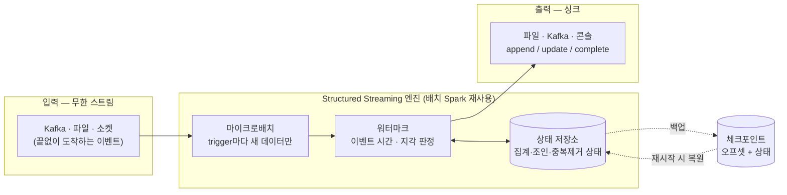
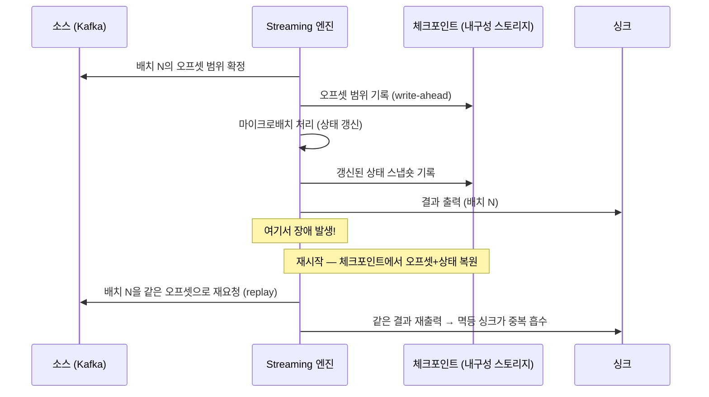

<figure class="post-figure post-figure--header">
<svg role="img" aria-label="Spark Structured Streaming을 한 장으로 정리한 그림. 위쪽은 마이크로배치 모델로, 왼쪽의 무한 입력 스트림에서 도착하는 레코드가 trigger 주기마다 하나의 마이크로배치로 묶여 가운데의 '계속 자라는 무한 테이블'에 새 행으로 덧붙고, 그 테이블은 아래로 점선으로 끝없이 이어진다. 테이블은 상태 저장소를 끼고 처리되어 오른쪽 결과 싱크로 나가며, 상태와 오프셋은 아래의 체크포인트로 백업된다. 아래쪽은 워터마크로, 이벤트 시간 축 위에 두 개의 윈도가 놓이고 워터마크 선이 그어져 그 왼쪽으로 너무 늦게 도착한 지각 레코드는 버려진다." viewBox="0 0 680 366" xmlns="http://www.w3.org/2000/svg">
  <title>Spark Structured Streaming — 마이크로배치로 자라는 테이블을 처리하고, 워터마크로 이벤트 시간의 윈도를 닫는다</title>
  <defs>
    <marker id="sss-arrow" viewBox="0 0 10 10" refX="8" refY="5" markerWidth="6" markerHeight="6" orient="auto-start-reverse">
      <path d="M0,0 L10,5 L0,10 z" fill="var(--secondary-color)"/>
    </marker>
    <marker id="sss-gold" viewBox="0 0 10 10" refX="8" refY="5" markerWidth="6" markerHeight="6" orient="auto-start-reverse">
      <path d="M0,0 L10,5 L0,10 z" fill="var(--gold)"/>
    </marker>
    <marker id="sss-acc" viewBox="0 0 10 10" refX="8" refY="5" markerWidth="6" markerHeight="6" orient="auto-start-reverse">
      <path d="M0,0 L10,5 L0,10 z" fill="var(--accent-color)"/>
    </marker>
  </defs>

  <!-- title -->
  <text x="340" y="22" text-anchor="middle" font-size="16" font-weight="800" fill="currentColor" letter-spacing="1.2">SPARK STRUCTURED STREAMING</text>
  <text x="340" y="41" text-anchor="middle" font-size="10" font-weight="700" fill="currentColor" opacity="0.72">무한 스트림을 계속 자라는 테이블로 — 마이크로배치로 처리하고, 워터마크로 시간을 닫는다</text>

  <!-- ===== SECTION A: micro-batch as growing table ===== -->
  <text x="30" y="66" text-anchor="start" font-size="10" font-weight="700" fill="currentColor" opacity="0.72">① 도착하는 마이크로배치가 '계속 자라는 무한 테이블'에 새 행으로 덧붙는다</text>

  <!-- input stream -->
  <text x="70" y="86" text-anchor="middle" font-size="9" font-weight="700" fill="currentColor" opacity="0.72">입력 스트림</text>
  <rect x="24" y="92" width="92" height="86" rx="4" fill="var(--bg-light)" stroke="currentColor" stroke-width="2"/>
  <g stroke="currentColor" stroke-width="1" opacity="0.4" stroke-dasharray="3 3">
    <line x1="24" y1="92" x2="116" y2="92"/>
  </g>
  <g fill="var(--bg-panel)" stroke="currentColor" stroke-width="1.4">
    <rect x="34" y="100" width="72" height="16" rx="2"/>
    <rect x="34" y="122" width="72" height="16" rx="2"/>
    <rect x="34" y="144" width="72" height="16" rx="2"/>
  </g>
  <g font-size="7.5" fill="currentColor" text-anchor="middle" opacity="0.85">
    <text x="70" y="112">event · t</text>
    <text x="70" y="134">event · t</text>
    <text x="70" y="156">event · t</text>
  </g>
  <text x="70" y="174" text-anchor="middle" font-size="7.5" fill="currentColor" opacity="0.7">무한히 이어짐</text>

  <!-- trigger clock + arrow -->
  <circle cx="140" cy="128" r="11" fill="var(--bg-panel)" stroke="var(--accent-color)" stroke-width="2"/>
  <line x1="140" y1="128" x2="140" y2="120" stroke="var(--accent-color)" stroke-width="1.8" stroke-linecap="round"/>
  <line x1="140" y1="128" x2="146" y2="131" stroke="var(--accent-color)" stroke-width="1.8" stroke-linecap="round"/>
  <text x="140" y="152" text-anchor="middle" font-size="7.5" font-weight="700" fill="var(--accent-color)">trigger</text>
  <line x1="116" y1="118" x2="130" y2="122" stroke="var(--secondary-color)" stroke-width="2" marker-end="url(#sss-arrow)"/>
  <line x1="151" y1="128" x2="176" y2="128" stroke="var(--secondary-color)" stroke-width="2" marker-end="url(#sss-arrow)"/>
  <text x="163" y="118" text-anchor="middle" font-size="7" fill="currentColor" opacity="0.7">배치</text>

  <!-- growing unbounded table -->
  <text x="290" y="86" text-anchor="middle" font-size="9" font-weight="800" fill="var(--gold)">계속 자라는 무한 테이블 (unbounded table)</text>
  <rect x="182" y="92" width="216" height="92" rx="4" fill="var(--bg-panel)" stroke="var(--gold)" stroke-width="2.5"/>
  <!-- existing rows -->
  <g stroke="currentColor" stroke-width="1" opacity="0.35">
    <line x1="182" y1="108" x2="398" y2="108"/>
    <line x1="182" y1="124" x2="398" y2="124"/>
    <line x1="182" y1="140" x2="398" y2="140"/>
    <line x1="266" y1="92" x2="266" y2="184"/>
    <line x1="332" y1="92" x2="332" y2="184"/>
  </g>
  <g font-size="7.5" fill="currentColor" opacity="0.7" text-anchor="middle">
    <text x="224" y="104">key</text><text x="299" y="104">event_time</text><text x="365" y="104">value</text>
  </g>
  <!-- newly appended batch (accent) -->
  <rect x="184" y="158" width="212" height="24" rx="2" fill="var(--bg-light)" stroke="var(--accent-color)" stroke-width="2"/>
  <text x="290" y="174" text-anchor="middle" font-size="8" font-weight="700" fill="var(--accent-color)">← 이번 마이크로배치가 덧붙인 새 행들</text>
  <!-- infinite extension -->
  <line x1="200" y1="188" x2="200" y2="204" stroke="var(--gold)" stroke-width="1.6" stroke-dasharray="3 3"/>
  <line x1="380" y1="188" x2="380" y2="204" stroke="var(--gold)" stroke-width="1.6" stroke-dasharray="3 3"/>
  <text x="290" y="200" text-anchor="middle" font-size="7.5" font-weight="700" fill="var(--gold)">무한 — 끝없이 아래로 자란다</text>

  <!-- arrow table -> sink -->
  <line x1="398" y1="128" x2="428" y2="128" stroke="var(--secondary-color)" stroke-width="2" marker-end="url(#sss-arrow)"/>
  <text x="413" y="118" text-anchor="middle" font-size="7" fill="currentColor" opacity="0.7">결과</text>

  <!-- sink -->
  <text x="510" y="86" text-anchor="middle" font-size="9" font-weight="700" fill="currentColor" opacity="0.72">결과 싱크</text>
  <rect x="434" y="96" width="152" height="52" rx="4" fill="var(--bg-light)" stroke="currentColor" stroke-width="2"/>
  <text x="510" y="118" text-anchor="middle" font-size="8.5" font-weight="700" fill="currentColor">파일 · Kafka · 콘솔</text>
  <text x="510" y="134" text-anchor="middle" font-size="7.5" fill="currentColor" opacity="0.72">append / update / complete</text>

  <!-- checkpoint cylinder -->
  <g>
    <ellipse cx="490" cy="176" rx="34" ry="7" fill="var(--bg-panel)" stroke="var(--gold)" stroke-width="2"/>
    <rect x="456" y="176" width="68" height="18" fill="var(--bg-panel)" stroke="none"/>
    <line x1="456" y1="176" x2="456" y2="194" stroke="var(--gold)" stroke-width="2"/>
    <line x1="524" y1="176" x2="524" y2="194" stroke="var(--gold)" stroke-width="2"/>
    <ellipse cx="490" cy="194" rx="34" ry="7" fill="var(--bg-panel)" stroke="var(--gold)" stroke-width="2"/>
    <text x="490" y="189" text-anchor="middle" font-size="7.5" font-weight="700" fill="currentColor">체크포인트</text>
  </g>
  <line x1="290" y1="182" x2="452" y2="184" stroke="var(--gold)" stroke-width="1.8" stroke-dasharray="5 4" marker-end="url(#sss-gold)"/>
  <text x="378" y="216" text-anchor="middle" font-size="7.5" font-weight="700" fill="var(--gold)">오프셋 + 상태 백업</text>

  <!-- ===== divider ===== -->
  <line x1="30" y1="232" x2="650" y2="232" stroke="currentColor" stroke-width="1.4" opacity="0.25"/>

  <!-- ===== SECTION B: watermark ===== -->
  <text x="30" y="252" text-anchor="start" font-size="10" font-weight="700" fill="currentColor" opacity="0.72">② 워터마크가 이벤트 시간의 윈도를 닫는다 — 그 왼쪽으로 늦게 온 레코드는 버린다</text>

  <!-- event-time axis -->
  <line x1="60" y1="330" x2="620" y2="330" stroke="currentColor" stroke-width="2" opacity="0.55"/>
  <text x="632" y="333" text-anchor="start" font-size="8" fill="currentColor" opacity="0.7">이벤트 시간 →</text>
  <g stroke="currentColor" stroke-width="1.2" opacity="0.5">
    <line x1="90" y1="326" x2="90" y2="334"/>
    <line x1="230" y1="326" x2="230" y2="334"/>
    <line x1="370" y1="326" x2="370" y2="334"/>
    <line x1="510" y1="326" x2="510" y2="334"/>
  </g>
  <g font-size="7.5" fill="currentColor" opacity="0.7" text-anchor="middle">
    <text x="90" y="346">12:00</text><text x="230" y="346">12:01</text><text x="370" y="346">12:02</text><text x="510" y="346">12:03</text>
  </g>

  <!-- windows -->
  <rect x="90" y="292" width="140" height="16" rx="3" fill="var(--bg-panel)" stroke="var(--secondary-color)" stroke-width="1.6"/>
  <text x="160" y="304" text-anchor="middle" font-size="7.5" font-weight="700" fill="currentColor">윈도 12:00–12:01</text>
  <rect x="234" y="292" width="140" height="16" rx="3" fill="var(--bg-panel)" stroke="var(--secondary-color)" stroke-width="1.6"/>
  <text x="304" y="304" text-anchor="middle" font-size="7.5" font-weight="700" fill="currentColor">윈도 12:01–12:02</text>

  <!-- grace band -->
  <rect x="230" y="268" width="140" height="62" fill="var(--accent-color)" opacity="0.12"/>
  <text x="300" y="280" text-anchor="middle" font-size="7" font-weight="700" fill="var(--accent-color)">grace (지각 허용)</text>

  <!-- watermark line -->
  <line x1="230" y1="262" x2="230" y2="330" stroke="var(--gold)" stroke-width="2.2" stroke-dasharray="4 3"/>
  <polygon points="230,262 222,270 238,270" fill="var(--gold)"/>
  <text x="230" y="258" text-anchor="middle" font-size="8" font-weight="800" fill="var(--gold)">워터마크</text>

  <!-- accepted late record (within grace) -->
  <circle cx="300" cy="318" r="6" fill="var(--bg-panel)" stroke="var(--accent-color)" stroke-width="2"/>
  <polyline points="296,318 299,321 305,314" fill="none" stroke="var(--accent-color)" stroke-width="1.8" stroke-linecap="round" stroke-linejoin="round"/>
  <text x="405" y="316" text-anchor="start" font-size="7.5" font-weight="700" fill="var(--accent-color)">지각이지만 grace 안 → 반영</text>

  <!-- dropped late record (left of watermark) -->
  <circle cx="130" cy="318" r="6" fill="var(--bg-panel)" stroke="currentColor" stroke-width="2" opacity="0.6"/>
  <line x1="126" y1="314" x2="134" y2="322" stroke="currentColor" stroke-width="1.8" opacity="0.7"/>
  <line x1="134" y1="314" x2="126" y2="322" stroke="currentColor" stroke-width="1.8" opacity="0.7"/>
  <text x="118" y="308" text-anchor="middle" font-size="7.5" font-weight="700" fill="currentColor" opacity="0.75">너무 늦음 → drop</text>
</svg>
<figcaption>이 글을 한 장으로 — 위: trigger마다 마이크로배치가 '계속 자라는 무한 테이블'에 행을 덧붙이고, 상태·오프셋은 체크포인트로 백업된다. 아래: 워터마크가 이벤트 시간의 윈도를 닫고, 그 왼쪽으로 너무 늦게 온 레코드는 버려진다</figcaption>
</figure>

## 들어가며

[Spark Essential Curriculum](/2026/07/12/spark-essential-curriculum.html)의 **5단계**, "활용 넓히기"의 첫 관문입니다. 여기까지 우리는 Spark를 철저히 **배치**의 도구로 다뤄 왔습니다 — [1단계 아키텍처](/2026/07/16/spark-architecture-driver-executor.html)에서 하나의 Driver가 실행 계획을 세우고 여러 Executor가 task를 나눠 수행하는 그림을, 2·3단계에서 DataFrame과 Catalyst·Tungsten이 왜 빠른지를, [4단계 셔플·튜닝](/2026/07/16/spark-shuffle-partitioning-tuning.html)에서 성능의 병목인 셔플을 다스리는 법을 익혔습니다.

이제 질문을 바꿉니다 — **데이터가 한 번에 다 있지 않고, 끝없이 흘러 들어온다면?** 답이 놀랍도록 단순합니다. Structured Streaming은 무한한 스트림을 **"계속 자라는 하나의 테이블(unbounded table)"**로 보고, 배치에서 쓰던 것과 **거의 똑같은 DataFrame/SQL API**로 다루게 해 줍니다. 그래서 앞 단계에서 익힌 것 — 실행이 Job → Stage → Task로 쪼개지는 방식, DataFrame 최적화, 셔플·파티셔닝 튜닝 — 이 스트리밍에도 **그대로 이어집니다.** 새 엔진을 배우는 게 아니라, 이미 아는 배치 엔진을 무한 입력 위에서 반복 실행하는 것에 가깝습니다.

한 가지 대비를 미리 잡아 두면 이해가 쉽습니다. 앞 시리즈의 [Kafka Streams](/2026/07/15/kafka-streams.html)는 **클러스터가 아니라 라이브러리**였습니다 — JVM 앱에 의존성 하나를 얹는 방식이었죠. Spark Structured Streaming은 그 반대편입니다. **클러스터에 제출하는 잡**이고, 배치 Spark 잡과 똑같이 Driver/Executor 위에서 돕니다. "Kafka에서 Kafka로, 앱으로 배포"면 Streams가, "레이크하우스 배치와 한 코드베이스로, 클러스터에서"면 Spark가 어울린다는 그 경계의 이쪽 편이 이번 글입니다.

스트림 처리 자체의 큰 개념 — 이벤트 시간, 윈도잉, 워터마크가 왜 필요한지 — 은 오버뷰 시리즈의 [데이터 변환·처리(Processing)](/2026/06/25/data-processing.html)에서 잡았습니다. 이번에는 그 개념들이 Structured Streaming이라는 구체적 도구에서 **어떤 API와 어떤 내부 모델로** 구현되는지를 손에 잡히게 다룹니다.

<div class="post-summary-box" markdown="1">

### 📌 이 글에서 다루는 내용

- **마이크로배치 모델**: 스트림을 계속 자라는 무한 테이블로 보는 발상, 배치와 통합된 DataFrame/SQL API, `readStream`/`writeStream`, trigger(마이크로배치 주기)와 Continuous Processing
- **워터마크와 윈도잉**: 이벤트 시간 vs 처리 시간, 텀블링/슬라이딩/세션 윈도, `withWatermark`로 "언제 윈도를 닫고 지각 데이터를 버릴지" 정하기, 지각 레코드 처리
- **상태와 정확성**: 상태 저장 연산(집계·조인·중복 제거)과 상태 저장소, 체크포인트, 출력 모드(append/update/complete)와 멱등 싱크·체크포인트로 얻는 exactly-once 보장

</div>

## 한눈에 보기 — 스트림에서 정확한 결과까지

이 글의 스파인을 한 장으로 그리면 이렇습니다. 무한 입력 스트림이 trigger마다 마이크로배치로 들어오고, 워터마크가 이벤트 시간을 판정하며, 상태 저장 연산은 상태 저장소에 상태를 쌓습니다. 그 상태와 처리 지점(오프셋)은 체크포인트에 백업되어 장애를 견디고, 결과는 출력 모드에 맞춰 싱크로 나갑니다. 멱등 싱크와 체크포인트가 만나면 end-to-end exactly-once가 성립합니다.



핵심은 가운데 상자입니다 — **엔진의 실체는 새로 만든 스트림 처리기가 아니라, 앞 단계에서 익힌 배치 Spark를 무한 입력 위에서 반복 돌리는 것**입니다. 그래서 배치에서 쌓은 실력이 고스란히 재사용됩니다.

## 마이크로배치 모델 — 무한 스트림을 자라는 테이블로 본다

### 발상의 전환: 스트림 = 계속 자라는 무한 테이블

스트림 처리가 어려운 이유의 절반은 "흐르는 데이터"를 위한 별도의 사고 틀을 새로 배워야 한다는 데 있습니다. Structured Streaming의 결정적 아이디어는 그 사고 틀을 **없애 버린 것**입니다. 스트림을 특별한 무언가가 아니라, **행이 계속 아래로 덧붙는 하나의 테이블**로 봅니다.

- 새 이벤트가 도착한다 = 그 무한 테이블(**Input Table**)에 **새 행이 추가**된다.
- 우리가 쓰는 스트리밍 쿼리 = 그 테이블에 대한 **평범한 DataFrame/SQL 쿼리**.
- 엔진이 하는 일 = 새 행이 들어올 때마다 쿼리를 다시 계산해 **Result Table**을 갱신하고, 갱신분을 싱크로 내보내는 것.

즉 "스트림 쿼리를 어떻게 쓰지?"라는 질문이 "이 테이블에 대한 배치 쿼리를 어떻게 쓰지?"로 환원됩니다. 개발자 입장에서 배치와 스트리밍의 API가 거의 같아지는 이유가 여기 있습니다. `spark.read`가 `spark.readStream`으로, `df.write`가 `df.writeStream`으로 바뀌는 정도이고, 그 사이의 `select`·`groupBy`·`join`은 배치에서 쓰던 그대로입니다.

```python
from pyspark.sql import SparkSession
from pyspark.sql import functions as F

spark = SparkSession.builder.appName("order-stream").getOrCreate()

# 배치라면 spark.read... — 스트리밍은 spark.readStream. 그 외엔 사고방식이 같다
orders = (
    spark.readStream
    .format("kafka")
    .option("kafka.bootstrap.servers", "broker1:9092")
    .option("subscribe", "orders")
    .load()
)

# Kafka의 value(바이너리)를 JSON으로 파싱 — 이 변환 코드는 배치와 완전히 동일하다
from pyspark.sql.types import StructType, StringType, DoubleType, TimestampType

schema = (
    StructType()
    .add("order_id", StringType())
    .add("region", StringType())
    .add("amount", DoubleType())
    .add("event_time", TimestampType())   # 이벤트가 "실제로 일어난" 시각
)

parsed = (
    orders.select(F.from_json(F.col("value").cast("string"), schema).alias("d"))
    .select("d.*")
)

# 지역별 누적 매출 — groupBy/agg도 배치와 똑같은 코드
by_region = parsed.groupBy("region").agg(F.sum("amount").alias("total"))
```

이 코드 어디에도 "스트림 루프"나 "이벤트 콜백" 같은 것이 없습니다. `by_region`은 그냥 DataFrame이고, 다만 그 원천이 무한할 뿐입니다.

### 실행: trigger가 마이크로배치를 끊는다

그렇다면 "무한 테이블에 쿼리를 다시 계산한다"를 엔진은 실제로 어떻게 할까요? 답이 **마이크로배치(micro-batch)**입니다. 엔진은 무한 스트림을 시간으로 잘게 끊어, 매 주기마다 **그 주기에 새로 도착한 데이터만**으로 작은 배치 잡 하나를 실행합니다. 마이크로배치 하나 = 앞 단계에서 배운 그 배치 Spark 잡 하나(Job → Stage → Task)입니다. 스트리밍이 배치 튜닝 지식을 그대로 물려받는 근본 이유가 이것입니다.

이 주기를 정하는 것이 **trigger**입니다.

```python
query = (
    by_region.writeStream
    .outputMode("complete")                          # 출력 모드 (뒤에서 설명)
    .format("console")
    # ── trigger: 마이크로배치를 언제 끊을지 ──
    .trigger(processingTime="10 seconds")            # 10초마다 한 배치
    # .trigger(availableNow=True)                    # 지금 밀린 데이터만 다 처리하고 종료(배치성 실행)
    # .trigger(continuous="1 second")                # Continuous Processing(실험적) — 아래 참고
    .option("checkpointLocation", "/chk/order-region")
    .start()
)

query.awaitTermination()   # 스트리밍 쿼리는 종료 신호가 올 때까지 계속 돈다
```

trigger 종류를 감으로 잡아 두면 됩니다.

- **`processingTime="10 seconds"`** — 10초마다 한 배치. 지정을 생략하면 "직전 배치가 끝나는 즉시 다음 배치"가 기본값으로, 지연을 최소화하되 배치 간격이 데이터량에 따라 요동칩니다.
- **`availableNow=True`** — 지금 밀려 있는 데이터를 여러 배치로 나눠 다 처리한 뒤 **스스로 종료**합니다. "스트리밍 코드로 배치를 돌리는" 실행으로, 주기적 증분 처리에 유용합니다.
- **`continuous="1 second"`** — **Continuous Processing**. 마이크로배치가 아니라 레코드 단위로 흘려 ~1ms 수준의 초저지연을 노리는 실험적 모드입니다. 지원 연산이 제한적(맵류 위주, 집계 미지원)이라 실무 표준은 여전히 마이크로배치입니다. "초저지연이 꼭 필요하면 이런 모드도 있다" 정도만 알아 두면 충분합니다.

마이크로배치 모델의 트레이드오프는 명확합니다. 지연은 trigger 주기(수백 ms~수 초)로 내려가지만 0은 아닙니다. 대신 얻는 것이 큽니다 — 배치 엔진의 성숙한 최적화(Catalyst·AQE·whole-stage codegen)를 스트리밍에서 공짜로 쓰고, 배치와 스트리밍이 **하나의 코드·하나의 엔진**으로 통합됩니다. "밀리초가 생사를 가르는" 소수 사례가 아니라면, 이 통합의 실무 가치가 초저지연보다 훨씬 큽니다.

## 워터마크와 윈도잉 — 시간을 다루고, 언제 닫을지 정한다

### 이벤트 시간 vs 처리 시간

"분당 주문 수"를 셀 때의 **분**은 어느 시계의 분일까요? 두 후보가 있습니다.

- **이벤트 시간(event time)** — 사건이 **실제로 일어난** 시각. 위 코드의 `event_time` 컬럼처럼 데이터 안에 박혀 있습니다.
- **처리 시간(processing time)** — 레코드가 Spark에 **도착해 처리되는** 시각. 엔진의 벽시계입니다.

네트워크 지연·재시도·모바일 오프라인 때문에 둘은 얼마든지 벌어집니다. "12:00:59에 일어난 주문"이 12:03에야 도착하는 일은 흔합니다. 분석의 정답은 거의 항상 **이벤트 시간**입니다 — 그 주문은 12:00~12:01 윈도에 세어져야지, 도착한 12:03 윈도에 세어지면 안 되니까요. Structured Streaming은 데이터 안의 타임스탬프 컬럼을 이벤트 시간으로 그대로 쓸 수 있게 해 줍니다.

문제는 여기서 생깁니다. **이벤트가 순서를 어기고, 늦게 도착한다면 — 12:00~12:01 윈도의 집계를 "다 끝났다"고 확정하고 결과를 내보내도 되는 순간은 언제인가?** 무한히 기다리면 그 윈도의 상태를 영원히 메모리에 들고 있어야 하고, 너무 일찍 닫으면 지각 데이터를 잃습니다. 이 딜레마를 푸는 장치가 **워터마크**입니다.

### 윈도잉: 무한 스트림 위에 시간 구간을 긋다

집계를 하려면 무한한 흐름을 유한한 시간 조각으로 잘라야 합니다. 그 조각이 **윈도(window)**이고, 세 종류를 기억하면 됩니다.

| 윈도 | 모양 | 어울리는 질문 |
| --- | --- | --- |
| **텀블링(tumbling)** | 고정 크기, 겹치지 않음 | "5분마다 5분치 집계" — 대시보드 지표 |
| **슬라이딩(sliding)** | 고정 크기, 일정 간격으로 겹침 | "1분마다 갱신되는 최근 5분 집계" — 이동 지표 |
| **세션(session)** | 활동 간격 기반, 크기 가변 | "30분 쉬면 세션 종료" — 사용자 세션 분석 |

텀블링은 슬라이딩의 특수형(간격 = 크기)이고, 슬라이딩에서는 레코드 하나가 여러 윈도에 동시에 속합니다. 세션 윈도만 크기가 데이터에 따라 달라집니다 — 활동이 이어지는 한 늘어나고, 지정한 gap만큼 조용하면 닫힙니다. API는 `window()`·`session_window()` 함수를 `groupBy`에 넣는 형태입니다.

```python
from pyspark.sql import functions as F

# 텀블링: 이벤트 시간 기준 5분 윈도로 지역별 매출 집계
tumbling = (
    parsed
    .withWatermark("event_time", "10 minutes")        # 워터마크(아래에서 설명) — 지각 10분까지 허용
    .groupBy(
        F.window("event_time", "5 minutes"),          # 5분 텀블링 윈도
        "region",
    )
    .agg(F.sum("amount").alias("total"),
         F.count("*").alias("cnt"))
)

# 슬라이딩: 5분 윈도를 1분마다 — F.window(컬럼, 윈도크기, 슬라이드간격)
sliding = (
    parsed
    .withWatermark("event_time", "10 minutes")
    .groupBy(F.window("event_time", "5 minutes", "1 minute"), "region")
    .agg(F.sum("amount").alias("total"))
)

# 세션: 30분 비활동이면 세션 종료 — F.session_window(컬럼, gap)
sessions = (
    parsed
    .withWatermark("event_time", "10 minutes")
    .groupBy(F.session_window("event_time", "30 minutes"), "region")
    .agg(F.count("*").alias("events"))
)
```

결과에 `window` 컬럼(구조체로 `window.start`·`window.end`를 가짐)이 생기는 것에 주목하세요 — 집계의 결과는 "키"가 아니라 "키 × 윈도"별 상태입니다.

### 워터마크: 언제 닫고, 무엇을 버릴지

세 코드 모두에 등장한 `withWatermark("event_time", "10 minutes")`가 이 절의 주인공입니다. 워터마크는 엔진에게 이렇게 알려 줍니다 — **"지금까지 관측한 최대 이벤트 시간에서 10분 이전까지는, 그보다 더 늦게 오는 데이터는 없다고 보고 버려도 된다."**

엔진은 각 마이크로배치에서 본 이벤트 시간의 최댓값을 추적하고, **워터마크 = (관측된 최대 이벤트 시간) − (지각 허용치)**로 계속 전진시킵니다. 그리고 이 워터마크로 두 가지를 결정합니다.

- **윈도를 언제 닫는가** — 윈도의 끝이 워터마크보다 뒤처지면(즉 워터마크가 그 윈도를 지나가면) 윈도가 확정되고, 그 윈도의 상태를 상태 저장소에서 제거합니다. 이것이 상태가 무한히 커지지 않게 막는 **핵심 메커니즘**입니다. 워터마크가 없으면 엔진은 "언제 더는 지각 데이터가 안 올지" 알 수 없어 모든 윈도의 상태를 영원히 들고 있어야 합니다.
- **지각 레코드를 반영할까 버릴까** — 워터마크보다 **뒤(더 늦은) 이벤트 시간**의 지각 레코드는 아직 열려 있는 윈도에 정상 반영됩니다. 워터마크보다 **앞선** 이벤트 시간의 레코드는 그 윈도가 이미 닫혔으므로 **버려집니다(drop)**. 헤더 그림 아래쪽이 바로 이 순간입니다 — grace 안(워터마크 오른쪽)의 지각은 반영되고, 워터마크 왼쪽으로 너무 늦게 온 레코드는 버려집니다.

트레이드오프는 지각 허용치(위 예의 10분)의 크기에 있습니다. **크게 잡으면** 지각 데이터를 더 많이 살리지만, 윈도가 늦게 닫혀 결과 확정이 지연되고 상태를 오래 들고 있어야 합니다. **작게 잡으면** 결과가 빨리 확정되고 상태가 가볍지만, 그만큼 지각 데이터를 더 많이 버립니다. 정답은 없고, **실제 지연 분포**를 보고 정하는 운영 결정입니다 — "우리 데이터의 99%는 5분 안에 도착한다"면 5~10분이 합리적 출발점입니다.

```python
# 워터마크가 상태 크기와 정확성을 어떻게 가르는지 한눈에
short = parsed.withWatermark("event_time", "1 minute")    # 상태 가벼움 · 결과 빠름 · 지각 많이 버림
long_  = parsed.withWatermark("event_time", "1 hour")     # 지각 잘 살림 · 상태 무거움 · 결과 늦음
```

## 상태와 정확성 — 상태를 관리하고, 정확히 한 번 처리한다

### 상태 저장 연산과 상태 저장소

앞의 윈도 집계에서 이미 "상태"가 등장했습니다. 마이크로배치는 매번 **그 배치의 새 데이터만** 봅니다. 그런데 "지역별 누적 매출"이나 "5분 윈도의 건수"는 이전 배치들의 결과를 기억하고 있어야 계산됩니다. 이렇게 **여러 마이크로배치에 걸쳐 정보를 이어 가야 하는** 연산이 **상태 저장(stateful) 연산**이고, 대표적으로 셋입니다.

- **집계(aggregation)** — `groupBy().agg()`. 윈도별·키별 누적값을 상태로 유지합니다.
- **스트림-스트림 조인** — 양쪽이 흐르는 사건이므로 "얼마나 가까운 시간에 일어난 것끼리 맺을지"를 위해 양쪽 레코드를 일정 기간 상태로 버퍼링합니다(그래서 조인에도 워터마크가 필요합니다).
- **중복 제거(deduplication)** — `dropDuplicates(["order_id"])`. 이미 본 키를 상태로 기억해 재전송된 중복을 걸러냅니다.

이 상태는 **상태 저장소(state store)**에 보관됩니다. 기본은 각 Executor의 메모리에 상태를 두고 마이크로배치마다 갱신하며, 대규모 상태를 위해 RocksDB 기반 상태 저장소(HDFS/오브젝트 스토리지에 스냅숏·델타로 백업)를 옵션으로 켤 수 있습니다. 그리고 앞서 본 대로 **워터마크가 지나간 윈도의 상태는 제거**되므로, 워터마크가 곧 상태 저장소의 청소부 역할을 합니다.

```python
# 중복 제거도 상태 저장 연산 — 워터마크를 함께 주면 오래된 키를 상태에서 비운다
deduped = (
    parsed
    .withWatermark("event_time", "1 hour")
    .dropDuplicates(["order_id", "event_time"])   # 1시간 창 안에서 같은 order_id 재전송을 제거
)

# 대규모 상태라면 RocksDB 상태 저장소로 (JVM 힙 압박·GC를 피한다)
spark.conf.set(
    "spark.sql.streaming.stateStore.providerClass",
    "org.apache.spark.sql.execution.streaming.state.RocksDBStateStoreProvider",
)
```

### 체크포인트: 장애를 견디는 뿌리

상태를 메모리(또는 로컬 RocksDB)에 두면 빠르지만, Executor가 죽으면 함께 사라집니다. Structured Streaming의 내결함성은 **체크포인트(checkpoint)**에서 옵니다. `writeStream`에 준 `checkpointLocation`(내구성 있는 스토리지 — HDFS·S3 등)에 엔진은 매 마이크로배치마다 두 가지를 기록합니다.

- **어디까지 읽었는가** — 각 입력 소스의 오프셋(예: Kafka 파티션별 offset). "이 배치가 책임지는 입력 범위"가 로그로 남습니다.
- **상태 저장소의 내용** — 집계·조인·중복 제거의 상태 스냅숏/델타.

재시작하면 엔진은 체크포인트에서 **마지막으로 성공한 배치의 오프셋과 상태를 복원**하고, 그 지점부터 처리를 재개합니다. 처리 도중 죽었다면 그 미완성 배치를 **같은 오프셋 범위로 다시** 실행합니다. 이 "실패한 배치를 동일 입력으로 재시도한다"는 성질(replayable source + 결정적 재실행)이 다음 절의 exactly-once의 절반을 떠받칩니다.



한 가지 운영 철칙 — **`checkpointLocation`은 쿼리의 정체성**입니다. 지우거나 옮기면 엔진은 처음부터 다시 시작합니다. 그리고 쿼리 로직을 크게 바꾸면(예: 집계 키 변경) 기존 상태와 호환되지 않아 재시작이 실패할 수 있으니, 상태 있는 쿼리의 변경은 신중해야 합니다.

### 출력 모드와 exactly-once

마지막 조각은 **결과를 어떻게 내보내는가**입니다. 무한 테이블의 Result Table이 배치마다 갱신될 때, 그 갱신분을 싱크로 어떻게 방출할지가 **출력 모드**입니다.

| 출력 모드 | 무엇을 내보내나 | 언제 쓰나 |
| --- | --- | --- |
| **append** | 확정되어 **더는 안 바뀔** 새 행만 | 윈도 집계(워터마크로 닫힌 윈도)·맵류. 파일 싱크의 기본 |
| **update** | 이번 배치에서 **값이 바뀐** 행만 | 갱신되는 집계를 KV 스토어·업서트 싱크로 흘릴 때 |
| **complete** | **전체 Result Table**을 매번 통째로 | 결과가 작은 전역 집계(대시보드 등). 상태를 다 들고 있어야 함 |

집계에서 **append 모드**는 워터마크와 짝을 이룹니다 — 윈도는 "워터마크가 지나가 확정된" 뒤에야 append로 방출됩니다(그전에는 값이 더 바뀔 수 있으므로). "중간 갱신은 필요 없고 최종값 한 번만" 원하면 append, "계속 갱신되는 근사값"이 좋으면 update가 맞습니다.

그리고 이 모든 것이 모여 **end-to-end exactly-once**를 만듭니다. 정확히 한 번 처리는 마법이 아니라 **두 조건의 곱**입니다.

1. **재실행 가능한 소스(replayable source)** — Kafka·파일처럼 오프셋으로 같은 데이터를 다시 읽을 수 있어야 합니다. 체크포인트의 오프셋이 "어디부터 다시 읽을지"를 정확히 기억합니다.
2. **멱등(idempotent) 싱크** — 같은 결과가 두 번 쓰여도 최종 상태가 한 번 쓴 것과 같아야 합니다. 파일 싱크는 배치 ID로 커밋을 관리해 재실행 시 같은 파일을 덮어쓰고(중복 방지), Delta/Iceberg 같은 트랜잭션 싱크는 배치 ID를 원자적 커밋에 묶어 중복을 흡수합니다.

이 둘이 갖춰지면, 장애로 어떤 마이크로배치가 재실행되어도 **입력은 같은 오프셋으로 다시 읽히고, 출력은 멱등하게 흡수**되어 결과에 중복도 유실도 남지 않습니다. `foreachBatch`로 커스텀 싱크를 쓸 때 이 멱등성을 개발자가 직접 보장해야 하는 것도 같은 이유입니다 — exactly-once는 엔진이 절반, 싱크가 절반을 책임집니다.

```python
# foreachBatch: 임의 싱크로 쓸 때 — batch_id로 멱등성을 직접 보장한다
def upsert_to_warehouse(batch_df, batch_id):
    # 이 batch_id가 이미 반영됐는지 확인 → 아니면 MERGE(업서트). 재실행돼도 중복 안 남음
    (batch_df.write
        .mode("overwrite")               # 같은 batch_id 파티션을 통째로 덮어써 멱등 보장
        .option("replaceWhere", f"batch_id = {batch_id}")
        .save("s3://warehouse/order_stats"))

query = (
    tumbling.writeStream
    .outputMode("append")                            # 윈도가 워터마크로 닫히면 최종값을 방출
    .foreachBatch(upsert_to_warehouse)
    .option("checkpointLocation", "/chk/order-stats") # 체크포인트가 exactly-once의 뿌리
    .trigger(processingTime="1 minute")
    .start()
)
```

## 정리

Spark Structured Streaming의 5단계를 정리합니다.

- **스트림을 계속 자라는 무한 테이블로 본다**: 새 이벤트 = 테이블에 새 행. 그러면 스트리밍 쿼리가 "그 테이블에 대한 배치 쿼리"로 환원되어, `readStream`/`writeStream` 정도만 다를 뿐 `select`·`groupBy`·`join`은 배치와 같은 코드가 됩니다.
- **엔진의 실체는 마이크로배치다**: trigger 주기마다 "새로 도착한 데이터만"으로 작은 배치 잡(Job → Stage → Task)을 실행합니다. 그래서 앞 단계의 Catalyst·AQE·셔플 튜닝이 스트리밍에 그대로 이어집니다. 초저지연이 꼭 필요하면 Continuous Processing이 있지만, 실무 표준은 마이크로배치입니다.
- **워터마크가 시간을 닫는다**: 이벤트 시간 vs 처리 시간을 구분하고, 텀블링/슬라이딩/세션 윈도로 무한 흐름을 자릅니다. `withWatermark`는 "관측된 최대 이벤트 시간 − 지각 허용치"를 워터마크로 전진시켜, **언제 윈도를 닫아 상태를 비울지**와 **어떤 지각 레코드를 버릴지**를 동시에 결정합니다. 지각 허용치는 정확성 대 지연·상태 크기의 트레이드오프입니다.
- **상태는 상태 저장소에, 내구성은 체크포인트에**: 집계·조인·중복 제거는 여러 배치에 걸친 상태를 상태 저장소(메모리/RocksDB)에 쌓고, 워터마크가 오래된 상태를 청소합니다. 매 배치의 오프셋과 상태는 체크포인트에 기록되어 재시작을 떠받칩니다.
- **exactly-once는 재실행 가능한 소스 × 멱등 싱크다**: 출력 모드(append/update/complete)로 결과를 방출하고, 체크포인트의 오프셋으로 같은 입력을 다시 읽으며, 멱등 싱크가 재실행된 결과를 흡수합니다. 이 곱이 성립할 때 장애가 나도 중복도 유실도 없습니다.

되짚어 보면 이번 단계의 힘은 **"배치를 새로 배우지 않아도 스트림을 처리하게 되는"** 데 있습니다. 1~4단계에서 익힌 실행 구조·추상화·튜닝이 무한 입력 위에서 그대로 재사용되고, 그 위에 이벤트 시간·워터마크·상태·체크포인트라는 스트리밍 고유의 개념 한 겹이 얹힐 뿐입니다. 다음 [6단계 — PySpark 실무](/2026/07/16/spark-pyspark-udf-pandas-api.html)에서는 지금까지 배치와 스트리밍에서 두루 쓴 그 PySpark API 자체를 파고듭니다 — Python↔JVM 경계, UDF의 비용, pandas API on Spark까지, 현실의 Spark 코드가 쓰이는 방식을 다룹니다.

### 다음 학습 (Next Learning)

- [Spark PySpark 실무 — API·UDF·pandas API on Spark](/2026/07/16/spark-pyspark-udf-pandas-api.html) — 6단계: 현실의 Spark 코드는 대부분 PySpark로 쓰인다
- [Spark 셔플·파티셔닝·튜닝](/2026/07/16/spark-shuffle-partitioning-tuning.html) — 4단계: 마이크로배치도 결국 배치 잡, 그 성능을 다스리는 법
- [Spark Essential Curriculum](/2026/07/12/spark-essential-curriculum.html) — 시리즈 로드맵으로 돌아가 진행 상황 확인하기
- [데이터 변환·처리(Processing): 배치·스트림 엔진과 SQL 변환](/2026/06/25/data-processing.html) — 오버뷰의 이벤트 시간·워터마크·윈도잉 절과 이어서 읽기
- [Stream Processing Essential Curriculum](/2026/07/12/stream-processing-essential-curriculum.html) — 자매 시리즈. "스트림 네이티브" 엔진(Flink) 접근 — 이 글의 "배치 통합 스트림"과 대비
- [Kafka Streams: 스트림 DSL · 상태 저장 · KTable](/2026/07/15/kafka-streams.html) — 라이브러리형 스트림 처리와의 대비
