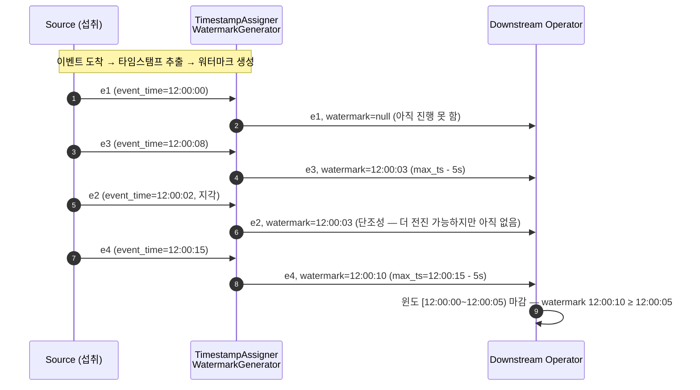
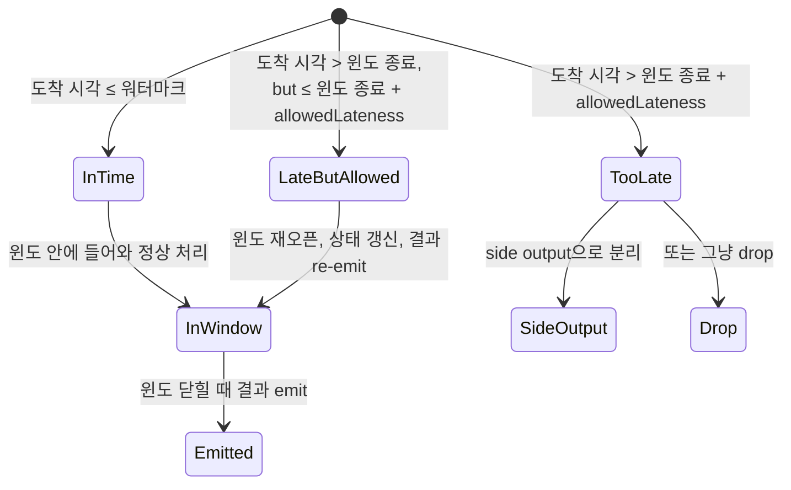

<figure class="post-figure post-figure--header">
<svg role="img" aria-label="Flink 이벤트 시간과 워터마크를 한 장으로 정리한 그림. 위쪽은 시간축으로, 왼쪽에 세 가지 시간 도메인 — 이벤트 시간(가장 위, 실제 발생 시각), 처리 시간(가장 아래, 시스템 시계), 워터마크(가운데, 단조 증가 선언선)가 같은 축 위에 나란히 그려져 있다. 이벤트 레코드들은 순서를 어기며 도착하고 그 위에 마름모 표식이 찍힌다. 가운데는 워터마크가 마감한 텀블링 윈도로, 각 윈도가 닫히면서 결과가 나오고 그 윈도의 상태는 청소된다. 그 옆에 allowedLateness 구간이 점선으로 연장되어 늦게 도착한 이벤트를 받아들이고, 너무 늦은 이벤트는 side output으로 분리된다. 아래쪽은 운영 함정으로, 너무 작은 out-ofOrderness는 너무 이른 마감을, 너무 큰 값은 윈도 지연을, 파티션 침묵은 워터마크 정체를 부른다." viewBox="0 0 680 380" xmlns="http://www.w3.org/2000/svg">
  <title>Flink 이벤트 시간과 워터마크 — 시간 도메인·워터마크 단조성·마감/지각/허용지연/side output, 그리고 운영 함정</title>
  <defs>
    <marker id="ewt-arrow" viewBox="0 0 10 10" refX="8" refY="5" markerWidth="6" markerHeight="6" orient="auto-start-reverse">
      <path d="M0,0 L10,5 L0,10 z" fill="var(--secondary-color)"/>
    </marker>
    <marker id="ewt-gold" viewBox="0 0 10 10" refX="8" refY="5" markerWidth="6" markerHeight="6" orient="auto-start-reverse">
      <path d="M0,0 L10,5 L0,10 z" fill="var(--gold)"/>
    </marker>
    <marker id="ewt-acc" viewBox="0 0 10 10" refX="8" refY="5" markerWidth="6" markerHeight="6" orient="auto-start-reverse">
      <path d="M0,0 L10,5 L0,10 z" fill="var(--accent-color)"/>
    </marker>
  </defs>

  <!-- title -->
  <text x="340" y="22" text-anchor="middle" font-size="16" font-weight="800" fill="currentColor" letter-spacing="1.2">FLINK 이벤트 시간과 워터마크</text>
  <text x="340" y="41" text-anchor="middle" font-size="10" font-weight="700" fill="currentColor" opacity="0.72">시간 도메인 → 워터마크 단조성 → 마감/지각/허용지연/side output</text>

  <!-- ===== SECTION A: three time domains on one axis ===== -->
  <text x="30" y="64" text-anchor="start" font-size="10" font-weight="700" fill="currentColor" opacity="0.72">① 같은 축 위의 세 시간 — 이벤트·처리·워터마크</text>

  <!-- axis -->
  <line x1="40" y1="160" x2="640" y2="160" stroke="currentColor" stroke-width="1.4" marker-end="url(#ewt-arrow)"/>
  <text x="650" y="163" text-anchor="start" font-size="9" font-weight="700" fill="currentColor">시간</text>

  <!-- event-time lane -->
  <text x="36" y="84" text-anchor="end" font-size="9.5" font-weight="800" fill="var(--accent-color)">이벤트 시간</text>
  <line x1="46" y1="80" x2="630" y2="80" stroke="var(--accent-color)" stroke-width="1.4" opacity="0.55" stroke-dasharray="3 3"/>
  <g fill="var(--bg-panel)" stroke="var(--accent-color)" stroke-width="1.6">
    <polygon points="80,76 88,80 80,84"/>
    <polygon points="150,76 158,80 150,84"/>
    <polygon points="290,76 298,80 290,84"/>
    <polygon points="420,76 428,80 420,84"/>
    <polygon points="560,76 568,80 560,84"/>
  </g>
  <text x="588" y="78" font-size="7.5" fill="currentColor" opacity="0.7">발생 시각 기준</text>

  <!-- processing-time lane -->
  <text x="36" y="200" text-anchor="end" font-size="9.5" font-weight="800" fill="var(--secondary-color)">처리 시간</text>
  <line x1="46" y1="196" x2="630" y2="196" stroke="var(--secondary-color)" stroke-width="1.4" opacity="0.55" stroke-dasharray="3 3"/>
  <g fill="var(--bg-panel)" stroke="var(--secondary-color)" stroke-width="1.6">
    <polygon points="170,192 178,196 170,200"/>
    <polygon points="240,192 248,196 240,200"/>
    <polygon points="310,192 318,196 310,200"/>
    <polygon points="430,192 438,196 430,200"/>
    <polygon points="500,192 508,196 500,200"/>
  </g>
  <text x="540" y="194" font-size="7.5" fill="currentColor" opacity="0.7">시스템 시계 기준 (불안정)</text>

  <!-- watermark line — monotonically increasing -->
  <text x="36" y="124" text-anchor="end" font-size="9.5" font-weight="800" fill="var(--gold)">워터마크</text>
  <polyline points="60,120 130,118 200,116 270,114 340,112 410,110 480,108 560,106 620,104"
            fill="none" stroke="var(--gold)" stroke-width="2.2"/>
  <text x="612" y="100" font-size="7.5" fill="var(--gold)">단조 증가</text>

  <!-- out-of-order note -->
  <text x="430" y="86" font-size="7.5" font-style="italic" fill="currentColor" opacity="0.75">↑ 도착 순서 ≠ 발생 순서 (out-of-order)</text>

  <!-- ===== SECTION B: watermark closes window ===== -->
  <line x1="30" y1="222" x2="650" y2="222" stroke="currentColor" stroke-width="1.2" opacity="0.25"/>

  <text x="30" y="244" text-anchor="start" font-size="10" font-weight="700" fill="currentColor" opacity="0.72">② 워터마크가 윈도를 닫는다 — 그 다음에 허용지연·side output으로 늦은 이벤트를 다스린다</text>

  <!-- window 1 closed -->
  <rect x="48" y="260" width="120" height="46" rx="4" fill="var(--bg-light)" stroke="var(--gold)" stroke-width="2"/>
  <text x="108" y="278" text-anchor="middle" font-size="9" font-weight="800" fill="currentColor">W1 확정</text>
  <text x="108" y="294" text-anchor="middle" font-size="7.5" fill="currentColor" opacity="0.75">워터마크가 W1.end 통과</text>

  <!-- allowedLateness extension -->
  <rect x="168" y="260" width="120" height="46" rx="4" fill="var(--bg-panel)" stroke="var(--accent-color)" stroke-width="2" stroke-dasharray="4 3"/>
  <text x="228" y="278" text-anchor="middle" font-size="9" font-weight="800" fill="currentColor">allowedLateness</text>
  <text x="228" y="294" text-anchor="middle" font-size="7.5" fill="currentColor" opacity="0.75">+2분 더 받아들임</text>

  <!-- window 2 closed -->
  <rect x="288" y="260" width="120" height="46" rx="4" fill="var(--bg-light)" stroke="var(--gold)" stroke-width="2"/>
  <text x="348" y="278" text-anchor="middle" font-size="9" font-weight="800" fill="currentColor">W2 확정</text>
  <text x="348" y="294" text-anchor="middle" font-size="7.5" fill="currentColor" opacity="0.75">…</text>

  <!-- side output lane -->
  <line x1="408" y1="283" x2="478" y2="283" stroke="var(--secondary-color)" stroke-width="1.8" marker-end="url(#ewt-arrow)"/>
  <rect x="480" y="266" width="148" height="34" rx="4" fill="var(--bg-panel)" stroke="var(--secondary-color)" stroke-width="2"/>
  <text x="554" y="282" text-anchor="middle" font-size="9" font-weight="800" fill="currentColor">side output (지각 너무 늦음)</text>
  <text x="554" y="294" text-anchor="middle" font-size="7" fill="currentColor" opacity="0.75">별도 싱크로 분리</text>

  <!-- ===== SECTION C: pitfalls strip ===== -->
  <text x="30" y="328" text-anchor="start" font-size="10" font-weight="700" fill="currentColor" opacity="0.72">③ 운영 함정 — out-of-order 크기·idle 파티션·event time 신뢰성</text>

  <rect x="24" y="336" width="208" height="34" rx="4" fill="var(--bg-panel)" stroke="var(--accent-color)" stroke-width="1.6"/>
  <text x="36" y="352" font-size="8" font-weight="800" fill="var(--accent-color)">너무 작은 OOO</text>
  <text x="36" y="364" font-size="7" fill="currentColor" opacity="0.78">윈도가 너무 일찍 닫혀 지각 손실</text>

  <rect x="240" y="336" width="208" height="34" rx="4" fill="var(--bg-panel)" stroke="var(--accent-color)" stroke-width="1.6"/>
  <text x="252" y="352" font-size="8" font-weight="800" fill="var(--accent-color)">너무 큰 OOO</text>
  <text x="252" y="364" font-size="7" fill="currentColor" opacity="0.78">윈도 지연·상태 메모리 증가</text>

  <rect x="456" y="336" width="200" height="34" rx="4" fill="var(--bg-panel)" stroke="var(--secondary-color)" stroke-width="1.6"/>
  <text x="468" y="352" font-size="8" font-weight="800" fill="var(--secondary-color)">idle 파티션</text>
  <text x="468" y="364" font-size="7" fill="currentColor" opacity="0.78">한 분할 침묵 → 워터마크 정체</text>
</svg>
<figcaption>한 장 요약 — 같은 시간축 위에서 이벤트 시간(발생 시각)과 처리 시간(시스템 시계)이 다르고, 워터마크는 단조 증가하는 '마감 선언선'이다. 워터마크가 윈도 끝을 통과하면 윈도가 닫히고, allowedLateness로 그 너머의 지각을 받아들이며, 너무 늦은 이벤트는 side output으로 빠져 별도 싱크로 간다. 운영에서는 out-of-order 크기·idle 파티션·event time 신뢰성이 모두 결과 일관성을 결정한다</figcaption>
</figure>

## 도입 — 왜 "처리 시간"이 아니라 "이벤트 시간"인가

1단계에서 잡은 Flink의 실행 모델은 **데이터가 어떻게 흐르고 어디서 실행되는가**를 다뤘습니다. 그 모델 위에서 이제 다뤄야 할 질문은 더 미묘합니다 — "이 흐르는 데이터를 **어떤 시간 기준**으로 정렬하고, **언제** 윈도를 닫고 결과를 내보낼 것인가?"입니다. 이 질문에 대한 답이 **이벤트 시간(event time)**과 **워터마크(watermark)**이며, 이 단계가 정확히 그 둘을 깊게 파는 자리입니다.

처리 시간(processing time)은 단순합니다 — 이벤트가 연산자에 **도착한 시스템 시계 시각**을 그 이벤트의 시간으로 씁니다. 코드가 짧고 결과가 빠릅니다. 하지만 **결과의 일관성이 깨지기 쉽습니다**. 같은 잡을 두 번 돌리거나, 한 시간 뒤에 다시 돌리거나, 일부 파티션을 재처리하면 결과가 달라집니다. 예를 들어 12:00~12:05 윈도의 합계를 처리 시간으로 집계했다면, 12:01에 들어온 이벤트는 12:06 윈도에 들어갑니다 — 나중에 재처리하면 그 이벤트는 다른 윈도에 들어가고 합계가 달라집니다. 시간에 민감한 비즈니스 의사결정(매출 정산·이상 탐지·사기 탐지)이 이 결과에 기대고 있다면, 같은 데이터로 두 번 집계해 두 값이 다르면 신뢰가 무너집니다.

이벤트 시간(event time)은 이 문제를 정면으로 해결합니다 — 이벤트가 **실제로 발생한 시각**(보통은 데이터 자체에 기록된 타임스탬프)을 그 이벤트의 시간으로 씁니다. 그러면 재처리·백필·지연 도착·재정렬 어느 상황에서든 같은 이벤트 시간의 이벤트는 항상 같은 윈도에 들어가 같은 결과를 만듭니다. **결과의 일관성(result consistency)**이 핵심입니다. 다만 비용이 있습니다 — 언제 결과를 낼지 결정해야 합니다. 무한히 기다릴 수는 없으니, **"이 시각까지의 데이터는 사실상 다 왔다"**라고 선언하는 장치가 필요합니다. 그 선언이 **워터마크**입니다.

> 이 시리즈는 [Data-Engineering-Essential 오버뷰](/2026/06/25/data-engineering-essential-curriculum.html)의 [데이터 변환·처리](/2026/06/25/data-processing.html) 5단계에서 개념만 잡은 이벤트 시간·워터마크를 Apache Flink 중심으로 심화합니다. 같은 "워터마크"라도 [Spark Structured Streaming](/2026/07/16/spark-structured-streaming.html)은 마이크로배치 단위로 묶어 한 번에 전진시키고(트리거가 클록), Flink는 **연속적·단조적**으로 흘러보내며 이벤트 단위로 진행을 갱신합니다 — 자매 글을 함께 읽으면 두 엔진의 시간 모델 차이가 또렷해집니다.

## 핵심 개념 1 — 시간 도메인 4종

Flink가 다루는 시간 도메인은 모두 네 가지입니다. 1단계에서 다룬 무한 스트림 모델은 이 시간 도메인을 끼울 수 있는 빈 슬롯을 제공했고, 이 단계는 그 슬롯에 실제로 무엇을 끼우는지 정합니다.

- **Event Time(이벤트 시간)**: 이벤트가 **실제로 발생한 시각**입니다. 보통 데이터 페이로드에 있는 타임스탬프 필드(`created_at`, `ts`, `event_time` 등)에서 추출합니다. 외부 시스템 시계와 무관해서 재처리해도 변하지 않습니다 — 결정적(deterministic)입니다.
- **Ingestion Time(섭취 시간)**: 이벤트가 **Flink 소스에 진입한 시스템 시계 시각**입니다. Source operator가 자동 부여하므로 사용자가 타임스탬프를 추출할 필요가 없습니다. 단, **소스 진입 이후의 재처리에서는 결과가 달라집니다** — 재처리 시작 시점에 새 진입 시각이 부여되기 때문입니다. 결정적이지 않습니다.
- **Processing Time(처리 시간)**: 각 연산자가 이벤트를 **처리하는 순간의 시스템 시계 시각**입니다. 가장 빠르지만 결정적이지 않습니다 — 같은 잡을 다시 돌리거나 시스템 시계가 흔들리면 결과가 달라집니다.
- **Watermark(워터마크)**: 위 세 가지와 별개의 **메타데이터 마커**입니다. 이벤트 시간 축 위를 흘러가며 "이 시각까지의 이벤트는 이미 다 도착했다(혹은 더 늦은 건 신경 쓰지 않겠다)"를 선언합니다. 이벤트 시간 도메인을 쓰는 잡에서만 의미가 있습니다.

```mermaid
flowchart LR
  A[데이터 페이로드<br/>event_time=12:03:15] -->|TimestampAssigner| B(Flink 내부<br/>이벤트 시간 = 12:03:15)
  B --> C[스트림 흐름<br/>연산자 그래프]
  C -->|Watermark| D[윈도 마감·상태 청소]
  E[시스템 시계] -. 처리 시간 .-> C
  F[소스 진입 시계] -. 섭취 시간 .-> B

  classDef node fill:var(--bg-light),stroke:var(--secondary-color),stroke-width:2px,color:currentColor;
  classDef acc fill:var(--bg-light),stroke:var(--accent-color),stroke-width:2px,color:currentColor;
  classDef gold fill:var(--bg-light),stroke:var(--gold),stroke-width:2.5px,color:currentColor;
  class A,B,C node
  class D gold
  class E,F acc
```

**왜 4개가 필요한가**: 결정성(determinism)·지연(latency)·구현 복잡도가 각각 다른 트레이드오프 위에 있기 때문입니다. 이벤트 시간이 결정적이고 정확하지만 코드와 운영이 복잡하고, 처리 시간은 단순·저지연이지만 결과가 흔들립니다. 실무 기본값은 **이벤트 시간 + 워터마크**이고, 이 단계가 그 기본값을 가능하게 하는 메커니즘을 깊게 다룹니다.

## 핵심 개념 2 — 워터마크: 단조 증가하는 "마감 선언선"

**워터마크**는 가장 중요한 개념이라 깊게 짚습니다. 한 줄 정의는 이렇습니다:

> **워터마크 = "이 시각까지의 데이터는 사실상 다 왔다"라는 단조 증가 선언선**

여기서 세 단어가 모두 짚을 가치가 있습니다.

**첫째, "사실상 다 왔다"는 절대 보장이 아닙니다.** 네트워크 지연·클라이언트 시계 오차·재시도 때문에 더 늦은 이벤트가 도착할 수 있습니다. 워터마크은 엔진에게 **"이 시각까지는 그 다음의 워터마크 진행을 위해 더 기다리지 않겠다"**라고 알려 주는 정책의 표현이지, 물리적 사실이 아닙니다. 정책이 빡빡하면(작은 out-of-orderness) 일찍 마감하고 지각 데이터는 잃고, 너그럽으면(큰 out-of-orderness) 늦게 마감하고 정확성을 높입니다.

**둘째, "단조 증가(monotonically increasing)"가 워터마크의 가장 강한 제약입니다.** 워터마크은 절대 뒤로 가지 않습니다 — 한 번 T 시점까지 도달한 워터마크가 T' < T로 되돌아가는 일은 없습니다. 이 단조성이 윈도 마감을 일관되게 만들어 줍니다. 다운스트림 연산자가 워터마크 T를 한 번 봤다면, 그 연산자는 **이후에 어떤 이벤트가 도착하든 자신이 가진 윈도를 T 이후로 확장하지 않는다**고 가정할 수 있습니다. 단조성이 깨지면 이 가정도 깨지고, 한 번 닫은 윈도에 새 이벤트가 들어와 상태가 다시 바뀌는 혼란이 생깁니다.

**셋째, "선언선"이라는 비유가 핵심을 잡습니다.** 워터마크은 그 자체로 데이터를 운반하지 않습니다 — 그냥 타임스탬프 하나가 이벤트 흐름 사이사이에 끼어 들어갑니다. 이 타임스탬프가 이벤트 시간 축 위를 흘러가며, 그 값 이상까지의 이벤트는 "이제 그만 받아도 된다"는 신호를 다운스트림에 전합니다.



이 다이어그램은 세 가지를 한 번에 보여줍니다 — ① 새 이벤트 도착 시 추출된 타임스탬프에서 `max_timestamp - out_of_orderness`로 워터마크를 계산하고, ② 지각 도착한 `e2`는 들어왔지만 워터마크를 더 전진시키지 못하며(아직 더 큰 타임스탬프 이벤트가 안 와서), ③ 새 큰 이벤트 `e4`가 도착해야 워터마크가 12:00:10까지 전진하면서 윈도를 닫습니다.

## 핵심 개념 3 — 워터마크 생성 전략: forBoundedOutOfOrderness vs forMonotonousTimestamps vs Custom Generator

Flink 1.11+의 `WatermarkStrategy`는 워터마크 생성을 두 단계로 분리합니다 — **TimestampAssigner**가 이벤트에서 타임스탬프를 추출하고, **WatermarkGenerator**가 그 타임스탬프로부터 워터마크를 만들어 냅니다. 분리의 장점은 정책(어떤 지연까지 기다릴 것인가)과 추출(어떤 필드가 타임스탬프인가)을 독립적으로 갈아탈 수 있다는 점입니다.

### 3-1. `forBoundedOutOfOrderness(Duration)` — 가장 흔한 기본값

가장 자주 보이는 패턴입니다. **"관측된 최대 이벤트 시간에서 N초를 뺀 값"**을 워터마크로 전진시킵니다. 즉, **최대 N초까지의 out-of-order를 허용**합니다.

```python
# PyFlink — 가장 흔한 워터마크 전략 골격
from pyflink.common import Duration
from pyflink.common.watermark_strategy import WatermarkStrategy

# 'event_time' 필드를 타임스탬프로 추출 + 5초 out-of-order 허용
strategy = (
    WatermarkStrategy
    .for_bounded_out_of_orderness(Duration.of_seconds(5))
    .with_timestamp_assigner(MyTimestampAssigner())   # 아래 정의
)

stream = source.assign_timestamps_and_watermarks(strategy)
```

`Duration.of_seconds(5)`는 "지금까지 본 가장 늦은 이벤트 시간 − 5초"가 워터마크라는 뜻입니다. 예를 들어 가장 늦은 이벤트 시간이 12:00:30이라면 워터마크는 12:00:25이고, 다운스트림은 **12:00:25까지의 이벤트는 다 왔다**고 가정합니다. 5초보다 더 늦게 도착한 이벤트는 5초보다 더 이른 워터마크 시점에 도착한 셈이라 out-of-order 한도로 간주됩니다.

### 3-2. `forMonotonousTimestamps()` — strict monotonic 소스용

타임스탬프가 **단조 증가한다는 게 보장된 소스**(예: 단일 파티션의 잘 정렬된 Kafka 토픽, DB 시퀀스)에서는 더 단순한 전략이 가능합니다 — **"관측된 최대 이벤트 시간 = 워터마크"**. `forMonotonousTimestamps()`는 정확히 이 동작을 합니다.

```python
# 단조 증가가 보장된 소스에서 — 가장 간단한 워터마크 전략
strategy = (
    WatermarkStrategy
    .for_monotonous_timestamps()
    .with_timestamp_assigner(MyTimestampAssigner())
)
```

이 전략은 out-of-order를 허용하지 않습니다 — 즉, 한 번 본 가장 늦은 이벤트 시간 이후로만 워터마크가 전진합니다. 그래서 out-of-order가 절대 일어나지 않는다는 강한 보장이 있을 때만 씁니다. 잘못 쓰면 단 한 번의 늦은 이벤트로 잡의 워터마크가 영구히 멈출 수 있습니다.

### 3-3. Custom `WatermarkGenerator` — 더 정교한 정책이 필요할 때

기본 전략으로 부족한 경우가 있습니다 — 예를 들어 **이벤트의 종류에 따라 허용치를 다르게** 두고 싶다거나(유료 결제는 0초, 클릭은 10초), **주기적으로 워터마크를 emit**하고 싶다거나, **유휴 상태(idle)일 때 워터마크 진행을 멈추는 대신 강제로 전진**시키고 싶다거나. 이때는 `WatermarkGenerator` 인터페이스를 직접 구현합니다.

```java
// Java — 커스텀 WatermarkGenerator 골격
// on_event: 각 이벤트마다 호출 (per-record 워터마크를 emit할 기회)
// on_periodic_emit: 주기적으로 호출 (주기적 워터마크 emit 기회)
public class BoundedOutOfOrdernessGenerator
        implements WatermarkGenerator<Event> {

    private long maxTimestamp = Long.MIN_VALUE;
    private final long maxOutOfOrderness;   // ms

    public BoundedOutOfOrdernessGenerator(long maxOutOfOrderness) {
        this.maxOutOfOrderness = maxOutOfOrderness;
    }

    @Override
    public void onEvent(Event event, long eventTimestamp, WatermarkOutput output) {
        maxTimestamp = Math.max(maxTimestamp, eventTimestamp);
    }

    @Override
    public void onPeriodicEmit(WatermarkOutput output) {
        // 200ms마다 자동 호출됨 (ConfigOptions.AutoWatermarkInterval 기본값)
        output.emitWatermark(new Watermark(maxTimestamp - maxOutOfOrderness - 1));
    }
}
```

여기서 `onPeriodicEmit`은 **주기적(periodic)** 워터마크 생성으로, Flink는 `pipeline.auto-watermark-interval`(기본 200ms)마다 호출해 `WatermarkOutput.emitWatermark(...)`로 다운스트림에 워터마크를 내보냅니다. 출력 횟수가 네트워크 비용에 영향을 주므로, 너무 짧은 주기는 피하고 보통 200ms~1s 사이를 택합니다.

대안으로 **per-record** 워터마크가 있습니다 — `onEvent`에서 매번 `emitWatermark`를 부르는 방식입니다. 이때 워터마크가 데이터와 같은 채널을 타기 때문에 **순서가 엄격히 보장**됩니다(periodic은 보조 채널). 단점은 각 이벤트마다 워터마크 메시지가 끼어 들어 네트워크 비용이 커진다는 점입니다.

### 3-4. `TimestampAssigner` — 이벤트의 어느 필드를 시간으로 볼 것인가

`TimestampAssigner`는 단순합니다 — `extract_timestamp(element, record_timestamp) -> int (ms)` 한 메서드. record_timestamp는 시스템이 초기에 부여한 값이고, 보통 무시하고 페이로드의 타임스탬프 필드를 반환합니다.

```python
# PyFlink TimestampAssigner — dict 이벤트에서 'ts' 필드 추출
from pyflink.common.watermark_strategy import TimestampAssigner

class EventTimeAssigner(TimestampAssigner):
    def extract_timestamp(self, event, record_timestamp):
        # event = {'user_id': 1, 'action': 'click', 'ts': 1700000000000}
        return int(event['ts'])   # ms 단위
```

**중요한 운영 포인트**: 이 단계에서 추출되는 타임스탬프가 **결정성 전부의 토대**입니다. 여기서 잘못된 값(예: ms가 아닌 s 단위, 잘못된 시간대, 잘못된 필드)이 나오면 이후의 모든 윈도·상태·exactly-once가 결정성을 잃습니다. 워터마크가 흐르지 않는다고 느낄 때 가장 먼저 봐야 할 곳이 이 assigner입니다.

## 핵심 개념 4 — 워터마크의 흐름: 소스에서 전파, 그리고 idle source

워터마크는 데이터와 같은 연산자 그래프를 타고 흐릅니다. 그 흐름의 정확한 모양을 알아야 디버깅이 가능합니다.

### 4-1. 소스에서의 주입

`assign_timestamps_and_watermarks`가 호출되면, Flink는 그 위치(보통 Source 직후)에서 `PeriodicWatermarkEmitter`(또는 Punctuated)라는 내부 컴포넌트를 끼워 워터마크를 생성·발행합니다. 그 뒤로는 워터마크도 데이터처럼 흘러가지만, **데이터와는 다른 채널**을 탑니다(같은 subtask의 input gate 안의 별도 버퍼).

소스가 Kafka처럼 **분할된 파티션**을 가질 때는 워터마크 처리가 미묘해집니다. 각 파티션은 자신의 워터마크 진행을 독립적으로 추적하고, 다운스트림 연산자는 **모든 input 채널의 워터마크 중 가장 작은 값(min across channels)**을 채택해 자신의 워터마크로 전진시킵니다. 즉, 한 파티션이 느리면 그 파티션이 워터마크 진행을 **막습니다**.

### 4-2. `Watermark`이 operator를 통과하는 모양

각 operator는 input gate마다 incoming 워터마크를 추적하고, **모든 input의 워터마크 중 최솟값**을 자신의 워터마크로 삼아 다운스트림으로 내보냅니다. 이 "min across inputs"가 워터마크 전파의 핵심 규칙입니다.

```mermaid
flowchart LR
  subgraph S["소스 — 3 파티션"]
    P0[Partition 0<br/>watermark 12:00:30]
    P1[Partition 1<br/>watermark 12:00:45]
    P2[Partition 2<br/>watermark 12:00:25]
  end

  P0 --> Op[Window Operator<br/>자기 watermark = min(12:00:30, 12:00:45, 12:00:25)]
  P1 --> Op
  P2 --> Op

  Op -->|watermark 12:00:25<br/>= 가장 느린 채널| DS[Downstream]

  classDef part fill:var(--bg-light),stroke:var(--secondary-color),stroke-width:1.6px,color:currentColor;
  classDef op fill:var(--bg-light),stroke:var(--gold),stroke-width:2.5px,color:currentColor;
  class P0,P1,P2 part
  class Op op
```

이 min-합류(min-merge) 규칙 때문에 **한 파티션만 침묵하면 잡 전체의 워터마크가 멈춥니다**. 이게 바로 다음 함정 박스에서 다룰 **idle source** 문제입니다.

### 4-3. `withIdleness` — 파티션 침묵을 풀어 주는 도구

Kafka 토픽에 **특정 키가 한참 안 들어오는** 상황(예: 사용자 그룹이 비활성, 디바이스가 꺼짐)이 현실에서는 흔합니다. 그 키를 가진 파티션에서 새 이벤트도 워터마크도 안 들어오면, 그 파티션의 워터마크가 영원히 멈추고, min-합류 규칙 때문에 잡 전체 워터마크가 멈춥니다 — "왜 윈도가 안 닫히지?"의 단골 원인입니다.

`WatermarkStrategy.withIdleness(Duration.ofMinutes(1))`로 **"1분 동안 이 분할에서 아무것도 안 들어오면 idle로 표시해 다운스트림 min-합류에서 제외하라"**고 알려 줍니다. 이 표식이 붙으면 다운스트림은 그 분할을 무시하고 다른 분할의 워터마크로 진행합니다. 보통 out-of-orderness의 2~3배 길이로 둡니다(예: OOO=5s → idle=1min).

```python
# PyFlink — idle 표식을 워터마크 전략에 결합
strategy = (
    WatermarkStrategy
    .for_bounded_out_of_orderness(Duration.of_seconds(5))
    .with_timestamp_assigner(EventTimeAssigner())
    .with_idleness(Duration.of_minutes(1))   # ← 침묵 분할을 1분 후 idle로 표시
)
```

## 핵심 개념 5 — out-of-order와 지각 데이터: default drop → allowedLateness → side output

워터마크가 결정한 마감 이후에 도착한 이벤트를 **지각 이벤트(late event)**라고 합니다. Flink의 기본 동작은 **드롭(drop)** — 마감된 윈도에 들어오면 그냥 버립니다. 하지만 비즈니스에 따라서는 지각 이벤트까지 반영해야 할 때가 있습니다(매출 정산에서 1분 늦은 결제까지 잡고 싶다든지). 그때 쓰는 두 가지 도구가 `allowedLateness`와 **side output**입니다.

### 5-1. `allowedLateness(Time)` — 윈도 자체를 연장

```java
// Java — 이벤트 시간 텀블링 윈도에 allowedLateness 부여
DataStream<Event> stream = ...;

stream
    .keyBy(Event::getKey)
    .window(TumblingEventTimeWindows.of(Time.minutes(5)))
    .allowedLateness(Time.minutes(2))    // ← 윈도 끝 + 2분까지 더 받음
    .process(new MyWindowProcessFunction())
    .print();
```

`allowedLateness(Time.minutes(2))`의 의미는 **"윈도가 닫힌 뒤에도 2분 동안은 지각 이벤트를 받아서 윈도 상태를 갱신하고, 결과를 다시 emit하겠다"**입니다. 단, **윈도 상태가 그만큼 길게 메모리에 머무른다**는 비용이 있습니다. allowedLateness가 길수록 정확성은 올라가지만 상태 메모리도 같이 올라갑니다.

### 5-2. Side output — 너무 늦은 이벤트를 별도 싱크로

`allowedLateness` 너머로 더 늦게 도착한 이벤트는 어차피 윈도에 못 들어가고 **드롭되는 게 기본**입니다. 하지만 드롭하기 전에 **별도의 OutputTag로 빼내 별도 싱크로 보내고 싶을 때**가 있습니다 — 분석·모니터링·재처리 트리거에 쓰입니다.

```java
// Java — side output 패턴
OutputTag<Event> lateTag = new OutputTag<Event>("late-events"){};

SingleOutputStreamOperator<Result> main = stream
    .keyBy(Event::getKey)
    .window(TumblingEventTimeWindows.of(Time.minutes(5)))
    .allowedLateness(Time.minutes(2))
    .sideOutputLateData(lateTag)          // ← 허용지연 너머의 지각 이벤트를 lateTag로
    .process(new MyWindowProcessFunction());

// 메인 결과
main.print();

// 너무 늦은 이벤트 → 별도 싱크 (파일·Kafka·메트릭 등)
main.getSideOutput(lateTag)
     .map(e -> "late:" + e)
     .sinkTo(lateEventsSink);
```

### 5-3. 트레이드오프의 한 장

지각을 다루는 모든 선택은 **정확성·지연·상태 크기**의 세 축 위의 한 점입니다.



다이어그램이 보여주는 트레이드오프: **OOO를 작게** 두면 윈도가 일찍 닫혀 allowedLateness 구간은 작지만 지각 손실이 크고, **OOO를 크게** 두면 윈도가 늦게 닫혀 정확성은 올라가지만 윈도 지연이 큽니다. **allowedLateness를 크게** 두면 너무 늦은 이벤트까지 반영되지만 상태 메모리 비용이 따라옵니다. 비즈니스 요구(어떤 정확성이 필요한가, 어떤 지연이 허용되는가)를 먼저 정한 다음 세 값을 역으로 잡는 것이 정석입니다.

## 코드 예제 — PyFlink 실행 가능 골격

아래 코드는 **Flink 1.17+ PyFlink DataStream API**로 이벤트 시간·워터마크·allowedLateness·side output을 한 잡에 모두 묶은 골격입니다. 실제 실행 시에는 Kafka source를 끼우면 되고, 여기서는 `from_collection`으로 핵심 흐름만 보여 줍니다.

```python
# flink_event_time_watermark.py
# Flink 1.17+ PyFlink — 이벤트 시간 / 워터마크 / 지각 데이터 골격
from pyflink.common import Duration, Time
from pyflink.common.typeinfo import Types
from pyflink.common.watermark_strategy import (
    WatermarkStrategy, TimestampAssigner, WatermarkGenerator, Watermark,
)
from pyflink.datastream import StreamExecutionEnvironment
from pyflink.datastream.functions import ProcessWindowFunction
from pyflink.datastream.window import TumblingEventTimeWindows
from pyflink.datastream.output_tag import OutputTag


# ===== 1) TimestampAssigner — 이벤트에서 타임스탬프 추출 =====
class EventTimeAssigner(TimestampAssigner):
    """dict 이벤트에서 'ts'(ms 단위 epoch) 필드를 이벤트 시간으로 쓴다."""
    def extract_timestamp(self, event, record_timestamp):
        return int(event['ts'])


# ===== 2) WatermarkGenerator — 5초 out-of-order 허용, 주기적 emit =====
class BoundedGenerator(WatermarkGenerator):
    """max_timestamp - 5초를 워터마크로, 주기적(200ms) emit."""
    def __init__(self, max_out_of_orderness_ms: int = 5000):
        self.max_out_of_orderness_ms = max_out_of_orderness_ms
        self.max_timestamp = 0

    def on_event(self, event, event_timestamp, output):
        self.max_timestamp = max(self.max_timestamp, event_timestamp)

    def on_periodic_emit(self, output):
        wm = self.max_timestamp - self.max_out_of_orderness_ms - 1
        if wm >= 0:
            output.emit_watermark(Watermark(wm))


# ===== 3) 윈도 처리 — 합계 + 늦은 이벤트 카운트 =====
class SumProcessWindow(ProcessWindowFunction):
    def process(self, key, context, elements):
        total = 0
        late = 0
        for e in elements:
            total += e['value']
            # context.current_watermark()과 윈도 max_timestamp 비교로
            # '이 이벤트가 지각이었는가'를 판정할 수 있다 (여기선 단순 카운트)
            if e['ts'] < context.window.max_timestamp() - 1:
                late += 1
        yield key, {'sum': total, 'late_in_window': late}


def main():
    env = StreamExecutionEnvironment.get_execution_environment()
    env.set_parallelism(2)

    # ----- 시뮬레이션 입력 (실서비스는 Kafka source) -----
    events = env.from_collection(
        [
            {'key': 'a', 'value': 10, 'ts': 1_700_000_000_000},
            {'key': 'b', 'value': 20, 'ts': 1_700_000_120_000},  # +2분
            {'key': 'a', 'value': 30, 'ts': 1_700_000_180_000},  # +3분 (지각)
            {'key': 'a', 'value': 40, 'ts': 1_700_000_060_000},  # +1분
        ],
        type_info=Types.MAP(Types.STRING(), Types.PICKLED_BYTE_ARRAY()),
    )

    # ----- 워터마크 전략 조립 -----
    strategy = (
        WatermarkStrategy
        .for_bounded_out_of_orderness(Duration.of_seconds(5))
        .with_timestamp_assigner(EventTimeAssigner())
        .with_idleness(Duration.of_minutes(1))
    )

    # ----- 타임스탬프 + 워터마크 부여 -----
    timestamped = events.assign_timestamps_and_watermarks(strategy)

    # ----- 윈도잉 + 지각 허용 + side output -----
    late_tag = OutputTag("late-events", Types.PICKLED_BYTE_ARRAY())

    result = (
        timestamped
        .key_by(lambda e: e['key'])
        .window(TumblingEventTimeWindows.of(Time.minutes(5)))
        .allowed_lateness(Time.minutes(2))
        .side_output_late_data(late_tag)
        .process(SumProcessWindow())
    )

    # ----- 메인 결과 -----
    result.print()

    # ----- 너무 늦은 이벤트는 별도 싱크 -----
    result.get_side_output(late_tag).map(
        lambda e: f"TOO_LATE key={e['key']} ts={e['ts']}"
    ).print()

    env.execute("flink-event-time-watermark-demo")


if __name__ == "__main__":
    main()
```

핵심 흐름을 짚으면:

1. `assign_timestamps_and_watermarks(strategy)`로 이벤트 시간과 워터마크를 부여합니다. **이 호출이 워터마크 생성·전파의 시작점**이며, 이 이후로는 모든 연산자가 이벤트 시간 도메인에서 동작합니다.
2. `for_bounded_out_of_orderness(Duration.of_seconds(5))`는 5초 OOO 정책입니다 — 5초 이내의 지각은 정상 반영, 5초 너머는 윈도 마감 시점에 따라 처리됩니다.
3. `with_idleness(Duration.of_minutes(1))`는 1분 동안 어떤 키에서도 새 이벤트가 안 들어오면 그 분할을 idle로 표시합니다 — 워터마크 정체 방지용.
4. `allowed_lateness(Time.minutes(2))`로 윈도 종료 후 2분까지의 지각을 반영하고, `side_output_late_data(late_tag)`로 그 너머의 지각을 별도 싱크로 분리합니다.

## 코드 예제 — Java/Scala 골격 (참고용)

Java/Scala 쪽도 같은 개념이 같은 API로 잡힙니다. PyFlink와 다른 부분만 골라 보여 줍니다.

```scala
// Scala — forMonotonousTimestamps 전략 + 이벤트 시간 텀블링 윈도
import org.apache.flink.streaming.api.scala._
import org.apache.flink.streaming.api.windowing.assigners.TumblingEventTimeWindows
import org.apache.flink.streaming.api.windowing.time.Time
import org.apache.flink.api.common.eventtime._

case class Click(user: String, ts: Long, value: Double)

val env = StreamExecutionEnvironment.getExecutionEnvironment
env.setParallelism(2)

// 단조 증가가 보장된 소스(예: 단일 파티션 Kafka)이면 가장 간단한 전략
val strategy = WatermarkStrategy
  .forMonotonousTimestamps[Click]()
  .withTimestampAssigner(new TimestampAssigner[Click] {
    override def extractTimestamp(element: Click, recordTimestamp: Long): Long =
      element.ts   // 이벤트 페이로드의 ts 필드를 이벤트 시간으로
  })

val clicks: DataStream[Click] = env.fromCollection(Seq(
  Click("u1", 1_700_000_000_000L, 1.0),
  Click("u2", 1_700_000_120_000L, 2.0)
))

clicks
  .assignTimestampsAndWatermarks(strategy)
  .keyBy(_.user)
  .window(TumblingEventTimeWindows.of(Time.minutes(5)))
  .allowedLateness(Time.minutes(2))
  .reduce((a, b) => a.copy(value = a.value + b.value))
  .print()

env.execute("flink-event-time-monotonic")
```

여기서 주목할 점은 **"단조 증가가 보장되면 `forMonotonousTimestamps`로 충분하다"**는 사실입니다. 정책 결정은 데이터의 성격에 따라 갈리고, 코드는 그 결정의 결과로 단순해집니다.

## 자주 틀리는 부분 — 워터마크 운영 함정 5가지

- **out-of-orderness가 너무 작다**: 지각 데이터가 시스템의 실제 지연보다 짧게 잡혀 있으면 윈도가 너무 일찍 닫히고 지각이 손실됩니다. 운영 시작 전 **p95/p99 지연 분포**를 보고 OOO를 정합니다. 데이터의 분포가 시간에 따라 변하면(야간 vs 주간, 평일 vs 주말) 한 값으로 평생 가는 정책은 위험합니다 — 모티터링으로 주기적으로 재조정합니다.
- **out-of-orderness가 너무 크다**: 정확성은 올라가지만 **윈도가 늦게 닫혀 결과 지연이 증가**하고, 윈도 상태를 더 오래 들고 있어야 해 **메모리·체크포인트 크기가 커집니다**. 트레이드오프가 있는 값이라는 인식을 잊지 않습니다.
- **idle 파티션 워터마크 정체**: 한 분할에서 새 이벤트가 안 들어오면 그 분할의 워터마크가 멈추고 min-합류로 잡 전체가 멈춥니다. `withIdleness`를 켜고, 운영 중에는 Flink Web UI에서 subtask별 watermark를 모니터링해 "왜 윈도가 안 닫히지?"를 즉시 진단합니다.
- **event time 신뢰성 결여**: 소스에서 추출되는 타임스탬프가 정확하지 않으면(예: 클라이언트 시계가 어긋남, ms/s 혼동, 시간대 혼동) 워터마크는 그 부정확한 값을 기준으로 흐릅니다. 결과 결정성이 무너집니다 — 정확히 한 번을 원한다면 **소스에서 event time 추출의 정확성**이 출발점입니다.
- **allowedLateness와 state TTL 혼동**: `allowedLateness`는 윈도 단위 지연 허용이고, **state TTL**은 키 단위 상태 보존 기간입니다. 둘은 다른 차원의 정책입니다. 윈도 지각을 위해 allowedLateness를 키우면 그 윈도의 키 상태가 더 오래 살아남아 메모리를 차지합니다 — state backend(RocksDB/HashMap)와 함께 설계합니다.

## 정리 — 이 단계가 시리즈에서 하는 일

1단계가 **데이터의 흐름과 실행 모양**(스트림 그래프·병렬성·체이닝)을 잡았다면, 이 2단계는 그 모델 위에 **시간의 기준**을 얹습니다.

- **처리 시간은 단순하지만 결정적이지 않다**: 재처리·백필·시계 흔들림에서 결과가 달라집니다. 이벤트 시간이 결정성의 열쇠입니다.
- **워터마크는 단조 증가하는 마감 선언선**: `forBoundedOutOfOrderness`가 기본, `forMonotonousTimestamps`가 단순, `WatermarkGenerator` 커스텀이 정책의 정밀화입니다. `TimestampAssigner`/`WatermarkGenerator` 분리(Flink 1.11+) 덕분에 추출과 정책을 독립적으로 갈아탈 수 있습니다.
- **워터마크는 min-합류로 흐른다**: 한 파티션 침묵은 잡 전체 정체를 부르고, `withIdleness`가 그 함정을 풉니다.
- **지각 데이터는 정책의 문제다**: default drop, `allowedLateness`로 윈도 연장, side output으로 별도 싱크 — 세 선택이 정확성·지연·상태 크기의 트레이드오프 위의 점입니다.

다음 [3단계 — Flink 상태·체크포인트](/2026/07/22/flink-state-checkpoint.html)는 이 시간 모델을 **상태(state)와 맞물어** 다룹니다. 사실 워터마크가 단조롭게 전진한다는 것은 곧 "이 시각까지 본 이벤트들의 처리 결과를 키/윈도 상태에 반영해도 더 안 바뀐다"라는 뜻이고, 그 **워크터마크 진행 = 상태 업데이트 트리거**가 3단계의 핵심 연결고리가 됩니다. 거기서 `checkpoint` barrier가 워터마크와 어떻게 손을 잡고, `state backend`(HashMap / RocksDB)가 어떻게 그 상태를 들고 내구성을 확보하는지 보게 됩니다.

### 다음 학습 (Next Learning)

- [Flink 스트림 처리 모델](/2026/07/22/flink-stream-processing-model.html) — 1단계: 이 글의 토대인 무한 스트림·데이터플로우 그래프·연산자 병렬성
- [Flink 상태·체크포인트](/2026/07/22/flink-state-checkpoint.html) — 3단계: 워터마크 진행이 곧 상태 업데이트 트리거, checkpoint barrier가 워터마크와 손을 잡는 자리
- [데이터 변환·처리(Processing)](/2026/06/25/data-processing.html) — 오버뷰 5단계, 이벤트 시간·워터마크의 큰 그림을 복습
- [Spark Structured Streaming](/2026/07/16/spark-structured-streaming.html) — 자매 시리즈. Spark의 워터마크(마이크로배치 단위 진행)와 Flink의 워터마크(연속·단조 진행) 비교
- [Stream Processing Essential Curriculum](/2026/07/12/stream-processing-essential-curriculum.html) — 시리즈 로드맵으로 돌아가 진행 상황 확인
