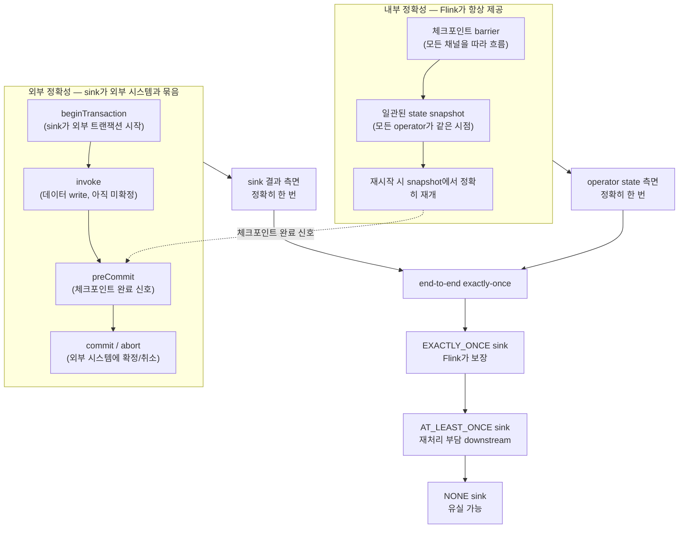
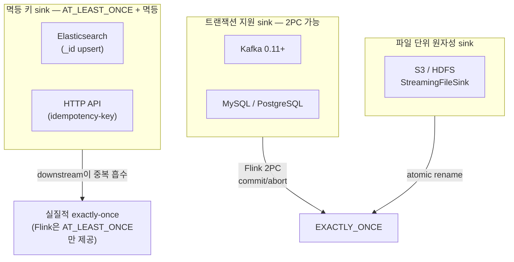

<figure class="post-figure post-figure--header">
<svg role="img" aria-label="Flink exactly-once의 구조를 한 장으로 정리한 그림. 위쪽은 두 개의 분리된 영역으로, 왼쪽은 '내부 정확성 — 체크포인트 barrier가 흐르며 모든 연산자 state가 일관된 snapshot에 묶이고, 재시작 시 그 snapshot에서 정확히 재개되어 operator state가 정확히 한 번 만져진다'를 보여주고, 오른쪽은 '외부 정확성 — sink가 외부 시스템 트랜잭션을 열고(preCommit) 체크포인트 완료 신호와 함께 commit한다(2PC)'를 보여준다. 두 영역은 가운데 '체크포인트 완료' 신호로 연결된다. 아래쪽은 three delivery lanes — at-most-once(손실), at-least-once(중복), exactly-once(둘 다 없음) — 가 나란히 그려진 비교 레인이다." viewBox="0 0 680 360" xmlns="http://www.w3.org/2000/svg">
  <title>Flink exactly-once — 내부 정확성(state)과 외부 정확성(sink·2PC)의 두 층위, 그리고 세 가지 전달 의미</title>
  <defs>
    <marker id="fe-arrow" viewBox="0 0 10 10" refX="8" refY="5" markerWidth="6" markerHeight="6" orient="auto-start-reverse">
      <path d="M0,0 L10,5 L0,10 z" fill="var(--secondary-color)"/>
    </marker>
    <marker id="fe-gold" viewBox="0 0 10 10" refX="8" refY="5" markerWidth="6" markerHeight="6" orient="auto-start-reverse">
      <path d="M0,0 L10,5 L0,10 z" fill="var(--gold)"/>
    </marker>
    <marker id="fe-acc" viewBox="0 0 10 10" refX="8" refY="5" markerWidth="6" markerHeight="6" orient="auto-start-reverse">
      <path d="M0,0 L10,5 L0,10 z" fill="var(--accent-color)"/>
    </marker>
  </defs>

  <!-- title -->
  <text x="340" y="22" text-anchor="middle" font-size="16" font-weight="800" fill="currentColor" letter-spacing="1.2">FLINK EXACTLY-ONCE</text>
  <text x="340" y="41" text-anchor="middle" font-size="10" font-weight="700" fill="currentColor" opacity="0.72">내부 정확성(state) × 외부 정확성(sink·2PC) = end-to-end exactly-once</text>

  <!-- ===== SECTION A: internal exactness (left) ===== -->
  <text x="30" y="64" text-anchor="start" font-size="10" font-weight="700" fill="currentColor" opacity="0.72">① 내부 정확성 — 체크포인트 barrier가 state를 한 번에 묶는다</text>

  <rect x="24" y="76" width="312" height="100" rx="5" fill="var(--bg-light)" stroke="currentColor" stroke-width="1.8"/>
  <text x="40" y="94" font-size="9" font-weight="800" fill="currentColor">operator state</text>

  <g font-size="8" font-weight="700" fill="currentColor" text-anchor="middle">
    <rect x="42" y="104" width="62" height="32" rx="3" fill="var(--bg-panel)" stroke="var(--secondary-color)" stroke-width="1.4"/>
    <text x="73" y="124">Source</text>
    <rect x="116" y="104" width="62" height="32" rx="3" fill="var(--bg-panel)" stroke="var(--secondary-color)" stroke-width="1.4"/>
    <text x="147" y="124">Map</text>
    <rect x="190" y="104" width="62" height="32" rx="3" fill="var(--bg-panel)" stroke="var(--secondary-color)" stroke-width="1.4"/>
    <text x="221" y="124">Sum</text>
    <rect x="262" y="104" width="62" height="32" rx="3" fill="var(--bg-panel)" stroke="var(--secondary-color)" stroke-width="1.4"/>
    <text x="293" y="124">Sink</text>
  </g>

  <!-- barrier -->
  <line x1="42" y1="148" x2="324" y2="148" stroke="var(--accent-color)" stroke-width="2.2" stroke-dasharray="6 4"/>
  <polygon points="324,144 332,148 324,152" fill="var(--accent-color)"/>
  <text x="183" y="166" text-anchor="middle" font-size="8.5" font-weight="800" fill="var(--accent-color)">checkpoint barrier</text>

  <!-- snapshot -->
  <rect x="42" y="172" width="270" height="22" rx="3" fill="var(--bg-panel)" stroke="var(--gold)" stroke-width="2"/>
  <text x="177" y="187" text-anchor="middle" font-size="8.5" font-weight="800" fill="var(--gold)">일관된 snapshot → 재시작 시 정확히 재개</text>

  <!-- ===== SECTION B: external exactness (right) ===== -->
  <text x="350" y="64" text-anchor="start" font-size="10" font-weight="700" fill="currentColor" opacity="0.72">② 외부 정확성 — sink의 2PC로 외부 쓰기까지 원자화</text>

  <rect x="350" y="76" width="306" height="100" rx="5" fill="var(--bg-light)" stroke="currentColor" stroke-width="1.8"/>
  <text x="366" y="94" font-size="9" font-weight="800" fill="currentColor">Two-Phase Commit sink</text>

  <g font-size="8" font-weight="700" fill="currentColor" text-anchor="middle">
    <rect x="362" y="104" width="92" height="22" rx="3" fill="var(--bg-panel)" stroke="var(--secondary-color)" stroke-width="1.4"/>
    <text x="408" y="119">beginTransaction</text>
    <rect x="362" y="130" width="92" height="22" rx="3" fill="var(--bg-panel)" stroke="var(--secondary-color)" stroke-width="1.4"/>
    <text x="408" y="145">invoke (write)</text>
    <rect x="466" y="104" width="92" height="22" rx="3" fill="var(--bg-panel)" stroke="var(--accent-color)" stroke-width="1.6"/>
    <text x="512" y="119">preCommit</text>
    <rect x="466" y="130" width="92" height="22" rx="3" fill="var(--bg-panel)" stroke="var(--gold)" stroke-width="2"/>
    <text x="512" y="145">commit / abort</text>
  </g>
  <line x1="455" y1="115" x2="465" y2="115" stroke="currentColor" stroke-width="1.4" marker-end="url(#fe-arrow)"/>
  <line x1="455" y1="141" x2="465" y2="141" stroke="currentColor" stroke-width="1.4" marker-end="url(#fe-arrow)"/>
  <text x="503" y="166" text-anchor="middle" font-size="8.5" font-weight="800" fill="var(--gold)">외부 트랜잭션과 묶음</text>

  <!-- bridge: checkpoint done -> preCommit -->
  <line x1="324" y1="183" x2="362" y2="115" stroke="var(--accent-color)" stroke-width="1.6" stroke-dasharray="4 3" marker-end="url(#fe-acc)"/>
  <text x="338" y="142" font-size="7.5" font-weight="700" fill="var(--accent-color)">완료 신호</text>

  <!-- ===== SECTION C: three delivery lanes ===== -->
  <line x1="30" y1="220" x2="650" y2="220" stroke="currentColor" stroke-width="1.2" opacity="0.25"/>

  <text x="30" y="244" text-anchor="start" font-size="10" font-weight="700" fill="currentColor" opacity="0.72">③ 세 가지 전달 의미 — 유실과 중복의 양면</text>

  <!-- lane 1: at-most-once -->
  <rect x="30" y="252" width="206" height="64" rx="4" fill="var(--bg-light)" stroke="currentColor" stroke-width="1.6"/>
  <text x="44" y="270" font-size="9" font-weight="800" fill="currentColor">at-most-once</text>
  <text x="222" y="270" text-anchor="end" font-size="8" font-weight="700" fill="var(--accent-color)">유실 OK</text>
  <text x="44" y="288" font-size="7.5" fill="currentColor" opacity="0.78">재시도 없이 보냄 / 처리 전 커밋</text>
  <text x="44" y="302" font-size="7.5" fill="currentColor" opacity="0.78">빠르지만 정확성 포기</text>

  <!-- lane 2: at-least-once -->
  <rect x="244" y="252" width="206" height="64" rx="4" fill="var(--bg-light)" stroke="currentColor" stroke-width="1.6"/>
  <text x="258" y="270" font-size="9" font-weight="800" fill="currentColor">at-least-once</text>
  <text x="436" y="270" text-anchor="end" font-size="8" font-weight="700" fill="var(--secondary-color)">중복 OK</text>
  <text x="258" y="288" font-size="7.5" fill="currentColor" opacity="0.78">재시도 + 처리 후 커밋</text>
  <text x="258" y="302" font-size="7.5" fill="currentColor" opacity="0.78">안전한 기본값, 하류 멱등 부담</text>

  <!-- lane 3: exactly-once -->
  <rect x="458" y="252" width="198" height="64" rx="4" fill="var(--bg-light)" stroke="var(--gold)" stroke-width="2.5"/>
  <text x="472" y="270" font-size="9" font-weight="800" fill="var(--gold)">exactly-once</text>
  <text x="642" y="270" text-anchor="end" font-size="8" font-weight="700" fill="var(--gold)">둘 다 NO</text>
  <text x="472" y="288" font-size="7.5" fill="currentColor" opacity="0.85">state 정확히 한 번 + sink 2PC</text>
  <text x="472" y="302" font-size="7.5" fill="currentColor" opacity="0.85">이상적이지만 외부 시스템 한계</text>

  <text x="340" y="346" text-anchor="middle" font-size="9" fill="currentColor" opacity="0.72">Flink는 '내부 정확성(state)' + '외부 정확성(2PC sink)' 두 층위 합으로 end-to-end exactly-once를 만든다</text>
</svg>
<figcaption>한 장 요약 — Flink의 exactly-once는 (1) 체크포인트 barrier로 state가 정확히 한 번 만져지는 내부 정확성과, (2) sink가 Two-Phase Commit으로 외부 시스템 트랜잭션과 묶이는 외부 정확성, 이 두 층위의 합이다. 그 위에서 at-most-once·at-least-once·exactly-once 세 가지 전달 의미가 갈라진다</figcaption>
</figure>

## 도입 — "장애가 나도 결과가 정확한가"

스트림 처리의 가장 무서운 질문은 이것입니다 — **장애가 난 뒤에 다시 돌려도, 결과는 한 번 처리한 것과 같아야 한다.** 정확성이 없는 스트림 처리는 재처리가 불가능하고, 재처리가 불가능한 시스템은 비즈니스 손실로 직결됩니다. 과금·결제·재고처럼 한 번만 반영되어야 하는 도메인에서 "좀 늦게 도착한 이벤트로 집계가 틀어졌다"는 사고는 단순한 버그가 아니라 **돈이 사라지거나 두 번 청구되는** 사안입니다.

이 단계는 [3단계: 상태와 체크포인트](/2026/07/22/flink-state-checkpoint.html)에서 다진 토대 위에서 "그 정확성을 어디까지, 어떻게 보장할 것인가"를 다룹니다. 3단계가 "state를 어떻게 안전하게 저장하고 복원할 것인가"였다면, 4단계는 "그 안전한 state에 기반해 외부 시스템에 쓰는 결과까지 어떻게 한 번에 묶을 것인가"입니다. 여기서 다루는 exactly-once는 단일 키워드가 아니라, **두 가지 구분**(operator vs sink) × **두 가지 메커니즘**(체크포인트 barrier + 2PC)으로 구성됩니다.

같은 주제를 Kafka 관점에서 먼저 다룬 글이 [Kafka 전달 보장](/2026/07/15/kafka-delivery-guarantees.html)입니다. 거기서 at-most·at-least·exactly-once가 무엇인지, 멱등 프로듀서와 트랜잭션이 어떻게 중복을 제거하는지를 봤습니다. 이 글의 Flink 4단계는 그 구분의 **스트림 처리 엔진 버전**입니다 — engine이 state와 sink를 어떻게 직조해 정확성을 완성하는지가 핵심입니다.

<div class="post-summary-box" markdown="1">

### 📌 이 글에서 다루는 내용

- **전달 보장 3종**: at-most-once vs at-least-once vs exactly-once — "유실 없음"과 "중복 없음"이 서로 다른 문제라는 점, Flink에서 각 모드가 어떤 코드와 설정으로 만들어지는지, 재시작 시 어디서 손실·중복이 발생하는지
- **"exactly-once 처리" vs "exactly-once 효과"**: 가장 중요한 구분 — operator 안에서 event가 한 번만 만져진다는 의미(불변 사실)와, 외부 시스템 sink에 결과가 한 번만 반영된다는 의미(Flink가 보장)를 분리하고, Flink가 어디까지 보장하고 무엇이 한계인지
- **내부 exactly-once — 체크포인트 barrier**: barrier가 흘러 모든 operator state를 한 snapshot에 묶고, 재시작 시 그 지점에서 정확히 재개되는 원리. state 측면의 정확히 한 번
- **end-to-end exactly-once — 2PC 싱크**: 1PC로는 부족한 이유(부분 반영), `TwoPhaseCommitSinkFunction`의 beginTransaction/invoke/preCommit/commit/abort 흐름, Kafka 0.11+ 트랜잭션과의 정합
- **DeliveryGuarantee와 sink 정확성 등급**: `NONE` / `AT_LEAST_ONCE` / `EXACTLY_ONCE` — Kafka 싱크의 transactional.id + isolation.level=read_committed 설정, Elasticsearch·S3처럼 2PC를 지원하지 않는 외부 시스템이 어떻게 "파일 단위 원자성 + flush commit"으로 EXACTLY_ONCE를 흉내내는지

</div>

## 한눈에 보기 — 두 층위의 정확성, 한 end-to-end 결과

이 글의 스파인을 한 장으로 그리면 이렇습니다. Flink의 정확성은 **내부 정확성(체크포인트 barrier로 state가 정확히 한 번 만져짐)** 과 **외부 정확성(2PC sink가 외부 시스템 트랜잭션과 묶임)** 이라는 두 층위로 이루어지고, 그 둘이 합쳐질 때 비로소 **end-to-end exactly-once**가 됩니다. 그 위에서 at-most·at-least·exactly 세 가지 전달 의미가 갈라지고, 각 의미는 sink가 정확성 등급을 어떻게 선언하는가로 결정됩니다.



왼쪽 위의 "내부 정확성"에서 출발해 오른쪽 아래의 "전달 의미"까지 — 이 경로가 이 글의 좌표축입니다.

## 전달 보장 3종 — "유실 없음"과 "중복 없음"은 다른 문제다

### 왜 두 문제를 분리해야 하는가

[Kafka 전달 보장](/2026/07/15/kafka-delivery-guarantees.html)에서 다룬 구분이 그대로 Flink에도 적용됩니다 — **유실과 중복은 같은 불확실성의 양면**입니다. 처리 도중 실패가 감지됐을 때 "이미 반영한 것을 되돌릴 것인가"가 유실이고, "다시 할 것인가"가 중복이며, 둘 다를 만족시킬 방법은 **없습니다**. 정확히 한 번이 가능한 이유는, 모든 경우에 답을 제공하는 것이 아니라 **특정한 가정(checkpoint + 트랜잭션 지원 sink) 아래에서만** 양면 모두를 잡기 때문입니다.

| 보장 | 유실 | 중복 | 만들어지는 조건 | Flink에서 어떻게 | 적합한 곳 |
| --- | --- | --- | --- | --- | --- |
| **at-most-once** | 가능 | 없음 | 체크포인트 비활성, 또는 sink가 fire-and-forget | `CheckpointingEnabled=false`, 또는 sink가 best-effort | 메트릭·로그 샘플링 |
| **at-least-once** | 없음 | 가능 | 체크포인트 활성 + sink가 at-least-once | sink의 DeliveryGuarantee = AT_LEAST_ONCE | **실무 표준** — 멱등성으로 보완 |
| **exactly-once** | 없음 | 없음 | 체크포인트 활성 + sink가 EXACTLY_ONCE + 외부 시스템 트랜잭션 지원 | sink의 DeliveryGuarantee = EXACTLY_ONCE + TwoPhaseCommitSinkFunction | 과금·재고·결제·집계 정확성 |

각 의미를 실패 시나리오로 정확히 보겠습니다.

### at-most-once — 빠르지만 정확성 포기

sink가 "성공 여부를 확인하지 않고 쓰고 잊는" 패턴입니다. Flink에서는 checkpointing이 꺼져 있거나, sink가 best-effort write(예: 로그 출력만 하고 끝나는 경우)일 때 자연스럽게 발생합니다. **장점**: 처리 지연이 가장 낮고, throughput이 가장 높습니다. **단점**: 장애가 나면 그 구간의 결과는 영원히 유실됩니다. 정확성이 필요 없는 모니터링·샘플링에는 합리적이지만, 비즈니스 결과로는 위험합니다.

### at-least-once — 안전한 기본값, 중복은 downstream이 감당

체크포인트가 활성이지만 sink가 at-least-once면, **재시작 시 마지막 체크포인트부터 모든 이벤트를 재처리**합니다. 이때 이미 sink에 쓰인 결과도 다시 쓰일 수 있습니다. **유실은 없습니다**(재처리되니까) — **대신 중복은 downstream이 감당**해야 합니다. 키 기반 upsert, `INSERT ... ON CONFLICT`, 멱등 API 호출 등. 실무에서 가장 흔한 출발점이자, 멱등성이 갖춰진 시스템이라면 충분한 모드입니다.

### exactly-once — 이상적이지만 외부 시스템의 한계를 받는다

내부적으로는 operator state 측면에서 정확히 한 번이 보장되고(체크포인트 barrier 메커니즘), 외부적으로는 sink가 2PC로 외부 시스템 트랜잭션과 묶입니다. **이상적이지만 모든 외부 시스템이 트랜잭션을 지원하지는 않습니다.** MySQL·PostgreSQL·Kafka(0.11+)·RDBMS는 2PC를 지원하지만, Elasticsearch·S3·HTTP API 등은 다른 방식(파일 단위 원자성, 멱등 키)으로 정확성을 보장합니다. 그래서 exactly-once는 **"어떤 sink냐"**에 따라 갈라집니다.

### 재시작 시 손실·중복은 어디서 발생하는가

재시작 시나리오를 정확히 짚어 두면, 보장 등급이 왜 갈라지는지가 선명해집니다.

- **체크포인트 미활성 + sink 비-idempotent**: 재시작 시 마지막 체크포인트가 없으므로 처음부터 재처리. 그 사이에 sink에 쓰인 결과는 중복 또는 부분 유실. at-most-once 또는 worse.
- **체크포인트 활성 + sink at-least-once**: 마지막 checkpoint부터 재처리. 이미 sink에 반영된 결과가 다시 쓰여 중복. at-least-once.
- **체크포인트 활성 + sink EXACTLY_ONCE(2PC)**: checkpoint 완료 신호와 함께 sink가 외부 트랜잭션을 commit. 재시작 시 미완 트랜잭션은 abort → 중복 없이 정확히 한 번. exactly-once.

## "exactly-once 처리" vs "exactly-once 효과" — 가장 중요한 구분

이 구분은 이 단계에서 가장 자주 오해되는 지점입니다. 두 표현은 비슷해 보이지만 가리키는 대상이 다릅니다.

- **"exactly-once 처리"(exactly-once processing)**: operator 내부에서 **event가 한 번만 만져진다**는 의미. Flink의 체크포인트 barrier 메커니즘이 만들어 주는, **불변의 사실**입니다. 재시작해도 operator state가 정확히 한 번만 갱신됩니다.
- **"exactly-once 효과"(exactly-once delivery / effect)**: 외부 시스템(sink)에 **결과가 한 번만 반영된다**는 의미. Flink의 체크포인트 + 2PC sink가 보장하지만, **외부 시스템이 트랜잭션을 지원해야만** 가능합니다.

Flink는 이 둘을 **분리해** 약속합니다.

- **"exactly-once 처리"는 항상 보장됩니다**(체크포인트가 켜져 있다면). 이는 operator가 event를 두 번 처리해도 state가 두 번 갱신되지 않는다는 뜻입니다 — 체크포인트 snapshot이 원래 상태였으므로 재처리 후에도 같은 결과로 돌아옵니다.
- **"exactly-once 효과"는 sink와 외부 시스템에 따라 보장됩니다.** sink가 TwoPhaseCommitSinkFunction을 구현하고 외부 시스템이 트랜잭션을 지원해야만 end-to-end exactly-once가 됩니다.

```mermaid
flowchart LR
  P["exactly-once 처리<br/>(operator 안에서)"]:::proc -->|"Flink가 항상 보장<br/>(checkpoint 활성 시)"| S1["state가 정확히 한 번 갱신"]
  E["exactly-once 효과<br/>(sink → 외부 시스템)"]:::eff -->|"sink 2PC + 외부 트랜잭션 필요"| S2["외부 쓰기가 한 번만 반영"]
  S1 --> E2E1["end-to-end exactly-once의 절반"]
  S2 --> E2E2["end-to-end exactly-once의 나머지 절반"]
  E2E1 --> E2E3["end-to-end exactly-once"]
  E2E2 --> E2E3
  E2E3 -->|"둘 다 갖춰야만"| DONE["완전한 정확성"]

  classDef proc fill:var(--bg-light),stroke:var(--secondary-color),stroke-width:2px,color:currentColor;
  classDef eff fill:var(--bg-light),stroke:var(--gold),stroke-width:2.5px,color:currentColor;
```

이 구분의 실무적 함의는 명확합니다 — **"Flink는 exactly-once를 지원한다"라는 말은 절반만 사실**입니다. 어디까지가 보장되고 어디부터가 sink·외부 시스템의 책임인지를 모르면, MySQL sink가 잘못 설정된 상태에서 "exactly-once인데 데이터가 중복됐습니다"라는 사고가 납니다.

## Flink 내부 exactly-once — 체크포인트 barrier 메커니즘

[3단계: 상태와 체크포인트](/2026/07/22/flink-state-checkpoint.html)에서 barrier가 어떻게 흐르고 어떻게 snapshot이 찍히는지 자세히 다뤘습니다. 여기서는 그 중 exactly-once와 직접 연결되는 부분만 압축해 다시 짚습니다.

### barrier — 모든 채널을 따라 흐는 동기화 신호

체크포인트 barrier는 JobManager가 주기적으로(체크포인트 주기로) 주입하는 특수 레코드입니다. barrier는 일반 이벤트보다 앞에 위치해 **모든 채널을 따라 흐르며**, barrier 뒤의 이벤트는 다음 체크포인트에 포함됩니다. 각 operator는 **모든 입력 채널에서 barrier를 한 번씩** 받아야 state snapshot을 찍습니다 — 이 "모든 입력 채널을 기다리는" 동작이 alignment이며, 모든 operator가 같은 barrier 지점에서 snapshot을 찍게 만들어 **state 일관성**을 보장합니다.

재시작 시 모든 operator는 이 snapshot에서 state를 복원하고, barrier 이후의 이벤트부터 다시 처리합니다. **이때 operator state 측면에서는 event가 정확히 한 번만 갱신**됩니다 — 정확히 한 번 처리.

### 핵심 — state는 정확히 한 번, sink write는 별개의 문제

체크포인트 barrier가 만드는 exactly-once는 **operator state에 한정**됩니다. sink가 "이 barrier 이후의 데이터를 외부 시스템에 쓴다"고 해서 그 쓰기가 외부 시스템에 한 번만 반영되는 것은 아닙니다. sink가 일반 write라면, 재시작 시 그 write가 다시 일어날 수 있고(중복), 또는 실패한 write가 그대로 유실될 수 있습니다.

즉 **state의 정확성과 sink의 정확성은 분리된 문제**이고, end-to-end exactly-once는 둘을 모두 잡아야 완성됩니다. 체크포인트가 처리하는 것은 operator state까지이며, 그 결과가 외부 시스템에 한 번만 반영되도록 만드는 것은 **sink의 책임**입니다.

### 그래서 sink가 필요한 것 — 외부 시스템과의 원자적 묶음

내부 정확성이 끝나면 남는 것은 이것입니다 — **"Flink가 snapshot을 찍었다"는 사실과 "sink가 외부 시스템에 쓴다"는 사실을 어떻게 묶을 것인가."** 만약 sink가 단순히 "데이터를 받아서 외부 시스템에 write"만 한다면, 다음 두 가지 문제가 생깁니다.

- **snapshot은 찍었는데 sink write가 실패** → 데이터 유실. state는 checkpoint 지점 그대로지만, 외부에는 그 snapshot의 결과가 없습니다.
- **sink write는 성공했는데 snapshot 못 찍음** → 데이터 중복. 다음 체크포인트에서 재처리될 때 같은 데이터가 또 쓰입니다.

이 두 문제를 동시에 해결하는 방법이 **Two-Phase Commit**이고, 다음 섹션에서 그 메커니즘을 봅니다.

## end-to-end exactly-once — Two-Phase Commit(2PC) 싱크

### 1PC로는 왜 부족한가

1PC(1-phase commit)는 "sink가 외부 시스템 트랜잭션을 열고, 데이터를 쓰고, 즉시 commit"하는 단순한 패턴입니다. 한 단계로 끝나니 빠르지만, **중간에 실패하면 외부 시스템에 부분 반영이 남습니다.** 예를 들어 sink가 1000개 레코드를 써야 하는데 700개째 실패했다면, 700개는 외부 시스템에 그대로 남고 300개는 없습니다 — **유실과 중복이 동시에** 발생할 수 있습니다. 비즈니스 정확성이 필요한 도메인에서는 1PC로는 부족합니다.

### 2PC의 흐름 — beginTransaction → invoke → preCommit → commit

2PC는 **"데이터를 쓴다"와 "외부 시스템에 확정한다"를 두 단계로 분리**하는 패턴입니다. Flink는 이 흐름을 `TwoPhaseCommitSinkFunction` 추상 클래스로 표준화했습니다.

```text
┌──────────────────────────────────────────────────────────────────────────┐
│  2PC 싱크의 흐름 (체크포인트 한 주기)                                    │
│                                                                          │
│  ┌─ Flink runtime ──────────────┐         ┌─ 외부 시스템 ────────────┐  │
│  │ 1. beginTransaction          │────────▶│ 트랜잭션 시작              │  │
│  │ 2. invoke(value, txn) × N    │────────▶│ 데이터 write (미확정)      │  │
│  │ 3. snapshot barrier 통과     │         │                            │  │
│  │    → 모든 operator state 저장│         │                            │  │
│  │ 4. preCommit(txn)            │────────▶│ 외부 트랜잭션 commit 준비  │  │
│  │ 5. checkpoint 완료 신호      │         │                            │  │
│  │ 6. commit(txn)               │────────▶│ 외부 트랜잭션 commit 확정  │  │
│  └──────────────────────────────┘         └────────────────────────────┘  │
│                                                                          │
│  * 어느 단계에서 실패해도 abort(txn)으로 외부 시스템을 깔끔하게 되돌린다 │
└──────────────────────────────────────────────────────────────────────────┘
```

각 단계를 Flink 입장에서 다시 정리하면 이렇습니다.

1. **beginTransaction()** — sink가 외부 시스템에 새로운 트랜잭션을 시작합니다. Kafka 트랜잭션 프로듀서를 예로 들면 sink 내부 필드의 `producer.beginTransaction()`이 호출되고, 그 **트랜잭션 핸들은 sink 인스턴스 필드에 보관**됩니다(`beginTransaction()` 자체는 `void` 반환이며 핸들을 돌려주지 않음). Flink는 이 sink 인스턴스를 통해 후속 단계에서 트랜잭션에 접근합니다.
2. **invoke(value, txn)** — 데이터 레코드가 도착할 때마다 외부 시스템에 write합니다. 단, **아직 commit은 하지 않습니다** — 외부 시스템에 적히긴 했지만 "미확정" 상태입니다.
3. **snapshot barrier 통과** — 이 시점에 모든 operator가 자기 state를 snapshot에 저장합니다.
4. **preCommit(txn)** — 모든 operator의 snapshot이 성공적으로 찍히면(JobManager가 모든 operator로부터 ack를 받으면) Flink가 sink에 preCommit을 요청합니다. sink는 외부 시스템 트랜잭션을 "commit할 준비"를 합니다.
5. **commit(txn)** — 실제 외부 시스템 트랜잭션을 commit합니다. 이 단계가 성공하면 외부 시스템에 결과가 한 번 반영됩니다.
6. **abort(txn)** — 어느 단계에서든 실패가 감지되면 sink는 외부 시스템 트랜잭션을 abort합니다. 외부 시스템에 남은 미확정 write는 사라집니다.

핵심 통찰은 **"데이터를 write하는 시점과 외부 시스템에 commit하는 시점 사이에 체크포인트의 성공을 기다리는 단계"**가 있다는 것입니다. snapshot이 성공한 경우에만 commit이 진행되므로, snapshot이 실패하면 abort되어 데이터가 외부에 남지 않습니다.

### TwoPhaseCommitSinkFunction 추상 클래스 — Java 골격

Flink가 2PC sink를 위한 표준 추상 클래스를 제공합니다. 외부 시스템 트랜잭션을 지원하는 모든 sink는 이 골격을 상속해 다섯 메서드를 구현하면 됩니다.

```java
// org.apache.flink.streaming.api.functions.sink.TwoPhaseCommitSinkFunction
// Flink가 제공하는 2PC 싱크 추상 골격 — 외부 시스템에 맞는 TXN 타입을 정의하면 된다.
// 트랜잭션 핸들은 sink 인스턴스 필드에 보관되며 beginTransaction()은 void를 반환한다.
public abstract class TwoPhaseCommitSinkFunction<IN, TXN, CONTEXT>
        extends RichSinkFunction<IN> {

    /** 새 트랜잭션을 시작한다 — Kafka라면 내부 producer.beginTransaction(). 핸들은 sink 필드에 보관 */
    protected abstract void beginTransaction() throws Exception;

    /** 레코드를 외부 시스템에 쓴다 — 트랜잭션 핸들은 sink 내부 필드에서 가져옴, 아직 commit 전 */
    protected abstract void invoke(IN value, Context context) throws Exception;

    /** 체크포인트 완료 신호 — 외부 시스템 트랜잭션을 commit할 준비를 한다 */
    protected abstract void preCommit(TXN transaction) throws Exception;

    /** 외부 시스템 트랜잭션을 commit한다 — 실패 시 Flink가 재시도 */
    protected abstract void commit(TXN transaction) throws Exception;

    /** 어느 단계에서든 실패 시 외부 시스템 트랜잭션을 취소한다 */
    protected abstract void abort(TXN transaction) throws Exception;
}
```

각 타입 매개변수의 의미는 이렇습니다.

- `IN` — 입력 레코드 타입
- `TXN` — 외부 시스템 트랜잭션 핸들 타입 (Kafka라면 `ProducerTransaction`, MySQL이라면 `Connection`)
- `CONTEXT` — sink가 추가로 들고 다닐 컨텍스트(현재 체크포인트 ID 등)

Kafka 0.11+가 정확히 이 추상 클래스에 맞아떨어집니다 — Kafka 트랜잭션은 beginTransaction → send(produce) → commitTransaction/abortTransaction 흐름이고, Flink의 2PC 싱크 단계와 1:1로 대응합니다. 그래서 Flink의 `FlinkKafkaProducer`(`KafkaSink`의 전신)는 `Semantic.EXACTLY_ONCE`로 설정하면 내부적으로 이 추상 클래스를 사용합니다.

### Java 코드 예제 — Kafka EXACTLY_ONCE 싱크

```java
// src/main/java/io/example/ExactlyOnceKafkaSink.java
// Flink Kafka 싱크를 EXACTLY_ONCE 모드로 설정하는 골격
import org.apache.flink.api.common.serialization.SimpleStringSchema;
import org.apache.flink.connector.kafka.sink.KafkaRecordSerializationSchema;
import org.apache.flink.connector.kafka.sink.KafkaSink;
import org.apache.flink.connector.kafka.sink.KafkaSinkBuilder;
import org.apache.flink.streaming.api.datastream.DataStream;
import org.apache.flink.streaming.api.environment.CheckpointConfig;
import org.apache.flink.streaming.api.environment.StreamExecutionEnvironment;
import org.apache.flink.streaming.connectors.kafka.FlinkKafkaProducer;
import org.apache.flink.streaming.connectors.kafka.KafkaSerializationSchema;
import org.apache.kafka.clients.producer.ProducerConfig;

public class ExactlyOnceKafkaSink {
    public static void main(String[] args) throws Exception {
        StreamExecutionEnvironment env = StreamExecutionEnvironment.getExecutionEnvironment();

        // (1) 체크포인트를 켠다 — EXACTLY_ONCE의 전제 조건
        env.enableCheckpointing(10_000); // 10초마다
        env.getCheckpointConfig().setSemantic(CheckpointingMode.EXACTLY_ONCE);

        // (2) Kafka sink를 EXACTLY_ONCE로 구성한다
        KafkaSink<String> sink = KafkaSink.<String>builder()
                .setBootstrapServers("broker:9092")
                .setRecordSerializer(KafkaRecordSerializationSchema.builder()
                        .setTopic("orders-enriched")
                        .setValueSerializationSchema(new SimpleStringSchema())
                        .build())
                .setDeliveryGuarantee(DeliveryGuarantee.EXACTLY_ONCE) // <- 2PC 활성화
                .setTransactionalIdPrefix("order-enricher-")          // 인스턴스마다 고유
                .setProperty(ProducerConfig.ACKS_CONFIG, "all")
                .build();

        // (3) 변환 → sink
        env.fromSource(/* source */, /* watermark */, "source")
                .map(v -> enrich(v))
                .sinkTo(sink)
                .name("kafka-sink-exactly-once");

        env.execute("exactly-once-kafka");
    }

    static String enrich(String v) { /* 변환 로직 */ return v; }
}
```

여기서 결정적인 두 줄은 `.setDeliveryGuarantee(DeliveryGuarantee.EXACTLY_ONCE)`와 `.setTransactionalIdPrefix(...)`입니다. 첫 번째는 Flink가 2PC 흐름을 활성화하라는 의미이고, 두 번째는 각 sink 인스턴스에 고유한 `transactional.id`를 부여해 좀비 펜싱을 가능하게 합니다. 동시에 **하류 컨슈머는 `isolation.level=read_committed`로 읽어야** 미확정 레코드가 보이지 않습니다 — 이 부분은 [Kafka 전달 보장](/2026/07/15/kafka-delivery-guarantees.html)에서 다룬 그대로입니다.

### SQL 예제 — Flink SQL의 sink 정확성 등급

Flink SQL에서는 `WITH` 절의 옵션으로 sink 정확성 등급을 지정합니다.

```sql
-- Flink SQL — Kafka 테이블을 EXACTLY_ONCE 모드로 정의하는 골격
CREATE TABLE orders_enriched (
    order_id   STRING,
    amount     DECIMAL(10, 2),
    enriched_at TIMESTAMP(3)
) WITH (
    'connector'                 = 'kafka',
    'topic'                     = 'orders-enriched',
    'properties.bootstrap.servers' = 'broker:9092',
    'format'                    = 'json',
    'sink.delivery-guarantee'   = 'exactly-once',         -- 2PC 활성화
    'sink.transactional-id-prefix' = 'order-enricher-'      -- 인스턴스별 고유 ID
);
```

또는 비-Kafka sink의 경우 — `datastream-api` 옵션으로 sink 클래스를 직접 지정할 수 있습니다.

```sql
-- Flink SQL — 커스텀 2PC 싱크를 사용하는 경우
CREATE TABLE mysql_orders (
    order_id STRING,
    amount   DECIMAL(10, 2)
) WITH (
    'connector'                  = 'jdbc',
    'url'                        = 'jdbc:mysql://db:3306/orders',
    'table-name'                 = 'orders',
    'sink.delivery-guarantee'    = 'exactly-once',   -- JDBC sink가 2PC를 지원한다면
    'sink.transactional-id-prefix' = 'mysql-sink-'
);
```

SQL은 sink 정확성을 선언적으로 표현하지만, 그 정확성은 결국 sink 구현이 TwoPhaseCommitSinkFunction을 따르느냐에 달려 있습니다.

## Sink 정확성 등급 — DeliveryGuarantee와 외부 시스템

### DeliveryGuarantee enum

Flink 1.15+의 `DeliveryGuarantee` enum은 sink 정확성을 세 등급으로 선언합니다.

| 등급 | 유실 | 중복 | 트랜잭션 필요 | 적합한 곳 |
| --- | --- | --- | --- | --- |
| **NONE** | 가능 | 가능 | 없음 | at-most-once — fire-and-forget sink |
| **AT_LEAST_ONCE** | 없음 | 가능 | 없음(재시작 시 재시도) | **실무 표준** — 멱등성으로 보완 |
| **EXACTLY_ONCE** | 없음 | 없음 | **있음**(sink가 2PC 구현) | 정확성이 핵심인 도메인 |

NONE이 사실상 쓰이는 경우는 드뭅니다 — 적어도 체크포인트가 켜져 있다면 sink는 기본적으로 AT_LEAST_ONCE로 동작합니다.

### Kafka 싱크 — transactional.id + isolation.level=read_committed

Kafka 싱크가 EXACTLY_ONCE를 제공하려면 두 가지가 맞물려야 합니다.

1. **Flink 측** — `transactional.id` prefix를 인스턴스마다 고유하게 부여. Flink가 인스턴스별로 PID·에포크를 발급하고 좀비 펜싱을 수행합니다.
2. **하류 컨슈머 측** — `isolation.level=read_committed`로 읽어 미확정·중단 레코드를 보지 않게 설정.

```java
// Flink 측: transactional.id prefix 설정
KafkaSink<String> sink = KafkaSink.<String>builder()
        .setBootstrapServers("broker:9092")
        .setRecordSerializer(/* ... */)
        .setDeliveryGuarantee(DeliveryGuarantee.EXACTLY_ONCE)
        .setTransactionalIdPrefix("order-enricher-")   // 인스턴스마다 고유
        .build();
```

```python
# 하류 컨슈머 측: read_committed 설정
consumer = Consumer({
    "bootstrap.servers": "broker:9092",
    "group.id": "downstream",
    "isolation.level": "read_committed",  # 미확정·중단 레코드 무시
    "enable.auto.commit": False,
})
```

이 두 설정 중 하나라도 어긋나면 EXACTLY_ONCE가 깨집니다 — Flink가 2PC로 sink의 트랜잭션을 확정해도, 하류가 `read_uncommitted`로 읽으면 미확정 레코드까지 보이기 때문입니다.

### 외부 sink — 2PC를 지원하지 않는 시스템은 어떻게 EXACTLY_ONCE를 흉내내는가

모든 외부 시스템이 2PC를 지원하는 것은 아닙니다. MySQL·PostgreSQL·Kafka는 지원하지만, Elasticsearch·S3·HTTP API는 본질적으로 2PC를 지원하지 않습니다. 이런 sink들은 **다른 메커니즘으로 정확성을 보장**합니다.

**파일 단위 원자성 + flush commit — StreamingFileSink의 경우**: S3·HDFS 같은 객체 스토리지는 부분 쓰기(partial write)가 가능합니다. StreamingFileSink는 이 문제를 두 단계로 해결합니다.

1. **in-progress 파일에 쓰기** — 데이터를 작은 in-progress 파일에 계속 append합니다. 이 파일은 "아직 완료되지 않은" 상태이므로 외부에서 보이지 않습니다(파일 시스템의 atomic rename 덕분).
2. **commit 시점의 atomic rename** — 체크포인트가 완료되면 그 in-progress 파일을 "완료된" 파일로 atomic하게 이동(또는 복사)합니다. atomic rename은 파일 시스템이 보장하므로, 외부에서는 **완전한 파일만** 보게 됩니다.

이 패턴은 정확히 "Flink checkpoint 성공 = 외부에 파일이 보인다"라는 원자성을 만들어내고, EXACTLY_ONCE 효과와 동등한 보장을 제공합니다. **외부 시스템이 2PC를 지원하지 않을 때 Flink가 EXACTLY_ONCE를 제공할 수 있는 거의 유일한 길**입니다.

**Elasticsearch / 외부 API의 멱등 키**: Elasticsearch는 `_id`를 명시해 upsert하면 같은 `_id`로 두 번 보내도 결과는 한 번 쓴 것과 동일합니다 — 이 경우 **"AT_LEAST_ONCE sink + 멱등 upsert = 실질적 exactly-once 결과"**가 됩니다. Flink가 sink에 AT_LEAST_ONCE를 주지만 결과적으로 외부에 한 번만 반영되는 구조입니다.

| 외부 시스템 | 트랜잭션 지원 | Flink 정확성 등급 | 보장 방식 |
| --- | --- | --- | --- |
| Kafka 0.11+ | 지원 | EXACTLY_ONCE | 2PC + transactional.id |
| MySQL/PostgreSQL | 지원(XA 또는 JDBC TXN) | EXACTLY_ONCE | 2PC + JDBC 트랜잭션 |
| Elasticsearch | 미지원 | AT_LEAST_ONCE + 멱등 upsert | `_id` upsert로 중복 흡수 |
| S3 / HDFS | 미지원(파일 단위 원자성) | EXACTLY_ONCE | in-progress → atomic rename |
| HTTP API | 일반적으로 미지원 | AT_LEAST_ONCE + 멱등 키 | 클라이언트가 idempotency-key |



## 함정 — 운영상 자주 틀리는 부분

### 함정 1 — "idempotent sink라고 충분하다"는 착각

sink를 멱등하게 만들었다고(예: `_id` upsert)해서 Flink가 그것을 정확히 한 번만 호출한다는 보장은 없습니다. **idempotent sink라고 충분하지 않은 이유**는 정확히 이 지점에 있습니다 — 재시작 시 어디서 같은 write가 두 번 발생할지 정확히 알기 어렵기 때문입니다. AT_LEAST_ONCE 모드에서는 sink가 두 번 write될 수 있고, 두 번째 write가 다른 키와 충돌하거나 부분적으로 실패할 수 있습니다. **멱등성은 "같은 입력이 두 번 와도 결과가 같다"는 보장이지, "두 번 안 온다"는 보장이 아닙니다.**

### 함정 2 — 외부 시스템이 트랜잭션을 지원하지 않으면 EXACTLY_ONCE는 없다

MySQL이 2PC를 지원하긴 하지만, 모든 외부 시스템이 지원하지는 않습니다. Elasticsearch는 문서 upsert를 트랜잭션으로 묶지 못하고, S3는 객체 일부만 commit하는 의미를 갖지 못하며, HTTP API는 통상 트랜잭션 개념이 없습니다. 이런 sink에 `DeliveryGuarantee.EXACTLY_ONCE`를 설정하면 — Flink가 거부하거나, sink가 silent하게 AT_LEAST_ONCE로 강등되거나, 실행 시점에 실패합니다. **sink의 실제 능력을 먼저 확인하지 않으면 보장 등급은 거짓말**이 됩니다.

### 함정 3 — EXACTLY_ONCE 싱크의 성능 비용

체크포인트 barrier 정렬과 2PC commit은 throughput을 떨어뜨립니다. alignment가 barrier를 기다리는 동안 해당 채널의 데이터 처리는 멈추고, 외부 트랜잭션 commit은 응답을 기다립니다. 특히 다음 두 케이스에서 효과가 큽니다.

- **트랜잭션 코디네이터가 외부 시스템에 있을 때** — Kafka 트랜잭션의 2단계 commit은 코디네이터의 로그 기록을 거치므로 ms~수십 ms가 추가됩니다.
- **sink 함수가 무거운 외부 호출을 commit 시점에 할 때** — Elasticsearch bulk indexing의 final flush 등.

운영에서는 AT_LEAST_ONCE + 멱등성으로 충분한지 먼저 따져보고, 정말 비즈니스 정확성이 필요한 sink만 EXACTLY_ONCE로 두는 것이 권장됩니다.

### 함정 4 — sink가 AT_LEAST_ONCE인데 downstream 멱등성으로 충분한 경우

실제로 가장 흔한 패턴입니다. sink가 AT_LEAST_ONCE로 외부에 write하되, 외부 시스템이 upsert·멱등 키를 지원해 같은 데이터가 두 번 와도 결과가 같도록 만드는 경우 — **이는 "외부 정확성"의 보장이 sink가 아니라 외부 시스템으로 옮겨진 것**입니다. Flink가 보장하는 것은 AT_LEAST_ONCE이지만 end-to-end 결과는 exactly-once이고, 성능 비용은 훨씬 낮습니다. 비즈니스 요구사항이 정확성이라면 sink의 등급을 보는 것이 아니라 **"최종 외부 시스템의 결과가 한 번인지"**를 봐야 합니다.

### 함정 5 — 체크포인트를 끄고 EXACTLY_ONCE를 기대하는 경우

EXACTLY_ONCE sink는 **체크포인트가 켜져 있을 때만** 의미가 있습니다. 체크포인트를 끄면(또는 너무 길게 잡으면) preCommit이 호출되지 않아 외부 트랜잭션이 commit되지 않거나, 반대로 abort 없이 데이터가 남습니다. **체크포인트 주기와 sink 정확성은 항상 함께 설계해야 합니다.**

## 정리

Flink 정확성의 한 막을 정복했습니다. 요점을 정리하면 다음과 같습니다.

- **유실과 중복은 같은 불확실성의 양면이다**: at-most-once는 손실 OK·중복 NO, at-least-once는 손실 NO·중복 OK, exactly-once는 둘 다 NO. 전달 의미는 **sink가 외부 시스템과 어떻게 묶이는가**로 결정되며, Flink은 그 묶음을 등급(NONE / AT_LEAST_ONCE / EXACTLY_ONCE)으로 선언하게 한다.
- **"exactly-once 처리" vs "exactly-once 효과"의 구분**: 전자는 operator 안에서 event가 한 번만 만져지는 것(체크포인트 barrier가 항상 보장), 후자는 외부 시스템에 결과가 한 번만 반영되는 것(2PC sink + 외부 트랜잭션이 필요). Flink은 둘을 분리해 약속한다.
- **내부 정확성 — 체크포인트 barrier**: 모든 채널을 따라 흐르는 barrier가 모든 operator를 같은 시점에 멈추게 하고, 일관된 snapshot을 찍는다. 재시작 시 그 snapshot에서 정확히 재개되므로 operator state는 정확히 한 번만 갱신된다. **단, sink write는 별개의 문제**다.
- **외부 정확성 — 2PC**: beginTransaction → invoke(미확정 write) → preCommit(체크포인트 완료 신호) → commit/abort. snapshot 성공이 외부 commit의 전제 조건이므로, 실패 시 abort로 외부 시스템에 부분 반영을 남기지 않는다. `TwoPhaseCommitSinkFunction` 추상 클래스가 이 흐름을 표준화한다.
- **sink 정확성은 외부 시스템에 달렸다**: Kafka 0.11+ / MySQL·PostgreSQL은 2PC 지원으로 EXACTLY_ONCE, S3·HDFS는 파일 단위 원자성(in-progress → atomic rename)으로 EXACTLY_ONCE, Elasticsearch·HTTP API는 AT_LEAST_ONCE + 멱등 키로 "실질적 exactly-once"를 만든다. **sink의 실제 능력을 확인하지 않은 정확성 선언은 거짓말**이다.

이제 Flink는 정확성을 보장할 수 있는 엔진을 갖추었습니다. 다음 질문은 자연스럽게 이것입니다 — **이 정확성을 "이벤트 시간" 위에서 어떻게 표현할 것인가?** 윈도가 열고 닫히고, 늦게 도착한 이벤트가 처리되고, 여러 스트림이 join될 때, 그 정확성은 어떻게 유지되는가. **5단계 — 윈도·조인·CEP**가 그 답을 줍니다.

### 다음 학습 (Next Learning)

- [Flink 윈도·조인·CEP](/2026/07/22/flink-windowing-join-cep.html) — 5단계: 정확성을 갖춘 엔진 위에서 "이벤트 시간으로 어떻게 묶고, 어떻게 join하고, 어떻게 패턴을 찾는가"
- [Flink 상태와 체크포인트](/2026/07/22/flink-state-checkpoint.html) — 3단계 복습: 체크포인트 barrier가 state를 어떻게 일관되게 묶는가
- [Flink 이벤트 시간·워터마크](/2026/07/22/flink-event-time-watermark.html) — 2단계: 이 단계에서 다룬 "정확히 한 번 효과"가 워터마크와 윈도 마감과 어떻게 맞물리는지
- [Flink 스트림 처리 모델](/2026/07/22/flink-stream-processing-model.html) — 1단계: 체이닝·병렬성·슬롯이 이 단계의 체크포인트 barrier 전파에 어떻게 영향 주는지
- [Kafka 전달 보장](/2026/07/15/kafka-delivery-guarantees.html) — at-most·at-least·exactly-once의 의미를 Kafka 관점에서 다시 보기
- [Spark Structured Streaming](/2026/07/16/spark-structured-streaming.html) — 자매 시리즈: 마이크로배치 모델의 정확성 보장과 비교
- [데이터 변환·처리(Processing)](/2026/06/25/data-processing.html) — 이 시리즈가 갈라져 나온 오버뷰 5단계, 스트림 처리의 개요를 복습
- [Stream Processing Essential Curriculum](/2026/07/12/stream-processing-essential-curriculum.html) — 시리즈 로드맵으로 돌아가 진행 상황 확인
