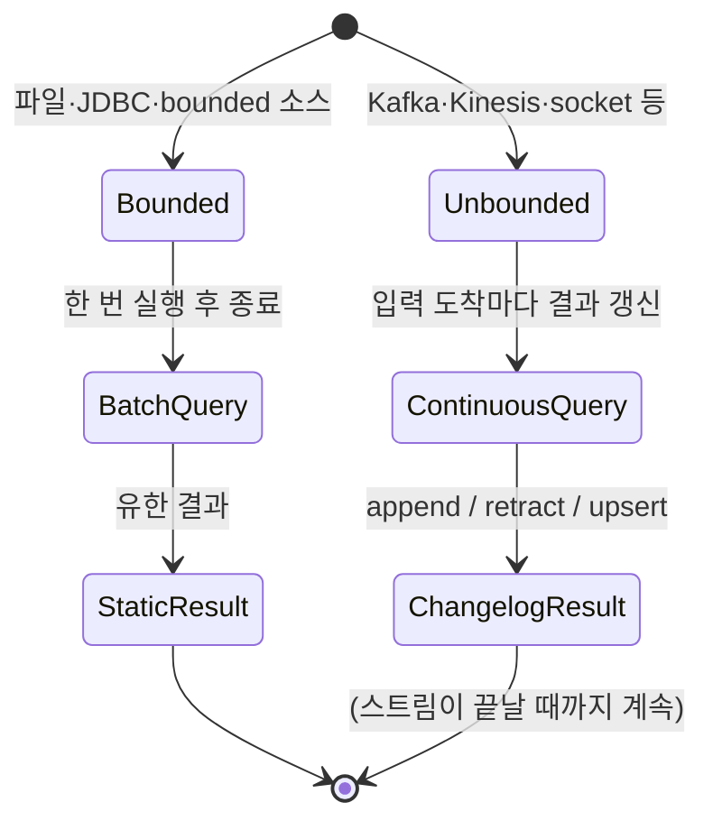

<figure class="post-figure post-figure--header">
<svg role="img" aria-label="Flink SQL을 한 장으로 정리한 그림. 위쪽 줄은 데이터의 이원성으로, 왼쪽에 무한 스트림이 changelog 인코딩(+I·+U·-U·-D)으로 가운데 동적 테이블을 갱신하고 그 동적 테이블을 다시 오른쪽의 새 changelog 스트림으로 emit해 결과 싱크로 보낸다. 가운데 줄은 쿼리 표면으로, DDL(WATERMARK·PRIMARY KEY) 한 줄이 왼쪽에 정의되고 그 위에 TUMBLE / HOP / SESSION / MATCH_RECOGNIZE / LATERAL TABLE TVF 구문이 연속 query로 실행되어 오른쪽의 changelog 모드(append·retract·upsert)를 만든다. 아래쪽은 실행 모드로, bounded 소스에서는 batch 모드로 finite 결과가 나오고 unbounded 소스에서는 streaming 모드에서 끝없이 갱신되는 결과가 나오는 차이가 짧은 화살표 두 줄로 대비되어 있다." viewBox="0 0 680 380" xmlns="http://www.w3.org/2000/svg">
  <title>Flink SQL — stream은 changelog로 인코딩되어 dynamic table을 갱신하고, query는 다시 changelog을 emit해 sink로 흘린다</title>
  <defs>
    <marker id="fsq-arrow" viewBox="0 0 10 10" refX="8" refY="5" markerWidth="6" markerHeight="6" orient="auto-start-reverse">
      <path d="M0,0 L10,5 L0,10 z" fill="var(--secondary-color)"/>
    </marker>
    <marker id="fsq-gold" viewBox="0 0 10 10" refX="8" refY="5" markerWidth="6" markerHeight="6" orient="auto-start-reverse">
      <path d="M0,0 L10,5 L0,10 z" fill="var(--gold)"/>
    </marker>
    <marker id="fsq-acc" viewBox="0 0 10 10" refX="8" refY="5" markerWidth="6" markerHeight="6" orient="auto-start-reverse">
      <path d="M0,0 L10,5 L0,10 z" fill="var(--accent-color)"/>
    </marker>
  </defs>

  <!-- title -->
  <text x="340" y="22" text-anchor="middle" font-size="16" font-weight="800" fill="currentColor" letter-spacing="1.2">FLINK SQL</text>
  <text x="340" y="41" text-anchor="middle" font-size="10" font-weight="700" fill="currentColor" opacity="0.72">stream은 changelog로 인코딩되고, query는 다시 changelog을 emit한다</text>

  <!-- ===== SECTION A: stream / dynamic table duality ===== -->
  <text x="30" y="64" text-anchor="start" font-size="10" font-weight="700" fill="currentColor" opacity="0.72">① stream ↔ table 이원성 — 같은 데이터를 두 표면으로 본다</text>

  <!-- stream (left) -->
  <rect x="24" y="78" width="118" height="78" rx="4" fill="var(--bg-panel)" stroke="var(--secondary-color)" stroke-width="2.5"/>
  <text x="83" y="96" text-anchor="middle" font-size="10" font-weight="800" fill="currentColor">Stream</text>
  <text x="83" y="112" text-anchor="middle" font-size="8" fill="currentColor" opacity="0.78">무한 레코드 흐름</text>
  <g font-size="7.5" font-weight="700" fill="currentColor" text-anchor="middle">
    <rect x="32" y="122" width="20" height="14" rx="2" fill="var(--bg-light)" stroke="var(--secondary-color)" stroke-width="1.2"/>
    <text x="42" y="132">+I</text>
    <rect x="56" y="122" width="20" height="14" rx="2" fill="var(--bg-light)" stroke="var(--secondary-color)" stroke-width="1.2"/>
    <text x="66" y="132">+U</text>
    <rect x="80" y="122" width="20" height="14" rx="2" fill="var(--bg-light)" stroke="var(--secondary-color)" stroke-width="1.2"/>
    <text x="90" y="132">-U</text>
    <rect x="104" y="122" width="20" height="14" rx="2" fill="var(--bg-light)" stroke="var(--secondary-color)" stroke-width="1.2"/>
    <text x="114" y="132">-D</text>
  </g>
  <text x="83" y="148" text-anchor="middle" font-size="7.5" fill="currentColor" opacity="0.7">changelog 인코딩</text>

  <!-- arrow stream -> dynamic table -->
  <line x1="142" y1="117" x2="180" y2="117" stroke="var(--secondary-color)" stroke-width="2" marker-end="url(#fsq-arrow)"/>
  <text x="161" y="111" text-anchor="middle" font-size="7" fill="currentColor" opacity="0.75">apply</text>

  <!-- dynamic table (center) -->
  <rect x="184" y="78" width="174" height="78" rx="4" fill="var(--bg-light)" stroke="var(--gold)" stroke-width="2.5"/>
  <text x="271" y="96" text-anchor="middle" font-size="10" font-weight="800" fill="currentColor">Dynamic Table</text>
  <text x="271" y="112" text-anchor="middle" font-size="8" fill="currentColor" opacity="0.78">시간에 따라 계속 변하는 테이블</text>
  <g stroke="currentColor" stroke-width="0.8" opacity="0.4">
    <line x1="200" y1="124" x2="346" y2="124"/>
    <line x1="200" y1="140" x2="346" y2="140"/>
    <line x1="244" y1="118" x2="244" y2="152"/>
    <line x1="304" y1="118" x2="304" y2="152"/>
  </g>
  <g font-size="7" fill="currentColor" opacity="0.85" text-anchor="middle">
    <text x="222" y="122">user</text>
    <text x="274" y="122">amount</text>
    <text x="325" y="122">total</text>
  </g>
  <text x="271" y="134" text-anchor="middle" font-size="7" fill="currentColor" opacity="0.7">u1 · 80 · 80</text>
  <text x="271" y="148" text-anchor="middle" font-size="7" fill="currentColor" opacity="0.7">u2 · 30 · 30</text>

  <!-- arrow dynamic table -> result stream -->
  <line x1="358" y1="117" x2="396" y2="117" stroke="var(--secondary-color)" stroke-width="2" marker-end="url(#fsq-arrow)"/>
  <text x="377" y="111" text-anchor="middle" font-size="7" fill="currentColor" opacity="0.75">emit</text>

  <!-- result stream (right) -->
  <rect x="400" y="78" width="118" height="78" rx="4" fill="var(--bg-panel)" stroke="var(--accent-color)" stroke-width="2.5"/>
  <text x="459" y="96" text-anchor="middle" font-size="10" font-weight="800" fill="currentColor">Result Stream</text>
  <text x="459" y="112" text-anchor="middle" font-size="8" fill="currentColor" opacity="0.78">changelog 다시 emit</text>
  <g font-size="7.5" font-weight="700" fill="currentColor" text-anchor="middle">
    <rect x="408" y="122" width="20" height="14" rx="2" fill="var(--bg-light)" stroke="var(--accent-color)" stroke-width="1.2"/>
    <text x="418" y="132">+I</text>
    <rect x="432" y="122" width="20" height="14" rx="2" fill="var(--bg-light)" stroke="var(--accent-color)" stroke-width="1.2"/>
    <text x="442" y="132">+U</text>
    <rect x="456" y="122" width="20" height="14" rx="2" fill="var(--bg-light)" stroke="var(--accent-color)" stroke-width="1.2"/>
    <text x="466" y="132">-U</text>
    <rect x="480" y="122" width="20" height="14" rx="2" fill="var(--bg-light)" stroke="var(--accent-color)" stroke-width="1.2"/>
    <text x="490" y="132">-D</text>
  </g>
  <text x="459" y="148" text-anchor="middle" font-size="7" fill="currentColor" opacity="0.7">→ sink</text>

  <!-- arrow result stream -> sink (right) -->
  <line x1="518" y1="117" x2="556" y2="117" stroke="var(--secondary-color)" stroke-width="2" marker-end="url(#fsq-arrow)"/>
  <text x="537" y="111" text-anchor="middle" font-size="7" fill="currentColor" opacity="0.75">sink</text>

  <!-- sink (far right) -->
  <rect x="560" y="78" width="90" height="78" rx="4" fill="var(--bg-light)" stroke="currentColor" stroke-width="2"/>
  <text x="605" y="100" text-anchor="middle" font-size="10" font-weight="800" fill="currentColor">Sink</text>
  <text x="605" y="118" text-anchor="middle" font-size="8" fill="currentColor" opacity="0.78">Kafka · Iceberg</text>
  <text x="605" y="134" text-anchor="middle" font-size="8" fill="currentColor" opacity="0.78">JDBC · print</text>

  <!-- ===== divider ===== -->
  <line x1="30" y1="172" x2="650" y2="172" stroke="currentColor" stroke-width="1.2" opacity="0.25"/>

  <!-- ===== SECTION B: SQL surface ===== -->
  <text x="30" y="190" text-anchor="start" font-size="10" font-weight="700" fill="currentColor" opacity="0.72">② SQL 한 줄이 1~5단계의 원리를 호출한다</text>

  <!-- DDL box (left) -->
  <rect x="24" y="200" width="160" height="56" rx="4" fill="var(--bg-light)" stroke="var(--secondary-color)" stroke-width="2"/>
  <text x="104" y="218" text-anchor="middle" font-size="9.5" font-weight="800" fill="currentColor">DDL · 테이블 정의</text>
  <text x="104" y="234" text-anchor="middle" font-size="7.5" fill="currentColor" opacity="0.78">WATERMARK FOR ts AS ts - 5s</text>
  <text x="104" y="248" text-anchor="middle" font-size="7.5" fill="currentColor" opacity="0.78">PRIMARY KEY (id) NOT ENFORCED</text>

  <!-- TVF row -->
  <g font-size="9" font-weight="700" fill="currentColor" text-anchor="middle">
    <rect x="200" y="200" width="80" height="22" rx="3" fill="var(--bg-panel)" stroke="var(--secondary-color)" stroke-width="1.4"/>
    <text x="240" y="214">TUMBLE</text>

    <rect x="288" y="200" width="80" height="22" rx="3" fill="var(--bg-panel)" stroke="var(--secondary-color)" stroke-width="1.4"/>
    <text x="328" y="214">HOP</text>

    <rect x="376" y="200" width="80" height="22" rx="3" fill="var(--bg-panel)" stroke="var(--secondary-color)" stroke-width="1.4"/>
    <text x="416" y="214">SESSION</text>

    <rect x="464" y="200" width="132" height="22" rx="3" fill="var(--bg-panel)" stroke="var(--accent-color)" stroke-width="1.6"/>
    <text x="530" y="214">MATCH_RECOGNIZE</text>
  </g>
  <text x="104" y="276" text-anchor="middle" font-size="7" fill="currentColor" opacity="0.7">2단계 워터마크 → 5단계 윈도·CEP → SQL 한 줄</text>

  <!-- changelog mode label (right) -->
  <text x="610" y="214" text-anchor="middle" font-size="9" font-weight="800" fill="currentColor">결과 changelog</text>
  <text x="610" y="232" text-anchor="middle" font-size="7.5" fill="currentColor" opacity="0.78">append / retract / upsert</text>

  <!-- arrow SQL -> emit -->
  <path d="M340,256 Q340,288 460,288 Q580,288 605,256" fill="none" stroke="var(--secondary-color)" stroke-width="1.6" marker-end="url(#fsq-arrow)"/>
  <text x="450" y="300" text-anchor="middle" font-size="7.5" fill="currentColor" opacity="0.75">continuous query 실행</text>

  <!-- ===== divider ===== -->
  <line x1="30" y1="316" x2="650" y2="316" stroke="currentColor" stroke-width="1.2" opacity="0.25"/>

  <!-- ===== SECTION C: runtime mode ===== -->
  <text x="30" y="334" text-anchor="start" font-size="10" font-weight="700" fill="currentColor" opacity="0.72">③ bounded → batch 모드(잡 종료), unbounded → streaming 모드(끝없이 갱신)</text>

  <!-- batch mode -->
  <rect x="48" y="344" width="240" height="28" rx="4" fill="var(--bg-panel)" stroke="var(--secondary-color)" stroke-width="1.6"/>
  <text x="168" y="362" text-anchor="middle" font-size="8.5" font-weight="700" fill="currentColor">setRuntimeMode(BATCH) — 유한 결과 후 종료</text>

  <!-- streaming mode -->
  <rect x="340" y="344" width="292" height="28" rx="4" fill="var(--bg-panel)" stroke="var(--accent-color)" stroke-width="1.6"/>
  <text x="486" y="362" text-anchor="middle" font-size="8.5" font-weight="700" fill="currentColor">default (STREAMING) — changelog 계속 emit</text>
</svg>
<figcaption>한 장 요약 — 무한 스트림은 +I·+U·-U·-D changelog로 인코딩되어 dynamic table을 갱신하고, SQL query(TUMBLE·HOP·SESSION·MATCH_RECOGNIZE)는 그 테이블을 다시 changelog으로 emit한다. bounded 소스면 batch, unbounded 소스면 streaming 모드</figcaption>
</figure>

## 도입 — 왜 SQL로 끝내는가

이 시리즈는 [1단계 스트림 처리 모델](/2026/07/22/flink-stream-processing-model.html)에서 시작해 [2단계 이벤트 시간·워터마크](/2026/07/22/flink-event-time-watermark.html), [3단계 상태·체크포인트](/2026/07/22/flink-state-checkpoint.html), [4단계 exactly-once](/2026/07/22/flink-exactly-once.html), [5단계 윈도잉·조인·CEP](/2026/07/22/flink-windowing-join-cep.html)까지 다섯 단계를 거쳤습니다. 모두 **낮은 수준의 원리**였습니다 — 무한 스트림을 어떻게 그래프로 표현하고, 시간으로 어떻게 정렬하며, 상태를 어떻게 지킬 것인가. 이 단계들은 정확하지만, 매번 `DataStream` API의 절차적 코드(소스→변환→싱크)를 짜야 했고, 그 위에 비즈니스 로직을 얹으면 코드는 빠르게 길어집니다.

6단계는 이 모든 것을 **선언적 SQL 표면**으로 끌어올립니다. 핵심 발상은 단순합니다 — **스트림을 "계속 변하는 테이블(dynamic table)"로 보면, 1~5단계에서 손으로 짜야 했던 윈도·워터마크·상태가 SQL 한 줄로 표현된다**는 것입니다. 그리고 그 발상의 중심에는 **stream ↔ table 이원성**이 있습니다. 이 단계의 키워드는 **"낮은 수준의 원리를 알면 SQL이 보인다"** — SQL 결과가 왜 그렇게 나오는지, 왜 어떤 쿼리는 상태가 무한히 커지는지, 왜 어떤 함수는 batch 모드에서만 작동하는지를, 앞선 다섯 단계의 원리로 읽는 단계입니다.

> 이 시리즈는 [Data-Engineering-Essential](/2026/06/25/data-engineering-essential-curriculum.html) 오버뷰의 5단계 [데이터 변환·처리](/2026/06/25/data-processing.html)에서 개념만 소개한 스트림 처리를 Apache Flink 중심으로 심화하는 6단계 시리즈입니다. 같은 "SQL로 스트림을 다룬다"는 표면은 [Spark Structured Streaming](/2026/07/16/spark-structured-streaming.html)에도 있지만, Flink는 changelog 기반 dynamic table을 명시적으로 노출하고 Spark는 마이크로배치로 자라는 무한 테이블을 노출한다는 차이가 있으니, 자매 시리즈와 나란히 읽으면 두 접근의 차이가 또렷해집니다.

## 핵심 개념 1 — Dynamic Table: 무한 스트림을 테이블로 본다

Flink SQL의 중심 발상은 **Dynamic Table**입니다. 이름 그대로 "시간에 따라 계속 변하는 테이블"이고, 무한 스트림을 한 시점의 결과가 아니라 **계속 갱신되는 결과**로 다루겠다는 약속입니다.

### 1-1. bounded vs unbounded — batch query vs continuous query

테이블이 어디서 오느냐에 따라 다릅니다.

- **bounded 테이블**(파일, 정적 dimension): 전통적인 **batch query**. SQL 한 줄 던지면 결과가 한 번 나오고 끝납니다. 이게 우리가 수십 년 써온 RDBMS 쿼리입니다.
- **unbounded 테이블**(Kafka 토픽, 클릭 이벤트 로그): **continuous query**. SQL 한 줄이 결과를 "한 번" 내지 않고, 입력에 새 레코드가 들어오는 한 결과도 계속 갱신됩니다.

이 구분이 1단계에서 본 "무한 스트림"을 SQL로 끌어올리는 자리입니다. Flink SQL의 모든 흥미로운 동작 — 워터마크, 윈도, changelog 결과, 상태 관리 — 은 이 **continuous query** 모델에서 나옵니다.

### 1-2. Dynamic Table은 어디서 오는가

Dynamic Table은 두 갈래로 만들어집니다.



- **bounded 입력 → Batch Query**: 결과를 한 번 만들어 출력하고 잡이 종료합니다. 이때는 `STREAMING` 모드여도 Flink가 자동으로 `BATCH`로 바꿔 실행합니다.
- **unbounded 입력 → Continuous Query**: 결과를 한 번 만들어 끝내지 않고, 입력의 새 레코드마다 결과를 갱신하는 changelog를 계속 emit합니다.

## 핵심 개념 2 — Stream ↔ Table 이원성

Dynamic Table이 강력한 이유는 **stream과 table이 서로의 다른 표면**이기 때문입니다. 같은 데이터를 두 가지로 볼 수 있고, 둘 사이를 자유롭게 오갈 수 있습니다.

### 2-1. Stream = Dynamic Table의 changelog

무한 스트림은 Dynamic Table의 **변경 로그(changelog)**입니다. Dynamic Table의 한 시점 상태를 찍어 보면 행들의 집합이지만, 그 집합이 시간에 따라 어떻게 변하는지를 따라가 보면 그것이 곧 입력 스트림입니다. 이때 각 레코드는 네 가지 변경 코드로 인코딩됩니다.

- **+I** (insert): 새 행이 들어왔다
- **+U / -U** (update): 기존 행이 갱신되었다 — 이전 값을 `-U`로 먼저 지우고 새 값을 `+U`로 넣는다
- **-D** (delete): 행이 삭제되었다

예를 들어 "사용자별 누적 주문 금액" 테이블을 갱신하는 스트림은 다음과 같이 보입니다.

```text
+ I  (u1, 80)    ← 새 사용자 u1의 첫 주문
+ I  (u2, 30)    ← 새 사용자 u2의 첫 주문
- U  (u1, 80)
+ U  (u1, 160)   ← u1이 80 더 주문 → 누적 160
+ I  (u3, 50)    ← 새 사용자 u3 등장
```

이 changelog가 다시 (출력 테이블에 대한) 입력 스트림이 됩니다. 그래서 SQL의 결과 테이블이 다른 SQL의 입력 테이블이 될 수 있습니다.

### 2-2. Table = Stream의 어느 시점의 snapshot

반대로, 어떤 시점의 stream을 **materialized view**로 펼쳐 보면 그것이 곧 (그 시점의) 테이블입니다. 1단계에서 다룬 무한 스트림이 사실은 시간에 따라 변하는 테이블의 changelog이라는 관점이 정확히 이것입니다.

### 2-3. 왜 이 이원성이 SQL을 가능하게 하는가

이 이원성 덕분에 SQL로 스트림을 다룰 수 있습니다. Flink는 stream을 **changelog로 인코딩해서 테이블로 바꾸고**, SQL은 그 테이블에 대한 일반적인 관계 질의로 표현되며, 결과 테이블을 다시 **changelog로 emit**해 출력 stream으로 보냅니다. 사용자는 SQL만 쓰고, stream-table 변환은 엔진이 처리합니다.

```mermaid
flowchart LR
  A[원본 Stream] -->|"+I +U -U -D"| B[Dynamic Table<br/>materialize]
  B -->|SQL 질의| C[Result Dynamic Table]
  C -->|"+I +U -U -D"| D[결과 Stream]
  D --> E[Kafka · Iceberg · JDBC]

  classDef dyn fill:var(--bg-light),stroke:var(--gold),stroke-width:2.5px,color:currentColor;
  classDef stream fill:var(--bg-panel),stroke:var(--secondary-color),stroke-width:2px,color:currentColor;
  class B,C dyn
  class A,D,E stream
```

이 다이어그램이 보여주는 것은 — SQL 한 줄의 양 끝이 모두 stream이라는 점입니다. 입력 stream이 들어와 결과 stream이 나가고, 가운데는 Flink가 내부적으로 dynamic table로 materialize해 두는 영역입니다.

## 핵심 개념 3 — Changelog 모드: 결과가 어떻게 emit되는가

continuous query의 결과 테이블은 새 입력마다 갱신됩니다. 그 갱신을 **어떤 changelog 코드로** emit할지가 **changelog 모드**입니다. 이 모드에 따라 sink가 받을 데이터의 모양이 결정되고, 따라서 sink 종류도 제약됩니다.

### 3-1. append-only — 새 행만 emit

윈도 집계 결과를 **이벤트 시간** 기준으로 emit하면, 같은 키·같은 윈도에 대해 새 행이 두 번 나오지 않습니다 (지각 데이터도 처리 끝나면 한 번만 갱신). 따라서 결과는 **+I만**으로 표현됩니다.

- 예: `TUMBLE` 윈도 집계, `HOP` 윈도 집계, 이벤트 시간 기반 `GROUP BY`
- 이 모드의 결과는 Kafka 토픽이든 JDBC 테이블이든 **append만 가능한 sink**로도 보낼 수 있습니다.

### 3-2. retract — 변경 시 이전 값을 delete + 새 값을 insert

키 기반이 아닌 집계이거나 **처리 시간** 윈도에서는 같은 키·같은 윈도에 대해 값이 계속 갱신됩니다. 이때 결과 테이블은 행을 갱신해야 하므로, **이전 값을 -U로 지우고 새 값을 +U로 넣는 retract 패턴**으로 emit합니다.

- 예: 처리 시간 글로벌 집계(non-keyed), non-windowed `SELECT SUM(...) FROM stream`
- 이 모드의 결과는 **update 가능한 sink**(JDBC upsert, upsert-kafka, Iceberg upsert) 또는 **retract를 지원하는 sink**로 보내야 합니다. append-only sink에 보내면 데이터가 깨집니다.

### 3-3. upsert — 키 기준 update

**PRIMARY KEY**가 정의된 결과 테이블은 키 기준 update로 emit할 수 있습니다. 같은 키에 새 값이 들어오면 이전 행을 -U로 지우고 새 행을 +U로 넣는 대신, **+U만**으로 upsert해도 의미가 같은 경우가 있습니다 (단, sink가 upsert를 이해해야 함).

- 예: dimension 테이블과의 temporal join 결과, PK가 있는 키 기반 집계
- 이 모드는 `upsert-kafka`, Iceberg의 upsert writer 같은 sink에 가장 잘 맞습니다.

### 3-4. 모드를 어떻게 결정하는가

Flink는 **쿼리의 모양에서 모드를 추론**합니다. 명시적으로 강제하고 싶다면 `CREATE TABLE sink (...) WITH ('changelog.mode' = '...')` 옵션으로 덮어쓸 수 있지만, 보통은 자동 결정이 의도와 맞습니다. 의도와 다르면 sink에 데이터가 깨진 채 들어가는 사고로 이어지므로, 모드는 처음 SQL을 짤 때부터 의식하는 것이 안전합니다.

## 핵심 개념 4 — Flink SQL 핵심 구문

SQL 표면은 크게 세 부분입니다. (1) **DDL**로 소스/싱크/뷰를 정의하고, (2) **쿼리**로 변환을 표현하고, (3) **실행 모드**로 batch/streaming을 결정합니다.

### 4-1. DDL — 테이블을 정의한다

```sql
CREATE TABLE orders (
    order_id  STRING,
    user_id   STRING,
    amount    DECIMAL(10, 2),
    currency  STRING,
    ts        TIMESTAMP(3),
    -- 워터마크: 2단계의 원리를 한 줄로 선언
    WATERMARK FOR ts AS ts - INTERVAL '5' SECOND,
    PRIMARY KEY (order_id) NOT ENFORCED
) WITH (
    'connector'         = 'kafka',
    'topic'             = 'orders',
    'format'            = 'json',
    'scan.startup.mode' = 'latest-offset',
    'properties.bootstrap.servers' = 'kafka:9092'
);
```

DDL 한 블록에 1~5단계의 원리가 한꺼번에 들어 있습니다. **WATERMARK FOR ts AS ts - INTERVAL '5' SECOND**는 2단계의 "5초 지연까지는 마감 전에 들어와도 결과에 반영하라"를 선언합니다. **PRIMARY KEY (order_id) NOT ENFORCED**는 3단계의 "이 키로 키 기반 상태를 관리하라"를 선언합니다. **NOT ENFORCED**는 Flink가 source 자체에 PK 제약을 강제하지 않는다는 뜻(데이터 중복을 Flink가 책임지지 않음)이고, 실제 upsert는 sink가 해야 합니다.

### 4-2. computed column과 metadata column

DDL에는 두 가지 보조선이 자주 등장합니다.

- **computed column**: 입력 컬럼에서 파생되는 가상 컬럼. `ts AS TO_TIMESTAMP(event_ts_str)`처럼 JSON 문자열을 TIMESTAMP로 바꾸는 자리.
- **metadata column**: connector가 함께 주는 시스템 메타. Kafka의 `topic`, `partition`, `offset`, `timestamp` 같은 것. `ts AS TO_TIMESTAMP_LTZ(metadata.timestamp_ms, 3)`처럼 워터마크를 실제 Kafka offset 시점이 아닌 이벤트 본문의 시점으로 잡고 싶을 때 유용합니다.

```sql
CREATE TABLE orders_with_meta (
    order_id  STRING,
    amount    DECIMAL(10, 2),
    event_ts  TIMESTAMP(3) METADATA FROM 'value.payload.ts' VIRTUAL,
    kafka_offset BIGINT METADATA FROM 'offset' VIRTUAL,
    WATERMARK FOR event_ts AS event_ts - INTERVAL '5' SECOND
) WITH (
    'connector' = 'kafka',
    'topic'     = 'orders',
    'format'    = 'json'
);
```

### 4-3. 쿼리 — TVF와 윈도·CEP

[5단계](/2026/07/22/flink-windowing-join-cep.html)에서 `DataStream` API로 짰던 텀블링·슬라이딩·세션 윈도와 CEP를 SQL로 표현합니다. Flink 1.13 이후 권장은 **TVF(Table-Valued Function)** 구문입니다.

- `TUMBLE(TABLE orders, DESCRIPTOR(ts), INTERVAL '1' MINUTE)`
- `HOP(TABLE orders, DESCRIPTOR(ts), INTERVAL '1' MINUTE, INTERVAL '5' MINUTE)`
- `SESSION(TABLE orders, DESCRIPTOR(ts), INTERVAL '5' MINUTE)`

이 구문이 5단계의 `TumblingEventTimeWindows`, `SlidingEventTimeWindows`, `EventTimeSessionWindows`와 1:1로 대응합니다. 같은 윈도 내부에서 `GROUP BY user_id, window_start, window_end`로 집계하면 [5단계](/2026/07/22/flink-windowing-join-cep.html)의 `KeyedProcessFunction` 한 묶음과 같은 결과가 나옵니다.

CEP는 `MATCH_RECOGNIZE` 한 절로 표현합니다. 5단계의 "주문 후 1시간 안에 결제" 패턴을 SQL로 옮기면 이렇게 됩니다.

```sql
-- Flink SQL — MATCH_RECOGNIZE: "주문 후 1시간 안에 결제" 패턴
SELECT *
FROM orders
MATCH_RECOGNIZE (
    PARTITION BY user_id
    ORDER BY ts
    MEASURES
        A.order_id AS order_id,
        A.ts       AS order_time,
        B.ts       AS payment_time,
        B.amount   AS paid_amount
    ONE ROW PER MATCH
    AFTER MATCH SKIP PAST LAST ROW
    PATTERN (A B) WITHIN INTERVAL '1' HOUR   -- Flink SQL은 PATTERN의 일부로 WITHIN을 받는다
    DEFINE
        A AS A.type = 'order',
        B AS B.type = 'payment'
) AS m;
```

> **Flink SQL parser 버전 주의**: `WITHIN INTERVAL` 절은 Flink SQL 표준이 아닌 Flink 확장 구문으로, parser 버전에 따라 `PATTERN` 절 안에 두는 것 vs `DEFINE` 직전에 두는 것이 다르게 해석될 수 있습니다. SQL Client 환경에서 parser 오류가 나면 `MATCH_RECOGNIZE` 안에 `WITHIN`을 빼고 쿼리 외부에서 `WHERE (b.ts - a.ts) <= INTERVAL '1' HOUR` 식으로 시간 제약을 표현하는 폴백도 가능합니다.

`PATTERN (A B) WITHIN INTERVAL '1' HOUR`가 5단계의 `within(Time.hours(1))`이고, `DEFINE A AS ... B AS ...`가 5단계의 `where(...)` 술어입니다. `AFTER MATCH SKIP PAST LAST ROW`는 5단계에서 짜기 까다로운 옵션 — 매치 후 매칭 시작점을 어디로 옮길지 — 을 SQL 한 줄로 결정합니다.

### 4-4. LATERAL TABLE · Temporal Table Function join

[LATERAL TABLE](https://nightlies.apache.org/flink/flink-docs-stable/docs/dev/table/sql/queries/joins/)과 Temporal Table Function join은 [5단계](/2026/07/22/flink-windowing-join-cep.html)의 **Temporal Table** 개념을 SQL로 끌어올린 표면입니다.

```sql
-- 5단계의 Temporal Table을 SQL로: 주문 시점의 환율을 붙인다
SELECT
    o.order_id,
    o.amount,
    o.currency,
    o.amount * r.rate AS amount_krw
FROM orders o,
LATERAL TABLE (currency_rates(o.ts)) AS r
WHERE r.currency = o.currency;
```

이렇게 LATERAL TABLE 함수로 dimension의 시간에 따라 변하는 값(예: 환율, 고객 등급)을 주문 시점에 맞춰 붙이는 패턴이 SQL에서 자연스럽게 표현됩니다.

### 4-5. 실행 모드 — Streaming vs Batch

마지막은 **runtime mode**입니다. `TableEnvironment`에서 결정합니다.

```python
# PyFlink에서 실행 모드 결정
env_settings = EnvironmentSettings.in_streaming_mode()        # 기본
# env_settings = EnvironmentSettings.in_batch_mode()          # batch 모드

t_env = TableEnvironment.create(env_settings)
```

- **STREAMING 모드 (기본)**: 모든 입력이 unbounded라고 가정. continuous query가 동작하고, changelog 결과가 계속 emit됩니다. `NOW()`, `PROCTIME()`, `CURRENT_WATERMARK()` 같은 동적 함수를 쓸 수 있습니다.
- **BATCH 모드**: 입력이 bounded라고 가정. 모든 결과를 모아 한 번에 emit하고 잡이 종료합니다. bounded 소스(파일, JDBC 풀스캔)면 streaming 모드여도 Flink가 batch로 실행합니다.

## 코드 예제 — 실행 가능한 Flink SQL

아래 코드는 바로 실행 가능한 Flink SQL입니다. PyFlink Table API로 외부에서 던져도 되고, SQL Client CLI에 그대로 붙여넣어도 됩니다.

### 예제 1 — 1분 텀블링 윈도 집계 (TUMBLE TVF)

```sql
-- 1분 텀블링 윈도: 사용자별 주문 합계
SELECT
    user_id,
    window_start,
    window_end,
    SUM(amount) AS total_amount,
    COUNT(*)   AS order_count
FROM TABLE(
    TUMBLE(TABLE orders, DESCRIPTOR(ts), INTERVAL '1' MINUTE)
)
GROUP BY user_id, window_start, window_end;
```

`TUMBLE` TVF가 [5단계](/2026/07/22/flink-windowing-join-cep.html)의 `TumblingEventTimeWindows.of(Time.minutes(1))`를 한 줄로 만든 모습입니다. `window_start`와 `window_end`는 TVF가 결과에 자동으로 붙여 주는 컬럼이라 `GROUP BY`에 포함하면 윈도별로 집계됩니다.

### 예제 2 — 슬라이딩 윈도 집계 (HOP TVF)

```sql
-- 5분 윈도, 1분 이동 → 매 1분마다 최근 5분 집계
SELECT
    user_id,
    window_start,
    window_end,
    AVG(amount) AS avg_amount,
    COUNT(*)   AS order_count
FROM TABLE(
    HOP(TABLE orders, DESCRIPTOR(ts), INTERVAL '1' MINUTE, INTERVAL '5' MINUTE)
)
GROUP BY user_id, window_start, window_end;
```

`HOP(table, timecol, slide, size)` 순서 — [5단계](/2026/07/22/flink-windowing-join-cep.html)의 `SlidingEventTimeWindows.of(size, slide)`와 같지만, TVF는 slide가 먼저 옵니다. SQL 한 줄이 5단계에서 4-5줄짜리 코드와 같은 일을 합니다.

### 예제 3 — CEP를 SQL로 (MATCH_RECOGNIZE)

```sql
-- "주문 후 1시간 안에 결제" 패턴
SELECT *
FROM orders
MATCH_RECOGNIZE (
    PARTITION BY user_id
    ORDER BY ts
    MEASURES
        A.order_id AS order_id,
        A.ts       AS order_time,
        B.ts       AS payment_time,
        B.amount   AS paid_amount,
        CAST(B.ts AS TIMESTAMP) - CAST(A.ts AS TIMESTAMP) AS latency
    ONE ROW PER MATCH
    AFTER MATCH SKIP PAST LAST ROW
    PATTERN (A B) WITHIN INTERVAL '1' HOUR
    DEFINE
        A AS A.type = 'order',
        B AS B.type = 'payment'
) AS m;
```

이 한 쿼리가 [5단계](/2026/07/22/flink-windowing-join-cep.html)에서 `KeyedProcessFunction`과 `PatternStream` API로 수십 줄짜리였던 CEP 코드와 같은 일을 합니다. `AFTER MATCH SKIP PAST LAST ROW`는 매치 후 시작점을 패턴의 끝으로 옮기는 옵션이고, 매치 행 수를 결정합니다 (다른 옵션: `SKIP TO NEXT ROW`, `SKIP TO FIRST A`, `SKIP TO LAST A`).

### 예제 4 — Materialized Table (Flink 1.18+)

Flink 1.18부터는 SQL로 **Materialized Table**을 선언해 두면 Flink가 자동으로 잡을 만들어 일정 주기로 refresh합니다.

```sql
-- 시점에 따라 자동 refresh되는 국가별 매출 테이블
CREATE MATERIALIZED TABLE country_sales
    PARTITIONED BY (country)
    REFRESH EVERY 1 HOUR
    FRESHNESS INTERVAL '30' MINUTE
AS SELECT
    user_country           AS country,
    DATE_TRUNC('DAY', ts)  AS day,
    SUM(amount)            AS total_amount,
    COUNT(DISTINCT user_id) AS active_users
FROM orders
GROUP BY user_country, DATE_TRUNC('DAY', ts);
```

`REFRESH EVERY`와 `FRESHNESS INTERVAL`이 4단계에서 다룬 exactly-once 보장 위에서 자동 갱신을 만들어 줍니다. Streaming ETL의 첫 단계 — Kafka에서 읽어 Iceberg로 보내는 일 — 를 SQL만으로 선언적으로 관리할 수 있다는 점이 이 구문의 의의입니다.

### 예제 5 — PyFlink로 SQL 던지기

```python
# flink_sql_basic.py
# PyFlink에서 SQL로 streaming query 실행
from pyflink.datastream import StreamExecutionEnvironment
from pyflink.table import StreamTableEnvironment, EnvironmentSettings

env = StreamExecutionEnvironment.get_execution_environment()
env.set_parallelism(2)
t_env = StreamTableEnvironment.create(env)

# 1) 데이터 소스 테이블 등록
t_env.execute_sql("""
    CREATE TABLE orders (
        order_id STRING,
        user_id  STRING,
        amount   DECIMAL(10, 2),
        ts       TIMESTAMP(3),
        WATERMARK FOR ts AS ts - INTERVAL '5' SECOND
    ) WITH (
        'connector'  = 'datagen',
        'rows-per-second' = '5',
        'fields.order_id.kind' = 'random',
        'fields.user_id.kind'  = 'random',
        'fields.amount.kind'   = 'random',
        'fields.amount.min'    = '1',
        'fields.amount.max'    = '1000'
    )
""")

# 2) 결과를 콘솔에 emit (append 모드 — 같은 윈도 키는 두 번 나오지 않음)
t_env.execute_sql("""
    CREATE TABLE print_sink (
        user_id      STRING,
        window_start TIMESTAMP(3),
        total_amount DECIMAL(10, 2)
    ) WITH ('connector' = 'print')
""")

# 3) SQL 질의 등록 — TUMBLE 윈도 집계
result_table = t_env.sql_query("""
    SELECT
        user_id,
        window_start,
        SUM(amount) AS total_amount
    FROM TABLE(
        TUMBLE(TABLE orders, DESCRIPTOR(ts), INTERVAL '1' MINUTE)
    )
    GROUP BY user_id, window_start
""")

# 4) 결과를 싱크에 INSERT
result_table.execute_insert("print_sink").wait()
```

이 한 스크립트 안에 1~5단계의 모든 원리가 SQL 한 줄로 들어가 있습니다. `WATERMARK FOR ts AS ts - INTERVAL '5' SECOND`가 2단계, `TUMBLE` TVF가 5단계, `DECIMAL` 집계가 3단계의 상태, 싱크가 4단계의 exactly-once와 만납니다.

## Table API · SQL Client · SQL Gateway

SQL 표면은 세 가지 형태로 노출됩니다.

### Table API (Java/Scala/Python)

Scala/Java에서 SQL처럼 보이지만 **타입 안전**인 프로그래밍 API입니다. `tab.select($("amount").sum())`처럼 컴파일러가 타입을 잡아 줍니다. 동적 SQL이 필요 없고 IDE 자동완성이 중요할 때 씁니다.

### SQL Client (CLI)

`bin/sql-client.sh`로 띄우는 **인터랙티브 셸**입니다. ad-hoc 쿼리, 디버깅, 작은 파이프라인 검증에 좋습니다. `SET 'execution.runtime-mode' = 'streaming';` 같은 명령으로 세션 단위로 모드를 바꿀 수도 있습니다.

### SQL Gateway (REST/HTTP API)

Flink 1.16+의 **HTTP API**입니다. 외부 클라이언트 — dbt, Airflow, 노트북 — 가 REST로 SQL을 제출하고 결과를 받을 수 있습니다. 최근 Flink SQL 운영의 표준 인터페이스가 되어 가고 있습니다.

```bash
# SQL Gateway에 세션 열고 SQL 실행 (개념 예시)
curl -X POST http://flink-sql-gateway:8083/v1/sessions
# → {"sessionHandle": "..."}

curl -X POST http://flink-sql-gateway:8083/v1/sessions/<handle>/statements \
     -d '{"statement": "SELECT COUNT(*) FROM orders"}'
# → 결과
```

이 셋이 같은 SQL 엔진을 다른 각도에서 노출한다는 점이 Flink SQL의 운영 친화성을 만듭니다.

## 자주 틀리는 부분 — SQL 스트림 함정 5가지

이제 마지막 — 6단계에서 가장 자주 부딪히는 다섯 가지 함정입니다.

- **`WATERMARK FOR ts AS ts` (without `- INTERVAL '5' SECOND`)**: 워터마크가 이벤트 시점과 같은 시각에 생성됩니다. 모든 이벤트가 "지각 데이터"로 분류되어 [2단계](/2026/07/22/flink-event-time-watermark.html)에서 본 `allowedLateness` 안에 들어와도 결과에 반영되지 않습니다. **반드시 `ts - INTERVAL 'N' SECOND`** 같은 음의 오프셋을 줘서 워터마크가 이벤트 시점보다 약간 뒤처지게 만들어야 합니다.
- **changelog 모드 무시**: 윈도 집계 결과(append-only)를 JDBC 싱크(upsert 가능)에 보내도 괜찮지만, 처리 시간 non-keyed 집계(retract)를 append-only 싱크에 보내면 데이터가 깨집니다. 처음 SQL을 짤 때 "이 결과는 append일까 retract일까"를 의식하지 않으면, 운영 단계에서 sink 측에서 `deduplicate`나 `idempotent write` 같은 보정이 필요해집니다.
- **Regular JOIN (window 없는 join)**: `SELECT * FROM orders o JOIN users u ON o.user_id = u.user_id`처럼 **윈도 절 없이** 두 unbounded 스트림을 join하면 두 입력의 모든 키 조합을 키 기반으로 유지해야 해서 상태가 **무한히** 커집니다. [5단계](/2026/07/22/flink-windowing-join-cep.html)에서 본 **interval join**이나 **window join**을 의식적으로 사용해야 합니다.
- **`NOW()` / `PROCTIME()` / `CURRENT_WATERMARK()`을 batch 모드에서 사용**: 이 함수들은 **streaming 모드 전용**입니다. batch 모드에서 호출하면 런타임 에러가 납니다. 반대로 streaming 모드 전용 함수를 batch 모드로 짜다가 실패하는 사고는, 운영 잡을 재실행할 때 흔히 일어납니다.
- **`MATCH_RECOGNIZE`의 `AFTER MATCH SKIP` 옵션 오용**: `AFTER MATCH SKIP PAST LAST ROW`로 시작점을 패턴의 끝으로 옮기면 매치 행이 줄어듭니다. `SKIP TO NEXT ROW`로 두면 매치 가능한 모든 행 쌍이 emit되어 결과 행 수가 늘어납니다. 옵션을 잘못 잡으면 "왜 같은 패턴인데 결과 수가 다르지?"라는 혼란이 생깁니다. 패턴과 매칭 빈도를 의식해야 합니다.

## 정리 — 시리즈를 닫으며

이 시리즈는 [1단계의 무한 스트림과 데이터플로우 그래프](/2026/07/22/flink-stream-processing-model.html)에서 출발했습니다. 단일 이벤트 하나가 무엇인지, 그 이벤트가 그래프의 노드와 엣지를 어떻게 따라 흐르는지를 잡고, [2단계의 이벤트 시간·워터마크](/2026/07/22/flink-event-time-watermark.html)로 "이벤트에 새긴 시계"를 만들고, [3단계의 상태·체크포인트](/2026/07/22/flink-state-checkpoint.html)로 "지금까지 본 것을 기억하는 법"을 익혔고, [4단계의 exactly-once](/2026/07/22/flink-exactly-once.html)로 "장애가 나도 결과가 정확한가"에 답했습니다. [5단계의 윈도잉·조인·CEP](/2026/07/22/flink-windowing-join-cep.html)에서 표현력을 넓혔고, 이 6단계의 Flink SQL에서 그 모든 것이 **선언적 SQL 한 줄** 뒤에서 어떻게 도는지 보았습니다.

다시 말하면 이렇습니다. `TUMBLE(TABLE orders, DESCRIPTOR(ts), INTERVAL '1' MINUTE)`라는 SQL 한 줄의 뒤에는 — 1단계의 데이터플로우 그래프([StreamGraph → JobGraph → ExecutionGraph](/2026/07/22/flink-stream-processing-model.html))가 깔리고, 2단계의 워터마크(`ts - INTERVAL '5' SECOND`)가 윈도 닫는 시각을 정하고, 3단계의 keyed state(`orders`를 키로 묶은 상태)가 합계를 들고 있으며, 4단계의 2PC 싱크가 결과를 정확히 한 번 외부에 반영하고, 5단계의 윈도·CEP(`TUMBLE`/`MATCH_RECOGNIZE`)가 같은 일의 SQL 버전입니다. SQL은 마법이 아니라 — **낮은 수준의 원리를 그대로 호출하는 가장 짧은 표면**입니다.

이 시리즈의 합을 한 문장으로 적으면 이렇습니다. **무한 스트림이라는 사실 하나에서 시작된 모든 문제 — 워터마크, 상태, exactly-once, 윈도, 조인 — 가 결국 "stream을 어떻게 시간에 따라 변하는 테이블로 보고, 그 테이블을 어떻게 다시 stream으로 emit할 것인가"라는 하나의 발명으로 돌아옵니다.** 그 발상이 Flink SQL의 표면이며, 이번 6단계는 그 표면을 읽는 눈을 만든 단계입니다.

### 다음 학습 (Next Learning)

- [Flink 윈도잉·조인·CEP](/2026/07/22/flink-windowing-join-cep.html) — 5단계. SQL로 추상화된 윈도·CEP가 어떻게 DataStream API에서 동작하는지 확인하고, 이번 단계의 `MATCH_RECOGNIZE` / `TUMBLE` TVF와 1:1로 대응시키기
- [Spark Structured Streaming](/2026/07/16/spark-structured-streaming.html) — 자매 시리즈. 같은 "SQL로 스트림을 다룬다"는 표면이지만, Flink의 dynamic table + changelog과 Spark의 마이크로배치 + 자라는 테이블이라는 차이가 어떻게 운영 감각을 갈라놓는지
- [Lakehouse Iceberg — ACID 스냅샷과 타임 트래블](/2026/07/15/lakehouse-iceberg-acid-snapshots-time-travel.html) — Flink SQL의 changelog 결과가 Iceberg에 어떻게 저장되고, changelog과 time travel이 어떻게 다른지
- [Data Engineering Essential Curriculum](/2026/06/25/data-engineering-essential-curriculum.html) — 전체 데이터 엔지니어링 로드맵으로 돌아가 한 바퀴를 정리
- [Stream Processing Essential Curriculum](/2026/07/12/stream-processing-essential-curriculum.html) — 시리즈 로드맵으로 돌아가 6단계 완주 확인
