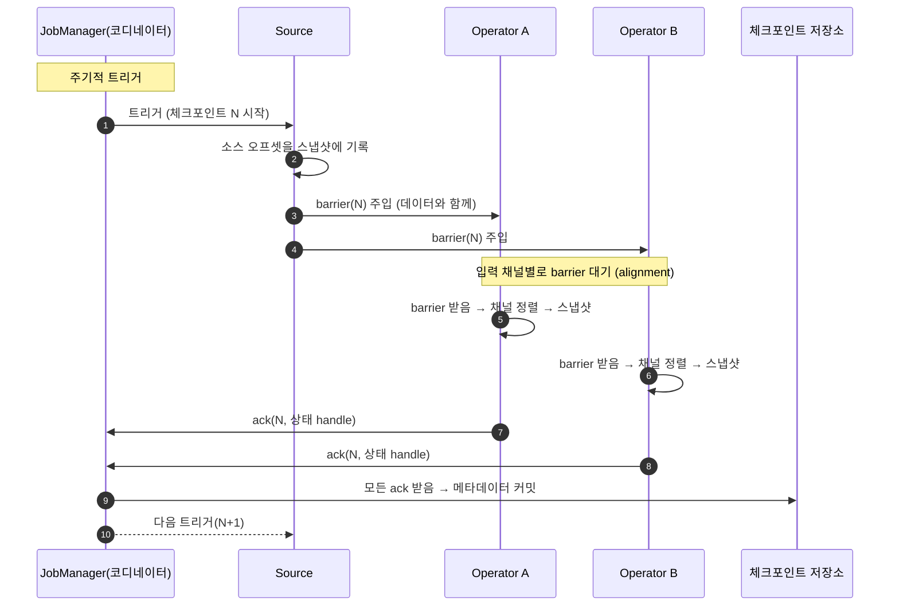
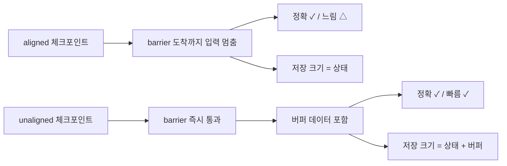

<figure class="post-figure post-figure--header">
<svg role="img" aria-label="Flink 상태와 체크포인트를 한 장으로 정리한 그림. 왼쪽 위는 연산자 안에 키별로 분리되어 쌓이는 작은 상태 셀들로 키별 상태가 쌓이는 모습을 보여주고, 그 아래에는 메모리 해시맵과 디스크 RocksDB 두 가지 상태 백엔드 선택지가 있다. 오른쪽 위는 분산 그래프 위를 흘러가는 체크포인트 barrier가 소스에서 주입되어 두 갈래 채널로 동시에 퍼지고 각 연산자가 도착 시점에 스냅샷을 찍는 Chandy-Lamport 흐름이다. 오른쪽 아래에는 barrier 정렬을 거쳐 만들어진 체크포인트 저장 디렉터리가 있다. 가운데에는 장애 후 savepoint에서 상태가 복원되어 같은 그래프가 다시 도는 화살표가 있다." viewBox="0 0 680 380" xmlns="http://www.w3.org/2000/svg">
  <title>Flink 상태와 체크포인트 — keyed/operator state, 메모리/RocksDB 백엔드, Chandy-Lamport barrier 스냅샷과 장애 복원</title>
  <defs>
    <marker id="fsc-arrow" viewBox="0 0 10 10" refX="8" refY="5" markerWidth="6" markerHeight="6" orient="auto-start-reverse">
      <path d="M0,0 L10,5 L0,10 z" fill="var(--secondary-color)"/>
    </marker>
    <marker id="fsc-gold" viewBox="0 0 10 10" refX="8" refY="5" markerWidth="6" markerHeight="6" orient="auto-start-reverse">
      <path d="M0,0 L10,5 L0,10 z" fill="var(--gold)"/>
    </marker>
    <marker id="fsc-acc" viewBox="0 0 10 10" refX="8" refY="5" markerWidth="6" markerHeight="6" orient="auto-start-reverse">
      <path d="M0,0 L10,5 L0,10 z" fill="var(--accent-color)"/>
    </marker>
  </defs>

  <!-- title -->
  <text x="340" y="22" text-anchor="middle" font-size="16" font-weight="800" fill="currentColor" letter-spacing="1.2">FLINK 상태와 체크포인트</text>
  <text x="340" y="41" text-anchor="middle" font-size="10" font-weight="700" fill="currentColor" opacity="0.72">keyed/operator state · 메모리/RocksDB 백엔드 · Chandy-Lamport barrier 스냅샷</text>

  <!-- ===== SECTION A: state inside operator =====
       keyed state: per-key cells. operator state: per-subtask lane. -->
  <text x="30" y="66" text-anchor="start" font-size="10" font-weight="700" fill="currentColor" opacity="0.72">① 연산자 안에 키별/서브태스크별 상태가 쌓인다</text>

  <!-- operator box -->
  <rect x="30" y="78" width="280" height="118" rx="6" fill="var(--bg-light)" stroke="currentColor" stroke-width="2"/>
  <text x="44" y="94" font-size="9.5" font-weight="800" fill="currentColor">KeyedProcessFunction (parallelism=4 중 1개 subtask)</text>

  <!-- keyed state cells -->
  <g font-size="8" fill="currentColor">
    <rect x="46" y="106" width="60" height="22" rx="3" fill="var(--bg-panel)" stroke="var(--secondary-color)" stroke-width="1.4"/>
    <text x="76" y="120" text-anchor="middle" font-weight="800">key=A</text>
    <text x="76" y="160" text-anchor="middle" font-size="7" opacity="0.7">ValueState&lt;Long&gt;</text>

    <rect x="112" y="106" width="60" height="22" rx="3" fill="var(--bg-panel)" stroke="var(--secondary-color)" stroke-width="1.4"/>
    <text x="142" y="120" text-anchor="middle" font-weight="800">key=B</text>
    <text x="142" y="160" text-anchor="middle" font-size="7" opacity="0.7">ListState&lt;…&gt;</text>

    <rect x="178" y="106" width="60" height="22" rx="3" fill="var(--bg-panel)" stroke="var(--secondary-color)" stroke-width="1.4"/>
    <text x="208" y="120" text-anchor="middle" font-weight="800">key=C</text>
    <text x="208" y="160" text-anchor="middle" font-size="7" opacity="0.7">MapState&lt;…&gt;</text>

    <rect x="244" y="106" width="60" height="22" rx="3" fill="var(--bg-panel)" stroke="var(--accent-color)" stroke-width="1.4"/>
    <text x="274" y="120" text-anchor="middle" font-weight="800">op-state</text>
    <text x="274" y="160" text-anchor="middle" font-size="7" opacity="0.7">UnionListState</text>
  </g>

  <!-- mini legend -->
  <text x="44" y="184" font-size="7.5" fill="currentColor" opacity="0.7">↑ keyed state: 키마다 격리. operator state: 서브태스크마다 1개.</text>

  <!-- ===== SECTION A2: backend choice ===== -->
  <line x1="30" y1="210" x2="650" y2="210" stroke="currentColor" stroke-width="1.2" opacity="0.25"/>
  <text x="30" y="230" text-anchor="start" font-size="10" font-weight="700" fill="currentColor" opacity="0.72">② 상태 백엔드 — 어디에 어떻게 저장하는가</text>

  <!-- HashMap backend -->
  <rect x="30" y="244" width="148" height="100" rx="5" fill="var(--bg-panel)" stroke="var(--secondary-color)" stroke-width="2"/>
  <text x="104" y="262" text-anchor="middle" font-size="10.5" font-weight="800" fill="currentColor">HashMapStateBackend</text>
  <text x="104" y="278" text-anchor="middle" font-size="8" opacity="0.78">JVM heap · 빠름</text>
  <g font-size="7.5" fill="currentColor">
    <text x="42" y="296">• 빠른 read/write</text>
    <text x="42" y="310">• 작은 상태에 적합</text>
    <text x="42" y="324">• 큰 상태 → GC 압박</text>
    <text x="42" y="338">• incremental △</text>
  </g>

  <!-- RocksDB backend -->
  <rect x="190" y="244" width="148" height="100" rx="5" fill="var(--bg-panel)" stroke="var(--gold)" stroke-width="2.5"/>
  <text x="264" y="262" text-anchor="middle" font-size="10.5" font-weight="800" fill="currentColor">EmbeddedRocksDB</text>
  <text x="264" y="278" text-anchor="middle" font-size="8" opacity="0.78">LSM on disk · 큰 상태 OK</text>
  <g font-size="7.5" fill="currentColor">
    <text x="202" y="296">• 메모리보다 느림</text>
    <text x="202" y="310">• TB 단위 상태 가능</text>
    <text x="202" y="324">• incremental ✓</text>
    <text x="202" y="338">• block_cache·compaction 튜닝</text>
  </g>

  <!-- checkpoint storage -->
  <rect x="350" y="244" width="148" height="100" rx="5" fill="var(--bg-panel)" stroke="currentColor" stroke-width="2"/>
  <text x="424" y="262" text-anchor="middle" font-size="10.5" font-weight="800" fill="currentColor">체크포인트 저장소</text>
  <text x="424" y="278" text-anchor="middle" font-size="8" opacity="0.78">FsStorage (S3/HDFS/로컬)</text>
  <g font-size="7.5" fill="currentColor">
    <text x="362" y="296">• 자동 정리 정책</text>
    <text x="362" y="310">• 외부 시스템 의존</text>
    <text x="362" y="324">• exactly-once sink와</text>
    <text x="362" y="338">  결합 가능</text>
  </g>

  <!-- side note -->
  <rect x="510" y="244" width="138" height="100" rx="5" fill="var(--bg-light)" stroke="var(--accent-color)" stroke-width="2" stroke-dasharray="4 2"/>
  <text x="579" y="262" text-anchor="middle" font-size="10" font-weight="800" fill="currentColor">TTL</text>
  <text x="579" y="278" text-anchor="middle" font-size="8" opacity="0.78">StateTtlConfig</text>
  <g font-size="7.5" fill="currentColor">
    <text x="522" y="296">• 만료 시간</text>
    <text x="522" y="310">• cleanup 전략</text>
    <text x="522" y="324">  full/incremental/</text>
    <text x="522" y="338">  rocksdb filter</text>
  </g>

  <!-- ===== SECTION B: Chandy-Lamport barrier flow ===== -->
  <line x1="30" y1="356" x2="650" y2="356" stroke="currentColor" stroke-width="1.2" opacity="0.25"/>
  <text x="30" y="376" text-anchor="start" font-size="10" font-weight="700" fill="currentColor" opacity="0.72">③ Chandy-Lamport barrier — 모든 채널로 동시에 퍼지고, 도착 시점에 스냅샷</text>
</svg>
<figcaption>한 장 요약 — 키별/서브태스크별 상태가 연산자 안에 쌓이고(키별로 분리된 keyed state와 서브태스크 단위 operator state), HashMap vs RocksDB 두 백엔드 중 트레이드오프를 잡고 TTL로 만료를 관리하며, Chandy-Lamport barrier가 모든 채널을 동시에 흘러 분산 그래프 위에서 일관된 글로벌 스냅샷을 만든다</figcaption>
</figure>

## 도입 — 왜 스트림에는 상태가 필요한가

배치 처리는 매 실행이 **독립적**입니다. 같은 잡을 다시 돌리면 처음부터 다시 계산합니다 — 입력은 어차피 다 모였고, 상태는 디스크의 결과로 충분히 표현되기 때문입니다. 반면 **스트림 처리는 무한 데이터를 끊임없이 흘려보내면서 매 이벤트를 즉시 반영해야** 합니다. 한 번 흘러간 이벤트는 다시 잡아오기 어렵고, 매번 처음부터 계산하면 윈도·집계·CEP 같은 연산이 전부 비싸집니다. 그래서 스트림 처리는 **지금까지 본 것을 기억**합니다. 그 기억이 바로 **상태(state)** 입니다.

이 "기억"이 필요한 순간은 의외로 광범위합니다.

- **집계**: 키별 이벤트 수를 세려면 "지금까지 몇 개나 봤는가"를 어딘가에 적어둬야 합니다.
- **조인**: 두 스트림을 키로 묶을 때 한쪽이 아직 도착 안 했으면 "상대편이 올 때까지 기다리며" 기억을 보관해야 합니다.
- **중복 제거**: 일정 시간 동안 같은 키를 다시 보지 않으려면 최근 본 키 집합을 들고 있어야 합니다.
- **CEP**: 패턴 매칭은 "A를 봤다 → B를 기다린다 → C가 늦게 오면 분기" 같은 N단계 기계 상태가 필요합니다.
- **워터마크·윈도**: [2단계 이벤트 시간·워터마크](/2026/07/22/flink-event-time-watermark.html)에서 본 "지각 이벤트 허용 시간"도 결국 만료 기반 상태 보관의 문제입니다.

문제는 이 "기억"이 **연산자 안에 있고, 메모리 또는 디스크에 있고, 병렬 실행에 의해 키별로 나뉘어 있다**는 점입니다. 메모리에 둘지 디스크에 둘지, 키별로 어디까지 분리할지, 키 개수가 수십억이 될 때 어떻게 GC할지가 전부 운영 문제입니다. 게다가 작업은 **언제든 죽습니다** — TaskManager가 죽을 수 있고, 네트워크가 끊길 수 있고, 배포 도중 재시작할 수도 있습니다. 그래서 Flink는 상태를 **스냅샷으로 저장해 장애 후 복원**하는 메커니즘을 제공합니다. 그게 **체크포인트(checkpoint)** 입니다. 이 단계는 이 두 문제 — 상태를 어떻게 다루고, 어떻게 지키는가 — 를 깊게 다룹니다.

> 같은 시리즈의 [1단계 스트림 처리 모델](/2026/07/22/flink-stream-processing-model.md)에서 본 "키별 병렬성·슬롯 안에서 체이닝된 task"가 이 단계의 모든 것의 토대입니다. 키별 상태는 결국 그 키를 담당하는 subtask 안에 거주합니다.

> **상태 마인드셋**: 스트림 처리에서 상태 없는(stateless) 변환은 거의 없습니다. `map`, `filter`처럼 단일 레코드만 보고 끝나는 작업조차, 그 뒤에 키 분배가 있다면 **이전 작업이 키별로 모은 결과를 읽어야 하므로 사실상 상태**가 됩니다. "내 코드에 상태가 있나"가 아니라 "내 코드의 어느 함수에 어떤 상태가 적절한가"가 올바른 질문입니다.

## 핵심 개념 1 — 상태의 두 분류: Keyed State vs Operator State

Flink의 상태는 **키와 어떤 관계가 있는가**에 따라 두 종류로 나뉩니다.

### 1-1. Keyed State — 키별로 격리된 상태

`keyBy` 이후에 등장하는 `KeyedStream` 위에서만 쓸 수 있는 상태입니다. Flink는 입력 레코드의 키를 보고 그 키에 해당하는 상태 셀을 따로 만들어 보관합니다. **같은 키는 항상 같은 subtask**로 가므로(해시 파티셔닝), 그 subtask 안에 있는 그 키의 상태 셀만 갱신하면 됩니다. 다른 키의 상태와 섞일 수가 없습니다.

이 "키별 격리"는 정확성·병렬성·확장성을 동시에 잡는 트릭입니다. 정확성을 위해 한 키의 누적이 다른 키와 섞이면 안 되고, 병렬성을 위해 키마다 독립적으로 계산돼야 하며, 확장을 위해 키 범위만 늘리면 자동으로 더 많은 subtask로 분산되어야 합니다. Keyed State는 이 셋을 한 번에 만족합니다.

Keyed State에는 다섯 가지 인터페이스가 있고, 데이터 모양·연산 의도에 따라 고릅니다.

```mermaid
flowchart TD
  KS[Keyed State<br/>key마다 격리된 셀]
  KS --> V[ValueState&lt;T&gt;<br/>단일 값]
  KS --> L[ListState&lt;T&gt;<br/>리스트]
  KS --> M[MapState&lt;UK,UV&gt;<br/>키-값 맵]
  KS --> R[ReducingState&lt;T&gt;<br/>reduce 누적]
  KS --> A[AggregatingState&lt;IN,OUT&gt;<br/>더 복잡한 집계]

  classDef root fill:var(--bg-light),stroke:var(--secondary-color),stroke-width:2.5px,color:currentColor;
  classDef leaf fill:var(--bg-light),stroke:var(--accent-color),stroke-width:2px,color:currentColor;
  class KS root
  class V,L,M,R,A leaf
```

각 인터페이스의 시그니처와 쓰임은 다음과 같습니다.

- **ValueState\<T\>**: 키당 단일 값. 가장 흔한 형태로, "이 키의 합계", "이 키의 마지막 본 시각" 같은 단일 스칼라 보관에 씁니다. 메서드는 `value()`, `update(T)`, `clear()`.
- **ListState\<T\>**: 키당 리스트. "이 키의 최근 N개 이벤트" 같은 큐잉, "이 키가 그동안 본 모든 액션 로그" 같은 적재에 씁니다. `get()`, `add(T)`, `addAll(List)`, `update(List)`.
- **MapState\<UK, UV\>**: 키당 키-값 맵. "이 키의 사용자별 카운트", "이 키의 카테고리별 빈도" 같은 부분 키 집계에 씁니다. `get(UK)`, `put(UK, UV)`, `entries()`, `keys()`, `values()`, `iterator()`.
- **ReducingState\<T\>**: `reduce(T, T) -> T` 함수 하나로 누적되는 값. 매 갱신마다 함수가 호출되므로 "현재값과 새값을 어떻게 합치는가"를 매번 작성합니다. `add(T)` 호출 시 내부적으로 reduce가 적용되고, `get()`은 누적된 단일 값을 돌려줍니다.
- **AggregatingState\<IN, OUT\>**: ReducingState의 일반화. 누적 함수(같은 타입)와 결과 추출 함수(다른 타입)를 분리해 줍니다. 평균·분산처럼 "중간 상태는 합과 개수"를 들고 있다가 "조회 시점에 OUT을 만들어 돌려주는" 패턴이 자연스럽습니다.

> **왜 다섯 종류인가**: ValueState만으로 모든 걸 표현할 수 있지만, 매번 직렬화·역직렬화를 반복하면 비효율적입니다. MapState는 부분 키를 직접 다룰 수 있고, AggregatingState는 평균처럼 자주 보는 패턴을 한 줄로 줄여 줍니다. **올바른 인터페이스를 고르는 것은 직렬화 비용과 코드 명확성을 동시에 잡는 일**입니다.

Java/Python 시그니처 차이는 의도적입니다. Java는 타입 안전한 제네릭으로 강하게 잡고, PyFlink은 런타임 디스크립터(`ValueStateDescriptor("name", Types.LONG())`)로 타입을 표현합니다. PyFlink의 패턴을 잠시 미리 보면 다음과 같습니다.

```python
# PyFlink — ValueState 디스크립터 (open 시점에 한 번 만들어 등록)
self.state = runtime_context.get_state(
    ValueStateDescriptor("count", Types.LONG())
)
```

### 1-2. Operator State — 키와 무관한, subtask 단위 상태

Keyed State와 달리 **키와 무관한 상태**입니다. `keyBy`로 나뉘지 않은 일반 `DataStream`(예: 소스, 맵, flatMap) 위에서만 쓸 수 있고, **subtask 단위**로 분배됩니다. 즉, subtask A의 operator state와 subtask B의 operator state는 서로 다른 상태입니다.

대표 예가 **Kafka source connector의 partition별 offset**입니다. 파티션이 subtask에 할당되어 있고, 각 subtask는 "내가 담당하는 파티션들의 현재 오프셋"을 operator state로 들고 있습니다. 장애가 나면 이 오프셋을 보고 그 자리부터 다시 읽으면 됩니다. 자매 시리즈 [Kafka 프로듀서·컨슈머·그룹](/2026/07/15/kafka-producers-consumers-groups.html)의 "컨슈머 오프셋"이 Flink 안에서는 operator state로 표현되는 셈입니다.

Operator State는 세 가지 인터페이스를 가집니다.

- **ListState\<T\>**: subtask당 리스트. 병렬성을 늘릴 때(예: Kafka source를 parallelism=4에서 8로) 키 보존이 어렵기 때문에 보통 **UnionListState**로 함께 변환합니다.
- **UnionListState\<T\>**: subtask당 리스트이지만, 복원 시점에 모든 subtask에 **합쳐진 전체 리스트**가 들어옵니다. 병렬성 변경 시 데이터를 잃지 않게 하는 표준 방법입니다.
- **BroadcastState\<K, V\>**: 모든 subtask에 **동일하게** 복제되는 읽기 전용 상태. 컨트롤 메시지나 룩업 테이블처럼 "모든 인스턴스가 같은 내용을 가져야 하는" 경우에 씁니다. broadcast 연결을 통해 들어온 데이터로만 갱신 가능하고, 일반 데이터 스트림으로는 변경 불가입니다.

> **키 vs 서브태스크**: Keyed State는 "키별 격리"가 일관성의 핵심이고, Operator State는 "서브태스크 단위 격리"가 일관성의 핵심입니다. 둘을 헷갈리면 **잘못된 parallelism 변경 시 데이터가 사라지거나 중복**됩니다. 아래 savepoint 섹션에서 다시 다룹니다.

## 핵심 개념 2 — 상태 TTL: 만료 기반 메모리 관리

Keyed State는 명시적으로 `clear()` 하기 전까지 **계속 살아 있습니다**. 이것이 강력한 만큼 메모리도 키지요. 키가 무한히 늘 수 있는 워크로드(예: userId, sessionId, deviceId)에서 TTL을 설정하지 않으면 상태가 자라만 가서 결국 OOM으로 작업이 죽습니다. 운영 핵심은 **"이 키의 상태가 이 시간 이후로 안 쓰이면 만료시켜라"** 를 명시하는 것입니다.

Flink는 `StateTtlConfig`로 이를 표현합니다. 핵심 골격은 (PyFlink 시그니처는 PyFlink 버전·빌드에 따라 다르므로) **Java DataStream API**로 보여드립니다.

```java
// org.apache.flink.api.common.state.StateTtlConfig — Java DataStream API
StateTtlConfig ttlConfig = StateTtlConfig.newBuilder(Duration.ofMinutes(30))
    .setUpdateType(StateTtlConfig.UpdateType.OnCreateAndWrite)   // 만료 시각 갱신 시점
    .cleanupIncrementally(1024, true)                            // 청소: 1024건마다, 매 레코드마다 검사
    .build();

ValueStateDescriptor<Long> descriptor = new ValueStateDescriptor<>("last-seen", Types.LONG);
descriptor.enableTimeToLive(ttlConfig);
ValueState<Long> state = runtimeContext.getState(descriptor);
```

PyFlink을 쓰는 경우 빌더 메서드명이 `set_update_type`처럼 snake_case로 변환되며 메서드 자체가 PyFlink 1.17 / 1.18 / 1.19 사이에 미세하게 다릅니다 — `pyflink.datastream.state.StateTtlConfig`의 시그니처를 환경에 맞게 확인하는 것을 권합니다. **개념 자체는 동일**합니다 — TTL 길이, UpdateType, Cleanup 전략 세 가지를 정해 `.build()`로 묶고, `ValueStateDescriptor`에 얹는다는 점입니다.

여기서 등장한 두 가지를 짚어야 합니다.

### 2-1. UpdateType — 만료 시각을 언제 갱신하는가

- **OnCreateAndWrite**: 키가 처음 만들어질 때와 매 쓰기 시점 모두에서 만료 시각을 갱신합니다. "최근에 본 키"가 살아남길 원할 때(예: 사용자 세션 상태) 적절합니다.
- **OnReadAndWrite**: 읽기 시점에도 갱신합니다. "계속 조회되는 키는 안 죽는다"를 보장하지만 read hit마다 메타데이터 갱신이 발생합니다.

### 2-2. CleanupStrategies — 만료된 키를 언제 실제로 지우는가

만료는 메타데이터만으로는 끝나지 않습니다. 실제 메모리에서 지워야 GC가 됩니다.

- **FULL_STATE_SCAN**: 매 체크포인트마다 **전체 상태를 스캔**해 만료 키를 지웁니다. 정확하지만 큰 상태엔 비쌉니다.
- **INCREMENTAL_CLEANUP**: 쓰기 도중(예: RocksDB compaction 트리거 시) **점진적으로** 만료 키를 지웁니다. 일반적으로 권장되는 기본값.
- **ROCKSDB_COMPACTION_FILTER**: RocksDB 백엔드 전용. compaction 단계에서 필터로 만료 항목을 제거합니다. 추가 설정이 필요하지만 가장 효율적입니다.

> **RocksDB 네이티브 TTL과의 차이**: RocksDB 자체에도 TTL 기능이 있지만, 이는 **읽기 시점의 만료 검사**만 제공합니다. 만료된 키가 디스크에서 자동으로 사라지지 않습니다. Flink의 `StateTtlConfig`는 이를 **쓰기 시점에 적극적으로 청소**하는 메커니즘을 제공하므로 운영상 훨씬 안전합니다.

### 2-3. TTL로 못 푸는 상황

TTL은 "마지막 사용 이후 일정 시간"이라는 의미가 있는 키에서만 작동합니다. 다음 상황에서는 별도 전략이 필요합니다.

- **"이 키를 마지막으로 본 시간" 자체가 상태인 경우**: ValueState를 만료시키면 "마지막 본 시간"도 사라지므로 무한 루프.
- **키 개수가 무한이고 TTL이 무의미한 경우**: 예를 들어 트랜잭션 ID가 매번 unique라면 TTL이 있어도 도달 전에 키가 폭증합니다. 이런 경우엔 키 공간 자체를 제한하는 다른 설계(예: HLL로 근사, 윈도로 스코프 한정)가 필요합니다.
- **상관관계 ID처럼 한 번 쓰고 버려야 하는 경우**: 패턴이 명확하면 TTL 대신 `processElement` 마지막에 `clear()`로 즉시 청소.

### 2-4. 이벤트 시간 + TTL + 타이머 — 만료를 워터마크로 묶기

운영에서 자주 보이는 패턴은 **"키당 마지막 활동 시간을 워터마크와 결합해 만료시키는"** 것입니다. 단순 TTL은 마지막 쓰기 시점 기준이지만, **이벤트 시간 기준 만료** — 즉 "이 키가 들어온 이벤트의 시각 기준으로 N분 지나면 만료" — 가 필요할 때가 있습니다.

```python
# PyFlink — 이벤트 시간 기준으로 키 만료 (KeyedProcessFunction + EventTimeTimer)
class EventTimeExpire(KeyedProcessFunction):
    def __init__(self, expire_ms: int):
        self.expire_ms = expire_ms
        self.state = None

    def open(self, runtime_context: RuntimeContext):
        # 상태는 ValueState (마지막 본 시각). TTL은 외부에서 관리.
        self.state = runtime_context.get_state(
            ValueStateDescriptor("last-seen", Types.LONG())
        )

    def process_element(self, value, ctx: KeyedProcessFunction.Context):
        ts = ctx.timestamp()                          # 이벤트 시간
        self.state.update(ts)
        # 현재 등록된 타이머가 더 오래된 거라면 교체
        cur_timer = ctx.timer_service().current_watermark() + self.expire_ms
        ctx.timer_service().register_event_time_timer(cur_timer)

    def on_timer(self, timestamp, ctx: KeyedProcessFunction.OnTimerContext):
        # 타이머 발화 시점에 워터마크가 이 시간을 넘었으면 만료
        last = self.state.value()
        if last is not None and timestamp - last >= self.expire_ms:
            self.state.clear()
```

이 패턴은 단순 TTL과 다른 점이 있습니다. **단순 TTL은 마지막 쓰기 시점부터 N분**, 이 패턴은 **이벤트 시간 기준 N분**입니다. 데이터가 늦게 도착해 뒤쪽 워터마크가 뒤로 밀려도, 이벤트 시간 기준 만료는 "그 키가 들어온 이벤트 시간"을 본다는 점에서 결정적입니다. 다만 **워터마크 자체가 멈추면 만료도 멈추므로**, [2단계](/2026/07/22/flink-event-time-watermark.html)에서 다룬 워터마크 정렬·아이들 소스 처리가 함께 필요합니다.

## 핵심 개념 3 — 상태 백엔드: 메모리 vs RocksDB

상태를 **어디에·어떻게** 저장하느냐가 성능·장애 복원 비용·확장성의 세 축을 결정합니다. Flink는 두 가지 백엔드를 표준으로 제공하며, 1.13 이후로는 `FsStateBackend`(파일 시스템)과 `MemoryStateBackend`(메모리, 제한적)가 deprecated 또는 legacy로 분류되어 신규 코드에선 거의 쓰지 않습니다.

### 3-1. HashMapStateBackend — JVM heap에 상태를 통째로

가장 단순한 선택입니다. 모든 keyed state와 operator state를 JVM heap 위 `HashMap`에 보관합니다.

```python
# PyFlink — HashMapStateBackend 지정
env = StreamExecutionEnvironment.get_execution_environment()
env.set_state_backend(HashMapStateBackend())  # 메모리 백엔드
env.get_checkpoint_config().set_checkpoint_storage("file:///tmp/flink/ckpt")
```

장점과 단점이 자명합니다.

- **장점**: read/write가 모두 메모리 액세스이므로 가장 빠릅니다. GC 외에는 I/O가 없습니다.
- **단점**: 상태 크기가 JVM heap 크기에 직접 묶입니다. 큰 상태는 GC 압박으로 latency spike을 만들고, 결국 OOM이 옵니다. **메모리 가격의 비선형적 증가** — 10GB까지는 잘 돌지만 100GB에 가면 GC가 수 초씩 잡아먹습니다.

### 3-2. EmbeddedRocksDBStateBackend — 디스크 LSM 기반

상태를 RocksDB(LSM 트리 기반 임베디드 KV 스토어)에 저장합니다. 메모리에는 hot 데이터(블록 캐시·memtable), 디스크에는 전체 데이터(SST 파일)가 갑니다.

```python
# PyFlink — RocksDB 백엔드 (옵션 포함)
from pyflink.datastream.state_backend import EmbeddedRocksDBStateBackend
from pyflink.datastream.extensions.windowing import RocksDBStateBackend
# Flink 1.13+ : state.backend.type=rocksdb 만 지정해도 OK
env = StreamExecutionEnvironment.get_execution_environment()
env.set_state_backend(EmbeddedRocksDBStateBackend())
env.get_checkpoint_config().set_checkpoint_storage("s3://my-bucket/flink/ckpt")
env.get_checkpoint_config().set_min_pause_between_checkpoints(30_000)  # 30초
```

핵심 트레이드오프는 다음과 같습니다.

- **장점**: TB 단위 상태가 가능합니다. **incremental checkpoint** 와 궁합이 좋아서 스냅샷 크기가 이전과 변경된 SST 파일만으로 제한됩니다.
- **단점**: read/write에 직렬화·LSM compaction이 들어가므로 HashMap보다 느립니다. **블록 캐시·memtable·write buffer**를 튜닝하지 않으면 큰 상태에서 latency가 들쭉날쭉합니다.

> **언제 무엇을 고르는가**: 상태 크기가 subtask당 수 GB 이하이고 latency가 매우 중요하면 HashMap. 그 이상이면 RocksDB. 운영 중 혼합해서 쓰는 것도 가능하지만 일반적으로 잡 전체에 한 가지로 통일하는 편이 디버깅이 쉽습니다.

### 3-3. Incremental Checkpoint와의 관계

체크포인트에는 두 가지 모드가 있습니다.

- **Full checkpoint**: 매 스냅샷마다 **전체 상태**를 저장합니다. 단순하고 복원이 빠르지만 큰 상태일수록 스냅샷 크기와 시간이 폭증합니다.
- **Incremental checkpoint**(RocksDB만 가능): 이전 스냅샷 대비 **변경된 SST 파일만** 더합니다. RocksDB의 immutable한 SST 특성 덕분에 가능합니다. 체크포인트 시간이 상태 크기에 거의 무관하게 일정해집니다.

큰 상태라면 거의 항상 **RocksDB + incremental** 의 조합이 답입니다. 반대로 HashMapStateBackend는 incremental을 지원하지 않으므로 큰 상태엔 부적합합니다.

### 3-4. RocksDB 옵션 튜닝 (핵심만)

Java/Scala에선 `RocksDBStateBackend.setOptions()`나 `flink-conf.yaml`의 `state.backend.rocksdb.*`로 옵션을 조정합니다.

```java
// Java — RocksDB 옵션 예시 (state.backend.rocksdb.localdir 포함)
EmbeddedRocksDBStateBackend backend = new EmbeddedRocksDBStateBackend(true); // incremental
backend.setOptions(new RocksDBOptionsFactory() {
    @Override public RocksDBOptions createCurrentOptions() {
        return new RocksDBOptions.Builder()
            .setBlockCacheSizeMB(128)          // read 캐시 (heap 일부)
            .setWriteBufferSizeMB(64)          // memtable 크기
            .setMaxWriteBufferNumber(4)        // memtable 수
            .setCompactionStyle(CompactionStyle.UNIVERSAL)  // 큰 상태엔 universal
            .build();
    }
    @Override public RocksDBOptions createPreviousOptions() { return createCurrentOptions(); }
});
```

핵심 가이드:

- **block_cache_size_mb**: read 캐시. 너무 작으면 hot key가 자꾸 디스크를 찌릅니다. TaskManager heap의 30~50% 권장.
- **write_buffer_size_mb** + **max_write_buffer_number**: memtable. 크면 쓰기 효율이 오르지만 flush 시 stall. 둘의 곱이 메모리 사용량의 상한.
- **compaction_style**: 큰 상태엔 `UNIVERSAL`이 보통 더 좋고, 작은 상태엔 `LEVEL`.
- **localdir**: RocksDB 데이터 디렉터리. **고속 SSD**에 두고, 분리된 디스크일수록 좋습니다. 같은 디스크를 체크포인트 저장소와 공유하면 I/O 경합으로 둘 다 느려집니다.

> **튜닝은 마지막에**: RocksDB 옵션 튜닝은 성능이 안 나올 때 점진적으로 합니다. 처음부터 모든 옵션을 만지면 무엇이 효과를 만들었는지 분리가 어렵습니다. 보통 (1) block_cache로 hot 키 read를 잡고, (2) write buffer로 쓰기 stall을 잡고, (3) compaction style을 데이터 크기에 맞춰 바꾸는 순서가 안전합니다.

## 핵심 개념 4 — 체크포인트: Chandy-Lamport 분산 스냅샷

상태를 어떻게 보관할지 정했으면, 다음 질문은 **"작업이 죽었을 때 그 상태를 어떻게 살릴 것인가"** 입니다. 답이 체크포인트 — 주기적으로 상태를 분산 스토리지에 저장해 두는 것 — 입니다. 그런데 **분산 시스템에서 "전체 그래프의 상태"를 한 순간에 모순 없이 저장하는 것**은 단순하지 않습니다.

### 4-1. 왜 분산 스냅샷이 어려운가

각 노드가 **자기 시점에** 독립적으로 스냅샷을 찍는다고 가정해 봅니다. 노드 A는 시점 t1에 스냅샷을 찍고, 노드 B는 그 1초 뒤 t2에 스냅샷을 찍었다면, 두 스냅샷 사이를 흐른 메시지는 한쪽에서만 포함되고 다른 쪽에서는 빠져 있습니다. 이 상태를 복원하면 **인과성이 깨진** 잘못된 글로벌 상태가 됩니다. 분산 스냅샷은 정확히 이 문제를 풀어야 합니다.

### 4-2. Chandy-Lamport 트릭 — barrier가 모든 채널을 동시에

1985년에 발표된 Chandy-Lamport 알고리즘은 이 문제를 우아하게 풉니다. 핵심은 **"스냅샷 시작점(source)에서 marker(Flink에서는 barrier)를 모든 출력 채널에 흘려보내고, 각 노드는 모든 입력 채널에서 그 marker를 처음 봤을 때 로컬 스냅샷을 찍는다"** 입니다. 이렇게 하면 marker는 그래프의 모든 채널을 동시에 흘러가므로, 모든 노드가 **일관된 글로벌 컷(global cut)** 위에 놓이게 됩니다.

Flink는 이 아이디어를 그대로 채용해 **checkpoint barrier** 라고 부릅니다. barrier는 데이터 레코드와 함께 흘러가며, **barrier보다 앞의 레코드는 스냅샷에 포함**되고 **barrier보다 뒤의 레코드는 다음 스냅샷에 포함**됩니다. 이 규약 한 줄이 글로벌 일관성을 보장합니다.



이 흐름에서 핵심은 두 가지입니다.

- **barrier alignment**: 한 연산자가 두 개 이상의 입력 채널을 가질 때, **모든 채널에서 barrier(N)이 도착할 때까지 한 채널의 데이터를 버퍼에 쌓아두고 다른 채널은 멈춥니다**. 이게 exactly-once의 토대가 되는 정렬(alignment) 단계입니다. 정렬이 끝나면 그 시점의 상태를 스냅샷에 저장하고, 다음 스냅샷(N+1)부터 데이터를 흘려보냅니다.
- **ack 메커니즘**: 각 subtask는 자기 스냅샷을 끝내면 JobManager에 ack를 보냅니다. JobManager는 **모든 subtask의 ack**가 모이면 체크포인트를 커밋합니다. 하나라도 실패하면 그 체크포인트는 폐기되고 다음 트리거를 기다립니다.

### 4-3. Aligned vs Unaligned Checkpoint

기본 모드는 **aligned checkpoint** 입니다. barrier가 모든 입력에 도착할 때까지 데이터를 멈춰 두므로 **정확하지만 느립니다**. 문제는 **불균형 워크로드** — 일부 입력 채널이 다른 채널보다 늦게 barrier를 받으면, 다른 채널은 다 멈춰 있게 되어 잡 전체가 그 채널에 끌려갑니다.

해결책으로 Flink 1.11+는 **unaligned checkpoint** 를 제공합니다. barrier를 기다리지 않고 **그 시점에 버퍼에 쌓인 데이터까지 통째로 스냅샷에 포함**시킵니다. 정확성은 유지되면서 barrier alignment 지연이 사라지지만, 체크포인트 사이즈가 크게 불어납니다(state + in-flight buffers). 트레이드오프입니다.



> **언제 무엇을 쓰나**: 일반적으로는 aligned가 기본이고 충분합니다. **barrier alignment가 워크로드에서 종종 latency spike를 만드는 것이 측정**되었거나, **작업이 죽었을 때 빨리 복원**이 우선이면 unaligned로 전환합니다. 다만 저장 용량과 checkpoint 업로드 시간이 같이 늘어나므로 인프라 비용 검토가 필수입니다.

```python
# PyFlink — unaligned checkpoint 활성화
ckpt_config = env.get_checkpoint_config()
ckpt_config.enable_unaligned_checkpoints()        # unaligned 활성화
ckpt_config.set_alignment_timeout(Duration.of_seconds(30))  # fallback
```

위 코드의 `alignment_timeout`은 안전망입니다. alignment가 30초 안에 끝나지 않으면 unaligned로 자동 전환해 **워크로드는 계속 흘러가게** 하고, checkpoint는 진행시킵니다. 즉, 평소엔 aligned로 정확성을 잡되 비정상 상황에선 unaligned로 막히지 않게 하는 **하이브리드 운영**이 가능합니다.

### 4-4. Exactly-Once vs At-Least-Once Checkpoint Mode

`CheckpointingMode`로 명시합니다.

```python
# PyFlink — exactly-once (default)
env.get_checkpoint_config().checkpointing_mode = CheckpointingMode.EXACTLY_ONCE
```

- **EXACTLY_ONCE**: barrier alignment로 정확히 한 번 보장을 구성합니다. 느리지만 정확.
- **AT_LEAST_ONCE**: alignment 없이 가능한 빨리 barrier를 통과시킵니다. 빠르지만 장애 시 같은 레코드가 두 번 처리될 수 있습니다.

체크포인트 모드가 exactly-once여도 **sink가 exactly-once인지**는 별개입니다. 외부 시스템(Kafka, MySQL 등)에 쓰는 효과는 sink 구현이 정합니다. 이건 4단계 exactly-once에서 깊게 다룹니다.

## 핵심 개념 5 — Savepoint vs Checkpoint

체크포인트와 자주 같이 등장하는 개념이 **savepoint** 입니다. 둘 다 "상태의 스냅샷"이지만 목적이 다릅니다.

- **Checkpoint**: 운영 중 자동. JobManager가 트리거하고, 기본 정책(예: 최근 N개 유지)에 따라 자동 정리. **장애 복구용**.
- **Savepoint**: 사용자가 명령으로 트리거(`flink savepoint :jobId :dir`). 자동 정리 안 됨. **버전 업그레이드, 마이그레이션, A/B 테스트, blue-green 배포용**.

체크포인트 포맷은 Flink 내부에 강하게 묶여 있어 Flink major 업그레이드와 호환되지 않을 수 있습니다. 반면 savepoint는 format이 **안정화**되어 있어 버전 호환성에 더 신중하게 다뤄집니다.

> **uid의 중요성**: savepoint가 operator를 다시 식별하는 기준은 **operator uid**입니다. 코드를 바꿔 operator의 자리만 바뀌어도(예: 새 map을 사이에 끼워 넣음) 기존 savepoint가 못 읽을 수 있습니다. 안정적인 uid를 부여하고, max parallelism도 savepoint에 박혀 있으므로 함부로 줄이면 안 됩니다.

```bash
# Flink CLI — savepoint 트리거 및 복원
flink savepoint :jobId s3://my-bucket/flink/savepoints/

# savepoint에서 복원 (uid/maxParallism 호환성 검증)
flink run --fromSavepoint s3://my-bucket/flink/savepoints/savepoint-abc123 \
    --jobClassName com.example.MyJob
```

### max parallelism의 함정

`maxParallelism`은 keyed state를 해시 파티셔닝할 때의 키 공간 크기입니다. savepoint에 **이 값이 박혀 있어** 복원 시 변경 불가입니다. 늘릴 수는 있지만 줄이면 키 충돌이 생겨 데이터가 잘못된 subtask로 가서 상태가 깨집니다. **처음 잡을 설계할 때 충분히 큰 값**(예: 128, 256)으로 잡고, 이후엔 늘리기만 합니다.

### 체크포인트 vs savepoint 의사결정 가이드

| 작업 | 자동 checkpoint | 수동 savepoint |
|---|---|---|
| TaskManager OOM/크래시 후 복원 | ✓ (자동 restart + 가장 최근 checkpoint에서 복원) | — |
| Flink 버전 업그레이드 | ✗ (포맷 호환성 깨질 수 있음) | ✓ (호환성 검증 후 진행) |
| 잡 코드의 작은 변경(예: map 함수 수정) | ✗ (uid 불일치로 복원 실패 가능) | ✓ (uid가 같으면 호환) |
| 병렬성(parallelism) 변경 | △ (호환 시 가능) | ✓ (더 자유로운 변경) |
| A/B 테스트 / blue-green | ✗ | ✓ (savepoint에서 두 잡 동시 실행) |
| 신규 데이터 소스/싱크 마이그레이션 | ✗ | ✓ (savepoint로 데이터 이전) |

표를 보면 운영 자동 복구는 checkpoint가, 그 외 변화에는 savepoint가 답입니다. 두 메커니즘은 **상호 보완**이지 대체가 아닙니다.

## 코드 예제 — PyFlink: 체크포인트 + TTL + ValueState 풀 셋업

아래 예제는 1, 2단계에서 다룬 내용과 결합해 "상태를 가진 keyed 프로세스 함수가 체크포인트를 설정하고 TTL을 가진 ValueState로 동작하는" 가장 흔한 패턴을 한 번에 보여 줍니다.

```python
# flink_state_checkpoint_basic.py
# Flink 1.17+ PyFlink DataStream API — 상태/체크포인트 풀 셋업
from pyflink.datastream import StreamExecutionEnvironment, CheckpointingMode
from pyflink.datastream.state import ValueStateDescriptor, StateTtlConfig
from pyflink.datastream.functions import KeyedProcessFunction, RuntimeContext
from pyflink.common import Time, Types
from pyflink.common.typeinfo import Types

env = StreamExecutionEnvironment.get_execution_environment()
env.set_parallelism(4)

# (1) 체크포인트 활성화 — 60초마다, 최소 30초 간격, 정확히 한 번
env.enable_checkpointing(60_000)  # ms
ckpt_config = env.get_checkpoint_config()
ckpt_config.set_checkpointing_mode(CheckpointingMode.EXACTLY_ONCE)
ckpt_config.set_min_pause_between_checkpoints(30_000)
ckpt_config.set_max_concurrent_checkpoints(1)
ckpt_config.set_checkpoint_storage("s3://my-bucket/flink/checkpoints")
ckpt_config.set_checkpoint_timeout(60_000)
# 상태 백엔드 선택(필요 시) — RocksDB 권장
# env.set_state_backend(EmbeddedRocksDBStateBackend())

# (2) 무한 이벤트 스트림 — (user_id, action) 튜플
events = env.add_source(KafkaSource(...))  # 사용자 정의 소스

# (3) 키 분배 — keyed state로 가는 첫 단계
keyed = events.key_by(lambda e: e[0], types=Types.STRING())


# (4) KeyedProcessFunction 안에서 ValueState + TTL 사용
class CountingProcess(KeyedProcessFunction):
    def __init__(self):
        self.state = None

    def open(self, runtime_context: RuntimeContext):
        # TTL: 30분, write 시 갱신, incremental cleanup
        # TTL — PyFlink 빌더 메서드명은 1.17 / 1.18 / 1.19 사이에 차이가 있고
        # 빌드에 따라 노출 여부도 다르다. 환경에 맞는 시그니처를 확인해서 아래 형태로:
        # ttl_config = (
        #     StateTtlConfig.new_builder(Time.minutes(30))
        #     .update_ttl_on_create_and_write()       # 또는 update_ttl_on_read_and_write()
        #     .cleanup_incrementally(1024, True)      # 또는 cleanup_rocksdb_compact_filter() 등
        #     .build()
        # )
        # Java 기준 골격은 위의 StateTtlConfig 절을 참고한다.
        descriptor = ValueStateDescriptor("count", Types.LONG())
        self.state = runtime_context.get_state(descriptor)

    def process_element(self, value, ctx: KeyedProcessFunction.Context):
        key = value[0]                              # user_id
        current = self.state.value() or 0           # 없으면 0
        self.state.update(current + 1)
        # 1시간 키 무활동 시 watermark 등 활용 가능 (2단계)
        ctx.timer_service().register_event_time_timer(
            ctx.timestamp() + 60 * 60 * 1000
        )

    def on_timer(self, timestamp, ctx: KeyedProcessFunction.OnTimerContext):
        # 주기 정리: 1시간 무활동 키는 상태 비우기
        self.state.clear()


# (5) sink — 결과는 4단계 exactly-once에서 다루는 TwoPhaseCommitSink 패턴
keyed.process(CountingProcess()).print()
env.execute("flink-state-checkpoint-basic")
```

이 코드가 보여주는 핵심 흐름은 다음과 같습니다.

- **체크포인트 설정은 한 군데** — `enable_checkpointing` + `set_checkpoint_storage`로 4단계까지의 토대가 잡힙니다.
- **상태 디스크립터는 `open` 시점**에 만들어 **한 번 등록**합니다. 이후 `process_element`에선 `self.state`를 그대로 씁니다.
- **TTL은 디스크립터에 옵션으로** 붙입니다. 키 공간이 무한히 커질 수 있는 경우엔 거의 필수.

## 코드 예제 — Java: 상태 인터페이스 비교

```java
// Flink Java DataStream API — 다양한 상태 인터페이스 골격
public class StateShowcase extends KeyedProcessFunction<String, Event, Result> {

    private transient ValueState<Long> countState;
    private transient ListState<String> recentEventsState;
    private transient MapState<String, Long> categoryCountState;
    private transient ReducingState<Long> totalAmountState;
    private transient AggregatingState<Event, Average> avgLatencyState;

    @Override
    public void open(Configuration parameters) {
        // ValueState — 키당 단일 값
        ValueStateDescriptor<Long> countDesc = new ValueStateDescriptor<>("count", Long.class);

        // ListState — 키당 리스트
        ListStateDescriptor<String> listDesc =
                new ListStateDescriptor<>("recent", Types.STRING);

        // MapState — 키당 키-값 맵
        MapStateDescriptor<String, Long> mapDesc =
                new MapStateDescriptor<>("by-category", Types.STRING, Types.LONG);

        // ReducingState — reduce 누적 (여기선 Long 합)
        ReducingStateDescriptor<Long> reducingDesc =
                new ReducingStateDescriptor<>("total", (a, b) -> a + b, Long.class);

        // AggregatingState — IN/OUT 다른 타입 (Event → Average)
        AggregatingStateDescriptor<Event, AverageAccum, Average> aggDesc =
                new AggregatingStateDescriptor<>(
                        "avg-latency",
                        new LatencyAverage(),
                        AverageAccum.class,
                        Average.class);

        countState = getRuntimeContext().getState(countDesc);
        recentEventsState = getRuntimeContext().getState(listDesc);
        categoryCountState = getRuntimeContext().getState(mapDesc);
        totalAmountState = getRuntimeContext().getState(reducingDesc);
        avgLatencyState = getRuntimeContext().getState(aggDesc);
    }

    @Override
    public void processElement(Event e, Context ctx, Collector<Result> out) throws Exception {
        // 값 갱신 — 각 인터페이스는 자기 시그니처로 add/update
        countState.update(countState.value() + 1);

        recentEventsState.add(e.getName());
        if (recentEventsState.get().size() > 100) {
            // 오래된 것부터 제거하는 로직은 직접 관리
        }

        categoryCountState.put(e.getCategory(),
                categoryCountState.get(e.getCategory()) == null ? 1L
                        : categoryCountState.get(e.getCategory()) + 1L);

        totalAmountState.add(e.getAmount());

        // AggregatingState는 add 호출 시 accumulator가 갱신되고,
        // avgLatencyState.get() 시 Average로 추출됨
        avgLatencyState.add(e);

        out.collect(new Result(ctx.getCurrentKey(),
                countState.value(),
                avgLatencyState.get()));
    }
}
```

이 골격이 보여주는 것은 **인터페이스마다 add/update 시맨틱이 다르다**는 점입니다. ReducingState는 `add` 호출 시 내부 reduce가 적용되어 단일 누적값을 유지하고, AggregatingState는 IN 타입을 받아 OUT 타입을 추출하는 두 함수를 분리합니다. MapState는 부분 키로 직접 갱신할 수 있어 부분 합계 패턴이 자연스럽습니다.

## 자주 틀리는 부분 — 상태·체크포인트 함정 7가지

운영에서 가장 자주 만나는 실수입니다.

- **"Keyed State인데 TTL을 안 건다"**: 키가 무한히 늘 수 있는 워크로드(클릭 userId, 디바이스 ID)에서 TTL이 없으면 상태는 시간에 비례해 자라고 결국 OOM. **모든 키 카디널리티가 무한할 수 있는 경우엔 TTL이 사실상 필수**.
- **"큰 상태에 full checkpoint를 그대로 쓴다"**: RocksDB라도 incremental을 끄면 매 스냅샷이 전체 상태 크기. 저장 비용·체크포인트 시간 모두 폭증합니다. **`state.backend.incremental=true`** (default true) 확인.
- **"savepoint 포맷이 Flink 버전과 호환된다고 믿는다"**: Flink major 업그레이드(Flink 1.x → 1.y)에서 savepoint가 안 읽히는 사례가 있습니다. 새 버전으로 업그레이드 전엔 **`flink savepoint` → `flink run --fromSavepoint` 테스트**를 별도 클러스터에서 반드시 검증.
- **"max parallelism을 줄인다"**: savepoint에 박힌 max parallelism을 줄이면 키 충돌이 발생해 같은 키가 다른 subtask로 가서 상태가 깨집니다. **늘리기만** 가능.
- **"barrier alignment가 늦다고 무조건 unaligned로 바꾼다"**: unaligned는 storage 비용과 checkpoint 업로드 시간을 같이 늘립니다. 우선은 **소스 throughput 균형**, **watermark 정렬**, **불필요한 키 분배 제거**로 alignment 시간을 줄이고, 그래도 부족하면 unaligned 검토.
- **"체크포인트 저장소와 RocksDB localdir을 같은 디스크에 둔다"**: 두 가지 모두 디스크 I/O 집약적입니다. 같은 디스크면 서로 잡아먹어 latency가 들쭉날쭉. **분리된 디스크 또는 SSD 권장**.
- **"checksum 없이 운영한다"**: 체크포인트가 손상되면 복원 실패입니다. Flink 1.18+에선 체크포인트 파일에 **체크섬**이 들어가지만, 저장소 자체의 무결성 검증(AWS S3는 서버사이드 검증 등)과 함께 운영해야 합니다.

> **시리즈 내부 정합**: 이 함정 목록의 거의 모든 항목은 **상태를 어디에·어떻게 저장할지**와 **스냅샷을 어떻게 저장·복원할지**라는 이 단계의 두 축과 직결됩니다. checkpoint가 잘 된다고 정확해지는 게 아니라, 상태 인터페이스 선택 + 백엔드 선택 + TTL/cleanup이 함께 맞아야 메모리가 안정되고 복원이 빨라집니다.

## 정리

- **상태는 "기억"이며 스트림 처리 비용의 핵심**: 집계·조인·중복 제거·CEP 모두 "지금까지 본 것"을 들고 있어야 가능합니다. 이 기억을 어떻게 보관하고 어떻게 지킬지가 이 단계의 두 축입니다.
- **Keyed State와 Operator State의 구분**: Keyed State는 키별로 격리되어 정확성과 병렬성을 동시에 잡고, Operator State는 subtask 단위로 격리되어 Kafka offset 같은 메타데이터를 보관합니다. **잘못된 parallelism 변경이 데이터를 잃게 하는 지점**도 여기 있습니다.
- **TTL은 운영의 디폴트**: 키 카디널리티가 무한할 수 있는 경우엔 거의 필수입니다. INCREMENTAL_CLEANUP 또는 ROCKSDB_COMPACTION_FILTER가 일반적으로 권장되는 cleanup 전략입니다.
- **백엔드는 성능과 직결**: 작은 상태 + 저지연은 HashMap, 큰 상태 + 안정성은 RocksDB + incremental. 같은 디스크를 상태와 체크포인트 저장소가 공유하지 않도록 합니다.
- **체크포인트는 Chandy-Lamport barrier의 구현**: 모든 채널에 동시에 barrier가 퍼지고, 도착 시점에 정렬·스냅샷·ack가 일어나야 글로벌 일관성이 보장됩니다. Aligned가 정확하지만 느리고, unaligned는 빠르지만 저장 크기가 큽니다.
- **Checkpoint vs Savepoint**: 전자는 장애 복구용 자동 스냅샷, 후자는 버전 업그레이드·마이그레이션·A/B 테스트용 수동 스냅샷. uid와 max parallelism은 savepoint에 박혀 있어 신중하게 다룹니다.

3단계에서 다룬 체크포인트는 **Flink 내부의 상태가 일관되게 복원되는 것**을 보장합니다. 그런데 실제 시스템은 외부 sink에도 써야 하고, 외부 sink에 쓴 효과까지 정확히 한 번이 되려면 별개의 메커니즘이 필요합니다. 그 이야기가 다음 단계입니다.

## 부록 — 한 장으로 보는 3단계

3단계의 개념이 어떻게 맞물려 있는지 한 다이어그램으로 정리합니다. 행은 **상태의 종류(Keyed / Operator)**, 열은 **백엔드(메모리 / RocksDB)** 이고, 각 칸의 특성을 짧게 적습니다.

| | HashMapStateBackend (JVM heap) | EmbeddedRocksDBStateBackend |
|---|---|---|
| **Keyed State** (키별 격리) | 가장 빠름. 작은 키 수 + 저지연에 최적. GC 압박 주의 | 큰 키 수 OK. incremental checkpoint와 궁합. block_cache 튜닝 |
| **Operator State** (서브태스크별 격리) | Kafka offset 등 메타데이터만 보관 시 충분 | 큰 룩업/체크포인트 데이터 보관 시 |

여기에 추가로 **체크포인트 정책**과 **TTL 정책**이 각각의 칸 위에 얹혀집니다. 어느 칸을 고르든 그 위에 TTL·체크포인트 설정이 함께 따라 다닙니다. 운영에서는 보통 **RocksDB + incremental + EXACTLY_ONCE + INCREMENTAL_CLEANUP TTL** 의 조합이 가장 흔합니다. 작은 상태이고 latency가 매우 중요하면 HashMap + aligned checkpoint부터 시작하고, 데이터가 늘면 RocksDB로 이전합니다.

### 다음 학습 (Next Learning)

- [Flink Exactly-Once: Two-Phase Commit·Sink 보장·종단 간 일관성](/2026/07/22/flink-exactly-once.html) — 4단계: 체크포인트가 Flink 내부 상태를 일관되게 복원하는 토대를 놓았다면, 외부 sink까지 정확히 한 번 쓰려면 어떻게 해야 하는가 — Two-Phase Commit, transactional sink, 종단 간 exactly-once의 한계까지
- [Flink 이벤트 시간·워터마크](/2026/07/22/flink-event-time-watermark.html) — 2단계: 이 단계의 keyed state에 만료 트리거로 활용되는 워터마크와 이벤트 시간 모델
- [Flink 스트림 처리 모델](/2026/07/22/flink-stream-processing-model.html) — 1단계: 이 단계의 상태·체크포인트가 올라가는 실행 모델(StreamGraph·JobGraph·ExecutionGraph·체이닝)을 복습
- [Kafka Schema Registry와 Avro](/2026/07/15/kafka-schema-registry.html) — 상태가 보관하는 데이터의 직렬화 포맷. 카피/리졸브 시 호환성 검토의 출발점
- [데이터 변환·처리(Processing)](/2026/06/25/data-processing.html) — 이 시리즈가 갈라져 나온 오버뷰 5단계, 스트림 처리의 개요를 복습
- [Stream Processing Essential Curriculum](/2026/07/12/stream-processing-essential-curriculum.html) — 시리즈 로드맵으로 돌아가 진행 상황 확인
