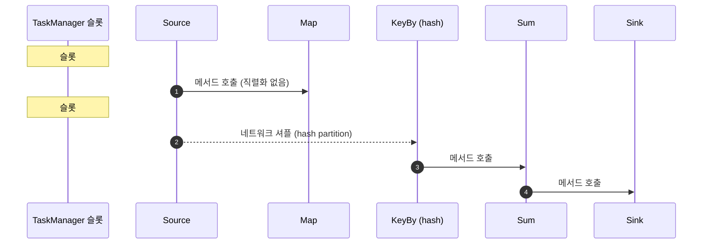
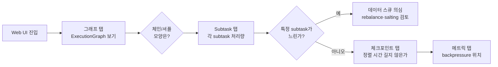

<figure class="post-figure post-figure--header">
<svg role="img" aria-label="Flink 스트림 처리 모델을 한 장으로 정리한 그림. 위쪽은 실행 그래프 변환으로, 왼쪽에 사용자 코드(Stream API)가 있고 화살표를 따라 가운데 StreamGraph(논리 그래프)와 JobGraph(체이닝이 묶인 그래프)를 거쳐 오른쪽 ExecutionGraph(스케줄링 가능한 물리 그래프)로 이어진다. 각 단계마다 무엇이 추가되는지 짧은 라벨이 붙는다. 아래쪽은 실행 시 배치된 모습으로, 하나의 TaskManager 안에 여러 task 슬롯이 나란히 깔리고 그 안에 Source·Map·KeyBy·Sum·Sink 연산자가 체이닝으로 묶여 들어가 있다. 옆에는 파티션 4종(forward·hash·rebalance·broadcast)이 작은 화살표 모형으로 표시되어 데이터 흐름이 어떻게 갈라지고 모이는지 보여준다." viewBox="0 0 680 360" xmlns="http://www.w3.org/2000/svg">
  <title>Flink 스트림 처리 모델 — StreamGraph→JobGraph→ExecutionGraph로 다듬아지고, 슬롯 안에서 연산자가 체이닝으로 묶여 task로 실행된다</title>
  <defs>
    <marker id="flm-arrow" viewBox="0 0 10 10" refX="8" refY="5" markerWidth="6" markerHeight="6" orient="auto-start-reverse">
      <path d="M0,0 L10,5 L0,10 z" fill="var(--secondary-color)"/>
    </marker>
    <marker id="flm-gold" viewBox="0 0 10 10" refX="8" refY="5" markerWidth="6" markerHeight="6" orient="auto-start-reverse">
      <path d="M0,0 L10,5 L0,10 z" fill="var(--gold)"/>
    </marker>
    <marker id="flm-acc" viewBox="0 0 10 10" refX="8" refY="5" markerWidth="6" markerHeight="6" orient="auto-start-reverse">
      <path d="M0,0 L10,5 L0,10 z" fill="var(--accent-color)"/>
    </marker>
  </defs>

  <!-- title -->
  <text x="340" y="22" text-anchor="middle" font-size="16" font-weight="800" fill="currentColor" letter-spacing="1.2">FLINK 스트림 처리 모델</text>
  <text x="340" y="41" text-anchor="middle" font-size="10" font-weight="700" fill="currentColor" opacity="0.72">StreamGraph → JobGraph → ExecutionGraph, 그리고 슬롯 안의 체이닝 task</text>

  <!-- ===== SECTION A: graph pipeline ===== -->
  <text x="30" y="64" text-anchor="start" font-size="10" font-weight="700" fill="currentColor" opacity="0.72">① 사용자 코드가 세 단계 그래프로 다듬어진다</text>

  <!-- user code -->
  <rect x="24" y="78" width="106" height="64" rx="4" fill="var(--bg-panel)" stroke="currentColor" stroke-width="2"/>
  <text x="77" y="96" text-anchor="middle" font-size="10" font-weight="800" fill="currentColor">사용자 코드</text>
  <text x="77" y="112" text-anchor="middle" font-size="8" fill="currentColor" opacity="0.7">DataStream API</text>
  <text x="77" y="125" text-anchor="middle" font-size="7.5" fill="currentColor" opacity="0.6">env.from → map → key_by → sum → sink</text>

  <!-- arrow code -> StreamGraph -->
  <line x1="132" y1="110" x2="166" y2="110" stroke="var(--secondary-color)" stroke-width="2" marker-end="url(#flm-arrow)"/>

  <!-- StreamGraph -->
  <rect x="170" y="78" width="148" height="64" rx="4" fill="var(--bg-light)" stroke="var(--secondary-color)" stroke-width="2.5"/>
  <text x="244" y="96" text-anchor="middle" font-size="10.5" font-weight="800" fill="currentColor">StreamGraph</text>
  <text x="244" y="112" text-anchor="middle" font-size="8" fill="currentColor" opacity="0.78">논리 그래프 (operators · edges)</text>
  <text x="244" y="125" text-anchor="middle" font-size="7.5" fill="currentColor" opacity="0.6">아직 체이닝/슬롯 정보 없음</text>

  <!-- arrow StreamGraph -> JobGraph -->
  <line x1="320" y1="110" x2="354" y2="110" stroke="var(--secondary-color)" stroke-width="2" marker-end="url(#flm-arrow)"/>

  <!-- JobGraph -->
  <rect x="358" y="78" width="138" height="64" rx="4" fill="var(--bg-light)" stroke="var(--accent-color)" stroke-width="2.5"/>
  <text x="427" y="96" text-anchor="middle" font-size="10.5" font-weight="800" fill="currentColor">JobGraph</text>
  <text x="427" y="112" text-anchor="middle" font-size="8" fill="currentColor" opacity="0.78">체이닝이 묶인 그래프</text>
  <text x="427" y="125" text-anchor="middle" font-size="7.5" fill="currentColor" opacity="0.6">operator chain → vertex</text>

  <!-- arrow JobGraph -> ExecutionGraph -->
  <line x1="498" y1="110" x2="532" y2="110" stroke="var(--secondary-color)" stroke-width="2" marker-end="url(#flm-arrow)"/>

  <!-- ExecutionGraph -->
  <rect x="536" y="78" width="138" height="64" rx="4" fill="var(--bg-light)" stroke="var(--gold)" stroke-width="2.5"/>
  <text x="605" y="96" text-anchor="middle" font-size="10.5" font-weight="800" fill="currentColor">ExecutionGraph</text>
  <text x="605" y="112" text-anchor="middle" font-size="8" fill="currentColor" opacity="0.78">스케줄링 가능한 물리 그래프</text>
  <text x="605" y="125" text-anchor="middle" font-size="7.5" fill="currentColor" opacity="0.6">parallelism × slots로 확장</text>

  <!-- ===== SECTION B: scheduled slot view ===== -->
  <line x1="30" y1="160" x2="650" y2="160" stroke="currentColor" stroke-width="1.2" opacity="0.25"/>

  <text x="30" y="180" text-anchor="start" font-size="10" font-weight="700" fill="currentColor" opacity="0.72">② 슬롯 안에서 체이닝된 연산자들이 task로 실행된다</text>

  <!-- TaskManager -->
  <rect x="32" y="192" width="408" height="124" rx="6" fill="var(--bg-light)" stroke="currentColor" stroke-width="2"/>
  <text x="44" y="208" font-size="9" font-weight="800" fill="currentColor">TaskManager #1</text>

  <!-- slot 1 with chained operators -->
  <rect x="46" y="216" width="380" height="40" rx="4" fill="var(--bg-panel)" stroke="var(--secondary-color)" stroke-width="2"/>
  <g font-size="8" font-weight="700" fill="currentColor" text-anchor="middle">
    <rect x="50" y="220" width="50" height="32" rx="3" fill="var(--bg-light)" stroke="var(--secondary-color)" stroke-width="1.4"/>
    <text x="75" y="240">Source</text>
    <rect x="104" y="220" width="50" height="32" rx="3" fill="var(--bg-light)" stroke="var(--secondary-color)" stroke-width="1.4"/>
    <text x="129" y="240">Map</text>
    <rect x="158" y="220" width="60" height="32" rx="3" fill="var(--bg-light)" stroke="var(--accent-color)" stroke-width="1.6"/>
    <text x="188" y="240">KeyBy</text>
    <rect x="222" y="220" width="60" height="32" rx="3" fill="var(--bg-light)" stroke="var(--accent-color)" stroke-width="1.6"/>
    <text x="252" y="240">Sum</text>
    <rect x="286" y="220" width="50" height="32" rx="3" fill="var(--bg-light)" stroke="var(--gold)" stroke-width="1.6"/>
    <text x="311" y="240">Sink</text>
    <text x="360" y="240" font-size="7" fill="currentColor" opacity="0.7">slot 1</text>
  </g>
  <text x="44" y="270" font-size="7.5" fill="currentColor" opacity="0.7">↑ 하나의 task 슬롯에서 forward로 묶여 직렬로 흐른다</text>
  <text x="44" y="284" font-size="7.5" fill="currentColor" opacity="0.7">  (체이닝: 스레드 전환·직렬화 비용 절약)</text>

  <!-- slot 2 placeholder showing more parallelism -->
  <rect x="46" y="298" width="380" height="14" rx="3" fill="var(--bg-panel)" stroke="currentColor" stroke-width="1" opacity="0.7"/>
  <text x="236" y="309" text-anchor="middle" font-size="7.5" fill="currentColor" opacity="0.6">… 추가 슬롯 (parallelism 만큼 평행)</text>

  <!-- ===== SECTION C: partition flavors ===== -->
  <g>
    <rect x="450" y="192" width="220" height="124" rx="6" fill="var(--bg-panel)" stroke="currentColor" stroke-width="2"/>
    <text x="560" y="210" text-anchor="middle" font-size="9.5" font-weight="800" fill="currentColor">데이터 분배 (파티셔너)</text>

    <g font-size="7.5" font-weight="700" fill="currentColor">
      <text x="460" y="226">forward</text>
      <text x="528" y="226" font-weight="500" opacity="0.75">: 직전과 같은 파티션</text>

      <text x="460" y="244">hash</text>
      <text x="528" y="244" font-weight="500" opacity="0.75">: 키 기반 결정적 분배</text>

      <text x="460" y="262">rebalance</text>
      <text x="528" y="262" font-weight="500" opacity="0.75">: 라운드로빈</text>

      <text x="460" y="280">broadcast</text>
      <text x="528" y="280" font-weight="500" opacity="0.75">: 모든 슬롯에 복제</text>

      <text x="460" y="298">rescale</text>
      <text x="528" y="298" font-weight="500" opacity="0.75">: 로컬 라운드로빈</text>
    </g>
    <text x="460" y="310" font-size="7" fill="currentColor" opacity="0.6">체이닝은 forward일 때만 묶인다</text>
  </g>
</svg>
<figcaption>한 장 요약 — 사용자 DataStream 코드는 StreamGraph(논리) → JobGraph(체이닝 반영) → ExecutionGraph(슬롯 배치) 순으로 다듬어져 task 슬롯 안의 체이닝 연산자로 실행되고, 슬롯 사이의 데이터 흐름은 파티셔너가 정한다</figcaption>
</figure>

## 도입 — 왜 스트림 처리에는 별도의 모델이 필요한가

배치 처리는 "끝이 있는(bounded) 데이터"를 다룹니다. 입력 파일이 다 모이면 처리를 시작하고, 결과를 다 쓰면 작업이 끝납니다. 시작점과 끝점이 분명한, 그래서 일반 함수처럼 생각해도 크게 무리가 없는 모델입니다. 반면 **스트림 처리는 끝이 없는(unbounded) 데이터** — 계속 흘러 들어오고, 종종 순서가 뒤바뀌며, 언제 "다 왔다"고 선을 그을 수 있는지조차 불분명한 데이터 — 를 다룹니다. 이 "끝이 없다"는 사실 하나가, 워터마크·상태·exactly-once 같은 스트림 고유 문제를 전부 만들어냅니다.

Apache Flink는 이 문제를 정면으로 다룬 **스트림 우선(stream-first) 엔진**입니다. Flink는 무한 데이터를 어떻게 표현하고, 어떻게 그래프로 모델링하고, 어떻게 병렬 실행하는가 — 이 단계가 정확히 그 토대를 다룹니다.

> 이 시리즈는 [Data-Engineering-Essential](/2026/06/25/data-engineering-essential-curriculum.html) 오버뷰의 5단계 [데이터 변환·처리](/2026/06/25/data-processing.html)에서 개념만 소개한 스트림 처리를 Apache Flink 중심으로 심화합니다. 같은 "스트림"이라도 [Spark Structured Streaming](/2026/07/16/spark-structured-streaming.html)은 배치와 통합된 마이크로배치 모델을, Flink는 스트림 네이티브 모델을 택한다는 차이가 있으니, 자매 시리즈와 나란히 읽으면 두 접근의 차이가 또렷해집니다.

## 핵심 개념 1 — 무한과 유한, 그리고 통합 관점

Flink의 모든 것은 **스트림**입니다. 배치는 "유한한 스트림(bounded stream)"의 특수 사례일 뿐입니다. 이 관점은 종종 "Flink = 스트림 엔진, 배치는 부가 기능"으로 오해받지만, 실제 모델은 더 깔끔합니다.

- **무한 스트림(unbounded stream)**: 끝이 없어 언제 끝날지 모르는 흐름. Kafka 토픽, 클릭 이벤트 로그, IoT 센서 신호.
- **유한 스트림(bounded stream)**: 명확한 시작·끝이 있는 흐름. 파일, 테이블의 전체 스캔 결과.

Flink는 단일 엔진으로 둘을 다 실행합니다. 차이는 단순히 **소스가 끝을 알리는가**와 **작업이 자동 종료되는가**입니다. DataStream API에서 무한 소스를 쓰면 잡이 계속 돌고, `Boundedness`가 `BOUNDED`인 소스를 쓰면(또는 `fromCollection`처럼 끝이 있는 소스) 잡이 끝나면서 종료합니다. 이 통합성 때문에 같은 윈도·같은 체크포인트·같은 상태 코드를 두 모드에 그대로 재사용할 수 있습니다.

이 통합 관점은 [Data-Engineering-Essential 오버뷰](/2026/06/25/data-processing.html)에서 "배치와 스트림은 연속선상의 두 점"으로 그렸던 그림의 Flink식 구체화입니다. Flink는 "배치 = 유한 스트림"으로 일관되게 표현하는 엔진을 택했고, 이 일관성이 뒤의 모든 단계의 토대가 됩니다.

## 핵심 개념 1.5 — bounded vs unbounded: 어디서 경계가 그어지는가

배치와 스트림의 경계를 명확히 하기 위해, 실제 데이터의 성격으로 다시 구분해 봅니다.

- **시간축이 닫혀 있나**: 데이터가 생성된 시점이 과거 ~ 현재 ~ 미래 중 어디까지 가리키는가. "지난 분기 매출"은 닫힌 시간축, "오늘자 클릭 로그"는 진행형, "내일자 예약"은 미래형입니다.
- **완결 시점을 데이터 자체가 알려주는가**: 파일은 EOF가 있고, Kafka 토픽은 새 메시지가 영원히 올 수 있어 자체 종료 신호가 없습니다.
- **결과가 누적인가 갱신인가**: "과거 총 매출"은 누적(fold), "현재 활성 사용자 수"는 갱신(reduce over state).

Flink는 이 세 가지 차원을 코드 표현에서 **동일하게** 다룰 수 있게 합니다. `fromCollection`은 bounded, `fromSource(KafkaSource)`는 unbounded로 시작하지만, 그 위에서 `.window()`·`.aggregate()`·`.keyBy()`는 같은 API로 쓰입니다. 같은 코드가 모드에 따라 batch 또는 streaming으로 실행되는 것입니다.

이 모델 통합의 가장 큰 효과는 **재처리(backfill)가 자연스럽다**는 점입니다. 유한 소스(파일·테이블 스캔)로 같은 잡을 다시 돌리면 과거 데이터를 같은 로직으로 다시 계산할 수 있고, 이는 데이터 정정·모델 재학습·A/B 테스트 회귀에 매우 유용합니다. [Spark Structured Streaming](/2026/07/16/spark-structured-streaming.html)도 같은 통합성을 다른 방식으로 달성합니다 — "마이크로배치"라는 하나의 모델에서 batch와 stream을 모두 표현하는 것이죠.

## 핵심 개념 2 — 실행 그래프의 세 단계 변환

사용자가 DataStream API로 코드를 짜면, Flink는 그 코드를 내부적으로 세 단계의 그래프로 변환합니다. 이 변환은 사용자에게 보이지 않지만, 성능 디버깅과 개념 이해의 핵심입니다.

### 2-1. StreamGraph — 사용자가 정의한 논리 그래프

사용자가 `env.fromCollection(...)`으로 소스를 만들고 `map → keyBy → sum → print` 같은 변환을 체이닝하면, Flink는 그 결과를 가장 거친 형태의 **논리 그래프**로 보관합니다. 각 연산자(Source, Map, Keyed Stream, Windowed Stream, Sink 등)가 노드이고, 노드 사이의 연결이 엣지입니다. 아직 체이닝 정보나 슬롯 배치 정보는 없습니다.

### 2-2. JobGraph — 체이닝이 반영된 그래프

Flink는 동일 슬롯에 배치 가능하고 직렬로 처리해도 무방한 인접 연산자들을 **연산자 체이닝(operator chaining)**으로 묶어 **하나의 vertex**로 합칩니다. 이 단계가 끝나면 JobGraph가 만들어지고, JobManager는 이 그래프를 클라이언트에 반환합니다. 우리가 `flink run`으로 제출한 것이 바로 이 JobGraph입니다.

### 2-3. ExecutionGraph — 병렬성을 반영한 스케줄링 가능한 그래프

JobManager는 JobGraph를 받아 각 vertex를 **설정된 병렬성만큼 펼쳐** ExecutionGraph를 만듭니다. 예를 들어 parallelism이 4인 operator는 4개의 병렬 subtask로 펼쳐지고, 그 사이의 데이터 흐름은 엣지에 정의된 **파티셔너**(forward / hash / rebalance / broadcast / rescale / global / custom)에 따라 결정됩니다. ExecutionGraph가 실제 스케줄링의 대상이고, TaskManager 위 슬롯에 배포되는 단위가 이 subtask입니다.

```mermaid
flowchart LR
  A[사용자 DataStream 코드] --> B[StreamGraph<br/>논리 그래프]
  B --> C[JobGraph<br/>체이닝 적용]
  C --> D[ExecutionGraph<br/>병렬성 × 슬롯 배치]
  D --> E[TaskManager 슬롯 위의 task]

  classDef node fill:var(--bg-light),stroke:var(--secondary-color),stroke-width:2px,color:currentColor;
  classDef done fill:var(--bg-light),stroke:var(--gold),stroke-width:2.5px,color:currentColor;
  class A,B node
  class C,D,E done
```

### 왜 이 변환이 중요한가

- **StreamGraph 단계**: 사용자가 정의한 의도(어떤 변환을 어떤 순서로)가 들어 있습니다. 이 단계를 보면 코드가 그대로 그래프로 보입니다.
- **JobGraph 단계**: 체이닝 결과로 **"어떤 연산자들이 한 thread에서 같이 도는가"**가 결정됩니다. 슬롯이 모자라면 여기서 잡이 제출되지 않습니다.
- **ExecutionGraph 단계**: 병렬성이 펼쳐지고 데이터 흐름이 확정됩니다. **데이터 스큐가 보인다, 백프레셔가 흐른다, 체크포인트 barrier가 흐른다** — 이 모든 현상은 이 그래프 위에서 일어납니다.

특히 2단계의 JobGraph 변환 결과 — 어떤 연산자가 어디로 묶였는가 — 가 성능과 직결됩니다. 예를 들어 무거운 `window` 연산자 뒤에 가벼운 `sink`가 있다면 두 연산자가 같은 슬롯에 묶여도 무방하지만, 네트워크 셔플이 필요한 `keyBy`를 사이에 둔 두 연산자는 묶일 수 없습니다. 묶을 수 있는 것과 없는 것의 경계가 곧 체이닝의 경계입니다.

### 그래프 변환의 시각화

```mermaid
flowchart LR
  subgraph SG [StreamGraph — 사용자 의도]
    S1[Source]:::user --> M1[Map]:::user
    M1 --> K1[KeyBy]:::user
    K1 --> W1[Window]:::user
    W1 --> S2[Sum]:::user
    S2 --> SK1[Sink]:::user
  end

  subgraph JG [JobGraph — 체이닝 적용]
    V1[Source+Map<br/>체인 1]:::job --> V2[KeyBy+Window+Sum<br/>체인 2]:::job
    V2 --> V3[Sink<br/>체인 2]:::job
  end

  subgraph EG [ExecutionGraph — 병렬성 × 4]
    P1[Source+Map<br/>subtask 0]:::exec
    P2[Source+Map<br/>subtask 1]:::exec
    P3[Source+Map<br/>subtask 2]:::exec
    P4[Source+Map<br/>subtask 3]:::exec
    P1 --> Q1[KeyBy+Window+Sum<br/>subtask 0]:::exec
    P2 --> Q2[KeyBy+Window+Sum<br/>subtask 1]:::exec
    P3 --> Q3[KeyBy+Window+Sum<br/>subtask 2]:::exec
    P4 --> Q4[KeyBy+Window+Sum<br/>subtask 3]:::exec
    Q1 --> R1[Sink<br/>subtask 0]:::exec
    Q2 --> R2[Sink<br/>subtask 1]:::exec
    Q3 --> R3[Sink<br/>subtask 2]:::exec
    Q4 --> R4[Sink<br/>subtask 3]:::exec
  end

  classDef user fill:var(--bg-light),stroke:var(--secondary-color),stroke-width:1.4px,color:currentColor;
  classDef job fill:var(--bg-light),stroke:var(--accent-color),stroke-width:2px,color:currentColor;
  classDef exec fill:var(--bg-light),stroke:var(--gold),stroke-width:2.5px,color:currentColor;
```

여기서 KeyBy가 들어가는 지점에서 화살표 색이 변하는 것을 주목해야 합니다 — **forward**(체이닝 가능, 같은 색)에서 **hash**(체이닝 끊김, 색 변경)로 바뀌는 지점이 정확히 네트워크 셔플이 일어나는 곳입니다. 이 그림 하나만 머릿속에 들어가도 Web UI의 그래프를 읽는 안목이 생깁니다.

## 핵심 개념 3 — 병렬성, 슬롯, 그리고 연산자 체이닝

Flink의 병렬 실행은 세 가지 개념의 합으로 이해할 수 있습니다.

### 3-1. 병렬성(parallelism)

병렬성은 "동일한 task가 동시에 몇 개 돌아가는가"입니다. `env.setParallelism(4)`로 잡 전체에 일괄 설정하거나, 연산자 단위로 `.setParallelism(2)`처럼 덮어쓸 수 있습니다. 소스에서 읽어 병렬성을 4로 만들면, 후속 연산자도 명시적으로 줄이지 않는 한 4를 유지합니다. **병렬성을 키운다고 항상 빨라지는 건 아닙니다** — 파티션 키가 골고루 분배될 때만 효과가 있고, 한 키에 데이터가 쏠리면 그 키를 가진 한 subtask만 일하게 됩니다(데이터 스큐).

### 3-2. 슬롯(slot)

TaskManager는 JVM 프로세스이고, 그 안에 **task 슬롯**(기본 1개)이라는 실행 단위를 가집니다. 각 슬롯은 슬롯 안에서 돌아가는 task가 쓸 메모리(TaskManager Heap의 일부)를 보장받습니다. 슬롯 수가 곧 TaskManager가 동시에 실행할 수 있는 task 수입니다.

Flink는 같은 슬롯 안에 **슬롯 공유 그룹(slot sharing group)**이 같은 여러 task를 겹쳐 배치합니다. 기본적으로 같은 잡의 모든 연산자가 같은 슬롯 공유 그룹에 들어가므로, TaskManager의 슬롯 수가 잡의 최대 병렬성보다 작아도 모든 파이프라인이 한 슬롯 안에서 돌아갑니다(슬롯 안에 source → map → keyBy → sink가 함께 들어가 슬롯 1개로 전체 잡이 실행 가능). 단점은 **어떤 task가 무거우면 같은 슬롯의 다른 task가 자원을 같이 쓰지 못해 느려진다**는 점입니다.

### 3-3. 연산자 체이닝(operator chaining)

체이닝은 같은 슬롯에 배치된 인접 task들을 **한 thread**에서 직렬로 실행하는 최적화입니다. 네트워크나 메모리 버퍼를 거치지 않고 메서드 호출로 다음 operator로 데이터를 넘기므로, 직렬화·역직렬화·스레드 전환 비용을 모두 절약합니다. 체이닝이 가능한 조건은 단순합니다:

1. 같은 슬롯 공유 그룹에 있고
2. 데이터 분배가 **forward**(1:1)이고
3. 같은 병렬성으로 실행되는 경우

체인 결과는 JobGraph에서 `operator chain` 단위로 묶여 노출되고, Flink Web UI의 그래프 보기에서 한 박스로 묶여 표시됩니다. 네트워크 셔플이 필요한 `keyBy`(hash partition)나 `rebalance`는 체이닝을 끊습니다 — 키 재배치라는 본질적 일 때문에, 슬롯 안에서 그냥 넘길 수가 없습니다.



## 핵심 개념 4 — 데이터 분배: 파티셔너

Flink의 데이터 흐름은 엣지에 정의된 **파티셔너**가 결정합니다. 자주 보이는 5종입니다.

- **forward**: 직전 subtask와 같은 파티션으로 보냅니다. 같은 병렬성 + 같은 슬롯이면 자동으로 forward가 잡힙니다. 체이닝의 전제 조건입니다.
- **hash**: 키 기반 결정적 분배. 같은 키는 항상 같은 subtask로 갑니다. `keyBy`/`partitionByHash`의 결과입니다.
- **rebalance**: 라운드로빈. 균등 분배는 좋지만 키 보존은 안 됩니다. 데이터 스큐가 심할 때 `.rebalance()`로 강제 분산합니다.
- **broadcast**: 모든 subtask에 모든 데이터를 복제. 작은 룩업 테이블이나 컨트롤 메시지에 씁니다.
- **rescale**: 로컬 라운드로빈. 다운스트림 일부에만 균등 분배. rebalance보다 네트워크 비용이 작습니다.

```java
// DataStream API 파티셔너 골격 (Java)
stream.rebalance();         // 라운드로빈
stream.rescale();           // 로컬 라운드로빈
stream.broadcast();         // 모든 서브태스크로 복제
stream.partitionCustom(new KeySelector<Integer, Integer>() {
    @Override public Integer getKey(Integer x) { return x % 4; }
}, x -> x);                 // 커스텀 분배
stream.forward();           // forward(같은 병렬성에서만 유효)
```

## 핵심 개념 5 — 체이닝과 슬롯 공유의 운영적 의미

체이닝은 단순한 최적화가 아닙니다. 운영상 세 가지 함의를 가집니다.

**메모리 공유**: 같은 슬롯 안에서 여러 task가 메모리를 같이 씁니다. Flink가 보장하는 "슬롯 단위 메모리 격리"는 **슬롯이 다른 슬롯과는 격리**된다는 뜻이지, **같은 슬롯 안의 task끼리는 격리되지 않는다**는 뜻입니다. 따라서 무거운 task(예: 큰 윈도 집계)와 가벼운 task(예: 단순 sink)가 같은 슬롯에 들어가면 가벼운 task가 메모리 압박을 받습니다. 이를 막으려면 `slotSharingGroup("group-name")`을 무거운 task에 지정해 다른 슬롯으로 격리합니다.

**장애 격리 범위**: 같은 TaskManager 위 슬롯들의 task가 모두 같은 JVM 안에서 돕니다. 따라서 한 슬롯의 task가 OOM이나 무한 루프로 멈추면, 같은 TaskManager의 다른 슬롯도 영향을 받을 수 있습니다(보통 같은 슬롯 공유 그룹이 묶이는 범위). 운영상 TaskManager당 슬롯 수를 **너무 크게** 잡으면 한 슬롯의 사고가 같은 TaskManager 전체로 번지는 위험이 커집니다.

**체이닝 끄기**: 가끔은 의도적으로 체이닝을 끄는 게 옳습니다. 디버깅하기 위해(sink에 어떻게 데이터가 도달하는지 보고 싶을 때), 또는 무거운 operator 뒤에 가벼운 sink를 분리해 자원 균형을 잡고 싶을 때, `.disableChaining()`이나 `.startNewChain()`을 씁니다. 또 한 체인의 크기가 너무 커지면 단일 thread가 모든 일을 담당해 핫스팟이 되기도 합니다.

## 핵심 개념 6 — Stream-first vs Batch-first: 두 접근의 비교

Flink의 "스트림 우선" 모델은 의도적인 설계 선택입니다. 다른 엔진과의 차이가 무엇인지 보이면 왜 이런 모델이 나왔는지 이해됩니다.

```mermaid
flowchart TB
  subgraph SF [스트림 우선 — Flink]
    A1[무한 스트림] --> B1[연속 처리]
    B1 --> C1[배치 = 유한 스트림 특수 사례]
  end
  subgraph BF [배치 우선 — Spark Streaming 전신]
    A2[유한 데이터] --> B2[마이크로 배치]
    B2 --> C2[스트림 ≈ 빠른 배치]
  end
  C1 --> D1[낮은 지연·정확한 시간 모델]
  C2 --> D2[높은 처리량·단순한 모델]
  classDef sf fill:var(--bg-light),stroke:var(--gold),stroke-width:2px,color:currentColor;
  classDef bf fill:var(--bg-light),stroke:var(--secondary-color),stroke-width:2px,color:currentColor;
  class A1,B1,C1,D1 sf
  class A2,B2,C2,D2 bf
```

- **스트림 우선**: 모든 것을 스트림으로 보고, 배치는 그 특수 사례로 다룸. 지연이 낮고(수십~수백 ms) 시간 모델(워터마크)이 정확함. 구현 복잡도는 더 높음.
- **배치 우선**: 모든 것을 배치로 보고, 스트림은 빠른 배치의 연속으로 다룸. 처리량이 높고 모델이 단순함. 지연이 트리거 주기에 묶임(Spark Structured Streaming 기본 수백 ms~수 초).

[Spark Structured Streaming](/2026/07/16/spark-structured-streaming.html)은 배치 우선의 진화판 — `micro-batch` 모드와 `continuous` 모드를 함께 제공하면서 배치 통합을 택한 점이 Flink와 다른 선택입니다. 두 접근을 나란히 보면 "내 워크로드에 어떤 게 맞는가"가 또렷해집니다 — **낮은 지연과 정확한 이벤트 시간이 핵심**이면 Flink, **배치 친화적인 워크플로우에 가벼운 스트림을 얹는다면** Spark Structured Streaming이 답이 될 가능성이 높습니다.

## 코드 예제 — PyFlink DataStream 기본 골격

```python
# flink_stream_model_basic.py
# Flink 1.17+ PyFlink DataStream API 기본 골격
from pyflink.datastream import StreamExecutionEnvironment
from pyflink.common.typeinfo import Types

env = StreamExecutionEnvironment.get_execution_environment()
env.set_parallelism(2)

# (1) 소스 — 무한 스트림의 시뮬레이션 (실서비스에선 Kafka source)
events = env.from_collection(
    [
        ("click", 1, 10),
        ("view",  2, 30),
        ("buy",   1, 80),
        ("click", 3, 5),
    ],
    type_info=Types.TUPLE([Types.STRING(), Types.INT(), Types.INT()]),
)

# (2) 변환 — 같은 슬롯 안에서 forward로 체이닝
labeled = events.map(
    lambda e: (e[0], e[1], e[2], "ok"),
    output_type=Types.TUPLE([Types.STRING(), Types.INT(), Types.INT(), Types.STRING()]),
)

# (3) 키 분배 — hash 파티셔닝으로 슬롯 간 셔플 발생 (체이닝 끊김)
keyed = labeled.key_by(lambda e: e[1])

# (4) 집계 — 같은 슬롯 안에서 가능
totals = keyed.sum(2)

# (5) 싱크 — 출력
totals.print()

env.execute("flink-stream-model-basic")
```

여기서 `events → labeled` 구간은 **forward**로 같은 슬롯 안에서 체이닝됩니다. 반면 `labeled → keyed`는 `key_by`가 **hash partition**을 부르므로 네트워크 셔플이 필요해 체이닝이 끊기고, 다른 슬롯으로 데이터가 흘러갑니다. 이 체이닝 끊김은 Flink Web UI의 그래프 보기에서 한 박스가 둘로 나뉘어 표시됩니다.

### 체이닝·슬롯 분리 코드 (Java, 비교)

```java
// src/main/java/io/example/ChainedVsIsolated.java
import org.apache.flink.streaming.api.datastream.DataStream;
import org.apache.flink.streaming.api.environment.StreamExecutionEnvironment;

public class ChainedVsIsolated {
    public static void main(String[] args) throws Exception {
        StreamExecutionEnvironment env = StreamExecutionEnvironment.getExecutionEnvironment();
        env.setParallelism(2);

        DataStream<String> source = env
            .fromElements("a", "b", "c")
            .name("bounded-source");

        // (1) 가벼운 체인 — 기본은 모두 같은 슬롯 공유 그룹, forward로 묶임
        DataStream<String> cheap = source
            .map(s -> s.toUpperCase())
            .name("upper-case-map");

        // (2) 무거운 윈도 — 별도 슬롯 공유 그룹으로 격리
        DataStream<String> heavy = cheap
            .map(s -> expensive(s))
            .name("expensive-op")
            .slotSharingGroup("heavy-group");   // <- 이 task만 별도 슬롯 그룹

        cheap.print("cheap").name("cheap-print");
        heavy.print("heavy").name("heavy-print");

        env.execute("chained-vs-isolated");
    }

    static String expensive(String s) { /* 무거운 연산 */ return s; }
}
```

여기서 `cheap` 체인은 같은 슬롯 안에서 묶여 실행되지만, `heavy`는 별도 슬롯 그룹으로 빠져 무거운 연산이 다른 가벼운 작업의 자원을 갉아먹지 않습니다. Web UI에서는 heavy-print 노드가 다른 박스로 분리되어 표시됩니다.

## 성능 진단 — Flink Web UI에서 무엇을 봐야 하는가

이 모델을 정확히 이해했다면 Web UI를 읽는 안목이 생깁니다. "왜 느린가"를 봤을 때 다음 네 가지부터 확인합니다.



- **그래프 탭**: ExecutionGraph를 본다. 박스가 어떻게 묶여 있는지(체이닝)와 어디서 끊어졌는지(셔플 위치)가 보입니다. 셔플이 많을수록 네트워크 비용이 큰 그래프입니다.
- **Subtask 탭**: 각 subtask의 records sent/received, 처리 시간 분포. **Max가 Median의 5배 이상이면** 스큐 의심.
- **체크포인트 탭**: 체크포인트 barrier가 alignment에서 얼마나 머무는지. alignment time이 길면 백프레셔 또는 불균형 워크로드의 신호입니다.
- **메트릭 탭**: `outPoolUsage`(네트워크 버퍼 사용률), `inPoolUsage`, GC 시간. 네트워크 버퍼 풀이 차면 backpressure 발생.

## 자주 틀리는 부분 — 모델 함정 5가지

- **"병렬성을 키우면 늘 빨라진다"는 착각**: 데이터 스큐가 있으면 한 subtask만 일하므로 의미가 없습니다. 먼저 키 분포와 source throughput을 보고 병렬성을 결정합니다.
- **체이닝은 자동으로 충분하다**: forward 분배가 아니면(예: hash) 체이닝이 자동으로 끊깁니다. 체이닝을 명시적으로 끄려면 `.disableChaining()`을, 특정 경계에서 끊으려면 `startNewChain()`을 씁니다.
- **슬롯 수 = TaskManager 수처럼 오해**: TaskManager는 JVM 1개에 슬롯 N개를 가집니다. 클러스터 자원을 늘릴 때는 TaskManager 수와 슬롯 수를 같이 설계합니다.
- **"bounded 스트림은 무한이 아니다"라는 오해**: Flink 모델에서 bounded는 "유한한 입력 → 결과 내고 끝"의 실행 모드이지, 별개의 엔진이 아닙니다. 무한 스트림을 시간 윈도로 자르면 bounded처럼 처리할 수 있다는 점에서도 모델은 통합됩니다.
- **ExecutionGraph 단계 없이 디버깅하기**: "왜 느린가"를 볼 때는 Flink Web UI의 그래프 보기를 켜서 ExecutionGraph를 직접 보는 것이 빠릅니다. JobGraph와 ExecutionGraph의 모양 차이는 곧 데이터 흐름과 셔플 위치입니다.

## 정리

이 단계가 시리즈의 토대인 이유는 이후 모든 단계가 이 모델 위에서 일하기 때문입니다.

- **무한과 유한은 같은 모델의 두 면**: Flink는 둘을 구분하지 않고, "유한 스트림 = 끝이 있는 무한 스트림"의 특수 사례로 다룹니다. 이 통합성 때문에 같은 윈도·같은 체크포인트·같은 상태 코드를 재사용할 수 있습니다.
- **세 단계 그래프 변환을 안다**: StreamGraph(논리) → JobGraph(체이닝) → ExecutionGraph(병렬성·슬롯). 셔플 위치, 슬롯 배치, 데이터 스큐는 이 그래프 위에서 일어납니다.
- **병렬성·슬롯·체이닝의 합**: 병렬성은 "동시에 몇 개", 슬롯은 "한 TaskManager가 동시에 몇 task를", 체이닝은 "같은 슬롯 안에서 thread로 묶는가"를 다룹니다. 셋이 맞물려 실제 실행 모양이 결정됩니다.
- **파티셔너가 데이터 흐름을 정한다**: forward는 체이닝을 살리고, hash는 키 보존을 위해 셔플을 부르고, rebalance는 균등 분배로 스큐를 다스립니다. 어떤 파티셔너가 어디에 쓰였는지가 곧 성능 모양입니다.

다음 [2단계 — Flink 이벤트 시간·워터마크](/2026/07/22/flink-event-time-watermark.html)는 이 모델 위에서 **"언제 계산할 것인가"**를 다룹니다. 1단계가 데이터의 흐름과 실행 모양을 잡았다면, 2단계는 흐름 위에서 흘러가는 이벤트가 **어떤 시간 기준**으로 정렬되고 **언제 윈도가 닫히는지**를 다룹니다 — 그 안에서 "지연·순서 뒤바뀜"이 어떻게 다스려지는지 보게 됩니다.

### 다음 학습 (Next Learning)

- [Flink 이벤트 시간·워터마크](/2026/07/22/flink-event-time-watermark.html) — 2단계: 무한 스트림 위에서 "언제 계산하는가"를 정하는 시간 모델
- [데이터 변환·처리(Processing)](/2026/06/25/data-processing.html) — 이 시리즈가 갈라져 나온 오버뷰 5단계, 스트림 처리의 개요를 복습
- [Spark Structured Streaming](/2026/07/16/spark-structured-streaming.html) — 자매 시리즈. "배치와 통합된 스트림" 모델과 이 글의 "스트림 네이티브" 모델을 비교
- [Stream Processing Essential Curriculum](/2026/07/12/stream-processing-essential-curriculum.html) — 시리즈 로드맵으로 돌아가 진행 상황 확인
