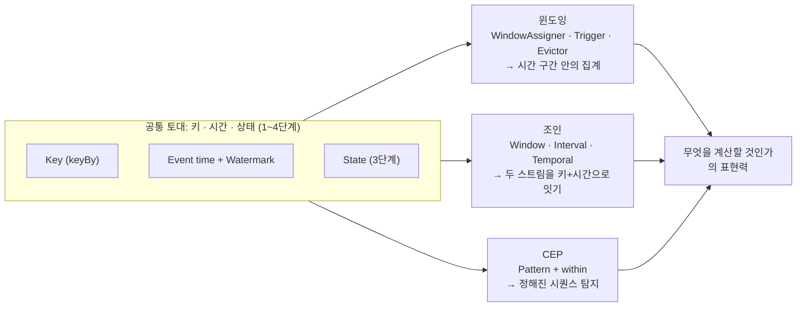
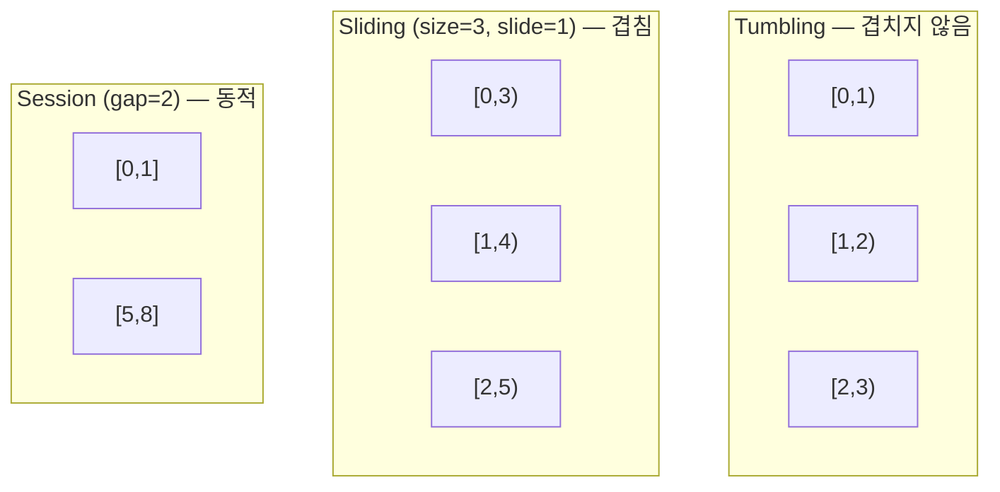
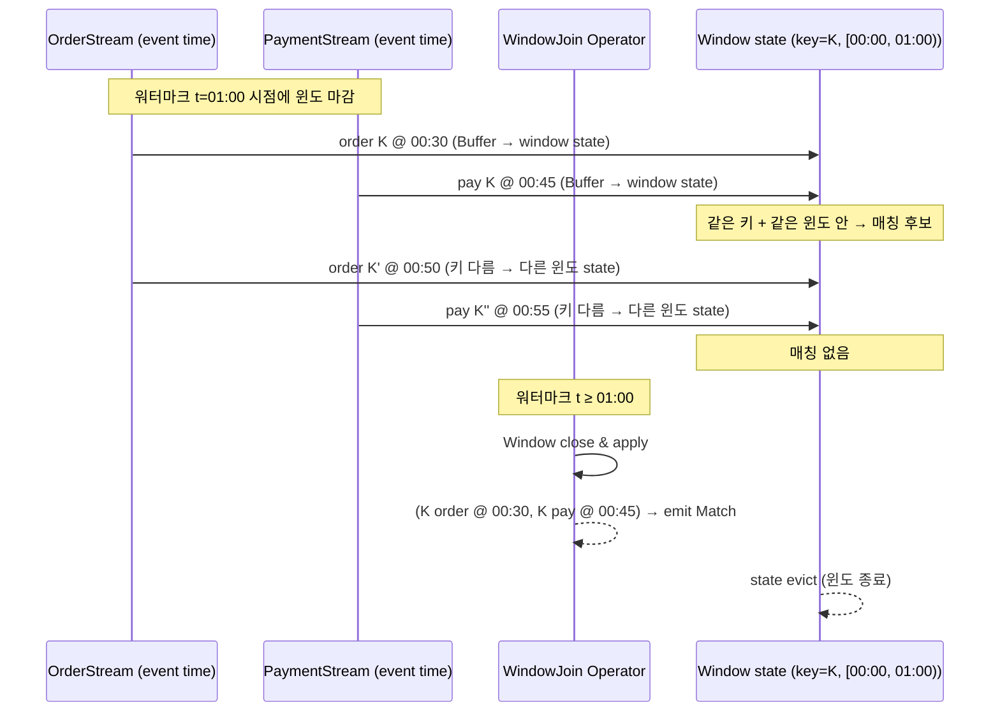

<figure class="post-figure post-figure--header">
<svg role="img" aria-label="Flink 윈도잉·조인·CEP를 한 장으로 정리한 그림. 위쪽은 Window Operator의 내부 파이프라인으로, 왼쪽에서 KeyedStream이 들어와 WindowAssigner(텀블링/슬라이딩/세션/글로벌)가 어떤 윈도에 이벤트를 넣을지 정하고, 그 옆의 Trigger(EventTimeTrigger·ProcessingTimeTrigger·CountTrigger·ContinuousTrigger·custom)가 언제 fire할지 결정하며, 이어 Evictor(Count·Time·Delta)가 fire 직전 일부 이벤트를 추려내고, 끝에서 ProcessFunction / Aggregate / Reduce가 결과를 만들어 Sink로 내보낸다. 가운데는 스트림 조인의 세 종류 — Window Join(같은 키·같은 윈도 안에서), Interval Join(키는 같고 시간 오프셋), Temporal Join(버전 있는 lookup 테이블과 시점 매칭) — 가 작은 박스로 나란히 놓인다. 아래는 CEP의 상태 머신으로 start → middle → end 노드가 followedBy/followedByAny/quantifier 화살표로 이어지고 'within 3분' 시간 제약이 그 위에 얹혀 있다." viewBox="0 0 680 360" xmlns="http://www.w3.org/2000/svg">
  <title>Flink 윈도잉·조인·CEP — Window Operator 내부 파이프라인, 조인 3종, CEP 상태 머신</title>
  <defs>
    <marker id="wj-arrow" viewBox="0 0 10 10" refX="8" refY="5" markerWidth="6" markerHeight="6" orient="auto-start-reverse">
      <path d="M0,0 L10,5 L0,10 z" fill="var(--secondary-color)"/>
    </marker>
    <marker id="wj-gold" viewBox="0 0 10 10" refX="8" refY="5" markerWidth="6" markerHeight="6" orient="auto-start-reverse">
      <path d="M0,0 L10,5 L0,10 z" fill="var(--gold)"/>
    </marker>
    <marker id="wj-acc" viewBox="0 0 10 10" refX="8" refY="5" markerWidth="6" markerHeight="6" orient="auto-start-reverse">
      <path d="M0,0 L10,5 L0,10 z" fill="var(--accent-color)"/>
    </marker>
  </defs>

  <!-- title -->
  <text x="340" y="22" text-anchor="middle" font-size="15" font-weight="800" fill="currentColor" letter-spacing="1.2">WINDOW · JOIN · CEP</text>
  <text x="340" y="41" text-anchor="middle" font-size="9.5" font-weight="700" fill="currentColor" opacity="0.72">시간을 구간으로 자르고, 두 스트림을 시간으로 잇고, 패턴을 찾는다</text>

  <!-- ===== SECTION A: Window operator pipeline ===== -->
  <text x="20" y="62" text-anchor="start" font-size="9.5" font-weight="700" fill="currentColor" opacity="0.72">① Window Operator의 내부 파이프라인</text>

  <!-- keyed stream in -->
  <rect x="16" y="74" width="78" height="40" rx="4" fill="var(--bg-panel)" stroke="currentColor" stroke-width="1.6"/>
  <text x="55" y="91" text-anchor="middle" font-size="9" font-weight="800" fill="currentColor">KeyedStream</text>
  <text x="55" y="104" text-anchor="middle" font-size="7.5" fill="currentColor" opacity="0.7">user_id 기준</text>

  <!-- arrow into assigner -->
  <line x1="96" y1="94" x2="114" y2="94" stroke="var(--secondary-color)" stroke-width="2" marker-end="url(#wj-arrow)"/>

  <!-- WindowAssigner -->
  <rect x="118" y="70" width="118" height="48" rx="4" fill="var(--bg-light)" stroke="var(--secondary-color)" stroke-width="2.2"/>
  <text x="177" y="87" text-anchor="middle" font-size="9.5" font-weight="800" fill="var(--secondary-color)">WindowAssigner</text>
  <text x="177" y="100" text-anchor="middle" font-size="7.5" fill="currentColor" opacity="0.78">Tumbling · Sliding</text>
  <text x="177" y="111" text-anchor="middle" font-size="7.5" fill="currentColor" opacity="0.78">Session · Global</text>

  <!-- arrow to Trigger -->
  <line x1="238" y1="94" x2="256" y2="94" stroke="var(--secondary-color)" stroke-width="2" marker-end="url(#wj-arrow)"/>

  <!-- Trigger -->
  <rect x="260" y="70" width="118" height="48" rx="4" fill="var(--bg-light)" stroke="var(--accent-color)" stroke-width="2.2"/>
  <text x="319" y="87" text-anchor="middle" font-size="9.5" font-weight="800" fill="var(--accent-color)">Trigger</text>
  <text x="319" y="100" text-anchor="middle" font-size="7.5" fill="currentColor" opacity="0.78">EventTime · Processing</text>
  <text x="319" y="111" text-anchor="middle" font-size="7.5" fill="currentColor" opacity="0.78">Count · Continuous · custom</text>

  <!-- arrow to Evictor -->
  <line x1="380" y1="94" x2="398" y2="94" stroke="var(--secondary-color)" stroke-width="2" marker-end="url(#wj-arrow)"/>

  <!-- Evictor -->
  <rect x="402" y="70" width="100" height="48" rx="4" fill="var(--bg-light)" stroke="var(--accent-color)" stroke-width="2.2"/>
  <text x="452" y="87" text-anchor="middle" font-size="9.5" font-weight="800" fill="var(--accent-color)">Evictor</text>
  <text x="452" y="100" text-anchor="middle" font-size="7.5" fill="currentColor" opacity="0.78">Count · Time</text>
  <text x="452" y="111" text-anchor="middle" font-size="7.5" fill="currentColor" opacity="0.78">Delta</text>

  <!-- arrow to ProcessFunction -->
  <line x1="504" y1="94" x2="522" y2="94" stroke="var(--secondary-color)" stroke-width="2" marker-end="url(#wj-arrow)"/>

  <!-- ProcessFunction / Aggregate / Reduce -->
  <rect x="526" y="70" width="138" height="48" rx="4" fill="var(--bg-light)" stroke="var(--gold)" stroke-width="2.5"/>
  <text x="595" y="87" text-anchor="middle" font-size="9.5" font-weight="800" fill="var(--gold)">Process · Aggregate · Reduce</text>
  <text x="595" y="100" text-anchor="middle" font-size="7.5" fill="currentColor" opacity="0.78">윈도마다 결과 산출</text>
  <text x="595" y="111" text-anchor="middle" font-size="7.5" fill="currentColor" opacity="0.78">Iterable / acc / binary</text>

  <!-- fire/purge note -->
  <text x="340" y="138" text-anchor="middle" font-size="8" font-weight="700" fill="var(--accent-color)">fire(onFire) → 결과 emit / purge(onPurge) → 윈도 state evict</text>

  <!-- ===== SECTION B: Join flavors ===== -->
  <line x1="20" y1="158" x2="660" y2="158" stroke="currentColor" stroke-width="1" opacity="0.22"/>

  <text x="20" y="176" text-anchor="start" font-size="9.5" font-weight="700" fill="currentColor" opacity="0.72">② 스트림 조인의 세 얼굴</text>

  <!-- Window Join -->
  <rect x="16" y="186" width="208" height="86" rx="5" fill="var(--bg-light)" stroke="var(--secondary-color)" stroke-width="2"/>
  <text x="120" y="206" text-anchor="middle" font-size="10" font-weight="800" fill="var(--secondary-color)">Window Join</text>
  <text x="120" y="223" text-anchor="middle" font-size="8" fill="currentColor" opacity="0.85">같은 키 + 같은 윈도 안</text>
  <text x="120" y="237" text-anchor="middle" font-size="8" fill="currentColor" opacity="0.85">A.user_id = B.user_id</text>
  <text x="120" y="251" text-anchor="middle" font-size="8" fill="currentColor" opacity="0.85">within window(W)</text>
  <text x="120" y="265" text-anchor="middle" font-size="7.5" fill="currentColor" opacity="0.65">state bounded · 안전</text>

  <!-- Interval Join -->
  <rect x="236" y="186" width="208" height="86" rx="5" fill="var(--bg-light)" stroke="var(--accent-color)" stroke-width="2"/>
  <text x="340" y="206" text-anchor="middle" font-size="10" font-weight="800" fill="var(--accent-color)">Interval Join</text>
  <text x="340" y="223" text-anchor="middle" font-size="8" fill="currentColor" opacity="0.85">같은 키 + 시간 오프셋</text>
  <text x="340" y="237" text-anchor="middle" font-size="8" fill="currentColor" opacity="0.85">A.t + L ≤ B.t ≤ A.t + U</text>
  <text x="340" y="251" text-anchor="middle" font-size="8" fill="currentColor" opacity="0.85">action → +1h follow-up</text>
  <text x="340" y="265" text-anchor="middle" font-size="7.5" fill="currentColor" opacity="0.65">state bounded · 자연스러운 인과</text>

  <!-- Temporal Join -->
  <rect x="456" y="186" width="208" height="86" rx="5" fill="var(--bg-light)" stroke="var(--gold)" stroke-width="2"/>
  <text x="560" y="206" text-anchor="middle" font-size="10" font-weight="800" fill="var(--gold)">Temporal Join</text>
  <text x="560" y="223" text-anchor="middle" font-size="8" fill="currentColor" opacity="0.85">버전 있는 lookup</text>
  <text x="560" y="237" text-anchor="middle" font-size="8" fill="currentColor" opacity="0.85">FOR SYSTEM_TIME AS OF</text>
  <text x="560" y="251" text-anchor="middle" font-size="8" fill="currentColor" opacity="0.85">등급·가격 이력 매칭</text>
  <text x="560" y="265" text-anchor="middle" font-size="7.5" fill="currentColor" opacity="0.65">state = 버전 테이블</text>

  <!-- ===== SECTION C: CEP state machine ===== -->
  <line x1="20" y1="288" x2="660" y2="288" stroke="currentColor" stroke-width="1" opacity="0.22"/>

  <text x="20" y="306" text-anchor="start" font-size="9.5" font-weight="700" fill="currentColor" opacity="0.72">③ CEP — start → middle → end 상태 머신 with 시간 제약</text>

  <!-- start -->
  <circle cx="90" cy="334" r="16" fill="var(--bg-light)" stroke="var(--secondary-color)" stroke-width="2.4"/>
  <text x="90" y="338" text-anchor="middle" font-size="10" font-weight="800" fill="var(--secondary-color)">start</text>

  <!-- arrow to middle -->
  <line x1="108" y1="328" x2="200" y2="328" stroke="var(--secondary-color)" stroke-width="2" marker-end="url(#wj-arrow)"/>
  <text x="154" y="322" text-anchor="middle" font-size="8" fill="currentColor" opacity="0.78">followedBy / times(N)</text>

  <!-- middle -->
  <circle cx="232" cy="334" r="16" fill="var(--bg-light)" stroke="var(--accent-color)" stroke-width="2.4"/>
  <text x="232" y="338" text-anchor="middle" font-size="10" font-weight="800" fill="var(--accent-color)">middle</text>

  <!-- arrow to end -->
  <line x1="250" y1="328" x2="382" y2="328" stroke="var(--accent-color)" stroke-width="2" marker-end="url(#wj-acc)"/>
  <text x="316" y="322" text-anchor="middle" font-size="8" fill="currentColor" opacity="0.78">followedByAny · optional</text>

  <!-- end -->
  <circle cx="414" cy="334" r="16" fill="var(--bg-light)" stroke="var(--gold)" stroke-width="2.4"/>
  <text x="414" y="338" text-anchor="middle" font-size="10" font-weight="800" fill="var(--gold)">end</text>

  <!-- within -->
  <rect x="462" y="318" width="190" height="32" rx="5" fill="var(--bg-panel)" stroke="var(--gold)" stroke-width="1.8" stroke-dasharray="3 2"/>
  <text x="557" y="334" text-anchor="middle" font-size="9" font-weight="800" fill="var(--gold)">within(3 min) — 시간 제약</text>
  <text x="557" y="346" text-anchor="middle" font-size="7.5" fill="currentColor" opacity="0.78">넘기면 매칭 폐기</text>
</svg>
<figcaption>이 글을 한 장으로 — Window Operator는 Assigner·Trigger·Evictor·ProcessFunction이 순서로 흐르고, 조인은 같은 키+윈도(Window)·키+오프셋(Interval)·버전 테이블(Temporal)로 갈라지며, CEP는 start→middle→end 상태 머신에 시간 제약(within)을 얹어 패턴을 잡는다</figcaption>
</figure>

## 들어가며

[Stream Processing Essential Curriculum](/2026/07/12/stream-processing-essential-curriculum.html)의 **5단계**입니다. 시리즈는 이 단계에 이르러 비로소 "무엇을 계산할 것인가"의 표현력을 손에 넣습니다. 앞선 [1단계 — 스트림 처리 모델](/2026/07/22/flink-stream-processing-model.html)에서 무한 스트림의 **실행 모델**을, [2단계 — 이벤트 시간·워터마크](/2026/07/22/flink-event-time-watermark.html)에서 "언제 마감해 결과를 낼 것인가"를, [3단계 — 상태·체크포인트](/2026/07/22/flink-state-checkpoint.html)에서 "지금까지 본 것"을 어떻게 지킬 것인가를, [4단계 — exactly-once](/2026/07/22/flink-exactly-once.html)에서 "장애가 나도 한 번"을 각각 잡았죠. 이번 단계는 그 위에 세 가지 표현 수단을 얹습니다 — 시간을 구간으로 잘라 그 안에서 무언가를 계산하는 **윈도잉(Windowing)**, 두 스트림을 시간과 키로 엮는 **스트림 조인(Stream Joins)**, 그리고 "A 다음 n초 안에 B" 같은 패턴을 추적하는 **복합 이벤트 처리(Complex Event Processing, CEP)**. 이 셋이 만나면 "10분 안에 결제 5회 실패 → 알림", "주문 후 1시간 안에 발송 미처리 → SLA 경보" 같은 비즈니스 이벤트를 선언적으로 잡을 수 있습니다.

핵심 메시지는 하나입니다. **윈도잉·조인·CEP는 결국 같은 원리 — 키·시간·상태 — 위에 세 가지 다른 표면을 입힌 것**입니다. 윈도잉은 "같은 키의 이벤트를 시간 구간으로 모으는 일"이고, 조인은 "두 스트림의 이벤트를 키와 시간으로 잇는 일"이고, CEP는 "키와 시간 위에서 정해진 순서대로 일어나는 이벤트 시퀀스를 잡는 일"입니다. 그래서 한 단계에서 세 영역을 함께 봅니다 — 분리해서 배우면 같은 원리가 세 번 반복되고, 함께 보면 한 원리가 세 모양으로 펼쳐집니다.

<div class="post-summary-box" markdown="1">

### 📌 이 글에서 다루는 내용

- **윈도잉**: WindowAssigner 4종(텀블링·슬라이딩·세션·글로벌) — Trigger 5종(EventTime·ProcessingTime·Count·Continuous·custom) — Evictor 3종(Count·Time·Delta) — ProcessWindowFunction vs AggregateFunction vs ReduceFunction의 메모리·성능 트레이드오프
- **스트림 조인**: 같은 키 + 같은 윈도의 **Window Join** · 같은 키 + 시간 오프셋의 **Interval Join** · 버전 있는 lookup 테이블과의 **Temporal Join** (FOR SYSTEM_TIME AS OF) — Regular Join과 비교한 state 안전성
- **CEP**: Pattern API (`begin`·`followedBy`·`times`·`within`) · SimpleCondition / IterativeCondition / CombiningCondition · 사기 로그인·전환 패턴·SLA 위반 등 실전 패턴 예시
- **한 장의 다이어그램**: Window Operator 내부 파이프라인(Assigner→Trigger→Evictor→ProcessFunction), CEP 상태 머신(stateDiagram-v2), Window Join 타이밍(sequenceDiagram)

</div>

## 한눈에 보기 — 한 원리, 세 표면

이 글의 스파인을 한 장으로 그립니다. 가운데 박스처럼, 윈도잉·조인·CEP 모두 **키 + 시간 + 상태**라는 같은 골격 위에 다릅니다. 윈도잉은 키별 이벤트 흐름을 시간 구간으로 잘라 그 안에서 집계하고, 조인은 두 스트림의 이벤트를 키와 시간으로 잇고, CEP는 키와 시간 위에서 정해진 시퀀스의 발생을 잡습니다.



세 영역이 같은 토대 위에 있다는 사실이, 다음 [6단계 — Flink SQL](/2026/07/22/flink-sql.html)에서 이 모든 것을 SQL 한 표면으로 끌어올릴 수 있는 이유이기도 합니다 — 윈도 TVF, interval join, `MATCH_RECOGNIZE`(CEP의 SQL 형태)는 모두 이 글의 API를 그대로 SQL로 옮긴 것뿐이니까요.

## 윈도잉 — 무한 스트림을 시간 구간으로 자른다

### 왜 윈도가 필요한가

스트림은 끝이 없습니다. `keyBy(user_id).map(...)` 같은 변환은 이벤트 하나마다 함수를 호출할 뿐 "이 사용자가 지난 1분 동안 무엇을 했나"라는 질문에는 답하지 못합니다. 답하려면 **시간 구간 — 윈도 — 을 정해 그 안에 들어온 이벤트를 모아 집계**해야 합니다. 이 "구간을 정하고 모으는 일"이 윈도잉의 본질이고, Flink는 그 일을 **WindowAssigner → Trigger → Evictor → ProcessFunction**의 4단 파이프라인으로 분리해 각 단계가 독립적으로 교체 가능하도록 설계했습니다(헤더 SVG ①).

### WindowAssigner 4종 — 어떤 구간을 쓸 것인가

Assigner는 "이 이벤트가 어떤 윈도에 들어가는가"를 정합니다. 네 가지가 사실상 표준입니다.

| Assigner | 시간 기준 | 구간 성격 | 대표 사용 |
| --- | --- | --- | --- |
| `TumblingEventTimeWindows.of(size)` | 이벤트 시간 | **겹치지 않는** 고정 길이 | 1분 단위 매출, 5분 단위 페이지뷰 |
| `SlidingEventTimeWindows.of(size, slide)` | 이벤트 시간 | **겹치는** 윈도, size + slide | 5분 윈도를 1분씩 전진 — 부드러운 추세 |
| `EventTimeSessionWindows.with_gap(gap)` | 이벤트 시간 | **gap 기반 동적** 윈도 | 사용자 세션, 가전 IoT 사용 구간 |
| `GlobalWindows` | — | **키당 하나의 영구** 윈도 | 사용자별 누적 상태 — Trigger 없으면 결과 안 나옴 |

핵심 차이를 직관으로 잡으면 이렇습니다.

- **텀블링**은 시간 축을 동일한 길이의 직사각형으로 등분한 것이고, 각 윈도는 이웃과 **겹치지 않습니다**. 가장 단순·가장 빠릅니다.
- **슬라이딩**은 같은 길이의 직사각형을 **겹치게** 미끄러뜨립니다. `size=5분, slide=1분`이면 매 1분마다 끝점이 1분 전진하므로, 한 이벤트가 5개의 윈도에 동시에 속합니다. 부드러운 추세·이상치 탐지에 흔하지만, **같은 이벤트가 여러 번 집계되므로** 의미를 분명히 알아야 합니다.
- **세션**은 "두 이벤트 사이의 간격이 gap보다 크면 윈도를 끊는다"는 규칙 하나로 윈도 길이가 **데이터에 따라 동적**입니다. 사용자 행동처럼 끝이 불분명한 구간에 어울립니다. Flink는 gap 측정을 **이전 이벤트 기준**으로 합니다 — 첫 이벤트가 기준이 아닙니다(이건 함정 박스에서 다시 다룹니다).
- **글로벌**은 키마다 윈도를 딱 하나만 만들고 절대 닫지 않습니다. 사실상 윈도 state를 영구히 키우는 트랩이며, `Trigger`와 `Evictor`를 함께 붙이지 않으면 결과가 한 번도 나오지 않습니다. "사용자별 누적 상태를 한 번에 flush" 같은 용도가 아니면 거의 쓰지 않습니다.

#### Assigner 선택의 직관 — "이벤트의 의미가 어떻게 끊기는가"

어떤 Assigner를 고를지는 **"이벤트의 의미가 어떻게 끊기는가"**에 대한 답으로 거의 결정됩니다. 비즈니스 질문과 매핑하면 이렇습니다.

- "1분 단위로 보고 싶다 → 끊김은 **고정 길이, 겹치지 않음**" → **텀블링**.
- "5분 평균을 1분 단위로 갱신하고 싶다 → 끊김은 **고정 길이, 겹침**" → **슬라이딩**.
- "사용자 행동이 끝났을 때 보고 싶다 → 끊김은 **행동 사이의 정적**" → **세션**.
- "사용자별 누적치를 한 번에 보고 싶다 → 끊김은 **사용자 ID당 한 번**" → **글로벌 + 사용자 Trigger**.

같은 데이터라도 질문이 다르면 Assigner가 달라집니다. 결제 1건 단위로 보고 싶으면 텀블링, 결제 추세를 보고 싶으면 슬라이딩, 사용자별 결제 행동을 보고 싶으면 세션 — 이 매핑이 비즈니스와 API를 잇는 첫 단추입니다.

#### 텀블링/슬라이딩 사이즈 직관

텀블링과 슬라이딩의 `size`·`slide`는 운영 지표와 직결되므로 의미 단위로 잡아야 합니다. 흔한 안목은 이렇습니다.

- **size = 의미 단위** — "1분 단위 매출"이면 size=1min, "5분 단위 DAU 추정"이면 size=5min. 사이즈는 비즈니스 KPI의 그레인 단위로 잡습니다.
- **slide = 갱신 주기** — "30초마다 갱신되는 5분 평균"이면 size=5min, slide=30s. 슬라이딩에서 slide가 작을수록 부드럽지만, **같은 이벤트가 size/slide 개의 윈도에 속하므로** state가 그 배수만큼 커집니다. 정확도가 흔들리지 않는 선에서 slide를 너무 작게 잡지 않습니다.
- **slide > size인 경우** — 슬라이딩에서 slide가 size보다 크면 윈도 사이에 빈 구간이 생깁니다. 그 빈 구간에 들어온 이벤트는 어떤 윈도에도 속하지 않으므로 결과가 누락됩니다. **slide ≤ size**만 의도적으로 쓰고, 그 외엔 Assigner 자체를 텀블링으로 바꿉니다.



### Trigger — 언제 윈도를 fire(발화)할 것인가

Assigner가 "어떤 윈도에 넣을지"를 정하면, **Trigger는 "언제 그 윈도를 닫고 결과를 낼지"**를 정합니다. Assigner·Trigger는 서로 독립이라 같은 Assigner에 다른 Trigger를 붙일 수 있습니다 — 이 분리가 Flink 윈도 API의 가장 큰 힘입니다.

- **`EventTimeTrigger`** — 워터마크가 윈도의 끝(`window_end - 1`)을 **지나면** fire합니다. 지연 데이터가 들어올 수 있는 일반적 이벤트 시간 처리의 기본입니다. [2단계 — 이벤트 시간·워터마크](/2026/07/22/flink-event-time-watermark.html)에서 본 워터마크가 여기서 결과를 내보내는 신호 역할을 합니다.
- **`ProcessingTimeTrigger`** — wall-clock 기준. 윈도가 wall-clock으로 끝나는 시각에 fire합니다. 지연·순서 뒤바뀜에 무관하므로 정확도는 떨어지지만 단순·저지연입니다.
- **`CountTrigger(N)`** — 윈도에 이벤트가 **N개 모이면** fire합니다. 정확히 몇 건 단위로 끊어야 할 때 유용합니다.
- **`ContinuousEventTimeTrigger` / `ContinuousProcessingTimeTrigger`** — 윈도가 닫히기 전이라도 **주기적으로 중간 결과**를 fire합니다. 대시보드처럼 부드러운 업데이트가 필요할 때 핵심입니다. 단, fire만 하고 `purge`는 하지 않으므로(아래 참조) 윈도 state가 살아 있어 나중에 onEventTime이 윈도 끝을 지나면 한 번 더 fire합니다.
- **Custom Trigger** — `onElement`, `onEventTime`, `onProcessingTime`, `onMerge` 네 메서드를 구현합니다. "워터마크 t를 지났고 + 윈도에 적어도 10건이 있으면 fire" 같은 복합 조건을 만들 수 있습니다.

```java
// Java — 사용자 정의 Trigger의 핵심 메서드 4종
public class CountThenEventTimeTrigger extends Trigger<Event, TimeWindow> {
    @Override
    public TriggerResult onElement(Event e, long ts, TimeWindow w, TriggerContext ctx) {
        // 윈도에 N개 모이면 fire (event time 윈도에서도)
        if (ctx.getPartitionedState(valueCount).get() >= N) return TriggerResult.FIRE;
        return TriggerResult.CONTINUE;
    }
    @Override
    public TriggerResult onEventTime(long ts, TimeWindow w, TriggerContext ctx) {
        return ts == w.getEnd() - 1 ? FIRE : CONTINUE;
    }
    @Override public TriggerResult onProcessingTime(long ts, TimeWindow w, TriggerContext ctx) { return CONTINUE; }
    @Override public void onMerge(TimeWindow w, OnMergeContext ctx) { /* 세션 윈도 병합 시 */ }
}
```

#### fire vs purge — 자주 혼동하는 두 동작

Trigger가 fire할 때 동시에 `purge`를 할 수도, 안 할 수도 있습니다.

- **`FIRE`** — 결과를 emit하지만 윈도 안의 이벤트는 그대로 둡니다.
- **`PURGE`** — 윈도 안의 이벤트를 evict(메모리에서 제거)합니다.
- **`FIRE_AND_PURGE`** — 결과를 내보내고 윈도 state를 비웁니다.

ContinuousTrigger가 기본으로 `FIRE`만 하는 이유가 여기에 있습니다 — fire만으로는 윈도 state가 살아 있어 나중에 진짜 마감 신호가 오면 한 번 더 fire합니다. **정확히 한 번만 결과를 내고 싶다**면 `FIRE_AND_PURGE`를 명시해야 합니다.

### Evictor — fire 직전, 윈도 안의 일부 이벤트를 쳐낸다

Trigger가 fire를 결정하면, Evictor가 결과를 만들기 직전에 윈도 안에서 **일부 이벤트를 제거**할 기회를 받습니다.

- **`CountEvictor(keepN)`** — 윈도 끝의 N개만 남기고 앞부분을 evict합니다. "최근 N건만 보고 싶다"는 윈도 슬라이딩 패턴에 가깝습니다.
- **`TimeEvictor(ts)`** — 특정 시각 이전의 이벤트를 evict합니다.
- **`DeltaEvictor(threshold, func)`** — 최근 이벤트와의 차이가 임계값 이상인 이벤트를 evict합니다. 이상치 제거에 쓸 수 있습니다.

Evictor는 강력하지만 **정확도 vs 메모리**의 트레이드오프입니다 — 모든 이벤트를 윈도에 들고 있다가 결과 시점에 일부를 제거하므로, `Reduce`/`Aggregate`처럼 한 번에 한 이벤트씩 누적하는 함수에는 적용할 수 없고 **`ProcessWindowFunction`(Iterable로 전체를 보는 함수)에만** 붙일 수 있습니다. 대용량 윈도에서는 메모리 부담이 빠르게 누적됩니다.

### ProcessWindowFunction vs AggregateFunction vs ReduceFunction — 윈도 결과를 만드는 세 길

윈도 안에서 결과를 만드는 함수는 세 가지로 나뉘며, **메모리 사용량과 호출 빈도**가 다릅니다.

| | `ProcessWindowFunction` | `AggregateFunction` | `ReduceFunction` |
| --- | --- | --- | --- |
| 입력 | `Iterable<T>` (윈도 전체) | 이벤트 1개 + 누적 acc | 두 값 |
| 출력 | 임의의 객체 | 임의의 객체 | 입력과 같은 타입 |
| 누적 상태 | 윈도 내 이벤트 전부 | accumulator 1개 | 두 값을 결합한 단일 값 |
| 호출 빈도 | **윈도당 한 번** | **이벤트마다 한 번** | 이벤트마다 한 번 |
| Evictor 호환 | O | X | X |
| 메모리 | 큼(윈도 내 이벤트 보관) | 작음(acc 1개) | 매우 작음(이전 결과만) |
| 합계·평균·최대 | 직접 계산 | 자연스러움 | `max`/`sum` 같은 단축 경로만 |

- **`ProcessWindowFunction`** — 윈도가 닫힐 때 `Iterable<T>`로 윈도 전체를 한 번에 받아 처리합니다. 중앙값·분위수·윈도 안의 모든 이벤트 메타데이터가 필요할 때 유일한 선택지입니다. 하지만 **윈도 내 이벤트를 전부 메모리에 들고 있다가** 결과 시점에 한 번 호출하므로 메모리·GC 부담이 큽니다.
- **`AggregateFunction`** — 이벤트가 도착할 때마다 **누적 accumulator**를 갱신합니다. `(create_acc, add, getResult, merge)` 네 메서드로 `avg`(sum+count를 누적)·`max`·임의의 사용자 정의 누적(예: 평균과 분산을 한 번에 유지)을 만듭니다. **메모리 효율적이면서 임의의 출력 타입을 허용**하므로 실무에서 가장 자주 쓰는 선택지입니다.
- **`ReduceFunction`** — 두 값을 하나로 합치는 함수. 누적 상태가 항상 **단일 값**이므로 매우 빠르고 메모리가 거의 들지 않습니다. 단, 출력 타입이 입력 타입과 같아야 하므로 `sum`·`max`·`min`처럼 같은 타입을 반환하는 집계에만 쓸 수 있습니다. `max(amount)`처럼 "이 윈도에서 본 최대 결제"를 추적하는 데 최적입니다.

성능 차이의 직관은 단순합니다 — `Process`는 **윈도당 한 번**, `Agg`/`Reduce`는 **이벤트마다 한 번** 호출됩니다. 윈도에 100만 건이 들어와도 Agg/Reduce는 100만 번 호출되며 중간 결과는 항상 한 객체입니다. `Process`는 100만 건을 윈도 안에서 들고 있다가 마지막에 한 번 호출되죠. 정확도 요구가 같다면 Agg/Reduce 쪽이 거의 항상 빠르고 메모리·상태가 작습니다.

### PyFlink 코드 — 텀블링·슬라이딩·세션 한 번에

세 가지 윈도잉을 PyFlink로 한 번에 돌려 보는 코드입니다. 같은 `keyBy(user_id)` 위에 Assigner만 갈아 끼우면서 누적 함수의 차이까지 함께 봅니다.

```python
# PyFlink — 텀블링/슬라이딩/세션 + Reduce/Aggregate/ProcessFunction
from pyflink.datastream import StreamExecutionEnvironment, TimeCharacteristic
from pyflink.datastream.window import (
    TumblingEventTimeWindows, SlidingEventTimeWindows,
    EventTimeSessionWindows, GlobalWindows,
)
from pyflink.datastream.functions import (
    ReduceFunction, AggregateFunction, ProcessWindowFunction,
)
from pyflink.common.time import Time

env = StreamExecutionEnvironment.get_execution_environment()
env.set_parallelism(2)
env.set_stream_time_characteristic(TimeCharacteristic.EventTime)

# 이벤트: (user_id, amount, ts_ms)
ds = env.from_collection([
    ("u1", 10.0, 1_000_000),
    ("u1",  7.5, 1_010_000),   # u1의 1분 텀블링에 둘 다 포함
    ("u2",  3.0, 1_050_000),
])

# 워터마크 — 2단계에서 다룬 대로, out-of-orderness 5초 가정
ds = ds.assign_timestamps_and_watermarks(
    WatermarkStrategy.for_bounded_out_of_orderness(Duration.of_seconds(5))
                     .with_timestamp_assigner(lambda e: e[2])
)

# ============ A. 텀블링 + Reduce ============
#   1분 텀블링, user_id 별 최대 결제를 추적
ds.key_by(lambda e: e[0]) \
  .window(TumblingEventTimeWindows.of(Time.minutes(1))) \
  .reduce(lambda a, b: a if a[1] > b[1] else b) \
  .print()  # → (u1, 10.0, ...)  / (u2, 3.0, ...)

# ============ B. 슬라이딩 + Aggregate ============
#   5분 윈도를 1분씩 전진 — 누적 sum + count를 들고 평균까지
class SumCountAgg(AggregateFunction):
    def create_accumulator(self):  return (0.0, 0)
    def add(self, e, acc):         return (acc[0] + e[1], acc[1] + 1)
    def get_result(self, acc):     return ("sum=" + str(acc[0]), "avg=" + str(acc[0]/acc[1]))
    def merge(self, a, b):         return (a[0]+b[0], a[1]+b[1])

ds.key_by(lambda e: e[0]) \
  .window(SlidingEventTimeWindows.of(Time.minutes(5), Time.minutes(1))) \
  .aggregate(SumCountAgg()) \
  .print()

# ============ C. 세션 + ProcessWindowFunction ============
#   10분 gap — 사용자 세션의 모든 이벤트를 한 번에 보고 싶을 때
class SessionEndProcess(ProcessWindowFunction):
    def process(self, key, ctx, elements):
        total = sum(e[1] for e in elements)
        count = sum(1 for _ in elements)
        # ctx.window() 로 SessionWindow의 [start, end)도 얻을 수 있다
        yield ("SESSION", key, ctx.window().start, ctx.window().end, count, total)

ds.key_by(lambda e: e[0]) \
  .window(EventTimeSessionWindows.with_gap(Time.minutes(10))) \
  .process(SessionEndProcess()) \
  .print()

env.execute("windowing-demo")
```

세 코드 모두 같은 입력 위에 Assigner·누적 함수만 다른 **세 가지 윈도 정책**을 보여줍니다. 텀블링은 단순한 `Reduce`, 슬라이딩은 `Aggregate`(누적 → 평균), 세션은 `ProcessWindowFunction`(Iterable로 전체 세션의 합계) — 각각의 누적 함수 선택이 **메모리·표현력·호출 비용**의 균형점에서 비롯된 것임을 위 표가 말해 줍니다.

### 실전 함정 — 윈도잉에서 자주 만나는 다섯 함정

윈도잉 API는 단순해 보이지만 운영 환경에서 자주 만나는 함정 다섯을 정리합니다.

1. **워터마크가 윈도 끝을 지나야 fire** — `EventTimeTrigger`는 워터마크가 윈도 끝을 지나는 순간 fire하므로, 워터마크 전략의 `outOfOrderness`만큼 **윈도 결과가 늦게 나옵니다**. 5초 out-of-orderness면 모든 윈도 결과가 5초 지연됩니다. 지연을 줄이려면 out-of-orderness를 줄이되 — 지연 데이터가 버려지는 위험을 감수해야 합니다.
2. **`allowedLateness`와 Trigger 혼동** — `allowedLateness`는 **윈도 state가 메모리에 머무는 추가 기간**입니다. 워터마크가 윈도 끝을 지나도 그만큼 더 state를 유지하며, 그 사이에 지각 데이터가 들어오면 Trigger가 다시 fire합니다. Trigger는 "fire 시점"이고 `allowedLateness`는 "state 보관 시점" — 둘은 별개이며 `allowedLateness`를 늘리면 정확해지지만 **state 메모리가 그만큼 누적**됩니다.
3. **데이터 스큐** — 한 사용자에 이벤트가 폭주하면 그 키의 윈도 state가 비대해집니다. 이건 [3단계 — 상태·체크포인트](/2026/07/22/flink-state-checkpoint.html)에서 본 **keyed state 스큐**와 같은 본질 — `keyBy`로 한 키에 쏠리면 그 키의 state만 거대해집니다. salting이나 사용자 키를 인위적으로 쪼개는 대응이 필요할 수 있습니다.
4. **세션 윈도의 gap 정의** — Flink의 `EventTimeSessionWindows.with_gap(gap)`는 **이전 이벤트 기준**으로 gap을 잰다는 점이 함정입니다. 즉 (e1, e2, e3, e4) 이벤트에서 e1에서 e2까지가 gap 미만이면 같은 세션이지만, **e1에서 e4까지 총 시간**이 gap을 넘어도 e2·e3가 모두 gap 안쪽에 있다면 한 세션으로 묶입니다. "총 활성 시간"이 아니라 "이벤트 간격"으로 끊는다는 점에 주의해야 합니다.
5. **GlobalWindows + Trigger 없음** — 트리거 없이 `GlobalWindows`만 붙이면 윈도가 절대 닫히지 않아 **state가 무한히 커집니다**. 의도적으로 사용자별 누적 상태를 한 번에 보고 싶을 때만 쓰고, 그 외에는 절대 단독으로 쓰지 않습니다.

## 스트림 조인 — 두 흐름을 키와 시간으로 잇는다

윈도잉이 **하나의 스트림 안**에서 시간 구간을 정해 모았다면, 조인은 **두 스트림의 이벤트**를 키와 시간으로 잇습니다. Flink는 세 가지 표면을 제공하며 — **Window Join**, **Interval Join**, **Temporal Join** — 각자가 다루는 "시간 제약"의 모양이 다릅니다(헤더 SVG ②). 그 위에, 모든 조인의 기저에 깔린 **Regular Join**과 비교해 "왜 이 셋이 안전한가"를 잡아야 합니다.

### Window Join — 같은 키 + 같은 윈도 안에서

가장 직관적인 형태입니다. **A와 B 양쪽 모두 같은 키로 등장하고, 둘 다 같은 윈도 안에 있을 때만** 매칭합니다. A가 1분 윈도에서 user_id=k로 등장 + B가 같은 1분 윈도에서 user_id=k로 등장하면 그 안에서 `apply()`가 호출됩니다.

```java
// Java DataStream API — 1분 텀블링 윈도에서 주문-결제 매칭
DataStream<Match> matched = orders
    .join(payments)                                   // ① 두 스트림
    .where(Order::getUserId)                          // ② 왼쪽 키
    .equalTo(Payment::getUserId)                      // ③ 오른쪽 키
    .window(TumblingEventTimeWindows.of(Time.minutes(1)))   // ④ 같은 윈도
    .apply((order, payment) -> new Match(order, payment));
```

```scala
// Scala — 슬라이딩 윈도로도 가능. size 5분, slide 1분
orders.join(payments)
  .where(_.userId)
  .equalTo(_.userId)
  .window(SlidingEventTimeWindows.of(Time.minutes(5), Time.minutes(1)))
  .apply { (o, p) => Match(o, p) }
```

여기서 **state가 bounded**라는 점이 안전성의 핵심입니다. 윈도가 닫히면 윈도 안의 양쪽 데이터는 모두 evict되므로 조인을 위해 보존해야 할 state는 "현재 진행 중인 윈도"뿐입니다. 윈도가 끝없이 이어지는 경우는 없고, 따라서 메모리도 끝없이 커지지 않습니다.

#### Window Join의 함정 — 데이터 스큐와 늦은 결제

Window Join의 운영 함정 두 가지입니다.

- **데이터 스큐** — 특정 사용자 한 명에게 주문·결제가 폭주하면 그 사용자가 속한 윈도의 state가 비대해집니다. Spark의 셔플 스큐처럼 [3단계 — 상태·체크포인트](/2026/07/22/flink-state-checkpoint.html)에서 다룬 key skew와 같은 본질이고, 대응도 salting(인위적 키 분할)으로 동일합니다.
- **늦은 결제** — 주문이 1분 윈도 안에 들어왔는데 결제는 그 윈도가 끝난 직후 도착하면 매칭이 안 됩니다. 이건 비즈니스 규칙에 따라 두 가지 — (1) 윈도를 늘려 더 넓게 잡거나 (2) `allowedLateness`로 윈도 state를 더 오래 유지 — 으로 풀 수 있습니다.

### Interval Join — 같은 키 + 시간 오프셋

Window Join은 "같은 윈도"라는 **고정 길이 구간** 안에서만 매칭했지만, Interval Join은 **시간 오프셋**으로 매칭 범위를 표현합니다. 키는 같되 **B의 시각이 A의 시각보다 일정 범위 안에 있을 때** 매칭합니다.

$$A.t + \text{lower} \leq B.t \leq A.t + \text{upper}$$

대표 사용 사례는 "광고를 본 사용자(user_action)가 +1시간 이내에 결제했다"입니다. Window Join으로 1시간 윈도를 쓰면 모든 1시간 윈도가 메모리에 쌓이지만, Interval Join은 **A의 이벤트 시점 기준 +1시간까지만** state가 살아 있어 더 경제적입니다.

```java
// Java DataStream API — click 후 1시간 이내 conversion
DataStream<Conversion> conv = clicks
    .keyBy(Click::getUserId)
    .intervalJoin(payments.keyBy(Payment::getUserId))
    .between(Time.hours(-1), Time.minutes(5))    // B는 A 기준 [-1h, +5m]
    .process(new ProcessJoinFunction<Click, Payment, Conversion>() {
        @Override
        public void processElement(Click c, Payment p, Context ctx,
                                   Collector<Conversion> out) {
            // ctx.getTimestamp()는 양쪽 이벤트의 이벤트 시간을 함께 알 수 있다
            out.collect(new Conversion(c, p));
        }
    });
```

여기서 `between(lower, upper)`는 **A 기준**입니다 — `(-1h, +5m)`면 B는 A의 1시간 전부터 5분 후까지 허용합니다. 보통은 `(Time.minutes(0), Time.hours(1))`처럼 0과 양의 오프셋만으로 "이벤트 이후 N시간"을 표현합니다. 두 스트림 모두 [2단계 — 이벤트 시간·워터마크](/2026/07/22/flink-event-time-watermark.html)의 워터마크 전략을 가져야 하고 — 한쪽만 늦게 갱신되면 매칭이 늦어집니다 — `boundedOutOfOrderness`로 워터마크를 부여해 지연 데이터 범위를 명시합니다.

#### Window Join vs Interval Join — 무엇이 다른가

둘 다 "키 + 시간 제약"이지만 시간 제약의 모양이 다릅니다.

| | Window Join | Interval Join |
| --- | --- | --- |
| 시간 제약 | **고정 윈도** (e.g. 1분) | **A 기준 오프셋** (e.g. [A.t-1h, A.t+5m]) |
| 매칭 범위 | 윈도 안에 둘 다 있을 때 | A마다 다른 시간 범위 |
| state 크기 | 진행 중인 모든 윈도 | 각 A 이벤트마다 [lower, upper] 동안의 B |
| 대표 사용 | 같은 1분 매칭(매출·결제) | 액션 이후 follow-up (전환·취소) |
| "이벤트 순서" 가정 | 약함 — 시간 윈도 안이면 순서 무관 | 강함 — A가 먼저인가, B가 먼저인가 |

### Temporal Join — 버전 있는 lookup 테이블과 시점 매칭

두 가지 상황을 더 보입니다. 위 두 조인은 **두 스트림이 모두 실시간으로 흘러 들어오는** 경우인데, 실무에서는 종종 "스트림 + 버전 있는 lookup 테이블"을 join해야 합니다. 회원의 등급이 시간에 따라 바뀌는 경우처럼요 — 7월에는 GOLD였는데 8월에 SILVER로 강등된 회원이라면, 7월의 주문에는 GOLD 등급이 매칭되어야 합니다.

```sql
-- Flink SQL — Temporal Join (Event Time)
SELECT
  o.order_id,
  o.user_id,
  o.amount,
  g.grade                                  -- 이벤트가 일어난 시각 시점의 등급
FROM orders o
JOIN grades FOR SYSTEM_TIME AS OF o.event_time  -- o의 이벤트 시간 시점
  ON o.user_id = g.user_id;
```

Temporal Join의 핵심은 `FOR SYSTEM_TIME AS OF`로 join **상대 시점**을 명시한다는 점입니다. `grades` 테이블은 "시간에 따라 변하는" 테이블이고, Flink은 이걸 **버전 테이블**(PRIMARY KEY + 버전 시각 컬럼)로 다룰 수 있습니다. 위 예시처럼 `o.event_time`이 기준이면 o가 일어난 **그 시점의 등급**을 매칭합니다. 한편 **Processing Time 버전**도 있는데 — 그 경우엔 `PROCTIME()`을 시점으로 잡아 "지금의 등급"을 항상 매칭합니다. 등급이 자주 변하는 lookup이라면 Event Time temporal join이 정확합니다.

```sql
-- Flink SQL — Processing Time Temporal Join (lookup과 비슷하지만 versioned)
SELECT o.order_id, o.user_id, g.grade
FROM orders o
JOIN user_grades FOR SYSTEM_TIME AS OF PROCTIME() AS g
  ON o.user_id = g.user_id;
```

이 경우 Flink은 `user_grades`를 **상태에 들고 있다가**(`queryable state cache` 또는 외부 store lookup) 매칭에 사용합니다. state가 lookup 테이블 크기만큼 들지만 bounded(테이블 크기 한정)이므로 안전합니다.

#### Temporal Join 구현 — versioned 테이블 만들기

Temporal Join을 실제로 쓰려면 lookup 테이블이 **버전 테이블**로 정의되어야 합니다. Flink SQL에서는 `PRIMARY KEY` + `VERSION` 컬럼을 가진 뷰를 정의하면 됩니다.

```sql
-- 1) versioned lookup 테이블 (예: 회원 등급 이력)
CREATE VIEW user_grade_history AS
SELECT user_id, grade, update_time
FROM user_grades_raw
/*+ OPTIONS('changelog-mode' = 'append') */;  -- Kafka 같은 changelog source

-- 2) Temporal Join — orders의 이벤트 시각 시점의 등급을 매칭
SELECT o.order_id, o.user_id, o.amount, g.grade
FROM orders o
JOIN user_grade_history FOR SYSTEM_TIME AS OF o.event_time AS g
  ON o.user_id = g.user_id
WHERE o.event_time BETWEEN TIMESTAMP '2026-01-01' AND TIMESTAMP '2026-07-31';
```

핵심은 `FOR SYSTEM_TIME AS OF o.event_time` — orders의 **각 이벤트의 이벤트 시각**으로 lookup을 매칭한다는 점입니다. 즉 같은 `user_id`라도 7월 주문에는 7월 시점의 등급이, 8월 주문에는 8월 시점의 등급이 붙습니다. lookup 테이블이 매우 크다면 외부 store(예: JDBC database 또는 RocksDB)에 캐시하고 조인 시점에 lookup하는 **lookup join**(또는 `FOR SYSTEM_TIME AS OF PROCTIME()`)을 대신 씁니다.

### Regular Join과 비교 — 왜 Window/Interval Join이 더 안전한가

Flink SQL에는 위 셋 외에 **Regular Join**이 있습니다 — 단순히 `JOIN ... ON key`만 쓰는 형태인데, **양쪽 모두 unbounded**이므로 매칭이 영원히 가능합니다. 그 말은 state가 **무한히 증가**할 수 있다는 뜻이고 — 실무에선 거의 항상 위험합니다.

| | Window Join | Interval Join | Temporal Join | Regular Join |
| --- | --- | --- | --- | --- |
| 양쪽 unbounded | O | O | X (한쪽이 버전 테이블) | O |
| state bounded? | O (윈도 끝나면 evict) | O (오프셋 지나면 evict) | O (lookup 크기 한정) | **X (위험)** |
| 정확도 | 윈도 단위 | 이벤트 단위 + 오프셋 | 시점 매칭 | 무제한 |
| 언제 안전 | 거의 항상 | 거의 항상 | lookup이 작을 때 | 거의 안 |

Regular Join은 양쪽이 unbounded일 때 — "오래된 주문도 옛날 결제를 영원히 기다린다" — 를 표현하지만, 운영에서는 **state가 한계 없이 커져 OOM으로 잡이 죽는** 사고로 이어집니다. 따라서 가능하면 Window/Interval/Temporal 중 하나를 골라 state를 bound하는 것이 안전합니다. Regular Join은 양쪽이 bounded source(배치-같은 하이브리드 작업)일 때만 안전합니다.

## CEP — 시간 위에서 정해진 시퀀스를 잡는다

마지막 영역은 CEP(Complex Event Processing)입니다. CEP는 "A 다음 n초 안에 B가 오면 알림"처럼 **시간과 순서에 대한 패턴**을 정의해 그 시퀀스가 발생하는 시점에 매칭을 내보내는 도구입니다. 윈도잉이 "시간 구간 안의 집계"이고, 조인이 "키+시간의 매칭"이라면, CEP는 "키+시간+**순서**의 매칭"입니다(헤더 SVG ③).

### Pattern API — begin → followedBy → within

CEP의 핵심은 `Pattern<T, F>` 빌더입니다. 시작점, 사이의 관계, 수량, 시간 제약을 차례로 붙입니다.

```java
// Java — "10분 안에 로그인 5회 실패" 패턴
Pattern<LoginEvent, ?> suspicious = Pattern
    .begin("first")                                            // ① 시작 패턴 이름
    .where(new SimpleCondition<LoginEvent>() {                 // ② 필터 조건
        @Override public boolean filter(LoginEvent e) {
            return e.type == FAILED;
        }
    })
    .times(5)                                                  // ③ 5회 매칭
    .consecutive()                                             //   연속 (불연속 허용은 .allowCombinations())
    .within(Time.minutes(10));                                 // ④ 시간 제약

PatternStream<LoginEvent> patternStream = CEP.pattern(loginStream, suspicious);

DataStream<Alert> alerts = patternStream.select(
    (Map<String, List<LoginEvent>> pattern) -> {                // 매칭된 이벤트 묶음
        LoginEvent firstFailed = pattern.get("first").get(0);
        return new Alert("Suspicious login: " + firstFailed.userId);
    }
);
```

핵심 요소를 분해합니다.

- **`begin("first")`** — 패턴의 시작 이벤트. 이름은 나중에 결과를 꺼낼 때 키로 쓰입니다.
- **`where(SimpleCondition)`** — 이벤트가 이 패턴에 매칭되는지 판단하는 필터. `SimpleCondition`은 한 이벤트만 보고 판단하고, `IterativeCondition`은 그 패턴에 이미 매칭된 이벤트들까지 함께 보고 판단할 수 있습니다(예: "이전 매칭과의 시간 차이가 3초 이상이면 거부"). `CombiningCondition`은 여러 조건을 AND/OR로 묶습니다.
- **`times(5)` · `times(n, m)`** — 매칭 횟수. 정확히 N번, 최소 N번, N~M번 사이. `oneOrMore()`는 1번 이상, `optional()`은 0번 또는 1번.
- **`consecutive()` / `allowCombinations()`** — 매칭된 N개가 **연속**(사이에 끼어드는 다른 이벤트가 없어야 함)인지, **불연속 허용**(다른 이벤트가 끼어들어도 N개가 매칭되면 OK)인지. `times(5).consecutive()`가 강한 패턴이고 `times(5).allowCombinations()`가 느슨합니다.
- **`followedBy` / `followedByAny` / `followedByStrict` / `next`** — 패턴 사이의 관계. `followedBy`는 "A가 매칭된 **후에** B가 매칭되면 OK — 사이에 다른 이벤트가 끼어들어도 허용". `followedByStrict`는 "A 직후 B가 와야 함 — 다른 이벤트 끼어들기 금지". `next`는 `followedByStrict`의 약칭입니다. `followedByAny`는 "non-deterministic relaxed" — A가 매칭된 후 B가 와도 되고, 또 다시 A가 와도 됩니다.

### 실전 패턴 — 세 가지 비즈니스 예시

CEP가 잘 어울리는 상황 세 가지를 패턴으로 그립니다.

#### 1. 사기/침입 탐지 — "10분 안에 로그인 5회 실패"

```java
// 로그인 5회 연속 실패 → 알림 (가장 흔한 CEP 예시)
Pattern<LoginEvent, ?> suspicious = Pattern
    .begin("first")
    .where(new SimpleCondition<LoginEvent>() {
        @Override public boolean filter(LoginEvent e) { return e.type == FAILED; }
    })
    .times(5)
    .consecutive()
    .within(Time.minutes(10));
```

여기서 `.times(5).consecutive()`는 **사이에 다른 이벤트(예: SUCCESS)가 끼어들면 매칭이 끊깁니다** — 만약 "5회 실패" 사이에 성공이 끼어들면 다시 카운트를 시작해야 한다면 `.allowCombinations()`로 바꾸지 않고 `times(5)`만 두고 패턴을 다중으로 묶는 식의 설계가 필요합니다.

#### 2. 전환 패턴 — "장바구니 담기 → 5분 안에 결제 완료"

```java
// cart-add → payment-success, 5분 안
Pattern<Event, ?> conversion = Pattern
    .begin("cart").where(new SimpleCondition<Event>() {
        @Override public boolean filter(Event e) { return e.kind == CART_ADD; }
    })
    .followedBy("pay").where(new SimpleCondition<Event>() {
        @Override public boolean filter(Event e) { return e.kind == PAY_SUCCESS; }
    })
    .within(Time.minutes(5));
```

`followedBy`는 cart가 매칭된 **후에** pay가 매칭되면 OK — 사이에 다른 이벤트가 끼어들어도 허용합니다. 즉 "장바구니 담고 5분 안에 결제" 사이에 사용자가 다른 행동을 해도 매칭이 유지됩니다.

#### 3. SLA 위반 감지 — "주문 → 1시간 안에 발송 미처리"

```java
// 주문 → 1시간 안에 배송 시작이 안 오면 SLA 위반
Pattern<OrderEvent, ?> slaBreach = Pattern
    .begin("order").where(new SimpleCondition<OrderEvent>() {
        @Override public boolean filter(OrderEvent e) { return e.kind == ORDER_PLACED; }
    })
    .followedBy("shipped").where(new SimpleCondition<OrderEvent>() {
        @Override public boolean filter(OrderEvent e) { return e.kind == SHIPPED; }
    })
    .within(Time.hours(1));

// 매칭이 안 된 (order만 있고 shipped가 안 온) 주문도 잡으려면
//   cep.operator.orderTimeout(OrderEvent.class) + sideOutput 패턴을 쓰거나,
//   PatternStream.select(...) 안에서 "패턴 키가 없는 order"를 side output으로 내보낸다.
```

`within(Time.hours(1))`는 **shipped가 1시간 안에 와야 매칭**이라는 뜻입니다. 만약 shipped가 안 오면 CEP는 그 주문을 매칭시키지 않고 **시간이 지나면 폐기**합니다. SLA 위반처럼 "**안 일어난 사건**"도 잡아야 한다면 — order만 있고 shipped가 안 온 경우를 어떻게 잡을지가 별도 설계 문제입니다. Flink에서는 보통 (1) `PatternStream`을 `select`로 처리하면서 키 기반으로 외부 store에 order를 기록하고 별도 타이머로 1시간 후 검사하거나, (2) `orderTimeout`을 두고 **timeout 시점에 partial match를 emit**해 "1시간 안에 안 왔다"는 알림을 만들어 냅니다.

### CEP 상태 머신 한 장

위 패턴들을 상태 머신으로 그립니다 — `begin("start")`이 `middle`을 `followedBy`로 만나고, 옵션의 `end`까지 가되 `within` 시간 제약을 넘으면 폐기되는 그림입니다.

```mermaid
stateDiagram-v2
    [*] --> start: 이벤트 도착
    start --> start: where 매칭 (다음 이벤트 기다림)
    start --> middle: followedBy · times(N)
    middle --> middle: 다음 매칭
    middle --> end: followedByAny · optional
    end --> [*]: within 시간 내 → 매칭 emit
    start --> [*]: within 초과 → 폐기
    middle --> [*]: within 초과 → 폐기

    note right of start : SimpleCondition / IterativeCondition · quantifier: times, times(n,m), oneOrMore, optional
    note right of end : select((Map<String, List<Event>>) -> Alert)
```

이 한 장이 CEP의 본질을 다 보여 줍니다 — 시작 패턴이 매칭되면 `within` 안에서 다음 패턴을 기다리고, 모든 패턴이 매칭되면 결과를 emit하며, 시간 안에 못 채우면 폐기합니다. **상태(state)는 매칭 중인 패턴의 부분 집합**이고, [3단계 — 상태·체크포인트](/2026/07/22/flink-state-checkpoint.html)의 keyed state 위에 구현됩니다.

### CEP의 함정 — state growth와 이벤트 순서

CEP가 강력한 만큼 운영에서 만나는 함정도 분명합니다.

1. **state growth** — `times(N)`의 N이 크거나 `within`이 길면 CEP가 유지하는 **부분 매칭**(partial match)이 폭증합니다. 한 사용자의 이벤트가 폭주하면 그 사용자에 대해 매칭 중인 패턴이 N개씩 쌓일 수 있어, **partial match 보관 개수 × 키 수**만큼 state가 커집니다. N과 within을 보수적으로 잡고, 키당 처리량을 모니터링해야 합니다.
2. **이벤트 순서 가정** — CEP는 이벤트 시간(또는 처리 시간) 순서대로 매칭을 시도합니다. **순서가 뒤바뀐 이벤트가 들어오면** — 워터마크 전략에 따라 — 매칭이 늦어지거나 폐기될 수 있습니다. [2단계 — 이벤트 시간·워터마크](/2026/07/22/flink-event-time-watermark.html)에서 다룬 out-of-orderness와 `allowedLateness` 설정이 CEP의 정확성을 좌우합니다.
3. **시간 초과 시 알림** — CEP의 `within`을 넘기면 매칭이 폐기될 뿐 **"안 일어났다"는 사실**은 알려 주지 않습니다. SLA 위반처럼 "비-발생(non-occurrence)"을 감지하려면 `orderTimeout`이나 외부 타이머로 별도 보완이 필요합니다.
4. **`consecutive()` vs `allowCombinations()`** — 흔한 실수입니다. "로그인 5회 실패" 사이가 **연속이어야 한다면** `.times(5).consecutive()`, "실패 5회가 누적되면 된다(사이에 SUCCESS가 끼어들어도)"이면 `.times(5)`만 두고 별도 설계를 해야 합니다. 두 의미는 매우 다릅니다.

### IterativeCondition — 매칭된 이벤트까지 함께 본다

`SimpleCondition`은 한 이벤트만 보고 참/거짓을 판단합니다. CEP의 진짜 힘은 **"지금까지 매칭된 이벤트들까지 함께 보고" 판단**할 수 있다는 점이고, 이건 `IterativeCondition`이 합니다. "주문 이후 결제까지의 **시간이 30초 미만**이어야 한다" 같은 시간 기반 필터를 패턴 안에 박을 수 있습니다.

```java
// Java — IterativeCondition으로 패턴 단계에 시간 제약 박기
Pattern<OrderEvent, ?> fastCheckout = Pattern
    .begin("cart").where(new IterativeCondition<OrderEvent>() {
        @Override
        public boolean filter(OrderEvent e, Context<OrderEvent> ctx) {
            // 단일 이벤트의 속성만 본다면 SimpleCondition과 같음
            return e.kind == CART_ADD;
        }
    })
    .followedBy("pay").where(new IterativeCondition<OrderEvent>() {
        @Override
        public boolean filter(OrderEvent pay, Context<OrderEvent> ctx) {
            // 이전 단계(cart)의 이벤트까지 함께 본다
            for (OrderEvent prev : ctx.getEventsForPattern("cart")) {
                // cart → pay 사이의 시간이 30초 이하여야 매칭
                if (pay.eventTime - prev.eventTime > 30_000L) return false;
            }
            return pay.kind == PAY_SUCCESS;
        }
    })
    .within(Time.minutes(5));
```

`IterativeCondition`의 두 번째 인자 `Context<T>`는 현재까지 매칭된 모든 단계의 이벤트 리스트를 제공합니다. `ctx.getEventsForPattern("cart")`로 cart 패턴에 매칭된 모든 이벤트를 보고 — 그중 하나라도 30초를 넘으면 매칭 거부 — 같은 시간 필터를 패턴 안에 자연스럽게 녹일 수 있습니다. **CEP에서 패턴 자체에 박는 시간 제약**은 `within`이 아니라 `IterativeCondition` 안에 들어간다는 점에 주의합니다. `within`은 "**패턴 전체**의 최대 대기 시간"이지만, `IterativeCondition`의 시간 비교는 "**이전 단계 이벤트와 이 단계 이벤트 사이**의 시간" — 둘의 의미가 다릅니다.

### CombiningCondition — 조건을 AND/OR로 묶기

여러 조건을 조합할 때는 `CombiningCondition.and(...)`·`or(...)`을 씁니다.

```java
// Java — 결제 금액이 1만원 이상 AND 사용자 등급이 GOLD면 매칭
Pattern<PaymentEvent, ?> highValue = Pattern
    .begin("pay").where(
        CombiningCondition.and(
            new SimpleCondition<PaymentEvent>() {
                @Override public boolean filter(PaymentEvent e) { return e.amount >= 10_000; }
            },
            new IterativeCondition<PaymentEvent>() {
                @Override public boolean filter(PaymentEvent e, Context<PaymentEvent> ctx) {
                    return "GOLD".equals(e.userGrade);  // 외부에서 join으로 채워둔 grade
                }
            }
        )
    );
```

`SimpleCondition`·`IterativeCondition`·`CombiningCondition` 세 가지를 조합하면 대부분의 패턴 표현이 가능합니다. 더 복잡한 판단이 필요하면 `select` 단계에서 `Map<String, List<Event>>`를 받아 자바/스칼라 코드에서 임의로 처리하면 됩니다 — CEP의 강력함은 **패턴 단계**(declarative)와 **선택 단계**(imperative)가 깔끔하게 분리되어 있다는 데 있습니다.

## 윈도 Join의 타이밍 — 두 스트림이 같은 윈도 안에서 만나는 순간

Window Join을 sequenceDiagram으로 그립니다. 두 스트림(OrderStream, PaymentStream)이 같은 키(user_id=K)로 같은 1분 윈도 안에 도착했을 때만 `apply`가 호출되는 모습입니다.



이 그림이 말하는 핵심은 두 가지입니다. (1) **같은 키 + 같은 윈도 안**이라는 두 조건이 동시에 만족될 때만 매칭이 일어나고, (2) 윈도가 닫히면 **state는 evict**되어 메모리에서 내려갑니다. 따라서 state는 "현재 진행 중인 모든 윈도"만큼만 들고 있으면 되므로 bounded입니다 — Regular Join과 결정적으로 다른 지점이죠.

## 정리

[Stream Processing Essential Curriculum](/2026/07/12/stream-processing-essential-curriculum.html) 5단계, 윈도잉·조인·CEP를 한 자리에 모았습니다.

- **윈도잉은 네 단계 파이프라인이다**: Assigner(어떤 윈도에 넣을지) → Trigger(언제 fire할지) → Evictor(fire 직전 일부 이벤트를 evict) → ProcessFunction/Aggregate/Reduce(결과 산출). Assigner와 Trigger가 분리되어 있어 같은 Assigner에 다른 Trigger를 끼울 수 있습니다.
- **Assigner 4종은 시간 구간의 모양이 다르다**: 텀블링(겹치지 않는 고정), 슬라이딩(겹치는 — 같은 이벤트가 여러 윈도), 세션(gap 기준 동적 — Flink는 이전 이벤트 간격으로 잰다는 점에 주의), 글로벌(키당 하나 — Trigger 없으면 영구). 데이터의 성격에 맞춰 골라야 합니다.
- **누적 함수 선택이 메모리·성능을 좌우한다**: `Reduce`(두 값을 단일 값으로 — 가장 빠름), `Aggregate`(누적 acc + 이벤트마다 호출 — 임의 출력 가능, 메모리 효율), `ProcessWindowFunction`(Iterable로 윈도 전체 — 정확도 최고지만 메모리 큼, Evictor 호환). 정확도가 같다면 Agg/Reduce를 우선합니다.
- **스트림 조인은 state가 bounded한 셋으로**: Window Join(같은 키 + 같은 윈도), Interval Join(같은 키 + 시간 오프셋 — A 기준), Temporal Join(버전 테이블 + 시점 매칭 — `FOR SYSTEM_TIME AS OF`). Regular Join은 양쪽 unbounded라 state가 무한히 커질 수 있으니 가급적 피합니다.
- **CEP는 키 + 시간 + 순서 위의 패턴 매칭이다**: `begin → followedBy → within` 빌더로 "A 다음 n초 안에 B" 같은 시퀀스를 잡습니다. `times`/`consecutive`/`optional`로 매칭 강도를, `SimpleCondition`/`IterativeCondition`/`CombiningCondition`로 조건을 표현하고, `select`에서 매칭된 이벤트 묶음을 받아 처리합니다. 단, **state growth**(N·within이 크거나 키가 쏠리면 부분 매칭 폭증)와 **비-발생 감지**(`within`을 넘기면 매칭이 폐기될 뿐 "안 일어났다"는 알림은 별도 설계)는 운영 함정입니다.
- **세 영역 모두 같은 토대 위에 있다**: 키(`keyBy`) + 이벤트 시간/워터마크(2단계) + 상태(3단계) — 정확히 1~4단계가 만들어 둔 토대입니다. 이 단계에서 배운 표면은 다음 [6단계 — Flink SQL](/2026/07/22/flink-sql.html)에서 모두 SQL로 다시 등장합니다 — Window TVF는 `TumblingEventTimeWindows.of`, Interval Join은 `BETWEEN`, Temporal Join은 `FOR SYSTEM_TIME AS OF`, CEP는 `MATCH_RECOGNIZE`. **같은 원리, 다른 표면**이라는 것이 6단계로의 다리가 깔끔하게 놓이는 이유입니다.

### 다음 학습 (Next Learning)

- [Flink exactly-once: 체크포인트 + 2PC 싱크로 만드는 정확성](/2026/07/22/flink-exactly-once.html) — 4단계: 윈도·조인·CEP의 정확성을 보장하는 체크포인트·2PC 배경 (직전 단계)
- [Flink SQL: dynamic table · 윈도 TVF · MATCH_RECOGNIZE](/2026/07/22/flink-sql.html) — 6단계: 이 단계의 윈도·조인·CEP를 SQL 한 표면으로 끌어올리기
- [Flink 상태와 체크포인트](/2026/07/22/flink-state-checkpoint.html) — 3단계: 윈도 state·조인 state·CEP partial match가 결국 같은 상태 백엔드 위에서 돌아가는 토대
- [Flink 이벤트 시간·워터마크](/2026/07/22/flink-event-time-watermark.html) — 2단계: 윈도 마감·event-time join·CEP `within`이 모두 워터마크에 의존
- [Flink 스트림 처리 모델](/2026/07/22/flink-stream-processing-model.html) — 1단계: 윈도·조인·CEP의 실행 그래프 형태(키 분배, 셔플 위치)를 복습
- [Spark Structured Streaming: 마이크로배치·워터마크·상태](/2026/07/16/spark-structured-streaming.html) — Spark의 배치-통합 스트림 접근과 이 글의 Flink-native 스트림 접근을 비교
- [데이터 변환·처리(Processing)](/2026/06/25/data-processing.html) — 이 시리즈가 갈라져 나온 오버뷰 5단계, 스트림 처리의 개요를 복습
- [Stream Processing Essential Curriculum](/2026/07/12/stream-processing-essential-curriculum.html) — 시리즈 로드맵으로 돌아가 진행 상황 확인하기
