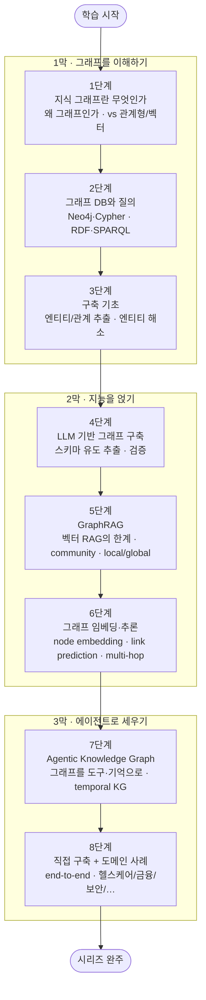

<figure class="post-figure post-figure--header">
<svg role="img" aria-label="Agentic Knowledge Graph 시리즈를 한 장으로 정리한 그림. 위쪽은 지식의 여정으로, 왼쪽에 흩어진 비정형 문서(문서 세 장)가 'LLM 추출'을 거쳐 가운데 지식 그래프(사람·회사·제품·사건 네 노드가 관계로 연결된 그래프)로 모이고, 다시 '에이전트'를 거쳐 오른쪽의 질의·추론·행동으로 이어진다. 에이전트에서 그래프로 되돌아오는 점선은 그래프를 갱신하는 write-back을 뜻한다. 아래쪽은 그래프란·그래프DB·구축기초·LLM구축·GraphRAG·임베딩추론·에이전틱·구축과 사례로 이어지는 8단계 로드맵 타임라인이며, 끝에는 시리즈 완주를 뜻하는 트로피가 놓여 있다." viewBox="0 0 680 360" xmlns="http://www.w3.org/2000/svg">
  <title>Agentic Knowledge Graph — 문서를 그래프로, 그래프를 에이전트의 도구·기억으로 · 8단계 도장깨기 로드맵</title>
  <defs>
    <marker id="akg-arrow" viewBox="0 0 10 10" refX="8" refY="5" markerWidth="6" markerHeight="6" orient="auto-start-reverse">
      <path d="M0,0 L10,5 L0,10 z" fill="var(--secondary-color)"/>
    </marker>
  </defs>

  <!-- ===== title ===== -->
  <text x="340" y="24" text-anchor="middle" font-size="17" font-weight="800" fill="currentColor" letter-spacing="1.2">AGENTIC KNOWLEDGE GRAPH</text>

  <!-- ===== SECTION A: docs → graph → agent ===== -->
  <text x="30" y="50" text-anchor="start" font-size="11" font-weight="700" fill="currentColor" opacity="0.72">흩어진 문서를 지식 그래프로, 그래프를 에이전트의 도구·기억으로</text>

  <!-- Source documents (left) -->
  <g>
    <rect x="26" y="84" width="88" height="30" rx="3" fill="var(--bg-light)" stroke="currentColor" stroke-width="1.8"/>
    <rect x="34" y="112" width="88" height="30" rx="3" fill="var(--bg-light)" stroke="currentColor" stroke-width="1.8"/>
    <rect x="26" y="140" width="88" height="30" rx="3" fill="var(--bg-light)" stroke="currentColor" stroke-width="1.8"/>
  </g>
  <g stroke="currentColor" stroke-width="0.9" opacity="0.4">
    <line x1="36" y1="94" x2="104" y2="94"/><line x1="36" y1="102" x2="96" y2="102"/>
    <line x1="44" y1="122" x2="112" y2="122"/><line x1="44" y1="130" x2="104" y2="130"/>
    <line x1="36" y1="150" x2="104" y2="150"/><line x1="36" y1="158" x2="96" y2="158"/>
  </g>
  <text x="72" y="190" text-anchor="middle" font-size="9.5" font-weight="700" fill="currentColor" opacity="0.8">비정형 문서</text>
  <text x="72" y="203" text-anchor="middle" font-size="8" fill="currentColor" opacity="0.65">텍스트 · 리포트 · 로그</text>

  <!-- LLM 추출 arrow -->
  <line x1="122" y1="127" x2="172" y2="127" stroke="var(--secondary-color)" stroke-width="2.2" marker-end="url(#akg-arrow)"/>
  <text x="147" y="118" text-anchor="middle" font-size="8.5" font-weight="700" fill="var(--secondary-color)">LLM 추출</text>

  <!-- Knowledge graph (middle) — edges first, nodes on top -->
  <g stroke="var(--secondary-color)" stroke-width="1.8" opacity="0.6">
    <line x1="215" y1="95" x2="330" y2="82"/>
    <line x1="330" y1="82" x2="345" y2="167"/>
    <line x1="345" y1="167" x2="215" y2="177"/>
    <line x1="215" y1="95" x2="215" y2="177"/>
    <line x1="215" y1="95" x2="345" y2="167"/>
  </g>
  <g font-size="6.5" fill="currentColor" opacity="0.7" text-anchor="middle">
    <text x="272" y="82">근무</text>
    <text x="352" y="126">출시</text>
    <text x="280" y="182">언급</text>
    <text x="196" y="138">투자</text>
  </g>
  <!-- graph nodes -->
  <g>
    <circle cx="215" cy="95" r="17" fill="var(--bg-panel)" stroke="currentColor" stroke-width="2"/>
    <text x="215" y="98" text-anchor="middle" font-size="9" font-weight="700" fill="currentColor">사람</text>
    <circle cx="330" cy="82" r="17" fill="var(--bg-panel)" stroke="var(--secondary-color)" stroke-width="2.2"/>
    <text x="330" y="85" text-anchor="middle" font-size="9" font-weight="700" fill="currentColor">회사</text>
    <circle cx="345" cy="167" r="17" fill="var(--bg-panel)" stroke="currentColor" stroke-width="2"/>
    <text x="345" y="170" text-anchor="middle" font-size="9" font-weight="700" fill="currentColor">제품</text>
    <circle cx="215" cy="177" r="17" fill="var(--bg-panel)" stroke="currentColor" stroke-width="2"/>
    <text x="215" y="180" text-anchor="middle" font-size="9" font-weight="700" fill="currentColor">사건</text>
  </g>
  <text x="278" y="212" text-anchor="middle" font-size="9.5" font-weight="700" fill="currentColor" opacity="0.8">지식 그래프 · 노드 + 관계</text>

  <!-- 에이전트 arrow -->
  <line x1="392" y1="120" x2="452" y2="124" stroke="var(--secondary-color)" stroke-width="2.2" marker-end="url(#akg-arrow)"/>
  <text x="422" y="110" text-anchor="middle" font-size="8.5" font-weight="700" fill="var(--secondary-color)">에이전트</text>

  <!-- Agent node (right) -->
  <rect x="470" y="94" width="106" height="66" rx="5" fill="var(--bg-panel)" stroke="var(--gold)" stroke-width="2.5"/>
  <text x="523" y="118" text-anchor="middle" font-size="12" font-weight="700" fill="currentColor">질의 · 추론</text>
  <text x="523" y="135" text-anchor="middle" font-size="8" fill="currentColor" opacity="0.72">그래프를 도구·기억으로</text>
  <text x="523" y="148" text-anchor="middle" font-size="8" fill="currentColor" opacity="0.72">삼아 답하고 행동한다</text>
  <!-- write-back loop -->
  <path d="M523,160 q0,26 -120,26 q-125,0 -125,-24" fill="none" stroke="var(--accent-color)" stroke-width="1.6" stroke-dasharray="4 3" opacity="0.7" marker-end="url(#akg-arrow)"/>
  <text x="360" y="200" text-anchor="middle" font-size="8" font-weight="700" fill="var(--accent-color)" opacity="0.85">write-back — 새로 알게 된 사실이 그래프로 되돌아온다</text>

  <!-- ===== divider ===== -->
  <line x1="30" y1="224" x2="650" y2="224" stroke="currentColor" stroke-width="1.4" opacity="0.25"/>

  <!-- ===== SECTION B: 8-step roadmap ===== -->
  <text x="30" y="248" text-anchor="start" font-size="11" font-weight="700" fill="currentColor" opacity="0.72">8단계 로드맵 — 이해 → 지능 → 에이전트, 그리고 완주</text>

  <!-- act labels + underlines -->
  <g font-size="9" font-weight="700" text-anchor="middle">
    <text x="134" y="274" fill="var(--secondary-color)">이해 (1–3)</text>
    <text x="356" y="274" fill="var(--accent-color)">지능 (4–6)</text>
    <text x="541" y="274" fill="var(--gold)">에이전트 (7–8)</text>
  </g>
  <g stroke-width="2" opacity="0.45">
    <line x1="60" y1="280" x2="208" y2="280" stroke="var(--secondary-color)"/>
    <line x1="282" y1="280" x2="430" y2="280" stroke="var(--accent-color)"/>
    <line x1="504" y1="280" x2="578" y2="280" stroke="var(--gold)"/>
  </g>

  <!-- baseline -->
  <line x1="52" y1="308" x2="588" y2="308" stroke="currentColor" stroke-width="2" opacity="0.4"/>

  <!-- stamps -->
  <g font-weight="800" text-anchor="middle">
    <circle cx="60" cy="308" r="15" fill="var(--bg-light)" stroke="var(--secondary-color)" stroke-width="2.5"/>
    <text x="60" y="312" font-size="12" fill="currentColor">1</text>
    <text x="60" y="336" font-size="7.5" font-weight="700" fill="currentColor">그래프란</text>

    <circle cx="134" cy="308" r="15" fill="var(--bg-light)" stroke="var(--secondary-color)" stroke-width="2.5"/>
    <text x="134" y="312" font-size="12" fill="currentColor">2</text>
    <text x="134" y="336" font-size="7.5" font-weight="700" fill="currentColor">그래프 DB</text>

    <circle cx="208" cy="308" r="15" fill="var(--bg-light)" stroke="var(--secondary-color)" stroke-width="2.5"/>
    <text x="208" y="312" font-size="12" fill="currentColor">3</text>
    <text x="208" y="336" font-size="7.5" font-weight="700" fill="currentColor">구축 기초</text>

    <circle cx="282" cy="308" r="15" fill="var(--bg-light)" stroke="var(--accent-color)" stroke-width="2.5"/>
    <text x="282" y="312" font-size="12" fill="currentColor">4</text>
    <text x="282" y="336" font-size="7.5" font-weight="700" fill="currentColor">LLM 구축</text>

    <circle cx="356" cy="308" r="15" fill="var(--bg-light)" stroke="var(--accent-color)" stroke-width="2.5"/>
    <text x="356" y="312" font-size="12" fill="currentColor">5</text>
    <text x="356" y="336" font-size="7.5" font-weight="700" fill="currentColor">GraphRAG</text>

    <circle cx="430" cy="308" r="15" fill="var(--bg-light)" stroke="var(--accent-color)" stroke-width="2.5"/>
    <text x="430" y="312" font-size="12" fill="currentColor">6</text>
    <text x="430" y="336" font-size="7.5" font-weight="700" fill="currentColor">임베딩·추론</text>

    <circle cx="504" cy="308" r="15" fill="var(--bg-light)" stroke="var(--gold)" stroke-width="2.5"/>
    <text x="504" y="312" font-size="12" fill="currentColor">7</text>
    <text x="504" y="336" font-size="7.5" font-weight="700" fill="currentColor">에이전틱</text>

    <circle cx="578" cy="308" r="15" fill="var(--bg-panel)" stroke="var(--gold)" stroke-width="3"/>
    <text x="578" y="312" font-size="12" fill="currentColor">8</text>
    <text x="578" y="336" font-size="7.5" font-weight="700" fill="currentColor">구축·사례</text>
  </g>

  <!-- arrow to trophy -->
  <line x1="596" y1="308" x2="622" y2="308" stroke="var(--secondary-color)" stroke-width="2" marker-end="url(#akg-arrow)"/>

  <!-- ===== victory trophy ===== -->
  <g>
    <path d="M630,292 L662,292 Q660,313 646,315 Q632,313 630,292 Z" fill="var(--bg-light)" stroke="var(--gold)" stroke-width="2.5"/>
    <path d="M630,296 q-9,1 -3,12" fill="none" stroke="var(--gold)" stroke-width="2"/>
    <path d="M662,296 q9,1 3,12" fill="none" stroke="var(--gold)" stroke-width="2"/>
    <rect x="642" y="315" width="8" height="7" fill="var(--gold)"/>
    <rect x="633" y="322" width="26" height="5" rx="1" fill="var(--gold)"/>
    <polygon points="646,297 648.6,302.5 654.5,303 649.8,306.8 651.4,312.5 646,309.2 640.6,312.5 642.2,306.8 637.5,303 643.4,302.5" fill="var(--gold-bright)"/>
  </g>
</svg>
<figcaption>이 시리즈를 한 장으로 — 흩어진 문서를 <strong>LLM 추출</strong>로 지식 그래프에 얹고, 그 그래프를 <strong>에이전트</strong>의 도구·기억으로 삼아 질의·추론·행동하며(새로 알게 된 사실은 write-back으로 그래프에 되돌아온다), 그래프의 개념부터 직접 구축과 도메인 사례까지 8단계 도장깨기로 정복한다.</figcaption>
</figure>

## 소개

**지식 그래프(Knowledge Graph)**는 세상을 *노드(개체)*와 *관계(엣지)*로 표현한 그래프입니다. "일론 머스크 — (창업) → 테슬라 — (출시) → Model 3"처럼, 사실(fact)을 삼각형의 트리플로 이어 붙여 하나의 거대한 지식 망을 만듭니다. 표(테이블)가 데이터를 *행과 열*로 가둔다면, 지식 그래프는 데이터를 *연결*로 풀어 놓습니다 — 그래서 "이 고객과 3다리 건너 연결된 위험 계좌는?" 같은, 관계를 따라가야 답이 나오는 질문에 강합니다.

이 발상 자체는 오래됐습니다(구글 지식 그래프, 시맨틱 웹). 그런데 2020년대 들어 두 가지가 지식 그래프를 다시 무대 중앙으로 끌어냈습니다. 하나는 **LLM** — 이제 사람이 손으로 규칙을 짜지 않아도, 비정형 문서에서 개체와 관계를 뽑아 **그래프를 자동으로 구축**할 수 있습니다. 다른 하나는 **RAG의 한계** — 벡터 검색만으로는 "여러 문서에 흩어진 사실을 연결해야 답이 나오는" 질문(multi-hop)이나 "전체를 요약해줘" 같은 전역 질문에 약합니다. 그 빈틈을 그래프가 메웁니다(**GraphRAG**).

그리고 여기서 한 걸음 더 나아간 것이 이 시리즈의 종착점, **Agentic Knowledge Graph**입니다. 지식 그래프를 단지 *읽는* 데서 그치지 않고, **에이전트가 그래프를 도구(tool)와 기억(memory)으로 삼아** 스스로 질의를 계획하고, 여러 홉을 넘나들며 추론하고, 새로 알게 된 사실을 다시 그래프에 써 넣는(write-back) 시스템입니다. 대화가 쌓일수록 자라나는 에이전트의 시간적 기억(temporal memory), 도메인 지식 위를 걷는 리서치 에이전트가 모두 이 그림 위에 있습니다.

이 글은 `Agentic-Knowledge-Graph` 시리즈의 **마스터 로드맵**입니다. 지식 그래프가 *무엇이며 왜 그래프인지*(1막·이해하기)에서 출발해, LLM으로 그래프를 짓고 GraphRAG·추론으로 *지능을 얹고*(2막·지능 얹기), 마지막으로 그래프를 도구·기억으로 쓰는 *에이전트를 세우고 직접 구축*(3막·에이전트로)합니다. 각 단계마다 헬스케어·금융·보안·엔터프라이즈 등 **도메인별 활용 사례**를 곁들이고, 상세 딥다이브 포스트를 작성하며 체크박스를 채우는 **도장깨기** 방식으로 진행합니다.

> **기존 [Ontology-Essential](/2026/07/19/ontology-essential-curriculum.html) 시리즈와의 관계** — Ontology 시리즈는 "데이터에 *의미*를 얹는 시맨틱 모델링"(Palantir FDE식 객체·링크·액션)에 초점을 둡니다. 트리플·RDF/OWL·속성 그래프 같은 **형식 기반**은 그쪽 [2단계](/2026/07/19/ontology-knowledge-graphs-rdf-owl-property-graphs.html)에서 이미 다뤘으므로, 이 시리즈는 그 어휘를 **크로스링크로 재사용**하고 중복 서술하지 않습니다. 대신 이 시리즈의 무게중심은 "그래프를 **어떻게 만들고**, 그 위에서 **LLM·에이전트가 어떻게 검색·추론·행동하는가**"에 있습니다.

<figure class="post-figure">
<svg role="img" aria-label="이 시리즈의 학습 여정을 세 막으로 나눈 개념도. 제1막 '그래프를 이해하기'는 그래프란·그래프DB·구축기초(1~3단계)로 왜 그래프이며 어떻게 짓는지를 배우고, 제2막 '지능을 얹기'는 LLM구축·GraphRAG·임베딩추론(4~6단계)으로 그래프를 LLM과 결합하며, 제3막 '에이전트로 세우기'는 에이전틱KG와 직접 구축·사례(7~8단계)로 그래프를 에이전트의 도구·기억으로 만든다. 세 막은 왼쪽에서 오른쪽으로 화살표로 이어진다." viewBox="0 0 680 280" xmlns="http://www.w3.org/2000/svg">
  <title>세 막으로 보는 학습 여정 — 그래프를 이해하기 → 지능을 얹기 → 에이전트로 세우기</title>
  <defs>
    <marker id="akg-tl-arrow" viewBox="0 0 10 10" refX="8" refY="5" markerWidth="6" markerHeight="6" orient="auto-start-reverse">
      <path d="M0,0 L10,5 L0,10 z" fill="var(--gold)"/>
    </marker>
  </defs>

  <text x="340" y="26" text-anchor="middle" font-size="15" font-weight="800" fill="currentColor">세 막으로 보는 학습 여정</text>

  <!-- ===== ACT 1 (steps 1-3) ===== -->
  <rect x="16" y="52" width="200" height="210" rx="6" fill="var(--bg-light)" stroke="var(--secondary-color)" stroke-width="2.5"/>
  <circle cx="34" cy="74" r="12" fill="var(--bg-panel)" stroke="var(--secondary-color)" stroke-width="2"/>
  <text x="34" y="78" text-anchor="middle" font-size="11" font-weight="800" fill="currentColor">1</text>
  <text x="124" y="78" text-anchor="middle" font-size="13" font-weight="800" fill="var(--secondary-color)">그래프를 이해하기</text>
  <text x="124" y="96" text-anchor="middle" font-size="9" fill="currentColor" opacity="0.72">왜 그래프이며 어떻게 짓는가</text>
  <!-- graph icon -->
  <g>
    <line x1="94" y1="132" x2="126" y2="118" stroke="var(--secondary-color)" stroke-width="2"/>
    <line x1="126" y1="118" x2="150" y2="140" stroke="var(--secondary-color)" stroke-width="2"/>
    <line x1="94" y1="132" x2="126" y2="150" stroke="var(--secondary-color)" stroke-width="2"/>
    <circle cx="94" cy="132" r="7" fill="var(--bg-panel)" stroke="var(--secondary-color)" stroke-width="2"/>
    <circle cx="126" cy="118" r="7" fill="var(--bg-panel)" stroke="var(--secondary-color)" stroke-width="2"/>
    <circle cx="150" cy="140" r="7" fill="var(--bg-panel)" stroke="var(--secondary-color)" stroke-width="2"/>
    <circle cx="126" cy="150" r="7" fill="var(--bg-panel)" stroke="var(--secondary-color)" stroke-width="2"/>
  </g>
  <g font-size="9" font-weight="700">
    <rect x="34" y="170" width="164" height="20" rx="4" fill="var(--bg-panel)" stroke="currentColor" stroke-width="1" opacity="0.9"/>
    <circle cx="48" cy="180" r="7" fill="var(--bg-light)" stroke="var(--secondary-color)" stroke-width="1.6"/><text x="48" y="183" text-anchor="middle" font-size="8" fill="currentColor">1</text><text x="62" y="183" fill="currentColor">지식 그래프란</text>
    <rect x="34" y="194" width="164" height="20" rx="4" fill="var(--bg-panel)" stroke="currentColor" stroke-width="1" opacity="0.9"/>
    <circle cx="48" cy="204" r="7" fill="var(--bg-light)" stroke="var(--secondary-color)" stroke-width="1.6"/><text x="48" y="207" text-anchor="middle" font-size="8" fill="currentColor">2</text><text x="62" y="207" fill="currentColor">그래프 DB·질의</text>
    <rect x="34" y="218" width="164" height="20" rx="4" fill="var(--bg-panel)" stroke="currentColor" stroke-width="1" opacity="0.9"/>
    <circle cx="48" cy="228" r="7" fill="var(--bg-light)" stroke="var(--secondary-color)" stroke-width="1.6"/><text x="48" y="231" text-anchor="middle" font-size="8" fill="currentColor">3</text><text x="62" y="231" fill="currentColor">구축 기초·추출</text>
  </g>

  <polygon points="218,148 232,148 232,141 246,157 232,173 232,166 218,166" fill="currentColor" opacity="0.5"/>

  <!-- ===== ACT 2 (steps 4-6) ===== -->
  <rect x="248" y="52" width="200" height="210" rx="6" fill="var(--bg-light)" stroke="var(--accent-color)" stroke-width="2.5"/>
  <circle cx="266" cy="74" r="12" fill="var(--bg-panel)" stroke="var(--accent-color)" stroke-width="2"/>
  <text x="266" y="78" text-anchor="middle" font-size="11" font-weight="800" fill="currentColor">2</text>
  <text x="358" y="78" text-anchor="middle" font-size="13" font-weight="800" fill="var(--accent-color)">지능을 얹기</text>
  <text x="358" y="96" text-anchor="middle" font-size="9" fill="currentColor" opacity="0.72">LLM과 그래프를 결합하기</text>
  <!-- spark-on-graph icon -->
  <g>
    <circle cx="330" cy="138" r="7" fill="var(--bg-panel)" stroke="var(--accent-color)" stroke-width="2"/>
    <circle cx="386" cy="138" r="7" fill="var(--bg-panel)" stroke="var(--accent-color)" stroke-width="2"/>
    <line x1="337" y1="138" x2="379" y2="138" stroke="var(--accent-color)" stroke-width="2"/>
    <polygon points="358,116 350,134 359,134 353,152 372,130 360,130" fill="var(--accent-color)" opacity="0.85"/>
  </g>
  <g font-size="9" font-weight="700">
    <rect x="266" y="170" width="164" height="20" rx="4" fill="var(--bg-panel)" stroke="currentColor" stroke-width="1" opacity="0.9"/>
    <circle cx="280" cy="180" r="7" fill="var(--bg-light)" stroke="var(--accent-color)" stroke-width="1.6"/><text x="280" y="183" text-anchor="middle" font-size="8" fill="currentColor">4</text><text x="294" y="183" fill="currentColor">LLM 기반 구축</text>
    <rect x="266" y="194" width="164" height="20" rx="4" fill="var(--bg-panel)" stroke="currentColor" stroke-width="1" opacity="0.9"/>
    <circle cx="280" cy="204" r="7" fill="var(--bg-light)" stroke="var(--accent-color)" stroke-width="1.6"/><text x="280" y="207" text-anchor="middle" font-size="8" fill="currentColor">5</text><text x="294" y="207" fill="currentColor">GraphRAG</text>
    <rect x="266" y="218" width="164" height="20" rx="4" fill="var(--bg-panel)" stroke="currentColor" stroke-width="1" opacity="0.9"/>
    <circle cx="280" cy="228" r="7" fill="var(--bg-light)" stroke="var(--accent-color)" stroke-width="1.6"/><text x="280" y="231" text-anchor="middle" font-size="8" fill="currentColor">6</text><text x="294" y="231" fill="currentColor">임베딩·추론</text>
  </g>

  <polygon points="450,148 464,148 464,141 478,157 464,173 464,166 450,166" fill="currentColor" opacity="0.5"/>

  <!-- ===== ACT 3 (steps 7-8) ===== -->
  <rect x="480" y="52" width="184" height="210" rx="6" fill="var(--bg-light)" stroke="var(--gold)" stroke-width="2.5"/>
  <circle cx="498" cy="74" r="12" fill="var(--bg-panel)" stroke="var(--gold)" stroke-width="2"/>
  <text x="498" y="78" text-anchor="middle" font-size="11" font-weight="800" fill="currentColor">3</text>
  <text x="582" y="78" text-anchor="middle" font-size="13" font-weight="800" fill="var(--gold)">에이전트로 세우기</text>
  <text x="582" y="96" text-anchor="middle" font-size="9" fill="currentColor" opacity="0.72">그래프를 도구·기억으로</text>
  <!-- robot/agent icon -->
  <g>
    <rect x="558" y="122" width="48" height="34" rx="6" fill="var(--bg-panel)" stroke="var(--gold)" stroke-width="2.5"/>
    <circle cx="572" cy="139" r="4" fill="var(--gold)"/>
    <circle cx="592" cy="139" r="4" fill="var(--gold)"/>
    <line x1="582" y1="122" x2="582" y2="112" stroke="var(--gold)" stroke-width="2"/>
    <circle cx="582" cy="110" r="3" fill="var(--gold)"/>
  </g>
  <g font-size="9" font-weight="700">
    <rect x="498" y="176" width="150" height="22" rx="4" fill="var(--bg-panel)" stroke="currentColor" stroke-width="1" opacity="0.9"/>
    <circle cx="512" cy="187" r="7" fill="var(--bg-light)" stroke="var(--gold)" stroke-width="1.6"/><text x="512" y="190" text-anchor="middle" font-size="8" fill="currentColor">7</text><text x="526" y="190" fill="currentColor">에이전틱 KG</text>
    <rect x="498" y="202" width="150" height="22" rx="4" fill="var(--bg-panel)" stroke="currentColor" stroke-width="1" opacity="0.9"/>
    <circle cx="512" cy="213" r="7" fill="var(--bg-light)" stroke="var(--gold)" stroke-width="1.6"/><text x="512" y="216" text-anchor="middle" font-size="8" fill="currentColor">8</text><text x="526" y="216" fill="currentColor">직접 구축·사례</text>
  </g>
</svg>
<figcaption>학습 스파인을 세 막으로 — ① 그래프를 이해하기(개념·DB·구축 기초) → ② 지능을 얹기(LLM 구축·GraphRAG·추론) → ③ 에이전트로 세우기(에이전틱 KG·직접 구축과 도메인 사례)</figcaption>
</figure>

## 학습 흐름

8단계는 아래 순서대로 진행하는 것을 권장합니다. 먼저 지식 그래프가 **무엇이며 왜 그래프인지**(vs 관계형·벡터 DB)를 잡고, **그래프 DB와 질의**(Cypher·SPARQL)로 손을 풀며, **엔티티·관계 추출**로 그래프를 짓는 기초를 다집니다. 그다음 **LLM으로 그래프를 구축**하고, **GraphRAG**로 검색에 그래프를 결합하며, **임베딩·추론**으로 예측·다중 홉을 더합니다. 마지막으로 그래프를 도구·기억으로 쓰는 **에이전틱 KG**를 이해하고, 이 모두를 하나로 **직접 구축**하며 **도메인별 활용 사례**로 시야를 넓히는 흐름입니다.

## 학습 진행 현황

> 완료한 항목에는 상세 포스트 링크가 연결됩니다. 학습이 진행될 때마다 체크박스와 진행률을 갱신합니다.

- 현재 완료한 항목: **24개**
- 전체 항목: **24개**
- 진행률: **100%**

> 진행률은 **8단계 본류(24항목)** 기준입니다. 도메인 활용 사례는 각 단계에 녹이고 8단계에 전용 섹션으로 집대성하므로, 별도 집계 항목으로 두지 않습니다.

## 1단계: 지식 그래프란 무엇인가 — 왜 그래프인가 (vs 관계형·vs 벡터 DB)

모든 것의 출발점입니다. **지식 그래프**는 세상을 *노드(개체)*와 *관계(엣지)*로 표현한, 사실의 망입니다. 여기서 먼저 "왜 하필 그래프인가"를 분명히 합니다 — 관계형 DB가 관계를 *조인*으로 그때그때 계산한다면, 그래프는 관계를 *데이터 그 자체로* 저장해 여러 홉을 따라가는 질문(친구의 친구, 3다리 건너 연결된 계좌)에 압도적으로 강합니다. 또 요즘 RAG의 주력인 **벡터 DB**와도 비교합니다 — 벡터가 "의미가 비슷한 조각"을 찾는다면, 그래프는 "명시적으로 연결된 사실"을 따라갑니다. 둘은 경쟁이 아니라 **상보적**이며, 이 대비가 이후 GraphRAG의 동기가 됩니다. 대표 활용(구글 지식 그래프, 추천, 사기 탐지)의 큰 그림도 여기서 그립니다.

- [x] **왜 그래프인가**: 노드·엣지·트리플, 조인 대신 관계를 저장한다는 것, 다중 홉 질의의 강점 — [[상세](/2026/07/21/kg-what-is-knowledge-graph.html)]
- [x] **vs 관계형 · vs 벡터 DB**: 각자가 잘하는 질문, 그래프가 메우는 빈틈, 상보적 조합의 밑그림 — [[상세](/2026/07/21/kg-what-is-knowledge-graph.html)]
- [x] **활용의 큰 그림**: 검색·추천·사기 탐지·에이전트 기억까지, 지식 그래프가 빛나는 문제의 공통 성질 — [[상세](/2026/07/21/kg-what-is-knowledge-graph.html)]

## 2단계: 그래프 DB와 질의 — Neo4j·Cypher / RDF·SPARQL

지식 그래프를 실제로 저장하고 물어보는 손을 푸는 단계입니다. 실무에서 가장 널리 쓰이는 **속성 그래프(property graph)** 계열의 **Neo4j**와 그 질의 언어 **Cypher**(`MATCH (a)-[:KNOWS]->(b)`)로 그래프에 질문하는 법을 익히고, 시맨틱 웹 계열의 **RDF 트리플 저장소**와 **SPARQL**을 개념 수준에서 대비합니다. 두 모델의 차이(속성을 노드/엣지에 붙이는가, 모든 것을 트리플로 쪼개는가)와 언제 무엇을 고를지, 그리고 최근 표준화된 **GQL**의 위치를 잡습니다. (형식 기반의 더 깊은 계보는 [Ontology 2단계](/2026/07/19/ontology-knowledge-graphs-rdf-owl-property-graphs.html)를 참고하세요.)

- [x] **속성 그래프와 Cypher**: 노드·엣지·속성, `MATCH`/가변 길이 경로, 이웃·경로 탐색 질의 — [[상세](/2026/07/21/kg-graph-databases-cypher-sparql.html)]
- [x] **RDF와 SPARQL**: 트리플 저장소, 기본 그래프 패턴, 속성 그래프와의 모델 차이 — [[상세](/2026/07/21/kg-graph-databases-cypher-sparql.html)]
- [x] **무엇을 언제**: property graph vs RDF 선택 기준, GQL 표준, 대표 그래프 DB 지형도 — [[상세](/2026/07/21/kg-graph-databases-cypher-sparql.html)]

## 3단계: 지식 그래프 구축 기초 — 엔티티/관계 추출·스키마·엔티티 해소

그래프를 *짓기* 시작하는 단계입니다. 지식 그래프의 재료는 결국 어딘가의 텍스트·표·API에서 뽑아낸 개체와 관계입니다. 문장에서 개체를 찾는 **개체명 인식(NER)**, 개체 사이의 관계를 뽑는 **관계 추출(RE)**, 그래프가 담을 개념을 정하는 **스키마(온톨로지) 설계**, 그리고 여러 소스에 흩어진 같은 실체를 하나로 묶는 **엔티티 해소(entity resolution)**를 다룹니다. LLM 이전의 전통 파이프라인(규칙·통계·지도학습)을 먼저 이해해야, 4단계에서 LLM이 *무엇을* 대체하고 *무엇을* 못 하는지가 보입니다. 지저분한 현실(중복·모호성·누락)과 그 위에서 신뢰할 그래프를 세우는 문제가 이 단계의 핵심입니다.

- [x] **엔티티·관계 추출(NER/RE)**: 개체와 관계를 텍스트에서 뽑기, 전통 파이프라인의 구성과 한계 — [[상세](/2026/07/21/kg-construction-entity-relation-extraction.html)]
- [x] **스키마·온톨로지 설계**: 그래프가 담을 타입과 관계를 정하기, 스키마-우선 vs 스키마-유연 — [[상세](/2026/07/21/kg-construction-entity-relation-extraction.html)]
- [x] **엔티티 해소**: 여러 소스의 같은 실체를 하나로, 매칭·중복 제거·식별자 통합 — [[상세](/2026/07/21/kg-construction-entity-relation-extraction.html)]

## 4단계: LLM 기반 그래프 구축 — 스키마 유도 추출·검증·휴먼인더루프

지식 그래프 부흥의 첫 번째 엔진, LLM으로 그래프를 짓는 단계입니다. 이제 정교한 규칙·라벨링 없이도, LLM에 **스키마를 프롬프트로 유도**해 문서에서 개체·관계를 트리플로 뽑아낼 수 있습니다. 구조화 출력(JSON·함수 호출)으로 추출을 강제하는 법, LangChain의 `LLMGraphTransformer`나 LlamaIndex의 프로퍼티 그래프 인덱스 같은 도구의 접근, 그리고 무엇보다 **품질** — 환각(없는 관계 지어내기)·일관성(같은 개체를 다르게 부르기)을 어떻게 검증하고 **휴먼인더루프**로 교정하는지를 다룹니다. LLM 추출은 강력하지만 *공짜가 아니며*, 3단계의 엔티티 해소·스키마 규율이 여기서 다시 필요해집니다. *(예: 의료 논문 코퍼스에서 약물–질환–유전자 트리플을 자동 추출해 바이오 KG를 시드하기.)*

- [x] **스키마 유도 LLM 추출**: 프롬프트로 타입·관계를 지시하고 구조화 출력으로 트리플 뽑기 — [[상세](/2026/07/21/kg-llm-graph-construction.html)]
- [x] **구축 도구와 파이프라인**: LLMGraphTransformer·프로퍼티 그래프 인덱스, 청킹·프롬프트 설계 — [[상세](/2026/07/21/kg-llm-graph-construction.html)]
- [x] **품질·검증·휴먼인더루프**: 환각·중복·불일치 잡기, 신뢰도 점수, 사람 검수 루프 — [[상세](/2026/07/21/kg-llm-graph-construction.html)]

## 5단계: GraphRAG — 벡터 RAG의 한계·그래프 검색·local vs global

지식 그래프가 다시 뜨거워진 두 번째 이유, **GraphRAG**입니다. 벡터 RAG는 "질문과 의미가 비슷한 조각"을 잘 찾지만, *여러 문서에 흩어진 사실을 연결*해야 하는 다중 홉 질문이나 "이 코퍼스 전체의 핵심 주제는?" 같은 **전역(global) 질문**에 약합니다. GraphRAG는 문서에서 뽑은 지식 그래프에 **community detection**으로 주제 클러스터를 만들고 그 요약을 미리 구워 두어, 지역(local) 질문과 전역 질문 모두에 답합니다. Microsoft GraphRAG의 인덱싱·쿼리 구조, 벡터·그래프를 함께 쓰는 하이브리드 검색, 그리고 비용·지연·정확도의 트레이드오프를 다룹니다. *(예: 기업 내부 위키 전체에 대해 "우리 팀들이 반복적으로 부딪히는 리스크는?"에 답하기.)*

- [x] **벡터 RAG의 한계**: multi-hop·전역 질문·설명가능성에서 벡터 검색이 놓치는 것 — [[상세](/2026/07/21/kg-graphrag.html)]
- [x] **GraphRAG 아키텍처**: 그래프 인덱싱, community detection·요약, local vs global 쿼리 — [[상세](/2026/07/21/kg-graphrag.html)]
- [x] **하이브리드·트레이드오프**: 벡터+그래프 결합, 비용·지연·정확도, 언제 GraphRAG가 값을 하는가 — [[상세](/2026/07/21/kg-graphrag.html)]

## 6단계: 그래프 임베딩·추론 — node embedding·link prediction·multi-hop

그래프를 *읽는* 데서 *예측·추론*으로 넓히는 단계입니다. 노드와 관계를 벡터로 옮기는 **그래프 임베딩**(node2vec, TransE 같은 지식 그래프 임베딩)으로 유사 개체를 찾고, 아직 그래프에 없는 관계를 예측하는 **링크 예측(link prediction)** — "이 두 유전자는 상호작용할까?", "이 사용자가 다음에 살 것은?" — 을 다룹니다. 나아가 명시적 규칙·경로를 따라 새로운 사실을 이끌어내는 **다중 홉 추론(multi-hop reasoning)**과, 그래프 신경망(GNN)이 이 문제들에 어떻게 쓰이는지를 개념 수준에서 잡습니다. 이 예측·추론 능력이 7단계에서 에이전트가 "그래프에게 물어 답을 만드는" 밑천이 됩니다.

- [x] **그래프·지식 그래프 임베딩**: node2vec·TransE 계열, 개체/관계를 벡터로, 유사도와 활용 — [[상세](/2026/07/21/kg-embeddings-reasoning.html)]
- [x] **링크 예측·추천**: 없는 관계를 예측하기, 추천·신약 후보·리스크 연결에의 응용 — [[상세](/2026/07/21/kg-embeddings-reasoning.html)]
- [x] **다중 홉 추론·GNN**: 경로·규칙 기반 추론, 그래프 신경망의 역할, 설명가능성 — [[상세](/2026/07/21/kg-embeddings-reasoning.html)]

## 7단계: Agentic Knowledge Graph — 그래프를 도구·기억으로, temporal KG

시리즈의 심장입니다. 지금까지 만든 그래프를, **에이전트가 스스로 쓰는** 단계로 끌어올립니다. 핵심은 두 가지입니다. 첫째, 그래프를 **도구(tool)**로 — 에이전트가 자연어 질문을 Cypher/SPARQL로 번역하거나 그래프 탐색을 *스스로 계획*해 답을 만들고(text-to-Cypher, 질의 계획), 여러 홉을 넘나들며 추론합니다. 둘째, 그래프를 **기억(memory)**으로 — 대화·관찰에서 얻은 새 사실을 그래프에 **써 넣어(write-back)** 시간이 지날수록 자라는 **시간적 지식 그래프(temporal KG)**를 만듭니다(예: Graphiti/Zep식 에이전트 메모리, 사실의 유효 기간·버전 관리). 읽기 전용 그래프가 아니라 *읽고 쓰는* 살아있는 그래프가 에이전트의 장기 기억이 되는 것 — 이것이 Agentic Knowledge Graph의 본질입니다.

- [x] **그래프를 도구로**: text-to-Cypher·질의 계획, 에이전트가 스스로 그래프를 탐색해 답 만들기 — [[상세](/2026/07/21/kg-agentic-knowledge-graph.html)]
- [x] **그래프를 기억으로**: write-back, 시간적 KG(temporal), 사실의 유효 기간·버전·무효화 — [[상세](/2026/07/21/kg-agentic-knowledge-graph.html)]
- [x] **에이전트 아키텍처**: 검색–추론–행동 루프, GraphRAG·벡터·툴의 오케스트레이션, 신뢰·평가 — [[상세](/2026/07/21/kg-agentic-knowledge-graph.html)]

## 8단계: 직접 구축 + 도메인별 활용 사례 — end-to-end로 하나의 그림 완성

배운 것을 하나로 꿰는 마무리 단계입니다. **비정형 코퍼스 → LLM 추출(4단계) → 그래프 DB 적재(2단계) → GraphRAG·추론(5·6단계) → 에이전트가 질의·행동하고 새 사실을 write-back(7단계)**으로 이어지는 end-to-end 파이프라인을 **개념 + 핵심 코드 스니펫**(추출 프롬프트·Cypher·에이전트 툴 정의) 수준으로 직접 조립합니다. 그리고 이 아키텍처가 각 도메인에서 어떻게 변주되는지 **도메인별 활용 사례**를 집대성해, 독자가 자기 문제에 대입할 지도를 얻게 합니다.

- [x] **end-to-end 구축**: 코퍼스→추출→적재→GraphRAG→에이전트 write-back, 핵심 코드 스니펫과 함정 — [[상세](/2026/07/21/kg-build-and-domain-use-cases.html)]
- [x] **도메인별 활용 사례 집대성**: 아래 표의 도메인들을 아키텍처 변주로 정리(각 단계에서 예고한 사례를 한자리에) — [[상세](/2026/07/21/kg-build-and-domain-use-cases.html)]
- [x] **한계·운영·다음 단계**: 확장성·최신성·환각·거버넌스, 프로덕션으로 가는 체크리스트 — [[상세](/2026/07/21/kg-build-and-domain-use-cases.html)]

### 도메인별 활용 사례 (8단계 종합 · 각 단계에도 예시로 등장)

| 도메인 | 지식 그래프 / 에이전트가 푸는 문제 |
| --- | --- |
| **헬스케어·바이오** | 약물–질환–유전자·논문 그래프에서 신약 후보·약물 재창출, 환자 360° 그래프, 리서치 에이전트의 근거 추적 |
| **금융** | 계좌·거래·소유 관계 그래프로 사기·자금세탁 탐지, 리스크 전파, 규제 대상 엔티티 해소 |
| **사이버보안** | 자산·취약점·공격 그래프(위협 인텔리전스), 공격 경로 추론, 침해 조사 에이전트 |
| **엔터프라이즈 지식·고객지원** | 사내 문서·티켓·제품 그래프 위 GraphRAG Q&A, 근거 있는 답변, 온보딩·지원 에이전트 |
| **추천·이커머스** | 사용자–상품–속성 그래프의 링크 예측·경로 기반 추천, 설명가능한 추천 |
| **법률·컴플라이언스** | 계약·조항·판례·규정 그래프, 다중 홉 근거 추적, 컴플라이언스 점검 에이전트 |
| **개인·에이전트 메모리** | 대화·관찰이 쌓여 자라는 시간적 KG, 장기 기억을 가진 어시스턴트, 개인 지식 관리 |

## 핵심 포인트

- **그래프는 "연결이 답인 문제"를 위한 것이다**: 다중 홉·전역·설명가능성이 필요한 순간, 조인과 벡터 유사도만으로는 부족합니다. 관계를 데이터로 저장한다는 발상이 그 빈틈을 메웁니다.
- **LLM이 구축의 문턱을 낮췄다 — 공짜는 아니다**: LLM 추출은 손으로 짜던 파이프라인을 대체하지만, 스키마 규율·엔티티 해소·환각 검증이라는 옛 숙제를 지우지는 못합니다. 오히려 그것들이 품질을 가릅니다.
- **GraphRAG는 벡터 RAG의 대체가 아니라 보완이다**: 그래프와 벡터는 서로 다른 질문에 강합니다. 실전의 답은 대개 *하이브리드*이며, 그래프가 값을 하는 지점을 아는 것이 핵심입니다.
- **읽는 그래프를 넘어 읽고 쓰는 그래프로**: 에이전트가 그래프를 *도구이자 기억*으로 쓰고, 새 사실을 write-back해 시간과 함께 자랄 때, 지식 그래프는 정적 지식 베이스에서 살아있는 에이전트 메모리가 됩니다.
- **아키텍처는 하나, 변주는 도메인마다**: 코퍼스→추출→그래프→에이전트라는 뼈대는 같고, 헬스케어·금융·보안·지원은 그 위의 스키마와 질문이 다를 뿐입니다. 하나를 제대로 지으면 나머지가 보입니다.

## 추천 학습 순서

위 단계 번호 순서대로 진행하는 것을 권합니다.

1. **이해(1~3단계)** — 왜 그래프인지(vs 관계형·벡터)를 세우고, 그래프 DB·질의로 손을 풀며, 엔티티·관계 추출로 그래프를 짓는 기초를 다집니다. 이 토대 없이 GraphRAG부터 손대면 블랙박스만 돌리게 됩니다.
2. **지능(4~6단계)** — LLM으로 그래프를 짓고, GraphRAG로 검색에 그래프를 결합하고, 임베딩·추론으로 예측·다중 홉을 더합니다. 그래프가 *지능적으로* 쓰이기 시작하는 구간입니다.
3. **에이전트(7~8단계)** — 그래프를 도구·기억으로 쓰는 에이전트를 이해하고, 이 모두를 end-to-end로 직접 구축하며 도메인 사례로 시야를 넓힙니다. 읽는 그래프를 넘어 *움직이는 시스템*으로 완성하는 단계입니다.

각 단계는 앞 단계의 토대 위에 쌓이므로, 순서대로 정복하며 체크박스를 채워 나가길 권합니다.

## 결론

Agentic Knowledge Graph는 "세상을 그래프로 표현한다"는 오래된 발상에, LLM이라는 새 엔진과 에이전트라는 새 주체를 얹은 결과입니다. 도구와 라이브러리는 계속 바뀌겠지만 — Neo4j든 RDF든, Microsoft GraphRAG든 Graphiti든 — **문서를 그래프로 짓고, 그 위에서 검색·추론하고, 에이전트가 도구·기억으로 삼아 읽고 쓴다**는 뼈대는 오래 갑니다. 이 8단계를 순서대로 정복하면, 비정형 지식을 연결된 그래프로 빚어내고 그 위에 LLM·에이전트를 얹어 *연결이 답인 문제*를 푸는 실전 역량을 갖추게 됩니다.

이 `Agentic-Knowledge-Graph` 시리즈는 개념·그래프 DB·구축 기초부터 LLM 구축·GraphRAG·추론, 그리고 에이전틱 KG의 직접 구축과 도메인 사례까지 전 여정을 다룹니다. 각 단계의 딥다이브가 채워질 때마다 이 로드맵의 체크박스와 진행률을 갱신하겠습니다.

### 다음 학습 (Next Learning)

- [Ontology Essential Curriculum](/2026/07/19/ontology-essential-curriculum.html) — 지식 그래프의 형식 기반(RDF/OWL·속성 그래프)과 시맨틱 데이터 모델링의 자매 시리즈
- [지식 그래프와 RDF/OWL·속성 그래프](/2026/07/19/ontology-knowledge-graphs-rdf-owl-property-graphs.html) — 이 시리즈가 크로스링크하는 형식 기반 딥다이브
- [CS336 (LLM from Scratch) Curriculum](/2026/06/26/cs336-llm-from-scratch-curriculum.html) — 그래프를 구축·추론하는 LLM의 내부 원리
- [Data Engineering Essential Curriculum](/2026/06/25/data-engineering-essential-curriculum.html) — 그래프의 재료가 되는 데이터를 수집·처리하는 파이프라인의 지도

<section class="slide slide--title">
  
Agentic-Knowledge-Graph · 시리즈 한 바퀴

  <h1>지식 그래프, 그리고 에이전트</h1>
  
"세상을 그래프로 그린다"는 오래된 발상이, LLM과 에이전트를 만나 다시 무대 중앙에 섰다.

  
3막 · 8단계로 훑는 큰 그림 — 용어는 나올 때마다 쉽게 풀어드립니다

</section>

<section class="slide">
  
먼저, 문제부터

  <h2>세상은 '연결'로 되어 있다</h2>
  
"이 사람의 친구의 친구는?" · "이 계좌와 3다리 건너 이어진 위험 계좌는?"

  
답이 <strong>관계를 따라가야</strong> 나오는 질문들. 이런 질문에 표(테이블)는 의외로 약하다.

  
이 시리즈의 출발점 — "왜 하필 그래프인가"

</section>

<section class="slide">
  
렌즈 ① 관계형 DB

  <h2>표는 관계를 '그때그때 계산'한다</h2>
  <svg role="img" aria-label="왼쪽은 행과 열로 된 표 두 개가 조인 화살표로 이어져 있고, 오른쪽은 사람·회사·제품 세 개의 동그란 노드가 관계선으로 이어진 작은 그래프다. 표는 관계를 조인으로 계산하고, 그래프는 관계를 선으로 저장한다는 대비를 보여준다." viewBox="0 0 680 230" style="width:100%;height:auto" xmlns="http://www.w3.org/2000/svg">
    <defs><marker id="kgd-a" viewBox="0 0 10 10" refX="8" refY="5" markerWidth="6" markerHeight="6" orient="auto-start-reverse"><path d="M0,0 L10,5 L0,10 z" fill="var(--secondary-color)"/></marker></defs>
    <text x="150" y="34" text-anchor="middle" font-size="12" font-weight="800" fill="currentColor">관계형 · 조인</text>
    <rect x="40" y="52" width="100" height="120" rx="5" fill="var(--bg-panel)" stroke="var(--border-color)" stroke-width="2"/>
    <rect x="200" y="52" width="100" height="120" rx="5" fill="var(--bg-panel)" stroke="var(--border-color)" stroke-width="2"/>
    <g stroke="currentColor" opacity="0.35" stroke-width="1"><line x1="40" y1="80" x2="140" y2="80"/><line x1="40" y1="108" x2="140" y2="108"/><line x1="40" y1="136" x2="140" y2="136"/><line x1="90" y1="52" x2="90" y2="172"/><line x1="200" y1="80" x2="300" y2="80"/><line x1="200" y1="108" x2="300" y2="108"/><line x1="200" y1="136" x2="300" y2="136"/><line x1="250" y1="52" x2="250" y2="172"/></g>
    <line x1="142" y1="112" x2="198" y2="112" stroke="var(--secondary-color)" stroke-width="2.5" marker-end="url(#kgd-a)"/>
    <text x="170" y="102" text-anchor="middle" font-size="9" font-weight="700" fill="var(--secondary-color)">JOIN</text>
    <text x="530" y="34" text-anchor="middle" font-size="12" font-weight="800" fill="var(--secondary-color)">그래프 · 관계를 저장</text>
    <g stroke="var(--secondary-color)" stroke-width="2"><line x1="470" y1="80" x2="590" y2="70"/><line x1="590" y1="70" x2="540" y2="150"/><line x1="470" y1="80" x2="540" y2="150"/></g>
    <g font-size="9" fill="currentColor" text-anchor="middle" opacity="0.75"><text x="536" y="66">근무</text><text x="578" y="122">출시</text><text x="486" y="126">언급</text></g>
    <g text-anchor="middle" font-weight="700" font-size="9">
      <circle cx="470" cy="80" r="18" fill="var(--bg-panel)" stroke="currentColor" stroke-width="2"/><text x="470" y="83" fill="currentColor">사람</text>
      <circle cx="590" cy="70" r="18" fill="var(--bg-panel)" stroke="var(--secondary-color)" stroke-width="2.2"/><text x="590" y="73" fill="currentColor">회사</text>
      <circle cx="540" cy="150" r="18" fill="var(--bg-panel)" stroke="currentColor" stroke-width="2"/><text x="540" y="153" fill="currentColor">제품</text>
    </g>
  </svg>
  
그래프는 관계를 <strong>데이터 그 자체</strong>로 저장한다 — 여러 홉을 따라가는 질문에 압도적으로 강하다.

  
📖 <strong>트리플(triple)</strong> — "사람 —(근무)→ 회사"처럼 <em>주어·관계·목적어</em> 세 조각으로 된 하나의 사실. 트리플을 이어 붙이면 지식 그래프가 된다.

</section>

<section class="slide">
  
렌즈 ② 벡터 DB

  <h2>벡터는 '비슷함', 그래프는 '연결'</h2>
  

    

      <h3>벡터 검색</h3>
      
질문과 <strong>의미가 비슷한 조각</strong>을 찾는다. 요즘 RAG의 주력.

      
약점: 흩어진 사실 잇기(multi-hop), "전체 요약해줘" 같은 전역 질문

    

    

      <h3>그래프 탐색</h3>
      
<strong>명시적으로 연결된 사실</strong>을 따라간다. 설명 가능한 경로가 남는다.

      
강점: 다중 홉·전역·"왜 이 답인지" 근거

    

  

  
둘은 경쟁이 아니라 <strong>상보적</strong> — 이 대비가 뒤에 나올 GraphRAG의 동기다.

</section>

<section class="slide">
  
이 발표를 관통하는 하나의 그림

  <h2>3막 · 8단계</h2>
  <ul class="deck-flow">
    <li>그래프란</li>
    <li>그래프 DB</li>
    <li>구축 기초</li>
    <li>LLM 구축</li>
    <li>GraphRAG</li>
    <li>임베딩·추론</li>
    <li>에이전틱</li>
    <li>구축·사례</li>
  </ul>
  

    
1막<h3>이해하기</h3>
1–3단계 · 왜 그래프이며 어떻게 짓는가

    
2막<h3>지능 얹기</h3>
4–6단계 · LLM과 그래프를 결합

    
3막<h3>에이전트로</h3>
7–8단계 · 그래프를 도구·기억으로

  

</section>

<section class="slide slide--title">
  
제1막

  <h2>그래프를 이해하기</h2>
  
개념 · 그래프 DB · 구축 기초

  
GraphRAG부터 손대면 블랙박스만 돌린다 — 토대부터

</section>

<section class="slide">
  
2단계

  <h2>그래프에 말을 거는 법</h2>
  
그래프를 저장하고 <strong>물어보는 손</strong>을 푸는 단계.

  <ul>
    <li><strong>속성 그래프 · Cypher</strong> — 실무 주류(Neo4j). <code>MATCH (a)-[:KNOWS]->(b)</code>로 이웃·경로를 캔다.</li>
    <li><strong>RDF · SPARQL</strong> — 시맨틱 웹 계열. 모든 것을 트리플로 쪼갠다.</li>
    <li><strong>무엇을 언제</strong> — 두 모델의 차이와 표준 GQL의 자리.</li>
  </ul>
  
📖 <strong>그래프 DB</strong> — 노드와 관계를 1급 시민으로 저장·질의하는 데이터베이스. 관계를 조인으로 매번 계산하지 않는다.

</section>

<section class="slide">
  
3단계

  <h2>그래프는 어떻게 지어지나</h2>
  
그래프의 재료는 어딘가의 <strong>텍스트·표·API</strong>. 거기서 개체와 관계를 뽑아야 한다.

  <ul class="deck-flow">
    <li>개체 찾기 (NER)</li>
    <li>관계 뽑기 (RE)</li>
    <li>스키마 설계</li>
    <li>엔티티 해소</li>
  </ul>
  
📖 <strong>엔티티 해소(entity resolution)</strong> — "삼성전자"·"Samsung Electronics"·"삼성전자㈜"가 <em>같은 하나</em>임을 알아보고 묶는 일. 지저분한 현실을 신뢰할 그래프로 만드는 관문.

  
LLM 이전의 전통 파이프라인을 먼저 알아야, 다음 막에서 LLM이 <em>무엇을</em> 대체하고 <em>무엇을</em> 못 하는지 보인다.

</section>

<section class="slide slide--title">
  
제2막

  <h2>지능을 얹기</h2>
  
LLM 구축 · GraphRAG · 임베딩·추론

  
그래프가 <em>지능적으로</em> 쓰이기 시작하는 구간

</section>

<section class="slide">
  
4단계

  <h2>이제 LLM이 그래프를 짓는다</h2>
  
정교한 규칙·라벨링 없이, <strong>스키마를 프롬프트로 유도</strong>해 문서에서 트리플을 뽑는다.

  
📖 <strong>LLM 추출</strong> — "이런 타입·관계만 뽑아 JSON으로 줘"라고 시키면, LLM이 비정형 문서를 개체·관계로 구조화해 준다. 지식 그래프 부흥의 첫 번째 엔진.

  
단, <strong>공짜가 아니다</strong> — 환각(없는 관계 지어내기)·불일치를 <strong>검증</strong>하고 <strong>휴먼인더루프</strong>로 교정해야 한다. 3단계의 스키마·엔티티 해소 숙제가 여기서 다시 품질을 가른다.

</section>

<section class="slide">
  
5단계

  <h2>GraphRAG</h2>
  
벡터 RAG가 놓치는 <strong>다중 홉·전역 질문</strong>을 그래프로 메운다.

  
📖 <strong>GraphRAG</strong> — 문서에서 뽑은 지식 그래프 위에서 검색하는 RAG. "이 코퍼스 전체의 핵심 주제는?" 같은 질문에도 답한다.

  
📖 <strong>community detection</strong> — 그래프에서 촘촘히 뭉친 노드 무리(=주제 클러스터)를 찾아내는 것. 그 요약을 미리 구워 두면 <strong>전역(global)</strong> 질문에 빠르게 답한다.

  
지역(local) 질문과 전역(global) 질문 모두 커버 — 실전의 답은 대개 벡터+그래프 <strong>하이브리드</strong>.

</section>

<section class="slide">
  
6단계

  <h2>읽기에서 예측·추론으로</h2>
  

    

      <h3>그래프 임베딩</h3>
      
📖 개체·관계를 <strong>벡터로</strong> 옮겨(node2vec·TransE) 유사한 것을 찾는다.

    

    

      <h3>링크 예측</h3>
      
📖 <strong>아직 그래프에 없는 관계</strong>를 맞힌다 — "이 두 유전자는 상호작용할까?"

    

    

      <h3>다중 홉 추론</h3>
      
경로·규칙을 따라 <strong>새 사실</strong>을 이끌어낸다. GNN이 거드는 곳.

    

  

  
이 예측·추론 능력이 다음 막, <strong>에이전트의 밑천</strong>이 된다.

</section>

<section class="slide slide--title">
  
제3막

  <h2>에이전트로 세우기</h2>
  
그래프를 도구이자 기억으로 · 직접 구축과 사례

  
읽는 그래프를 넘어 <em>움직이는 시스템</em>으로

</section>

<section class="slide">
  
7단계 · 시리즈의 심장

  <h2>그래프를 도구이자 기억으로</h2>
  

    

      <h3>도구(tool)로</h3>
      
에이전트가 자연어를 <strong>Cypher로 번역</strong>하고 질의를 스스로 계획해, 여러 홉을 넘나들며 답을 만든다.

    

    

      <h3>기억(memory)으로</h3>
      
새로 알게 된 사실을 그래프에 <strong>써 넣어(write-back)</strong> 시간과 함께 자라게 한다.

    

  

  
📖 <strong>write-back</strong> — 읽기만 하던 그래프에 에이전트가 <em>새 사실을 되써넣는</em> 것. 정적 지식 베이스가 살아있는 기억이 되는 순간.

  
📖 <strong>temporal KG</strong> — 사실마다 유효 기간·버전을 달아, "언제부터 언제까지 참이었나"를 아는 시간적 지식 그래프(예: Graphiti/Zep식 에이전트 메모리).

</section>

<section class="slide">
  
8단계

  <h2>하나로 꿰기 — end-to-end</h2>
  <ul class="deck-flow">
    <li>비정형 코퍼스</li>
    <li>LLM 추출</li>
    <li>그래프 DB 적재</li>
    <li>GraphRAG·추론</li>
    <li>에이전트 질의·행동</li>
    <li>write-back</li>
  </ul>
  
코퍼스에서 에이전트까지, 앞의 8단계를 <strong>하나의 파이프라인</strong>으로 조립한다.

  
개념 + 핵심 코드 스니펫(추출 프롬프트·Cypher·에이전트 툴) 수준으로 직접 · 확장성·최신성·환각·거버넌스 체크리스트로 마무리

</section>

<section class="slide">
  
아키텍처는 하나, 변주는 도메인마다

  <h2>어디에 쓰이나</h2>
  

    
<h3>헬스케어·바이오</h3>
약물–질환–유전자 그래프 · 신약 후보 · 리서치 에이전트

    
<h3>금융</h3>
계좌·거래 그래프로 사기·자금세탁 탐지 · 리스크 전파

    
<h3>사이버보안</h3>
자산·취약점·공격 그래프 · 공격 경로 추론 · 침해 조사

    
<h3>엔터프라이즈 지원</h3>
사내 문서·티켓 그래프 GraphRAG Q&amp;A · 근거 있는 답변

    
<h3>추천·이커머스</h3>
사용자–상품 그래프의 링크 예측 · 설명가능한 추천

    
<h3>개인·에이전트 메모리</h3>
대화가 쌓여 자라는 시간적 KG · 장기 기억 어시스턴트

  

</section>

<section class="slide">
  
핵심 포인트

  <h2>남길 다섯 가지</h2>
  <ul>
    <li><strong>그래프는 '연결이 답인 문제'를 위한 것</strong> — 다중 홉·전역·설명가능성이 필요할 때 조인·벡터만으론 부족하다.</li>
    <li><strong>LLM이 구축 문턱을 낮췄다 — 공짜는 아니다</strong> — 스키마·엔티티 해소·환각 검증이 여전히 품질을 가른다.</li>
    <li><strong>GraphRAG는 대체가 아니라 보완</strong> — 그래프와 벡터는 서로 다른 질문에 강하다. 답은 대개 하이브리드.</li>
    <li><strong>읽는 그래프 → 읽고 쓰는 그래프</strong> — write-back으로 자라면 정적 KB가 살아있는 에이전트 메모리가 된다.</li>
    <li><strong>뼈대는 하나, 변주는 도메인마다</strong> — 하나를 제대로 지으면 나머지가 보인다.</li>
  </ul>
</section>

<section class="slide slide--title">
  
시리즈 완주 · 🎉

  <h1>문서를 그래프로, 그래프를 에이전트로</h1>
  
비정형 지식을 연결된 그래프로 빚고, 그 위에 LLM·에이전트를 얹어 <em>연결이 답인 문제</em>를 푼다.

  <ul class="deck-chips">
    <li class="deck-chip">지식 그래프</li>
    <li class="deck-chip">그래프 DB</li>
    <li class="deck-chip">GraphRAG</li>
    <li class="deck-chip">임베딩·추론</li>
    <li class="deck-chip">Agentic KG</li>
    <li class="deck-chip">temporal KG</li>
  </ul>
  
더 알아보기 — 자매 시리즈 <strong>Ontology Essential</strong>(형식 기반 RDF/OWL·속성 그래프) · <strong>CS336</strong>(LLM 내부 원리)

</section>

