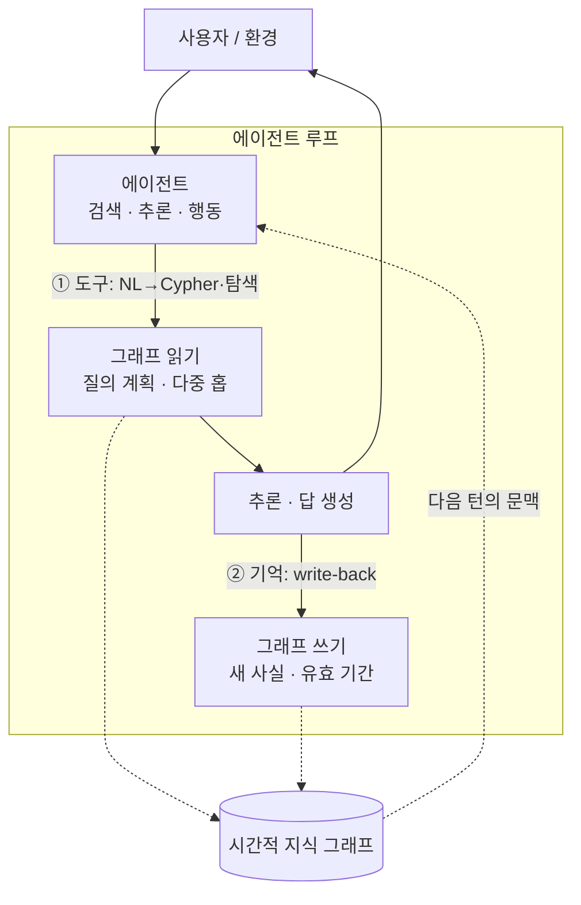
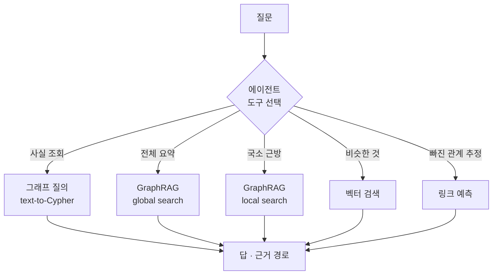

<figure class="post-figure post-figure--header">
<svg role="img" aria-label="가운데 에이전트를 중심으로 지식 그래프와의 두 방향 상호작용을 그린 그림. 에이전트에서 그래프로 향하는 위쪽 화살표는 '도구'로, 자연어를 Cypher 질의로 번역해 그래프를 탐색하는 읽기다. 그래프에서 다시 에이전트를 거쳐 그래프로 돌아오는 아래쪽 점선 화살표는 '기억'으로, 새로 알게 된 사실을 write-back하는 쓰기다. 오른쪽에는 사실에 유효 기간이 붙은 시간축이 있어 시간적 지식 그래프를 나타낸다." viewBox="0 0 680 300" xmlns="http://www.w3.org/2000/svg">
  <title>Agentic Knowledge Graph — 그래프를 도구(읽기)이자 기억(write-back)으로</title>
  <defs>
    <marker id="kg7-sec" viewBox="0 0 10 10" refX="8" refY="5" markerWidth="6" markerHeight="6" orient="auto-start-reverse">
      <path d="M0,0 L10,5 L0,10 z" fill="var(--secondary-color)"/>
    </marker>
    <marker id="kg7-acc" viewBox="0 0 10 10" refX="8" refY="5" markerWidth="6" markerHeight="6" orient="auto-start-reverse">
      <path d="M0,0 L10,5 L0,10 z" fill="var(--accent-color)"/>
    </marker>
  </defs>

  <text x="340" y="24" text-anchor="middle" font-size="15" font-weight="800" fill="currentColor">에이전트 ↔ 그래프 — 도구이자 기억</text>

  <!-- 그래프 (왼쪽) -->
  <rect x="26" y="70" width="190" height="180" rx="8" fill="var(--bg-light)" stroke="var(--gold)" stroke-width="2.2"/>
  <text x="121" y="92" text-anchor="middle" font-size="10.5" font-weight="800" fill="var(--gold)">지식 그래프</text>
  <g stroke="currentColor" stroke-width="1.5" opacity="0.5">
    <line x1="75" y1="130" x2="150" y2="120"/><line x1="150" y1="120" x2="165" y2="195"/>
    <line x1="165" y1="195" x2="80" y2="205"/><line x1="75" y1="130" x2="80" y2="205"/>
  </g>
  <g>
    <circle cx="75" cy="130" r="13" fill="var(--bg-panel)" stroke="currentColor" stroke-width="2"/>
    <circle cx="150" cy="120" r="13" fill="var(--bg-panel)" stroke="var(--gold)" stroke-width="2"/>
    <circle cx="165" cy="195" r="13" fill="var(--bg-panel)" stroke="currentColor" stroke-width="2"/>
    <circle cx="80" cy="205" r="13" fill="var(--bg-panel)" stroke="currentColor" stroke-width="2"/>
    <!-- new node (dashed, from write-back) -->
    <circle cx="120" cy="168" r="12" fill="var(--bg-panel)" stroke="var(--accent-color)" stroke-width="2" stroke-dasharray="3 2"/>
    <text x="120" y="171" text-anchor="middle" font-size="7" font-weight="700" fill="var(--accent-color)">신규</text>
  </g>

  <!-- 에이전트 (가운데) -->
  <rect x="290" y="118" width="100" height="84" rx="8" fill="var(--bg-panel)" stroke="var(--secondary-color)" stroke-width="2.5"/>
  <text x="340" y="150" text-anchor="middle" font-size="12" font-weight="800" fill="var(--secondary-color)">에이전트</text>
  <text x="340" y="168" text-anchor="middle" font-size="7.5" fill="currentColor" opacity="0.72">검색·추론·행동</text>
  <!-- robot antenna -->
  <line x1="340" y1="118" x2="340" y2="106" stroke="var(--secondary-color)" stroke-width="2"/>
  <circle cx="340" cy="103" r="3" fill="var(--secondary-color)"/>

  <!-- 도구: 에이전트 -> 그래프 (읽기) -->
  <path d="M288,140 q-40,-20 -70,-8" fill="none" stroke="var(--secondary-color)" stroke-width="2.2" marker-end="url(#kg7-sec)"/>
  <text x="250" y="112" text-anchor="middle" font-size="8.5" font-weight="800" fill="var(--secondary-color)">도구</text>
  <text x="250" y="124" text-anchor="middle" font-size="6.5" fill="currentColor" opacity="0.7">NL→Cypher·탐색</text>

  <!-- 기억: 에이전트 -> 그래프 (write-back) -->
  <path d="M288,182 q-45,25 -80,20" fill="none" stroke="var(--accent-color)" stroke-width="2.2" stroke-dasharray="5 3" marker-end="url(#kg7-acc)"/>
  <text x="248" y="228" text-anchor="middle" font-size="8.5" font-weight="800" fill="var(--accent-color)">기억</text>
  <text x="248" y="240" text-anchor="middle" font-size="6.5" fill="currentColor" opacity="0.7">write-back</text>

  <!-- 시간축 (오른쪽) — temporal -->
  <rect x="430" y="70" width="224" height="180" rx="8" fill="var(--bg-light)" stroke="var(--accent-color)" stroke-width="2"/>
  <text x="542" y="92" text-anchor="middle" font-size="10.5" font-weight="800" fill="var(--accent-color)">시간적 지식 그래프</text>
  <line x1="450" y1="200" x2="640" y2="200" stroke="currentColor" stroke-width="1.6" opacity="0.5" marker-end="url(#kg7-acc)"/>
  <text x="648" y="203" text-anchor="middle" font-size="7" fill="currentColor" opacity="0.6">t</text>
  <g font-size="7" fill="currentColor">
    <circle cx="480" cy="200" r="4" fill="var(--secondary-color)"/>
    <text x="480" y="188" text-anchor="middle" opacity="0.8">사실 A</text>
    <text x="480" y="218" text-anchor="middle" opacity="0.55">유효…</text>
    <circle cx="545" cy="200" r="4" fill="var(--gold)"/>
    <text x="545" y="188" text-anchor="middle" opacity="0.8">사실 B</text>
    <text x="545" y="218" text-anchor="middle" opacity="0.55">추가</text>
    <circle cx="610" cy="200" r="4" fill="var(--accent-color)"/>
    <text x="610" y="188" text-anchor="middle" opacity="0.8">A 무효화</text>
    <text x="610" y="218" text-anchor="middle" opacity="0.55">갱신</text>
  </g>
  <text x="542" y="242" text-anchor="middle" font-size="7" fill="currentColor" opacity="0.62">사실마다 유효 기간 — 언제부터·언제까지 참이었나</text>
</svg>
<figcaption>Agentic Knowledge Graph를 한 장으로 — 에이전트가 그래프를 <strong>도구</strong>(자연어→Cypher로 탐색하는 읽기)이자 <strong>기억</strong>(새 사실을 write-back하는 쓰기)으로 쓴다. 사실마다 유효 기간이 붙어 시간과 함께 자라는 <strong>시간적 지식 그래프</strong>가 된다.</figcaption>
</figure>

## 들어가며

이 글은 [Agentic Knowledge Graph Curriculum](/2026/07/21/agentic-knowledge-graph-curriculum.html)의 **7단계**이자 이 시리즈의 **심장**입니다. 지금까지 우리는 그래프를 짓고([4단계](/2026/07/21/kg-llm-graph-construction.html)), 검색하고([5단계](/2026/07/21/kg-graphrag.html)), 예측·추론했습니다([6단계](/2026/07/21/kg-embeddings-reasoning.html)). 이 모든 것을 지금까지는 *사람*이 설계한 파이프라인이 수행했습니다. 이제 그 주체를 바꿉니다 — **에이전트가 그래프를 스스로 씁니다.**

"Agentic"이 더하는 것은 두 가지입니다. 첫째, 그래프를 **도구(tool)**로 — 에이전트가 자연어 질문을 Cypher로 번역하거나 그래프 탐색을 *스스로 계획*해 답을 만듭니다. 둘째, 그래프를 **기억(memory)**으로 — 대화·관찰에서 얻은 새 사실을 그래프에 **써 넣어(write-back)** 시간이 지날수록 자라는 그래프를 만듭니다. 읽기 전용이던 그래프가 *읽고 쓰는* 살아있는 기억이 되는 것 — 이것이 Agentic Knowledge Graph의 본질입니다.

<div class="post-summary-box" markdown="1">

### 📌 이 글에서 다루는 내용

- **그래프를 도구로**: text-to-Cypher(자연어→그래프 질의), 질의 계획, 에이전트가 스스로 그래프를 탐색해 답을 만드는 방식과 그 신뢰 문제
- **그래프를 기억으로**: write-back, 시간적 지식 그래프(temporal KG), 사실의 유효 기간·버전·무효화, Graphiti/Zep식 에이전트 메모리
- **에이전트 아키텍처**: 검색–추론–행동 루프, GraphRAG·벡터·그래프 도구의 오케스트레이션, 신뢰와 평가

</div>

## 한눈에 보기 — 도구, 기억, 그리고 루프

에이전트와 그래프의 관계는 두 방향입니다 — 그래프에서 *읽고*(도구), 그래프에 *쓴다*(기억). 이 둘이 검색–추론–행동 루프 안에서 돌며 그래프를 자라게 합니다.



이 그림의 좌표는 하나입니다 — **그래프가 루프의 바깥에 있는 정적 DB가 아니라, 루프 안에서 읽히고 쓰이며 자라는 살아있는 기억**이라는 것. 이 되먹임이 Agentic KG를 이전 단계들과 가릅니다.

## 그래프를 도구로 — 에이전트가 스스로 질의한다

### text-to-Cypher와 질의 계획

가장 직접적인 방식은 에이전트에게 그래프 질의를 **도구**로 쥐여 주는 것입니다. 사용자가 자연어로 물으면, 에이전트가 그래프 스키마를 참고해 **Cypher/SPARQL로 번역(text-to-Cypher)**하고, 실행하고, 결과를 자연어로 답합니다.

```python
# 에이전트 도구로 등록한 그래프 질의 (개념 스니펫)
def graph_query(cypher: str) -> list[dict]:
    """스키마에 맞는 Cypher를 실행해 결과를 반환한다."""
    return neo4j.run(cypher)

# 에이전트: 스키마를 시스템 프롬프트에 싣고, 질문을 Cypher로 번역해 이 도구를 호출
#   Q: "김지수와 3다리 안에 연결된 사람은?"
#   → MATCH (p:Person {name:'김지수'})-[*1..3]-(o:Person) RETURN DISTINCT o.name
```

단순 번역을 넘어, 어려운 질문은 **질의 계획(query planning)**이 필요합니다 — 한 번의 질의로 안 되면 에이전트가 스스로 여러 단계로 쪼개(먼저 개체를 찾고 → 그 이웃을 탐색하고 → 조건으로 거르고), 중간 결과를 보며 다음 질의를 정합니다. [6단계의 다중 홉 추론](/2026/07/21/kg-embeddings-reasoning.html)이 여기서 에이전트의 *능동적 탐색*으로 살아납니다.

<figure class="post-figure">
<svg role="img" aria-label="에이전트가 어려운 자연어 질문 하나를 여러 개의 그래프 질의로 쪼개는 질의 계획을 그린 그림. 위쪽에 자연어 질문 상자가 있고, 그 아래 '질의 계획' 상자가 질문을 세 단계로 분해한다. 1단계는 개체 찾기로 미리내 팀 노드를 매칭하고, 2단계는 그 이웃을 최대 3다리까지 탐색하며, 3단계는 조건으로 걸러 답을 만든다. 각 단계는 중간 결과를 다음 단계로 넘기고, 에이전트는 중간 결과를 보고 다음 질의를 정하는 되먹임 화살표로 이어진다." viewBox="0 0 640 372" xmlns="http://www.w3.org/2000/svg">
  <title>질의 계획 — 어려운 질문 하나를 여러 그래프 질의로 분해</title>
  <defs>
    <marker id="kgqp-cur" viewBox="0 0 10 10" refX="8" refY="5" markerWidth="6" markerHeight="6" orient="auto-start-reverse">
      <path d="M0,0 L10,5 L0,10 z" fill="currentColor"/>
    </marker>
    <marker id="kgqp-acc" viewBox="0 0 10 10" refX="8" refY="5" markerWidth="6" markerHeight="6" orient="auto-start-reverse">
      <path d="M0,0 L10,5 L0,10 z" fill="var(--accent-color)"/>
    </marker>
  </defs>

  <text x="320" y="22" text-anchor="middle" font-size="14" font-weight="800" fill="currentColor">text-to-Cypher 질의 계획 — 쪼개서 탐색한다</text>

  <!-- 질문 -->
  <rect x="70" y="38" width="500" height="46" rx="8" fill="var(--bg-light)" stroke="var(--secondary-color)" stroke-width="2"/>
  <text x="320" y="58" text-anchor="middle" font-size="10.5" font-weight="700" fill="var(--secondary-color)">자연어 질문</text>
  <text x="320" y="74" text-anchor="middle" font-size="9" fill="currentColor" opacity="0.82">"미리내 팀과 3다리 안에 연결되고 ML을 하는 사람은?"</text>

  <line x1="320" y1="84" x2="320" y2="104" stroke="currentColor" stroke-width="2" marker-end="url(#kgqp-cur)"/>

  <!-- 질의 계획 -->
  <rect x="220" y="106" width="200" height="34" rx="8" fill="var(--bg-panel)" stroke="var(--gold)" stroke-width="2.2"/>
  <text x="320" y="127" text-anchor="middle" font-size="10.5" font-weight="800" fill="var(--gold)">질의 계획 (query planning)</text>

  <line x1="320" y1="140" x2="320" y2="158" stroke="currentColor" stroke-width="2" marker-end="url(#kgqp-cur)"/>

  <!-- step 1 -->
  <rect x="120" y="160" width="400" height="44" rx="7" fill="var(--bg-panel)" stroke="currentColor" stroke-width="1.6"/>
  <circle cx="146" cy="182" r="11" fill="var(--gold)"/>
  <text x="146" y="186" text-anchor="middle" font-size="11" font-weight="800" fill="var(--bg-panel)">1</text>
  <text x="170" y="178" font-size="9.5" font-weight="700" fill="currentColor">개체 찾기</text>
  <text x="170" y="194" font-size="8.5" font-family="monospace" fill="currentColor" opacity="0.72">MATCH (t:Team {name:'미리내'})</text>

  <text x="530" y="216" text-anchor="middle" font-size="7" fill="currentColor" opacity="0.6">중간 결과</text>
  <line x1="320" y1="204" x2="320" y2="222" stroke="currentColor" stroke-width="2" marker-end="url(#kgqp-cur)"/>

  <!-- step 2 -->
  <rect x="120" y="224" width="400" height="44" rx="7" fill="var(--bg-panel)" stroke="currentColor" stroke-width="1.6"/>
  <circle cx="146" cy="246" r="11" fill="var(--gold)"/>
  <text x="146" y="250" text-anchor="middle" font-size="11" font-weight="800" fill="var(--bg-panel)">2</text>
  <text x="170" y="242" font-size="9.5" font-weight="700" fill="currentColor">이웃 탐색 (다중 홉)</text>
  <text x="170" y="258" font-size="8.5" font-family="monospace" fill="currentColor" opacity="0.72">MATCH (t)-[*1..3]-(p:Person)</text>

  <line x1="320" y1="268" x2="320" y2="286" stroke="currentColor" stroke-width="2" marker-end="url(#kgqp-cur)"/>

  <!-- step 3 -->
  <rect x="120" y="288" width="400" height="44" rx="7" fill="var(--bg-panel)" stroke="currentColor" stroke-width="1.6"/>
  <circle cx="146" cy="310" r="11" fill="var(--gold)"/>
  <text x="146" y="314" text-anchor="middle" font-size="11" font-weight="800" fill="var(--bg-panel)">3</text>
  <text x="170" y="306" font-size="9.5" font-weight="700" fill="currentColor">조건으로 거르기 → 답</text>
  <text x="170" y="322" font-size="8.5" font-family="monospace" fill="currentColor" opacity="0.72">WHERE p.skill='ML' RETURN p</text>

  <!-- feedback: 중간 결과를 보고 다음 질의 -->
  <path d="M120,246 q-70,-32 0,-64" fill="none" stroke="var(--accent-color)" stroke-width="2" stroke-dasharray="5 3" marker-end="url(#kgqp-acc)"/>
  <path d="M120,310 q-70,-32 0,-64" fill="none" stroke="var(--accent-color)" stroke-width="2" stroke-dasharray="5 3" marker-end="url(#kgqp-acc)"/>
  <text x="40" y="243" text-anchor="middle" font-size="8" font-weight="700" fill="var(--accent-color)">중간</text>
  <text x="40" y="255" text-anchor="middle" font-size="8" font-weight="700" fill="var(--accent-color)">결과로</text>
  <text x="40" y="267" text-anchor="middle" font-size="8" font-weight="700" fill="var(--accent-color)">재계획</text>
</svg>
<figcaption>에이전트는 한 번에 풀 수 없는 질문을 <strong>여러 그래프 질의로 분해</strong>한다 — 개체를 찾고(①), 이웃을 탐색하고(②), 조건으로 거른다(③). 각 단계의 중간 결과를 보고 다음 질의를 다시 계획하는 것이 <strong>질의 계획</strong>이다.</figcaption>
</figure>

### 도구를 여럿 쥐여 주기

실전 에이전트는 그래프 질의 하나만 쓰지 않습니다. [5단계 GraphRAG](/2026/07/21/kg-graphrag.html)의 local/global 검색, 벡터 검색, [6단계의 링크 예측](/2026/07/21/kg-embeddings-reasoning.html)을 각각 **도구**로 쥐고, 질문에 따라 골라 씁니다 — 사실 조회는 그래프 질의로, 전체 요약은 global search로, "비슷한 것"은 벡터로. 이 도구 선택과 조합이 에이전트 설계의 핵심입니다.



여기엔 **신뢰 문제**가 따릅니다. 에이전트가 생성한 Cypher가 틀리거나(스키마 오해), 결과를 잘못 해석할 수 있습니다. 그래서 스키마 검증, 질의 실행 전 확인, 결과에 **근거 경로 제시**(1단계의 설명가능성) 같은 가드레일이 필요합니다.

## 그래프를 기억으로 — write-back과 시간적 KG

Agentic KG의 진짜 도약은 여기입니다. 에이전트가 그래프를 *읽기만* 하는 게 아니라, 대화·관찰에서 얻은 새 사실을 **그래프에 써 넣습니다(write-back)**. 이 순간 그래프는 에이전트의 **장기 기억**이 됩니다.

### 왜 벡터 메모리가 아니라 그래프인가

많은 에이전트가 대화 기록을 벡터로 저장해 기억으로 씁니다. 하지만 벡터 메모리는 [1단계에서 본 한계](/2026/07/21/kg-what-is-knowledge-graph.html)를 그대로 물려받습니다 — 흩어진 사실을 *연결*하지 못하고, "이 사용자에 대해 아는 것을 종합해줘" 같은 질문에 약합니다. 그래프 메모리는 사실을 개체·관계로 구조화해 저장하므로, 사용자·선호·사건이 하나의 연결된 기억으로 자랍니다.

### 시간적 지식 그래프(temporal KG)

기억에는 결정적 요구가 하나 있습니다 — **시간**입니다. "김지수는 A팀 소속"이라는 사실은 *한때* 참이었지만 지금은 아닐 수 있습니다. 단순히 사실을 덮어쓰면 과거가 사라지고, 그냥 쌓기만 하면 모순된 사실이 공존합니다. **시간적 지식 그래프**는 각 사실(엣지)에 **유효 기간**을 붙여 이를 해결합니다.

- **유효 시간(valid time)**: 이 사실이 *현실에서* 언제부터 언제까지 참인가.
- **기록 시간(transaction time)**: 이 사실을 그래프가 *언제* 알게 됐는가. (둘을 함께 다루면 bi-temporal)
- **무효화(invalidation)**: 새 사실이 옛 사실과 모순되면, 옛 사실을 지우는 대신 "여기까지 유효"로 닫고 새 사실을 엽니다.

이 접근이 실무 에이전트 메모리 프레임워크의 뼈대입니다 — 예를 들어 **Graphiti**(Zep의 오픈소스 엔진)는 대화·이벤트에서 사실을 추출해 bi-temporal 그래프로 쌓고, 모순되는 사실을 무효화하며 시간을 관통하는 질의("*그때* 김지수는 어느 팀이었나?")에 답합니다. 사실을 지우지 않고 *시간에 걸쳐 축적*하기에, 에이전트가 "언제부터 이 선호가 바뀌었지?" 같은 질문에도 답할 수 있습니다.

```text
# 사실이 시간에 걸쳐 무효화·갱신되는 모습 (개념)
(김지수)-[:소속 {valid_from:2024-01, valid_to:2025-06}]->(A팀)   # 닫힘
(김지수)-[:소속 {valid_from:2025-06, valid_to:null    }]->(B팀)   # 현재 유효
```

<figure class="post-figure">
<svg role="img" aria-label="시간적 지식 그래프에서 사실이 무효화되고 새 사실이 열리는 모습을 시간축 위에 그린 그림. 왼쪽에 김지수 개체가 있고 오른쪽으로 시간축이 흐른다. 위쪽 막대는 '김지수 소속 A팀' 사실로 2024년 1월에 시작해 2025년 6월에 valid_to가 닫혀 무효화된다. 아래쪽 막대는 '김지수 소속 B팀' 사실로 2025년 6월에 시작해 valid_to가 null인 채 현재까지 열려 유효하다. 옛 사실을 지우지 않고 유효 기간을 닫아 과거를 보존하는 것이 핵심이다." viewBox="0 0 660 300" xmlns="http://www.w3.org/2000/svg">
  <title>시간적 지식 그래프 — 사실을 지우지 않고 유효 기간을 닫아 무효화</title>
  <defs>
    <marker id="kgt-open" viewBox="0 0 10 10" refX="8" refY="5" markerWidth="6" markerHeight="6" orient="auto-start-reverse">
      <path d="M0,0 L10,5 L0,10 z" fill="var(--accent-color)"/>
    </marker>
  </defs>

  <text x="330" y="24" text-anchor="middle" font-size="14" font-weight="800" fill="currentColor">사실은 덮어쓰지 않는다 — 유효 기간을 닫고 새로 연다</text>

  <!-- 김지수 개체 -->
  <circle cx="70" cy="150" r="30" fill="var(--bg-panel)" stroke="var(--secondary-color)" stroke-width="2.5"/>
  <text x="70" y="154" text-anchor="middle" font-size="11" font-weight="800" fill="var(--secondary-color)">김지수</text>

  <!-- 시간축 -->
  <line x1="130" y1="250" x2="640" y2="250" stroke="currentColor" stroke-width="1.6" opacity="0.55"/>
  <text x="648" y="253" text-anchor="middle" font-size="8" fill="currentColor" opacity="0.6">t</text>
  <g font-size="8.5" fill="currentColor" opacity="0.72">
    <line x1="180" y1="244" x2="180" y2="256" stroke="currentColor" stroke-width="1.4"/>
    <text x="180" y="270" text-anchor="middle">2024-01</text>
    <line x1="400" y1="244" x2="400" y2="256" stroke="currentColor" stroke-width="1.4"/>
    <text x="400" y="270" text-anchor="middle">2025-06</text>
    <line x1="600" y1="244" x2="600" y2="256" stroke="currentColor" stroke-width="1.4"/>
    <text x="600" y="270" text-anchor="middle">현재</text>
  </g>

  <!-- 사실 A: 소속 A팀 (닫힘) -->
  <rect x="180" y="86" width="220" height="40" rx="7" fill="var(--bg-light)" stroke="currentColor" stroke-width="1.8" opacity="0.85"/>
  <text x="290" y="104" text-anchor="middle" font-size="10" font-weight="700" fill="currentColor">:소속 → A팀</text>
  <text x="290" y="118" text-anchor="middle" font-size="8" font-family="monospace" fill="currentColor" opacity="0.72">valid_from 2024-01 · valid_to 2025-06</text>
  <!-- 닫힘 표식 -->
  <g stroke="var(--secondary-color)" stroke-width="2.4">
    <line x1="392" y1="98" x2="408" y2="114"/><line x1="408" y1="98" x2="392" y2="114"/>
  </g>
  <text x="400" y="80" text-anchor="middle" font-size="8.5" font-weight="800" fill="var(--secondary-color)">valid_to 닫힘 (무효화)</text>
  <line x1="180" y1="132" x2="180" y2="244" stroke="currentColor" stroke-width="1" stroke-dasharray="3 3" opacity="0.4"/>
  <line x1="400" y1="132" x2="400" y2="244" stroke="currentColor" stroke-width="1" stroke-dasharray="3 3" opacity="0.4"/>

  <!-- 사실 B: 소속 B팀 (현재 유효, 열림) -->
  <rect x="400" y="160" width="200" height="40" rx="7" fill="var(--bg-light)" stroke="var(--accent-color)" stroke-width="2"/>
  <text x="500" y="178" text-anchor="middle" font-size="10" font-weight="700" fill="var(--accent-color)">:소속 → B팀</text>
  <text x="500" y="192" text-anchor="middle" font-size="8" font-family="monospace" fill="currentColor" opacity="0.75">valid_from 2025-06 · valid_to null</text>
  <line x1="600" y1="180" x2="632" y2="180" stroke="var(--accent-color)" stroke-width="2" marker-end="url(#kgt-open)"/>
  <text x="500" y="150" text-anchor="middle" font-size="8.5" font-weight="800" fill="var(--accent-color)">현재 유효 (열림)</text>
  <line x1="600" y1="200" x2="600" y2="244" stroke="var(--accent-color)" stroke-width="1" stroke-dasharray="3 3" opacity="0.5"/>

  <!-- 개체에서 두 사실로 -->
  <path d="M98,138 q40,-30 82,-40" fill="none" stroke="currentColor" stroke-width="1.4" opacity="0.5"/>
  <path d="M98,162 q160,30 302,10" fill="none" stroke="var(--accent-color)" stroke-width="1.4" opacity="0.6" stroke-dasharray="4 3"/>

  <text x="330" y="292" text-anchor="middle" font-size="8" fill="currentColor" opacity="0.62">과거 사실을 지우지 않아 "그때 김지수는 어느 팀?" 같은 시간 관통 질의에 답할 수 있다</text>
</svg>
<figcaption>시간적 지식 그래프의 무효화 — "김지수 소속 A팀"을 <strong>지우는 대신</strong> <code>valid_to</code>를 2025-06으로 <strong>닫고</strong>, "소속 B팀"을 <code>valid_to: null</code>로 <strong>새로 연다</strong>. 과거가 보존되므로 <em>그때</em>의 사실도 질의할 수 있다.</figcaption>
</figure>

## 에이전트 아키텍처 — 검색·추론·행동 루프

이 모두를 하나로 묶으면 **검색–추론–행동 루프**가 됩니다.

1. **검색(retrieve)**: 그래프 도구·GraphRAG·벡터로 관련 사실을 모읍니다.
2. **추론(reason)**: 모은 사실로 답을 만들거나 다음 행동을 정합니다. 필요하면 질의를 다시 계획합니다.
3. **행동(act)**: 사용자에게 답하고, 새로 알게 된 사실을 그래프에 **write-back**합니다.

이 루프가 돌 때마다 그래프가 자라고, 자란 그래프가 다음 턴의 문맥이 됩니다. 대표 응용은 분명합니다 — **개인 어시스턴트**(대화가 쌓여 자라는 장기 기억), **리서치 에이전트**(도메인 지식 그래프 위를 걸으며 근거를 추적하고 발견을 기록), **고객지원 에이전트**(고객·이력·제품 그래프를 읽고 상호작용을 되써 넣기).

관통하는 과제는 **신뢰와 평가**입니다. 에이전트가 그래프에 *쓰는* 순간, [4단계의 검증·휴먼인더루프](/2026/07/21/kg-llm-graph-construction.html) 원칙이 다시 결정적이 됩니다 — 잘못 써 넣은 사실은 미래의 모든 답을 오염시키기 때문입니다. write-back에 신뢰도·출처를 남기고, 중요한 갱신은 검수하고, 에이전트의 답을 근거 경로로 평가하는 것이 프로덕션의 필수 조건입니다.

## 정리

- **Agentic KG는 그래프의 주체를 에이전트로 바꿉니다**: 사람이 짠 파이프라인이 아니라, 에이전트가 그래프를 스스로 읽고 씁니다.
- **그래프를 도구로**: text-to-Cypher와 질의 계획으로 에이전트가 능동적으로 탐색하고, GraphRAG·벡터·예측을 도구로 골라 씁니다 — 신뢰 가드레일이 필수입니다.
- **그래프를 기억으로**: write-back으로 새 사실을 축적하고, 시간적 지식 그래프가 유효 기간·무효화로 시간을 다룹니다. 벡터 메모리가 못 하는 *연결된 기억*이 여기서 생깁니다.
- **검색–추론–행동 루프**가 이 모두를 묶어 그래프를 자라게 합니다. 쓰는 순간 검증·휴먼인더루프가 다시 결정적이 됩니다 — 잘못 쓴 사실은 미래를 오염시킵니다.

다음 글에서는 1~7단계를 하나로 꿰어 **end-to-end로 직접 구축**하고, 헬스케어·금융·보안 등 **도메인별 활용 사례**를 집대성합니다.

### 다음 학습 (Next Learning)

- [8단계 · 직접 구축 + 도메인별 활용 사례](/2026/07/21/kg-build-and-domain-use-cases.html) — 배운 모두를 end-to-end로 꿰고 도메인으로 넓히기
- [6단계 · 그래프 임베딩·추론](/2026/07/21/kg-embeddings-reasoning.html) — 에이전트가 도구로 쓰는 예측·추론으로 돌아가기
- [4단계 · LLM 기반 그래프 구축](/2026/07/21/kg-llm-graph-construction.html) — write-back에서 다시 결정적이 되는 검증·휴먼인더루프
