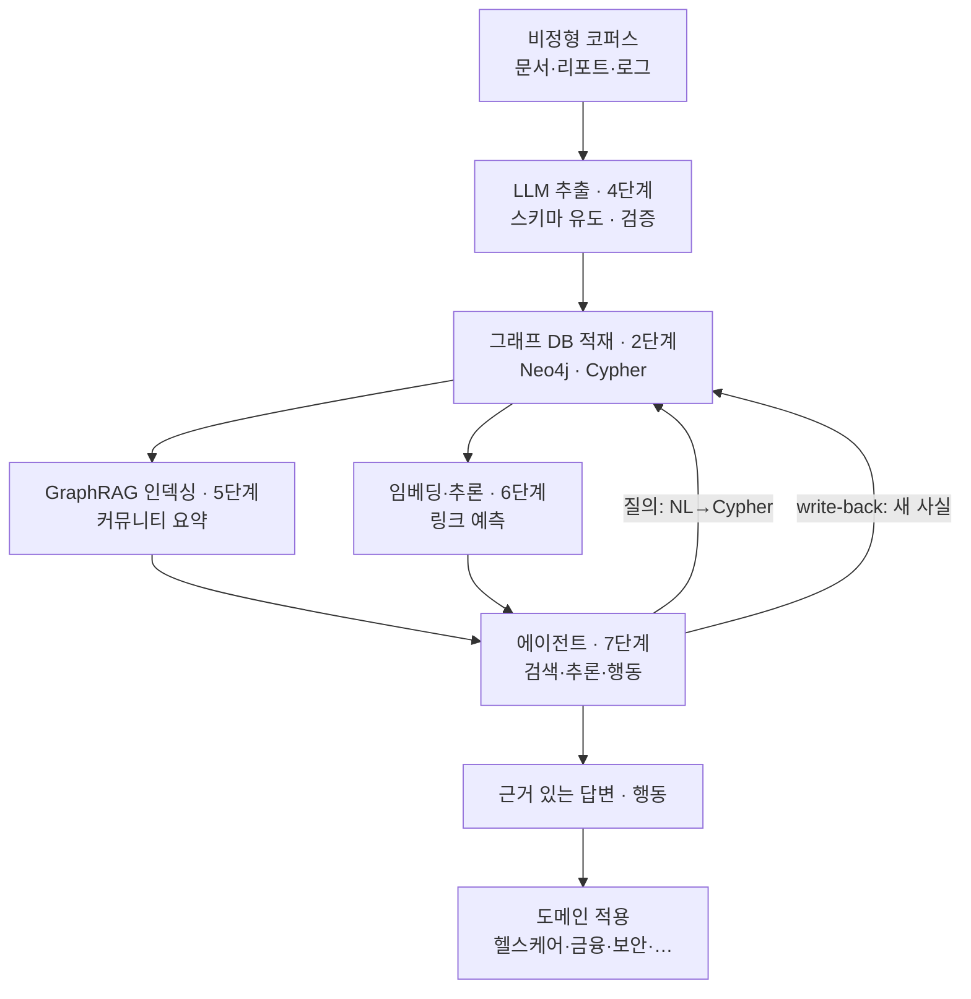

<figure class="post-figure post-figure--header">
<svg role="img" aria-label="Agentic Knowledge Graph의 end-to-end 파이프라인과 도메인 부챗살을 그린 그림. 왼쪽에서 오른쪽으로 코퍼스, LLM 추출, 그래프 DB, GraphRAG와 추론, 에이전트가 순서대로 이어지고, 에이전트에서 그래프 DB로 되돌아오는 점선은 write-back이다. 맨 오른쪽 에이전트에서 헬스케어·금융·보안·엔터프라이즈·추천·법률·개인메모리 일곱 도메인으로 부챗살처럼 갈라진다." viewBox="0 0 680 320" xmlns="http://www.w3.org/2000/svg">
  <title>end-to-end 파이프라인과 도메인 부챗살 — 코퍼스에서 에이전트까지, 그리고 일곱 도메인</title>
  <defs>
    <marker id="kg8-arw" viewBox="0 0 10 10" refX="8" refY="5" markerWidth="6" markerHeight="6" orient="auto-start-reverse">
      <path d="M0,0 L10,5 L0,10 z" fill="var(--secondary-color)"/>
    </marker>
    <marker id="kg8-acc" viewBox="0 0 10 10" refX="8" refY="5" markerWidth="6" markerHeight="6" orient="auto-start-reverse">
      <path d="M0,0 L10,5 L0,10 z" fill="var(--accent-color)"/>
    </marker>
    <marker id="kg8-gold" viewBox="0 0 10 10" refX="8" refY="5" markerWidth="6" markerHeight="6" orient="auto-start-reverse">
      <path d="M0,0 L10,5 L0,10 z" fill="var(--gold)"/>
    </marker>
  </defs>

  <text x="340" y="24" text-anchor="middle" font-size="15" font-weight="800" fill="currentColor">코퍼스에서 에이전트로, 그리고 도메인으로</text>

  <!-- 파이프라인 5박스 -->
  <g font-size="8.5" font-weight="700" text-anchor="middle">
    <rect x="24" y="120" width="96" height="46" rx="5" fill="var(--bg-light)" stroke="currentColor" stroke-width="1.8"/>
    <text x="72" y="140" fill="currentColor">코퍼스</text>
    <text x="72" y="154" font-size="6.5" font-weight="400" fill="currentColor" opacity="0.65">문서·리포트·로그</text>

    <rect x="140" y="120" width="96" height="46" rx="5" fill="var(--bg-panel)" stroke="var(--secondary-color)" stroke-width="2"/>
    <text x="188" y="140" fill="var(--secondary-color)">LLM 추출</text>
    <text x="188" y="154" font-size="6.5" font-weight="400" fill="currentColor" opacity="0.65">4단계</text>

    <rect x="256" y="120" width="96" height="46" rx="5" fill="var(--bg-panel)" stroke="currentColor" stroke-width="1.8"/>
    <text x="304" y="140" fill="currentColor">그래프 DB</text>
    <text x="304" y="154" font-size="6.5" font-weight="400" fill="currentColor" opacity="0.65">2단계</text>

    <rect x="372" y="120" width="96" height="46" rx="5" fill="var(--bg-panel)" stroke="var(--accent-color)" stroke-width="2"/>
    <text x="420" y="137" fill="var(--accent-color)">GraphRAG</text>
    <text x="420" y="150" fill="var(--accent-color)">·추론</text>
    <text x="420" y="161" font-size="6.5" font-weight="400" fill="currentColor" opacity="0.65">5·6단계</text>

    <rect x="488" y="120" width="96" height="46" rx="5" fill="var(--bg-panel)" stroke="var(--gold)" stroke-width="2.4"/>
    <text x="536" y="140" fill="var(--gold)">에이전트</text>
    <text x="536" y="154" font-size="6.5" font-weight="400" fill="currentColor" opacity="0.65">7단계</text>
  </g>
  <g stroke="var(--secondary-color)" stroke-width="2">
    <line x1="122" y1="143" x2="138" y2="143" marker-end="url(#kg8-arw)"/>
    <line x1="238" y1="143" x2="254" y2="143" marker-end="url(#kg8-arw)"/>
    <line x1="354" y1="143" x2="370" y2="143" marker-end="url(#kg8-arw)"/>
    <line x1="470" y1="143" x2="486" y2="143" marker-end="url(#kg8-arw)"/>
  </g>
  <!-- write-back loop -->
  <path d="M488,160 q-92,42 -184,6" fill="none" stroke="var(--accent-color)" stroke-width="1.8" stroke-dasharray="5 3" marker-end="url(#kg8-acc)"/>
  <text x="396" y="200" text-anchor="middle" font-size="8" font-weight="700" fill="var(--accent-color)">write-back — 새 사실이 그래프로</text>

  <!-- 도메인 부챗살 -->
  <g stroke="var(--gold)" stroke-width="1.6" opacity="0.75">
    <line x1="584" y1="143" x2="628" y2="60" marker-end="url(#kg8-gold)"/>
    <line x1="584" y1="143" x2="640" y2="92" marker-end="url(#kg8-gold)"/>
    <line x1="584" y1="143" x2="646" y2="130" marker-end="url(#kg8-gold)"/>
    <line x1="584" y1="150" x2="646" y2="172" marker-end="url(#kg8-gold)"/>
    <line x1="584" y1="158" x2="640" y2="210" marker-end="url(#kg8-gold)"/>
    <line x1="560" y1="168" x2="612" y2="240" marker-end="url(#kg8-gold)"/>
    <line x1="536" y1="168" x2="548" y2="248" marker-end="url(#kg8-gold)"/>
  </g>
  <g font-size="7.5" font-weight="700" fill="currentColor">
    <text x="632" y="58">헬스케어</text>
    <text x="644" y="92">금융</text>
    <text x="650" y="132">보안</text>
    <text x="650" y="175">엔터프라이즈</text>
    <text x="644" y="213">추천</text>
    <text x="614" y="252">법률</text>
    <text x="512" y="264">개인 메모리</text>
  </g>

  <line x1="24" y1="284" x2="656" y2="284" stroke="currentColor" stroke-width="1.2" opacity="0.2"/>
  <text x="340" y="304" text-anchor="middle" font-size="9.5" font-weight="700" fill="currentColor" opacity="0.72">아키텍처는 하나, 변주는 도메인마다 — 스키마와 질문만 다를 뿐</text>
</svg>
<figcaption>이 시리즈를 한 장으로 닫으며 — <strong>코퍼스 → LLM 추출 → 그래프 DB → GraphRAG·추론 → 에이전트</strong>의 뼈대에 write-back 고리가 걸리고, 그 끝에서 헬스케어·금융·보안·엔터프라이즈·추천·법률·개인 메모리 일곱 도메인으로 갈라진다. 뼈대는 같고, 변주는 스키마와 질문뿐이다.</figcaption>
</figure>

## 들어가며

이 글은 [Agentic Knowledge Graph Curriculum](/2026/07/21/agentic-knowledge-graph-curriculum.html)의 **8단계**이자 시리즈의 **피날레**입니다. 1~7단계에서 우리는 조각들을 하나씩 벼렸습니다 — 왜 그래프인지([1](/2026/07/21/kg-what-is-knowledge-graph.html)), 어떻게 저장·질의하는지([2](/2026/07/21/kg-graph-databases-cypher-sparql.html)), 어떻게 짓는지([3](/2026/07/21/kg-construction-entity-relation-extraction.html)·[4](/2026/07/21/kg-llm-graph-construction.html)), 어떻게 검색·추론하는지([5](/2026/07/21/kg-graphrag.html)·[6](/2026/07/21/kg-embeddings-reasoning.html)), 어떻게 에이전트의 도구·기억이 되는지([7](/2026/07/21/kg-agentic-knowledge-graph.html)). 이 글은 그 조각들을 **하나의 파이프라인으로 꿰고**, 그것이 각 도메인에서 어떻게 변주되는지 집대성합니다.

핵심 메시지는 하나입니다 — **아키텍처는 하나, 변주는 도메인마다.** 코퍼스에서 시작해 에이전트로 끝나는 뼈대는 헬스케어든 금융이든 같고, 달라지는 것은 그 위에 얹는 스키마와 던지는 질문뿐입니다. 하나를 제대로 지으면 나머지가 보입니다.

<div class="post-summary-box" markdown="1">

### 📌 이 글에서 다루는 내용

- **end-to-end 구축**: 코퍼스→LLM 추출→그래프 적재→GraphRAG·추론→에이전트 write-back으로 이어지는 파이프라인을 개념과 핵심 코드 스니펫으로 조립, 단계별 함정
- **도메인별 활용 사례 집대성**: 헬스케어·금융·보안·엔터프라이즈·추천·법률·개인 메모리 — 각 도메인의 스키마·질문·아키텍처 변주
- **한계·운영·다음 단계**: 확장성·최신성·환각·거버넌스, 프로덕션으로 가는 체크리스트

</div>

## 한눈에 보기 — 하나로 꿴 파이프라인

시리즈 전체를 하나의 그림으로 닫습니다. 각 단계가 파이프라인의 한 칸을 맡고, write-back 고리가 그래프를 살아있게 합니다.



이 그림의 좌표는 하나입니다 — **모든 단계가 그래프(LOAD)를 중심으로 돌고, 에이전트가 그것을 읽고 쓰며 살아있게 한다**는 것. 이것이 이 시리즈가 8단계에 걸쳐 세운 그림의 전부입니다.

## end-to-end 구축 — 코퍼스에서 에이전트까지

개념 코드로 파이프라인을 조립해 봅니다. 각 스니펫은 앞 단계들에서 익힌 것의 요점입니다.

### ① 코퍼스 → 트리플 (4단계)

스키마를 제약한 LLM 추출로 문서에서 그래프 문서를 뽑습니다.

```python
from langchain_experimental.graph_transformers import LLMGraphTransformer

transformer = LLMGraphTransformer(
    llm=llm,
    allowed_nodes=["환자", "질환", "약물", "검사"],       # 도메인 스키마 (여기선 헬스케어)
    allowed_relationships=["진단", "처방", "부작용"],
    strict_mode=True,
)
graph_docs = transformer.convert_to_graph_documents(documents)
```

> **함정** — 청크 경계에서 사실이 잘리면 관계가 소실됩니다. 청킹은 문맥을 넉넉히, 그리고 각 트리플에 출처 근거를 함께 뽑아 검증에 대비합니다.

### ② 트리플 → 그래프 DB (2단계)

추출·검증·엔티티 해소를 거친 트리플을 그래프 DB에 적재합니다.

```python
neo4j_graph.add_graph_documents(graph_docs)   # 엔티티 해소로 같은 개체는 병합

# 제약으로 무결성 확보 (3단계의 기본키)
# CREATE CONSTRAINT patient_id IF NOT EXISTS
# FOR (p:환자) REQUIRE p.id IS UNIQUE;
```

> **함정** — 여기서 [엔티티 해소](/2026/07/21/kg-construction-entity-relation-extraction.html)를 건너뛰면 같은 환자가 여러 노드로 쪼개져 다중 홉 질의가 끊깁니다.

### ③ 그래프 → 에이전트 도구 (5·6·7단계)

GraphRAG 검색과 그래프 질의를 에이전트 도구로 등록하고, write-back까지 엮습니다.

```python
tools = [
    graph_query,          # NL→Cypher 탐색 (7단계)
    graphrag_local,       # 개체 이웃 검색 (5단계)
    graphrag_global,      # 커뮤니티 요약 종합 (5단계)
    predict_link,         # 링크 예측 (6단계)
]

def remember(fact: dict):
    """새로 확인된 사실을 유효 기간과 함께 write-back (7단계)."""
    neo4j.run(
        "MERGE (a {id:$s})-[r:REL {type:$t, valid_from:$now}]->(b {id:$o})",
        **fact,
    )

agent = build_agent(llm, tools=tools + [remember])
```

> **함정** — write-back에 신뢰도·출처를 남기지 않으면, 잘못 써 넣은 한 사실이 이후 모든 답을 오염시킵니다. 중요한 갱신엔 [휴먼인더루프](/2026/07/21/kg-llm-graph-construction.html)를 둡니다.

이 세 조각이 [한눈에 보기](#한눈에-보기--하나로-꿴-파이프라인)의 그림을 코드로 옮긴 것입니다. 도메인이 바뀌어도 이 뼈대는 그대로이고, `allowed_nodes`/`allowed_relationships`의 스키마와 에이전트가 답하는 질문만 달라집니다.

<figure class="post-figure">
<svg role="img" aria-label="같은 파이프라인 뼈대에 두 도메인을 얹은 그림. 가운데에 코퍼스, LLM 추출, 그래프 DB, GraphRAG와 추론, 에이전트 다섯 칸의 뼈대가 있고, 뼈대는 두 도메인에서 똑같다. 위쪽 헬스케어는 LLM 추출 칸에 '환자·약물·질환' 스키마를, 에이전트 칸에 '약물 재창출 후보?' 질문을 얹는다. 아래쪽 금융은 같은 두 칸에 '계좌·거래·법인' 스키마와 '자금세탁 고리?' 질문을 얹는다. 바뀌는 것은 스키마와 질문뿐, 뼈대는 그대로다." viewBox="0 0 660 340" xmlns="http://www.w3.org/2000/svg">
  <title>하나의 뼈대, 두 도메인의 변주 — 스키마와 질문만 갈아 끼운다</title>
  <defs>
    <marker id="kg8a-hc" viewBox="0 0 10 10" refX="8" refY="5" markerWidth="6" markerHeight="6" orient="auto"><path d="M0,0 L10,5 L0,10 z" fill="var(--secondary-color)"/></marker>
    <marker id="kg8a-fi" viewBox="0 0 10 10" refX="8" refY="5" markerWidth="6" markerHeight="6" orient="auto"><path d="M0,0 L10,5 L0,10 z" fill="var(--accent-color)"/></marker>
    <marker id="kg8a-sk" viewBox="0 0 10 10" refX="8" refY="5" markerWidth="6" markerHeight="6" orient="auto"><path d="M0,0 L10,5 L0,10 z" fill="currentColor"/></marker>
  </defs>

  <!-- 헬스케어 (위) -->
  <text x="30" y="30" font-size="10" font-weight="800" fill="var(--secondary-color)">헬스케어</text>
  <g font-size="7">
    <rect x="126" y="40" width="136" height="30" rx="5" fill="var(--bg-light)" stroke="var(--secondary-color)" stroke-width="1.6"/>
    <text x="194" y="53" text-anchor="middle" font-size="6" font-weight="700" fill="var(--secondary-color)" opacity="0.8">스키마</text>
    <text x="194" y="64" text-anchor="middle" font-weight="700" fill="currentColor">환자·약물·질환 / 진단·처방</text>
    <rect x="466" y="40" width="154" height="30" rx="5" fill="var(--bg-light)" stroke="var(--secondary-color)" stroke-width="1.6"/>
    <text x="543" y="53" text-anchor="middle" font-size="6" font-weight="700" fill="var(--secondary-color)" opacity="0.8">질문</text>
    <text x="543" y="64" text-anchor="middle" font-weight="700" fill="currentColor">약물 재창출 후보?</text>
  </g>
  <g stroke="var(--secondary-color)" stroke-width="1.5" stroke-dasharray="4 3">
    <line x1="194" y1="70" x2="194" y2="150" marker-end="url(#kg8a-hc)"/>
    <line x1="543" y1="70" x2="543" y2="150" marker-end="url(#kg8a-hc)"/>
  </g>

  <!-- 뼈대 (가운데) -->
  <text x="330" y="147" text-anchor="middle" font-size="7.5" font-weight="700" fill="currentColor" opacity="0.6">— 같은 뼈대 —</text>
  <g font-size="8" font-weight="700" text-anchor="middle">
    <rect x="30" y="152" width="96" height="46" rx="5" fill="var(--bg-panel)" stroke="currentColor" stroke-width="1.6"/>
    <text x="78" y="179" fill="currentColor">코퍼스</text>
    <rect x="146" y="152" width="96" height="46" rx="5" fill="var(--bg-panel)" stroke="var(--gold)" stroke-width="2.4"/>
    <text x="194" y="176" fill="currentColor">LLM 추출</text>
    <text x="194" y="188" font-size="6" font-weight="400" fill="var(--gold)">← 스키마 주입</text>
    <rect x="262" y="152" width="96" height="46" rx="5" fill="var(--bg-panel)" stroke="currentColor" stroke-width="1.6"/>
    <text x="310" y="179" fill="currentColor">그래프 DB</text>
    <rect x="378" y="152" width="96" height="46" rx="5" fill="var(--bg-panel)" stroke="currentColor" stroke-width="1.6"/>
    <text x="426" y="179" fill="currentColor">GraphRAG·추론</text>
    <rect x="494" y="152" width="96" height="46" rx="5" fill="var(--bg-panel)" stroke="var(--gold)" stroke-width="2.4"/>
    <text x="542" y="176" fill="currentColor">에이전트</text>
    <text x="542" y="188" font-size="6" font-weight="400" fill="var(--gold)">← 질문 주입</text>
  </g>
  <g stroke="currentColor" stroke-width="1.6" opacity="0.75">
    <line x1="126" y1="175" x2="142" y2="175" marker-end="url(#kg8a-sk)"/>
    <line x1="242" y1="175" x2="258" y2="175" marker-end="url(#kg8a-sk)"/>
    <line x1="358" y1="175" x2="374" y2="175" marker-end="url(#kg8a-sk)"/>
    <line x1="474" y1="175" x2="490" y2="175" marker-end="url(#kg8a-sk)"/>
  </g>

  <!-- 금융 (아래) -->
  <g stroke="var(--accent-color)" stroke-width="1.5" stroke-dasharray="4 3">
    <line x1="194" y1="200" x2="194" y2="268" marker-end="url(#kg8a-fi)"/>
    <line x1="543" y1="200" x2="543" y2="268" marker-end="url(#kg8a-fi)"/>
  </g>
  <g font-size="7">
    <rect x="126" y="270" width="136" height="30" rx="5" fill="var(--bg-light)" stroke="var(--accent-color)" stroke-width="1.6"/>
    <text x="194" y="283" text-anchor="middle" font-size="6" font-weight="700" fill="var(--accent-color)" opacity="0.85">스키마</text>
    <text x="194" y="294" text-anchor="middle" font-weight="700" fill="currentColor">계좌·거래·법인 / 이체·소유</text>
    <rect x="466" y="270" width="154" height="30" rx="5" fill="var(--bg-light)" stroke="var(--accent-color)" stroke-width="1.6"/>
    <text x="543" y="283" text-anchor="middle" font-size="6" font-weight="700" fill="var(--accent-color)" opacity="0.85">질문</text>
    <text x="543" y="294" text-anchor="middle" font-weight="700" fill="currentColor">자금세탁 고리?</text>
  </g>
  <text x="30" y="290" font-size="10" font-weight="800" fill="var(--accent-color)">금융</text>

  <text x="330" y="326" text-anchor="middle" font-size="9" font-weight="700" fill="currentColor" opacity="0.7">뼈대는 그대로 — 갈아 끼우는 건 두 칸, 스키마와 질문뿐</text>
</svg>
<figcaption>같은 다섯 칸 뼈대에 헬스케어와 금융을 얹은 모습. 바뀌는 것은 <strong>LLM 추출에 넣는 스키마</strong>와 <strong>에이전트에게 던지는 질문</strong> 두 칸뿐이고, 나머지는 그대로다.</figcaption>
</figure>

## 도메인별 활용 사례 집대성

이제 각 단계에서 예고한 사례들을 한자리에 모읍니다. 모두 위 파이프라인의 변주 — **스키마와 질문만 다를 뿐**임을 눈여겨보세요.

| 도메인 | 스키마(노드·관계) | 대표 질문 / 에이전트 행동 | 특히 중요한 단계 |
| --- | --- | --- | --- |
| **헬스케어·바이오** | 약물·질환·유전자·논문 / 진단·처방·상호작용 | 약물 재창출 후보 예측, 환자 360° 그래프, 근거 추적 리서치 에이전트 | 6(링크 예측)·4(검증) |
| **금융** | 계좌·거래·법인 / 이체·소유·지배 | 자금세탁 고리·위장 계좌 탐지, 리스크 전파, 제재 대상 엔티티 해소 | 1(다중 홉)·3(엔티티 해소) |
| **사이버보안** | 자산·취약점·공격·행위자 / 노출·악용·연관 | 공격 경로 추론, 위협 인텔리전스 그래프, 침해 조사 에이전트 | 6(경로 추론)·7(에이전트) |
| **엔터프라이즈 지식·고객지원** | 문서·티켓·제품·팀 / 참조·해결·소속 | 근거 있는 사내 Q&A, 온보딩·지원 에이전트 | 5(GraphRAG)·7 |
| **추천·이커머스** | 사용자·상품·속성 / 구매·조회·유사 | 설명 가능한 추천, 함께 사는 상품, 경로 기반 근거 | 6(링크 예측)·1 |
| **법률·컴플라이언스** | 계약·조항·판례·규정 / 인용·상충·적용 | 다중 홉 근거 추적, 컴플라이언스 점검 에이전트 | 5·7·4(검증) |
| **개인·에이전트 메모리** | 사용자·선호·사건·사람 / 언급·선호·관계 | 시간에 걸쳐 자라는 장기 기억, "언제부터 바뀌었지?" | 7(temporal KG) |

두 가지가 보입니다. 첫째, **금융·헬스케어처럼 잘못이 규제·안전으로 직결되는 도메인일수록 엔티티 해소와 검증(3·4단계)의 무게가 큽니다.** 둘째, **연결·종합이 본질인 도메인(지식 Q&A·법률)은 GraphRAG(5단계)가, 예측이 본질인 도메인(추천·신약)은 임베딩·추론(6단계)이, 시간이 본질인 도메인(개인 메모리)은 temporal KG(7단계)가** 무게중심입니다. 같은 뼈대 위에서 어느 단계에 힘을 싣느냐가 도메인을 가릅니다.

<figure class="post-figure">
<svg role="img" aria-label="도메인별 무게중심 지도. 같은 파이프라인이지만 도메인마다 힘을 싣는 단계가 다르다. 3·4단계 검증·엔티티 해소에 힘을 싣는 규제·안전 도메인은 금융과 헬스케어. 5단계 GraphRAG에 힘을 싣는 연결·종합 도메인은 엔터프라이즈 Q&A와 법률. 6단계 임베딩·추론에 힘을 싣는 예측 도메인은 추천과 신약 후보. 7단계 temporal KG에 힘을 싣는 시간 도메인은 개인 메모리." viewBox="0 0 660 300" xmlns="http://www.w3.org/2000/svg">
  <title>도메인별 무게중심 지도 — 같은 뼈대, 다른 힘점</title>

  <text x="330" y="26" text-anchor="middle" font-size="13" font-weight="800" fill="currentColor">무게중심 지도 — 같은 뼈대, 다른 힘점</text>

  <!-- 패널 1 : 3·4단계 검증 -->
  <g>
    <rect x="20" y="52" width="148" height="216" rx="7" fill="var(--bg-panel)" stroke="var(--accent-color)" stroke-width="1.8"/>
    <rect x="54" y="64" width="80" height="22" rx="4" fill="var(--bg-light)" stroke="var(--accent-color)" stroke-width="1.4"/>
    <text x="94" y="79" text-anchor="middle" font-size="9" font-weight="800" fill="var(--accent-color)">3·4단계</text>
    <text x="94" y="108" text-anchor="middle" font-size="8.5" font-weight="700" fill="currentColor">검증·엔티티 해소</text>
    <text x="94" y="126" text-anchor="middle" font-size="9" font-weight="800" fill="var(--accent-color)">규제·안전</text>
    <rect x="34" y="146" width="120" height="26" rx="5" fill="var(--bg-light)" stroke="currentColor" stroke-width="1.2" opacity="0.9"/>
    <text x="94" y="163" text-anchor="middle" font-size="8.5" font-weight="700" fill="currentColor">금융</text>
    <rect x="34" y="180" width="120" height="26" rx="5" fill="var(--bg-light)" stroke="currentColor" stroke-width="1.2" opacity="0.9"/>
    <text x="94" y="197" text-anchor="middle" font-size="8.5" font-weight="700" fill="currentColor">헬스케어</text>
  </g>

  <!-- 패널 2 : 5단계 GraphRAG -->
  <g>
    <rect x="184" y="52" width="148" height="216" rx="7" fill="var(--bg-panel)" stroke="var(--secondary-color)" stroke-width="1.8"/>
    <rect x="222" y="64" width="72" height="22" rx="4" fill="var(--bg-light)" stroke="var(--secondary-color)" stroke-width="1.4"/>
    <text x="258" y="79" text-anchor="middle" font-size="9" font-weight="800" fill="var(--secondary-color)">5단계</text>
    <text x="258" y="108" text-anchor="middle" font-size="8.5" font-weight="700" fill="currentColor">GraphRAG</text>
    <text x="258" y="126" text-anchor="middle" font-size="9" font-weight="800" fill="var(--secondary-color)">연결·종합</text>
    <rect x="198" y="146" width="120" height="26" rx="5" fill="var(--bg-light)" stroke="currentColor" stroke-width="1.2" opacity="0.9"/>
    <text x="258" y="163" text-anchor="middle" font-size="8.5" font-weight="700" fill="currentColor">엔터프라이즈 Q&amp;A</text>
    <rect x="198" y="180" width="120" height="26" rx="5" fill="var(--bg-light)" stroke="currentColor" stroke-width="1.2" opacity="0.9"/>
    <text x="258" y="197" text-anchor="middle" font-size="8.5" font-weight="700" fill="currentColor">법률·컴플라이언스</text>
  </g>

  <!-- 패널 3 : 6단계 추론 -->
  <g>
    <rect x="348" y="52" width="148" height="216" rx="7" fill="var(--bg-panel)" stroke="var(--gold)" stroke-width="1.8"/>
    <rect x="386" y="64" width="72" height="22" rx="4" fill="var(--bg-light)" stroke="var(--gold)" stroke-width="1.4"/>
    <text x="422" y="79" text-anchor="middle" font-size="9" font-weight="800" fill="var(--gold)">6단계</text>
    <text x="422" y="108" text-anchor="middle" font-size="8.5" font-weight="700" fill="currentColor">임베딩·추론</text>
    <text x="422" y="126" text-anchor="middle" font-size="9" font-weight="800" fill="var(--gold)">예측</text>
    <rect x="362" y="146" width="120" height="26" rx="5" fill="var(--bg-light)" stroke="currentColor" stroke-width="1.2" opacity="0.9"/>
    <text x="422" y="163" text-anchor="middle" font-size="8.5" font-weight="700" fill="currentColor">추천·이커머스</text>
    <rect x="362" y="180" width="120" height="26" rx="5" fill="var(--bg-light)" stroke="currentColor" stroke-width="1.2" opacity="0.9"/>
    <text x="422" y="197" text-anchor="middle" font-size="8.5" font-weight="700" fill="currentColor">신약 후보</text>
  </g>

  <!-- 패널 4 : 7단계 temporal -->
  <g>
    <rect x="512" y="52" width="148" height="216" rx="7" fill="var(--bg-panel)" stroke="currentColor" stroke-width="1.8"/>
    <rect x="550" y="64" width="72" height="22" rx="4" fill="var(--bg-light)" stroke="currentColor" stroke-width="1.4"/>
    <text x="586" y="79" text-anchor="middle" font-size="9" font-weight="800" fill="currentColor">7단계</text>
    <text x="586" y="108" text-anchor="middle" font-size="8.5" font-weight="700" fill="currentColor">temporal KG</text>
    <text x="586" y="126" text-anchor="middle" font-size="9" font-weight="800" fill="var(--gold)">시간</text>
    <rect x="526" y="146" width="120" height="26" rx="5" fill="var(--bg-light)" stroke="currentColor" stroke-width="1.2" opacity="0.9"/>
    <text x="586" y="163" text-anchor="middle" font-size="8.5" font-weight="700" fill="currentColor">개인·에이전트 메모리</text>
    <text x="586" y="196" text-anchor="middle" font-size="7" font-weight="400" fill="currentColor" opacity="0.6">"언제부터 바뀌었지?"</text>
  </g>

  <text x="330" y="288" text-anchor="middle" font-size="9.5" font-weight="700" fill="currentColor" opacity="0.72">규제·안전이면 검증, 연결이면 GraphRAG, 예측이면 추론, 시간이면 temporal — 힘점이 도메인을 가른다</text>
</svg>
<figcaption>같은 파이프라인이라도 도메인마다 <strong>힘을 싣는 단계</strong>가 다르다 — 규제·안전은 검증(3·4), 연결·종합은 GraphRAG(5), 예측은 임베딩·추론(6), 시간은 temporal KG(7).</figcaption>
</figure>

## 한계·운영·다음 단계 — 프로덕션 체크리스트

Agentic KG를 실제로 굴리려면 넘어야 할 벽이 있습니다.

- **확장성**: 그래프가 커지면 커뮤니티 재계산·다중 홉 질의 비용이 오릅니다. 인덱싱 주기, 질의 깊이 제한, 그래프 파티셔닝을 설계합니다.
- **최신성(freshness)**: [5단계](/2026/07/21/kg-graphrag.html)의 GraphRAG 인덱싱은 무겁습니다. 코퍼스가 자주 바뀌면 **증분 갱신**(전체 재인덱싱 대신 바뀐 부분만)이 필수입니다. 7단계의 write-back이 이 증분성과 만납니다.
- **환각·정확성**: LLM 추출과 text-to-Cypher는 틀릴 수 있습니다. 출처 근거·스키마 검증·근거 경로 제시를 기본값으로 둡니다.
- **거버넌스·보안**: 누가 어떤 노드·관계를 볼 수 있는가(접근 제어), 사실의 출처·계보, 개인정보. 이 주제의 깊은 결은 자매 시리즈 [Ontology의 거버넌스 단계](/2026/07/19/ontology-essential-curriculum.html)와 통합니다.
- **평가**: 에이전트의 답을 무엇으로 채점하는가 — 근거 경로의 정확성, 검색 재현율, write-back의 신뢰도. 평가 없이는 개선도 없습니다.

이 체크리스트가 "돌아가는 데모"와 "믿고 쓰는 시스템"을 가릅니다.

## 정리 — 시리즈를 닫으며

- **아키텍처는 하나입니다**: 코퍼스 → LLM 추출 → 그래프 DB → GraphRAG·추론 → 에이전트 write-back. 이 뼈대가 8단계 전체의 결론입니다.
- **변주는 도메인마다**입니다. 헬스케어·금융·보안·지원·추천·법률·개인 메모리는 스키마와 질문이 다를 뿐, 같은 파이프라인의 변주입니다.
- **어느 단계에 힘을 싣느냐가 도메인을 가릅니다**: 규제·안전이면 엔티티 해소·검증, 연결·종합이면 GraphRAG, 예측이면 임베딩·추론, 시간이면 temporal KG.
- **프로덕션은 체크리스트의 문제**입니다. 확장성·최신성·환각·거버넌스·평가를 넘어야 데모가 시스템이 됩니다.

이로써 `Agentic-Knowledge-Graph` 시리즈를 닫습니다. 지식 그래프가 *무엇이며 왜 그래프인지*에서 출발해, LLM으로 짓고 GraphRAG·추론으로 지능을 얹고, 에이전트의 도구·기억으로 살아있게 하는 전 여정을 8단계로 걸었습니다. 도구와 라이브러리는 바뀌겠지만 — **문서를 그래프로 짓고, 그 위에서 검색·추론하고, 에이전트가 도구·기억으로 삼아 읽고 쓴다**는 뼈대는 오래 갑니다. 이제 여러분의 도메인에서, 여러분의 스키마로 이 뼈대를 세울 차례입니다.

### 다음 학습 (Next Learning)

- [Agentic Knowledge Graph Curriculum](/2026/07/21/agentic-knowledge-graph-curriculum.html) — 완주한 8단계 로드맵으로 돌아가 전체를 조망
- [7단계 · Agentic Knowledge Graph](/2026/07/21/kg-agentic-knowledge-graph.html) — 이 파이프라인의 심장인 에이전트 루프 복습
- [Ontology Essential Curriculum](/2026/07/19/ontology-essential-curriculum.html) — 거버넌스·시맨틱 모델링의 자매 시리즈로 시야 넓히기
- [Data Engineering Essential Curriculum](/2026/06/25/data-engineering-essential-curriculum.html) — 그래프의 재료가 되는 데이터를 수집·처리하는 파이프라인
