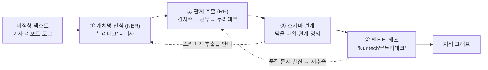
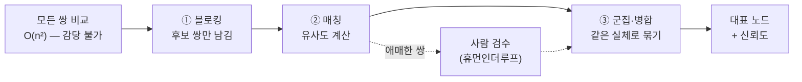

<figure class="post-figure post-figure--header">
<svg role="img" aria-label="비정형 텍스트가 지식 그래프로 변환되는 구축 파이프라인을 왼쪽에서 오른쪽으로 그린 그림. 맨 왼쪽 문서 조각에서 개체명 인식(NER)으로 개체가 하이라이트되고, 관계 추출(RE)로 개체 쌍 사이의 관계가 뽑히며, 스키마 설계가 담을 타입을 정하고, 엔티티 해소가 여러 소스의 같은 실체를 하나로 병합해, 맨 오른쪽 지식 그래프가 완성된다. 아래에는 각 단계에 전통 방법과 그 한계가 표시되어 있다." viewBox="0 0 680 300" xmlns="http://www.w3.org/2000/svg">
  <title>구축 파이프라인 — 텍스트 → NER → RE → 스키마 → 엔티티 해소 → 지식 그래프</title>
  <defs>
    <marker id="kg3-arw" viewBox="0 0 10 10" refX="8" refY="5" markerWidth="6" markerHeight="6" orient="auto-start-reverse">
      <path d="M0,0 L10,5 L0,10 z" fill="var(--secondary-color)"/>
    </marker>
  </defs>

  <text x="340" y="24" text-anchor="middle" font-size="15" font-weight="800" fill="currentColor">지식 그래프 구축 파이프라인</text>

  <!-- 1. 문서 -->
  <rect x="20" y="70" width="96" height="88" rx="4" fill="var(--bg-light)" stroke="currentColor" stroke-width="1.8"/>
  <g stroke="currentColor" stroke-width="1" opacity="0.45">
    <line x1="32" y1="86" x2="104" y2="86"/><line x1="32" y1="98" x2="104" y2="98"/>
    <line x1="32" y1="110" x2="88" y2="110"/><line x1="32" y1="128" x2="104" y2="128"/>
    <line x1="32" y1="140" x2="96" y2="140"/>
  </g>
  <rect x="30" y="80" width="30" height="9" rx="2" fill="var(--secondary-color)" opacity="0.5"/>
  <rect x="66" y="122" width="26" height="9" rx="2" fill="var(--accent-color)" opacity="0.5"/>
  <text x="68" y="176" text-anchor="middle" font-size="9" font-weight="700" fill="currentColor">비정형 텍스트</text>

  <line x1="120" y1="114" x2="146" y2="114" stroke="var(--secondary-color)" stroke-width="2" marker-end="url(#kg3-arw)"/>

  <!-- 2. NER + RE -->
  <rect x="150" y="70" width="120" height="88" rx="4" fill="var(--bg-panel)" stroke="var(--secondary-color)" stroke-width="2"/>
  <text x="210" y="90" text-anchor="middle" font-size="10" font-weight="800" fill="var(--secondary-color)">NER · RE</text>
  <g>
    <rect x="164" y="100" width="40" height="16" rx="3" fill="var(--bg-light)" stroke="var(--secondary-color)" stroke-width="1.4"/>
    <text x="184" y="111" text-anchor="middle" font-size="7" fill="currentColor">사람</text>
    <rect x="220" y="100" width="40" height="16" rx="3" fill="var(--bg-light)" stroke="var(--secondary-color)" stroke-width="1.4"/>
    <text x="240" y="111" text-anchor="middle" font-size="7" fill="currentColor">회사</text>
    <line x1="204" y1="108" x2="220" y2="108" stroke="var(--accent-color)" stroke-width="1.6"/>
  </g>
  <text x="210" y="134" text-anchor="middle" font-size="7" fill="currentColor" opacity="0.7">개체 + 관계 쌍</text>
  <text x="210" y="148" text-anchor="middle" font-size="7" fill="currentColor" opacity="0.7">(주어–술어–목적어)</text>
  <text x="210" y="176" text-anchor="middle" font-size="9" font-weight="700" fill="currentColor">추출</text>

  <line x1="274" y1="114" x2="300" y2="114" stroke="var(--secondary-color)" stroke-width="2" marker-end="url(#kg3-arw)"/>

  <!-- 3. 스키마 -->
  <rect x="304" y="70" width="104" height="88" rx="4" fill="var(--bg-panel)" stroke="var(--accent-color)" stroke-width="2"/>
  <text x="356" y="90" text-anchor="middle" font-size="10" font-weight="800" fill="var(--accent-color)">스키마</text>
  <g font-size="7" fill="currentColor" opacity="0.8">
    <text x="316" y="106">사람 ⊑ 개체</text>
    <text x="316" y="120">회사 ⊑ 조직</text>
    <text x="316" y="134">근무: 사람→회사</text>
    <text x="316" y="148">출시: 회사→제품</text>
  </g>
  <text x="356" y="176" text-anchor="middle" font-size="9" font-weight="700" fill="currentColor">타입 정의</text>

  <line x1="412" y1="114" x2="438" y2="114" stroke="var(--secondary-color)" stroke-width="2" marker-end="url(#kg3-arw)"/>

  <!-- 4. 엔티티 해소 -->
  <rect x="442" y="70" width="104" height="88" rx="4" fill="var(--bg-panel)" stroke="var(--gold)" stroke-width="2.2"/>
  <text x="494" y="90" text-anchor="middle" font-size="9.5" font-weight="800" fill="var(--gold)">엔티티 해소</text>
  <g>
    <circle cx="462" cy="112" r="8" fill="var(--bg-light)" stroke="currentColor" stroke-width="1.4"/>
    <circle cx="462" cy="132" r="8" fill="var(--bg-light)" stroke="currentColor" stroke-width="1.4"/>
    <path d="M472,112 q14,10 0,20" fill="none" stroke="var(--gold)" stroke-width="1.6" marker-end="url(#kg3-arw)"/>
    <circle cx="512" cy="122" r="9" fill="var(--bg-light)" stroke="var(--gold)" stroke-width="2"/>
  </g>
  <text x="494" y="150" text-anchor="middle" font-size="7" fill="currentColor" opacity="0.75">같은 실체 → 하나로</text>
  <text x="494" y="176" text-anchor="middle" font-size="9" font-weight="700" fill="currentColor">병합</text>

  <line x1="550" y1="114" x2="576" y2="114" stroke="var(--secondary-color)" stroke-width="2" marker-end="url(#kg3-arw)"/>

  <!-- 5. 그래프 -->
  <g stroke="var(--gold)" stroke-width="2" opacity="0.7">
    <line x1="608" y1="88" x2="640" y2="110"/>
    <line x1="640" y1="110" x2="612" y2="140"/>
    <line x1="608" y1="88" x2="612" y2="140"/>
  </g>
  <g>
    <circle cx="608" cy="88" r="9" fill="var(--bg-panel)" stroke="currentColor" stroke-width="2"/>
    <circle cx="644" cy="110" r="9" fill="var(--bg-panel)" stroke="var(--gold)" stroke-width="2"/>
    <circle cx="612" cy="142" r="9" fill="var(--bg-panel)" stroke="currentColor" stroke-width="2"/>
  </g>
  <text x="624" y="176" text-anchor="middle" font-size="9" font-weight="700" fill="var(--gold)">지식 그래프</text>

  <!-- bottom note -->
  <line x1="20" y1="204" x2="660" y2="204" stroke="currentColor" stroke-width="1.2" opacity="0.22"/>
  <text x="20" y="226" font-size="9.5" font-weight="700" fill="currentColor" opacity="0.72">전통 파이프라인의 방법과 한계</text>
  <text x="20" y="246" font-size="8.5" fill="currentColor" opacity="0.65">· 규칙·통계·지도학습 — 도메인마다 라벨링·튜닝 비용이 크고, 새 관계 유형에 취약</text>
  <text x="20" y="262" font-size="8.5" fill="currentColor" opacity="0.65">· 엔티티 해소가 가장 지저분하고 어렵다 — 현실 데이터엔 전역 식별자가 없다</text>
  <text x="20" y="282" font-size="8.5" font-weight="700" fill="var(--gold)" opacity="0.9">→ 4단계에서 LLM이 추출을 뒤집는다 (다만 스키마·해소 숙제는 남는다)</text>
</svg>
<figcaption>구축 파이프라인을 한 장으로 — 비정형 텍스트에서 <strong>NER</strong>로 개체를, <strong>RE</strong>로 관계를 뽑고, <strong>스키마</strong>로 담을 타입을 정하고, <strong>엔티티 해소</strong>로 흩어진 같은 실체를 하나로 병합해 그래프를 완성한다. 전통 파이프라인의 한계를 알아야 4단계의 LLM 추출이 무엇을 바꾸는지 보인다.</figcaption>
</figure>

## 들어가며

이 글은 [Agentic Knowledge Graph Curriculum](/2026/07/21/agentic-knowledge-graph-curriculum.html)의 **3단계**입니다. [1단계](/2026/07/21/kg-what-is-knowledge-graph.html)에서 "왜 그래프인가"를, [2단계](/2026/07/21/kg-graph-databases-cypher-sparql.html)에서 "어떻게 저장·질의하는가"를 익혔습니다. 그런데 그래프 DB는 비어 있는 그릇입니다 — **무엇으로 채울 것인가?**

지식 그래프의 재료는 결국 어딘가의 텍스트·표·API에서 뽑아낸 개체와 관계입니다. 이 글은 그 **구축(construction)**의 기초 세 가지를 다룹니다 — 텍스트에서 개체를 찾고 관계를 뽑는 **추출**, 그래프가 담을 개념을 정하는 **스키마 설계**, 그리고 여러 소스에 흩어진 같은 실체를 하나로 묶는 **엔티티 해소**입니다.

여기서 중요한 순서가 있습니다. 다음 4단계에서 우리는 LLM으로 이 추출을 뒤집습니다 — 정교한 규칙·라벨링 없이 프롬프트로 트리플을 뽑아내죠. 하지만 **LLM 이전의 전통 파이프라인을 먼저 이해해야, LLM이 *무엇을* 대체하고 *무엇을* 못 하는지**가 보입니다. LLM은 추출의 문턱을 극적으로 낮추지만, 스키마 규율과 엔티티 해소라는 옛 숙제는 지우지 못합니다 — 오히려 그것들이 품질을 가릅니다.

<div class="post-summary-box" markdown="1">

### 📌 이 글에서 다루는 내용

- **엔티티·관계 추출(NER/RE)**: 텍스트에서 개체를 찾는 개체명 인식과 개체 쌍의 관계를 뽑는 관계 추출, 규칙→통계→지도학습으로 이어진 전통 파이프라인의 구성과 한계
- **스키마·온톨로지 설계**: 그래프가 담을 타입과 관계를 정하는 일, 스키마-우선(schema-first)과 스키마-유연(schema-flexible)의 트레이드오프
- **엔티티 해소**: 여러 소스의 같은 실체를 하나로 묶기 — 블로킹·매칭·중복 제거, 현실 데이터엔 전역 식별자가 없다는 근본 난제

</div>

## 한눈에 보기 — 채우기의 네 관문

그래프를 채우는 일은 하나의 파이프라인입니다. 텍스트가 개체가 되고, 개체가 관계로 이어지고, 관계가 정해진 타입에 얹히고, 흩어진 조각이 하나의 실체로 병합됩니다. 어느 관문이든 실패하면 그래프의 신뢰가 무너집니다.



점선이 말해 주듯, 이 파이프라인은 한 방향으로만 흐르지 않습니다 — 스키마가 추출을 안내하고, 해소 단계에서 발견한 문제가 추출로 되돌아갑니다. **구축은 반복(iterative)입니다.**

## 엔티티·관계 추출 — 텍스트를 사실로

### 개체명 인식(NER)

**개체명 인식(Named Entity Recognition)**은 텍스트에서 개체를 가리키는 조각을 찾아 종류를 붙이는 일입니다. "김지수는 2021년 누리테크에 합류했다"에서 `김지수`(사람), `2021년`(날짜), `누리테크`(회사)를 식별합니다. 이 개체들이 그래프의 **노드 후보**입니다.

### 관계 추출(RE)

**관계 추출(Relation Extraction)**은 식별된 개체 쌍 사이의 관계를 뽑습니다. 같은 문장에서 `(김지수, 근무, 누리테크)`, `(김지수, 합류시점, 2021년)` 트리플을 만들어 냅니다. 이 관계들이 그래프의 **엣지**가 됩니다. NER이 노드를, RE가 엣지를 만들어 함께 트리플을 완성하는 구조입니다.

```text
입력:  "김지수는 2021년 누리테크에 합류해 미리내 개발을 이끌었다."

NER:   [김지수]사람  [2021년]날짜  [누리테크]회사  [미리내]제품
RE:    (김지수)-[근무]->(누리테크)
       (김지수)-[합류시점]->(2021년)
       (누리테크)-[개발]->(미리내)
       (김지수)-[주도]->(미리내)
```

### 전통 파이프라인과 그 한계

LLM 이전, 이 추출은 세 갈래로 발전했습니다.

- **규칙 기반**: "X는 Y에 합류했다" 같은 패턴을 손으로 작성. 정밀하지만 표현 변주에 취약하고, 규칙 관리가 폭발합니다.
- **통계·지도학습**: 라벨링된 코퍼스로 시퀀스 모델(CRF 등)이나 신경망을 학습. 성능은 좋지만 **도메인마다 대량의 라벨링**이 필요합니다.
- **사전·온톨로지 매칭**: 알려진 개체 사전(gazetteer)과 대조. 새 개체·신조어에 약합니다.

공통의 한계는 분명합니다 — **도메인이 바뀌면 처음부터 다시**입니다. 의료 논문용으로 튜닝한 추출기는 금융 리포트에 그대로 못 씁니다. 새 관계 유형을 추가하려면 라벨링과 재학습이 따라옵니다. 이 높은 비용과 낮은 이식성이, 4단계에서 LLM이 판을 뒤집는 배경입니다 — LLM은 라벨링 없이 프롬프트만으로 새 도메인·새 관계에 적응합니다. *(예: 바이오 분야에서 약물–질환–유전자 추출은 전통적으로 BioBERT 같은 도메인 특화 모델과 라벨링에 크게 의존했습니다.)*

## 스키마·온톨로지 설계 — 그래프가 담을 세계

추출된 트리플을 그냥 쌓기만 하면 일관성 없는 잡동사니가 됩니다. **스키마(온톨로지)**는 그래프가 담을 **타입과 관계를 미리 정의**합니다 — "사람·회사·제품이라는 노드 타입이 있고, 근무·출시라는 관계가 있으며, 근무는 사람에서 회사로만 향한다." 이 규율이 있어야 추출이 일관되고 질의가 예측 가능해집니다.

핵심 트레이드오프는 **스키마-우선 vs 스키마-유연**입니다.

- **스키마-우선(schema-first)**: 타입·관계를 먼저 엄격히 정의하고 그에 맞는 것만 받습니다. 일관성·품질이 높지만 경직되고, 예상 못 한 사실을 놓칩니다. RDF/OWL 진영과 규제 도메인이 이 쪽에 가깝습니다.
- **스키마-유연(schema-flexible)**: 일단 넓게 받고 점진적으로 구조를 조입니다. 새 도메인·탐색적 구축에 유리하지만 관리가 필요합니다. 속성 그래프와 LLM 기반 구축이 이 쪽에 가깝습니다.

지식 그래프의 스키마 설계는 사실상 **도메인 모델링**입니다 — "무엇을 노드로, 무엇을 속성으로, 무엇을 관계로 승격할 것인가"라는 판단이 표현력과 사용성을 가릅니다. 이 모델링 사고의 깊은 결은 자매 시리즈 [Ontology Essential](/2026/07/19/ontology-essential-curriculum.html)의 객체·링크 설계 단계에서 본격적으로 다루므로, 여기서는 "추출이 얹힐 뼈대를 정한다"는 역할까지만 잡습니다.

## 엔티티 해소 — 흩어진 조각을 하나로

구축에서 가장 지저분하고 가장 어려운 관문입니다. **엔티티 해소(entity resolution, 또는 identity resolution)**는 여러 소스에 흩어진 *같은 실체를 하나의 노드로 묶는* 일입니다.

문제의 뿌리는 하나입니다 — **현실 데이터에는 전역 식별자가 없습니다.** 2단계에서 본 RDF의 URI 같은 깔끔한 전역 이름은 이미 정리된 세계의 이야기이고, 원천 데이터는 그렇지 않습니다.

```text
소스 A(CRM):     "누리테크"        cust_id=4021
소스 B(계약서):   "Nuritech Inc."      vendor=NT-77
소스 C(뉴스):     "㈜누리테크"       —
소스 D(이메일):   "nuritech.io"        —

→ 넷은 같은 회사인가? 사람이 봐도 헷갈리는 것을 기계가 판정해야 한다.
```

<figure class="post-figure">
<svg role="img" aria-label="네 개의 서로 다른 소스에 흩어진 같은 회사 표기 — CRM의 '누리테크', 계약서의 'Nuritech Inc.', 뉴스의 '㈜누리테크', 이메일 도메인 'nuritech.io' — 가 엔티티 해소를 거쳐 하나의 대표 노드 '누리테크'로 병합되는 그림. 네 카드에서 나온 화살표가 가운데로 모여 오른쪽의 금색 단일 노드로 수렴한다." viewBox="0 0 640 300" xmlns="http://www.w3.org/2000/svg">
  <title>엔티티 해소 — 흩어진 네 표기가 하나의 노드로 병합</title>
  <defs>
    <marker id="er-merge-arw" viewBox="0 0 10 10" refX="8" refY="5" markerWidth="6" markerHeight="6" orient="auto-start-reverse">
      <path d="M0,0 L10,5 L0,10 z" fill="var(--secondary-color)"/>
    </marker>
  </defs>

  <text x="130" y="26" text-anchor="middle" font-size="11" font-weight="800" fill="currentColor">여러 소스의 같은 실체</text>
  <text x="520" y="26" text-anchor="middle" font-size="11" font-weight="800" fill="var(--gold)">하나의 노드</text>

  <!-- four source cards -->
  <g font-family="inherit">
    <rect x="20" y="48" width="214" height="44" rx="4" fill="var(--bg-light)" stroke="currentColor" stroke-width="1.6"/>
    <text x="34" y="70" font-size="13" font-weight="700" fill="currentColor">누리테크</text>
    <text x="34" y="85" font-size="8.5" fill="currentColor" opacity="0.65">CRM · cust_id=4021</text>

    <rect x="20" y="108" width="214" height="44" rx="4" fill="var(--bg-light)" stroke="currentColor" stroke-width="1.6"/>
    <text x="34" y="130" font-size="13" font-weight="700" fill="currentColor">Nuritech Inc.</text>
    <text x="34" y="145" font-size="8.5" fill="currentColor" opacity="0.65">계약서 · vendor=NT-77</text>

    <rect x="20" y="168" width="214" height="44" rx="4" fill="var(--bg-light)" stroke="currentColor" stroke-width="1.6"/>
    <text x="34" y="190" font-size="13" font-weight="700" fill="currentColor">㈜누리테크</text>
    <text x="34" y="205" font-size="8.5" fill="currentColor" opacity="0.65">뉴스</text>

    <rect x="20" y="228" width="214" height="44" rx="4" fill="var(--bg-light)" stroke="currentColor" stroke-width="1.6"/>
    <text x="34" y="250" font-size="13" font-weight="700" fill="currentColor">nuritech.io</text>
    <text x="34" y="265" font-size="8.5" fill="currentColor" opacity="0.65">이메일 도메인</text>
  </g>

  <!-- converging arrows -->
  <g fill="none" stroke="var(--secondary-color)" stroke-width="1.8">
    <path d="M238,70 C300,70 300,140 372,150" marker-end="url(#er-merge-arw)"/>
    <path d="M238,130 C300,130 320,145 372,150" marker-end="url(#er-merge-arw)"/>
    <path d="M238,190 C300,190 320,155 372,150" marker-end="url(#er-merge-arw)"/>
    <path d="M238,250 C300,250 300,160 372,150" marker-end="url(#er-merge-arw)"/>
  </g>

  <!-- resolution label -->
  <rect x="286" y="16" width="70" height="18" rx="9" fill="var(--bg-panel)" stroke="var(--gold)" stroke-width="1.4"/>
  <text x="321" y="29" text-anchor="middle" font-size="9" font-weight="700" fill="var(--gold)">엔티티 해소</text>

  <!-- merged canonical node -->
  <circle cx="520" cy="150" r="52" fill="var(--bg-panel)" stroke="var(--gold)" stroke-width="2.6"/>
  <text x="520" y="146" text-anchor="middle" font-size="16" font-weight="800" fill="currentColor">누리테크</text>
  <text x="520" y="166" text-anchor="middle" font-size="8.5" fill="var(--gold)">대표 노드 · +신뢰도</text>

  <text x="320" y="292" text-anchor="middle" font-size="9" fill="currentColor" opacity="0.7">현실 데이터엔 전역 식별자가 없다 — 표기·식별자가 소스마다 다르다</text>
</svg>
<figcaption>엔티티 해소란 — 서로 다른 소스에 다른 이름·식별자로 흩어진 <strong>같은 실체</strong>를 하나의 대표 노드로 묶는 일. 전역 식별자가 없기에, 표기가 달라도 같은 것을 판정해 병합해야 한다.</figcaption>
</figure>

전통적 접근은 대략 이렇게 흘러갑니다.

- **블로킹(blocking)**: 모든 쌍을 비교하면 O(n²)이라 불가능하므로, 후보를 좁힙니다(예: 같은 도메인·같은 지역끼리만 비교).
- **매칭(matching)**: 후보 쌍의 유사도를 계산합니다 — 문자열 거리(Jaro-Winkler 등), 속성 일치(주소·대표자), 규칙 또는 학습된 분류기.
- **군집·병합(clustering)**: 유사도가 높은 것들을 하나의 실체로 묶고, 대표 노드로 통합합니다. 이때 **신뢰도(confidence)**를 남겨 두는 것이 중요합니다.

세 단계는 하나의 깔때기입니다 — 감당 못 할 O(n²) 비교를 블로킹으로 좁히고, 매칭으로 점수를 매기고, 군집·병합으로 실체를 합칩니다. 애매한 쌍은 사람 검수로 되돌립니다.



엔티티 해소가 어려운 이유는 오류의 양면성 때문입니다 — 다른 둘을 잘못 합치면(**false merge**) 서로 무관한 사실이 한 노드에 뒤섞여 그래프가 오염되고, 같은 하나를 못 합치면(**false split**) 연결이 끊겨 다중 홉 질의가 실패합니다. 그래서 완전 자동화보다 **사람 검수(휴먼인더루프)**를 남기는 것이 실무의 표준입니다 — 이 원칙은 4단계 LLM 구축의 품질 관리로 그대로 이어집니다.

<figure class="post-figure">
<svg role="img" aria-label="엔티티 해소의 두 방향 오류를 나란히 대비한 그림. 왼쪽 false merge는 서울과 부산의 서로 다른 두 '누리테크'를 하나로 잘못 합쳐 무관한 사실이 한 노드에 뒤섞이는 것을 보여준다. 오른쪽 false split은 원래 같은 실체인 '누리테크'와 'Nuritech'를 못 합쳐 끊어진 링크로 남겨, 다중 홉 질의가 실패하는 것을 보여준다." viewBox="0 0 640 300" xmlns="http://www.w3.org/2000/svg">
  <title>false merge 대 false split — 병합의 두 방향 오류</title>
  <defs>
    <marker id="fm-arw" viewBox="0 0 10 10" refX="8" refY="5" markerWidth="6" markerHeight="6" orient="auto-start-reverse">
      <path d="M0,0 L10,5 L0,10 z" fill="var(--accent-color)"/>
    </marker>
  </defs>

  <!-- divider -->
  <line x1="320" y1="24" x2="320" y2="276" stroke="currentColor" stroke-width="1.2" opacity="0.25" stroke-dasharray="4 4"/>

  <!-- LEFT: false merge -->
  <text x="160" y="28" text-anchor="middle" font-size="12" font-weight="800" fill="var(--accent-color)">false merge · 잘못된 병합</text>
  <text x="160" y="46" text-anchor="middle" font-size="9" fill="currentColor" opacity="0.7">다른 둘을 하나로 합침</text>

  <g>
    <circle cx="70" cy="92" r="30" fill="var(--bg-light)" stroke="currentColor" stroke-width="1.8"/>
    <text x="70" y="90" text-anchor="middle" font-size="11" font-weight="700" fill="currentColor">누리테크</text>
    <text x="70" y="104" text-anchor="middle" font-size="8" fill="currentColor" opacity="0.7">(서울)</text>

    <circle cx="250" cy="92" r="30" fill="var(--bg-light)" stroke="currentColor" stroke-width="1.8"/>
    <text x="250" y="90" text-anchor="middle" font-size="11" font-weight="700" fill="currentColor">누리테크</text>
    <text x="250" y="104" text-anchor="middle" font-size="8" fill="currentColor" opacity="0.7">(부산)</text>
  </g>
  <path d="M85,120 C120,168 130,168 155,182" fill="none" stroke="var(--accent-color)" stroke-width="1.8" marker-end="url(#fm-arw)"/>
  <path d="M235,120 C200,168 190,168 165,182" fill="none" stroke="var(--accent-color)" stroke-width="1.8" marker-end="url(#fm-arw)"/>

  <circle cx="160" cy="212" r="34" fill="var(--bg-panel)" stroke="var(--accent-color)" stroke-width="2.4"/>
  <text x="160" y="208" text-anchor="middle" font-size="11" font-weight="800" fill="currentColor">누리테크</text>
  <text x="160" y="222" text-anchor="middle" font-size="7.5" fill="var(--accent-color)">사실이 뒤섞임</text>
  <text x="160" y="272" text-anchor="middle" font-size="9" fill="currentColor" opacity="0.75">→ 무관한 사실이 오염 · 그래프 신뢰 붕괴</text>

  <!-- RIGHT: false split -->
  <text x="480" y="28" text-anchor="middle" font-size="12" font-weight="800" fill="var(--gold)">false split · 잘못된 분리</text>
  <text x="480" y="46" text-anchor="middle" font-size="9" fill="currentColor" opacity="0.7">같은 하나를 못 합침</text>

  <g>
    <circle cx="400" cy="150" r="30" fill="var(--bg-light)" stroke="var(--gold)" stroke-width="1.8"/>
    <text x="400" y="154" text-anchor="middle" font-size="11" font-weight="700" fill="currentColor">누리테크</text>

    <circle cx="560" cy="150" r="30" fill="var(--bg-light)" stroke="var(--gold)" stroke-width="1.8"/>
    <text x="560" y="154" text-anchor="middle" font-size="11" font-weight="700" fill="currentColor">Nuritech</text>
  </g>
  <!-- broken link -->
  <line x1="430" y1="150" x2="475" y2="150" stroke="currentColor" stroke-width="1.8" opacity="0.6"/>
  <line x1="485" y1="150" x2="530" y2="150" stroke="currentColor" stroke-width="1.8" opacity="0.6"/>
  <text x="480" y="140" text-anchor="middle" font-size="14" font-weight="800" fill="var(--accent-color)">✕</text>
  <text x="480" y="200" text-anchor="middle" font-size="8" fill="currentColor" opacity="0.7">같은 실체인데 끊김</text>
  <text x="480" y="272" text-anchor="middle" font-size="9" fill="currentColor" opacity="0.75">→ 연결 끊김 · 다중 홉 질의 실패</text>
</svg>
<figcaption>병합은 <strong>양방향으로</strong> 틀릴 수 있다. 다른 둘을 합치면(<strong>false merge</strong>) 무관한 사실이 한 노드에 뒤섞여 그래프가 오염되고, 같은 하나를 못 합치면(<strong>false split</strong>) 연결이 끊겨 다중 홉 질의가 실패한다. 이 균형이 그래프의 신뢰를 정한다.</figcaption>
</figure>

이 관문이 왜 결정적인지는 도메인 사례가 잘 보여 줍니다. **금융**에서 규제 대상(제재 리스트) 엔티티 해소는 이름 철자 변주·위장 법인을 뚫고 같은 실체를 찾아야 하고, **헬스케어**에서 환자 360° 그래프는 병원·보험·약국에 흩어진 같은 환자를 안전하게 묶어야 합니다. 잘못된 병합이 곧 규제 위반이나 의료 사고가 되는 영역에서, 엔티티 해소의 품질은 그래프 전체의 신뢰와 같습니다.

## 정리

- **그래프를 채우는 일은 파이프라인**입니다 — NER로 개체를, RE로 관계를 뽑고, 스키마로 타입을 정하고, 엔티티 해소로 흩어진 실체를 병합합니다. 반복적이며, 뒤 관문의 발견이 앞 관문으로 되돌아갑니다.
- **NER + RE가 트리플을 만든다**: 개체가 노드, 관계가 엣지. 전통 파이프라인(규칙·통계·지도학습)은 강력하지만 도메인마다 라벨링·튜닝 비용이 크고 이식성이 낮습니다 — 4단계 LLM이 뒤집는 지점입니다.
- **스키마는 추출이 얹힐 뼈대**입니다. 스키마-우선(일관성)과 스키마-유연(적응성) 사이의 선택이 구축 스타일을 가릅니다.
- **엔티티 해소가 가장 어렵고 가장 결정적**입니다. 현실엔 전역 식별자가 없어, 블로킹·매칭·병합과 사람 검수로 같은 실체를 묶어야 합니다. false merge와 false split의 균형이 그래프의 신뢰를 정합니다.

다음 글에서는 이 전통 파이프라인을 **LLM이 어떻게 뒤집는지** — 스키마를 프롬프트로 유도해 문서에서 트리플을 뽑아내는 LLM 기반 구축, 그리고 그 위에서 여전히 필요한 품질·검증·휴먼인더루프 — 를 다룹니다.

### 다음 학습 (Next Learning)

- **4단계 · LLM 기반 그래프 구축: 스키마 유도 추출·검증·휴먼인더루프** — 전통 파이프라인을 LLM이 뒤집는 자리 *(작성 예정)*
- [2단계 · 그래프 DB와 질의](/2026/07/21/kg-graph-databases-cypher-sparql.html) — 추출한 트리플을 담을 저장소로 돌아가기
- [Ontology Essential Curriculum](/2026/07/19/ontology-essential-curriculum.html) — 스키마·객체·링크 설계의 모델링 사고를 더 깊게
