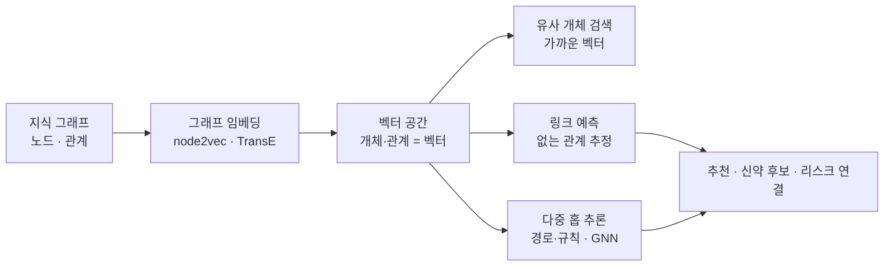

<figure class="post-figure post-figure--header">
<svg role="img" aria-label="지식 그래프가 임베딩 공간으로 옮겨지고 거기서 예측이 이뤄지는 과정을 그린 그림. 왼쪽에는 노드와 관계로 된 지식 그래프가 있고, 가운데 화살표 위 'h + r ≈ t' 수식을 지나 오른쪽 좌표 공간에는 각 노드가 점(벡터)으로 놓인다. 오른쪽 공간에서 두 점 사이에 점선 화살표로 아직 존재하지 않는 관계를 예측하는 링크 예측이 강조되어 있다." viewBox="0 0 680 300" xmlns="http://www.w3.org/2000/svg">
  <title>그래프 임베딩과 추론 — 그래프를 벡터 공간으로 옮겨 없는 관계를 예측한다</title>
  <defs>
    <marker id="kg6-arw" viewBox="0 0 10 10" refX="8" refY="5" markerWidth="6" markerHeight="6" orient="auto-start-reverse">
      <path d="M0,0 L10,5 L0,10 z" fill="var(--secondary-color)"/>
    </marker>
    <marker id="kg6-gold" viewBox="0 0 10 10" refX="8" refY="5" markerWidth="6" markerHeight="6" orient="auto-start-reverse">
      <path d="M0,0 L10,5 L0,10 z" fill="var(--gold)"/>
    </marker>
  </defs>

  <text x="340" y="24" text-anchor="middle" font-size="15" font-weight="800" fill="currentColor">그래프를 벡터로, 벡터에서 예측으로</text>

  <!-- ===== 왼쪽: 지식 그래프 ===== -->
  <rect x="20" y="46" width="220" height="220" rx="8" fill="var(--bg-light)" stroke="var(--secondary-color)" stroke-width="2"/>
  <text x="130" y="68" text-anchor="middle" font-size="11" font-weight="800" fill="var(--secondary-color)">지식 그래프</text>
  <g stroke="currentColor" stroke-width="1.6" opacity="0.5">
    <line x1="80" y1="110" x2="160" y2="100"/>
    <line x1="160" y1="100" x2="180" y2="180"/>
    <line x1="180" y1="180" x2="90" y2="200"/>
    <line x1="80" y1="110" x2="90" y2="200"/>
  </g>
  <g font-size="7" fill="currentColor" opacity="0.7" text-anchor="middle">
    <text x="118" y="98">관계</text><text x="182" y="140">관계</text>
  </g>
  <g>
    <circle cx="80" cy="110" r="16" fill="var(--bg-panel)" stroke="currentColor" stroke-width="2"/>
    <text x="80" y="113" text-anchor="middle" font-size="8" font-weight="700" fill="currentColor">유전자</text>
    <circle cx="160" cy="100" r="16" fill="var(--bg-panel)" stroke="currentColor" stroke-width="2"/>
    <text x="160" y="103" text-anchor="middle" font-size="8" font-weight="700" fill="currentColor">질환</text>
    <circle cx="180" cy="180" r="16" fill="var(--bg-panel)" stroke="currentColor" stroke-width="2"/>
    <text x="180" y="183" text-anchor="middle" font-size="8" font-weight="700" fill="currentColor">약물</text>
    <circle cx="90" cy="200" r="16" fill="var(--bg-panel)" stroke="currentColor" stroke-width="2"/>
    <text x="90" y="203" text-anchor="middle" font-size="8" font-weight="700" fill="currentColor">경로</text>
  </g>

  <!-- ===== 가운데: 변환 ===== -->
  <line x1="248" y1="150" x2="330" y2="150" stroke="var(--secondary-color)" stroke-width="2.4" marker-end="url(#kg6-arw)"/>
  <text x="289" y="138" text-anchor="middle" font-size="9" font-weight="800" fill="var(--secondary-color)">임베딩</text>
  <rect x="256" y="158" width="66" height="22" rx="4" fill="var(--bg-panel)" stroke="var(--accent-color)" stroke-width="1.6"/>
  <text x="289" y="173" text-anchor="middle" font-size="10" font-family="monospace" fill="var(--accent-color)">h+r≈t</text>

  <!-- ===== 오른쪽: 벡터 공간 ===== -->
  <rect x="340" y="46" width="320" height="220" rx="8" fill="var(--bg-light)" stroke="var(--gold)" stroke-width="2.2"/>
  <text x="500" y="68" text-anchor="middle" font-size="11" font-weight="800" fill="var(--gold)">임베딩 공간</text>
  <!-- axes -->
  <line x1="370" y1="240" x2="640" y2="240" stroke="currentColor" stroke-width="1" opacity="0.35"/>
  <line x1="370" y1="240" x2="370" y2="86" stroke="currentColor" stroke-width="1" opacity="0.35"/>
  <!-- points -->
  <g>
    <circle cx="420" cy="130" r="5" fill="var(--secondary-color)"/>
    <text x="420" y="120" text-anchor="middle" font-size="7" fill="currentColor" opacity="0.8">유전자</text>
    <circle cx="470" cy="110" r="5" fill="var(--secondary-color)"/>
    <text x="470" y="100" text-anchor="middle" font-size="7" fill="currentColor" opacity="0.8">질환</text>
    <circle cx="560" cy="150" r="5" fill="var(--accent-color)"/>
    <text x="560" y="140" text-anchor="middle" font-size="7" fill="currentColor" opacity="0.8">약물 A</text>
    <circle cx="590" cy="200" r="5" fill="var(--accent-color)"/>
    <text x="590" y="216" text-anchor="middle" font-size="7" fill="currentColor" opacity="0.8">약물 B</text>
    <circle cx="500" cy="180" r="5" fill="currentColor"/>
    <text x="500" y="196" text-anchor="middle" font-size="7" fill="currentColor" opacity="0.8">경로</text>
  </g>
  <!-- predicted link (dashed) -->
  <line x1="474" y1="112" x2="556" y2="147" stroke="var(--gold)" stroke-width="2.2" stroke-dasharray="5 3" marker-end="url(#kg6-gold)"/>
  <text x="524" y="118" text-anchor="middle" font-size="8" font-weight="800" fill="var(--gold)">링크 예측</text>
  <text x="518" y="132" text-anchor="middle" font-size="6.5" fill="currentColor" opacity="0.7">"질환↔약물 A?"</text>
  <text x="500" y="258" text-anchor="middle" font-size="7.5" fill="currentColor" opacity="0.65">가까운 벡터 = 비슷한 개체 · 규칙적 배치 = 예측 가능한 관계</text>
</svg>
<figcaption>그래프 임베딩과 추론을 한 장으로 — 지식 그래프의 노드·관계를 <strong>벡터 공간</strong>으로 옮기면(<code>h+r≈t</code>), 가까운 벡터로 유사 개체를 찾고 아직 그래프에 없는 관계를 <strong>링크 예측</strong>으로 이끌어낼 수 있다.</figcaption>
</figure>

## 들어가며

이 글은 [Agentic Knowledge Graph Curriculum](/2026/07/21/agentic-knowledge-graph-curriculum.html)의 **6단계**입니다. 지금까지 우리는 그래프를 *짓고*([4단계](/2026/07/21/kg-llm-graph-construction.html)) *읽었습니다*([5단계](/2026/07/21/kg-graphrag.html)). 이 글은 한 걸음 더 나아가, 그래프에서 **예측하고 추론**합니다 — 아직 그래프에 *없는* 사실을 이끌어내는 능력입니다.

핵심 도구는 **임베딩**입니다. [1단계](/2026/07/21/kg-what-is-knowledge-graph.html)에서 벡터 DB가 문서를 벡터로 옮긴다고 했는데, 그래프도 노드와 관계를 벡터로 옮길 수 있습니다. 일단 벡터 공간으로 옮기면, "이 두 개체는 비슷한가", "이 관계는 존재할 법한가" 같은 질문이 벡터 연산이 됩니다. 이 예측·추론 능력이 추천·신약 발견의 엔진이자, 7단계에서 에이전트가 "그래프에게 물어 답을 만드는" 밑천이 됩니다.

<div class="post-summary-box" markdown="1">

### 📌 이 글에서 다루는 내용

- **그래프·지식 그래프 임베딩**: node2vec 같은 구조 기반 임베딩과 TransE 계열의 지식 그래프 임베딩(`h + r ≈ t`), 개체·관계를 벡터로 옮기면 무엇이 가능해지는가
- **링크 예측·추천**: 아직 그래프에 없는 관계를 예측하기, 추천·신약 후보·리스크 연결로의 응용
- **다중 홉 추론·GNN**: 경로·규칙 기반으로 새 사실을 이끌어내기, 그래프 신경망(GNN)의 역할과 설명가능성의 긴장

</div>

## 한눈에 보기 — 벡터로 옮기면 예측이 열린다

이 글의 스파인은 하나의 흐름입니다 — 그래프를 벡터 공간으로 옮기고, 그 공간에서 유사도·예측·추론을 수행합니다.



이 그림의 좌표는 하나입니다 — **그래프를 벡터로 옮기는 순간, "읽기"가 "예측"으로 바뀝니다.** 저장된 사실을 조회하는 것을 넘어, 저장되지 *않은* 사실을 추정할 수 있게 됩니다.

## 그래프·지식 그래프 임베딩 — 개체를 벡터로

### 구조 기반 임베딩 — node2vec

첫 갈래는 **그래프의 구조**만으로 노드를 벡터화하는 것입니다. **node2vec**는 그래프 위를 무작위로 걸어(random walk) 노드의 "이웃 문맥"을 수집하고, 자연어의 word2vec처럼 *함께 자주 등장하는 노드는 가까운 벡터*가 되도록 학습합니다. 결과적으로 그래프에서 비슷한 위치·역할을 가진 노드가 벡터 공간에서 이웃이 됩니다. 관계의 *종류*는 따지지 않고, 연결의 구조만 봅니다.

### 지식 그래프 임베딩 — TransE와 `h + r ≈ t`

지식 그래프는 관계에 *종류*가 있으므로(근무·출시·상호작용), 그것까지 담는 임베딩이 필요합니다. **TransE**의 발상이 우아합니다 — 관계를 벡터 공간의 **평행이동(translation)**으로 봅니다. 트리플 (head, relation, tail)에 대해:

```text
h + r ≈ t     (머리 벡터 + 관계 벡터 ≈ 꼬리 벡터)

예:  vec(유전자X) + vec(관여)  ≈ vec(질환Y)
     vec(약물A)   + vec(치료)  ≈ vec(질환Y)
```

관계 `관여`가 하나의 방향 벡터가 되어, 어떤 유전자든 그 벡터를 더하면 관련 질환 근처에 놓입니다. 학습이 끝나면 개체와 관계가 모두 규칙적으로 배치된 벡터 공간이 생깁니다(이후 TransR·RotatE·ComplEx 등이 표현력을 확장했지만, 발상의 뿌리는 이 평행이동입니다). 이 규칙성이 바로 다음 절의 링크 예측을 가능케 합니다.

<figure class="post-figure">
<svg role="img" aria-label="TransE의 h+r≈t를 벡터 공간의 평행이동으로 그린 그림. 좌표 공간에 두 유전자 점이 있고, 각각에서 같은 방향·같은 길이의 '관여' 화살표를 더하면 대응하는 질환 점 근처에 도착한다. 두 화살표가 서로 평행이라는 점이, 관계가 하나의 방향 벡터임을 보여준다." viewBox="0 0 620 320" xmlns="http://www.w3.org/2000/svg">
  <title>TransE — 관계는 하나의 평행이동 벡터, h + r ≈ t</title>
  <defs>
    <marker id="kg6t-r" viewBox="0 0 10 10" refX="8" refY="5" markerWidth="6.5" markerHeight="6.5" orient="auto-start-reverse">
      <path d="M0,0 L10,5 L0,10 z" fill="var(--accent-color)"/>
    </marker>
  </defs>

  <text x="310" y="26" text-anchor="middle" font-size="14" font-weight="800" fill="currentColor">관계 = 벡터 공간의 평행이동</text>
  <text x="310" y="44" text-anchor="middle" font-size="10" fill="currentColor" opacity="0.7">같은 관계 <tspan font-family="monospace">관여</tspan> = 어디서 더해도 같은 방향·길이의 화살표</text>

  <!-- coordinate frame -->
  <rect x="24" y="58" width="572" height="238" rx="8" fill="var(--bg-light)" stroke="var(--secondary-color)" stroke-width="1.6"/>
  <line x1="60" y1="270" x2="560" y2="270" stroke="currentColor" stroke-width="1" opacity="0.35"/>
  <line x1="60" y1="270" x2="60" y2="80" stroke="currentColor" stroke-width="1" opacity="0.35"/>
  <text x="556" y="286" text-anchor="end" font-size="8" fill="currentColor" opacity="0.5">임베딩 공간</text>

  <!-- pair 1: 유전자X + 관여 ≈ 질환Y -->
  <line x1="150" y1="240" x2="270" y2="150" stroke="var(--accent-color)" stroke-width="2.6" marker-end="url(#kg6t-r)"/>
  <text x="196" y="185" text-anchor="middle" font-size="9" font-weight="800" fill="var(--accent-color)" transform="rotate(-37 196 185)">r = 관여</text>
  <circle cx="150" cy="240" r="6" fill="var(--secondary-color)"/>
  <text x="150" y="258" text-anchor="middle" font-size="9" font-weight="700" fill="currentColor">유전자X (h)</text>
  <circle cx="270" cy="150" r="6" fill="var(--gold)"/>
  <text x="270" y="140" text-anchor="middle" font-size="9" font-weight="700" fill="currentColor">질환Y (t)</text>

  <!-- pair 2: 유전자Z + 관여 ≈ 질환W (parallel) -->
  <line x1="330" y1="252" x2="450" y2="162" stroke="var(--accent-color)" stroke-width="2.6" marker-end="url(#kg6t-r)" opacity="0.85"/>
  <text x="376" y="197" text-anchor="middle" font-size="9" font-weight="800" fill="var(--accent-color)" transform="rotate(-37 376 197)">r = 관여</text>
  <circle cx="330" cy="252" r="6" fill="var(--secondary-color)"/>
  <text x="330" y="270" text-anchor="middle" font-size="9" font-weight="700" fill="currentColor">유전자Z (h)</text>
  <circle cx="450" cy="162" r="6" fill="var(--gold)"/>
  <text x="452" y="152" text-anchor="middle" font-size="9" font-weight="700" fill="currentColor">질환W (t)</text>

  <!-- equation callout -->
  <rect x="392" y="222" width="176" height="52" rx="6" fill="var(--bg-panel)" stroke="var(--gold)" stroke-width="1.6"/>
  <text x="480" y="244" text-anchor="middle" font-size="13" font-family="monospace" font-weight="700" fill="var(--gold)">h + r ≈ t</text>
  <text x="480" y="263" text-anchor="middle" font-size="8" fill="currentColor" opacity="0.75">머리 + 관계 ≈ 꼬리</text>
</svg>
<figcaption>TransE의 핵심 — 관계 <code>관여</code>는 벡터 공간의 한 <strong>평행이동</strong>이다. 서로 다른 유전자에서 더해도 같은 방향·길이의 화살표라, 두 화살표가 나란하다. 이 규칙성이 링크 예측의 밑바탕이 된다.</figcaption>
</figure>

## 링크 예측·추천 — 없는 관계를 추정하다

임베딩 공간이 규칙적이면, **아직 그래프에 없는 관계를 점수화**할 수 있습니다. 이것이 **링크 예측(link prediction)**입니다. TransE라면 후보 트리플 (h, r, t)에 대해 `h + r`이 `t`에 얼마나 가까운지로 그 관계의 그럴듯함을 매깁니다.

이 단순한 능력이 여러 도메인의 핵심 기능이 됩니다.

- **추천**: 사용자–상품 그래프에서 `vec(사용자) + vec(구매) ≈ ?`에 가까운 상품을 추천합니다. "구매 이력이 겹치는 사람이 산 것"이 벡터 근접으로 표현됩니다 — 게다가 [경로](/2026/07/21/kg-what-is-knowledge-graph.html)로 근거를 댈 수 있어 **설명 가능한 추천**이 됩니다.
- **신약 발견**: 약물–질환–유전자 그래프에서 아직 알려지지 않은 `약물 ↔ 질환` 관계를 예측해 **약물 재창출** 후보를 찾습니다(위 헤더 그림의 "질환↔약물 A?"가 이것입니다).
- **리스크·사기**: 계좌·거래 그래프에서 드러나지 않은 연결을 예측해 잠재적 공모 관계를 조기에 표시합니다.

핵심은 링크 예측이 **가설을 생성**한다는 점입니다 — 확정된 사실이 아니라 *검증할 후보*입니다. 그래서 [4단계의 휴먼인더루프](/2026/07/21/kg-llm-graph-construction.html)처럼, 예측된 링크는 실험·검수로 확인한 뒤 그래프에 확정하는 것이 원칙입니다.

## 다중 홉 추론·GNN — 경로를 따라 새 사실을

임베딩이 "벡터 근접"으로 예측한다면, **다중 홉 추론(multi-hop reasoning)**은 그래프의 *경로와 규칙*을 따라 새 사실을 명시적으로 이끌어냅니다.

- **규칙·경로 기반 추론**: "A가 B의 부모이고 B가 C의 부모면, A는 C의 조부모다" 같은 규칙, 또는 여러 홉의 경로를 근거로 결론을 도출합니다. [Ontology 시리즈](/2026/07/19/ontology-knowledge-graphs-rdf-owl-property-graphs.html)의 OWL 추론(이행성·역관계 등)이 이 계열의 형식적 뿌리입니다. 장점은 **설명가능성** — 결론에 이른 경로가 곧 근거입니다.
- **그래프 신경망(GNN)**: 각 노드가 이웃의 정보를 여러 겹에 걸쳐 주고받으며(message passing) 표현을 갱신합니다. 겹을 쌓을수록 더 먼 이웃의 정보가 스며들어, 다중 홉 구조를 학습으로 포착합니다. 링크 예측·노드 분류·부정거래 탐지에서 강력하지만, 왜 그 답이 나왔는지 설명하기는 규칙 기반보다 어렵습니다.

여기에 **긴장**이 하나 있습니다 — 규칙·경로 기반은 설명 가능하지만 표현력이 제한적이고, GNN·임베딩은 강력하지만 블랙박스에 가깝습니다. 도메인이 설명가능성을 얼마나 요구하는지(의료·금융은 높게)가 이 둘 사이의 선택을 좌우합니다. 그리고 이 추론 능력들이 다음 7단계에서 **에이전트가 그래프를 도구로 삼아 답을 만드는** 방식으로 통합됩니다.

<figure class="post-figure">
<svg role="img" aria-label="다중 홉 추론의 두 방식을 나란히 비교한 그림. 왼쪽은 규칙·경로 기반 추론으로, A→B→C 경로를 따라 부모·부모 관계에서 조부모 관계를 명시적으로 이끌어내며 그 경로 자체가 근거가 된다. 오른쪽은 그래프 신경망(GNN)으로, 가운데 노드가 여러 이웃의 정보를 message passing으로 모아 표현을 갱신한다. 아래 저울은 왼쪽이 설명가능성에, 오른쪽이 표현력에 기울어 두 방식의 긴장을 나타낸다." viewBox="0 0 660 360" xmlns="http://www.w3.org/2000/svg">
  <title>다중 홉 추론 — 규칙·경로 기반(설명 가능) vs GNN 메시지 패싱(강력하지만 블랙박스)</title>
  <defs>
    <marker id="kg6m-s" viewBox="0 0 10 10" refX="8" refY="5" markerWidth="6" markerHeight="6" orient="auto-start-reverse">
      <path d="M0,0 L10,5 L0,10 z" fill="var(--secondary-color)"/>
    </marker>
    <marker id="kg6m-g" viewBox="0 0 10 10" refX="8" refY="5" markerWidth="6" markerHeight="6" orient="auto-start-reverse">
      <path d="M0,0 L10,5 L0,10 z" fill="var(--gold)"/>
    </marker>
    <marker id="kg6m-a" viewBox="0 0 10 10" refX="8" refY="5" markerWidth="5.5" markerHeight="5.5" orient="auto-start-reverse">
      <path d="M0,0 L10,5 L0,10 z" fill="var(--accent-color)"/>
    </marker>
  </defs>

  <!-- ===== LEFT: rule / path based ===== -->
  <rect x="18" y="20" width="300" height="220" rx="8" fill="var(--bg-light)" stroke="var(--secondary-color)" stroke-width="1.8"/>
  <text x="168" y="42" text-anchor="middle" font-size="12" font-weight="800" fill="var(--secondary-color)">규칙·경로 기반</text>
  <text x="168" y="58" text-anchor="middle" font-size="9" fill="currentColor" opacity="0.7">경로가 곧 근거 — 설명 가능</text>

  <!-- chain A -> B -> C -->
  <line x1="80" y1="110" x2="152" y2="110" stroke="var(--secondary-color)" stroke-width="2" marker-end="url(#kg6m-s)"/>
  <text x="116" y="100" text-anchor="middle" font-size="8" fill="currentColor" opacity="0.8">부모</text>
  <line x1="188" y1="110" x2="260" y2="110" stroke="var(--secondary-color)" stroke-width="2" marker-end="url(#kg6m-s)"/>
  <text x="224" y="100" text-anchor="middle" font-size="8" fill="currentColor" opacity="0.8">부모</text>
  <g font-size="10" font-weight="700" fill="currentColor" text-anchor="middle">
    <circle cx="64" cy="110" r="17" fill="var(--bg-panel)" stroke="currentColor" stroke-width="2"/><text x="64" y="114">A</text>
    <circle cx="170" cy="110" r="17" fill="var(--bg-panel)" stroke="currentColor" stroke-width="2"/><text x="170" y="114">B</text>
    <circle cx="276" cy="110" r="17" fill="var(--bg-panel)" stroke="currentColor" stroke-width="2"/><text x="276" y="114">C</text>
  </g>
  <!-- inferred edge A -> C -->
  <path d="M64,127 Q170,205 276,127" fill="none" stroke="var(--gold)" stroke-width="2.2" stroke-dasharray="5 3" marker-end="url(#kg6m-g)"/>
  <text x="170" y="196" text-anchor="middle" font-size="9" font-weight="800" fill="var(--gold)">조부모 (도출)</text>
  <text x="168" y="228" text-anchor="middle" font-size="8" fill="currentColor" opacity="0.7">"A→B→C 경로가 결론의 근거"</text>

  <!-- ===== RIGHT: GNN message passing ===== -->
  <rect x="342" y="20" width="300" height="220" rx="8" fill="var(--bg-light)" stroke="var(--accent-color)" stroke-width="1.8"/>
  <text x="492" y="42" text-anchor="middle" font-size="12" font-weight="800" fill="var(--accent-color)">그래프 신경망 (GNN)</text>
  <text x="492" y="58" text-anchor="middle" font-size="9" fill="currentColor" opacity="0.7">이웃 정보를 겹겹이 모음 — message passing</text>

  <!-- neighbors sending messages into center -->
  <g>
    <circle cx="410" cy="95" r="13" fill="var(--bg-panel)" stroke="currentColor" stroke-width="1.6"/>
    <circle cx="410" cy="185" r="13" fill="var(--bg-panel)" stroke="currentColor" stroke-width="1.6"/>
    <circle cx="575" cy="95" r="13" fill="var(--bg-panel)" stroke="currentColor" stroke-width="1.6"/>
    <circle cx="575" cy="185" r="13" fill="var(--bg-panel)" stroke="currentColor" stroke-width="1.6"/>
  </g>
  <g stroke="var(--accent-color)" stroke-width="1.8" opacity="0.85">
    <line x1="423" y1="100" x2="470" y2="130" marker-end="url(#kg6m-a)"/>
    <line x1="423" y1="180" x2="470" y2="150" marker-end="url(#kg6m-a)"/>
    <line x1="562" y1="100" x2="514" y2="130" marker-end="url(#kg6m-a)"/>
    <line x1="562" y1="180" x2="514" y2="150" marker-end="url(#kg6m-a)"/>
  </g>
  <circle cx="492" cy="140" r="21" fill="var(--bg-panel)" stroke="var(--accent-color)" stroke-width="2.4"/>
  <text x="492" y="137" text-anchor="middle" font-size="9" font-weight="800" fill="var(--accent-color)">노드</text>
  <text x="492" y="149" text-anchor="middle" font-size="7.5" fill="currentColor" opacity="0.8">표현 갱신</text>
  <text x="492" y="228" text-anchor="middle" font-size="8" fill="currentColor" opacity="0.7">겹을 쌓을수록 더 먼 이웃까지 — 왜 그 답인지는 불투명</text>

  <!-- ===== bottom: tension scale ===== -->
  <text x="330" y="278" text-anchor="middle" font-size="11" font-weight="800" fill="currentColor">긴장 — 설명가능성 ↔ 표현력</text>
  <line x1="120" y1="316" x2="540" y2="316" stroke="currentColor" stroke-width="1.4" opacity="0.4"/>
  <line x1="330" y1="300" x2="330" y2="332" stroke="currentColor" stroke-width="1.4" opacity="0.4"/>
  <rect x="128" y="322" width="176" height="26" rx="5" fill="var(--bg-panel)" stroke="var(--secondary-color)" stroke-width="1.6"/>
  <text x="216" y="339" text-anchor="middle" font-size="9" font-weight="700" fill="var(--secondary-color)">규칙·경로 · 설명가능성 ↑</text>
  <rect x="356" y="322" width="176" height="26" rx="5" fill="var(--bg-panel)" stroke="var(--accent-color)" stroke-width="1.6"/>
  <text x="444" y="339" text-anchor="middle" font-size="9" font-weight="700" fill="var(--accent-color)">GNN·임베딩 · 표현력 ↑</text>
</svg>
<figcaption>다중 홉 추론의 두 갈래 — <strong>규칙·경로 기반</strong>은 <code>A→B→C</code> 경로 자체가 근거라 설명 가능하고, <strong>GNN</strong>은 이웃 정보를 겹겹이 모아(message passing) 강력하지만 근거가 불투명하다. 도메인의 설명가능성 요구가 이 저울을 기울인다.</figcaption>
</figure>

## 정리

- **그래프를 벡터로 옮기면 예측이 열립니다**: node2vec는 구조로, TransE 계열은 `h + r ≈ t`로 관계까지 담아 개체·관계를 규칙적인 벡터 공간에 배치합니다.
- **링크 예측은 없는 관계를 추정**합니다. 추천·신약 후보·리스크 연결이 모두 이 위에 서며, 예측은 *확정 사실이 아니라 검증할 가설*입니다.
- **다중 홉 추론은 경로·규칙으로 새 사실을** 이끌어냅니다. 규칙 기반은 설명 가능하고, GNN은 강력하지만 블랙박스에 가깝습니다 — 도메인의 설명가능성 요구가 선택을 가릅니다.
- **이 예측·추론 능력이 에이전트의 밑천**입니다. 7단계에서 에이전트는 이 도구들을 스스로 골라 써 답을 만듭니다.

다음 글에서는 시리즈의 심장 — 그래프를 **도구이자 기억**으로 쓰는 **Agentic Knowledge Graph** — 로 들어갑니다.

### 다음 학습 (Next Learning)

- [7단계 · Agentic Knowledge Graph: 그래프를 도구·기억으로, temporal KG](/2026/07/21/kg-agentic-knowledge-graph.html) — 예측·추론을 에이전트가 스스로 쓰게 하기
- [5단계 · GraphRAG](/2026/07/21/kg-graphrag.html) — 검색과 이 글의 추론이 어떻게 만나는지
- [지식 그래프와 RDF/OWL·속성 그래프 (Ontology 시리즈)](/2026/07/19/ontology-knowledge-graphs-rdf-owl-property-graphs.html) — 규칙 기반 추론(OWL)의 형식적 뿌리
