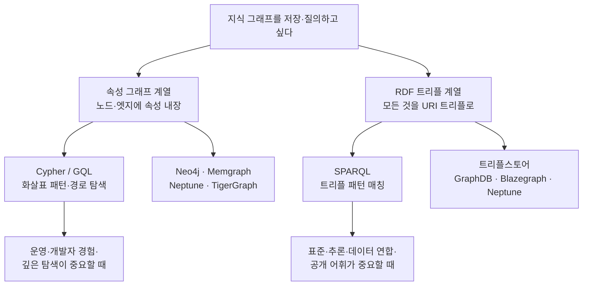

<figure class="post-figure post-figure--header">
<svg role="img" aria-label="지식 그래프를 다루는 두 계열의 저장·질의 방식을 나란히 대비한 그림. 왼쪽 '속성 그래프' 패널은 라벨과 속성을 품은 노드들이 속성을 가진 엣지로 연결된 그래프이며 아래에 Cypher의 화살표 문법이 적혀 있다. 오른쪽 'RDF 트리플' 패널은 같은 사실이 주어-술어-목적어 세 칸으로 쪼개진 트리플 목록으로 그려져 있고 아래에 SPARQL 패턴이 적혀 있다. 가운데에는 둘을 잇는 양방향 화살표와 '무엇을 언제'라는 물음이 놓여 있다." viewBox="0 0 680 300" xmlns="http://www.w3.org/2000/svg">
  <title>그래프를 저장·질의하는 두 계열 — 속성 그래프(Cypher)와 RDF 트리플(SPARQL)</title>
  <defs>
    <marker id="kg2-arw" viewBox="0 0 10 10" refX="8" refY="5" markerWidth="6" markerHeight="6" orient="auto-start-reverse">
      <path d="M0,0 L10,5 L0,10 z" fill="var(--secondary-color)"/>
    </marker>
    <marker id="kg2-gold" viewBox="0 0 10 10" refX="8" refY="5" markerWidth="6" markerHeight="6" orient="auto-start-reverse">
      <path d="M0,0 L10,5 L0,10 z" fill="var(--gold)"/>
    </marker>
  </defs>

  <text x="340" y="24" text-anchor="middle" font-size="15" font-weight="800" fill="currentColor">같은 사실, 두 가지 저장·질의</text>

  <!-- ===== 속성 그래프 ===== -->
  <rect x="16" y="40" width="288" height="230" rx="8" fill="var(--bg-light)" stroke="var(--secondary-color)" stroke-width="2.5"/>
  <text x="160" y="62" text-anchor="middle" font-size="12.5" font-weight="800" fill="var(--secondary-color)">속성 그래프 (Neo4j)</text>
  <text x="160" y="78" text-anchor="middle" font-size="8" fill="currentColor" opacity="0.7">노드·엣지에 라벨과 속성을 내장</text>
  <!-- nodes + edges -->
  <g stroke="var(--secondary-color)" stroke-width="2">
    <line x1="86" y1="122" x2="182" y2="122" marker-end="url(#kg2-arw)"/>
    <line x1="210" y1="138" x2="240" y2="176" marker-end="url(#kg2-arw)"/>
  </g>
  <text x="130" y="114" text-anchor="middle" font-size="7.5" fill="var(--secondary-color)" font-weight="700">:PLACED</text>
  <text x="238" y="156" text-anchor="middle" font-size="7.5" fill="var(--secondary-color)" font-weight="700">:CONTAINS</text>
  <g>
    <circle cx="66" cy="122" r="20" fill="var(--bg-panel)" stroke="currentColor" stroke-width="2"/>
    <text x="66" y="119" text-anchor="middle" font-size="8" font-weight="700" fill="currentColor">:고객</text>
    <text x="66" y="130" text-anchor="middle" font-size="6.5" fill="currentColor" opacity="0.7">김지수</text>
    <circle cx="202" cy="122" r="20" fill="var(--bg-panel)" stroke="currentColor" stroke-width="2"/>
    <text x="202" y="119" text-anchor="middle" font-size="8" font-weight="700" fill="currentColor">:주문</text>
    <text x="202" y="130" text-anchor="middle" font-size="6.5" fill="currentColor" opacity="0.7">O-1001</text>
    <circle cx="256" cy="192" r="20" fill="var(--bg-panel)" stroke="currentColor" stroke-width="2"/>
    <text x="256" y="189" text-anchor="middle" font-size="8" font-weight="700" fill="currentColor">:제품</text>
    <text x="256" y="200" text-anchor="middle" font-size="6.5" fill="currentColor" opacity="0.7">노트북</text>
  </g>
  <rect x="30" y="224" width="260" height="34" rx="4" fill="var(--bg-panel)" stroke="currentColor" stroke-width="1" opacity="0.9"/>
  <text x="40" y="238" font-size="7.5" font-family="monospace" fill="currentColor">MATCH (c:고객)-[:PLACED]-&gt;(o:주문)</text>
  <text x="40" y="251" font-size="7.5" font-family="monospace" fill="var(--secondary-color)">→ 질의가 화살표 그림을 닮는다</text>

  <!-- ===== 중앙 화살표 ===== -->
  <line x1="312" y1="150" x2="368" y2="150" stroke="var(--gold)" stroke-width="2.6" marker-start="url(#kg2-gold)" marker-end="url(#kg2-gold)"/>
  <text x="340" y="140" text-anchor="middle" font-size="9" font-weight="800" fill="var(--gold)">무엇을</text>
  <text x="340" y="168" text-anchor="middle" font-size="9" font-weight="800" fill="var(--gold)">언제?</text>

  <!-- ===== RDF ===== -->
  <rect x="376" y="40" width="288" height="230" rx="8" fill="var(--bg-light)" stroke="var(--accent-color)" stroke-width="2.5"/>
  <text x="520" y="62" text-anchor="middle" font-size="12.5" font-weight="800" fill="var(--accent-color)">RDF 트리플 (SPARQL)</text>
  <text x="520" y="78" text-anchor="middle" font-size="8" fill="currentColor" opacity="0.7">모든 사실을 주어·술어·목적어로</text>
  <!-- triple rows -->
  <g font-size="7.5" font-family="monospace">
    <rect x="392" y="94" width="256" height="20" rx="3" fill="var(--bg-panel)" stroke="currentColor" stroke-width="1" opacity="0.9"/>
    <text x="400" y="107" fill="currentColor">c:C-042  ex:placed    o:O-1001 .</text>
    <rect x="392" y="118" width="256" height="20" rx="3" fill="var(--bg-panel)" stroke="currentColor" stroke-width="1" opacity="0.9"/>
    <text x="400" y="131" fill="currentColor">o:O-1001 ex:contains  p:P-77 .</text>
    <rect x="392" y="142" width="256" height="20" rx="3" fill="var(--bg-panel)" stroke="currentColor" stroke-width="1" opacity="0.9"/>
    <text x="400" y="155" fill="currentColor">c:C-042  ex:name      "김지수" .</text>
    <rect x="392" y="166" width="256" height="20" rx="3" fill="var(--bg-panel)" stroke="currentColor" stroke-width="1" opacity="0.9"/>
    <text x="400" y="179" fill="currentColor">p:P-77   ex:name      "노트북" .</text>
  </g>
  <text x="520" y="203" text-anchor="middle" font-size="7.5" fill="currentColor" opacity="0.7">모든 것이 URI로 전역 식별 · 스키마도 데이터</text>
  <rect x="392" y="224" width="256" height="34" rx="4" fill="var(--bg-panel)" stroke="currentColor" stroke-width="1" opacity="0.9"/>
  <text x="400" y="238" font-size="7.5" font-family="monospace" fill="currentColor">?c ex:placed ?o . ?o ex:contains ?p</text>
  <text x="400" y="251" font-size="7.5" font-family="monospace" fill="var(--accent-color)">→ 트리플 패턴을 매칭</text>
</svg>
<figcaption>같은 사실을 두 계열로 — <strong>속성 그래프</strong>는 라벨·속성을 노드/엣지에 내장하고 Cypher의 화살표 문법으로 묻고, <strong>RDF</strong>는 모든 것을 URI 트리플로 쪼개 SPARQL 패턴으로 묻는다. 실무의 질문은 결국 "무엇을 언제 고르는가".</figcaption>
</figure>

## 들어가며

이 글은 [Agentic Knowledge Graph Curriculum](/2026/07/21/agentic-knowledge-graph-curriculum.html)의 **2단계**입니다. [1단계](/2026/07/21/kg-what-is-knowledge-graph.html)에서 "왜 그래프인가" — 관계를 계산하지 말고 저장하라 — 를 세웠으니, 이제 그 그래프를 **실제로 저장하고 물어보는 손**을 풉니다.

그래프를 다루는 방식은 크게 두 계열로 갈립니다. 하나는 실무 그래프 DB의 주류인 **속성 그래프(property graph)**와 그 질의어 **Cypher**, 다른 하나는 시맨틱 웹 계보의 **RDF**와 질의어 **SPARQL**입니다. 이 둘의 형식적·이론적 뿌리(트리플, OWL, 기술논리, 추론)는 자매 시리즈 [Ontology 형식 기반 편](/2026/07/19/ontology-knowledge-graphs-rdf-owl-property-graphs.html)에서 깊게 다뤘습니다. 이 글은 그 이론을 반복하지 않고, **"어떻게 저장하고 질의하며, 어떤 것을 언제 고르는가"**라는 실용 관점에 집중합니다.

<div class="post-summary-box" markdown="1">

### 📌 이 글에서 다루는 내용

- **속성 그래프와 Cypher**: 노드·엣지·속성의 구조, `MATCH`의 화살표 패턴 매칭, 그래프의 진짜 힘인 가변 길이 경로(variable-length path)와 무결성 제약
- **RDF와 SPARQL**: 트리플 저장소, 기본 그래프 패턴(BGP) 질의, URI 전역 식별의 장단점, 속성 그래프와의 모델 차이
- **무엇을 언제**: property graph vs RDF 선택 기준(운영·탐색 중심 vs 표준·추론·연합), ISO 표준 GQL의 등장, 대표 그래프 DB 지형도

</div>

## 한눈에 보기 — 두 계열, 하나의 그래프

두 계열은 "세계를 그래프로 저장한다"는 같은 목적을, 서로 다른 우선순위로 구현합니다. 속성 그래프는 **저장·탐색의 실용성**을, RDF는 **표준·의미론·추론**을 앞세웁니다.



이 그림의 좌표는 하나입니다 — **속성 그래프는 "이 애플리케이션의 그래프를 빠르게 짓고 탐색하고 싶다"에, RDF는 "여러 출처의 데이터를 표준 어휘로 합치고 추론하고 싶다"에 강합니다.** 실무 신규 프로젝트의 다수는 속성 그래프에서 출발하므로, 이 글도 Cypher를 먼저 손에 익힙니다.

## 속성 그래프와 Cypher — 질의가 화살표를 닮는다

### 노드 · 엣지 · 속성

**속성 그래프(정확히는 labeled property graph)**는 Neo4j로 대표되는 실무 주류 모델입니다. 구성은 셋입니다.

- **노드**: 실체 하나. **라벨**로 종류를 표시하고(`:Customer`), **속성** 키–값을 내부에 담습니다(`{name: "김지수", tier: "VIP"}`).
- **엣지**: 방향 있는 관계. **타입**을 갖고(`:PLACED`), 결정적으로 — **엣지 자신도 속성을 가질 수 있습니다**(`{placedAt: date("2026-07-13")}`).
- **속성**: 노드·엣지 양쪽에 붙는 값. RDF처럼 별도 트리플로 풀지 않고 실체 안에 내장됩니다.

Cypher로 주문 도메인을 만들어 보면 모델의 감촉이 바로 옵니다. Cypher는 **화살표 ASCII 아트로 그래프 모양을 그대로 적는** 질의어입니다.

```cypher
// 노드 생성 — 라벨과 내장 속성
CREATE (c:Customer {id: "C-042", name: "김지수", tier: "VIP"})
CREATE (o:Order    {id: "O-1001", amount: 1200000})
CREATE (p:Product  {id: "P-77",  name: "노트북"})

// 엣지 생성 — 엣지에도 속성이 붙는다
CREATE (c)-[:PLACED   {placedAt: date("2026-07-13")}]->(o)
CREATE (o)-[:CONTAINS {quantity: 1}]->(p);
```

### MATCH — 패턴 매칭 질의

질의도 같은 화살표 문법입니다. 묻고 싶은 관계의 모양을 그대로 그리면, 그래프에서 그 패턴에 들어맞는 조합을 찾아 줍니다.

```cypher
// "노트북을 포함한 주문을 낸 고객과 주문액은?"
MATCH (c:Customer)-[:PLACED]->(o:Order)-[:CONTAINS]->(p:Product {name: "노트북"})
RETURN c.name, o.amount
ORDER BY o.amount DESC;
```

`(c)-[:PLACED]->(o)`라는 문법 자체가 화살표 그림입니다. 관계형 SQL이라면 3중 조인으로 썼을 질문이, 여기서는 **도메인의 관계 구조를 그대로 옮긴 패턴**이 됩니다. "질의가 모델을 닮는다" — 이것이 그래프 질의의 핵심 감각입니다.

### 그래프의 진짜 힘 — 가변 길이 경로

1단계에서 본 다중 홉의 강점이 Cypher에서는 `*` 문법 하나로 표현됩니다. 홉 수를 미리 못 박지 않고 **데이터가 정하게** 둡니다.

```cypher
// 추천 — 나와 구매가 겹치는 다른 고객 (2홉 왕복)
MATCH (me:Customer {id: "C-042"})-[:PLACED]->()-[:CONTAINS]->(prod)
      <-[:CONTAINS]-()<-[:PLACED]-(other:Customer)
WHERE other <> me
RETURN other.name, count(prod) AS overlap
ORDER BY overlap DESC LIMIT 5;

// 사기 탐지 — 1~4홉 안의 자금 이동 경로 (홉 수는 열려 있다)
MATCH path = (a:Account {flagged: true})-[:TRANSFER*1..4]->(b:Account)
RETURN path LIMIT 20;

// 최단 경로 — 두 사람이 어떻게 연결되는가
MATCH p = shortestPath(
  (x:Person {name:"김지수"})-[:KNOWS*]-(y:Person {name:"이서준"}))
RETURN p;
```

`TRANSFER*1..4`, `KNOWS*`, `shortestPath(...)` 같은 표현은 관계형 SQL로는 옮기기 지극히 어렵거나 불가능합니다. **추천·사기 탐지·소셜 그래프**가 그래프 DB의 대표 워크로드인 이유가 여기 있습니다.

<figure class="post-figure">
<svg role="img" aria-label="가변 길이 경로 [:TRANSFER*1..4] 가 홉을 늘려 가며 그래프를 부채꼴로 넓혀 가는 그림. 왼쪽에 표시된 시작 계좌(flagged) 하나에서 1홉·2홉·3홉·4홉으로 갈수록 도달하는 계좌 수가 늘어나며, 그중 목표 계좌까지 이어지는 한 경로가 굵은 금색으로 강조돼 있다. 홉 수를 미리 못 박지 않고 데이터가 정하도록 열어 둔다는 뜻을 담았다." viewBox="0 0 680 300" xmlns="http://www.w3.org/2000/svg">
  <title>가변 길이 경로 — [:TRANSFER*1..4] 가 홉마다 부채꼴로 넓혀 가며 경로를 찾는다</title>
  <defs>
    <marker id="kgvp-arw" viewBox="0 0 10 10" refX="9" refY="5" markerWidth="6" markerHeight="6" orient="auto">
      <path d="M0,0 L10,5 L0,10 z" fill="currentColor"/>
    </marker>
    <marker id="kgvp-gold" viewBox="0 0 10 10" refX="9" refY="5" markerWidth="7" markerHeight="7" orient="auto">
      <path d="M0,0 L10,5 L0,10 z" fill="var(--gold)"/>
    </marker>
  </defs>

  <text x="340" y="22" text-anchor="middle" font-size="14" font-weight="800" fill="currentColor">가변 길이 경로 — 홉 수는 데이터가 정한다</text>

  <!-- hop column headers -->
  <g font-size="9" font-weight="700" text-anchor="middle" opacity="0.7" fill="currentColor">
    <text x="70" y="46">시작</text>
    <text x="210" y="46">1홉</text>
    <text x="350" y="46">2홉</text>
    <text x="490" y="46">3홉</text>
    <text x="620" y="46">4홉</text>
  </g>
  <g stroke="currentColor" stroke-width="1" stroke-dasharray="3 4" opacity="0.25">
    <line x1="140" y1="54" x2="140" y2="240"/>
    <line x1="280" y1="54" x2="280" y2="240"/>
    <line x1="420" y1="54" x2="420" y2="240"/>
    <line x1="560" y1="54" x2="560" y2="240"/>
  </g>

  <!-- edges (currentColor = fan-out) -->
  <g stroke="currentColor" stroke-width="1.6" opacity="0.5" fill="none">
    <line x1="88" y1="150" x2="192" y2="108" marker-end="url(#kgvp-arw)"/>
    <line x1="192" y1="108" x2="332" y2="82"  marker-end="url(#kgvp-arw)"/>
    <line x1="192" y1="212" x2="332" y2="150" marker-end="url(#kgvp-arw)"/>
    <line x1="192" y1="212" x2="332" y2="222" marker-end="url(#kgvp-arw)"/>
    <line x1="332" y1="82"  x2="472" y2="108" marker-end="url(#kgvp-arw)"/>
    <line x1="332" y1="222" x2="472" y2="192" marker-end="url(#kgvp-arw)"/>
    <line x1="472" y1="192" x2="602" y2="150" marker-end="url(#kgvp-arw)"/>
  </g>

  <!-- highlighted found path (gold) -->
  <g stroke="var(--gold)" stroke-width="3" fill="none">
    <line x1="88"  y1="150" x2="192" y2="212" marker-end="url(#kgvp-gold)"/>
    <line x1="192" y1="212" x2="332" y2="150" marker-end="url(#kgvp-gold)"/>
    <line x1="332" y1="150" x2="472" y2="108" marker-end="url(#kgvp-gold)"/>
    <line x1="472" y1="108" x2="602" y2="150" marker-end="url(#kgvp-gold)"/>
  </g>

  <!-- nodes -->
  <g font-size="8" text-anchor="middle">
    <!-- start -->
    <circle cx="70" cy="150" r="20" fill="var(--bg-panel)" stroke="var(--accent-color)" stroke-width="2.5"/>
    <text x="70" y="147" font-weight="700" fill="var(--accent-color)">계좌</text>
    <text x="70" y="158" font-size="6.5" fill="currentColor" opacity="0.7">flagged</text>
    <!-- hop1 -->
    <circle cx="210" cy="108" r="16" fill="var(--bg-panel)" stroke="currentColor" stroke-width="2"/>
    <circle cx="210" cy="212" r="16" fill="var(--bg-panel)" stroke="var(--gold)" stroke-width="2.5"/>
    <!-- hop2 -->
    <circle cx="350" cy="82"  r="16" fill="var(--bg-panel)" stroke="currentColor" stroke-width="2"/>
    <circle cx="350" cy="150" r="16" fill="var(--bg-panel)" stroke="var(--gold)" stroke-width="2.5"/>
    <circle cx="350" cy="222" r="16" fill="var(--bg-panel)" stroke="currentColor" stroke-width="2"/>
    <!-- hop3 -->
    <circle cx="490" cy="108" r="16" fill="var(--bg-panel)" stroke="var(--gold)" stroke-width="2.5"/>
    <circle cx="490" cy="192" r="16" fill="var(--bg-panel)" stroke="currentColor" stroke-width="2"/>
    <!-- hop4 target -->
    <circle cx="620" cy="150" r="20" fill="var(--bg-panel)" stroke="var(--gold)" stroke-width="3"/>
    <text x="620" y="147" font-weight="700" fill="var(--gold)">목표</text>
    <text x="620" y="158" font-size="6.5" fill="currentColor" opacity="0.7">계좌 b</text>
  </g>

  <text x="340" y="270" text-anchor="middle" font-size="8.5" font-family="monospace" fill="currentColor">(a:Account {flagged:true})-[:TRANSFER<tspan fill="var(--gold)" font-weight="700">*1..4</tspan>]->(b:Account)</text>
  <text x="340" y="286" text-anchor="middle" font-size="8" fill="currentColor" opacity="0.7"><tspan fill="var(--gold)" font-weight="700">*1..4</tspan> = 1홉에서 4홉까지 — 굵은 금색이 목표까지 실제로 찾아낸 한 경로</text>
</svg>
<figcaption><code>*1..4</code>는 홉 수를 못 박지 않고 <strong>데이터가 정하도록</strong> 열어 둔다 — 그래프는 홉마다 부채꼴로 넓혀 가며(회색), 목표까지 이어지는 경로(금색)를 찾아낸다. 관계형 조인으로는 옮기기 어려운 탐색이다.</figcaption>
</figure>

### 스키마와 무결성 제약

속성 그래프는 기본적으로 **스키마 선택적(schema-optional)**입니다 — 아무 라벨·속성이나 자유롭게 붙이고, 필요한 만큼만 제약으로 조입니다.

```cypher
// 최소한으로 조이는 제약 — 유일성(기본키 역할)과 존재성(필수 속성)
CREATE CONSTRAINT customer_id_unique IF NOT EXISTS
FOR (c:Customer) REQUIRE c.id IS UNIQUE;

CREATE CONSTRAINT order_amount_exists IF NOT EXISTS
FOR (o:Order) REQUIRE o.amount IS NOT NULL;
```

이 유연함은 스키마가 자주 진화하는 초기 그래프 구축에 유리합니다 — 3단계에서 지저분한 소스에서 그래프를 짓기 시작할 때 이 성질이 고맙습니다.

## RDF와 SPARQL — 모든 것을 트리플로

### 트리플 저장소

RDF 계열은 정반대 극단을 택합니다 — **모든 사실을 주어–술어–목적어 트리플로 쪼개고, 모든 리소스와 술어를 URI로 전역 식별**합니다. 속성을 노드 안에 내장하지 않고, `이름`조차 별도 트리플입니다.

```turtle
@prefix ex: <http://example.org/ontology#> .
@prefix c:  <http://example.org/customer/> .
@prefix o:  <http://example.org/order/> .

c:C-042  a ex:Customer ;          # "a" = rdf:type (클래스 소속)
         ex:name   "김지수" ;
         ex:placed o:O-1001 .
o:O-1001 a ex:Order ;
         ex:contains ex:P-77 .
```

이 극단적 균질성이 RDF의 힘이자 값입니다. **힘** — 이름이 전역적으로 유일하므로 서로 다른 데이터셋의 트리플을 그냥 합쳐도 같은 URI는 같은 실체로 병합됩니다(데이터 연합, linked data). **값** — 같은 사실을 표현하는 데 트리플 수가 많아지고, 엣지에 속성을 직접 붙이지 못해(관계에 값을 달려면 관계를 노드로 승격하는 reification이 필요) 표현이 장황해집니다.

### SPARQL — 트리플 패턴 매칭

SPARQL의 발상은 Cypher와 형제입니다 — **변수를 품은 트리플 패턴을 그래프에 매칭**합니다. 다만 화살표 대신 트리플 문장을 나열합니다.

```sparql
PREFIX ex: <http://example.org/ontology#>

# "노트북을 포함한 주문을 낸 고객의 이름은?"
SELECT ?customerName
WHERE {
  ?customer ex:name     ?customerName ;
            ex:placed   ?order .
  ?order    ex:contains ?product .
  ?product  ex:name     "노트북" .
}
```

WHERE 절의 각 줄이 그래프에서 매칭돼야 할 엣지입니다. Cypher와 마찬가지로 "질의가 모델을 닮되", 표현 단위가 화살표가 아니라 트리플이라는 점만 다릅니다. RDF의 진짜 차별점은 질의 문법이 아니라 그 위에 얹히는 **OWL 추론**(선언한 공리로 새 사실을 자동 도출)인데, 이는 [Ontology 형식 기반 편](/2026/07/19/ontology-knowledge-graphs-rdf-owl-property-graphs.html)에서 다룹니다.

<figure class="post-figure">
<svg role="img" aria-label="같은 질문 '노트북을 포함한 주문을 낸 고객'을 Cypher 화살표 패턴과 SPARQL 트리플 패턴으로 나란히 표현한 대조표. 세 관계(고객→주문 PLACED, 주문→제품 CONTAINS, 제품 이름=노트북)가 각 행마다 왼쪽에는 Cypher 화살표 조각으로, 오른쪽에는 SPARQL 트리플 조각으로 짝지어져 있고 가운데 금색 등호로 같은 관계임을 표시한다." viewBox="0 0 680 300" xmlns="http://www.w3.org/2000/svg">
  <title>같은 질문, 두 문법 — Cypher 화살표 패턴 ↔ SPARQL 트리플 패턴</title>

  <text x="340" y="22" text-anchor="middle" font-size="14" font-weight="800" fill="currentColor">같은 질문, 두 문법</text>
  <text x="340" y="38" text-anchor="middle" font-size="9" fill="currentColor" opacity="0.7">"노트북을 포함한 주문을 낸 고객은?"</text>

  <!-- column headers -->
  <rect x="24" y="52" width="290" height="26" rx="5" fill="var(--bg-light)" stroke="var(--secondary-color)" stroke-width="2"/>
  <text x="169" y="69" text-anchor="middle" font-size="11" font-weight="800" fill="var(--secondary-color)">Cypher — 화살표 패턴</text>
  <rect x="366" y="52" width="290" height="26" rx="5" fill="var(--bg-light)" stroke="var(--accent-color)" stroke-width="2"/>
  <text x="511" y="69" text-anchor="middle" font-size="11" font-weight="800" fill="var(--accent-color)">SPARQL — 트리플 패턴</text>

  <!-- rows: each relation, both syntaxes, gold equivalence in the middle -->
  <g font-family="monospace" font-size="9.5">
    <!-- row 1 -->
    <rect x="24" y="92" width="290" height="34" rx="5" fill="var(--bg-panel)" stroke="currentColor" stroke-width="1.2"/>
    <text x="40" y="113" fill="currentColor">(c)-[<tspan fill="var(--secondary-color)" font-weight="700">:PLACED</tspan>]->(o)</text>
    <rect x="366" y="92" width="290" height="34" rx="5" fill="var(--bg-panel)" stroke="currentColor" stroke-width="1.2"/>
    <text x="382" y="113" fill="currentColor">?c <tspan fill="var(--accent-color)" font-weight="700">ex:placed</tspan> ?o .</text>
    <!-- row 2 -->
    <rect x="24" y="132" width="290" height="34" rx="5" fill="var(--bg-panel)" stroke="currentColor" stroke-width="1.2"/>
    <text x="40" y="153" fill="currentColor">(o)-[<tspan fill="var(--secondary-color)" font-weight="700">:CONTAINS</tspan>]->(p)</text>
    <rect x="366" y="132" width="290" height="34" rx="5" fill="var(--bg-panel)" stroke="currentColor" stroke-width="1.2"/>
    <text x="382" y="153" fill="currentColor">?o <tspan fill="var(--accent-color)" font-weight="700">ex:contains</tspan> ?p .</text>
    <!-- row 3 -->
    <rect x="24" y="172" width="290" height="34" rx="5" fill="var(--bg-panel)" stroke="currentColor" stroke-width="1.2"/>
    <text x="40" y="193" fill="currentColor">(p {name:<tspan fill="var(--gold)">"노트북"</tspan>})</text>
    <rect x="366" y="172" width="290" height="34" rx="5" fill="var(--bg-panel)" stroke="currentColor" stroke-width="1.2"/>
    <text x="382" y="193" fill="currentColor">?p ex:name <tspan fill="var(--gold)">"노트북"</tspan> .</text>
  </g>

  <!-- gold equivalence markers -->
  <g font-size="13" font-weight="800" text-anchor="middle" fill="var(--gold)">
    <text x="340" y="114">≡</text>
    <text x="340" y="154">≡</text>
    <text x="340" y="194">≡</text>
  </g>

  <!-- shared idea footer -->
  <rect x="24" y="222" width="632" height="52" rx="6" fill="var(--bg-light)" stroke="var(--gold)" stroke-width="1.5" opacity="0.95"/>
  <text x="340" y="243" text-anchor="middle" font-size="10.5" font-weight="700" fill="currentColor">둘 다 "질의가 모델을 닮는다" — 변수를 품은 관계 패턴을 그래프에 매칭</text>
  <text x="340" y="262" text-anchor="middle" font-size="9" fill="currentColor" opacity="0.75">차이는 표현 단위뿐: <tspan fill="var(--secondary-color)" font-weight="700">화살표</tspan> 대 <tspan fill="var(--accent-color)" font-weight="700">트리플 문장</tspan></text>
</svg>
<figcaption>같은 질문이 <strong>Cypher 화살표 패턴</strong>과 <strong>SPARQL 트리플 패턴</strong>으로 한 줄씩 짝을 이룬다. 두 문법의 발상은 형제 — 변수를 품은 관계 패턴을 그래프에 매칭한다. 다른 것은 표현 단위(화살표 vs 트리플)뿐이다.</figcaption>
</figure>

## 무엇을 언제 — 선택 기준과 지형도

### property graph vs RDF

| 기준 | 속성 그래프 (Cypher/GQL) | RDF (SPARQL) |
| --- | --- | --- |
| 데이터 단위 | 라벨·속성을 품은 노드/엣지 | 균질한 URI 트리플 |
| 엣지에 속성 | 직접 지원 | reification 필요(장황) |
| 개발자 경험 | 직관적, 앱 개발 친화 | 학습 곡선, 표준 엄격 |
| 데이터 연합·병합 | 애플리케이션이 처리 | URI로 자연스럽게 병합 |
| 추론 | 기본은 없음(질의로 구현) | OWL 논리 추론 표준 |
| 잘 맞는 곳 | 운영 앱·깊은 탐색·추천·사기 | 공개 지식·데이터 통합·표준 어휘 |

거칠게 요약하면 — **"내 애플리케이션의 그래프를 빠르게 짓고 탐색하겠다"면 속성 그래프**, **"여러 기관·출처의 데이터를 표준 어휘로 통합하고 추론하겠다"면 RDF**입니다. 의료·생명과학·정부·도서관처럼 공개 표준 온톨로지와 데이터 연합이 중요한 분야에서 RDF가, 스타트업·제품 팀의 추천·탐지·지식 그래프에서 속성 그래프가 흔히 선택됩니다. LLM으로 그래프를 짓는 4단계 이후의 흐름에서도 실무 예제는 대개 속성 그래프(Neo4j)를 씁니다.

### GQL 표준과 그래프 DB 지형도

오랫동안 속성 그래프 질의어는 벤더마다 달랐지만(Cypher, Gremlin, …), 2024년 ISO가 **GQL(Graph Query Language)**을 SQL에 이은 두 번째 ISO 표준 데이터베이스 언어로 제정하며 Cypher 계열 문법을 표준화했습니다. 그래프 질의가 SQL처럼 이식 가능한 표준을 갖기 시작한 것입니다.

대표 지형도를 좌표로만 짚어 둡니다.

- **속성 그래프 DB**: Neo4j(사실상 표준), Memgraph(인메모리·실시간), TigerGraph(대규모 분석), Amazon Neptune(관리형, 속성 그래프+RDF 모두)
- **트리플스토어(RDF)**: Ontotext GraphDB, Blazegraph, Amazon Neptune, Apache Jena
- **질의어**: Cypher/GQL(속성 그래프), SPARQL(RDF), Gremlin(TinkerPop 계열, 다중 DB)

어느 것을 고르든, 1단계에서 세운 "관계를 데이터로 저장한다"는 발상과 이 글에서 익힌 "질의가 모델을 닮는다"는 감각은 그대로 이어집니다.

## 정리

- **두 계열, 하나의 그래프**입니다. 속성 그래프는 저장·탐색의 실용성을, RDF는 표준·의미론·추론을 앞세웁니다.
- **Cypher는 화살표를 그린다**: `MATCH (a)-[:REL]->(b)` 문법이 그래프 모양을 그대로 옮깁니다. 그래프의 진짜 힘은 `*1..n` 가변 길이 경로와 최단 경로 — 관계형이 감당 못 하는 탐색입니다.
- **RDF는 모든 것을 URI 트리플로** 균질화해 데이터 연합과 추론에 강하지만, 표현이 장황하고 엣지 속성에 reification이 필요합니다.
- **선택 기준은 목적**입니다 — 운영 앱·깊은 탐색이면 속성 그래프, 표준·통합·추론이면 RDF. GQL 표준화로 속성 그래프 질의도 이식 가능한 표준을 갖기 시작했습니다.

다음 글에서는 이 저장소를 **무엇으로 채울지** — 비정형 텍스트에서 개체와 관계를 뽑아 그래프를 짓는 구축 기초(NER/RE·스키마·엔티티 해소) — 를 다룹니다.

### 다음 학습 (Next Learning)

- [3단계 · 지식 그래프 구축 기초: 엔티티/관계 추출·스키마·엔티티 해소](/2026/07/21/kg-construction-entity-relation-extraction.html) — 그래프를 무엇으로 채울 것인가
- [1단계 · 지식 그래프란 무엇인가](/2026/07/21/kg-what-is-knowledge-graph.html) — "왜 그래프인가"로 돌아가 복습
- [지식 그래프와 RDF/OWL·속성 그래프 (Ontology 시리즈)](/2026/07/19/ontology-knowledge-graphs-rdf-owl-property-graphs.html) — RDF/OWL·기술논리·추론의 형식 기반
