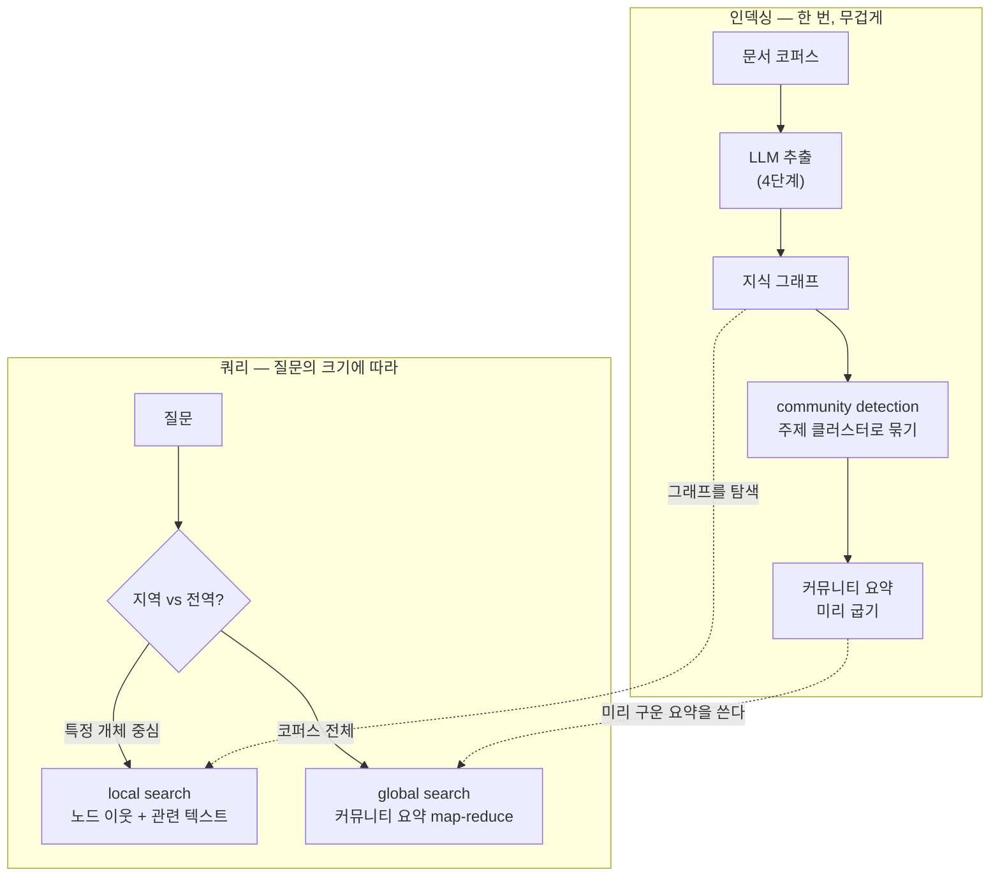

<figure class="post-figure post-figure--header">
<svg role="img" aria-label="GraphRAG의 두 단계를 위아래로 그린 그림. 위쪽 인덱싱 단계에서는 문서 더미가 추출을 거쳐 지식 그래프가 되고, 그 그래프가 community detection으로 색이 다른 세 개의 주제 클러스터로 묶이며, 각 클러스터가 요약으로 압축된다. 아래쪽 쿼리 단계에서는 지역 질문이 특정 노드 이웃으로 좁게 들어가고, 전역 질문이 여러 클러스터 요약을 훑어 종합하는 두 갈래로 나뉜다." viewBox="0 0 680 320" xmlns="http://www.w3.org/2000/svg">
  <title>GraphRAG — 인덱싱(그래프+커뮤니티 요약)과 쿼리(local vs global)</title>
  <defs>
    <marker id="kg5-arw" viewBox="0 0 10 10" refX="8" refY="5" markerWidth="6" markerHeight="6" orient="auto-start-reverse">
      <path d="M0,0 L10,5 L0,10 z" fill="var(--secondary-color)"/>
    </marker>
    <marker id="kg5-gold" viewBox="0 0 10 10" refX="8" refY="5" markerWidth="6" markerHeight="6" orient="auto-start-reverse">
      <path d="M0,0 L10,5 L0,10 z" fill="var(--gold)"/>
    </marker>
  </defs>

  <text x="340" y="22" text-anchor="middle" font-size="15" font-weight="800" fill="currentColor">GraphRAG — 두 단계</text>

  <!-- ===== 인덱싱 ===== -->
  <text x="24" y="48" font-size="10" font-weight="800" fill="var(--secondary-color)">① 인덱싱 — 그래프를 짓고 주제로 묶어 요약을 굽는다</text>

  <!-- 문서 -->
  <rect x="26" y="60" width="60" height="60" rx="3" fill="var(--bg-light)" stroke="currentColor" stroke-width="1.6"/>
  <g stroke="currentColor" stroke-width="0.8" opacity="0.4">
    <line x1="34" y1="72" x2="78" y2="72"/><line x1="34" y1="82" x2="78" y2="82"/><line x1="34" y1="92" x2="70" y2="92"/><line x1="34" y1="104" x2="78" y2="104"/>
  </g>
  <text x="56" y="134" text-anchor="middle" font-size="8" fill="currentColor" opacity="0.75">문서</text>
  <line x1="92" y1="90" x2="118" y2="90" stroke="var(--secondary-color)" stroke-width="1.8" marker-end="url(#kg5-arw)"/>
  <text x="105" y="82" text-anchor="middle" font-size="6.5" fill="var(--secondary-color)">추출</text>

  <!-- 그래프 + 커뮤니티(3색 클러스터) -->
  <g stroke="currentColor" stroke-width="1.2" opacity="0.45">
    <line x1="150" y1="72" x2="180" y2="90"/><line x1="180" y1="90" x2="152" y2="110"/><line x1="150" y1="72" x2="152" y2="110"/>
    <line x1="180" y1="90" x2="222" y2="76"/>
    <line x1="222" y1="76" x2="240" y2="108"/><line x1="240" y1="108" x2="210" y2="118"/>
  </g>
  <g>
    <circle cx="150" cy="72" r="7" fill="var(--bg-panel)" stroke="var(--secondary-color)" stroke-width="2"/>
    <circle cx="180" cy="90" r="7" fill="var(--bg-panel)" stroke="var(--secondary-color)" stroke-width="2"/>
    <circle cx="152" cy="110" r="7" fill="var(--bg-panel)" stroke="var(--secondary-color)" stroke-width="2"/>
    <circle cx="222" cy="76" r="7" fill="var(--bg-panel)" stroke="var(--accent-color)" stroke-width="2"/>
    <circle cx="240" cy="108" r="7" fill="var(--bg-panel)" stroke="var(--accent-color)" stroke-width="2"/>
    <circle cx="210" cy="118" r="7" fill="var(--bg-panel)" stroke="var(--accent-color)" stroke-width="2"/>
  </g>
  <ellipse cx="163" cy="91" rx="30" ry="30" fill="var(--secondary-color)" opacity="0.08" stroke="var(--secondary-color)" stroke-width="1" stroke-dasharray="3 2"/>
  <ellipse cx="224" cy="100" rx="28" ry="28" fill="var(--accent-color)" opacity="0.08" stroke="var(--accent-color)" stroke-width="1" stroke-dasharray="3 2"/>
  <text x="196" y="146" text-anchor="middle" font-size="7.5" fill="currentColor" opacity="0.75">지식 그래프 + 커뮤니티</text>
  <line x1="266" y1="95" x2="292" y2="95" stroke="var(--secondary-color)" stroke-width="1.8" marker-end="url(#kg5-arw)"/>

  <!-- 커뮤니티 요약 -->
  <g>
    <rect x="298" y="66" width="120" height="20" rx="3" fill="var(--bg-panel)" stroke="var(--secondary-color)" stroke-width="1.4"/>
    <text x="358" y="79" text-anchor="middle" font-size="7.5" fill="currentColor">주제 A 요약</text>
    <rect x="298" y="90" width="120" height="20" rx="3" fill="var(--bg-panel)" stroke="var(--accent-color)" stroke-width="1.4"/>
    <text x="358" y="103" text-anchor="middle" font-size="7.5" fill="currentColor">주제 B 요약</text>
    <rect x="298" y="114" width="120" height="20" rx="3" fill="var(--bg-panel)" stroke="var(--gold)" stroke-width="1.4"/>
    <text x="358" y="127" text-anchor="middle" font-size="7.5" fill="currentColor">주제 C 요약</text>
  </g>
  <text x="358" y="150" text-anchor="middle" font-size="7.5" fill="currentColor" opacity="0.7">커뮤니티 요약 (미리 구움)</text>

  <line x1="430" y1="100" x2="470" y2="100" stroke="currentColor" stroke-width="1.4" opacity="0.4"/>
  <text x="500" y="80" text-anchor="middle" font-size="8" fill="currentColor" opacity="0.65">인덱싱이 끝나면</text>
  <text x="500" y="94" text-anchor="middle" font-size="8" fill="currentColor" opacity="0.65">두 종류의 질문에</text>
  <text x="500" y="108" text-anchor="middle" font-size="8" fill="currentColor" opacity="0.65">모두 답할 준비 완료</text>

  <line x1="40" y1="170" x2="640" y2="170" stroke="currentColor" stroke-width="1.2" opacity="0.22"/>

  <!-- ===== 쿼리 ===== -->
  <text x="24" y="192" font-size="10" font-weight="800" fill="var(--gold)">② 쿼리 — 질문의 크기에 따라 두 갈래</text>

  <!-- local -->
  <rect x="40" y="206" width="270" height="94" rx="6" fill="var(--bg-light)" stroke="var(--secondary-color)" stroke-width="2"/>
  <text x="175" y="226" text-anchor="middle" font-size="10" font-weight="800" fill="var(--secondary-color)">local — 특정 개체 이웃</text>
  <g stroke="var(--secondary-color)" stroke-width="1.4">
    <line x1="120" y1="258" x2="150" y2="244"/><line x1="150" y1="244" x2="180" y2="262"/><line x1="120" y1="258" x2="150" y2="272"/>
  </g>
  <g>
    <circle cx="150" cy="244" r="9" fill="var(--bg-panel)" stroke="var(--gold)" stroke-width="2.2"/>
    <circle cx="120" cy="258" r="7" fill="var(--bg-panel)" stroke="var(--secondary-color)" stroke-width="1.6"/>
    <circle cx="180" cy="262" r="7" fill="var(--bg-panel)" stroke="var(--secondary-color)" stroke-width="1.6"/>
    <circle cx="150" cy="272" r="7" fill="var(--bg-panel)" stroke="var(--secondary-color)" stroke-width="1.6"/>
  </g>
  <text x="245" y="252" text-anchor="middle" font-size="7.5" fill="currentColor" opacity="0.72">"X와 관련된</text>
  <text x="245" y="264" text-anchor="middle" font-size="7.5" fill="currentColor" opacity="0.72">사실은?"</text>
  <text x="245" y="284" text-anchor="middle" font-size="7" fill="currentColor" opacity="0.6">좁게·깊게 파고든다</text>

  <!-- global -->
  <rect x="330" y="206" width="310" height="94" rx="6" fill="var(--bg-light)" stroke="var(--gold)" stroke-width="2.2"/>
  <text x="485" y="226" text-anchor="middle" font-size="10" font-weight="800" fill="var(--gold)">global — 커뮤니티 요약 종합</text>
  <g>
    <rect x="350" y="240" width="52" height="16" rx="2" fill="var(--bg-panel)" stroke="var(--secondary-color)" stroke-width="1.2"/>
    <rect x="350" y="262" width="52" height="16" rx="2" fill="var(--bg-panel)" stroke="var(--accent-color)" stroke-width="1.2"/>
    <rect x="408" y="251" width="52" height="16" rx="2" fill="var(--bg-panel)" stroke="var(--gold)" stroke-width="1.2"/>
  </g>
  <line x1="462" y1="259" x2="500" y2="259" stroke="var(--gold)" stroke-width="1.8" marker-end="url(#kg5-gold)"/>
  <rect x="502" y="248" width="120" height="24" rx="3" fill="var(--bg-panel)" stroke="var(--gold)" stroke-width="1.8"/>
  <text x="562" y="263" text-anchor="middle" font-size="7.5" font-weight="700" fill="currentColor">종합 답변</text>
  <text x="485" y="294" text-anchor="middle" font-size="7" fill="currentColor" opacity="0.6">"코퍼스 전체의 핵심 주제는?" — map-reduce로 요약을 종합</text>
</svg>
<figcaption>GraphRAG를 한 장으로 — <strong>인덱싱</strong>에서 문서를 그래프로 짓고 <strong>커뮤니티로 묶어 요약</strong>을 미리 구워 둔 뒤, <strong>쿼리</strong>에서 지역(local) 질문은 특정 개체 이웃으로 좁게, 전역(global) 질문은 커뮤니티 요약을 종합해 답한다.</figcaption>
</figure>

## 들어가며

이 글은 [Agentic Knowledge Graph Curriculum](/2026/07/21/agentic-knowledge-graph-curriculum.html)의 **5단계**입니다. [1단계](/2026/07/21/kg-what-is-knowledge-graph.html)에서 벡터 DB가 "의미가 비슷한 조각"은 잘 찾지만 *연결*에는 약하다는 점을 짚었고, [4단계](/2026/07/21/kg-llm-graph-construction.html)에서 LLM으로 그래프를 짓는 법을 익혔습니다. 이 글은 그 둘을 잇습니다 — **지은 그래프를 검색에 결합해 벡터 RAG의 빈틈을 메우는 GraphRAG**입니다.

RAG(Retrieval-Augmented Generation)는 이제 LLM 애플리케이션의 기본기입니다. 문서를 임베딩으로 저장하고, 질문과 의미가 가까운 조각을 찾아 LLM에 넘겨 답하게 합니다. 그런데 이 벡터 RAG가 자꾸 헛발질하는 두 종류의 질문이 있습니다 — **여러 사실을 연결해야 답이 나오는 다중 홉 질문**, 그리고 **"이 코퍼스 전체를 관통하는 핵심은?" 같은 전역 질문**입니다. GraphRAG는 정확히 이 두 빈틈을 겨냥합니다.

### 📌 이 글에서 다루는 내용

- **벡터 RAG의 한계**: 다중 홉·전역·설명가능성에서 top-k 의미 검색이 놓치는 것, 왜 "조각을 잘 찾는 것"만으로는 부족한가
- **GraphRAG 아키텍처**: 문서→그래프 인덱싱, community detection으로 주제 클러스터 만들기, 요약을 미리 굽기, local search와 global search의 차이
- **하이브리드·트레이드오프**: 벡터와 그래프를 함께 쓰는 하이브리드 검색, 인덱싱 비용·지연·정확도의 균형, 언제 GraphRAG가 값을 하는가

## 한눈에 보기 — 인덱싱과 쿼리, 두 단계

GraphRAG는 두 단계로 이해하면 명료합니다. **인덱싱**은 무겁지만 한 번만(그래프를 짓고 커뮤니티 요약을 미리 굽습니다), **쿼리**는 그 위에서 질문의 크기에 따라 두 갈래로 답합니다.

이 그림의 좌표는 하나입니다 — **GraphRAG의 힘은 "커뮤니티 요약을 미리 구워 둔다"는 것**입니다. 덕분에 벡터 RAG가 못 하던 전역 질문에, 질의 시점에 코퍼스 전체를 다시 읽지 않고도 답할 수 있습니다.

## 벡터 RAG의 한계 — 조각을 잘 찾는 것만으로는

벡터 RAG의 동작을 한 줄로 요약하면 "질문과 **의미가 가까운 조각(top-k)**을 찾아 LLM에 넘긴다"입니다. 이 방식이 구조적으로 약한 지점이 셋 있습니다.

- **다중 홉 질문**: "우리 회사에 투자한 VC가 투자한 *다른* 회사 중 우리 경쟁사는?" — 답이 한 문단에 있지 않고 여러 사실(투자 관계 → 다른 투자처 → 경쟁 여부)을 *연결*해야 나옵니다. 의미가 비슷한 조각을 아무리 모아도, 벡터 검색은 그 연결을 스스로 잇지 못합니다.
- **전역(global) 질문**: "이 문서 코퍼스 전체를 관통하는 핵심 리스크 다섯 가지는?" — top-k는 코퍼스의 *일부 조각*만 볼 뿐, 전체를 조망해 종합하지 못합니다. k를 아무리 키워도 컨텍스트 창을 넘습니다.
- **설명가능성**: "왜 이 답인가"가 벡터 거리로만 남습니다. 근거를 *경로*로 제시하지 못합니다.

공통 원인은 하나입니다 — **벡터 RAG에는 개체와 개체 사이의 명시적 구조가 없습니다.** 조각들은 서로 독립적인 점일 뿐, 그들이 어떻게 연결되는지·전체가 어떤 주제로 뭉치는지를 모릅니다. GraphRAG는 바로 그 구조를 그래프로 복원합니다.

<figure class="post-figure">
<svg role="img" aria-label="같은 다중 홉 질문에 두 방식이 어떻게 반응하는지 좌우로 대비한 그림. 왼쪽 벡터 RAG는 관련 조각 세 개를 각각 찾아내지만 서로 떨어진 채로 남아 물음표만 맴돌고 연결을 잇지 못한다. 오른쪽 그래프는 누리테크에서 VC를 거쳐 미리내로 이어지는 경로를 따라가 미리내를 경쟁사라는 답으로 밝혀낸다." viewBox="0 0 640 300" xmlns="http://www.w3.org/2000/svg">
  <title>다중 홉 질문 — 벡터 RAG는 조각을 못 잇고, 그래프는 경로로 잇는다</title>
  <defs>
    <marker id="kg5b-arw" viewBox="0 0 10 10" refX="8" refY="5" markerWidth="6" markerHeight="6" orient="auto-start-reverse">
      <path d="M0,0 L10,5 L0,10 z" fill="var(--gold)"/>
    </marker>
  </defs>

  <text x="320" y="22" text-anchor="middle" font-size="13" font-weight="800" fill="currentColor">같은 다중 홉 질문 — "누리테크의 경쟁사는?"</text>

  <!-- ===== 왼쪽: 벡터 RAG ===== -->
  <rect x="18" y="38" width="292" height="248" rx="6" fill="var(--bg-light)" stroke="var(--secondary-color)" stroke-width="1.6"/>
  <text x="164" y="58" text-anchor="middle" font-size="10.5" font-weight="800" fill="var(--secondary-color)">벡터 RAG — 흩어진 top-k 조각</text>

  <!-- 조각 3개, 서로 떨어져 있음 -->
  <g font-size="7.5" fill="currentColor">
    <rect x="36" y="76" width="128" height="30" rx="3" fill="var(--bg-panel)" stroke="currentColor" stroke-width="1"/>
    <text x="100" y="88" text-anchor="middle" opacity="0.85">…VC가 누리테크에</text>
    <text x="100" y="99" text-anchor="middle" opacity="0.85">투자했다…</text>

    <rect x="168" y="130" width="128" height="30" rx="3" fill="var(--bg-panel)" stroke="currentColor" stroke-width="1"/>
    <text x="232" y="142" text-anchor="middle" opacity="0.85">…VC가 미리내에도</text>
    <text x="232" y="153" text-anchor="middle" opacity="0.85">투자했다…</text>

    <rect x="40" y="186" width="128" height="30" rx="3" fill="var(--bg-panel)" stroke="currentColor" stroke-width="1"/>
    <text x="104" y="198" text-anchor="middle" opacity="0.85">…미리내는 급성장</text>
    <text x="104" y="209" text-anchor="middle" opacity="0.85">스타트업이다…</text>
  </g>
  <!-- 끊긴 연결 -->
  <g stroke="currentColor" stroke-width="1.2" stroke-dasharray="3 3" opacity="0.4" fill="none">
    <path d="M164 96 Q210 110 190 130"/>
    <path d="M180 160 Q140 176 120 186"/>
  </g>
  <text x="245" y="196" font-size="20" font-weight="800" fill="var(--accent-color)" opacity="0.8">?</text>
  <text x="164" y="240" text-anchor="middle" font-size="8" fill="var(--accent-color)">조각은 다 찾았지만 — 연결을 스스로 못 잇는다</text>
  <text x="164" y="266" text-anchor="middle" font-size="7.5" fill="currentColor" opacity="0.6">독립된 점들일 뿐, 개체 사이 구조가 없다</text>

  <!-- ===== 오른쪽: 그래프 ===== -->
  <rect x="330" y="38" width="292" height="248" rx="6" fill="var(--bg-light)" stroke="var(--gold)" stroke-width="2"/>
  <text x="476" y="58" text-anchor="middle" font-size="10.5" font-weight="800" fill="var(--gold)">그래프 — 경로가 곧 답이자 근거</text>

  <!-- 경로: 누리테크 → VC → 미리내 -->
  <line x1="416" y1="118" x2="452" y2="106" stroke="var(--secondary-color)" stroke-width="1.8" marker-end="url(#kg5b-arw)"/>
  <line x1="504" y1="112" x2="536" y2="140" stroke="var(--secondary-color)" stroke-width="1.8" marker-end="url(#kg5b-arw)"/>
  <text x="426" y="100" text-anchor="middle" font-size="6.5" fill="var(--secondary-color)">투자받음</text>
  <text x="530" y="112" text-anchor="middle" font-size="6.5" fill="var(--secondary-color)">투자함</text>

  <rect x="348" y="105" width="70" height="28" rx="4" fill="var(--bg-panel)" stroke="currentColor" stroke-width="1.6"/>
  <text x="383" y="123" text-anchor="middle" font-size="8" font-weight="700" fill="currentColor">누리테크</text>
  <text x="383" y="146" text-anchor="middle" font-size="6.5" fill="currentColor" opacity="0.6">우리 회사</text>

  <rect x="450" y="90" width="54" height="26" rx="4" fill="var(--bg-panel)" stroke="currentColor" stroke-width="1.6"/>
  <text x="477" y="107" text-anchor="middle" font-size="8" font-weight="700" fill="currentColor">VC</text>

  <rect x="534" y="130" width="72" height="28" rx="4" fill="var(--bg-panel)" stroke="var(--gold)" stroke-width="2.4"/>
  <text x="570" y="148" text-anchor="middle" font-size="8" font-weight="800" fill="currentColor">미리내</text>
  <text x="570" y="172" text-anchor="middle" font-size="7.5" font-weight="700" fill="var(--gold)">= 경쟁사 ✓</text>

  <text x="476" y="240" text-anchor="middle" font-size="8" fill="currentColor" opacity="0.78">홉을 따라 연결을 잇는다 — 누리테크 → VC → 미리내</text>
  <text x="476" y="266" text-anchor="middle" font-size="7.5" fill="currentColor" opacity="0.6">경로 자체가 "왜 이 답인가"의 근거가 된다</text>
</svg>
<figcaption>같은 다중 홉 질문에 대해 — <strong>벡터 RAG</strong>는 관련 조각을 다 찾고도 서로 떨어진 점으로 남겨 연결을 못 잇지만, <strong>그래프</strong>는 개체를 잇는 경로를 따라가 답을 밝히고 그 경로가 곧 근거가 된다. (개체명은 예시입니다.)</figcaption>
</figure>

## GraphRAG 아키텍처 — 그래프에 구조를 새기다

Microsoft가 2024년 공개한 **GraphRAG**가 이 접근의 대표 구현입니다. 핵심은 인덱싱 단계에서 코퍼스에 *구조*를 미리 새겨 두는 것입니다.

### 인덱싱 — 그래프와 커뮤니티 요약

1. **엔티티·관계 추출**: [4단계](/2026/07/21/kg-llm-graph-construction.html)의 LLM 추출로 문서에서 개체와 관계를 뽑아 지식 그래프를 짓습니다.
2. **community detection**: 그래프에서 서로 촘촘히 연결된 노드 묶음(**커뮤니티**, 곧 주제 클러스터)을 찾습니다. Leiden 같은 알고리즘이 그래프를 계층적 주제 그룹으로 분할합니다 — "이 코퍼스에는 규제 관련 주제, 제품 관련 주제, 인사 관련 주제가 있다"처럼.
3. **커뮤니티 요약**: 각 커뮤니티를 LLM으로 요약해 **미리 구워** 둡니다. 이 요약이 전역 질문의 재료가 됩니다.

이 인덱싱은 무겁습니다(코퍼스 전체를 LLM에 통과시키고 요약까지 생성). 하지만 한 번 구워 두면, 질의 시점의 비용이 극적으로 낮아집니다.

### 쿼리 — local과 global

인덱싱이 끝나면 두 종류의 검색이 가능합니다.

- **local search(지역 검색)**: 질문이 특정 개체를 중심으로 할 때. 그 노드의 **이웃**(연결된 개체·관계)과 관련 원문 조각을 함께 모아 LLM에 넘깁니다. 다중 홉 질문 — "X와 연결된 Y를 거쳐 Z를…" — 이 여기서 풀립니다. 벡터 RAG가 못 하던 *연결*을 그래프가 이어 줍니다.
- **global search(전역 검색)**: 질문이 코퍼스 전체를 조망할 때. 미리 구운 **커뮤니티 요약들을 map-reduce**로 종합합니다 — 각 요약이 질문에 부분 답변을 내고(map), 그것을 하나로 합칩니다(reduce). "코퍼스 전체의 핵심 주제는?"이 여기서 답해집니다. *(예: 사내 위키 전체에 대해 "우리 팀들이 반복적으로 부딪히는 리스크는?"을 물으면, 팀별 커뮤니티 요약이 각자 리스크를 내고 종합됩니다.)*

<figure class="post-figure">
<svg role="img" aria-label="두 검색 메커니즘을 위아래로 그린 그림. 위쪽 local search는 씨앗 개체 하나에서 시작해 한 홉, 두 홉으로 이웃을 넓혀 노드 이웃과 원문 조각을 모아 답변을 만든다. 아래쪽 global search는 질문을 세 개의 커뮤니티 요약에 각각 던져 부분 답변을 얻는 map 단계와, 그 부분 답변들을 하나로 합치는 reduce 단계를 거쳐 종합 답변을 낸다." viewBox="0 0 640 340" xmlns="http://www.w3.org/2000/svg">
  <title>쿼리의 두 메커니즘 — local의 이웃 확장 vs global의 map-reduce</title>
  <defs>
    <marker id="kg5c-arw" viewBox="0 0 10 10" refX="8" refY="5" markerWidth="6" markerHeight="6" orient="auto-start-reverse">
      <path d="M0,0 L10,5 L0,10 z" fill="var(--secondary-color)"/>
    </marker>
    <marker id="kg5c-gold" viewBox="0 0 10 10" refX="8" refY="5" markerWidth="6" markerHeight="6" orient="auto-start-reverse">
      <path d="M0,0 L10,5 L0,10 z" fill="var(--gold)"/>
    </marker>
  </defs>

  <!-- ===== local ===== -->
  <text x="24" y="26" font-size="11" font-weight="800" fill="var(--secondary-color)">local — 씨앗 개체에서 이웃으로 홉을 넓힌다</text>

  <!-- 씨앗 → 1홉 → 2홉 -->
  <g stroke="var(--secondary-color)" stroke-width="1.4" opacity="0.7">
    <line x1="86" y1="80" x2="148" y2="60"/><line x1="86" y1="80" x2="150" y2="104"/>
    <line x1="148" y1="60" x2="214" y2="52"/><line x1="150" y1="104" x2="216" y2="112"/><line x1="150" y1="104" x2="212" y2="84"/>
  </g>
  <circle cx="80" cy="80" r="14" fill="var(--bg-panel)" stroke="var(--gold)" stroke-width="2.6"/>
  <text x="80" y="83" text-anchor="middle" font-size="7" font-weight="800" fill="currentColor">씨앗</text>
  <g fill="var(--bg-panel)" stroke="var(--secondary-color)" stroke-width="1.8">
    <circle cx="148" cy="60" r="8"/><circle cx="150" cy="104" r="8"/>
    <circle cx="214" cy="52" r="7"/><circle cx="212" cy="84" r="7"/><circle cx="216" cy="112" r="7"/>
  </g>
  <text x="118" y="140" text-anchor="middle" font-size="7" fill="currentColor" opacity="0.6">1홉</text>
  <text x="213" y="140" text-anchor="middle" font-size="7" fill="currentColor" opacity="0.6">2홉 …</text>

  <line x1="248" y1="82" x2="286" y2="82" stroke="var(--secondary-color)" stroke-width="1.8" marker-end="url(#kg5c-arw)"/>

  <rect x="290" y="62" width="150" height="40" rx="5" fill="var(--bg-light)" stroke="var(--secondary-color)" stroke-width="1.6"/>
  <text x="365" y="79" text-anchor="middle" font-size="8" fill="currentColor">노드 이웃 + 원문 조각</text>
  <text x="365" y="93" text-anchor="middle" font-size="7" fill="currentColor" opacity="0.65">(그래프 + 텍스트 하이브리드)</text>

  <line x1="446" y1="82" x2="484" y2="82" stroke="var(--secondary-color)" stroke-width="1.8" marker-end="url(#kg5c-arw)"/>
  <rect x="488" y="64" width="120" height="36" rx="5" fill="var(--bg-panel)" stroke="var(--secondary-color)" stroke-width="1.8"/>
  <text x="548" y="86" text-anchor="middle" font-size="8" font-weight="700" fill="currentColor">다중 홉 답변</text>

  <text x="320" y="128" text-anchor="middle" font-size="7.5" fill="currentColor" opacity="0.62">특정 개체 중심 · 좁게·깊게 — 홉을 따라 연결을 잇는다</text>

  <line x1="24" y1="158" x2="616" y2="158" stroke="currentColor" stroke-width="1.2" opacity="0.22"/>

  <!-- ===== global ===== -->
  <text x="24" y="184" font-size="11" font-weight="800" fill="var(--gold)">global — 커뮤니티 요약을 map-reduce로 종합</text>

  <rect x="24" y="230" width="70" height="30" rx="4" fill="var(--bg-panel)" stroke="currentColor" stroke-width="1.6"/>
  <text x="59" y="249" text-anchor="middle" font-size="8" font-weight="700" fill="currentColor">질문</text>

  <!-- map: 질문 → 3 커뮤니티 요약 -->
  <g stroke="var(--gold)" stroke-width="1.5" opacity="0.75">
    <line x1="94" y1="238" x2="146" y2="212" marker-end="url(#kg5c-gold)"/>
    <line x1="94" y1="245" x2="146" y2="245" marker-end="url(#kg5c-gold)"/>
    <line x1="94" y1="252" x2="146" y2="278" marker-end="url(#kg5c-gold)"/>
  </g>
  <g>
    <rect x="150" y="200" width="118" height="24" rx="3" fill="var(--bg-panel)" stroke="var(--secondary-color)" stroke-width="1.4"/>
    <text x="209" y="216" text-anchor="middle" font-size="7.5" fill="currentColor">주제 A 요약</text>
    <rect x="150" y="233" width="118" height="24" rx="3" fill="var(--bg-panel)" stroke="var(--accent-color)" stroke-width="1.4"/>
    <text x="209" y="249" text-anchor="middle" font-size="7.5" fill="currentColor">주제 B 요약</text>
    <rect x="150" y="266" width="118" height="24" rx="3" fill="var(--bg-panel)" stroke="var(--gold)" stroke-width="1.4"/>
    <text x="209" y="282" text-anchor="middle" font-size="7.5" fill="currentColor">주제 C 요약</text>
  </g>

  <!-- 부분 답변 (map 결과) -->
  <g stroke="currentColor" stroke-width="1.2" opacity="0.55">
    <line x1="268" y1="212" x2="300" y2="216" marker-end="url(#kg5c-arw)"/>
    <line x1="268" y1="245" x2="300" y2="245" marker-end="url(#kg5c-arw)"/>
    <line x1="268" y1="278" x2="300" y2="274" marker-end="url(#kg5c-arw)"/>
  </g>
  <g fill="var(--bg-light)" stroke="currentColor" stroke-width="1">
    <rect x="304" y="206" width="88" height="20" rx="3"/>
    <rect x="304" y="235" width="88" height="20" rx="3"/>
    <rect x="304" y="264" width="88" height="20" rx="3"/>
  </g>
  <g font-size="7" fill="currentColor" opacity="0.85" text-anchor="middle">
    <text x="348" y="219">부분 답변 A</text>
    <text x="348" y="248">부분 답변 B</text>
    <text x="348" y="277">부분 답변 C</text>
  </g>
  <text x="270" y="308" text-anchor="middle" font-size="8" font-weight="700" fill="var(--gold)">map — 요약마다 부분 답변</text>

  <!-- reduce -->
  <g stroke="var(--gold)" stroke-width="1.6" opacity="0.8">
    <line x1="392" y1="216" x2="430" y2="238" marker-end="url(#kg5c-gold)"/>
    <line x1="392" y1="245" x2="430" y2="245" marker-end="url(#kg5c-gold)"/>
    <line x1="392" y1="274" x2="430" y2="252" marker-end="url(#kg5c-gold)"/>
  </g>
  <rect x="434" y="228" width="76" height="34" rx="5" fill="var(--bg-light)" stroke="var(--gold)" stroke-width="2"/>
  <text x="472" y="249" text-anchor="middle" font-size="8.5" font-weight="800" fill="currentColor">reduce</text>

  <line x1="512" y1="245" x2="548" y2="245" stroke="var(--gold)" stroke-width="1.8" marker-end="url(#kg5c-gold)"/>
  <rect x="550" y="227" width="66" height="36" rx="5" fill="var(--bg-panel)" stroke="var(--gold)" stroke-width="2.2"/>
  <text x="583" y="249" text-anchor="middle" font-size="8" font-weight="800" fill="currentColor">종합 답변</text>
  <text x="490" y="308" text-anchor="middle" font-size="8" font-weight="700" fill="var(--gold)">reduce — 하나로 합침</text>
</svg>
<figcaption><strong>local</strong>은 씨앗 개체에서 이웃으로 홉을 넓혀 "노드 이웃 + 원문"을 모아 다중 홉 질문에 답하고, <strong>global</strong>은 커뮤니티 요약마다 부분 답변을 내는 <strong>map</strong> 뒤에 그것을 하나로 합치는 <strong>reduce</strong>로 전역 질문에 답한다.</figcaption>
</figure>

## 하이브리드와 트레이드오프 — 언제 값을 하는가

### 벡터 + 그래프 하이브리드

GraphRAG는 벡터 RAG의 **대체가 아니라 보완**입니다. 실전에서는 둘을 함께 씁니다 — 벡터 검색으로 질문과 관련된 진입 개체를 찾아 그래프에 들어가고(vector로 seed), 그래프 탐색으로 연결을 따라가 답을 완성합니다. local search 자체가 이미 "그래프 이웃 + 관련 텍스트 조각"을 섞는 하이브리드입니다. 순수 의미 유사도가 중요한 단순 Q&A는 여전히 벡터 RAG가 더 싸고 빠릅니다.

### 비용·지연·정확도

GraphRAG의 값은 공짜가 아닙니다.

- **인덱싱 비용**: 코퍼스 전체를 LLM으로 추출·요약하므로 초기 비용·시간이 큽니다. 코퍼스가 자주 바뀌면 재인덱싱 부담이 커집니다(7단계의 *증분 갱신*이 이 문제를 다룹니다).
- **정확도 향상**: 대신 다중 홉·전역 질문의 답변 품질과 근거 제시 능력이 크게 오릅니다.
- **선택 기준**: **질문이 연결·종합을 요구하고, 코퍼스가 상대적으로 안정적**일 때 GraphRAG가 값을 합니다. 질문이 단순 조각 검색이고 최신성이 절대적이면 벡터 RAG로 충분합니다.

정리하면 — **"연결이 답인 질문이 자주 나오는가"**가 GraphRAG 도입의 판단 기준입니다. 1단계에서 세운 그 성질이 여기서 다시 돌아옵니다.

## 정리

- **벡터 RAG는 조각을 잘 찾지만 연결을 못 잇습니다**: 다중 홉·전역·설명가능성이 필요한 질문에서 구조적으로 약합니다 — 개체 사이의 명시적 구조가 없기 때문입니다.
- **GraphRAG는 그 구조를 그래프로 복원**합니다. 인덱싱에서 문서를 그래프로 짓고, community detection으로 주제를 묶고, 요약을 미리 굽습니다.
- **쿼리는 두 갈래**입니다 — local search는 개체 이웃으로 다중 홉 질문에, global search는 커뮤니티 요약 map-reduce로 전역 질문에 답합니다.
- **벡터와 그래프는 하이브리드**로 함께 쓰입니다. GraphRAG는 인덱싱 비용을 대가로 연결·종합 질문의 품질을 얻습니다 — "연결이 답인 질문이 자주 나오는가"가 도입 기준입니다.

다음 글에서는 그래프를 *읽는* 데서 *예측·추론*으로 넓힙니다 — 노드를 벡터로 옮기는 임베딩, 없는 관계를 예측하는 링크 예측, 그리고 다중 홉 추론입니다.

### 다음 학습 (Next Learning)

- [6단계 · 그래프 임베딩·추론: node embedding·link prediction·multi-hop](/2026/07/21/kg-embeddings-reasoning.html) — 읽기를 넘어 예측·추론으로
- [4단계 · LLM 기반 그래프 구축](/2026/07/21/kg-llm-graph-construction.html) — GraphRAG 인덱싱이 딛고 선 추출 단계로 돌아가기
- [1단계 · 지식 그래프란 무엇인가](/2026/07/21/kg-what-is-knowledge-graph.html) — 벡터 vs 그래프의 상보성 복습
