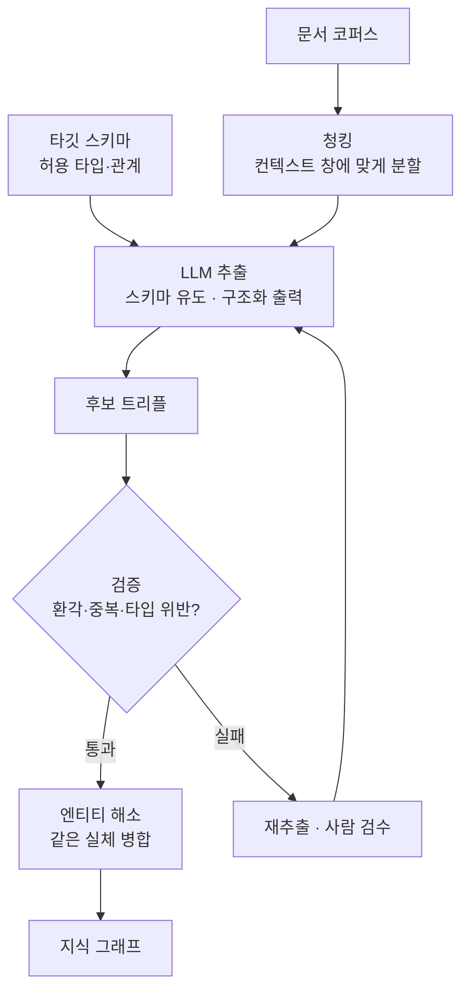

<figure class="post-figure post-figure--header">
<svg role="img" aria-label="전통 추출 파이프라인과 LLM 기반 추출을 위아래로 대비하고, 그 뒤에 공통의 검증 관문을 둔 그림. 위쪽 전통 파이프라인은 여러 개의 톱니바퀴(규칙·라벨링·학습)가 줄지어 있어 도메인마다 무겁다. 아래쪽 LLM 경로는 문서와 스키마 프롬프트가 하나의 LLM 상자로 들어가 곧바로 트리플을 낸다. 두 경로가 만나는 오른쪽에는 검증과 사람 검수를 뜻하는 체크 관문이 있고, 그 뒤에 지식 그래프가 놓인다." viewBox="0 0 680 300" xmlns="http://www.w3.org/2000/svg">
  <title>추출의 전환 — 무거운 전통 파이프라인에서 스키마 유도 LLM 추출로, 검증 관문은 그대로</title>
  <defs>
    <marker id="kg4-arw" viewBox="0 0 10 10" refX="8" refY="5" markerWidth="6" markerHeight="6" orient="auto-start-reverse">
      <path d="M0,0 L10,5 L0,10 z" fill="var(--secondary-color)"/>
    </marker>
    <marker id="kg4-gold" viewBox="0 0 10 10" refX="8" refY="5" markerWidth="6" markerHeight="6" orient="auto-start-reverse">
      <path d="M0,0 L10,5 L0,10 z" fill="var(--gold)"/>
    </marker>
  </defs>

  <text x="340" y="24" text-anchor="middle" font-size="15" font-weight="800" fill="currentColor">추출을 뒤집다 — 그래도 검증은 남는다</text>

  <!-- 전통 (위) -->
  <text x="24" y="58" font-size="9.5" font-weight="700" fill="currentColor" opacity="0.6">전통 파이프라인 — 도메인마다 무겁다</text>
  <g opacity="0.6">
    <g fill="var(--border-color)" stroke="currentColor" stroke-width="1.2">
      <circle cx="60" cy="86" r="14"/><circle cx="110" cy="86" r="14"/><circle cx="160" cy="86" r="14"/><circle cx="210" cy="86" r="14"/>
    </g>
    <g fill="currentColor" font-size="6.5" text-anchor="middle" opacity="0.85">
      <text x="60" y="89">규칙</text><text x="110" y="89">라벨링</text><text x="160" y="89">학습</text><text x="210" y="89">튜닝</text>
    </g>
    <line x1="76" y1="86" x2="94" y2="86" stroke="currentColor" stroke-width="1.4"/>
    <line x1="126" y1="86" x2="144" y2="86" stroke="currentColor" stroke-width="1.4"/>
    <line x1="176" y1="86" x2="194" y2="86" stroke="currentColor" stroke-width="1.4"/>
  </g>
  <line x1="228" y1="86" x2="292" y2="120" stroke="currentColor" stroke-width="1.6" opacity="0.5" marker-end="url(#kg4-arw)"/>

  <!-- LLM (아래) -->
  <text x="24" y="150" font-size="9.5" font-weight="700" fill="var(--secondary-color)">LLM 경로 — 스키마 프롬프트 하나로</text>
  <rect x="40" y="164" width="80" height="30" rx="3" fill="var(--bg-light)" stroke="currentColor" stroke-width="1.6"/>
  <text x="80" y="183" text-anchor="middle" font-size="8" font-weight="700" fill="currentColor">문서</text>
  <rect x="40" y="202" width="80" height="26" rx="3" fill="var(--bg-light)" stroke="var(--accent-color)" stroke-width="1.6"/>
  <text x="80" y="219" text-anchor="middle" font-size="7.5" font-weight="700" fill="var(--accent-color)">스키마 프롬프트</text>
  <line x1="122" y1="180" x2="150" y2="188" stroke="var(--secondary-color)" stroke-width="1.8" marker-end="url(#kg4-arw)"/>
  <line x1="122" y1="214" x2="150" y2="200" stroke="var(--secondary-color)" stroke-width="1.8" marker-end="url(#kg4-arw)"/>
  <rect x="154" y="168" width="72" height="52" rx="6" fill="var(--bg-panel)" stroke="var(--secondary-color)" stroke-width="2.2"/>
  <text x="190" y="190" text-anchor="middle" font-size="12" font-weight="800" fill="var(--secondary-color)">LLM</text>
  <text x="190" y="206" text-anchor="middle" font-size="6.5" fill="currentColor" opacity="0.7">구조화 출력</text>
  <line x1="228" y1="180" x2="292" y2="150" stroke="var(--secondary-color)" stroke-width="1.8" marker-end="url(#kg4-arw)"/>

  <!-- 트리플 -->
  <rect x="298" y="118" width="104" height="60" rx="4" fill="var(--bg-panel)" stroke="currentColor" stroke-width="1.8"/>
  <text x="350" y="136" text-anchor="middle" font-size="9" font-weight="800" fill="currentColor">추출된 트리플</text>
  <g font-size="6.5" font-family="monospace" fill="currentColor" opacity="0.8">
    <text x="308" y="152">(김지수, 근무, 누리테크)</text>
    <text x="308" y="164">(누리테크, 출시, 미리내)</text>
  </g>

  <line x1="406" y1="148" x2="440" y2="148" stroke="var(--gold)" stroke-width="2.2" marker-end="url(#kg4-gold)"/>

  <!-- 검증 관문 -->
  <rect x="444" y="112" width="104" height="72" rx="6" fill="var(--bg-light)" stroke="var(--gold)" stroke-width="2.5"/>
  <text x="496" y="132" text-anchor="middle" font-size="9.5" font-weight="800" fill="var(--gold)">검증 관문</text>
  <text x="496" y="148" text-anchor="middle" font-size="7" fill="currentColor" opacity="0.75">환각·중복·불일치</text>
  <!-- human icon -->
  <g stroke="currentColor" stroke-width="1.6" fill="none">
    <circle cx="478" cy="164" r="5"/>
    <path d="M470,178 q8,-10 16,0" />
  </g>
  <path d="M498,160 l5,6 l10,-12" fill="none" stroke="var(--gold)" stroke-width="2.4" stroke-linecap="round"/>
  <text x="500" y="180" text-anchor="middle" font-size="6.5" fill="currentColor" opacity="0.7">사람 검수</text>

  <line x1="552" y1="148" x2="586" y2="148" stroke="var(--gold)" stroke-width="2.2" marker-end="url(#kg4-gold)"/>

  <!-- 그래프 -->
  <g stroke="var(--gold)" stroke-width="2" opacity="0.7">
    <line x1="612" y1="126" x2="644" y2="148"/>
    <line x1="644" y1="148" x2="616" y2="176"/>
  </g>
  <g>
    <circle cx="612" cy="126" r="9" fill="var(--bg-panel)" stroke="currentColor" stroke-width="2"/>
    <circle cx="648" cy="148" r="9" fill="var(--bg-panel)" stroke="var(--gold)" stroke-width="2"/>
    <circle cx="616" cy="178" r="9" fill="var(--bg-panel)" stroke="currentColor" stroke-width="2"/>
  </g>
  <text x="628" y="200" text-anchor="middle" font-size="8.5" font-weight="700" fill="var(--gold)">지식 그래프</text>

  <line x1="24" y1="238" x2="656" y2="238" stroke="currentColor" stroke-width="1.2" opacity="0.22"/>
  <text x="340" y="262" text-anchor="middle" font-size="10" font-weight="700" fill="currentColor" opacity="0.75">LLM은 추출의 문턱을 낮춘다 — 스키마 규율과 엔티티 해소 숙제는 검증 관문에 그대로 남는다</text>
  <text x="340" y="282" text-anchor="middle" font-size="8.5" fill="currentColor" opacity="0.58">"공짜가 아니다" — 품질을 가르는 것은 추출이 아니라 그 뒤의 검증이다</text>
</svg>
<figcaption>추출의 전환을 한 장으로 — 도메인마다 무겁던 전통 파이프라인 대신, <strong>문서 + 스키마 프롬프트</strong>를 LLM에 넣어 곧바로 트리플을 얻는다. 그러나 <strong>환각·중복·불일치를 거르는 검증 관문</strong>과 사람 검수는 그대로 남는다 — 품질을 가르는 것은 그 관문이다.</figcaption>
</figure>

## 들어가며

이 글은 [Agentic Knowledge Graph Curriculum](/2026/07/21/agentic-knowledge-graph-curriculum.html)의 **4단계**이자, 시리즈 2막 "지능을 얹기"의 문을 여는 글입니다. [3단계](/2026/07/21/kg-construction-entity-relation-extraction.html)에서 우리는 전통 추출 파이프라인 — 규칙·통계·지도학습 — 이 강력하지만 **도메인마다 라벨링·튜닝 비용이 크고 이식성이 낮다**는 한계를 봤습니다. 이 글은 그 판을 뒤집는 엔진, **LLM 기반 그래프 구축**을 다룹니다.

핵심 전환은 단순합니다. 정교한 규칙이나 라벨링된 코퍼스 대신, **LLM에 스키마를 프롬프트로 알려 주고 문서에서 트리플을 뽑아 달라고** 하는 것입니다. 도메인이 바뀌면 프롬프트의 스키마만 바꾸면 됩니다 — 재학습이 없습니다. 이 낮아진 문턱이 2020년대 지식 그래프 부흥의 첫 번째 동력입니다.

다만 [3단계에서 예고](/2026/07/21/kg-construction-entity-relation-extraction.html)했듯, **LLM은 공짜가 아닙니다.** 추출의 문턱은 낮췄지만, 스키마 규율과 엔티티 해소라는 옛 숙제는 그대로 남고 — 거기에 LLM 특유의 새 문제인 **환각(없는 관계 지어내기)**이 더해집니다. 그래서 이 글의 무게중심은 "어떻게 뽑는가"만큼이나 "**어떻게 검증하는가**"에 있습니다.

<div class="post-summary-box" markdown="1">

### 📌 이 글에서 다루는 내용

- **스키마 유도 LLM 추출**: 프롬프트로 타입·관계를 지시하고 구조화 출력(JSON·함수 호출)으로 트리플을 강제로 뽑는 법, few-shot과 스키마 제약
- **구축 도구와 파이프라인**: LangChain `LLMGraphTransformer`, LlamaIndex 프로퍼티 그래프 인덱스의 접근, 청킹·프롬프트 설계·비용 관리
- **품질·검증·휴먼인더루프**: 환각·중복·불일치를 잡는 검증, 신뢰도 점수, 엔티티 해소가 여전히 필요한 이유, 사람 검수 루프

</div>

## 한눈에 보기 — LLM 추출 파이프라인

LLM으로 그래프를 짓는 일도 하나의 파이프라인입니다. 문서를 청크로 나누고, 스키마를 곁들여 LLM에 추출을 시키고, 나온 트리플을 검증·해소한 뒤 그래프에 적재합니다. **검증 루프**가 다시 추출로 되돌아가는 것이 핵심입니다.



이 그림의 좌표는 하나입니다 — **LLM은 파이프라인의 한 상자를 바꿀 뿐, 파이프라인 자체를 없애지 않습니다.** 스키마가 앞에서 추출을 안내하고, 검증이 뒤에서 품질을 지킵니다.

## 스키마 유도 LLM 추출 — 프롬프트로 트리플을 뽑다

### 스키마를 프롬프트에 싣기

핵심은 LLM에 "무엇을 뽑을지"를 명확히 지시하는 것입니다. 허용할 **노드 타입**과 **관계 타입**을 프롬프트에 실으면(스키마 유도, schema-guided), LLM이 자유롭게 지어내는 대신 그 어휘 안에서 추출합니다. 이것이 스키마 없이 뽑을 때보다 일관성을 크게 높입니다.

```text
[지시]
다음 텍스트에서 지식 그래프 트리플을 추출하라.
허용 노드 타입: 사람, 회사, 제품, 날짜
허용 관계 타입: 근무(사람→회사), 출시(회사→제품), 합류시점(사람→날짜)
스키마에 없는 타입·관계는 만들지 마라. 텍스트에 없는 사실은 추론하지 마라.
출력은 아래 JSON 스키마를 따른다.

[텍스트]
"김지수는 2021년 누리테크에 합류해 미리내 개발을 이끌었다."
```

### 구조화 출력으로 강제하기

추출 결과가 매번 다른 형식이면 파이프라인이 깨집니다. **구조화 출력(structured output)** — JSON 스키마나 함수 호출(tool calling) — 로 형식을 강제합니다. 요즘 모델은 JSON 스키마를 주면 그에 맞는 출력을 보장하므로, 후처리 파싱이 안정됩니다.

```json
{
  "nodes": [
    {"id": "김지수", "type": "사람"},
    {"id": "누리테크", "type": "회사"},
    {"id": "미리내", "type": "제품"},
    {"id": "2021", "type": "날짜"}
  ],
  "edges": [
    {"source": "김지수", "type": "근무",     "target": "누리테크"},
    {"source": "김지수", "type": "합류시점", "target": "2021"},
    {"source": "누리테크", "type": "출시", "target": "미리내"}
  ]
}
```

few-shot 예시 한둘을 프롬프트에 넣으면 경계 사례(대명사 해소, 암시된 관계)의 품질이 눈에 띄게 올라갑니다. "텍스트에 없는 사실은 추론하지 마라"는 지시는 **환각을 억제하는 핵심 가드레일**입니다 — 5·6단계의 *추론*과 이 단계의 *추출*을 분리해 두는 것이 중요합니다.

<figure class="post-figure">
<svg role="img" aria-label="스키마 유도 추출과 구조화 출력을 왼쪽에서 오른쪽으로 이어지는 흐름으로 그린 그림. 왼쪽에는 타입이 없고 표현이 제각각인 자유 형식의 원문 문장이 있다. 위쪽에서 허용 어휘(노드 타입 사람·회사·제품·날짜, 관계 타입 근무·출시·합류시점)를 담은 스키마 거푸집이 LLM으로 내려온다. 가운데 LLM 상자가 문장과 스키마를 받아 구조화 출력을 강제한다. 오른쪽에는 매번 같은 모양으로 채워지는 고정된 JSON 슬롯(nodes와 edges)이 있고, 그 끝에서 트리플이 적재된다." viewBox="0 0 720 320" xmlns="http://www.w3.org/2000/svg">
  <title>스키마 유도 추출과 구조화 출력 — 자유로운 문장이 허용 어휘의 거푸집을 지나 고정된 JSON 슬롯으로 나온다</title>
  <defs>
    <marker id="kg4b-sec" viewBox="0 0 10 10" refX="8" refY="5" markerWidth="6" markerHeight="6" orient="auto-start-reverse">
      <path d="M0,0 L10,5 L0,10 z" fill="var(--secondary-color)"/>
    </marker>
    <marker id="kg4b-acc" viewBox="0 0 10 10" refX="8" refY="5" markerWidth="6" markerHeight="6" orient="auto-start-reverse">
      <path d="M0,0 L10,5 L0,10 z" fill="var(--accent-color)"/>
    </marker>
    <marker id="kg4b-gold" viewBox="0 0 10 10" refX="8" refY="5" markerWidth="6" markerHeight="6" orient="auto-start-reverse">
      <path d="M0,0 L10,5 L0,10 z" fill="var(--gold)"/>
    </marker>
  </defs>

  <text x="360" y="24" text-anchor="middle" font-size="14" font-weight="800" fill="currentColor">문장 → 스키마 거푸집 → 구조화 출력 → 트리플</text>

  <!-- 원문 문장 -->
  <text x="20" y="108" font-size="9" font-weight="700" fill="currentColor" opacity="0.6">원문 문장 — 자유 형식</text>
  <rect x="20" y="116" width="152" height="96" rx="4" fill="var(--bg-light)" stroke="currentColor" stroke-width="1.6"/>
  <text x="30" y="144" font-size="7.6" fill="currentColor">김지수는 2021년 누리테크에</text>
  <text x="30" y="159" font-size="7.6" fill="currentColor">합류해 미리내를 이끌었다.</text>
  <text x="30" y="192" font-size="6.8" fill="currentColor" opacity="0.6">타입 없음 · 표현 제각각</text>
  <line x1="172" y1="164" x2="266" y2="164" stroke="var(--secondary-color)" stroke-width="1.8" marker-end="url(#kg4b-sec)"/>

  <!-- 스키마 거푸집 (위) -->
  <rect x="228" y="40" width="234" height="60" rx="4" fill="var(--bg-panel)" stroke="var(--accent-color)" stroke-width="1.8"/>
  <text x="345" y="59" text-anchor="middle" font-size="9" font-weight="800" fill="var(--accent-color)">스키마 = 허용 어휘 (거푸집)</text>
  <text x="345" y="76" text-anchor="middle" font-size="7" fill="currentColor" opacity="0.8">노드: 사람 · 회사 · 제품 · 날짜</text>
  <text x="345" y="90" text-anchor="middle" font-size="7" fill="currentColor" opacity="0.8">관계: 근무 · 출시 · 합류시점</text>
  <line x1="345" y1="100" x2="322" y2="118" stroke="var(--accent-color)" stroke-width="1.8" marker-end="url(#kg4b-acc)"/>

  <!-- LLM -->
  <rect x="272" y="120" width="96" height="92" rx="6" fill="var(--bg-panel)" stroke="var(--secondary-color)" stroke-width="2.2"/>
  <text x="320" y="150" text-anchor="middle" font-size="13" font-weight="800" fill="var(--secondary-color)">LLM</text>
  <text x="320" y="169" text-anchor="middle" font-size="6.8" fill="currentColor" opacity="0.7">스키마 유도 추출</text>
  <text x="320" y="182" text-anchor="middle" font-size="6.8" fill="currentColor" opacity="0.7">구조화 출력 강제</text>
  <line x1="368" y1="164" x2="406" y2="164" stroke="var(--secondary-color)" stroke-width="1.8" marker-end="url(#kg4b-sec)"/>

  <!-- 구조화 출력: 고정 슬롯 -->
  <rect x="410" y="70" width="180" height="190" rx="4" fill="var(--bg-light)" stroke="var(--secondary-color)" stroke-width="1.8"/>
  <text x="500" y="88" text-anchor="middle" font-size="8.6" font-weight="800" fill="var(--secondary-color)">구조화 출력 — 고정 슬롯</text>
  <text x="420" y="104" font-size="6.8" font-family="monospace" font-weight="700" fill="currentColor" opacity="0.7">nodes[ ]</text>
  <g font-size="6.6" font-family="monospace">
    <rect x="420" y="108" width="160" height="15" rx="2" fill="var(--bg-panel)" stroke="var(--border-color)" stroke-width="1"/>
    <text x="426" y="118" fill="currentColor"><tspan fill="var(--accent-color)">사람</tspan> · 김지수</text>
    <rect x="420" y="126" width="160" height="15" rx="2" fill="var(--bg-panel)" stroke="var(--border-color)" stroke-width="1"/>
    <text x="426" y="136" fill="currentColor"><tspan fill="var(--accent-color)">회사</tspan> · 누리테크</text>
    <rect x="420" y="144" width="160" height="15" rx="2" fill="var(--bg-panel)" stroke="var(--border-color)" stroke-width="1"/>
    <text x="426" y="154" fill="currentColor"><tspan fill="var(--accent-color)">제품</tspan> · 미리내</text>
  </g>
  <text x="420" y="176" font-size="6.8" font-family="monospace" font-weight="700" fill="currentColor" opacity="0.7">edges[ ]</text>
  <g font-size="6.4" font-family="monospace">
    <rect x="420" y="180" width="160" height="15" rx="2" fill="var(--bg-panel)" stroke="var(--border-color)" stroke-width="1"/>
    <text x="426" y="190" fill="currentColor"><tspan fill="var(--accent-color)">근무</tspan> 김지수 → 누리테크</text>
    <rect x="420" y="198" width="160" height="15" rx="2" fill="var(--bg-panel)" stroke="var(--border-color)" stroke-width="1"/>
    <text x="426" y="208" fill="currentColor"><tspan fill="var(--accent-color)">출시</tspan> 누리테크 → 미리내</text>
  </g>
  <text x="500" y="232" text-anchor="middle" font-size="6.6" fill="currentColor" opacity="0.6">매번 같은 모양 → 파싱 안정</text>

  <!-- 트리플 적재 -->
  <line x1="592" y1="164" x2="624" y2="164" stroke="var(--gold)" stroke-width="2.2" marker-end="url(#kg4b-gold)"/>
  <text x="664" y="152" text-anchor="middle" font-size="8.5" font-weight="700" fill="var(--gold)">트리플</text>
  <text x="664" y="166" text-anchor="middle" font-size="8.5" font-weight="700" fill="var(--gold)">적재</text>

  <line x1="20" y1="286" x2="700" y2="286" stroke="currentColor" stroke-width="1.1" opacity="0.2"/>
  <text x="360" y="306" text-anchor="middle" font-size="9.2" fill="currentColor" opacity="0.72">자유로운 문장이 허용 어휘의 거푸집을 지나면, 매번 같은 모양의 JSON 슬롯으로 나온다 — 후처리 파싱이 안정된다</text>
</svg>
<figcaption>스키마 유도 추출과 구조화 출력이 하는 일 — <strong>허용 어휘(거푸집)</strong>가 자유로운 문장을 <strong>고정된 JSON 슬롯</strong>으로 찍어 낸다. 타입이 앞에서 붙박이로 정해지므로, 나온 출력은 매번 같은 모양이라 파싱이 안정되고 트리플로 곧장 적재된다.</figcaption>
</figure>

## 구축 도구와 파이프라인 — 바퀴를 다시 만들지 않기

실무에서는 이 파이프라인을 처음부터 짜지 않고 프레임워크를 씁니다. 대표적인 둘의 접근을 좌표로 잡아 둡니다.

- **LangChain `LLMGraphTransformer`**: 문서를 넣으면 스키마 유도 추출로 `GraphDocument`(노드·관계 목록)를 돌려주고, `Neo4jGraph` 같은 스토어로 바로 적재합니다. 허용 노드/관계 타입을 파라미터로 제약할 수 있어, 위에서 본 스키마 유도를 코드로 표현합니다.
- **LlamaIndex 프로퍼티 그래프 인덱스(Property Graph Index)**: 문서에서 그래프를 구축하고, 그 위에 검색을 얹는 것까지 하나로 묶습니다. 추출기(`SchemaLLMPathExtractor` 등)를 스키마로 제약하고, 구축된 그래프를 5단계의 GraphRAG 검색에 그대로 연결합니다.

```python
# LangChain — 스키마로 제약한 LLM 추출 (개념 스니펫)
from langchain_experimental.graph_transformers import LLMGraphTransformer

transformer = LLMGraphTransformer(
    llm=llm,
    allowed_nodes=["사람", "회사", "제품", "날짜"],
    allowed_relationships=["근무", "출시", "합류시점"],
    strict_mode=True,          # 스키마 밖 타입 배제 → 일관성
)
graph_docs = transformer.convert_to_graph_documents(documents)
neo4j_graph.add_graph_documents(graph_docs)   # 2단계의 Neo4j로 적재
```

파이프라인 설계에서 실질적으로 손이 많이 가는 곳은 **청킹**(컨텍스트 창에 맞게 나누되, 한 사실이 청크 경계에서 잘리지 않도록)과 **비용**(문서 전체를 LLM에 통과시키므로 토큰 비용·지연이 큼 — 배치·캐싱·모델 선택으로 관리)입니다.

## 품질·검증·휴먼인더루프 — 품질을 가르는 관문

LLM 추출의 진짜 승부처는 여기입니다. 뽑는 것은 쉬워졌지만, **믿을 수 있는가**는 별개입니다. 세 가지 문제를 잡아야 합니다.

- **환각(hallucination)**: 텍스트에 없는 관계를 지어냅니다. 대응 — 프롬프트 가드레일("없는 사실 추론 금지"), 각 트리플에 **출처 근거(source span)**를 함께 뽑게 해 원문과 대조, 낮은 신뢰도 트리플은 보류.
- **불일치(inconsistency)**: 같은 개체를 다르게 부릅니다("누리테크" / "Nuritech" / "㈜누리테크"). 이것이 바로 [3단계의 엔티티 해소](/2026/07/21/kg-construction-entity-relation-extraction.html)입니다 — LLM이 등장해도 이 숙제는 사라지지 않고, 오히려 자유로운 표현 탓에 더 자주 필요합니다.
- **스키마 위반·중복**: 허용 밖 타입, 방향이 뒤집힌 관계, 같은 트리플의 중복. 스키마 검증기로 자동 거르고, 중복은 병합합니다.

<figure class="post-figure">
<svg role="img" aria-label="세 가지 품질 문제와 검증 관문, 휴먼인더루프를 그린 그림. 왼쪽에는 세 장의 문제 카드가 위에서 아래로 쌓여 있다. 첫째 환각은 원문에 없는 관계를 지어내며, 방어는 출처 근거 대조와 추론 금지 가드레일이다. 둘째 불일치는 같은 개체를 다르게 부르며, 방어는 엔티티 해소로 병합이다. 셋째 스키마 위반과 중복은 타입 밖이나 방향이 뒤집힌 관계이며, 방어는 스키마 검증기와 중복 병합이다. 세 카드는 가운데 검증 관문으로 화살표로 모인다. 관문은 신뢰도 점수로 분기해, 통과한 것은 오른쪽 위 지식 그래프로 자동 적재되고, 신뢰도가 낮거나 경계에 걸친 것은 오른쪽 아래 휴먼인더루프로 보내 사람이 검수한다. 사람의 판정은 확정되어 그래프로 올라가는 한편, 추출 프롬프트와 규칙으로 다시 피드백된다." viewBox="0 0 720 348" xmlns="http://www.w3.org/2000/svg">
  <title>세 가지 품질 문제와 검증 관문 — 자동으로 거르고, 남는 건 사람에게</title>
  <defs>
    <marker id="kg4c-sec" viewBox="0 0 10 10" refX="8" refY="5" markerWidth="6" markerHeight="6" orient="auto-start-reverse">
      <path d="M0,0 L10,5 L0,10 z" fill="var(--secondary-color)"/>
    </marker>
    <marker id="kg4c-gold" viewBox="0 0 10 10" refX="8" refY="5" markerWidth="6" markerHeight="6" orient="auto-start-reverse">
      <path d="M0,0 L10,5 L0,10 z" fill="var(--gold)"/>
    </marker>
  </defs>

  <text x="360" y="24" text-anchor="middle" font-size="14" font-weight="800" fill="currentColor">세 가지 품질 문제와 검증 관문</text>

  <!-- 카드 1: 환각 -->
  <rect x="18" y="46" width="282" height="80" rx="5" fill="var(--bg-panel)" stroke="currentColor" stroke-width="1.5"/>
  <text x="32" y="68" font-size="10.5" font-weight="800" fill="var(--accent-color)">환각</text>
  <text x="70" y="68" font-size="7.4" fill="currentColor" opacity="0.7">텍스트에 없는 관계를 지어냄</text>
  <text x="32" y="90" font-size="6.8" font-family="monospace" fill="currentColor" opacity="0.85">(김지수, 창업, 누리테크)  ← 원문에 없음</text>
  <text x="32" y="112" font-size="7" fill="currentColor"><tspan fill="var(--gold)" font-weight="700">방어 </tspan>출처 근거 대조 · '추론 금지' 가드레일</text>

  <!-- 카드 2: 불일치 -->
  <rect x="18" y="136" width="282" height="80" rx="5" fill="var(--bg-panel)" stroke="currentColor" stroke-width="1.5"/>
  <text x="32" y="158" font-size="10.5" font-weight="800" fill="var(--secondary-color)">불일치</text>
  <text x="86" y="158" font-size="7.4" fill="currentColor" opacity="0.7">같은 개체를 다르게 부름</text>
  <text x="32" y="180" font-size="6.8" font-family="monospace" fill="currentColor" opacity="0.85">누리테크 · Nuritech · ㈜누리테크</text>
  <text x="32" y="202" font-size="7" fill="currentColor"><tspan fill="var(--gold)" font-weight="700">방어 </tspan>엔티티 해소로 병합 (3단계 숙제)</text>

  <!-- 카드 3: 스키마 위반·중복 -->
  <rect x="18" y="226" width="282" height="80" rx="5" fill="var(--bg-panel)" stroke="currentColor" stroke-width="1.5"/>
  <text x="32" y="248" font-size="10.5" font-weight="800" fill="var(--accent-color)">스키마 위반·중복</text>
  <text x="32" y="270" font-size="6.8" font-family="monospace" fill="currentColor" opacity="0.85">(미리내, 근무, 김지수)  ← 방향 뒤집힘</text>
  <text x="32" y="292" font-size="7" fill="currentColor"><tspan fill="var(--gold)" font-weight="700">방어 </tspan>스키마 검증기 자동 거름 · 중복 병합</text>

  <!-- 카드 → 관문 화살표 -->
  <line x1="300" y1="86"  x2="342" y2="150" stroke="var(--secondary-color)" stroke-width="1.7" marker-end="url(#kg4c-sec)"/>
  <line x1="300" y1="176" x2="342" y2="178" stroke="var(--secondary-color)" stroke-width="1.7" marker-end="url(#kg4c-sec)"/>
  <line x1="300" y1="266" x2="342" y2="206" stroke="var(--secondary-color)" stroke-width="1.7" marker-end="url(#kg4c-sec)"/>

  <!-- 검증 관문 -->
  <rect x="346" y="106" width="104" height="146" rx="6" fill="var(--bg-light)" stroke="var(--gold)" stroke-width="2.5"/>
  <text x="398" y="150" text-anchor="middle" font-size="11" font-weight="800" fill="var(--gold)">검증 관문</text>
  <text x="398" y="170" text-anchor="middle" font-size="6.8" fill="currentColor" opacity="0.75">신뢰도 점수로</text>
  <text x="398" y="182" text-anchor="middle" font-size="6.8" fill="currentColor" opacity="0.75">분기</text>

  <!-- 관문 → 그래프 (자동 통과) -->
  <line x1="450" y1="140" x2="518" y2="120" stroke="var(--gold)" stroke-width="2.2" marker-end="url(#kg4c-gold)"/>
  <text x="486" y="116" text-anchor="middle" font-size="7" font-weight="700" fill="var(--gold)">자동 통과</text>

  <!-- 관문 → 휴먼인더루프 (보류) -->
  <line x1="450" y1="214" x2="518" y2="244" stroke="var(--secondary-color)" stroke-width="2.2" marker-end="url(#kg4c-sec)"/>
  <text x="484" y="240" text-anchor="middle" font-size="7" font-weight="700" fill="var(--secondary-color)">저신뢰·경계 보류</text>

  <!-- 지식 그래프 -->
  <rect x="522" y="90" width="164" height="58" rx="5" fill="var(--bg-panel)" stroke="var(--gold)" stroke-width="2"/>
  <g stroke="var(--gold)" stroke-width="1.8" opacity="0.75">
    <line x1="546" y1="112" x2="566" y2="128"/><line x1="566" y1="128" x2="548" y2="140"/>
  </g>
  <circle cx="546" cy="112" r="6" fill="var(--bg-light)" stroke="currentColor" stroke-width="1.6"/>
  <circle cx="568" cy="128" r="6" fill="var(--bg-light)" stroke="var(--gold)" stroke-width="1.6"/>
  <circle cx="548" cy="140" r="6" fill="var(--bg-light)" stroke="currentColor" stroke-width="1.6"/>
  <text x="588" y="126" text-anchor="middle" font-size="9" font-weight="700" fill="var(--gold)">지식 그래프</text>

  <!-- 휴먼인더루프 -->
  <rect x="522" y="214" width="164" height="72" rx="5" fill="var(--bg-panel)" stroke="var(--secondary-color)" stroke-width="2"/>
  <g stroke="currentColor" stroke-width="1.6" fill="none">
    <circle cx="548" cy="242" r="6"/>
    <path d="M539,258 q9,-11 18,0"/>
  </g>
  <path d="M566,246 l4,5 l9,-11" fill="none" stroke="var(--gold)" stroke-width="2.2" stroke-linecap="round"/>
  <text x="608" y="242" text-anchor="middle" font-size="8.5" font-weight="700" fill="var(--secondary-color)">휴먼인더루프</text>
  <text x="604" y="272" text-anchor="middle" font-size="6.6" fill="currentColor" opacity="0.7">사람이 마지막 관문을 지킨다</text>

  <!-- 사람 판정 → 그래프 확정 -->
  <line x1="604" y1="214" x2="604" y2="150" stroke="var(--gold)" stroke-width="1.8" marker-end="url(#kg4c-gold)"/>
  <text x="618" y="186" text-anchor="middle" font-size="7" font-weight="700" fill="var(--gold)">확정</text>

  <!-- 피드백 루프 -->
  <path d="M600,286 L600,314 L398,314 L398,254" fill="none" stroke="var(--secondary-color)" stroke-width="1.6" stroke-dasharray="4 3" marker-end="url(#kg4c-sec)"/>
  <text x="500" y="308" text-anchor="middle" font-size="6.8" fill="var(--secondary-color)" opacity="0.9">판정을 추출 프롬프트·규칙에 피드백</text>

  <line x1="18" y1="330" x2="702" y2="330" stroke="currentColor" stroke-width="1.1" opacity="0.2"/>
  <text x="360" y="345" text-anchor="middle" font-size="8.8" fill="currentColor" opacity="0.72">완전 자동화는 어렵다 — 검증기가 대부분을 거르고, 신뢰도가 낮거나 경계에 걸친 것만 사람이 지킨다</text>
</svg>
<figcaption>품질을 가르는 관문 — <strong>환각·불일치·스키마 위반</strong> 세 문제를 각자의 방어로 거른 뒤, 검증 관문이 신뢰도로 분기한다. 통과분은 그래프로 자동 적재하고, <strong>저신뢰·경계 트리플만 휴먼인더루프</strong>로 올려 사람이 확정하며, 그 판정은 다시 프롬프트·규칙으로 피드백된다.</figcaption>
</figure>

이 검증을 완전 자동화하기 어렵기 때문에, 실무 표준은 **휴먼인더루프(human-in-the-loop)**입니다 — 신뢰도가 낮거나 스키마 경계에 걸친 트리플만 사람에게 올려 검수하고, 그 판정을 다시 추출 프롬프트·규칙에 피드백합니다. *(예: 의료 논문에서 약물–질환–유전자 트리플을 LLM으로 대량 추출하되, 안전이 걸린 관계는 도메인 전문가가 검수해 확정하는 방식.)* 이 "사람이 마지막 관문을 지킨다"는 원칙은 7단계에서 에이전트가 그래프를 *쓰는* 단계로 그대로 이어집니다.

## 정리

- **LLM이 추출의 판을 뒤집었다**: 스키마를 프롬프트로 유도하고 구조화 출력으로 강제하면, 라벨링·재학습 없이 새 도메인·새 관계에 적응하는 추출기가 됩니다.
- **스키마 유도가 일관성의 열쇠**입니다. 허용 노드/관계를 명시하고 "없는 사실 추론 금지"를 가드레일로 두면 환각과 잡음이 크게 줍니다.
- **도구가 바퀴를 대신 만들어 줍니다**: LangChain `LLMGraphTransformer`, LlamaIndex 프로퍼티 그래프 인덱스가 추출→적재→검색을 이어 줍니다. 손이 가는 곳은 청킹과 비용입니다.
- **품질을 가르는 것은 추출이 아니라 검증**입니다. 환각·불일치(엔티티 해소)·스키마 위반을 거르고, 휴먼인더루프로 마지막 관문을 지킵니다 — LLM이 있어도 3단계의 숙제는 남습니다.

다음 글에서는 이렇게 지은 그래프를 **검색에 결합**합니다 — 벡터 RAG의 한계를 그래프로 메우는 **GraphRAG**입니다.

### 다음 학습 (Next Learning)

- [5단계 · GraphRAG: 벡터 RAG의 한계·그래프 검색·local vs global](/2026/07/21/kg-graphrag.html) — 지은 그래프를 검색에 결합하기
- [3단계 · 지식 그래프 구축 기초](/2026/07/21/kg-construction-entity-relation-extraction.html) — LLM이 뒤집은 전통 파이프라인과 엔티티 해소로 돌아가기
- [Agentic Knowledge Graph Curriculum](/2026/07/21/agentic-knowledge-graph-curriculum.html) — 전체 8단계 로드맵으로 돌아가기
