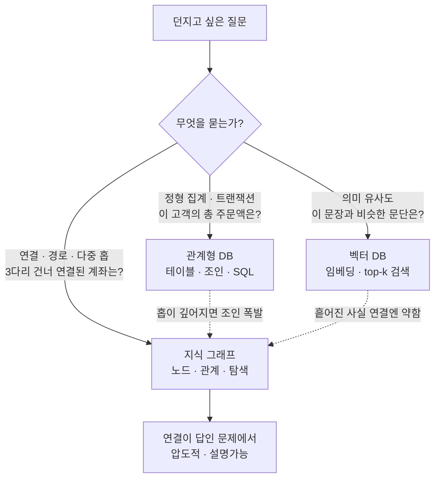

<figure class="post-figure post-figure--header">
<svg role="img" aria-label="같은 데이터를 바라보는 세 개의 렌즈를 나란히 대비한 그림. 왼쪽 '관계형' 패널은 customers·orders 두 테이블이 외래키로 이어져 있고 '관계를 조인으로 계산'이라는 설명이 붙어 있다. 가운데 '벡터' 패널은 좌표 공간에 흩어진 점들과 질문 점 주변의 원으로 '의미가 비슷한 조각'을 찾는 모습이다. 오른쪽 '그래프' 패널은 사람·회사·제품 노드가 관계 엣지로 연결된 그래프이며 여러 홉을 따라가는 경로가 강조되어 '연결을 데이터로 저장'이라고 적혀 있다. 세 패널 아래에는 각 렌즈가 잘 답하는 질문의 종류가 요약되어 있다." viewBox="0 0 680 320" xmlns="http://www.w3.org/2000/svg">
  <title>같은 데이터, 세 개의 렌즈 — 관계형(조인) · 벡터(유사도) · 그래프(연결)</title>
  <defs>
    <marker id="kg1-arw" viewBox="0 0 10 10" refX="8" refY="5" markerWidth="6" markerHeight="6" orient="auto-start-reverse">
      <path d="M0,0 L10,5 L0,10 z" fill="var(--gold)"/>
    </marker>
  </defs>

  <text x="340" y="24" text-anchor="middle" font-size="16" font-weight="800" fill="currentColor">같은 데이터, 세 개의 렌즈</text>

  <!-- ===== 관계형 ===== -->
  <rect x="16" y="42" width="204" height="212" rx="8" fill="var(--bg-light)" stroke="var(--border-color)" stroke-width="2"/>
  <text x="118" y="66" text-anchor="middle" font-size="13" font-weight="800" fill="currentColor">관계형 DB</text>
  <text x="118" y="82" text-anchor="middle" font-size="8.5" fill="currentColor" opacity="0.7">관계를 조인으로 계산</text>
  <!-- two tables -->
  <g>
    <rect x="40" y="100" width="72" height="54" rx="3" fill="var(--bg-panel)" stroke="currentColor" stroke-width="1.6"/>
    <text x="76" y="114" text-anchor="middle" font-size="8" font-weight="700" fill="currentColor">customers</text>
    <line x1="40" y1="120" x2="112" y2="120" stroke="currentColor" stroke-width="0.8" opacity="0.5"/>
    <line x1="40" y1="132" x2="112" y2="132" stroke="currentColor" stroke-width="0.8" opacity="0.4"/>
    <line x1="40" y1="144" x2="112" y2="144" stroke="currentColor" stroke-width="0.8" opacity="0.4"/>
    <rect x="126" y="100" width="72" height="54" rx="3" fill="var(--bg-panel)" stroke="currentColor" stroke-width="1.6"/>
    <text x="162" y="114" text-anchor="middle" font-size="8" font-weight="700" fill="currentColor">orders</text>
    <line x1="126" y1="120" x2="198" y2="120" stroke="currentColor" stroke-width="0.8" opacity="0.5"/>
    <line x1="126" y1="132" x2="198" y2="132" stroke="currentColor" stroke-width="0.8" opacity="0.4"/>
    <line x1="126" y1="144" x2="198" y2="144" stroke="currentColor" stroke-width="0.8" opacity="0.4"/>
    <!-- FK link -->
    <line x1="112" y1="127" x2="126" y2="127" stroke="var(--secondary-color)" stroke-width="1.6"/>
    <text x="119" y="168" text-anchor="middle" font-size="7.5" fill="var(--secondary-color)" font-weight="700">FK 조인</text>
  </g>
  <text x="118" y="196" text-anchor="middle" font-size="8.5" font-weight="700" fill="currentColor" opacity="0.8">잘 답하는 질문</text>
  <text x="118" y="212" text-anchor="middle" font-size="8" fill="currentColor" opacity="0.68">"이 고객의 총 주문액은?"</text>
  <text x="118" y="226" text-anchor="middle" font-size="8" fill="currentColor" opacity="0.68">정형 집계 · 트랜잭션</text>
  <text x="118" y="244" text-anchor="middle" font-size="7.5" fill="currentColor" opacity="0.55">홉이 깊어지면 조인 폭발</text>

  <!-- ===== 벡터 ===== -->
  <rect x="238" y="42" width="204" height="212" rx="8" fill="var(--bg-light)" stroke="var(--border-color)" stroke-width="2"/>
  <text x="340" y="66" text-anchor="middle" font-size="13" font-weight="800" fill="currentColor">벡터 DB</text>
  <text x="340" y="82" text-anchor="middle" font-size="8.5" fill="currentColor" opacity="0.7">의미가 비슷한 조각을 찾기</text>
  <!-- scatter + query circle -->
  <g fill="currentColor" opacity="0.55">
    <circle cx="300" cy="112" r="3"/><circle cx="325" cy="128" r="3"/><circle cx="360" cy="108" r="3"/>
    <circle cx="392" cy="132" r="3"/><circle cx="312" cy="150" r="3"/><circle cx="378" cy="156" r="3"/>
  </g>
  <circle cx="340" cy="134" r="26" fill="none" stroke="var(--accent-color)" stroke-width="1.8" stroke-dasharray="3 2"/>
  <circle cx="340" cy="134" r="4" fill="var(--accent-color)"/>
  <text x="340" y="176" text-anchor="middle" font-size="7.5" fill="var(--accent-color)" font-weight="700">질문 근처 top-k</text>
  <text x="340" y="196" text-anchor="middle" font-size="8.5" font-weight="700" fill="currentColor" opacity="0.8">잘 답하는 질문</text>
  <text x="340" y="212" text-anchor="middle" font-size="8" fill="currentColor" opacity="0.68">"이 문장과 비슷한 문단은?"</text>
  <text x="340" y="226" text-anchor="middle" font-size="8" fill="currentColor" opacity="0.68">의미 검색 · 벡터 RAG</text>
  <text x="340" y="244" text-anchor="middle" font-size="7.5" fill="currentColor" opacity="0.55">연결·다중 홉엔 약함</text>

  <!-- ===== 그래프 (highlighted) ===== -->
  <rect x="460" y="42" width="204" height="212" rx="8" fill="var(--bg-light)" stroke="var(--gold)" stroke-width="2.5"/>
  <text x="562" y="66" text-anchor="middle" font-size="13" font-weight="800" fill="var(--gold)">지식 그래프</text>
  <text x="562" y="82" text-anchor="middle" font-size="8.5" fill="currentColor" opacity="0.72">연결을 데이터로 저장</text>
  <!-- graph with highlighted path -->
  <g stroke="currentColor" stroke-width="1.4" opacity="0.35">
    <line x1="512" y1="118" x2="562" y2="104"/>
    <line x1="612" y1="150" x2="562" y2="164"/>
  </g>
  <g stroke="var(--gold)" stroke-width="2.4">
    <line x1="512" y1="118" x2="562" y2="164" marker-end="url(#kg1-arw)"/>
    <line x1="562" y1="164" x2="612" y2="150" marker-end="url(#kg1-arw)"/>
  </g>
  <g>
    <circle cx="512" cy="118" r="12" fill="var(--bg-panel)" stroke="currentColor" stroke-width="2"/>
    <text x="512" y="121" text-anchor="middle" font-size="7.5" font-weight="700" fill="currentColor">사람</text>
    <circle cx="562" cy="104" r="12" fill="var(--bg-panel)" stroke="currentColor" stroke-width="2"/>
    <text x="562" y="107" text-anchor="middle" font-size="7.5" font-weight="700" fill="currentColor">회사</text>
    <circle cx="562" cy="164" r="12" fill="var(--bg-panel)" stroke="var(--gold)" stroke-width="2.4"/>
    <text x="562" y="167" text-anchor="middle" font-size="7.5" font-weight="700" fill="currentColor">주문</text>
    <circle cx="612" cy="150" r="12" fill="var(--bg-panel)" stroke="currentColor" stroke-width="2"/>
    <text x="612" y="153" text-anchor="middle" font-size="7.5" font-weight="700" fill="currentColor">제품</text>
  </g>
  <text x="562" y="196" text-anchor="middle" font-size="8.5" font-weight="700" fill="currentColor" opacity="0.8">잘 답하는 질문</text>
  <text x="562" y="212" text-anchor="middle" font-size="8" fill="currentColor" opacity="0.7">"3다리 건너 연결된 계좌는?"</text>
  <text x="562" y="226" text-anchor="middle" font-size="8" fill="currentColor" opacity="0.7">다중 홉 · 경로 · 설명가능</text>
  <text x="562" y="244" text-anchor="middle" font-size="7.5" fill="var(--gold)" opacity="0.9" font-weight="700">연결이 답인 문제</text>

  <!-- bottom note -->
  <text x="340" y="286" text-anchor="middle" font-size="10" font-weight="700" fill="currentColor" opacity="0.75">셋은 경쟁이 아니라 상보적 — 질문의 성질이 렌즈를 고른다</text>
  <text x="340" y="304" text-anchor="middle" font-size="8.5" fill="currentColor" opacity="0.6">이 시리즈는 그래프 렌즈를 집중해서 벼린다</text>
</svg>
<figcaption>같은 데이터를 세 렌즈로 — <strong>관계형</strong>은 조인으로 관계를 계산하고, <strong>벡터</strong>는 의미 유사도로 비슷한 조각을 찾고, <strong>지식 그래프</strong>는 연결 그 자체를 데이터로 저장해 여러 홉을 따라간다. 셋은 상보적이며, 질문의 성질이 어느 렌즈가 빛날지를 정한다.</figcaption>
</figure>

## 들어가며

이 글은 [Agentic Knowledge Graph Curriculum](/2026/07/21/agentic-knowledge-graph-curriculum.html)의 **1단계**입니다. 시리즈의 종착점은 "그래프를 도구·기억으로 쓰는 에이전트"지만, 그 여정의 첫걸음은 아주 단순한 질문에서 시작합니다 — **"왜 하필 그래프인가?"**

우리에겐 이미 관계형 DB가 있고, 요즘 RAG의 주력인 벡터 DB도 있습니다. 그런데도 사기 탐지, 추천, 지식 Q&A, 에이전트 기억 같은 문제에서 사람들이 자꾸 **지식 그래프(Knowledge Graph)**로 돌아오는 이유가 있습니다. 이 글은 그 이유를 세 렌즈를 나란히 놓고 밝힙니다. 이 "왜"를 손에 쥐지 못한 채 GraphRAG나 에이전트부터 손대면, 그저 유행하는 블랙박스를 돌리는 일이 됩니다.

지식 그래프는 세상을 **노드(개체)와 관계(엣지)로 표현한 사실의 망**입니다. "일론 머스크 — (창업) → 테슬라 — (출시) → Model 3"처럼 사실을 삼각형(트리플)으로 이어 붙여 거대한 지식 망을 만듭니다. 이 발상의 형식적 뿌리 — RDF의 트리플, 시맨틱 웹의 계보 — 는 자매 시리즈인 [Ontology Essential의 형식 기반 편](/2026/07/19/ontology-knowledge-graphs-rdf-owl-property-graphs.html)에서 이미 깊게 다뤘으므로, 이 글은 그 어휘를 빌려 쓰되 **"왜 그래프이며, 언제 그래프를 골라야 하는가"**라는 실용적 질문에 집중합니다.

<div class="post-summary-box" markdown="1">

### 📌 이 글에서 다루는 내용

- **왜 그래프인가**: 노드·엣지·트리플이라는 최소 구조, "관계를 조인으로 계산"하는 관계형과 달리 "관계를 데이터로 저장"한다는 것의 의미, 그리고 다중 홉(multi-hop) 질의에서 그래프가 빛나는 이유
- **vs 관계형 · vs 벡터 DB**: 조인 폭발(join explosion)로 본 관계형의 한계, 의미 유사도만으로는 놓치는 벡터 RAG의 빈틈, 세 저장소가 각자 잘하는 질문과 왜 상보적인가
- **활용의 큰 그림**: Google Knowledge Graph, 추천, 사기 탐지, 에이전트 기억까지 — "연결이 답인 문제"라는 공통 성질, 그리고 이 시리즈가 이후 어디로 향하는가

</div>

## 한눈에 보기 — 질문이 렌즈를 고른다

이 글의 스파인을 한 장으로 그리면 이렇습니다. 어떤 저장소도 만능이 아닙니다 — **질문의 성질**이 어느 렌즈가 빛날지를 정합니다. 정형 집계는 관계형이, 의미 검색은 벡터가, 그리고 *연결을 따라가야 답이 나오는* 질문은 그래프가 답합니다.



이 그림에서 쥐어야 할 좌표는 하나입니다 — **셋은 경쟁 관계가 아니라 상보적**이며, 실전의 답은 대개 이들을 함께 쓰는 하이브리드입니다. 다만 이 시리즈는 지금까지 덜 익숙했을 **그래프 렌즈**를 집중해서 벼립니다.

## 왜 그래프인가 — 관계를 계산하지 말고 저장하라

### 노드 · 엣지 · 트리플

지식 그래프의 구조는 놀랄 만큼 단순합니다. 세 가지뿐입니다.

- **노드(node)**: 세상의 개체 하나 — 사람, 회사, 제품, 사건, 유전자.
- **엣지(edge)**: 두 노드를 잇는 방향 있는 관계 — `근무한다`, `출시했다`, `상호작용한다`.
- **속성(property)**: 노드나 엣지에 붙는 값 — 사람의 `이름`, 근무 관계의 `시작일`.

이 셋으로 "김지수가 누리테크에서 근무하고, 누리테크가 미리내를 출시했다"는 사실을 그립니다.

```text
(김지수:사람) ─[근무]→ (누리테크:회사) ─[출시]→ (미리내:제품)
```

각 화살표가 하나의 **트리플**(주어–술어–목적어)입니다. 트리플을 계속 쌓으면 주어·목적어가 노드가 되고 술어가 엣지가 되어 자연스럽게 하나의 **그래프**로 자랍니다. "지식 그래프"라는 말의 실체가 바로 이것입니다 — 개별 사실의 집합이 이루는 거대한 연결망.

### 핵심 전환: 관계를 데이터로 저장한다

여기서 관계형 DB와의 결정적 차이가 드러납니다. 관계형 세계에서 "김지수가 어디서 근무하는가"는 `employees` 테이블과 `companies` 테이블을 **외래키로 조인**해 *그때그때 계산*합니다. 관계는 데이터가 아니라 질의 시점의 연산입니다.

그래프는 정반대입니다 — **관계 그 자체를 물리적으로 저장**합니다. `근무` 엣지는 두 노드 사이에 실제로 존재하는 포인터이고, 이웃으로 건너가는 데 조인이 필요 없습니다(이를 index-free adjacency라 부릅니다). 그래서 "김지수의 동료의 동료가 관여한 프로젝트"처럼 관계를 여러 번 따라가는 **다중 홉(multi-hop)** 질의에서, 그래프는 관계형이 감당하기 힘든 성능과 표현력을 냅니다.

이 한 문장이 이 시리즈 전체의 씨앗입니다 — **"관계를 계산하지 말고 저장하라."** 다음 두 절은 이 전환이 관계형·벡터 각각에 대해 무엇을 바꾸는지 구체적으로 봅니다.

## vs 관계형 DB — 조인 폭발이라는 벽

관계형 DB는 정형 데이터의 집계·트랜잭션에서는 왕입니다. "이 고객의 이번 달 총 주문액"은 관계형이 그래프보다 낫습니다. 문제는 **관계를 여러 번 따라가는 질문**입니다.

"김지수와 *3다리 건너* 같은 계좌로 연결된 사람들을 찾아라" 같은 질문을 SQL로 쓰면, 홉 하나마다 자기 자신과의 조인(self-join)이 붙습니다.

```sql
-- 3-홉 연결 탐색: 홉마다 조인이 하나씩 — 홉이 늘면 기하급수로 비싸진다
SELECT DISTINCT p3.name
FROM   people p0
JOIN   transfers t1 ON t1.from_id = p0.id
JOIN   people p1     ON p1.id = t1.to_id
JOIN   transfers t2 ON t2.from_id = p1.id
JOIN   people p2     ON p2.id = t2.to_id
JOIN   transfers t3 ON t3.from_id = p2.id
JOIN   people p3     ON p3.id = t3.to_id
WHERE  p0.name = '김지수' AND p3.id <> p0.id;
```

홉이 하나 늘 때마다 조인 테이블이 하나씩 붙고, 중간 결과가 폭발합니다 — 이것이 **조인 폭발(join explosion)**입니다. 홉 수가 미리 정해져 있지 않은 질문("연결이 끊길 때까지 따라가라")은 아예 SQL로 표현하기 어렵습니다.

같은 질문을 그래프 질의어(Cypher, 2단계에서 다룹니다)로 쓰면 이렇게 짧아집니다.

```cypher
// 가변 길이 경로 *1..3 — 홉 수를 데이터가 정하게 둔다
MATCH (me:Person {name: '김지수'})-[:TRANSFER*1..3]->(other:Person)
WHERE other <> me
RETURN DISTINCT other.name;
```

`*1..3`이 "1~3홉을 따라가라"를 그대로 표현합니다. 관계가 데이터로 저장돼 있으니 이웃으로 건너가는 비용이 조인 연산이 아니라 포인터 추적이고, 깊은 탐색에서도 성능이 완만하게 유지됩니다. **금융 사기 탐지**(자금세탁 고리 찾기), **추천**(구매 이력이 겹치는 사용자), **소셜 네트워크**(친구의 친구)가 모두 이 다중 홉 패턴 위에 있습니다.

<figure class="post-figure">
<svg role="img" aria-label="관계형 조인과 그래프 탐색의 비용 대비. 왼쪽 '관계형' 패널에서는 홉이 하나씩 깊어질 때마다 self-join이 하나씩 붙어 중간 결과 행이 1행에서 ×N, ×N², ×N³으로 아래로 갈수록 넓어지며 폭발한다. 오른쪽 '그래프' 패널에서는 김지수 노드에서 이웃 노드로 포인터를 따라 세 홉을 건너가는 일직선 경로이며, 비용이 실제 이웃 수에 비례해 완만하게 유지된다." viewBox="0 0 680 300" xmlns="http://www.w3.org/2000/svg">
  <title>조인 폭발 vs 포인터 홉 — 홉마다 self-join으로 중간 결과가 폭발하는 관계형과 이웃을 포인터로 따라가는 그래프</title>
  <defs>
    <marker id="kg2-arw" viewBox="0 0 10 10" refX="8" refY="5" markerWidth="6" markerHeight="6" orient="auto-start-reverse">
      <path d="M0,0 L10,5 L0,10 z" fill="var(--gold)"/>
    </marker>
  </defs>

  <text x="340" y="24" text-anchor="middle" font-size="15" font-weight="800" fill="currentColor">3다리 건너 연결 찾기 — 같은 질문, 다른 비용</text>

  <!-- ===== 관계형: 조인 폭발 ===== -->
  <rect x="16" y="40" width="322" height="244" rx="8" fill="var(--bg-light)" stroke="var(--border-color)" stroke-width="2"/>
  <text x="177" y="62" text-anchor="middle" font-size="12.5" font-weight="800" fill="currentColor">관계형 — 홉마다 self-join</text>
  <text x="177" y="78" text-anchor="middle" font-size="8.5" fill="currentColor" opacity="0.68">중간 결과가 아래로 갈수록 폭발</text>

  <!-- expanding bars -->
  <g>
    <rect x="155" y="92" width="44" height="22" rx="3" fill="var(--bg-panel)" stroke="currentColor" stroke-width="1.6"/>
    <text x="177" y="107" text-anchor="middle" font-size="8" font-weight="700" fill="currentColor">p0 · 1행</text>

    <text x="177" y="127" text-anchor="middle" font-size="7.5" fill="currentColor" opacity="0.6">⋈ JOIN transfers, people</text>
    <rect x="129" y="132" width="96" height="22" rx="3" fill="var(--bg-panel)" stroke="currentColor" stroke-width="1.6"/>
    <text x="177" y="147" text-anchor="middle" font-size="8" font-weight="700" fill="currentColor">1홉 · ×N</text>

    <text x="177" y="167" text-anchor="middle" font-size="7.5" fill="currentColor" opacity="0.6">⋈ JOIN transfers, people</text>
    <rect x="99" y="172" width="156" height="22" rx="3" fill="var(--bg-panel)" stroke="currentColor" stroke-width="1.6"/>
    <text x="177" y="187" text-anchor="middle" font-size="8" font-weight="700" fill="currentColor">2홉 · ×N²</text>

    <text x="177" y="207" text-anchor="middle" font-size="7.5" fill="currentColor" opacity="0.6">⋈ JOIN transfers, people</text>
    <rect x="67" y="212" width="220" height="24" rx="3" fill="var(--bg-panel)" stroke="var(--accent-color)" stroke-width="2.2"/>
    <text x="177" y="228" text-anchor="middle" font-size="8.5" font-weight="800" fill="var(--accent-color)">3홉 · ×N³ — 조인 폭발</text>
  </g>
  <text x="177" y="258" text-anchor="middle" font-size="8" fill="currentColor" opacity="0.7">홉 수가 정해지지 않으면 SQL로 표현조차 어렵다</text>

  <!-- ===== 그래프: 포인터 홉 ===== -->
  <rect x="342" y="40" width="322" height="244" rx="8" fill="var(--bg-light)" stroke="var(--gold)" stroke-width="2.5"/>
  <text x="503" y="62" text-anchor="middle" font-size="12.5" font-weight="800" fill="var(--gold)">그래프 — 포인터로 이웃 홉</text>
  <text x="503" y="78" text-anchor="middle" font-size="8.5" fill="currentColor" opacity="0.7">비용 ≈ 실제 이웃 수, 깊어져도 완만</text>

  <!-- horizontal traversal chain -->
  <g stroke="var(--gold)" stroke-width="2.4">
    <line x1="393" y1="150" x2="450" y2="150" marker-end="url(#kg2-arw)"/>
    <line x1="472" y1="150" x2="529" y2="150" marker-end="url(#kg2-arw)"/>
    <line x1="551" y1="150" x2="608" y2="150" marker-end="url(#kg2-arw)"/>
  </g>
  <g>
    <circle cx="378" cy="150" r="14" fill="var(--bg-panel)" stroke="currentColor" stroke-width="2"/>
    <text x="378" y="153" text-anchor="middle" font-size="7" font-weight="700" fill="currentColor">김지수</text>
    <circle cx="461" cy="150" r="11" fill="var(--bg-panel)" stroke="currentColor" stroke-width="1.8"/>
    <circle cx="540" cy="150" r="11" fill="var(--bg-panel)" stroke="currentColor" stroke-width="1.8"/>
    <circle cx="623" cy="150" r="14" fill="var(--bg-panel)" stroke="var(--gold)" stroke-width="2.4"/>
    <text x="623" y="153" text-anchor="middle" font-size="7" font-weight="700" fill="currentColor">대상</text>
  </g>
  <text x="421" y="134" text-anchor="middle" font-size="7.5" fill="currentColor" opacity="0.75" font-weight="700">1홉</text>
  <text x="500" y="134" text-anchor="middle" font-size="7.5" fill="currentColor" opacity="0.75" font-weight="700">2홉</text>
  <text x="586" y="134" text-anchor="middle" font-size="7.5" fill="currentColor" opacity="0.75" font-weight="700">3홉</text>

  <rect x="378" y="196" width="250" height="30" rx="4" fill="var(--bg-panel)" stroke="var(--border-color)" stroke-width="1.2"/>
  <text x="503" y="209" text-anchor="middle" font-size="8" fill="currentColor">[:TRANSFER*1..3] — 홉 수를 데이터가 정한다</text>
  <text x="503" y="221" text-anchor="middle" font-size="7.5" fill="currentColor" opacity="0.65">조인 스택이 아니라 포인터 추적</text>
  <text x="503" y="258" text-anchor="middle" font-size="8" fill="var(--gold)" opacity="0.9" font-weight="700">관계가 데이터로 저장돼 있어 이웃 이동이 값싸다</text>
</svg>
<figcaption><strong>조인 폭발 vs 포인터 홉</strong> — 관계형은 홉이 깊어질수록 self-join이 하나씩 붙어 중간 결과가 <strong>×N → ×N² → ×N³</strong>으로 폭발한다. 그래프는 관계를 데이터로 저장하므로 이웃으로 건너가는 비용이 포인터 추적에 그쳐, 깊은 탐색에서도 완만하게 유지된다.</figcaption>
</figure>

> 오해 방지 — 그래프가 관계형을 대체하는 것이 아닙니다. 원장·재무·재고 같은 **정형 트랜잭션**은 여전히 관계형이 정답입니다. 그래프는 *관계 자체가 1급 질문*이 되는 워크로드를 위한 것입니다.

## vs 벡터 DB — 유사도가 놓치는 연결

요즘 RAG의 주력은 벡터 DB입니다. 문서를 임베딩(의미를 담은 벡터)으로 바꿔 저장하고, 질문과 **의미가 가까운 조각(top-k)**을 찾아 LLM에 넘깁니다. "환불 정책이 뭐야?"에 관련 문단을 찾아 주는 데 탁월합니다.

그런데 벡터 검색에는 구조적 빈틈이 있습니다.

- **다중 홉 질문에 약하다**: "우리 회사에 투자한 VC가 투자한 *다른* 회사 중 우리 경쟁사는?" — 답이 한 문단에 있지 않고 여러 사실을 *연결*해야 나오는 질문은, 아무리 의미가 비슷한 조각을 모아도 그 연결을 스스로 잇지 못합니다.
- **전역(global) 질문에 약하다**: "이 문서 코퍼스 전체를 관통하는 핵심 리스크는?" — top-k는 일부 조각만 볼 뿐, 전체 구조를 요약하지 못합니다.
- **설명가능성이 약하다**: "왜 이 답이 나왔는가"가 벡터 거리로만 남습니다. 그래프는 답에 이른 **경로**(A→B→C)를 근거로 제시할 수 있습니다.

그래프는 이 빈틈을 정확히 메웁니다. 명시적으로 연결된 사실을 따라가고, 전체 구조를 클러스터로 요약하고(5단계 GraphRAG), 경로로 근거를 댑니다. 그래서 실전의 답은 대개 **벡터 + 그래프의 하이브리드**입니다 — 벡터로 관련 개체를 찾아 그래프에 진입하고, 그래프로 연결을 따라가 답을 완성합니다. 이 결합이 바로 5단계 **GraphRAG**의 핵심 발상입니다.

<figure class="post-figure">
<svg role="img" aria-label="연결이 답인 질문에서 벡터 검색과 그래프의 대비. 위쪽에 '우리 회사에 투자한 VC가 투자한 다른 회사 중 우리 경쟁사는?'이라는 질문이 있다. 왼쪽 '벡터 DB' 패널은 흩어진 문서 조각들 위에 top-k 점선 원이 몇 개를 모으지만, 조각들 사이는 물음표가 붙은 끊긴 점선으로 이어져 스스로 연결하지 못함을 보여준다. 오른쪽 '지식 그래프' 패널은 우리회사에서 VC로, VC에서 경쟁사로 이어지는 명시적 경로가 강조돼 있어, 연결을 따라가 답과 근거를 동시에 낸다." viewBox="0 0 680 320" xmlns="http://www.w3.org/2000/svg">
  <title>연결이 답인 질문 — 흩어진 조각을 잇지 못하는 벡터 top-k와 명시적 경로를 따라가는 그래프</title>
  <defs>
    <marker id="kg3-arw" viewBox="0 0 10 10" refX="8" refY="5" markerWidth="6" markerHeight="6" orient="auto-start-reverse">
      <path d="M0,0 L10,5 L0,10 z" fill="var(--gold)"/>
    </marker>
  </defs>

  <text x="340" y="22" text-anchor="middle" font-size="12.5" font-weight="800" fill="currentColor">질문: 우리 회사에 투자한 VC가 투자한</text>
  <text x="340" y="39" text-anchor="middle" font-size="12.5" font-weight="800" fill="currentColor">다른 회사 중 우리 경쟁사는?</text>

  <!-- ===== 벡터 ===== -->
  <rect x="16" y="54" width="322" height="248" rx="8" fill="var(--bg-light)" stroke="var(--border-color)" stroke-width="2"/>
  <text x="177" y="76" text-anchor="middle" font-size="12.5" font-weight="800" fill="currentColor">벡터 DB — 비슷한 조각 모으기</text>

  <!-- top-k circle -->
  <circle cx="150" cy="170" r="72" fill="none" stroke="var(--accent-color)" stroke-width="1.8" stroke-dasharray="4 3"/>
  <text x="150" y="110" text-anchor="middle" font-size="8" fill="var(--accent-color)" font-weight="700">top-k</text>

  <!-- scattered chunks -->
  <g>
    <rect x="98" y="132" width="52" height="17" rx="3" fill="var(--bg-panel)" stroke="currentColor" stroke-width="1.4"/>
    <rect x="168" y="150" width="52" height="17" rx="3" fill="var(--bg-panel)" stroke="currentColor" stroke-width="1.4"/>
    <rect x="112" y="188" width="52" height="17" rx="3" fill="var(--bg-panel)" stroke="currentColor" stroke-width="1.4"/>
    <rect x="238" y="196" width="52" height="17" rx="3" fill="var(--bg-panel)" stroke="currentColor" stroke-width="1.4" opacity="0.5"/>
    <rect x="196" y="232" width="52" height="17" rx="3" fill="var(--bg-panel)" stroke="currentColor" stroke-width="1.4" opacity="0.5"/>
  </g>

  <!-- broken connections with ? -->
  <g stroke="currentColor" stroke-width="1.2" stroke-dasharray="2 3" opacity="0.55">
    <line x1="150" y1="149" x2="194" y2="150"/>
    <line x1="138" y1="167" x2="138" y2="188"/>
  </g>
  <text x="172" y="145" text-anchor="middle" font-size="9" font-weight="800" fill="var(--accent-color)">?</text>
  <text x="126" y="181" text-anchor="middle" font-size="9" font-weight="800" fill="var(--accent-color)">?</text>

  <text x="177" y="276" text-anchor="middle" font-size="8" fill="currentColor" opacity="0.7">비슷한 조각은 모으지만</text>
  <text x="177" y="290" text-anchor="middle" font-size="8" fill="var(--accent-color)" opacity="0.9" font-weight="700">흩어진 사실을 스스로 잇지 못함</text>

  <!-- ===== 그래프 ===== -->
  <rect x="342" y="54" width="322" height="248" rx="8" fill="var(--bg-light)" stroke="var(--gold)" stroke-width="2.5"/>
  <text x="503" y="76" text-anchor="middle" font-size="12.5" font-weight="800" fill="var(--gold)">지식 그래프 — 연결을 따라가기</text>

  <!-- explicit path -->
  <g stroke="var(--gold)" stroke-width="2.4" fill="none">
    <path d="M406,124 C440,150 440,150 470,168" marker-end="url(#kg3-arw)"/>
    <path d="M536,168 C566,150 566,150 600,124" marker-end="url(#kg3-arw)"/>
  </g>
  <g>
    <ellipse cx="406" cy="112" rx="34" ry="17" fill="var(--bg-panel)" stroke="currentColor" stroke-width="2"/>
    <text x="406" y="115" text-anchor="middle" font-size="8" font-weight="700" fill="currentColor">우리 회사</text>
    <ellipse cx="503" cy="182" rx="30" ry="17" fill="var(--bg-panel)" stroke="currentColor" stroke-width="2"/>
    <text x="503" y="185" text-anchor="middle" font-size="8" font-weight="700" fill="currentColor">VC</text>
    <ellipse cx="600" cy="112" rx="34" ry="17" fill="var(--bg-panel)" stroke="var(--gold)" stroke-width="2.4"/>
    <text x="600" y="115" text-anchor="middle" font-size="8" font-weight="700" fill="currentColor">경쟁사</text>
  </g>
  <text x="432" y="158" text-anchor="middle" font-size="7.5" fill="currentColor" opacity="0.72" font-weight="700">투자받음</text>
  <text x="574" y="158" text-anchor="middle" font-size="7.5" fill="currentColor" opacity="0.72" font-weight="700">투자함</text>

  <text x="503" y="230" text-anchor="middle" font-size="8" fill="currentColor" opacity="0.7">명시적 연결을 따라가 답을 완성하고</text>
  <text x="503" y="276" text-anchor="middle" font-size="8" fill="currentColor" opacity="0.7">지나온 경로가</text>
  <text x="503" y="290" text-anchor="middle" font-size="8" fill="var(--gold)" opacity="0.95" font-weight="700">그대로 답의 근거가 된다</text>
</svg>
<figcaption><strong>연결이 답인 질문</strong> — 벡터 검색은 의미가 비슷한 조각을 top-k로 모으지만 그 조각들을 <strong>스스로 잇지 못한다</strong>. 그래프는 <em>우리 회사 → VC → 경쟁사</em>처럼 명시적 연결을 따라가 답을 완성하고, 지나온 <strong>경로가 곧 근거</strong>가 된다. 그래서 실전에선 벡터로 진입해 그래프로 잇는 하이브리드(GraphRAG)가 강력하다.</figcaption>
</figure>

| 렌즈 | 저장하는 것 | 잘 답하는 질문 | 약한 지점 |
| --- | --- | --- | --- |
| 관계형 DB | 행·열, 관계는 외래키 | 정형 집계·트랜잭션 | 깊은 다중 홉(조인 폭발) |
| 벡터 DB | 의미 임베딩 | 의미 유사 검색·벡터 RAG | 연결·전역·설명가능성 |
| 지식 그래프 | 노드·관계(연결) | 다중 홉·경로·전역·근거 | 순수 유사도·대량 정형 집계 |

## 활용의 큰 그림 — "연결이 답인 문제"

지식 그래프가 빛나는 문제들에는 공통점이 있습니다 — **답이 개별 데이터가 아니라 데이터 사이의 연결에 있다**는 것. 대표 사례를 큰 그림으로 훑어봅니다(각 도메인은 8단계에서 아키텍처와 함께 집대성합니다).

- **웹 검색 (Google Knowledge Graph)**: 2012년 구글은 검색을 "문자열이 아니라 실체(things, not strings)"로 전환하며 이 용어를 대중화했습니다. "레오나르도 다빈치"를 검색하면 생몰년·작품·동시대 인물이 연결된 패널로 뜨는 것이 지식 그래프입니다.
- **금융 — 사기·자금세탁 탐지**: 계좌·거래·소유 관계를 그래프로 놓으면, 정상 거래처럼 보이는 개별 이체 뒤에 숨은 순환 고리와 위장 계좌 네트워크가 드러납니다.
- **헬스케어·바이오 — 신약 발견**: 약물–질환–유전자–논문을 잇는 그래프에서 "이 약물이 작용하는 경로에 걸린 다른 질환"을 추론해 약물 재창출(drug repurposing) 후보를 찾습니다.
- **추천·이커머스**: 사용자–상품–속성 그래프에서 "나와 취향이 겹치는 사람이 산 것", "이 상품과 함께 사는 것"을 경로로 찾고, 그 경로가 **설명 가능한 추천 근거**가 됩니다.
- **엔터프라이즈 지식·고객지원**: 사내 문서·티켓·제품을 그래프로 엮어, 흩어진 문서를 연결해야 답이 나오는 질문에 근거 있는 답변을 냅니다(GraphRAG).
- **에이전트 기억**: 대화·관찰에서 얻은 사실이 시간과 함께 쌓여 자라는 **시간적 지식 그래프**가, 장기 기억을 가진 어시스턴트의 토대가 됩니다(7단계).

이 사례들이 관계형이나 벡터가 아니라 그래프를 부르는 이유는 하나로 수렴합니다 — **연결을 따라가는 것이 문제의 본질**이기 때문입니다.

## 정리

- **지식 그래프 = 노드·관계로 표현한 사실의 망**입니다. 트리플을 쌓으면 하나의 거대한 연결망이 됩니다.
- **핵심 전환은 "관계를 계산하지 말고 저장하라"**입니다. 관계형이 조인으로 관계를 매번 계산한다면, 그래프는 관계를 데이터로 저장해 다중 홉 탐색을 값싸게 만듭니다.
- **관계형·벡터·그래프는 상보적**입니다. 정형 집계는 관계형, 의미 검색은 벡터, *연결이 답인 질문*은 그래프 — 질문의 성질이 렌즈를 고릅니다.
- **그래프가 빛나는 문제의 공통 성질은 "연결이 답"**이라는 것입니다. 사기 탐지·신약·추천·지식 Q&A·에이전트 기억이 모두 여기에 속합니다.

다음 글에서는 이 그래프를 **실제로 저장하고 질의하는 손**을 풉니다 — 속성 그래프의 Cypher와 RDF의 SPARQL, 그리고 어떤 그래프 DB를 언제 고를지를 다룹니다.

### 다음 학습 (Next Learning)

- [2단계 · 그래프 DB와 질의: Neo4j·Cypher / RDF·SPARQL](/2026/07/21/kg-graph-databases-cypher-sparql.html) — 방금 본 그래프를 실제로 저장하고 물어보기
- [지식 그래프와 RDF/OWL·속성 그래프 (Ontology 시리즈)](/2026/07/19/ontology-knowledge-graphs-rdf-owl-property-graphs.html) — 트리플·시맨틱 웹의 형식적 계보를 더 깊게
- [Agentic Knowledge Graph Curriculum](/2026/07/21/agentic-knowledge-graph-curriculum.html) — 전체 8단계 로드맵으로 돌아가기
