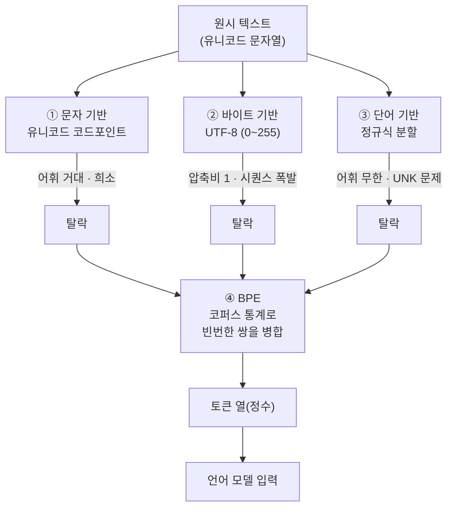
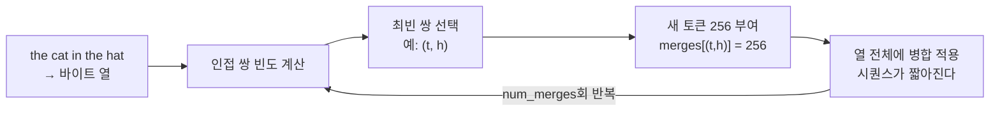

`CS336-LLM-From-Scratch` 시리즈의 1단계입니다. 전체 지도는 [CS336 커리큘럼](/2026/06/26/cs336-llm-from-scratch-curriculum.html)에서 볼 수 있습니다.

<figure class="post-figure post-figure--header">
<svg role="img" aria-label="원시 텍스트가 토크나이저를 거쳐 정수 토큰 열이 되고, 이것이 언어 모델로 들어가는 파이프라인. 그 아래로 효율이라는 주제가 전체를 관통한다." viewBox="0 0 760 280" xmlns="http://www.w3.org/2000/svg">
  <title>텍스트 → 토크나이저 → 정수 토큰 → 언어 모델, 효율이라는 척추</title>
  <defs>
    <marker id="hdr-arrow" markerWidth="9" markerHeight="9" refX="7" refY="4.5" orient="auto">
      <path d="M0 0 L9 4.5 L0 9 Z" fill="currentColor"/>
    </marker>
  </defs>

  <!-- ① 원시 텍스트 -->
  <g>
    <rect x="20" y="46" width="150" height="92" rx="4" fill="none" stroke="currentColor" stroke-width="2"/>
    <text x="95" y="36" text-anchor="middle" font-size="13" font-weight="700" fill="currentColor">원시 텍스트</text>
    <text x="40" y="86" font-size="20" font-family="monospace" fill="var(--accent-color)">the</text>
    <text x="40" y="112" font-size="20" font-family="monospace" fill="var(--accent-color)">cat</text>
    <text x="118" y="86" font-size="20" font-family="monospace" fill="var(--secondary-color)">🌍</text>
    <text x="95" y="158" text-anchor="middle" font-size="11" fill="currentColor" opacity="0.75">유니코드 문자열</text>
  </g>

  <!-- 토크나이저 기어 -->
  <g transform="translate(255 92)">
    <g fill="none" stroke="currentColor" stroke-width="2">
      <circle cx="0" cy="0" r="30"/>
      <circle cx="0" cy="0" r="11"/>
    </g>
    <g fill="var(--gold)">
      <rect x="-4" y="-40" width="8" height="11"/>
      <rect x="-4" y="29" width="8" height="11"/>
      <rect x="-40" y="-4" width="11" height="8"/>
      <rect x="29" y="-4" width="11" height="8"/>
      <rect x="22" y="-28" width="9" height="8" transform="rotate(45 26 -24)"/>
      <rect x="-31" y="-28" width="9" height="8" transform="rotate(-45 -26 -24)"/>
      <rect x="22" y="20" width="9" height="8" transform="rotate(-45 26 24)"/>
      <rect x="-31" y="20" width="9" height="8" transform="rotate(45 -26 24)"/>
    </g>
    <text x="0" y="62" text-anchor="middle" font-size="13" font-weight="700" fill="currentColor">토크나이저</text>
    <text x="0" y="79" text-anchor="middle" font-size="11" fill="currentColor" opacity="0.75">BPE</text>
  </g>

  <!-- ③ 정수 토큰 열 -->
  <g>
    <text x="475" y="36" text-anchor="middle" font-size="13" font-weight="700" fill="currentColor">정수 토큰 열</text>
    <g font-family="monospace" font-size="14" text-anchor="middle">
      <g fill="none" stroke="currentColor" stroke-width="2">
        <rect x="410" y="62" width="42" height="34" rx="3"/>
        <rect x="456" y="62" width="42" height="34" rx="3"/>
        <rect x="502" y="62" width="42" height="34" rx="3"/>
      </g>
      <text x="431" y="84" fill="currentColor">257</text>
      <text x="477" y="84" fill="currentColor">99</text>
      <text x="523" y="84" fill="currentColor">240</text>
    </g>
    <text x="475" y="120" text-anchor="middle" font-size="11" fill="currentColor" opacity="0.75">어휘 슬롯의 정수</text>
  </g>

  <!-- ④ 언어 모델 -->
  <g>
    <rect x="600" y="46" width="140" height="92" rx="4" fill="none" stroke="currentColor" stroke-width="2"/>
    <text x="670" y="36" text-anchor="middle" font-size="13" font-weight="700" fill="currentColor">언어 모델</text>
    <g stroke="var(--secondary-color)" stroke-width="2" fill="none">
      <circle cx="630" cy="78" r="6"/>
      <circle cx="630" cy="106" r="6"/>
      <circle cx="670" cy="92" r="6"/>
      <circle cx="710" cy="78" r="6"/>
      <circle cx="710" cy="106" r="6"/>
      <path d="M636 78 L664 92 M636 106 L664 92 M676 92 L704 78 M676 92 L704 106"/>
    </g>
    <text x="670" y="158" text-anchor="middle" font-size="11" fill="currentColor" opacity="0.75">다음 토큰 예측</text>
  </g>

  <!-- pipeline arrows -->
  <g stroke="currentColor" stroke-width="2" fill="none" marker-end="url(#hdr-arrow)">
    <line x1="172" y1="92" x2="218" y2="92"/>
    <line x1="292" y1="92" x2="404" y2="79"/>
    <line x1="548" y1="79" x2="596" y2="79"/>
  </g>

  <!-- 효율 through-theme bar -->
  <g>
    <line x1="20" y1="226" x2="740" y2="226" stroke="var(--gold)" stroke-width="2" stroke-dasharray="2 5"/>
    <rect x="300" y="210" width="160" height="32" rx="4" fill="var(--bg-panel)" stroke="var(--gold)" stroke-width="2"/>
    <text x="380" y="231" text-anchor="middle" font-size="14" font-weight="700" fill="var(--primary-color)">효율 — 압축비</text>
    <text x="60" y="263" font-size="11" fill="currentColor" opacity="0.7">바이트는 많이 ↓</text>
    <text x="700" y="263" text-anchor="end" font-size="11" fill="currentColor" opacity="0.7">↑ 토큰은 적게</text>
  </g>
</svg>
<figcaption>이 글의 척추: 원시 텍스트를 토크나이저가 정수 토큰 열로 바꿔 언어 모델에 넣는다. 그 모든 결정을 관통하는 한 단어가 &lsquo;효율&rsquo;(압축비)이다.</figcaption>
</figure>

언어 모델은 이제 API 한 줄로 부르는 블랙박스가 되었습니다. CS336은 그 블랙박스를 열어 **밑바닥부터(from scratch)** 직접 조립해 보는 강의이고, 1강은 그 여정의 출발점입니다. 강사 Percy Liang과 Tatsunori Hashimoto는 첫 시간을 둘로 나눕니다. 앞부분은 코스 전체를 관통하는 **사고방식**을, 뒷부분은 언어 모델의 가장 첫 관문인 **토크나이제이션(tokenization)**을 다룹니다. 이 글도 같은 순서를 따릅니다.

## 한눈에 보기

이 강의의 기술적 척추는 "텍스트를 어떻게 정수로 바꿀 것인가"입니다. 가장 단순한 방법에서 출발해 한계를 만나고, 그 한계를 넘는 다음 방법으로 나아가다 마침내 **BPE**에 도달합니다.



핵심 질문은 처음부터 끝까지 하나입니다 — **주어진 자원(어휘 슬롯·시퀀스 길이)으로 가장 효율적으로 텍스트를 표현하는 법은 무엇인가.** 이 "효율"이라는 단어가 사실 강의 전체의 주제이기도 합니다.

## CS336은 무엇을 가르치나

### "만들어 봐야 이해한다"

강의의 철학은 한 문장으로 압축됩니다. *"You've got to build it from scratch to understand it."* 프롬프트와 파인튜닝으로 충분한 문제라면 그걸 먼저 하라고 강사도 분명히 말합니다. 이 수업은 "최신 기법"을 빠르게 훑는 강의가 아니라, 원자 단위까지 내려가 **원리를 직접 쌓아 올리려는** 사람을 위한 것입니다(첫 과제부터 빈 파일에서 BPE를 직접 구현합니다).

수업에서 얻어 가는 것은 세 가지로 정리됩니다.

- **메커닉스(mechanics)** — 트랜스포머·병렬화 같은 것들이 *어떻게* 동작하는가. 구현으로 익힙니다.
- **마인드셋(mindset)** — 하드웨어를 최대한 짜내고 스케일링을 진지하게 받아들이는 사고방식. 재료들은 오래전부터 있었지만, 이 사고방식이 지금의 모델을 만들었습니다.
- **직관(intuitions)** — 어떤 데이터·모델 결정이 좋은 모델로 이어지는가. 작은 스케일에서 통한 것이 큰 스케일에서 통하지 않을 수 있어, 이것만은 부분적으로만 가르칠 수 있습니다.

### 쓴 교훈(bitter lesson)의 올바른 해석

흔한 오해는 "쓴 교훈 = 스케일이 전부, 알고리즘은 무의미"입니다. 강의는 이를 정면으로 반박합니다. 올바른 해석은 **"스케일에서의 알고리즘(algorithms at scale)이 중요하다"**입니다. 모델의 정확도는 결국 이렇게 분해됩니다.

> **정확도 ≈ 효율(efficiency) × 투입 자원(resources)**

자본을 더 부어 자원을 늘리면 더 좋은 모델이 나옵니다. 하지만 연구자의 몫은 **효율을 높이는 것**입니다. 그리고 효율은 큰 스케일일수록 *더* 중요해집니다 — 수억 달러를 쓰는 학습에서는 노트북에서 잡을 디버깅처럼 낭비할 여유가 없으니까요. OpenAI의 2020년 분석은 2012~2019년 사이 ImageNet을 같은 정확도로 학습하는 데 드는 **알고리즘 효율이 44배** 개선됐음을 보였습니다. 무어의 법칙보다 빠른 속도입니다. 알고리즘은 분명히 중요합니다.

그래서 이 수업이 던지는 단 하나의 프레이밍은 다음과 같습니다.

> *"주어진 컴퓨트·데이터 예산에서 만들 수 있는 가장 좋은 모델은 무엇인가?"*

이 질문은 어떤 스케일에서도 의미가 있습니다. 본질이 **자원당 정확도(accuracy per resource)**이기 때문입니다.

### 다섯 개 유닛, 그리고 "효율"이라는 렌즈

CS336은 다섯 유닛으로 구성됩니다 — **기초(Basics) · 시스템(Systems) · 스케일링 법칙(Scaling laws) · 데이터(Data) · 정렬(Alignment)**. 강의는 이 모든 결정을 **효율**이라는 한 렌즈로 꿰뚫습니다.

- **데이터**: 나쁜 데이터에 귀한 컴퓨트를 낭비하지 않으려 공격적으로 필터링합니다.
- **토크나이제이션**: 바이트 위에서 도는 모델은 우아하지만 오늘날 아키텍처에선 너무 비효율적입니다 — 그래서 토크나이제이션을 **효율을 위해** 합니다.
- **아키텍처·시스템**: 설계 결정 대부분이 효율(연산·메모리·통신)에서 출발합니다.
- **스케일링 법칙**: 적은 컴퓨트로 하이퍼파라미터를 정하는, 그 자체로 효율의 문제입니다.
- **정렬**: 정렬에 자원을 투자하면 더 작은 베이스 모델로도 충분해집니다.

지금 우리는 대부분 **컴퓨트 제약(compute-constrained)** 영역에 있습니다 — 데이터는 많지만 컴퓨트가 부족한, 이른바 "GPU-poor" 상황입니다. 그래서 단일 에폭으로 데이터를 빠르게 훑는 등의 결정이 합리적입니다. 반대로 프런티어 랩은 점점 **데이터 제약(data-constrained)** 영역으로 가고 있어, 같은 원칙(효율)이라도 설계 결정은 달라집니다.

## 토크나이제이션이란

이제 첫 기술 주제입니다. **토크나이제이션은 원시 텍스트(보통 유니코드 문자열)를 정수의 열로 바꾸는 과정**이고, 각 정수가 하나의 토큰을 가리킵니다. 두 방향의 연산이 필요합니다.

- **encode**: 문자열 → 토큰(정수) 열
- **decode**: 토큰 열 → 문자열

그리고 **어휘 크기(vocabulary size)**는 토큰이 가질 수 있는 정수 값의 개수입니다. 좋은 토크나이저를 가늠하는 한 지표가 **압축비(compression ratio)**입니다.

> **압축비 = (바이트 수) / (토큰 수)** — 토큰 하나가 평균 몇 바이트를 표현하는가.

GPT-2 토크나이저는 약 **1.6 바이트/토큰**입니다. 압축비가 높을수록 같은 텍스트를 더 짧은 토큰 열로 표현하고, 시퀀스가 짧아질수록 모델 연산이 줄어듭니다 — 다시 **효율**입니다.

토크나이저는 가역적(reversible)이라는 점도 중요합니다. 고전 NLP에서 공백이 사라지던 것과 달리, 현대 토크나이저는 **공백까지 토큰의 일부로** 다룹니다. 관례적으로 공백은 뒤따르는 단어 앞에 붙어서, `"hello"`와 `" hello"`는 서로 **다른 토큰**이 됩니다(가끔 골치 아픈 버그의 원인이지만, 라운드트립을 위해선 필요합니다).

## 네 번의 시도

좋은 토크나이저로 가는 길을 강의는 "네 번의 시도"로 보여줍니다. 앞의 셋은 실패하지만, 각각이 왜 실패하는지가 BPE를 이해하는 열쇠입니다.

<figure class="post-figure">
<svg role="img" aria-label="어휘 크기를 가로축, 시퀀스 길이를 세로축으로 둔 트레이드오프 지도. 바이트 기반은 왼쪽 위(작은 어휘·긴 시퀀스), 문자 기반은 가운데 위, 단어 기반은 오른쪽(무한 어휘·UNK 문제), BPE는 가운데 아래의 균형점에 위치한다." viewBox="0 0 720 380" xmlns="http://www.w3.org/2000/svg">
  <title>네 가지 토크나이저의 어휘 크기 ↔ 시퀀스 길이 트레이드오프</title>

  <!-- axes -->
  <g stroke="currentColor" stroke-width="2" fill="none">
    <line x1="80" y1="40" x2="80" y2="320"/>
    <line x1="80" y1="320" x2="660" y2="320"/>
  </g>
  <!-- arrowheads -->
  <path d="M80 36 L75 48 L85 48 Z" fill="currentColor"/>
  <path d="M664 320 L652 315 L652 325 Z" fill="currentColor"/>
  <!-- axis labels -->
  <text x="40" y="180" font-size="13" font-weight="700" fill="currentColor" transform="rotate(-90 40 180)" text-anchor="middle">시퀀스 길이 (토큰 수) →</text>
  <text x="370" y="352" font-size="13" font-weight="700" fill="currentColor" text-anchor="middle">어휘 크기 →</text>
  <text x="100" y="58" font-size="11" fill="currentColor" opacity="0.7">길다 = 비싸다 (어텐션 O(n²))</text>

  <!-- sweet-spot zone -->
  <rect x="300" y="210" width="150" height="90" rx="6" fill="var(--gold)" opacity="0.14"/>
  <text x="375" y="200" font-size="11" font-weight="700" fill="var(--primary-color)" text-anchor="middle">균형 지대</text>

  <!-- ② byte: small vocab, huge sequence (top-left) -->
  <g>
    <circle cx="150" cy="80" r="9" fill="var(--accent-color)"/>
    <text x="168" y="78" font-size="13" font-weight="700" fill="currentColor">② 바이트 기반</text>
    <text x="168" y="95" font-size="11" fill="currentColor" opacity="0.8">어휘 256 고정 · 압축비 1 → 시퀀스 폭발</text>
  </g>

  <!-- ① char: medium-large vocab, long sequence (upper-mid) -->
  <g>
    <circle cx="360" cy="120" r="9" fill="var(--accent-color)"/>
    <text x="378" y="118" font-size="13" font-weight="700" fill="currentColor">① 문자 기반</text>
    <text x="378" y="135" font-size="11" fill="currentColor" opacity="0.8">어휘 14만+ · 드문 문자에 슬롯 낭비</text>
  </g>

  <!-- ③ word: unbounded vocab, short sequence (far right) -->
  <g>
    <circle cx="600" cy="250" r="9" fill="var(--accent-color)"/>
    <text x="592" y="232" font-size="13" font-weight="700" fill="currentColor" text-anchor="end">③ 단어 기반</text>
    <text x="592" y="249" font-size="11" fill="currentColor" opacity="0.8" text-anchor="end">어휘 사실상 ∞ · UNK 문제</text>
    <!-- runs off the right edge: vocab unbounded -->
    <line x1="610" y1="250" x2="655" y2="250" stroke="var(--accent-color)" stroke-width="2" stroke-dasharray="3 3"/>
    <text x="648" y="270" font-size="11" fill="var(--accent-color)" text-anchor="end">∞</text>
  </g>

  <!-- ④ BPE: tunable vocab, balanced sequence (sweet spot) -->
  <g>
    <circle cx="375" cy="255" r="12" fill="var(--secondary-color)"/>
    <path d="M369 255 l4 4 l8 -9" stroke="var(--bg-panel)" stroke-width="2.5" fill="none" stroke-linecap="round"/>
    <text x="375" y="290" font-size="14" font-weight="700" fill="var(--secondary-color)" text-anchor="middle">④ BPE</text>
  </g>

  <!-- dial annotation -->
  <text x="375" y="312" font-size="10.5" fill="currentColor" opacity="0.75" text-anchor="middle">병합 횟수가 다이얼 — 코퍼스 통계로 적응적 배분</text>
</svg>
<figcaption>같은 트레이드오프 평면 위의 네 시도: 바이트는 어휘를 줄이는 대신 시퀀스가 폭발하고, 단어는 시퀀스를 줄이는 대신 어휘가 무한히 커진다. BPE만이 병합 횟수라는 다이얼로 둘 사이의 균형 지대를 고른다.</figcaption>
</figure>

### ① 문자 기반 (character-based)

가장 단순한 발상. 유니코드 문자열은 문자의 열이고, 각 문자는 **코드포인트(code point)**라는 정수로 바뀝니다.

```python
# 문자 → 코드포인트 → 문자 (라운드트립)
ord("a")        # 97
ord("🌍")        # 127757  ← 아주 큰 값
chr(127757)     # "🌍"

def encode_char(text: str) -> list[int]:
    return [ord(c) for c in text]

def decode_char(ids: list[int]) -> str:
    return "".join(chr(i) for i in ids)
```

**문제.** 어휘가 거대해집니다(유니코드 코드포인트는 14만 개가 넘습니다). 게다가 어떤 문자는 아주 드물게 등장하는데, 모든 문자에 동등하게 어휘 슬롯 하나씩을 배정하는 건 예산 낭비입니다. 흔한 것에 더 많은 자원을, 드문 것에 더 적은 자원을 — 이 **적응성(adaptivity)**이 없습니다.

### ② 바이트 기반 (byte-based)

그렇다면 모든 문자열을 **UTF-8 바이트 열**로 바꿔 봅시다. 어휘는 0~255, 단 256개로 고정됩니다.

```python
def encode_byte(text: str) -> list[int]:
    return list(text.encode("utf-8"))   # 각 값은 0~255

def decode_byte(ids: list[int]) -> str:
    return bytes(ids).decode("utf-8")

encode_byte("a")    # [97]            ← ASCII는 1바이트
encode_byte("🌍")    # [240, 159, 140, 141]  ← 이모지는 4바이트
```

어휘는 작고 희소성 문제도 거의 없습니다. 우아하기까지 합니다. **하지만 압축비가 정확히 1입니다(토큰 하나당 1바이트).** 시퀀스가 끔찍하게 길어지고, 어텐션은 시퀀스 길이에 **제곱(quadratic)**으로 비싸집니다. "바이트로 도는 모델이 정말 됐으면 좋겠다"고 강사도 말하지만, 오늘날 아키텍처에선 효율이 너무 나빠 쓸 수 없습니다.

### ③ 단어 기반 (word-based)

고전 NLP의 방식. 정규식으로 텍스트를 단어 단위 세그먼트로 쪼개고, 각 세그먼트에 정수를 배정합니다(GPT-2도 BPE *전처리*로 이 정규식 분할을 씁니다).

```python
import regex as re

# GPT-2가 사전 토큰화(pre-tokenization)에 쓰는 정규식(축약형)
PAT = r"""'s|'t|'re|'ve|'m|'ll|'d| ?\p{L}+| ?\p{N}+| ?[^\s\p{L}\p{N}]+|\s+"""
segments = re.findall(PAT, "the quick brown fox")
# ['the', ' quick', ' brown', ' fox']  ← 공백이 앞에 붙는다
```

적응성의 직관은 맞습니다 — 흔한 단어는 토큰 하나로 표현됩니다. **하지만 어휘 크기가 사실상 무한**입니다. 새 입력에서 처음 보는 단어가 늘 나올 수 있고, 그때마다 `UNK`(unknown) 토큰을 줘야 합니다. 이는 perplexity 계산을 망치는 등 두고두고 골칫거리가 됩니다.

### ④ BPE (Byte Pair Encoding)

세 시도의 교훈을 모으면 결론이 나옵니다 — **미리 정한 규칙으로 쪼개지 말고, 코퍼스 통계로 학습하자.** 흔히 함께 등장하는 바이트 열은 하나의 토큰으로 압축하고, 드문 것은 여러 토큰으로 남깁니다.

BPE는 1994년 Philip Gage가 **데이터 압축**용으로 만든 오래된 알고리즘입니다. 이것이 신경망 기계번역(NMT)에 도입되며 단어 기반의 `UNK` 지옥에서 NLP를 구했고, 마침내 **GPT-2**가 BPE 토크나이저로 학습되며 언어 모델 시대로 들어왔습니다. 다음 절에서 직접 구현합니다.

## BPE 직접 구현하기

알고리즘은 놀랄 만큼 단순합니다.

1. 문자열을 바이트 열로 바꾼다(②에서 했던 그대로).
2. **가장 빈번한 인접 쌍(pair)**을 찾아 새 토큰으로 **병합(merge)**한다.
3. 정해진 횟수만큼 2를 반복한다.



### 학습 (train)

```python
def get_stats(ids: list[int]) -> dict[tuple[int, int], int]:
    """인접한 토큰 쌍의 빈도를 센다."""
    counts: dict[tuple[int, int], int] = {}
    for pair in zip(ids, ids[1:]):
        counts[pair] = counts.get(pair, 0) + 1
    return counts

def merge(ids: list[int], pair: tuple[int, int], new_id: int) -> list[int]:
    """ids 안의 모든 pair를 new_id로 치환한다."""
    out, i = [], 0
    while i < len(ids):
        if i < len(ids) - 1 and ids[i] == pair[0] and ids[i + 1] == pair[1]:
            out.append(new_id)
            i += 2
        else:
            out.append(ids[i])
            i += 1
    return out

def train_bpe(text: str, num_merges: int) -> dict[tuple[int, int], int]:
    ids = list(text.encode("utf-8"))      # 0~255 바이트 열에서 시작
    merges: dict[tuple[int, int], int] = {}  # (a, b) -> 새 토큰 id
    for k in range(num_merges):
        stats = get_stats(ids)
        if not stats:
            break
        top = max(stats, key=stats.get)   # 최빈 쌍 (동점은 임의로 깸)
        new_id = 256 + k                  # 256, 257, 258, ...
        ids = merge(ids, top, new_id)     # 학습 코퍼스에 즉시 반영
        merges[top] = new_id              # 병합 규칙을 순서대로 기록
    return merges
```

`"the cat in the hat"`에 `num_merges=3`으로 돌리면 이렇게 흘러갑니다.

- 1회차: `(t, h)`가 두 번 등장 → 토큰 `256` 부여, 모든 `t h`를 `256`으로 치환.
- 2회차: `(256, e)`(즉 `the`) 병합 → 토큰 `257`. 시퀀스가 더 짧아짐.
- 3회차: `(257, ' ')`(즉 `the `, 공백 포함)가 두 번 등장 → 토큰 `258`.

<figure class="post-figure">
<svg role="img" aria-label="the cat in the hat가 BPE 3회 병합을 거치며 18토큰에서 12토큰으로 짧아지는 과정. 매 회차 최빈 쌍이 새 토큰으로 묶이고, 같은 쌍이 모두 치환되어 시퀀스가 줄어든다." viewBox="0 0 720 430" xmlns="http://www.w3.org/2000/svg">
  <title>"the cat in the hat" — BPE 3회 병합으로 18 → 12 토큰</title>
  <defs>
    <marker id="bpe-arrow" markerWidth="9" markerHeight="9" refX="7" refY="4.5" orient="auto">
      <path d="M0 0 L9 4.5 L0 9 Z" fill="currentColor"/>
    </marker>
  </defs>

  <!-- helper note: a token cell is a small box; merged tokens are highlighted -->

  <!-- ===== Row 0: bytes (18 tokens) ===== -->
  <g font-family="monospace" font-size="13" text-anchor="middle">
    <text x="60" y="38" font-size="12" font-weight="700" font-family="inherit" fill="currentColor" text-anchor="start">시작 · 바이트</text>
    <text x="660" y="38" font-size="12" font-weight="700" font-family="inherit" fill="var(--secondary-color)" text-anchor="end">18 토큰</text>
    <g fill="currentColor">
      <text x="46" y="62">t</text><text x="70" y="62">h</text><text x="94" y="62">e</text>
      <text x="118" y="62">␣</text><text x="142" y="62">c</text><text x="166" y="62">a</text><text x="190" y="62">t</text>
      <text x="214" y="62">␣</text><text x="238" y="62">i</text><text x="262" y="62">n</text>
      <text x="286" y="62">␣</text><text x="310" y="62">t</text><text x="334" y="62">h</text><text x="358" y="62">e</text>
      <text x="382" y="62">␣</text><text x="406" y="62">h</text><text x="430" y="62">a</text><text x="454" y="62">t</text>
    </g>
    <!-- mark the two (t,h) pairs to be merged -->
    <g fill="none" stroke="var(--accent-color)" stroke-width="2">
      <rect x="36" y="48" width="48" height="20" rx="3"/>
      <rect x="300" y="48" width="48" height="20" rx="3"/>
    </g>
    <text x="540" y="62" font-size="11" font-family="inherit" fill="var(--accent-color)" text-anchor="start">최빈 쌍 (t,h) ×2</text>
  </g>

  <line x1="60" y1="78" x2="60" y2="98" stroke="currentColor" stroke-width="2" marker-end="url(#bpe-arrow)"/>
  <text x="76" y="94" font-size="11" fill="currentColor" opacity="0.8">(t,h)→256</text>

  <!-- ===== Row 1: after merge 1 (16 tokens) ===== -->
  <g font-family="monospace" font-size="13" text-anchor="middle">
    <text x="60" y="124" font-size="12" font-weight="700" font-family="inherit" fill="currentColor" text-anchor="start">1회차</text>
    <text x="660" y="124" font-size="12" font-weight="700" font-family="inherit" fill="var(--secondary-color)" text-anchor="end">16 토큰</text>
    <g fill="currentColor">
      <text x="58" y="148" fill="var(--primary-color)" font-weight="700">256</text>
      <text x="94" y="148">e</text>
      <text x="118" y="148">␣</text><text x="142" y="148">c</text><text x="166" y="148">a</text><text x="190" y="148">t</text>
      <text x="214" y="148">␣</text><text x="238" y="148">i</text><text x="262" y="148">n</text>
      <text x="286" y="148">␣</text>
      <text x="322" y="148" fill="var(--primary-color)" font-weight="700">256</text>
      <text x="358" y="148">e</text>
      <text x="382" y="148">␣</text><text x="406" y="148">h</text><text x="430" y="148">a</text><text x="454" y="148">t</text>
    </g>
    <g fill="none" stroke="var(--accent-color)" stroke-width="2">
      <rect x="40" y="134" width="68" height="20" rx="3"/>
      <rect x="304" y="134" width="68" height="20" rx="3"/>
    </g>
    <text x="540" y="148" font-size="11" font-family="inherit" fill="var(--accent-color)" text-anchor="start">최빈 쌍 (256,e) ×2</text>
  </g>

  <line x1="60" y1="164" x2="60" y2="184" stroke="currentColor" stroke-width="2" marker-end="url(#bpe-arrow)"/>
  <text x="76" y="180" font-size="11" fill="currentColor" opacity="0.8">(256,e)→257  · "the"</text>

  <!-- ===== Row 2: after merge 2 (14 tokens) ===== -->
  <g font-family="monospace" font-size="13" text-anchor="middle">
    <text x="60" y="210" font-size="12" font-weight="700" font-family="inherit" fill="currentColor" text-anchor="start">2회차</text>
    <text x="660" y="210" font-size="12" font-weight="700" font-family="inherit" fill="var(--secondary-color)" text-anchor="end">14 토큰</text>
    <g fill="currentColor">
      <text x="58" y="234" fill="var(--primary-color)" font-weight="700">257</text>
      <text x="94" y="234">␣</text><text x="118" y="234">c</text><text x="142" y="234">a</text><text x="166" y="234">t</text>
      <text x="190" y="234">␣</text><text x="214" y="234">i</text><text x="238" y="234">n</text>
      <text x="262" y="234">␣</text>
      <text x="298" y="234" fill="var(--primary-color)" font-weight="700">257</text>
      <text x="334" y="234">␣</text><text x="358" y="234">h</text><text x="382" y="234">a</text><text x="406" y="234">t</text>
    </g>
    <g fill="none" stroke="var(--accent-color)" stroke-width="2">
      <rect x="40" y="220" width="68" height="20" rx="3"/>
      <rect x="280" y="220" width="68" height="20" rx="3"/>
    </g>
    <text x="540" y="234" font-size="11" font-family="inherit" fill="var(--accent-color)" text-anchor="start">최빈 쌍 (257,␣) ×2</text>
  </g>

  <line x1="60" y1="250" x2="60" y2="270" stroke="currentColor" stroke-width="2" marker-end="url(#bpe-arrow)"/>
  <text x="76" y="266" font-size="11" fill="currentColor" opacity="0.8">(257,␣)→258  · "the "</text>

  <!-- ===== Row 3: after merge 3 (12 tokens) ===== -->
  <g font-family="monospace" font-size="13" text-anchor="middle">
    <text x="60" y="296" font-size="12" font-weight="700" font-family="inherit" fill="currentColor" text-anchor="start">3회차</text>
    <text x="660" y="296" font-size="12" font-weight="700" font-family="inherit" fill="var(--secondary-color)" text-anchor="end">12 토큰</text>
    <g fill="currentColor">
      <text x="58" y="320" fill="var(--primary-color)" font-weight="700">258</text>
      <text x="94" y="320">c</text><text x="118" y="320">a</text><text x="142" y="320">t</text>
      <text x="166" y="320">␣</text><text x="190" y="320">i</text><text x="214" y="320">n</text>
      <text x="238" y="320">␣</text>
      <text x="274" y="320" fill="var(--primary-color)" font-weight="700">258</text>
      <text x="310" y="320">h</text><text x="334" y="320">a</text><text x="358" y="320">t</text>
    </g>
  </g>

  <!-- shrink bar: 18 → 12 -->
  <g>
    <line x1="80" y1="362" x2="80" y2="402" stroke="currentColor" stroke-width="1.5"/>
    <line x1="80" y1="382" x2="640" y2="382" stroke="var(--gold)" stroke-width="2"/>
    <path d="M644 382 L632 377 L632 387 Z" fill="var(--gold)"/>
    <!-- 18 marker (full) and 12 marker (shorter) -->
    <rect x="80" y="372" width="560" height="20" rx="3" fill="var(--gold)" opacity="0.12"/>
    <rect x="80" y="372" width="373" height="20" rx="3" fill="var(--secondary-color)" opacity="0.22"/>
    <text x="92" y="386" font-size="11" font-family="monospace" fill="currentColor">18</text>
    <text x="445" y="386" font-size="11" font-family="monospace" fill="var(--secondary-color)" font-weight="700">12</text>
    <text x="370" y="418" font-size="11.5" fill="currentColor" text-anchor="middle" opacity="0.85">3회 병합 → 시퀀스 33% 단축 = 압축비 ↑</text>
  </g>
</svg>
<figcaption>병합 메커닉을 구체 예시로 추적: 매 회차 최빈 인접 쌍(붉은 테두리)이 새 토큰(256·257·258)으로 묶이고 코퍼스 전체에 치환된다. <code>the cat in the hat</code>은 18토큰에서 12토큰으로 짧아진다 — 어휘는 커지고 시퀀스는 줄어드는 BPE 학습 그 자체다.</figcaption>
</figure>

병합을 거듭할수록 어휘는 커지고 시퀀스는 짧아집니다 — **압축비가 좋아지는** 과정이 곧 BPE 학습입니다.

### 인코딩과 디코딩 (encode / decode)

인코딩의 핵심은 **학습 때 기록한 순서 그대로 병합을 재생(replay)**하는 것입니다. 순서가 곧 우선순위입니다.

```python
def encode(text: str, merges: dict[tuple[int, int], int]) -> list[int]:
    ids = list(text.encode("utf-8"))
    for pair, new_id in merges.items():   # dict는 삽입(=학습) 순서를 보존
        ids = merge(ids, pair, new_id)
    return ids

def decode(ids: list[int], merges: dict[tuple[int, int], int]) -> str:
    # 새 토큰 id를 바이트까지 재귀적으로 펼치는 어휘표를 만든다
    vocab: dict[int, bytes] = {i: bytes([i]) for i in range(256)}
    for (a, b), new_id in merges.items():
        vocab[new_id] = vocab[a] + vocab[b]
    data = b"".join(vocab[i] for i in ids)
    return data.decode("utf-8", errors="replace")

# 라운드트립 검증
merges = train_bpe("the cat in the hat", num_merges=3)
ids = encode("the quick brown fox", merges)
assert decode(ids, merges) == "the quick brown fox"
```

이게 전부입니다. 실제 GPT-2 구현에는 몇 가지 **부가 장치**가 더 붙습니다.

- **사전 토큰화(pre-tokenization)**: 위 ③의 정규식으로 먼저 세그먼트를 나눈 뒤, 각 세그먼트 안에서만 BPE를 돌립니다(단어 경계를 넘는 병합을 막아 품질·속도를 모두 챙깁니다).
- **특수 토큰(special tokens)**: `<|endoftext|>` 같은 제어 토큰을 어휘에 추가합니다.
- **속도 최적화**: 위 `encode`는 매번 모든 병합을 훑어 느립니다. 실제로는 "지금 적용 가능한, 우선순위가 가장 높은 병합"만 골라 적용하도록 개선합니다. 첫 과제가 바로 이걸 빠르게 만드는 것입니다.

## 성능·복잡도 노트

네 방식을 압축비와 어휘 크기로 비교하면 BPE가 왜 이겼는지 한눈에 보입니다.

| 방식 | 어휘 크기 | 압축비(바이트/토큰) | 결정적 문제 |
| --- | --- | --- | --- |
| 문자 기반 | 14만+ (유니코드) | ~1.5 | 어휘 거대, 드문 문자에 슬롯 낭비 |
| 바이트 기반 | 256 (고정) | **1.0** | 시퀀스 폭발 → 어텐션 O(n²) |
| 단어 기반 | 사실상 무한 | 높음(가변) | `UNK`·미등록 단어, perplexity 왜곡 |
| **BPE** | **조절 가능**(병합 횟수) | **~1.6**(GPT-2) | 효율적 휴리스틱, 사실상 표준 |

핵심 통찰은 세 가지입니다.

- **어휘 크기 ↔ 시퀀스 길이 트레이드오프.** 어휘를 키우면(병합을 더 하면) 시퀀스가 짧아져 어텐션 비용이 줄지만, 임베딩·출력층이 커집니다. BPE의 **병합 횟수**가 이 다이얼입니다.
- **어텐션은 시퀀스 길이에 제곱.** 압축비 1(바이트)이 치명적인 이유입니다. 토큰 열을 짧게 만드는 것이 곧 연산 절약입니다.
- **BPE는 코퍼스 통계로 어휘를 적응적으로 배분한다.** 미리 정한 규칙이 아니라 데이터가 "무엇을 한 토큰으로 묶을지" 결정합니다 — 흔한 건 압축하고 드문 건 펼치는, 정확히 우리가 원하던 적응성입니다.

## 요약

- CS336의 한 단어는 **효율**입니다. 정확도 ≈ 효율 × 자원이며, 연구자의 몫은 효율을 높이는 것. 모든 설계 결정을 이 렌즈로 봅니다.
- 토크나이제이션은 문자열 ↔ 정수 열을 잇는 첫 관문이고, **압축비**가 그 효율을 가늠합니다.
- **문자·바이트·단어** 기반은 각각 어휘 폭발·시퀀스 폭발·`UNK` 문제로 실패합니다.
- **BPE**는 1994년 데이터 압축 알고리즘으로, 바이트 열에서 **최빈 인접 쌍을 반복 병합**해 어휘를 코퍼스 통계에 맞춰 적응적으로 배분합니다. 단순하지만 여전히 사실상의 표준입니다.
- 언젠가 바이트에서 바로 도는 아키텍처가 나와 이 강의가 필요 없어지길 강사도 바라지만, 그때까지 토크나이제이션은 효율을 위한 필수 단계입니다.

### 다음 학습 (Next Learning)

- **2단계: PyTorch와 자원 회계** — 모델을 FLOPs·메모리로 다루는 "비용의 언어"를 익힙니다 (상세 포스트 작성 예정)
- [CS336 커리큘럼](/2026/06/26/cs336-llm-from-scratch-curriculum.html) — 전체 17단계 지도와 진행 현황
- [Python Advanced Competency Curriculum](/2025/10/12/python-advanced-competency-curriculum.html) — BPE 구현의 기반이 되는 Python 심화
