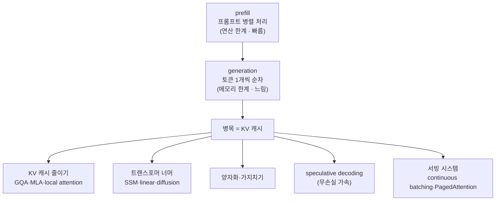

`CS336-LLM-From-Scratch` 시리즈의 10단계입니다. 전체 지도는 [CS336 커리큘럼](/2026/06/26/cs336-llm-from-scratch-curriculum.html)에서 볼 수 있습니다. ([9강 — 스케일링 법칙 1](/2026/06/26/cs336-lecture-9-scaling-laws-1.html)에서 이어집니다.)

스케일링에서 잠시 벗어나, 학습이 끝난 모델을 **실제로 굴리는** 이야기입니다. 추론(inference)은 채팅·코드 완성·배치 처리뿐 아니라, **평가**·**test-time compute(생각하기)**·**RL 학습(샘플링)**의 바탕이기도 합니다. 그리고 학습은 한 번이지만 추론은 **무한히 반복**됩니다(OpenAI는 하루 1,000억 단어, Cursor는 하루 10억 줄 생성). 이 강의(Percy Liang)의 한 문장 — **추론은 메모리 한계(memory-limited)의 게임이고, 그 한가운데에 KV 캐시가 있다.**

<figure class="post-figure post-figure--header">
<svg role="img" aria-label="추론의 두 단계 비대칭: 왼쪽 prefill은 프롬프트의 모든 토큰을 한꺼번에 병렬 처리해 연산 한계라 빠르고, 오른쪽 generation은 매 스텝 토큰 하나만 만들며 점점 커지는 KV 캐시 전체를 매번 읽어와 메모리 한계라 느리다." viewBox="0 0 720 360" xmlns="http://www.w3.org/2000/svg">
  <title>prefill(병렬·빠름) vs generation(순차·느림)의 비대칭</title>
  <defs>
    <marker id="hdrArrow" viewBox="0 0 10 10" refX="8" refY="5" markerWidth="7" markerHeight="7" orient="auto-start-reverse">
      <path d="M0,0 L10,5 L0,10 z" fill="currentColor"/>
    </marker>
    <marker id="hdrArrowRed" viewBox="0 0 10 10" refX="8" refY="5" markerWidth="7" markerHeight="7" orient="auto-start-reverse">
      <path d="M0,0 L10,5 L0,10 z" fill="var(--accent-color)"/>
    </marker>
  </defs>

  <!-- divider -->
  <line x1="360" y1="40" x2="360" y2="332" stroke="currentColor" stroke-width="1.5" stroke-dasharray="3 5" opacity="0.4"/>

  <!-- ============ LEFT: PREFILL ============ -->
  <text x="180" y="34" text-anchor="middle" font-family="var(--font-body)" font-size="19" font-weight="700" fill="currentColor">prefill</text>
  <text x="180" y="55" text-anchor="middle" font-family="var(--font-body)" font-size="12.5" fill="var(--text-light)">프롬프트 전체를 한꺼번에</text>

  <!-- all prompt tokens entering in parallel (one block, arrows side by side) -->
  <g>
    <rect x="56" y="86" width="44" height="40" rx="5" fill="currentColor" opacity="0.12" stroke="var(--secondary-color)" stroke-width="2"/>
    <rect x="108" y="86" width="44" height="40" rx="5" fill="currentColor" opacity="0.12" stroke="var(--secondary-color)" stroke-width="2"/>
    <rect x="160" y="86" width="44" height="40" rx="5" fill="currentColor" opacity="0.12" stroke="var(--secondary-color)" stroke-width="2"/>
    <rect x="212" y="86" width="44" height="40" rx="5" fill="currentColor" opacity="0.12" stroke="var(--secondary-color)" stroke-width="2"/>
    <rect x="264" y="86" width="44" height="40" rx="5" fill="currentColor" opacity="0.12" stroke="var(--secondary-color)" stroke-width="2"/>
    <text x="78"  y="111" text-anchor="middle" font-family="var(--font-body)" font-size="13" font-weight="600" fill="currentColor">t₁</text>
    <text x="130" y="111" text-anchor="middle" font-family="var(--font-body)" font-size="13" font-weight="600" fill="currentColor">t₂</text>
    <text x="182" y="111" text-anchor="middle" font-family="var(--font-body)" font-size="13" font-weight="600" fill="currentColor">t₃</text>
    <text x="234" y="111" text-anchor="middle" font-family="var(--font-body)" font-size="13" font-weight="600" fill="currentColor">…</text>
    <text x="286" y="111" text-anchor="middle" font-family="var(--font-body)" font-size="13" font-weight="600" fill="currentColor">tₙ</text>
  </g>

  <!-- parallel arrows into the compute block -->
  <line x1="78"  y1="132" x2="78"  y2="166" stroke="var(--secondary-color)" stroke-width="2" marker-end="url(#hdrArrow)"/>
  <line x1="130" y1="132" x2="130" y2="166" stroke="var(--secondary-color)" stroke-width="2" marker-end="url(#hdrArrow)"/>
  <line x1="182" y1="132" x2="182" y2="166" stroke="var(--secondary-color)" stroke-width="2" marker-end="url(#hdrArrow)"/>
  <line x1="234" y1="132" x2="234" y2="166" stroke="var(--secondary-color)" stroke-width="2" marker-end="url(#hdrArrow)"/>
  <line x1="286" y1="132" x2="286" y2="166" stroke="var(--secondary-color)" stroke-width="2" marker-end="url(#hdrArrow)"/>

  <rect x="56" y="170" width="252" height="40" rx="6" fill="var(--secondary-color)" opacity="0.18"/>
  <rect x="56" y="170" width="252" height="40" rx="6" fill="none" stroke="var(--secondary-color)" stroke-width="2"/>
  <text x="182" y="195" text-anchor="middle" font-family="var(--font-body)" font-size="14" font-weight="700" fill="currentColor">한 번에 병렬 연산</text>

  <!-- labels -->
  <g font-family="var(--font-body)" font-size="13" font-weight="700">
    <rect x="64" y="244" width="74" height="26" rx="13" fill="var(--secondary-color)" opacity="0.16"/>
    <text x="101" y="261" text-anchor="middle" fill="currentColor">병렬</text>
    <rect x="146" y="244" width="92" height="26" rx="13" fill="var(--secondary-color)" opacity="0.16"/>
    <text x="192" y="261" text-anchor="middle" fill="currentColor">연산 한계</text>
  </g>
  <text x="182" y="306" text-anchor="middle" font-family="var(--font-body)" font-size="18" font-weight="800" fill="var(--secondary-color)">빠름 ⚡</text>

  <!-- ============ RIGHT: GENERATION ============ -->
  <text x="540" y="34" text-anchor="middle" font-family="var(--font-body)" font-size="19" font-weight="700" fill="currentColor">generation</text>
  <text x="540" y="55" text-anchor="middle" font-family="var(--font-body)" font-size="12.5" fill="var(--text-light)">한 스텝에 토큰 하나씩</text>

  <!-- growing KV cache that must be re-read every step -->
  <text x="540" y="80" text-anchor="middle" font-family="var(--font-body)" font-size="12.5" font-weight="700" fill="var(--accent-color)">KV 캐시 (매 스텝 커지고, 매번 다시 읽음)</text>
  <g>
    <rect x="404" y="90" width="26" height="34" rx="4" fill="var(--accent-color)" opacity="0.16" stroke="var(--accent-color)" stroke-width="1.6"/>
    <rect x="434" y="90" width="26" height="34" rx="4" fill="var(--accent-color)" opacity="0.16" stroke="var(--accent-color)" stroke-width="1.6"/>
    <rect x="464" y="90" width="26" height="34" rx="4" fill="var(--accent-color)" opacity="0.16" stroke="var(--accent-color)" stroke-width="1.6"/>
    <rect x="494" y="90" width="26" height="34" rx="4" fill="var(--accent-color)" opacity="0.16" stroke="var(--accent-color)" stroke-width="1.6"/>
    <rect x="524" y="90" width="26" height="34" rx="4" fill="var(--accent-color)" opacity="0.16" stroke="var(--accent-color)" stroke-width="1.6"/>
    <rect x="554" y="90" width="26" height="34" rx="4" fill="var(--accent-color)" opacity="0.16" stroke="var(--accent-color)" stroke-width="1.6"/>
    <rect x="584" y="90" width="26" height="34" rx="4" fill="var(--accent-color)" opacity="0.16" stroke="var(--accent-color)" stroke-width="1.6"/>
    <rect x="614" y="90" width="26" height="34" rx="4" fill="var(--accent-color)" opacity="0.16" stroke="var(--accent-color)" stroke-width="1.6"/>
    <text x="540" y="113" text-anchor="middle" font-family="var(--font-body)" font-size="11" fill="var(--text-light)">K · V · K · V · …</text>
  </g>

  <!-- the whole cache is pulled into one step (single new token out) -->
  <path d="M540,128 L540,160" stroke="var(--accent-color)" stroke-width="2" marker-end="url(#hdrArrowRed)"/>
  <text x="600" y="150" text-anchor="start" font-family="var(--font-body)" font-size="11" fill="var(--text-light)">전체를</text>
  <text x="600" y="164" text-anchor="start" font-family="var(--font-body)" font-size="11" fill="var(--text-light)">매번 읽음</text>

  <rect x="490" y="164" width="100" height="38" rx="6" fill="var(--accent-color)" opacity="0.14"/>
  <rect x="490" y="164" width="100" height="38" rx="6" fill="none" stroke="var(--accent-color)" stroke-width="2"/>
  <text x="540" y="188" text-anchor="middle" font-family="var(--font-body)" font-size="13" font-weight="700" fill="currentColor">1 스텝</text>

  <!-- single new token out -->
  <path d="M540,202 L540,222" stroke="var(--accent-color)" stroke-width="2" marker-end="url(#hdrArrowRed)"/>
  <rect x="516" y="226" width="48" height="40" rx="5" fill="currentColor" opacity="0.12" stroke="var(--accent-color)" stroke-width="2"/>
  <text x="540" y="251" text-anchor="middle" font-family="var(--font-body)" font-size="13" font-weight="700" fill="currentColor">tₙ₊₁</text>

  <!-- "repeat" loop hint -->
  <path d="M566,246 C636,246 636,107 612,100" fill="none" stroke="var(--accent-color)" stroke-width="1.6" stroke-dasharray="4 4" opacity="0.7" marker-end="url(#hdrArrowRed)"/>
  <text x="648" y="180" text-anchor="middle" font-family="var(--font-body)" font-size="11" fill="var(--text-light)" transform="rotate(90 648 180)">반복</text>

  <!-- labels -->
  <g font-family="var(--font-body)" font-size="13" font-weight="700">
    <rect x="424" y="278" width="74" height="26" rx="13" fill="var(--accent-color)" opacity="0.15"/>
    <text x="461" y="295" text-anchor="middle" fill="currentColor">순차</text>
    <rect x="506" y="278" width="106" height="26" rx="13" fill="var(--accent-color)" opacity="0.15"/>
    <text x="559" y="295" text-anchor="middle" fill="currentColor">메모리 한계</text>
  </g>
  <text x="540" y="334" text-anchor="middle" font-family="var(--font-body)" font-size="18" font-weight="800" fill="var(--accent-color)">느림 🐢</text>
</svg>
<figcaption>추론의 비대칭 — prefill은 프롬프트의 모든 토큰을 한꺼번에 병렬 연산해 연산 한계라 빠르고, generation은 매 스텝 토큰 하나만 만들며 점점 커지는 KV 캐시 전체를 매번 다시 읽어와 메모리 한계라 느리다.</figcaption>
</figure>

## 한눈에 보기

추론은 두 단계로 갈립니다 — 프롬프트를 한꺼번에 처리하는 **prefill**(연산 한계, 빠름)과 토큰을 하나씩 뽑는 **generation**(메모리 한계, 느림). 느린 쪽의 병목이 **KV 캐시**이고, 가속 기법은 전부 "메모리 이동을 줄이는" 한 방향입니다.



핵심 지표 셋 — **TTFT**(첫 토큰까지 시간), **지연(latency)**(이후 토큰 도착 속도), **처리량(throughput)**(초당 총 토큰). 대화형은 지연이, 배치는 처리량이 중요합니다.

## 두 단계: prefill vs generation

5강의 **산술 강도(arithmetic intensity, FLOPs/byte)**가 다시 핵심입니다. 행렬곱 `X(B×D)·W(D×F)`의 강도는 대략 **B**입니다 — H100에서 `B > ~295`면 연산 한계(좋음), `B=1`(행렬-벡터)이면 강도 1로 **메모리 한계**(나쁨)입니다.

- **prefill**: 프롬프트의 모든 토큰을 한꺼번에 처리(학습처럼 병렬) → 연산 한계, 빠름. **TTFT**가 여기서 결정됩니다.
- **generation**: 토큰을 하나씩 자동회귀로 생성. 각 토큰이 과거에 의존해 **병렬화 불가**, 매 스텝이 사실상 `B=1` → **메모리 한계**, 느림.

이 순차성이 추론을 어렵게 만드는 근본 원인입니다.

## KV 캐시

순진하게 하면 토큰마다 시퀀스 전체를 다시 어텐션해 `T²`가 듭니다. 과거 토큰의 **K·V를 캐시**해 두면 새 토큰만 계산하면 되어 `~T`로 줄어듭니다. 대신 메모리를 먹습니다.

> **KV 캐시 크기 = B(시퀀스) × S(토큰) × L(층) × K(KV 헤드) × H(헤드 차원) × 2(K·V) × 2(BF16)**

산술 강도를 두 부분으로 나눠 보면 generation이 왜 메모리 한계인지 분명해집니다.

- **MLP**: 강도 = `B·T`. prefill(T=S, 큼)은 좋지만 generation(T=1)은 **B(동시 요청 수)가 커야** 효율이 납니다.
- **어텐션**: 강도 = `S·T/(S+T)`. prefill(T=S)은 `~S`로 좋지만 generation은 **항상 ~1** — 게다가 **B에 무관**합니다. 시퀀스마다 **고유의 KV 캐시**를 들고 있어 배치로 묶어도 절약이 안 되기 때문입니다. 어텐션은 generation에서 본질적으로 메모리 한계입니다.

## 지연 vs 처리량

메모리 한계라, 지연은 곧 "옮겨야 할 바이트 ÷ 대역폭"입니다. Llama-2-13B(H100) 기준:

- `B=1`: 약 **8ms/토큰, 124토큰/s** — 지연 최소.
- `B=16`: 지연은 늘지만 처리량 급증.
- `B=256`: 처리량 증가가 둔해지고(수확 체감), 무엇보다 KV 캐시가 **240GB**라 H100에 **안 들어갑니다.**

즉 **작은 배치 = 낮은 지연, 큰 배치 = 높은 처리량**이고, 배치 상한은 메모리가 정합니다. 한편 추론의 한 가지 병렬화는 아주 쉽습니다 — **모델을 M개 복제**하면 통신 없이 처리량이 ×M(지연은 그대로).

## KV 캐시 줄이기 = 사실은 아키텍처

병목이 KV 캐시라면, 그걸 줄이는 게 핵심입니다. 그런데 KV 캐시를 줄이는 기법은 대부분 **모델 아키텍처 변경**입니다 — 이 추론 강의가 "사실은 아키텍처 강의"인 이유입니다. 관건은 **정확도를 너무 잃지 않으면서** 캐시를 줄이는 것.

| 기법 | 아이디어 | 비고 |
| --- | --- | --- |
| **GQA** (그룹 쿼리) | KV 헤드 수를 줄이고 쿼리 헤드는 많게 | Llama 3 채택 |
| **MLA** (잠재 어텐션) | KV를 저차원 잠재 `c`로 투영 | DeepSeek, 16k→512 |
| **CLA** (층 간 공유) | KV 투영을 **층끼리** 공유 | GQA가 헤드 간 공유라면 CLA는 층 간 |
| **Local/sliding-window** | 최근 K 토큰만 어텐션 → 캐시가 **상수 크기** | 표현력 위해 global 층과 혼합(예: 6층 중 1층 global) |

## 트랜스포머를 넘어

더 급진적으로, 자동회귀 + 풀 어텐션이라는 병목 자체를 바꿉니다. 트랜스포머는 *학습* 효율로 설계됐지 추론을 염두에 두지 않았으니까요.

| 방향 | 아이디어 | 현황 |
| --- | --- | --- |
| **State Space Models** | 선형 동역학으로 상수 크기 상태 유지(`T²` 회피) | S4→**Mamba**. associative recall이 약점 → 하이브리드(Jamba: 8층 중 1층만 트랜스포머) |
| **Linear attention** | 커널 근사로 어텐션을 RNN처럼 선형화 | MiniMax 456B. 여전히 가끔 풀 어텐션 필요 |
| **Diffusion** | 모든 토큰을 **병렬 생성** 후 반복 정제 | Inception Labs. 토큰/s가 압도적, 일반성은 미지수 |

공통점: 풀 어텐션 층을 줄이면 시퀀스 길이에 비례하던 KV 캐시가 **상수**로 바뀌어 추론이 빨라집니다.

## 양자화와 가지치기

아키텍처를 안 바꾸고 비트·파라미터를 줄이는 **손실(lossy)** 기법입니다.

- **양자화(quantization)**: 정밀도를 낮춥니다 — FP32(학습)→**BF16(추론 기본)**→FP8/INT8→INT4. 메모리·전송이 줄어 빨라지나 정확도가 위태롭습니다. 문제는 큰 네트워크의 **이상치(outlier)** — `LLM.int8`은 이상치만 16비트로 따로, 나머지는 INT8로; **AWQ**는 활성화를 보고 어느 가중치를 양자화할지 정해 INT3까지(약 3× 가속). 보통 학습 후 양자화(post-training).
- **가지치기(pruning)**: 덜 중요한 층·헤드·차원을 떼어낸 뒤 **distill로 복구**(NVIDIA: 15B→8B→4B, MMLU 손실 적음).

## Speculative decoding: 무손실 가속

위 기법들은 손실이라 "원본만큼 좋은가?"가 늘 걸립니다. **Speculative decoding**(Google 두 팀이 동시 제안)은 손실 없이 가속합니다. 열쇠는 **검증(prefill, 병렬)이 생성(순차)보다 빠르다**는 비대칭입니다.

```python
# 싼 draft 모델로 앞서가고, 큰 target 모델로 한꺼번에 검증
draft_tokens, p = draft_model.generate(prompt, k)   # 작은 모델로 K개 자동회귀 (빠름)
                                                    # p[t] = draft가 draft_tokens[t]에 준 확률
q = target_probs_at(prompt, draft_tokens)           # 큰 모델 한 번의 검증(병렬)으로
                                                    # q[t] = target이 '같은' draft_tokens[t]에 준 확률
for t in range(k):
    if random() < min(1, q[t] / p[t]):              # Q/P 확률로 수락 (Metropolis-Hastings류)
        accept(draft_tokens[t])
    else:
        accept(sample_from((q[t] - p[t]).clamp(min=0)))  # 거부: 보정 분포에서 1토큰 재표집해 방출
        break
# 결과는 target 모델에서 뽑은 '정확한' 샘플 — 손실 없이 보통 ~2배 가속
```

작은 draft 모델(예: target 8B에 draft 1B)이 K개를 자동회귀로 만들고, target 모델이 한 번의 prefill로 전부 채점합니다. `min(1, Q/P)`로 수락, 거부 시 보정 분포 `(Q−P)₊`에서 재표집 — 그래서 **결과는 target 모델의 정확한 샘플**입니다. Medusa·EAGLE 같은 변형이 활발합니다.

<figure class="post-figure">
<svg role="img" aria-label="Speculative decoding 타임라인: 작은 draft 모델이 K개의 후보 토큰을 싸게 앞질러 생성하고, 큰 target 모델이 그 K개를 한 번의 병렬 패스로 검증한다. 수락된 토큰은 초록 체크로 유지되고, 첫 거부 토큰은 빨간 X로 표시되어 보정 분포에서 재표집한 뒤 draft가 다시 앞질러 달린다. 검증(병렬)이 생성(순차)보다 빠르므로 손실 없이 약 2배 가속된다." viewBox="0 0 720 340" xmlns="http://www.w3.org/2000/svg">
  <title>Speculative decoding — draft가 앞서가고 target이 한 번에 검증</title>
  <defs>
    <marker id="specArrow" viewBox="0 0 10 10" refX="8" refY="5" markerWidth="7" markerHeight="7" orient="auto-start-reverse">
      <path d="M0,0 L10,5 L0,10 z" fill="currentColor"/>
    </marker>
  </defs>

  <!-- ===== Row 1: DRAFT races ahead, K tokens, autoregressive (sequential, cheap) ===== -->
  <text x="20" y="42" font-family="var(--font-body)" font-size="14" font-weight="700" fill="currentColor">① draft (작은 모델)</text>
  <text x="20" y="60" font-family="var(--font-body)" font-size="11.5" fill="var(--text-light)">K개를 싸게 앞질러 — 순차 생성</text>

  <g>
    <rect x="240" y="28" width="64" height="40" rx="6" fill="currentColor" opacity="0.10" stroke="currentColor" stroke-width="1.6"/>
    <rect x="318" y="28" width="64" height="40" rx="6" fill="currentColor" opacity="0.10" stroke="currentColor" stroke-width="1.6"/>
    <rect x="396" y="28" width="64" height="40" rx="6" fill="currentColor" opacity="0.10" stroke="currentColor" stroke-width="1.6"/>
    <rect x="474" y="28" width="64" height="40" rx="6" fill="currentColor" opacity="0.10" stroke="currentColor" stroke-width="1.6"/>
    <rect x="552" y="28" width="64" height="40" rx="6" fill="currentColor" opacity="0.10" stroke="currentColor" stroke-width="1.6"/>
    <text x="272" y="53" text-anchor="middle" font-family="var(--font-body)" font-size="13" font-weight="600" fill="currentColor">d₁</text>
    <text x="350" y="53" text-anchor="middle" font-family="var(--font-body)" font-size="13" font-weight="600" fill="currentColor">d₂</text>
    <text x="428" y="53" text-anchor="middle" font-family="var(--font-body)" font-size="13" font-weight="600" fill="currentColor">d₃</text>
    <text x="506" y="53" text-anchor="middle" font-family="var(--font-body)" font-size="13" font-weight="600" fill="currentColor">d₄</text>
    <text x="584" y="53" text-anchor="middle" font-family="var(--font-body)" font-size="13" font-weight="600" fill="currentColor">d₅</text>
  </g>
  <!-- sequential chaining arrows between draft tokens -->
  <line x1="304" y1="48" x2="318" y2="48" stroke="currentColor" stroke-width="1.4" marker-end="url(#specArrow)" opacity="0.55"/>
  <line x1="382" y1="48" x2="396" y2="48" stroke="currentColor" stroke-width="1.4" marker-end="url(#specArrow)" opacity="0.55"/>
  <line x1="460" y1="48" x2="474" y2="48" stroke="currentColor" stroke-width="1.4" marker-end="url(#specArrow)" opacity="0.55"/>
  <line x1="538" y1="48" x2="552" y2="48" stroke="currentColor" stroke-width="1.4" marker-end="url(#specArrow)" opacity="0.55"/>

  <!-- ===== Row 2: TARGET verifies ALL K in one parallel pass ===== -->
  <text x="20" y="130" font-family="var(--font-body)" font-size="14" font-weight="700" fill="currentColor">② target (큰 모델)</text>
  <text x="20" y="148" font-family="var(--font-body)" font-size="11.5" fill="var(--text-light)">K개를 한 번에 — 병렬 검증</text>

  <!-- one parallel pass spanning all K -->
  <rect x="240" y="104" width="376" height="40" rx="8" fill="var(--gold-soft)" stroke="var(--gold)" stroke-width="2"/>
  <text x="428" y="129" text-anchor="middle" font-family="var(--font-body)" font-size="13.5" font-weight="700" fill="currentColor">한 번의 병렬 패스로 d₁…d₅ 동시 채점</text>
  <!-- the parallel arrows: all draft tokens drop into the single pass at once -->
  <line x1="272" y1="70" x2="272" y2="102" stroke="var(--gold)" stroke-width="1.6" marker-end="url(#specArrow)"/>
  <line x1="350" y1="70" x2="350" y2="102" stroke="var(--gold)" stroke-width="1.6" marker-end="url(#specArrow)"/>
  <line x1="428" y1="70" x2="428" y2="102" stroke="var(--gold)" stroke-width="1.6" marker-end="url(#specArrow)"/>
  <line x1="506" y1="70" x2="506" y2="102" stroke="var(--gold)" stroke-width="1.6" marker-end="url(#specArrow)"/>
  <line x1="584" y1="70" x2="584" y2="102" stroke="var(--gold)" stroke-width="1.6" marker-end="url(#specArrow)"/>

  <!-- ===== Row 3: verdicts — accept (green ✓) up to first reject (red ✗) → resample ===== -->
  <text x="20" y="210" font-family="var(--font-body)" font-size="14" font-weight="700" fill="currentColor">③ 판정</text>
  <text x="20" y="228" font-family="var(--font-body)" font-size="11.5" fill="var(--text-light)">수락 유지, 첫 거부서 재표집</text>

  <!-- verdict arrows down -->
  <line x1="272" y1="146" x2="272" y2="184" stroke="var(--secondary-color)" stroke-width="1.6" marker-end="url(#specArrow)"/>
  <line x1="350" y1="146" x2="350" y2="184" stroke="var(--secondary-color)" stroke-width="1.6" marker-end="url(#specArrow)"/>
  <line x1="428" y1="146" x2="428" y2="184" stroke="var(--secondary-color)" stroke-width="1.6" marker-end="url(#specArrow)"/>
  <line x1="506" y1="146" x2="506" y2="184" stroke="var(--accent-color)" stroke-width="1.6" marker-end="url(#specArrow)"/>

  <!-- d1,d2,d3 accepted (green) -->
  <g>
    <rect x="240" y="186" width="64" height="40" rx="6" fill="var(--secondary-color)" opacity="0.16" stroke="var(--secondary-color)" stroke-width="2"/>
    <rect x="318" y="186" width="64" height="40" rx="6" fill="var(--secondary-color)" opacity="0.16" stroke="var(--secondary-color)" stroke-width="2"/>
    <rect x="396" y="186" width="64" height="40" rx="6" fill="var(--secondary-color)" opacity="0.16" stroke="var(--secondary-color)" stroke-width="2"/>
    <text x="272" y="207" text-anchor="middle" font-family="var(--font-body)" font-size="12.5" font-weight="600" fill="currentColor">d₁</text>
    <text x="350" y="207" text-anchor="middle" font-family="var(--font-body)" font-size="12.5" font-weight="600" fill="currentColor">d₂</text>
    <text x="428" y="207" text-anchor="middle" font-family="var(--font-body)" font-size="12.5" font-weight="600" fill="currentColor">d₃</text>
    <!-- green check marks -->
    <path d="M266,217 l4,4 l7,-9" fill="none" stroke="var(--secondary-color)" stroke-width="2.4" stroke-linecap="round" stroke-linejoin="round"/>
    <path d="M344,217 l4,4 l7,-9" fill="none" stroke="var(--secondary-color)" stroke-width="2.4" stroke-linecap="round" stroke-linejoin="round"/>
    <path d="M422,217 l4,4 l7,-9" fill="none" stroke="var(--secondary-color)" stroke-width="2.4" stroke-linecap="round" stroke-linejoin="round"/>
  </g>

  <!-- d4 first rejected (red ✗) -->
  <rect x="474" y="186" width="64" height="40" rx="6" fill="var(--accent-color)" opacity="0.16" stroke="var(--accent-color)" stroke-width="2"/>
  <text x="506" y="207" text-anchor="middle" font-family="var(--font-body)" font-size="12.5" font-weight="600" fill="currentColor">d₄</text>
  <path d="M501,213 l10,10 M511,213 l-10,10" fill="none" stroke="var(--accent-color)" stroke-width="2.4" stroke-linecap="round"/>

  <!-- d5 discarded (dropped because earlier reject ends the run) -->
  <rect x="552" y="186" width="64" height="40" rx="6" fill="none" stroke="var(--text-light)" stroke-width="1.6" stroke-dasharray="4 4" opacity="0.6"/>
  <text x="584" y="207" text-anchor="middle" font-family="var(--font-body)" font-size="12.5" fill="var(--text-light)">버림</text>

  <!-- resample at the first reject, then draft races again -->
  <line x1="506" y1="228" x2="506" y2="256" stroke="var(--accent-color)" stroke-width="1.6" marker-end="url(#specArrow)"/>
  <rect x="430" y="258" width="152" height="34" rx="8" fill="var(--accent-color)" opacity="0.12"/>
  <rect x="430" y="258" width="152" height="34" rx="8" fill="none" stroke="var(--accent-color)" stroke-width="1.8"/>
  <text x="506" y="280" text-anchor="middle" font-family="var(--font-body)" font-size="12.5" font-weight="700" fill="currentColor">(Q−P)₊서 재표집</text>

  <!-- loop back: draft races again -->
  <path d="M582,275 C660,275 660,48 616,48" fill="none" stroke="currentColor" stroke-width="1.6" stroke-dasharray="5 4" opacity="0.55" marker-end="url(#specArrow)"/>
  <text x="680" y="165" text-anchor="middle" font-family="var(--font-body)" font-size="11.5" fill="var(--text-light)" transform="rotate(90 680 165)">draft 다시 출발</text>

  <!-- takeaway banner -->
  <text x="240" y="320" font-family="var(--font-body)" font-size="13.5" font-weight="800" fill="var(--gold)">검증(병렬) &gt; 생성(순차)</text>
  <text x="430" y="320" font-family="var(--font-body)" font-size="13.5" font-weight="800" fill="currentColor">→ 무손실 ~2× 가속</text>
</svg>
<figcaption>Speculative decoding — 작은 draft 모델이 K개 후보를 싸게 앞질러 만들고, 큰 target 모델이 한 번의 병렬 패스로 전부 채점한다. 수락(초록 ✓)은 유지하고 첫 거부(빨강 ✗)에서 보정 분포 (Q−P)₊로 재표집한 뒤 draft가 다시 출발. 검증(병렬)이 생성(순차)보다 빨라 손실 없이 약 2배 가속된다.</figcaption>
</figure>

## 서빙 시스템

실제 트래픽은 요청이 **제각각**(도착·길이·공유 프리픽스가 다 다름)이라, 학습의 빽빽한 토큰 블록과 다릅니다.

- **Continuous batching**: 배치가 끝나길 기다리지 않고, 매 스텝 스케줄러로 돌아와 **새 요청을 즉시 끼워** 넣습니다(GPU가 노는 시간 최소화).
- **Selective batching**: 어텐션은 시퀀스별로 따로, 하지만 연산의 대부분인 MLP는 길이가 달라도 **flatten해 한 배치로** 처리.
- **PagedAttention (vLLM)**: KV 캐시를 OS 가상 메모리처럼 **페이지(블록)**로 쪼개 빈 공간에 배치 → **단편화(fragmentation) 제거**. 공유 프리픽스는 copy-on-write로 공유. "운영체제 수업이 추론에 쓰인다."

## 성능·복잡도 노트

- **추론 = 메모리 한계**: generation은 사실상 `B=1`이라 산술 강도가 1. 모든 가속이 결국 **메모리 이동 줄이기**입니다.
- **병목은 KV 캐시**: 시퀀스마다 고유해 배치로 안 줄어듭니다. 그래서 KV 캐시 축소(GQA·MLA·local)가 1순위 레버.
- **진짜 큰 이득은 아키텍처에서**: 양자화·시스템 최적화는 한계가 있고, SSM·linear·diffusion처럼 병목 *자체*를 바꾸면 판이 달라집니다.
- **무손실이 필요하면 speculative decoding**: 검증이 생성보다 빠르다는 비대칭을 이용해 정확한 샘플을 ~2배 빠르게.
- **지연 ↔ 처리량은 배치로 거래**: 작은 배치=지연↓, 큰 배치=처리량↑(메모리가 상한).

## 요약

- 추론은 **메모리 한계**의 게임. **prefill**(병렬·연산 한계)은 빠르고 **generation**(순차·메모리 한계)이 느리다.
- 병목은 **KV 캐시**(B·S·L·K·H·2·2 바이트). 어텐션 generation 강도는 시퀀스마다 캐시가 고유해 **항상 ~1**.
- **KV 캐시 줄이기 = 아키텍처**: GQA·MLA·CLA·local/sliding-window(+global 혼합).
- **트랜스포머 너머**: SSM(Mamba)·linear attention·diffusion이 풀 어텐션·자동회귀 병목을 우회.
- **양자화/가지치기**(손실) vs **speculative decoding**(무손실 ~2×) vs **서빙 시스템**(continuous batching·PagedAttention).

### 다음 학습 (Next Learning)

- **11단계: 스케일링 법칙 2** — 하이퍼파라미터 전이(muP)와 스케일링으로 학습 레시피를 정하기 (상세 포스트 작성 예정)
- [CS336 9강 — 스케일링 법칙 1](/2026/06/26/cs336-lecture-9-scaling-laws-1.html) — 유닛 3의 시작
- [CS336 3강 — 아키텍처와 하이퍼파라미터](/2026/06/26/cs336-lecture-3-architectures-hyperparameters.html) — GQA·MLA의 배경(어텐션 변형)
