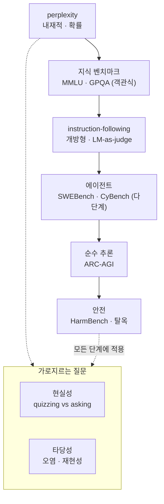

`CS336-LLM-From-Scratch` 시리즈의 12단계입니다. 전체 지도는 [CS336 커리큘럼](/2026/06/26/cs336-llm-from-scratch-curriculum.html)에서 볼 수 있습니다. ([11강 — 스케일링 법칙 2](/2026/06/26/cs336-lecture-11-scaling-laws-2.html)에서 이어집니다.)

유닛 3(스케일링·추론)을 마치고 **유닛 4(데이터 & 평가)**로 들어섭니다. 유닛 1~3에서 우리는 모델을 만들고(아키텍처), 키우고(스케일링), 굴렸습니다(추론) — 이제 질문은 하나입니다. *"됐는지 어떻게 아는가?"* 평가는 부차적 마무리가 아닙니다. 스케일링 법칙도 y축에 올릴 metric이 있어야 그릴 수 있고(9·11강), RL은 보상(=평가)이 있어야 돌아가며(15~17강), 심지어 "어느 모델을 살까"라는 구매 결정도 결국 평가입니다. 이 강의(Percy Liang)를 관통하는 한 문장은 이것입니다 — **"하나의 참된 평가는 없다. 무엇을 알고 싶은지에 달렸다."(There is no one true evaluation.)**

<figure class="post-figure post-figure--header">
<svg role="img" aria-label="평가 파이프라인을 네 개의 질문으로 나눈 좌에서 우로 흐르는 도식. 입력 설계(어떤 입력?), 모델 호출(어떻게 부르나?), 출력 채점(어떻게 평가?), 결과 해석(무엇을 뜻하나?)의 네 단계가 화살표로 이어지고, 각 단계의 선택이 무엇을 측정하는지를 바꾼다." viewBox="0 0 760 260" xmlns="http://www.w3.org/2000/svg">
  <title>평가 파이프라인 — 입력 설계 · 모델 호출 · 출력 채점 · 결과 해석</title>
  <defs>
    <marker id="evalArrow" viewBox="0 0 10 10" refX="8" refY="5" markerWidth="8" markerHeight="8" orient="auto-start-reverse">
      <path d="M0,0 L10,5 L0,10 z" fill="var(--gold)"/>
    </marker>
  </defs>

  <text x="380" y="28" text-anchor="middle" font-family="var(--font-body)" font-size="16" font-weight="700" fill="var(--text-color)">평가 = 네 개의 질문이 이어진 파이프라인</text>

  <!-- ===== stage boxes ===== -->
  <!-- box 1: 입력 설계 -->
  <rect x="20" y="52" width="150" height="104" rx="8" fill="currentColor" opacity="0.05"/>
  <rect x="20" y="52" width="150" height="104" rx="8" fill="none" stroke="var(--secondary-color)" stroke-width="2"/>
  <circle cx="95" cy="78" r="15" fill="var(--secondary-color)"/>
  <text x="95" y="83" text-anchor="middle" font-family="var(--font-body)" font-size="15" font-weight="700" fill="var(--bg-panel)">1</text>
  <text x="95" y="112" text-anchor="middle" font-family="var(--font-body)" font-size="14" font-weight="700" fill="var(--text-color)">입력 설계</text>
  <text x="95" y="134" text-anchor="middle" font-family="var(--font-body)" font-size="11.5" fill="var(--text-light)">어떤 입력?</text>

  <!-- box 2: 모델 호출 -->
  <rect x="210" y="52" width="150" height="104" rx="8" fill="currentColor" opacity="0.05"/>
  <rect x="210" y="52" width="150" height="104" rx="8" fill="none" stroke="var(--secondary-color)" stroke-width="2"/>
  <circle cx="285" cy="78" r="15" fill="var(--secondary-color)"/>
  <text x="285" y="83" text-anchor="middle" font-family="var(--font-body)" font-size="15" font-weight="700" fill="var(--bg-panel)">2</text>
  <text x="285" y="112" text-anchor="middle" font-family="var(--font-body)" font-size="14" font-weight="700" fill="var(--text-color)">모델 호출</text>
  <text x="285" y="134" text-anchor="middle" font-family="var(--font-body)" font-size="11.5" fill="var(--text-light)">어떻게 부르나?</text>

  <!-- box 3: 출력 채점 -->
  <rect x="400" y="52" width="150" height="104" rx="8" fill="currentColor" opacity="0.05"/>
  <rect x="400" y="52" width="150" height="104" rx="8" fill="none" stroke="var(--secondary-color)" stroke-width="2"/>
  <circle cx="475" cy="78" r="15" fill="var(--secondary-color)"/>
  <text x="475" y="83" text-anchor="middle" font-family="var(--font-body)" font-size="15" font-weight="700" fill="var(--bg-panel)">3</text>
  <text x="475" y="112" text-anchor="middle" font-family="var(--font-body)" font-size="14" font-weight="700" fill="var(--text-color)">출력 채점</text>
  <text x="475" y="134" text-anchor="middle" font-family="var(--font-body)" font-size="11.5" fill="var(--text-light)">어떻게 평가?</text>

  <!-- box 4: 결과 해석 (payoff — accent stroke) -->
  <rect x="590" y="52" width="150" height="104" rx="8" fill="currentColor" opacity="0.05"/>
  <rect x="590" y="52" width="150" height="104" rx="8" fill="none" stroke="var(--accent-color)" stroke-width="2.5"/>
  <circle cx="665" cy="78" r="15" fill="var(--accent-color)"/>
  <text x="665" y="83" text-anchor="middle" font-family="var(--font-body)" font-size="15" font-weight="700" fill="var(--bg-panel)">4</text>
  <text x="665" y="112" text-anchor="middle" font-family="var(--font-body)" font-size="14" font-weight="700" fill="var(--text-color)">결과 해석</text>
  <text x="665" y="134" text-anchor="middle" font-family="var(--font-body)" font-size="11.5" fill="var(--text-light)">무엇을 뜻하나?</text>

  <!-- ===== connecting arrows ===== -->
  <line x1="172" y1="104" x2="208" y2="104" stroke="var(--gold)" stroke-width="2.2" marker-end="url(#evalArrow)"/>
  <line x1="362" y1="104" x2="398" y2="104" stroke="var(--gold)" stroke-width="2.2" marker-end="url(#evalArrow)"/>
  <line x1="552" y1="104" x2="588" y2="104" stroke="var(--gold)" stroke-width="2.2" marker-end="url(#evalArrow)"/>

  <!-- ===== per-stage detail captions ===== -->
  <g font-family="var(--font-body)" font-size="11" fill="var(--text-light)" text-anchor="middle">
    <text x="95" y="188">커버리지 · 난도</text>
    <text x="95" y="205">· 적응(adaptive)</text>
    <text x="285" y="188">프롬프트·CoT·도구</text>
    <text x="285" y="205">RAG·에이전트 vs base</text>
    <text x="475" y="188">지표·비용·개방형</text>
    <text x="475" y="205">비대칭 오류</text>
    <text x="665" y="188">배포 적합성·일반화</text>
    <text x="665" y="205">method vs model</text>
  </g>
</svg>
<figcaption>평가는 이 네 질문의 파이프라인이며, 각 단계의 선택이 "무엇을 측정하는가"를 바꾼다 — 같은 모델도 입력·호출·채점·해석을 달리하면 전혀 다른 결론이 나온다.</figcaption>
</figure>

## 한눈에 보기

평가 방법을 늘어놓으면 하나의 **사다리**가 보입니다 — 아래로 갈수록 자동·저렴하지만 실사용과 멀고, 위로 갈수록 현실적이지만 채점이 어렵고 비쌉니다. 그리고 어떤 지표든 두 개의 가로지르는 질문을 통과해야 합니다 — **현실성**(실사용과 얼마나 가까운가)과 **타당성**(오염 없이 믿을 수 있는가).



왼쪽 아래(perplexity)는 로그 확률만 있으면 공짜로 나오지만 "이 모델이 내 일을 잘하나?"에는 답하지 못합니다. 오른쪽 위(에이전트·안전)는 실사용에 가깝지만 채점이 느리고 비쌉니다. 어느 칸에 서든, 그 숫자를 믿기 전에 **현실성**과 **오염**을 먼저 물어야 합니다.

## 하나의 참된 평가는 없다

강의가 반복하는 핵심은 **평가에는 목적이 있다**는 것입니다. 목적이 다르면 "좋은 평가"의 정의도 달라집니다. Percy Liang이 꼽는 평가의 **네 가지 목적**은 이렇습니다.

1. **구매 결정** — 내 용도에 모델 A와 B 중 무엇이 나은가.
2. **순수 능력 측정** — 이 모델은 지금 무엇을 할 수 있는가(과학적 관심).
3. **이득·해악 이해** — 사회에 어떤 가치와 위험을 주는가(안전·정책).
4. **개발 피드백** — 다음 학습 결정을 위한 신호(스케일링·데이터·RL의 손잡이).

그리고 어떤 목적이든 평가는 헤더 그림의 **4요소 프레임워크**로 분해됩니다 — 어떤 **입력**을 줄지, 모델을 **어떻게 호출**할지(그냥 프롬프트? CoT? 도구·RAG·에이전트? base 모델인가 chat 모델인가), 출력을 **어떻게 채점**할지, 그 결과를 **어떻게 해석**할지. 네 칸의 선택이 조금만 바뀌어도 결론이 뒤집힙니다. 그래서 강의가 규범처럼 강조하는 한 문장이 있습니다.

> **항상 개별 인스턴스와 예측을 직접 들여다보라.** 집계된 점수 하나만 보면 무엇이 진짜 측정되고 있는지 놓친다.

## Perplexity — 내재적 지표

가장 오래된 평가는 언어 모델 그 자체의 목적함수, **perplexity**입니다. 모델이 데이터에 부여한 확률을 토큰 수로 정규화한 값 — 직관적으로는 "다음 토큰을 고를 때 평균 몇 개의 선택지 사이에서 헤매는가"입니다.

```text
perplexity(D) = ( 1 / p(D) )^(1/|D|)
             = ( ∏ₜ 1 / p(xₜ | x<ₜ) )^(1/|D|)   # 토큰별 확률의 기하평균 역수
```

표준 데이터셋으로는 **Penn Treebank, WikiText-103, One Billion Word Benchmark**가 오래 쓰였습니다. (여담이지만 GPT-2는 WebText로 학습해 이들에 대해서는 out-of-distribution 평가였는데도 강했다는 점이 당시 인상적이었습니다.)

perplexity가 벤치마크 전성시대에도 여전히 유용한 이유는 세 가지입니다.

- **부드럽다(smooth)**: task accuracy는 계단처럼 튀지만, perplexity는 아주 작은 개선도 잡아냅니다 — 그래서 스케일링 법칙의 y축으로 쓰기에 이상적입니다(9·11강).
- **보편적이다**: 정답 라벨이 필요 없고 어떤 텍스트에도 계산됩니다.
- **스케일링을 측정한다**: 모델·데이터·연산이 늘 때 손실이 매끄럽게 내려가는 곡선을 그릴 수 있습니다.

다만 함정도 분명합니다.

> perplexity는 모델의 확률 출력을 **신뢰할 수 있을 때만** 쓴다 — logit에 접근 가능한 open 모델에만 계산되고, 토크나이저가 다르면 값을 직접 비교할 수 없다.

토크나이저가 다르면 "토큰당" 확률의 단위 자체가 달라지므로, 서로 다른 모델을 비교하려면 **bits-per-byte**로 정규화해 토크나이제이션 의존성을 제거해야 합니다(1강 토크나이제이션과 연결). 한편 이른바 "perplexity maximalist" 관점도 있습니다 — 다음 토큰 예측을 완벽히 풀면 결국 AGI에 닿는다는 것입니다(가장 효율적인 길은 아닐지언정). 그리고 perplexity와 실제 능력 사이를 잇는 다리로 **cloze 과제(LAMBADA)**나 **HellaSwag** 같은, 확률만으로 정답을 고르는 과제들이 쓰입니다.

## 지식 벤치마크 — 객관식의 시대

perplexity가 "언어를 얼마나 잘 예측하나"라면, 오늘날의 능력 평가는 대개 **객관식 지식 벤치마크**입니다. 채점이 자동이라 싸고 재현 가능하기 때문입니다. 대표 벤치마크들을 나란히 놓으면, 이 분야가 사실상 **saturation(포화)과의 군비경쟁**임이 보입니다.

| 벤치마크 | 무엇을 · 어떻게 | 왜 만들어졌나 / 무엇이 깨졌나 |
| --- | --- | --- |
| **MMLU** | 57개 과목(수학·역사·법·도덕), 객관식 few-shot | 지식의 넓은 커버리지 — 그러나 곧 포화 |
| **MMLU-Pro** | 노이즈 문항 제거, 4→**10지선다**, chain-of-thought | 포화 대응 → 정확도 **16–33%p 하락** |
| **GPQA** | PhD 계약자 61명이 출제, "Google-proof" | PhD 전문가 **65%** / 비전문가+구글 30분 **34%** / GPT-4 **39%** |
| **HLE** (Humanity's Last Exam) | 2500 멀티모달 문항, $500K 상금, 프런티어로 필터·다단계 검수 | 남은 난제만 모아 프런티어의 상한 측정 |

여기서 외울 것은 숫자가 아니라 **패턴**입니다. 객관식은 자동 채점이 쉽지만 두 가지 약점이 있습니다 — 최고 모델들이 만점에 붙으면 변별력이 사라지는 **포화**, 그리고 4지선다면 25%는 찍어서 맞는 **추측**. 대응은 자연히 두 방향입니다. 선택지를 늘려 추측을 억제하고(MMLU-Pro의 10지선다), 사람도 전문가라야 풀 만큼 난도를 올리는 것(GPQA·HLE). GPQA가 "Google-proof"라 불리는 이유가 상징적입니다 — 검색으로는 못 풀고 진짜 전문성이 있어야 합니다.

## 개방형 응답은 어떻게 채점하나 — LM-as-judge와 휴먼 평가

객관식의 근본 한계는, 실제 어시스턴트는 **개방형**으로 답한다는 데 있습니다. "이 코드를 리팩터링해 줘"에는 정답 문자열이 없습니다. 그래서 개방형 채점은 세 갈래로 발전했습니다.

- **휴먼 pairwise + Chatbot Arena**: 무작위 인터넷 프롬프트에 대해 익명의 두 모델이 답하고, 사람이 어느 쪽이 나은지 고릅니다. 이를 **ELO**로 집계합니다. 입력이 고정 데이터셋이 아니라 **라이브**라 오염에 강한 대신, 프롬프트가 매번 달라 재현성은 낮습니다.
- **자동 검증 가능한 제약 — IFEval**: "N단어 이하로", "JSON으로만 답하라"처럼 **기계적으로 검증 가능한** 제약을 합성해 지시 이행을 잽니다. 의미의 질은 못 재고 다소 인공적이지만, 사람도 LM도 필요 없이 자동입니다.
- **LM-as-judge — AlpacaEval·WildBench**: 강한 모델에게 심판을 맡깁니다. **AlpacaEval**은 805개 지시에 대해 GPT-4-preview를 기준으로 한 **win rate를 GPT-4가 채점**합니다. **WildBench**는 실제 100만 대화에서 1024개를 추출해 체크리스트+GPT-4 심판으로 평가하는데, 그 결과가 **Chatbot Arena와 0.95 상관** — 사실상 사람 선호의 값싼 대리(sanity check)입니다.

LM-as-judge는 강력하고 값싸지만, 심판이 사람이 아니라 모델이라는 데서 오는 고유한 편향을 안고 있습니다.

> LM-as-judge의 편향 — **자기선호**(자기 출력을 편애), **길이 편향**(길수록 좋게 봄), **위치 편향**(제시 순서에 민감). 그래서 심판 모델과 프롬프트를 바꾸면 순위가 바뀐다.

이 세 편향은 곧 재현성의 함정으로 이어집니다 — "AlpacaEval 1위"라는 문장은 어떤 심판을 썼는지를 밝히지 않으면 반쪽짜리입니다.

## 에이전트·추론·안전 벤치마크

객관식과 개방형 채팅을 넘어, 최근 평가는 **여러 단계에 걸친 행동**을 재기 시작했습니다. 여기서 평가 대상은 모델 하나가 아니라 **에이전트 = LM + scaffolding(도구·루프)**입니다.

| 벤치마크 | 무엇을 재나 | 채점 |
| --- | --- | --- |
| **SWEBench** | 12개 파이썬 repo에서 이슈→PR, 2294개 태스크 | **유닛 테스트**로 자동 채점 |
| **CyBench** | 40개 CTF 보안 문제 | 사람의 **first-solve time**으로 난도 보정 |
| **MLEBench** | 75개 Kaggle 대회(모델 학습·데이터 처리 요구) | 대회 메트릭 |

에이전트 벤치마크의 매력은 **채점이 현실의 성공 기준과 일치**한다는 점입니다 — SWEBench는 "테스트가 통과하는가"로 끝나므로 LM-as-judge의 편향이 끼어들 여지가 없습니다.

- **순수 추론 — ARC-AGI**(François Chollet, 2019): 작은 격자의 시각 패턴을 몇 개의 예시만 보고 규칙을 유추하는 과제로, **지식과 분리된 추론** 그 자체를 재려는 시도입니다. 포화되자 더 어려운 ARC-AGI-2가 나왔습니다.
- **안전**: 여기서는 "안전"의 정의부터가 **강하게 맥락 의존적**입니다 — 무엇이 유해한지는 정치·법·사회 규범에 따라 달라집니다. **HarmBench**(510개 유해 행동)와 **AIR-Bench**(규제·기업정책에서 도출한 314개 위험 범주·5694개 프롬프트)가 대표적입니다. 공격 쪽에서는 **탈옥(jailbreak)**, 특히 **GCG(Greedy Coordinate Gradient)**가 프롬프트에 붙일 접미사를 자동 최적화하는데, open-weight(Llama)에서 찾은 공격이 closed 모델(GPT-4)로 **전이**되기도 합니다.

안전에서 반드시 갈라 봐야 할 두 개념이 있습니다.

> **capability**(할 수 있나) vs **propensity**(하려 드나) — API 모델은 요청을 거부하는 propensity가 관건이고, open-weight 모델은 파인튜닝으로 안전장치를 벗길 수 있으니 capability 자체가 관건이다.

여기에 **dual-use** 문제가 겹칩니다 — CyBench형 사이버보안 에이전트는 방어(침투 테스트)에도 공격(해킹)에도 쓰일 수 있어, 같은 능력이 이득이자 해악입니다. 배포 전 안전 테스트는 US/UK AI Safety Institute 등이 수행하지만, 현재로서는 **자발적(voluntary)**이라는 점도 기억해 둘 만합니다.

## 현실성(Realism) — 벤치마크는 실사용과 얼마나 가까운가

벤치마크 점수가 아무리 높아도, 그것이 **실제 사용**을 대변하지 못하면 반쪽입니다. 실사용 규모는 압도적입니다 — OpenAI는 하루 1000억+ 토큰, Cursor는 하루 수십억 줄을 생성합니다(10강). 그런데 MMLU 같은 시험 문제는 사람들이 실제로 챗봇에게 던지는 질문과 거리가 있습니다.

강의가 짚는 핵심 구분이 있습니다.

> **Quizzing**(사용자가 답을 이미 알고 시스템을 시험) vs **Asking**(사용자가 답을 몰라 진짜로 묻는 것). 대부분의 벤치마크는 quizzing이지만, 현실의 가치는 asking에서 나온다.

<figure class="post-figure">
<svg role="img" aria-label="퀴징과 애스킹의 대비. 왼쪽 퀴징은 사용자가 답을 이미 알고(체크 표시) 시스템을 시험하는 상황, 오른쪽 애스킹은 사용자가 답을 몰라(물음표) 진짜로 묻는 상황이다. 대부분의 벤치마크는 퀴징이지만 현실의 가치는 애스킹에서 나온다." viewBox="0 0 720 320" xmlns="http://www.w3.org/2000/svg">
  <title>Quizzing 대 Asking — 시험하기 vs 진짜로 묻기</title>
  <defs>
    <marker id="qaArrow" viewBox="0 0 10 10" refX="8" refY="5" markerWidth="8" markerHeight="8" orient="auto-start-reverse">
      <path d="M0,0 L10,5 L0,10 z" fill="var(--gold)"/>
    </marker>
  </defs>

  <text x="360" y="30" text-anchor="middle" font-family="var(--font-body)" font-size="16" font-weight="700" fill="var(--text-color)">대부분의 벤치마크는 quizzing · 현실의 가치는 asking</text>

  <!-- ===== LEFT: Quizzing ===== -->
  <rect x="20" y="52" width="320" height="246" rx="10" fill="currentColor" opacity="0.04"/>
  <rect x="20" y="52" width="320" height="246" rx="10" fill="none" stroke="var(--secondary-color)" stroke-width="2"/>
  <text x="180" y="82" text-anchor="middle" font-family="var(--font-body)" font-size="16" font-weight="700" fill="var(--secondary-color)">Quizzing</text>
  <text x="180" y="104" text-anchor="middle" font-family="var(--font-body)" font-size="12.5" fill="var(--text-light)">답을 이미 알고 시스템을 시험</text>

  <!-- user -->
  <circle cx="80" cy="162" r="15" fill="none" stroke="currentColor" stroke-width="2"/>
  <path d="M 57 206 Q 57 179 80 179 Q 103 179 103 206 Z" fill="none" stroke="currentColor" stroke-width="2"/>

  <!-- knows-answer bubble (checkmark) -->
  <rect x="112" y="128" width="54" height="40" rx="9" fill="var(--bg-panel)" stroke="var(--secondary-color)" stroke-width="1.8"/>
  <path d="M 127 148 L 135 158 L 152 137" fill="none" stroke="var(--secondary-color)" stroke-width="2.8" stroke-linecap="round" stroke-linejoin="round"/>
  <text x="139" y="186" text-anchor="middle" font-family="var(--font-body)" font-size="11" fill="var(--text-light)">답을 안다</text>

  <!-- arrow -->
  <line x1="172" y1="170" x2="224" y2="170" stroke="var(--gold)" stroke-width="2.2" marker-end="url(#qaArrow)"/>

  <!-- system box -->
  <rect x="228" y="146" width="84" height="48" rx="8" fill="currentColor" opacity="0.06"/>
  <rect x="228" y="146" width="84" height="48" rx="8" fill="none" stroke="currentColor" stroke-width="1.8"/>
  <text x="270" y="175" text-anchor="middle" font-family="var(--font-body)" font-size="13" font-weight="700" fill="var(--text-color)">LLM</text>

  <text x="180" y="252" text-anchor="middle" font-family="var(--font-body)" font-size="12.5" fill="var(--text-light)">정답이 이미 있다 → 채점이 목적</text>
  <text x="180" y="274" text-anchor="middle" font-family="var(--font-body)" font-size="11.5" fill="var(--text-light)">(MMLU 등 대부분의 벤치마크)</text>

  <!-- ===== RIGHT: Asking ===== -->
  <rect x="380" y="52" width="320" height="246" rx="10" fill="currentColor" opacity="0.04"/>
  <rect x="380" y="52" width="320" height="246" rx="10" fill="none" stroke="var(--accent-color)" stroke-width="2.5"/>
  <text x="540" y="82" text-anchor="middle" font-family="var(--font-body)" font-size="16" font-weight="700" fill="var(--accent-color)">Asking</text>
  <text x="540" y="104" text-anchor="middle" font-family="var(--font-body)" font-size="12.5" fill="var(--text-light)">답을 몰라 진짜로 묻는다</text>

  <!-- user -->
  <circle cx="440" cy="162" r="15" fill="none" stroke="currentColor" stroke-width="2"/>
  <path d="M 417 206 Q 417 179 440 179 Q 463 179 463 206 Z" fill="none" stroke="currentColor" stroke-width="2"/>

  <!-- unknown bubble (question mark) -->
  <rect x="472" y="128" width="54" height="40" rx="9" fill="var(--bg-panel)" stroke="var(--accent-color)" stroke-width="1.8"/>
  <text x="499" y="158" text-anchor="middle" font-family="var(--font-body)" font-size="23" font-weight="700" fill="var(--accent-color)">?</text>
  <text x="499" y="186" text-anchor="middle" font-family="var(--font-body)" font-size="11" fill="var(--text-light)">답을 모른다</text>

  <!-- arrow -->
  <line x1="532" y1="170" x2="584" y2="170" stroke="var(--gold)" stroke-width="2.2" marker-end="url(#qaArrow)"/>

  <!-- system box -->
  <rect x="588" y="146" width="84" height="48" rx="8" fill="currentColor" opacity="0.06"/>
  <rect x="588" y="146" width="84" height="48" rx="8" fill="none" stroke="currentColor" stroke-width="1.8"/>
  <text x="630" y="175" text-anchor="middle" font-family="var(--font-body)" font-size="13" font-weight="700" fill="var(--text-color)">LLM</text>

  <text x="540" y="252" text-anchor="middle" font-family="var(--font-body)" font-size="12.5" font-weight="700" fill="var(--gold)">진짜 도움이 목적 → 여기서 가치가 나온다</text>
  <text x="540" y="274" text-anchor="middle" font-family="var(--font-body)" font-size="11.5" fill="var(--text-light)">(실사용 · MedHELM 등)</text>
</svg>
<figcaption>퀴징은 사용자가 답을 이미 알고 시스템을 시험하는 것(벤치마크 대부분), 애스킹은 답을 몰라 진짜로 묻는 것이다 — 실사용의 가치는 애스킹에서 나오지만, 벤치마크는 주로 퀴징을 잰다.</figcaption>
</figure>

이 간극을 좁히려는 시도들이 있습니다. **Clio**(Anthropic)는 실제 사용자 대화를 프라이버시를 보존한 채 집계해 **일반적 사용 패턴만** 공개합니다. **MedHELM**은 표준화 시험이 아니라 **임상의 29명이 실제 업무에서 뽑아낸 121개 임상 태스크**로 의료 능력을 잽니다. 다만 여기서 근본적 긴장이 드러납니다 — **현실성과 프라이버시는 자주 충돌**합니다. 진짜 사용 데이터일수록 공개하기 어렵기 때문입니다.

## 타당성과 오염(Contamination) — 평가의 함정

마지막 관문은 **타당성**입니다. 점수가 정말 능력을 재고 있는가, 아니면 시험지를 미리 봤을 뿐인가. 머신러닝 101의 대원칙인 **train-test 분리**가, 인터넷 전체를 학습하는 현대 LM에서는 지키기 어렵습니다 — 테스트셋이 학습 데이터로 새어 드는 **오염(contamination)**이 거의 불가피합니다.

대응은 두 경로입니다.

- **모델로부터 오염을 추론**: 벤치마크 데이터 포인트들의 **교환가능성(exchangeability)**을 이용합니다. 예제 순서를 원래대로 둔 경우와 무작위로 섞은 경우의 확률 차이가 크면, 모델이 **원래 순서를 외웠다**(=봤다)는 신호입니다.
- **리포팅 규범**: 모델 제공자가 벤치마크와의 train-test overlap을 **스스로 공개**하도록 만드는 것. 기술이 아니라 관행의 문제입니다.

<figure class="post-figure">
<svg role="img" aria-label="교환가능성을 이용한 오염 탐지. 왼쪽 봤다 사례는 원 순서의 확률 막대가 섞은 순서보다 훨씬 길어 모델이 순서를 외웠음을, 오른쪽 안 봤다 사례는 원 순서와 섞은 순서의 확률 막대 길이가 비슷해 오염되지 않았음을 보여준다." viewBox="0 0 720 340" xmlns="http://www.w3.org/2000/svg">
  <title>교환가능성으로 오염 탐지 — 원 순서 vs 섞은 순서의 확률 비교</title>

  <text x="360" y="30" text-anchor="middle" font-family="var(--font-body)" font-size="16" font-weight="700" fill="var(--text-color)">교환가능한 예제 — 순서에 따른 확률 차이로 오염을 탐지</text>

  <!-- ===== LEFT: saw it (contaminated) ===== -->
  <rect x="20" y="50" width="330" height="254" rx="10" fill="currentColor" opacity="0.04"/>
  <rect x="20" y="50" width="330" height="254" rx="10" fill="none" stroke="var(--accent-color)" stroke-width="2.5"/>
  <text x="185" y="80" text-anchor="middle" font-family="var(--font-body)" font-size="16" font-weight="700" fill="var(--accent-color)">봤다 (오염)</text>
  <text x="185" y="100" text-anchor="middle" font-family="var(--font-body)" font-size="12" fill="var(--text-light)">원 순서에 더 높은 확률</text>

  <!-- block A: original order -->
  <text x="44" y="126" font-family="var(--font-body)" font-size="12" fill="var(--text-light)">원 순서</text>
  <g fill="none" stroke="currentColor" stroke-width="1.5" opacity="0.85">
    <rect x="44" y="134" width="22" height="22" rx="4"/>
    <rect x="74" y="134" width="22" height="22" rx="4"/>
    <rect x="104" y="134" width="22" height="22" rx="4"/>
    <rect x="134" y="134" width="22" height="22" rx="4"/>
  </g>
  <g font-family="var(--font-body)" font-size="12" font-weight="700" fill="var(--text-color)" text-anchor="middle">
    <text x="55" y="150">1</text><text x="85" y="150">2</text><text x="115" y="150">3</text><text x="145" y="150">4</text>
  </g>
  <rect x="44" y="166" width="250" height="13" rx="6" fill="currentColor" opacity="0.1"/>
  <rect x="44" y="166" width="238" height="13" rx="6" fill="var(--accent-color)"/>
  <text x="288" y="176" font-family="var(--font-body)" font-size="11" font-weight="700" fill="var(--accent-color)">높음</text>

  <!-- block B: shuffled order -->
  <text x="44" y="204" font-family="var(--font-body)" font-size="12" fill="var(--text-light)">섞은 순서</text>
  <g fill="none" stroke="currentColor" stroke-width="1.5" opacity="0.85">
    <rect x="44" y="212" width="22" height="22" rx="4"/>
    <rect x="74" y="212" width="22" height="22" rx="4"/>
    <rect x="104" y="212" width="22" height="22" rx="4"/>
    <rect x="134" y="212" width="22" height="22" rx="4"/>
  </g>
  <g font-family="var(--font-body)" font-size="12" font-weight="700" fill="var(--text-color)" text-anchor="middle">
    <text x="55" y="228">3</text><text x="85" y="228">1</text><text x="115" y="228">4</text><text x="145" y="228">2</text>
  </g>
  <rect x="44" y="244" width="250" height="13" rx="6" fill="currentColor" opacity="0.1"/>
  <rect x="44" y="244" width="110" height="13" rx="6" fill="currentColor" opacity="0.4"/>
  <text x="160" y="254" font-family="var(--font-body)" font-size="11" fill="var(--text-light)">낮음</text>

  <text x="185" y="290" text-anchor="middle" font-family="var(--font-body)" font-size="12.5" font-weight="700" fill="var(--accent-color)">확률 차이 큼 → 순서를 외웠다 = 봤다</text>

  <!-- ===== RIGHT: never saw it (clean) ===== -->
  <rect x="370" y="50" width="330" height="254" rx="10" fill="currentColor" opacity="0.04"/>
  <rect x="370" y="50" width="330" height="254" rx="10" fill="none" stroke="var(--secondary-color)" stroke-width="2"/>
  <text x="535" y="80" text-anchor="middle" font-family="var(--font-body)" font-size="16" font-weight="700" fill="var(--secondary-color)">안 봤다 (깨끗)</text>
  <text x="535" y="100" text-anchor="middle" font-family="var(--font-body)" font-size="12" fill="var(--text-light)">순서와 무관하게 비슷한 확률</text>

  <!-- block A: original order -->
  <text x="394" y="126" font-family="var(--font-body)" font-size="12" fill="var(--text-light)">원 순서</text>
  <g fill="none" stroke="currentColor" stroke-width="1.5" opacity="0.85">
    <rect x="394" y="134" width="22" height="22" rx="4"/>
    <rect x="424" y="134" width="22" height="22" rx="4"/>
    <rect x="454" y="134" width="22" height="22" rx="4"/>
    <rect x="484" y="134" width="22" height="22" rx="4"/>
  </g>
  <g font-family="var(--font-body)" font-size="12" font-weight="700" fill="var(--text-color)" text-anchor="middle">
    <text x="405" y="150">1</text><text x="435" y="150">2</text><text x="465" y="150">3</text><text x="495" y="150">4</text>
  </g>
  <rect x="394" y="166" width="250" height="13" rx="6" fill="currentColor" opacity="0.1"/>
  <rect x="394" y="166" width="150" height="13" rx="6" fill="var(--secondary-color)"/>

  <!-- block B: shuffled order -->
  <text x="394" y="204" font-family="var(--font-body)" font-size="12" fill="var(--text-light)">섞은 순서</text>
  <g fill="none" stroke="currentColor" stroke-width="1.5" opacity="0.85">
    <rect x="394" y="212" width="22" height="22" rx="4"/>
    <rect x="424" y="212" width="22" height="22" rx="4"/>
    <rect x="454" y="212" width="22" height="22" rx="4"/>
    <rect x="484" y="212" width="22" height="22" rx="4"/>
  </g>
  <g font-family="var(--font-body)" font-size="12" font-weight="700" fill="var(--text-color)" text-anchor="middle">
    <text x="405" y="228">3</text><text x="435" y="228">1</text><text x="465" y="228">4</text><text x="495" y="228">2</text>
  </g>
  <rect x="394" y="244" width="250" height="13" rx="6" fill="currentColor" opacity="0.1"/>
  <rect x="394" y="244" width="142" height="13" rx="6" fill="var(--secondary-color)"/>

  <!-- approx-equal marker -->
  <text x="575" y="217" text-anchor="middle" font-family="var(--font-body)" font-size="22" font-weight="700" fill="var(--secondary-color)">≈</text>

  <text x="535" y="290" text-anchor="middle" font-family="var(--font-body)" font-size="12.5" font-weight="700" fill="var(--secondary-color)">확률 차이 없음 → 안 봤다</text>
</svg>
<figcaption>벤치마크 예제는 원래 교환가능(순서 무의미)하다. 모델이 원 순서(1·2·3·4)에 섞은 순서(3·1·4·2)보다 훨씬 높은 확률을 주면 그 순서까지 외웠다는 뜻 — 테스트셋을 봤다는 신호다. 두 확률이 비슷하면 오염되지 않았다.</figcaption>
</figure>

오염 말고도 타당성을 갉아먹는 함정이 더 있습니다. 우선 **벤치마크 자체가 틀리기도** 합니다 — SWE-Bench의 오류를 걸러낸 **SWE-Bench Verified**, 여러 벤치마크의 정제판인 **Platinum** 버전이 그래서 나왔습니다. 그리고 **프롬프트 민감도**(같은 문제도 프롬프트 표현만 바꾸면 점수가 출렁임)와 **리더보드 과적합**(리더보드를 겨냥해 튜닝) 역시 숫자를 믿기 전에 의심해야 할 대상입니다.

## 무엇을 평가하는가 — method vs model

마지막으로, 게임의 규칙 자체를 되짚습니다. **우리는 방법(method)을 평가하는가, 모델(model)을 평가하는가?** 파운데이션 모델 이전에는 표준 데이터 split 위에서 **방법**을 평가했습니다 — 데이터·전처리를 고정하고 알고리즘만 겨루게 해, 알고리즘 혁신을 장려하는 규칙이었습니다. 오늘날에는 **모델/시스템**을 평가합니다 — 데이터든 스캐폴딩이든 무엇을 써도 좋으니 최종 성능만 보는 규칙입니다.

두 규칙은 서로 다른 것을 장려합니다. 방법을 고정하고 싶을 때 쓰는 평가의 예가 있습니다 — **nanoGPT speedrun**은 데이터·연산을 고정하고 목표 손실에 도달하는 **시간**을 겨루고, **DataComp-LM**은 반대로 파이프라인을 고정한 채 **raw 데이터셋**을 겨룹니다. 둘 다 한쪽(시스템 또는 데이터)을 통제해 공정 비교를 만들어 냅니다. 그러니 "이 모델이 더 좋다"는 문장을 읽을 때는, 정확히 **무엇이 고정되고 무엇이 겨뤄졌는지**를 물어야 합니다.

## 성능·복잡도 노트

- **자동 ↔ 현실성은 트레이드오프**: perplexity·객관식은 싸고 재현되지만 실사용과 멀고, 에이전트·휴먼 평가는 현실적이지만 느리고 비쌉니다. 사다리의 어느 칸도 공짜가 아닙니다.
- **객관식은 포화한다**: 넓은 커버리지(MMLU)는 곧 만점에 붙습니다 → 선택지 확대(MMLU-Pro)·난도 상승(GPQA·HLE)의 군비경쟁.
- **LM-as-judge는 값싼 대리이자 편향의 원천**: WildBench는 Arena와 0.95 상관이지만, 자기선호·길이·위치 편향이 순위를 흔듭니다.
- **오염은 예외가 아니라 기본값**: 인터넷 전체 학습에서는 train-test 누수가 상시. 교환가능성 검사·리포팅 규범으로 방어합니다.
- **method vs model**: 무엇이 고정되고 무엇이 겨뤄졌는지가 결론의 의미를 정합니다(nanoGPT speedrun·DataComp-LM).
- **가장 강한 규범은 단순합니다**: 집계 점수 하나에 속지 말고 **개별 예측을 직접 보라**.

## 요약

- **하나의 참된 평가는 없다**: 평가에는 목적(구매·능력·이득해악·개발 피드백)이 있고, 목적이 "좋은 평가"의 정의를 바꿉니다 — 입력·호출·채점·해석의 4요소 프레임워크로 분해됩니다.
- **perplexity**: 부드럽고 보편적이라 스케일링의 y축으로 이상적이지만, 확률·토크나이저에 의존 → **bits-per-byte**로 정규화해야 비교됩니다.
- **지식 벤치마크**: 자동 채점이 쉬운 대신 포화·추측에 취약 → MMLU-Pro(10지선다)·GPQA(Google-proof)·HLE로 이어지는 난도 군비경쟁.
- **개방형 채점**: 휴먼 pairwise(Chatbot Arena·ELO)·자동 제약(IFEval)·**LM-as-judge**(AlpacaEval·WildBench), 그리고 자기선호·길이·위치 편향.
- **에이전트·안전·현실성·오염**: SWEBench·CyBench(테스트 채점), capability vs propensity·dual-use, quizzing vs asking, 교환가능성으로 오염 탐지·method vs model.

이로써 **유닛 4의 문(평가)**을 열었습니다. 다음은 그 짝 — 모델의 성격을 만드는 **데이터**입니다.

### 다음 학습 (Next Learning)

- **13단계: 데이터 1 — 수집과 출처** — Common Crawl·추출·정제와 데이터 파이프라인 (상세 포스트 작성 예정)
- [CS336 11강 — 스케일링 법칙 2](/2026/06/26/cs336-lecture-11-scaling-laws-2.html) — 직전 단계, muP·WSD
- [CS336 커리큘럼](/2026/06/26/cs336-llm-from-scratch-curriculum.html) — 전체 17단계 지도와 진행 현황
