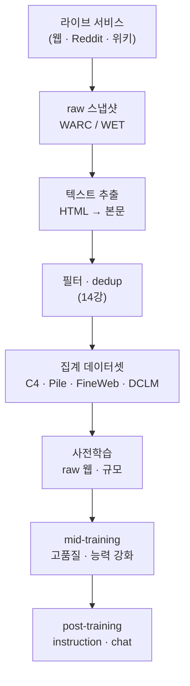

`CS336-LLM-From-Scratch` 시리즈의 13단계입니다. 전체 지도는 [CS336 커리큘럼](/2026/06/26/cs336-llm-from-scratch-curriculum.html)에서 볼 수 있습니다. ([12강 — 평가](/2026/06/26/cs336-lecture-12-evaluation.html)에서 이어집니다.)

유닛 4의 다른 반쪽 — **데이터**로 들어섭니다. 강의(Percy Liang)의 핵심 주장은 하나입니다. **아키텍처보다 데이터가 모델의 성격을 만든다.** 같은 Transformer라도 무엇을 먹였느냐가 모델이 무엇을 아는지, 어떤 말투를 쓰는지, 어디서 헛소리를 하는지를 결정합니다. 그런데 그 데이터는 하늘에서 떨어지지 않습니다 — 살아 있는 웹을 코퍼스로 바꾸는 파이프라인과, 그 위에 드리운 저작권이 오늘의 주제입니다. 흥미로운 점 하나: 아키텍처 논문은 쏟아지는데 **데이터 파이프라인은 하나같이 비밀**입니다. 이유는 두 가지 — 경쟁 우위(좋은 데이터가 곧 좋은 모델)와 저작권 책임(무엇을 긁었는지 밝히면 소송의 표적이 됩니다). 게다가 데이터 작업은 아키텍처와 달리 **사람의 노력에 비례해 확장**됩니다. 우아한 방정식 하나로 끝나지 않고, 도메인마다 사람이 붙어 파이프라인을 손봐야 하는 노동집약적 세계입니다.

<figure class="post-figure post-figure--header">
<svg role="img" aria-label="데이터 추출 파이프라인을 좌에서 우로 흐르는 네 단계 도식. 라이브 웹(Common Crawl)에서 raw 스냅샷(WARC/WET)을 뜨고, HTML을 텍스트로 추출·정제한 뒤, 도메인별 코퍼스와 데이터셋으로 집계된다. 각 단계마다 정보가 줄고 정제가 더해진다." viewBox="0 0 760 280" xmlns="http://www.w3.org/2000/svg">
  <title>데이터 추출 파이프라인 — 라이브 웹 · raw 스냅샷 · 텍스트 추출 · 집계 데이터셋</title>
  <defs>
    <marker id="dataArrow" viewBox="0 0 10 10" refX="8" refY="5" markerWidth="8" markerHeight="8" orient="auto-start-reverse">
      <path d="M0,0 L10,5 L0,10 z" fill="var(--gold)"/>
    </marker>
  </defs>

  <text x="380" y="28" text-anchor="middle" font-family="var(--font-body)" font-size="16" font-weight="700" fill="var(--text-color)">살아 있는 웹 → 학습 코퍼스로 바꾸는 네 단계</text>

  <!-- box 1: 라이브 웹 -->
  <rect x="20" y="54" width="160" height="112" rx="8" fill="currentColor" opacity="0.05"/>
  <rect x="20" y="54" width="160" height="112" rx="8" fill="none" stroke="var(--secondary-color)" stroke-width="2"/>
  <circle cx="100" cy="82" r="15" fill="var(--secondary-color)"/>
  <text x="100" y="87" text-anchor="middle" font-family="var(--font-body)" font-size="15" font-weight="700" fill="var(--bg-panel)">1</text>
  <text x="100" y="118" text-anchor="middle" font-family="var(--font-body)" font-size="13.5" font-weight="700" fill="var(--text-color)">라이브 웹</text>
  <text x="100" y="140" text-anchor="middle" font-family="var(--font-body)" font-size="11.5" fill="var(--text-light)">Common Crawl</text>
  <text x="100" y="156" text-anchor="middle" font-family="var(--font-body)" font-size="11.5" fill="var(--text-light)">seed URL 수억</text>

  <!-- box 2: raw 스냅샷 -->
  <rect x="220" y="54" width="160" height="112" rx="8" fill="currentColor" opacity="0.05"/>
  <rect x="220" y="54" width="160" height="112" rx="8" fill="none" stroke="var(--secondary-color)" stroke-width="2"/>
  <circle cx="300" cy="82" r="15" fill="var(--secondary-color)"/>
  <text x="300" y="87" text-anchor="middle" font-family="var(--font-body)" font-size="15" font-weight="700" fill="var(--bg-panel)">2</text>
  <text x="300" y="118" text-anchor="middle" font-family="var(--font-body)" font-size="13.5" font-weight="700" fill="var(--text-color)">raw 스냅샷</text>
  <text x="300" y="140" text-anchor="middle" font-family="var(--font-body)" font-size="11.5" fill="var(--text-light)">WARC (raw HTML)</text>
  <text x="300" y="156" text-anchor="middle" font-family="var(--font-body)" font-size="11.5" fill="var(--text-light)">WET (텍스트, lossy)</text>

  <!-- box 3: 텍스트 추출 -->
  <rect x="420" y="54" width="160" height="112" rx="8" fill="currentColor" opacity="0.05"/>
  <rect x="420" y="54" width="160" height="112" rx="8" fill="none" stroke="var(--secondary-color)" stroke-width="2"/>
  <circle cx="500" cy="82" r="15" fill="var(--secondary-color)"/>
  <text x="500" y="87" text-anchor="middle" font-family="var(--font-body)" font-size="15" font-weight="700" fill="var(--bg-panel)">3</text>
  <text x="500" y="118" text-anchor="middle" font-family="var(--font-body)" font-size="13.5" font-weight="700" fill="var(--text-color)">텍스트 추출·정제</text>
  <text x="500" y="140" text-anchor="middle" font-family="var(--font-body)" font-size="11.5" fill="var(--text-light)">HTML → 본문</text>
  <text x="500" y="156" text-anchor="middle" font-family="var(--font-body)" font-size="11.5" fill="var(--text-light)">trafilatura 등</text>

  <!-- box 4: 집계 데이터셋 (payoff — accent stroke) -->
  <rect x="620" y="54" width="120" height="112" rx="8" fill="currentColor" opacity="0.05"/>
  <rect x="620" y="54" width="120" height="112" rx="8" fill="none" stroke="var(--accent-color)" stroke-width="2.5"/>
  <circle cx="680" cy="82" r="15" fill="var(--accent-color)"/>
  <text x="680" y="87" text-anchor="middle" font-family="var(--font-body)" font-size="15" font-weight="700" fill="var(--bg-panel)">4</text>
  <text x="680" y="118" text-anchor="middle" font-family="var(--font-body)" font-size="13" font-weight="700" fill="var(--text-color)">코퍼스</text>
  <text x="680" y="140" text-anchor="middle" font-family="var(--font-body)" font-size="11.5" fill="var(--text-light)">도메인별</text>
  <text x="680" y="156" text-anchor="middle" font-family="var(--font-body)" font-size="11.5" fill="var(--text-light)">데이터셋</text>

  <!-- arrows -->
  <line x1="182" y1="110" x2="218" y2="110" stroke="var(--gold)" stroke-width="2.2" marker-end="url(#dataArrow)"/>
  <line x1="382" y1="110" x2="418" y2="110" stroke="var(--gold)" stroke-width="2.2" marker-end="url(#dataArrow)"/>
  <line x1="582" y1="110" x2="618" y2="110" stroke="var(--gold)" stroke-width="2.2" marker-end="url(#dataArrow)"/>

  <!-- bottom caption band -->
  <text x="380" y="206" text-anchor="middle" font-family="var(--font-body)" font-size="12.5" fill="var(--text-light)">단계마다 정보는 줄고(원본 → 텍스트), 정제와 사람의 판단은 더해진다</text>
  <g font-family="var(--font-body)" font-size="11" fill="var(--text-light)" text-anchor="middle">
    <text x="100" y="238">긁는다 (crawl)</text>
    <text x="300" y="238">저장한다 (archive)</text>
    <text x="500" y="238">거른다 (extract)</text>
    <text x="680" y="238">모은다 (curate)</text>
  </g>
</svg>
<figcaption>학습 코퍼스는 살아 있는 웹을 네 단계로 가공한 결과다 — 긁고(Common Crawl), 저장하고(WARC/WET), 본문을 뽑고(HTML→텍스트), 도메인별로 모은다. 단계마다 정보는 줄지만 사람이 설계한 정제가 더해져, 어떤 선택을 했느냐가 모델의 성격을 만든다.</figcaption>
</figure>

## 한눈에 보기

데이터 이야기는 두 개의 흐름으로 정리됩니다. 하나는 **하나의 웹 페이지가 학습 토큰이 되기까지**의 파이프라인이고, 다른 하나는 그렇게 만든 데이터가 쓰이는 **세 개의 학습 단계**입니다. 오늘(13강)은 왼쪽 절반 — 무엇을 어떻게 모으느냐 — 에 집중하고, 필터·중복 제거·믹스는 14강으로 넘깁니다.

파이프라인의 앞쪽(수집·추출)은 오늘의 몫이고, 뒤쪽 세 단계(사전학습 → mid-training → post-training)는 데이터가 **점점 좁고 귀해지는** 방향을 보여줍니다 — raw 웹 수조 토큰에서 시작해, 능력을 다듬는 고품질 데이터를 거쳐, 사람이 붙은 소량의 대화 데이터로 끝납니다.

## 데이터가 진짜 원재료

강의가 반복하는 문장은 **"데이터가 모델을 만든다"**입니다. 아키텍처·옵티마이저·스케일링은 유닛 1~3에서 봤듯 상당히 표준화됐지만, 무엇을 먹이느냐는 여전히 각 랩의 가장 큰 차별점입니다. 그런데 바로 그래서 데이터는 **비밀**입니다. 이유는 두 가지가 겹칩니다.

> 데이터 파이프라인이 비밀에 부쳐지는 이유 — **경쟁 우위**(좋은 데이터 조합이 곧 모델의 해자)와 **저작권 책임**(무엇을 긁었는지 밝히면 소송 위험이 커진다).

그리고 데이터 작업은 아키텍처와 성격이 다릅니다. 아키텍처 개선은 한 번 발견하면 모두가 공짜로 복제하지만, 데이터는 **사람의 노력에 비례해서만** 좋아집니다 — 도메인마다 추출 규칙을 손보고, 품질을 눈으로 확인하고, 잡음을 걷어내는 노동이 끝없이 필요합니다. 우아한 방정식이 없는, 지저분하고 노동집약적인 세계입니다.

그 데이터가 흘러 들어가는 자리는 학습의 **세 단계**로 나뉩니다.

- **사전학습(pre-training)**: raw 웹 수조 토큰으로 언어와 세계의 넓은 밑그림을 그립니다. 규모가 지배하는 단계입니다.
- **mid-training**: 사전학습과 post-training 사이에서 특정 **능력을 강화**합니다 — 긴 컨텍스트, 코드·수학, 특정 태스크 포맷 등. 고품질 데이터가 소량 투입됩니다.
- **post-training**: instruction-following과 chat을 가르칩니다. 규모보다 **품질과 사람의 개입**이 지배합니다.

오늘은 이 세 단계 중 **사전학습의 원재료**, 즉 웹을 어떻게 코퍼스로 바꾸는지에 집중합니다.

## Common Crawl — 웹을 긁는 법

거의 모든 대형 데이터셋의 출발점은 **Common Crawl**입니다. 2007년부터 운영된 비영리 단체로, 웹을 긁어 그 스냅샷을 **무료로 공개**합니다. 웹을 통째로 긁는 일은 개별 랩이 처음부터 하기엔 너무 비싸기 때문에, 사실상 공용 인프라 역할을 합니다.

작동 방식은 대규모 크롤러 그 자체입니다. **Apache Nutch** 기반으로, **수억 개의 seed URL**에서 출발해 링크를 따라가며 페이지를 수집합니다. 무작정 긁는 게 아니라 정책이 있습니다 — 무엇을 방문할지 **선택(selection)**하고, 서버에 부담을 주지 않도록 **politeness**를 지키며 `robots.txt`를 존중하고, 페이지를 주기적으로 **재방문(revisit)**해 갱신합니다. 2008년부터 2025년까지 **약 100개의 crawl**이 쌓였고, 한 번의 크롤은 대략 **100대 규모로 10~12일**이 걸립니다.

핵심은 Common Crawl이 결과물을 **두 가지 포맷**으로 준다는 점입니다. 이 선택이 나중에 데이터 품질을 크게 가릅니다.

- **WARC (Web ARChive)**: raw HTTP 응답 — HTML 원본과 헤더까지 그대로 담습니다. 무겁지만 정보 손실이 없습니다.
- **WET (WARC Encapsulated Text)**: Common Crawl이 HTML에서 텍스트만 뽑아 준 버전. 가볍고 편하지만 **lossy**합니다 — 추출 방식이 고정돼 있어 본문 대신 메뉴·푸터를 남기거나, 정작 필요한 텍스트를 버리기도 합니다.

WARC에서 직접 본문을 뽑으려면 HTML→텍스트 도구가 필요합니다. 대표적으로 **trafilatura, resiliparse, jusText**가 쓰이는데, 각각 본문 경계를 잡는 방식과 남기는 잡음의 양이 다릅니다. 그리고 여기서 놀랍도록 중요한 사실이 나옵니다.

> **변환 방법(WARC에서 직접 재추출 vs 이미 만들어진 WET 사용)이 다운스트림 정확도를 유의하게 바꾼다.** 같은 원본이라도 텍스트를 뽑는 방식이 모델 성능으로 이어진다.

그래서 진지한 데이터셋일수록 편한 WET을 쓰지 않고 **WARC에서 직접 추출**합니다. "어차피 같은 웹 아니냐"는 직관과 달리, 추출 단계는 모델의 성능을 좌우하는 첫 번째 갈림길입니다.

<figure class="post-figure">
<svg role="img" aria-label="같은 웹 페이지가 Common Crawl에서 두 포맷으로 저장되는 갈림길 도식. 왼쪽 WARC는 raw HTTP 응답과 HTML 원본을 그대로 담은 lossless 포맷이고, 오른쪽 WET은 Common Crawl이 미리 뽑아 준 lossy 텍스트다. WARC를 trafilatura로 직접 재추출하면 본문만 남은 깨끗한 텍스트를 얻어 학습에 유리하고, WET을 그대로 쓰면 메뉴·푸터 잡음이 섞여 학습에 불리하다. 추출 방법이 다운스트림 정확도를 유의하게 바꾼다." viewBox="0 0 720 400" xmlns="http://www.w3.org/2000/svg">
  <title>WARC 재추출 vs WET 그대로 — 같은 페이지, 다른 텍스트 품질</title>
  <defs>
    <marker id="warcArrow" viewBox="0 0 10 10" refX="8" refY="5" markerWidth="8" markerHeight="8" orient="auto-start-reverse">
      <path d="M0,0 L10,5 L0,10 z" fill="var(--gold)"/>
    </marker>
  </defs>

  <text x="360" y="28" text-anchor="middle" font-family="var(--font-body)" font-size="16" font-weight="700" fill="var(--text-color)">같은 페이지, 두 갈래 — WARC 재추출 vs WET 그대로</text>

  <!-- source page -->
  <rect x="284" y="44" width="152" height="52" rx="8" fill="currentColor" opacity="0.05"/>
  <rect x="284" y="44" width="152" height="52" rx="8" fill="none" stroke="var(--text-light)" stroke-width="2"/>
  <text x="360" y="68" text-anchor="middle" font-family="var(--font-body)" font-size="13" font-weight="700" fill="var(--text-color)">원본 웹 페이지</text>
  <text x="360" y="86" text-anchor="middle" font-family="var(--font-body)" font-size="11" fill="var(--text-light)">raw HTML · 같은 한 장</text>

  <text x="360" y="114" text-anchor="middle" font-family="var(--font-body)" font-size="11" fill="var(--text-light)">Common Crawl이 두 포맷으로 저장</text>

  <!-- diverge arrows -->
  <line x1="300" y1="96" x2="185" y2="128" stroke="var(--gold)" stroke-width="2.2" marker-end="url(#warcArrow)"/>
  <line x1="420" y1="96" x2="535" y2="128" stroke="var(--gold)" stroke-width="2.2" marker-end="url(#warcArrow)"/>

  <!-- WARC format box (recommended path — accent) -->
  <rect x="56" y="130" width="248" height="82" rx="9" fill="currentColor" opacity="0.05"/>
  <rect x="56" y="130" width="248" height="82" rx="9" fill="none" stroke="var(--accent-color)" stroke-width="2"/>
  <text x="180" y="156" text-anchor="middle" font-family="var(--font-body)" font-size="15" font-weight="700" fill="var(--text-color)">WARC</text>
  <text x="180" y="178" text-anchor="middle" font-family="var(--font-body)" font-size="11.5" fill="var(--text-light)">raw HTTP 응답 · HTML 원본 그대로</text>
  <text x="180" y="196" text-anchor="middle" font-family="var(--font-body)" font-size="11.5" fill="var(--text-light)">lossless — 무겁지만 손실 없음</text>

  <!-- WET format box (lossy path — secondary) -->
  <rect x="416" y="130" width="248" height="82" rx="9" fill="currentColor" opacity="0.05"/>
  <rect x="416" y="130" width="248" height="82" rx="9" fill="none" stroke="var(--secondary-color)" stroke-width="2"/>
  <text x="540" y="156" text-anchor="middle" font-family="var(--font-body)" font-size="15" font-weight="700" fill="var(--text-color)">WET</text>
  <text x="540" y="178" text-anchor="middle" font-family="var(--font-body)" font-size="11.5" fill="var(--text-light)">Common Crawl이 미리 뽑은 plain text</text>
  <text x="540" y="196" text-anchor="middle" font-family="var(--font-body)" font-size="11.5" fill="var(--text-light)">lossy — 가볍지만 본문·잡음 뒤섞임</text>

  <!-- transform arrows -->
  <line x1="180" y1="212" x2="180" y2="268" stroke="var(--gold)" stroke-width="2.2" marker-end="url(#warcArrow)"/>
  <line x1="540" y1="212" x2="540" y2="268" stroke="var(--gold)" stroke-width="2.2" marker-end="url(#warcArrow)"/>

  <!-- transform badges (over arrows, on opaque panel) -->
  <rect x="102" y="228" width="156" height="24" rx="7" fill="var(--bg-panel)" stroke="var(--accent-color)" stroke-width="1.5"/>
  <text x="180" y="244" text-anchor="middle" font-family="var(--font-body)" font-size="11.5" font-weight="700" fill="var(--accent-color)">trafilatura로 재추출</text>
  <rect x="440" y="228" width="200" height="24" rx="7" fill="var(--bg-panel)" stroke="var(--secondary-color)" stroke-width="1.5"/>
  <text x="540" y="244" text-anchor="middle" font-family="var(--font-body)" font-size="11.5" font-weight="700" fill="var(--text-light)">그대로 사용 (재추출 없음)</text>

  <!-- WARC outcome (payoff — accent stroke) -->
  <rect x="56" y="268" width="248" height="88" rx="9" fill="currentColor" opacity="0.05"/>
  <rect x="56" y="268" width="248" height="88" rx="9" fill="none" stroke="var(--accent-color)" stroke-width="2.5"/>
  <text x="180" y="296" text-anchor="middle" font-family="var(--font-body)" font-size="14" font-weight="700" fill="var(--text-color)">깨끗한 본문 텍스트</text>
  <text x="180" y="320" text-anchor="middle" font-family="var(--font-body)" font-size="11.5" fill="var(--text-light)">본문만 남고 메뉴·잡음 제거</text>
  <text x="180" y="342" text-anchor="middle" font-family="var(--font-body)" font-size="12.5" font-weight="700" fill="var(--accent-color)">→ 학습에 유리</text>

  <!-- WET outcome (muted — secondary stroke) -->
  <rect x="416" y="268" width="248" height="88" rx="9" fill="currentColor" opacity="0.05"/>
  <rect x="416" y="268" width="248" height="88" rx="9" fill="none" stroke="var(--secondary-color)" stroke-width="2"/>
  <text x="540" y="296" text-anchor="middle" font-family="var(--font-body)" font-size="14" font-weight="700" fill="var(--text-color)">잡음 섞인 텍스트</text>
  <text x="540" y="320" text-anchor="middle" font-family="var(--font-body)" font-size="11.5" fill="var(--text-light)">메뉴·푸터 남고 본문 누락</text>
  <text x="540" y="342" text-anchor="middle" font-family="var(--font-body)" font-size="12.5" font-weight="700" fill="var(--text-light)">→ 학습에 불리</text>

  <!-- bottom band -->
  <text x="360" y="384" text-anchor="middle" font-family="var(--font-body)" font-size="12.5" fill="var(--text-light)">추출 방법(WARC 재추출 vs WET)이 다운스트림 정확도를 유의하게 바꾼다</text>
</svg>
<figcaption>Common Crawl은 같은 페이지를 WARC(raw HTML, lossless)와 WET(기성 텍스트, lossy) 두 포맷으로 저장한다. WARC에서 trafilatura로 직접 재추출하면 본문만 남은 깨끗한 텍스트를 얻지만, 편한 WET을 그대로 쓰면 메뉴·푸터 잡음이 섞인다 — 추출 방법이 다운스트림 정확도를 가른다.</figcaption>
</figure>

## 사전학습 데이터셋의 계보

Common Crawl이라는 원재료를 두고, 랩들은 저마다의 방식으로 학습 코퍼스를 빚어 왔습니다. 그 흐름을 시간순으로 늘어놓으면 몇 가지 뚜렷한 트렌드가 보입니다. 아래 표는 계보를 요약한 것이고(숫자는 카탈로그의 몫), 그 뒤 문단이 진짜 이야기(트렌드)를 짚습니다.

| 데이터셋 (연도) | 무엇을 · 어떻게 | 규모 / 특징 |
| --- | --- | --- |
| **BERT** (2019) | BooksCorpus(7K 자가출판 도서) + Wikipedia | 985M 단어 — BooksCorpus는 TOS 문제로 나중에 내려감 |
| **GPT-2 / WebText** (2019) | Reddit에서 karma ≥3인 링크만(품질 프록시) | 8M 페이지 · 40GB · OpenWebText로 오픈 복제 |
| **CCNet** (2019) | dedup + fastText 언어식별 + KenLM 5-gram 품질 필터 | 필터링하면 CC가 Wikipedia보다 나음을 입증 |
| **C4** (T5, 2019) | 2019-04 CC + 수작업 휴리스틱 | 806GB / 156B — 문장부호로 끝나는 줄만·"bad words"·lorem ipsum 제거·en p≥0.99 |
| **GPT-3** (2020) | CC + WebText2 + Books1/2 + Wikipedia | 570GB / 400B — 품질 분류기 + fuzzy dedup |
| **The Pile** (2021) | 22개 도메인 큐레이션 | 825GB(~275B) — Pile-CC(jusText)·PubMed·arXiv·StackExchange·GitHub·**Books3** |
| **Gopher / MassiveText** (2021) | 대규모 멀티소스 | 10.5TB(300B=12%만 학습) · SafeSearch 독성 필터 |
| **LLaMA** (2023) | 공개 소스 조합 | 1.2T — 복제 RedPajama, SlimPajama(627B, MinHashLSH), RedPajama-v2(30T) |
| **RefinedWeb** (2023) | **웹만으로 충분** · trafilatura · Gopher 규칙 · MinHash | 5T 중 600B 공개 — ML 필터 없이 규칙만으로 |
| **FineWeb** (2024) | 95개 dump · p(en)>0.65 · MinHash · PII 익명화 | **15T** — 공개 대규모 웹 코퍼스의 기준점 |
| **Dolma** (2024) | 완전 오픈(데이터+도구+레시피) | 3T |
| **DCLM** (2024) | 240T pool → 학습된 분류기로 필터 | **3.8T** — positive: OpenHermes·ELI5 / negative: RefinedWeb |
| **Nemotron-CC** (2024) | 분류기 앙상블 + 합성 리프레이징 | 6.3T — 토큰을 합성으로 확장 |

표를 통째로 외울 필요는 없습니다. 여기서 뽑아낼 **네 개의 트렌드**가 진짜 이야기입니다.

첫째, **웹만으로도 충분하다.** 초기에는 좋은 데이터의 상징이 Wikipedia·책이었고, GPT-3·The Pile은 웹에 이런 "고급 소스"를 섞었습니다. 그런데 **RefinedWeb**(2023)이 논쟁을 뒤집었습니다 — 잘 필터링한 웹 데이터만으로도 큐레이션된 코퍼스에 필적하거나 능가한다는 것입니다. 심지어 RefinedWeb은 ML 분류기 없이 **Gopher 스타일의 규칙 기반 필터**만 썼습니다. 웹의 규모가 곧 힘이라는 관점의 승리였습니다.

둘째, **학습된 분류기가 손으로 짠 휴리스틱을 이긴다.** C4가 대표하던 시대의 필터는 "문장부호로 끝나는 줄만 남겨라", "bad words가 있으면 버려라" 같은 사람이 짠 규칙이었습니다. **DCLM**(2024)은 방향을 바꿨습니다 — 240T라는 거대한 pool에서, **좋은 예시(OpenHermes·ELI5 같은 고품질 텍스트)를 positive, RefinedWeb을 negative로 삼아 학습한 분류기**로 걸러 3.8T를 뽑았습니다. 무엇이 "좋은 텍스트"인지를 사람이 규칙으로 적는 대신 모델에게 배우게 한 것입니다.

셋째, **합성 리프레이징으로 토큰을 늘린다.** 웹의 양은 유한하고, 진짜 좋은 텍스트는 더 희소합니다. **Nemotron-CC**(2024)는 분류기 앙상블로 거른 뒤, 원본 텍스트를 **다시 쓰게(rephrase)** 해서 사실상 데이터를 증강했습니다 — 6.3T 규모의 상당 부분이 합성입니다. 데이터가 병목이 되는 시대에 자연히 나온 전략입니다.

넷째, **규모가 폭증한다.** BERT의 985M 단어에서 시작해 C4 156B, LLaMA 1.2T를 지나, FineWeb 15T에 이르렀습니다. 강의가 언급하는 최신 지점은 훨씬 더 큽니다 — Llama-3가 15T, Qwen3가 36T 토큰을 씁니다. 데이터 파이프라인이 왜 그렇게 노동집약적이고 비밀스러운지, 이 숫자들이 설명합니다.

그리고 이 계보에는 어두운 면도 있습니다. **Books3**(The Pile의 일부)와 **BooksCorpus**(BERT)는 저작권 문제로 내려갔습니다 — Books3은 그림자 도서관에서 온 것이었고, BooksCorpus는 TOS 위반이었습니다. 데이터의 계보는 곧 저작권의 계보이기도 합니다. 자연스럽게 다음 주제로 넘어갑니다.

## 저작권과 공정 이용(fair use)

데이터 파이프라인이 비밀인 두 번째 이유가 여기 있습니다. 웹을 긁는 순간 저작권과 정면으로 부딪히기 때문입니다. 출발점은 불편한 사실 하나입니다.

> **인터넷 콘텐츠의 대부분은 저작권이 있다.** 미국법(1976 개정) 기준 저작물은 "고정된(fixed)" 순간 자동으로 보호받는다 — 등록도, 저작권 표시도 필요 없고, 문턱은 극히 낮다.

블로그 글 한 편, 트윗 하나, 포럼 댓글까지 원칙적으로 저작권의 대상입니다. 보호 기간은 저자 사후 오랫동안 이어지고(창작 후 약 75년 뒤에야 public domain으로 풀립니다), 그래서 "오래된 것만 골라 쓰면 된다"는 해법도 현실적이지 않습니다. 그렇다면 웹으로 모델을 학습시키는 일은 어떻게 합법이 될 수 있을까요. 두 개의 경로가 있습니다.

**(1) 라이선스.** 저작권자가 사용을 명시적으로 허락한 경우입니다. **Creative Commons** 라이선스가 대표적이고(Wikipedia가 그 예), 상업적으로는 직접 계약을 맺습니다 — Google–Reddit, OpenAI–Shutterstock, OpenAI–StackExchange 같은 데이터 라이선싱 딜이 그렇게 등장했습니다. 깨끗하지만 비싸고, 웹 전체를 덮을 수는 없습니다.

**(2) 공정 이용(fair use).** 라이선스 없이도 저작물을 쓸 수 있게 해 주는 미국법의 예외입니다. 법원은 네 가지 요소를 종합해 판단합니다.

- **사용의 목적과 성격** — 특히 **변형적(transformative)**인가. 원본을 그대로 재현하는 게 아니라 새로운 목적으로 바꿔 쓰는가.
- **저작물의 성격** — 사실적(factual) 저작물은 창작적(creative) 저작물보다 폭넓게 허용된다.
- **사용한 양** — 전체를 통째로 썼는가, 필요한 만큼만 썼는가.
- **시장에 미치는 영향** — 원저작물의 시장을 대체·잠식하는가.

<figure class="post-figure">
<svg role="img" aria-label="공정 이용을 판단하는 네 요소를 저울에 올린 도식. 목적과 변형성, 저작물의 성격, 사용한 양, 시장 영향의 네 요소가 함께 저울질된다. ML 학습은 변형적이라는 점에서 공정 이용에 유리하지만 시장 영향이라는 점에서 불리해, 저울이 어느 쪽으로도 확정되지 않은 미해결 긴장 상태다." viewBox="0 0 720 340" xmlns="http://www.w3.org/2000/svg">
  <title>공정 이용의 4요소 — 변형성은 유리, 시장 영향은 불리</title>

  <text x="360" y="30" text-anchor="middle" font-family="var(--font-body)" font-size="16" font-weight="700" fill="var(--text-color)">공정 이용 = 네 요소를 함께 저울질</text>

  <!-- four factor chips -->
  <g font-family="var(--font-body)">
    <!-- factor 1 -->
    <rect x="24" y="56" width="152" height="70" rx="9" fill="currentColor" opacity="0.05"/>
    <rect x="24" y="56" width="152" height="70" rx="9" fill="none" stroke="var(--accent-color)" stroke-width="2"/>
    <text x="100" y="82" text-anchor="middle" font-size="13" font-weight="700" fill="var(--text-color)">① 목적·변형성</text>
    <text x="100" y="104" text-anchor="middle" font-size="11" fill="var(--accent-color)">transformative?</text>
    <text x="100" y="119" text-anchor="middle" font-size="10.5" fill="var(--text-light)">학습에 유리</text>

    <!-- factor 2 -->
    <rect x="192" y="56" width="152" height="70" rx="9" fill="currentColor" opacity="0.05"/>
    <rect x="192" y="56" width="152" height="70" rx="9" fill="none" stroke="var(--secondary-color)" stroke-width="2"/>
    <text x="268" y="82" text-anchor="middle" font-size="13" font-weight="700" fill="var(--text-color)">② 저작물 성격</text>
    <text x="268" y="104" text-anchor="middle" font-size="11" fill="var(--text-light)">사실 vs 창작</text>
    <text x="268" y="119" text-anchor="middle" font-size="10.5" fill="var(--text-light)">사실이면 유리</text>

    <!-- factor 3 -->
    <rect x="360" y="56" width="152" height="70" rx="9" fill="currentColor" opacity="0.05"/>
    <rect x="360" y="56" width="152" height="70" rx="9" fill="none" stroke="var(--secondary-color)" stroke-width="2"/>
    <text x="436" y="82" text-anchor="middle" font-size="13" font-weight="700" fill="var(--text-color)">③ 사용한 양</text>
    <text x="436" y="104" text-anchor="middle" font-size="11" fill="var(--text-light)">일부 vs 전체</text>
    <text x="436" y="119" text-anchor="middle" font-size="10.5" fill="var(--text-light)">적을수록 유리</text>

    <!-- factor 4 -->
    <rect x="528" y="56" width="168" height="70" rx="9" fill="currentColor" opacity="0.05"/>
    <rect x="528" y="56" width="168" height="70" rx="9" fill="none" stroke="var(--accent-color)" stroke-width="2"/>
    <text x="612" y="82" text-anchor="middle" font-size="13" font-weight="700" fill="var(--text-color)">④ 시장 영향</text>
    <text x="612" y="104" text-anchor="middle" font-size="11" fill="var(--accent-color)">작가·아티스트</text>
    <text x="612" y="119" text-anchor="middle" font-size="10.5" fill="var(--text-light)">학습에 불리</text>
  </g>

  <!-- balance beam -->
  <line x1="130" y1="196" x2="590" y2="196" stroke="currentColor" stroke-width="3" stroke-linecap="round"/>
  <circle cx="360" cy="196" r="6" fill="var(--gold)"/>
  <path d="M 360 196 L 344 240 L 376 240 Z" fill="none" stroke="currentColor" stroke-width="2"/>

  <!-- left pan: transformative (favors) -->
  <line x1="180" y1="196" x2="180" y2="234" stroke="currentColor" stroke-width="1.5"/>
  <path d="M 140 234 Q 180 268 220 234 Z" fill="var(--accent-color)" opacity="0.12"/>
  <path d="M 140 234 Q 180 268 220 234" fill="none" stroke="var(--accent-color)" stroke-width="2"/>
  <text x="180" y="292" text-anchor="middle" font-family="var(--font-body)" font-size="12.5" font-weight="700" fill="var(--accent-color)">변형적 → 유리</text>
  <text x="180" y="310" text-anchor="middle" font-family="var(--font-body)" font-size="11" fill="var(--text-light)">새로운 목적으로 사용</text>

  <!-- right pan: market harm (against) -->
  <line x1="540" y1="196" x2="540" y2="234" stroke="currentColor" stroke-width="1.5"/>
  <path d="M 500 234 Q 540 268 580 234 Z" fill="var(--accent-color)" opacity="0.12"/>
  <path d="M 500 234 Q 540 268 580 234" fill="none" stroke="var(--accent-color)" stroke-width="2"/>
  <text x="540" y="292" text-anchor="middle" font-family="var(--font-body)" font-size="12.5" font-weight="700" fill="var(--accent-color)">시장 영향 → 불리</text>
  <text x="540" y="310" text-anchor="middle" font-family="var(--font-body)" font-size="11" fill="var(--text-light)">실제 창작자에 손해</text>
</svg>
<figcaption>공정 이용은 네 요소를 함께 저울질한다. ML 학습은 원본을 새로운 목적으로 바꾼다는 점에서 "변형적"이라 유리하지만, 학습된 모델이 작가·아티스트의 시장을 실제로 잠식한다는 점에서 불리하다 — 저울이 어느 쪽으로도 확정되지 않은 미해결 긴장이다.</figcaption>
</figure>

이 프레임을 ML 학습에 대면, 곧바로 긴장이 드러납니다.

> **ML 학습은 변형적이지만(모델은 원본을 재현하려는 게 아니다) 시장에는 실제로 영향을 준다.** 학습된 모델이 작가·아티스트의 일감을 대체하는 순간, 4요소는 서로 반대 방향을 가리킨다 — 아직 정리되지 않은 법적 긴장이다.

한쪽 극단에는 **그림자 도서관(shadow libraries)**이 있습니다 — LibGen, Books3, Sci-Hub, Anna's Archive 같은 곳은 저작권을 아예 무시하고 책·논문을 공유합니다. Books3이 The Pile에서 내려간 것도 이 때문입니다. 이들은 데이터의 보고이지만 명백한 침해입니다.

마지막으로 잊기 쉬운 층이 하나 더 있습니다 — **이용약관(TOS)은 저작권·공정 이용과 별개로 작동하며, 종종 그것을 덮어씁니다.** 예컨대 어떤 YouTube 영상이 공정 이용 대상이더라도, YouTube의 TOS가 다운로드를 금지한다면 그걸 긁는 것은 계약 위반이 됩니다. 저작권상 괜찮은 것과 계약상 허용되는 것은 다른 문제입니다.

## 데이터의 그다음 — mid/post-training 예고

오늘 본 것은 **사전학습**의 원재료입니다. 나머지 두 단계는 14·15강으로 이어지지만, 다리 삼아 짧게 예고합니다.

**mid-training**은 능력을 확장하는 단계입니다. 대표적으로 **긴 컨텍스트**가 여기서 붙습니다 — LongLoRA로 Llama-2를 4K에서 100K 토큰까지 늘리고, DeepSeek v3는 128K, Gemini 1.5 Pro는 무려 1.5M 토큰 컨텍스트를 지원합니다. 또한 특정 태스크를 잘하도록 **태스크 데이터**를 투입합니다 — Super-NaturalInstructions, Flan 같은 대규모 태스크 모음이 그 예입니다.

**post-training**은 모델에게 지시를 따르고 대화하는 법을 가르칩니다. 여기서 데이터의 성격이 극적으로 바뀝니다 — **규모보다 품질**이 지배합니다. 초기에는 자동 생성으로 규모를 키웠습니다: **Alpaca**는 self-instruct로 52K개 지시를 합성했고, **Vicuna**는 ShareGPT의 실제 대화를 썼습니다. 그런데 강의가 강조하는 대비가 있습니다.

> **Llama-2는 벤더가 손으로 주석한 27,540개 예제가, 수백만 개의 오픈 예제보다 나았다.** post-training에서는 규모보다 품질이 이긴다.

3만 개도 안 되는 고품질 사람 데이터가 수백만 개의 자동 생성 데이터를 능가한 이 결과는, 데이터가 "많이"에서 "잘"로 넘어가는 지점을 상징합니다.

## 실전 노트

- **WET을 믿지 말라**: 편하다고 Common Crawl의 기성 텍스트를 쓰면 잡음이 섞여 성능이 깎인다. 진지한 코퍼스는 WARC에서 trafilatura·resiliparse 등으로 **직접 재추출**한다 — 이 한 단계가 다운스트림 정확도를 유의하게 바꾼다.
- **웹만으로 충분하다**: RefinedWeb 이후, 잘 필터링한 웹은 큐레이션된 "고급 소스"에 필적한다. Wikipedia·책에 집착하기보다 웹 필터링에 투자하는 편이 규모 면에서 유리하다.
- **필터는 규칙에서 학습된 분류기로**: C4식 수작업 휴리스틱보다 DCLM식 학습 분류기(좋은 예시 positive, 웹 negative)가 이긴다. "좋은 텍스트"를 규칙으로 적지 말고 모델에게 배우게 하라.
- **데이터가 병목이면 합성으로 늘린다**: Nemotron-CC의 리프레이징처럼, 유한한 웹을 다시 써서 토큰을 확장하는 전략이 규모 경쟁(Llama-3 15T, Qwen3 36T) 속에서 자리를 잡았다.
- **저작권을 먼저 따져라**: 인터넷 대부분은 저작권이 있다. 라이선스(Creative Commons·상업 계약)이거나 공정 이용(4요소)이라야 한다. 그림자 도서관은 침해이고, **TOS는 공정 이용과 별개로 다운로드 자체를 막을 수 있다**.
- **post-training은 규모보다 품질**: Llama-2의 27,540개 사람 주석 예제가 수백만 오픈 예제를 이겼다. 사전학습의 "많이"와 정반대의 감각이 필요하다.

## 요약

- **데이터가 모델을 만든다**: 아키텍처보다 데이터가 성격을 결정하며, 그래서 파이프라인은 비밀(경쟁 우위 + 저작권 책임)이고 사람 노력에 비례해 확장된다. 사전학습 → mid-training → post-training의 세 단계로 쓰인다.
- **Common Crawl**: 2007년부터의 비영리 웹 크롤(Apache Nutch, seed URL 수억, ~100 crawls). **WARC**(raw HTML)와 **WET**(기성 텍스트, lossy) 두 포맷 — 추출 방법이 성능을 가르므로 WARC 직접 재추출이 정석.
- **데이터셋 계보의 네 트렌드**: (1) 웹만으로 충분(RefinedWeb), (2) 학습된 분류기가 휴리스틱을 이김(DCLM), (3) 합성 리프레이징으로 토큰 확장(Nemotron-CC), (4) 규모 폭증(C4 156B → FineWeb 15T → Qwen3 36T).
- **저작권**: 인터넷 대부분은 저작권 대상(1976 "fixed" 기준). 합법 경로는 라이선스와 공정 이용(4요소) 둘뿐 — ML 학습은 변형적이나 시장에 실제 영향을 줘 미해결 긴장이고, TOS가 이를 덮어쓸 수 있다.
- **다음 두 단계**: mid-training은 능력 확장(긴 컨텍스트·태스크 데이터), post-training은 instruction·chat이며 규모보다 품질(Llama-2의 27,540 사람 주석 > 수백만 오픈 예제).

유닛 4의 데이터 반쪽 중 "무엇을 모으나"를 봤습니다. 다음은 "어떻게 거르나" — 필터링·중복 제거·데이터 믹스입니다.

### 다음 학습 (Next Learning)

- **14단계: 데이터 (2) — 필터링·중복 제거·믹스** — [CS336 14강 — 데이터 (2)](/2026/06/26/cs336-lecture-14-data-2-filtering-dedup.html)
- [CS336 12강 — 평가](/2026/06/26/cs336-lecture-12-evaluation.html) — 직전 단계
- [CS336 커리큘럼](/2026/06/26/cs336-llm-from-scratch-curriculum.html) — 전체 17단계 지도
